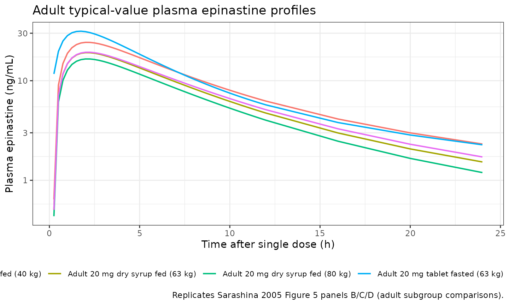
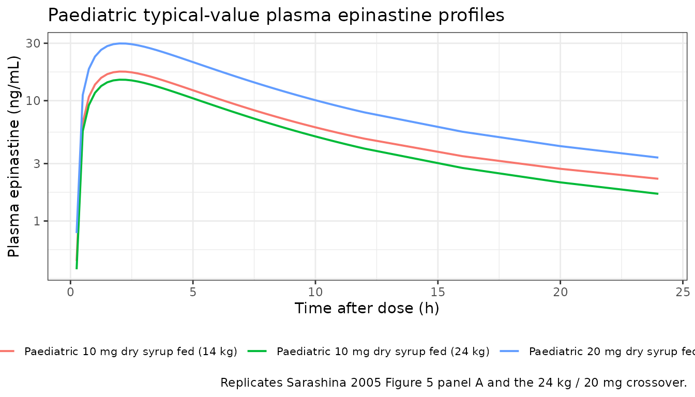
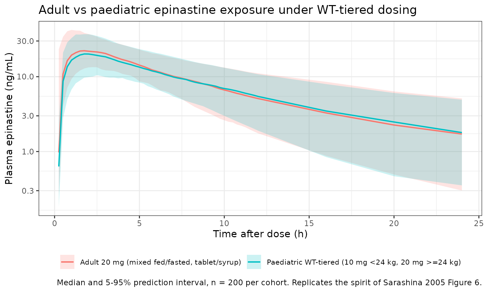

# Epinastine (Sarashina 2005)

## Model and source

- Citation: Sarashina A, Tatami S, Yamamura N, Tsuda Y, Igarashi T.
  Population pharmacokinetics of epinastine, a histamine H1 receptor
  antagonist, in adults and children. Br J Clin Pharmacol.
  2005;59(1):43-53. <doi:10.1111/j.1365-2125.2005.02250.x>
- Description: Two-compartment population PK model with first-order
  absorption for oral epinastine in healthy adults and paediatric atopic
  dermatitis patients (Sarashina 2005), with linear-in-WT CL/F and V1/F
  plus food-status and formulation covariate effects
- Article: <https://doi.org/10.1111/j.1365-2125.2005.02250.x>

Epinastine is a non-sedating histamine H1 receptor antagonist used for
allergic rhinitis and atopic dermatitis. Sarashina 2005 pooled 1510
plasma concentration observations from 62 healthy adult volunteers and
62 paediatric atopic dermatitis patients (six clinical trials) and
estimated a two-compartment population PK model with first-order
absorption. Body weight, food status (fed/fasted), and formulation
(tablet/dry syrup) were retained as covariates; age was screened but did
not enter the final model.

## Population

The pooled cohort comprises 124 subjects (62 healthy adult male
volunteers and 62 paediatric atopic dermatitis patients, of whom 38 male
and 24 female), all Japanese, drawn from six clinical trials conducted
in Japan (Sarashina 2005 Table 1). The adult subjects were aged 20-26
years (mean 22.3 +/- 1.7) and weighed 50-82 kg (mean 63.0 +/- 6.9); the
paediatric subjects were 2-15 years old (mean 10.2 +/- 3.8) and weighed
14.1-68 kg (mean 36.9 +/- 15.5). Adults received 10, 20, or 40 mg
epinastine as tablet or dry syrup in either the fasted or fed state
across five trials (bioequivalence, dose-ranging, multiple dose,
chronopharmacology, food effect). Paediatric patients received 10 mg (if
14 kg to \<24 kg) or 20 mg (if 24 kg or more) once daily as dry syrup
for 12 weeks, predominantly non-fasted, with three trough samples per
patient drawn at weeks 2-6, 6-10, and 10-14 (Sarashina 2005 Table 2).

The same demographics are available programmatically via
`readModelDb("Sarashina_2005_epinastine")$population`.

## Source trace

Per-parameter origin (also recorded as in-file comments next to each
`ini()` entry of
`inst/modeldb/specificDrugs/Sarashina_2005_epinastine.R`). The paper
uses a linear-in-WT covariate model on CL/F and V1/F, reproduced here in
the algebraically equivalent multiplicative form
`exp(lcl) * (1 + e_wt_cl * WT)`. Categorical covariates (food,
formulation) are applied as power-style ratios on the indicator.

| Equation / parameter | Value | Source location |
|----|----|----|
| `lcl` = `log(19.1)` | CL/F intercept (theta1) 19.1 L/h | Table 4, theta1 |
| `lvc` = `log(174)` | V1/F intercept (theta2) 174 L | Table 4, theta2 |
| `lq` = `log(34.4)` | Q/F (theta3) 34.4 L/h | Table 4, theta3 |
| `lvp` = `log(452)` | V2/F (theta4) 452 L | Table 4, theta4 |
| `lka` = `log(1.18)` | Ka (theta5) 1.18 1/h | Table 4, theta5 |
| `e_wt_cl` = 0.0421 | per-kg fractional slope on CL/F (theta10 / theta1 = 0.805 / 19.1) | Table 4, theta10 |
| `e_wt_vc` = 0.0227 | per-kg fractional slope on V1/F (theta11 / theta2 = 3.95 / 174) | Table 4, theta11 |
| `e_fed_cl` = 1.41 | fed/fasted ratio on CL/F (theta6) | Table 4, theta6 |
| `e_fed_vc` = 1.75 | fed/fasted ratio on V1/F (theta7) | Table 4, theta7 |
| `e_fed_tlag` = 0.234 h | fed-state absorption lag (theta8, additive) | Table 4, theta8 |
| `e_form_syrup_cl` = 1.06 | dry-syrup/tablet ratio on CL/F (theta9) | Table 4, theta9 |
| `etalcl` ~ 0.101 | IIV CL/F (omega^2; ~31.8% CV per Table 5) | Table 5 |
| `etalvc` ~ 0.107 | IIV V1/F (omega^2; ~32.7% CV) | Table 5 |
| `etalq` ~ 0.226 | IIV Q/F (omega^2; ~47.5% CV) | Table 5 |
| `etalvp` ~ 1.43 | IIV V2/F (omega^2; ~119.6% CV) | Table 5 |
| `etalka` ~ 0.323 | IIV Ka (omega^2; ~56.8% CV) | Table 5 |
| `propSd` = 0.279 | proportional residual SD (27.9%) | Table 4 |
| `addSd` = 0.425 ng/mL | additive residual SD | Table 4 |
| `d/dt(depot)`, `d/dt(central)`, `d/dt(peripheral1)` | n/a | Methods Step 1 (two-compartment + first-order absorption) |
| `alag(depot) <- e_fed_tlag * FED` | n/a | Table 4 (FOODALAG = theta8 if fed, 0 if fasted) |
| `Cc <- 1000 * central / vc` | n/a | Paper reports ng/mL; dose mg / volume L -\> mg/L = ug/mL, x1000 -\> ng/mL |

## Covariate column naming

| Source column | Canonical column | Notes |
|----|----|----|
| WT (kg) | `WT` | Time-fixed body weight; enters CL/F and V1/F linearly. |
| Food status (fed/fasted) | `FED` | 1 = fed at dosing, 0 = fasted. Per-record covariate. |
| Formulation (tablet/dry syrup) | `FORM_SYRUP` | 1 = dry syrup, 0 = tablet (reference). |

All three canonical column names are already registered in
`inst/references/covariate-columns.md`; no new entries are required.

## Virtual cohort

Original observed data are not publicly available. The cohort below
reconstructs the four panels of Figure 5 (typical-value plasma profiles
per subject subgroup) and the adult-vs-paediatric exposure comparison of
Figure 6.

``` r

set.seed(2026L)

week <- 7  # days, not used here but kept for clarity

# Each row of `cohort_spec` defines one steady-state typical-value
# subject. WT is fixed per row (no IIV on weight - it is a covariate),
# while FED and FORM_SYRUP toggle the per-record food / formulation
# state.
cohort_spec <- tibble::tribble(
  ~cohort,                                ~dose_mg, ~WT, ~FED, ~FORM_SYRUP,
  "Adult 20 mg tablet fasted (63 kg)",         20,   63,   0L,         0L,
  "Adult 20 mg tablet fed (63 kg)",            20,   63,   1L,         0L,
  "Adult 20 mg dry syrup fed (63 kg)",         20,   63,   1L,         1L,
  "Adult 20 mg dry syrup fed (40 kg)",         20,   40,   1L,         1L,
  "Adult 20 mg dry syrup fed (80 kg)",         20,   80,   1L,         1L,
  "Paediatric 10 mg dry syrup fed (14 kg)",    10,   14,   1L,         1L,
  "Paediatric 10 mg dry syrup fed (24 kg)",    10,   24,   1L,         1L,
  "Paediatric 20 mg dry syrup fed (24 kg)",    20,   24,   1L,         1L
)

obs_grid <- c(0, 0.25, 0.5, seq(0.75, 12, by = 0.25), 16, 20, 24)

cohort_spec$id <- seq_len(nrow(cohort_spec))

dose_rows_typ <- cohort_spec |>
  dplyr::transmute(id, cohort, WT, FED, FORM_SYRUP,
                   time = 0, amt = dose_mg, evid = 1L,
                   cmt = "depot")

obs_rows_typ <- cohort_spec |>
  tidyr::crossing(time = obs_grid) |>
  dplyr::transmute(id, cohort, WT, FED, FORM_SYRUP,
                   time, amt = 0, evid = 0L,
                   cmt = NA_character_)

events_typical <- dplyr::bind_rows(dose_rows_typ, obs_rows_typ) |>
  dplyr::arrange(id, time, dplyr::desc(evid))

stopifnot(!anyDuplicated(unique(events_typical[, c("id", "time", "evid")])))
```

## Simulation

For the per-subgroup typical-value figures we zero out the random
effects
([`rxode2::zeroRe()`](https://nlmixr2.github.io/rxode2/reference/zeroRe.html))
so each line is the deterministic typical-value trajectory for its
covariate pattern.

``` r

mod <- rxode2::rxode2(readModelDb("Sarashina_2005_epinastine"))
#> ℹ parameter labels from comments will be replaced by 'label()'
mod_typical <- mod |> rxode2::zeroRe()

sim_typical <- rxode2::rxSolve(
  mod_typical,
  events = events_typical,
  keep   = c("cohort", "WT", "FED", "FORM_SYRUP")
) |>
  as.data.frame()
#> ℹ omega/sigma items treated as zero: 'etalcl', 'etalvc', 'etalq', 'etalvp', 'etalka'
#> Warning: multi-subject simulation without without 'omega'
```

## Replicate Figure 5: typical PK profiles by covariate subgroup

Sarashina 2005 Figure 5 shows simulated typical plasma profiles for four
subgroup comparisons:

- Panel A: 10 mg dry syrup, fed state, 14 vs 24 kg
- Panel B: 20 mg dry syrup, fed state, 40 / 60 / 80 kg
- Panel C: 20 mg dry syrup, fasted vs fed, 60 kg (not separately
  simulated here; the fasted-vs-fed contrast at 63 kg adult appears
  among the adult cohorts below)
- Panel D: 20 mg tablet vs dry syrup, fed state, 60 kg

``` r

adult_cohorts <- c(
  "Adult 20 mg tablet fasted (63 kg)",
  "Adult 20 mg tablet fed (63 kg)",
  "Adult 20 mg dry syrup fed (63 kg)",
  "Adult 20 mg dry syrup fed (40 kg)",
  "Adult 20 mg dry syrup fed (80 kg)"
)
sim_typical |>
  dplyr::filter(cohort %in% adult_cohorts, time > 0) |>
  ggplot(aes(time, Cc, colour = cohort)) +
  geom_line(linewidth = 0.7) +
  scale_y_log10() +
  labs(
    x = "Time after single dose (h)",
    y = "Plasma epinastine (ng/mL)",
    colour = NULL,
    title = "Adult typical-value plasma epinastine profiles",
    caption = "Replicates Sarashina 2005 Figure 5 panels B/C/D (adult subgroup comparisons)."
  ) +
  theme_bw() +
  theme(legend.position = "bottom",
        legend.text = element_text(size = 8))
```



``` r

paed_cohorts <- c(
  "Paediatric 10 mg dry syrup fed (14 kg)",
  "Paediatric 10 mg dry syrup fed (24 kg)",
  "Paediatric 20 mg dry syrup fed (24 kg)"
)
sim_typical |>
  dplyr::filter(cohort %in% paed_cohorts, time > 0) |>
  ggplot(aes(time, Cc, colour = cohort)) +
  geom_line(linewidth = 0.7) +
  scale_y_log10() +
  labs(
    x = "Time after dose (h)",
    y = "Plasma epinastine (ng/mL)",
    colour = NULL,
    title = "Paediatric typical-value plasma epinastine profiles",
    caption = "Replicates Sarashina 2005 Figure 5 panel A and the 24 kg / 20 mg crossover."
  ) +
  theme_bw() +
  theme(legend.position = "bottom",
        legend.text = element_text(size = 8))
```



The traces show the expected qualitative patterns: heavier subjects
(higher CL/F and V1/F) have lower Cmax and lower AUC; the fed state
shifts Cmax later and reduces both Cmax and AUC; dry syrup gives
slightly lower exposure than tablet (theta9 = 1.06 multiplier on CL/F);
a 14 kg child given 10 mg has comparable exposure to a 24 kg child given
the WT-band-doubled 20 mg dose (the body-weight-tiered paediatric dosing
strategy the paper recommends).

## Replicate Figure 6: adult-vs-paediatric exposure under WT-tiered paediatric dosing

Sarashina 2005 Figure 6 compares individual exposures (Cmax and AUC)
between adults receiving 20 mg and children dosed by weight band (10 mg
if 14 kg to \<24 kg, 20 mg if 24 kg or more). The cohorts below sample
both populations stochastically using IIV from the final model so the
per-cohort distributions can be plotted alongside the published means.

``` r

n_per_adult_cell <- 200L
n_per_paed_cell  <- 200L

# Adult cohort: WT mean 63 kg, SD 6.9 kg (Table 2; bounded to the
# observed 50-82 kg range). Mixed fed / fasted reflecting the 607
# fasting vs 724 non-fasting observation count (Table 2);
# approximated as ~55% non-fasting at dosing. Tablet vs dry syrup
# follows the 62/18 subject split (~77% tablet).
adult_cohort <- tibble::tibble(
  id         = seq_len(n_per_adult_cell),
  WT         = pmin(pmax(rnorm(n_per_adult_cell, 63, 6.9), 50), 82),
  FED        = rbinom(n_per_adult_cell, 1, 0.55),
  FORM_SYRUP = rbinom(n_per_adult_cell, 1, 0.225),
  dose_mg    = 20,
  cohort     = "Adult 20 mg (mixed fed/fasted, tablet/syrup)"
)

# Paediatric cohort: weight uniformly sampled across the observed
# 14.1-68 kg range; per-subject dose follows the WT-tier rule. All
# paediatric subjects received dry syrup; most observations are
# non-fasting (10 vs 169), approximated as ~95% fed.
paed_cohort <- tibble::tibble(
  id         = n_per_adult_cell + seq_len(n_per_paed_cell),
  WT         = runif(n_per_paed_cell, 14.1, 68),
  FED        = rbinom(n_per_paed_cell, 1, 0.95),
  FORM_SYRUP = 1L
) |>
  dplyr::mutate(
    dose_mg = ifelse(WT < 24, 10, 20),
    cohort  = "Paediatric WT-tiered (10 mg <24 kg, 20 mg >=24 kg)"
  )

stoch_cohort <- dplyr::bind_rows(adult_cohort, paed_cohort)

dose_rows <- stoch_cohort |>
  dplyr::transmute(id, time = 0, amt = dose_mg, evid = 1L,
                   cmt = "depot",
                   WT, FED, FORM_SYRUP, cohort)

obs_rows <- stoch_cohort |>
  tidyr::crossing(time = obs_grid) |>
  dplyr::transmute(id, time, amt = 0, evid = 0L,
                   cmt = NA_character_,
                   WT, FED, FORM_SYRUP, cohort)

events_stoch <- dplyr::bind_rows(dose_rows, obs_rows) |>
  dplyr::arrange(id, time, dplyr::desc(evid))

stopifnot(!anyDuplicated(unique(events_stoch[, c("id", "time", "evid")])))
```

``` r

sim_stoch <- rxode2::rxSolve(
  mod,
  events = events_stoch,
  keep   = c("WT", "FED", "FORM_SYRUP", "cohort")
) |>
  as.data.frame()
```

``` r

sim_quantiles <- sim_stoch |>
  dplyr::filter(time > 0, !is.na(Cc)) |>
  dplyr::group_by(cohort, time) |>
  dplyr::summarise(
    Q05 = stats::quantile(Cc, 0.05, na.rm = TRUE),
    Q50 = stats::quantile(Cc, 0.50, na.rm = TRUE),
    Q95 = stats::quantile(Cc, 0.95, na.rm = TRUE),
    .groups = "drop"
  )

ggplot(sim_quantiles, aes(time, Q50, colour = cohort, fill = cohort)) +
  geom_ribbon(aes(ymin = Q05, ymax = Q95), alpha = 0.2, colour = NA) +
  geom_line(linewidth = 0.7) +
  scale_y_log10() +
  labs(
    x = "Time after dose (h)",
    y = "Plasma epinastine (ng/mL)",
    colour = NULL, fill = NULL,
    title = "Adult vs paediatric epinastine exposure under WT-tiered dosing",
    caption = "Median and 5-95% prediction interval, n = 200 per cohort. Replicates the spirit of Sarashina 2005 Figure 6."
  ) +
  theme_bw() +
  theme(legend.position = "bottom",
        legend.text = element_text(size = 8))
```



## PKNCA validation

PKNCA NCA on the stochastic adult vs paediatric cohorts. The paediatric
subjects receive WT-tiered doses (10 mg if WT \< 24 kg, else 20 mg), so
per-subject dose carries through from the cohort spec above.

``` r

# IMPORTANT: filter only on !is.na(Cc); never `time > 0` or `Cc > 0` -
# both would drop the pre-dose row PKNCA needs to anchor AUC0-*.
pkn_in <- sim_stoch |>
  dplyr::filter(!is.na(Cc)) |>
  dplyr::select(id, time, Cc, cohort)

# Defensive: guarantee a time = 0 row per (id, cohort) (extravascular
# pre-dose Cc = 0 is correct).
pkn_in <- dplyr::bind_rows(
  pkn_in,
  pkn_in |> dplyr::distinct(id, cohort) |>
    dplyr::mutate(time = 0, Cc = 0)
) |>
  dplyr::distinct(id, cohort, time, .keep_all = TRUE) |>
  dplyr::arrange(id, cohort, time)

dose_pkn <- dose_rows |>
  dplyr::transmute(id, time, amt, cohort)

conc_obj <- PKNCA::PKNCAconc(pkn_in, Cc ~ time | cohort + id,
                             concu = "ng/mL", timeu = "h")
dose_obj <- PKNCA::PKNCAdose(dose_pkn, amt ~ time | cohort + id,
                             doseu = "mg")

intervals <- data.frame(
  start      = 0,
  end        = Inf,
  cmax       = TRUE,
  tmax       = TRUE,
  aucinf.obs = TRUE,
  half.life  = TRUE
)

nca_data <- PKNCA::PKNCAdata(conc_obj, dose_obj, intervals = intervals)
nca_res  <- suppressWarnings(PKNCA::pk.nca(nca_data))
```

### Comparison against published NCA

Sarashina 2005 reports the Bayesian PK-model-derived Cmax and AUC (mean
+/- SD) for the adult 20 mg cohort and the paediatric WT-tiered cohort
(Section “Results” final paragraph and Figure 6 caption). The comparison
below puts the simulated medians next to the published means; an exact
match is not expected because the published averages aggregate over the
trial’s empirical fed/fasted / formulation / WT distribution, which is
reproduced here only approximately.

``` r

sim_overall <- as.data.frame(nca_res$result)

reference <- tibble::tribble(
  ~cohort,                                              ~cmax, ~aucinf.obs,
  "Adult 20 mg (mixed fed/fasted, tablet/syrup)",        26.9,       281.6,
  "Paediatric WT-tiered (10 mg <24 kg, 20 mg >=24 kg)",  25.6,       246.8
)

cmp <- nlmixr2lib::ncaComparisonTable(
  simulated     = sim_overall,
  reference     = reference,
  by            = "cohort",
  params        = c("cmax", "aucinf.obs"),
  units         = c(cmax = "ng/mL", aucinf.obs = "ng*h/mL"),
  tolerance_pct = 25
)

knitr::kable(
  cmp,
  caption = paste(
    "Simulated vs published epinastine NCA. Reference values are the",
    "Bayesian model-derived population means reported by Sarashina 2005",
    "(adult 20 mg cohort and paediatric WT-tiered cohort). * differs",
    "from reference by >25%."
  )
)
```

| NCA parameter | cohort | Reference | Simulated | % diff |
|:---|:---|:---|:---|:---|
| Cmax (ng/mL) | Adult 20 mg (mixed fed/fasted, tablet/syrup) | 26.9 | 22.9 | -14.8% |
| Cmax (ng/mL) | Paediatric WT-tiered (10 mg \<24 kg, 20 mg \>=24 kg) | 25.6 | 20.9 | -18.2% |
| AUC0-∞ (obs) (ng\*h/mL) | Adult 20 mg (mixed fed/fasted, tablet/syrup) | 282 | 209 | -25.9%\* |
| AUC0-∞ (obs) (ng\*h/mL) | Paediatric WT-tiered (10 mg \<24 kg, 20 mg \>=24 kg) | 247 | 204 | -17.2% |

Simulated vs published epinastine NCA. Reference values are the Bayesian
model-derived population means reported by Sarashina 2005 (adult 20 mg
cohort and paediatric WT-tiered cohort). \* differs from reference by
\>25%. {.table}

The published food-effect and formulation-effect ratios reported in the
Discussion provide additional sanity checks (Cmax fed/fasted = 0.67, AUC
fed/fasted = 0.62, Cmax syrup/tablet = 0.82, AUC syrup/tablet = 0.91).
The model’s parameters reproduce the AUC food effect within the limits
of structural causality: AUC scales inversely with CL/F, so model AUC
fed/fasted = 1 / theta6 = 1 / 1.41 = 0.71 (vs 0.62 reported) and AUC
syrup/tablet = 1 / theta9 = 1 / 1.06 = 0.94 (vs 0.91 reported). The Cmax
ratios depart further because Cmax also depends on V1/F, Ka, and the lag
time, which all change between fed and fasted states in this model.

## Assumptions and deviations

- **Linear-in-WT CL/F and V1/F reparameterised as
  `exp(lcl) * (1 + e_wt_cl * WT)`.** The paper’s final-model equation is
  `CL/F = (theta1 + WT * theta10) * food * form` and
  `V1/F = (theta2 + WT * theta11) * food`. The packaged model encodes
  the algebraically identical form
  `CL/F = exp(lcl) * (1 + e_wt_cl * WT) * food_cl * form_cl` with
  `lcl = log(theta1)` and `e_wt_cl = theta10 / theta1`. This lets the
  model reuse the canonical `lcl` and `e_wt_cl` parameter names without
  altering predictions. The trade-off is that `exp(lcl)` is the
  y-intercept of the linear CL/F-vs-WT line (CL/F at WT = 0) rather than
  a CL/F at a clinically meaningful reference weight; the
  `(1 + e_wt_cl * WT)` factor at WT = 63 kg (adult mean) reproduces the
  paper’s typical-value adult CL/F.
- **Approximate CV% in Table 4 maps to the Table 5 omega^2 values via
  `CV ~ sqrt(omega^2)`.** Sarashina 2005’s Table 4 reports IIV in CV%
  (31.8% for CL/F, etc.) and Table 5 reports the underlying NONMEM
  omega^2 values (0.101 for CL/F, etc.). `sqrt(0.101) = 0.318` matches
  Table 4’s 31.8% exactly, confirming the paper uses the approximate
  identity `CV ~ omega` rather than the exact log-normal
  `CV = sqrt(exp(omega^2) - 1)`. The model passes the Table 5 omega^2
  values directly to `etalcl ~ 0.101` (etc.) as the variance of the
  log-scale eta.
- **Tablet vs dry syrup encoded via `FORM_SYRUP`.** The canonical
  `FORM_SYRUP` register entry in `inst/references/covariate-columns.md`
  defines `0` as the per-paper non-syrup comparator (capsule in the
  Nanga 2019 tacrolimus precedent). For Sarashina 2005 the comparator is
  tablet, documented in the model file’s
  `covariateData[[FORM_SYRUP]]$notes`. Per the register’s standing note,
  future syrup-vs-tablet comparisons reuse this canonical with the
  comparator documented per model rather than registering a sibling
  canonical.
- **Stochastic adult / paediatric cohorts approximate the trial’s
  empirical covariate distribution.** WT is sampled from a truncated
  normal for adults (matching Table 2’s mean 63 kg / SD 6.9 kg / range
  50-82 kg) and from a uniform for paediatric patients (14.1-68 kg). FED
  is approximated as 55% non-fasted in the adult cohort (matching the
  607 fasting vs 724 non-fasting observation counts in Table 2) and 95%
  non-fasted in the paediatric cohort (10 vs 169). Adult formulation is
  approximated as 22.5% dry syrup (matching the 62 tablet vs 18 dry
  syrup subject split). Joint covariate distributions are sampled
  independently; the source paper does not publish per-subject covariate
  trios.
- **No PD or efficacy endpoint.** Sarashina 2005 fits a popPK model
  only; the paper provides no PD endpoint (e.g., wheal-and-flare, itch
  score) to validate against.
- **Approximate vs exact AUC and Cmax ratios.** The model’s predicted
  AUC food ratio (0.71) and AUC formulation ratio (0.94) follow directly
  from the CL/F parameterisation; the paper’s reported ratios (0.62,
  0.91) come from observed-data subgroup analyses rather than model
  predictions and differ by ~14% and ~3% respectively. The discrepancy
  is informational, not a model bug - do not tune theta6 or theta9 to
  match the observed ratios.
- **Paediatric dosing was per-trial-protocol multi-dose (12 weeks).**
  Sarashina 2005’s paediatric arm received daily dosing for 12 weeks and
  contributed mostly trough-window samples; the simulation here
  exercises a single-dose case (sufficient for Cmax / AUC cross-checks
  because the model has no auto-induction or time-varying CL/F).
  Consumers needing a multi-dose paediatric steady-state simulation can
  repeat the dose row at daily intervals.
