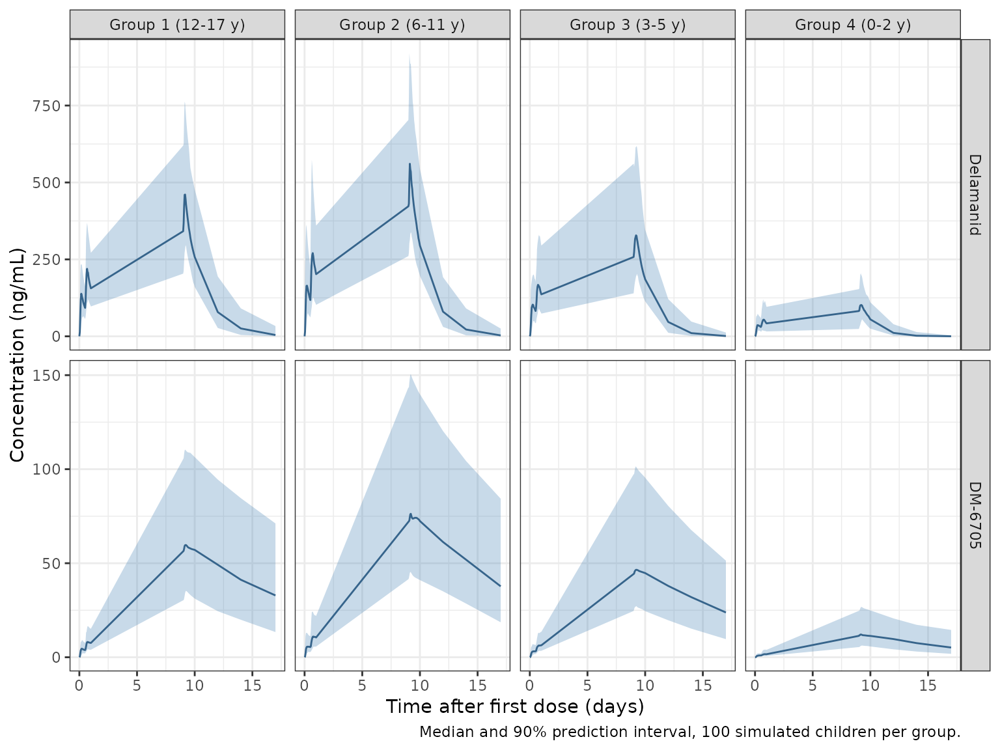
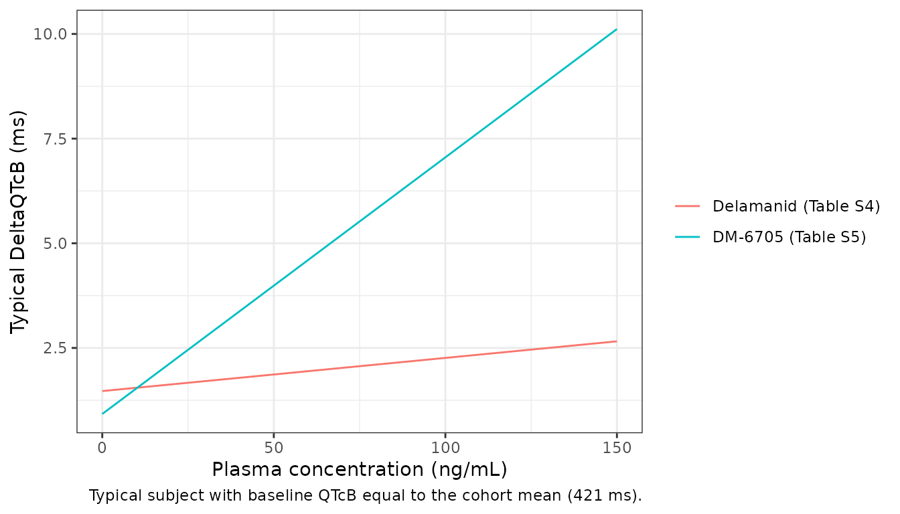

# Delamanid and DM-6705 in children with MDR-TB (Sasaki 2022)

## Model and source

Sasaki 2022 developed a joint population PK model of delamanid and its
major metabolite DM-6705 in children with multidrug-resistant
tuberculosis (MDR-TB), used it to find doses that match the adult
exposure, and fitted two concentration-QTc (cQT) linear mixed-effects
models, one driven by each analyte. The paper contributes three model
files, all documented here:

- `Sasaki_2022_delamanid` – the joint delamanid / DM-6705 PK model.

- `Sasaki_2022_delamanid_QTc_dm6705` – the cQT model driven by DM-6705,
  the significant relationship that the paper used for its QTc
  projections.

- `Sasaki_2022_delamanid_QTc_parent` – the cQT model driven by delamanid
  (slope not significant).

- Citation: Sasaki T, Svensson EM, Wang X, Wang Y, Hafkin J, Karlsson
  MO, Mallikaarjun S. Population Pharmacokinetic and Concentration-QTc
  Analysis of Delamanid in Pediatric Participants with
  Multidrug-Resistant Tuberculosis. Antimicrob Agents Chemother.
  2022;66(2):e01608-21. <doi:10.1128/aac.01608-21>

- Article: <https://doi.org/10.1128/aac.01608-21> (open access;
  PMC8846319)

- Supplement: Supplemental File 1 of the article (Tables S1-S5, Figures
  S1-S7)

``` r

mod_pk <- readModelDb("Sasaki_2022_delamanid")
mod_qtc_m <- readModelDb("Sasaki_2022_delamanid_QTc_dm6705")
mod_qtc_p <- readModelDb("Sasaki_2022_delamanid_QTc_parent")

# The DM-6705 states hold delamanid-equivalent mass; the output Cc_dm6705 is
# converted to ng/mL of DM-6705 by the molecular-weight ratio.
mw_ratio <- 465.5 / 534.5
```

## Population

37 children aged 0.67-17 years with MDR-TB, from the phase 1 trial 232
and its phase 2 extension trial 233, conducted in the Philippines
(67.6%) and South Africa (32.4%). Participants were enrolled in four age
groups (Sasaki 2022 Table 1):

| Group | Age | n | Mean (SD) weight | Formulation | Dose |
|----|----|----|----|----|----|
| 1 | 12-17 years | 7 | 39 (4.59) kg | 50-mg film-coated tablet | 100 mg BID |
| 2 | 6-11 years | 6 | 24.9 (6.79) kg | 50-mg film-coated tablet | 50 mg BID |
| 3 | 3-5 years | 12 | 14.2 (3.2) kg | 25-mg dispersible tablet | 25 mg BID |
| 4 | 0-2 years | 12 | 9.76 (1.83) kg | 5-mg dispersible tablet | 10 mg BID (\> 10 kg), 5 mg BID (\> 8 to 10 kg), 5 mg QD (5.5 to 8 kg) |

51.4% were female; 67.6% Asian, 5.4% Black and 27% of other race. The
final data set contained 634 delamanid and 706 DM-6705 concentrations;
the cQT data set contained 354 QT measurements with time-matched
concentrations.

## Source trace

| Quantity | Value | Source |
|----|----|----|
| Structure: 2-compartment delamanid, 3 transit compartments, 2-compartment DM-6705 | – | Results; Table 2 |
| CL/F, Vc/F, Q/F, Vp/F (33.5 kg) | 17.2 L/h, 346 L, 62.4 L/h, 296 L | Table 2 |
| MAT (film-coated tablet) | 2.73 h | Table 2 |
| CLM/F, VcM/F, QM/F, VpM/F (33.5 kg) | 54.2 L/h, 77.0 L, 425 L/h, 13,150 L | Table 2 |
| Fraction metabolised FM | 1 (fixed) | Results |
| Weight exponents on clearances / volumes, reference weight | 0.75 / 1 (fixed), 33.5 kg | Table 2 and footnote c |
| Dispersible tablet on MAT / F1 | +0.495 / -0.158 (fixed) | Table 2 and footnote a |
| Age on F1 below 2 years | 0.201 per year | Table 2 and footnote c |
| Dose of 50 mg or less on F1 | +0.580 (fixed) | Table 2 and footnote b |
| Age on FM below 6 years | 0.0654 per year | Table 2 and footnote c |
| IIV CL/F, CLM/F, correlation | 16.3%, 33.9%, 0.710 | Table 2 |
| IIV Vp/F, FM | 58.5%, 13.5% | Table 2 |
| IOV F1, MAT | 26.8%, 60.7% | Table 2 |
| Proportional residual error delamanid / DM-6705 | 30.8% / 18.1% | Table 2; Methods |
| Molecular weights delamanid / DM-6705 | 534.5 / 465.5 g/mol | PubChem (not in the paper) |
| cQT equation | DeltaQTc = (theta0 + eta0) + (theta1 + eta1) C + theta2 (QTc0_i - QTc0) | Methods |
| DM-6705 cQT: intercept, slope, baseline effect | 0.923 ms, 0.0613 ms per ng/mL, 0.0309 | Table S5 |
| DM-6705 cQT: var(eta0), var(eta1), residual variance | 59.9, 0.00446, 174 | Table S5 |
| Delamanid cQT: intercept, slope, baseline effect | 1.47 ms, 0.00792 ms per ng/mL, 0.0318 | Table S4 |
| Delamanid cQT: var(eta0), var(eta1), residual variance | 63.5, 0.0000937, 180 | Table S4 |
| Mean baseline QTcB (centering constant) | 421 ms | Derived from Figure S5 and the Discussion (see below) |

## Typical-value checks against closed forms

At steady state the dosing-interval AUC of a linear model is
`F * Dose / CL` for delamanid and `FM * F * Dose / CLM` (times the
molecular-weight ratio) for DM-6705. Both sides use the same parameters,
so the check is tight and catches a mis-wired bioavailability, formation
term or unit conversion.

``` r

# Build an event table: one dosing row (ii / addl) plus observation rows. With
# two error endpoints every observation row nominates one through dvid.
make_events <- function(id, dose, tau, n_dose, obs_times, wt, age, form, occ = 1) {
  dose_rows <- data.frame(
    id = id, time = 0, amt = dose, evid = 1L, cmt = "depot", dvid = NA_integer_,
    ii = tau, addl = n_dose - 1L
  )
  obs_rows <- data.frame(
    id = id, time = obs_times, amt = 0, evid = 0L, cmt = NA_character_, dvid = 1L,
    ii = 0, addl = 0L
  )
  ev <- dplyr::bind_rows(dose_rows, obs_rows)
  ev$WT <- wt
  ev$AGE <- age
  ev$FORM_DELAMANID_DT <- form
  ev$DOSE_DELAMANID_MG <- dose
  ev$OCC <- occ
  ev
}

trap_auc <- function(t, y) sum(diff(t) * (head(y, -1) + tail(y, -1)) / 2)

groups <- tibble::tribble(
  ~group, ~wt, ~age, ~form, ~dose,
  "Group 1 (12-17 y)", 39.0, 15.3, 0, 100,
  "Group 2 (6-11 y)", 24.9, 9.44, 0, 50,
  "Group 3 (3-5 y)", 14.2, 4.30, 1, 25,
  "Group 4 (0-2 y)", 9.76, 1.68, 1, 10
)
```

``` r

mod_typ <- rxode2::zeroRe(mod_pk)
#> ℹ parameter labels from comments will be replaced by 'label()'
#> Warning: some etas defaulted to non-mu referenced, possible parsing error: etaiov_fdepot_1, etaiov_fdepot_2, etaiov_fdepot_3, etaiov_fdepot_4, etaiov_mtt_1, etaiov_mtt_2, etaiov_mtt_3, etaiov_mtt_4
#> as a work-around try putting the mu-referenced expression on a simple line
#> Warning: some etas defaulted to non-mu referenced, possible parsing error: etaiov_fdepot_1, etaiov_fdepot_2, etaiov_fdepot_3, etaiov_fdepot_4, etaiov_mtt_1, etaiov_mtt_2, etaiov_mtt_3, etaiov_mtt_4
#> as a work-around try putting the mu-referenced expression on a simple line
tau <- 12
n_dose <- 60 * 2 # 60 days BID
t_last <- (n_dose - 1) * tau
obs <- seq(t_last, t_last + tau, by = 0.05)

closed <- lapply(seq_len(nrow(groups)), function(i) {
  g <- groups[i, ]
  ev <- make_events(1, g$dose, tau, n_dose, obs, g$wt, g$age, g$form, occ = 0)
  s <- as.data.frame(rxode2::rxSolve(mod_typ, ev, atol = 1e-10, rtol = 1e-10))
  cl <- 17.2 * (g$wt / 33.5)^0.75
  clm <- 54.2 * (g$wt / 33.5)^0.75
  f1 <- (1 - 0.201 * (2 - g$age) * (g$age < 2)) * (1 - 0.158 * g$form) *
    (1 + 0.580 * (g$dose <= 50))
  fm <- 1 - 0.0654 * (6 - g$age) * (g$age < 6)
  tibble::tibble(
    group = g$group,
    auc_sim = trap_auc(s$time, s$Cc),
    auc_closed = f1 * g$dose * 1000 / cl,
    aucm_sim = trap_auc(s$time, s$Cc_dm6705),
    aucm_closed = fm * f1 * g$dose * 1000 / clm * mw_ratio
  )
}) |> dplyr::bind_rows()
#> ℹ omega/sigma items treated as zero: 'etalcl', 'etalcl_dm6705', 'etalvp', 'etalfm', 'etaiov_fdepot_1', 'etaiov_fdepot_2', 'etaiov_fdepot_3', 'etaiov_fdepot_4', 'etaiov_mtt_1', 'etaiov_mtt_2', 'etaiov_mtt_3', 'etaiov_mtt_4'
#> ℹ omega/sigma items treated as zero: 'etalcl', 'etalcl_dm6705', 'etalvp', 'etalfm', 'etaiov_fdepot_1', 'etaiov_fdepot_2', 'etaiov_fdepot_3', 'etaiov_fdepot_4', 'etaiov_mtt_1', 'etaiov_mtt_2', 'etaiov_mtt_3', 'etaiov_mtt_4'
#> ℹ omega/sigma items treated as zero: 'etalcl', 'etalcl_dm6705', 'etalvp', 'etalfm', 'etaiov_fdepot_1', 'etaiov_fdepot_2', 'etaiov_fdepot_3', 'etaiov_fdepot_4', 'etaiov_mtt_1', 'etaiov_mtt_2', 'etaiov_mtt_3', 'etaiov_mtt_4'
#> ℹ omega/sigma items treated as zero: 'etalcl', 'etalcl_dm6705', 'etalvp', 'etalfm', 'etaiov_fdepot_1', 'etaiov_fdepot_2', 'etaiov_fdepot_3', 'etaiov_fdepot_4', 'etaiov_mtt_1', 'etaiov_mtt_2', 'etaiov_mtt_3', 'etaiov_mtt_4'

knitr::kable(closed, digits = 1, caption = "Steady-state AUC0-12 (ng*h/mL) of the typical child in each age group after 60 days BID: solve vs closed form.")
```

| group             | auc_sim | auc_closed | aucm_sim | aucm_closed |
|:------------------|--------:|-----------:|---------:|------------:|
| Group 1 (12-17 y) |  5187.5 |     5187.5 |   1424.1 |      1433.7 |
| Group 2 (6-11 y)  |  5737.6 |     5737.6 |   1579.9 |      1585.7 |
| Group 3 (3-5 y)   |  3680.8 |     3680.8 |    902.8 |       904.2 |
| Group 4 (0-2 y)   |  1825.0 |     1825.0 |    361.6 |       361.9 |

Steady-state AUC0-12 (ng\*h/mL) of the typical child in each age group
after 60 days BID: solve vs closed form. {.table}

``` r


# Delamanid reaches steady state within days; DM-6705, with its 13,150-L
# peripheral volume, takes weeks, and 60 days leaves it within 1%.
stopifnot(
  all(abs(closed$auc_sim / closed$auc_closed - 1) < 1e-3),
  all(abs(closed$aucm_sim / closed$aucm_closed - 1) < 0.01)
)
```

## Adjudicating the printed age condition on F1

The Table 2 footnote prints the bioavailability age term as applying “if
age is \> 2.0 years”. The Table 2 row (“Age on F1: linear slope below 2
yrs”), the Results (“age on F1 only for ages of \< 2 years”) and the
Discussion (“a linear increase was observed from the ages of 0 to 2
years but not beyond”) all say the opposite, and applied above 2 years
the term would grow without bound (F1 = 4.0 at 17 years). The model uses
the below-2-years reading. Table 3 settles it: for a 25-kg child aged 10
years given 100 mg of the film-coated tablet once daily, the paper
reports a median AUC0-24,ss of 7,320 ng\*h/mL.

``` r

cl_25 <- 17.2 * (25 / 33.5)^0.75
f1_below2 <- 1 # the age term is off at 10 years
f1_above2 <- 1 - 0.201 * (2 - 10)
adjud <- tibble::tibble(
  reading = c("Age term below 2 years (model)", "Age term above 2 years (as printed)"),
  F1 = c(f1_below2, f1_above2),
  AUC0_24 = c(f1_below2, f1_above2) * 100 * 1000 / cl_25,
  ratio_to_table3 = AUC0_24 / 7320
)
knitr::kable(adjud, digits = 3)
```

| reading                             |    F1 |   AUC0_24 | ratio_to_table3 |
|:------------------------------------|------:|----------:|----------------:|
| Age term below 2 years (model)      | 1.000 |  7241.027 |           0.989 |
| Age term above 2 years (as printed) | 2.608 | 18884.598 |           2.580 |

``` r

stopifnot(
  abs(adjud$ratio_to_table3[1] - 1) < 0.05,
  adjud$ratio_to_table3[2] > 2
)
```

## Virtual cohort: the trial 232 design

Trial 232 dosed each age group twice daily for 10 days and sampled on
days 1-2 and 10-11 and at 72, 120 and 192 h after the last dose (Table
S1). The cohort below draws 100 children per age group from the Table 1
mean (SD) of weight and age, redrawing values outside each group’s age
range and outside 3-60 kg. Group 4 doses follow the weight rule of Table
S1. Occasion 1 covers days 1-9 and occasion 2 day 10 onwards.

``` r

rxode2::rxSetSeed(2022)
set.seed(2022)

draw_trunc <- function(n, mean, sd, lo, hi) {
  x <- rnorm(n, mean, sd)
  while (any(bad <- x < lo | x > hi)) x[bad] <- rnorm(sum(bad), mean, sd)
  x
}

grp_spec <- tibble::tribble(
  ~group, ~wt_m, ~wt_sd, ~age_m, ~age_sd, ~age_lo, ~age_hi, ~form,
  "Group 1 (12-17 y)", 39.0, 4.59, 15.3, 1.62, 12, 17.99, 0,
  "Group 2 (6-11 y)", 24.9, 6.79, 9.44, 1.51, 6, 11.99, 0,
  "Group 3 (3-5 y)", 14.2, 3.20, 4.30, 0.988, 3, 5.99, 1,
  "Group 4 (0-2 y)", 9.76, 1.83, 1.68, 0.591, 0.67, 2.99, 1
)
n_per_group <- 100

obs_232 <- sort(unique(c(
  seq(0, 24, by = 1), seq(216, 240, by = 1),
  216 + c(72, 120, 192)
)))

cohort <- lapply(seq_len(nrow(grp_spec)), function(i) {
  g <- grp_spec[i, ]
  tibble::tibble(
    id = (i - 1) * n_per_group + seq_len(n_per_group),
    group = g$group,
    WT = draw_trunc(n_per_group, g$wt_m, g$wt_sd, 3, 60),
    AGE = draw_trunc(n_per_group, g$age_m, g$age_sd, g$age_lo, g$age_hi),
    form = g$form
  )
}) |>
  dplyr::bind_rows() |>
  dplyr::mutate(
    dose = dplyr::case_when(
      group == "Group 1 (12-17 y)" ~ 100,
      group == "Group 2 (6-11 y)" ~ 50,
      group == "Group 3 (3-5 y)" ~ 25,
      WT > 10 ~ 10,
      TRUE ~ 5
    ),
    tau = ifelse(group == "Group 4 (0-2 y)" & WT <= 8, 24, 12)
  )

events_232 <- lapply(seq_len(nrow(cohort)), function(i) {
  p <- cohort[i, ]
  dose_times <- seq(0, 216, by = p$tau)
  ev <- dplyr::bind_rows(
    data.frame(
      id = p$id, time = dose_times, amt = p$dose, evid = 1L,
      cmt = "depot", dvid = NA_integer_
    ),
    data.frame(
      id = p$id, time = obs_232, amt = 0, evid = 0L,
      cmt = NA_character_, dvid = 1L
    )
  )
  ev$WT <- p$WT
  ev$AGE <- p$AGE
  ev$FORM_DELAMANID_DT <- p$form
  ev$DOSE_DELAMANID_MG <- p$dose
  ev$OCC <- ifelse(ev$time < 216, 1L, 2L)
  ev$group <- p$group
  ev
}) |>
  dplyr::bind_rows() |>
  dplyr::arrange(id, time, dplyr::desc(evid))

stopifnot(!anyDuplicated(unique(events_232[, c("id", "time", "evid")])))

sim_232 <- rxode2::rxSolve(mod_pk, events_232, keep = "group") |>
  as.data.frame()
#> ℹ parameter labels from comments will be replaced by 'label()'
#> Warning: some etas defaulted to non-mu referenced, possible parsing error: etaiov_fdepot_1, etaiov_fdepot_2, etaiov_fdepot_3, etaiov_fdepot_4, etaiov_mtt_1, etaiov_mtt_2, etaiov_mtt_3, etaiov_mtt_4
#> as a work-around try putting the mu-referenced expression on a simple line
```

``` r

vpc <- sim_232 |>
  tidyr::pivot_longer(c(Cc, Cc_dm6705), names_to = "analyte", values_to = "conc") |>
  dplyr::mutate(analyte = ifelse(analyte == "Cc", "Delamanid", "DM-6705")) |>
  dplyr::group_by(group, analyte, time) |>
  dplyr::summarise(
    p05 = quantile(conc, 0.05), p50 = median(conc), p95 = quantile(conc, 0.95),
    .groups = "drop"
  )

ggplot(vpc, aes(time / 24, p50)) +
  geom_ribbon(aes(ymin = p05, ymax = p95), fill = "steelblue", alpha = 0.3) +
  geom_line(colour = "steelblue4") +
  facet_grid(analyte ~ group, scales = "free_y") +
  labs(
    x = "Time after first dose (days)", y = "Concentration (ng/mL)",
    caption = "Median and 90% prediction interval, 100 simulated children per group."
  ) +
  theme_bw()
```



The simulated profiles show the features of the observed data in Figure
1 and the pcVPCs of Figure 3 of Sasaki 2022. Delamanid accumulates over
the 10 days of BID dosing. DM-6705 rises steadily over the dosing period
and declines only slowly after the last dose, because of its 13,150-L
peripheral volume.

### PKNCA: day-10 dosing interval

``` r

nca_232 <- lapply(c("Cc", "Cc_dm6705"), function(an) {
  conc <- sim_232 |>
    dplyr::filter(time >= 216, time <= 240) |>
    dplyr::select(id, time, group, conc = dplyr::all_of(an)) |>
    dplyr::filter(!is.na(conc)) |>
    dplyr::rename(Cc = conc)
  doses <- events_232 |>
    dplyr::filter(evid == 1, time == 216) |>
    dplyr::select(id, time, amt, group)
  conc_obj <- PKNCA::PKNCAconc(conc, Cc ~ time | group + id)
  dose_obj <- PKNCA::PKNCAdose(doses, amt ~ time | group + id)
  intervals <- data.frame(
    start = 216, end = 228, cmax = TRUE, tmax = TRUE, auclast = TRUE
  )
  res <- PKNCA::pk.nca(PKNCA::PKNCAdata(conc_obj, dose_obj, intervals = intervals))
  as.data.frame(res) |> dplyr::mutate(analyte = an)
}) |> dplyr::bind_rows()

nca_232_summary <- nca_232 |>
  dplyr::group_by(analyte, group, PPTESTCD) |>
  dplyr::summarise(median = median(PPORRES), .groups = "drop") |>
  tidyr::pivot_wider(names_from = PPTESTCD, values_from = median)

nca_232_summary |>
  dplyr::rename(
    "Analyte" = analyte,
    "Group" = group,
    "Cmax (ng/mL)" = cmax,
    "Tmax (h)" = tmax,
    "AUC0-12 (ng*h/mL)" = auclast
  ) |>
  knitr::kable(digits = 1, caption = "Median day-10 NCA (216-228 h) by age group. Group 4 includes some once-daily subjects, whose AUC covers half their interval.")
```

| Analyte   | Group             | AUC0-12 (ng\*h/mL) | Cmax (ng/mL) | Tmax (h) |
|:----------|:------------------|-------------------:|-------------:|---------:|
| Cc        | Group 1 (12-17 y) |             4965.0 |        476.7 |        4 |
| Cc        | Group 2 (6-11 y)  |             5783.9 |        572.9 |        4 |
| Cc        | Group 3 (3-5 y)   |             3677.3 |        346.5 |        5 |
| Cc        | Group 4 (0-2 y)   |             1118.8 |        109.2 |        5 |
| Cc_dm6705 | Group 1 (12-17 y) |              701.6 |         59.9 |        5 |
| Cc_dm6705 | Group 2 (6-11 y)  |              891.0 |         76.4 |        4 |
| Cc_dm6705 | Group 3 (3-5 y)   |              552.6 |         46.9 |        6 |
| Cc_dm6705 | Group 4 (0-2 y)   |              140.9 |         12.2 |        6 |

Median day-10 NCA (216-228 h) by age group. Group 4 includes some
once-daily subjects, whose AUC covers half their interval. {.table}

``` r


stopifnot(!anyNA(nca_232_summary$auclast), all(nca_232_summary$auclast > 0))
```

Sasaki 2022 does not tabulate observed NCA for trials 232 and 233, so
the quantitative comparison is made against its dose-finding simulations
(Table 3) below.

## Replicating Table 3: doses matching the adult exposure

Table 3 lists, for each regimen, formulation, age class and weight band,
the doses whose median steady-state AUC0-24 falls within 0.80-1.25 of
the adult target of 7,500 ng\*h/mL. It also gives the median DM-6705
Cmax,ss at the highest of those doses, and the predicted DeltaQTcB at
that Cmax. The rows below use the highest listed dose, whose median AUC
is the upper value of each printed range. The two rows whose highest
dose is the split 50 mg + 25 mg regimen are omitted. The paper resampled
age and weight from 266 South African children, which are not published;
each row here draws 100 children with weight uniform in the band (50-65
kg for “50 kg or more”, 10-13 kg for the 2 years or younger class) and
age uniform over a range matched to the band. Steady state is taken on
day 60.

``` r

table3 <- tibble::tribble(
  ~row, ~regimen, ~form, ~age_class, ~wt_lo, ~wt_hi, ~dose, ~auc_pub, ~cmaxm_pub, ~dqtc_pub,
  1, "QD", 0, "<=2 y", 10, 20, 40, 7570, 63.4, 3.89,
  2, "QD", 0, ">2 y", 10, 20, 50, 8800, 87.8, 5.38,
  3, "QD", 0, ">2 y", 20, 30, 100, 7320, 82.3, 5.05,
  4, "QD", 1, "<=2 y", 10, 20, 50, 7970, 66.0, 4.05,
  5, "QD", 1, ">2 y", 10, 20, 50, 7410, 73.0, 4.48,
  6, "QD", 1, ">2 y", 20, 30, 100, 6160, 68.6, 4.21,
  7, "BID", 0, "<=2 y", 10, 20, 20, 7570, 61.5, 3.77,
  8, "BID", 0, ">2 y", 10, 20, 25, 8800, 84.9, 5.21,
  9, "BID", 0, ">2 y", 30, 40, 50, 8830, 95.4, 5.85,
  10, "BID", 0, ">2 y", 40, 50, 50, 7440, 78.3, 4.80,
  11, "BID", 0, ">2 y", 50, Inf, 100, 7900, 81.8, 5.02,
  12, "BID", 1, "<=2 y", 10, 20, 25, 7970, 64.4, 3.95,
  13, "BID", 1, ">2 y", 10, 20, 30, 8890, 85.3, 5.23,
  14, "BID", 1, ">2 y", 30, 40, 50, 7580, 81.2, 4.98,
  15, "BID", 1, ">2 y", 40, 50, 100, 7920, 83.1, 5.10,
  16, "BID", 1, ">2 y", 50, Inf, 100, 6650, 68.5, 4.20
) |>
  dplyr::mutate(
    treatment = sprintf(
      "%02d %s %s %s %s-%s kg %g mg", row, regimen,
      ifelse(form == 1, "DT", "FCT"), age_class, wt_lo,
      ifelse(is.finite(wt_hi), wt_hi, "65"), dose
    )
  )
```

The predicted DeltaQTcB column of Table 3 is the DM-6705 drug effect,
slope times Cmax, with the intercept and baseline terms excluded.
Evaluating the DM-6705 cQT model at each printed Cmax and subtracting
its prediction at zero concentration reproduces the column exactly:

``` r

qtc_m_typ <- rxode2::zeroRe(mod_qtc_m)
#> ℹ parameter labels from comments will be replaced by 'label()'
qtc_ev <- data.frame(
  id = 1, time = seq_len(nrow(table3)), evid = 0L,
  CP_DM6705_NGML = table3$cmaxm_pub, QTC_BL = 421
)
qtc_ev0 <- dplyr::mutate(qtc_ev, CP_DM6705_NGML = 0)
drug_effect <- as.data.frame(rxode2::rxSolve(qtc_m_typ, qtc_ev))$QTc -
  as.data.frame(rxode2::rxSolve(qtc_m_typ, qtc_ev0))$QTc
#> ℹ omega/sigma items treated as zero: 'etae0', 'etaslope'
#> ℹ omega/sigma items treated as zero: 'etae0', 'etaslope'

table3$dqtc_model <- drug_effect
stopifnot(all(abs(table3$dqtc_model - table3$dqtc_pub) < 0.01))
```

``` r

rxode2::rxSetSeed(2023)
set.seed(2023)
n_row <- 100
ss_day <- 60

age_range <- function(age_class, wt_lo) {
  if (age_class == "<=2 y") {
    return(c(1, 2))
  }
  switch(as.character(wt_lo),
    "10" = c(2, 6),
    "20" = c(6, 10),
    "30" = c(9, 13),
    "40" = c(11, 15),
    "50" = c(13, 17)
  )
}

events_t3 <- lapply(seq_len(nrow(table3)), function(i) {
  r <- table3[i, ]
  tau <- ifelse(r$regimen == "QD", 24, 12)
  n_dose <- ss_day * 24 / tau
  wt_hi <- ifelse(r$age_class == "<=2 y", 13, ifelse(is.finite(r$wt_hi), r$wt_hi, 65))
  ar <- age_range(r$age_class, r$wt_lo)
  obs <- seq((ss_day - 1) * 24, ss_day * 24, by = 0.5)
  lapply(seq_len(n_row), function(j) {
    ev <- make_events(
      id = (i - 1) * n_row + j, dose = r$dose, tau = tau, n_dose = n_dose,
      obs_times = obs, wt = runif(1, r$wt_lo, wt_hi), age = runif(1, ar[1], ar[2]),
      form = r$form, occ = 1
    )
    ev$treatment <- r$treatment
    ev
  }) |> dplyr::bind_rows()
}) |> dplyr::bind_rows()

stopifnot(!anyDuplicated(unique(events_t3[, c("id", "time", "evid")])))

sim_t3 <- rxode2::rxSolve(mod_pk, events_t3, keep = "treatment") |>
  as.data.frame()
```

``` r

t0 <- (ss_day - 1) * 24
doses_t3 <- events_t3 |>
  dplyr::filter(evid == 1) |>
  dplyr::distinct(id, treatment, amt) |>
  dplyr::mutate(time = t0)

nca_one <- function(col, params) {
  conc <- sim_t3 |>
    dplyr::select(id, time, treatment, Cc = dplyr::all_of(col)) |>
    dplyr::filter(!is.na(Cc))
  intervals <- data.frame(start = t0, end = t0 + 24)
  for (p in params) intervals[[p]] <- TRUE
  PKNCA::pk.nca(PKNCA::PKNCAdata(
    PKNCA::PKNCAconc(conc, Cc ~ time | treatment + id),
    PKNCA::PKNCAdose(doses_t3, amt ~ time | treatment + id),
    intervals = intervals
  ))
}
nca_t3_parent <- nca_one("Cc", "auclast")
nca_t3_metab <- nca_one("Cc_dm6705", "cmax")

sim_t3_long <- dplyr::bind_rows(
  as.data.frame(nca_t3_parent) |> dplyr::filter(PPTESTCD == "auclast"),
  as.data.frame(nca_t3_metab) |> dplyr::filter(PPTESTCD == "cmax")
) |>
  dplyr::select(treatment, PPTESTCD, PPORRES)

reference_t3 <- table3 |>
  dplyr::select(treatment, auclast = auc_pub, cmax = cmaxm_pub)

cmp_t3 <- nlmixr2lib::ncaComparisonTable(
  simulated = sim_t3_long,
  reference = reference_t3,
  by = "treatment",
  units = c(auclast = "ng*h/mL", cmax = "ng/mL"),
  tolerance_pct = 20
)
knitr::kable(
  cmp_t3,
  caption = paste(
    "Sasaki 2022 Table 3 vs simulation: median steady-state delamanid AUC0-24",
    "(AUC0-t) and median steady-state DM-6705 Cmax (Cmax). * differs by more than 20%."
  )
)
```

| NCA parameter | treatment | Reference | Simulated | % diff |
|:---|:---|:---|:---|:---|
| Cmax (ng/mL) | 01 QD FCT \<=2 y 10-20 kg 40 mg | 63.4 | 57.7 | -9.0% |
| Cmax (ng/mL) | 02 QD FCT \>2 y 10-20 kg 50 mg | 87.8 | 81.8 | -6.8% |
| Cmax (ng/mL) | 03 QD FCT \>2 y 20-30 kg 100 mg | 82.3 | 87.9 | +6.7% |
| Cmax (ng/mL) | 04 QD DT \<=2 y 10-20 kg 50 mg | 66 | 65.4 | -0.9% |
| Cmax (ng/mL) | 05 QD DT \>2 y 10-20 kg 50 mg | 73 | 68.2 | -6.5% |
| Cmax (ng/mL) | 06 QD DT \>2 y 20-30 kg 100 mg | 68.6 | 74.1 | +8.0% |
| Cmax (ng/mL) | 07 BID FCT \<=2 y 10-20 kg 20 mg | 61.5 | 64.5 | +4.8% |
| Cmax (ng/mL) | 08 BID FCT \>2 y 10-20 kg 25 mg | 84.9 | 97.3 | +14.6% |
| Cmax (ng/mL) | 09 BID FCT \>2 y 30-40 kg 50 mg | 95.4 | 108 | +13.1% |
| Cmax (ng/mL) | 10 BID FCT \>2 y 40-50 kg 50 mg | 78.3 | 80.6 | +3.0% |
| Cmax (ng/mL) | 11 BID FCT \>2 y 50-65 kg 100 mg | 81.8 | 85.8 | +4.9% |
| Cmax (ng/mL) | 12 BID DT \<=2 y 10-20 kg 25 mg | 64.4 | 65.4 | +1.5% |
| Cmax (ng/mL) | 13 BID DT \>2 y 10-20 kg 30 mg | 85.3 | 84.9 | -0.5% |
| Cmax (ng/mL) | 14 BID DT \>2 y 30-40 kg 50 mg | 81.2 | 80.3 | -1.1% |
| Cmax (ng/mL) | 15 BID DT \>2 y 40-50 kg 100 mg | 83.1 | 92.9 | +11.7% |
| Cmax (ng/mL) | 16 BID DT \>2 y 50-65 kg 100 mg | 68.5 | 78.4 | +14.5% |
| AUClast (ng\*h/mL) | 01 QD FCT \<=2 y 10-20 kg 40 mg | 7570 | 7240 | -4.4% |
| AUClast (ng\*h/mL) | 02 QD FCT \>2 y 10-20 kg 50 mg | 8800 | 7720 | -12.3% |
| AUClast (ng\*h/mL) | 03 QD FCT \>2 y 20-30 kg 100 mg | 7320 | 7400 | +1.1% |
| AUClast (ng\*h/mL) | 04 QD DT \<=2 y 10-20 kg 50 mg | 7970 | 7730 | -2.9% |
| AUClast (ng\*h/mL) | 05 QD DT \>2 y 10-20 kg 50 mg | 7410 | 7420 | +0.1% |
| AUClast (ng\*h/mL) | 06 QD DT \>2 y 20-30 kg 100 mg | 6160 | 6430 | +4.3% |
| AUClast (ng\*h/mL) | 07 BID FCT \<=2 y 10-20 kg 20 mg | 7570 | 7580 | +0.2% |
| AUClast (ng\*h/mL) | 08 BID FCT \>2 y 10-20 kg 25 mg | 8800 | 8930 | +1.4% |
| AUClast (ng\*h/mL) | 09 BID FCT \>2 y 30-40 kg 50 mg | 8830 | 9880 | +11.9% |
| AUClast (ng\*h/mL) | 10 BID FCT \>2 y 40-50 kg 50 mg | 7440 | 7390 | -0.7% |
| AUClast (ng\*h/mL) | 11 BID FCT \>2 y 50-65 kg 100 mg | 7900 | 7600 | -3.8% |
| AUClast (ng\*h/mL) | 12 BID DT \<=2 y 10-20 kg 25 mg | 7970 | 7840 | -1.7% |
| AUClast (ng\*h/mL) | 13 BID DT \>2 y 10-20 kg 30 mg | 8890 | 8450 | -5.0% |
| AUClast (ng\*h/mL) | 14 BID DT \>2 y 30-40 kg 50 mg | 7580 | 7190 | -5.1% |
| AUClast (ng\*h/mL) | 15 BID DT \>2 y 40-50 kg 100 mg | 7920 | 7860 | -0.7% |
| AUClast (ng\*h/mL) | 16 BID DT \>2 y 50-65 kg 100 mg | 6650 | 6990 | +5.1% |

Sasaki 2022 Table 3 vs simulation: median steady-state delamanid AUC0-24
(AUC0-t) and median steady-state DM-6705 Cmax (Cmax). \* differs by more
than 20%. {.table}

``` r

pct <- sim_t3_long |>
  dplyr::group_by(treatment, PPTESTCD) |>
  dplyr::summarise(sim = median(PPORRES), .groups = "drop") |>
  dplyr::left_join(
    tidyr::pivot_longer(reference_t3, c(auclast, cmax), names_to = "PPTESTCD", values_to = "pub"),
    by = c("treatment", "PPTESTCD")
  ) |>
  dplyr::mutate(pct_diff = 100 * (sim / pub - 1))

pct |>
  dplyr::group_by(PPTESTCD) |>
  dplyr::summarise(
    median_pct_diff = median(pct_diff),
    p90_abs_pct_diff = quantile(abs(pct_diff), 0.9)
  ) |>
  knitr::kable(digits = 1)
```

| PPTESTCD | median_pct_diff | p90_abs_pct_diff |
|:---------|----------------:|-----------------:|
| auclast  |            -0.7 |              8.5 |
| cmax     |             3.9 |             13.8 |

``` r


# A mis-transcribed clearance, bioavailability term, formation fraction or
# unit moves every row by tens of percent. The envelope is loose because the
# paper's resampled South African demographics are not available and the
# within-band weight and age distributions above are assumptions.
stopifnot(
  abs(median(pct$pct_diff[pct$PPTESTCD == "auclast"])) < 10,
  quantile(abs(pct$pct_diff[pct$PPTESTCD == "auclast"]), 0.9) < 20,
  abs(median(pct$pct_diff[pct$PPTESTCD == "cmax"])) < 12,
  quantile(abs(pct$pct_diff[pct$PPTESTCD == "cmax"]), 0.9) < 25
)
```

## Concentration-QTc models

At the steady-state DM-6705 Cmax values of Table 3 (61.5-95.4 ng/mL),
the DM-6705 model gives drug effects of 3.8-5.9 ms (the column
reproduced above). The paper concludes that the upper 90% confidence
bounds of these effects stay below 10 ms. The delamanid model’s slope is
about eight-fold smaller per ng/mL and its confidence interval includes
zero.

``` r

conc_grid <- seq(0, 150, by = 5)
qtc_p_typ <- rxode2::zeroRe(mod_qtc_p)
#> ℹ parameter labels from comments will be replaced by 'label()'
pred_m <- as.data.frame(rxode2::rxSolve(qtc_m_typ, data.frame(
  id = 1, time = seq_along(conc_grid), evid = 0L,
  CP_DM6705_NGML = conc_grid, QTC_BL = 421
)))
#> ℹ omega/sigma items treated as zero: 'etae0', 'etaslope'
pred_p <- as.data.frame(rxode2::rxSolve(qtc_p_typ, data.frame(
  id = 1, time = seq_along(conc_grid), evid = 0L,
  CP_DELAMANID_NGML = conc_grid, QTC_BL = 421
)))
#> ℹ omega/sigma items treated as zero: 'etae0', 'etaslope'
qtc_df <- dplyr::bind_rows(
  tibble::tibble(conc = conc_grid, dqtc = pred_m$QTc, driver = "DM-6705 (Table S5)"),
  tibble::tibble(conc = conc_grid, dqtc = pred_p$QTc, driver = "Delamanid (Table S4)")
)
ggplot(qtc_df, aes(conc, dqtc, colour = driver)) +
  geom_line() +
  labs(
    x = "Plasma concentration (ng/mL)", y = "Typical DeltaQTcB (ms)",
    colour = NULL, caption = "Typical subject with baseline QTcB equal to the cohort mean (421 ms)."
  ) +
  theme_bw()
```



``` r


stopifnot(
  abs(diff(range(pred_m$QTc)) - 0.0613 * 150) < 1e-6,
  abs(diff(range(pred_p$QTc)) - 0.00792 * 150) < 1e-6
)
```

Replicating Figure 4 needs the observed QT data, which are not
published. The line above corresponds to its “model fit” line, which is
the intercept plus slope term at the mean baseline.

## Assumptions and deviations

- **Age condition on F1.** The Table 2 footnote prints the F1 age term
  as applying above 2 years. The model applies it below 2 years, as
  stated in Table 2, the Results and the Discussion, and as Table 3
  confirms (see “Adjudicating the printed age condition on F1”).
- **Transit chain.** The paper reports “three transit compartments” and
  a mean absorption time (MAT) without printing the rate equation. The
  model routes the dose through the depot and three transit compartments
  into the central compartment, all at rate `ktr = 4 / MAT`, so MAT is
  the mean time through all four first-order steps. Adding transit
  compartments to a first-order absorption model, as the paper
  describes, puts them in addition to the absorbing depot.
- **Molar units and molecular weights.** The model was fitted to molar
  concentrations and the paper does not print the molecular weights. The
  DM-6705 states hold delamanid-equivalent mass (formation is
  mole-for-mole with FM = 1), and `Cc_dm6705` is converted to ng/mL with
  the PubChem molecular weights of delamanid (534.5 g/mol) and DM-6705
  (465.5 g/mol). The close agreement with the DM-6705 Cmax column of
  Table 3 independently supports this conversion.
- **Variance scale.** Table 2 gives IIV and IOV as CV%; variances use
  `omega^2 = log(1 + CV^2)`. The “71.0” CL/F - CLM/F entry is read as a
  correlation coefficient.
- **Residual correlation.** The 39.4% correlation between the delamanid
  and DM-6705 residual errors (Table 2) cannot be expressed in an
  nlmixr2 model and is omitted. It affects only simulated observations,
  not individual predictions.
- **Occasions.** The paper does not define how occasions were delimited
  or how many there were. The model carries four occasions (`OCC` 1-4)
  sharing one variance for F1 and one for MAT; any other `OCC` value
  switches the IOV off.
- **Dose effect on F1.** The +58% bioavailability for doses of 50 mg or
  less is applied per dose record through `DOSE_DELAMANID_MG`, the dose
  given at that administration.
- **cQT centering constant.** The cQT equation centers each child’s
  baseline QTcB on the mean baseline QTcB, QTc0, which the paper does
  not print. The model uses 421 ms, taken from the baseline
  QTcB-versus-RR regression of Figure S5 (QTcB = 0.03 RR + 403.167; a
  least-squares line passes through the mean point) at the mean RR of
  about 600 ms implied by the Discussion’s baseline heart rate of
  “approximately 100 bpm”. With baseline coefficients of about 0.03, a
  10-ms error in this constant moves the prediction by 0.3 ms.
- **Time as a fixed effect.** The Methods text says time was a fixed
  effect in the cQT model, but neither the printed equation nor Tables
  S4-S5 contain a time term. The models follow the equation and tables.
- **Table 3 cohort.** The paper’s dose-finding simulations resampled age
  and weight from two South African pediatric TB studies (n = 266),
  which are not published. The replication draws weight uniformly within
  each band and age uniformly over a matched range, and treats day 60 as
  steady state.
- **Screened covariates.** BMI and total protein (on CL/F), albumin (on
  F1) and sex (on Vc/F) were significant in the stepwise search but
  removed from the final model. No coefficients are reported, so they
  are recorded as excluded covariates only.
