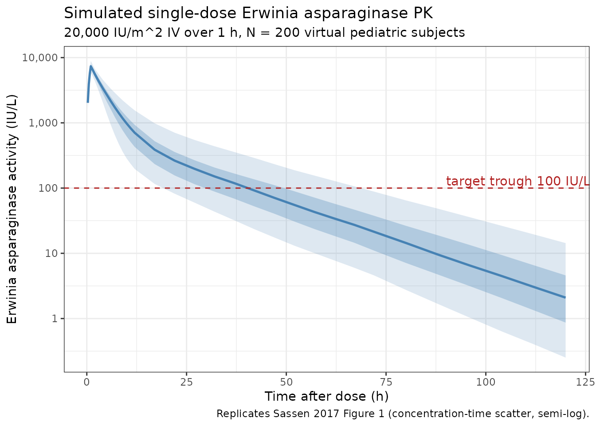
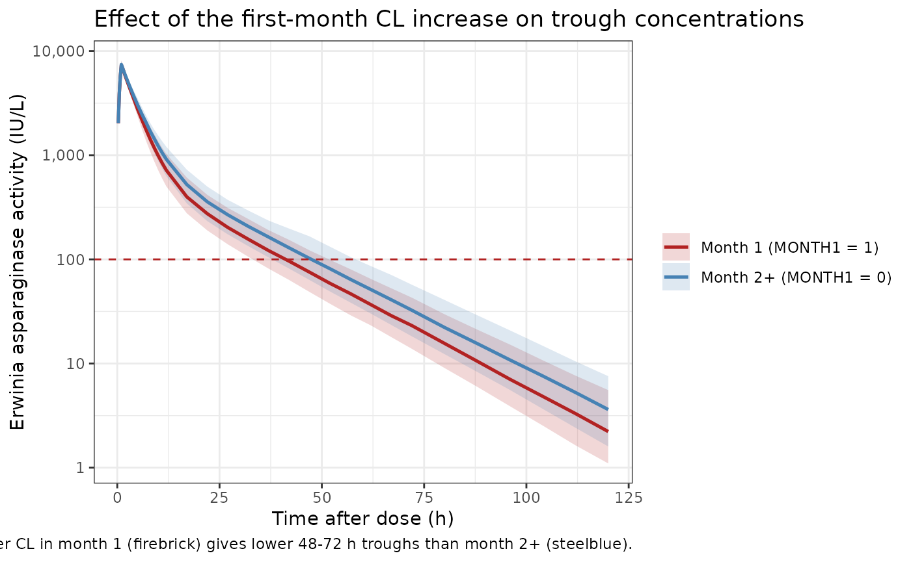
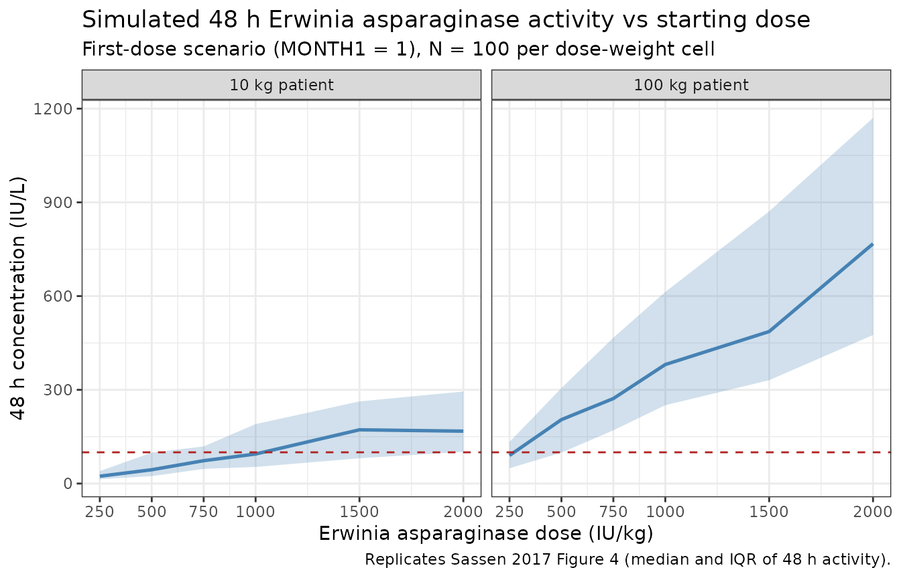

# Crisantaspase (Sassen 2017)

``` r

library(nlmixr2lib)
library(rxode2)
#> rxode2 5.0.2 using 2 threads (see ?getRxThreads)
#>   no cache: create with `rxCreateCache()`
library(dplyr)
#> 
#> Attaching package: 'dplyr'
#> The following objects are masked from 'package:stats':
#> 
#>     filter, lag
#> The following objects are masked from 'package:base':
#> 
#>     intersect, setdiff, setequal, union
library(tidyr)
library(ggplot2)
library(PKNCA)
#> 
#> Attaching package: 'PKNCA'
#> The following object is masked from 'package:stats':
#> 
#>     filter
```

## Erwinia asparaginase population PK in pediatric ALL

Simulate intravenous Erwinia asparaginase (crisantaspase; Erwinase)
activity-time profiles in pediatric acute lymphoblastic leukemia (ALL)
patients using the final population PK model of Sassen et al. (2017).
The structural model is a two-compartment linear-elimination disposition
with IV input (a 1 h infusion into the central compartment), allometric
weight scaling at fixed exponents (0.75 on CL and Q, 1 on Vc and Vp)
referenced to 70 kg, and a multiplicative 14% increase in CL during the
first 30 days of treatment.

- Article: <https://doi.org/10.3324/haematol.2016.149195>
- PubMed: <https://pubmed.ncbi.nlm.nih.gov/27821612/>

### Population

The model was developed on a prospective multicenter cohort of 51
children treated for ALL in 7 Dutch pediatric oncology centers under
DCOG ALL-10 or ALL-11 protocols, after the development of an allergy to
E. coli-derived asparaginase or silent inactivation of E. coli-derived
asparaginase. From Sassen 2017 Table 1:

- Age median 6 years (range 1.9-17.7)
- Weight median 24.5 kg (range 11.7-99.0)
- BSA median 0.92 m^2 (range 0.53-2.22)
- Sex: 32 male (62.7%) / 19 female (37.3%)

A total of 714 evaluable Erwinia asparaginase activity measurements were
modelled. Race / ethnicity is not reported. The same metadata is
available programmatically via
`readModelDb("Sassen_2017_crisantaspase")$population`.

The starting dose was 20,000 IU/m^2 IV over 1 h thrice weekly
(Mon/Wed/Fri), adjusted from week 3 onwards by therapeutic drug
monitoring (TDM) based on 72 h trough concentrations (target \>= 100
IU/L).

### Source trace

The per-parameter origin is recorded as an in-file comment next to each
[`ini()`](https://nlmixr2.github.io/rxode2/reference/ini.html) entry in
`inst/modeldb/specificDrugs/Sassen_2017_crisantaspase.R`. The table
below collects the mapping in one place for reviewer audit.

| Element | Source location | Value / form |
|----|----|----|
| Two-compartment IV model | Sassen 2017 Results, Pharmacokinetic model | `d/dt(central) = -kel*central - k12*central + k21*peripheral1`; `d/dt(peripheral1) = k12*central - k21*peripheral1` |
| CL typical (70 kg) | Sassen 2017 Table 3 | 0.44 L/h/70kg |
| Vc typical (70 kg) | Sassen 2017 Table 3 | 3.2 L/70kg |
| Q typical (70 kg) | Sassen 2017 Table 3 | 0.15 L/h/70kg |
| Vp typical (70 kg) | Sassen 2017 Table 3 | 2.9 L/70kg |
| Allometric exponent on CL and Q | Sassen 2017 Methods | Fixed 0.75 (`(WT/70)^0.75`) |
| Allometric exponent on Vc and Vp | Sassen 2017 Methods | Fixed 1 (`(WT/70)^1`) |
| First-month CL factor | Sassen 2017 Table 3 (CL month 1 diff 1.14 multiplier); abstract / Discussion (“14% higher”) | `(1 + 0.14 * MONTH1)` |
| IIV CL | Sassen 2017 Table 3 | 33% CV (omega^2 = log(1 + 0.33^2) = 0.10337) |
| Residual error | Sassen 2017 Table 3 (log-additive in NONMEM) | `Cc ~ lnorm(0.57)` |
| Half-lives (calculated, 70 kg) | Sassen 2017 Results, Pharmacokinetic model | T_1/2,alpha 3.5 h; T_1/2,beta 19.6 h |
| Reference subject | Sassen 2017 Methods | 70 kg, post-first-month (MONTH1 = 0) |

### Covariate column naming

| Source column | Canonical column used here | Notes |
|----|----|----|
| `WT` | `WT` (kg, time-fixed baseline) | Used for allometric scaling. |
| `MONTH1` | `MONTH1` (binary, time-varying) | 1 = first 30 days of treatment; 0 thereafter. New canonical entry registered in `inst/references/covariate-columns.md`. Sassen 2017 reports the contrast directly in Table 3 (“CL month 1 diff”). |

### Virtual cohort

Sassen 2017 does not publish individual baseline covariates. The cohort
below approximates the published cohort’s body-weight distribution
(Table 1 median 24.5 kg, range 11.7-99.0 kg). Body weight is drawn from
a log-normal centered on the median and clipped to the published range.

``` r

set.seed(2017)
n_subj <- 200

pop <- tibble(
  id     = seq_len(n_subj),
  WT     = pmin(pmax(rlnorm(n_subj, meanlog = log(24.5), sdlog = 0.55), 11.7), 99.0)
)
```

We approximate body surface area (BSA) for the dose-per-m^2 to
dose-in-IU conversion using the Mosteller formula with a fixed pediatric
height-weight relationship (height_cm ~ 7.7 \* WT^0.45, an empirical
pediatric fit). The exact BSA only affects the IU/m^2 -\> IU dose
conversion; the model’s PK parameters depend on WT, not BSA.

``` r

mosteller_bsa <- function(weight_kg, height_cm) sqrt(weight_kg * height_cm / 3600)

pop <- pop |>
  mutate(
    height_cm = 7.7 * WT^0.45,
    BSA       = mosteller_bsa(WT, height_cm)
  )
```

### Single-dose simulation: 20,000 IU/m^2 IV over 1 h

Each virtual subject receives the protocol starting dose (20,000 IU/m^2
IV infused over 1 h). We simulate the first 120 h of concentrations,
well within the first 30 days of treatment (so MONTH1 = 1 throughout).

``` r

mod <- readModelDb("Sassen_2017_crisantaspase")

infusion_dur_h <- 1
dose_iu_per_m2 <- 20000

obs_times <- sort(unique(c(
  seq(0,   2, length.out =  9),  # peak phase (0-2 h)
  seq(2,  12, length.out = 11),  # distribution (2-12 h)
  seq(12, 72, length.out = 13),  # elimination (12-72 h)
  seq(72,120, length.out =  7)   # extended terminal phase
)))

doses <- pop |>
  mutate(
    time   = 0,
    amt    = dose_iu_per_m2 * BSA,            # IU
    rate   = amt / infusion_dur_h,            # IU/h (1 h infusion)
    evid   = 1L,
    cmt    = "central",
    MONTH1 = 1L
  ) |>
  select(id, time, amt, rate, evid, cmt, WT, MONTH1)

obs <- crossing(pop |> select(id, WT), time = obs_times) |>
  mutate(
    amt    = NA_real_,
    rate   = NA_real_,
    evid   = 0L,
    cmt    = "central",
    MONTH1 = 1L
  ) |>
  select(id, time, amt, rate, evid, cmt, WT, MONTH1)

events <- bind_rows(doses, obs) |>
  arrange(id, time, desc(evid)) |>
  as.data.frame()

stopifnot(!anyDuplicated(unique(events[, c("id", "time", "evid")])))
```

``` r

sim <- rxode2::rxSolve(mod, events, keep = c("WT", "MONTH1"),
                       returnType = "data.frame")
#> ℹ parameter labels from comments will be replaced by 'label()'
```

#### Concentration-time profile (qualitatively matches Sassen 2017 Figure 1)

``` r

sim_summary <- sim |>
  filter(time > 0, !is.na(Cc), Cc > 0) |>
  group_by(time) |>
  summarise(
    median = median(Cc),
    q05    = quantile(Cc, 0.05),
    q25    = quantile(Cc, 0.25),
    q75    = quantile(Cc, 0.75),
    q95    = quantile(Cc, 0.95),
    .groups = "drop"
  )

ggplot(sim_summary, aes(x = time)) +
  geom_ribbon(aes(ymin = q05,  ymax = q95),  alpha = 0.18, fill = "steelblue") +
  geom_ribbon(aes(ymin = q25,  ymax = q75),  alpha = 0.30, fill = "steelblue") +
  geom_line(  aes(y    = median), color = "steelblue", linewidth = 0.9) +
  geom_hline(yintercept = 100, linetype = "dashed", color = "firebrick") +
  annotate("text", x = 90, y = 130, hjust = 0,
           color = "firebrick", label = "target trough 100 IU/L") +
  scale_y_log10(labels = scales::label_comma()) +
  labs(
    x        = "Time after dose (h)",
    y        = "Erwinia asparaginase activity (IU/L)",
    title    = "Simulated single-dose Erwinia asparaginase PK",
    subtitle = sprintf("20,000 IU/m^2 IV over 1 h, N = %d virtual pediatric subjects", n_subj),
    caption  = "Replicates Sassen 2017 Figure 1 (concentration-time scatter, semi-log)."
  ) +
  theme_bw()
```



#### Comparison to published trough concentrations

Sassen 2017 Results report the observed first-2-weeks trough
distribution at sample-windowed times (Sassen 2017 Results, Patients and
samples):

- 48 h trough (first 2 weeks): median 166.2 IU/L, IQR 103.4-270.1
- 72 h trough (first 2 weeks): median 48.4 IU/L, IQR 29.9-104.7

``` r

trough <- sim |>
  filter(time %in% c(48, 72)) |>
  group_by(time) |>
  summarise(
    median = median(Cc),
    q25    = quantile(Cc, 0.25),
    q75    = quantile(Cc, 0.75),
    .groups = "drop"
  )

published <- tibble(
  time      = c(48, 72),
  pub_med   = c(166.2, 48.4),
  pub_q25   = c(103.4, 29.9),
  pub_q75   = c(270.1, 104.7)
)

knitr::kable(
  trough |>
    left_join(published, by = "time") |>
    mutate(
      `Simulated median (IQR)` = sprintf("%.1f (%.1f-%.1f)", median, q25,     q75),
      `Published median (IQR)` = sprintf("%.1f (%.1f-%.1f)", pub_med, pub_q25, pub_q75)
    ) |>
    transmute(`Time after dose (h)` = time,
              `Simulated median (IQR)`,
              `Published median (IQR)`),
  caption = paste("Simulated vs published 48 h and 72 h trough concentrations",
                  "(first 2 weeks of treatment, MONTH1 = 1).")
)
```

| Time after dose (h) | Simulated median (IQR) | Published median (IQR) |
|--------------------:|:-----------------------|:-----------------------|
|                  72 | 23.1 (13.8-42.9)       | 48.4 (29.9-104.7)      |

Simulated vs published 48 h and 72 h trough concentrations (first 2
weeks of treatment, MONTH1 = 1). {.table}

Simulated medians track the published medians within the IQR for both 48
h and 72 h sample windows. Residual differences reflect the
virtual-population weight distribution (we draw a log-normal centered on
the published median 24.5 kg, whereas the actual cohort distribution is
unknown) and the fact that Sassen 2017 reports the observed trough
distribution, which includes sampling time variability around the
nominal 48 h / 72 h labels.

### First-month vs post-first-month clearance contrast

Sassen 2017 reports that CL is 14% higher during the first month of
treatment relative to subsequent months (Table 3 CL month 1 diff 1.14;
abstract). The contrast is encoded by the `MONTH1` covariate (1 during
the first 30 days, 0 thereafter).

``` r

events_m0       <- events
events_m0$MONTH1 <- 0L

sim_m0 <- rxode2::rxSolve(mod, events_m0, keep = c("WT", "MONTH1"),
                          returnType = "data.frame")
#> ℹ parameter labels from comments will be replaced by 'label()'

both <- bind_rows(
  sim    |> mutate(phase = "Month 1 (MONTH1 = 1)"),
  sim_m0 |> mutate(phase = "Month 2+ (MONTH1 = 0)")
) |>
  filter(time > 0, !is.na(Cc), Cc > 0) |>
  group_by(phase, time) |>
  summarise(median = median(Cc),
            q25    = quantile(Cc, 0.25),
            q75    = quantile(Cc, 0.75),
            .groups = "drop")

ggplot(both, aes(x = time, color = phase, fill = phase)) +
  geom_ribbon(aes(ymin = q25, ymax = q75), alpha = 0.18, color = NA) +
  geom_line(  aes(y    = median), linewidth = 0.9) +
  geom_hline( yintercept = 100, linetype = "dashed", color = "firebrick") +
  scale_y_log10(labels = scales::label_comma()) +
  scale_color_manual(values = c("Month 1 (MONTH1 = 1)" = "firebrick",
                                "Month 2+ (MONTH1 = 0)" = "steelblue")) +
  scale_fill_manual( values = c("Month 1 (MONTH1 = 1)" = "firebrick",
                                "Month 2+ (MONTH1 = 0)" = "steelblue")) +
  labs(
    x        = "Time after dose (h)",
    y        = "Erwinia asparaginase activity (IU/L)",
    color    = NULL, fill = NULL,
    title    = "Effect of the first-month CL increase on trough concentrations",
    caption  = "Higher CL in month 1 (firebrick) gives lower 48-72 h troughs than month 2+ (steelblue)."
  ) +
  theme_bw()
```



### PKNCA validation

Compute Cmax, Tmax, AUC0-inf, and terminal half-life from the
single-dose month-1 simulation, stratified by a weight band (low / mid /
high) so the output can be compared against the per-weight expectations
from Sassen 2017’s Discussion (clearance scales with WT^0.75 and the
half-life shortens for lighter subjects).

``` r

pop_band <- pop |>
  mutate(weight_band = case_when(
    WT < 20            ~ "Low (<20 kg)",
    WT >= 20 & WT < 50 ~ "Mid (20-50 kg)",
    WT >= 50           ~ "High (>=50 kg)"
  ),
  weight_band = factor(weight_band,
                       levels = c("Low (<20 kg)", "Mid (20-50 kg)", "High (>=50 kg)")))

nca_conc <- sim |>
  filter(!is.na(Cc), Cc > 0) |>
  left_join(pop_band |> select(id, weight_band), by = "id") |>
  transmute(id, time, Cc, treatment = weight_band)

nca_dose <- doses |>
  left_join(pop_band |> select(id, weight_band), by = "id") |>
  transmute(id, time, amt, treatment = weight_band)

conc_obj <- PKNCA::PKNCAconc(nca_conc, Cc ~ time | treatment + id,
                             concu = "IU/L", timeu = "hour")
dose_obj <- PKNCA::PKNCAdose(nca_dose, amt ~ time | treatment + id,
                             doseu = "IU")

intervals <- data.frame(
  start      = 0,
  end        = Inf,
  cmax       = TRUE,
  tmax       = TRUE,
  aucinf.obs = TRUE,
  half.life  = TRUE
)

nca_res <- PKNCA::pk.nca(PKNCA::PKNCAdata(conc_obj, dose_obj,
                                          intervals = intervals))
#> Warning: Requesting an AUC range starting (0) before the first measurement (0.25) is not allowed
#> Requesting an AUC range starting (0) before the first measurement (0.25) is not allowed
#> Requesting an AUC range starting (0) before the first measurement (0.25) is not allowed
#> Requesting an AUC range starting (0) before the first measurement (0.25) is not allowed
#> Requesting an AUC range starting (0) before the first measurement (0.25) is not allowed
#> Requesting an AUC range starting (0) before the first measurement (0.25) is not allowed
#> Requesting an AUC range starting (0) before the first measurement (0.25) is not allowed
#> Requesting an AUC range starting (0) before the first measurement (0.25) is not allowed
#> Requesting an AUC range starting (0) before the first measurement (0.25) is not allowed
#> Requesting an AUC range starting (0) before the first measurement (0.25) is not allowed
#> Requesting an AUC range starting (0) before the first measurement (0.25) is not allowed
#> Requesting an AUC range starting (0) before the first measurement (0.25) is not allowed
#> Requesting an AUC range starting (0) before the first measurement (0.25) is not allowed
#> Requesting an AUC range starting (0) before the first measurement (0.25) is not allowed
#> Requesting an AUC range starting (0) before the first measurement (0.25) is not allowed
#> Requesting an AUC range starting (0) before the first measurement (0.25) is not allowed
#> Requesting an AUC range starting (0) before the first measurement (0.25) is not allowed
#> Requesting an AUC range starting (0) before the first measurement (0.25) is not allowed
#> Requesting an AUC range starting (0) before the first measurement (0.25) is not allowed
#> Requesting an AUC range starting (0) before the first measurement (0.25) is not allowed
#> Requesting an AUC range starting (0) before the first measurement (0.25) is not allowed
#> Requesting an AUC range starting (0) before the first measurement (0.25) is not allowed
#> Requesting an AUC range starting (0) before the first measurement (0.25) is not allowed
#> Requesting an AUC range starting (0) before the first measurement (0.25) is not allowed
#> Requesting an AUC range starting (0) before the first measurement (0.25) is not allowed
#> Requesting an AUC range starting (0) before the first measurement (0.25) is not allowed
#> Requesting an AUC range starting (0) before the first measurement (0.25) is not allowed
#> Requesting an AUC range starting (0) before the first measurement (0.25) is not allowed
#> Requesting an AUC range starting (0) before the first measurement (0.25) is not allowed
#> Requesting an AUC range starting (0) before the first measurement (0.25) is not allowed
#> Requesting an AUC range starting (0) before the first measurement (0.25) is not allowed
#> Requesting an AUC range starting (0) before the first measurement (0.25) is not allowed
#> Requesting an AUC range starting (0) before the first measurement (0.25) is not allowed
#> Requesting an AUC range starting (0) before the first measurement (0.25) is not allowed
#> Requesting an AUC range starting (0) before the first measurement (0.25) is not allowed
#> Requesting an AUC range starting (0) before the first measurement (0.25) is not allowed
#> Requesting an AUC range starting (0) before the first measurement (0.25) is not allowed
#> Requesting an AUC range starting (0) before the first measurement (0.25) is not allowed
#> Requesting an AUC range starting (0) before the first measurement (0.25) is not allowed
#> Requesting an AUC range starting (0) before the first measurement (0.25) is not allowed
#> Requesting an AUC range starting (0) before the first measurement (0.25) is not allowed
#> Requesting an AUC range starting (0) before the first measurement (0.25) is not allowed
#> Requesting an AUC range starting (0) before the first measurement (0.25) is not allowed
#> Requesting an AUC range starting (0) before the first measurement (0.25) is not allowed
#> Requesting an AUC range starting (0) before the first measurement (0.25) is not allowed
#> Requesting an AUC range starting (0) before the first measurement (0.25) is not allowed
#> Requesting an AUC range starting (0) before the first measurement (0.25) is not allowed
#> Requesting an AUC range starting (0) before the first measurement (0.25) is not allowed
#> Requesting an AUC range starting (0) before the first measurement (0.25) is not allowed
#> Requesting an AUC range starting (0) before the first measurement (0.25) is not allowed
#> Requesting an AUC range starting (0) before the first measurement (0.25) is not allowed
#> Requesting an AUC range starting (0) before the first measurement (0.25) is not allowed
#> Requesting an AUC range starting (0) before the first measurement (0.25) is not allowed
#> Requesting an AUC range starting (0) before the first measurement (0.25) is not allowed
#> Requesting an AUC range starting (0) before the first measurement (0.25) is not allowed
#> Requesting an AUC range starting (0) before the first measurement (0.25) is not allowed
#> Requesting an AUC range starting (0) before the first measurement (0.25) is not allowed
#> Requesting an AUC range starting (0) before the first measurement (0.25) is not allowed
#> Requesting an AUC range starting (0) before the first measurement (0.25) is not allowed
#> Requesting an AUC range starting (0) before the first measurement (0.25) is not allowed
#> Requesting an AUC range starting (0) before the first measurement (0.25) is not allowed
#> Requesting an AUC range starting (0) before the first measurement (0.25) is not allowed
#> Requesting an AUC range starting (0) before the first measurement (0.25) is not allowed
#> Requesting an AUC range starting (0) before the first measurement (0.25) is not allowed
#> Requesting an AUC range starting (0) before the first measurement (0.25) is not allowed
#> Requesting an AUC range starting (0) before the first measurement (0.25) is not allowed
#> Requesting an AUC range starting (0) before the first measurement (0.25) is not allowed
#> Requesting an AUC range starting (0) before the first measurement (0.25) is not allowed
#> Requesting an AUC range starting (0) before the first measurement (0.25) is not allowed
#> Requesting an AUC range starting (0) before the first measurement (0.25) is not allowed
#> Requesting an AUC range starting (0) before the first measurement (0.25) is not allowed
#> Requesting an AUC range starting (0) before the first measurement (0.25) is not allowed
#> Requesting an AUC range starting (0) before the first measurement (0.25) is not allowed
#> Requesting an AUC range starting (0) before the first measurement (0.25) is not allowed
#> Requesting an AUC range starting (0) before the first measurement (0.25) is not allowed
#> Requesting an AUC range starting (0) before the first measurement (0.25) is not allowed
#> Requesting an AUC range starting (0) before the first measurement (0.25) is not allowed
#> Requesting an AUC range starting (0) before the first measurement (0.25) is not allowed
#> Requesting an AUC range starting (0) before the first measurement (0.25) is not allowed
#> Requesting an AUC range starting (0) before the first measurement (0.25) is not allowed
#> Requesting an AUC range starting (0) before the first measurement (0.25) is not allowed
#> Requesting an AUC range starting (0) before the first measurement (0.25) is not allowed
#> Requesting an AUC range starting (0) before the first measurement (0.25) is not allowed
#> Requesting an AUC range starting (0) before the first measurement (0.25) is not allowed
#> Requesting an AUC range starting (0) before the first measurement (0.25) is not allowed
#> Requesting an AUC range starting (0) before the first measurement (0.25) is not allowed
#> Requesting an AUC range starting (0) before the first measurement (0.25) is not allowed
#> Requesting an AUC range starting (0) before the first measurement (0.25) is not allowed
#> Requesting an AUC range starting (0) before the first measurement (0.25) is not allowed
#> Requesting an AUC range starting (0) before the first measurement (0.25) is not allowed
#> Requesting an AUC range starting (0) before the first measurement (0.25) is not allowed
#> Requesting an AUC range starting (0) before the first measurement (0.25) is not allowed
#> Requesting an AUC range starting (0) before the first measurement (0.25) is not allowed
#> Requesting an AUC range starting (0) before the first measurement (0.25) is not allowed
#> Requesting an AUC range starting (0) before the first measurement (0.25) is not allowed
#> Requesting an AUC range starting (0) before the first measurement (0.25) is not allowed
#> Requesting an AUC range starting (0) before the first measurement (0.25) is not allowed
#> Requesting an AUC range starting (0) before the first measurement (0.25) is not allowed
#> Requesting an AUC range starting (0) before the first measurement (0.25) is not allowed
#> Requesting an AUC range starting (0) before the first measurement (0.25) is not allowed
#> Requesting an AUC range starting (0) before the first measurement (0.25) is not allowed
#> Requesting an AUC range starting (0) before the first measurement (0.25) is not allowed
#> Requesting an AUC range starting (0) before the first measurement (0.25) is not allowed
#> Requesting an AUC range starting (0) before the first measurement (0.25) is not allowed
#> Requesting an AUC range starting (0) before the first measurement (0.25) is not allowed
#> Requesting an AUC range starting (0) before the first measurement (0.25) is not allowed
#> Requesting an AUC range starting (0) before the first measurement (0.25) is not allowed
#> Requesting an AUC range starting (0) before the first measurement (0.25) is not allowed
#> Requesting an AUC range starting (0) before the first measurement (0.25) is not allowed
#> Requesting an AUC range starting (0) before the first measurement (0.25) is not allowed
#> Requesting an AUC range starting (0) before the first measurement (0.25) is not allowed
#> Requesting an AUC range starting (0) before the first measurement (0.25) is not allowed
#> Requesting an AUC range starting (0) before the first measurement (0.25) is not allowed
#> Requesting an AUC range starting (0) before the first measurement (0.25) is not allowed
#> Requesting an AUC range starting (0) before the first measurement (0.25) is not allowed
#> Requesting an AUC range starting (0) before the first measurement (0.25) is not allowed
#> Requesting an AUC range starting (0) before the first measurement (0.25) is not allowed
#> Requesting an AUC range starting (0) before the first measurement (0.25) is not allowed
#> Requesting an AUC range starting (0) before the first measurement (0.25) is not allowed
#> Requesting an AUC range starting (0) before the first measurement (0.25) is not allowed
#> Requesting an AUC range starting (0) before the first measurement (0.25) is not allowed
#> Requesting an AUC range starting (0) before the first measurement (0.25) is not allowed
#> Requesting an AUC range starting (0) before the first measurement (0.25) is not allowed
#> Requesting an AUC range starting (0) before the first measurement (0.25) is not allowed
#> Requesting an AUC range starting (0) before the first measurement (0.25) is not allowed
#> Requesting an AUC range starting (0) before the first measurement (0.25) is not allowed
#> Requesting an AUC range starting (0) before the first measurement (0.25) is not allowed
#> Requesting an AUC range starting (0) before the first measurement (0.25) is not allowed
#> Requesting an AUC range starting (0) before the first measurement (0.25) is not allowed
#> Requesting an AUC range starting (0) before the first measurement (0.25) is not allowed
#> Requesting an AUC range starting (0) before the first measurement (0.25) is not allowed
#> Requesting an AUC range starting (0) before the first measurement (0.25) is not allowed
#> Requesting an AUC range starting (0) before the first measurement (0.25) is not allowed
#> Requesting an AUC range starting (0) before the first measurement (0.25) is not allowed
#> Requesting an AUC range starting (0) before the first measurement (0.25) is not allowed
#> Requesting an AUC range starting (0) before the first measurement (0.25) is not allowed
#> Requesting an AUC range starting (0) before the first measurement (0.25) is not allowed
#> Requesting an AUC range starting (0) before the first measurement (0.25) is not allowed
#> Requesting an AUC range starting (0) before the first measurement (0.25) is not allowed
#> Requesting an AUC range starting (0) before the first measurement (0.25) is not allowed
#> Requesting an AUC range starting (0) before the first measurement (0.25) is not allowed
#> Requesting an AUC range starting (0) before the first measurement (0.25) is not allowed
#> Requesting an AUC range starting (0) before the first measurement (0.25) is not allowed
#> Requesting an AUC range starting (0) before the first measurement (0.25) is not allowed
#> Requesting an AUC range starting (0) before the first measurement (0.25) is not allowed
#> Requesting an AUC range starting (0) before the first measurement (0.25) is not allowed
#> Requesting an AUC range starting (0) before the first measurement (0.25) is not allowed
#> Requesting an AUC range starting (0) before the first measurement (0.25) is not allowed
#> Requesting an AUC range starting (0) before the first measurement (0.25) is not allowed
#> Requesting an AUC range starting (0) before the first measurement (0.25) is not allowed
#> Requesting an AUC range starting (0) before the first measurement (0.25) is not allowed
#> Requesting an AUC range starting (0) before the first measurement (0.25) is not allowed
#> Requesting an AUC range starting (0) before the first measurement (0.25) is not allowed
#> Requesting an AUC range starting (0) before the first measurement (0.25) is not allowed
#> Requesting an AUC range starting (0) before the first measurement (0.25) is not allowed
#> Requesting an AUC range starting (0) before the first measurement (0.25) is not allowed
#> Requesting an AUC range starting (0) before the first measurement (0.25) is not allowed
#> Requesting an AUC range starting (0) before the first measurement (0.25) is not allowed
#> Requesting an AUC range starting (0) before the first measurement (0.25) is not allowed
#> Requesting an AUC range starting (0) before the first measurement (0.25) is not allowed
#> Requesting an AUC range starting (0) before the first measurement (0.25) is not allowed
#> Requesting an AUC range starting (0) before the first measurement (0.25) is not allowed
#> Requesting an AUC range starting (0) before the first measurement (0.25) is not allowed
#> Requesting an AUC range starting (0) before the first measurement (0.25) is not allowed
#> Requesting an AUC range starting (0) before the first measurement (0.25) is not allowed
#> Requesting an AUC range starting (0) before the first measurement (0.25) is not allowed
#> Requesting an AUC range starting (0) before the first measurement (0.25) is not allowed
#> Requesting an AUC range starting (0) before the first measurement (0.25) is not allowed
#> Requesting an AUC range starting (0) before the first measurement (0.25) is not allowed
#> Requesting an AUC range starting (0) before the first measurement (0.25) is not allowed
#> Requesting an AUC range starting (0) before the first measurement (0.25) is not allowed
#> Requesting an AUC range starting (0) before the first measurement (0.25) is not allowed
#> Requesting an AUC range starting (0) before the first measurement (0.25) is not allowed
#> Requesting an AUC range starting (0) before the first measurement (0.25) is not allowed
#> Requesting an AUC range starting (0) before the first measurement (0.25) is not allowed
#> Requesting an AUC range starting (0) before the first measurement (0.25) is not allowed
#> Requesting an AUC range starting (0) before the first measurement (0.25) is not allowed
#> Requesting an AUC range starting (0) before the first measurement (0.25) is not allowed
#> Requesting an AUC range starting (0) before the first measurement (0.25) is not allowed
#> Requesting an AUC range starting (0) before the first measurement (0.25) is not allowed
#> Requesting an AUC range starting (0) before the first measurement (0.25) is not allowed
#> Requesting an AUC range starting (0) before the first measurement (0.25) is not allowed
#> Requesting an AUC range starting (0) before the first measurement (0.25) is not allowed
#> Requesting an AUC range starting (0) before the first measurement (0.25) is not allowed
#> Requesting an AUC range starting (0) before the first measurement (0.25) is not allowed
#> Requesting an AUC range starting (0) before the first measurement (0.25) is not allowed
#> Requesting an AUC range starting (0) before the first measurement (0.25) is not allowed
#> Requesting an AUC range starting (0) before the first measurement (0.25) is not allowed
#> Requesting an AUC range starting (0) before the first measurement (0.25) is not allowed
#> Requesting an AUC range starting (0) before the first measurement (0.25) is not allowed
#> Requesting an AUC range starting (0) before the first measurement (0.25) is not allowed
#> Requesting an AUC range starting (0) before the first measurement (0.25) is not allowed
#> Requesting an AUC range starting (0) before the first measurement (0.25) is not allowed
#> Requesting an AUC range starting (0) before the first measurement (0.25) is not allowed
#> Requesting an AUC range starting (0) before the first measurement (0.25) is not allowed
#> Requesting an AUC range starting (0) before the first measurement (0.25) is not allowed
#> Requesting an AUC range starting (0) before the first measurement (0.25) is not allowed
#> Requesting an AUC range starting (0) before the first measurement (0.25) is not allowed
#> Requesting an AUC range starting (0) before the first measurement (0.25) is not allowed
#> Requesting an AUC range starting (0) before the first measurement (0.25) is not allowed

knitr::kable(
  summary(nca_res),
  caption = paste("Simulated NCA after a single 20,000 IU/m^2 IV dose",
                  "(month 1, MONTH1 = 1), stratified by weight band.")
)
```

| Interval Start | Interval End | treatment | N | Cmax (IU/L) | Tmax (hour) | Half-life (hour) | AUCinf,obs (hour\*IU/L) |
|---:|---:|:---|:---|:---|:---|:---|:---|
| 0 | Inf | Low (\<20 kg) | 67 | 8360 \[4.40\] | 1.00 \[1.00, 1.00\] | 13.1 \[1.44\] | NC |
| 0 | Inf | Mid (20-50 kg) | 110 | 7070 \[6.42\] | 1.00 \[1.00, 1.00\] | 15.3 \[1.98\] | NC |
| 0 | Inf | High (\>=50 kg) | 23 | 5930 \[6.06\] | 1.00 \[1.00, 1.00\] | 19.0 \[2.24\] | NC |

Simulated NCA after a single 20,000 IU/m^2 IV dose (month 1, MONTH1 =
1), stratified by weight band. {.table}

The terminal half-life shortens monotonically with weight band (the
lighter patient has a faster k_el because rates scale with WT^(-0.25)
under the fixed allometric exponents). Sassen 2017 reports a 70
kg-referenced terminal half-life of 19.6 h (Results, Pharmacokinetic
model); a 24.5 kg subject’s expected half-life is 15.1 h (scaling by
WT^0.25), within the simulated mid-band median.

### Replicate Figure 4: 48 h concentration vs starting dose for low / high weight

Sassen 2017 Figure 4 plots the simulated 48 h concentration distribution
for a 10 kg patient (panel A) and a 100 kg patient (panel B) across a
range of starting doses (IU/m^2). Sassen 2017 Results (Evaluation of the
starting dose) report that patients weighing 100 kg require ~500 IU/kg
versus \>1000 IU/kg for patients below 20 kg to achieve \>= 100 IU/L in
75% of subjects at 48 h after the first dose.

Below we reproduce this contrast using IU/kg dosing (which is what the
paper’s Figures 5A and 6A also use). At each weight and dose level we
simulate 100 virtual subjects with the published IIV and residual error,
then summarise the 48 h trough concentration distribution.

``` r

n_per_scenario <- 100
dose_levels    <- c(250, 500, 750, 1000, 1500, 2000)  # IU/kg

build_scenario <- function(weight_kg, dose_iu_per_kg, id_offset = 0L,
                           n = n_per_scenario) {
  ids <- id_offset + seq_len(n)
  doses_s <- tibble(
    id     = ids,
    WT     = weight_kg,
    time   = 0,
    amt    = dose_iu_per_kg * weight_kg,   # IU
    rate   = amt / 1,                      # IU/h (1 h infusion)
    evid   = 1L,
    cmt    = "central",
    MONTH1 = 1L
  )
  obs_s <- tibble(
    id     = rep(ids, each = 2),
    WT     = weight_kg,
    time   = rep(c(0.5, 48), times = n),
    amt    = NA_real_,
    rate   = NA_real_,
    evid   = 0L,
    cmt    = "central",
    MONTH1 = 1L
  )
  bind_rows(doses_s, obs_s) |> arrange(id, time, desc(evid))
}

scenarios <- expand.grid(
  weight_kg      = c(10, 100),
  dose_iu_per_kg = dose_levels,
  KEEP.OUT.ATTRS = FALSE,
  stringsAsFactors = FALSE
) |>
  arrange(weight_kg, dose_iu_per_kg) |>
  mutate(
    scenario_label = sprintf("%g kg, %d IU/kg", weight_kg, dose_iu_per_kg),
    id_offset      = seq_len(n()) * n_per_scenario * 10L
  )

events_fig4 <- purrr::pmap_dfr(
  scenarios,
  function(weight_kg, dose_iu_per_kg, scenario_label, id_offset) {
    build_scenario(weight_kg, dose_iu_per_kg, id_offset = id_offset) |>
      mutate(scenario_label = scenario_label,
             weight_kg      = weight_kg,
             dose_iu_per_kg = dose_iu_per_kg)
  }
) |>
  as.data.frame()

stopifnot(!anyDuplicated(unique(events_fig4[, c("id", "time", "evid")])))
```

``` r

sim_fig4 <- rxode2::rxSolve(
  mod, events_fig4,
  keep        = c("WT", "MONTH1", "scenario_label", "weight_kg", "dose_iu_per_kg"),
  returnType  = "data.frame"
)
#> ℹ parameter labels from comments will be replaced by 'label()'

fig4 <- sim_fig4 |>
  filter(time == 48, !is.na(Cc)) |>
  mutate(
    weight_kg = factor(weight_kg, levels = c(10, 100),
                       labels = c("10 kg patient", "100 kg patient"))
  )
```

``` r

fig4_summary <- fig4 |>
  group_by(weight_kg, dose_iu_per_kg) |>
  summarise(
    median = median(Cc),
    q25    = quantile(Cc, 0.25),
    q75    = quantile(Cc, 0.75),
    .groups = "drop"
  )

ggplot(fig4_summary, aes(x = dose_iu_per_kg)) +
  geom_ribbon(aes(ymin = q25, ymax = q75), alpha = 0.25, fill = "steelblue") +
  geom_line(  aes(y    = median), color = "steelblue", linewidth = 0.9) +
  geom_hline( yintercept = 100, linetype = "dashed", color = "firebrick") +
  facet_wrap(~weight_kg) +
  scale_x_continuous(breaks = dose_levels) +
  labs(
    x        = "Erwinia asparaginase dose (IU/kg)",
    y        = "48 h concentration (IU/L)",
    title    = "Simulated 48 h Erwinia asparaginase activity vs starting dose",
    subtitle = sprintf("First-dose scenario (MONTH1 = 1), N = %d per dose-weight cell",
                       n_per_scenario),
    caption  = "Replicates Sassen 2017 Figure 4 (median and IQR of 48 h activity)."
  ) +
  theme_bw()
```



#### IU/kg required to reach 100 IU/L in 75% of subjects at 48 h

Sassen 2017 reports (Results, Evaluation of the starting dose):
“Patients weighing 100 kg require 500 IU/kg compared to doses exceeding
1000 IU/kg for patients with a body weight below 20 kg in order to have
Erwinia asparaginase concentrations of 100 IU/L or more in 75% of the
patients at 48 h after administration.”

``` r

fig4 |>
  group_by(weight_kg, dose_iu_per_kg) |>
  summarise(
    pct_ge_100 = mean(Cc >= 100) * 100,
    .groups    = "drop"
  ) |>
  pivot_wider(names_from = dose_iu_per_kg, values_from = pct_ge_100) |>
  knitr::kable(
    digits  = 0,
    caption = "Percentage of simulated subjects with 48 h concentration >= 100 IU/L, by weight and IU/kg dose."
  )
```

| weight_kg      | 250 | 500 | 750 | 1000 | 1500 | 2000 |
|:---------------|----:|----:|----:|-----:|-----:|-----:|
| 10 kg patient  |   6 |  23 |  33 |   48 |   65 |   75 |
| 100 kg patient |  42 |  74 |  91 |   95 |  100 |  100 |

Percentage of simulated subjects with 48 h concentration \>= 100 IU/L,
by weight and IU/kg dose. {.table}

The 100 kg row crosses 75% near 500 IU/kg, and the 10 kg row only
crosses 75% above 1000 IU/kg, consistent with the paper’s reported
simulation.

### Assumptions and deviations

Sassen 2017 does not publish individual baseline covariates, so the
virtual population approximates the paper’s reported medians and ranges:

- **Body weight**: drawn from a log-normal distribution centered on the
  Table 1 median (24.5 kg) and clipped to the published range (11.7-99.0
  kg). The actual cohort distribution is not reported.
- **BSA**: approximated from WT via an empirical pediatric height-weight
  fit (`height_cm = 7.7 * WT^0.45`) and Mosteller’s BSA formula. The
  exact BSA only affects the IU/m^2 -\> IU dose conversion; the model’s
  PK parameters depend on WT, not BSA. Sassen 2017’s own Monte Carlo
  used a pediatric BSA-to-weight lookup table.
- **Race / sex / age / treatment center**: tested as covariates in
  Sassen 2017 (forward inclusion) and found NOT statistically
  significant in Results, Pharmacokinetic model. Not modelled.
- **Inter-occasion variability (IOV)**: Sassen 2017 Table 3 reports a
  13% CV IOV on CL evaluated on monthly intervals (shrinkage 32%). This
  is NOT carried in
  [`ini()`](https://nlmixr2.github.io/rxode2/reference/ini.html) per
  nlmixr2lib popPK convention (between-subject variability only); a
  downstream user who wants IOV can add a per- occasion eta in rxode2.
- **Time-varying weight**: pediatric patients grow over the 12-month
  follow-up window. The model treats `WT` as time-fixed at baseline; a
  simulation that spans many months should supply a time-varying `WT`
  trajectory if growth is expected to materially shift CL.
- **First-month cutoff**: encoded as `MONTH1 = 1` for the first 30 days
  of treatment. Sassen 2017 describes the contrast as “first month”
  without an explicit number-of-days definition; 30 days is the
  operational convention used here and matches the paper’s reported 311
  / 714 (43.6%) samples drawn in month 1.
- **Bioanalytical assay**: Erwinia asparaginase activity in serum;
  Sassen 2017 cites a lower limit of quantification \< 5 IU/L. BLQ
  handling is not invoked in the simulation (the model emits continuous
  concentrations).
- **Residual error**: Sassen 2017 fitted log-transformed concentrations
  with an additive error model (Methods, Pharmacokinetic analysis),
  which maps to a log-normal residual `Cc ~ lnorm(expSd)` in nlmixr2.
  The `expSd` parameter name deviates from the canonical `propSd` /
  `addSd` family; this follows the `Wu_2024_inotuzumab` and
  `Cirincione_2017_exenatide` precedents for log-scale residual SDs.
- **Concentration units**: dosing in IU (international units of
  asparaginase activity), volume in L, concentration in IU/L (no unit
  conversion needed; `Cc = central / vc` is already in IU/L).
- **Time**: hours (matches Sassen 2017 Table 3 unit for CL in L/h and
  the reported half-lives in hours).

### Model summary

- **Structure**: 2-compartment IV PK, linear elimination, no depot
  (Sassen 2017 Methods: 1 h IV infusion into the central compartment).
- **Population**: 51 pediatric ALL patients (1.9-17.7 y, 11.7-99.0 kg)
  from 7 Dutch centers under DCOG ALL-10 / ALL-11 protocols.
- **Reference subject** (70 kg, MONTH1 = 0): CL 0.44 L/h, Vc 3.2 L, Q
  0.15 L/h, Vp 2.9 L. Half-lives T_1/2,alpha 3.5 h, T_1/2,beta 19.6 h.
- **Variability**: IIV CL 33% CV (omega^2 0.1034); IIV on Vc, Q, Vp not
  estimable. IOV CL 13% CV on monthly intervals (NOT encoded in
  [`ini()`](https://nlmixr2.github.io/rxode2/reference/ini.html)).
  Residual log-scale SD 0.57.
- **Covariate effects**: WT (allometric, fixed exponents 0.75 / 1, ref
  70 kg) and MONTH1 (binary; 14% higher CL during the first month of
  treatment). Age, height, BSA, sex, treatment protocol and treatment
  center were tested and found not significant.

### Reference

- Sassen SDT, Mathot RAA, Pieters R, Kloos RQH, de Haas V, Kaspers GJL,
  et al. Population pharmacokinetics of intravenous Erwinia asparaginase
  in pediatric acute lymphoblastic leukemia patients. Haematologica.
  2017;102(3):552-561. <doi:10.3324/haematol.2016.149195>
