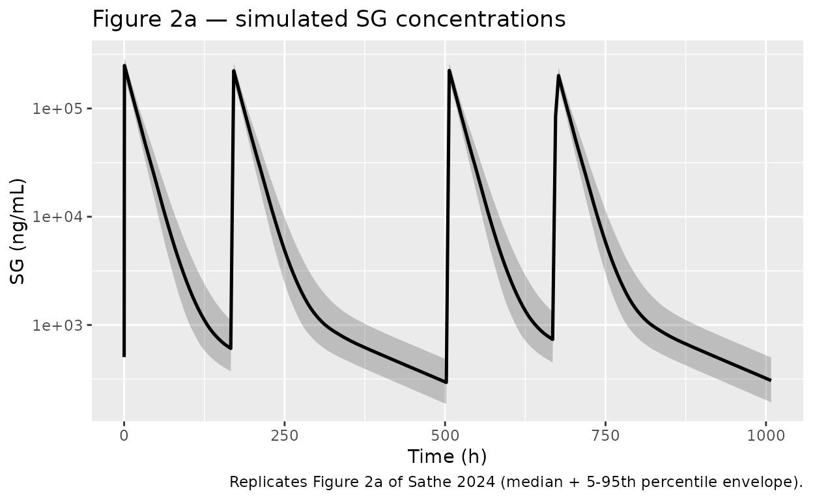
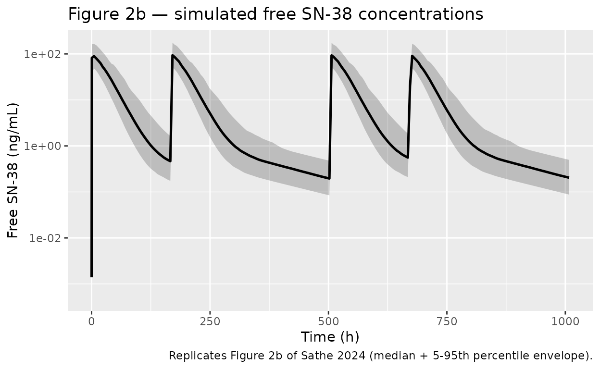
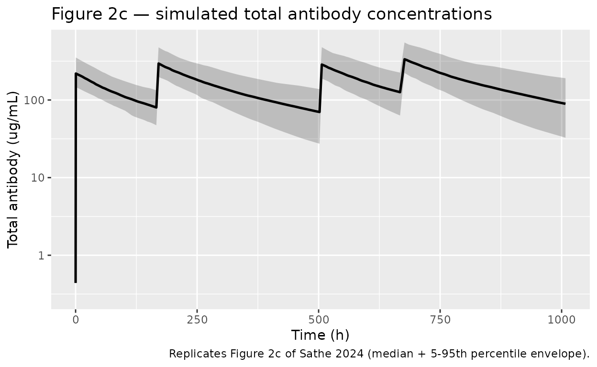
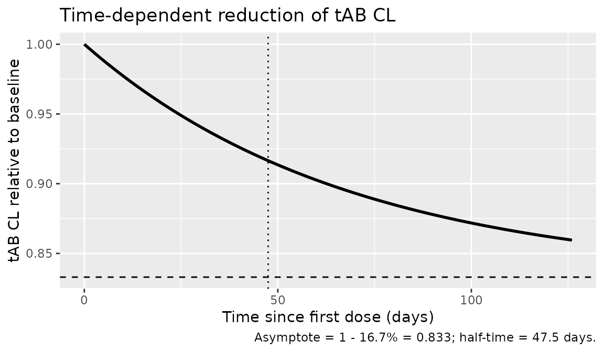

# Sacituzumab (Sathe 2024)

## Model and source

- Citation: Sathe AG, Singh I, Singh P, Diderichsen PM, Wang X, Chang P,
  Taqui A, Phan S, Girish S, Othman AA. Population Pharmacokinetics of
  Sacituzumab Govitecan in Patients with Metastatic Triple-Negative
  Breast Cancer and Other Solid Tumors. Clin Pharmacokinet.
  2024;63(5):669-681.
- Article: <https://doi.org/10.1007/s40262-024-01366-3>
- Open-access PMC version:
  <https://pmc.ncbi.nlm.nih.gov/articles/PMC11106201/>
- Supplement (NONMEM control streams, Section 6):
  <https://static-content.springer.com/esm/art%3A10.1007%2Fs40262-024-01366-3/MediaObjects/40262_2024_1366_MOESM1_ESM.pdf>

Sacituzumab govitecan (SG) is an antibody-drug conjugate (ADC) of an
anti-Trop-2 humanized monoclonal antibody (hRS7) covalently linked to
the topoisomerase 1 inhibitor SN-38 via a hydrolyzable linker (average
drug-to-antibody ratio = 8). This model jointly describes three analyte
profiles after SG infusion:

- **SG (the ADC)** — output `Cc` in the model. Two-compartment PK with
  body-weight allometric scaling and a baseline-albumin power covariate
  on CL.
- **Free SN-38 (the released payload)** — output `Cc_sn38`.
  Two-compartment PK generated sequentially from SG via a first-order
  release rate `KREL`. Apparent central and peripheral volumes are fixed
  to literature values (Klein et al. Clin Pharmacol Ther
  2002;72:638-647).
- **Total antibody (tAB)** — output `Cc_tab`. Two-compartment PK with
  time-dependent CL, IIV on CL and V1 with covariance, and covariates of
  baseline albumin (CL), tumor type (CL), and sex (V1).

## Population

The pooled analysis included 529 patients from the phase I/II
IMMU-132-01 (NCT01631552, n = 276) and phase III ASCENT (NCT02574455, n
= 253) studies. Patients had metastatic triple-negative breast cancer
(mTNBC, n = 277), metastatic urothelial cancer (mUC, n = 36), HR+/HER2-
metastatic breast cancer (n = 32), or other solid tumors (n = 184;
epithelial cancers including small-cell and non-small-cell lung,
colorectal, esophageal, and pancreatic ductal adenocarcinoma). Median
(range) age was 58 years (27-88), body weight 70 kg (37-140), and serum
albumin 38 g/L (19-50). 78% were female and 84% White (Sathe 2024
Section 3.1 and Table S2).

The full population metadata is available programmatically:

``` r

mod_meta <- rxode2::rxode(readModelDb("Sathe_2024_sacituzumab"))
#> ℹ parameter labels from comments will be replaced by 'label()'
str(mod_meta$population, max.level = 1)
#> List of 16
#>  $ n_subjects             : num 529
#>  $ n_studies              : num 2
#>  $ age_range              : chr "27-88 years"
#>  $ age_median             : chr "58 years"
#>  $ weight_range           : chr "37-140 kg"
#>  $ weight_median          : chr "70 kg"
#>  $ sex_female_pct         : num 78
#>  $ race_ethnicity         : Named num [1:4] 84 7 2 6
#>   ..- attr(*, "names")= chr [1:4] "White" "Black_or_African_American" "Asian" "Other"
#>  $ disease_state          : chr "Metastatic triple-negative breast cancer (mTNBC, n = 277), metastatic urothelial cancer (mUC, n = 36), HR+/HER2"| __truncated__
#>  $ dose_range             : chr "Phase I/II (IMMU-132-01): 8, 10, 12, or 18 mg/kg IV on days 1 and 8 of 21-day cycles. Phase III (ASCENT): 10 mg"| __truncated__
#>  $ regions                : chr "Multinational pooled analysis (IMMU-132-01 + ASCENT)"
#>  $ studies                : chr "IMMU-132-01 (NCT01631552, n = 276 of which mTNBC = 24, mUC = 36, HR+/HER2- mBC = 32, other = 184) and ASCENT (N"| __truncated__
#>  $ baseline_albumin_median: chr "38 g/L (range 19-50)"
#>  $ baseline_clcr_median   : chr "91 mL/min (range 22-262); 51% normal (>= 90), 38% mild impairment (60 to < 90), 11% moderate impairment (30 to "| __truncated__
#>  $ notes                  : chr "Sacituzumab govitecan is an ADC of an anti-Trop-2 humanized monoclonal antibody (hRS7) covalently linked to the"| __truncated__
#>  $ dosing_note            : chr "Each SG infusion event generates inputs to both the SG compartment and the tAB compartment. To simulate, provid"| __truncated__
```

## Source trace

| Equation / parameter | Value | Source location |
|----|----|----|
| `lcl` (SG CL) | log(0.13333) L/h | Sathe 2024 Table 1; supplement Section 6.b TH(1) FIX |
| `lvc` (SG V1) | log(2.77011) L | Sathe 2024 Table 1; supplement Section 6.b TH(2) FIX |
| `lq` (SG Q) | log(0.0055141) L/h | Sathe 2024 Table 1; supplement Section 6.b TH(3) FIX |
| `lvp` (SG V2) | log(0.907787) L | Sathe 2024 Table 1; supplement Section 6.b TH(4) FIX |
| `e_wt_cl_q` (Body-wt exponent on SG CL/Q) | 0.507571 | Sathe 2024 Table 1; supplement Section 6.b TH(6) FIX |
| `e_wt_vc_vp` (Body-wt exponent on SG V1/V2) | 0.532396 | Sathe 2024 Table 1; supplement Section 6.b TH(7) FIX |
| `e_alb_cl` (Baseline-albumin exponent on SG CL) | -0.355253 | Sathe 2024 Table 1; supplement Section 6.b TH(8) FIX |
| `lkrel` (log SG-to-SN-38 release rate) | -2.34 (= 0.0961 1/h) | Sathe 2024 Table 2 |
| `lcl_sn38` (log apparent SN-38 CL) | 6.02 (= 409 L/h) | Sathe 2024 Table 2 |
| `lq_sn38` (log apparent SN-38 Q) | 5.51 (= 247 L/h) | Sathe 2024 Table 2 |
| `lvc_sn38` (apparent SN-38 V1, FIXED) | log(49) L | Sathe 2024 Table 2; literature ref \[19\] (Klein 2002) |
| `lvp_sn38` (apparent SN-38 V2, FIXED) | log(2177) L | Sathe 2024 Table 2; literature ref \[19\] (Klein 2002) |
| `e_wt_cl_q_sn38` (Body-wt exponent on SN-38 CL/Q) | 0.500 | Sathe 2024 Table 2 |
| `lcl_tab` (tAB CL, baseline at t=0) | log(0.016) L/h | Sathe 2024 Table 3 |
| `lvc_tab` (tAB V1) | log(3.06) L | Sathe 2024 Table 3 |
| `lq_tab` (tAB Q) | log(0.010) L/h | Sathe 2024 Table 3 |
| `lvp_tab` (tAB V2) | log(1.20) L | Sathe 2024 Table 3 |
| `e_wt_cl_q_tab` (Body-wt exponent on tAB CL/Q) | 0.372 | Sathe 2024 Table 3 |
| `e_wt_vc_vp_tab` (Body-wt exponent on tAB V1/V2) | 0.446 | Sathe 2024 Table 3 |
| `e_alb_cl_tab` (Baseline-albumin exponent on tAB CL) | -0.735 | Sathe 2024 Table 3 |
| `e_tumor_cl_tab` (Tumor-Other multiplicative on tAB CL) | -0.134 | Sathe 2024 Table 3 |
| `e_sex_vc_tab` (Male multiplicative on tAB V1) | +0.121 | Sathe 2024 Table 3 |
| `maxRed_tab` (Max relative reduction of tAB CL) | 16.7% | Sathe 2024 Table 3 |
| `keff_tab` (tAB CL time-decline rate constant) | 6.08e-4 1/h | Sathe 2024 Table 3 |
| IIV variance on lcl | 0.011 | Sathe 2024 Table 1 |
| IIV BLOCK(2) on lkrel + lcl_sn38 | (0.332, 0.269, 0.411) | Sathe 2024 Table 2 |
| IIV BLOCK(2) on lcl_tab + lvc_tab | (0.100, 0.045, 0.046) | Sathe 2024 Table 3 |
| Residual SD on log SG | 0.204 | Sathe 2024 Table 1 |
| Residual SD on log SN-38 | 0.357 (= exp(-1.03)) | Sathe 2024 Table 2 |
| tAB additive residual SD | 27.3 ug/mL | Sathe 2024 Table 3 |
| tAB proportional residual SD | 0.207 | Sathe 2024 Table 3 |
| Equation: SG ODE (2-cmt linear) | n/a | Sathe 2024 Section 3.2; supplement Section 6.b \$DES |
| Equation: free SN-38 ODE (sequential generation from SG via KREL) | n/a | Sathe 2024 Section 3.3; supplement Section 6.b \$DES |
| Equation: tAB ODE (2-cmt linear with time-dependent CL) | n/a | Sathe 2024 Section 3.4; supplement Section 6.c |
| Equation: time-dependent tAB CL `1 - max/100 * (1 - exp(-keff*t))` | n/a | Sathe 2024 Table 3; supplement Section 6.c \$PK |

## Virtual cohort

Original observed data are not publicly available. The simulation below
uses a virtual cohort whose covariate distributions approximate Sathe
2024 Table S2: median body weight 70 kg (range 37-140), median baseline
albumin 38 g/L (range 19-50), 78% female, and tumor-type composition
matching the pooled analysis (52% mTNBC, 7% mUC, 6% HR+/HER2- mBC, 35%
other solid tumors).

``` r

set.seed(20240405)

n_subj <- 200
make_cohort <- function(n) {
  # Body weight: log-normal-ish around 70 kg, clamped to the source range.
  wt  <- pmin(pmax(round(rnorm(n, mean = 70, sd = 16), 1), 37), 140)
  # Baseline albumin: normal around 38 g/L, clamped to the source range.
  alb <- pmin(pmax(round(rnorm(n, mean = 38, sd = 5), 1), 19), 50)
  # Sex 78% female.
  sexf <- rbinom(n, 1, prob = 0.78)
  # Tumor type: 35% "Other" (per Sathe 2024 Table S2: 184/529).
  tumor_oth <- rbinom(n, 1, prob = 184/529)
  data.frame(
    id        = seq_len(n),
    WT        = wt,
    ALB       = alb,
    SEXF      = sexf,
    TUMTP_OTH = tumor_oth,
    cohort    = "10 mg/kg q1q8 of 21-day cycle"
  )
}

cov_df <- make_cohort(n_subj)

# Build the event table: 10 mg/kg as a 30-min IV infusion on days 1 and 8 of a
# 21-day cycle, two cycles. Each SG infusion needs TWO simultaneous dose events
# (cmt = central and cmt = central_tab) so that both compartments receive the
# same input mass at the same time (model file's documented dosing convention).
infusion_dur <- 0.5  # hours
dose_times_h <- c(0, 7 * 24, 21 * 24, 21 * 24 + 7 * 24)  # days 1, 8, 22, 29

events <- cov_df |>
  rowwise() |>
  do({
    rows <- .
    amt_dose <- 10 * rows$WT  # mg per dose at 10 mg/kg
    rate_dose <- amt_dose / infusion_dur
    dose_rows <- expand.grid(time = dose_times_h, cmt = c("central", "central_tab"),
                             stringsAsFactors = FALSE)
    dose_rows$id   <- rows$id
    dose_rows$amt  <- amt_dose
    dose_rows$rate <- rate_dose
    dose_rows$evid <- 1
    obs_rows <- data.frame(
      id = rows$id,
      time = c(0.001, seq(0.5, 21 * 24 + 7 * 24 + 14 * 24, length.out = 220)),
      cmt = "Cc", amt = NA_real_, rate = NA_real_, evid = 0
    )
    out <- dplyr::bind_rows(dose_rows, obs_rows)
    out$WT        <- rows$WT
    out$ALB       <- rows$ALB
    out$SEXF      <- rows$SEXF
    out$TUMTP_OTH <- rows$TUMTP_OTH
    out$cohort    <- rows$cohort
    out
  }) |>
  ungroup() |>
  arrange(id, time, evid)
```

## Simulation

``` r

mod <- rxode2::rxode(readModelDb("Sathe_2024_sacituzumab"))
#> ℹ parameter labels from comments will be replaced by 'label()'
sim <- rxode2::rxSolve(mod, events = events, keep = c("cohort", "WT"))
```

Typical-value simulation (no IIV / RUV) for replicating the paper’s
per-figure medians:

``` r

mod_typical <- mod |> rxode2::zeroRe()

typical_cov <- data.frame(
  id = 1, WT = 70, ALB = 38, SEXF = 1, TUMTP_OTH = 0
)
typical_events <- expand.grid(
  time = dose_times_h, cmt = c("central", "central_tab"),
  stringsAsFactors = FALSE
)
typical_events$id  <- 1
typical_events$amt <- 700
typical_events$rate <- 700 / infusion_dur
typical_events$evid <- 1
typical_obs <- data.frame(
  id = 1,
  time = c(0.001, seq(0.5, 21 * 24 + 7 * 24 + 14 * 24, length.out = 600)),
  cmt = "Cc", amt = NA_real_, rate = NA_real_, evid = 0
)
typical_events <- dplyr::bind_rows(typical_events, typical_obs)
typical_events$WT        <- 70
typical_events$ALB       <- 38
typical_events$SEXF      <- 1
typical_events$TUMTP_OTH <- 0

sim_typical <- rxode2::rxSolve(mod_typical, events = typical_events)
#> ℹ omega/sigma items treated as zero: 'etalcl', 'etalkrel', 'etalcl_sn38', 'etalcl_tab', 'etalvc_tab'
```

## Replicate published figures

### Figure 2a — SG concentrations versus time after last dose

The Sathe 2024 Figure 2a shows a prediction-corrected VPC for SG. With
virtual covariates and no observed data we show the simulated 5/50/95
percentiles versus time. Multiplying the model output (`Cc`, in ug/mL)
by 1000 converts to the paper’s reporting unit ng/mL.

``` r

sim_sg <- sim |>
  filter(time > 0) |>
  mutate(SG_ng_per_mL = Cc * 1000)

sim_sg_summary <- sim_sg |>
  group_by(time) |>
  summarise(
    Q05 = quantile(SG_ng_per_mL, 0.05, na.rm = TRUE),
    Q50 = quantile(SG_ng_per_mL, 0.50, na.rm = TRUE),
    Q95 = quantile(SG_ng_per_mL, 0.95, na.rm = TRUE),
    .groups = "drop"
  )

ggplot(sim_sg_summary, aes(time, Q50)) +
  geom_ribbon(aes(ymin = Q05, ymax = Q95), alpha = 0.25) +
  geom_line(linewidth = 0.9) +
  scale_y_log10() +
  labs(x = "Time (h)", y = "SG (ng/mL)",
       title = "Figure 2a — simulated SG concentrations",
       caption = "Replicates Figure 2a of Sathe 2024 (median + 5-95th percentile envelope).")
```



### Figure 2b — Free SN-38 concentrations versus time

``` r

sim_sn38 <- sim |>
  filter(time > 0) |>
  mutate(SN38_ng_per_mL = Cc_sn38 * 1000)

sim_sn38_summary <- sim_sn38 |>
  group_by(time) |>
  summarise(
    Q05 = quantile(SN38_ng_per_mL, 0.05, na.rm = TRUE),
    Q50 = quantile(SN38_ng_per_mL, 0.50, na.rm = TRUE),
    Q95 = quantile(SN38_ng_per_mL, 0.95, na.rm = TRUE),
    .groups = "drop"
  )

ggplot(sim_sn38_summary, aes(time, Q50)) +
  geom_ribbon(aes(ymin = Q05, ymax = Q95), alpha = 0.25) +
  geom_line(linewidth = 0.9) +
  scale_y_log10() +
  labs(x = "Time (h)", y = "Free SN-38 (ng/mL)",
       title = "Figure 2b — simulated free SN-38 concentrations",
       caption = "Replicates Figure 2b of Sathe 2024 (median + 5-95th percentile envelope).")
```



### Figure 2c — Total antibody concentrations versus time

``` r

sim_tab <- sim |>
  filter(time > 0)

sim_tab_summary <- sim_tab |>
  group_by(time) |>
  summarise(
    Q05 = quantile(Cc_tab, 0.05, na.rm = TRUE),
    Q50 = quantile(Cc_tab, 0.50, na.rm = TRUE),
    Q95 = quantile(Cc_tab, 0.95, na.rm = TRUE),
    .groups = "drop"
  )

ggplot(sim_tab_summary, aes(time, Q50)) +
  geom_ribbon(aes(ymin = Q05, ymax = Q95), alpha = 0.25) +
  geom_line(linewidth = 0.9) +
  scale_y_log10() +
  labs(x = "Time (h)", y = "Total antibody (ug/mL)",
       title = "Figure 2c — simulated total antibody concentrations",
       caption = "Replicates Figure 2c of Sathe 2024 (median + 5-95th percentile envelope).")
```



### Figure 3a — body-weight effect on SG AUC

Sathe 2024 Figure 3a/b show that body weights at the 5th (49 kg) and
95th (110 kg) percentiles produce SG AUC of 0.84 (95% CI 0.81-0.86) and
1.25 (95% CI 1.21-1.29) relative to a 70 kg typical patient, with
constant 10 mg/kg mg/kg dosing. Reproduce with the typical-value model:

``` r

bw_grid <- c(49, 70, 110)
out_bw <- lapply(bw_grid, function(wt) {
  ev <- expand.grid(time = dose_times_h, cmt = c("central", "central_tab"),
                    stringsAsFactors = FALSE)
  ev$id  <- 1
  ev$amt <- 10 * wt
  ev$rate <- (10 * wt) / infusion_dur
  ev$evid <- 1
  obs <- data.frame(id = 1, time = c(0.001, seq(0.5, 21 * 24, length.out = 250)),
                    cmt = "Cc", amt = NA_real_, rate = NA_real_, evid = 0)
  ev <- bind_rows(ev, obs)
  ev$WT <- wt; ev$ALB <- 38; ev$SEXF <- 1; ev$TUMTP_OTH <- 0
  s <- rxode2::rxSolve(mod_typical, events = ev)
  data.frame(WT = wt, time = s$time, Cc = s$Cc, Cc_tab = s$Cc_tab)
})
#> ℹ omega/sigma items treated as zero: 'etalcl', 'etalkrel', 'etalcl_sn38', 'etalcl_tab', 'etalvc_tab'
#> ℹ omega/sigma items treated as zero: 'etalcl', 'etalkrel', 'etalcl_sn38', 'etalcl_tab', 'etalvc_tab'
#> ℹ omega/sigma items treated as zero: 'etalcl', 'etalkrel', 'etalcl_sn38', 'etalcl_tab', 'etalvc_tab'
out_bw <- bind_rows(out_bw)

# AUC over the first 21-day treatment cycle via trapezoidal rule
trapz <- function(x, y) sum(diff(x) * (head(y, -1) + tail(y, -1)) / 2)

auc_first_cycle <- out_bw |>
  filter(time <= 21 * 24) |>
  group_by(WT) |>
  summarise(
    AUC_SG_ug_h_per_mL  = trapz(time, Cc),
    AUC_TAB_ug_h_per_mL = trapz(time, Cc_tab),
    .groups = "drop"
  )

ref_70 <- auc_first_cycle |> filter(WT == 70)
auc_relative <- auc_first_cycle |>
  mutate(
    SG_AUC_rel  = AUC_SG_ug_h_per_mL  / ref_70$AUC_SG_ug_h_per_mL,
    TAB_AUC_rel = AUC_TAB_ug_h_per_mL / ref_70$AUC_TAB_ug_h_per_mL
  )

knitr::kable(auc_relative, digits = 3,
             caption = "Body-weight effect on first-cycle AUC relative to a 70 kg typical patient.")
```

|  WT | AUC_SG_ug_h_per_mL | AUC_TAB_ug_h_per_mL | SG_AUC_rel | TAB_AUC_rel |
|----:|-------------------:|--------------------:|-----------:|------------:|
|  49 |           8825.842 |            55778.47 |      0.839 |       0.807 |
|  70 |          10518.741 |            69115.28 |      1.000 |       1.000 |
| 110 |          13138.178 |            90665.72 |      1.249 |       1.312 |

Body-weight effect on first-cycle AUC relative to a 70 kg typical
patient. {.table}

The simulated SG AUC ratios at 49 kg and 110 kg should bracket roughly
0.84 and 1.25 respectively (Sathe 2024 Figure 3a). Total antibody AUC
scales slightly more with body weight because the dosing regimen is
mg/kg-based and the allometric exponents on tAB CL/V are less than 1.

## PKNCA validation

Per Sathe 2024 Section 3.5, the simulated first-cycle AUC and Cmax are
compared across body-weight strata. Run PKNCA separately for each
analyte; carry the weight-band stratification through `keep`.

``` r

sim_first_cycle <- sim |>
  filter(time > 0, time <= 21 * 24) |>
  mutate(
    weight_band = case_when(
      WT < 60  ~ "Low (<60 kg)",
      WT > 90  ~ "High (>90 kg)",
      TRUE     ~ "Mid (60-90 kg)"
    )
  )

dose_first_cycle <- events |>
  filter(evid == 1, cmt == "central", time < 21 * 24) |>
  mutate(weight_band = case_when(
    WT < 60  ~ "Low (<60 kg)",
    WT > 90  ~ "High (>90 kg)",
    TRUE     ~ "Mid (60-90 kg)"
  )) |>
  select(id, time, amt, weight_band)
```

### SG NCA

``` r

sim_sg_nca <- sim_first_cycle |>
  filter(!is.na(Cc)) |>
  select(id, time, Cc, weight_band)

conc_sg <- PKNCA::PKNCAconc(sim_sg_nca, Cc ~ time | weight_band + id,
                            concu = "ug/mL", timeu = "h")
dose_sg <- PKNCA::PKNCAdose(dose_first_cycle, amt ~ time | weight_band + id,
                            doseu = "mg")

intervals_sg <- data.frame(
  start      = 0,
  end        = 21 * 24,
  cmax       = TRUE,
  tmax       = TRUE,
  auclast    = TRUE
)

nca_sg <- PKNCA::pk.nca(PKNCA::PKNCAdata(conc_sg, dose_sg, intervals = intervals_sg))
#> Warning: Requesting an AUC range starting (0) before the first measurement (0.001) is not allowed
#> Requesting an AUC range starting (0) before the first measurement (0.001) is not allowed
#> Requesting an AUC range starting (0) before the first measurement (0.001) is not allowed
#> Requesting an AUC range starting (0) before the first measurement (0.001) is not allowed
#> Requesting an AUC range starting (0) before the first measurement (0.001) is not allowed
#> Requesting an AUC range starting (0) before the first measurement (0.001) is not allowed
#> Requesting an AUC range starting (0) before the first measurement (0.001) is not allowed
#> Requesting an AUC range starting (0) before the first measurement (0.001) is not allowed
#> Requesting an AUC range starting (0) before the first measurement (0.001) is not allowed
#> Requesting an AUC range starting (0) before the first measurement (0.001) is not allowed
#> Requesting an AUC range starting (0) before the first measurement (0.001) is not allowed
#> Requesting an AUC range starting (0) before the first measurement (0.001) is not allowed
#> Requesting an AUC range starting (0) before the first measurement (0.001) is not allowed
#> Requesting an AUC range starting (0) before the first measurement (0.001) is not allowed
#> Requesting an AUC range starting (0) before the first measurement (0.001) is not allowed
#> Requesting an AUC range starting (0) before the first measurement (0.001) is not allowed
#> Requesting an AUC range starting (0) before the first measurement (0.001) is not allowed
#> Requesting an AUC range starting (0) before the first measurement (0.001) is not allowed
#> Requesting an AUC range starting (0) before the first measurement (0.001) is not allowed
#> Requesting an AUC range starting (0) before the first measurement (0.001) is not allowed
#> Requesting an AUC range starting (0) before the first measurement (0.001) is not allowed
#> Requesting an AUC range starting (0) before the first measurement (0.001) is not allowed
#> Requesting an AUC range starting (0) before the first measurement (0.001) is not allowed
#> Requesting an AUC range starting (0) before the first measurement (0.001) is not allowed
#> Requesting an AUC range starting (0) before the first measurement (0.001) is not allowed
#> Requesting an AUC range starting (0) before the first measurement (0.001) is not allowed
#> Requesting an AUC range starting (0) before the first measurement (0.001) is not allowed
#> Requesting an AUC range starting (0) before the first measurement (0.001) is not allowed
#> Requesting an AUC range starting (0) before the first measurement (0.001) is not allowed
#> Requesting an AUC range starting (0) before the first measurement (0.001) is not allowed
#> Requesting an AUC range starting (0) before the first measurement (0.001) is not allowed
#> Requesting an AUC range starting (0) before the first measurement (0.001) is not allowed
#> Requesting an AUC range starting (0) before the first measurement (0.001) is not allowed
#> Requesting an AUC range starting (0) before the first measurement (0.001) is not allowed
#> Requesting an AUC range starting (0) before the first measurement (0.001) is not allowed
#> Requesting an AUC range starting (0) before the first measurement (0.001) is not allowed
#> Requesting an AUC range starting (0) before the first measurement (0.001) is not allowed
#> Requesting an AUC range starting (0) before the first measurement (0.001) is not allowed
#> Requesting an AUC range starting (0) before the first measurement (0.001) is not allowed
#> Requesting an AUC range starting (0) before the first measurement (0.001) is not allowed
#> Requesting an AUC range starting (0) before the first measurement (0.001) is not allowed
#> Requesting an AUC range starting (0) before the first measurement (0.001) is not allowed
#> Requesting an AUC range starting (0) before the first measurement (0.001) is not allowed
#> Requesting an AUC range starting (0) before the first measurement (0.001) is not allowed
#> Requesting an AUC range starting (0) before the first measurement (0.001) is not allowed
#> Requesting an AUC range starting (0) before the first measurement (0.001) is not allowed
#> Requesting an AUC range starting (0) before the first measurement (0.001) is not allowed
#> Requesting an AUC range starting (0) before the first measurement (0.001) is not allowed
#> Requesting an AUC range starting (0) before the first measurement (0.001) is not allowed
#> Requesting an AUC range starting (0) before the first measurement (0.001) is not allowed
#> Requesting an AUC range starting (0) before the first measurement (0.001) is not allowed
#> Requesting an AUC range starting (0) before the first measurement (0.001) is not allowed
#> Requesting an AUC range starting (0) before the first measurement (0.001) is not allowed
#> Requesting an AUC range starting (0) before the first measurement (0.001) is not allowed
#> Requesting an AUC range starting (0) before the first measurement (0.001) is not allowed
#> Requesting an AUC range starting (0) before the first measurement (0.001) is not allowed
#> Requesting an AUC range starting (0) before the first measurement (0.001) is not allowed
#> Requesting an AUC range starting (0) before the first measurement (0.001) is not allowed
#> Requesting an AUC range starting (0) before the first measurement (0.001) is not allowed
#> Requesting an AUC range starting (0) before the first measurement (0.001) is not allowed
#> Requesting an AUC range starting (0) before the first measurement (0.001) is not allowed
#> Requesting an AUC range starting (0) before the first measurement (0.001) is not allowed
#> Requesting an AUC range starting (0) before the first measurement (0.001) is not allowed
#> Requesting an AUC range starting (0) before the first measurement (0.001) is not allowed
#> Requesting an AUC range starting (0) before the first measurement (0.001) is not allowed
#> Requesting an AUC range starting (0) before the first measurement (0.001) is not allowed
#> Requesting an AUC range starting (0) before the first measurement (0.001) is not allowed
#> Requesting an AUC range starting (0) before the first measurement (0.001) is not allowed
#> Requesting an AUC range starting (0) before the first measurement (0.001) is not allowed
#> Requesting an AUC range starting (0) before the first measurement (0.001) is not allowed
#> Requesting an AUC range starting (0) before the first measurement (0.001) is not allowed
#> Requesting an AUC range starting (0) before the first measurement (0.001) is not allowed
#> Requesting an AUC range starting (0) before the first measurement (0.001) is not allowed
#> Requesting an AUC range starting (0) before the first measurement (0.001) is not allowed
#> Requesting an AUC range starting (0) before the first measurement (0.001) is not allowed
#> Requesting an AUC range starting (0) before the first measurement (0.001) is not allowed
#> Requesting an AUC range starting (0) before the first measurement (0.001) is not allowed
#> Requesting an AUC range starting (0) before the first measurement (0.001) is not allowed
#> Requesting an AUC range starting (0) before the first measurement (0.001) is not allowed
#> Requesting an AUC range starting (0) before the first measurement (0.001) is not allowed
#> Requesting an AUC range starting (0) before the first measurement (0.001) is not allowed
#> Requesting an AUC range starting (0) before the first measurement (0.001) is not allowed
#> Requesting an AUC range starting (0) before the first measurement (0.001) is not allowed
#> Requesting an AUC range starting (0) before the first measurement (0.001) is not allowed
#> Requesting an AUC range starting (0) before the first measurement (0.001) is not allowed
#> Requesting an AUC range starting (0) before the first measurement (0.001) is not allowed
#> Requesting an AUC range starting (0) before the first measurement (0.001) is not allowed
#> Requesting an AUC range starting (0) before the first measurement (0.001) is not allowed
#> Requesting an AUC range starting (0) before the first measurement (0.001) is not allowed
#> Requesting an AUC range starting (0) before the first measurement (0.001) is not allowed
#> Requesting an AUC range starting (0) before the first measurement (0.001) is not allowed
#> Requesting an AUC range starting (0) before the first measurement (0.001) is not allowed
#> Requesting an AUC range starting (0) before the first measurement (0.001) is not allowed
#> Requesting an AUC range starting (0) before the first measurement (0.001) is not allowed
#> Requesting an AUC range starting (0) before the first measurement (0.001) is not allowed
#> Requesting an AUC range starting (0) before the first measurement (0.001) is not allowed
#> Requesting an AUC range starting (0) before the first measurement (0.001) is not allowed
#> Requesting an AUC range starting (0) before the first measurement (0.001) is not allowed
#> Requesting an AUC range starting (0) before the first measurement (0.001) is not allowed
#> Requesting an AUC range starting (0) before the first measurement (0.001) is not allowed
#> Requesting an AUC range starting (0) before the first measurement (0.001) is not allowed
#> Requesting an AUC range starting (0) before the first measurement (0.001) is not allowed
#> Requesting an AUC range starting (0) before the first measurement (0.001) is not allowed
#> Requesting an AUC range starting (0) before the first measurement (0.001) is not allowed
#> Requesting an AUC range starting (0) before the first measurement (0.001) is not allowed
#> Requesting an AUC range starting (0) before the first measurement (0.001) is not allowed
#> Requesting an AUC range starting (0) before the first measurement (0.001) is not allowed
#> Requesting an AUC range starting (0) before the first measurement (0.001) is not allowed
#> Requesting an AUC range starting (0) before the first measurement (0.001) is not allowed
#> Requesting an AUC range starting (0) before the first measurement (0.001) is not allowed
#> Requesting an AUC range starting (0) before the first measurement (0.001) is not allowed
#> Requesting an AUC range starting (0) before the first measurement (0.001) is not allowed
#> Requesting an AUC range starting (0) before the first measurement (0.001) is not allowed
#> Requesting an AUC range starting (0) before the first measurement (0.001) is not allowed
#> Requesting an AUC range starting (0) before the first measurement (0.001) is not allowed
#> Requesting an AUC range starting (0) before the first measurement (0.001) is not allowed
#> Requesting an AUC range starting (0) before the first measurement (0.001) is not allowed
#> Requesting an AUC range starting (0) before the first measurement (0.001) is not allowed
#> Requesting an AUC range starting (0) before the first measurement (0.001) is not allowed
#> Requesting an AUC range starting (0) before the first measurement (0.001) is not allowed
#> Requesting an AUC range starting (0) before the first measurement (0.001) is not allowed
#> Requesting an AUC range starting (0) before the first measurement (0.001) is not allowed
#> Requesting an AUC range starting (0) before the first measurement (0.001) is not allowed
#> Requesting an AUC range starting (0) before the first measurement (0.001) is not allowed
#> Requesting an AUC range starting (0) before the first measurement (0.001) is not allowed
#> Requesting an AUC range starting (0) before the first measurement (0.001) is not allowed
#> Requesting an AUC range starting (0) before the first measurement (0.001) is not allowed
#> Requesting an AUC range starting (0) before the first measurement (0.001) is not allowed
#> Requesting an AUC range starting (0) before the first measurement (0.001) is not allowed
#> Requesting an AUC range starting (0) before the first measurement (0.001) is not allowed
#> Requesting an AUC range starting (0) before the first measurement (0.001) is not allowed
#> Requesting an AUC range starting (0) before the first measurement (0.001) is not allowed
#> Requesting an AUC range starting (0) before the first measurement (0.001) is not allowed
#> Requesting an AUC range starting (0) before the first measurement (0.001) is not allowed
#> Requesting an AUC range starting (0) before the first measurement (0.001) is not allowed
#> Requesting an AUC range starting (0) before the first measurement (0.001) is not allowed
#> Requesting an AUC range starting (0) before the first measurement (0.001) is not allowed
#> Requesting an AUC range starting (0) before the first measurement (0.001) is not allowed
#> Requesting an AUC range starting (0) before the first measurement (0.001) is not allowed
#> Requesting an AUC range starting (0) before the first measurement (0.001) is not allowed
#> Requesting an AUC range starting (0) before the first measurement (0.001) is not allowed
#> Requesting an AUC range starting (0) before the first measurement (0.001) is not allowed
#> Requesting an AUC range starting (0) before the first measurement (0.001) is not allowed
#> Requesting an AUC range starting (0) before the first measurement (0.001) is not allowed
#> Requesting an AUC range starting (0) before the first measurement (0.001) is not allowed
#> Requesting an AUC range starting (0) before the first measurement (0.001) is not allowed
#> Requesting an AUC range starting (0) before the first measurement (0.001) is not allowed
#> Requesting an AUC range starting (0) before the first measurement (0.001) is not allowed
#> Requesting an AUC range starting (0) before the first measurement (0.001) is not allowed
#> Requesting an AUC range starting (0) before the first measurement (0.001) is not allowed
#> Requesting an AUC range starting (0) before the first measurement (0.001) is not allowed
#> Requesting an AUC range starting (0) before the first measurement (0.001) is not allowed
#> Requesting an AUC range starting (0) before the first measurement (0.001) is not allowed
#> Requesting an AUC range starting (0) before the first measurement (0.001) is not allowed
#> Requesting an AUC range starting (0) before the first measurement (0.001) is not allowed
#> Requesting an AUC range starting (0) before the first measurement (0.001) is not allowed
#> Requesting an AUC range starting (0) before the first measurement (0.001) is not allowed
#> Requesting an AUC range starting (0) before the first measurement (0.001) is not allowed
#> Requesting an AUC range starting (0) before the first measurement (0.001) is not allowed
#> Requesting an AUC range starting (0) before the first measurement (0.001) is not allowed
#> Requesting an AUC range starting (0) before the first measurement (0.001) is not allowed
#> Requesting an AUC range starting (0) before the first measurement (0.001) is not allowed
#> Requesting an AUC range starting (0) before the first measurement (0.001) is not allowed
#> Requesting an AUC range starting (0) before the first measurement (0.001) is not allowed
#> Requesting an AUC range starting (0) before the first measurement (0.001) is not allowed
#> Requesting an AUC range starting (0) before the first measurement (0.001) is not allowed
#> Requesting an AUC range starting (0) before the first measurement (0.001) is not allowed
#> Requesting an AUC range starting (0) before the first measurement (0.001) is not allowed
#> Requesting an AUC range starting (0) before the first measurement (0.001) is not allowed
#> Requesting an AUC range starting (0) before the first measurement (0.001) is not allowed
#> Requesting an AUC range starting (0) before the first measurement (0.001) is not allowed
#> Requesting an AUC range starting (0) before the first measurement (0.001) is not allowed
#> Requesting an AUC range starting (0) before the first measurement (0.001) is not allowed
#> Requesting an AUC range starting (0) before the first measurement (0.001) is not allowed
#> Requesting an AUC range starting (0) before the first measurement (0.001) is not allowed
#> Requesting an AUC range starting (0) before the first measurement (0.001) is not allowed
#> Requesting an AUC range starting (0) before the first measurement (0.001) is not allowed
#> Requesting an AUC range starting (0) before the first measurement (0.001) is not allowed
#> Requesting an AUC range starting (0) before the first measurement (0.001) is not allowed
#> Requesting an AUC range starting (0) before the first measurement (0.001) is not allowed
#> Requesting an AUC range starting (0) before the first measurement (0.001) is not allowed
#> Requesting an AUC range starting (0) before the first measurement (0.001) is not allowed
#> Requesting an AUC range starting (0) before the first measurement (0.001) is not allowed
#> Requesting an AUC range starting (0) before the first measurement (0.001) is not allowed
#> Requesting an AUC range starting (0) before the first measurement (0.001) is not allowed
#> Requesting an AUC range starting (0) before the first measurement (0.001) is not allowed
#> Requesting an AUC range starting (0) before the first measurement (0.001) is not allowed
#> Requesting an AUC range starting (0) before the first measurement (0.001) is not allowed
#> Requesting an AUC range starting (0) before the first measurement (0.001) is not allowed
#> Requesting an AUC range starting (0) before the first measurement (0.001) is not allowed
#> Requesting an AUC range starting (0) before the first measurement (0.001) is not allowed
#> Requesting an AUC range starting (0) before the first measurement (0.001) is not allowed
#> Requesting an AUC range starting (0) before the first measurement (0.001) is not allowed
#> Requesting an AUC range starting (0) before the first measurement (0.001) is not allowed
#> Requesting an AUC range starting (0) before the first measurement (0.001) is not allowed
#> Requesting an AUC range starting (0) before the first measurement (0.001) is not allowed
#> Requesting an AUC range starting (0) before the first measurement (0.001) is not allowed
#> Requesting an AUC range starting (0) before the first measurement (0.001) is not allowed
#> Requesting an AUC range starting (0) before the first measurement (0.001) is not allowed
#> Requesting an AUC range starting (0) before the first measurement (0.001) is not allowed
sg_summary <- as.data.frame(nca_sg$result) |>
  filter(PPTESTCD %in% c("cmax", "auclast")) |>
  group_by(weight_band, PPTESTCD) |>
  summarise(median = median(PPORRES, na.rm = TRUE),
            q05    = quantile(PPORRES, 0.05, na.rm = TRUE),
            q95    = quantile(PPORRES, 0.95, na.rm = TRUE),
            .groups = "drop")
knitr::kable(sg_summary, digits = 2,
             caption = "Simulated first-cycle SG Cmax (ug/mL) and AUClast (ug*h/mL) by body-weight band.")
```

| weight_band    | PPTESTCD | median |    q05 |    q95 |
|:---------------|:---------|-------:|-------:|-------:|
| High (\>90 kg) | auclast  |     NA |     NA |     NA |
| High (\>90 kg) | cmax     | 293.15 | 281.86 | 312.10 |
| Low (\<60 kg)  | auclast  |     NA |     NA |     NA |
| Low (\<60 kg)  | cmax     | 220.01 | 185.40 | 230.76 |
| Mid (60-90 kg) | auclast  |     NA |     NA |     NA |
| Mid (60-90 kg) | cmax     | 256.59 | 233.11 | 277.25 |

Simulated first-cycle SG Cmax (ug/mL) and AUClast (ug\*h/mL) by
body-weight band. {.table}

### Free SN-38 NCA

``` r

sim_sn38_nca <- sim_first_cycle |>
  filter(!is.na(Cc_sn38)) |>
  select(id, time, Cc_sn38, weight_band)
names(sim_sn38_nca)[names(sim_sn38_nca) == "Cc_sn38"] <- "Cc"

conc_sn38 <- PKNCA::PKNCAconc(sim_sn38_nca, Cc ~ time | weight_band + id,
                              concu = "ug/mL", timeu = "h")
nca_sn38 <- PKNCA::pk.nca(PKNCA::PKNCAdata(conc_sn38, dose_sg,
                                           intervals = intervals_sg))
#> Warning: Requesting an AUC range starting (0) before the first measurement (0.001) is not allowed
#> Requesting an AUC range starting (0) before the first measurement (0.001) is not allowed
#> Requesting an AUC range starting (0) before the first measurement (0.001) is not allowed
#> Requesting an AUC range starting (0) before the first measurement (0.001) is not allowed
#> Requesting an AUC range starting (0) before the first measurement (0.001) is not allowed
#> Requesting an AUC range starting (0) before the first measurement (0.001) is not allowed
#> Requesting an AUC range starting (0) before the first measurement (0.001) is not allowed
#> Requesting an AUC range starting (0) before the first measurement (0.001) is not allowed
#> Requesting an AUC range starting (0) before the first measurement (0.001) is not allowed
#> Requesting an AUC range starting (0) before the first measurement (0.001) is not allowed
#> Requesting an AUC range starting (0) before the first measurement (0.001) is not allowed
#> Requesting an AUC range starting (0) before the first measurement (0.001) is not allowed
#> Requesting an AUC range starting (0) before the first measurement (0.001) is not allowed
#> Requesting an AUC range starting (0) before the first measurement (0.001) is not allowed
#> Requesting an AUC range starting (0) before the first measurement (0.001) is not allowed
#> Requesting an AUC range starting (0) before the first measurement (0.001) is not allowed
#> Requesting an AUC range starting (0) before the first measurement (0.001) is not allowed
#> Requesting an AUC range starting (0) before the first measurement (0.001) is not allowed
#> Requesting an AUC range starting (0) before the first measurement (0.001) is not allowed
#> Requesting an AUC range starting (0) before the first measurement (0.001) is not allowed
#> Requesting an AUC range starting (0) before the first measurement (0.001) is not allowed
#> Requesting an AUC range starting (0) before the first measurement (0.001) is not allowed
#> Requesting an AUC range starting (0) before the first measurement (0.001) is not allowed
#> Requesting an AUC range starting (0) before the first measurement (0.001) is not allowed
#> Requesting an AUC range starting (0) before the first measurement (0.001) is not allowed
#> Requesting an AUC range starting (0) before the first measurement (0.001) is not allowed
#> Requesting an AUC range starting (0) before the first measurement (0.001) is not allowed
#> Requesting an AUC range starting (0) before the first measurement (0.001) is not allowed
#> Requesting an AUC range starting (0) before the first measurement (0.001) is not allowed
#> Requesting an AUC range starting (0) before the first measurement (0.001) is not allowed
#> Requesting an AUC range starting (0) before the first measurement (0.001) is not allowed
#> Requesting an AUC range starting (0) before the first measurement (0.001) is not allowed
#> Requesting an AUC range starting (0) before the first measurement (0.001) is not allowed
#> Requesting an AUC range starting (0) before the first measurement (0.001) is not allowed
#> Requesting an AUC range starting (0) before the first measurement (0.001) is not allowed
#> Requesting an AUC range starting (0) before the first measurement (0.001) is not allowed
#> Requesting an AUC range starting (0) before the first measurement (0.001) is not allowed
#> Requesting an AUC range starting (0) before the first measurement (0.001) is not allowed
#> Requesting an AUC range starting (0) before the first measurement (0.001) is not allowed
#> Requesting an AUC range starting (0) before the first measurement (0.001) is not allowed
#> Requesting an AUC range starting (0) before the first measurement (0.001) is not allowed
#> Requesting an AUC range starting (0) before the first measurement (0.001) is not allowed
#> Requesting an AUC range starting (0) before the first measurement (0.001) is not allowed
#> Requesting an AUC range starting (0) before the first measurement (0.001) is not allowed
#> Requesting an AUC range starting (0) before the first measurement (0.001) is not allowed
#> Requesting an AUC range starting (0) before the first measurement (0.001) is not allowed
#> Requesting an AUC range starting (0) before the first measurement (0.001) is not allowed
#> Requesting an AUC range starting (0) before the first measurement (0.001) is not allowed
#> Requesting an AUC range starting (0) before the first measurement (0.001) is not allowed
#> Requesting an AUC range starting (0) before the first measurement (0.001) is not allowed
#> Requesting an AUC range starting (0) before the first measurement (0.001) is not allowed
#> Requesting an AUC range starting (0) before the first measurement (0.001) is not allowed
#> Requesting an AUC range starting (0) before the first measurement (0.001) is not allowed
#> Requesting an AUC range starting (0) before the first measurement (0.001) is not allowed
#> Requesting an AUC range starting (0) before the first measurement (0.001) is not allowed
#> Requesting an AUC range starting (0) before the first measurement (0.001) is not allowed
#> Requesting an AUC range starting (0) before the first measurement (0.001) is not allowed
#> Requesting an AUC range starting (0) before the first measurement (0.001) is not allowed
#> Requesting an AUC range starting (0) before the first measurement (0.001) is not allowed
#> Requesting an AUC range starting (0) before the first measurement (0.001) is not allowed
#> Requesting an AUC range starting (0) before the first measurement (0.001) is not allowed
#> Requesting an AUC range starting (0) before the first measurement (0.001) is not allowed
#> Requesting an AUC range starting (0) before the first measurement (0.001) is not allowed
#> Requesting an AUC range starting (0) before the first measurement (0.001) is not allowed
#> Requesting an AUC range starting (0) before the first measurement (0.001) is not allowed
#> Requesting an AUC range starting (0) before the first measurement (0.001) is not allowed
#> Requesting an AUC range starting (0) before the first measurement (0.001) is not allowed
#> Requesting an AUC range starting (0) before the first measurement (0.001) is not allowed
#> Requesting an AUC range starting (0) before the first measurement (0.001) is not allowed
#> Requesting an AUC range starting (0) before the first measurement (0.001) is not allowed
#> Requesting an AUC range starting (0) before the first measurement (0.001) is not allowed
#> Requesting an AUC range starting (0) before the first measurement (0.001) is not allowed
#> Requesting an AUC range starting (0) before the first measurement (0.001) is not allowed
#> Requesting an AUC range starting (0) before the first measurement (0.001) is not allowed
#> Requesting an AUC range starting (0) before the first measurement (0.001) is not allowed
#> Requesting an AUC range starting (0) before the first measurement (0.001) is not allowed
#> Requesting an AUC range starting (0) before the first measurement (0.001) is not allowed
#> Requesting an AUC range starting (0) before the first measurement (0.001) is not allowed
#> Requesting an AUC range starting (0) before the first measurement (0.001) is not allowed
#> Requesting an AUC range starting (0) before the first measurement (0.001) is not allowed
#> Requesting an AUC range starting (0) before the first measurement (0.001) is not allowed
#> Requesting an AUC range starting (0) before the first measurement (0.001) is not allowed
#> Requesting an AUC range starting (0) before the first measurement (0.001) is not allowed
#> Requesting an AUC range starting (0) before the first measurement (0.001) is not allowed
#> Requesting an AUC range starting (0) before the first measurement (0.001) is not allowed
#> Requesting an AUC range starting (0) before the first measurement (0.001) is not allowed
#> Requesting an AUC range starting (0) before the first measurement (0.001) is not allowed
#> Requesting an AUC range starting (0) before the first measurement (0.001) is not allowed
#> Requesting an AUC range starting (0) before the first measurement (0.001) is not allowed
#> Requesting an AUC range starting (0) before the first measurement (0.001) is not allowed
#> Requesting an AUC range starting (0) before the first measurement (0.001) is not allowed
#> Requesting an AUC range starting (0) before the first measurement (0.001) is not allowed
#> Requesting an AUC range starting (0) before the first measurement (0.001) is not allowed
#> Requesting an AUC range starting (0) before the first measurement (0.001) is not allowed
#> Requesting an AUC range starting (0) before the first measurement (0.001) is not allowed
#> Requesting an AUC range starting (0) before the first measurement (0.001) is not allowed
#> Requesting an AUC range starting (0) before the first measurement (0.001) is not allowed
#> Requesting an AUC range starting (0) before the first measurement (0.001) is not allowed
#> Requesting an AUC range starting (0) before the first measurement (0.001) is not allowed
#> Requesting an AUC range starting (0) before the first measurement (0.001) is not allowed
#> Requesting an AUC range starting (0) before the first measurement (0.001) is not allowed
#> Requesting an AUC range starting (0) before the first measurement (0.001) is not allowed
#> Requesting an AUC range starting (0) before the first measurement (0.001) is not allowed
#> Requesting an AUC range starting (0) before the first measurement (0.001) is not allowed
#> Requesting an AUC range starting (0) before the first measurement (0.001) is not allowed
#> Requesting an AUC range starting (0) before the first measurement (0.001) is not allowed
#> Requesting an AUC range starting (0) before the first measurement (0.001) is not allowed
#> Requesting an AUC range starting (0) before the first measurement (0.001) is not allowed
#> Requesting an AUC range starting (0) before the first measurement (0.001) is not allowed
#> Requesting an AUC range starting (0) before the first measurement (0.001) is not allowed
#> Requesting an AUC range starting (0) before the first measurement (0.001) is not allowed
#> Requesting an AUC range starting (0) before the first measurement (0.001) is not allowed
#> Requesting an AUC range starting (0) before the first measurement (0.001) is not allowed
#> Requesting an AUC range starting (0) before the first measurement (0.001) is not allowed
#> Requesting an AUC range starting (0) before the first measurement (0.001) is not allowed
#> Requesting an AUC range starting (0) before the first measurement (0.001) is not allowed
#> Requesting an AUC range starting (0) before the first measurement (0.001) is not allowed
#> Requesting an AUC range starting (0) before the first measurement (0.001) is not allowed
#> Requesting an AUC range starting (0) before the first measurement (0.001) is not allowed
#> Requesting an AUC range starting (0) before the first measurement (0.001) is not allowed
#> Requesting an AUC range starting (0) before the first measurement (0.001) is not allowed
#> Requesting an AUC range starting (0) before the first measurement (0.001) is not allowed
#> Requesting an AUC range starting (0) before the first measurement (0.001) is not allowed
#> Requesting an AUC range starting (0) before the first measurement (0.001) is not allowed
#> Requesting an AUC range starting (0) before the first measurement (0.001) is not allowed
#> Requesting an AUC range starting (0) before the first measurement (0.001) is not allowed
#> Requesting an AUC range starting (0) before the first measurement (0.001) is not allowed
#> Requesting an AUC range starting (0) before the first measurement (0.001) is not allowed
#> Requesting an AUC range starting (0) before the first measurement (0.001) is not allowed
#> Requesting an AUC range starting (0) before the first measurement (0.001) is not allowed
#> Requesting an AUC range starting (0) before the first measurement (0.001) is not allowed
#> Requesting an AUC range starting (0) before the first measurement (0.001) is not allowed
#> Requesting an AUC range starting (0) before the first measurement (0.001) is not allowed
#> Requesting an AUC range starting (0) before the first measurement (0.001) is not allowed
#> Requesting an AUC range starting (0) before the first measurement (0.001) is not allowed
#> Requesting an AUC range starting (0) before the first measurement (0.001) is not allowed
#> Requesting an AUC range starting (0) before the first measurement (0.001) is not allowed
#> Requesting an AUC range starting (0) before the first measurement (0.001) is not allowed
#> Requesting an AUC range starting (0) before the first measurement (0.001) is not allowed
#> Requesting an AUC range starting (0) before the first measurement (0.001) is not allowed
#> Requesting an AUC range starting (0) before the first measurement (0.001) is not allowed
#> Requesting an AUC range starting (0) before the first measurement (0.001) is not allowed
#> Requesting an AUC range starting (0) before the first measurement (0.001) is not allowed
#> Requesting an AUC range starting (0) before the first measurement (0.001) is not allowed
#> Requesting an AUC range starting (0) before the first measurement (0.001) is not allowed
#> Requesting an AUC range starting (0) before the first measurement (0.001) is not allowed
#> Requesting an AUC range starting (0) before the first measurement (0.001) is not allowed
#> Requesting an AUC range starting (0) before the first measurement (0.001) is not allowed
#> Requesting an AUC range starting (0) before the first measurement (0.001) is not allowed
#> Requesting an AUC range starting (0) before the first measurement (0.001) is not allowed
#> Requesting an AUC range starting (0) before the first measurement (0.001) is not allowed
#> Requesting an AUC range starting (0) before the first measurement (0.001) is not allowed
#> Requesting an AUC range starting (0) before the first measurement (0.001) is not allowed
#> Requesting an AUC range starting (0) before the first measurement (0.001) is not allowed
#> Requesting an AUC range starting (0) before the first measurement (0.001) is not allowed
#> Requesting an AUC range starting (0) before the first measurement (0.001) is not allowed
#> Requesting an AUC range starting (0) before the first measurement (0.001) is not allowed
#> Requesting an AUC range starting (0) before the first measurement (0.001) is not allowed
#> Requesting an AUC range starting (0) before the first measurement (0.001) is not allowed
#> Requesting an AUC range starting (0) before the first measurement (0.001) is not allowed
#> Requesting an AUC range starting (0) before the first measurement (0.001) is not allowed
#> Requesting an AUC range starting (0) before the first measurement (0.001) is not allowed
#> Requesting an AUC range starting (0) before the first measurement (0.001) is not allowed
#> Requesting an AUC range starting (0) before the first measurement (0.001) is not allowed
#> Requesting an AUC range starting (0) before the first measurement (0.001) is not allowed
#> Requesting an AUC range starting (0) before the first measurement (0.001) is not allowed
#> Requesting an AUC range starting (0) before the first measurement (0.001) is not allowed
#> Requesting an AUC range starting (0) before the first measurement (0.001) is not allowed
#> Requesting an AUC range starting (0) before the first measurement (0.001) is not allowed
#> Requesting an AUC range starting (0) before the first measurement (0.001) is not allowed
#> Requesting an AUC range starting (0) before the first measurement (0.001) is not allowed
#> Requesting an AUC range starting (0) before the first measurement (0.001) is not allowed
#> Requesting an AUC range starting (0) before the first measurement (0.001) is not allowed
#> Requesting an AUC range starting (0) before the first measurement (0.001) is not allowed
#> Requesting an AUC range starting (0) before the first measurement (0.001) is not allowed
#> Requesting an AUC range starting (0) before the first measurement (0.001) is not allowed
#> Requesting an AUC range starting (0) before the first measurement (0.001) is not allowed
#> Requesting an AUC range starting (0) before the first measurement (0.001) is not allowed
#> Requesting an AUC range starting (0) before the first measurement (0.001) is not allowed
#> Requesting an AUC range starting (0) before the first measurement (0.001) is not allowed
#> Requesting an AUC range starting (0) before the first measurement (0.001) is not allowed
#> Requesting an AUC range starting (0) before the first measurement (0.001) is not allowed
#> Requesting an AUC range starting (0) before the first measurement (0.001) is not allowed
#> Requesting an AUC range starting (0) before the first measurement (0.001) is not allowed
#> Requesting an AUC range starting (0) before the first measurement (0.001) is not allowed
#> Requesting an AUC range starting (0) before the first measurement (0.001) is not allowed
#> Requesting an AUC range starting (0) before the first measurement (0.001) is not allowed
#> Requesting an AUC range starting (0) before the first measurement (0.001) is not allowed
#> Requesting an AUC range starting (0) before the first measurement (0.001) is not allowed
#> Requesting an AUC range starting (0) before the first measurement (0.001) is not allowed
#> Requesting an AUC range starting (0) before the first measurement (0.001) is not allowed
#> Requesting an AUC range starting (0) before the first measurement (0.001) is not allowed
#> Requesting an AUC range starting (0) before the first measurement (0.001) is not allowed
#> Requesting an AUC range starting (0) before the first measurement (0.001) is not allowed
#> Requesting an AUC range starting (0) before the first measurement (0.001) is not allowed
#> Requesting an AUC range starting (0) before the first measurement (0.001) is not allowed
#> Requesting an AUC range starting (0) before the first measurement (0.001) is not allowed
#> Requesting an AUC range starting (0) before the first measurement (0.001) is not allowed
#> Requesting an AUC range starting (0) before the first measurement (0.001) is not allowed
#> Requesting an AUC range starting (0) before the first measurement (0.001) is not allowed
sn38_summary <- as.data.frame(nca_sn38$result) |>
  filter(PPTESTCD %in% c("cmax", "auclast")) |>
  group_by(weight_band, PPTESTCD) |>
  summarise(median = median(PPORRES, na.rm = TRUE),
            q05    = quantile(PPORRES, 0.05, na.rm = TRUE),
            q95    = quantile(PPORRES, 0.95, na.rm = TRUE),
            .groups = "drop")
knitr::kable(sn38_summary, digits = 4,
             caption = "Simulated first-cycle free SN-38 Cmax (ug/mL) and AUClast (ug*h/mL) by body-weight band.")
```

| weight_band    | PPTESTCD | median |    q05 |    q95 |
|:---------------|:---------|-------:|-------:|-------:|
| High (\>90 kg) | auclast  |     NA |     NA |     NA |
| High (\>90 kg) | cmax     | 0.0919 | 0.0471 | 0.1736 |
| Low (\<60 kg)  | auclast  |     NA |     NA |     NA |
| Low (\<60 kg)  | cmax     | 0.0781 | 0.0472 | 0.1492 |
| Mid (60-90 kg) | auclast  |     NA |     NA |     NA |
| Mid (60-90 kg) | cmax     | 0.0962 | 0.0580 | 0.1791 |

Simulated first-cycle free SN-38 Cmax (ug/mL) and AUClast (ug\*h/mL) by
body-weight band. {.table}

### Total antibody NCA

``` r

sim_tab_nca <- sim_first_cycle |>
  filter(!is.na(Cc_tab)) |>
  select(id, time, Cc_tab, weight_band)
names(sim_tab_nca)[names(sim_tab_nca) == "Cc_tab"] <- "Cc"

conc_tab <- PKNCA::PKNCAconc(sim_tab_nca, Cc ~ time | weight_band + id,
                             concu = "ug/mL", timeu = "h")
nca_tab <- PKNCA::pk.nca(PKNCA::PKNCAdata(conc_tab, dose_sg,
                                          intervals = intervals_sg))
#> Warning: Requesting an AUC range starting (0) before the first measurement (0.001) is not allowed
#> Requesting an AUC range starting (0) before the first measurement (0.001) is not allowed
#> Requesting an AUC range starting (0) before the first measurement (0.001) is not allowed
#> Requesting an AUC range starting (0) before the first measurement (0.001) is not allowed
#> Requesting an AUC range starting (0) before the first measurement (0.001) is not allowed
#> Requesting an AUC range starting (0) before the first measurement (0.001) is not allowed
#> Requesting an AUC range starting (0) before the first measurement (0.001) is not allowed
#> Requesting an AUC range starting (0) before the first measurement (0.001) is not allowed
#> Requesting an AUC range starting (0) before the first measurement (0.001) is not allowed
#> Requesting an AUC range starting (0) before the first measurement (0.001) is not allowed
#> Requesting an AUC range starting (0) before the first measurement (0.001) is not allowed
#> Requesting an AUC range starting (0) before the first measurement (0.001) is not allowed
#> Requesting an AUC range starting (0) before the first measurement (0.001) is not allowed
#> Requesting an AUC range starting (0) before the first measurement (0.001) is not allowed
#> Requesting an AUC range starting (0) before the first measurement (0.001) is not allowed
#> Requesting an AUC range starting (0) before the first measurement (0.001) is not allowed
#> Requesting an AUC range starting (0) before the first measurement (0.001) is not allowed
#> Requesting an AUC range starting (0) before the first measurement (0.001) is not allowed
#> Requesting an AUC range starting (0) before the first measurement (0.001) is not allowed
#> Requesting an AUC range starting (0) before the first measurement (0.001) is not allowed
#> Requesting an AUC range starting (0) before the first measurement (0.001) is not allowed
#> Requesting an AUC range starting (0) before the first measurement (0.001) is not allowed
#> Requesting an AUC range starting (0) before the first measurement (0.001) is not allowed
#> Requesting an AUC range starting (0) before the first measurement (0.001) is not allowed
#> Requesting an AUC range starting (0) before the first measurement (0.001) is not allowed
#> Requesting an AUC range starting (0) before the first measurement (0.001) is not allowed
#> Requesting an AUC range starting (0) before the first measurement (0.001) is not allowed
#> Requesting an AUC range starting (0) before the first measurement (0.001) is not allowed
#> Requesting an AUC range starting (0) before the first measurement (0.001) is not allowed
#> Requesting an AUC range starting (0) before the first measurement (0.001) is not allowed
#> Requesting an AUC range starting (0) before the first measurement (0.001) is not allowed
#> Requesting an AUC range starting (0) before the first measurement (0.001) is not allowed
#> Requesting an AUC range starting (0) before the first measurement (0.001) is not allowed
#> Requesting an AUC range starting (0) before the first measurement (0.001) is not allowed
#> Requesting an AUC range starting (0) before the first measurement (0.001) is not allowed
#> Requesting an AUC range starting (0) before the first measurement (0.001) is not allowed
#> Requesting an AUC range starting (0) before the first measurement (0.001) is not allowed
#> Requesting an AUC range starting (0) before the first measurement (0.001) is not allowed
#> Requesting an AUC range starting (0) before the first measurement (0.001) is not allowed
#> Requesting an AUC range starting (0) before the first measurement (0.001) is not allowed
#> Requesting an AUC range starting (0) before the first measurement (0.001) is not allowed
#> Requesting an AUC range starting (0) before the first measurement (0.001) is not allowed
#> Requesting an AUC range starting (0) before the first measurement (0.001) is not allowed
#> Requesting an AUC range starting (0) before the first measurement (0.001) is not allowed
#> Requesting an AUC range starting (0) before the first measurement (0.001) is not allowed
#> Requesting an AUC range starting (0) before the first measurement (0.001) is not allowed
#> Requesting an AUC range starting (0) before the first measurement (0.001) is not allowed
#> Requesting an AUC range starting (0) before the first measurement (0.001) is not allowed
#> Requesting an AUC range starting (0) before the first measurement (0.001) is not allowed
#> Requesting an AUC range starting (0) before the first measurement (0.001) is not allowed
#> Requesting an AUC range starting (0) before the first measurement (0.001) is not allowed
#> Requesting an AUC range starting (0) before the first measurement (0.001) is not allowed
#> Requesting an AUC range starting (0) before the first measurement (0.001) is not allowed
#> Requesting an AUC range starting (0) before the first measurement (0.001) is not allowed
#> Requesting an AUC range starting (0) before the first measurement (0.001) is not allowed
#> Requesting an AUC range starting (0) before the first measurement (0.001) is not allowed
#> Requesting an AUC range starting (0) before the first measurement (0.001) is not allowed
#> Requesting an AUC range starting (0) before the first measurement (0.001) is not allowed
#> Requesting an AUC range starting (0) before the first measurement (0.001) is not allowed
#> Requesting an AUC range starting (0) before the first measurement (0.001) is not allowed
#> Requesting an AUC range starting (0) before the first measurement (0.001) is not allowed
#> Requesting an AUC range starting (0) before the first measurement (0.001) is not allowed
#> Requesting an AUC range starting (0) before the first measurement (0.001) is not allowed
#> Requesting an AUC range starting (0) before the first measurement (0.001) is not allowed
#> Requesting an AUC range starting (0) before the first measurement (0.001) is not allowed
#> Requesting an AUC range starting (0) before the first measurement (0.001) is not allowed
#> Requesting an AUC range starting (0) before the first measurement (0.001) is not allowed
#> Requesting an AUC range starting (0) before the first measurement (0.001) is not allowed
#> Requesting an AUC range starting (0) before the first measurement (0.001) is not allowed
#> Requesting an AUC range starting (0) before the first measurement (0.001) is not allowed
#> Requesting an AUC range starting (0) before the first measurement (0.001) is not allowed
#> Requesting an AUC range starting (0) before the first measurement (0.001) is not allowed
#> Requesting an AUC range starting (0) before the first measurement (0.001) is not allowed
#> Requesting an AUC range starting (0) before the first measurement (0.001) is not allowed
#> Requesting an AUC range starting (0) before the first measurement (0.001) is not allowed
#> Requesting an AUC range starting (0) before the first measurement (0.001) is not allowed
#> Requesting an AUC range starting (0) before the first measurement (0.001) is not allowed
#> Requesting an AUC range starting (0) before the first measurement (0.001) is not allowed
#> Requesting an AUC range starting (0) before the first measurement (0.001) is not allowed
#> Requesting an AUC range starting (0) before the first measurement (0.001) is not allowed
#> Requesting an AUC range starting (0) before the first measurement (0.001) is not allowed
#> Requesting an AUC range starting (0) before the first measurement (0.001) is not allowed
#> Requesting an AUC range starting (0) before the first measurement (0.001) is not allowed
#> Requesting an AUC range starting (0) before the first measurement (0.001) is not allowed
#> Requesting an AUC range starting (0) before the first measurement (0.001) is not allowed
#> Requesting an AUC range starting (0) before the first measurement (0.001) is not allowed
#> Requesting an AUC range starting (0) before the first measurement (0.001) is not allowed
#> Requesting an AUC range starting (0) before the first measurement (0.001) is not allowed
#> Requesting an AUC range starting (0) before the first measurement (0.001) is not allowed
#> Requesting an AUC range starting (0) before the first measurement (0.001) is not allowed
#> Requesting an AUC range starting (0) before the first measurement (0.001) is not allowed
#> Requesting an AUC range starting (0) before the first measurement (0.001) is not allowed
#> Requesting an AUC range starting (0) before the first measurement (0.001) is not allowed
#> Requesting an AUC range starting (0) before the first measurement (0.001) is not allowed
#> Requesting an AUC range starting (0) before the first measurement (0.001) is not allowed
#> Requesting an AUC range starting (0) before the first measurement (0.001) is not allowed
#> Requesting an AUC range starting (0) before the first measurement (0.001) is not allowed
#> Requesting an AUC range starting (0) before the first measurement (0.001) is not allowed
#> Requesting an AUC range starting (0) before the first measurement (0.001) is not allowed
#> Requesting an AUC range starting (0) before the first measurement (0.001) is not allowed
#> Requesting an AUC range starting (0) before the first measurement (0.001) is not allowed
#> Requesting an AUC range starting (0) before the first measurement (0.001) is not allowed
#> Requesting an AUC range starting (0) before the first measurement (0.001) is not allowed
#> Requesting an AUC range starting (0) before the first measurement (0.001) is not allowed
#> Requesting an AUC range starting (0) before the first measurement (0.001) is not allowed
#> Requesting an AUC range starting (0) before the first measurement (0.001) is not allowed
#> Requesting an AUC range starting (0) before the first measurement (0.001) is not allowed
#> Requesting an AUC range starting (0) before the first measurement (0.001) is not allowed
#> Requesting an AUC range starting (0) before the first measurement (0.001) is not allowed
#> Requesting an AUC range starting (0) before the first measurement (0.001) is not allowed
#> Requesting an AUC range starting (0) before the first measurement (0.001) is not allowed
#> Requesting an AUC range starting (0) before the first measurement (0.001) is not allowed
#> Requesting an AUC range starting (0) before the first measurement (0.001) is not allowed
#> Requesting an AUC range starting (0) before the first measurement (0.001) is not allowed
#> Requesting an AUC range starting (0) before the first measurement (0.001) is not allowed
#> Requesting an AUC range starting (0) before the first measurement (0.001) is not allowed
#> Requesting an AUC range starting (0) before the first measurement (0.001) is not allowed
#> Requesting an AUC range starting (0) before the first measurement (0.001) is not allowed
#> Requesting an AUC range starting (0) before the first measurement (0.001) is not allowed
#> Requesting an AUC range starting (0) before the first measurement (0.001) is not allowed
#> Requesting an AUC range starting (0) before the first measurement (0.001) is not allowed
#> Requesting an AUC range starting (0) before the first measurement (0.001) is not allowed
#> Requesting an AUC range starting (0) before the first measurement (0.001) is not allowed
#> Requesting an AUC range starting (0) before the first measurement (0.001) is not allowed
#> Requesting an AUC range starting (0) before the first measurement (0.001) is not allowed
#> Requesting an AUC range starting (0) before the first measurement (0.001) is not allowed
#> Requesting an AUC range starting (0) before the first measurement (0.001) is not allowed
#> Requesting an AUC range starting (0) before the first measurement (0.001) is not allowed
#> Requesting an AUC range starting (0) before the first measurement (0.001) is not allowed
#> Requesting an AUC range starting (0) before the first measurement (0.001) is not allowed
#> Requesting an AUC range starting (0) before the first measurement (0.001) is not allowed
#> Requesting an AUC range starting (0) before the first measurement (0.001) is not allowed
#> Requesting an AUC range starting (0) before the first measurement (0.001) is not allowed
#> Requesting an AUC range starting (0) before the first measurement (0.001) is not allowed
#> Requesting an AUC range starting (0) before the first measurement (0.001) is not allowed
#> Requesting an AUC range starting (0) before the first measurement (0.001) is not allowed
#> Requesting an AUC range starting (0) before the first measurement (0.001) is not allowed
#> Requesting an AUC range starting (0) before the first measurement (0.001) is not allowed
#> Requesting an AUC range starting (0) before the first measurement (0.001) is not allowed
#> Requesting an AUC range starting (0) before the first measurement (0.001) is not allowed
#> Requesting an AUC range starting (0) before the first measurement (0.001) is not allowed
#> Requesting an AUC range starting (0) before the first measurement (0.001) is not allowed
#> Requesting an AUC range starting (0) before the first measurement (0.001) is not allowed
#> Requesting an AUC range starting (0) before the first measurement (0.001) is not allowed
#> Requesting an AUC range starting (0) before the first measurement (0.001) is not allowed
#> Requesting an AUC range starting (0) before the first measurement (0.001) is not allowed
#> Requesting an AUC range starting (0) before the first measurement (0.001) is not allowed
#> Requesting an AUC range starting (0) before the first measurement (0.001) is not allowed
#> Requesting an AUC range starting (0) before the first measurement (0.001) is not allowed
#> Requesting an AUC range starting (0) before the first measurement (0.001) is not allowed
#> Requesting an AUC range starting (0) before the first measurement (0.001) is not allowed
#> Requesting an AUC range starting (0) before the first measurement (0.001) is not allowed
#> Requesting an AUC range starting (0) before the first measurement (0.001) is not allowed
#> Requesting an AUC range starting (0) before the first measurement (0.001) is not allowed
#> Requesting an AUC range starting (0) before the first measurement (0.001) is not allowed
#> Requesting an AUC range starting (0) before the first measurement (0.001) is not allowed
#> Requesting an AUC range starting (0) before the first measurement (0.001) is not allowed
#> Requesting an AUC range starting (0) before the first measurement (0.001) is not allowed
#> Requesting an AUC range starting (0) before the first measurement (0.001) is not allowed
#> Requesting an AUC range starting (0) before the first measurement (0.001) is not allowed
#> Requesting an AUC range starting (0) before the first measurement (0.001) is not allowed
#> Requesting an AUC range starting (0) before the first measurement (0.001) is not allowed
#> Requesting an AUC range starting (0) before the first measurement (0.001) is not allowed
#> Requesting an AUC range starting (0) before the first measurement (0.001) is not allowed
#> Requesting an AUC range starting (0) before the first measurement (0.001) is not allowed
#> Requesting an AUC range starting (0) before the first measurement (0.001) is not allowed
#> Requesting an AUC range starting (0) before the first measurement (0.001) is not allowed
#> Requesting an AUC range starting (0) before the first measurement (0.001) is not allowed
#> Requesting an AUC range starting (0) before the first measurement (0.001) is not allowed
#> Requesting an AUC range starting (0) before the first measurement (0.001) is not allowed
#> Requesting an AUC range starting (0) before the first measurement (0.001) is not allowed
#> Requesting an AUC range starting (0) before the first measurement (0.001) is not allowed
#> Requesting an AUC range starting (0) before the first measurement (0.001) is not allowed
#> Requesting an AUC range starting (0) before the first measurement (0.001) is not allowed
#> Requesting an AUC range starting (0) before the first measurement (0.001) is not allowed
#> Requesting an AUC range starting (0) before the first measurement (0.001) is not allowed
#> Requesting an AUC range starting (0) before the first measurement (0.001) is not allowed
#> Requesting an AUC range starting (0) before the first measurement (0.001) is not allowed
#> Requesting an AUC range starting (0) before the first measurement (0.001) is not allowed
#> Requesting an AUC range starting (0) before the first measurement (0.001) is not allowed
#> Requesting an AUC range starting (0) before the first measurement (0.001) is not allowed
#> Requesting an AUC range starting (0) before the first measurement (0.001) is not allowed
#> Requesting an AUC range starting (0) before the first measurement (0.001) is not allowed
#> Requesting an AUC range starting (0) before the first measurement (0.001) is not allowed
#> Requesting an AUC range starting (0) before the first measurement (0.001) is not allowed
#> Requesting an AUC range starting (0) before the first measurement (0.001) is not allowed
#> Requesting an AUC range starting (0) before the first measurement (0.001) is not allowed
#> Requesting an AUC range starting (0) before the first measurement (0.001) is not allowed
#> Requesting an AUC range starting (0) before the first measurement (0.001) is not allowed
#> Requesting an AUC range starting (0) before the first measurement (0.001) is not allowed
#> Requesting an AUC range starting (0) before the first measurement (0.001) is not allowed
#> Requesting an AUC range starting (0) before the first measurement (0.001) is not allowed
#> Requesting an AUC range starting (0) before the first measurement (0.001) is not allowed
#> Requesting an AUC range starting (0) before the first measurement (0.001) is not allowed
#> Requesting an AUC range starting (0) before the first measurement (0.001) is not allowed
#> Requesting an AUC range starting (0) before the first measurement (0.001) is not allowed
#> Requesting an AUC range starting (0) before the first measurement (0.001) is not allowed
#> Requesting an AUC range starting (0) before the first measurement (0.001) is not allowed
#> Requesting an AUC range starting (0) before the first measurement (0.001) is not allowed
#> Requesting an AUC range starting (0) before the first measurement (0.001) is not allowed
tab_summary <- as.data.frame(nca_tab$result) |>
  filter(PPTESTCD %in% c("cmax", "auclast")) |>
  group_by(weight_band, PPTESTCD) |>
  summarise(median = median(PPORRES, na.rm = TRUE),
            q05    = quantile(PPORRES, 0.05, na.rm = TRUE),
            q95    = quantile(PPORRES, 0.95, na.rm = TRUE),
            .groups = "drop")
knitr::kable(tab_summary, digits = 2,
             caption = "Simulated first-cycle total antibody Cmax (ug/mL) and AUClast (ug*h/mL) by body-weight band.")
```

| weight_band    | PPTESTCD | median |    q05 |    q95 |
|:---------------|:---------|-------:|-------:|-------:|
| High (\>90 kg) | auclast  |     NA |     NA |     NA |
| High (\>90 kg) | cmax     | 383.22 | 293.83 | 555.84 |
| Low (\<60 kg)  | auclast  |     NA |     NA |     NA |
| Low (\<60 kg)  | cmax     | 264.68 | 160.63 | 330.81 |
| Mid (60-90 kg) | auclast  |     NA |     NA |     NA |
| Mid (60-90 kg) | cmax     | 303.05 | 213.80 | 439.31 |

Simulated first-cycle total antibody Cmax (ug/mL) and AUClast (ug\*h/mL)
by body-weight band. {.table}

### Comparison with published abstract values

The Sathe 2024 abstract reports population-typical CL of 0.133 L/h and
Vss of 3.68 L for SG, and 0.0164 L/h / 4.26 L for tAB. With body-weight
allometric scaling to 70 kg, infinite-time AUC after a single 700 mg
dose simplifies to dose / CL.

``` r

auc_inf_predicted <- data.frame(
  analyte = c("SG", "tAB"),
  CL_pop_L_per_h = c(0.133, 0.0164),
  Dose_mg = 700,
  AUCinf_predicted_ug_h_per_mL = c(700 / 0.133, 700 / 0.0164)
)
knitr::kable(auc_inf_predicted, digits = 1,
             caption = "Predicted single-dose AUCinf at 70 kg / 38 g/L typical covariate values: dose / CL.")
```

| analyte | CL_pop_L_per_h | Dose_mg | AUCinf_predicted_ug_h_per_mL |
|:--------|---------------:|--------:|-----------------------------:|
| SG      |            0.1 |     700 |                       5263.2 |
| tAB     |            0.0 |     700 |                      42682.9 |

Predicted single-dose AUCinf at 70 kg / 38 g/L typical covariate values:
dose / CL. {.table}

## Time-dependent CL of total antibody

Sathe 2024 Table 3 reports a maximum 16.7% relative reduction in tAB CL
with a half-time of approximately 48 days (rate constant 6.08e-4 1/h).
Reproduce this trajectory:

``` r

maxRed <- 16.7
keff   <- 6.08e-4
t_grid <- seq(0, 21 * 6 * 24, length.out = 200)  # 6 cycles = ~126 days
cl_factor <- 1 - (maxRed / 100) * (1 - exp(-keff * t_grid))

half_time_h <- log(2) / keff
half_time_days <- half_time_h / 24

ggplot(data.frame(time_days = t_grid / 24, cl_factor = cl_factor),
       aes(time_days, cl_factor)) +
  geom_line(linewidth = 1) +
  geom_hline(yintercept = 1 - maxRed / 100, linetype = "dashed") +
  geom_vline(xintercept = half_time_days, linetype = "dotted") +
  labs(x = "Time since first dose (days)",
       y = "tAB CL relative to baseline",
       title = "Time-dependent reduction of tAB CL",
       caption = sprintf(
         "Asymptote = 1 - %.1f%% = %.3f; half-time = %.1f days.",
         maxRed, 1 - maxRed / 100, half_time_days
       ))
```



## Assumptions and deviations

- **Dosing convention.** Each SG infusion event is represented in the
  event table as TWO simultaneous dose rows (one with `cmt = "central"`,
  one with `cmt = "central_tab"`) so that the SG and tAB compartments
  receive the same input mass at the same time. This matches the source
  paper’s setup, in which the SG and tAB models were fit independently
  using the SG dose directly.
- **tAB CL / V “true” vs. model values.** Sathe 2024 Methods 2.3 reports
  that the “true” tAB CL and volume parameters are the model estimates
  multiplied by 0.92 (mass ratio of naked antibody to SG). The values
  stored in this model are the model-fit estimates intended to be used
  with the SG dose directly, not the 0.92-scaled “true” values. Multiply
  by 0.92 when comparing against per-mass-of-antibody PK estimates from
  other sources.
- **Compartment names.** Multi-output ADC simulation requires named
  compartments (`central_sn38`, `peripheral1_sn38`, `central_tab`,
  `peripheral1_tab`) outside the canonical `central`/`peripheral1` set
  defined in `naming-conventions.md`.
  [`nlmixr2lib::checkModelConventions`](https://nlmixr2.github.io/nlmixr2lib/reference/checkModelConventions.md)
  flags these compartments as warnings; this is by design for
  multi-analyte models (see also
  `Bender_2014_trastuzumabEmtansine_mechanistic`).
- **Time-after-last-dose effect on residual error.** Sathe 2024 Tables 1
  and 2 report a small TALD effect that scales the residual variance for
  SG (`+0.005` per hour of TALD on `W^2`) and free SN-38 (`+0.011` per
  hour). These effects are dropped from the simulation residual model so
  that the proportional SD is constant at the baseline values 0.204 (SG)
  and 0.357 (SN-38). Including them would primarily widen the prediction
  envelope at late post-dose times; the median trajectory is unaffected.
- **Study-indicator effect on residual error.** Sathe 2024 Tables 2 and
  3 report a study-IMMU-132-01 indicator on RUV (-0.230 for free SN-38
  and -0.250 for tAB on `W`). This is also dropped from the simulation;
  the simulated cohort is treated as a single pooled population.
- **Race covariate.** Race was tested but not retained in any of the
  three final models (Sathe 2024 Section 3.6); it does not appear in the
  model and is not required in the simulation event table.
- **Tumor-Trop-2 expression, UGT1A1 genotype, ECOG status, renal/hepatic
  function, ADA, age, prior treatment, prior lines of therapy.** Tested
  but not retained as final covariates in any model (Sathe 2024 Section
  3.6).
- **Virtual cohort distribution.** The body-weight, baseline-albumin,
  sex, and tumor-type distributions in the simulation cohort are
  reconstructed from Sathe 2024 Table S2 summary statistics (medians,
  ranges, percentages). The individual-level covariate joint
  distribution is not published.
- **Time reference for the time-dependent CL.** The expression
  `1 - maxRed_tab/100 * (1 - exp(-keff_tab * t))` uses the rxode2
  simulation time variable `t`, which is referenced to the first dose at
  `t = 0`. Match the simulation start to the start of treatment when
  reproducing the time- decline trajectory.
