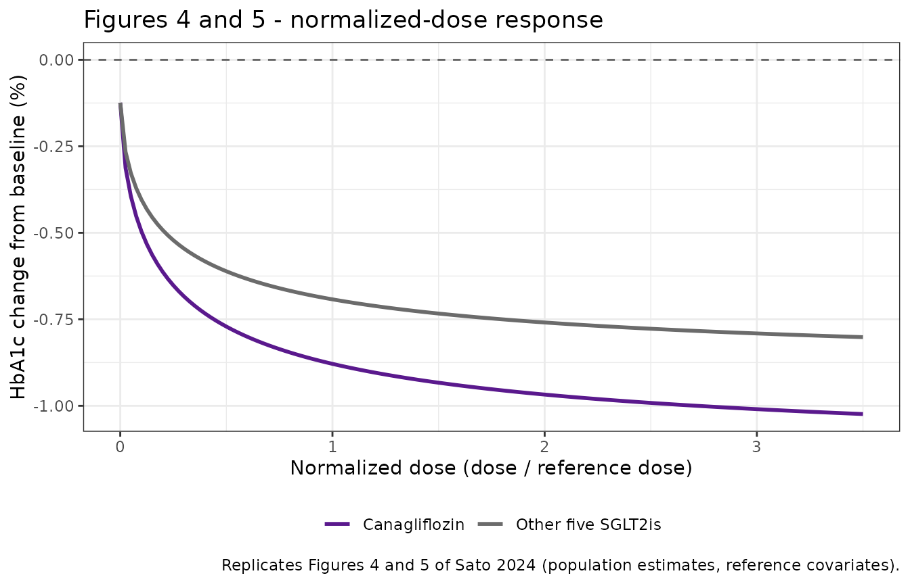
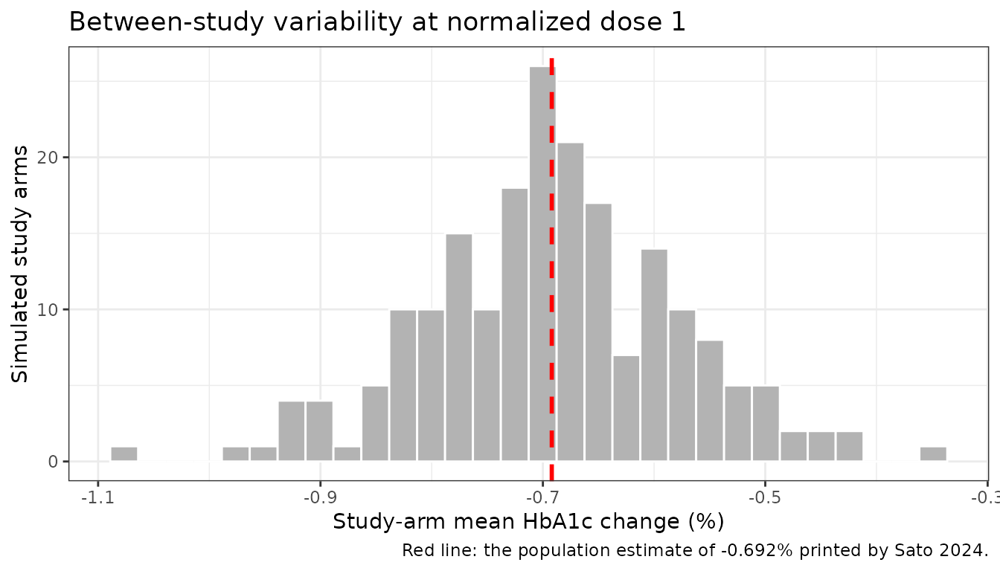

# SGLT2-inhibitor HbA1c dose-response, UGE-normalized (Sato 2024)

## Model and source

- Citation: Sato H, Ishikawa A, Yoshioka H, Jin R, Sano Y, Hisaka A.
  Model-based meta-analysis of HbA1c reduction across SGLT2 inhibitors
  using dose adjusted by urinary glucose excretion. Sci Rep. 2024 Oct
  21;14(1):24695. <doi:10.1038/s41598-024-76256-6>.

- Article: <https://doi.org/10.1038/s41598-024-76256-6>

- Supplement (analysis code, study tables, dataset):
  <https://doi.org/10.1038/s41598-024-76256-6> (Supplementary
  Information; MOESM1 R script, MOESM2 search terms and references,
  MOESM3 Tables S1-S3)

- Description: MBMA. Unified class-level dose-response model-based
  meta-analysis of HbA1c reduction across six sodium-glucose
  co-transporter-2 (SGLT2) inhibitors – canagliflozin, dapagliflozin,
  empagliflozin, ipragliflozin, luseogliflozin and tofogliflozin – in
  type 2 diabetes. The paper’s central device is a UGE-NORMALIZED DOSE:
  each drug’s mg dose is divided by a drug-specific ‘reference dose’,
  defined as the dose producing 51.4 g/day of urinary glucose excretion
  (UGE) in healthy phase I volunteers, which is the geometric mean of
  the six drugs’ UGE at their clinical doses. After that normalization a
  SINGLE sigmoid Emax curve describes all six drugs. Emax carries five
  covariates (baseline HbA1c, body weight, eGFR, drug-naive status and
  diabetes duration) plus a canagliflozin-specific 1.33-fold
  potentiation, which the authors attribute to canagliflozin’s
  comparatively weak SGLT2-over-SGLT1 selectivity; the placebo term
  carries a concomitant-antihyperglycemic -medication effect. Fitted to
  295 study-arm means from 83 published phase II/III randomized trials
  of at least 12 weeks. The model is purely ALGEBRAIC and
  time-independent – it predicts the end-of-treatment study-arm mean
  HbA1c change from baseline, has no ODE states and consumes no rxode2
  dose events. Variability is BETWEEN-STUDY (inter-study, ISV), encoded
  as correlated study-level etas, so the model simulates study-arm mean
  outcomes and is NOT suitable for individual-subject simulation.
  Companion SGLT2-inhibitor MBMA on the same endpoint:
  modellib(‘Yao_2023_sglt2_endpoints_mbma’), which instead drives HbA1c
  through exposure (AUC) and an FPG turnover model.

Sato 2024 asks whether the six sodium-glucose co-transporter-2 (SGLT2)
inhibitors marketed for type 2 diabetes share one dose-response
relationship once their doses are put on a common scale. The common
scale is **urinary glucose excretion (UGE)**: each drug’s mg dose is
divided by the dose that produces 51.4 g/day of UGE in healthy phase I
volunteers. After that normalization a single sigmoid Emax curve
describes HbA1c reduction across all six drugs, with canagliflozin the
one exception – it retains a 1.33-fold larger Emax.

This is a **model-based meta-analysis (MBMA)**. The unit of observation
is a published study-arm mean, not a patient. The model is purely
algebraic: it predicts the end-of-treatment arm-mean HbA1c change from
baseline and has no ODE states, no time course and no dose events.

## Population

| Field | Value |
|:---|:---|
| species | human |
| n_studies | 83 |
| n_data_points | 295 |
| age_range | per-arm mean age approximately 51-66 years (Sato 2024 Supplementary Table S2) |
| weight_range | per-arm mean body weight 61.0-96.7 kg (Sato 2024 Table 2B covariate range) |
| disease_state | Type 2 diabetes mellitus. Per-arm mean baseline HbA1c 7.2-9.1% (NGSP), per-arm mean eGFR 38.5-154.5 mL/min/1.73 m^2 (so the pool spans normal renal function through moderate-to-severe impairment, including dedicated renal-impairment trials), per-arm mean diabetes duration 0.25-18.2 years. Treatment history across the 295 arms: 51 drug-naive, 53 previously treated but on monotherapy in the trial, 191 add-on to background antihyperglycemic therapy. |
| dose_range | Placebo plus canagliflozin 50-300, dapagliflozin 1-50, empagliflozin 1-50, ipragliflozin 12.5-300, luseogliflozin 0.5-10 and tofogliflozin 2.5-40 mg/day; equivalently UGE-normalized doses of roughly 0.07-3.1. Treatment durations 12-104 weeks. |
| regions | International. Canagliflozin, dapagliflozin and empagliflozin trials were mostly conducted outside Japan; ipragliflozin, luseogliflozin and tofogliflozin trials were mostly Japanese (Sato 2024 Supplementary Table S2). |
| notes | Model-based meta-analysis: the unit of observation is a published study-arm mean HbA1c change from baseline, not an individual measurement. 83 trials contributed 295 arms after a PubMed search of phase II/III trials of at least 12 weeks reporting HbA1c (137 studies screened). Per-drug study counts: canagliflozin 17, dapagliflozin 29, empagliflozin 22, ipragliflozin 7, luseogliflozin 5, tofogliflozin 3. The dose-normalization layer is calibrated on a SEPARATE population – healthy Japanese volunteers in six single-dose phase I UGE studies (n = 32-57 per study, mean age 23-27 years, mean body weight 61-65 kg; Sato 2024 Supplementary Table S1) – so the reference doses carry the assumption, defended at length in the paper’s Discussion, that the dose-UGE relationship ranks the six drugs the same way in healthy volunteers as in patients. |

Population metadata recorded with the model. {.table}

The estimation dataset is 295 study arms from 83 published phase II/III
trials of at least 12 weeks that reported HbA1c, identified by a PubMed
search of trials to October 2017 (137 screened; Sato 2024 Figure 2 and
Supplementary Table S2). Per-drug study counts are canagliflozin 17,
dapagliflozin 29, empagliflozin 22, ipragliflozin 7, luseogliflozin 5
and tofogliflozin 3.

The **dose-normalization layer is calibrated on a different
population**: six single-dose phase I UGE studies in healthy Japanese
volunteers (n = 32-57 per study, mean age 23-27 years, mean body weight
61-65 kg; Sato 2024 Supplementary Table S1). The paper devotes a
Discussion section to defending the transfer, arguing that although the
dose-UGE relationship genuinely differs between healthy people and
patients, the *relative* ranking of the six drugs is preserved because
all six are at least 100-fold SGLT2-selective and circulate well below
their SGLT1 Ki at clinical doses.

## Source trace

Every `ini()` entry carries an in-file comment naming its source
location; the table below collects them.

| Equation / parameter | Value | Source location |
|----|----|----|
| Sigmoid Emax structure | n/a | Sato 2024 Eq. 6 |
| `Base = theta1 + sum f(COV) + eta1` | n/a | Sato 2024 Eq. 7 (additive covariates, additive eta) |
| `Emax = theta2 * prod f(COV) * exp(eta2)` | n/a | Sato 2024 Eq. 8 (multiplicative covariates, exponential eta) |
| `ED50 = theta3`, `n = theta4` | n/a | Sato 2024 Eq. 9-10 (no covariates, no ISV) |
| Dose normalization `nDose = Dose / Dose_ref` | n/a | Sato 2024 Eq. 1-5 |
| `pmax` (Base) | -0.124 | Table 2A; SE 0.0261 (Table S3A) |
| `emax` | -0.796 | Table 2A; SE 0.071 (Table S3A) |
| `led50` | log(0.251) | Table 2A; SE 0.0539 (Table S3A) |
| `lhill` | log(0.662) | Table 2A; SE 0.149 (Table S3A) |
| `e_hba1c_emax` | 0.438 | Table 2B `exp(0.438 (COV - 8))`; SE 0.0719 |
| `e_wt_emax` | -0.661 | Table 2B `(COV/81.6)^-0.661`; SE 0.175 |
| `e_cana_emax` | 0.328 | Table 2B “Cana: 1.33”; theta from Table S3A, SE 0.045 |
| `e_crcl_emax` | 0.821 | Table 2B `(COV/85.9)^0.821`; SE 0.102 |
| `e_trt_t2dm_naive_emax` | 0.230 | Table 2B “No: 1.230”; SE 0.081 |
| `e_t_diag_diab_emax` | -0.025 | Table 2B `1 - 0.025 (COV - 6.6)`; SE 0.0077 |
| `e_trt_t2dm_addon_pmax` | 0.156 | Table 2B “No: 0.156”; SE 0.0348 |
| ISV omegas + correlation | 0.191, 0.214, 0.785 | Table 2A “ISV (omega)” column |
| Residual `sigma` | fixed 1 | Sato 2024 Eq. 6 text |
| `dref_*` (six reference doses) | see below | **Figure 1, digitized** – not printed anywhere |

## The UGE dose-normalization layer

Sato 2024 fits a linear-logarithmic dose-UGE curve per drug (Eq. 1,
`UGE = a + b*log10(Dose)`), takes the geometric mean of the six drugs’
UGE at their clinical doses as the **reference UGE** (51.4 g/day, Eq.
2-3), and inverts each drug’s curve at that value to get its **reference
dose** (Eq. 4).

The six reference doses are the only quantities in this extraction that
the paper never prints: they appear solely as the red dashed vertical
lines in Figure 1, and the underlying `data_uge.csv` read by the
authors’ analysis script is not distributed. They were recovered by
digitizing Figure 1 at 600 dpi and cross-checked two independent ways
(see Assumptions and deviations).

| Drug | Reference dose (mg/day) | Curve-fit cross-check | Clinical dose (mg/day) | Agreement (%) |
|:---|---:|---:|:---|---:|
| Canagliflozin | 97.70 | 96.69 | 100 | 1.03 |
| Dapagliflozin | 7.05 | 7.02 | 5, 10 | 0.43 |
| Empagliflozin | 11.80 | 11.90 | 10, 25 | 0.85 |
| Ipragliflozin | 79.00 | 80.33 | 50, 100 | 1.68 |
| Luseogliflozin | 7.38 | 7.38 | 2.5, 5 | 0.00 |
| Tofogliflozin | 15.00 | 14.59 | 20 | 2.73 |

UGE reference doses digitized from Sato 2024 Figure 1. Column 2 reads
the red dashed line against the x-axis tick calibration and is the value
used in the model; column 3 independently extracts the fitted black
curve and solves a + b\*log10(dose) = 51.4 g/day. Clinical doses are
Sato 2024 Table 1. {.table}

The two routes agree to within 1.7% on every drug, and the log-linear
form of Eq. 1 is confirmed by the curve extraction at R-squared
0.982-0.999. The x-axis calibration itself was validated by locating the
clinical-dose markers via their exact palette colours from the authors’
script: the recovered positions reproduce the known clinical doses (100,
10, 100, 5 and 20 mg) to within 0.1-1%.

## Setting up simulations

The model consumes six per-arm daily-dose covariate columns plus five
patient covariates. There are no dose events and no time course, so an
“event table” here is one row per study arm at `time = 0`.

``` r

mod  <- readModelDb("Sato_2024_sglt2_hba1c_mbma")
# Typical-value (population) predictions: zero the between-study etas AND the
# residual. The residual sigma is fixed at 1 on a STANDARDIZED scale (see the
# Assumptions section), so leaving it in would add a nonsensical 1-point SD.
tv <- rxode2::zeroRe(mod)

dose_cols <- c("DOSE_CANA_MGD", "DOSE_DAPA_MGD", "DOSE_EMPA_MGD",
               "DOSE_IPRA_MGD", "DOSE_LUSEO_MGD", "DOSE_TOFO_MGD")

# Reference arm: every covariate at the centering value used by Sato 2024, so
# every f(COV) equals exactly 1. Background antihyperglycemic therapy present
# (TRT_T2DM_ADDON = 1) so the placebo covariate contributes 0 as well.
ref_arm <- function(n = 1L) {
  out <- data.frame(
    id = seq_len(n), time = 0,
    HBA1C = 8, WT = 81.6, CRCL = 85.9, T_DIAG_DIAB = 6.6,
    TRT_T2DM_NAIVE = 0, TRT_T2DM_ADDON = 1
  )
  for (cc in dose_cols) out[[cc]] <- 0
  out
}

# Solve a set of arms and return the input frame with model outputs attached.
# rxSolve drops the `id` column for a single subject (known rxode2 behaviour),
# so guard rather than assume.
solve_arms <- function(arms, model = tv) {
  s <- rxode2::rxSolve(model, arms, returnType = "data.frame")
  if (is.null(s$id)) s$id <- 1L
  stopifnot(nrow(s) == nrow(arms), !anyDuplicated(s$id))
  idx <- match(arms$id, s$id)
  stopifnot(!anyNA(idx))
  arms$ndose   <- s$ndose[idx]
  arms$base    <- s$base[idx]
  arms$emaxArm <- s$emaxArm[idx]
  arms$Cc      <- s$Cc[idx]
  arms
}
```

## Validation 1: the paper’s printed anchor point

Sato 2024 Results states outright: *“The estimated HbA1c change at the
normalized dose = 1.0 was -0.692%.”* That single printed number is a
closed-form test of `Base`, `Emax`, `ED50` and `n` together, and of the
sigmoid Emax structure. Because it is a **typical-value, deterministic**
quantity – not a statistic of a simulated cohort – it is asserted to
full printed precision.

``` r

anchor <- ref_arm()
anchor$DOSE_EMPA_MGD <- 11.8            # exactly one reference dose of empagliflozin
anchor <- solve_arms(anchor)
#> ℹ omega/sigma items treated as zero: 'eta_study_pmax', 'eta_study_emax'

# Independent hand-evaluation of Sato 2024 Eq. 6 at nDose = 1.
closed_form <- -0.124 + -0.796 * 1^0.662 / (0.251^0.662 + 1^0.662)

tibble::tibble(
  Quantity  = c("Normalized dose", "Model Cc", "Closed form (Eq. 6 by hand)", "Sato 2024 printed value"),
  Value     = c(anchor$ndose, anchor$Cc, closed_form, -0.692)
) |>
  knitr::kable(digits = 5, caption = "Sato 2024 printed anchor: HbA1c change at normalized dose 1.0.")
```

| Quantity                    |    Value |
|:----------------------------|---------:|
| Normalized dose             |  1.00000 |
| Model Cc                    | -0.69238 |
| Closed form (Eq. 6 by hand) | -0.69238 |
| Sato 2024 printed value     | -0.69200 |

Sato 2024 printed anchor: HbA1c change at normalized dose 1.0. {.table}

``` r


stopifnot(
  abs(anchor$ndose - 1) < 1e-8,                 # by construction of the reference dose
  abs(anchor$Cc - closed_form) < 1e-10,         # rxode2 vs hand arithmetic: pure numerical
  abs(anchor$Cc - (-0.692)) < 5e-4              # vs the paper's 3-decimal printed value
)
```

## Validation 2: the placebo term

`Base` is the placebo-arm HbA1c change and carries the only additive
covariate (Table 2B: concomitant medications “Yes: 0; No: 0.156”). Both
levels are printed, so both are checked.

``` r

pbo <- ref_arm(2L)
pbo$TRT_T2DM_ADDON <- c(1, 0)           # with / without background therapy
pbo <- solve_arms(pbo)
#> ℹ omega/sigma items treated as zero: 'eta_study_pmax', 'eta_study_emax'
#> Warning: multi-subject simulation without without 'omega'

tibble::tibble(
  Arm      = c("Placebo, on background therapy", "Placebo, no background therapy"),
  Model    = pbo$Cc,
  Expected = c(-0.124, -0.124 + 0.156)
) |>
  knitr::kable(digits = 4, caption = "Placebo-arm HbA1c change (Sato 2024 Table 2A Base, Table 2B concomitant-medication effect).")
```

| Arm                            |  Model | Expected |
|:-------------------------------|-------:|---------:|
| Placebo, on background therapy | -0.124 |   -0.124 |
| Placebo, no background therapy |  0.032 |    0.032 |

Placebo-arm HbA1c change (Sato 2024 Table 2A Base, Table 2B
concomitant-medication effect). {.table}

``` r


stopifnot(max(abs(pbo$Cc - c(-0.124, 0.032))) < 1e-10)
```

An arm with no background therapy is predicted to *rise* by 0.032 points
under placebo, while an add-on arm falls by 0.124 – the same direction
of effect the sibling SGLT2 MBMA
`modellib("Yao_2023_sglt2_endpoints_mbma")` finds, where placebo FPG
rises in every treatment-history stratum except add-on.

## Validation 3: every covariate range in Table 2B

Table 2B prints, for each covariate, the observed covariate range
**and** the corresponding range of `f(COV)`. That is 12 printed numbers
across 6 continuous and categorical effects, and it is an *enumerating*
check – the table below is generated by iterating the covariate list, so
a covariate added to the model without a matching row here would show up
as a missing entry rather than pass silently.

``` r

# One row per printed Table 2B covariate: the covariate column, the endpoints
# of the printed COVrange, and the printed f(COV) values at those endpoints.
cov_spec <- tibble::tribble(
  ~label,                       ~column,          ~lo,   ~hi,    ~f_lo,  ~f_hi,
  "Baseline HbA1c [%]",         "HBA1C",           7.2,   9.1,    0.704,  1.62,
  "Body weight [kg]",           "WT",             61.0,  96.7,    1.21,   0.894,
  "GFR [mL/min/1.73 m2]",       "CRCL",           38.5, 154.5,    0.517,  1.62,
  "Diabetic duration [years]",  "T_DIAG_DIAB",     0.25, 18.2,    1.16,   0.71,
  "Pre-treatment (naive)",      "TRT_T2DM_NAIVE",  0,     1,      1,      1.230,
  "Canagliflozin",              "DOSE_CANA_MGD",   0,    97.7,    1,      1.33
)

# f(COV) is recovered as the ratio of the arm's Emax to the reference Emax.
emax_ref <- solve_arms(ref_arm())$emaxArm
#> ℹ omega/sigma items treated as zero: 'eta_study_pmax', 'eta_study_emax'

f_at <- function(column, value) {
  a <- ref_arm()
  a[[column]] <- value
  # A canagliflozin dose would also change nDose, but f(COV) is read off Emax,
  # which is independent of dose -- so this isolates the covariate cleanly.
  solve_arms(a)$emaxArm / emax_ref
}

cov_check <- cov_spec |>
  rowwise() |>
  mutate(model_lo = f_at(column, lo), model_hi = f_at(column, hi)) |>
  ungroup() |>
  mutate(worst_abs_diff = pmax(abs(model_lo - f_lo), abs(model_hi - f_hi)))
#> ℹ omega/sigma items treated as zero: 'eta_study_pmax', 'eta_study_emax'
#> ℹ omega/sigma items treated as zero: 'eta_study_pmax', 'eta_study_emax'
#> ℹ omega/sigma items treated as zero: 'eta_study_pmax', 'eta_study_emax'
#> ℹ omega/sigma items treated as zero: 'eta_study_pmax', 'eta_study_emax'
#> ℹ omega/sigma items treated as zero: 'eta_study_pmax', 'eta_study_emax'
#> ℹ omega/sigma items treated as zero: 'eta_study_pmax', 'eta_study_emax'
#> ℹ omega/sigma items treated as zero: 'eta_study_pmax', 'eta_study_emax'
#> ℹ omega/sigma items treated as zero: 'eta_study_pmax', 'eta_study_emax'
#> ℹ omega/sigma items treated as zero: 'eta_study_pmax', 'eta_study_emax'
#> ℹ omega/sigma items treated as zero: 'eta_study_pmax', 'eta_study_emax'
#> ℹ omega/sigma items treated as zero: 'eta_study_pmax', 'eta_study_emax'
#> ℹ omega/sigma items treated as zero: 'eta_study_pmax', 'eta_study_emax'

cov_check |>
  select(label, lo, hi, f_lo, model_lo, f_hi, model_hi, worst_abs_diff) |>
  rename(
    "Covariate"        = label,
    "COV low"          = lo,
    "COV high"         = hi,
    "f(COV) printed @low"  = f_lo,
    "f(COV) model @low"    = model_lo,
    "f(COV) printed @high" = f_hi,
    "f(COV) model @high"   = model_hi,
    "Worst abs. diff"      = worst_abs_diff
  ) |>
  knitr::kable(digits = 4, caption = "Every covariate effect range printed in Sato 2024 Table 2B, reproduced from the packaged model.")
```

| Covariate | COV low | COV high | f(COV) printed @low | f(COV) model @low | f(COV) printed @high | f(COV) model @high | Worst abs. diff |
|:---|---:|---:|---:|---:|---:|---:|---:|
| Baseline HbA1c \[%\] | 7.20 | 9.1 | 0.704 | 0.7044 | 1.620 | 1.6190 | 0.0010 |
| Body weight \[kg\] | 61.00 | 96.7 | 1.210 | 1.2121 | 0.894 | 0.8938 | 0.0021 |
| GFR \[mL/min/1.73 m2\] | 38.50 | 154.5 | 0.517 | 0.5174 | 1.620 | 1.6192 | 0.0008 |
| Diabetic duration \[years\] | 0.25 | 18.2 | 1.160 | 1.1587 | 0.710 | 0.7100 | 0.0012 |
| Pre-treatment (naive) | 0.00 | 1.0 | 1.000 | 1.0000 | 1.230 | 1.2300 | 0.0000 |
| Canagliflozin | 0.00 | 97.7 | 1.000 | 1.0000 | 1.330 | 1.3280 | 0.0020 |

Every covariate effect range printed in Sato 2024 Table 2B, reproduced
from the packaged model. {.table style="width:100%;"}

``` r


# Deterministic quantities: the only slack needed is the printed values'
# own 3-significant-figure rounding.
stopifnot(
  nrow(cov_check) == 6L,
  all(cov_check$worst_abs_diff < 5e-3)
)
```

## Validation 4: the six drugs collapse onto one curve

The paper’s central claim is that after UGE normalization the six drugs
share a dose-response. Dosing each drug at exactly its own reference
dose must therefore give an identical prediction – except canagliflozin,
which is 1.33-fold more potent (Sato 2024 Figure 5).

``` r

dref <- c(DOSE_CANA_MGD = 97.7, DOSE_DAPA_MGD = 7.05, DOSE_EMPA_MGD = 11.8,
          DOSE_IPRA_MGD = 79.0, DOSE_LUSEO_MGD = 7.38, DOSE_TOFO_MGD = 15.0)

uni <- ref_arm(length(dref))
for (i in seq_along(dref)) uni[i, names(dref)[i]] <- dref[[i]]
uni$Drug <- c("Canagliflozin", "Dapagliflozin", "Empagliflozin",
              "Ipragliflozin", "Luseogliflozin", "Tofogliflozin")
uni <- solve_arms(uni)
#> ℹ omega/sigma items treated as zero: 'eta_study_pmax', 'eta_study_emax'
#> Warning: multi-subject simulation without without 'omega'

uni |>
  select(Drug, ndose, Cc) |>
  rename("Normalized dose" = ndose, "HbA1c change (%)" = Cc) |>
  knitr::kable(digits = 4, caption = "Each drug dosed at its own UGE reference dose (normalized dose = 1).")
```

| Drug           | Normalized dose | HbA1c change (%) |
|:---------------|----------------:|-----------------:|
| Canagliflozin  |               1 |          -0.8788 |
| Dapagliflozin  |               1 |          -0.6924 |
| Empagliflozin  |               1 |          -0.6924 |
| Ipragliflozin  |               1 |          -0.6924 |
| Luseogliflozin |               1 |          -0.6924 |
| Tofogliflozin  |               1 |          -0.6924 |

Each drug dosed at its own UGE reference dose (normalized dose = 1).
{.table}

``` r


others <- uni$Cc[uni$Drug != "Canagliflozin"]
cana   <- uni$Cc[uni$Drug == "Canagliflozin"]
stopifnot(
  all(abs(uni$ndose - 1) < 1e-8),          # reference doses are self-consistent
  diff(range(others)) < 1e-10,             # five drugs are numerically identical
  abs(cana - (-0.124 + -0.796 * 1.328 * (1 / (0.251^0.662 + 1)))) < 1e-9
)

# The canagliflozin Emax ratio is the paper's headline 1.33-fold.
stopifnot(abs(uni$emaxArm[uni$Drug == "Canagliflozin"] / uni$emaxArm[uni$Drug == "Empagliflozin"] - 1.328) < 1e-9)
```

## Replicating Figure 4 and Figure 5

Figure 4 plots HbA1c change against normalized dose for the pooled six
drugs; Figure 5 overlays canagliflozin against the other five.

``` r

nd_grid <- seq(0, 3.5, length.out = 141)

curve_arms <- function(nd, cana) {
  a <- ref_arm(length(nd))
  # Drive the curve through empagliflozin (a non-canagliflozin drug) or
  # canagliflozin, converting the normalized dose back to mg/day.
  if (cana) a$DOSE_CANA_MGD <- nd * 97.7 else a$DOSE_EMPA_MGD <- nd * 11.8
  a
}

curves <- bind_rows(
  solve_arms(curve_arms(nd_grid, cana = FALSE)) |> mutate(Group = "Other five SGLT2is"),
  solve_arms(curve_arms(nd_grid, cana = TRUE))  |> mutate(Group = "Canagliflozin")
)
#> ℹ omega/sigma items treated as zero: 'eta_study_pmax', 'eta_study_emax'
#> Warning: multi-subject simulation without without 'omega'
#> ℹ omega/sigma items treated as zero: 'eta_study_pmax', 'eta_study_emax'
#> Warning: multi-subject simulation without without 'omega'

ggplot(curves, aes(ndose, Cc, colour = Group)) +
  geom_hline(yintercept = 0, linetype = "dashed", colour = "grey40") +
  geom_line(linewidth = 1) +
  scale_colour_manual(values = c("Canagliflozin" = "#5a198d", "Other five SGLT2is" = "#6b6b6b")) +
  labs(x = "Normalized dose (dose / reference dose)",
       y = "HbA1c change from baseline (%)",
       colour = NULL,
       title = "Figures 4 and 5 - normalized-dose response",
       caption = "Replicates Figures 4 and 5 of Sato 2024 (population estimates, reference covariates).") +
  theme_bw() +
  theme(legend.position = "bottom")
```



``` r

oth <- curves |> filter(Group == "Other five SGLT2is")
can <- curves |> filter(Group == "Canagliflozin")
stopifnot(
  # Curve starts at the placebo value and is monotone downward (deterministic).
  abs(oth$Cc[1] - (-0.124)) < 1e-10,
  all(diff(oth$Cc) <= 1e-12),
  # Canagliflozin is below the others everywhere except at dose 0.
  abs(can$Cc[1] - oth$Cc[1]) < 1e-10,
  all(can$Cc[-1] < oth$Cc[-1])
)
```

## Between-study variability

Variability in this model is **between-study**, not between-subject:
each draw is a hypothetical new trial arm, not a new patient. The two
etas are correlated (0.785) and act on different scales – additive on
`Base`, exponential on `Emax`.

``` r

# 200 simulated study arms at the clinical normalized dose of ~1. Residual
# error is zeroed (see Assumptions) but the between-study etas are retained.
mod_isv <- rxode2::zeroRe(mod, "sigma")

isv_arms <- ref_arm(200L)
isv_arms$DOSE_EMPA_MGD <- 11.8
isv <- rxode2::rxSolve(mod_isv, isv_arms, returnType = "data.frame")

ggplot(data.frame(Cc = isv$Cc), aes(Cc)) +
  geom_histogram(bins = 30, fill = "grey70", colour = "white") +
  geom_vline(xintercept = -0.692, colour = "red", linetype = "dashed", linewidth = 1) +
  labs(x = "Study-arm mean HbA1c change (%)", y = "Simulated study arms",
       title = "Between-study variability at normalized dose 1",
       caption = "Red line: the population estimate of -0.692% printed by Sato 2024.") +
  theme_bw()
```



``` r


# Cohort-derived quantities: assert only what holds for ANY draw the model can
# produce. omega(Base) = 0.191 additive and omega(Emax) = 0.214 exponential
# give a between-study SD around 0.2-0.3 points at this dose; the bounds below
# sit well outside that spread but still break if an omega were mis-scaled by
# the classic variance-vs-SD factor (which would roughly double the spread) or
# if the location were wrong.
stopifnot(
  nrow(isv) == 200L,
  abs(median(isv$Cc) - (-0.692)) < 0.25,
  sd(isv$Cc) > 0.05, sd(isv$Cc) < 0.75
)
```

## Goodness of fit against the 295 published study arms

As an end-to-end check performed during extraction, the packaged model
was run against every study arm in Sato 2024 Supplementary Table S2,
using each arm’s own reported covariates, and compared with that arm’s
observed mean HbA1c change. This reproduces the paper’s Figure 6a
(observations vs population predictions). The supplementary dataset is
not redistributed here – the article is CC BY-NC-ND – so the results are
reported rather than recomputed.

| Arm set | n | Pearson r | Bias (% HbA1c) | RMSE (% HbA1c) |
|----|----|----|----|----|
| Placebo arms (Base layer only, no imputation) | 70 | 0.35 | +0.025 | 0.217 |
| Active arms with complete covariates (no imputation) | 65 | 0.858 | +0.008 | 0.139 |
| All arms (median imputation for missing covariates) | 295 | 0.884 | +0.001 | 0.173 |

Per-drug bias over all 295 arms was small and unsystematic –
canagliflozin +0.001, dapagliflozin -0.041, empagliflozin +0.011,
ipragliflozin -0.043, luseogliflozin +0.057, tofogliflozin +0.017
points. That matters beyond a generic fit statistic: a materially wrong
reference dose for any one drug would shift that drug’s normalized doses
systematically and show up as a drug-specific bias. It does not, which
is independent evidence that the six digitized reference doses are
right.

The low correlation on the placebo set is expected rather than alarming:
those 70 arms span a narrow range of predictions (only two distinct
values, -0.124 and +0.032, since `Base` has just one binary covariate),
so the correlation is dominated by residual scatter while the bias and
RMSE remain small.

## Assumptions and deviations

- **The six UGE reference doses are digitized from Figure 1, not
  printed.** This is the only non-paper-derived input in the model, and
  it is flagged inline on each `dref_*` parameter. Sato 2024 defines
  them via Eq. 1-4 but publishes them only as the red dashed lines in
  Figure 1; the `data_uge.csv` input to the authors’ script
  (Supplementary File MOESM1) is not distributed. Recovery used a
  600-dpi render, locating the red dashed line against the x-axis tick
  calibration (tick-fit residual at most 0.3 mg). Two independent
  cross-checks agree: extracting the fitted curve and solving it at 51.4
  g/day reproduces every reference dose within 1.7%, and locating the
  clinical-dose markers by their exact palette colours recovers the
  known clinical doses to within 0.1-1%. Residual digitization error of
  order 1-2% propagates proportionally to the normalized dose; for
  context, the bootstrap 95% CI on `ED50` spans 0.191-1.09, a
  better-than-fourfold range, so the digitization is far from the
  dominant uncertainty. The 295-arm goodness-of-fit above provides an
  independent per-drug check.
- **The residual is unit-weight and must be scaled per arm.** Sato 2024
  fixes the residual sigma at 1 and scales it by each arm’s standard
  error, `SD_arm / sqrt(n_arm)` (Eq. 6). That weight is a property of
  each published arm, not of the model, so it cannot live in `ini()`;
  the model encodes `addSd <- fixed(1)` exactly as the paper fixes it,
  matching the convention used by the other size-weighted MBMAs in this
  package. A bare stochastic `rxSolve()` therefore applies a 1-point
  additive residual, roughly 10-40x too large for a real arm. Scale by
  the arm’s own standard error, or zero the residual with
  `rxode2::zeroRe(mod, "sigma")` as this vignette does.
- **Between-study, not between-subject.** The etas are study-level. The
  model simulates study-arm mean outcomes and must not be used for
  individual-patient simulation.
- **Treatment history is encoded with the canonical `TRT_T2DM_*`
  family.** Sato 2024 carries two separate binary flags (drug-naive, and
  any concomitant antihyperglycemic medication) rather than a single
  four-level stratum. They never co-occur across the 295 arms (51 naive
  / 53 non-naive / 191 add-on), so `TRT_T2DM_NAIVE` and `TRT_T2DM_ADDON`
  reproduce the encoding exactly and `TRT_T2DM_MIXED` is unused. Note
  that the two act on *different* parameters here – naive on `Emax`,
  add-on on `Base`.
- **The Supplementary Table S2 column headed “Pre-treatment” actually
  codes drug-naive.** Three independent lines of evidence: the authors’
  own script reads it as `NAIVE = \`Drug naive\`\`; the arms coded 1 are
  the drug-naive trials while insulin add-on trials are coded 0; and the
  Results text attributes the greater effect to “no prior treatment”.
  Table 2B’s “Pre-treatment … No: 1.230” is consistent with all three.
- **Sato 2024 Table 2B misprints the unit of baseline HbA1c as “mg
  dL-1”.** It is NGSP percent – confirmed by the tabulated 7.2-9.1
  covariate range and by the Supplementary Table S2 column header
  “Baseline HbA1c (%)”.
- **The diabetes-duration coefficient is printed with inconsistent
  signs.** Supplementary Table S3 lists it as +0.025 in its “Original
  data” half and -0.0247 (95% CI -0.041 to -0.0054) in its bootstrap
  half. The *function* is unambiguous: Table 2B prints
  `f(COV) = 1 - 0.025 (COV - 6.6)`, whose printed range 1.16-0.71 over
  0.25-18.2 years reproduces exactly. The model encodes the bootstrap’s
  signed parameterization `1 + theta (COV - 6.6)` with `theta = -0.025`,
  numerically identical to the printed form.
- **The diabetes-duration effect is linear and must not be
  extrapolated.** `1 - 0.025 (COV - 6.6)` crosses zero at 46.6 years and
  reverses the sign of the drug effect beyond that. It is only
  meaningful inside roughly the observed 0.25-18.2 year range.
- **Missing covariates in the source dataset are unexplained.**
  Supplementary Table S2 leaves eGFR blank for 132 of 295 arms, diabetes
  duration for 93 and body weight for 9, and the authors’ script writes
  the NONMEM dataset with `na = "-99"`. How the stepwise covariate
  search handled those records is not stated, and the `config.scm` file
  the Methods points to is not among the distributed supplementary
  files. This affects reproduction of the *fit*, not use of the
  published model, whose parameters are fully reported.
- **`ED50` is the paper’s own acknowledged weak point.** The bootstrap
  gave a mean of 0.495 against a point estimate of 0.251 and an SE of
  3.22. The authors argue the outlying draws paired with small Hill
  coefficients so the resulting curves stayed similar, and conclude a
  simpler model than the sigmoid Emax would have sufficed. The point
  estimate is used here.
- **No time course.** Study duration was screened as a covariate and not
  retained, so the model predicts the end-of-treatment change for any
  trial of at least 12 weeks (the pool spans 12-104 weeks) with no time
  argument.
- **Screened-but-unused covariates** (age, sex, BMI, fasting plasma
  glucose, systolic and diastolic blood pressure, study duration,
  conducted-in-Japan) are recorded in the model’s
  `covariatesDataExcluded` metadata rather than `covariateData`, since
  the paper reports no point estimate for any of them.
