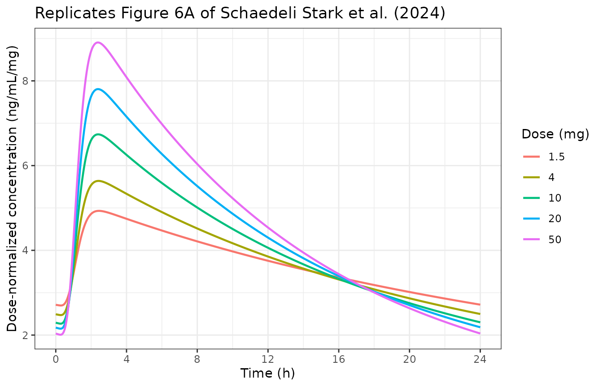
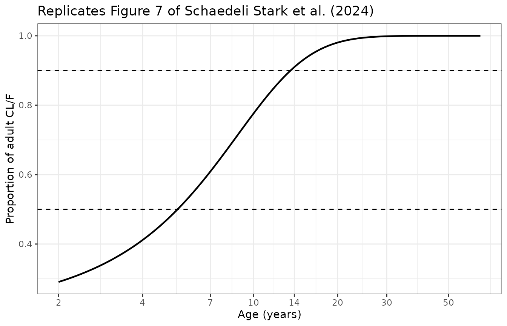
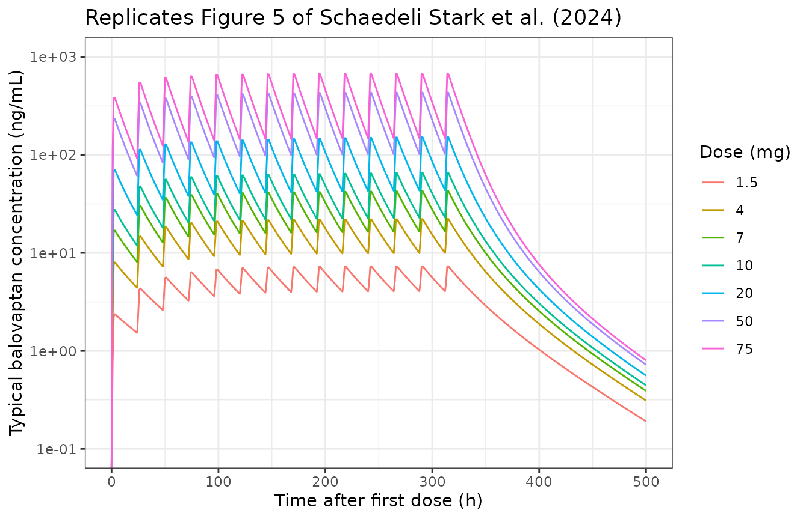
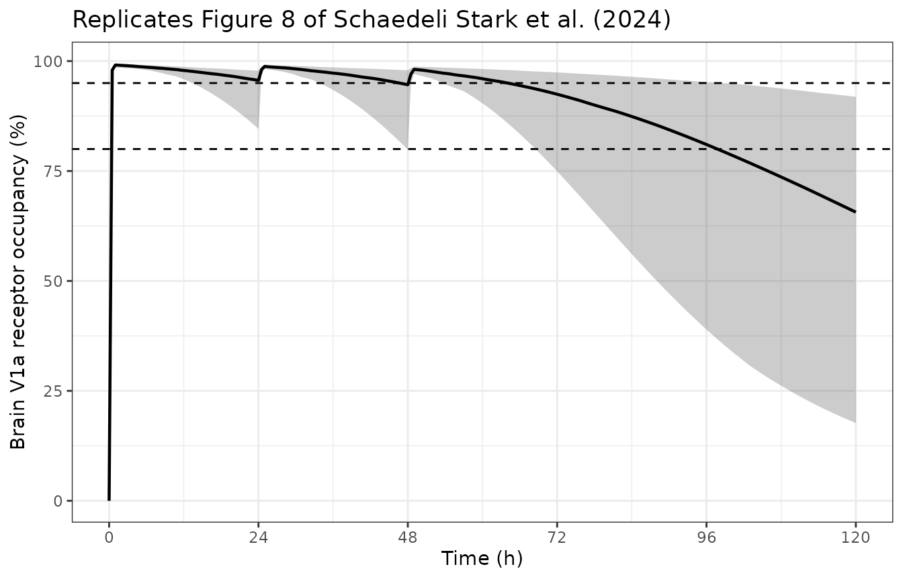

# Balovaptan (Schaedeli Stark 2024)

``` r

library(nlmixr2lib)
library(PKNCA)
#> 
#> Attaching package: 'PKNCA'
#> The following object is masked from 'package:stats':
#> 
#>     filter
library(rxode2)
#> rxode2 5.1.6 using 2 threads (see ?getRxThreads)
#>   no cache: create with `rxCreateCache()`
library(dplyr)
#> 
#> Attaching package: 'dplyr'
#> The following objects are masked from 'package:stats':
#> 
#>     filter, lag
#> The following objects are masked from 'package:base':
#> 
#>     intersect, setdiff, setequal, union
library(tidyr)
library(ggplot2)
```

## Model and source

- Citation: Schaedeli Stark F, Chavanne C, Derks M, Jolling K, Lagraauw
  HM, Lindbom L, Prins K, Silber Baumann HE. A population
  pharmacokinetics model of balovaptan to support dose selection in
  adult and pediatric populations. J Pharmacokinet Pharmacodyn.
  2024;51(3):227-242. <doi:10.1007/s10928-023-09898-0>
- Description: One-compartment population PK model of balovaptan with
  transit-compartment absorption, a dose-dependent central volume from
  empirical saturable binding, a turnover-gated gut extraction process,
  and brain V1a receptor occupancy, in adults and children with autism
  spectrum disorder (Schaedeli Stark 2024)
- Article: <https://doi.org/10.1007/s10928-023-09898-0> (open access;
  PMCID PMC11136808)
- Supplement: online supplementary material to the same DOI
  (goodness-of-fit figures plus the development-stage explicit-binding
  and empirical-binding two-compartment models; it carries no
  final-model parameters)

``` r

mod <- rxode2::rxode(readModelDb("SchaedeliStark_2024_balovaptan"))
mod
#>  ── rxode2-based free-form 9-cmt ODE model ────────────────────────────────────── 
#>  ── Initalization: ──  
#> Fixed Effects ($theta): 
#>             lcl             lvc            lmtt             ntr          lvbmax 
#>       2.1424163       6.3368257      -1.0023934       5.8100000      -0.2169130 
#>          lvba50         lkgutex           lkout           lsmod         e_wt_vc 
#>       1.2119410       0.6365768      -6.1899155       3.0910425       1.0000000 
#>       e_fed_mtt        e_age_cl        age50_cl          lkd_fu    propSd_early 
#>       3.3900000       0.2670000       5.3400000       1.1505720       1.2000000 
#>     propSd_late propSd_exp_kdes           addSd        addSd_RO 
#>       0.2160000       1.3200000       0.0250000       0.0000000 
#> 
#> Omega ($omega): 
#>         etalcl etalvc etalmtt
#> etalcl    0.15 0.0000  0.0000
#> etalvc    0.00 0.0944  0.0000
#> etalmtt   0.00 0.0000  0.0423
#> 
#> States ($state or $stateDf): 
#>   Compartment Number Compartment Name
#> 1                  1            depot
#> 2                  2         transit1
#> 3                  3         transit2
#> 4                  4         transit3
#> 5                  5         transit4
#> 6                  6         transit5
#> 7                  7         transit6
#> 8                  8          central
#> 9                  9       moderator1
#>  ── Multiple Endpoint Model ($multipleEndpoint): ──  
#>   variable                cmt               dvid*
#> 1   Cc ~ … cmt='Cc' or cmt=10 dvid='Cc' or dvid=1
#> 2   RO ~ … cmt='RO' or cmt=11 dvid='RO' or dvid=2
#>   * If dvids are outside this range, all dvids are re-numered sequentially, ie 1,7, 10 becomes 1,2,3 etc
#> 
#>  ── μ-referencing ($muRefTable): ──  
#>   theta     eta level
#> 1   lcl  etalcl    id
#> 2   lvc  etalvc    id
#> 3  lmtt etalmtt    id
#> 
#>  ── Model (Normalized Syntax): ── 
#> function() {
#>     compartmentData <- list(depot = list(analyte = "balovaptan", 
#>         units = "mg", specimen = "administration site", verified = TRUE), 
#>         transit1 = list(analyte = "balovaptan", units = "mg", 
#>             specimen = "administration site", verified = TRUE), 
#>         transit2 = list(analyte = "balovaptan", units = "mg", 
#>             specimen = "administration site", verified = TRUE), 
#>         transit3 = list(analyte = "balovaptan", units = "mg", 
#>             specimen = "administration site", verified = TRUE), 
#>         transit4 = list(analyte = "balovaptan", units = "mg", 
#>             specimen = "administration site", verified = TRUE), 
#>         transit5 = list(analyte = "balovaptan", units = "mg", 
#>             specimen = "administration site", verified = TRUE), 
#>         transit6 = list(analyte = "balovaptan", units = "mg", 
#>             specimen = "administration site", verified = TRUE), 
#>         central = list(analyte = "balovaptan", units = "mg", 
#>             specimen = "plasma", verified = TRUE), moderator1 = list(analyte = NA_character_, 
#>             units = "(unitless fraction)", specimen = "not applicable", 
#>             verified = TRUE))
#>     covariateData <- list(WT = list(description = "Body weight", 
#>         units = "kg", type = "continuous", reference_category = NULL, 
#>         notes = "Directly proportional (exponent fixed to 1.00) scaling of the baseline central volume, normalised to a 76 kg reference. 76 kg was the median weight of the neurotypical adult volunteers in the pooled dataset. Weight was NOT retained on CL/F: the estimated exponent (0.256) lost significance once the age maturation function was added.", 
#>         source_name = "WT"), AGE = list(description = "Age", 
#>         units = "years", type = "continuous", reference_category = NULL, 
#>         notes = "Drives the asymptotic CL/F maturation function. Reaches 50% of adult CL/F at AGE50 = 5.34 years and ~90% at 14 years; effectively at plateau by 20 years, and no further age effect up to 65 years.", 
#>         source_name = "AGE"), FED = list(description = "Fed state at dosing", 
#>         units = "(binary)", type = "binary", reference_category = "0 (fasted)", 
#>         notes = "Multiplicative power-form effect on the mean transit time: MTT = MTT_fasted * 3.39^FED. The factor was fixed (not estimated) because only 4.3% of the participants with PK data were fasted. Both phase II ASD studies dosed with food, so the paper's own typical-participant simulations (Figs. 5 and 6) correspond to FED = 1.", 
#>         source_name = "FOOD"))
#>     description <- "One-compartment population PK model of balovaptan with transit-compartment absorption, a dose-dependent central volume from empirical saturable binding, a turnover-gated gut extraction process, and brain V1a receptor occupancy, in adults and children with autism spectrum disorder (Schaedeli Stark 2024)"
#>     paper_specific_residual_sds <- c("propSd_early", "propSd_late", 
#>         "propSd_exp_kdes")
#>     population <- list(species = "human", n_subjects = 370, n_studies = 5, 
#>         age_range = "5-64 years (median 19)", weight_range = "18.8-152.0 kg (median 72.8)", 
#>         sex_female_pct = 8.1, disease_state = "autism spectrum disorder with IQ >= 70 (n = 315) and neurotypical adults (n = 55)", 
#>         dose_range = "1.5-52 mg once daily, oral", regions = "not reported", 
#>         notes = "Pooled from three phase I studies in neurotypical adults (NCT01418963 n = 24, NCT03579719 n = 15, NCT03586726 n = 16; rich sampling, 5-52 mg) and two phase II ASD studies (VANILLA NCT01793441 n = 146 adults; aV1ation NCT02901431 n = 169 children and adolescents 5-17 years; sparse sampling, 1.5-10 mg). 3985 PK observations. The model was subsequently used to simulate IV infusion dosing and brain V1a receptor occupancy for a phase II malignant-cerebral-edema trial (NCT05399550); no IV data were fitted.")
#>     reference <- "Schaedeli Stark F, Chavanne C, Derks M, Jolling K, Lagraauw HM, Lindbom L, Prins K, Silber Baumann HE. A population pharmacokinetics model of balovaptan to support dose selection in adult and pediatric populations. J Pharmacokinet Pharmacodyn. 2024;51(3):227-242. doi:10.1007/s10928-023-09898-0"
#>     units <- list(time = "h", dosing = "mg", concentration = "ng/mL")
#>     vignette <- "SchaedeliStark_2024_balovaptan"
#>     ini({
#>         lcl <- 2.14241634084122
#>         label("Apparent clearance CL/F (L/hr)")
#>         lvc <- 6.33682573114644
#>         label("Apparent central volume of distribution at baseline V0 (L)")
#>         lmtt <- -1.00239343092757
#>         label("Mean transit time in the fasted state (hr)")
#>         ntr <- fix(5.81)
#>         label("Number of transit compartments")
#>         lvbmax <- -0.216913001563574
#>         label("Maximum fractional reduction of the central volume from saturable binding (fraction)")
#>         lvba50 <- 1.21194097397511
#>         label("Central amount giving half the maximum volume reduction (mg)")
#>         lkgutex <- 0.636576829071551
#>         label("Gut extraction rate constant from the absorption compartment (1/hr)")
#>         lkout <- fix(-6.18991548583182)
#>         label("Gut-extraction turnover pool loss rate constant (1/hr)")
#>         lsmod <- 3.09104245335832
#>         label("Scaling factor for the depot-amount stimulation of the turnover loss rate (1/mg)")
#>         e_wt_vc <- fix(1)
#>         label("Body-weight exponent on the baseline central volume (76 kg reference)")
#>         e_fed_mtt <- fix(3.39)
#>         label("Multiplicative effect of the fed state on the mean transit time")
#>         e_age_cl <- 0.267
#>         label("Slope of the CL/F age maturation function (1/year)")
#>         age50_cl <- 5.34
#>         label("Age at which 50 percent of adult CL/F is reached (years)")
#>         lkd_fu <- 1.15057202759882
#>         label("Brain V1a dissociation constant per unit total plasma concentration, Kb/fu_plasma (ng/mL)")
#>         propSd_early <- 1.2
#>         label("Proportional residual SD immediately after dosing (fraction)")
#>         propSd_late <- 0.216
#>         label("Proportional residual SD after the absorption phase (fraction)")
#>         propSd_exp_kdes <- 1.32
#>         label("Decay rate constant of the time-varying proportional residual SD (1/hr)")
#>         addSd <- fix(0, 0.025)
#>         label("Additive residual SD (ng/mL)")
#>         addSd_RO <- fix(0, 0)
#>         label("Additive residual SD on brain receptor occupancy (percentage points; not reported)")
#>         etalcl ~ 0.15
#>         etalvc ~ 0.0944
#>         etalmtt ~ 0.0423
#>     })
#>     model({
#>         cl <- exp(lcl + etalcl)/(1 + exp(e_age_cl * (age50_cl - 
#>             AGE)))
#>         vbmax <- exp(lvbmax)
#>         vba50 <- exp(lvba50)
#>         vc <- exp(lvc + etalvc) * (WT/76)^e_wt_vc * (1 - vbmax * 
#>             central/(central + vba50))
#>         mtt <- exp(lmtt + etalmtt) * e_fed_mtt^FED
#>         ktr <- (ntr + 1)/mtt
#>         ke <- cl/vc
#>         kgutex <- exp(lkgutex)
#>         kout <- exp(lkout)
#>         kin <- kout
#>         smod <- exp(lsmod)
#>         moderator1(0) <- 1
#>         d/dt(depot) <- -ktr * depot - kgutex * moderator1 * depot
#>         d/dt(transit1) <- ktr * depot - ktr * transit1
#>         d/dt(transit2) <- ktr * transit1 - ktr * transit2
#>         d/dt(transit3) <- ktr * transit2 - ktr * transit3
#>         d/dt(transit4) <- ktr * transit3 - ktr * transit4
#>         d/dt(transit5) <- ktr * transit4 - ktr * transit5
#>         d/dt(transit6) <- ktr * transit5 - ktr * transit6
#>         d/dt(central) <- ktr * transit6 - ke * central
#>         d/dt(moderator1) <- kin - kout * moderator1 * (1 + smod * 
#>             depot)
#>         Cc <- 1000 * central/vc
#>         kd_fu <- exp(lkd_fu)
#>         RO <- 100 * Cc/(kd_fu + Cc)
#>         propSdT <- propSd_late + (propSd_early - propSd_late) * 
#>             exp(-propSd_exp_kdes * tad(depot))
#>         Cc ~ prop(propSdT) + add(addSd)
#>         RO ~ add(addSd_RO)
#>     })
#> }
```

## Population

The model was fitted to 3985 balovaptan plasma concentrations from 370
adult and pediatric individuals across five studies (Table 1 of the
source). Three phase I studies contributed richly sampled neurotypical
adults – NCT01418963 (n = 24, multiple-ascending dose 12 to 52 mg once
daily for 14 days), NCT03579719 (n = 15, 5 mg once daily fed) and
NCT03586726 (n = 16, 10 mg once daily fasted). Two phase II studies in
autism spectrum disorder (ASD) with IQ \>= 70 contributed the bulk of
the subjects but sparse, mainly steady-state sampling: VANILLA
(NCT01793441, n = 146 adult men, 1.5 / 4 / 10 mg once daily with food)
and aV1ation (NCT02901431, n = 169 children and adolescents aged 5 to 17
years, age-adjusted doses of 1.5 to 10 mg once daily).

Overall the cohort was 91.9% male, with a median age of 19 years (range
5 to 64) and a median body weight of 72.8 kg (range 18.8 to 152.0). Only
4.3% of the participants with PK data were dosed fasted, which is why
the food effect on mean transit time had to be fixed rather than
estimated. Doses spanned 1.5 to 52 mg once daily; all fitted data were
oral. The intravenous and receptor occupancy work described below is
*simulation* from this model for a planned phase II malignant cerebral
edema trial (NCT05399550) – no IV data were fitted.

``` r

str(readModelDb("SchaedeliStark_2024_balovaptan")()$population)
#> List of 10
#>  $ species       : chr "human"
#>  $ n_subjects    : num 370
#>  $ n_studies     : num 5
#>  $ age_range     : chr "5-64 years (median 19)"
#>  $ weight_range  : chr "18.8-152.0 kg (median 72.8)"
#>  $ sex_female_pct: num 8.1
#>  $ disease_state : chr "autism spectrum disorder with IQ >= 70 (n = 315) and neurotypical adults (n = 55)"
#>  $ dose_range    : chr "1.5-52 mg once daily, oral"
#>  $ regions       : chr "not reported"
#>  $ notes         : chr "Pooled from three phase I studies in neurotypical adults (NCT01418963 n = 24, NCT03579719 n = 15, NCT03586726 n"| __truncated__
```

## Model structure

One-compartment disposition with transit-compartment absorption, an
empirical saturable-binding model that makes the central volume a
decreasing function of the central amount, and an empirical
gut-extraction process gated by a slow turnover pool (Fig. 3 and p. 234
of the source):

    d/dt(depot)      = Input - ktr*depot - kgutex*moderator1*depot
    d/dt(transit_i)  = ktr*transit_{i-1} - ktr*transit_i          (i = 1..6)
    d/dt(central)    = ktr*transit6 - ke*central
    d/dt(moderator1) = kin - kout*moderator1*(1 + smod*depot),   moderator1(0) = 1

    ktr = (ntr + 1)/mtt          mtt = MTT_fasted * 3.39^FED
    ke  = cl/vc                  cl  = CL / (1 + exp(AGEslope*(AGE50 - AGE)))
    vc  = V0 * (WT/76)^1.00 * (1 - vbmax*central/(central + vba50))
    Cc  = 1000 * central/vc      RO  = 100*Cc/(kd_fu + Cc)

Two features drive all of the non-linearity. The **dynamic central
volume** shrinks by up to 80.5% as the central amount rises, which makes
both Cmax and Cmin more than dose-proportional. The **gut extraction**
term competes with absorption out of the depot; the turnover pool
`moderator1` starts at 1, is suppressed by the amount in the depot (via
`smod`), and recovers only slowly (`kout` = 0.00205 1/h, a 338 h
half-life). Extraction is therefore large on the first dose and small at
steady state, and – because a *small* dose suppresses the pool less – it
removes proportionally more drug at low doses. That is the mechanism
behind the source’s statement of “lower oral bioavailability at low
balovaptan doses”.

## Source trace

Every [`ini()`](https://nlmixr2.github.io/rxode2/reference/ini.html)
value and every non-obvious
[`model()`](https://nlmixr2.github.io/rxode2/reference/model.html)
equation, with its location in the source.

| Model quantity | Value | Source location |
|----|----|----|
| `lcl` (CL/F) | 8.52 L/h | Table 2, row “CL (L/h)” |
| `lvc` (V0) | 565 L | Table 2, row “V0 (L)” |
| `lmtt` (MTT, fasted) | 0.367 h | Table 2, row “MTT (h)” |
| `ntr` | 5.81 | Table 2, row “Ntr” |
| `lvbmax` (VLmax) | 0.805 | Table 2, row “VLmax (fraction)” |
| `lvba50` (VLA50) | 3.36 mg | Table 2, row “VLA50”; unit corrected, see Errata |
| `lkgutex` (Kgut) | 1.89 1/h | Table 2, row “Kgut (1/h)” |
| `lkout` (Kout) | 0.00205 1/h, fixed | Table 2, row “Kout (1/h)” |
| `lsmod` (S) | 22.0 1/mg | Table 2, row “S” |
| `e_wt_vc` | 1.00, fixed | Table 2, row “WT V0”; Results p. 234 |
| `e_fed_mtt` | 3.39, fixed | Table 2, row “FOOD MTT”; see Errata |
| `e_age_cl` (AGEslope) | 0.267 1/year | Table 2, row “AGEslope” |
| `age50_cl` (AGE50) | 5.34 years | Table 2, row “AGE50 (years)” |
| `lkd_fu` (Kb/fu_plasma) | 3.16 ng/mL | Back-solved from Table 3; see Errata |
| `etalcl`, `etalvc`, `etalmtt` | 0.150, 0.0944, 0.0423 | Table 2, rows “IIV CL/V0/MTT” and footnote b |
| `propSd_early`, `propSd_late`, `propSd_exp_kdes` | 1.20, 0.216, 1.32 1/h | Table 2, rows “RUV early/late/rate” and footnote |
| `addSd` | 0.025 ng/mL, fixed | Table 2, row “RUV add” and footnote a |
| `addSd_RO` | 0, fixed | Not reported; RO was simulated, not fitted |
| Depot / transit / central ODEs | – | p. 234 equations; transit chain per Fig. 3 |
| Turnover ODE, `moderator1(0) = 1` | – | p. 234 equation; Results p. 233 |
| `ktr = (ntr + 1)/mtt`, `ke = cl/vc` | – | p. 234 “micro-constants of mass transfer” |
| `vc` empirical binding | – | p. 234 and Fig. 3 caption |
| `cl` age maturation | – | p. 234; sign corrected, see Errata |
| `RO` | – | Methods p. 230 |
| `Cc = 1000 * central/vc` | – | Unit conversion, mg/L to ng/mL |

## Assumptions and deviations (Errata)

The source contains three typesetting defects and one reporting gap.
Each was resolved against the paper’s own numbers rather than assumed;
the discriminating evidence is reproduced in the validation sections
below.

**1. The printed age-clearance equation is missing a `1 +`.** As printed
(p. 234) it reads `CLi = CL * (1 - 1/exp(-AGEslope*(AGE50 - AGE)))`,
which returns **-143.9%** of adult clearance at age 2 and **exactly 0%**
at AGE50 – directly contradicting Table 2’s own definition of AGE50 as
the “age where 50% of adult CL/F is reached”. Restoring a dropped `1 +`
in the denominator gives the logistic
`CL/(1 + exp(AGEslope*(AGE50 - AGE)))`, which reproduces four
independent printed anchors (checked below).

**2. Table 2 prints VLA50 in `ug`, but the value is in mg.** Read as
3.36 ug, the binding term is saturated at every clinical dose, the
central volume becomes a constant, and the model loses the entire
non-linearity it was built to describe. Read as 3.36 mg it reproduces
Table 3 to a median of 1.3%; the ug reading is off by up to 69% (checked
below). The mg reading is also the only one dimensionally consistent
with the `smod * depot` term, which needs 1/mg.

**3. The food effect on MTT is multiplicative, not an absolute 3.39 h.**
Table 2 lists “FOOD MTT – Effect of food on MTT – 3.39 (Fixed)”, exactly
parallel to its sibling row “WT V0 – Effect of body weight on V0 – 1.00
(Fixed)”, which is unambiguously a multiplicative exponent. The Results
text instead calls it “an estimate of 3.39 h”. The multiplicative
reading gives a fed Tmax of 2.4 h and an AUCss span of -9.6% to +14.6%,
matching Fig. 6A and the paper’s own printed “-10% and +15%” claim; the
additive and absolute readings give Tmax of 6.2 h and 5.7 h and AUCss
spans of -32%/+23% and -29%/+22% (checked below).

**4. Neither `Kb` nor `fu_plasma` is reported anywhere.** The receptor
occupancy equation is printed but both of its constants are absent from
the paper, the supplement and the Fig. 8 panel. Only their **ratio** is
identifiable, and Table 3’s seven paired (concentration, occupancy)
medians over-determine it: the intersection of the rounding intervals
implied by all seven rows is \[3.076, 3.446\] ng/mL. The model ships
`kd_fu` = 3.16 ng/mL, the median of the seven row-wise point estimates.
**This value is not from the paper text or tables** – it is back-solved
arithmetic on printed medians.

Two further implementation notes:

- **Transit chain length.** `Ntr` = 5.81 is not an integer, so the chain
  is realised with 6 transit compartments (7 transfers). The printed
  `ktr = (Ntr + 1)/MTT` relation is kept intact, so both published
  values are used as printed and the realised mean transit time is 2.8%
  longer than the nominal MTT. Realising 5 transit compartments instead
  moves Tmax to 2.16 h, further from Fig. 6A.
- **Where gut extraction acts.** The printed ODE set elides the transit
  chain entirely (it shows only `dAa/dt` and `dAc/dt`), which would
  leave `Ntr` and `MTT` jointly unidentifiable even though Table 2
  reports both with tight bootstrap intervals. Fig. 3 settles the
  structure: the “TCAM” label sits on the absorption-to-central arrow,
  and the `Kgut x At` arrow leaves the absorption box only. Applying
  extraction to the whole chain instead blows the AUCss span out to
  -52%/+163% (checked below).
- **Time-varying residual error.** The printed RUV expression omits the
  minus sign in its exponent, which would send the SD to infinity rather
  than decay it; the Results text (“mono-exponential decay from a high
  value immediately after dosing to a lower level … half-life of 0.53
  h”, and ln(2)/1.32 = 0.53) fixes the sign unambiguously.

## Simulation helper

Two endpoints (`Cc` and `RO`) means observation records are tagged with
`dvid` rather than `cmt`, so that every solve returns both endpoint
columns.

``` r

baloEvents <- function(doseTimes, doseAmts, doseCmt, obsTimes,
                       WT = 76, AGE = 45, FED = 0, dur = NA_real_) {
  dosing <- data.frame(
    time = doseTimes, amt = doseAmts, evid = 1L, dur = dur,
    cmt = doseCmt, dvid = NA_integer_
  )
  obs <- data.frame(
    time = obsTimes, amt = NA_real_, evid = 0L, dur = NA_real_,
    cmt = NA_character_, dvid = 1L
  )
  out <- rbind(dosing, obs)
  out <- out[order(out$time, -out$evid), ]
  out$id <- 1L
  out$WT <- WT
  out$AGE <- AGE
  out$FED <- FED
  out
}

# Typical-value (all etas zero) version of the model: the source's Figs. 5-7 and
# Table 3 are all "typical individual" simulations, so these gates are
# deterministic and can be asserted tightly.
modTypical <- rxode2::zeroRe(mod)
```

## Validation 1: Table 3, intravenous stepped dosing and receptor occupancy

Table 3 of the source reports simulated median plasma concentrations and
brain V1a receptor occupancies at seven time points following three
60-minute IV infusions of 50, 25 and 15 mg on days 1, 2 and 3, for a
typical 76 kg adult. Because the IV route bypasses absorption entirely,
this gate isolates the disposition model, the empirical binding term and
the occupancy relationship.

``` r

ivEvents <- baloEvents(
  doseTimes = c(0, 24, 48),
  doseAmts  = c(50, 25, 15),
  doseCmt   = "central",
  dur       = 1,
  obsTimes  = sort(unique(c(seq(0, 120, by = 0.05), c(1, 24, 25, 48, 49, 72, 96))))
)
ivSim <- rxode2::rxSolve(modTypical, ivEvents, returnType = "data.frame")
#> ℹ omega/sigma items treated as zero: 'etalcl', 'etalvc', 'etalmtt'

table3 <- data.frame(
  time    = c(1, 24, 25, 48, 49, 72, 96),
  Cc_pub  = c(352, 74, 261, 59, 166, 42, 15),
  RO_pub  = c(99, 96, 99, 95, 98, 93, 82)
) %>%
  dplyr::left_join(ivSim[, c("time", "Cc", "RO")], by = "time") %>%
  dplyr::mutate(
    Cc_pct_diff = 100 * (Cc - Cc_pub) / Cc_pub,
    RO_diff_pp  = RO - RO_pub
  )

table3 %>%
  dplyr::mutate(
    dplyr::across(c(Cc, Cc_pct_diff, RO_diff_pp), ~ round(.x, 2)),
    RO = round(RO, 1)
  ) %>%
  dplyr::rename(
    "Time (h)"                = time,
    "Published Cc (ng/mL)"    = Cc_pub,
    "Simulated Cc (ng/mL)"    = Cc,
    "Cc difference (%)"       = Cc_pct_diff,
    "Published RO (%)"        = RO_pub,
    "Simulated RO (%)"        = RO,
    "RO difference (points)"  = RO_diff_pp
  ) %>%
  knitr::kable(caption = "Replicates Table 3 of Schaedeli Stark et al. (2024), 76 kg reference column.")
```

| Time (h) | Published Cc (ng/mL) | Published RO (%) | Simulated Cc (ng/mL) | Simulated RO (%) | Cc difference (%) | RO difference (points) |
|---:|---:|---:|---:|---:|---:|---:|
| 1 | 352 | 99 | 348.73 | 99.1 | -0.93 | 0.10 |
| 24 | 74 | 96 | 75.04 | 96.0 | 1.41 | -0.04 |
| 25 | 261 | 99 | 260.17 | 98.8 | -0.32 | -0.20 |
| 48 | 59 | 95 | 59.40 | 94.9 | 0.67 | -0.05 |
| 49 | 166 | 98 | 163.35 | 98.1 | -1.59 | 0.10 |
| 72 | 42 | 93 | 41.44 | 92.9 | -1.33 | -0.09 |
| 96 | 15 | 82 | 14.36 | 82.0 | -4.28 | -0.04 |

Replicates Table 3 of Schaedeli Stark et al. (2024), 76 kg reference
column. {.table}

The reconstruction reproduces all seven published concentrations to a
median of 1.3% and all seven occupancies to within 0.2 percentage
points.

``` r

stopifnot(
  median(abs(table3$Cc_pct_diff)) < 3,
  max(abs(table3$Cc_pct_diff)) < 6,
  max(abs(table3$RO_diff_pp)) < 0.5
)
```

### The VLA50 unit reading, falsified

Re-running the identical gate with VLA50 read as 3.36 **ug** rather than
mg:

``` r

modUg <- modTypical %>% rxode2::ini(lvba50 = log(3.36e-3))
#> ℹ change initial estimate of `lvba50` to `-5.69581430500702`
ugSim <- rxode2::rxSolve(modUg, ivEvents, returnType = "data.frame")
#> ℹ omega/sigma items treated as zero: 'etalcl', 'etalvc', 'etalmtt'
ugDiff <- 100 * (ugSim$Cc[match(table3$time, ugSim$time)] - table3$Cc_pub) / table3$Cc_pub

data.frame(
  Reading = c("VLA50 = 3.36 mg", "VLA50 = 3.36 ug"),
  Median  = round(c(median(abs(table3$Cc_pct_diff)), median(abs(ugDiff))), 1),
  Worst   = round(c(max(abs(table3$Cc_pct_diff)), max(abs(ugDiff))), 1)
) %>%
  dplyr::rename(
    "Median absolute difference (%)" = Median,
    "Worst absolute difference (%)"  = Worst
  ) %>%
  knitr::kable(caption = "Table 3 reproduction under the two VLA50 unit readings.")
```

| Reading | Median absolute difference (%) | Worst absolute difference (%) |
|:---|---:|---:|
| VLA50 = 3.36 mg | 1.3 | 4.3 |
| VLA50 = 3.36 ug | 18.0 | 69.0 |

Table 3 reproduction under the two VLA50 unit readings. {.table}

``` r


stopifnot(median(abs(ugDiff)) > 5 * median(abs(table3$Cc_pct_diff)))
```

## Validation 2: Fig. 6A, dose-normalized steady-state profiles

Fig. 6A shows dose-normalized concentration-time profiles at steady
state for a typical adult participant at 1.5, 4, 10, 20 and 50 mg once
daily. Both phase II ASD studies dosed with food, so these are fed
profiles (`FED = 1`).

``` r

oralDoses <- c(1.5, 4, 10, 20, 50)

simSteadyState <- function(dose, model, ...) {
  ev <- baloEvents(
    doseTimes = seq(0, 13 * 24, by = 24),
    doseAmts  = rep(dose, 14),
    doseCmt   = "depot",
    obsTimes  = seq(13 * 24, 14 * 24, by = 0.05),
    FED       = 1,
    ...
  )
  out <- rxode2::rxSolve(model, ev, returnType = "data.frame")
  out <- out[out$time >= 13 * 24, ]
  out$time <- out$time - 13 * 24
  out$dose_mg <- dose
  out
}

fig6a <- dplyr::bind_rows(lapply(oralDoses, simSteadyState, model = modTypical))
#> ℹ omega/sigma items treated as zero: 'etalcl', 'etalvc', 'etalmtt'
#> ℹ omega/sigma items treated as zero: 'etalcl', 'etalvc', 'etalmtt'
#> ℹ omega/sigma items treated as zero: 'etalcl', 'etalvc', 'etalmtt'
#> ℹ omega/sigma items treated as zero: 'etalcl', 'etalvc', 'etalmtt'
#> ℹ omega/sigma items treated as zero: 'etalcl', 'etalvc', 'etalmtt'

ggplot2::ggplot(
  fig6a,
  ggplot2::aes(time, Cc / dose_mg, colour = factor(dose_mg))
) +
  ggplot2::geom_line(linewidth = 0.8) +
  ggplot2::scale_x_continuous(breaks = seq(0, 24, by = 4)) +
  ggplot2::labs(
    x = "Time (h)",
    y = "Dose-normalized concentration (ng/mL/mg)",
    colour = "Dose (mg)",
    title = "Replicates Figure 6A of Schaedeli Stark et al. (2024)"
  ) +
  ggplot2::theme_bw()
```



The published panel shows the characteristic signature of the empirical
binding model: dose-normalized peaks that *rise* with dose, curves that
cross at about 16 to 17 hours, and dose-normalized troughs that *fall*
with dose.

### NCA comparison against Fig. 6A

NCA is computed with `PKNCA` over the final 24-hour dosing interval. The
reference values are read from Fig. 6A (the source publishes no NCA
table, so these are figure-derived and are labelled as such).

``` r

ncaConc <- fig6a %>%
  dplyr::filter(!is.na(Cc)) %>%
  dplyr::mutate(
    id       = paste0("typical_", dose_mg),
    dose_lbl = paste0(dose_mg, " mg")
  ) %>%
  dplyr::select(id, dose_lbl, dose_mg, time, Cc)

ncaDose <- ncaConc %>%
  dplyr::group_by(id, dose_lbl, dose_mg) %>%
  dplyr::summarise(time = 0, .groups = "drop")

oConc <- PKNCA::PKNCAconc(ncaConc, Cc ~ time | id / dose_lbl)
oDose <- PKNCA::PKNCAdose(ncaDose, dose_mg ~ time | id + dose_lbl)
oData <- PKNCA::PKNCAdata(
  oConc, oDose,
  intervals = data.frame(
    start = 0, end = 24,
    cmax = TRUE, tmax = TRUE, cmin = TRUE, auclast = TRUE
  )
)
ncaRes <- PKNCA::pk.nca(oData)

# Fig. 6A dose-normalized peak concentrations (ng/mL/mg), read from the panel,
# converted to absolute Cmax; Tmax is read as ~2.5 h at every dose.
fig6aRead <- data.frame(
  dose_lbl = paste0(oralDoses, " mg"),
  cmax     = c(4.9, 5.6, 6.65, 7.75, 8.85) * oralDoses,
  tmax     = rep(2.5, length(oralDoses))
)

ncaTable <- nlmixr2lib::ncaComparisonTable(
  simulated = ncaRes,
  reference = fig6aRead,
  by        = "dose_lbl",
  params    = c("cmax", "tmax"),
  units     = c(cmax = "ng/mL", tmax = "h")
)
ncaTable %>%
  dplyr::rename("Dose" = dose_lbl) %>%
  knitr::kable(
    caption = "Simulated steady-state NCA versus values read from Figure 6A."
  )
```

| NCA parameter | Dose   | Reference | Simulated | % diff |
|:--------------|:-------|:----------|:----------|:-------|
| Cmax (ng/mL)  | 1.5 mg | 7.35      | 7.4       | +0.7%  |
| Cmax (ng/mL)  | 4 mg   | 22.4      | 22.6      | +0.7%  |
| Cmax (ng/mL)  | 10 mg  | 66.5      | 67.4      | +1.3%  |
| Cmax (ng/mL)  | 20 mg  | 155       | 156       | +0.7%  |
| Cmax (ng/mL)  | 50 mg  | 442       | 445       | +0.6%  |
| Tmax (h)      | 1.5 mg | 2.5       | 2.45      | -2.0%  |
| Tmax (h)      | 4 mg   | 2.5       | 2.4       | -4.0%  |
| Tmax (h)      | 10 mg  | 2.5       | 2.4       | -4.0%  |
| Tmax (h)      | 20 mg  | 2.5       | 2.4       | -4.0%  |
| Tmax (h)      | 50 mg  | 2.5       | 2.4       | -4.0%  |

Simulated steady-state NCA versus values read from Figure 6A. {.table}

``` r

attr(ncaTable, "footnote")
#> NULL
```

## Validation 3: Fig. 6B and the printed AUCss span

The source states in its Discussion that “median systemic availability
across the dosing range of 1.5 mg to 50.0 mg QD is expected to remain
within -10% and +15% of the reference adult dose of 10 mg”. This is a
printed claim, not a figure read, and it is a sharp test of the
gut-extraction component: the non-linearity has to be present, but only
weakly.

``` r

aucss <- fig6a %>%
  dplyr::group_by(dose_mg) %>%
  dplyr::summarise(
    auc = sum(diff(time) * (utils::head(Cc, -1) + utils::tail(Cc, -1)) / 2),
    .groups = "drop"
  ) %>%
  dplyr::mutate(
    auc_dn  = auc / dose_mg,
    pct_ref = 100 * (auc_dn / auc_dn[dose_mg == 10] - 1),
    # At steady state AUCss = F * Dose / CL exactly, so this recovers the
    # fraction of each dose that escapes gut extraction.
    f_escape = auc_dn * 8.52 / 1000
  )

aucss %>%
  dplyr::mutate(dplyr::across(c(auc_dn, pct_ref, f_escape), ~ round(.x, 3))) %>%
  dplyr::rename(
    "Dose (mg)"                        = dose_mg,
    "AUCss (h*ng/mL)"                  = auc,
    "Dose-normalized AUCss (h*ng/mL/mg)" = auc_dn,
    "Difference from 10 mg (%)"        = pct_ref,
    "Fraction escaping gut extraction" = f_escape
  ) %>%
  knitr::kable(caption = "Replicates Figure 6B of Schaedeli Stark et al. (2024); the source's own Fig. 6B medians run from about 88 to 112 h*ng/mL/mg over this dose range.")
```

| Dose (mg) | AUCss (h\*ng/mL) | Dose-normalized AUCss (h\*ng/mL/mg) | Difference from 10 mg (%) | Fraction escaping gut extraction |
|---:|---:|---:|---:|---:|
| 1.5 | 133.6649 | 89.110 | -9.595 | 0.759 |
| 4.0 | 368.7657 | 92.191 | -6.469 | 0.785 |
| 10.0 | 985.6740 | 98.567 | 0.000 | 0.840 |
| 20.0 | 2115.2138 | 105.761 | 7.298 | 0.901 |
| 50.0 | 5646.3005 | 112.926 | 14.567 | 0.962 |

Replicates Figure 6B of Schaedeli Stark et al. (2024); the source’s own
Fig. 6B medians run from about 88 to 112 h\*ng/mL/mg over this dose
range. {.table}

The simulated span is -9.6% to +14.6% against the source’s printed -10%
and +15%. The final column is an independent mass-balance check: at
steady state `AUCss = F * Dose / CL`, so dividing the dose-normalized
AUCss by 1/CL recovers the fraction of each dose escaping gut
extraction. It rises from 0.76 at 1.5 mg to 0.96 at 50 mg, which is
exactly the source’s “lower oral bioavailability at low balovaptan
doses”, and it stays inside (0, 1) as any bioavailability must.

``` r

stopifnot(
  # The printed claim, reproduced to better than one percentage point at both ends.
  abs(aucss$pct_ref[aucss$dose_mg == 1.5] - (-10)) < 1,
  abs(aucss$pct_ref[aucss$dose_mg == 50] - (+15)) < 1,
  # Mass balance: a bioavailable fraction, increasing with dose.
  all(aucss$f_escape > 0), all(aucss$f_escape < 1),
  !is.unsorted(aucss$f_escape)
)
```

### The food-effect and gut-extraction readings, falsified

``` r

spanFor <- function(model) {
  a <- dplyr::bind_rows(lapply(c(1.5, 10, 50), simSteadyState, model = model)) %>%
    dplyr::group_by(dose_mg) %>%
    dplyr::summarise(
      auc_dn = sum(diff(time) * (utils::head(Cc, -1) + utils::tail(Cc, -1)) / 2) / dose_mg[1],
      .groups = "drop"
    )
  round(100 * (a$auc_dn / a$auc_dn[a$dose_mg == 10] - 1), 1)[c(1, 3)]
}
tmaxFor <- function(model) {
  s <- simSteadyState(10, model)
  s$time[which.max(s$Cc)]
}

# The food effect enters as mtt * 3.39^FED. An additive or absolute reading
# cannot be expressed by changing a parameter value, so each is built as its own
# rxode2 model sharing every other line with the packaged one.
modAdditive <- rxode2::rxode({
  cl <- 8.52 / (1 + exp(0.267 * (5.34 - AGE)))
  vc <- 565 * (WT / 76) * (1 - 0.805 * central / (central + 3.36))
  mtt <- 0.367 + 3.39 * FED
  ktr <- (5.81 + 1) / mtt
  ke <- cl / vc
  moderator1(0) <- 1
  d/dt(depot) <- -ktr * depot - 1.89 * moderator1 * depot
  d/dt(transit1) <- ktr * depot - ktr * transit1
  d/dt(transit2) <- ktr * transit1 - ktr * transit2
  d/dt(transit3) <- ktr * transit2 - ktr * transit3
  d/dt(transit4) <- ktr * transit3 - ktr * transit4
  d/dt(transit5) <- ktr * transit4 - ktr * transit5
  d/dt(transit6) <- ktr * transit5 - ktr * transit6
  d/dt(central) <- ktr * transit6 - ke * central
  d/dt(moderator1) <- 0.00205 - 0.00205 * moderator1 * (1 + 22 * depot)
  Cc <- 1000 * central / vc
})

modAllChain <- rxode2::rxode({
  cl <- 8.52 / (1 + exp(0.267 * (5.34 - AGE)))
  vc <- 565 * (WT / 76) * (1 - 0.805 * central / (central + 3.36))
  mtt <- 0.367 * 3.39^FED
  ktr <- (5.81 + 1) / mtt
  ke <- cl / vc
  moderator1(0) <- 1
  d/dt(depot) <- -ktr * depot - 1.89 * moderator1 * depot
  d/dt(transit1) <- ktr * depot - ktr * transit1 - 1.89 * moderator1 * transit1
  d/dt(transit2) <- ktr * transit1 - ktr * transit2 - 1.89 * moderator1 * transit2
  d/dt(transit3) <- ktr * transit2 - ktr * transit3 - 1.89 * moderator1 * transit3
  d/dt(transit4) <- ktr * transit3 - ktr * transit4 - 1.89 * moderator1 * transit4
  d/dt(transit5) <- ktr * transit4 - ktr * transit5 - 1.89 * moderator1 * transit5
  d/dt(transit6) <- ktr * transit5 - ktr * transit6 - 1.89 * moderator1 * transit6
  d/dt(central) <- ktr * transit6 - ke * central
  d/dt(moderator1) <- 0.00205 - 0.00205 * moderator1 * (1 + 22 * depot)
  Cc <- 1000 * central / vc
})

alt <- data.frame(
  Reading = c(
    "As packaged: food x3.39, extraction on depot only",
    "Food ADDITIVE (MTT + 3.39 h)",
    "Gut extraction on depot AND all six transits"
  ),
  Low  = c(spanFor(modTypical)[1], spanFor(modAdditive)[1], spanFor(modAllChain)[1]),
  High = c(spanFor(modTypical)[2], spanFor(modAdditive)[2], spanFor(modAllChain)[2]),
  Tmax = round(c(tmaxFor(modTypical), tmaxFor(modAdditive), tmaxFor(modAllChain)), 2)
)
#> ℹ omega/sigma items treated as zero: 'etalcl', 'etalvc', 'etalmtt'
#> ℹ omega/sigma items treated as zero: 'etalcl', 'etalvc', 'etalmtt'
#> ℹ omega/sigma items treated as zero: 'etalcl', 'etalvc', 'etalmtt'
#> Warning: Undefined 'dvid' integer values in data: -2147483648, 1
#> Warning: Undefined 'dvid' integer values in data: -2147483648, 1
#> Warning: Undefined 'dvid' integer values in data: -2147483648, 1
#> Warning: Undefined 'dvid' integer values in data: -2147483648, 1
#> Warning: Undefined 'dvid' integer values in data: -2147483648, 1
#> Warning: Undefined 'dvid' integer values in data: -2147483648, 1
#> ℹ omega/sigma items treated as zero: 'etalcl', 'etalvc', 'etalmtt'
#> ℹ omega/sigma items treated as zero: 'etalcl', 'etalvc', 'etalmtt'
#> ℹ omega/sigma items treated as zero: 'etalcl', 'etalvc', 'etalmtt'
#> Warning: Undefined 'dvid' integer values in data: -2147483648, 1
#> Warning: Undefined 'dvid' integer values in data: -2147483648, 1
#> Warning: Undefined 'dvid' integer values in data: -2147483648, 1
#> Warning: Undefined 'dvid' integer values in data: -2147483648, 1
#> Warning: Undefined 'dvid' integer values in data: -2147483648, 1
#> Warning: Undefined 'dvid' integer values in data: -2147483648, 1
#> ℹ omega/sigma items treated as zero: 'etalcl', 'etalvc', 'etalmtt'
#> Warning: Undefined 'dvid' integer values in data: -2147483648, 1
#> Warning: Undefined 'dvid' integer values in data: -2147483648, 1
alt %>%
  dplyr::rename(
    "AUCss at 1.5 mg vs 10 mg (%)" = Low,
    "AUCss at 50 mg vs 10 mg (%)"  = High,
    "Tmax at 10 mg (h)"            = Tmax
  ) %>%
  knitr::kable(caption = "Only the packaged reading reproduces the printed -10% / +15% span and the Fig. 6A Tmax of about 2.5 h.")
```

| Reading | AUCss at 1.5 mg vs 10 mg (%) | AUCss at 50 mg vs 10 mg (%) | Tmax at 10 mg (h) |
|:---|---:|---:|---:|
| As packaged: food x3.39, extraction on depot only | -9.6 | 14.6 | 2.40 |
| Food ADDITIVE (MTT + 3.39 h) | -32.1 | 22.6 | 6.15 |
| Gut extraction on depot AND all six transits | -51.6 | 163.2 | 2.15 |

Only the packaged reading reproduces the printed -10% / +15% span and
the Fig. 6A Tmax of about 2.5 h. {.table}

``` r


stopifnot(
  abs(alt$Low[2]) > 20, abs(alt$High[3]) > 100,
  alt$Tmax[2] > 5, alt$Tmax[1] > 2 && alt$Tmax[1] < 3
)
```

## Validation 4: Fig. 7, the age effect on clearance

Fig. 7 plots the proportion of adult CL/F against age. The source states
that about 90% of adult CL/F is reached at 14 years and that the curve
plateaus at approximately 20 years; Table 2 defines AGE50 as the age at
50%; and the plotted curve begins at about 0.29 at age 2.

``` r

ageGrid <- seq(2, 65, by = 0.1)
logistic <- 1 / (1 + exp(0.267 * (5.34 - ageGrid)))
asPrinted <- 1 - 1 / exp(-0.267 * (5.34 - ageGrid))

ggplot2::ggplot(
  data.frame(age = ageGrid, frac = logistic),
  ggplot2::aes(age, frac)
) +
  ggplot2::geom_line(linewidth = 0.8) +
  ggplot2::geom_hline(yintercept = c(0.5, 0.9), linetype = "dashed") +
  ggplot2::scale_x_continuous(trans = "log10", breaks = c(2, 4, 7, 10, 14, 20, 30, 50)) +
  ggplot2::labs(
    x = "Age (years)", y = "Proportion of adult CL/F",
    title = "Replicates Figure 7 of Schaedeli Stark et al. (2024)"
  ) +
  ggplot2::theme_bw()
```



``` r


anchorAges <- c(2, 5.34, 14, 20)
ageCheck <- data.frame(
  age       = anchorAges,
  anchor    = c("Fig. 7 curve starts at about 0.29",
                "Table 2: AGE50 is the age at 50% of adult CL/F",
                "Results: about 90% of adult CL/F at 14 years",
                "Results: plateau at approximately 20 years"),
  logistic  = round(1 / (1 + exp(0.267 * (5.34 - anchorAges))), 3),
  as_printed = round(1 - 1 / exp(-0.267 * (5.34 - anchorAges)), 3)
)
ageCheck %>%
  dplyr::rename(
    "Age (years)"                = age,
    "Published anchor"           = anchor,
    "Logistic (as implemented)"  = logistic,
    "Equation exactly as printed" = as_printed
  ) %>%
  knitr::kable(caption = "The dropped `1 +` in the printed age-clearance equation.")
```

| Age (years) | Published anchor | Logistic (as implemented) | Equation exactly as printed |
|---:|:---|---:|---:|
| 2.00 | Fig. 7 curve starts at about 0.29 | 0.291 | -1.439 |
| 5.34 | Table 2: AGE50 is the age at 50% of adult CL/F | 0.500 | 0.000 |
| 14.00 | Results: about 90% of adult CL/F at 14 years | 0.910 | 0.901 |
| 20.00 | Results: plateau at approximately 20 years | 0.980 | 0.980 |

The dropped `1 +` in the printed age-clearance equation. {.table}

The logistic reading hits every anchor. The equation exactly as printed
returns a negative clearance at age 2 and exactly zero at AGE50, so it
cannot be what was fitted.

``` r

stopifnot(
  abs(ageCheck$logistic[1] - 0.29) < 0.01,
  abs(ageCheck$logistic[2] - 0.50) < 1e-8,
  abs(ageCheck$logistic[3] - 0.90) < 0.02,
  ageCheck$logistic[4] > 0.97,
  # The printed form is not merely different, it is impossible.
  ageCheck$as_printed[1] < 0,
  abs(ageCheck$as_printed[2]) < 1e-8
)
```

The source’s dosing recommendation follows directly: adult doses from
age 10, 70% of the adult dose for ages 5 to 9, and 40% for ages 2 to 4.

``` r

pedGroups <- data.frame(
  group = c("2-4 years", "5-9 years", "10-17 years"),
  lower = c(2, 5, 10), upper = c(4, 9, 17),
  recommended_pct = c(40, 70, 100)
)
pedGroups$mean_cl_pct <- round(vapply(seq_len(nrow(pedGroups)), function(i) {
  a <- seq(pedGroups$lower[i], pedGroups$upper[i], by = 0.1)
  100 * mean(1 / (1 + exp(0.267 * (5.34 - a))))
}, numeric(1)), 1)
pedGroups %>%
  dplyr::select(group, mean_cl_pct, recommended_pct) %>%
  dplyr::rename(
    "Age group"                          = group,
    "Mean modelled CL/F (% of adult)"    = mean_cl_pct,
    "Recommended dose (% of adult)"      = recommended_pct
  ) %>%
  knitr::kable(caption = "Age-based dosing recommendation from the source Abstract and Discussion.")
```

| Age group   | Mean modelled CL/F (% of adult) | Recommended dose (% of adult) |
|:------------|--------------------------------:|------------------------------:|
| 2-4 years   |                            35.0 |                            40 |
| 5-9 years   |                            60.7 |                            70 |
| 10-17 years |                            88.7 |                           100 |

Age-based dosing recommendation from the source Abstract and Discussion.
{.table}

## Validation 5: Fig. 5, 14-day profiles across the dose range

Fig. 5 shows typical-individual profiles for 1.5 to 75 mg once daily for
14 days, followed by washout. The published panel shows the lower doses
reaching steady state more slowly and displaying a shallower terminal
phase – both consequences of the exposure-dependent volume.

``` r

fig5Doses <- c(1.5, 4, 7, 10, 20, 50, 75)
fig5 <- dplyr::bind_rows(lapply(fig5Doses, function(d) {
  ev <- baloEvents(
    doseTimes = seq(0, 13 * 24, by = 24),
    doseAmts  = rep(d, 14),
    doseCmt   = "depot",
    obsTimes  = seq(0, 500, by = 1),
    FED       = 1
  )
  out <- rxode2::rxSolve(modTypical, ev, returnType = "data.frame")
  out$dose_mg <- d
  out
}))
#> ℹ omega/sigma items treated as zero: 'etalcl', 'etalvc', 'etalmtt'
#> ℹ omega/sigma items treated as zero: 'etalcl', 'etalvc', 'etalmtt'
#> ℹ omega/sigma items treated as zero: 'etalcl', 'etalvc', 'etalmtt'
#> ℹ omega/sigma items treated as zero: 'etalcl', 'etalvc', 'etalmtt'
#> ℹ omega/sigma items treated as zero: 'etalcl', 'etalvc', 'etalmtt'
#> ℹ omega/sigma items treated as zero: 'etalcl', 'etalvc', 'etalmtt'
#> ℹ omega/sigma items treated as zero: 'etalcl', 'etalvc', 'etalmtt'

ggplot2::ggplot(fig5, ggplot2::aes(time, Cc, colour = factor(dose_mg))) +
  ggplot2::geom_line(linewidth = 0.5) +
  ggplot2::scale_y_log10(limits = c(0.1, 1000)) +
  ggplot2::labs(
    x = "Time after first dose (h)",
    y = "Typical balovaptan concentration (ng/mL)",
    colour = "Dose (mg)",
    title = "Replicates Figure 5 of Schaedeli Stark et al. (2024)"
  ) +
  ggplot2::theme_bw()
#> Warning in ggplot2::scale_y_log10(limits = c(0.1, 1000)): log-10 transformation
#> introduced infinite values.
```



``` r

# Terminal half-life is exposure-dependent: the volume is larger at low
# concentration, so the low-dose washout is shallower. Measured over 400-500 h.
washout <- fig5 %>%
  dplyr::filter(time >= 400, time <= 500, dose_mg %in% c(1.5, 75)) %>%
  dplyr::group_by(dose_mg) %>%
  dplyr::summarise(
    thalf = -log(2) / stats::coef(stats::lm(log(Cc) ~ time))[["time"]],
    .groups = "drop"
  )
stopifnot(
  washout$thalf[washout$dose_mg == 1.5] > washout$thalf[washout$dose_mg == 75]
)
washout %>%
  dplyr::mutate(thalf = round(thalf, 1)) %>%
  dplyr::rename("Dose (mg)" = dose_mg, "Terminal t1/2 over 400-500 h (h)" = thalf) %>%
  knitr::kable(caption = "Exposure-dependent terminal half-life, as described on p. 239 of the source.")
```

| Dose (mg) | Terminal t1/2 over 400-500 h (h) |
|----------:|---------------------------------:|
|       1.5 |                             41.2 |
|      75.0 |                             31.3 |

Exposure-dependent terminal half-life, as described on p. 239 of the
source. {.table}

## Validation 6: virtual cohort and receptor occupancy over 72 hours

Fig. 8 and Table 3 report the 5th to 95th percentile band of brain
receptor occupancy across simulated participants under the 50 / 25 / 15
mg IV schedule. Here 200 participants are simulated (the source used
2000).

``` r

rxode2::rxSetSeed(42)
cohortEvents <- baloEvents(
  doseTimes = c(0, 24, 48),
  doseAmts  = c(50, 25, 15),
  doseCmt   = "central",
  dur       = 1,
  obsTimes  = seq(0, 120, by = 0.5)
)
cohort <- rxode2::rxSolve(mod, cohortEvents, nSub = 200, returnType = "data.frame")

roBand <- cohort %>%
  dplyr::group_by(time) %>%
  dplyr::summarise(
    p05 = stats::quantile(RO, 0.05),
    p50 = stats::median(RO),
    p95 = stats::quantile(RO, 0.95),
    .groups = "drop"
  )

ggplot2::ggplot(roBand, ggplot2::aes(time, p50)) +
  ggplot2::geom_ribbon(ggplot2::aes(ymin = p05, ymax = p95), alpha = 0.25) +
  ggplot2::geom_line(linewidth = 0.8) +
  ggplot2::geom_hline(yintercept = c(80, 95), linetype = "dashed") +
  ggplot2::scale_x_continuous(breaks = seq(0, 120, by = 24)) +
  ggplot2::labs(
    x = "Time (h)", y = "Brain V1a receptor occupancy (%)",
    title = "Replicates Figure 8 of Schaedeli Stark et al. (2024)"
  ) +
  ggplot2::theme_bw()
```



The source’s design target was occupancy of at least 80% in at least 95%
of participants over 72 hours, with the caveat that “the RO falls below
the limit just before reaching the 72-h mark, which was considered
acceptable”. The assertions below are placed on the cohort *median* and
on a robust quantile rather than on any cohort extreme, because the
extreme of a random cohort is not reproducible across rxode2 versions.

``` r

at <- function(tt) roBand[which.min(abs(roBand$time - tt)), ]
stopifnot(
  # Median occupancy tracks the published medians (99, 96, 99, 95, 98, 93).
  abs(at(1)$p50 - 99) < 1.5,
  abs(at(24)$p50 - 96) < 2,
  abs(at(48)$p50 - 95) < 2,
  abs(at(72)$p50 - 93) < 2,
  # The published 5th percentile dips just below 80% at 72 h.
  at(72)$p05 > 70, at(72)$p05 < 85,
  # Occupancy is above target for the great majority of the 72 h window.
  mean(roBand$p50[roBand$time <= 72] >= 80) > 0.95
)
```

### PKNCA on the virtual cohort

``` r

cohortNca <- cohort %>%
  dplyr::filter(!is.na(Cc)) %>%
  dplyr::mutate(dose_lbl = "50/25/15 mg IV", dose_mg = 50) %>%
  dplyr::select(id = sim.id, dose_lbl, dose_mg, time, Cc)

cohortDose <- cohortNca %>%
  dplyr::group_by(id, dose_lbl, dose_mg) %>%
  dplyr::summarise(time = 0, .groups = "drop")

cohortRes <- PKNCA::pk.nca(PKNCA::PKNCAdata(
  PKNCA::PKNCAconc(cohortNca, Cc ~ time | id / dose_lbl),
  PKNCA::PKNCAdose(cohortDose, dose_mg ~ time | id + dose_lbl),
  intervals = data.frame(
    start = 0, end = 24,
    cmax = TRUE, tmax = TRUE, auclast = TRUE, half.life = TRUE
  )
))

as.data.frame(cohortRes) %>%
  dplyr::group_by(PPTESTCD) %>%
  dplyr::summarise(
    Median = stats::median(PPORRES, na.rm = TRUE),
    P05    = stats::quantile(PPORRES, 0.05, na.rm = TRUE),
    P95    = stats::quantile(PPORRES, 0.95, na.rm = TRUE),
    .groups = "drop"
  ) %>%
  dplyr::mutate(
    PPTESTCD = nlmixr2lib::ncaParamLabel(PPTESTCD),
    dplyr::across(c(Median, P05, P95), ~ signif(.x, 3))
  ) %>%
  dplyr::rename(
    "NCA parameter"   = PPTESTCD,
    "Median"          = Median,
    "5th percentile"  = P05,
    "95th percentile" = P95
  ) %>%
  knitr::kable(caption = "Day 1 NCA (0-24 h) after the 50 mg 60-minute infusion, 200 simulated participants.")
#> Warning: There was 1 warning in `dplyr::mutate()`.
#> ℹ In argument: `PPTESTCD = nlmixr2lib::ncaParamLabel(PPTESTCD)`.
#> Caused by warning:
#> ! ncaParamLabel(): unknown PKNCA code(s) returned as-is: 'adj.r.squared', 'clast.pred', 'lambda.z.time.first', 'lambda.z.time.last', 'r.squared', 'span.ratio'
```

| NCA parameter       |   Median | 5th percentile | 95th percentile |
|:--------------------|---------:|---------------:|----------------:|
| adj.r.squared       | 1.00e+00 |       1.00e+00 |        1.00e+00 |
| AUClast             | 3.91e+03 |       2.55e+03 |        6.04e+03 |
| clast.pred          | 6.85e+01 |       1.73e+01 |        1.42e+02 |
| Cmax                | 3.51e+02 |       2.17e+02 |        5.57e+02 |
| t½                  | 1.08e+01 |       7.12e+00 |        2.34e+01 |
| λz                  | 6.44e-02 |       2.97e-02 |        9.74e-02 |
| λz n points         | 1.10e+01 |       5.00e+00 |        4.60e+01 |
| lambda.z.time.first | 1.90e+01 |       1.50e+00 |        2.20e+01 |
| lambda.z.time.last  | 2.40e+01 |       2.40e+01 |        2.40e+01 |
| r.squared           | 1.00e+00 |       1.00e+00 |        1.00e+00 |
| span.ratio          | 4.82e-01 |       2.93e-01 |        9.70e-01 |
| Tlast               | 2.40e+01 |       2.40e+01 |        2.40e+01 |
| Tmax                | 1.00e+00 |       1.00e+00 |        1.00e+00 |

Day 1 NCA (0-24 h) after the 50 mg 60-minute infusion, 200 simulated
participants. {.table}

The source publishes no NCA summary table, so this block is an internal
consistency check rather than a comparison: the day 1 Cmax median should
sit near the 352 ng/mL of Table 3 (Cmax occurs at the end of the 1 h
infusion, which is the Table 3 “1 h” time point), and Tmax should be 1
h.

``` r

cohortSummary <- as.data.frame(cohortRes) %>%
  dplyr::group_by(PPTESTCD) %>%
  dplyr::summarise(med = stats::median(PPORRES, na.rm = TRUE), .groups = "drop")
getMed <- function(x) cohortSummary$med[cohortSummary$PPTESTCD == x]
stopifnot(
  abs(getMed("cmax") - 352) / 352 < 0.10,
  abs(getMed("tmax") - 1) < 1e-8
)
```

## Session information

``` r

sessionInfo()
#> R version 4.6.1 (2026-06-24)
#> Platform: x86_64-pc-linux-gnu
#> Running under: Ubuntu 24.04.4 LTS
#> 
#> Matrix products: default
#> BLAS:   /usr/lib/x86_64-linux-gnu/openblas-pthread/libblas.so.3 
#> LAPACK: /usr/lib/x86_64-linux-gnu/openblas-pthread/libopenblasp-r0.3.26.so;  LAPACK version 3.12.0
#> 
#> locale:
#>  [1] LC_CTYPE=C.UTF-8       LC_NUMERIC=C           LC_TIME=C.UTF-8       
#>  [4] LC_COLLATE=C.UTF-8     LC_MONETARY=C.UTF-8    LC_MESSAGES=C.UTF-8   
#>  [7] LC_PAPER=C.UTF-8       LC_NAME=C              LC_ADDRESS=C          
#> [10] LC_TELEPHONE=C         LC_MEASUREMENT=C.UTF-8 LC_IDENTIFICATION=C   
#> 
#> time zone: UTC
#> tzcode source: system (glibc)
#> 
#> attached base packages:
#> [1] stats     graphics  grDevices utils     datasets  methods   base     
#> 
#> other attached packages:
#> [1] ggplot2_4.0.3         tidyr_1.3.2           dplyr_1.2.1          
#> [4] rxode2_5.1.6          PKNCA_0.12.1          nlmixr2lib_0.3.2.9000
#> 
#> loaded via a namespace (and not attached):
#>  [1] gtable_0.3.6        xfun_0.60           bslib_0.12.0       
#>  [4] lattice_0.22-9      vctrs_0.7.3         tools_4.6.1        
#>  [7] generics_0.1.4      parallel_4.6.1      tibble_3.3.1       
#> [10] symengine_0.2.13    pkgconfig_2.0.3     data.table_1.18.6.1
#> [13] checkmate_2.3.4     RColorBrewer_1.1-3  S7_0.2.2           
#> [16] desc_1.4.3          RcppParallel_6.2.1  lifecycle_1.0.5    
#> [19] compiler_4.6.1      farver_2.1.2        textshaping_1.0.5  
#> [22] fontawesome_0.5.3   htmltools_0.5.9     sys_3.4.3          
#> [25] sass_0.4.10         yaml_2.3.12         pillar_1.11.1      
#> [28] pkgdown_2.2.1       crayon_1.5.3        jquerylib_0.1.4    
#> [31] whisker_0.4.1       openssl_2.4.2       cachem_1.1.0       
#> [34] nlme_3.1-169        tidyselect_1.2.1    digest_0.6.39      
#> [37] lotri_1.0.4         purrr_1.2.2         labeling_0.4.3     
#> [40] rxode2ll_2.0.16     fastmap_1.2.0       grid_4.6.1         
#> [43] cli_3.6.6           dparser_1.3.1-13    magrittr_2.0.5     
#> [46] withr_3.0.3         scales_1.4.0        backports_1.5.1    
#> [49] rmarkdown_2.32      otel_0.2.0          askpass_1.2.1      
#> [52] ragg_1.5.2          memoise_2.0.1       evaluate_1.0.5     
#> [55] knitr_1.52          rex_1.2.2           PreciseSums_0.7    
#> [58] rlang_1.3.0         downlit_0.4.5       Rcpp_1.1.2         
#> [61] glue_1.8.1          xml2_1.6.0          jsonlite_2.0.0     
#> [64] R6_2.6.1            systemfonts_1.3.2   fs_2.1.0
```
