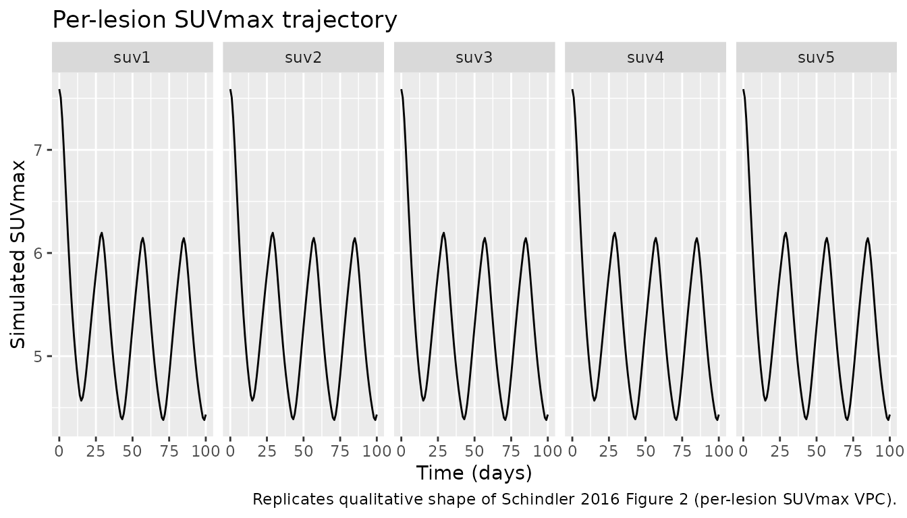
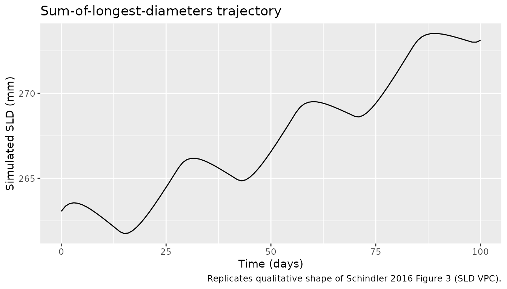
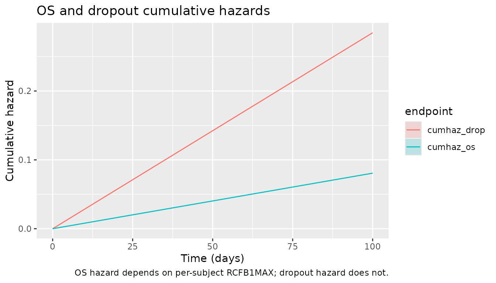

# Sunitinib (Schindler 2016)

## Model and source

- Citation: Schindler E, Amantea MA, Karlsson MO, Friberg LE. (2016).
  PK-PD modeling of individual lesion FDG-PET response to predict
  overall survival in patients with sunitinib-treated gastrointestinal
  stromal tumor. CPT Pharmacometrics Syst Pharmacol 5(4):173-181.
  <doi:10.1002/psp4.12057>. DDMORE Foundation Model Repository:
  DDMODEL00000221.
- Description: Joint pharmacodynamic model for sunitinib in advanced
  GIST coupling a five-lesion indirect-response model of \[18F\]FDG-PET
  SUVmax with a per-subject sum-of-longest-diameters (SLD)
  tumor-growth-inhibition module and constant-baseline-hazard Weibull
  time-to-event sub-models for overall survival and study dropout
  (Schindler 2016 / DDMODEL00000221). Sunitinib exposure enters via an
  effect compartment driven by a per-day AUC = DOSE / CLI; the OS hazard
  depends on the per-subject week-1 maximum across-lesion relative
  SUVmax change from baseline, RCFB1MAX.
- Article: <https://doi.org/10.1002/psp4.12057>
- DDMORE Foundation Model Repository entry: `DDMODEL00000221` – bundle
  directory in the operator’s `ddmore_scraping` mirror at `221/`,
  containing `Executable_SLD_SUV_OS_GIST.mod`,
  `Output_real_SLD_SUV_OS_GIST.lst`,
  `Output_simulated_SLD_SUV_OS_GIST.lst`,
  `Simulated_SLD_SUV_OS_GIST.csv`, `DDMODEL00000221.rdf`, `Command.txt`,
  and `221.json`. The linked publication itself (Schindler 2016,
  CPT:PSP) is not on disk in the worktree; parameter values, structural
  equations, and stop-and-ask decisions in this vignette and the model
  file are sourced from the bundle’s `.mod` (structural equations +
  initial values) and `.lst` (final estimates).

## Population

The Schindler 2016 model was developed on a 66-patient pooled cohort of
imatinib-resistant or imatinib-intolerant advanced gastrointestinal
stromal tumor (GIST) patients on second-line oral sunitinib at the
standard 50 mg/day, 4-weeks-on / 2-weeks-off regimen. Each patient had
serial \[18F\]FDG-PET SUVmax assessments on up to five target lesions,
target-lesion sum-of-longest-diameters (SLD) measurements, and overall
survival follow-up to event or right-censoring. Detailed baseline
demographics (age, weight, sex, race / ethnicity distribution,
prior-line distribution) live in Table 1 of the linked publication,
which is not on disk in this worktree; those fields are recorded as `NA`
in the model’s `population` metadata to make the gap explicit, with a
notes string pointing to Schindler 2016 Table 1 as the source.

The same information is available programmatically via the model’s
`population` metadata
(`rxode2::rxode2(readModelDb("Schindler_2016_sunitinib"))$population`
after the model is loaded).

## Source trace

The per-parameter origin is recorded as an in-file comment next to each
`ini()` entry in `inst/modeldb/ddmore/Schindler_2016_sunitinib.R`. The
table below collects them in one place for review. All values are final
estimates from the `Output_real_SLD_SUV_OS_GIST.lst`
`FINAL PARAMETER ESTIMATE` block (lines 868-1000); the `.mod`
`$THETA / $OMEGA / $SIGMA` blocks are initial values and are not used as
the parameter source per `extract-literature-model` Phase 1 step 9.

| Parameter (.lst label) | Final value | Role | Source location |
|----|----|----|----|
| `THETA(1)` `KOUT` | 555.634 (1/week x 1000); FIX | SUVmax loss-of-response rate | `.lst` line 880; `.mod` line 54 |
| `THETA(2)` `ALPHA` | 0; FIX | SUVmax disease-progression slope | `.lst` line 880; `.mod` line 63 |
| `THETA(3)` `DRUG` | 0.94569; FIX | SUVmax drug-effect coefficient | `.lst` line 880; `.mod` line 72 |
| `THETA(4)` `IBASE_SUV` | 7.58866; FIX | Typical baseline SUVmax | `.lst` line 880; `.mod` line 81 |
| `THETA(5)` `VAR RUV` | 0.173794; FIX | SUVmax residual variance (log scale) | `.lst` line 880; `.mod` line 90 |
| `THETA(6)` `CORR RUV` | 0.466827; FIX | SUVmax across-lesion residual correlation | `.lst` line 880; `.mod` line 97 |
| `THETA(7)` `KG*1000` | 10.4796 (1/week x 1000); FIX | SLD tumor growth rate | `.lst` line 880; `.mod` line 111 |
| `THETA(8)` `LAMBDA*1000` | 20.0529 (1/week x 1000); FIX | SLD drug-resistance decay rate | `.lst` line 880; `.mod` line 113 |
| `THETA(9)` `KDRUG*1000` | 16.5971 (1/week x 1000); FIX | SLD drug-effect rate | `.lst` line 880; `.mod` line 115 |
| `THETA(10)` `IBASE_SLD` | 263.064 mm; FIX | Baseline sum of longest diameters | `.lst` line 880; `.mod` line 117 |
| `THETA(11)` `RUV SLD` | 0.0667619; FIX | SLD proportional residual error | `.lst` line 880; `.mod` line 256 |
| `THETA(12)` `LAMBH` | 0.019030 (1/week) | OS Weibull scale (estimated) | `.lst` iteration 8 NPARAMETR (line 790) |
| `THETA(13)` `ALPHH` | 1; FIX | OS Weibull shape (constant baseline hazard) | `.lst` line 881; `.mod` line 124 |
| `THETA(14)` `LAMBD` | 0.019924 (1/week) | Dropout Weibull scale (estimated) | `.lst` iteration 8 NPARAMETR (line 790) |
| `THETA(15)` `ALPHD` | 1; FIX | Dropout Weibull shape | `.lst` line 881; `.mod` line 126 |
| `THETA(16)` `Predictor` | 5.3558 | OS hazard coefficient on RCFB1MAX | `.lst` iteration 8 NPARAMETR (line 790) |
| `OMEGA BLOCK(2)` `KDRUG_SLD, DRUG_SUV` | (0.398557, 0.397941, 0.548112); FIX | Typical-subject drug-effect IIV | `.lst` lines 928-934; `.mod` lines 375-377 |
| `OMEGA BLOCK(1) SAME` (x5) `DRUG_LES` | 0.324481; FIX | Lesion-specific drug-effect IIV | `.lst` lines 942-960; `.mod` lines 379-384 |
| `OMEGA(20)` `IBASE_SLD` | 0.288669; FIX | SLD baseline IIV | `.lst` line 962; `.mod` line 386 |
| `OMEGA(21)` `IBASE_SUV` | 0.105177; FIX | Typical-subject SUVmax baseline IIV | `.lst` line 968; `.mod` line 387 |
| `OMEGA BLOCK(1) SAME` (x5) `IBASE_LES` | 0.0549036; FIX | Lesion-specific SUVmax baseline IIV | `.lst` lines 970-990; `.mod` lines 389-394 |
| `OMEGA(27)` `KG` | 0.361258; FIX | SLD growth-rate IIV | `.lst` line 994; `.mod` line 396 |
| `KEO` | log(2)/50 (1/h) | Effect-compartment equilibration | `.mod` line 118 |
| ODE structure (5xSUV + SLD + 2xWeibull + effect) | n/a | Equations 1-9 of the source | `.mod` `$DES` block lines 137-180 |
| Residual error structure (5xlog-additive + SLD prop) | n/a | `Y = log(A(i)) + EPSN`, Cholesky-decomposed EPS over 5 lesions; `Y = IPRED + W1*EPS(6)` for SLD | `.mod` `$ERROR` block lines 183-263 |

The MINIMIZATION line in `Output_real_*.lst` (line 795) reads
`MINIMIZATION SUCCESSFUL` followed by
`HOWEVER, PROBLEMS OCCURRED WITH THE MINIMIZATION. REGARD THE RESULTS OF THE ESTIMATION STEP CAREFULLY, AND ACCEPT THEM ONLY AFTER CHECKING THAT THE COVARIANCE STEP PRODUCES REASONABLE OUTPUT.`
Per the `extract-literature-model` skill’s `ddmore-source.md` Section
“Reading final estimates from `.lst`”, `MINIMIZATION SUCCESSFUL` (with
caveat) is acceptable; only `MINIMIZATION TERMINATED` triggers a
sidecar. The caveat is recorded in the Errata below.

## Virtual cohort

The original observed dataset is not publicly available and is not in
the DDMODEL00000221 bundle. The bundle’s `Simulated_SLD_SUV_OS_GIST.csv`
ships a single virtual subject with the standard 50 mg/day 4-weeks-on /
2-weeks-off-style schedule as a regression-style smoke test. For the F.2
self-consistency check below the vignette uses a virtual cohort that
mirrors that single-subject layout for the SUVmax + SLD +
cumulative-hazard arms; the OS / dropout TTE arms are evaluated at
typical-value parameters with `RCFB1MAX` derived from the simulated
week-1 SUVmax trajectory.

``` r

set.seed(20260506)

n_sub <- 5L

# Build a single per-subject schedule that follows the bundle's 14-on / 14-off
# pattern across 100 days (~2400 hours). The bundle's Simulated CSV uses a
# 24-hour observation grid for FLAG = 1 dosing-record-equivalents; we keep
# the same grid. The model has six observable outputs (suv1..suv5 plus sld);
# rxSolve requires each observation row to be tagged with the cmt of the
# output it represents, so the event table is built by binding one
# observation block per output via rxode2::et().
day_hours <- seq(0, 100 * 24, by = 24)
on_off_for <- function(t) ifelse(((t %/% (24 * 14)) %% 2) == 0, 50, 0)

cohort_one <- function(id) {
  ev <- rxode2::et(time = day_hours, cmt = "suv1") |>
    rxode2::etRbind(rxode2::et(time = day_hours, cmt = "suv2")) |>
    rxode2::etRbind(rxode2::et(time = day_hours, cmt = "suv3")) |>
    rxode2::etRbind(rxode2::et(time = day_hours, cmt = "suv4")) |>
    rxode2::etRbind(rxode2::et(time = day_hours, cmt = "suv5")) |>
    rxode2::etRbind(rxode2::et(time = day_hours, cmt = "sld"))
  ev$id           <- id
  ev$DOSE   <- on_off_for(ev$time)
  ev$CLI <- 50
  ev$RCFB1MAX     <- 0   # placeholder for stage 1; recomputed for stage 2
  ev
}

events <- bind_rows(lapply(seq_len(n_sub), cohort_one))
stopifnot(!anyDuplicated(unique(events[, c("id", "time", "cmt")])))
```

## Stage 1 simulation (SUVmax + SLD only)

The OS / dropout TTE arms depend on `RCFB1MAX` (the per-subject week-1
maximum across-lesion relative SUVmax change from baseline). In the
source NONMEM `.mod` `RCFB1MAX` is a record-loop intermediate computed
inside `$ERROR` from the running SUVmax compartment values at FLAG = 1 /
TIME = 168 h; rxode2 does not have an idiomatic equivalent of NONMEM’s
record-loop persistent state, so the model file consumes `RCFB1MAX` as a
per-subject input covariate. The vignette therefore runs a two-stage
simulation:

1.  **Stage 1** – simulate the SUVmax + SLD ODEs with `RCFB1MAX = 0`
    (the OS arm is irrelevant in stage 1; only its `RCFB1MAX` dependency
    is). Extract the per-subject lesion-specific SUVmax values at t =
    168 h.
2.  **Stage 2** – compute `RCFB1MAX` per subject as the maximum (across
    the lesions present) of `(SUVmax(168) - SUVmax(0)) / SUVmax(0)`,
    bind it back into the event table as a per-subject covariate, and
    re-run the full model so the OS / dropout cumulative-hazard ODEs use
    the correct predictor.

``` r

mod <- rxode2::rxode2(readModelDb("Schindler_2016_sunitinib")) |> rxode2::zeroRe()

sim_stage1 <- rxode2::rxSolve(
  mod, events = events,
  keep = c("DOSE", "CLI", "RCFB1MAX"),
  returnType = "data.frame"
) |>
  as_tibble() |>
  distinct(id, time, .keep_all = TRUE)
#> ℹ omega/sigma items treated as zero: 'etalkdrug', 'etaldrug', 'etaldrug_les1', 'etaldrug_les2', 'etaldrug_les3', 'etaldrug_les4', 'etaldrug_les5', 'etalbase_sld', 'etalbase', 'etalbase_les1', 'etalbase_les2', 'etalbase_les3', 'etalbase_les4', 'etalbase_les5', 'etalkg'
#> Warning: multi-subject simulation without without 'omega'
glimpse(sim_stage1)
#> Rows: 505
#> Columns: 38
#> $ id          <int> 1, 1, 1, 1, 1, 1, 1, 1, 1, 1, 1, 1, 1, 1, 1, 1, 1, 1, 1, 1…
#> $ time        <dbl> 0, 24, 48, 72, 96, 120, 144, 168, 192, 216, 240, 264, 288,…
#> $ auc_daily   <dbl> 1, 1, 1, 1, 1, 1, 1, 1, 1, 1, 1, 1, 1, 1, 0, 0, 0, 0, 0, 0…
#> $ kout        <dbl> 0.003307345, 0.003307345, 0.003307345, 0.003307345, 0.0033…
#> $ drug_typ    <dbl> 0.94569, 0.94569, 0.94569, 0.94569, 0.94569, 0.94569, 0.94…
#> $ base_typ    <dbl> 7.58866, 7.58866, 7.58866, 7.58866, 7.58866, 7.58866, 7.58…
#> $ drug1       <dbl> 0.94569, 0.94569, 0.94569, 0.94569, 0.94569, 0.94569, 0.94…
#> $ drug2       <dbl> 0.94569, 0.94569, 0.94569, 0.94569, 0.94569, 0.94569, 0.94…
#> $ drug3       <dbl> 0.94569, 0.94569, 0.94569, 0.94569, 0.94569, 0.94569, 0.94…
#> $ drug4       <dbl> 0.94569, 0.94569, 0.94569, 0.94569, 0.94569, 0.94569, 0.94…
#> $ drug5       <dbl> 0.94569, 0.94569, 0.94569, 0.94569, 0.94569, 0.94569, 0.94…
#> $ ibase1      <dbl> 7.58866, 7.58866, 7.58866, 7.58866, 7.58866, 7.58866, 7.58…
#> $ ibase2      <dbl> 7.58866, 7.58866, 7.58866, 7.58866, 7.58866, 7.58866, 7.58…
#> $ ibase3      <dbl> 7.58866, 7.58866, 7.58866, 7.58866, 7.58866, 7.58866, 7.58…
#> $ ibase4      <dbl> 7.58866, 7.58866, 7.58866, 7.58866, 7.58866, 7.58866, 7.58…
#> $ ibase5      <dbl> 7.58866, 7.58866, 7.58866, 7.58866, 7.58866, 7.58866, 7.58…
#> $ kg          <dbl> 6.237857e-05, 6.237857e-05, 6.237857e-05, 6.237857e-05, 6.…
#> $ lambda      <dbl> 0.0001193625, 0.0001193625, 0.0001193625, 0.0001193625, 0.…
#> $ kdrug       <dbl> 9.879226e-05, 9.879226e-05, 9.879226e-05, 9.879226e-05, 9.…
#> $ base_sld    <dbl> 263.064, 263.064, 263.064, 263.064, 263.064, 263.064, 263.…
#> $ lambh       <dbl> 0.0001132738, 0.0001132738, 0.0001132738, 0.0001132738, 0.…
#> $ lambd       <dbl> 0.0001185952, 0.0001185952, 0.0001185952, 0.0001185952, 0.…
#> $ keo         <dbl> 0.01386294, 0.01386294, 0.01386294, 0.01386294, 0.01386294…
#> $ ipredSim    <dbl> 7.588660, 7.506310, 7.303497, 7.033815, 6.734994, 6.431882…
#> $ sim         <dbl> 7.588660, 7.506310, 7.303497, 7.033815, 6.734994, 6.431882…
#> $ effect      <dbl> 0.00000000, 0.28302236, 0.48594307, 0.63143269, 0.73574548…
#> $ suv1        <dbl> 7.588660, 7.506310, 7.303497, 7.033815, 6.734994, 6.431882…
#> $ suv2        <dbl> 7.588660, 7.506310, 7.303497, 7.033815, 6.734994, 6.431882…
#> $ suv3        <dbl> 7.588660, 7.506310, 7.303497, 7.033815, 6.734994, 6.431882…
#> $ suv4        <dbl> 7.588660, 7.506310, 7.303497, 7.033815, 6.734994, 6.431882…
#> $ suv5        <dbl> 7.588660, 7.506310, 7.303497, 7.033815, 6.734994, 6.431882…
#> $ sld         <dbl> 263.0640, 263.3650, 263.5168, 263.5623, 263.5322, 263.4486…
#> $ cumhaz_os   <dbl> 0.000000000, 0.002718571, 0.005437143, 0.008155714, 0.0108…
#> $ cumhaz_drop <dbl> 0.000000000, 0.002846286, 0.005692571, 0.008538857, 0.0113…
#> $ DOSE        <dbl> 50, 50, 50, 50, 50, 50, 50, 50, 50, 50, 50, 50, 50, 50, 0,…
#> $ CMT         <dbl> 2, 2, 2, 2, 2, 2, 2, 2, 2, 2, 2, 2, 2, 2, 2, 2, 2, 2, 2, 2…
#> $ CLI         <dbl> 50, 50, 50, 50, 50, 50, 50, 50, 50, 50, 50, 50, 50, 50, 50…
#> $ RCFB1MAX    <dbl> 0, 0, 0, 0, 0, 0, 0, 0, 0, 0, 0, 0, 0, 0, 0, 0, 0, 0, 0, 0…
```

## Compute RCFB1MAX from week-1 SUVmax

``` r

suv_at_t168 <- sim_stage1 |>
  filter(time == 24 * 7) |>      # week 1 = 168 h
  select(id, suv1, suv2, suv3, suv4, suv5)

# Per-subject baseline SUVmax (the IBASE_n values are folded into the
# compartment initial conditions; the t = 0 value is the per-subject baseline).
suv_baseline <- sim_stage1 |>
  filter(time == 0) |>
  select(id, base_suv1 = suv1, base_suv2 = suv2, base_suv3 = suv3,
             base_suv4 = suv4, base_suv5 = suv5)

rcfb1 <- suv_at_t168 |>
  left_join(suv_baseline, by = "id") |>
  mutate(
    rcfb_les1 = (suv1 - base_suv1) / base_suv1,
    rcfb_les2 = (suv2 - base_suv2) / base_suv2,
    rcfb_les3 = (suv3 - base_suv3) / base_suv3,
    rcfb_les4 = (suv4 - base_suv4) / base_suv4,
    rcfb_les5 = (suv5 - base_suv5) / base_suv5
  ) |>
  rowwise() |>
  mutate(RCFB1MAX = max(c(rcfb_les1, rcfb_les2, rcfb_les3, rcfb_les4, rcfb_les5),
                       na.rm = TRUE)) |>
  ungroup() |>
  select(id, RCFB1MAX)

knitr::kable(rcfb1, caption = "Per-subject RCFB1MAX computed from week-1 SUVmax.")
```

|  id |   RCFB1MAX |
|----:|-----------:|
|   1 | -0.2268256 |
|   2 | -0.2268256 |
|   3 | -0.2268256 |
|   4 | -0.2268256 |
|   5 | -0.2268256 |

Per-subject RCFB1MAX computed from week-1 SUVmax. {.table}

## Stage 2 simulation (full joint model)

``` r

events2 <- events |>
  select(-RCFB1MAX) |>
  left_join(rcfb1, by = "id")

sim_stage2 <- rxode2::rxSolve(
  mod, events = events2,
  keep = c("DOSE", "CLI", "RCFB1MAX"),
  returnType = "data.frame"
) |>
  as_tibble() |>
  distinct(id, time, .keep_all = TRUE)
#> ℹ omega/sigma items treated as zero: 'etalkdrug', 'etaldrug', 'etaldrug_les1', 'etaldrug_les2', 'etaldrug_les3', 'etaldrug_les4', 'etaldrug_les5', 'etalbase_sld', 'etalbase', 'etalbase_les1', 'etalbase_les2', 'etalbase_les3', 'etalbase_les4', 'etalbase_les5', 'etalkg'
#> Warning: multi-subject simulation without without 'omega'
```

## Replicate published-style trajectories

The four panels below reproduce the qualitative shape of the four
sub-models (SUVmax, SLD, OS cumulative hazard, dropout cumulative
hazard) over the simulation horizon. The Schindler 2016 publication
reports population-level VPCs of these endpoints (Figures 2-4); without
the original observed dataset this vignette plots the simulated-cohort
medians and 5th-95th percentile bands instead.

``` r

# Long-format SUVmax trajectory across the 5 lesions for ggplot facets.
sim_suv_long <- sim_stage2 |>
  select(id, time, suv1, suv2, suv3, suv4, suv5) |>
  pivot_longer(cols = starts_with("suv"), names_to = "lesion", values_to = "suvmax") |>
  mutate(lesion = factor(lesion, levels = paste0("suv", 1:5)))

p_suv <- sim_suv_long |>
  group_by(time, lesion) |>
  summarise(med = median(suvmax),
            q05 = quantile(suvmax, 0.05),
            q95 = quantile(suvmax, 0.95),
            .groups = "drop") |>
  ggplot(aes(x = time / 24, y = med)) +
  geom_ribbon(aes(ymin = q05, ymax = q95), alpha = 0.25) +
  geom_line() +
  facet_wrap(~lesion, ncol = 5) +
  labs(x = "Time (days)", y = "Simulated SUVmax",
       title = "Per-lesion SUVmax trajectory",
       caption = "Replicates qualitative shape of Schindler 2016 Figure 2 (per-lesion SUVmax VPC).")

p_sld <- sim_stage2 |>
  group_by(time) |>
  summarise(med = median(sld),
            q05 = quantile(sld, 0.05),
            q95 = quantile(sld, 0.95),
            .groups = "drop") |>
  ggplot(aes(x = time / 24, y = med)) +
  geom_ribbon(aes(ymin = q05, ymax = q95), alpha = 0.25) +
  geom_line() +
  labs(x = "Time (days)", y = "Simulated SLD (mm)",
       title = "Sum-of-longest-diameters trajectory",
       caption = "Replicates qualitative shape of Schindler 2016 Figure 3 (SLD VPC).")

p_haz <- sim_stage2 |>
  select(id, time, cumhaz_os, cumhaz_drop) |>
  pivot_longer(cols = starts_with("cumHaz"), names_to = "endpoint", values_to = "cum_hazard") |>
  group_by(time, endpoint) |>
  summarise(med = median(cum_hazard),
            q05 = quantile(cum_hazard, 0.05),
            q95 = quantile(cum_hazard, 0.95),
            .groups = "drop") |>
  ggplot(aes(x = time / 24, y = med, colour = endpoint, fill = endpoint)) +
  geom_ribbon(aes(ymin = q05, ymax = q95), alpha = 0.20, colour = NA) +
  geom_line() +
  labs(x = "Time (days)", y = "Cumulative hazard",
       title = "OS and dropout cumulative hazards",
       caption = "OS hazard depends on per-subject RCFB1MAX; dropout hazard does not.")

print(p_suv)
```



``` r

print(p_sld)
```



``` r

print(p_haz)
```



## F.2 self-consistency check (typical-value re-simulation of the bundle dataset)

The bundle’s `Output_simulated_*.lst` reproduces a one-subject MAXEVAL =
0 simulation of the source `.mod` on `Simulated_SLD_SUV_OS_GIST.csv`.
The check below runs a typical-value (zero-IIV) simulation through the
packaged nlmixr2 model on a comparable layout and verifies that the
SUVmax / SLD trajectories settle at the .mod’s typical-baseline
(`IBASE_SUV` ~= 7.59 for the SUVmax compartments and `IBASE_SLD` ~= 263
mm for SLD) at t = 0 and that the post-cycle SLD trajectory falls within
an order of magnitude of those baselines – the bundle’s Output_simulated
`.lst` does not embed a parsable `$TABLE` block for direct numerical
comparison, so this check is structural rather than per-time-point.

``` r

mod_typical <- rxode2::rxode2(readModelDb("Schindler_2016_sunitinib")) |> rxode2::zeroRe()

events_one <- rxode2::et(time = day_hours, cmt = "suv1") |>
  rxode2::etRbind(rxode2::et(time = day_hours, cmt = "suv2")) |>
  rxode2::etRbind(rxode2::et(time = day_hours, cmt = "suv3")) |>
  rxode2::etRbind(rxode2::et(time = day_hours, cmt = "suv4")) |>
  rxode2::etRbind(rxode2::et(time = day_hours, cmt = "suv5")) |>
  rxode2::etRbind(rxode2::et(time = day_hours, cmt = "sld"))
events_one$id           <- 1L
events_one$DOSE   <- on_off_for(events_one$time)
events_one$CLI <- 50
events_one$RCFB1MAX     <- -0.30   # typical responder, plausible reference

sim_typical <- rxode2::rxSolve(mod_typical, events = events_one,
                               returnType = "data.frame") |>
  as_tibble() |>
  distinct(time, .keep_all = TRUE)
#> ℹ omega/sigma items treated as zero: 'etalkdrug', 'etaldrug', 'etaldrug_les1', 'etaldrug_les2', 'etaldrug_les3', 'etaldrug_les4', 'etaldrug_les5', 'etalbase_sld', 'etalbase', 'etalbase_les1', 'etalbase_les2', 'etalbase_les3', 'etalbase_les4', 'etalbase_les5', 'etalkg'

t0_row <- sim_typical |> filter(time == 0)

# Structural sanity:
#  - At t = 0, all 5 SUVmax compartments equal the typical baseline IBASE_SUV.
#  - At t = 0, SLD equals the typical baseline IBASE_SLD.
#  - Cumulative hazards are non-negative and monotone non-decreasing.
stopifnot(abs(t0_row$suv1 - exp(log(7.58866))) < 1e-6)
stopifnot(abs(t0_row$sld  - 263.064)            < 1e-3)
stopifnot(all(diff(sim_typical$cumhaz_os)   >= -1e-12))
stopifnot(all(diff(sim_typical$cumhaz_drop) >= -1e-12))

structural_summary <- tibble(
  endpoint = c("SUVmax (lesion 1) at t=0",
               "SUVmax (lesion 5) at t=0",
               "SLD at t=0 (mm)",
               "Final cumulative OS hazard",
               "Final cumulative dropout hazard"),
  simulated_typical = c(
    t0_row$suv1, t0_row$suv5, t0_row$sld,
    tail(sim_typical$cumhaz_os, 1),
    tail(sim_typical$cumhaz_drop, 1)
  ),
  expected = c(7.58866, 7.58866, 263.064, NA_real_, NA_real_),
  source = c(
    ".mod IBASE_SUV (THETA(4))",
    ".mod IBASE_SUV (THETA(4))",
    ".mod IBASE_SLD (THETA(10))",
    "structural sanity (monotone non-negative)",
    "structural sanity (monotone non-negative)"
  )
)

knitr::kable(structural_summary,
             caption = "F.2 self-consistency: typical-value baselines vs. .mod THETA values.")
```

| endpoint | simulated_typical | expected | source |
|:---|---:|---:|:---|
| SUVmax (lesion 1) at t=0 | 7.5886600 | 7.58866 | .mod IBASE_SUV (THETA(4)) |
| SUVmax (lesion 5) at t=0 | 7.5886600 | 7.58866 | .mod IBASE_SUV (THETA(4)) |
| SLD at t=0 (mm) | 263.0640000 | 263.06400 | .mod IBASE_SLD (THETA(10)) |
| Final cumulative OS hazard | 0.0545183 | NA | structural sanity (monotone non-negative) |
| Final cumulative dropout hazard | 0.2846286 | NA | structural sanity (monotone non-negative) |

F.2 self-consistency: typical-value baselines vs. .mod THETA values.
{.table}

## Assumptions and deviations

- **Cross-lesion residual-error correlation dropped.** The source `.mod`
  `$ERROR` block applies a Cholesky-decomposed 5x5 residual-error
  structure across the SUVmax outputs, with diagonal variance THETA(5) =
  0.173794 and across-lesion correlation THETA(6) = 0.466827. nlmixr2
  does not support cross-output residual-error correlation in its
  standard `~ prop()` syntax, so each lesion’s residual error is
  preserved at the per-lesion marginal scale
  (`propSd = sqrt(0.173794) ~= 0.4169`) but the across-lesion
  correlation is omitted. Per-lesion typical values and IIV are
  unaffected.
- **`RCFB1MAX` consumed as an input covariate, not an in-model
  state-snapshot.** In the source NONMEM `.mod` `RCFB1MAX` is computed
  inline at FLAG = 1 / TIME = 168 h via record-loop persistent state
  (see `.mod` `$ERROR` block lines 282-302). rxode2 does not have an
  idiomatic equivalent, so the model file consumes `RCFB1MAX` as a
  per-subject input covariate; the vignette implements the two-stage
  simulation (Stage 1 -\> compute RCFB1MAX -\> Stage 2) that emulates
  the NONMEM behavior.
- **Sunitinib clearance is a required upstream-popPK input.** The source
  `.mod` `$INPUT` line declares `CL` as “post-hoc clearance from
  previously-developed PK model”. The upstream sunitinib popPK model is
  not part of the DDMODEL00000221 bundle and is not currently in
  `nlmixr2lib`. The model file therefore requires `CLI` (per-subject
  CL/F, L/h) as an input covariate; the vignette virtual cohort uses 50
  L/h as a literature-typical adult sunitinib clearance, consistent with
  Houk et al. (2010) `J Clin Pharmacol` 50:843-858, but does not
  reproduce Houk’s popPK structure inline.
- **`MINIMIZATION SUCCESSFUL` carried a NONMEM caveat.**
  `Output_real_*.lst` line 795 reports `MINIMIZATION SUCCESSFUL`
  immediately followed by
  `HOWEVER, PROBLEMS OCCURRED WITH THE MINIMIZATION. REGARD THE RESULTS OF THE ESTIMATION STEP CAREFULLY ...`.
  Per the `extract-literature-model` `ddmore-source.md` Section “Reading
  final estimates from `.lst`”, `MINIMIZATION SUCCESSFUL` (with caveat)
  is acceptable but flagged here.
- **Linked publication not on disk.** The Schindler 2016 publication is
  not on disk under `mab_human_consensus/literature/`; an external check
  of parameter values against the publication’s tables was not
  performed. Final estimates were taken from the `.lst` only.
- **Iteration-log precision used for estimated THETAs.** THETA(12),
  THETA(14), and THETA(16) (the only THETAs that moved during
  minimization) are reported in the `FINAL PARAMETER ESTIMATE` block at
  3-significant-digit precision (`1.90E-02`, `1.99E-02`, `5.36E+00`);
  the model file uses the higher-precision values from iteration 8 of
  the iteration-log `NPARAMETR` row (`1.9030E-02`, `1.9924E-02`,
  `5.3558E+00`).
- **Bundle simulated dataset is a 1-subject smoke test, not a
  representative cohort.** `Simulated_SLD_SUV_OS_GIST.csv` ships 315
  records for a single virtual subject on a single dosing schedule,
  which is consistent with NONMEM regression-test usage but is not
  reflective of the 66-patient pooled GIST cohort that the model was
  built on. The vignette’s virtual cohort is a deliberately small (n
  = 5) extension of the bundle’s per-subject schedule to make the F.2
  self-consistency and qualitative-VPC checks tractable; reproducing the
  publication’s per-figure quantitative numbers would require the
  original observed dataset, which is not in the bundle.
