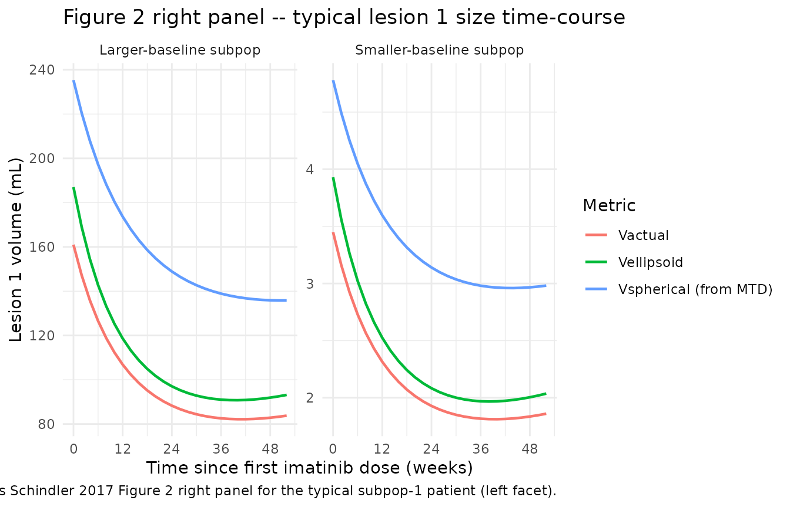
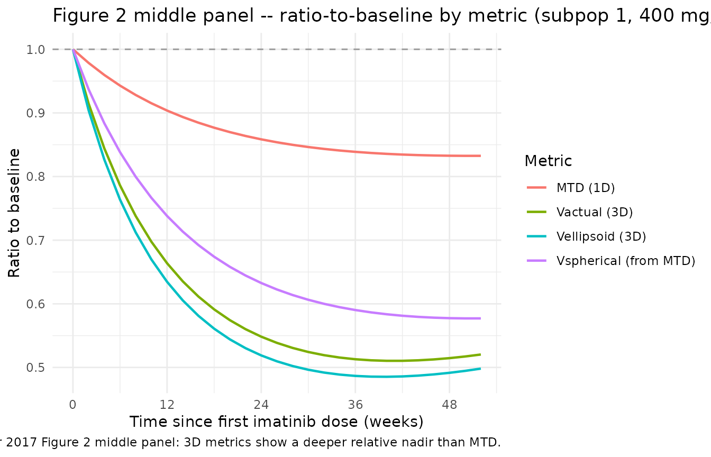
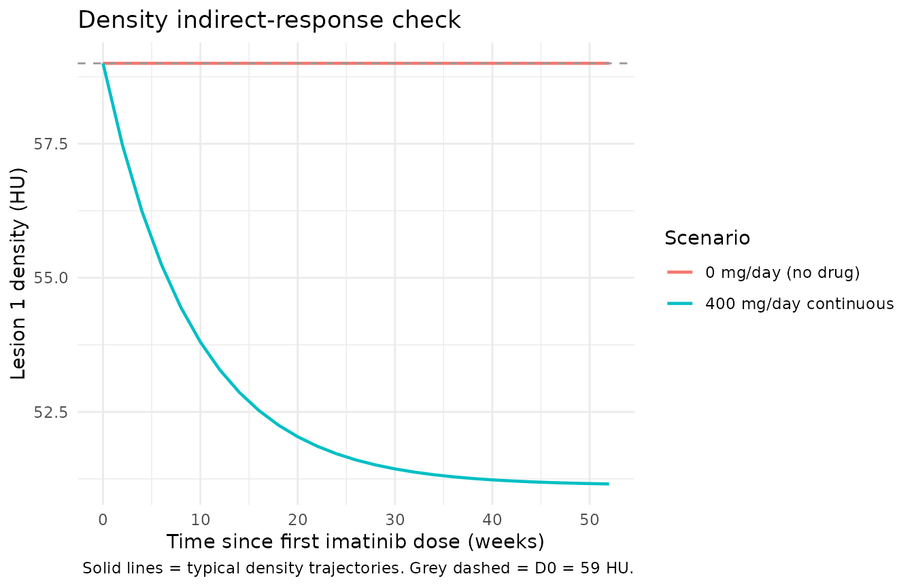

# Imatinib GIST liver-metastases tumor dynamics (Schindler 2017)

## Model and source

- Citation: Schindler E, Krishnan SM, Mathijssen RHJ, Ruggiero A,
  Schiavon G, Friberg LE. (2017). Pharmacometric modeling of liver
  metastases’ diameter, volume, and density and their relation to
  clinical outcome in imatinib-treated patients with gastrointestinal
  stromal tumors. CPT Pharmacometrics Syst Pharmacol 6(7):449-457.
  <doi:10.1002/psp4.12195>.
- Description: Joint tumor-dynamics PD model for imatinib-treated GIST
  liver metastases (Schindler 2017). Three size metrics (maximum
  transaxial diameter MTD in mm, software-segmented actual volume
  Vactual in mL, calculated ellipsoidal volume Vellipsoid in mL) follow
  a logistic tumor-growth model with a linear DOSE-dependent shrinkage
  term and a mono-exponential drug-effect washout (resistance
  development). Tumor density (Hounsfield units) follows an
  indirect-response model in which imatinib linearly stimulates the loss
  rate. Each subject can carry up to two liver lesions (lesion 1 has the
  larger baseline by convention); the binary covariate MIX_LARGE_BASE
  selects between a mixture subpopulation with larger lesion baselines
  (MIX_LARGE_BASE = 1, P = 0.348) and a smaller-baseline subpopulation
  (MIX_LARGE_BASE = 0). Drug exposure enters via the daily dose
  normalized to the median 400 mg, so DOSE is supplied as a per-record
  time-varying covariate (in mg/day). The OS and PFS time-to-event arms
  of the source publication are not encoded as ODE compartments here
  (see vignette Assumptions and deviations).
- Article: <https://doi.org/10.1002/psp4.12195> (open access; CPT
  Pharmacometrics Syst Pharmacol 6(7):449-457)

## Population

The Schindler 2017 model pools tumor-imaging data from 77 patients with
gastrointestinal stromal tumor (GIST) and at least one liver metastasis
(60 of 77 with two target lesions, lesion 1 carrying the larger baseline
maximum transaxial diameter (MTD) by convention). Median age was 62
years (range 34-83), 39 % female. All patients started first-line oral
imatinib at 400 mg/day (74 of 77) or 800 mg/day (3 of 77); 30 patients
(39 %) had a dose escalation to a median 800 mg/day (range 600-1200) and
8 (10 %) had reductions to a median 300 mg/day (range 200-300). Tumor
follow-up by computed tomography ran for a median of 360 days (range
82-495), yielding 502 size measurements per metric and 496 density
measurements from 136 lesions. The model uses the extensible
`population` schema in the model file; the same information is available
programmatically via
`rxode2::rxode2(readModelDb("Schindler_2017_imatinib"))$population`.

## Source trace

The per-parameter origin is also recorded inline in
`inst/modeldb/specificDrugs/Schindler_2017_imatinib.R`. The table below
collects the structural-model equations and the joint-model parameter
estimates in one place for review.

| Equation / parameter | Value | Source location |
|----|----|----|
| Logistic growth + linear drug effect (size, Eq. 2) | n/a | Schindler 2017 Eq. 2; Results “Joint tumor model” |
| Indirect response, drug stimulates output (density, Eq. 3) | n/a | Schindler 2017 Eq. 3; Results “Joint tumor model” |
| `lS0_mtd_pop1_l1` (MTD lesion 1, subpop 1) | log(76.6 mm) | Table 2 row “S0, pop1”, MTD lesion 1 |
| `lS0_mtd_pop1_l2` (MTD lesion 2, subpop 1) | log(41.9 mm) | Table 2 row “S0, pop1”, MTD lesion 2 |
| `lS0_mtd_pop2_l1` (MTD lesion 1, subpop 2) | log(20.9 mm) | Table 2 row “S0, pop2”, MTD lesion 1 |
| `lS0_mtd_pop2_l2` (MTD lesion 2, subpop 2) | log(14.2 mm) | Table 2 row “S0, pop2”, MTD lesion 2 |
| `lSmax_mtd_l1`, `lSmax_mtd_l2` | log(171), log(125) mm | Table 2 row “Smax”, MTD |
| `lKG_mtd` | log(0.00176 /week) | Table 2 row “KG”, MTD |
| `lk_mtd` | log(0.0475 /week) | Table 2 row “k”, MTD |
| `lKdrug_mtd` | log(0.0124 /week) | Table 2 row “Kdrug,S”, MTD |
| `lS0_vact_pop1_l1`, `..._l2` | log(161), log(29.7) mL | Table 2 row “S0, pop1”, Vactual |
| `lS0_vact_pop2_l1`, `..._l2` | log(3.45), log(1.21) mL | Table 2 row “S0, pop2”, Vactual |
| `lSmax_vact_l1`, `lSmax_vact_l2` | log(1190), log(540) mL | Table 2 row “Smax”, Vactual |
| `lKG_vact`, `lk_vact`, `lKdrug_vact` | log(0.00861), log(0.0469), log(0.0547) /week | Table 2 rows “KG / k / Kdrug,S” Vactual |
| `lS0_vell_pop1_l1`, `..._l2` | log(187), log(33.4) mL | Table 2 row “S0, pop1”, Vellipsoid |
| `lS0_vell_pop2_l1`, `..._l2` | log(3.93), log(1.27) mL | Table 2 row “S0, pop2”, Vellipsoid |
| `lSmax_vell_l1`, `lSmax_vell_l2` | log(1230), log(588) mL | Table 2 row “Smax”, Vellipsoid (95 % LL CI 685-3260 for lesion 1) |
| `lKG_vell`, `lk_vell`, `lKdrug_vell` | log(0.00882), log(0.0508), log(0.0610) /week | Table 2 rows Vellipsoid |
| `Ppop1` (mixture probability, common to size models) | 0.348 | Table 2 row “Ppop1” (recorded in `covariateData[[MIX_LARGE_BASE]]$notes`) |
| `lD0`, `lkout_dens`, `lKdrug_dens` | log(59.0), log(0.0935), log(0.154) | Table 3 rows “D0 / kout / Kdrug,D” |
| Box-Cox D0 shape | -1.06 (CI -2.01 to -0.397) | Table 3 footnote a (not encoded; see Assumptions below) |
| `propSd_mtd_*`, `propSd_vact_*`, `propSd_vell_*`, `propSd_dens_*` | 0.140 / 0.368 / 0.433 / 0.206 | Table 2 / Table 3 rows “RUV (%)” |
| Per-subpopulation IIV on `S0` (per metric) | CV % per subpop | Table 2 column “IIV, CV% (RSE%)” |
| IIV on KG, Kdrug,S (per size metric) | CV % | Table 2 column “IIV, CV% (RSE%)” |
| IIV / ILV on D0 and Kdrug,D | CV % | Table 3 columns “IIV / ILV CV% (RSE%)” |

## Virtual cohort

Schindler 2017 reports a single GIST cohort on oral imatinib; the
original patient-level data are not publicly available. The virtual
cohort below follows the published demographics: a continuous 400 mg/day
imatinib regimen over one year (no dose escalation), one lesion per
simulated subject, and a 50/50 split between the two mixture
subpopulations so each phenotype is visible in the figures (the
published mixture probability is `Ppop1` = 0.348; for population-scale
predictions draw `MIX_LARGE_BASE ~ Bernoulli(0.348)`).

``` r

set.seed(20170401L)

# Helper -- one cohort as a self-contained event table. `id_offset` shifts
# subject IDs so multiple cohorts can be bind_rows()-ed without colliding.
make_cohort <- function(n, mix_large, dose_mg_day, weeks = 52, id_offset = 0L) {
  obs_times <- c(0, seq(2, weeks, by = 2))
  tibble(
    id   = rep(id_offset + seq_len(n), each = length(obs_times)),
    time = rep(obs_times, times = n)
  ) |>
    mutate(
      evid           = 0L,
      amt            = 0,
      DOSE           = dose_mg_day,
      MIX_LARGE_BASE = mix_large,
      cohort         = if (mix_large == 1) "Larger-baseline subpop" else "Smaller-baseline subpop"
    )
}

events <- dplyr::bind_rows(
  make_cohort(1L, mix_large = 1L, dose_mg_day = 400, id_offset = 0L),
  make_cohort(1L, mix_large = 0L, dose_mg_day = 400, id_offset = 1L)
)

stopifnot(!anyDuplicated(unique(events[, c("id", "time", "evid")])))
```

## Simulation

The Schindler 2017 model has no PK arm (drug exposure enters through the
`DOSE / 400` daily-dose multiplier), so the model `units$time` is “week”
and the event-table `time` column carries weeks since first imatinib
dose.

``` r

mod <- rxode2::rxode2(readModelDb("Schindler_2017_imatinib"))
#> ℹ parameter labels from comments will be replaced by 'label()'
#> Warning: some etas defaulted to non-mu referenced, possible parsing error: etalS0_mtd_pop2, etalS0_vact_pop2, etalS0_vell_pop2
#> as a work-around try putting the mu-referenced expression on a simple line
mod_typical <- rxode2::zeroRe(mod)
#> Warning: some etas defaulted to non-mu referenced, possible parsing error: etalS0_mtd_pop2, etalS0_vact_pop2, etalS0_vell_pop2
#> as a work-around try putting the mu-referenced expression on a simple line
sim_typical <- rxode2::rxSolve(
  mod_typical,
  events = events,
  keep   = c("DOSE", "MIX_LARGE_BASE", "cohort")
) |>
  as.data.frame()
#> ℹ omega/sigma items treated as zero: 'etalS0_mtd_pop1', 'etalS0_mtd_pop2', 'etalKG_mtd', 'etalKdrug_mtd', 'etalS0_vact_pop1', 'etalS0_vact_pop2', 'etalKG_vact', 'etalKdrug_vact', 'etalS0_vell_pop1', 'etalS0_vell_pop2', 'etalKG_vell', 'etalKdrug_vell', 'etalD0', 'etalKdrug_dens', 'etalD0_les1', 'etalD0_les2', 'etalKdrug_dens_les1', 'etalKdrug_dens_les2'
#> Warning: multi-subject simulation without without 'omega'
```

## Replicate published Figure 2 (right panel)

Schindler 2017 Figure 2 (right panel) plots the typical model-predicted
trajectories of Vactual, Vellipsoid, and the MTD-derived spherical
volume Vspherical for the larger lesion in a typical subpopulation-1
patient treated with 400 mg/day imatinib. The chunk below renders the
analogous three-metric typical-time-course for the larger lesion of each
subpopulation, showing the mid-treatment nadir and late-phase rebound
driven by the `exp(-k * t)` drug-effect washout.

``` r

# Spherical volume from MTD: Vsph = (pi/6) * (MTD/10)^3, with MTD in mm and Vsph in mL
# (Schindler 2017 caption Figure 2: 'assuming that lesions are perfect spheres').
plot_data <- sim_typical |>
  mutate(
    Vspherical_l1 = (pi / 6) * (mtd_l1 / 10)^3
  ) |>
  select(time, cohort, vactual_l1, vellipsoid_l1, Vspherical_l1) |>
  pivot_longer(
    cols      = c(vactual_l1, vellipsoid_l1, Vspherical_l1),
    names_to  = "metric",
    values_to = "volume_mL"
  ) |>
  mutate(metric = recode(
    metric,
    vactual_l1    = "Vactual",
    vellipsoid_l1 = "Vellipsoid",
    Vspherical_l1 = "Vspherical (from MTD)"
  ))

ggplot(plot_data, aes(time, volume_mL, colour = metric)) +
  geom_line(linewidth = 0.8) +
  facet_wrap(~ cohort, scales = "free_y") +
  scale_x_continuous(breaks = seq(0, 60, by = 12)) +
  labs(
    x        = "Time since first imatinib dose (weeks)",
    y        = "Lesion 1 volume (mL)",
    colour   = "Metric",
    title    = "Figure 2 right panel -- typical lesion 1 size time-course",
    caption  = "Replicates Schindler 2017 Figure 2 right panel for the typical subpop-1 patient (left facet)."
  ) +
  theme_minimal()
```



## Replicate published Figure 2 (middle panel) – ratio-to-baseline

Schindler 2017 Figure 2 (middle panel) overlays MTD, Vactual, Vellipsoid
and Vspherical as relative changes from baseline to show that the 3D
metrics detect a larger ratio change (deeper nadir) than the 1D MTD
around the mid-treatment minimum.

``` r

ratio_data <- sim_typical |>
  group_by(id) |>
  mutate(
    MTD_ratio        = mtd_l1 / first(mtd_l1),
    Vactual_ratio    = vactual_l1 / first(vactual_l1),
    Vellipsoid_ratio = vellipsoid_l1 / first(vellipsoid_l1),
    Vspherical_ratio = ((pi / 6) * (mtd_l1 / 10)^3) / first((pi / 6) * (mtd_l1 / 10)^3)
  ) |>
  ungroup() |>
  filter(cohort == "Larger-baseline subpop") |>
  select(time, MTD_ratio, Vactual_ratio, Vellipsoid_ratio, Vspherical_ratio) |>
  pivot_longer(-time, names_to = "metric", values_to = "ratio_to_baseline") |>
  mutate(metric = recode(
    metric,
    MTD_ratio        = "MTD (1D)",
    Vactual_ratio    = "Vactual (3D)",
    Vellipsoid_ratio = "Vellipsoid (3D)",
    Vspherical_ratio = "Vspherical (from MTD)"
  ))

ggplot(ratio_data, aes(time, ratio_to_baseline, colour = metric)) +
  geom_line(linewidth = 0.8) +
  geom_hline(yintercept = 1, linetype = "dashed", colour = "grey60") +
  scale_x_continuous(breaks = seq(0, 60, by = 12)) +
  labs(
    x        = "Time since first imatinib dose (weeks)",
    y        = "Ratio to baseline",
    colour   = "Metric",
    title    = "Figure 2 middle panel -- ratio-to-baseline by metric (subpop 1, 400 mg/day)",
    caption  = "Replicates Schindler 2017 Figure 2 middle panel: 3D metrics show a deeper relative nadir than MTD."
  ) +
  theme_minimal()
```



## Density typical-trajectory check

Schindler 2017 reports that imatinib lowers tumor density (a structural
metric) via an indirect-response model with stimulation of the output
rate; the typical kout = 0.0935 /week corresponds to a mean residence
time of about 75 days. The chunk below plots typical density
trajectories under 400 mg/day and during a hypothetical drug holiday
(DOSE = 0) to confirm the indirect response returns to baseline `D0` =
59 HU in the absence of drug.

``` r

events_dens <- dplyr::bind_rows(
  make_cohort(1L, mix_large = 1L, dose_mg_day = 400, id_offset = 10L) |>
    mutate(scenario = "400 mg/day continuous"),
  make_cohort(1L, mix_large = 1L, dose_mg_day = 0,   id_offset = 11L) |>
    mutate(scenario = "0 mg/day (no drug)")
)

sim_dens <- rxode2::rxSolve(
  mod_typical,
  events = events_dens,
  keep   = c("DOSE", "MIX_LARGE_BASE", "cohort", "scenario")
) |>
  as.data.frame()
#> ℹ omega/sigma items treated as zero: 'etalS0_mtd_pop1', 'etalS0_mtd_pop2', 'etalKG_mtd', 'etalKdrug_mtd', 'etalS0_vact_pop1', 'etalS0_vact_pop2', 'etalKG_vact', 'etalKdrug_vact', 'etalS0_vell_pop1', 'etalS0_vell_pop2', 'etalKG_vell', 'etalKdrug_vell', 'etalD0', 'etalKdrug_dens', 'etalD0_les1', 'etalD0_les2', 'etalKdrug_dens_les1', 'etalKdrug_dens_les2'
#> Warning: multi-subject simulation without without 'omega'

ggplot(sim_dens, aes(time, density_l1, colour = scenario)) +
  geom_line(linewidth = 0.8) +
  geom_hline(yintercept = 59.0, linetype = "dashed", colour = "grey60") +
  labs(
    x        = "Time since first imatinib dose (weeks)",
    y        = "Lesion 1 density (HU)",
    colour   = "Scenario",
    title    = "Density indirect-response check",
    caption  = "Solid lines = typical density trajectories. Grey dashed = D0 = 59 HU."
  ) +
  theme_minimal()
```



## Numerical sanity check vs published values

``` r

typical_t0 <- sim_typical |>
  group_by(cohort) |>
  summarise(across(c(mtd_l1, vactual_l1, vellipsoid_l1, density_l1), first), .groups = "drop")

paper_t0 <- tibble(
  cohort        = c("Larger-baseline subpop", "Smaller-baseline subpop"),
  mtd_l1_paper        = c(76.6, 20.9),
  vactual_l1_paper    = c(161.0, 3.45),
  vellipsoid_l1_paper = c(187.0, 3.93),
  density_l1_paper    = c(59.0, 59.0)
)

knitr::kable(
  dplyr::left_join(typical_t0, paper_t0, by = "cohort"),
  digits = 3,
  caption = "Simulated baselines vs Schindler 2017 Table 2 / Table 3 typical values."
)
```

| cohort | mtd_l1 | vactual_l1 | vellipsoid_l1 | density_l1 | mtd_l1_paper | vactual_l1_paper | vellipsoid_l1_paper | density_l1_paper |
|:---|---:|---:|---:|---:|---:|---:|---:|---:|
| Larger-baseline subpop | 76.6 | 161.00 | 187.00 | 59 | 76.6 | 161.00 | 187.00 | 59 |
| Smaller-baseline subpop | 20.9 | 3.45 | 3.93 | 59 | 20.9 | 3.45 | 3.93 | 59 |

Simulated baselines vs Schindler 2017 Table 2 / Table 3 typical values.
{.table}

``` r


# Doubling-time check (Discussion paragraph 4): KG => doubling time
doubling_weeks <- log(2) / c(MTD = 0.00176, Vactual = 0.00861, Vellipsoid = 0.00882)
doubling_years <- doubling_weeks / 52
knitr::kable(
  data.frame(
    metric              = c("MTD", "Vactual", "Vellipsoid"),
    KG_per_week         = c(0.00176, 0.00861, 0.00882),
    doubling_time_years = doubling_years,
    paper_estimate_y    = c(7.4, 1.5, 1.5)
  ),
  digits = 2,
  caption = "Typical doubling-time check (Schindler 2017 Discussion paragraph 4)."
)
```

|            | metric     | KG_per_week | doubling_time_years | paper_estimate_y |
|:-----------|:-----------|------------:|--------------------:|-----------------:|
| MTD        | MTD        |        0.00 |                7.57 |              7.4 |
| Vactual    | Vactual    |        0.01 |                1.55 |              1.5 |
| Vellipsoid | Vellipsoid |        0.01 |                1.51 |              1.5 |

Typical doubling-time check (Schindler 2017 Discussion paragraph 4).
{.table}

## Assumptions and deviations

- **Mixture model encoded as covariate.** Schindler 2017 fitted the
  two-baseline mixture via NONMEM’s `$MIXTURE` block, with `Ppop1` =
  0.348 estimated as a model parameter. Here the per-subject latent
  class is supplied as the binary covariate `MIX_LARGE_BASE`; for
  population simulation users should draw it externally as
  `MIX_LARGE_BASE ~ Bernoulli(0.348)`. This is a faithful representation
  of the source model for simulation; estimation against new data with
  re-estimation of the mixture probability would require encoding the
  mixture inside the likelihood, which is outside the scope of the
  packaged model.
- **Box-Cox transformation on D0 random effects approximated as
  log-normal.** Schindler 2017 Table 3 footnote a reports a Box-Cox
  transformation with shape -1.06 (95 % LL profile CI -2.01 to -0.397)
  applied to the combined IIV + ILV deviation on baseline density D0 to
  handle a skewed random-effects distribution. nlmixr2 does not have
  native support for Box-Cox transformed random effects, so the
  per-subject and per-lesion deviations on D0 are encoded as standard
  log-normal etas in the model file. The shape parameter is recorded as
  an inline comment for provenance; users running stochastic VPCs that
  rely on the tail behaviour of D0 should be aware that the simulated D0
  distribution will be log-normal rather than Box-Cox transformed.
- **ILV on baseline tumor size S0 not encoded.** Schindler 2017 Methods
  Eq. 1 and Results report an ILV term on `S0` (lesion-specific, with a
  common variance across the two lesions of a patient). Table 2 does not
  report a numerical estimate for this ILV variance (only the IIV CV %
  per subpopulation and the per-lesion typical values), so the ILV on
  `S0` is omitted from `ini()` and the per-subject IIV term is the only
  random effect on size baselines. The corresponding ILV on density
  parameters `D0` and `Kdrug,D` is encoded (Table 3 reports the ILV CV %
  values 18 % and 53 %).
- **OS and PFS time-to-event arms not encoded.** Schindler 2017 develops
  parametric log-normal-baseline-hazard models for overall survival (OS,
  Eq. 4, driven by log-transformed Vactual(t)) and progression-free
  survival (PFS, Eq. 5, driven by the relative change in Vactual from
  baseline up to 3 months together with log-transformed baseline
  Vactual). Both predictors are derived from the tumor-dynamics
  trajectory; the PFS predictor in particular is a fixed-per-subject
  quantity computed at a specific time-point (t = 3 months), which
  requires a two-stage simulation pattern that does not map cleanly to a
  single rxode2 model. The TTE arms are therefore not represented as
  cumulative-hazard compartments in this model file. Users who need to
  evaluate OS / PFS for simulated subjects should run the tumor
  simulation, extract Vactual(t) trajectories at the required time-
  points, and post-process those through the log-normal hazard
  expressions documented in Schindler 2017 Eq. 4 / Eq. 5 and Table 4.
- **Per-subpopulation IIV etas selected via covariate gating.**
  Schindler 2017 reports IIV variances that differ across mixture
  subpopulations for `S0` (e.g., MTD `S0` 47 % CV in subpop 1 vs 29 % in
  subpop 2). The model file declares two etas per metric (one for each
  subpop) and gates the contribution by `MIX_LARGE_BASE`; only the
  variance whose subpop matches the subject’s mixture class is exercised
  at simulation time. nlmixr2 emits a `non-mu referenced` warning for
  these subpop-2 etas because the gate breaks the strict mu-reference
  pattern; the warning does not affect simulation correctness.
- **Spherical volume is a derived quantity.** Figure 2 right panel of
  Schindler 2017 plots `Vspherical = (pi/6) * MTD^3` (assuming each
  lesion is a perfect sphere) for comparison against `Vactual` and
  `Vellipsoid`. The model file does not carry `Vspherical` as a
  compartment; the vignette computes it as a post-hoc derived quantity
  from the simulated MTD trajectory in the Figure 2 reproduction chunks
  above (with MTD converted from mm to cm before cubing so the result is
  in mL: `Vspherical_mL = (pi / 6) * (MTD_mm / 10)^3`).
