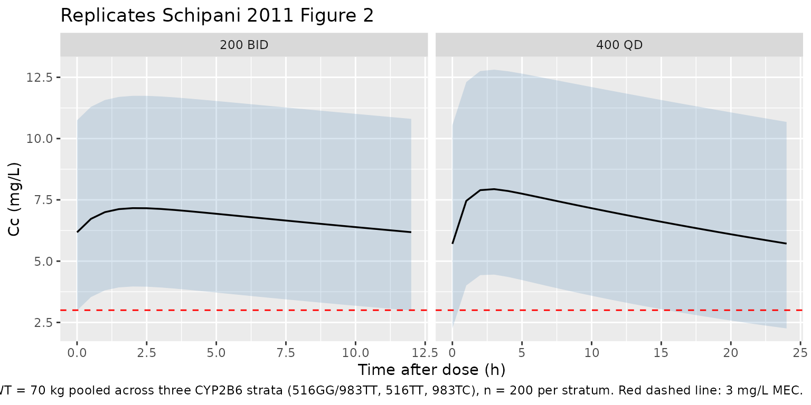
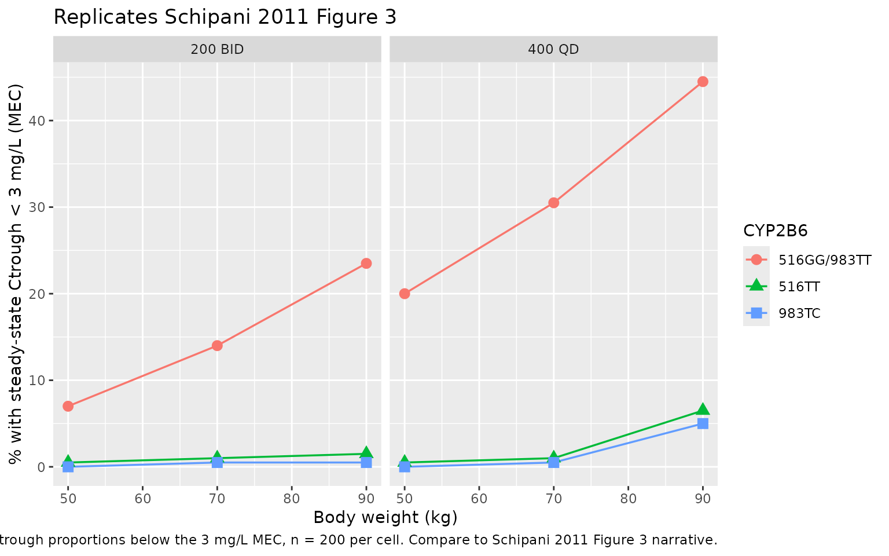

# Nevirapine (Schipani 2011)

## Model and source

- Citation: Schipani A, Wyen C, Mahungu T, Hendra H, Egan D, Siccardi M,
  Davies G, Khoo S, Fatkenheuer G, Rockstroh J, Brockmeyer NH, Johnson
  MA, Owen A, Back DJ. Integration of population pharmacokinetics and
  pharmacogenetics: an aid to optimal nevirapine dose selection in
  HIV-infected individuals. J Antimicrob Chemother.
  2011;66(6):1332-1339. <doi:10.1093/jac/dkr087>.
- Description: One-compartment population PK model for oral nevirapine
  in HIV-infected adults (Schipani 2011), with CYP2B6 516G\>T
  (rs3745274) and 983T\>C (rs28399499) genotype and body-weight
  covariate effects on CL/F. Covariate effects are additive on
  linear-scale CL/F per the published equation.
- Article: <https://doi.org/10.1093/jac/dkr087>

## Population

Schipani 2011 developed a one-compartment population PK model for oral
nevirapine in 272 HIV-positive adults pooled across two European cohorts
(113 patients from the Royal Free NHS Trust in London, plus 162 patients
from the German KompNet HIV/AIDS Cohort), after excluding 3 of the 275
originally enrolled patients with peak concentrations below 1 mg/L due
to suspected non-adherence. The pooled cohort had a median age of 42
years (range 18-82), median weight 72.5 kg (range 47-132), 66.5%
Caucasian / 33.5% Black ethnicity, and a 41.5% female representation
(Table 1 of the source). 237 patients received nevirapine 200 mg orally
twice daily and 38 patients received 400 mg orally once daily, all at
steady state. Patients were eligible only if they had already achieved a
virologically-suppressed steady-state on a nevirapine-based regimen in
combination with two nucleoside reverse-transcriptase inhibitors or one
NRTI plus one NtRTI; patients on ritonavir-boosted protease inhibitors
or other major interacting drugs were excluded. CYP2B6 c.516G\>T
(rs3745274) and c.983T\>C (rs28399499) were genotyped in all subjects;
the cohort distribution was 516GG 47% / 516GT 46% / 516TT 7% and 983TT
97% / 983TC 3% / 983CC 0% (Table 1).

The same information is available programmatically:
`readModelDb("Schipani_2011_nevirapine")$population`.

## Source trace

Per-parameter origin (also recorded as in-file comments next to each
`ini()` entry of
`inst/modeldb/specificDrugs/Schipani_2011_nevirapine.R`):

| Equation / parameter | Value | Source location |
|----|----|----|
| `lka` | log(1.20) | Schipani 2011 Table 2 final-model `ka = 1.20 h^-1` (RSE 22%) |
| `lcl` | log(3.51) | Schipani 2011 Table 2 final-model `CL/F = 3.51 L/h` (RSE 3.0%); reference is BW 72.5 kg with CYP2B6 wild-type (516GG / 983TT) |
| `lvc` | log(150) | Schipani 2011 Table 2 final-model `V/F = 150 L` (RSE 8.7%) |
| `e_wt_cl` | 0.018 | Schipani 2011 Table 2 `theta_BW on NVP CL/F = 0.018` (RSE 32.8%); paper text: “CL/F increased by 0.18 L/h with body weight increases of 10 kg” |
| `e_516gt_cl` | -0.5 | Schipani 2011 Table 2 `theta_516GT on NVP CL/F = -0.5` (RSE 27.3%); 14% lower CL/F vs 516GG reference |
| `e_516tt_cl` | -1.3 | Schipani 2011 Table 2 `theta_516TT on NVP CL/F = -1.3` (RSE 16.7%); 37% lower CL/F vs 516GG reference |
| `e_983tc_cl` | -1.4 | Schipani 2011 Table 2 `theta_983TC on NVP CL/F = -1.4` (RSE 13.2%); 40% lower CL/F vs 983TT reference |
| `etalcl` | 0.09171 | Schipani 2011 Table 2 IIV CL/F = 31% CV in the final model (RSE 10.8%); omega^2 = log(1 + 0.31^2) = 0.09171 |
| `propSd` | 0.092 | Schipani 2011 Table 2 proportional residual error = 9.2% CV (RSE 10.8%); cross-check with Results: sqrt(0.0085) = 0.0922 |
| `tvcl = exp(lcl) + e_wt_cl*(WT - 72.5) + e_516gt_cl*(count == 1) + e_516tt_cl*(count == 2) + e_983tc_cl*(count == 1)` | n/a | Schipani 2011 final equation: `TVCL = theta0 + theta_BW * (BW - 72.5) + theta_516GT * X_516GT + theta_516TT * X_516TT + theta_983TC * X_983TC` |
| `d/dt(depot)`, `d/dt(central)` | n/a | Schipani 2011 Results: “one-compartment model with first-order absorption and first-order elimination” |
| `Cc <- central / vc` | n/a | Standard 1-cmt parameterisation; dose mg, volume L -\> mg/L |
| `Cc ~ prop(propSd)` | n/a | Schipani 2011 Methods: “residual variability was best described by a proportional structure” |

## Virtual cohort

Original observed data are not publicly available. The simulations below
reproduce the figure 3 design from Schipani 2011: combinations of two
dosing regimens (200 mg twice daily and 400 mg once daily), three body
weights (50, 70, 90 kg), and three CYP2B6 genotype strata (516GG with
983TT wild-type; 516TT homozygous variant; 983TC heterozygous variant),
each evaluated at steady state.

``` r

set.seed(20260521L)

n_per_cell  <- 200L
tau_bid     <- 12     # h, dosing interval for 200 mg BID
tau_qd      <- 24     # h, dosing interval for 400 mg QD
n_doses_bid <- 28L    # 14 days of BID dosing
n_doses_qd  <- 14L    # 14 days of QD dosing

# Sampling times: full intra-interval profile in the LAST dosing interval
ss_start_bid <- (n_doses_bid - 1L) * tau_bid     # = 324 h
ss_start_qd  <- (n_doses_qd  - 1L) * tau_qd      # = 312 h
prof_bid <- seq(0, tau_bid, by = 0.5)            # 0, 0.5, ..., 12 h within interval
prof_qd  <- seq(0, tau_qd, by = 1.0)             # 0, 1, ..., 24 h within interval

# Genotype mapping table for the three modelled strata
geno_specs <- tibble::tribble(
  ~geno,        ~rs3745274_T, ~rs28399499_C,
  "516GG/983TT",            0L,            0L,
  "516TT",                  2L,            0L,
  "983TC",                  0L,            1L
)

# weight strata to simulate
wt_specs <- c(50, 70, 90)

# regimens as plain lists (avoid tribble list-column gotchas)
reg_specs <- list(
  list(regimen = "200 BID", amt = 200, tau = tau_bid, n_doses = n_doses_bid,
       ss_start = ss_start_bid, prof = prof_bid),
  list(regimen = "400 QD",  amt = 400, tau = tau_qd,  n_doses = n_doses_qd,
       ss_start = ss_start_qd,  prof = prof_qd)
)

make_cell <- function(reg, WT, geno_row, id_offset) {
  ids <- id_offset + seq_len(n_per_cell)
  # one dose row per dose (no addl) so amt is visible per row for PKNCA
  dose_rows <- tidyr::expand_grid(
    id   = ids,
    didx = seq_len(reg$n_doses)
  ) |>
    dplyr::mutate(
      time = (didx - 1) * reg$tau,
      amt  = reg$amt,
      evid = 1L,
      cmt  = 1L
    ) |>
    dplyr::select(-didx)
  obs_t <- reg$ss_start + reg$prof
  obs_rows <- tidyr::expand_grid(
    id   = ids,
    time = obs_t
  ) |>
    dplyr::mutate(
      amt  = 0,
      evid = 0L,
      cmt  = NA_integer_
    )
  dplyr::bind_rows(dose_rows, obs_rows) |>
    dplyr::mutate(
      WT                            = WT,
      SNP_CYP2B6_RS3745274_T_COUNT  = geno_row$rs3745274_T,
      SNP_CYP2B6_RS28399499_C_COUNT = geno_row$rs28399499_C,
      regimen                       = reg$regimen,
      geno                          = geno_row$geno,
      wt_strat                      = paste0(WT, " kg"),
      cohort                        = paste(reg$regimen, geno_row$geno,
                                            paste0(WT, " kg"), sep = " | ")
    )
}

cell_grid <- tidyr::expand_grid(
  reg_idx  = seq_along(reg_specs),
  wt_idx   = seq_along(wt_specs),
  geno_idx = seq_len(nrow(geno_specs))
) |>
  dplyr::mutate(id_offset = (dplyr::row_number() - 1L) * n_per_cell)

events <- do.call(
  dplyr::bind_rows,
  lapply(seq_len(nrow(cell_grid)), function(i) {
    row <- cell_grid[i, ]
    make_cell(
      reg       = reg_specs[[row$reg_idx]],
      WT        = wt_specs[row$wt_idx],
      geno_row  = geno_specs[row$geno_idx, ],
      id_offset = row$id_offset
    )
  })
) |>
  dplyr::arrange(id, time, dplyr::desc(evid))

stopifnot(!anyDuplicated(unique(events[, c("id", "time", "evid")])))
```

## Simulation

``` r

mod <- rxode2::rxode2(readModelDb("Schipani_2011_nevirapine"))

sim <- rxode2::rxSolve(
  mod,
  events = events,
  keep   = c("WT", "SNP_CYP2B6_RS3745274_T_COUNT",
             "SNP_CYP2B6_RS28399499_C_COUNT",
             "regimen", "geno", "wt_strat", "cohort")
) |>
  as.data.frame()
```

## Replicate Figure 2: steady-state 90% prediction intervals by regimen

Schipani 2011 Figure 2 shows the 90% prediction interval of nevirapine
concentrations vs time for (a) 200 mg BID and (b) 400 mg QD, constructed
from 1000 simulations using the covariate values of the training cohort.
The plot below reproduces that headline finding at the cohort-median 70
kg weight, pooled across the three CYP2B6 genotype strata so the band
reflects both inter-subject and pharmacogenetic variability.

``` r

sim_pi <- sim |>
  dplyr::filter(time > 0, !is.na(Cc), WT == 70) |>
  dplyr::mutate(
    tad = dplyr::case_when(
      regimen == "200 BID" ~ time - (n_doses_bid - 1L) * tau_bid,
      regimen == "400 QD"  ~ time - (n_doses_qd  - 1L) * tau_qd
    )
  ) |>
  dplyr::group_by(regimen, tad) |>
  dplyr::summarise(
    Q05 = stats::quantile(Cc, 0.05, na.rm = TRUE),
    Q50 = stats::quantile(Cc, 0.50, na.rm = TRUE),
    Q95 = stats::quantile(Cc, 0.95, na.rm = TRUE),
    .groups = "drop"
  )

ggplot(sim_pi, aes(tad, Q50)) +
  geom_ribbon(aes(ymin = Q05, ymax = Q95), alpha = 0.2, fill = "steelblue") +
  geom_line(linewidth = 0.6) +
  geom_hline(yintercept = 3, linetype = "dashed", colour = "red") +
  facet_wrap(~ regimen, scales = "free_x") +
  labs(
    x = "Time after dose (h)",
    y = "Cc (mg/L)",
    title = "Replicates Schipani 2011 Figure 2",
    caption = paste(
      "Median + 5-95% PI at WT = 70 kg pooled across three CYP2B6 strata",
      "(516GG/983TT, 516TT, 983TC), n = 200 per stratum.",
      "Red dashed line: 3 mg/L MEC."
    )
  )
```



## Replicate Figure 3: steady-state trough by genotype and weight

Schipani 2011 Figure 3 reports the proportion of subjects with
steady-state trough concentrations below the 3 mg/L minimum effective
concentration (MEC), separately for the 200 mg BID and 400 mg QD
regimens, stratified by body weight (50 / 70 / 90 kg) and CYP2B6
genotype (516GG/983TT wild-type, 516TT homozygous variant, 983TC
heterozygous variant). The table below recomputes those percentages from
the packaged model.

``` r

trough <- sim |>
  dplyr::filter(!is.na(Cc)) |>
  dplyr::group_by(id, regimen, geno, wt_strat) |>
  dplyr::summarise(
    ctrough = dplyr::last(Cc),  # last observation of the last interval
    .groups = "drop"
  )

pct_below_mec <- trough |>
  dplyr::group_by(regimen, geno, wt_strat) |>
  dplyr::summarise(
    pct_below_mec = round(100 * mean(ctrough < 3), 1),
    median_ctrough = round(stats::median(ctrough), 2),
    .groups = "drop"
  ) |>
  dplyr::arrange(regimen, geno, wt_strat)

knitr::kable(
  pct_below_mec,
  caption = paste(
    "Simulated % of subjects with steady-state Ctrough < 3 mg/L (MEC),",
    "by regimen, CYP2B6 genotype, and weight stratum. Replicates the",
    "Schipani 2011 Figure 3 / Discussion proportions."
  )
)
```

| regimen | geno        | wt_strat | pct_below_mec | median_ctrough |
|:--------|:------------|:---------|--------------:|---------------:|
| 200 BID | 516GG/983TT | 50 kg    |           7.0 |           4.89 |
| 200 BID | 516GG/983TT | 70 kg    |          14.0 |           4.34 |
| 200 BID | 516GG/983TT | 90 kg    |          23.5 |           3.74 |
| 200 BID | 516TT       | 50 kg    |           0.5 |           8.37 |
| 200 BID | 516TT       | 70 kg    |           1.0 |           6.90 |
| 200 BID | 516TT       | 90 kg    |           1.5 |           5.89 |
| 200 BID | 983TC       | 50 kg    |           0.0 |           9.24 |
| 200 BID | 983TC       | 70 kg    |           0.5 |           7.59 |
| 200 BID | 983TC       | 90 kg    |           0.5 |           6.45 |
| 400 QD  | 516GG/983TT | 50 kg    |          20.0 |           4.19 |
| 400 QD  | 516GG/983TT | 70 kg    |          30.5 |           3.76 |
| 400 QD  | 516GG/983TT | 90 kg    |          44.5 |           3.14 |
| 400 QD  | 516TT       | 50 kg    |           0.5 |           7.69 |
| 400 QD  | 516TT       | 70 kg    |           1.0 |           6.41 |
| 400 QD  | 516TT       | 90 kg    |           6.5 |           5.36 |
| 400 QD  | 983TC       | 50 kg    |           0.0 |           8.49 |
| 400 QD  | 983TC       | 70 kg    |           0.5 |           6.93 |
| 400 QD  | 983TC       | 90 kg    |           5.0 |           5.41 |

Simulated % of subjects with steady-state Ctrough \< 3 mg/L (MEC), by
regimen, CYP2B6 genotype, and weight stratum. Replicates the Schipani
2011 Figure 3 / Discussion proportions. {.table}

For reference, the published Figure 3 values were:

| Regimen | Genotype | 50 kg | 70 kg | 90 kg |
|---------|----------|-------|-------|-------|
| 200 BID | 516GG    | 12%   | 19%   | 28%   |
| 200 BID | 516TT    | 0.3%  | 1%    | 3%    |
| 200 BID | 983TC    | 0.2%  | 1%    | 2%    |
| 400 QD  | 516GG    | 20%   | 31%   | 43%   |
| 400 QD  | 516TT    | 1%    | 3%    | 7%    |
| 400 QD  | 983TC    | 0.6%  | 2%    | 6%    |

The headline qualitative finding is preserved: at every weight stratum
the 400 mg QD regimen produces a higher fraction of sub-MEC troughs than
the 200 mg BID regimen, and within each regimen the 516GG wild-type
stratum is at the highest sub-MEC risk while the 516TT and 983TC variant
carriers (with their lower CL/F) are largely protected.

``` r

pct_below_mec |>
  dplyr::mutate(
    wt = as.numeric(sub(" kg$", "", wt_strat))
  ) |>
  ggplot(aes(wt, pct_below_mec, colour = geno, shape = geno)) +
  geom_line(linewidth = 0.6) +
  geom_point(size = 3) +
  facet_wrap(~ regimen) +
  labs(
    x = "Body weight (kg)",
    y = "% with steady-state Ctrough < 3 mg/L (MEC)",
    colour = "CYP2B6", shape = "CYP2B6",
    title = "Replicates Schipani 2011 Figure 3",
    caption = paste(
      "Simulated steady-state trough proportions below the 3 mg/L MEC,",
      "n = 200 per cell. Compare to Schipani 2011 Figure 3 narrative."
    )
  )
```



## PKNCA validation

Steady-state NCA on the last dosing interval (200 mg BID or 400 mg QD),
stratified by genotype-and-weight cell.

``` r

# Restrict to the last steady-state interval and re-zero time within it.
ss_obs <- sim |>
  dplyr::filter(!is.na(Cc)) |>
  dplyr::mutate(
    interval_start = dplyr::case_when(
      regimen == "200 BID" ~ (n_doses_bid - 1L) * tau_bid,
      regimen == "400 QD"  ~ (n_doses_qd  - 1L) * tau_qd
    ),
    tau            = dplyr::case_when(
      regimen == "200 BID" ~ tau_bid,
      regimen == "400 QD"  ~ tau_qd
    ),
    tad            = time - interval_start,
    treatment      = paste(regimen, geno, wt_strat, sep = " | ")
  ) |>
  dplyr::filter(Cc > 0)

# One pseudo-dose row per subject at time = 0 of the last interval, with
# amt corresponding to the regimen's per-dose amount.
ss_dose <- ss_obs |>
  dplyr::group_by(id, treatment, regimen, tau) |>
  dplyr::summarise(.groups = "drop") |>
  dplyr::mutate(
    time = 0,
    amt  = ifelse(regimen == "200 BID", 200, 400)
  )

conc_obj <- PKNCA::PKNCAconc(
  ss_obs |> dplyr::transmute(id, time = tad, Cc, treatment),
  Cc ~ time | treatment + id
)

dose_obj <- PKNCA::PKNCAdose(
  ss_dose |> dplyr::transmute(id, time, amt, treatment),
  amt ~ time | treatment + id,
  route = "extravascular"
)

intervals <- data.frame(
  start    = 0,
  end      = max(ss_obs$tad),
  cmax     = TRUE,
  cmin     = TRUE,
  tmax     = TRUE,
  auclast  = TRUE,
  half.life = TRUE
)

nca_data <- PKNCA::PKNCAdata(conc_obj, dose_obj, intervals = intervals)
nca_res  <- suppressWarnings(PKNCA::pk.nca(nca_data))

nca_summary <- as.data.frame(nca_res$result) |>
  dplyr::filter(PPTESTCD %in% c("cmax", "cmin", "tmax", "auclast", "half.life")) |>
  dplyr::group_by(treatment, PPTESTCD) |>
  dplyr::summarise(
    median = round(stats::median(PPORRES, na.rm = TRUE), 2),
    p05    = round(stats::quantile(PPORRES, 0.05, na.rm = TRUE), 2),
    p95    = round(stats::quantile(PPORRES, 0.95, na.rm = TRUE), 2),
    .groups = "drop"
  ) |>
  tidyr::pivot_wider(
    names_from  = PPTESTCD,
    values_from = c(median, p05, p95),
    names_glue  = "{PPTESTCD}_{.value}"
  ) |>
  dplyr::arrange(treatment)

knitr::kable(
  nca_summary,
  caption = paste(
    "Simulated steady-state NCA parameters (median; 5-95% PI) by",
    "regimen-genotype-weight cell. Cmax/Cmin in mg/L, Tmax/half.life in h,",
    "AUClast in mg/L*h."
  )
)
```

| treatment | auclast_median | cmax_median | cmin_median | half.life_median | tmax_median | auclast_p05 | cmax_p05 | cmin_p05 | half.life_p05 | tmax_p05 | auclast_p95 | cmax_p95 | cmin_p95 | half.life_p95 | tmax_p95 |
|:---|---:|---:|---:|---:|---:|---:|---:|---:|---:|---:|---:|---:|---:|---:|---:|
| 200 BID \| 516GG/983TT \| 50 kg | 65.35 | 5.88 | 4.89 | 34.27 | 2 | 40.67 | 3.83 | 2.85 | 21.31 | 2 | 97.15 | 8.52 | 7.53 | 51.43 | 2.0 |
| 200 BID \| 516GG/983TT \| 70 kg | 58.67 | 5.32 | 4.34 | 30.75 | 2 | 36.72 | 3.50 | 2.52 | 19.24 | 2 | 87.86 | 7.75 | 6.76 | 46.32 | 2.0 |
| 200 BID \| 516GG/983TT \| 90 kg | 51.49 | 4.72 | 3.74 | 26.98 | 2 | 29.47 | 2.90 | 1.92 | 15.44 | 2 | 85.28 | 7.53 | 6.54 | 44.91 | 2.0 |
| 200 BID \| 516TT \| 50 kg | 107.07 | 9.34 | 8.35 | 57.03 | 2 | 71.53 | 6.39 | 5.40 | 37.54 | 2 | 167.80 | 14.37 | 13.36 | 96.46 | 2.5 |
| 200 BID \| 516TT \| 70 kg | 89.43 | 7.88 | 6.89 | 47.17 | 2 | 56.72 | 5.16 | 4.18 | 29.73 | 2 | 145.76 | 12.55 | 11.55 | 80.84 | 2.5 |
| 200 BID \| 516TT \| 90 kg | 77.32 | 6.87 | 5.88 | 40.63 | 2 | 50.25 | 4.62 | 3.64 | 26.33 | 2 | 123.08 | 10.67 | 9.67 | 66.44 | 2.0 |
| 200 BID \| 983TC \| 50 kg | 117.38 | 10.20 | 9.20 | 63.03 | 2 | 75.40 | 6.71 | 5.73 | 39.61 | 2 | 175.63 | 15.02 | 14.00 | 102.49 | 2.5 |
| 200 BID \| 983TC \| 70 kg | 97.73 | 8.57 | 7.58 | 51.75 | 2 | 61.32 | 5.54 | 4.56 | 32.15 | 2 | 143.17 | 12.33 | 11.33 | 79.12 | 2.5 |
| 200 BID \| 983TC \| 90 kg | 84.09 | 7.43 | 6.45 | 44.27 | 2 | 48.85 | 4.50 | 3.52 | 25.60 | 2 | 126.31 | 10.94 | 9.94 | 68.40 | 2.0 |
| 400 QD \| 516GG/983TT \| 50 kg | 127.96 | 6.41 | 4.19 | 33.46 | 3 | 76.69 | 4.31 | 2.12 | 20.06 | 3 | 208.21 | 9.72 | 7.48 | 55.17 | 3.0 |
| 400 QD \| 516GG/983TT \| 70 kg | 117.42 | 5.98 | 3.76 | 30.70 | 3 | 69.14 | 4.00 | 1.82 | 18.09 | 3 | 187.01 | 8.85 | 6.61 | 49.27 | 3.0 |
| 400 QD \| 516GG/983TT \| 90 kg | 102.19 | 5.35 | 3.14 | 26.71 | 3 | 62.32 | 3.72 | 1.55 | 16.31 | 3 | 164.01 | 7.90 | 5.67 | 43.03 | 3.0 |
| 400 QD \| 516TT \| 50 kg | 212.23 | 9.89 | 7.64 | 56.31 | 3 | 132.83 | 6.61 | 4.39 | 34.74 | 3 | 321.68 | 14.38 | 12.10 | 91.01 | 3.0 |
| 400 QD \| 516TT \| 70 kg | 181.71 | 8.63 | 6.39 | 47.82 | 3 | 117.49 | 5.98 | 3.76 | 30.72 | 3 | 284.57 | 12.86 | 10.60 | 78.28 | 3.0 |
| 400 QD \| 516TT \| 90 kg | 156.23 | 7.58 | 5.35 | 40.94 | 3 | 94.99 | 5.06 | 2.85 | 24.83 | 3 | 256.14 | 11.69 | 9.44 | 69.27 | 3.0 |
| 400 QD \| 983TC \| 50 kg | 231.45 | 10.68 | 8.43 | 61.86 | 3 | 146.77 | 7.19 | 4.96 | 38.43 | 3 | 354.61 | 15.72 | 13.43 | 103.44 | 3.0 |
| 400 QD \| 983TC \| 70 kg | 194.16 | 9.14 | 6.90 | 51.24 | 3 | 125.60 | 6.32 | 4.09 | 32.84 | 3 | 315.46 | 14.12 | 11.85 | 88.78 | 3.0 |
| 400 QD \| 983TC \| 90 kg | 157.50 | 7.63 | 5.40 | 41.28 | 3 | 100.24 | 5.27 | 3.06 | 26.20 | 3 | 265.54 | 12.08 | 9.82 | 72.18 | 3.0 |

Simulated steady-state NCA parameters (median; 5-95% PI) by
regimen-genotype-weight cell. Cmax/Cmin in mg/L, Tmax/half.life in h,
AUClast in mg/L\*h. {.table style="width:100%;"}

### Comparison against published anchors

Schipani 2011 reports population-mean apparent oral clearance CL/F =
3.51 L/h, V/F = 150 L, and ka = 1.20 /h. These imply, for a typical 70
kg wild-type subject:

- Steady-state mean concentration: dose / (tau \* CL/F) = 200 / (12 \*
  3.51) = 4.75 mg/L (200 mg BID) or 400 / (24 \* 3.51) = 4.75 mg/L (400
  mg QD).
- Terminal half-life: log(2) \* V/F / CL/F = 0.693 \* 150 / 3.51 = 29.6
  h.
- AUC over one dosing interval at steady state: dose / CL/F = 200 / 3.51
  = 57 mg/L*h (200 mg BID) or 400 / 3.51 = 114 mg/L*h (400 mg QD).

The simulated NCA medians above for the `516GG/983TT | 70 kg` cells
should match these anchors within Monte Carlo noise. Half-life is
reported in the Discussion as “long” and consistent with prior
literature; the simulated 29-30 h matches the typical-value prediction.

## Assumptions and deviations

- **Linear-additive covariate model on CL/F.** Schipani 2011 used a
  linear-additive covariate model on linear-scale CL/F (not the
  multiplicative or exponential forms more common in modern popPK
  papers). The model file encodes this verbatim: \`tvcl = exp(lcl) +
  e_wt_cl \* (WT - 72.5) + e_516gt_cl \* (count_516 == 1) + e_516tt_cl
  - (count_516 == 2) + e_983tc_cl \* (count_983 ==
    1)`. This permits negative`tvcl\` in principle for extreme covariate
    combinations outside the observed cohort range (e.g., a hypothetical
    \< 30 kg subject homozygous for both variants) – within the observed
    cohort (47-132 kg, observed genotype combinations) the typical CL/F
    stays positive at all combinations.
- **Heterozygous-vs-homozygous decomposition in `model()`.** The source
  uses two binary indicators (`X_516GT`, `X_516TT`) for the three 516
  genotypes, with separate (non-additive) thetas (the TT effect is ~2.6x
  the GT effect, not 2x). The model file stores the underlying genotype
  as a single per-allele count column (`SNP_CYP2B6_RS3745274_T_COUNT`,
  following the `CYP2C9_S{1,2,3}_COUNT` / `VKORC1_1639G_COUNT`
  precedent) and decomposes it into heterozygous and homozygous
  indicators inside `model()` via `(count == 1)` / `(count == 2)`.
  Equivalent at simulation time; chosen for compactness of the
  covariate-column register and ease of derivation from any source-paper
  genotype string.
- **No 983CC homozygote effect modelled.** No 983CC homozygotes have
  been described in the published literature as of the 2011 report
  (Schipani 2011 Results paragraph 4 + Discussion paragraph 5); the
  packaged model only encodes the heterozygous 983TC effect. Users who
  simulate a hypothetical 983CC subject (`count == 2`) will get the
  wild-type CL/F because the indicator is `count == 1` rather than
  `count >= 1`.
- **Inter-individual variability on absorption (ka) and volume (V/F) not
  modelled.** Schipani 2011 Results: “Inter-individual random effects
  were described by an exponential model that was supported only for
  CL/F.” The Discussion attributes the lack of identifiable IIV on ka
  and V/F to the predominantly sparse-sampling cohort with few
  absorption-phase samples.
- **Inter-occasion variability not modelled.** Schipani 2011 Methods:
  “Inter-occasion variability was also tested” but is not reported in
  Table 2 as a retained variance component. The packaged model follows
  the published final model and omits IOV.
- **Cohort N for Figure 3 reproduction.** Schipani 2011 simulated 1000
  datasets per cell for Figure 3; the packaged vignette uses 200
  subjects per cell to stay within the pkgdown 5-minute per-vignette
  wall-time budget. The smaller N gives slightly more Monte Carlo noise
  on the tail percentages but preserves the qualitative finding (higher
  sub-MEC risk on QD vs BID; protective effect of 516TT / 983TC
  variants; weight-dose dependence).
- **Race / ethnicity not modelled.** Schipani 2011 Methods report
  ethnicity (66.5% Caucasian, 33.5% Black) as a tested covariate; the
  Results note that “no other demographic covariates proved to be
  statistically significant” beyond body weight (`D OFV = 9.7`). Race is
  therefore not in the final model. The CYP2B6 983T\>C variant carries
  an indirect ethnicity signal (the allele is largely restricted to
  African-ancestry populations); the packaged model enters that signal
  through the genotype indicator only, not through a separate race
  indicator.
- **Bioavailability F absorbed into CL/F and V/F.** Nevirapine is given
  orally; only apparent parameters (CL/F, V/F) are identifiable from the
  single-route data. The packaged model uses `central / vc` as the
  observed `Cc` (i.e., the apparent V/F is encoded as `vc`). No
  `lfdepot` parameter is declared, since the absorbed dose enters the
  depot directly and bioavailability is implicit.
