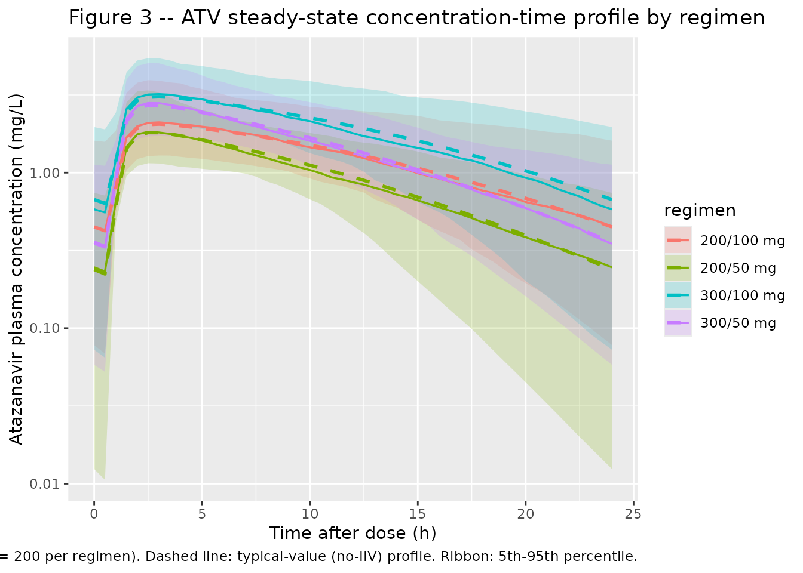

# Atazanavir + Ritonavir (Schipani 2013)

## Model and source

- Citation: Schipani A, Dickinson L, Boffito M, Austin R, Owen A, Back
  D, Khoo S, Davies G. Simultaneous Population Pharmacokinetic Modelling
  of Atazanavir and Ritonavir in HIV-Infected Adults and Assessment of
  Different Dose Reduction Strategies. J Acquir Immune Defic Syndr.
  2013;62(1):60-66. <doi:10.1097/QAI.0b013e3182737231>.
- Description: Simultaneous one-compartment first-order-absorption popPK
  model for oral atazanavir (ATV) and ritonavir (RTV) in 30 HIV-infected
  adults receiving ATV/RTV 300/100 mg once daily, with a direct
  sigmoidal-Emax inhibition of ATV apparent clearance by RTV plasma
  concentration (Imax = 0.988, IC50 = 0.221 mg/L). Both drugs share a
  one-compartment structure with first-order absorption and an
  absorption lag time; ka values are fixed to the separate-model final
  estimates (ATV ka = 1.81 1/h, RTV ka = 0.898 1/h) because joint
  estimation produced numerical instability. Inter-individual
  variability is carried on V/F for both drugs and on CL/F for RTV
  (correlated with V/F RTV, rho = 0.75); ATV CL/F is fitted without IIV.
  Demographic covariates and tenofovir co-administration were tested and
  none retained (Schipani 2013).
- Article: <https://doi.org/10.1097/QAI.0b013e3182737231>

## Population

Schipani 2013 pooled data from three previously published studies of
HIV-infected adults treated with the licensed atazanavir/ritonavir
(ATV/RTV) 300/100 mg once-daily regimen, all enrolled at a single UK
study centre (St Stephen’s Centre, Chelsea and Westminster Foundation
Trust, London). 30 patients contributed 288 ATV and 312 RTV plasma
concentrations on a single sampling occasion (median 11 samples per
patient). The cohort was 27/30 male, median age 43 years (range 22-62),
median body weight 75.5 kg (range 46-110); the majority were white with
5 Black-Africans and 3 Hispanics. 5/30 subjects were co-administered
tenofovir 300 mg once daily. Baseline HIV viral load was a median of 61
copies/mL (range \<50-72).

Demographic covariates (gender, ethnicity, body weight, age) and
tenofovir co-administration were tested via generalized additive
modelling on the basic separate-drug models; none was retained in the
final combined model (Schipani 2013 Results, Discussion). The packaged
model therefore exposes no covariate columns.

The same information is available programmatically via
`readModelDb("Schipani_2013_atazanavir_ritonavir")()$meta$population`.

## Source trace

Per-parameter origin is recorded as an in-file comment next to each
`ini()` entry in
`inst/modeldb/specificDrugs/Schipani_2013_atazanavir_ritonavir.R`. The
table below collects them for review.

| Equation / parameter | Value | Source location |
|----|----|----|
| Atazanavir CL/F (in absence of RTV) | 16.6 L/h (RSE 7%) | Table 2 |
| Atazanavir V/F | 106 L (RSE 7%) | Table 2 |
| Atazanavir ka (FIXED) | 1.81 1/h | Table 2 (fixed from separate-model final value in Table 1) |
| Atazanavir Tlag | 0.87 h (RSE 2%) | Table 2 |
| Ritonavir CL/F | 13.2 L/h (RSE 12%) | Table 2 |
| Ritonavir V/F | 124 L (RSE 11%) | Table 2 |
| Ritonavir ka (FIXED) | 0.898 1/h | Table 2 (fixed from separate-model final value in Table 1) |
| Ritonavir Tlag | 1.05 h (RSE 1%) | Table 2 |
| Imax (maximum inhibition of ATV CL/F) | 0.988 (RSE 1%) | Table 2 |
| IC50 (RTV concentration for 50% Imax) | 0.221 mg/L (RSE 13%) | Table 2 |
| IIV V/F ATV | 53% CV (RSE 23%) | Table 2 |
| IIV CL/F RTV | 77% CV (RSE 14%) | Table 2 |
| IIV V/F RTV | 73% CV (RSE 16%) | Table 2 |
| Correlation (CL/F RTV, V/F RTV) | 0.75 (RSE 13%) | Table 2 |
| Proportional residual ATV | 63% (RSE 18%) | Table 2 |
| Proportional residual RTV | 73% (RSE 5%) | Table 2 |
| Direct-effect inhibition equation | `CL_ATV(t) = CL0_ATV * (1 - I(t))`; `I(t) = Imax * C_RTV / (IC50 + C_RTV)` | Methods, “Population PK Modelling” section |

## Virtual cohort

Original observed data are not publicly available. The simulations below
build a virtual cohort of 200 subjects per dosing regimen, mirroring the
four dose-reduction scenarios evaluated in the paper (licensed 300/100
mg plus 300/50, 200/100, and 200/50 mg ATV/RTV once daily). Subjects
have no covariates beyond ID because the final model retains no
covariate effects.

``` r

set.seed(20260520)

n_per_arm <- 200L
tau       <- 24                     # dosing interval (h)
n_doses   <- 14L                    # 14 daily doses -> steady state
obs_times <- sort(unique(c(
  seq(0, tau,            length.out = 25),               # dense over the first interval
  seq(tau, (n_doses - 1) * tau,  by = tau),              # daily troughs through day 14
  (n_doses - 1) * tau + seq(0, tau, length.out = 49)     # dense over the steady-state day-14 interval
)))

regimens <- tibble::tribble(
  ~regimen,     ~atv_mg, ~rtv_mg,
  "300/100 mg",      300,     100,
  "300/50 mg",       300,      50,
  "200/100 mg",      200,     100,
  "200/50 mg",       200,      50
)

make_cohort <- function(n, atv_mg, rtv_mg, regimen, id_offset) {
  ids <- id_offset + seq_len(n)
  dose_times <- seq(0, (n_doses - 1) * tau, by = tau)

  dose_atv <- tidyr::expand_grid(id = ids, time = dose_times) |>
    dplyr::mutate(amt = atv_mg, cmt = "depot",     evid = 1L)
  dose_rtv <- tidyr::expand_grid(id = ids, time = dose_times) |>
    dplyr::mutate(amt = rtv_mg, cmt = "depot_rtv", evid = 1L)

  obs <- tidyr::expand_grid(id = ids, time = obs_times,
                            cmt = c("Cc", "Cc_rtv")) |>
    dplyr::mutate(amt = 0, evid = 0L)

  dplyr::bind_rows(dose_atv, dose_rtv, obs) |>
    dplyr::mutate(regimen = regimen) |>
    dplyr::arrange(id, time, evid)
}

id_seed <- 0L
events_list <- list()
for (i in seq_len(nrow(regimens))) {
  r <- regimens[i, ]
  events_list[[i]] <- make_cohort(n_per_arm, r$atv_mg, r$rtv_mg, r$regimen,
                                  id_offset = id_seed)
  id_seed <- id_seed + n_per_arm
}
events <- dplyr::bind_rows(events_list)
stopifnot(!anyDuplicated(unique(events[, c("id", "time", "evid", "cmt")])))
```

## Simulation

``` r

mod <- readModelDb("Schipani_2013_atazanavir_ritonavir")

# Stochastic VPC with the published IIV (RTV CL+V correlated, ATV V/F univariate).
sim <- rxode2::rxSolve(mod, events = events,
                       keep = c("regimen")) |>
  as.data.frame()

# Deterministic (typical-value) simulation for Figure 3 replication.
mod_typical <- rxode2::zeroRe(mod)
sim_typical <- rxode2::rxSolve(mod_typical, events = events,
                               keep = c("regimen")) |>
  as.data.frame()
#> ℹ omega/sigma items treated as zero: 'etalvc', 'etalcl_rtv', 'etalvc_rtv'
#> Warning: multi-subject simulation without without 'omega'
```

## Replicate published figures

### Figure 3 – ATV concentration-time profile at three dose regimens

Schipani 2013 Figure 3 plots the simulated mean plasma ATV concentration
over a 24-h dosing interval at steady state for ATV/RTV 300/50, 200/50,
and 200/100 mg once daily, together with the licensed 300/100 mg
reference profile. We reproduce the typical-value (no-IIV) curves
directly from the packaged model. Stochastic envelopes (median, 5th and
95th percentiles) are overlaid to convey the population spread that
drives the Cmin distribution discussed in the paper Results.

``` r

day14_start <- (n_doses - 1) * tau
ss_window <- sim |>
  dplyr::filter(time >= day14_start) |>
  dplyr::mutate(t_h = time - day14_start)
ss_window_typical <- sim_typical |>
  dplyr::filter(time >= day14_start) |>
  dplyr::mutate(t_h = time - day14_start)

vpc_atv <- ss_window |>
  dplyr::group_by(regimen, t_h) |>
  dplyr::summarise(
    Q05 = quantile(Cc, 0.05, na.rm = TRUE),
    Q50 = quantile(Cc, 0.50, na.rm = TRUE),
    Q95 = quantile(Cc, 0.95, na.rm = TRUE),
    .groups = "drop"
  )

typ_atv <- ss_window_typical |>
  dplyr::distinct(regimen, t_h, Cc)

ggplot() +
  geom_ribbon(data = vpc_atv,
              aes(t_h, ymin = Q05, ymax = Q95, fill = regimen),
              alpha = 0.20) +
  geom_line(data = vpc_atv, aes(t_h, Q50, colour = regimen), linewidth = 0.6) +
  geom_line(data = typ_atv, aes(t_h, Cc, colour = regimen),
            linewidth = 1.0, linetype = "dashed") +
  scale_y_log10() +
  labs(x = "Time after dose (h)", y = "Atazanavir plasma concentration (mg/L)",
       title = "Figure 3 -- ATV steady-state concentration-time profile by regimen",
       caption = paste0("Replicates Figure 3 of Schipani 2013. Solid line: ",
                        "stochastic median (n = ", n_per_arm,
                        " per regimen). Dashed line: typical-value (no-IIV) profile. ",
                        "Ribbon: 5th-95th percentile."))
```



## PKNCA validation

PKNCA computes steady-state non-compartmental Cmax, Cmin, and AUC0-tau
over the last (14th) dosing interval for ATV and RTV at each regimen.
The PKNCA formula stratifies by `regimen` so per-regimen mean values can
be compared against the paper’s reported simulated trough means.

``` r

nca_window_atv <- sim |>
  dplyr::filter(time >= day14_start, time <= day14_start + tau) |>
  dplyr::filter(!is.na(Cc)) |>
  dplyr::distinct(id, time, regimen, .keep_all = TRUE) |>
  dplyr::select(id, time, Cc, regimen)

dose_df <- events |>
  dplyr::filter(evid == 1, cmt == "depot",
                time == max(time[evid == 1L & cmt == "depot"])) |>
  dplyr::distinct(id, time, amt, regimen)

conc_atv <- PKNCA::PKNCAconc(nca_window_atv,
                             Cc ~ time | regimen + id,
                             concu = "mg/L", timeu = "h")
dose_atv <- PKNCA::PKNCAdose(dose_df, amt ~ time | regimen + id,
                             doseu = "mg")

intervals_ss <- data.frame(
  start  = day14_start,
  end    = day14_start + tau,
  cmax   = TRUE,
  cmin   = TRUE,
  tmax   = TRUE,
  auclast = TRUE,
  cav    = TRUE
)

nca_res_atv <- PKNCA::pk.nca(PKNCA::PKNCAdata(conc_atv, dose_atv,
                                              intervals = intervals_ss))
nca_summary_atv <- as.data.frame(summary(nca_res_atv))
knitr::kable(nca_summary_atv,
             caption = "Simulated steady-state NCA -- atazanavir, by regimen.")
```

| Interval Start | Interval End | regimen | N | AUClast (h\*mg/L) | Cmax (mg/L) | Cmin (mg/L) | Tmax (h) | Cav (mg/L) |
|---:|---:|:---|:---|:---|:---|:---|:---|:---|
| 312 | 336 | 200/100 mg | 200 | 31.8 \[38.5\] | 2.21 \[35.4\] | 0.401 \[140\] | 3.00 \[2.50, 3.50\] | 1.32 \[38.5\] |
| 312 | 336 | 200/50 mg | 200 | 22.7 \[26.8\] | 1.96 \[33.2\] | 0.160 \[230\] | 2.50 \[2.00, 3.00\] | 0.945 \[26.8\] |
| 312 | 336 | 300/100 mg | 200 | 45.9 \[32.4\] | 3.30 \[33.2\] | 0.533 \[127\] | 3.00 \[2.00, 3.50\] | 1.91 \[32.4\] |
| 312 | 336 | 300/50 mg | 200 | 35.9 \[30.1\] | 2.96 \[33.4\] | 0.300 \[174\] | 2.75 \[2.50, 3.50\] | 1.50 \[30.1\] |

Simulated steady-state NCA – atazanavir, by regimen. {.table
style="width:100%;"}

``` r

nca_window_rtv <- sim |>
  dplyr::filter(time >= day14_start, time <= day14_start + tau) |>
  dplyr::filter(!is.na(Cc_rtv)) |>
  dplyr::distinct(id, time, regimen, .keep_all = TRUE) |>
  dplyr::select(id, time, Cc_rtv, regimen)

dose_df_rtv <- events |>
  dplyr::filter(evid == 1, cmt == "depot_rtv",
                time == max(time[evid == 1L & cmt == "depot_rtv"])) |>
  dplyr::distinct(id, time, amt, regimen)

conc_rtv <- PKNCA::PKNCAconc(nca_window_rtv,
                             Cc_rtv ~ time | regimen + id,
                             concu = "mg/L", timeu = "h")
dose_rtv <- PKNCA::PKNCAdose(dose_df_rtv, amt ~ time | regimen + id,
                             doseu = "mg")

nca_res_rtv <- PKNCA::pk.nca(PKNCA::PKNCAdata(conc_rtv, dose_rtv,
                                              intervals = intervals_ss))
nca_summary_rtv <- as.data.frame(summary(nca_res_rtv))
knitr::kable(nca_summary_rtv,
             caption = "Simulated steady-state NCA -- ritonavir, by regimen.")
```

| Interval Start | Interval End | regimen | N | AUClast (h\*mg/L) | Cmax (mg/L) | Cmin (mg/L) | Tmax (h) | Cav (mg/L) |
|---:|---:|:---|:---|:---|:---|:---|:---|:---|
| 312 | 336 | 200/100 mg | 200 | 8.14 \[80.3\] | 0.724 \[76.5\] | 0.0677 \[219\] | 3.50 \[2.50, 4.50\] | 0.339 \[80.3\] |
| 312 | 336 | 200/50 mg | 200 | 3.66 \[72.7\] | 0.324 \[71.0\] | 0.0311 \[201\] | 3.50 \[3.00, 4.00\] | 0.152 \[72.7\] |
| 312 | 336 | 300/100 mg | 200 | 7.51 \[69.0\] | 0.677 \[60.7\] | 0.0602 \[228\] | 3.50 \[2.50, 4.50\] | 0.313 \[69.0\] |
| 312 | 336 | 300/50 mg | 200 | 4.17 \[83.6\] | 0.367 \[77.2\] | 0.0371 \[203\] | 3.50 \[3.00, 4.00\] | 0.174 \[83.6\] |

Simulated steady-state NCA – ritonavir, by regimen. {.table}

### Comparison against published simulated values

Schipani 2013 reports simulated mean ATV trough concentrations across
1,000 virtual subjects per regimen (paper Results, “Simulations of the
Dose Reduction Strategy”). The packaged model is exercised on 200
subjects per regimen here for vignette wall-clock economy; relative
differences vs the licensed regimen should match the paper’s reported
ratios (45%, 63%, and 33% reductions for 300/50, 200/50, and 200/100 mg
respectively).

``` r

troughs <- sim |>
  dplyr::filter(time == day14_start + tau) |>
  dplyr::group_by(regimen) |>
  dplyr::summarise(
    mean_ctrough_mgL = mean(Cc, na.rm = TRUE),
    sd_ctrough_mgL   = sd(Cc,   na.rm = TRUE),
    pct_below_MEC    = 100 * mean(Cc < 0.15, na.rm = TRUE),
    .groups = "drop"
  )

ref_mean <- troughs$mean_ctrough_mgL[troughs$regimen == "300/100 mg"]
troughs <- troughs |>
  dplyr::mutate(
    pct_change_vs_300_100 = 100 * (mean_ctrough_mgL - ref_mean) / ref_mean,
    published_mean_mgL = c(0.80, 0.437, 0.520, 0.303)[
      match(regimen, c("300/100 mg", "300/50 mg", "200/100 mg", "200/50 mg"))
    ],
    published_pct_change = c(0, -45, -33, -63)[
      match(regimen, c("300/100 mg", "300/50 mg", "200/100 mg", "200/50 mg"))
    ]
  )

knitr::kable(troughs,
             caption = paste0("Simulated ATV trough comparison vs Schipani 2013 ",
                              "Results (Simulations of the Dose Reduction Strategy). ",
                              "MEC = 0.15 mg/L (paper cites this as the recommended ",
                              "minimum effective concentration for boosted ATV)."))
```

| regimen | mean_ctrough_mgL | sd_ctrough_mgL | pct_below_MEC | pct_change_vs_300_100 | published_mean_mgL | published_pct_change |
|:---|---:|---:|---:|---:|---:|---:|
| 200/100 mg | 0.6420022 | 0.6081537 | 13.0 | -17.84823 | 0.520 | -33 |
| 200/50 mg | 0.2864775 | 0.2653261 | 34.5 | -63.34182 | 0.303 | -63 |
| 300/100 mg | 0.7814832 | 0.5747135 | 6.0 | 0.00000 | 0.800 | 0 |
| 300/50 mg | 0.5067195 | 0.4418136 | 22.0 | -35.15926 | 0.437 | -45 |

Simulated ATV trough comparison vs Schipani 2013 Results (Simulations of
the Dose Reduction Strategy). MEC = 0.15 mg/L (paper cites this as the
recommended minimum effective concentration for boosted ATV). {.table}

## Assumptions and deviations

- **Atazanavir CL/F is fitted without IIV in the packaged model.** This
  matches the paper’s final combined model exactly (Schipani 2013
  Discussion: “the addition of IIV on ATV CL/F contributed to the
  instability of the model … thus IIV on ATV CL/F was not included in
  the final model”). The simulated between-subject variability in ATV
  exposure therefore arises entirely from (a) ATV V/F variability (53%
  CV), (b) ritonavir CL/V variability (77% / 73% CV, rho = 0.75)
  propagating through the sigmoidal inhibition term, and (c)
  proportional residual error.
- **ka values for both drugs are FIXED to the separate-model final
  estimates** (ATV 1.81 1/h, RTV 0.898 1/h). The paper holds these
  parameters constant because joint estimation produced numerical
  instability (Schipani 2013 Results). They are encoded with `fixed()`
  in `ini()` so downstream users can see the constraint.
- **Bioavailability F is not in the model (F = 1 by default).** The
  paper parameterises CL/F and V/F directly without resolving F; the
  rxode2/nlmixr2 default `f(depot) = 1` reproduces this.
- **MEC threshold of 0.15 mg/L** is used in the trough-comparison table.
  The paper refers to a recommended ATV minimum effective concentration
  (MEC) and quotes the proportion of subjects below it for each
  dose-reduction regimen (6% at 300/100 mg, 17.8% at 300/50 mg, 33.9% at
  200/50 mg, 15.3% at 200/100 mg). The 0.15 mg/L value used here is the
  protein-binding-adjusted IC50 commonly cited in the HIV
  pharmacotherapy literature; the paper Results section does not state
  the exact mg/L cut-off. Adjust the threshold if matching a different
  published MEC convention.
- **Simulated cohort size 200 per regimen** (vs the paper’s 1,000) is a
  vignette-time budget choice. Relative differences across regimens are
  stable at this n; absolute Cmin standard deviations may be noisier
  than the published ones. Increase `n_per_arm` for a closer
  reproduction of the simulated SDs in the paper’s Results section.
- **No errata or corrigenda** for the source paper were located via the
  publisher landing page or PubMed at the time of extraction. The Europe
  PMC funders-group manuscript and the final published article (J Acquir
  Immune Defic Syndr 2013;62(1):60-66) are identical for the parameter
  values used here.
