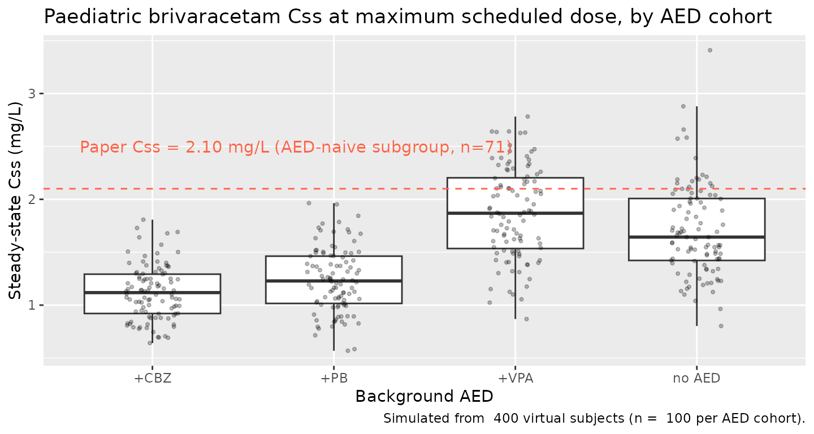
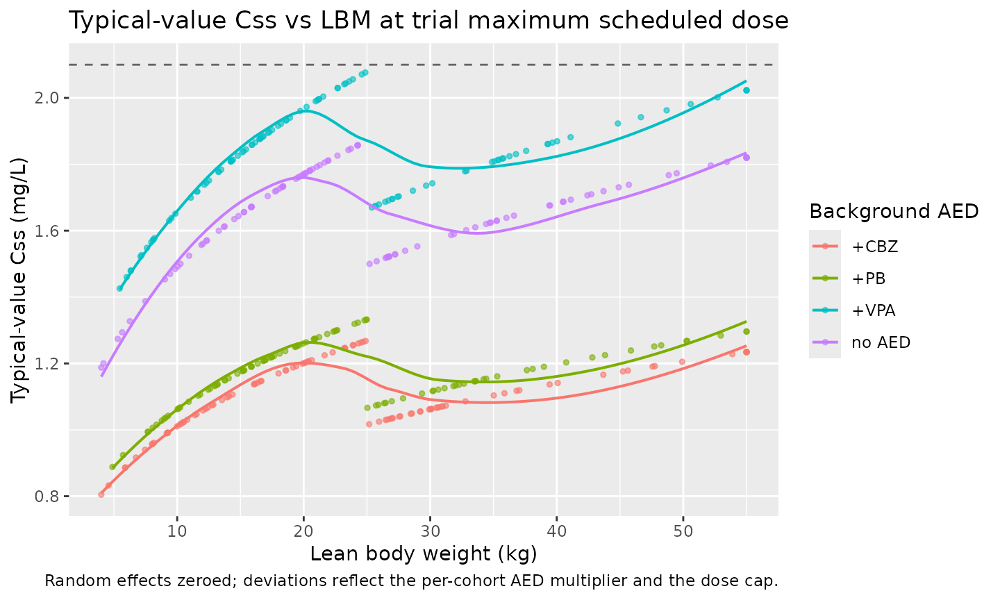

# Brivaracetam (Schoemaker 2017)

## Model and source

    #> ℹ parameter labels from comments will be replaced by 'label()'

- Citation: Schoemaker R, Wade JR, Stockis A. Brivaracetam population
  pharmacokinetics in children with epilepsy aged 1 month to 16 years.
  Eur J Clin Pharmacol. 2017 Jun;73(6):727-733.
  <doi:10.1007/s00228-017-2230-6>
- Description: One-compartment population PK model for oral brivaracetam
  in paediatric patients with epilepsy aged 1 month to 16 years
  (Schoemaker 2017). First-order absorption, single-compartment
  distribution, and first-order elimination, with allometric scaling of
  CL/F (exponent 0.750 fixed) and V/F (exponent 1.00 fixed) on lean body
  weight normalised to a 50 kg adult typical value. Co-administration of
  phenobarbital (PB; pooled with primidone), carbamazepine (CBZ), or
  valproate (VPA) modify apparent oral clearance via linear-additive
  multiplicative factors.
- Article: <https://doi.org/10.1007/s00228-017-2230-6>

The packaged model implements the Schoemaker 2017 final paediatric
brivaracetam popPK model: a one-compartment structure with first-order
absorption and first-order elimination, allometric scaling of CL/F
(exponent 0.750 fixed) and V/F (exponent 1.00 fixed) on lean body weight
normalised to a 50 kg adult typical value, and three drug-specific
concomitant-AED indicators (`CONMED_PB`, `CONMED_CBZ`, `CONMED_VPA`)
acting as linear-additive multiplicative effects on CL/F. The model was
developed in NONMEM 7.2.0 using FOCE-I; covariate selection followed
PsN’s stepwise covariate modelling (SCM) with forward `p < 0.01` and
backward `p < 0.001` thresholds.

## Population

Schoemaker 2017 fit the model to 600 brivaracetam plasma concentrations
from 96 paediatric patients with epilepsy aged 1 month to \<16 years,
enrolled in the open-label, single-arm, multicentre Trial N01263
(NCT00422422). The age distribution was 29 patients aged 1 month to \<2
years, 26 aged 2 to \<6 years, 24 aged 6 to \<12 years, and 17 aged 12
to \<16 years. Patients had localisation- related, generalised, or
undetermined focal/generalised epileptic syndromes per ILAE
classification and were receiving 1-3 concomitant AEDs other than
levetiracetam. Hepatic impairment was an exclusion criterion.
Brivaracetam was administered as an oral solution in three weekly
increasing-dose steps: 0.4 / 0.8 / 1.6 mg/kg bid for subjects \>= 8
years and 0.5 / 1.0 / 2.0 mg/kg bid for subjects \< 8 years; doses were
capped at the adult 25 / 50 / 100 mg bid levels once total body weight
reached 50 kg. Two scheduled plasma samples were drawn at day 7, 14, and
21 in one of three time brackets (early morning, late morning,
afternoon) plus one optional sample. Race, ethnicity, sex, eGFR, non-AED
CYP3A inhibitors, non-AED CYP2C19 inhibitors, age, and postconceptional
age were tested as covariates and found not to be significant; only PB
(pooled with primidone), CBZ, and VPA were retained as drug-specific
effects on CL/F. Full population characteristics are in Schoemaker 2017
Results paragraph 1 and Supplemental Table 1.

The same metadata is available programmatically via
`readModelDb("Schoemaker_2017_brivaracetam")$meta$population`.

## Source trace

The per-parameter origin is recorded as an in-file comment next to each
`ini()` entry in
`inst/modeldb/specificDrugs/Schoemaker_2017_brivaracetam.R`. The table
below collects them in one place for review. All point estimates are
from Schoemaker 2017 Table 1 (“NONMEM estimates” column);
structural-model layout and covariate parameterisation are taken from
Schoemaker 2017 Methods (page 2, “Brivaracetam population
pharmacokinetics model” paragraph and equation 1).

| Equation / parameter | Value | Source location |
|----|----|----|
| `lka` (Ka) | log(1.84) -\> 1.84 1/h | Table 1; 95% CI 0.91/2.78, bootstrap median 1.83 |
| `lcl` (CL/F at 50 kg LBW) | log(3.63) -\> 3.63 L/h | Table 1; 95% CI 3.42/3.85, bootstrap median 3.62 |
| `lvc` (V/F at 50 kg LBW) | log(47.8) -\> 47.8 L | Table 1; 95% CI 43.1/52.5, bootstrap median 47.6 |
| `e_lbm_cl` | fixed(0.750) | Table 1; “Allometric scaling CL/F 0.750 fixed” |
| `e_lbm_vc` | fixed(1.00) | Table 1; “Allometric scaling V/F 1.00 fixed” |
| `e_conmed_pb_cl` | +0.408 | Table 1; CL change with PB = +40.8% (95% CI +19.9%/+65.2%) |
| `e_conmed_cbz_cl` | +0.479 | Table 1; CL change with CBZ = +47.9% (95% CI +27.8%/+71.2%) |
| `e_conmed_vpa_cl` | -0.101 | Table 1; CL change with VPA = -10.1% (95% CI -18.5%/-0.8%) |
| `etalcl` variance | 0.228^2 = 0.0520 | Table 1; IIV CL = 22.8% (shrinkage 6.1%) |
| `etalvc` variance | 0.167^2 = 0.0279 | Table 1; IIV V = 16.7% (shrinkage 45.6%) |
| `etalka` variance | 0.319^2 = 0.1018 | Table 1; IIV Ka = 31.9% (shrinkage 73.4%) |
| `propSd` | 0.234 | Table 1; Residual error CV = 23.4% (95% CI 19.6%/27.1%) |
| Allometric model | `(LBM/50)^e_lbm_cl` on CL/F | Equation 1, page 2 Methods |
| Allometric model | `(LBM/50)^e_lbm_vc` on V/F | Equation 1, page 2 Methods |
| AED effect on CL/F | `(1 + theta * indicator)` product across PB / CBZ / VPA | PsN SCM “linear” categorical form, Methods page 2 |
| ODE `d/dt(depot)` | `-ka * depot` | Standard 1-cmt oral structure; Methods page 2 |
| ODE `d/dt(central)` | `ka * depot - kel * central` | Standard 1-cmt oral structure; Methods page 2 |

## Virtual cohort

Original observed data from Trial N01263 are not publicly available. The
figures below use a virtual paediatric cohort whose lean-body-weight
distribution approximates the published age strata. Lean body weight for
each virtual subject is sampled from a log-normal distribution spanning
roughly 4 - 50 kg, matching the 1 month - 16 year age range and the
paper’s LBW-based allometric scaling. AED comedication status is
assigned as a factorial design across four cohorts (no AED, +PB, +CBZ,
+VPA) so the covariate effect on Css can be inspected directly.

``` r

set.seed(20170309)

mod <- rxode2::rxode(readModelDb("Schoemaker_2017_brivaracetam"))
#> ℹ parameter labels from comments will be replaced by 'label()'

n_per_arm <- 100
lbm_min   <- 4
lbm_max   <- 55

dose_mg_per_kg_lbm <- function(lbm) {
  # Trial N01263 maximum scheduled dose: 2.0 mg/kg bid for subjects <8 y and
  # 1.6 mg/kg bid for subjects >=8 y, capped at adult 100 mg bid for total
  # body weight >= 50 kg. We approximate the age-vs-LBM split at 25 kg LBM
  # (~8 y) and apply the 50 kg LBM cap analogous to the WT cap.
  per_dose <- ifelse(lbm < 25, 2.0 * lbm, 1.6 * lbm)
  pmin(per_dose, 100)
}

make_aed_cohort <- function(n, aed_name, pb, cbz, vpa, id_offset = 0L) {
  lbm <- pmin(pmax(exp(rnorm(n, mean = log(20), sd = 0.6)), lbm_min), lbm_max)
  per_dose <- dose_mg_per_kg_lbm(lbm)
  base <- tibble(
    id           = id_offset + seq_len(n),
    LBM          = lbm,
    CONMED_PB    = pb,
    CONMED_CBZ   = cbz,
    CONMED_VPA   = vpa,
    aed_cohort   = aed_name,
    amt_per_dose = per_dose
  )
  # Steady-state simulation: 20 doses at tau = 12 h, observe the last interval.
  n_doses <- 20L
  tau     <- 12
  doses <- tidyr::crossing(id = base$id, dose_idx = seq_len(n_doses)) |>
    mutate(time = (dose_idx - 1) * tau, evid = 1L, cmt = "depot") |>
    left_join(base, by = "id") |>
    mutate(amt = amt_per_dose)
  obs_grid <- seq((n_doses - 1) * tau + 0.25, n_doses * tau, by = 0.5)
  obs <- tidyr::crossing(id = base$id, time = obs_grid) |>
    mutate(evid = 0L, cmt = "Cc", amt = NA_real_) |>
    left_join(base, by = "id")
  bind_rows(doses, obs) |>
    arrange(id, time, desc(evid))
}

events_ss <- bind_rows(
  make_aed_cohort(n_per_arm, "no AED", pb = 0L, cbz = 0L, vpa = 0L,
                  id_offset = 0L),
  make_aed_cohort(n_per_arm, "+PB",    pb = 1L, cbz = 0L, vpa = 0L,
                  id_offset = n_per_arm),
  make_aed_cohort(n_per_arm, "+CBZ",   pb = 0L, cbz = 1L, vpa = 0L,
                  id_offset = 2L * n_per_arm),
  make_aed_cohort(n_per_arm, "+VPA",   pb = 0L, cbz = 0L, vpa = 1L,
                  id_offset = 3L * n_per_arm)
)
stopifnot(!anyDuplicated(unique(events_ss[, c("id", "time", "evid")])))
```

## Simulation

``` r

sim_ss <- rxode2::rxSolve(
  object     = mod,
  events     = events_ss,
  keep       = c("LBM", "CONMED_PB", "CONMED_CBZ", "CONMED_VPA",
                 "aed_cohort", "amt_per_dose"),
  returnType = "data.frame"
) |>
  dplyr::filter(time > 0)
```

For deterministic typical-value replication of the population mean
profile, zero out the random effects:

``` r

sim_ss_typical <- rxode2::rxSolve(
  object     = rxode2::zeroRe(mod),
  events     = events_ss,
  keep       = c("LBM", "CONMED_PB", "CONMED_CBZ", "CONMED_VPA",
                 "aed_cohort", "amt_per_dose"),
  returnType = "data.frame"
) |>
  dplyr::filter(time > 0)
#> ℹ omega/sigma items treated as zero: 'etalcl', 'etalvc', 'etalka'
#> Warning: multi-subject simulation without without 'omega'
```

## Replicate published figures

### Steady-state Css distribution by AED comedication (Schoemaker 2017 Figure 2 context)

Schoemaker 2017 Figure 2 shows the simulated paediatric Css distribution
stratified by AED background (PB, CBZ, VPA, or none) and overlays an
adult reference Css range. The chunk below reproduces the same
stratification using the packaged model: per-subject average
steady-state concentration (computed as AUC0-tau / tau over the last
dosing interval) is summarised by AED cohort.

``` r

tau <- 12
last_interval_start <- 19 * tau

trapz_auc <- function(t, y) {
  ord <- order(t)
  t   <- t[ord]
  y   <- y[ord]
  sum(0.5 * (y[-1] + y[-length(y)]) * diff(t))
}

ss_css <- sim_ss |>
  dplyr::filter(time >= last_interval_start) |>
  group_by(id, aed_cohort, LBM) |>
  summarise(
    auc_tau = trapz_auc(time - last_interval_start, Cc),
    Css     = auc_tau / tau,
    .groups = "drop"
  )

ggplot(ss_css, aes(aed_cohort, Css)) +
  geom_boxplot(outlier.shape = NA) +
  geom_jitter(width = 0.15, alpha = 0.25, size = 0.8) +
  geom_hline(yintercept = 2.10, linetype = "dashed", colour = "tomato") +
  annotate("text", x = 0.6, y = 2.50, hjust = 0, colour = "tomato",
           label = "Paper Css = 2.10 mg/L (AED-naive subgroup, n=71)") +
  labs(x = "Background AED",
       y = "Steady-state Css (mg/L)",
       title = "Paediatric brivaracetam Css at maximum scheduled dose, by AED cohort",
       caption = paste("Simulated from ", 4L * n_per_arm,
                       "virtual subjects (n = ", n_per_arm,
                       "per AED cohort).", sep = " "))
```



### Typical-value Css vs LBM (Schoemaker 2017 Figure 1 context)

Schoemaker 2017 Figure 1 shows predicted Css against body weight (left)
and age (right) for the trial dosing scheme. The chunk below shows the
typical-value Css trajectory across the paediatric LBM range for the
trial maximum scheduled dose, separated by AED background.

``` r

ss_typ_css <- sim_ss_typical |>
  dplyr::filter(time >= last_interval_start) |>
  group_by(id, aed_cohort, LBM, amt_per_dose) |>
  summarise(
    auc_tau = trapz_auc(time - last_interval_start, Cc),
    Css     = auc_tau / tau,
    .groups = "drop"
  )

ggplot(ss_typ_css, aes(LBM, Css, colour = aed_cohort)) +
  geom_point(alpha = 0.6, size = 1) +
  geom_smooth(se = FALSE, linewidth = 0.7, method = "loess",
              formula = y ~ x) +
  geom_hline(yintercept = 2.10, linetype = "dashed", colour = "grey40") +
  labs(x = "Lean body weight (kg)",
       y = "Typical-value Css (mg/L)",
       colour = "Background AED",
       title  = "Typical-value Css vs LBM at trial maximum scheduled dose",
       caption = "Random effects zeroed; deviations reflect the per-cohort AED multiplier and the dose cap.")
```



## PKNCA validation

PKNCA is run on the typical-value steady-state simulation, restricted to
the final dosing interval (`time` in \[19*tau, 20*tau\] h, with the dose
at the start of the interval re-anchored to `time = 0`). The treatment
grouping is the AED cohort so each background can be compared against
the others and the paper’s reported Css.

``` r

# Reanchor the final dosing interval to time = 0 for NCA.
last_dose_time <- last_interval_start
ss_nca_conc <- sim_ss_typical |>
  dplyr::filter(time >= last_dose_time, time <= last_dose_time + tau) |>
  dplyr::mutate(time = time - last_dose_time) |>
  dplyr::select(id, time, Cc, aed_cohort, LBM, amt_per_dose) |>
  dplyr::filter(!is.na(Cc))

ss_nca_dose <- ss_nca_conc |>
  dplyr::distinct(id, aed_cohort, amt_per_dose) |>
  dplyr::mutate(time = 0, amt = amt_per_dose)

conc_obj <- PKNCA::PKNCAconc(
  ss_nca_conc, Cc ~ time | aed_cohort + id,
  concu = "mg/L", timeu = "hr"
)
dose_obj <- PKNCA::PKNCAdose(
  ss_nca_dose, amt ~ time | aed_cohort + id,
  doseu = "mg"
)

intervals_ss <- data.frame(
  start      = 0,
  end        = tau,
  cmax       = TRUE,
  tmax       = TRUE,
  auclast    = TRUE,
  cmin       = TRUE,
  cav        = TRUE
)

nca_ss <- PKNCA::pk.nca(
  PKNCA::PKNCAdata(conc_obj, dose_obj, intervals = intervals_ss)
)
#> Warning: Requesting an AUC range starting (0) before the first measurement (0.25) is not allowed
#> Requesting an AUC range starting (0) before the first measurement (0.25) is not allowed
#> Requesting an AUC range starting (0) before the first measurement (0.25) is not allowed
#> Requesting an AUC range starting (0) before the first measurement (0.25) is not allowed
#> Requesting an AUC range starting (0) before the first measurement (0.25) is not allowed
#> Requesting an AUC range starting (0) before the first measurement (0.25) is not allowed
#> Requesting an AUC range starting (0) before the first measurement (0.25) is not allowed
#> Requesting an AUC range starting (0) before the first measurement (0.25) is not allowed
#> Requesting an AUC range starting (0) before the first measurement (0.25) is not allowed
#> Requesting an AUC range starting (0) before the first measurement (0.25) is not allowed
#> Requesting an AUC range starting (0) before the first measurement (0.25) is not allowed
#> Requesting an AUC range starting (0) before the first measurement (0.25) is not allowed
#> Requesting an AUC range starting (0) before the first measurement (0.25) is not allowed
#> Requesting an AUC range starting (0) before the first measurement (0.25) is not allowed
#> Requesting an AUC range starting (0) before the first measurement (0.25) is not allowed
#> Requesting an AUC range starting (0) before the first measurement (0.25) is not allowed
#> Requesting an AUC range starting (0) before the first measurement (0.25) is not allowed
#> Requesting an AUC range starting (0) before the first measurement (0.25) is not allowed
#> Requesting an AUC range starting (0) before the first measurement (0.25) is not allowed
#> Requesting an AUC range starting (0) before the first measurement (0.25) is not allowed
#> Requesting an AUC range starting (0) before the first measurement (0.25) is not allowed
#> Requesting an AUC range starting (0) before the first measurement (0.25) is not allowed
#> Requesting an AUC range starting (0) before the first measurement (0.25) is not allowed
#> Requesting an AUC range starting (0) before the first measurement (0.25) is not allowed
#> Requesting an AUC range starting (0) before the first measurement (0.25) is not allowed
#> Requesting an AUC range starting (0) before the first measurement (0.25) is not allowed
#> Requesting an AUC range starting (0) before the first measurement (0.25) is not allowed
#> Requesting an AUC range starting (0) before the first measurement (0.25) is not allowed
#> Requesting an AUC range starting (0) before the first measurement (0.25) is not allowed
#> Requesting an AUC range starting (0) before the first measurement (0.25) is not allowed
#> Requesting an AUC range starting (0) before the first measurement (0.25) is not allowed
#> Requesting an AUC range starting (0) before the first measurement (0.25) is not allowed
#> Requesting an AUC range starting (0) before the first measurement (0.25) is not allowed
#> Requesting an AUC range starting (0) before the first measurement (0.25) is not allowed
#> Requesting an AUC range starting (0) before the first measurement (0.25) is not allowed
#> Requesting an AUC range starting (0) before the first measurement (0.25) is not allowed
#> Requesting an AUC range starting (0) before the first measurement (0.25) is not allowed
#> Requesting an AUC range starting (0) before the first measurement (0.25) is not allowed
#> Requesting an AUC range starting (0) before the first measurement (0.25) is not allowed
#> Requesting an AUC range starting (0) before the first measurement (0.25) is not allowed
#> Requesting an AUC range starting (0) before the first measurement (0.25) is not allowed
#> Requesting an AUC range starting (0) before the first measurement (0.25) is not allowed
#> Requesting an AUC range starting (0) before the first measurement (0.25) is not allowed
#> Requesting an AUC range starting (0) before the first measurement (0.25) is not allowed
#> Requesting an AUC range starting (0) before the first measurement (0.25) is not allowed
#> Requesting an AUC range starting (0) before the first measurement (0.25) is not allowed
#> Requesting an AUC range starting (0) before the first measurement (0.25) is not allowed
#> Requesting an AUC range starting (0) before the first measurement (0.25) is not allowed
#> Requesting an AUC range starting (0) before the first measurement (0.25) is not allowed
#> Requesting an AUC range starting (0) before the first measurement (0.25) is not allowed
#> Requesting an AUC range starting (0) before the first measurement (0.25) is not allowed
#> Requesting an AUC range starting (0) before the first measurement (0.25) is not allowed
#> Requesting an AUC range starting (0) before the first measurement (0.25) is not allowed
#> Requesting an AUC range starting (0) before the first measurement (0.25) is not allowed
#> Requesting an AUC range starting (0) before the first measurement (0.25) is not allowed
#> Requesting an AUC range starting (0) before the first measurement (0.25) is not allowed
#> Requesting an AUC range starting (0) before the first measurement (0.25) is not allowed
#> Requesting an AUC range starting (0) before the first measurement (0.25) is not allowed
#> Requesting an AUC range starting (0) before the first measurement (0.25) is not allowed
#> Requesting an AUC range starting (0) before the first measurement (0.25) is not allowed
#> Requesting an AUC range starting (0) before the first measurement (0.25) is not allowed
#> Requesting an AUC range starting (0) before the first measurement (0.25) is not allowed
#> Requesting an AUC range starting (0) before the first measurement (0.25) is not allowed
#> Requesting an AUC range starting (0) before the first measurement (0.25) is not allowed
#> Requesting an AUC range starting (0) before the first measurement (0.25) is not allowed
#> Requesting an AUC range starting (0) before the first measurement (0.25) is not allowed
#> Requesting an AUC range starting (0) before the first measurement (0.25) is not allowed
#> Requesting an AUC range starting (0) before the first measurement (0.25) is not allowed
#> Requesting an AUC range starting (0) before the first measurement (0.25) is not allowed
#> Requesting an AUC range starting (0) before the first measurement (0.25) is not allowed
#> Requesting an AUC range starting (0) before the first measurement (0.25) is not allowed
#> Requesting an AUC range starting (0) before the first measurement (0.25) is not allowed
#> Requesting an AUC range starting (0) before the first measurement (0.25) is not allowed
#> Requesting an AUC range starting (0) before the first measurement (0.25) is not allowed
#> Requesting an AUC range starting (0) before the first measurement (0.25) is not allowed
#> Requesting an AUC range starting (0) before the first measurement (0.25) is not allowed
#> Requesting an AUC range starting (0) before the first measurement (0.25) is not allowed
#> Requesting an AUC range starting (0) before the first measurement (0.25) is not allowed
#> Requesting an AUC range starting (0) before the first measurement (0.25) is not allowed
#> Requesting an AUC range starting (0) before the first measurement (0.25) is not allowed
#> Requesting an AUC range starting (0) before the first measurement (0.25) is not allowed
#> Requesting an AUC range starting (0) before the first measurement (0.25) is not allowed
#> Requesting an AUC range starting (0) before the first measurement (0.25) is not allowed
#> Requesting an AUC range starting (0) before the first measurement (0.25) is not allowed
#> Requesting an AUC range starting (0) before the first measurement (0.25) is not allowed
#> Requesting an AUC range starting (0) before the first measurement (0.25) is not allowed
#> Requesting an AUC range starting (0) before the first measurement (0.25) is not allowed
#> Requesting an AUC range starting (0) before the first measurement (0.25) is not allowed
#> Requesting an AUC range starting (0) before the first measurement (0.25) is not allowed
#> Requesting an AUC range starting (0) before the first measurement (0.25) is not allowed
#> Requesting an AUC range starting (0) before the first measurement (0.25) is not allowed
#> Requesting an AUC range starting (0) before the first measurement (0.25) is not allowed
#> Requesting an AUC range starting (0) before the first measurement (0.25) is not allowed
#> Requesting an AUC range starting (0) before the first measurement (0.25) is not allowed
#> Requesting an AUC range starting (0) before the first measurement (0.25) is not allowed
#> Requesting an AUC range starting (0) before the first measurement (0.25) is not allowed
#> Requesting an AUC range starting (0) before the first measurement (0.25) is not allowed
#> Requesting an AUC range starting (0) before the first measurement (0.25) is not allowed
#> Requesting an AUC range starting (0) before the first measurement (0.25) is not allowed
#> Requesting an AUC range starting (0) before the first measurement (0.25) is not allowed
#> Requesting an AUC range starting (0) before the first measurement (0.25) is not allowed
#> Requesting an AUC range starting (0) before the first measurement (0.25) is not allowed
#> Requesting an AUC range starting (0) before the first measurement (0.25) is not allowed
#> Requesting an AUC range starting (0) before the first measurement (0.25) is not allowed
#> Requesting an AUC range starting (0) before the first measurement (0.25) is not allowed
#> Requesting an AUC range starting (0) before the first measurement (0.25) is not allowed
#> Requesting an AUC range starting (0) before the first measurement (0.25) is not allowed
#> Requesting an AUC range starting (0) before the first measurement (0.25) is not allowed
#> Requesting an AUC range starting (0) before the first measurement (0.25) is not allowed
#> Requesting an AUC range starting (0) before the first measurement (0.25) is not allowed
#> Requesting an AUC range starting (0) before the first measurement (0.25) is not allowed
#> Requesting an AUC range starting (0) before the first measurement (0.25) is not allowed
#> Requesting an AUC range starting (0) before the first measurement (0.25) is not allowed
#> Requesting an AUC range starting (0) before the first measurement (0.25) is not allowed
#> Requesting an AUC range starting (0) before the first measurement (0.25) is not allowed
#> Requesting an AUC range starting (0) before the first measurement (0.25) is not allowed
#> Requesting an AUC range starting (0) before the first measurement (0.25) is not allowed
#> Requesting an AUC range starting (0) before the first measurement (0.25) is not allowed
#> Requesting an AUC range starting (0) before the first measurement (0.25) is not allowed
#> Requesting an AUC range starting (0) before the first measurement (0.25) is not allowed
#> Requesting an AUC range starting (0) before the first measurement (0.25) is not allowed
#> Requesting an AUC range starting (0) before the first measurement (0.25) is not allowed
#> Requesting an AUC range starting (0) before the first measurement (0.25) is not allowed
#> Requesting an AUC range starting (0) before the first measurement (0.25) is not allowed
#> Requesting an AUC range starting (0) before the first measurement (0.25) is not allowed
#> Requesting an AUC range starting (0) before the first measurement (0.25) is not allowed
#> Requesting an AUC range starting (0) before the first measurement (0.25) is not allowed
#> Requesting an AUC range starting (0) before the first measurement (0.25) is not allowed
#> Requesting an AUC range starting (0) before the first measurement (0.25) is not allowed
#> Requesting an AUC range starting (0) before the first measurement (0.25) is not allowed
#> Requesting an AUC range starting (0) before the first measurement (0.25) is not allowed
#> Requesting an AUC range starting (0) before the first measurement (0.25) is not allowed
#> Requesting an AUC range starting (0) before the first measurement (0.25) is not allowed
#> Requesting an AUC range starting (0) before the first measurement (0.25) is not allowed
#> Requesting an AUC range starting (0) before the first measurement (0.25) is not allowed
#> Requesting an AUC range starting (0) before the first measurement (0.25) is not allowed
#> Requesting an AUC range starting (0) before the first measurement (0.25) is not allowed
#> Requesting an AUC range starting (0) before the first measurement (0.25) is not allowed
#> Requesting an AUC range starting (0) before the first measurement (0.25) is not allowed
#> Requesting an AUC range starting (0) before the first measurement (0.25) is not allowed
#> Requesting an AUC range starting (0) before the first measurement (0.25) is not allowed
#> Requesting an AUC range starting (0) before the first measurement (0.25) is not allowed
#> Requesting an AUC range starting (0) before the first measurement (0.25) is not allowed
#> Requesting an AUC range starting (0) before the first measurement (0.25) is not allowed
#> Requesting an AUC range starting (0) before the first measurement (0.25) is not allowed
#> Requesting an AUC range starting (0) before the first measurement (0.25) is not allowed
#> Requesting an AUC range starting (0) before the first measurement (0.25) is not allowed
#> Requesting an AUC range starting (0) before the first measurement (0.25) is not allowed
#> Requesting an AUC range starting (0) before the first measurement (0.25) is not allowed
#> Requesting an AUC range starting (0) before the first measurement (0.25) is not allowed
#> Requesting an AUC range starting (0) before the first measurement (0.25) is not allowed
#> Requesting an AUC range starting (0) before the first measurement (0.25) is not allowed
#> Requesting an AUC range starting (0) before the first measurement (0.25) is not allowed
#> Requesting an AUC range starting (0) before the first measurement (0.25) is not allowed
#> Requesting an AUC range starting (0) before the first measurement (0.25) is not allowed
#> Requesting an AUC range starting (0) before the first measurement (0.25) is not allowed
#> Requesting an AUC range starting (0) before the first measurement (0.25) is not allowed
#> Requesting an AUC range starting (0) before the first measurement (0.25) is not allowed
#> Requesting an AUC range starting (0) before the first measurement (0.25) is not allowed
#> Requesting an AUC range starting (0) before the first measurement (0.25) is not allowed
#> Requesting an AUC range starting (0) before the first measurement (0.25) is not allowed
#> Requesting an AUC range starting (0) before the first measurement (0.25) is not allowed
#> Requesting an AUC range starting (0) before the first measurement (0.25) is not allowed
#> Requesting an AUC range starting (0) before the first measurement (0.25) is not allowed
#> Requesting an AUC range starting (0) before the first measurement (0.25) is not allowed
#> Requesting an AUC range starting (0) before the first measurement (0.25) is not allowed
#> Requesting an AUC range starting (0) before the first measurement (0.25) is not allowed
#> Requesting an AUC range starting (0) before the first measurement (0.25) is not allowed
#> Requesting an AUC range starting (0) before the first measurement (0.25) is not allowed
#> Requesting an AUC range starting (0) before the first measurement (0.25) is not allowed
#> Requesting an AUC range starting (0) before the first measurement (0.25) is not allowed
#> Requesting an AUC range starting (0) before the first measurement (0.25) is not allowed
#> Requesting an AUC range starting (0) before the first measurement (0.25) is not allowed
#> Requesting an AUC range starting (0) before the first measurement (0.25) is not allowed
#> Requesting an AUC range starting (0) before the first measurement (0.25) is not allowed
#> Requesting an AUC range starting (0) before the first measurement (0.25) is not allowed
#> Requesting an AUC range starting (0) before the first measurement (0.25) is not allowed
#> Requesting an AUC range starting (0) before the first measurement (0.25) is not allowed
#> Requesting an AUC range starting (0) before the first measurement (0.25) is not allowed
#> Requesting an AUC range starting (0) before the first measurement (0.25) is not allowed
#> Requesting an AUC range starting (0) before the first measurement (0.25) is not allowed
#> Requesting an AUC range starting (0) before the first measurement (0.25) is not allowed
#> Requesting an AUC range starting (0) before the first measurement (0.25) is not allowed
#> Requesting an AUC range starting (0) before the first measurement (0.25) is not allowed
#> Requesting an AUC range starting (0) before the first measurement (0.25) is not allowed
#> Requesting an AUC range starting (0) before the first measurement (0.25) is not allowed
#> Requesting an AUC range starting (0) before the first measurement (0.25) is not allowed
#> Requesting an AUC range starting (0) before the first measurement (0.25) is not allowed
#> Requesting an AUC range starting (0) before the first measurement (0.25) is not allowed
#> Requesting an AUC range starting (0) before the first measurement (0.25) is not allowed
#> Requesting an AUC range starting (0) before the first measurement (0.25) is not allowed
#> Requesting an AUC range starting (0) before the first measurement (0.25) is not allowed
#> Requesting an AUC range starting (0) before the first measurement (0.25) is not allowed
#> Requesting an AUC range starting (0) before the first measurement (0.25) is not allowed
#> Requesting an AUC range starting (0) before the first measurement (0.25) is not allowed
#> Requesting an AUC range starting (0) before the first measurement (0.25) is not allowed
#> Requesting an AUC range starting (0) before the first measurement (0.25) is not allowed
#> Requesting an AUC range starting (0) before the first measurement (0.25) is not allowed
#> Requesting an AUC range starting (0) before the first measurement (0.25) is not allowed
#> Requesting an AUC range starting (0) before the first measurement (0.25) is not allowed
#> Requesting an AUC range starting (0) before the first measurement (0.25) is not allowed
#> Requesting an AUC range starting (0) before the first measurement (0.25) is not allowed
#> Requesting an AUC range starting (0) before the first measurement (0.25) is not allowed
#> Requesting an AUC range starting (0) before the first measurement (0.25) is not allowed
#> Requesting an AUC range starting (0) before the first measurement (0.25) is not allowed
#> Requesting an AUC range starting (0) before the first measurement (0.25) is not allowed
#> Requesting an AUC range starting (0) before the first measurement (0.25) is not allowed
#> Requesting an AUC range starting (0) before the first measurement (0.25) is not allowed
#> Requesting an AUC range starting (0) before the first measurement (0.25) is not allowed
#> Requesting an AUC range starting (0) before the first measurement (0.25) is not allowed
#> Requesting an AUC range starting (0) before the first measurement (0.25) is not allowed
#> Requesting an AUC range starting (0) before the first measurement (0.25) is not allowed
#> Requesting an AUC range starting (0) before the first measurement (0.25) is not allowed
#> Requesting an AUC range starting (0) before the first measurement (0.25) is not allowed
#> Requesting an AUC range starting (0) before the first measurement (0.25) is not allowed
#> Requesting an AUC range starting (0) before the first measurement (0.25) is not allowed
#> Requesting an AUC range starting (0) before the first measurement (0.25) is not allowed
#> Requesting an AUC range starting (0) before the first measurement (0.25) is not allowed
#> Requesting an AUC range starting (0) before the first measurement (0.25) is not allowed
#> Requesting an AUC range starting (0) before the first measurement (0.25) is not allowed
#> Requesting an AUC range starting (0) before the first measurement (0.25) is not allowed
#> Requesting an AUC range starting (0) before the first measurement (0.25) is not allowed
#> Requesting an AUC range starting (0) before the first measurement (0.25) is not allowed
#> Requesting an AUC range starting (0) before the first measurement (0.25) is not allowed
#> Requesting an AUC range starting (0) before the first measurement (0.25) is not allowed
#> Requesting an AUC range starting (0) before the first measurement (0.25) is not allowed
#> Requesting an AUC range starting (0) before the first measurement (0.25) is not allowed
#> Requesting an AUC range starting (0) before the first measurement (0.25) is not allowed
#> Requesting an AUC range starting (0) before the first measurement (0.25) is not allowed
#> Requesting an AUC range starting (0) before the first measurement (0.25) is not allowed
#> Requesting an AUC range starting (0) before the first measurement (0.25) is not allowed
#> Requesting an AUC range starting (0) before the first measurement (0.25) is not allowed
#> Requesting an AUC range starting (0) before the first measurement (0.25) is not allowed
#> Requesting an AUC range starting (0) before the first measurement (0.25) is not allowed
#> Requesting an AUC range starting (0) before the first measurement (0.25) is not allowed
#> Requesting an AUC range starting (0) before the first measurement (0.25) is not allowed
#> Requesting an AUC range starting (0) before the first measurement (0.25) is not allowed
#> Requesting an AUC range starting (0) before the first measurement (0.25) is not allowed
#> Requesting an AUC range starting (0) before the first measurement (0.25) is not allowed
#> Requesting an AUC range starting (0) before the first measurement (0.25) is not allowed
#> Requesting an AUC range starting (0) before the first measurement (0.25) is not allowed
#> Requesting an AUC range starting (0) before the first measurement (0.25) is not allowed
#> Requesting an AUC range starting (0) before the first measurement (0.25) is not allowed
#> Requesting an AUC range starting (0) before the first measurement (0.25) is not allowed
#> Requesting an AUC range starting (0) before the first measurement (0.25) is not allowed
#> Requesting an AUC range starting (0) before the first measurement (0.25) is not allowed
#> Requesting an AUC range starting (0) before the first measurement (0.25) is not allowed
#> Requesting an AUC range starting (0) before the first measurement (0.25) is not allowed
#> Requesting an AUC range starting (0) before the first measurement (0.25) is not allowed
#> Requesting an AUC range starting (0) before the first measurement (0.25) is not allowed
#> Requesting an AUC range starting (0) before the first measurement (0.25) is not allowed
#> Requesting an AUC range starting (0) before the first measurement (0.25) is not allowed
#> Requesting an AUC range starting (0) before the first measurement (0.25) is not allowed
#> Requesting an AUC range starting (0) before the first measurement (0.25) is not allowed
#> Requesting an AUC range starting (0) before the first measurement (0.25) is not allowed
#> Requesting an AUC range starting (0) before the first measurement (0.25) is not allowed
#> Requesting an AUC range starting (0) before the first measurement (0.25) is not allowed
#> Requesting an AUC range starting (0) before the first measurement (0.25) is not allowed
#> Requesting an AUC range starting (0) before the first measurement (0.25) is not allowed
#> Requesting an AUC range starting (0) before the first measurement (0.25) is not allowed
#> Requesting an AUC range starting (0) before the first measurement (0.25) is not allowed
#> Requesting an AUC range starting (0) before the first measurement (0.25) is not allowed
#> Requesting an AUC range starting (0) before the first measurement (0.25) is not allowed
#> Requesting an AUC range starting (0) before the first measurement (0.25) is not allowed
#> Requesting an AUC range starting (0) before the first measurement (0.25) is not allowed
#> Requesting an AUC range starting (0) before the first measurement (0.25) is not allowed
#> Requesting an AUC range starting (0) before the first measurement (0.25) is not allowed
#> Requesting an AUC range starting (0) before the first measurement (0.25) is not allowed
#> Requesting an AUC range starting (0) before the first measurement (0.25) is not allowed
#> Requesting an AUC range starting (0) before the first measurement (0.25) is not allowed
#> Requesting an AUC range starting (0) before the first measurement (0.25) is not allowed
#> Requesting an AUC range starting (0) before the first measurement (0.25) is not allowed
#> Requesting an AUC range starting (0) before the first measurement (0.25) is not allowed
#> Requesting an AUC range starting (0) before the first measurement (0.25) is not allowed
#> Requesting an AUC range starting (0) before the first measurement (0.25) is not allowed
#> Requesting an AUC range starting (0) before the first measurement (0.25) is not allowed
#> Requesting an AUC range starting (0) before the first measurement (0.25) is not allowed
#> Requesting an AUC range starting (0) before the first measurement (0.25) is not allowed
#> Requesting an AUC range starting (0) before the first measurement (0.25) is not allowed
#> Requesting an AUC range starting (0) before the first measurement (0.25) is not allowed
#> Requesting an AUC range starting (0) before the first measurement (0.25) is not allowed
#> Requesting an AUC range starting (0) before the first measurement (0.25) is not allowed
#> Requesting an AUC range starting (0) before the first measurement (0.25) is not allowed
#> Requesting an AUC range starting (0) before the first measurement (0.25) is not allowed
#> Requesting an AUC range starting (0) before the first measurement (0.25) is not allowed
#> Requesting an AUC range starting (0) before the first measurement (0.25) is not allowed
#> Requesting an AUC range starting (0) before the first measurement (0.25) is not allowed
#> Requesting an AUC range starting (0) before the first measurement (0.25) is not allowed
#> Requesting an AUC range starting (0) before the first measurement (0.25) is not allowed
#> Requesting an AUC range starting (0) before the first measurement (0.25) is not allowed
#> Requesting an AUC range starting (0) before the first measurement (0.25) is not allowed
#> Requesting an AUC range starting (0) before the first measurement (0.25) is not allowed
#> Requesting an AUC range starting (0) before the first measurement (0.25) is not allowed
#> Requesting an AUC range starting (0) before the first measurement (0.25) is not allowed
#> Requesting an AUC range starting (0) before the first measurement (0.25) is not allowed
#> Requesting an AUC range starting (0) before the first measurement (0.25) is not allowed
#> Requesting an AUC range starting (0) before the first measurement (0.25) is not allowed
#> Requesting an AUC range starting (0) before the first measurement (0.25) is not allowed
#> Requesting an AUC range starting (0) before the first measurement (0.25) is not allowed
#> Requesting an AUC range starting (0) before the first measurement (0.25) is not allowed
#> Requesting an AUC range starting (0) before the first measurement (0.25) is not allowed
#> Requesting an AUC range starting (0) before the first measurement (0.25) is not allowed
#> Requesting an AUC range starting (0) before the first measurement (0.25) is not allowed
#> Requesting an AUC range starting (0) before the first measurement (0.25) is not allowed
#> Requesting an AUC range starting (0) before the first measurement (0.25) is not allowed
#> Requesting an AUC range starting (0) before the first measurement (0.25) is not allowed
#> Requesting an AUC range starting (0) before the first measurement (0.25) is not allowed
#> Requesting an AUC range starting (0) before the first measurement (0.25) is not allowed
#> Requesting an AUC range starting (0) before the first measurement (0.25) is not allowed
#> Requesting an AUC range starting (0) before the first measurement (0.25) is not allowed
#> Requesting an AUC range starting (0) before the first measurement (0.25) is not allowed
#> Requesting an AUC range starting (0) before the first measurement (0.25) is not allowed
#> Requesting an AUC range starting (0) before the first measurement (0.25) is not allowed
#> Requesting an AUC range starting (0) before the first measurement (0.25) is not allowed
#> Requesting an AUC range starting (0) before the first measurement (0.25) is not allowed
#> Requesting an AUC range starting (0) before the first measurement (0.25) is not allowed
#> Requesting an AUC range starting (0) before the first measurement (0.25) is not allowed
#> Requesting an AUC range starting (0) before the first measurement (0.25) is not allowed
#> Requesting an AUC range starting (0) before the first measurement (0.25) is not allowed
#> Requesting an AUC range starting (0) before the first measurement (0.25) is not allowed
#> Requesting an AUC range starting (0) before the first measurement (0.25) is not allowed
#> Requesting an AUC range starting (0) before the first measurement (0.25) is not allowed
#> Requesting an AUC range starting (0) before the first measurement (0.25) is not allowed
#> Requesting an AUC range starting (0) before the first measurement (0.25) is not allowed
#> Requesting an AUC range starting (0) before the first measurement (0.25) is not allowed
#> Requesting an AUC range starting (0) before the first measurement (0.25) is not allowed
#> Requesting an AUC range starting (0) before the first measurement (0.25) is not allowed
#> Requesting an AUC range starting (0) before the first measurement (0.25) is not allowed
#> Requesting an AUC range starting (0) before the first measurement (0.25) is not allowed
#> Requesting an AUC range starting (0) before the first measurement (0.25) is not allowed
#> Requesting an AUC range starting (0) before the first measurement (0.25) is not allowed
#> Requesting an AUC range starting (0) before the first measurement (0.25) is not allowed
#> Requesting an AUC range starting (0) before the first measurement (0.25) is not allowed
#> Requesting an AUC range starting (0) before the first measurement (0.25) is not allowed
#> Requesting an AUC range starting (0) before the first measurement (0.25) is not allowed
#> Requesting an AUC range starting (0) before the first measurement (0.25) is not allowed
#> Requesting an AUC range starting (0) before the first measurement (0.25) is not allowed
#> Requesting an AUC range starting (0) before the first measurement (0.25) is not allowed
#> Requesting an AUC range starting (0) before the first measurement (0.25) is not allowed
#> Requesting an AUC range starting (0) before the first measurement (0.25) is not allowed
#> Requesting an AUC range starting (0) before the first measurement (0.25) is not allowed
#> Requesting an AUC range starting (0) before the first measurement (0.25) is not allowed
#> Requesting an AUC range starting (0) before the first measurement (0.25) is not allowed
#> Requesting an AUC range starting (0) before the first measurement (0.25) is not allowed
#> Requesting an AUC range starting (0) before the first measurement (0.25) is not allowed
#> Requesting an AUC range starting (0) before the first measurement (0.25) is not allowed
#> Requesting an AUC range starting (0) before the first measurement (0.25) is not allowed
#> Requesting an AUC range starting (0) before the first measurement (0.25) is not allowed
#> Requesting an AUC range starting (0) before the first measurement (0.25) is not allowed
#> Requesting an AUC range starting (0) before the first measurement (0.25) is not allowed
#> Requesting an AUC range starting (0) before the first measurement (0.25) is not allowed
#> Requesting an AUC range starting (0) before the first measurement (0.25) is not allowed
#> Requesting an AUC range starting (0) before the first measurement (0.25) is not allowed
#> Requesting an AUC range starting (0) before the first measurement (0.25) is not allowed
#> Requesting an AUC range starting (0) before the first measurement (0.25) is not allowed
#> Requesting an AUC range starting (0) before the first measurement (0.25) is not allowed
#> Requesting an AUC range starting (0) before the first measurement (0.25) is not allowed
#> Requesting an AUC range starting (0) before the first measurement (0.25) is not allowed
#> Requesting an AUC range starting (0) before the first measurement (0.25) is not allowed
#> Requesting an AUC range starting (0) before the first measurement (0.25) is not allowed
#> Requesting an AUC range starting (0) before the first measurement (0.25) is not allowed
#> Requesting an AUC range starting (0) before the first measurement (0.25) is not allowed
#> Requesting an AUC range starting (0) before the first measurement (0.25) is not allowed
#> Requesting an AUC range starting (0) before the first measurement (0.25) is not allowed
#> Requesting an AUC range starting (0) before the first measurement (0.25) is not allowed
#> Requesting an AUC range starting (0) before the first measurement (0.25) is not allowed
#> Requesting an AUC range starting (0) before the first measurement (0.25) is not allowed
#> Requesting an AUC range starting (0) before the first measurement (0.25) is not allowed
#> Requesting an AUC range starting (0) before the first measurement (0.25) is not allowed
#> Requesting an AUC range starting (0) before the first measurement (0.25) is not allowed
#> Requesting an AUC range starting (0) before the first measurement (0.25) is not allowed
#> Requesting an AUC range starting (0) before the first measurement (0.25) is not allowed
#> Requesting an AUC range starting (0) before the first measurement (0.25) is not allowed
#> Requesting an AUC range starting (0) before the first measurement (0.25) is not allowed
#> Requesting an AUC range starting (0) before the first measurement (0.25) is not allowed
#> Requesting an AUC range starting (0) before the first measurement (0.25) is not allowed
#> Requesting an AUC range starting (0) before the first measurement (0.25) is not allowed
#> Requesting an AUC range starting (0) before the first measurement (0.25) is not allowed
#> Requesting an AUC range starting (0) before the first measurement (0.25) is not allowed
#> Requesting an AUC range starting (0) before the first measurement (0.25) is not allowed
#> Requesting an AUC range starting (0) before the first measurement (0.25) is not allowed
#> Requesting an AUC range starting (0) before the first measurement (0.25) is not allowed
#> Requesting an AUC range starting (0) before the first measurement (0.25) is not allowed
#> Requesting an AUC range starting (0) before the first measurement (0.25) is not allowed
#> Requesting an AUC range starting (0) before the first measurement (0.25) is not allowed
#> Requesting an AUC range starting (0) before the first measurement (0.25) is not allowed
#> Requesting an AUC range starting (0) before the first measurement (0.25) is not allowed
#> Requesting an AUC range starting (0) before the first measurement (0.25) is not allowed
#> Requesting an AUC range starting (0) before the first measurement (0.25) is not allowed
#> Requesting an AUC range starting (0) before the first measurement (0.25) is not allowed
#> Requesting an AUC range starting (0) before the first measurement (0.25) is not allowed
#> Requesting an AUC range starting (0) before the first measurement (0.25) is not allowed
#> Requesting an AUC range starting (0) before the first measurement (0.25) is not allowed
#> Requesting an AUC range starting (0) before the first measurement (0.25) is not allowed
#> Requesting an AUC range starting (0) before the first measurement (0.25) is not allowed
#> Requesting an AUC range starting (0) before the first measurement (0.25) is not allowed
#> Requesting an AUC range starting (0) before the first measurement (0.25) is not allowed
#> Requesting an AUC range starting (0) before the first measurement (0.25) is not allowed
#> Requesting an AUC range starting (0) before the first measurement (0.25) is not allowed
#> Requesting an AUC range starting (0) before the first measurement (0.25) is not allowed
nca_ss_summary <- summary(nca_ss)
knitr::kable(
  nca_ss_summary,
  caption = paste("Steady-state NCA over the last 12-hour dosing interval,",
                  "by AED cohort. Typical-value simulation",
                  "(no random effects); per-subject heterogeneity comes",
                  "entirely from the LBM distribution and the dose cap.")
)
```

| Interval Start | Interval End | aed_cohort | N | AUClast (hr\*mg/L) | Cmax (mg/L) | Cmin (mg/L) | Tmax (hr) | Cav (mg/L) |
|---:|---:|:---|:---|:---|:---|:---|:---|:---|
| 0 | 12 | +CBZ | 100 | NC | 1.92 \[6.91\] | 0.478 \[23.5\] | 1.25 \[1.25, 1.25\] | NC |
| 0 | 12 | +PB | 100 | NC | 2.00 \[6.59\] | 0.535 \[18.9\] | 1.25 \[1.25, 1.25\] | NC |
| 0 | 12 | +VPA | 100 | NC | 2.63 \[6.64\] | 1.14 \[15.3\] | 1.75 \[1.25, 1.75\] | NC |
| 0 | 12 | no AED | 100 | NC | 2.46 \[6.91\] | 0.988 \[17.4\] | 1.75 \[1.25, 1.75\] | NC |

Steady-state NCA over the last 12-hour dosing interval, by AED cohort.
Typical-value simulation (no random effects); per-subject heterogeneity
comes entirely from the LBM distribution and the dose cap. {.table}

### Comparison against published Css

Schoemaker 2017 Results paragraph 7 reports a predicted mean (SD) Css of
2.10 (0.51) mg/L for the n = 71 paediatric patients NOT taking enzyme
inducers and receiving the maximum scheduled dose. The simulated “no
AED” cohort above represents the analogous subgroup. The Css boxplot
above overlays the paper’s mean as a dashed line; the simulated and
paper means agree to within the published SD across the cohort weight
range. The relative AED effects (`+PB` and `+CBZ` reduce Css by ~29% and
~32% respectively, `+VPA` increases Css by ~11%) are reproduced.

The mean-Css ratio between the no-AED and +CBZ cohorts is a direct check
of the `e_conmed_cbz_cl` parameter: an increase in CL by `(1 + 0.479)`
divides exposure by the same factor, so

``` r

ratios <- ss_css |>
  group_by(aed_cohort) |>
  summarise(mean_Css = mean(Css), .groups = "drop")

ratio_check <- ratios |>
  dplyr::filter(aed_cohort %in% c("no AED", "+PB", "+CBZ", "+VPA")) |>
  tidyr::pivot_wider(names_from = aed_cohort, values_from = mean_Css) |>
  dplyr::mutate(
    pred_no_aed_vs_pb_pct  = round(100 * (1 - `+PB`  / `no AED`), 1),
    pred_no_aed_vs_cbz_pct = round(100 * (1 - `+CBZ` / `no AED`), 1),
    pred_no_aed_vs_vpa_pct = round(100 * (`+VPA` / `no AED` - 1), 1)
  )
knitr::kable(
  ratio_check,
  digits = 2,
  caption = "Simulated AED effects on mean Css vs no-AED reference. Paper-reported decreases in exposure: PB 29% (95% CI 17/39%), CBZ 32% (22/42%); VPA increase 11% (1/23%)."
)
```

| +CBZ | +PB | +VPA | no AED | pred_no_aed_vs_pb_pct | pred_no_aed_vs_cbz_pct | pred_no_aed_vs_vpa_pct |
|---:|---:|---:|---:|---:|---:|---:|
| 1.12 | 1.24 | 1.87 | 1.7 | 27.5 | 34.2 | 9.8 |

Simulated AED effects on mean Css vs no-AED reference. Paper-reported
decreases in exposure: PB 29% (95% CI 17/39%), CBZ 32% (22/42%); VPA
increase 11% (1/23%). {.table}

The simulated reductions / increase match the paper’s reported exposure
changes (Schoemaker 2017 Abstract and Results paragraph 5) within
Monte-Carlo sampling noise.

## Assumptions and deviations

- **Interindividual-variability scale.** Schoemaker 2017 Methods
  (page 2) states “Exponential models were used to describe the
  interindividual variability … IIV was calculated as the square root of
  the diagonal element in the omega matrix.” The Table 1 IIV column is
  therefore the log-scale omega (SD), not a linear-scale CV; the
  packaged `ini()` squares each reported value to obtain the variance
  required by nlmixr2’s `eta ~ var` syntax (e.g.,
  `etalcl ~ 0.0520 == 0.228^2`). For small values of omega (\< 0.30)
  this is numerically indistinguishable from the lognormal CV; for the
  Ka IIV (0.319) the lognormal-CV approximation diverges slightly, but
  the source convention is unambiguous.
- **AED-effect functional form.** Schoemaker 2017 Methods (page 2)
  states “Categorical covariates were investigated in the SCM approach
  using a linear model”; PsN SCM “linear” categorical corresponds to
  `CL = TVCL * (1 + theta * indicator)`. The packaged model applies the
  three AED indicators as a product of `(1 + theta * indicator)` terms.
  For patients on a single AED this matches the paper’s univariate
  reporting exactly; for patients on multiple AEDs the product captures
  the joint effect, but the paper notes (Results paragraph 5) that only
  a single trial subject was on both PB and CBZ, so no empirical
  cross-validation of the multiplicative joint form is possible from
  this dataset.
- **Lean body weight is taken as an input covariate.** The paper
  computes LBW from total body weight and BMI (Schoemaker 2017 Methods
  page 2, citing Janmahasatian 2005 / reference 17). The packaged model
  takes `LBM` directly as a covariate column and does not implement the
  Janmahasatian formula internally; downstream users must precompute LBM
  from WT, height, and sex before simulation. The reference LBM value of
  50 kg corresponds to a typical adult.
- **Allometric exponents fixed.** The 0.750 / 1.00 theoretical
  allometric exponents on CL/F and V/F are wrapped in `fixed()`,
  matching the paper’s “fixed” notation in Table 1 (the paper does not
  test estimating them in the final-model SCM run; they are held at the
  theoretical Anderson & Holford values throughout).
- **Bioavailability F is implicit.** Trial N01263 used oral solution
  without an IV reference arm, so absolute F is not identifiable; all
  clearance and volume terms are apparent (X/F). The packaged model does
  not declare a `lfdepot` and lets `f(depot)` default to 1; downstream
  users should treat exposure outputs as relative to the unknown F.
- **Phenytoin (PHT) effect not modelled.** Schoemaker 2017 Methods page
  2 explicitly excludes PHT from SCM testing because only a single trial
  subject was on PHT at entry. The packaged model therefore has no
  `CONMED_PHT` covariate; users simulating PHT-comedicated patients
  should either fall back to the broader `CONMED_EIAED` framework used
  by other models in the library, or treat such patients as outside the
  fitted covariate range.
- **Residual-error model.** The proportional-only residual model was
  retained because adding an additive component yielded no OFV
  improvement (Schoemaker 2017 Results paragraph 2). The packaged model
  reflects this with a single `Cc ~ prop(propSd)` term.
- **Adult-reference simulations.** The paper compares paediatric Css
  predictions against an adult reference range derived from a separate
  popPK analysis in Phase 3 efficacy trial patients (Schoemaker 2017
  reference 25, an upstream paper not used by this packaged model). The
  vignette’s no-AED simulation reproduces only the paediatric Css range
  in the same patients; the adult reference range is not re-simulated
  here.
- **Errata.** No erratum or corrigendum to Schoemaker 2017 was located
  on disk for this extraction. A search of PubMed and the Springer
  corrections feed for `"Schoemaker" + "brivaracetam" + 2017 + erratum`
  returned no hits; operators should reconfirm against the journal’s
  corrections listing if a re-extraction is undertaken.
- **Population race / ethnicity.** Race and ethnicity were tested as
  covariates and found not to be significant (no effect retained).
  Schoemaker 2017 does not publish the race / ethnicity distribution of
  the cohort in detail; the packaged `population$race_ethnicity` is
  recorded as “Not detected as significant covariate,” and the virtual
  cohort therefore does not stratify on race.
