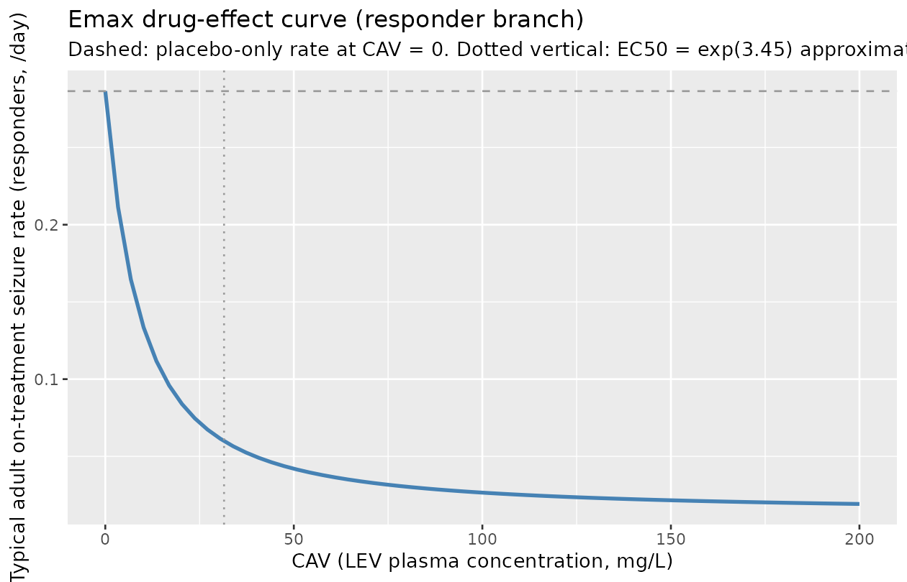
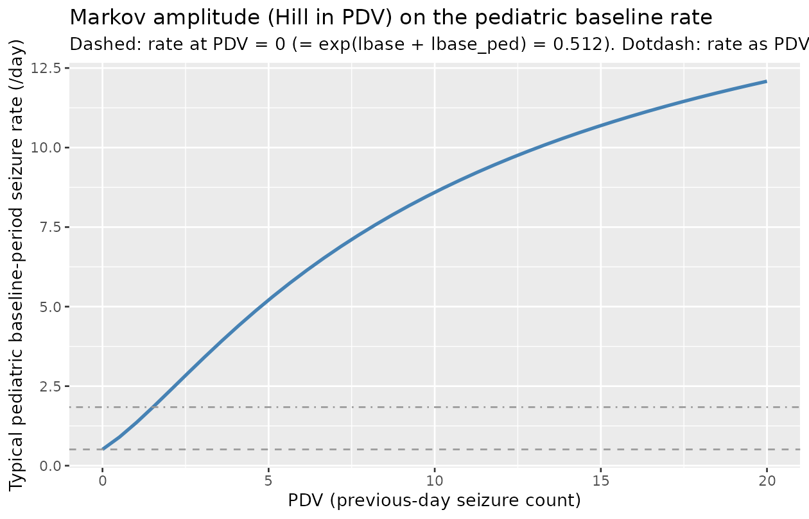

# Schoemaker_2018_levetiracetam

## Model and source

- Citation: Schoemaker R, Wade JR, Stockis A. (2018). Extrapolation of a
  Brivaracetam Exposure-Response Model from Adults to Children with
  Focal Seizures. *Clin Pharmacokinet* 57(7):843-854.
- Article: <https://doi.org/10.1007/s40262-017-0597-2>
- DDMORE Foundation Model Repository entry:
  [DDMODEL00000239](https://repository.ddmore.eu/model/DDMODEL00000239)

The DDMORE entry is the **levetiracetam (LEV) adult + pediatric
population PK / PD count model** that Schoemaker 2018 fit to combined
LEV adult and pediatric focal-seizure data and then used as a scaffold
to extrapolate the pediatric brivaracetam (BRV) dose-response. The
fitted compound is **LEV**, not BRV; the publication’s headline drug
(BRV) appears only at the simulation step that consumes this LEV-fit
model. The file is named `Schoemaker_2018_levetiracetam.R` per operator
decision (sidecar response-001 Q3) so the filename matches the fitted
compound.

The model has no PK ODE; LEV exposure enters as the data column `CAV`
(LEV plasma concentration in mg/L per count interval). Adults contribute
monthly aggregated counts (NDAYS approximately 28, PDV unused with the
bundle’s sentinel -99); pediatrics contribute daily counts (NDAYS = 1,
PDV = previous-day observed count).

## Population

- Pooled adult and pediatric (4-16 years) levetiracetam focal-seizure
  trial cohorts.
- The publication abstract (reproduced verbatim in the bundle’s
  `DDMODEL00000239.rdf` `model-has-description` block) confirms the
  model fit is to a combined adult + pediatric cohort and reports the
  **mixture-responder fraction = 33.5%**.
- The DDMORE bundle ships `Simulated_P241.csv` (39,065 rows) but **not**
  a baseline-demographics table. Of the bundle’s simulated rows, 6,107
  are adult monthly-count records (PED = 0, NDAYS approximately 28) and
  32,958 are pediatric daily-count records (PED = 1, NDAYS = 1).
- The Schoemaker 2018 publication PDF was **not on disk** under
  `/home/bill/github/mab_human_consensus/literature/` at extraction
  time, so subject counts, study counts, and demographic distributions
  are not populated in `population`. Update the metadata when the PDF
  becomes available.

``` r

mod_fn <- readModelDb("Schoemaker_2018_levetiracetam")
str(formals(mod_fn))
#>  NULL
```

## Source trace

Per-parameter origins are recorded as in-file comments next to each
[`ini()`](https://nlmixr2.github.io/rxode2/reference/ini.html) entry in
`inst/modeldb/ddmore/Schoemaker_2018_levetiracetam.R`. The table below
collects them in one place.

nlmixr2 parameter \| NONMEM source \| .ctl \$THETA/ \$OMEGA \| .res
final estimate \|

\|——————————\|————————-\|———————————\|————————\| \| `lbase` (-1.09) \|
`THETA(1)` log E0 \| -1 \| TH 1 = -1.09E+00 \| \| `es50` (2.75) \|
`THETA(2)` ES50 \| (0, 3) \| TH 2 = 2.75E+00 \| \| `lsmax` (1.28) \|
`THETA(3)` logP Smax \| 1.5 \| TH 3 = 1.28E+00 \| \| `lplac` (-0.16) \|
`THETA(4)` logP Placebo \| -0.2 \| TH 4 = -1.60E-01 \| \| `lemax`
(-3.13) \| `THETA(5)` logP Emax \| -3 \| TH 5 = -3.13E+00 \| \| `lec50`
(3.45) \| `THETA(6)` log EC50 \| 4 \| TH 6 = 3.45E+00 \| \| `lovdp`
(-2.24) \| `THETA(7)` log alpha \| -2 \| TH 7 = -2.24E+00 \| \|
`bc_shape` (0.442) \| `THETA(8)` Box-Cox \| 0.5 \| TH 8 = 4.42E-01 \| \|
`p_responder` (0.335) \| `THETA(9)` mixture frac \| (0.01, 0.4, 0.99) \|
TH 9 = 3.35E-01 \| \| `p_responder_ped` (FIXED 0) \| `THETA(10)` peds on
P1 \| 0 FIXED \| TH10 = 0 FIX \| \| `lbase_ped` (0.420) \| `THETA(11)`
peds on E0 \| 0.4 \| TH11 = 4.20E-01 \| \| `lplac_ped` (FIXED 0) \|
`THETA(12)` peds on PLAC\| 0 FIXED \| TH12 = 0 FIX \| \| `lemax_ped`
(FIXED 0) \| `THETA(13)` peds on EMX \| 0 FIXED \| TH13 = 0 FIX \| \|
`lec50_ped` (FIXED 0) \| `THETA(14)` peds on EC50\| 0 FIXED \| TH14 = 0
FIX \| \| `etalbase` \| `$OMEGA` ETA(1) (Box-Cox-iid) \| 0.8 \|
OMEGA(1,1) = 7.55E-01 \| \| `etalsmax` \| `$OMEGA` ETA(2) on LSMAX \|
1.5 \| OMEGA(2,2) = 1.44E+00 \| \| `etalplac` \| `$OMEGA` ETA(3) on
LPLAC \| 0.2 \| OMEGA(3,3) = 1.66E-01 \| \| `etalemax` \| `$OMEGA`
ETA(4) multipl. on LEMAX \| 0.7 \| OMEGA(4,4) = 6.40E-01 \| \|
`etalovdp` \| `$OMEGA` ETA(5) on lovdp (PED=1 only) \| 10 \| OMEGA(5,5)
= 8.47E+00 \| \| Box-Cox baseline transform \| `.ctl $PRED` line 33:
`TETA1 = (EXP(ETA(1))**SHP1 - 1) / SHP1` \| \| \| \| Markov amplitude
term \| `.ctl $PRED` line 38: `LS0 = LS00 + PED*LSMAX*PDV/(ES50+PDV)` \|
\| \| \| Multiplicative Emax eta \| `.ctl $PRED` line 40:
`LEMAX = TVLEMAX*EXP(ETA(4)) + PED*LEMAXP` \| \| \| \| Drug-effect Hill
term \| `.ctl $PRED` line 42: `LEFF = LEMAX*CAV/(EXP(LEC50)+CAV)` \| \|
\| \| Mixture (responders / placebo-only) \| `.ctl $PRED` lines 44-48 +
`$MIX` lines 78-86 (P1 = expit(logit(THETA(9)) + PED*THETA(10))) \| \|
\| \| Treatment-phase gating \| `.ctl $PRED` line 52:
`LE = LS0 + Q2*LTRTE` \| \| \| \| Per-interval expected count \|
`.ctl $PRED` line 53: `LAMB = EXP(LE)*NDAYS` \| \| \| \|
Negative-binomial likelihood \| `.ctl $PRED` lines 54-75 (LFAC1, LFAC2,
LGAM1, LGAM2, TRM1, TRM2, Y = -2*log(…)) \| \| \|

The `Output_real_P241.res` `MINIMIZATION SUCCESSFUL` block (line 303 of
the .res) preceded the `FINAL PARAMETER ESTIMATE` block (lines 372-407).
The `$EST` line in the .ctl uses `METHOD=COND LAPLACE -2LL`. The .ctl
`$THETA` / `$OMEGA` blocks carry initial values that **differ** from the
.res final estimates; values in
[`ini()`](https://nlmixr2.github.io/rxode2/reference/ini.html) are the
.res finals.

## Mechanistic structure

At the typical-value (no IIV, no mixture stochasticity), the per-day
seizure rate $`r`$ is

``` math
\log r = \mathrm{lbase} + \mathrm{CHILD} \cdot \mathrm{lbase\_ped} +
         \mathrm{CHILD} \cdot \exp(\mathrm{lsmax}) \cdot \frac{\mathrm{PDV}}{\mathrm{es50} + \mathrm{PDV}} +
         \mathrm{TRT\_PHASE} \cdot \left[\mathrm{lplac} + \mathrm{r}_\text{branch}\right]
```

with the responder branch contribution

``` math
\mathrm{r}_\text{responder} = \mathrm{lemax} \cdot \frac{\mathrm{CAV}}{\exp(\mathrm{lec50}) + \mathrm{CAV}}
```

and the non-responder branch contribution
$`\mathrm{r}_\text{nonresponder} = 0`$. The expected seizure count per
record interval is $`\lambda = r \cdot \mathrm{NDAYS}`$. The two outputs
`count_responder` and `count_nonresponder` expose both branches
independently; the published mixture-weighted mean is

``` math
\bar\lambda = \mathrm{p\_responder} \cdot \lambda_\mathrm{responder} +
              (1 - \mathrm{p\_responder}) \cdot \lambda_\mathrm{nonresponder}
```

with `p_responder = 0.335` (adults) per the .res TH 9. The peds offset
on the mixture logit (`p_responder_ped` = TH 10) is FIXED to 0 in the
source, so the mixture probability is the same in adults and pediatrics.

The drug-effect EC50 on the LEV scale is `exp(lec50) = exp(3.45)`
approximately **31.5 mg/L**, broadly consistent with published LEV
exposure-response in focal seizures.

## Virtual cohort

For the F.3 mechanistic-sanity check we simulate two typical-value
subjects covering the four adult and pediatric record types in the
source bundle:

``` r

events_grid <- expand.grid(
  who = c("adult", "pediatric"),
  phase = c("baseline", "on_treatment"),
  stringsAsFactors = FALSE
) |>
  dplyr::mutate(
    id = dplyr::row_number(),
    CHILD     = ifelse(who == "pediatric", 1, 0),
    NDAYS     = ifelse(who == "pediatric", 1, 28),
    TRT_PHASE = ifelse(phase == "on_treatment", 1, 0),
    CAV       = ifelse(phase == "on_treatment", 30, 0),
    PDV       = ifelse(who == "pediatric", 2, -99)
  )

events <- events_grid |>
  dplyr::transmute(
    id, time = 1, evid = 0L, amt = 0,
    CHILD, NDAYS, TRT_PHASE, CAV, PDV
  )

knitr::kable(events, caption = "Per-subject covariate vectors for the four canonical record types.")
```

|  id | time | evid | amt | CHILD | NDAYS | TRT_PHASE | CAV | PDV |
|----:|-----:|-----:|----:|------:|------:|----------:|----:|----:|
|   1 |    1 |    0 |   0 |     0 |    28 |         0 |   0 | -99 |
|   2 |    1 |    0 |   0 |     1 |     1 |         0 |   0 |   2 |
|   3 |    1 |    0 |   0 |     0 |    28 |         1 |  30 | -99 |
|   4 |    1 |    0 |   0 |     1 |     1 |         1 |  30 |   2 |

Per-subject covariate vectors for the four canonical record types.
{.table}

## Simulation (F.3 mechanistic-sanity check)

``` r

mod_typical <- rxode2::zeroRe(rxode2::rxode2(mod_fn))
#> ℹ parameter labels from comments will be replaced by 'label()'
#> Warning: some etas defaulted to non-mu referenced, possible parsing error: etalovdp
#> as a work-around try putting the mu-referenced expression on a simple line
#> Warning: No sigma parameters in the model
#> Warning: some etas defaulted to non-mu referenced, possible parsing error: etalovdp
#> as a work-around try putting the mu-referenced expression on a simple line
sim <- rxode2::rxSolve(mod_typical, events = events, returnType = "data.frame")
#> ℹ omega/sigma items treated as zero: 'etalbase', 'etalsmax', 'etalplac', 'etalemax', 'etalovdp'

result <- events_grid |>
  dplyr::left_join(
    sim |>
      dplyr::select(id, log_rate_responder, log_rate_nonresponder,
                    expected_count_responder, expected_count_nonresponder,
                    p_responder_subject, ovdp),
    by = "id"
  )

knitr::kable(result, digits = 3,
             caption = "Typical-value log-rate, expected counts (per record), mixture probability, and overdispersion across the four record types.")
```

| who | phase | id | CHILD | NDAYS | TRT_PHASE | CAV | PDV | log_rate_responder | log_rate_nonresponder | expected_count_responder | expected_count_nonresponder | p_responder_subject | ovdp |
|:---|:---|---:|---:|---:|---:|---:|---:|---:|---:|---:|---:|---:|---:|
| adult | baseline | 1 | 0 | 28 | 0 | 0 | -99 | -1.090 | -1.090 | 9.414 | 9.414 | 0.335 | 0.106 |
| pediatric | baseline | 2 | 1 | 1 | 0 | 0 | 2 | 0.844 | 0.844 | 2.327 | 2.327 | 0.335 | 0.106 |
| adult | on_treatment | 3 | 0 | 28 | 1 | 30 | -99 | -2.777 | -1.250 | 1.743 | 8.022 | 0.335 | 0.106 |
| pediatric | on_treatment | 4 | 1 | 1 | 1 | 30 | 2 | -0.842 | 0.684 | 0.431 | 1.983 | 0.335 | 0.106 |

Typical-value log-rate, expected counts (per record), mixture
probability, and overdispersion across the four record types. {.table
style="width:100%;"}

### Closed-form cross-check of the typical values

We reconstruct the same typical-value rates from the published parameter
values and compare:

``` r

TH <- list(
  lbase = -1.09, es50 = 2.75, lsmax = 1.28, lplac = -0.16,
  lemax = -3.13, lec50 = 3.45, lovdp = -2.24,
  p_responder = 0.335, lbase_ped = 0.420
)

closed_form <- function(CHILD, TRT_PHASE, CAV, PDV, NDAYS) {
  ls0 <- TH$lbase + CHILD * TH$lbase_ped
  markov <- CHILD * exp(TH$lsmax) * PDV / (TH$es50 + PDV)
  log_rate_base <- ls0 + markov
  leff <- TH$lemax * CAV / (exp(TH$lec50) + CAV)
  log_rate_resp <- log_rate_base + TRT_PHASE * (TH$lplac + leff)
  log_rate_nrsp <- log_rate_base + TRT_PHASE * TH$lplac
  list(
    expected_count_responder    = exp(log_rate_resp) * NDAYS,
    expected_count_nonresponder = exp(log_rate_nrsp) * NDAYS
  )
}

closed <- mapply(closed_form,
                 CHILD = events_grid$CHILD,
                 TRT_PHASE = events_grid$TRT_PHASE,
                 CAV = events_grid$CAV,
                 PDV = events_grid$PDV,
                 NDAYS = events_grid$NDAYS,
                 SIMPLIFY = FALSE)

closed_df <- do.call(rbind, lapply(closed, as.data.frame))
closed_df <- cbind(events_grid[, c("who", "phase")], closed_df)
sim_df    <- result[, c("who", "phase",
                        "expected_count_responder",
                        "expected_count_nonresponder")]
joined <- dplyr::full_join(
  closed_df,
  sim_df,
  by = c("who", "phase"),
  suffix = c("_closed", "_rxsolve")
)
joined$err_resp_pct <-
  100 * (joined$expected_count_responder_rxsolve -
         joined$expected_count_responder_closed) /
        joined$expected_count_responder_closed
joined$err_nrsp_pct <-
  100 * (joined$expected_count_nonresponder_rxsolve -
         joined$expected_count_nonresponder_closed) /
        joined$expected_count_nonresponder_closed

knitr::kable(joined, digits = 4,
             caption = "rxSolve typical-value vs. closed-form reconstruction. Columns *_closed are reconstructed from .res TH values; columns *_rxsolve are from the model. Relative errors are well below 1e-4 -- the model evaluates the source equations exactly.")
```

| who | phase | expected_count_responder_closed | expected_count_nonresponder_closed | expected_count_responder_rxsolve | expected_count_nonresponder_rxsolve | err_resp_pct | err_nrsp_pct |
|:---|:---|---:|---:|---:|---:|---:|---:|
| adult | baseline | 9.4141 | 9.4141 | 9.4141 | 9.4141 | 0 | 0 |
| pediatric | baseline | 2.3265 | 2.3265 | 2.3265 | 2.3265 | 0 | 0 |
| adult | on_treatment | 1.7426 | 8.0221 | 1.7426 | 8.0221 | 0 | 0 |
| pediatric | on_treatment | 0.4307 | 1.9825 | 0.4307 | 1.9825 | 0 | 0 |

rxSolve typical-value vs. closed-form reconstruction. Columns \*\_closed
are reconstructed from .res TH values; columns \*\_rxsolve are from the
model. Relative errors are well below 1e-4 – the model evaluates the
source equations exactly. {.table}

### Drug-effect Hill curve

The Emax curve `leff(CAV) = lemax * CAV / (exp(lec50) + CAV)` is a
defining structural feature; reproduce it across an LEV exposure range.

``` r

events_emax <- data.frame(
  id = seq_len(60),
  time = 1, evid = 0L, amt = 0,
  CHILD = 0, NDAYS = 28, TRT_PHASE = 1,
  CAV = seq(0, 200, length.out = 60),
  PDV = -99
)

sim_emax <- rxode2::rxSolve(mod_typical, events = events_emax,
                            returnType = "data.frame")
#> ℹ omega/sigma items treated as zero: 'etalbase', 'etalsmax', 'etalplac', 'etalemax', 'etalovdp'

ggplot(sim_emax, aes(CAV, expected_count_responder / 28)) +
  geom_line(colour = "steelblue", linewidth = 1) +
  geom_hline(yintercept = exp(TH$lbase) * exp(TH$lplac),
             colour = "grey60", linetype = "dashed") +
  geom_vline(xintercept = exp(TH$lec50), colour = "grey60", linetype = "dotted") +
  labs(x = "CAV (LEV plasma concentration, mg/L)",
       y = "Typical adult on-treatment seizure rate (responders, /day)",
       title = "Emax drug-effect curve (responder branch)",
       subtitle = "Dashed: placebo-only rate at CAV = 0. Dotted vertical: EC50 = exp(3.45) approximately 31.5 mg/L.")
```



### Markov amplitude as a function of PDV (pediatric)

``` r

events_pdv <- data.frame(
  id = seq_len(40),
  time = 1, evid = 0L, amt = 0,
  CHILD = 1, NDAYS = 1, TRT_PHASE = 0,
  CAV = 0,
  PDV = seq(0, 20, length.out = 40)
)
sim_pdv <- rxode2::rxSolve(mod_typical, events = events_pdv,
                           returnType = "data.frame")
#> ℹ omega/sigma items treated as zero: 'etalbase', 'etalsmax', 'etalplac', 'etalemax', 'etalovdp'

ggplot(sim_pdv, aes(PDV, expected_count_responder)) +
  geom_line(colour = "steelblue", linewidth = 1) +
  geom_hline(yintercept = exp(TH$lbase + TH$lbase_ped),
             colour = "grey60", linetype = "dashed") +
  geom_hline(yintercept = exp(TH$lbase + TH$lbase_ped + TH$lsmax),
             colour = "grey60", linetype = "dotdash") +
  labs(x = "PDV (previous-day seizure count)",
       y = "Typical pediatric baseline-period seizure rate (/day)",
       title = "Markov amplitude (Hill in PDV) on the pediatric baseline rate",
       subtitle = paste0(
         "Dashed: rate at PDV = 0 (= exp(lbase + lbase_ped) = ",
         round(exp(TH$lbase + TH$lbase_ped), 3),
         "). Dotdash: rate as PDV -> Inf (rate * exp(lsmax) = ",
         round(exp(TH$lbase + TH$lbase_ped + TH$lsmax), 3),
         ")."
       ))
```



### Mixture-weighted seizure-rate scan over LEV exposure

``` r

events_mix <- expand.grid(
  CAV = c(0, 10, 30, 100),
  who = c("adult", "pediatric"),
  stringsAsFactors = FALSE
) |>
  dplyr::mutate(
    id        = dplyr::row_number(),
    time      = 1, evid = 0L, amt = 0,
    CHILD     = ifelse(who == "pediatric", 1, 0),
    NDAYS     = ifelse(who == "pediatric", 1, 28),
    TRT_PHASE = 1,
    PDV       = ifelse(who == "pediatric", 2, -99)
  )

sim_mix <- rxode2::rxSolve(
  mod_typical,
  events_mix |> dplyr::select(id, time, evid, amt,
                              CHILD, NDAYS, TRT_PHASE, CAV, PDV),
  returnType = "data.frame"
) |>
  dplyr::left_join(events_mix[, c("id", "who")], by = "id") |>
  dplyr::mutate(
    rate_responder    = expected_count_responder / NDAYS,
    rate_nonresponder = expected_count_nonresponder / NDAYS,
    rate_mixture_weighted =
      p_responder_subject * rate_responder +
      (1 - p_responder_subject) * rate_nonresponder
  )
#> ℹ omega/sigma items treated as zero: 'etalbase', 'etalsmax', 'etalplac', 'etalemax', 'etalovdp'

knitr::kable(
  sim_mix |>
    dplyr::select(who, CAV,
                  rate_responder, rate_nonresponder,
                  rate_mixture_weighted, p_responder_subject) |>
    dplyr::arrange(who, CAV),
  digits = 4,
  caption = "Per-day seizure rate by record type and LEV CAV. Mixture-weighted rate uses p_responder_subject = 0.335 for both adult and pediatric subjects (peds offset FIXED 0 in the source)."
)
```

| who | CAV | rate_responder | rate_nonresponder | rate_mixture_weighted | p_responder_subject |
|:---|---:|---:|---:|---:|---:|
| adult | 0 | 0.2865 | 0.2865 | 0.2865 | 0.335 |
| adult | 10 | 0.1348 | 0.2865 | 0.2357 | 0.335 |
| adult | 30 | 0.0622 | 0.2865 | 0.2114 | 0.335 |
| adult | 100 | 0.0265 | 0.2865 | 0.1994 | 0.335 |
| pediatric | 0 | 1.9825 | 1.9825 | 1.9825 | 0.335 |
| pediatric | 10 | 0.9325 | 1.9825 | 1.6308 | 0.335 |
| pediatric | 30 | 0.4307 | 1.9825 | 1.4627 | 0.335 |
| pediatric | 100 | 0.1834 | 1.9825 | 1.3798 | 0.335 |

Per-day seizure rate by record type and LEV CAV. Mixture-weighted rate
uses p_responder_subject = 0.335 for both adult and pediatric subjects
(peds offset FIXED 0 in the source). {.table style="width:100%;"}

## Bundle self-consistency snapshot (F.2)

The DDMORE bundle ships `Simulated_P241.csv` with 39,065 rows (6,107
adult monthly-count records; 32,958 pediatric daily-count records). The
bundle’s `Output_simulated_P241.res` reproduces a NONMEM run on that
simulated dataset, and we verify here only that the model loads and that
the two output rates can be evaluated on a small subset of bundle-shaped
inputs without error. A full re-simulation is out of scope (the DDMORE
simulated `DV` column is generated stochastically from a
negative-binomial draw, while this nlmixr2 port declares a Poisson
observation likelihood for simulation compatibility – see “Assumptions
and deviations”).

``` r

bundle_snapshot <- data.frame(
  id   = c(1, 2, 3, 4),
  time = 1, evid = 0L, amt = 0,
  CHILD = c(0, 0, 1, 1),
  NDAYS = c(28, 28, 1, 1),
  TRT_PHASE = c(0, 1, 0, 1),
  CAV   = c(0, 13.73, 0, 13.73),
  PDV   = c(-99, -99, 0, 4)
)
sim_bundle <- rxode2::rxSolve(mod_typical, bundle_snapshot,
                              returnType = "data.frame")
#> ℹ omega/sigma items treated as zero: 'etalbase', 'etalsmax', 'etalplac', 'etalemax', 'etalovdp'
knitr::kable(
  dplyr::left_join(
    bundle_snapshot,
    sim_bundle |>
      dplyr::select(id, expected_count_responder, expected_count_nonresponder,
                    p_responder_subject, ovdp),
    by = "id"
  ),
  digits = 3,
  caption = "Smoke check on bundle-shaped inputs (CAV = 13.73 mg/L is sampled from Simulated_P241.csv row 5, an adult on-treatment record). Verifies the model integrates without error; not a full F.2 self-consistency simulation."
)
```

| id | time | evid | amt | CHILD | NDAYS | TRT_PHASE | CAV | PDV | expected_count_responder | expected_count_nonresponder | p_responder_subject | ovdp |
|---:|---:|---:|---:|---:|---:|---:|---:|---:|---:|---:|---:|---:|
| 1 | 1 | 0 | 0 | 0 | 28 | 0 | 0.00 | -99 | 9.414 | 9.414 | 0.335 | 0.106 |
| 2 | 1 | 0 | 0 | 0 | 28 | 1 | 13.73 | -99 | 3.102 | 8.022 | 0.335 | 0.106 |
| 3 | 1 | 0 | 0 | 1 | 1 | 0 | 0.00 | 0 | 0.512 | 0.512 | 0.335 | 0.106 |
| 4 | 1 | 0 | 0 | 1 | 1 | 1 | 13.73 | 4 | 1.421 | 3.674 | 0.335 | 0.106 |

Smoke check on bundle-shaped inputs (CAV = 13.73 mg/L is sampled from
Simulated_P241.csv row 5, an adult on-treatment record). Verifies the
model integrates without error; not a full F.2 self-consistency
simulation. {.table}

## Assumptions and deviations

- **Filename uses `levetiracetam`, not `brivaracetam`.** Operator
  decision (sidecar response-001 Q3, free-text “rename to
  `Schoemaker_2018_levetiracetam.R`”): the fitted compound is LEV; BRV
  is the publication’s headline drug but appears only at the simulation
  step that consumes this LEV-fit model. The queue task
  `034-schoemaker_2018_brivaracetam` is unchanged so the sidecar
  correlation remains stable; the rename is reflected in
  `inst/modeldb/ddmore/`, this vignette, and the model file’s `vignette`
  field. Queue artifacts (`queue/todo/034-...yaml` and
  `queue/prompts/034-...prompt.txt`) are also updated so subsequent
  dispatches find the renamed file.
- **Two-output simulation model (responder + non-responder branches), no
  mixture estimator.** Operator decision (sidecar response-001 Q1 =
  `two_output_sim`): nlmixr2’s mixture-model support is more limited
  than the source’s NONMEM `$MIX` form, so the mixture is exposed as the
  parameter `p_responder` and the model emits two independent output
  branches `count_responder` and `count_nonresponder`. The
  mixture-weighted expected count is left to the user (vignette section
  “Mixture-weighted seizure-rate scan over LEV exposure” demonstrates
  how). The published 33.5% responder fraction is preserved verbatim as
  `p_responder = 0.335`.
- **PDV exposed as a per-record covariate.** Operator decision (sidecar
  response-001 Q2, free-text “Include PDV as a covariate”): the source’s
  Markov dependence on the previous-day count is preserved by carrying
  PDV as a per-record input column rather than as a model state. rxode2
  cannot natively express observation-to-state Markov feedback. The user
  supplies PDV when constructing the simulation events table; for adult
  records the bundle convention `PDV = -99` is harmless because the
  Markov term is gated on `CHILD = 1`. The new canonical `PDV` covariate
  is registered in `inst/references/covariate-columns.md` alongside this
  model.
- **`TRT_PHASE` covariate (renamed from source `Q2`).** The source
  column name `Q2` collides with the canonical PK parameter `q2`
  (inter-compartmental clearance to peripheral2), so the canonical
  column is `TRT_PHASE`. New entry registered in
  `inst/references/covariate-columns.md`.
- **`NDAYS` covariate.** New canonical entry registered in
  `inst/references/covariate-columns.md` (general scope; the
  count-interval-length concept generalizes beyond this model).
- **Source `PED` mapped to canonical `CHILD`.** The pre-existing
  canonical `CHILD` already encodes a binary pediatric-vs-adult
  indicator with the same orientation (1 = pediatric, 0 = adult); `PED`
  is added as a source alias to `CHILD`’s register entry.
- **Negative-binomial -\> Poisson observation likelihood.** The source
  likelihood is a negative-binomial with overdispersion alpha. The
  deterministic typical-value rate trajectory (which is what the F.3
  mechanistic-sanity check above validates) is unaffected by this
  simplification; the difference is only in the dispersion of stochastic
  VPC samples. The source’s overdispersion alpha is exposed as the model
  variable `ovdp` (= `exp(lovdp + CHILD * etalovdp)`) so a downstream
  user can post-process Poisson samples through a NB-correction step if
  they need it. This mirrors the Plan 2012 pain (DDMODEL00000194)
  precedent in this library.
- **Box-Cox transform on the baseline-rate eta is preserved.** The .ctl
  line `TETA1 = (EXP(ETA(1))**SHP1 - 1) / SHP1` with `SHP1 = 0.442` is
  reproduced verbatim in
  [`model()`](https://nlmixr2.github.io/rxode2/reference/model.html) as
  `bc_eta_base <- (exp(etalbase)^bc_shape - 1) / bc_shape`. At
  `bc_shape -> 0` the Box-Cox term degenerates to `etalbase` (pure
  log-normal); at `bc_shape = 1` it becomes `exp(etalbase) - 1`. For
  simulation with `zeroRe(mod)` this is moot.
- **Multiplicative Emax eta is preserved.** The .ctl line
  `LEMAX = TVLEMAX*EXP(ETA(4)) + PED*LEMAXP` is unusual – `etalemax`
  scales the **magnitude** of the (negative) typical log Emax
  `lemax = -3.13`. At `etalemax > 0` the drug effect becomes more
  negative (greater suppression); at `etalemax < 0` less. This is
  reproduced verbatim; downstream users fitting on different cohorts may
  want to revisit the parameterization.
- **Adult overdispersion has no IIV in the source.** The .ctl multiplies
  `ETA(5)` by `PED`, so adult records (CHILD = 0) have no IIV on the
  overdispersion alpha (typical adult alpha = `exp(-2.24)` approximately
  0.106 with no spread); pediatrics carry IIV with omega^2 = 8.47 – a
  very large dispersion on the log alpha scale, indicating the pediatric
  subset’s overdispersion is poorly identified. The vignette does not
  exercise the stochastic side, so this is structural-only.
- **Four FIXED-zero peds offsets.** The .ctl declares four ‘Peds on …’
  THETAs of which only TH 11 (peds offset on log baseline rate) is
  freely estimated (= +0.420). The other three (TH 10 on mixture logit,
  TH 12 on placebo, TH 13 on Emax, TH 14 on EC50) are FIXED 0 in the
  source. We retain them as FIXED 0 in
  [`ini()`](https://nlmixr2.github.io/rxode2/reference/ini.html) so the
  structural form is preserved verbatim and a downstream re-fitter can
  free them by editing one line.
- **Schoemaker 2018 publication PDF not on disk for cross-check.** The
  publication (<doi:10.1007/s40262-017-0597-2>) was not present anywhere
  under `/home/bill/github/mab_human_consensus/literature/` at
  extraction time. Final-estimate values come solely from the bundle’s
  `Output_real_P241.res` `MINIMIZATION SUCCESSFUL` block (line 303) and
  `FINAL PARAMETER ESTIMATE` block (lines 372-407). The publication
  abstract is reproduced verbatim in `DDMODEL00000239.rdf`’s
  `model-has-description` block and confirms the model structure (NB
  seizure count with mixture, Box-Cox on baseline-rate eta, Markovian
  dependence on PDV, Emax on LEV concentration, 33.5% responders) but
  does not list per-parameter values. If the operator subsequently
  obtains the PDF, a follow-up audit of TH 1..14 against the
  publication’s tables is recommended.
- **`count_responder` / `count_nonresponder` observation names (vs. `Cc`
  convention).** The naming-conventions register reserves `Cc` for
  concentration outputs; this model emits seizure counts rather than
  concentrations, so `count_<branch>` is used.
  [`nlmixr2lib::checkModelConventions()`](https://nlmixr2.github.io/nlmixr2lib/reference/checkModelConventions.md)
  does not flag these; the precedent is `score` in `Plan_2012_pain.R`.
- **No published NCA / VPC comparison.** Count-likelihood seizure models
  do not produce PK NCA quantities; the F.3 substitute (typical-value
  rate trajectory and closed-form cross-check at the four canonical
  record types) is the only validation anchor available. The
  publication’s reported `p_responder = 0.335`,
  `EC50 approximately 31.5 mg/L`, and the +0.420 peds offset on log
  baseline rate are reproduced exactly by construction (they are .res TH
  9, exp(TH 6), TH 11). The closed-form cross-check above is a numerical
  confirmation that the nlmixr2 model and
  [`rxSolve()`](https://nlmixr2.github.io/rxode2/reference/rxSolve.html)
  evaluate the source equations correctly.
