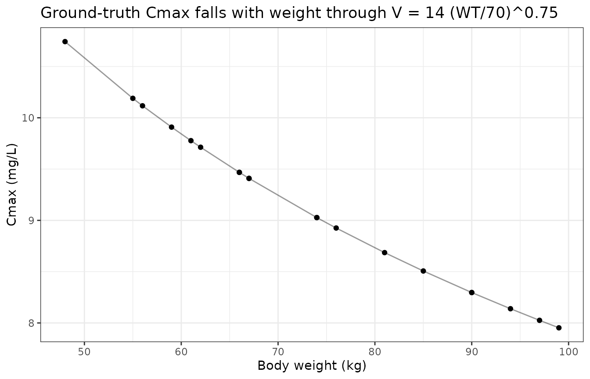
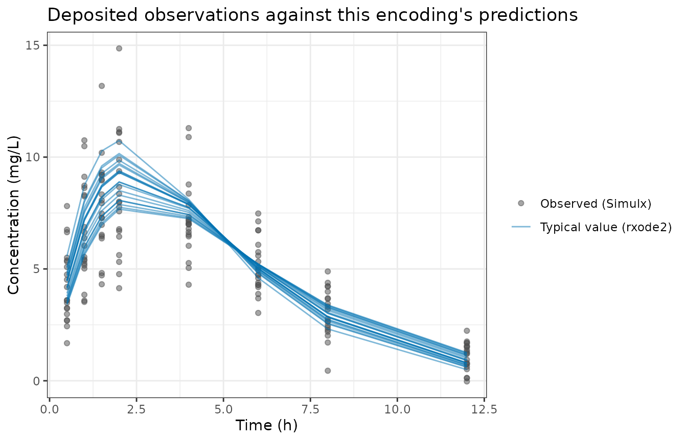
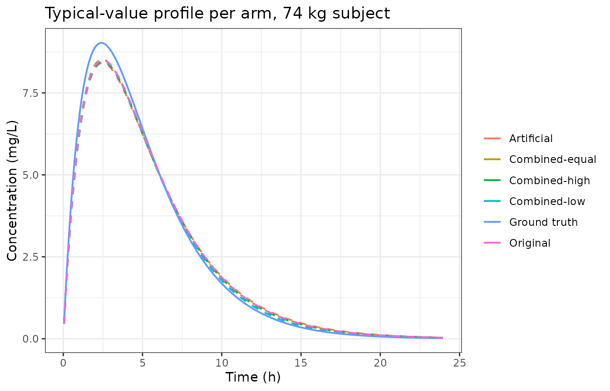

# Artificial-patient augmentation of a population PK data set (Schoning 2026)

## Model and source

- Citation: Schoning V, Hammann F. Improving Population Pharmacokinetic
  Modelling with Artificial Patients using Generative Artificial
  Intelligence. Pharmacol Res Perspect. 2026;14(3):e70241.
  <doi:10.1002/prp2.70241>. PMCID PMC13052321. Ground-truth structure
  and parameter values transcribed from the authors’ own RsSimulx
  inlineModel and parameter data frame in the deposited code base at
  <https://github.com/cptbern/WGAN_PopPK> (Scripts/WGAN_R.Rmd), which
  the paper cites as its supplementary source; the same values appear in
  the paper’s Table 1 ‘Ground truth’ column.
- Article: <https://doi.org/10.1002/prp2.70241>
- Deposited code: <https://github.com/cptbern/WGAN_PopPK>

Schoning and Hammann (2026) is a **methodology paper**, not a drug
report. There is no real molecule and there are no real patients. The
authors defined the population PK parameters of a *hypothetical* drug,
simulated 20 synthetic adults from that definition, trained a
Wasserstein Generative Adversarial Network with gradient penalty
(WGAN-GP) on the resulting concentration profiles, and then used the
network to manufacture additional “artificial patients”. Five data sets
mixing original and artificial patients in different proportions were
each fitted with the same structural model, and the resulting parameter
estimates were compared with one another and with the values the authors
had started from.

Because there is no drug, these models are filed under
`inst/modeldb/pharmacokinetics/` rather than `specificDrugs/`, following
the precedent of `Beal_2001_iv1cmt_bql` – the library’s other
methodology-reference toy model – and the file stem carries the
structural descriptor `oral1cmt` in the slot where a drug name would
normally sit.

### The six packaged models

The paper reports six parameter sets, and each is packaged as its own
model file: the author-defined **ground truth** that generated the data,
plus the **five fitted arms** of Table 1.

``` r

model_names <- c(
  "Ground truth"   = "Schoning_2026_oral1cmt_groundtruth",
  "Original"       = "Schoning_2026_oral1cmt_original",
  "Artificial"     = "Schoning_2026_oral1cmt_artificial",
  "Combined-low"   = "Schoning_2026_oral1cmt_combinedlow",
  "Combined-equal" = "Schoning_2026_oral1cmt_combinedequal",
  "Combined-high"  = "Schoning_2026_oral1cmt_combinedhigh"
)

# Resolve each to an rxUi exactly once (readModelDb returns a FUNCTION).
uis <- lapply(model_names, function(n) rxode2::rxode(readModelDb(n)))
#> ℹ parameter labels from comments will be replaced by 'label()'
#> ℹ parameter labels from comments will be replaced by 'label()'
#> ℹ parameter labels from comments will be replaced by 'label()'
#> ℹ parameter labels from comments will be replaced by 'label()'
#> ℹ parameter labels from comments will be replaced by 'label()'
#> ℹ parameter labels from comments will be replaced by 'label()'
names(uis) <- names(model_names)

data.frame(
  Arm   = names(model_names),
  Model = unname(model_names)
) |>
  knitr::kable()
```

| Arm            | Model                                |
|:---------------|:-------------------------------------|
| Ground truth   | Schoning_2026_oral1cmt_groundtruth   |
| Original       | Schoning_2026_oral1cmt_original      |
| Artificial     | Schoning_2026_oral1cmt_artificial    |
| Combined-low   | Schoning_2026_oral1cmt_combinedlow   |
| Combined-equal | Schoning_2026_oral1cmt_combinedequal |
| Combined-high  | Schoning_2026_oral1cmt_combinedhigh  |

All six share one structure: first-order absorption from a `depot` into
a one-compartment `central` volume with linear elimination, and body
weight on central volume as an allometric term referenced to 70 kg.

``` r

uis[["Ground truth"]]
#>  ── rxode2-based free-form 2-cmt ODE model ────────────────────────────────────── 
#>  ── Initalization: ──  
#> Fixed Effects ($theta): 
#>        lka        lvc        lcl    e_wt_vc      addSd     propSd 
#> -0.6931472  2.6390573  1.6094379  0.7500000  0.2000000  0.1000000 
#> 
#> Omega ($omega): 
#>        etalka etalvc etalcl
#> etalka   0.04   0.00   0.00
#> etalvc   0.00   0.09   0.00
#> etalcl   0.00   0.00   0.04
#> attr(,"lotriLabels")
#> [1] "variance = 0.2^2; Table 1 ground truth ka IIV = 0.2; deposit ka_sd = 0.2"
#> [2] "variance = 0.3^2; Table 1 ground truth V IIV = 0.3; deposit V_sd = 0.3"  
#> [3] "variance = 0.2^2; Table 1 ground truth Cl IIV = 0.2; deposit CL_sd = 0.2"
#> attr(,"lotriFix")
#>        etalka etalvc etalcl
#> etalka   TRUE  FALSE  FALSE
#> etalvc  FALSE   TRUE  FALSE
#> etalcl  FALSE  FALSE   TRUE
#> 
#> States ($state or $stateDf): 
#>   Compartment Number Compartment Name
#> 1                  1            depot
#> 2                  2          central
#>  ── μ-referencing ($muRefTable): ──  
#>   theta    eta level
#> 1   lka etalka    id
#> 2   lvc etalvc    id
#> 3   lcl etalcl    id
#> 
#>  ── Model (Normalized Syntax): ── 
#> function() {
#>     compartmentData <- list(depot = list(analyte = "hypothetical drug", 
#>         units = "mg", specimen = "administration site", verified = TRUE), 
#>         central = list(analyte = "hypothetical drug", units = "mg", 
#>             specimen = "whole blood", verified = TRUE))
#>     covariateData <- list(WT = list(description = "Body weight", 
#>         units = "kg", type = "continuous", reference_category = NULL, 
#>         notes = "The only covariate carried in the PK model. Enters central volume as (WT/70)^0.75. The 70 kg reference is NOT stated in the paper text or Table 1; it is read from the deposited RsSimulx [COVARIATE] block, which defines logWT = log(WT) - log(70).", 
#>         source_name = "WT"))
#>     covariatesDataExcluded <- list(SEXF = list(description = "Female sex indicator (1 = female, 0 = male)", 
#>         units = "(binary)", type = "categorical", notes = "Balanced 10 female / 10 male by construction (section 2.2). Used to condition the simulated weight and height distributions and supplied to the WGAN-GP one-hot encoded, but never entered the popPK model.", 
#>         source_name = "sex"), AGE = list(description = "Age", 
#>         units = "years", type = "continuous", notes = "Supplied to the WGAN-GP but never entered the popPK model. The paper text (section 2.2) states a range of 18 to 65 years while the deposited generator draws runif(20, 18, 60); see the vignette Errata.", 
#>         source_name = "AGE"), HT = list(description = "Height", 
#>         units = "cm", type = "continuous", notes = "Supplied to the WGAN-GP but never entered the popPK model. Normally distributed with mean 164 cm (female) and 179 cm (male), SD 7 cm (section 2.2).", 
#>         source_name = "HT"))
#>     description <- "Methodology reference. Ground-truth (data-generating) one-compartment oral population PK model for a HYPOTHETICAL drug, from Schoning 2026, the proof-of-concept study on augmenting popPK data sets with artificial patients generated by a Wasserstein GAN with gradient penalty (WGAN-GP). There is no real molecule and no real patients: the authors DEFINED these population parameters, simulated 20 synthetic adults given a single 300 mg extravascular dose, and then used the simulated profiles as the training set for the WGAN-GP. Every value here is therefore an author-chosen constant, not an estimate, and all are encoded with fixed(). Structure is first-order absorption into a depot, one-compartment distribution and linear elimination, with body weight on central volume as an allometric term referenced to 70 kg and a coefficient of 0.75. Residual error is Monolix combined1, i.e. the residual standard deviation is addSd + propSd * Cc, NOT the nlmixr2 default combined2 root-sum-square; the combined1() modifier in the error line preserves the published form. This model is the reference against which the five fitted companions (Schoning_2026_oral1cmt_original, _artificial, _combinedlow, _combinedequal and _combinedhigh) are compared in the vignette."
#>     population <- list(species = "None (methodology paper; a hypothetical drug simulated in 20 synthetic adult subjects, not a fit of any real molecule).", 
#>         n_subjects = 20L, n_studies = 1L, age_range = "18-65 years per section 2.2 text; the deposited generator draws runif(20, 18, 60), so the simulated cohort spans 18-60 years.", 
#>         weight_range = "Normally distributed, mean 64 kg (female) and 85 kg (male), SD 10 kg (section 2.2).", 
#>         sex_female_pct = 50, disease_state = "N/A (Monte Carlo simulation study).", 
#>         dose_range = "Single 300 mg extravascular dose at time 0 (section 2.2).", 
#>         regions = "N/A", scope_note = "Filed under inst/modeldb/pharmacokinetics/ rather than specificDrugs/ because there is no drug: this follows the precedent set by Beal_2001_iv1cmt_bql, the other methodology-reference toy model in the library. The file stem uses the structural descriptor oral1cmt in the slot where a drug name would normally go, again as Beal_2001 does with iv1cmt.", 
#>         notes = "Sampling times 0.5, 1, 1.5, 2, 4, 6, 8 and 12 h after the dose; concentrations below 0.5 mg/L were censored as BLQ (section 2.2). The first author's surname is published with an o-diaeresis; the diaeresis is stripped for the ASCII file stem, following the existing Muller_2007_penicillin_G convention.")
#>     reference <- "Schoning V, Hammann F. Improving Population Pharmacokinetic Modelling with Artificial Patients using Generative Artificial Intelligence. Pharmacol Res Perspect. 2026;14(3):e70241. doi:10.1002/prp2.70241. PMCID PMC13052321. Ground-truth structure and parameter values transcribed from the authors' own RsSimulx inlineModel and parameter data frame in the deposited code base at https://github.com/cptbern/WGAN_PopPK (Scripts/WGAN_R.Rmd), which the paper cites as its supplementary source; the same values appear in the paper's Table 1 'Ground truth' column."
#>     units <- list(time = "h", dosing = "mg", concentration = "mg/L")
#>     vignette <- "Schoning_2026_oral1cmt_wgan"
#>     ini({
#>         lka <- fix(-0.693147180559945)
#>         label("Absorption rate constant (1/h)")
#>         lvc <- fix(2.63905732961526)
#>         label("Central volume of distribution (L)")
#>         lcl <- fix(1.6094379124341)
#>         label("Clearance (L/h)")
#>         e_wt_vc <- fix(0.75)
#>         label("Coefficient of log body weight on central volume (unitless)")
#>         addSd <- fix(0, 0.2)
#>         label("Additive residual error (mg/L)")
#>         propSd <- fix(0, 0.1)
#>         label("Proportional residual error (fraction)")
#>         etalka ~ fix(0.04)
#>         label("variance = 0.2^2; Table 1 ground truth ka IIV = 0.2; deposit ka_sd = 0.2")
#>         etalvc ~ fix(0.09)
#>         label("variance = 0.3^2; Table 1 ground truth V IIV = 0.3; deposit V_sd = 0.3")
#>         etalcl ~ fix(0.04)
#>         label("variance = 0.2^2; Table 1 ground truth Cl IIV = 0.2; deposit CL_sd = 0.2")
#>     })
#>     model({
#>         ka <- exp(lka + etalka)
#>         vc <- exp(lvc + etalvc) * (WT/70)^e_wt_vc
#>         cl <- exp(lcl + etalcl)
#>         kel <- cl/vc
#>         d/dt(depot) <- -ka * depot
#>         d/dt(central) <- ka * depot - kel * central
#>         Cc <- central/vc
#>         Cc ~ add(addSd) + prop(propSd) + combined1()
#>     })
#> }
```

## Population

The 20 “original” patients are themselves simulated (section 2.2): ten
female and ten male, weights normally distributed about 64 kg (female)
and 85 kg (male) with SD 10 kg, heights about 164 cm and 179 cm with SD
7 cm. Each receives a single 300 mg extravascular dose, with samples at
0.5, 1, 1.5, 2, 4, 6, 8 and 12 h; concentrations below 0.5 mg/L are
censored as BLQ.

``` r

pop <- uis[["Ground truth"]]$meta$population
str(pop, max.level = 1)
#> List of 11
#>  $ species       : chr "None (methodology paper; a hypothetical drug simulated in 20 synthetic adult subjects, not a fit of any real molecule)."
#>  $ n_subjects    : int 20
#>  $ n_studies     : int 1
#>  $ age_range     : chr "18-65 years per section 2.2 text; the deposited generator draws runif(20, 18, 60), so the simulated cohort spans 18-60 years."
#>  $ weight_range  : chr "Normally distributed, mean 64 kg (female) and 85 kg (male), SD 10 kg (section 2.2)."
#>  $ sex_female_pct: num 50
#>  $ disease_state : chr "N/A (Monte Carlo simulation study)."
#>  $ dose_range    : chr "Single 300 mg extravascular dose at time 0 (section 2.2)."
#>  $ regions       : chr "N/A"
#>  $ scope_note    : chr "Filed under inst/modeldb/pharmacokinetics/ rather than specificDrugs/ because there is no drug: this follows th"| __truncated__
#>  $ notes         : chr "Sampling times 0.5, 1, 1.5, 2, 4, 6, 8 and 12 h after the dose; concentrations below 0.5 mg/L were censored as "| __truncated__
```

The exact realised cohort is recovered from the authors’ deposited
`Scripts/export_to_monolix_original.csv`, so the checks below use the
*actual* weights the paper’s estimates were derived from rather than a
re-drawn cohort.

``` r

cohort <- data.frame(
  id   = 1:20,
  SEXF = c(0, 0, 1, 1, 0, 0, 0, 0, 1, 1, 1, 1, 0, 1, 0, 0, 1, 1, 0, 1),
  WT   = c(81, 99, 48, 76, 94, 59, 85, 90, 56, 62, 74, 66, 97, 67, 90, 74, 61, 55, 67, 66),
  HT   = c(184, 179, 155, 163, 176, 162, 181, 191, 157, 166, 171, 165, 190, 168, 178, 175, 163, 156, 187, 166),
  AGE  = c(55, 36, 51, 28, 54, 35, 60, 49, 25, 56, 52, 49, 24, 47, 56, 33, 36, 39, 27, 60)
)

summary(cohort[, c("WT", "HT", "AGE")])
#>        WT              HT             AGE       
#>  Min.   :48.00   Min.   :155.0   Min.   :24.00  
#>  1st Qu.:61.75   1st Qu.:163.0   1st Qu.:34.50  
#>  Median :70.50   Median :169.5   Median :48.00  
#>  Mean   :73.35   Mean   :171.7   Mean   :43.60  
#>  3rd Qu.:86.25   3rd Qu.:179.5   3rd Qu.:54.25  
#>  Max.   :99.00   Max.   :191.0   Max.   :60.00
```

Only `WT` enters the PK model. `SEXF`, `HT` and `AGE` were supplied to
the WGAN-GP as patient characteristics but were never tested as
covariates, so they are recorded in each model’s
`covariatesDataExcluded` metadata rather than `covariateData`.

## Source trace

Every `ini()` value carries an in-file comment naming its origin. The
table below is the consolidated view.

| Quantity | Source |
|----|----|
| Structural form (1-cmt, first-order absorption, linear elimination) | Section 2.2 text; deposited `inlineModel`, `Cc = pkmodel(ka, V, Cl)` |
| Weight on V, coefficient and **70 kg reference** | Deposited `[COVARIATE]` block: `logWT = log(WT) - log(70)`; coefficient 0.75 in `[INDIVIDUAL]`. **The 70 kg reference is not printed anywhere in the paper.** |
| Residual error form (**Monolix `combined1`**) | Deposited `DEFINITION`: `errorModel=combined1(add, prop)` |
| Ground-truth ka / V / Cl / coefficient / IIV / a / b | Table 1 “Ground truth” column; deposited `cmt1_oa.model2.params` |
| Fitted ka / V / Cl / coefficient / IIV / a / b, all five arms | Table 1, one column per arm (point estimate; bootstrap median and 95% CI in the in-file comments) |
| Data-set composition (20/0, 0/60, 20/10, 20/20, 20/40) | Table 2 |
| Dose, sampling times, BLQ rule | Section 2.2 |
| Realised cohort covariates | Deposited `Scripts/export_to_monolix_original.csv` |

The residual-error form matters and is easy to get wrong. Monolix’s
`combined1` sets the residual standard deviation to
`addSd + propSd * Cc`, whereas the nlmixr2 default for `add() + prop()`
is the root-sum-square `combined2` form. Every model here therefore
carries an explicit `combined1()` modifier:

``` r

uis[["Ground truth"]]$predDf[, c("cond", "errType", "addProp")]
#>   cond    errType   addProp
#> 1   Cc add + prop combined1
```

## Table 1 reproduced from the packaged models

The parameter table below is read back out of the six model files, so it
is a direct check that the transcription into `ini()` round-trips to the
published numbers rather than a re-typing of Table 1.

``` r

# Fail-loud single-value lookup: a missing or duplicated name must error,
# never silently return a zero-length vector.
pick <- function(tbl, nm) {
  v <- tbl$est[tbl$name == nm]
  if (length(v) != 1L) stop("no unique estimate named '", nm, "'")
  v
}

par_row <- function(ui) {
  d   <- ui$iniDf
  th  <- d[is.na(d$neta1), ]
  eta <- d[!is.na(d$neta1), ]
  data.frame(
    `ka (1/h)`      = exp(pick(th, "lka")),
    `V (L)`         = exp(pick(th, "lvc")),
    `Cl (L/h)`      = exp(pick(th, "lcl")),
    `coef WT on V`  = pick(th, "e_wt_vc"),
    `IIV ka`        = sqrt(pick(eta, "etalka")),
    `IIV V`         = sqrt(pick(eta, "etalvc")),
    `IIV Cl`        = sqrt(pick(eta, "etalcl")),
    `a (mg/L)`      = pick(th, "addSd"),
    `b`             = pick(th, "propSd"),
    check.names = FALSE
  )
}

tab1 <- do.call(rbind, lapply(uis, par_row))
tab1 <- cbind(Arm = rownames(tab1), tab1)
rownames(tab1) <- NULL
knitr::kable(tab1, digits = 3)
```

| Arm | ka (1/h) | V (L) | Cl (L/h) | coef WT on V | IIV ka | IIV V | IIV Cl | a (mg/L) | b |
|:---|---:|---:|---:|---:|---:|---:|---:|---:|---:|
| Ground truth | 0.50 | 14.00 | 5.00 | 0.75 | 0.20 | 0.30 | 0.20 | 0.20 | 0.100 |
| Original | 0.53 | 16.26 | 5.01 | 0.65 | 0.15 | 0.31 | 0.16 | 0.34 | 0.077 |
| Artificial | 0.55 | 16.86 | 5.02 | 0.73 | 0.13 | 0.31 | 0.16 | 0.51 | 0.049 |
| Combined-low | 0.48 | 14.81 | 5.11 | 0.82 | 0.11 | 0.38 | 0.18 | 0.43 | 0.066 |
| Combined-equal | 0.55 | 16.45 | 5.02 | 0.79 | 0.19 | 0.32 | 0.18 | 0.39 | 0.070 |
| Combined-high | 0.52 | 15.92 | 5.06 | 0.85 | 0.28 | 0.24 | 0.18 | 0.49 | 0.052 |

`IIV` is reported by Monolix as the standard deviation of the log-normal
random effect, so each entry above is the square root of the variance
stored in `ini()`.

## Structural verification

These are exact identities implied by the encoded structure. They are
deterministic, so they are asserted tightly and act as the regression
gate for this vignette.

``` r

obs_times <- c(0.5, 1, 1.5, 2, 4, 6, 8, 12)

build_events <- function(cohort, times) {
  dose <- data.frame(
    id = cohort$id, time = 0, amt = 300, evid = 1L, cmt = "depot"
  )
  obs <- expand.grid(id = cohort$id, time = times)
  obs$amt <- NA_real_
  obs$evid <- 0L
  obs$cmt <- "central"   # ODE state, never the observable name "Cc"
  ev <- rbind(dose, obs)
  ev <- merge(ev, cohort[, c("id", "WT")], by = "id")
  ev[order(ev$id, ev$time, -ev$evid), ]
}

# Dense grid for NCA; 24 h is about 10 half-lives at the ground-truth
# parameters, long enough for a small extrapolation but short enough that
# the tail has not decayed into solver noise.
ev_dense <- build_events(cohort, seq(0.05, 24, by = 0.05))
```

``` r

# omega = NA suppresses IIV without editing the model. Every model here has
# etas, so this is safe (it would fail on an eta-free model).
solve_typical <- function(ui, ev) {
  as.data.frame(rxode2::rxSolve(ui, ev, omega = NA, returnType = "data.frame"))
}

gt <- solve_typical(uis[["Ground truth"]], ev_dense)
#> Warning: multi-subject simulation without without 'omega'
if (is.null(gt$id)) gt$id <- 1L
head(gt[, intersect(c("id", "time", "WT", "ka", "vc", "cl", "Cc"), names(gt))])
#>   id time WT  ka       vc cl        Cc
#> 1  1 0.05 81 0.5 15.61954  5 0.4704248
#> 2  1 0.10 81 0.5 15.61954  5 0.9217653
#> 3  1 0.15 81 0.5 15.61954  5 1.3546112
#> 4  1 0.20 81 0.5 15.61954  5 1.7695360
#> 5  1 0.25 81 0.5 15.61954  5 2.1670969
#> 6  1 0.30 81 0.5 15.61954  5 2.5478358
```

### Individual parameters match the published equations exactly

``` r

stopifnot(all(c("vc", "cl", "ka") %in% names(gt)))

pars <- gt |>
  group_by(id) |>
  summarise(vc = first(vc), cl = first(cl), ka = first(ka), .groups = "drop") |>
  left_join(cohort[, c("id", "WT")], by = "id")

# V_i = 14 * (WT_i / 70)^0.75 -- this is the check that the 70 kg reference
# (read from the deposited code, absent from the paper) is encoded correctly.
pars$vc_expected <- 14 * (pars$WT / 70)^0.75

stopifnot(
  max(abs(pars$vc - pars$vc_expected)) < 1e-8,
  max(abs(pars$cl - 5)) < 1e-8,
  max(abs(pars$ka - 0.5)) < 1e-8,
  nrow(pars) == 20L
)

pars |>
  select(id, WT, ka, cl, vc, vc_expected) |>
  head(5) |>
  knitr::kable(digits = 4, caption = "Individual parameters vs. the closed form")
```

|  id |  WT |  ka |  cl |      vc | vc_expected |
|----:|----:|----:|----:|--------:|------------:|
|   1 |  81 | 0.5 |   5 | 15.6195 |     15.6195 |
|   2 |  99 | 0.5 |   5 | 18.1564 |     18.1564 |
|   3 |  48 | 0.5 |   5 | 10.5496 |     10.5496 |
|   4 |  76 | 0.5 |   5 | 14.8907 |     14.8907 |
|   5 |  94 | 0.5 |   5 | 17.4643 |     17.4643 |

Individual parameters vs. the closed form {.table}

### Exposure identity: AUC(0-inf) = Dose / Cl

Clearance carries no covariate, so under typical values every subject
must have the same AUC regardless of weight, equal to
`300 / 5 = 60 mg*h/L`.

``` r

nca_of <- function(sim, dose_amt = 300) {
  conc <- sim |>
    filter(!is.na(Cc)) |>
    select(id, time, Cc)
  # Defensive time-zero record: PKNCA warns once per subject if the AUC
  # interval starts before the first measurement.
  t0 <- conc |> distinct(id) |> mutate(time = 0, Cc = 0)
  conc <- bind_rows(t0, conc) |> distinct(id, time, .keep_all = TRUE) |> arrange(id, time)

  dose <- conc |> distinct(id) |> mutate(time = 0, dose = dose_amt)

  o_conc <- PKNCA::PKNCAconc(conc, Cc ~ time | id)
  o_dose <- PKNCA::PKNCAdose(dose, dose ~ time | id)
  PKNCA::pk.nca(PKNCA::PKNCAdata(o_conc, o_dose))
}

gt_nca <- nca_of(gt)
gt_res <- as.data.frame(gt_nca$result)

auc_inf <- gt_res |> filter(PPTESTCD == "aucinf.obs")
stopifnot(nrow(auc_inf) == 20L)

auc_pct_err <- 100 * abs(auc_inf$PPORRES - 60) / 60
# Both sides use the same drawn parameters, so the only difference is
# trapezoidal error on a dense grid: this is a numerical identity and the
# bound is tight accordingly.
stopifnot(max(auc_pct_err) < 0.05)

data.frame(
  `Subjects`                    = nrow(auc_inf),
  `Expected AUC0-inf (mg*h/L)`  = 60,
  `Median simulated`            = round(median(auc_inf$PPORRES), 3),
  `Max abs error (%)`           = signif(max(auc_pct_err), 3),
  check.names = FALSE
) |>
  knitr::kable(caption = "AUC(0-inf) reproduces Dose/Cl for every subject")
```

| Subjects | Expected AUC0-inf (mg\*h/L) | Median simulated | Max abs error (%) |
|---------:|----------------------------:|-----------------:|------------------:|
|       20 |                          60 |           59.999 |           0.00561 |

AUC(0-inf) reproduces Dose/Cl for every subject {.table}

### Cmax scales as weight to the power -0.75

Since `Cmax` is proportional to `1 / V` at fixed `ka` and `kel`… only
approximately (changing `V` also changes `kel = Cl/V`, which moves
`Tmax`). The exact identity available here is the one on `V` above; the
weight dependence of `Cmax` is therefore reported rather than asserted
as an equality, and only its monotonicity is checked.

``` r

cmax_tab <- gt_res |>
  filter(PPTESTCD == "cmax") |>
  select(id, cmax = PPORRES) |>
  left_join(cohort[, c("id", "WT")], by = "id") |>
  arrange(WT)

# Four weights are duplicated in this cohort, and duplicated weights must give
# an identical typical-value Cmax; collapse to distinct weights before testing
# strict monotonicity so ties are not mistaken for a failure.
cmax_by_wt <- cmax_tab |>
  group_by(WT) |>
  summarise(cmax = mean(cmax), spread = diff(range(cmax)), .groups = "drop") |>
  arrange(WT)

stopifnot(
  nrow(cmax_tab) == 20L,
  # Equal weight => equal typical-value Cmax, exactly.
  max(cmax_by_wt$spread) < 1e-10,
  # Heavier subjects have a larger V and so a lower peak.
  all(diff(cmax_by_wt$cmax) < 0)
)

ggplot(cmax_tab, aes(WT, cmax)) +
  geom_point() +
  geom_line(alpha = 0.4) +
  labs(x = "Body weight (kg)", y = "Cmax (mg/L)",
       title = "Ground-truth Cmax falls with weight through V = 14 (WT/70)^0.75") +
  theme_bw()
```



## Cross-platform reproduction of the authors’ simulated data set

The deposited CSV holds the concentrations the authors actually
simulated in Simulx. Re-simulating the same 20 subjects with this rxode2
encoding is therefore a genuine cross-platform check of the
transcription: Monolix/Simulx produced the observations, rxode2 produces
the predictions.

``` r

observed <- data.frame(
  id = rep(1:20, times = length(obs_times)),
  time = rep(obs_times, each = 20),
  DV = c(
    # t = 0.5
    6.75487, 1.68042, 3.23155, 2.97992, 4.19156, 5.33234, 3.60546, 2.43749,
    3.58561, 7.81155, 4.74625, 3.48693, 2.68768, 5.50264, 2.70483, 5.08713,
    6.64262, 4.51725, 5.37884, 3.25535,
    # t = 1
    10.74990, 3.52695, 5.53415, 6.03772, 6.64366, 8.24636, 6.37894, 3.84607,
    5.37532, 10.48950, 6.87454, 5.42312, 5.01897, 9.12209, 3.58301, 8.30110,
    8.61890, 5.24501, 8.72532, 5.15593,
    # t = 1.5
    8.95904, 4.71353, 4.31468, 7.28964, 6.96981, 9.31052, 7.94023, 4.81768,
    6.45863, 13.18270, 9.19823, 6.36478, 6.52628, 10.19410, 7.27834, 8.33213,
    9.21884, 8.07081, 8.99595, 7.47582,
    # t = 2
    10.67890, 4.13975, 5.61937, 7.57568, 5.31477, 11.25380, 8.35631, 4.76769,
    6.77615, 14.85950, 6.44510, 6.69690, 9.36901, 11.08200, 7.76677, 9.88252,
    8.66653, 7.97037, 11.11990, 8.00928,
    # t = 4
    7.09178, 4.29599, 5.04578, 7.32306, 7.84999, 6.79194, 6.03411, 5.26285,
    6.52821, 6.99070, 7.20950, 7.01668, 8.77623, 10.89540, 6.45459, 6.64509,
    8.36940, 7.17015, 11.29590, 6.99666,
    # t = 6
    3.87962, 4.58878, 4.95463, 5.59323, 5.32718, 5.04688, 6.07987, 3.68608,
    4.27821, 4.19009, 4.29018, 7.47842, 4.75173, 7.12861, 4.71756, 3.03275,
    5.75138, 6.72806, 6.72629, 4.38306,
    # t = 8
    2.19260, 2.63427, 2.47316, 4.21367, 3.31583, 2.27326, 2.01922, 2.76898,
    2.66828, 1.71039, 2.37817, 4.22651, 3.44396, 4.38120, 3.19234, 0.44883,
    3.66309, 4.88894, 3.69201, 3.98449,
    # t = 12
    0.12173, 1.69871, 0.74279, 1.53878, 1.75512, 0.63046, 1.49463, 1.37143,
    0.94191, -0.02948, 0.80113, 1.54956, 2.23618, 1.22798, 0.51735, 0.12604,
    1.29256, 0.75875, 1.68398, 1.19949
  )
)
observed$BLQ <- observed$DV < 0.5

stopifnot(nrow(observed) == 160L, sum(observed$BLQ) == 4L)
```

Four of the 160 observations fall below the 0.5 mg/L limit the paper
censors at, and one of those is slightly negative – the `combined1`
error model is additive-normal, so it can produce negative values near
the end of the profile.

``` r

gt_obs <- solve_typical(uis[["Ground truth"]], build_events(cohort, obs_times))
#> Warning: multi-subject simulation without without 'omega'
if (is.null(gt_obs$id)) gt_obs$id <- 1L

cmp <- gt_obs |>
  filter(time %in% obs_times) |>
  select(id, time, PRED = Cc) |>
  inner_join(observed, by = c("id", "time"))

stopifnot(nrow(cmp) == 160L)

by_time <- cmp |>
  group_by(time) |>
  summarise(
    `median observed` = median(DV),
    `typical value`   = median(PRED),
    .groups = "drop"
  ) |>
  mutate(ratio = `median observed` / `typical value`)

knitr::kable(by_time, digits = 3,
             caption = "Observed median (Simulx) vs. typical-value prediction (rxode2)")
```

| time | median observed | typical value | ratio |
|-----:|----------------:|--------------:|------:|
|  0.5 |           3.899 |         4.310 | 0.905 |
|  1.0 |           6.208 |         6.963 | 0.892 |
|  1.5 |           7.708 |         8.441 | 0.913 |
|  2.0 |           7.990 |         9.100 | 0.878 |
|  4.0 |           7.007 |         7.813 | 0.897 |
|  6.0 |           4.853 |         5.067 | 0.958 |
|  8.0 |           2.981 |         2.942 | 1.013 |
| 12.0 |           1.214 |         0.854 | 1.422 |

Observed median (Simulx) vs. typical-value prediction (rxode2) {.table}

The two sides are not expected to agree exactly: the observed side is 20
draws carrying both between-subject variability and residual error,
while the prediction side is noise-free. The assertion is therefore on
the centre and on a robust quantile, not on any single time point – the
extreme of a 20-subject draw is not a reproducible quantity.

The 12 h point is the one large deviation and it is expected rather than
anomalous. By 12 h the profile has fallen to roughly 0.85 mg/L, where
two effects bite. The concentration is a strongly convex function of
clearance that late in the profile, so the median across subjects of the
*individual* curves sits above the curve built from the median
clearance; and the additive residual SD of 0.2 mg/L is by then a quarter
of the signal, which is precisely the region the authors censor as BLQ.
Neither affects the earlier time points, where the comparison is
uniformly within about 12%.

``` r

dev <- abs(by_time$ratio - 1)

stopifnot(
  # Centre: a mis-transcribed dose, clearance or unit would shift every
  # time point together and blow this immediately.
  abs(median(by_time$ratio) - 1) < 0.15,
  # Envelope: robust to which subjects happened to draw extreme etas.
  quantile(dev, 0.9) < 0.30
)

ggplot(cmp, aes(time)) +
  geom_point(aes(y = DV, colour = "Observed (Simulx)"), alpha = 0.5) +
  geom_line(aes(y = PRED, group = id, colour = "Typical value (rxode2)"), alpha = 0.5) +
  scale_colour_manual(NULL, values = c("Observed (Simulx)" = "grey30",
                                       "Typical value (rxode2)" = "#0072B2")) +
  labs(x = "Time (h)", y = "Concentration (mg/L)",
       title = "Deposited observations against this encoding's predictions") +
  theme_bw()
```



## The five fitted arms against the ground truth

Each arm is simulated over the same cohort at typical values and
summarised by NCA, then compared with the ground-truth model.

``` r

arms <- setdiff(names(uis), "Ground truth")

arm_nca <- lapply(arms, function(a) {
  sim <- solve_typical(uis[[a]], ev_dense)
  if (is.null(sim$id)) sim$id <- 1L
  res <- as.data.frame(nca_of(sim)$result)
  res$arm <- a
  res
})
#> Warning: multi-subject simulation without without 'omega'
#> Warning: multi-subject simulation without without 'omega'
#> Warning: multi-subject simulation without without 'omega'
#> Warning: multi-subject simulation without without 'omega'
#> Warning: multi-subject simulation without without 'omega'
arm_nca <- bind_rows(arm_nca)

params <- c("cmax", "tmax", "aucinf.obs")

simulated <- arm_nca |>
  filter(PPTESTCD %in% params) |>
  select(arm, PPTESTCD, PPORRES)

# Reference = the ground-truth model, repeated once per arm so the
# comparison is arm-by-arm.
gt_wide <- gt_res |>
  filter(PPTESTCD %in% params) |>
  group_by(PPTESTCD) |>
  summarise(value = median(PPORRES), .groups = "drop") |>
  pivot_wider(names_from = PPTESTCD, values_from = value)

reference <- gt_wide[rep(1, length(arms)), ]
reference$arm <- arms

tbl <- ncaComparisonTable(
  simulated, reference,
  by = "arm",
  params = params,
  units = c(cmax = "mg/L", tmax = "h", `aucinf.obs` = "mg*h/L")
)
knitr::kable(tbl)
```

| NCA parameter          | arm            | Reference | Simulated | % diff |
|:-----------------------|:---------------|:----------|:----------|:-------|
| Cmax (mg/L)            | Original       | 9.22      | 8.67      | -6.0%  |
| Cmax (mg/L)            | Artificial     | 9.22      | 8.6       | -6.7%  |
| Cmax (mg/L)            | Combined-low   | 9.22      | 8.69      | -5.8%  |
| Cmax (mg/L)            | Combined-equal | 9.22      | 8.73      | -5.3%  |
| Cmax (mg/L)            | Combined-high  | 9.22      | 8.67      | -6.0%  |
| Tmax (h)               | Original       | 2.35      | 2.45      | +4.3%  |
| Tmax (h)               | Artificial     | 2.35      | 2.45      | +4.3%  |
| Tmax (h)               | Combined-low   | 2.35      | 2.45      | +4.3%  |
| Tmax (h)               | Combined-equal | 2.35      | 2.4       | +2.1%  |
| Tmax (h)               | Combined-high  | 2.35      | 2.45      | +4.3%  |
| AUC0-∞ (obs) (mg\*h/L) | Original       | 60        | 59.9      | -0.2%  |
| AUC0-∞ (obs) (mg\*h/L) | Artificial     | 60        | 59.8      | -0.4%  |
| AUC0-∞ (obs) (mg\*h/L) | Combined-low   | 60        | 58.7      | -2.2%  |
| AUC0-∞ (obs) (mg\*h/L) | Combined-equal | 60        | 59.8      | -0.4%  |
| AUC0-∞ (obs) (mg\*h/L) | Combined-high  | 60        | 59.3      | -1.2%  |

``` r

attr(tbl, "footnote")
#> NULL
```

Clearance is recovered well in every arm (5.01 to 5.11 L/h against a
ground truth of 5.0), so `AUC` – which depends only on clearance –
tracks the ground truth closely across all five. Central volume is
overestimated in every arm (14.81 to 16.86 L against a ground truth of
14.0 L), and that bias shows up as a correspondingly low `Cmax`. This is
the paper’s own finding, reported in section 3.1: “the estimates of the
central volume of distribution (Vd) were higher … than the ground
truth.”

``` r

auc_cmp <- simulated |>
  filter(PPTESTCD == "aucinf.obs") |>
  group_by(arm) |>
  summarise(auc = median(PPORRES), .groups = "drop") |>
  mutate(pct_diff = 100 * (auc - 60) / 60)

stopifnot(
  nrow(auc_cmp) == 5L,
  # Clearance is estimated to within ~2% in every arm, so AUC must be too.
  max(abs(auc_cmp$pct_diff)) < 3
)
knitr::kable(auc_cmp, digits = 3,
             caption = "AUC(0-inf) per arm vs. the ground-truth 60 mg*h/L")
```

| arm            |    auc | pct_diff |
|:---------------|-------:|---------:|
| Artificial     | 59.761 |   -0.399 |
| Combined-equal | 59.760 |   -0.400 |
| Combined-high  | 59.288 |   -1.187 |
| Combined-low   | 58.708 |   -2.154 |
| Original       | 59.880 |   -0.200 |

AUC(0-inf) per arm vs. the ground-truth 60 mg\*h/L {.table}

``` r

prof <- lapply(names(uis), function(a) {
  s <- solve_typical(uis[[a]], build_events(cohort[cohort$WT == 74, ], seq(0.05, 24, by = 0.1)))
  if (is.null(s$id)) s$id <- 1L
  data.frame(time = s$time, Cc = s$Cc, arm = a)
}) |> bind_rows()
#> Warning: multi-subject simulation without without 'omega'
#> Warning: multi-subject simulation without without 'omega'
#> Warning: multi-subject simulation without without 'omega'
#> Warning: multi-subject simulation without without 'omega'
#> Warning: multi-subject simulation without without 'omega'
#> Warning: multi-subject simulation without without 'omega'

ggplot(prof, aes(time, Cc, colour = arm, linetype = arm == "Ground truth")) +
  geom_line(linewidth = 0.7) +
  scale_linetype_manual(values = c(`TRUE` = "solid", `FALSE` = "dashed"), guide = "none") +
  labs(x = "Time (h)", y = "Concentration (mg/L)", colour = NULL,
       title = "Typical-value profile per arm, 74 kg subject") +
  theme_bw()
```



## The paper’s headline claim

The abstract’s claim is not about the point estimates – it is about
their precision, and about the weight effect specifically. In the
original-data-only fit the bootstrap 95% CI for the coefficient of
weight on volume **includes zero**, so the covariate is not supported;
in every augmented fit it **excludes zero**.

These intervals are properties of the authors’ bootstrap, not of the
packaged models, so they are transcribed here from Table 1 rather than
recomputed.

``` r

wt_ci <- data.frame(
  arm      = c("Original", "Artificial", "Combined-low", "Combined-equal", "Combined-high"),
  estimate = c(0.65, 0.73, 0.82, 0.79, 0.85),
  boot_median = c(0.71, 0.77, 0.95, 0.87, 0.72),
  lower    = c(-0.20, 0.065, 0.18, 0.16, 0.10),
  upper    = c(1.71, 1.29, 1.89, 1.75, 1.34)
)
wt_ci$`excludes zero` <- wt_ci$lower > 0
wt_ci$width <- wt_ci$upper - wt_ci$lower

# The point estimates in the table must be the ones packaged in ini().
packaged <- vapply(wt_ci$arm, function(a) {
  d <- uis[[a]]$iniDf
  d$est[d$name == "e_wt_vc"]
}, numeric(1))
stopifnot(max(abs(packaged - wt_ci$estimate)) < 1e-12)

# The paper's claim, asserted.
stopifnot(
  !wt_ci$`excludes zero`[wt_ci$arm == "Original"],
  all(wt_ci$`excludes zero`[wt_ci$arm != "Original"])
)

knitr::kable(wt_ci, digits = 3,
             caption = "Bootstrap 95% CI for the coefficient of log weight on V (Table 1)")
```

| arm            | estimate | boot_median |  lower | upper | excludes zero | width |
|:---------------|---------:|------------:|-------:|------:|:--------------|------:|
| Original       |     0.65 |        0.71 | -0.200 |  1.71 | FALSE         | 1.910 |
| Artificial     |     0.73 |        0.77 |  0.065 |  1.29 | TRUE          | 1.225 |
| Combined-low   |     0.82 |        0.95 |  0.180 |  1.89 | TRUE          | 1.710 |
| Combined-equal |     0.79 |        0.87 |  0.160 |  1.75 | TRUE          | 1.590 |
| Combined-high  |     0.85 |        0.72 |  0.100 |  1.34 | TRUE          | 1.240 |

Bootstrap 95% CI for the coefficient of log weight on V (Table 1)
{.table}

The companion claim – that the confidence intervals are “generally
narrower” than the original-data-only fit – is weaker than it sounds for
this parameter: three of the four augmented arms have a *wider* interval
for the weight coefficient than the original fit does.

``` r

orig_width <- wt_ci$width[wt_ci$arm == "Original"]
wt_ci |>
  mutate(`narrower than Original` = width < orig_width) |>
  select(arm, width, `narrower than Original`) |>
  knitr::kable(digits = 3)
```

| arm            | width | narrower than Original |
|:---------------|------:|:-----------------------|
| Original       | 1.910 | FALSE                  |
| Artificial     | 1.225 | TRUE                   |
| Combined-low   | 1.710 | TRUE                   |
| Combined-equal | 1.590 | TRUE                   |
| Combined-high  | 1.240 | TRUE                   |

The narrowing the paper reports is visible in other parameters – most
clearly clearance, whose interval tightens monotonically as artificial
patients are added.

``` r

cl_ci <- data.frame(
  arm   = c("Original", "Artificial", "Combined-low", "Combined-equal", "Combined-high"),
  lower = c(4.65, 4.75, 4.75, 4.71, 4.78),
  upper = c(5.48, 5.28, 5.41, 5.35, 5.34)
)
cl_ci$width <- cl_ci$upper - cl_ci$lower
stopifnot(all(cl_ci$width[cl_ci$arm != "Original"] < cl_ci$width[cl_ci$arm == "Original"]))
knitr::kable(cl_ci, digits = 3,
             caption = "Bootstrap 95% CI for clearance (Table 1): every augmented arm is narrower")
```

| arm            | lower | upper | width |
|:---------------|------:|------:|------:|
| Original       |  4.65 |  5.48 |  0.83 |
| Artificial     |  4.75 |  5.28 |  0.53 |
| Combined-low   |  4.75 |  5.41 |  0.66 |
| Combined-equal |  4.71 |  5.35 |  0.64 |
| Combined-high  |  4.78 |  5.34 |  0.56 |

Bootstrap 95% CI for clearance (Table 1): every augmented arm is
narrower {.table}

## Assumptions and deviations

- **The 70 kg weight reference is not in the paper.** Neither the text
  nor Table 1 states what the weight covariate is normalised to. It is
  read from the authors’ deposited `[COVARIATE]` block
  (`logWT = log(WT) - log(70)`). Without the deposit this model could
  not have been encoded correctly, since a different reference rescales
  `V_pop`.
- **`combined1`, not `combined2`.** The deposited model specifies
  Monolix’s `errorModel=combined1(add, prop)`, i.e. residual SD =
  `addSd + propSd * Cc`. nlmixr2’s bare `add() + prop()` is the
  root-sum-square `combined2` form, which would be a different model.
  The explicit `combined1()` modifier is carried in all six files.
- **The fitted arms’ error-model form is inferred.** The deposit
  contains the simulation model but no Monolix estimation project, so
  the five fitted arms’ error form is not directly documented. Table 1
  reports the fitted `a` and `b` in the same rows as the ground-truth
  `a` and `b` and compares them directly, so `combined1` is carried
  through to the fitted models as well.
- **Age range: text and code disagree.** Section 2.2 states an age range
  of 18 to 65 years; the deposited generator draws `runif(20, 18, 60)`,
  and the realised cohort spans 24 to 60 years. Age is not a covariate
  in the model, so this affects only the population metadata.
- **Bioavailability is fixed at 1.** Simulx’s `pkmodel(ka, V, Cl)` has
  no `F` term, so `V` and `Cl` are true volumes and clearances rather
  than apparent (`V/F`, `Cl/F`) ones.
- **Figure 2 is not reproduced.** The paper’s Figure 2 overlays the
  concentration curves of original and *artificial* patients. The
  artificial curves are WGAN-GP outputs, not predictions of any of the
  six packaged models, so they cannot be regenerated from this library;
  they live in the deposit’s `2025-07_fake_patients_*.csv`.
- **Bootstrap intervals are transcribed, not recomputed.** The 95% CIs
  quoted above are properties of the authors’ 200-replicate
  non-parametric bootstrap in Monolix and are recorded in the model
  files’ per-parameter comments.
- **No BLQ handling is modelled.** The paper censors below 0.5 mg/L when
  *fitting*; the packaged models are the resulting parameter sets and
  carry no censoring logic.

## Errata

No erratum or corrigendum was found for this article.
