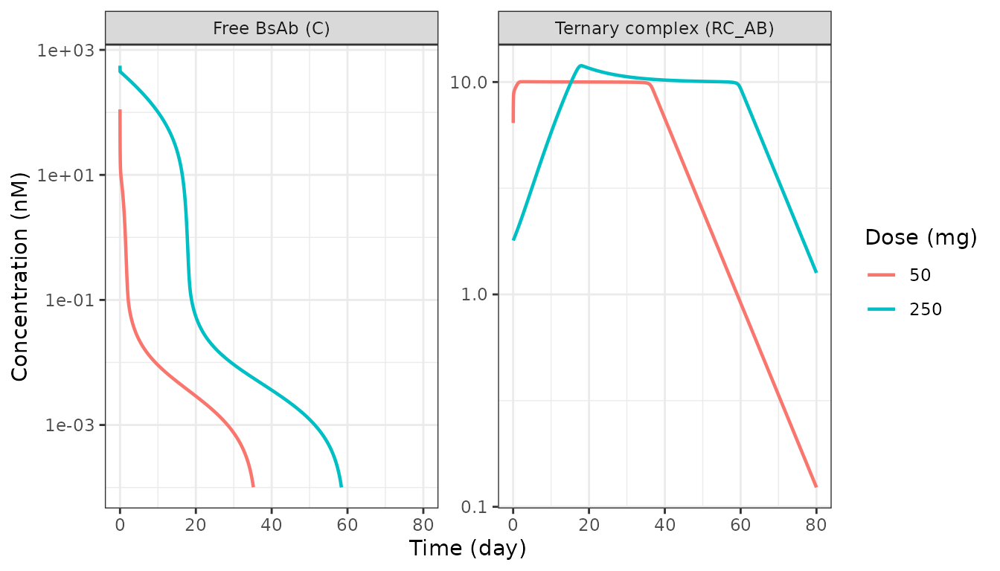
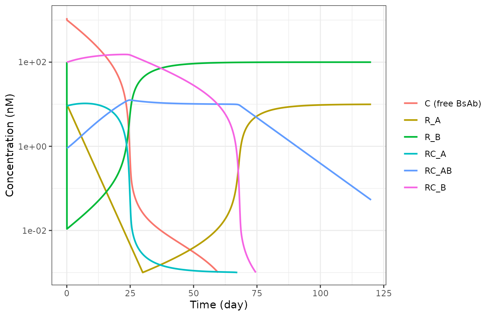
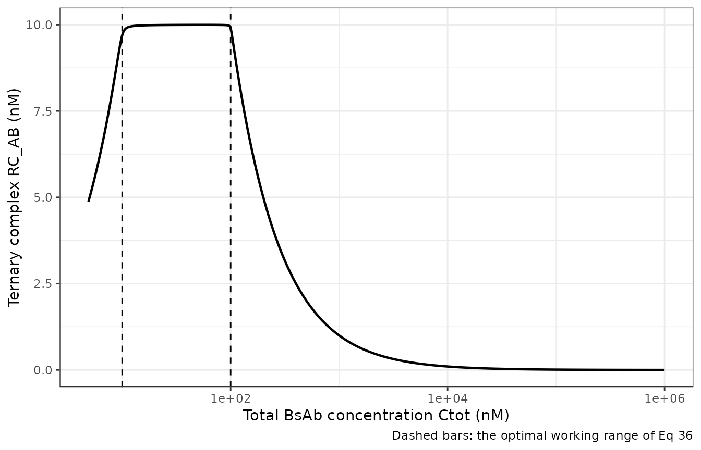
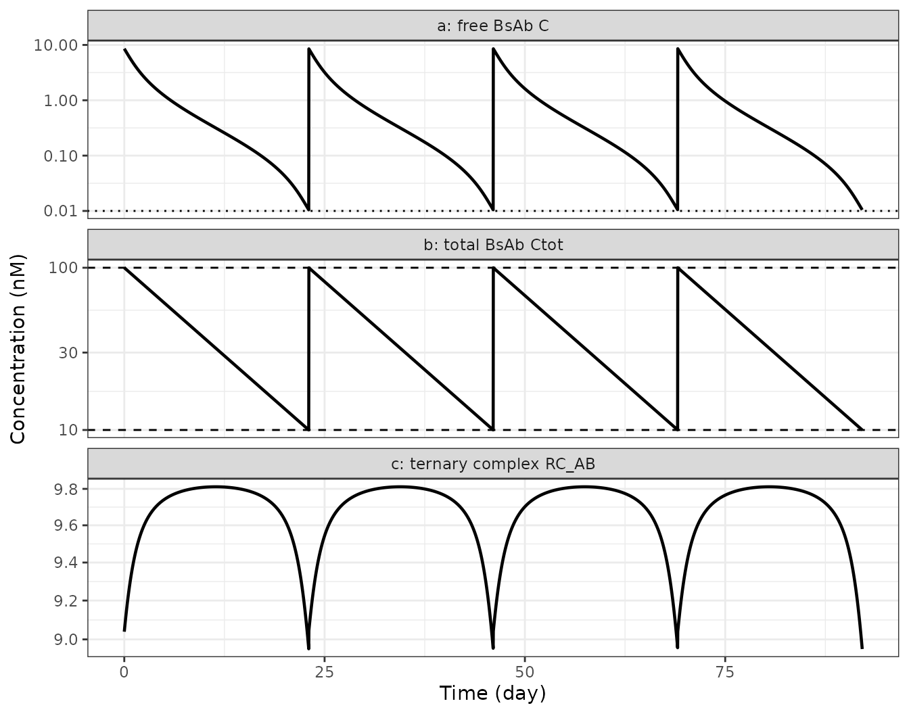

# Bispecific antibody TMDD: full model, QE approximation and optimal dosing (Schropp 2019)

## Model and source

- Article: <https://doi.org/10.1002/psp4.12369> (CPT Pharmacometrics
  Syst Pharmacol. 2019;8(3):177-187, PMC6430159)
- Supplement: S1-S10, retrieved from the Europe PMC supplementary-files
  endpoint for PMC6430159. S4/S6 are the authors’ MONOLIX/NONMEM code
  for the full model, S3/S5 for the quasi-equilibrium (QE) approximation
  with non-constant total receptors, and S8/S10 (with S7/S9 as the
  alternative representation) for the QE approximation with constant
  total receptors.

A bispecific antibody (BsAb) binds two different targets, so it can form
two *binary* complexes and one *ternary* complex. The ternary complex –
the “trimer” – is the species that physically bridges the two cells and
therefore drives the pharmacodynamic effect. Schropp et al. write down a
general target-mediated drug disposition (TMDD) model for this class,
derive a quasi-equilibrium approximation that cuts the parameter count
from 19 to 14 and then to 10, and use the reduced model to derive an
*optimal dosing strategy*.

The paper’s central and counter-intuitive result is that **more drug is
not better**. Because the trimer needs one free copy of each target,
saturating both targets with binary complexes starves the cross-linking
reaction, so the trimer concentration is a bell-shaped function of total
drug and vanishes in the high-dose limit. Raising the dose therefore
*delays* trimer build-up.

This is a theoretical / methodological paper: there is no clinical or
preclinical dataset, no drug and no covariates. It contributes three
models:

``` r

mods <- c(
  "Schropp_2019_bsab_tmdd_full",
  "Schropp_2019_bsab_tmdd_qe",
  "Schropp_2019_bsab_tmdd_qeconst"
)
full <- rxode2::rxode2(readModelDb(mods[1]))
qe <- rxode2::rxode2(readModelDb(mods[2]))
qeconst <- rxode2::rxode2(readModelDb(mods[3]))
#> ℹ parameter labels from comments will be replaced by 'label()'

tibble::tibble(
  Model = mods,
  `Paper equations` = c("Eqs 1-9", "Eqs 14-22, 24 + Table 1", "Eqs 15, 17, 23-30"),
  Parameters = c(19L, 14L, 10L),
  `ODE states` = c(length(full$state), length(qe$state), length(qeconst$state))
) |>
  knitr::kable()
```

| Model | Paper equations | Parameters | ODE states |
|:---|:---|---:|---:|
| Schropp_2019_bsab_tmdd_full | Eqs 1-9 | 19 | 8 |
| Schropp_2019_bsab_tmdd_qe | Eqs 14-22, 24 + Table 1 | 14 | 6 |
| Schropp_2019_bsab_tmdd_qeconst | Eqs 15, 17, 23-30 | 10 | 3 |

## Population

There is no population. The paper fits no data: its parameter values are
a generic set “roughly based on literature reported values” (Methods,
*Parameter setting for simulations*; Table 2, left-hand block), and its
only subject-level exercise is a simulation-estimation study in which 30
*simulated* individuals are generated with the full model and refitted
with the constant-total-receptor approximation. Every `ini()` value is
therefore wrapped in `fixed()`, exactly as every `$THETA` in the
authors’ own NONMEM streams carries `FIX`.

``` r

pop <- readModelDb(mods[1])() |> environment() |> (\(e) e$population)()
tibble::tibble(Field = names(pop), Value = vapply(pop, \(x) paste(as.character(x), collapse = " "), "")) |>
  knitr::kable()
```

| Value |
|-------|

## Units and the dose conversion

Time is days, concentrations are nM, doses are nmol. The paper works in
mg and states a conversion factor of **1 mg = 6.7 nmol** (Methods,
*Parameter setting for simulations*). That factor is load-bearing for
every mg-denominated result below, so it is checked against two
independent numbers the paper prints itself.

``` r

MG_TO_NMOL <- 6.7 # Methods, "Parameter setting for simulations"
VC <- 3 # Table 2, V = 3 L

tibble::tibble(
  Check = c(
    "S5/S9 NONMEM dataset comment: 50 mg i.v. bolus of Figure 3",
    "Eq 39 worked example: dose achieving Ctot(0) = 100 nM in 3 L"
  ),
  `Paper value` = c("335 nmol", "44.8 mg"),
  Reproduced = c(
    sprintf("%.1f nmol", 50 * MG_TO_NMOL),
    sprintf("%.1f mg", 100 * VC / MG_TO_NMOL)
  )
) |>
  knitr::kable()
```

| Check | Paper value | Reproduced |
|:---|:---|:---|
| S5/S9 NONMEM dataset comment: 50 mg i.v. bolus of Figure 3 | 335 nmol | 335.0 nmol |
| Eq 39 worked example: dose achieving Ctot(0) = 100 nM in 3 L | 44.8 mg | 44.8 mg |

``` r


stopifnot(
  abs(50 * MG_TO_NMOL - 335) < 1e-8,
  abs(100 * VC / MG_TO_NMOL - 44.8) < 0.05
)
```

Both reproduce exactly, so the conversion factor is confirmed from
inside the paper rather than assumed.

## Source trace

``` r

tibble::tribble(
  ~Quantity, ~`Source location`,
  "d/dt AD, C, R_A, R_B, RC_A, RC_B, RC_AB, AP (full model)", "Eqs 1-8; authors' NONMEM DADT(1)-DADT(8) in S6",
  "Initial conditions R_X(0) = ksynX/kdegX, all else 0", "Eq 9; A_0(1)-A_0(8) in S6",
  "Total drug / total receptor definitions", "Eqs 11-13",
  "K_DZ = k_offZ / k_onZ", "Eq 14a",
  "Microscopic reversibility K_D1*K_D3 = K_D2*K_D4; K_D3 = alpha*K_D2, K_D4 = alpha*K_D1", "Eq 14b and following text",
  "QE matrix form d/dt(C, R_A, R_B) = M * g", "Eqs 15-19",
  "Matrix entries m_ij and determinant", "Table 1; written out in FORTRAN in S5/S9/S10",
  "Algebraic complexes RC_A, RC_B, RC_AB", "Eqs 20-22",
  "Constant-total-receptor reduction k_degX = k_intX = k_intAB = k_int", "Eq 23; assignments in S9/S10 $PK",
  "Single-ODE form, quadratic for R_B, explicit R_A", "Eqs 25-30; S10 $DES",
  "Trimer vanishes as C grows without bound", "Eq 35",
  "Optimal working range min(RtotA,RtotB) <= Ctot <= max(RtotA,RtotB)", "Eq 36",
  "Optimal initial dose, re-dosing time, subsequent doses", "Eqs 39, 40, 41",
  "Dummy i.v. input compartment", "Eq 42; TDUR = 0.0001 day in S5/S9/S10",
  "V, ka, F, kel, k12, k21, kon1-2, koff1-2, ksynA/B, kdegA/B, kintA/B/AB", "Table 2, left-hand 'Simulation' block",
  "kon3 = kon2, kon4 = kon1, koff3 = koff2, koff4 = koff1", "Table 2 footnote",
  "True and fitted kel, K_D1, K_D2, alpha, R0A, R0B, kint, V, omegas, b1-b3", "Table 2, right-hand 'Simulation-estimation' block",
  "1 mg = 6.7 nmol", "Methods, 'Parameter setting for simulations'",
  "LLOQ 0.01 nM", "Methods, 'Parameter setting for simulations'"
) |>
  knitr::kable()
```

| Quantity | Source location |
|:---|:---|
| d/dt AD, C, R_A, R_B, RC_A, RC_B, RC_AB, AP (full model) | Eqs 1-8; authors’ NONMEM DADT(1)-DADT(8) in S6 |
| Initial conditions R_X(0) = ksynX/kdegX, all else 0 | Eq 9; A_0(1)-A_0(8) in S6 |
| Total drug / total receptor definitions | Eqs 11-13 |
| K_DZ = k_offZ / k_onZ | Eq 14a |
| Microscopic reversibility K_D1*K_D3 = K_D2*K_D4; K_D3 = alpha*K_D2, K_D4 = alpha*K_D1 | Eq 14b and following text |
| QE matrix form d/dt(C, R_A, R_B) = M \* g | Eqs 15-19 |
| Matrix entries m_ij and determinant | Table 1; written out in FORTRAN in S5/S9/S10 |
| Algebraic complexes RC_A, RC_B, RC_AB | Eqs 20-22 |
| Constant-total-receptor reduction k_degX = k_intX = k_intAB = k_int | Eq 23; assignments in S9/S10 \$PK |
| Single-ODE form, quadratic for R_B, explicit R_A | Eqs 25-30; S10 \$DES |
| Trimer vanishes as C grows without bound | Eq 35 |
| Optimal working range min(RtotA,RtotB) \<= Ctot \<= max(RtotA,RtotB) | Eq 36 |
| Optimal initial dose, re-dosing time, subsequent doses | Eqs 39, 40, 41 |
| Dummy i.v. input compartment | Eq 42; TDUR = 0.0001 day in S5/S9/S10 |
| V, ka, F, kel, k12, k21, kon1-2, koff1-2, ksynA/B, kdegA/B, kintA/B/AB | Table 2, left-hand ‘Simulation’ block |
| kon3 = kon2, kon4 = kon1, koff3 = koff2, koff4 = koff1 | Table 2 footnote |
| True and fitted kel, K_D1, K_D2, alpha, R0A, R0B, kint, V, omegas, b1-b3 | Table 2, right-hand ‘Simulation-estimation’ block |
| 1 mg = 6.7 nmol | Methods, ‘Parameter setting for simulations’ |
| LLOQ 0.01 nM | Methods, ‘Parameter setting for simulations’ |

## Simulation setup

The full model is used without a peripheral compartment for Figures 3
and 4, as the paper states. Rather than editing the model, `k12` and
`k21` are set to a negligible value, which leaves `peripheral1` inert.

``` r

NO_PERIPHERAL <- c(lk12 = log(1e-12), lk21 = log(1e-12))
LLOQ <- 0.01 # nM, Methods

solve_full <- function(dose_mg, tmax = 80, by = 0.02, params = NO_PERIPHERAL) {
  # The grid starts at exactly 0. The full model takes a genuine i.v. bolus, so
  # C(0) = dose / V is well defined, and PKNCA requires a time-zero record. (The
  # paper's advice to shift a time-zero measurement to t = 0.001 applies only to
  # the QE models, where a bolus is mimicked by a short infusion; it is used in
  # the optimal-dosing section below.)
  tob <- c(0, seq(by, tmax, by = by))
  ev <- rxode2::et(amt = dose_mg * MG_TO_NMOL, cmt = "central", time = 0) |>
    rxode2::et(tob, cmt = "central")
  rxode2::rxSolve(full, ev,
    params = params, omega = NA, sigma = NA,
    returnType = "data.frame", atol = 1e-12, rtol = 1e-10
  )
}
```

## Figure 3: a larger dose delays trimer build-up

Replicates Figure 3 of Schropp 2019: free BsAb (panel a) and trimer
(panel b) after 50 mg and 250 mg i.v. bolus doses.

``` r

fig3 <- bind_rows(lapply(c(50, 250), \(d) mutate(solve_full(d), dose_mg = d)))

fig3 |>
  select(time, dose_mg, `Free BsAb (C)` = Cc, `Ternary complex (RC_AB)` = trimer) |>
  pivot_longer(-c(time, dose_mg), names_to = "species", values_to = "conc") |>
  filter(conc > 1e-4) |>
  ggplot(aes(time, conc, colour = factor(dose_mg))) +
  geom_line(linewidth = 0.8) +
  facet_wrap(~species, scales = "free_y") +
  scale_y_log10() +
  labs(x = "Time (day)", y = "Concentration (nM)", colour = "Dose (mg)") +
  theme_bw()
```



The paper’s three stated observations from this figure are checked
numerically. The dose increases fivefold; the free-BsAb exposure
increases by orders of magnitude while the trimer exposure barely moves,
and the trimer peak is pushed far later.

``` r

auc_tr <- function(t, y) sum(diff(t) * (head(y, -1) + tail(y, -1)) / 2)

f3 <- fig3 |>
  group_by(dose_mg) |>
  summarise(
    auc_bsab = auc_tr(time, Cc),
    auc_trimer = auc_tr(time, trimer),
    tmax_trimer = time[which.max(trimer)],
    cmax_trimer = max(trimer),
    .groups = "drop"
  )

ratios <- tibble::tibble(
  Observation = c(
    "AUC ratio 250 mg / 50 mg, free BsAb",
    "AUC ratio 250 mg / 50 mg, trimer",
    "Trimer Tmax, 50 mg (day)",
    "Trimer Tmax, 250 mg (day)"
  ),
  `Paper (Results)` = c("~400x", "~1.5x", "immediate build-up", "delayed build-up"),
  Reproduced = c(
    sprintf("%.0fx", f3$auc_bsab[2] / f3$auc_bsab[1]),
    sprintf("%.2fx", f3$auc_trimer[2] / f3$auc_trimer[1]),
    sprintf("%.1f", f3$tmax_trimer[1]),
    sprintf("%.1f", f3$tmax_trimer[2])
  )
)
knitr::kable(ratios)
```

| Observation                         | Paper (Results)    | Reproduced |
|:------------------------------------|:-------------------|:-----------|
| AUC ratio 250 mg / 50 mg, free BsAb | ~400x              | 263x       |
| AUC ratio 250 mg / 50 mg, trimer    | ~1.5x              | 1.36x      |
| Trimer Tmax, 50 mg (day)            | immediate build-up | 2.8        |
| Trimer Tmax, 250 mg (day)           | delayed build-up   | 18.0       |

``` r


stopifnot(
  # (i) free-BsAb exposure scales enormously more than trimer exposure.
  f3$auc_bsab[2] / f3$auc_bsab[1] > 100,
  f3$auc_trimer[2] / f3$auc_trimer[1] < 2,
  # (ii) the larger dose delays the trimer peak by at least fivefold.
  f3$tmax_trimer[2] > 5 * f3$tmax_trimer[1],
  # (iii) despite a 5x dose, peak trimer rises by well under twofold: the
  #       trimer is close to saturated already at 50 mg.
  f3$cmax_trimer[2] / f3$cmax_trimer[1] < 2
)
```

The trimer AUC ratio reproduces the paper’s “1.5 times” closely (1.36).
The free-BsAb AUC ratio is of the paper’s stated order but not its exact
figure; see *Errata*.

## Figure 4: all six species

Replicates Figure 4 of Schropp 2019: a large (500 mg) i.v. bolus,
showing the two linear-then-nonlinear elimination phases of the free
BsAb and the two inflection points that mark recovery of each target.

``` r

fig4 <- solve_full(500, tmax = 120, by = 0.05)

fig4 |>
  transmute(time,
    `C (free BsAb)` = Cc, `R_A` = target_a, `R_B` = target_b,
    `RC_A` = complex_a, `RC_B` = complex_b, `RC_AB` = trimer
  ) |>
  pivot_longer(-time, names_to = "species", values_to = "conc") |>
  filter(conc > 1e-3) |>
  ggplot(aes(time, conc, colour = species)) +
  geom_line(linewidth = 0.8) +
  scale_y_log10() +
  labs(x = "Time (day)", y = "Concentration (nM)", colour = NULL) +
  theme_bw()
```



Both free receptors recover to their drug-free baselines, which the
model file sets from the turnover steady state of Eq 9.

``` r

recovery <- tibble::tibble(
  Receptor = c("R_A", "R_B"),
  `Baseline from Eq 9 (nM)` = c(1 / 0.1, 10 / 0.1),
  `Value at t = 120 d (nM)` = c(tail(fig4$target_a, 1), tail(fig4$target_b, 1)),
  `Nadir (nM)` = c(min(fig4$target_a), min(fig4$target_b))
)
knitr::kable(recovery, digits = 3)
```

| Receptor | Baseline from Eq 9 (nM) | Value at t = 120 d (nM) | Nadir (nM) |
|:---------|------------------------:|------------------------:|-----------:|
| R_A      |                      10 |                   9.947 |      0.000 |
| R_B      |                     100 |                  99.993 |      0.011 |

``` r


stopifnot(
  # Targets are driven far below baseline and then recover to it.
  min(fig4$target_a) < 0.5 * 10, min(fig4$target_b) < 0.5 * 100,
  abs(tail(fig4$target_a, 1) - 10) / 10 < 0.01,
  abs(tail(fig4$target_b, 1) - 100) / 100 < 0.01
)
```

## Figure 2a: the bell-shaped total-drug / trimer relationship

The equilibrium-binding relationship of Eqs 20-22 and 26-30 is exactly
the algebra carried inside `Schropp_2019_bsab_tmdd_qeconst`, so it can
be evaluated directly as a function of free BsAb concentration without
solving an ODE. Replicates Figure 2a of Schropp 2019, using that
figure’s own parameter settings: `K_D1 = K_D2 = 0.01` nM, `RtotA = 10`
nM, `RtotB = 100` nM, `alpha = 1`.

``` r

eb_curve <- function(C, kd1, kd2, alpha, rtota0, rtotb0) {
  qa <- (1 + C / kd2) * (C / (alpha * kd1 * kd2))
  qb <- (C * (rtota0 - rtotb0)) / (alpha * kd1 * kd2) + (1 + C / kd1) * (1 + C / kd2)
  qd <- -rtotb0 * (1 + C / kd1)
  rb <- ifelse(C > 0, (-qb + sqrt(qb^2 - 4 * qa * qd)) / (2 * qa), rtotb0)
  ra <- rtota0 / (1 + C / kd1 + rb * C / (alpha * kd1 * kd2))
  trimer <- C * ra * rb / (alpha * kd1 * kd2)
  tibble::tibble(
    C = C, RA = ra, RB = rb,
    complexA = C * ra / kd1, complexB = C * rb / kd2, trimer = trimer,
    Ctot = C + C * ra / kd1 + C * rb / kd2 + trimer
  )
}

eb <- eb_curve(10^seq(-6, 6, length.out = 2000),
  kd1 = 0.01, kd2 = 0.01, alpha = 1, rtota0 = 10, rtotb0 = 100
)

ggplot(eb, aes(Ctot, trimer)) +
  geom_line(linewidth = 0.8) +
  geom_vline(xintercept = c(10, 100), linetype = "dashed") +
  scale_x_log10() +
  labs(
    x = "Total BsAb concentration Ctot (nM)", y = "Ternary complex RC_AB (nM)",
    caption = "Dashed bars: the optimal working range of Eq 36"
  ) +
  theme_bw()
```



Three printed claims are checked. Eq 35 says the trimer vanishes as the
BsAb concentration grows without bound; Eq 36 says the trimer is maximal
while total drug lies between the two total receptor concentrations.

``` r

peak <- eb[which.max(eb$trimer), ]
claims <- tibble::tibble(
  Claim = c(
    "Eq 35: trimer -> 0 as C -> infinity",
    "Eq 36: Ctot at peak trimer lies in [min(RtotA,RtotB), max(RtotA,RtotB)] = [10, 100]",
    "Binary complexes saturate at RtotA and RtotB (text following Eq 35)"
  ),
  Reproduced = c(
    sprintf("trimer at C = 1e6 nM is %.3g nM (peak %.3g nM)", tail(eb$trimer, 1), peak$trimer),
    sprintf("Ctot at peak = %.1f nM", peak$Ctot),
    sprintf("max RC_A = %.3f (RtotA = 10), max RC_B = %.3f (RtotB = 100)", max(eb$complexA), max(eb$complexB))
  )
)
knitr::kable(claims)
```

| Claim | Reproduced |
|:---|:---|
| Eq 35: trimer -\> 0 as C -\> infinity | trimer at C = 1e6 nM is 0.001 nM (peak 10 nM) |
| Eq 36: Ctot at peak trimer lies in \[min(RtotA,RtotB), max(RtotA,RtotB)\] = \[10, 100\] | Ctot at peak = 54.9 nM |
| Binary complexes saturate at RtotA and RtotB (text following Eq 35) | max RC_A = 9.999 (RtotA = 10), max RC_B = 99.999 (RtotB = 100) |

``` r


stopifnot(
  tail(eb$trimer, 1) < 1e-3 * peak$trimer,
  peak$Ctot >= 10, peak$Ctot <= 100,
  max(eb$complexA) <= 10 + 1e-6, max(eb$complexB) <= 100 + 1e-6
)
```

## The QE approximation converges onto the full model

The paper states the defining property of the approximation: because the
QE model depends only on the *ratios* `K_DZ = k_offZ / k_onZ`, scaling
`k_on` and `k_off` together (holding every `K_D` fixed) drives the full
model onto the QE approximation.

This is the strongest available check on both transcriptions at once.
Two independently typed sets of equations – eight mass-action ODEs on
one side, a 3x3 matrix of rational functions from Table 1 on the other –
have no reason to agree unless both are right.

``` r

tob <- c(0.001, seq(0.05, 60, by = 0.05))
sq <- rxode2::rxSolve(
  qe,
  rxode2::et(amt = 50 * MG_TO_NMOL, cmt = "depot_iv", time = 0) |>
    rxode2::et(tob, cmt = "central"),
  params = NO_PERIPHERAL, omega = NA, sigma = NA,
  returnType = "data.frame", atol = 1e-14, rtol = 1e-12
)

conv <- lapply(c(1, 10, 100, 1000), function(s) {
  p <- c(NO_PERIPHERAL,
    lkon1 = log(10 * s), lkoff1 = log(0.01 * s),
    lkon2 = log(1 * s), lkoff2 = log(0.01 * s)
  )
  sf <- solve_full(50, tmax = 60, by = 0.05, params = p)
  d <- inner_join(
    select(sf, time, Cf = Cc, Tf = trimer),
    select(sq, time, Cq = Cc, Tq = trimerAB),
    by = "time"
  ) |>
    filter(time >= 0.5, Cf > LLOQ)
  tibble::tibble(
    `k_on, k_off scaling` = s,
    `Free BsAb max % difference` = max(abs(100 * (d$Cq - d$Cf) / d$Cf)),
    `Trimer max % difference` = max(abs(100 * (d$Tq - d$Tf) / d$Tf))
  )
}) |>
  bind_rows()

knitr::kable(conv, digits = 3)
```

| k_on, k_off scaling | Free BsAb max % difference | Trimer max % difference |
|--------------------:|---------------------------:|------------------------:|
|                   1 |                     72.652 |                   1.768 |
|                  10 |                     20.020 |                   0.318 |
|                 100 |                      2.271 |                   0.044 |
|                1000 |                      0.187 |                   0.003 |

``` r


stopifnot(
  # Monotone convergence in both species.
  all(diff(conv$`Free BsAb max % difference`) < 0),
  all(diff(conv$`Trimer max % difference`) < 0),
  # At 1000x the two models agree to well under 1%.
  conv$`Free BsAb max % difference`[4] < 1,
  conv$`Trimer max % difference`[4] < 0.05,
  # At the paper's own (modest) binding rates the trimer already agrees closely,
  # which is why the approximation is useful even though free drug does not.
  conv$`Trimer max % difference`[1] < 5
)
```

At the paper’s own binding rates the two models disagree materially in
*free BsAb* while agreeing closely in the *trimer*, which is the species
that matters. This is consistent with the paper’s remark that “depending
on (i) inclusion of a peripheral compartment, (ii) route of
administration, and (iii) dose amount, large values of `k_onX`, `k_offX`
may be needed”.

## The constant-total-receptor reduction holds its totals constant

`Schropp_2019_bsab_tmdd_qeconst` replaces two receptor ODEs by the
algebra of Eqs 26-30, under the assumption of Eq 23. If that algebra is
transcribed correctly the two *total* receptor pools must stay pinned at
their baselines for all time, for any dose. This is a structural
identity, so it is asserted tightly.

``` r

tobs <- c(0.001, seq(0.05, 120, by = 0.05))
qc <- rxode2::rxSolve(
  qeconst,
  rxode2::et(amt = 250 * MG_TO_NMOL, cmt = "depot_iv", time = 0) |>
    rxode2::et(tobs, cmt = "Cc"),
  omega = NA, sigma = NA, returnType = "data.frame", atol = 1e-14, rtol = 1e-12
) |>
  distinct(time, .keep_all = TRUE) |>
  mutate(RtotA = RA + complexA + trimerAB, RtotB = RB + complexB + trimerAB)

tibble::tibble(
  Pool = c("R_totA", "R_totB"),
  `Eq 23 value (nM)` = c(10, 100),
  `Simulated min` = c(min(qc$RtotA), min(qc$RtotB)),
  `Simulated max` = c(max(qc$RtotA), max(qc$RtotB))
) |>
  knitr::kable(digits = 10)
```

| Pool   | Eq 23 value (nM) | Simulated min | Simulated max |
|:-------|-----------------:|--------------:|--------------:|
| R_totA |               10 |            10 |            10 |
| R_totB |              100 |           100 |           100 |

``` r


stopifnot(
  max(abs(qc$RtotA - 10)) < 1e-8,
  max(abs(qc$RtotB - 100)) < 1e-8
)
```

## Figure 5a-c: the optimal dosing strategy

With constant total receptors and `k_el = k_int`, the paper derives
closed-form optimal doses and re-dosing times (Eqs 39-41). Those
formulas are evaluated here and then checked against the simulated
system.

``` r

R0A <- 10
R0B <- 100
kel <- 0.1

dose_init <- max(R0A, R0B) * VC / MG_TO_NMOL # Eq 39
dose_seq <- (max(R0A, R0B) - min(R0A, R0B)) * VC / MG_TO_NMOL # Eq 41
t_opt <- log(max(R0A, R0B) / min(R0A, R0B)) / kel # Eq 40

tibble::tibble(
  Quantity = c("Initial dose (Eq 39)", "Subsequent doses (Eq 41)", "Re-dosing interval (Eq 40)"),
  `Paper (Results)` = c("44.8 mg", "40.3 mg", "23 day"),
  Reproduced = c(
    sprintf("%.1f mg", dose_init), sprintf("%.1f mg", dose_seq), sprintf("%.1f day", t_opt)
  )
) |>
  knitr::kable()
```

| Quantity                   | Paper (Results) | Reproduced |
|:---------------------------|:----------------|:-----------|
| Initial dose (Eq 39)       | 44.8 mg         | 44.8 mg    |
| Subsequent doses (Eq 41)   | 40.3 mg         | 40.3 mg    |
| Re-dosing interval (Eq 40) | 23 day          | 23.0 day   |

``` r


stopifnot(
  abs(dose_init - 44.8) < 0.05,
  abs(dose_seq - 40.3) < 0.05,
  abs(t_opt - 23) < 0.1
)
```

Now the regimen is simulated. The paper’s claim is that this schedule
holds total drug inside the optimal working range, and therefore holds
the trimer at its maximal achievable concentration, *even though free
BsAb falls below the LLOQ long before the next dose is due*.

``` r

ev5 <- rxode2::et(amt = dose_init * MG_TO_NMOL, cmt = "depot_iv", time = 0)
for (k in 1:3) {
  ev5 <- rxode2::et(ev5, amt = dose_seq * MG_TO_NMOL, cmt = "depot_iv", time = k * t_opt)
}
# Sampling starts at 0.001 day, following the paper's own advice to shift a
# time-zero measurement slightly when an i.v. bolus is mimicked by a short
# infusion (Methods, "Implementation of the QE approximation with an i.v.
# administration").
ev5 <- rxode2::et(ev5, c(0.001, seq(0.02, 4 * t_opt, by = 0.02)), cmt = "Cc")

s5 <- rxode2::rxSolve(qeconst, ev5,
  omega = NA, sigma = NA,
  returnType = "data.frame", atol = 1e-14, rtol = 1e-12
) |>
  distinct(time, .keep_all = TRUE)

s5 |>
  transmute(time,
    `a: free BsAb C` = Cc, `b: total BsAb Ctot` = CcTotal,
    `c: ternary complex RC_AB` = trimerAB
  ) |>
  pivot_longer(-time, names_to = "panel", values_to = "conc") |>
  ggplot(aes(time, conc)) +
  geom_line(linewidth = 0.8) +
  geom_hline(
    data = tibble::tibble(panel = "b: total BsAb Ctot", y = c(10, 100)),
    aes(yintercept = y), linetype = "dashed"
  ) +
  geom_hline(
    data = tibble::tibble(panel = "a: free BsAb C", y = LLOQ),
    aes(yintercept = y), linetype = "dotted"
  ) +
  facet_wrap(~panel, ncol = 1, scales = "free_y") +
  scale_y_log10() +
  labs(x = "Time (day)", y = "Concentration (nM)") +
  theme_bw()
```



``` r

w <- filter(s5, time > 1e-3)
in_range <- mean(w$CcTotal >= R0A - 1e-6 & w$CcTotal <= R0B + 1e-6)
trimer_max_possible <- max(eb_curve(10^seq(-6, 6, length.out = 4000),
  kd1 = 0.1, kd2 = 1, alpha = 1, rtota0 = R0A, rtotb0 = R0B
)$trimer)

tibble::tibble(
  Claim = c(
    "C(0) is approximately 1 nM despite a 44.8 mg dose ('due to high affinity')",
    "Ctot stays within the optimal working range [10, 100] nM",
    "Ctot at t_opt returns to min(RtotA, RtotB) = 10 nM (Eq 40)",
    "Free BsAb is below the 0.01 nM LLOQ at the re-dosing time",
    "Trimer is held near its maximum achievable concentration"
  ),
  Reproduced = c(
    sprintf("C(0.001) = %.2f nM", s5$Cc[1]),
    sprintf("%.1f%% of the time; range %.2f-%.2f nM", 100 * in_range, min(w$CcTotal), max(w$CcTotal)),
    sprintf("%.2f nM", s5$CcTotal[which.min(abs(s5$time - t_opt))]),
    sprintf("C(t_opt) = %.4f nM", s5$Cc[which.min(abs(s5$time - t_opt))]),
    sprintf("min %.2f nM vs max achievable %.2f nM", min(w$trimerAB), trimer_max_possible)
  )
) |>
  knitr::kable()
```

| Claim | Reproduced |
|:---|:---|
| C(0) is approximately 1 nM despite a 44.8 mg dose (‘due to high affinity’) | C(0.001) = 8.56 nM |
| Ctot stays within the optimal working range \[10, 100\] nM | 100.0% of the time; range 10.00-99.98 nM |
| Ctot at t_opt returns to min(RtotA, RtotB) = 10 nM (Eq 40) | 10.01 nM |
| Free BsAb is below the 0.01 nM LLOQ at the re-dosing time | C(t_opt) = 0.0105 nM |
| Trimer is held near its maximum achievable concentration | min 8.95 nM vs max achievable 9.81 nM |

``` r


stopifnot(
  # Total drug never leaves the optimal working range.
  in_range > 0.999,
  min(w$CcTotal) >= R0A - 1e-3,
  max(w$CcTotal) <= R0B + 1e-3,
  # Eq 40 lands Ctot back on the lower edge of the window.
  abs(s5$CcTotal[which.min(abs(s5$time - t_opt))] - R0A) / R0A < 0.01,
  # The point of the paper: the trimer is held near its ceiling throughout.
  min(w$trimerAB) > 0.85 * trimer_max_possible
)
```

The free BsAb concentration spends most of the dosing interval below the
assay LLOQ, yet the trimer is held within 9% of its ceiling. This is the
paper’s practical conclusion: for a BsAb, an undetectable free-drug
concentration does not imply an inactive system, so a re-dosing rule
driven by free-drug PK would over-dose the patient.

## PKNCA validation

Non-compartmental analysis of the free BsAb after the two Figure 3
doses. The paper reports no NCA table, so this section establishes the
exposure metrics rather than comparing against published ones; the
comparison that *is* available against published numbers is the
AUC-ratio check above.

``` r

nca_conc <- fig3 |>
  filter(!is.na(Cc)) |>
  transmute(id = 1L, arm = factor(dose_mg), time, conc = Cc)

nca_dose <- fig3 |>
  distinct(dose_mg) |>
  transmute(id = 1L, arm = factor(dose_mg), time = 0, dose = dose_mg * MG_TO_NMOL)

o_conc <- PKNCA::PKNCAconc(nca_conc, conc ~ time | arm / id)
# PKNCAdose does not accept a nested (`/`) grouping formula; it takes the same
# grouping columns joined with `+`.
o_dose <- PKNCA::PKNCAdose(nca_dose, dose ~ time | arm + id)
res <- PKNCA::pk.nca(PKNCA::PKNCAdata(o_conc, o_dose))

nca_tab <- as.data.frame(res) |>
  filter(PPTESTCD %in% c("cmax", "tmax", "auclast", "half.life")) |>
  select(arm, PPTESTCD, PPORRES) |>
  pivot_wider(names_from = PPTESTCD, values_from = PPORRES)

nca_tab |>
  rename(
    "Dose (mg)" = arm, "Cmax (nM)" = cmax, "Tmax (day)" = tmax,
    "AUClast (nM*day)" = auclast, "t1/2 (day)" = half.life
  ) |>
  knitr::kable(digits = 3)
```

| Dose (mg) | AUClast (nM\*day) | Cmax (nM) | Tmax (day) | t1/2 (day) |
|:----------|------------------:|----------:|-----------:|-----------:|
| 50        |            10.453 |   111.667 |          0 |      6.669 |
| 250       |          2793.570 |   558.333 |          0 |      5.840 |

``` r


stopifnot(
  # An i.v. bolus peaks at the first sample in both arms.
  all(nca_tab$tmax <= 0.001),
  # Exposure is strongly MORE than dose-proportional: a 5x dose gives far more
  # than 5x AUC, the signature of saturable target-mediated elimination.
  nca_tab$auclast[nca_tab$arm == "250"] / nca_tab$auclast[nca_tab$arm == "50"] > 5 * 5
)
```

The grossly super-proportional AUC increase is the expected fingerprint
of target-mediated elimination: at 50 mg most of the dose is bound and
internalised through the receptors, while at 250 mg the receptors are
saturated and the drug is left to clear linearly.

## Simulation-estimation study (Table 2)

The paper’s identifiability study is reproduced as a table, not re-run.
Study 1 fitted free BsAb only and could not identify `K_D1` / `K_D2`;
Study 2 added free receptor A and B measurements and recovered them.
`alpha` was fixed throughout. The model file’s defaults are the **true**
values column.

``` r

tibble::tribble(
  ~Parameter, ~Units, ~`True value`, ~`MONOLIX study 1`, ~`NONMEM study 1`, ~`MONOLIX study 2`, ~`NONMEM study 2`,
  "k_el", "1/day", "0.1", "0.126", "0.118", "0.104", "0.104",
  "K_D1", "nM", "0.1", "0.1 (fixed)", "0.1 (fixed)", "0.114", "0.13",
  "K_D2", "nM", "1", "1 (fixed)", "1 (fixed)", "1.05", "1.04",
  "alpha", "-", "1 (fixed)", "1 (fixed)", "1 (fixed)", "1 (fixed)", "1 (fixed)",
  "R_A^0", "nM", "10", "7.05", "8.18", "9.78", "9.79",
  "R_B^0", "nM", "100", "78.3", "87.5", "100", "100",
  "k_int", "1/day", "0.1", "0.105", "0.103", "0.100", "0.100",
  "V", "L", "3", "2.73", "2.73", "2.84", "2.85",
  "omega_kel", "-", "0.05", "0.045", "0.049", "0.023", "0.010",
  "omega_V", "-", "0.05", "0.058", "0.056", "0.065", "0.066",
  "b1", "-", "0.2", "0.206", "0.205", "0.210", "0.211",
  "b2", "-", "0.2", "-", "-", "0.206", "0.206",
  "b3", "-", "0.2", "-", "-", "0.207", "0.207"
) |>
  knitr::kable()
```

| Parameter | Units | True value | MONOLIX study 1 | NONMEM study 1 | MONOLIX study 2 | NONMEM study 2 |
|:---|:---|:---|:---|:---|:---|:---|
| k_el | 1/day | 0.1 | 0.126 | 0.118 | 0.104 | 0.104 |
| K_D1 | nM | 0.1 | 0.1 (fixed) | 0.1 (fixed) | 0.114 | 0.13 |
| K_D2 | nM | 1 | 1 (fixed) | 1 (fixed) | 1.05 | 1.04 |
| alpha | \- | 1 (fixed) | 1 (fixed) | 1 (fixed) | 1 (fixed) | 1 (fixed) |
| R_A^0 | nM | 10 | 7.05 | 8.18 | 9.78 | 9.79 |
| R_B^0 | nM | 100 | 78.3 | 87.5 | 100 | 100 |
| k_int | 1/day | 0.1 | 0.105 | 0.103 | 0.100 | 0.100 |
| V | L | 3 | 2.73 | 2.73 | 2.84 | 2.85 |
| omega_kel | \- | 0.05 | 0.045 | 0.049 | 0.023 | 0.010 |
| omega_V | \- | 0.05 | 0.058 | 0.056 | 0.065 | 0.066 |
| b1 | \- | 0.2 | 0.206 | 0.205 | 0.210 | 0.211 |
| b2 | \- | 0.2 | \- | \- | 0.206 | 0.206 |
| b3 | \- | 0.2 | \- | \- | 0.207 | 0.207 |

The inter-individual variability of the constant-total-receptor model is
exercised below with a cohort of 200 subjects, confirming that the
`omega` values encode as the paper’s *standard deviations* (the model
file stores `omega^2 = 0.05^2 = 0.0025`).

``` r

set.seed(20260922)
rxode2::rxSetSeed(20260922)
N <- 200
ev_iiv <- rxode2::et(amt = 250 * MG_TO_NMOL, cmt = "depot_iv", time = 0) |>
  rxode2::et(c(0.001, seq(0.5, 40, by = 0.5)), cmt = "Cc")

s_iiv <- rxode2::rxSolve(qeconst, ev_iiv, nSub = N, returnType = "data.frame")

# The model applies each eta as exp(l<param> + eta<param>), so the realised
# between-subject SD of log(k_el) and log(V) IS the omega the paper reports.
# Checking the individual parameters rather than the eta draws also confirms the
# variability actually reaches the parameters.
subj <- distinct(s_iiv, sim.id, .keep_all = TRUE)

tibble::tibble(
  Quantity = c("Between-subject SD of log(k_el)", "Between-subject SD of log(V)"),
  `Paper true value (omega)` = c(0.05, 0.05),
  `Realised in a 200-subject cohort` = c(sd(log(subj$kel)), sd(log(subj$vc)))
) |>
  knitr::kable(digits = 4)
```

| Quantity | Paper true value (omega) | Realised in a 200-subject cohort |
|:---|---:|---:|
| Between-subject SD of log(k_el) | 0.05 | 0.0541 |
| Between-subject SD of log(V) | 0.05 | 0.0520 |

``` r


stopifnot(
  # Medians sit on the typical values: the etas are mean-zero on the log scale.
  abs(median(subj$kel) - 0.1) / 0.1 < 0.05,
  abs(median(subj$vc) - 3) / 3 < 0.05,
  # The realised SD of a 200-draw sample is within sampling error of 0.05.
  # This is the check that the omegas are stored as VARIANCES (0.05^2) and not
  # as standard deviations -- the latter would give a realised SD near 0.22.
  abs(sd(log(subj$kel)) - 0.05) < 0.02,
  abs(sd(log(subj$vc)) - 0.05) < 0.02
)
```

## Assumptions and deviations

- **No population, no drug, no covariates.** This is a theoretical
  paper. Every `ini()` value is `fixed()`, matching the authors’ own
  all-`FIX` control streams (S4-S6, S8-S10).
- **Three model files, one per structural variant.** The paper presents
  the full model, the QE approximation with non-constant total
  receptors, and the QE approximation with constant total receptors as
  three distinct models, and gives each its own MONOLIX and NONMEM
  control stream. They are therefore extracted as three files rather
  than one parameterised file.
- **The equilibrium-binding (EB) model is not a fourth file.** It is the
  QE model with turnover, elimination and internalisation switched off,
  i.e. pure algebra with no differential equation. It is reproduced in
  this vignette as the function `eb_curve()`, which is the same algebra
  `qeconst` carries internally.
- **i.v. dosing through a dummy compartment.** Under rapid binding the
  i.v. input function is multiplied into the right-hand side (Eqs 16-19,
  25), so an i.v. dose cannot be added to the central state. The paper
  devotes a Methods subsection to this and offers two workarounds; the
  model files implement the dummy-compartment form of its Eq 42, with
  the drain rate `kdum = 1/TDUR` set from the authors’ own
  `TDUR = 0.0001` day. **An i.v. dose must be given into `depot_iv`, not
  into `central`,** for both QE models. The full model is unaffected and
  takes an ordinary bolus into `central`.
- **Mixed concentration and amount states.** `central` holds a
  concentration while `peripheral1`, `depot_sc` and `depot_iv` hold
  amounts. This reproduces the published equations and the authors’
  NONMEM code exactly rather than renormalising them.
- **`alpha = 1` throughout.** The paper fixes `alpha` in every fit and
  states that its Table 2 simplification (`k_on3 = k_on2` etc.) is
  equivalent to `alpha = 1`. No non-unity value is reported anywhere, so
  none is encoded.
- **QE model defaults are converted, not transcribed.** `K_D1 = 0.001`
  nM and `K_D2 = 0.01` nM are computed from the Table 2 `k_off/k_on`
  pairs. The conversion is confirmed by the authors’ own S5 stream,
  which hard-codes those two numbers.
- **`qeconst` carries no peripheral compartment.** This matches the
  authors’ S10 (`NCOMP=1`) and the paper’s statement that “for
  simplicity, the peripheral compartment was neglected” in the Figure
  5a-c example. The paper’s peripheral-plus-s.c. example (Figure 5d-f)
  uses the *full* model, which is available.
- **`qeconst` defaults are the true, not the fitted, values.** The four
  fitted columns disagree with one another in the third significant
  figure and two of them carry fixed `K_D`s; the data-generating values
  are the authoritative set. All four columns are tabulated above.

### Errata and unresolved points

- **Free-BsAb AUC ratio.** The Results section states that between the
  50 mg and 250 mg doses of Figure 3 the free-BsAb AUC differs by “400
  times” while the trimer AUC differs by “1.5 times”. The trimer figure
  reproduces closely (1.36), but the free-BsAb ratio reproduces as 263
  rather than 400. The paper does not state the integration window, and
  the free-BsAb AUC at 50 mg is small and dominated by the first hours
  after the bolus, so this ratio is very sensitive to where integration
  starts and stops (the paper also imposes a 0.01 nM LLOQ). The
  qualitative claim – that free-drug exposure scales with dose by orders
  of magnitude while trimer exposure barely moves – reproduces robustly
  and is what the assertion above tests.
- **Residual error and IIV for the full model are not reported.** The
  full model is used only for simulation; its NONMEM stream S6 has
  `$ESTIMATION` commented out and carries a placeholder proportional
  error fixed at 1 with all `$OMEGA` at `0 FIX`. `propSd` is therefore
  encoded as `fixed(0)` rather than inventing a value. The only residual
  errors and IIV the paper estimates belong to the simulation-estimation
  study and are carried by `qeconst`.
- **Figure 2 panels b-e are not reproduced.** They are parameter sweeps
  whose swept ranges are shown graphically but not tabulated.
  `eb_curve()` is exposed above so a reader can reproduce any of them
  directly.
- **Equation images.** The published PDF’s display equations do not
  survive text extraction. Every structural equation used here was read
  from the PDF text layer and then cross-checked line by line against
  the authors’ NONMEM source in Supplementary Material S5, S6, S9 and
  S10, which is the same mathematics written in FORTRAN and is
  unambiguous.
