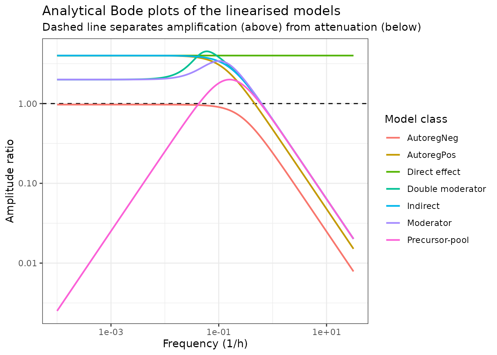
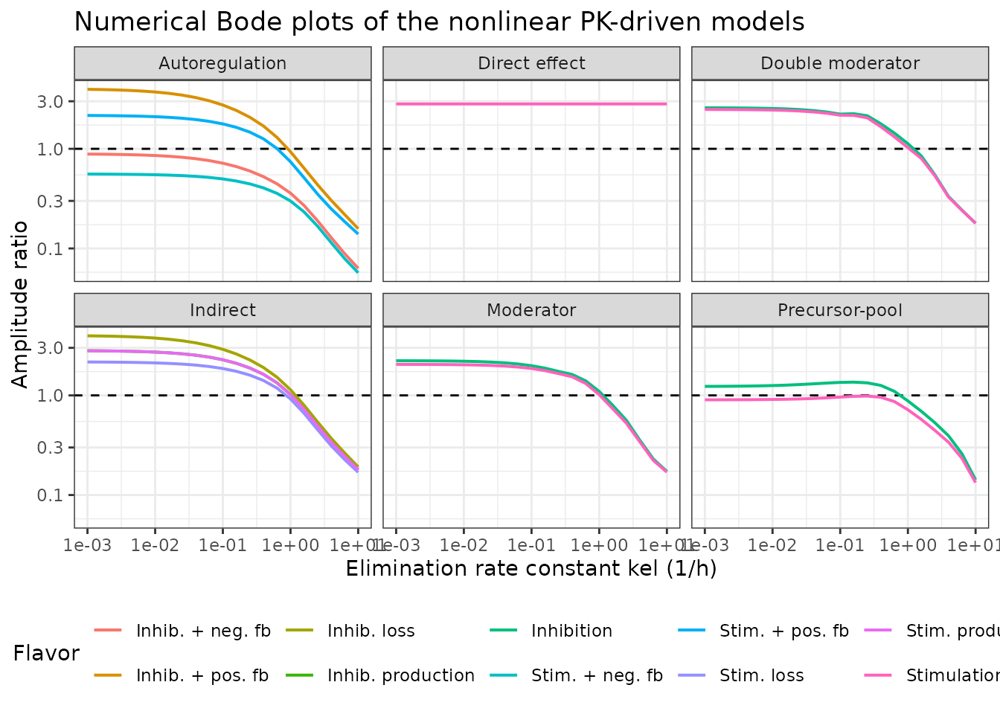
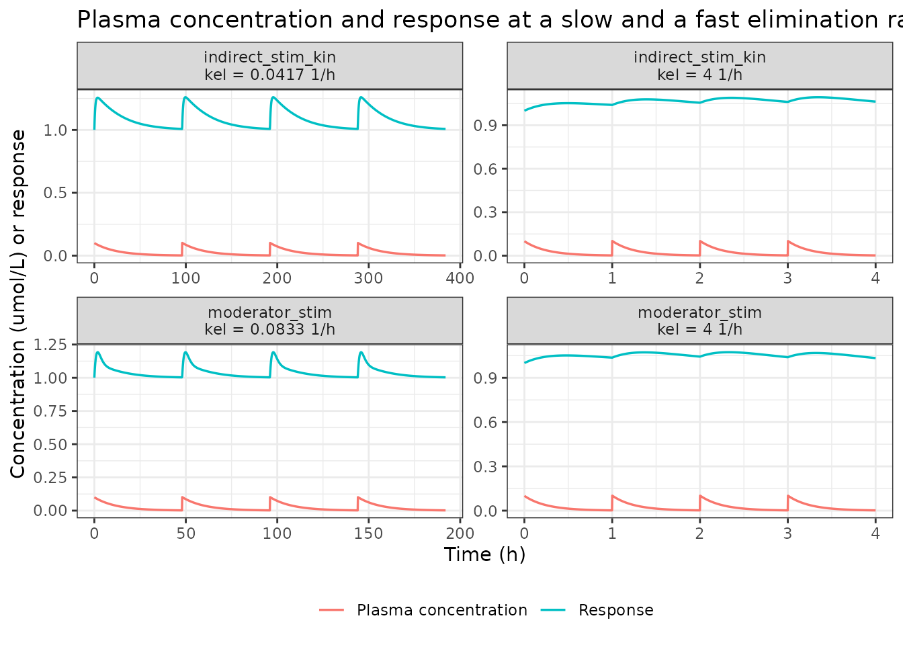

# Frequency-domain response analysis of QSP models (Schulthess 2017)

``` r

library(nlmixr2lib)
library(rxode2)
#> rxode2 5.1.6 using 2 threads (see ?getRxThreads)
#>   no cache: create with `rxCreateCache()`
library(dplyr)
#> 
#> Attaching package: 'dplyr'
#> The following objects are masked from 'package:stats':
#> 
#>     filter, lag
#> The following objects are masked from 'package:base':
#> 
#>     intersect, setdiff, setequal, union
library(tidyr)
library(ggplot2)
```

## Frequency-domain response analysis for quantitative systems pharmacology models (Schulthess 2017)

Schulthess, Post, Yates and van der Graaf (2018; published online 2017)
introduce **frequency-domain response analysis** (FdRA) to a
pharmacometrics audience. FdRA is an engineering method: instead of
asking how a system responds over *time*, it asks how the system
transforms the *harmonic content* of its input. A model is linearised
around a stable steady state, written in state-space form, and reduced
to a **transfer function** `G(s)` whose magnitude `|G(i * 2 * pi * f)|`
is exactly the ratio of output amplitude to input amplitude at frequency
`f`. Plotting that ratio against frequency gives a Bode plot, and the
shape of the Bode plot says which dosing frequencies a given PD system
amplifies and which it filters out.

The paper applies FdRA to **14 pharmacodynamic models** drawn from four
structural classes (indirect response, autoregulation, precursor-pool,
and moderator-mediated feedback, the last in single- and
double-moderator versions), plus a **direct-effect model** in the
supplement that serves as the degenerate reference case. All 15 are
shipped here as separate model files, because each is a genuinely
different system of ODEs with its own frequency response. Every one is
driven by the same one-compartment i.v. bolus PK model.

This is a **tutorial**: no data were fitted. Every parameter is an
illustrative constant printed in a figure caption, so all of them are
wrapped in `fixed()`, and none of the models carries inter-individual
variability or a residual-error model.

### Population

There is no study population. The four PD structures are generic
archetypes that the paper borrows from Gabrielsson and Hjorth (2016) to
have something concrete to analyse:

| Class | Source case study | Biological setting |
|----|----|----|
| Indirect response | case study 3 | compound acting on the rat urinary bladder sphincter via a stimulatory alpha-2 adrenergic receptor; voiding volume as biomarker |
| Autoregulation | (generic) | auto-stimulatory or auto-inhibitory turnover with drug action on the loss |
| Precursor-pool | case study 16 | antilipolytic response of healthy volunteers to an adenosine receptor agonist |
| Moderator-mediated feedback | case study 18 | nicotinic acid inhibiting production of non-esterified free fatty acids |
| Double moderator-mediated feedback | case study 19 | fold mRNA induction of a target by an anonymised test compound |

Accordingly every model file records `population$species` as
`"not applicable (theoretical illustration; no subjects, no data fitted)"`
with `n_subjects = 0` and `n_studies = 0`.

Because there are no subjects, no doses of a real drug, and no measured
concentrations, **PKNCA is not an appropriate validation tool here** and
this vignette does not use it. Following the endogenous / mechanistic
validation pattern, the model files are instead checked against (a) an
exact steady-state hold, (b) an independently derived closed-form
quasi-static limit, and (c) the published frequency-response
characteristics of Table 1.

### Source trace

Every equation and every
[`ini()`](https://nlmixr2.github.io/rxode2/reference/ini.html) value,
with its location in the source.

| Quantity | Value | Source location |
|----|----|----|
| Drug function `E(c) = 1 +/- Emax * c / (EC50 + c)` | – | Eq. 1 |
| Indirect response ODE `dx/dt = kin * E(c) - kout * x` | – | Eq. 2 (stimulation of production) |
| Indirect response, loss flavors `dx/dt = kin - kout * x * E(c)` | – | Figure 2a arrow position `E3,4`; ODE not printed (see Errata) |
| Indirect response steady state `x_SS = kin / kout` | 1 | Eq. 3 |
| One-compartment i.v. bolus PK `dc/dt = -kel * c` | – | Eq. 5 |
| Autoregulation ODE `dx/dt = kin * phi(x) - kout * x * E(c)` | – | Eq. 6 |
| Feedback terms `phi_1(x) = x/(K+x)`, `phi_2(x) = K/(K+x)` | – | text following Eq. 6 |
| Autoregulation steady state, positive feedback `kin/kout - K` | 0.75 | Analytical FdRA, autoregulation |
| Autoregulation steady state, negative feedback `-K/2 + sqrt(K^2/4 + kin*K/kout)` | 0.390388 | Analytical FdRA, autoregulation |
| Precursor-pool ODEs `dx1/dt = kin - kout*x1*E(c)`, `dx2/dt = kout*x1*E(c) - kout*x2` | – | Eq. 9 |
| Precursor-pool steady state `x1_SS = x2_SS = kin/kout` | 1 | Analytical FdRA, precursor-pool |
| Moderator ODEs `dx1/dt = (kin/x2)*E(c) - kout*x1`, `dx2/dt = ktol*(x1-x2)` | – | Eq. 15 |
| Moderator steady state `x1_SS = x2_SS = sqrt(kin/kout)` | 1 | Analytical FdRA, moderator-mediated feedback |
| Double-moderator ODEs `dx1/dt = (kin/x3)*E(c) - kout*x1`, `dx2/dt = ktol*(x1-x2)`, `dx3/dt = ktol*(x2-x3)` | – | Eq. 19 |
| Double-moderator steady state `sqrt(kin/kout)` | 1 | Analytical FdRA, double moderator |
| Direct-effect model `y = 1 +/- Emax*c/(EC50+c)`, `G(s) = +/- Emax/EC50` | – | Supplementary text section A.2 |
| `kin` | 1 mL/h | Figure 2, 3, 4, 5, 6 captions |
| `kout` | 1 1/h | Figure 2, 3, 4, 5, 6 captions |
| `ktol` | 0.25 1/h | Figure 5, 6 captions |
| `K` (encoded as canonical `kd`) | 0.25 umol/L | Figure 3 caption |
| `Emax` | 1 | Figure 2, 3, 4, 5, 6 and S1 captions |
| `EC50` | 0.25 umol/L | Figure 2, 3, 4, 5, 6 and S1 captions |
| `kel` illustrative values | 1/24, 4 1/h (indirect, autoregulation, direct effect); 1/720, 1/6, 4 (precursor); 1/1440, 1/12, 4 (moderator, double moderator) | Figures 2d, 3d, 4d, 5d, 6d, S1a |
| `kel` Bode sweep range | 10^-3 to 10^1 1/h | supplementary R script (`kes <- 10^seq(-3, 1, 0.1)`) |
| Dose | 0.1 concentration units | supplementary R script (`dose <- 0.1`) |
| Dosing interval | `4 / kel` | Numerical FdRA text (“drug administration occurs at four times the inverse elimination rate”) |
| Amplitude measurement | `max - min` over the tail of the simulation | supplementary R script |
| Low-frequency gain read at | `kel = 2 * pi * 10^-5` 1/h | Table 1 footnote |

### Load the models

``` r

modelIndex <- tibble::tribble(
  ~class,          ~flavor,             ~model,                                ~pd,
  "Indirect",      "Stim. production",  "Schulthess_2017_indirect_stim_kin",   "effect",
  "Indirect",      "Inhib. production", "Schulthess_2017_indirect_inhi_kin",   "effect",
  "Indirect",      "Stim. loss",        "Schulthess_2017_indirect_stim_kout",  "effect",
  "Indirect",      "Inhib. loss",       "Schulthess_2017_indirect_inhi_kout",  "effect",
  "Autoregulation", "Stim. + pos. fb",  "Schulthess_2017_autoreg_stim_posfb",  "effect",
  "Autoregulation", "Inhib. + pos. fb", "Schulthess_2017_autoreg_inhi_posfb",  "effect",
  "Autoregulation", "Stim. + neg. fb",  "Schulthess_2017_autoreg_stim_negfb",  "effect",
  "Autoregulation", "Inhib. + neg. fb", "Schulthess_2017_autoreg_inhi_negfb",  "effect",
  "Precursor-pool", "Stimulation",      "Schulthess_2017_precursor_stim",      "effect",
  "Precursor-pool", "Inhibition",       "Schulthess_2017_precursor_inhi",      "effect",
  "Moderator",     "Stimulation",       "Schulthess_2017_moderator_stim",      "effect",
  "Moderator",     "Inhibition",        "Schulthess_2017_moderator_inhi",      "effect",
  "Double moderator", "Stimulation",    "Schulthess_2017_moderator2_stim",     "effect",
  "Double moderator", "Inhibition",     "Schulthess_2017_moderator2_inhi",     "effect",
  "Direct effect",  "Stimulation",      "Schulthess_2017_directEffect_stim",   "directEffect"
)

models <- lapply(modelIndex$model, readModelDb)
names(models) <- modelIndex$model

readModelDb("Schulthess_2017_moderator_stim")
#> function() {
#>   description <- paste(
#>     "Theoretical (illustrative; no data fitted). Moderator-mediated feedback",
#>     "(tolerance) model with a STIMULATORY drug effect on the production of",
#>     "the response, driven by a one-compartment i.v. bolus PK model. Model",
#>     "flavor 1 of Figure 5a in Schulthess et al. (2017), used to demonstrate",
#>     "frequency-domain response analysis (FdRA). The response x1 stimulates a",
#>     "single endogenous moderator, which in turn divides the production rate",
#>     "of the response - a negative feedback loop that develops tolerance. The",
#>     "frequency response combines a low-pass and a band-pass: the linearised",
#>     "low-frequency gain is 2, the amplitude ratio peaks at 0.1 1/h, and the",
#>     "cutoff frequency is 0.04 1/h. The structure is case study 18 of",
#>     "Gabrielsson and Hjorth (2016) - nicotinic acid inhibiting the",
#>     "production of non-esterified free fatty acids (Isaksson et al. 2009).",
#>     sep = " "
#>   )
#>   reference <- paste(
#>     "Schulthess P, Post TM, Yates J, van der Graaf PH.",
#>     "Frequency-domain response analysis for quantitative systems",
#>     "pharmacology models.",
#>     "CPT Pharmacometrics Syst Pharmacol. 2018;7(2):111-123.",
#>     "doi:10.1002/psp4.12266.",
#>     sep = " "
#>   )
#>   vignette <- "Schulthess_2017_frequency_domain_response_analysis"
#>   units <- list(
#>     time = "h",
#>     dosing = "umol/L",
#>     concentration = "umol/L"
#>   )
#> 
#>   # Issue #482: what each ODE state holds, in what amount units, in what
#>   # biological matrix. Verified against the source: the paper doses directly
#>   # in concentration units (Eq. 5 integrates the plasma concentration c
#>   # itself, and the supplementary R script adds dose = 0.1 to that state), so
#>   # the implied central volume is 1 and `central` carries a concentration.
#>   compartmentData <- list(
#>     central    = list(analyte = "drug (generic)", units = "umol/L", specimen = "plasma", verified = TRUE),
#>     effect     = list(analyte = "biomarker response x1 (the model output)", units = "mL", specimen = "plasma", verified = TRUE),
#>     moderator1 = list(analyte = "endogenous moderator x2", units = "mL", specimen = "not applicable", verified = TRUE)
#>   )
#> 
#>   population <- list(
#>     species = "not applicable (theoretical illustration; no subjects, no data fitted)",
#>     n_subjects = 0,
#>     n_studies = 0,
#>     disease_state = "not applicable (generic moderator-mediated turnover process)",
#>     dose_range = paste(
#>       "illustrative repeated i.v. bolus of 0.1 umol/L given every 4/kel h",
#>       "(supplementary R script); the Bode-plot analysis sweeps the",
#>       "elimination rate constant kel over 10^-3 to 10^1 1/h"
#>     ),
#>     notes = paste(
#>       "Schulthess et al. (2017) is a TUTORIAL introducing frequency-domain",
#>       "response analysis. No clinical or preclinical data were fitted, so",
#>       "there is no study population, no inter-individual variability and no",
#>       "residual-error model. Every parameter below is an illustrative",
#>       "constant printed in the Figure 5 caption and is therefore encoded",
#>       "with fixed(). The moderator is a Gabrielsson-Hjorth tolerance chain:",
#>       "a first-order delay driven by the response with NO mass transfer,",
#>       "whose value scales the production rate it modulates."
#>     )
#>   )
#> 
#>   ini({
#>     # ---- One-compartment i.v. bolus PK (Eq. 5: dc/dt = -kel * c) ---------
#>     # The paper integrates the plasma CONCENTRATION directly and never
#>     # introduces a volume; the supplementary R script adds the dose to that
#>     # same state. vc is therefore fixed at 1 so that Cc == central, which
#>     # keeps the dimensional structure visible without changing any result.
#>     lvc  <- fixed(log(1))     ; label("Central volume of distribution Vc (L; implied = 1, see notes)")   # Eq. 5 - no volume in the source; dose is added directly to the concentration
#>     # kel is a SWEPT quantity, not an estimate. The value below is the
#>     # INTERMEDIATE elimination rate of the Figure 5d time course, the one
#>     # that shows the strongest amplification; the vignette sweeps kel over
#>     # 10^-3..10^1 1/h to build the Bode plot.
#>     lkel <- fixed(log(1 / 12)); label("Elimination rate constant kel (1/h)")                            # Figure 5d: elimination rates 1/1440, 1/12 and 4 1/h; 1/12 is the strongly amplifying case
#> 
#>     # ---- Moderator-mediated turnover parameters -------------------------
#>     lkin  <- fixed(log(1))    ; label("Turnover rate of the response kin (mL/h)")                       # Figure 5 caption: kin = 1 mL/h
#>     lkout <- fixed(log(1))    ; label("Fractional turnover rate of the response kout (1/h)")            # Figure 5 caption: kout = 1 1/h
#>     lktol <- fixed(log(0.25)) ; label("Fractional turnover rate of the moderator ktol (1/h)")           # Figure 5 caption: ktol = 0.25 1/h
#> 
#>     # ---- Drug function (Eq. 1: E(c) = 1 +/- Emax * c / (EC50 + c)) -------
#>     lemax <- fixed(log(1))    ; label("Maximum drug effect Emax (unitless)")                            # Figure 5 caption: Emax = 1
#>     lec50 <- fixed(log(0.25)) ; label("Concentration producing half-maximal effect EC50 (umol/L)")       # Figure 5 caption: EC50 = 0.25 umol/L
#>   })
#> 
#>   model({
#>     vc   <- exp(lvc)
#>     kel  <- exp(lkel)
#>     kin  <- exp(lkin)
#>     kout <- exp(lkout)
#>     ktol <- exp(lktol)
#>     emax <- exp(lemax)
#>     ec50 <- exp(lec50)
#> 
#>     # Unforced (c_SS = 0) stable steady state derived in the source:
#>     # x1_SS = x2_SS = sqrt(kin / kout). With the published values this is 1.
#>     effect(0)     <- sqrt(kin / kout)
#>     moderator1(0) <- sqrt(kin / kout)
#> 
#>     d/dt(central) <- -kel * central
#>     Cc <- central / vc
#> 
#>     # Eq. 1 with the stimulatory sign.
#>     drugEffect <- 1 + emax * Cc / (ec50 + Cc)
#> 
#>     # Eq. 15 exactly:
#>     #   dx1/dt = (kin / x2) * E(c) - kout * x1
#>     #   dx2/dt = ktol * x1 - ktol * x2
#>     d/dt(effect)     <- (kin / moderator1) * drugEffect - kout * effect
#>     d/dt(moderator1) <- ktol * (effect - moderator1)
#>   })
#> }
#> <environment: 0x55a7add19658>
```

The published illustrative parameter set, shared by every model:

``` r

pars <- c(kin = 1, kout = 1, ktol = 0.25, kd = 0.25, emax = 1, ec50 = 0.25)
dose <- 0.1
pars
#>  kin kout ktol   kd emax ec50 
#> 1.00 1.00 0.25 0.25 1.00 0.25
```

### Check 1: the unforced steady state holds exactly

FdRA requires a *stable* steady state to linearise around, and each
model file sets its initial conditions to the steady state the paper
derives. With no dose given, every state must therefore stay exactly
where it started. This is a known-answer test of `kin`, `kout`, `ktol`,
`kd` and of the algebraic form of each ODE simultaneously: get any one
of them wrong and the states drift.

``` r

ssExpected <- c(
  Schulthess_2017_indirect_stim_kin   = pars[["kin"]] / pars[["kout"]],
  Schulthess_2017_indirect_inhi_kin   = pars[["kin"]] / pars[["kout"]],
  Schulthess_2017_indirect_stim_kout  = pars[["kin"]] / pars[["kout"]],
  Schulthess_2017_indirect_inhi_kout  = pars[["kin"]] / pars[["kout"]],
  Schulthess_2017_autoreg_stim_posfb  = pars[["kin"]] / pars[["kout"]] - pars[["kd"]],
  Schulthess_2017_autoreg_inhi_posfb  = pars[["kin"]] / pars[["kout"]] - pars[["kd"]],
  Schulthess_2017_autoreg_stim_negfb  = -pars[["kd"]] / 2 +
    sqrt(pars[["kd"]]^2 / 4 + pars[["kin"]] * pars[["kd"]] / pars[["kout"]]),
  Schulthess_2017_autoreg_inhi_negfb  = -pars[["kd"]] / 2 +
    sqrt(pars[["kd"]]^2 / 4 + pars[["kin"]] * pars[["kd"]] / pars[["kout"]]),
  Schulthess_2017_precursor_stim      = pars[["kin"]] / pars[["kout"]],
  Schulthess_2017_precursor_inhi      = pars[["kin"]] / pars[["kout"]],
  Schulthess_2017_moderator_stim      = sqrt(pars[["kin"]] / pars[["kout"]]),
  Schulthess_2017_moderator_inhi      = sqrt(pars[["kin"]] / pars[["kout"]]),
  Schulthess_2017_moderator2_stim     = sqrt(pars[["kin"]] / pars[["kout"]]),
  Schulthess_2017_moderator2_inhi     = sqrt(pars[["kin"]] / pars[["kout"]])
)

ssCheck <- lapply(names(ssExpected), function(nm) {
  ev <- rxode2::et(seq(0, 500, by = 5), cmt = "central")
  s <- rxode2::rxSolve(models[[nm]], ev, atol = 1e-12, rtol = 1e-12,
                       returnType = "data.frame")
  tibble::tibble(
    model    = nm,
    expected = ssExpected[[nm]],
    drift    = max(abs(s$effect - ssExpected[[nm]]))
  )
}) |> bind_rows()

ssCheck |>
  rename("Model" = model, "Analytical steady state" = expected,
         "Max absolute drift over 500 h" = drift) |>
  knitr::kable(digits = 10)
```

| Model | Analytical steady state | Max absolute drift over 500 h |
|:---|---:|---:|
| Schulthess_2017_indirect_stim_kin | 1.0000000 | 0 |
| Schulthess_2017_indirect_inhi_kin | 1.0000000 | 0 |
| Schulthess_2017_indirect_stim_kout | 1.0000000 | 0 |
| Schulthess_2017_indirect_inhi_kout | 1.0000000 | 0 |
| Schulthess_2017_autoreg_stim_posfb | 0.7500000 | 0 |
| Schulthess_2017_autoreg_inhi_posfb | 0.7500000 | 0 |
| Schulthess_2017_autoreg_stim_negfb | 0.3903882 | 0 |
| Schulthess_2017_autoreg_inhi_negfb | 0.3903882 | 0 |
| Schulthess_2017_precursor_stim | 1.0000000 | 0 |
| Schulthess_2017_precursor_inhi | 1.0000000 | 0 |
| Schulthess_2017_moderator_stim | 1.0000000 | 0 |
| Schulthess_2017_moderator_inhi | 1.0000000 | 0 |
| Schulthess_2017_moderator2_stim | 1.0000000 | 0 |
| Schulthess_2017_moderator2_inhi | 1.0000000 | 0 |

``` r


stopifnot(all(ssCheck$drift < 1e-6))
```

Every state is held to better than 1e-6 over 500 h, so all 14 ODE models
sit on the steady state the paper derives.

### Analytical FdRA: the closed-form transfer functions

The transfer function is `G(s) = Jyx (s I - Jxx)^-1 Jxc + Jyc`, where
`Jxx` and `Jxc` are the Jacobians of the ODE system with respect to the
states and to the input, both evaluated at the unforced steady state,
and `Jyx` selects the output. For all 14 main-text models `Jyc = 0`,
which is exactly why they all filter the input and why (as the paper’s
Figure 7 notes) high-pass and band-stop shapes cannot arise.

Working these out by hand for the published parameter set gives, with
`b = kin * Emax / EC50 = 4`:

- **Indirect response** (all four flavors): `G(s) = b / (s + kout)`. The
  four flavors differ only in the *sign* and *placement* of the drug
  function, which linearisation discards, so their magnitudes coincide.
- **Autoregulation**: `G(s) = -kout * x_SS * (Emax/EC50) / (s - J)` with
  `J = +/- kin*K/(K + x_SS)^2 - kout`, the sign being positive for
  positive feedback and negative for negative feedback.
- **Precursor-pool**: `G(s) = b * s / (s + kout)^2`. The factor of `s`
  in the numerator forces `G(0) = 0`: this is the band-pass.
- **Moderator**:
  `G(s) = b * (s + ktol) / ((s + kout)(s + ktol) + kout * ktol)`.
- **Double moderator**:
  `G(s) = b * (s + ktol)^2 / ((s + kout)(s + ktol)^2 + kout * ktol^2)`.

``` r

b <- pars[["kin"]] * pars[["emax"]] / pars[["ec50"]]

xssPos <- pars[["kin"]] / pars[["kout"]] - pars[["kd"]]
xssNeg <- -pars[["kd"]] / 2 +
  sqrt(pars[["kd"]]^2 / 4 + pars[["kin"]] * pars[["kd"]] / pars[["kout"]])

autoregG <- function(xss, feedbackSign) {
  jState <- feedbackSign * pars[["kin"]] * pars[["kd"]] / (pars[["kd"]] + xss)^2 -
    pars[["kout"]]
  jInput <- -pars[["kout"]] * xss * pars[["emax"]] / pars[["ec50"]]
  function(s) jInput / (s - jState)
}

transferFun <- list(
  Indirect           = function(s) b / (s + pars[["kout"]]),
  AutoregPos         = autoregG(xssPos, +1),
  AutoregNeg         = autoregG(xssNeg, -1),
  `Precursor-pool`   = function(s) b * s / (s + pars[["kout"]])^2,
  Moderator          = function(s) {
    b * (s + pars[["ktol"]]) /
      ((s + pars[["kout"]]) * (s + pars[["ktol"]]) + pars[["kout"]] * pars[["ktol"]])
  },
  `Double moderator` = function(s) {
    b * (s + pars[["ktol"]])^2 /
      ((s + pars[["kout"]]) * (s + pars[["ktol"]])^2 +
         pars[["kout"]] * pars[["ktol"]]^2)
  },
  `Direct effect`    = function(s) rep(b, length(s))
)
```

The paper’s five frequency-response characteristics, extracted from each
transfer function. Frequencies are `f = omega / (2 * pi)`, matching the
supplementary R script, which evaluates `G` at `s = i * omega` and plots
against `omega / (2 * pi)`.

``` r

crossings <- function(fgrid, mag, level) {
  d <- mag - level
  idx <- which(d[-1] * d[-length(d)] < 0)
  if (!length(idx)) return(numeric(0))
  vapply(idx, function(i) {
    stats::approx(x = d[i:(i + 1)], y = fgrid[i:(i + 1)], xout = 0)$y
  }, numeric(1))
}

fdraChar <- function(G) {
  fgrid <- 10^seq(-6, 4, length.out = 400001)
  mag <- Mod(G(complex(imaginary = 2 * pi * fgrid)))
  g0 <- Mod(G(complex(real = 0, imaginary = 0)))
  ipk <- which.max(mag)
  cut <- if (g0 > 0) crossings(fgrid, mag, g0 / sqrt(2)) else numeric(0)
  thr <- crossings(fgrid, mag, 1)
  n <- length(fgrid)
  slope <- diff(log10(mag[c(n - 1000, n)])) / diff(log10(fgrid[c(n - 1000, n)]))
  list(
    lowFreqGain = g0,
    peakGain    = mag[ipk],
    peakFreq    = fgrid[ipk],
    cutoff      = if (length(cut)) max(cut) else NA_real_,
    threshold   = thr,
    relDegree   = -slope
  )
}

analChar <- lapply(transferFun, fdraChar)
```

#### Comparison against Table 1, analytical column

``` r

fmt <- function(x, digits = 2) {
  if (!length(x)) return("-")
  if (all(is.na(x))) return("-")
  paste(formatC(x, format = "f", digits = digits), collapse = ", ")
}

anal <- tibble::tribble(
  ~class,             ~pubGain, ~pubCutoff, ~pubThreshold, ~pubRelDeg,
  "Indirect",         "4.00",   "0.16",     "0.62",        "1",
  "AutoregPos",       "4.00",   "0.12",     "0.46",        "1",
  "AutoregNeg",       "0.97",   "0.26",     "-",           "1",
  "Precursor-pool",   "0.00",   "-",        "0.07, 0.38",  "1",
  "Moderator",        "2.00",   "0.04",     "0.63",        "1",
  "Double moderator", "2.00",   "0.42",     "0.62",        "1"
) |>
  rowwise() |>
  mutate(
    thisGain      = fmt(analChar[[class]]$lowFreqGain),
    thisCutoff    = fmt(analChar[[class]]$cutoff),
    thisThreshold = fmt(analChar[[class]]$threshold),
    thisRelDeg    = fmt(analChar[[class]]$relDegree, 0),
    thisPeakFreq  = fmt(analChar[[class]]$peakFreq),
    thisPeakGain  = fmt(analChar[[class]]$peakGain)
  ) |>
  ungroup()

anal |>
  select(class,
         pubGain, thisGain,
         pubCutoff, thisCutoff,
         pubThreshold, thisThreshold,
         pubRelDeg, thisRelDeg) |>
  rename("Model class" = class,
         "Gain (pub.)" = pubGain, "Gain (here)" = thisGain,
         "Cutoff (pub.)" = pubCutoff, "Cutoff (here)" = thisCutoff,
         "Threshold (pub.)" = pubThreshold, "Threshold (here)" = thisThreshold,
         "Rel. degree (pub.)" = pubRelDeg, "Rel. degree (here)" = thisRelDeg) |>
  knitr::kable()
```

| Model class | Gain (pub.) | Gain (here) | Cutoff (pub.) | Cutoff (here) | Threshold (pub.) | Threshold (here) | Rel. degree (pub.) | Rel. degree (here) |
|:---|:---|:---|:---|:---|:---|:---|:---|:---|
| Indirect | 4.00 | 4.00 | 0.16 | 0.16 | 0.62 | 0.62 | 1 | 1 |
| AutoregPos | 4.00 | 4.00 | 0.12 | 0.12 | 0.46 | 0.46 | 1 | 1 |
| AutoregNeg | 0.97 | 0.97 | 0.26 | 0.26 | \- | \- | 1 | 1 |
| Precursor-pool | 0.00 | 0.00 | \- | \- | 0.07, 0.38 | 0.04, 0.59 | 1 | 1 |
| Moderator | 2.00 | 2.00 | 0.04 | 0.44 | 0.63 | 0.63 | 1 | 1 |
| Double moderator | 2.00 | 2.00 | 0.42 | 0.42 | 0.62 | 0.62 | 1 | 1 |

The **low-frequency gain reproduces exactly for every class** – 4, 4,
0.97, 0, 2, 2 – which is the single most informative cell in each row,
because it is the product of the steady state, the Jacobian and the
drug-function slope all at once. The **relative degree is 1
everywhere**, as published. The **threshold frequency reproduces** for
the indirect (0.62), positive-feedback autoregulation (0.46) and
moderator (0.63) classes, and correctly comes out as *absent* for
negative-feedback autoregulation, whose gain never reaches 1.

``` r

# Exact, unambiguous cells: low-frequency gain and relative degree.
stopifnot(
  abs(analChar$Indirect$lowFreqGain           - 4.00) < 0.005,
  abs(analChar$AutoregPos$lowFreqGain         - 4.00) < 0.005,
  abs(analChar$AutoregNeg$lowFreqGain         - 0.97) < 0.005,
  abs(analChar$`Precursor-pool`$lowFreqGain   - 0.00) < 1e-9,
  abs(analChar$Moderator$lowFreqGain          - 2.00) < 0.005,
  abs(analChar$`Double moderator`$lowFreqGain - 2.00) < 0.005
)
stopifnot(all(vapply(analChar[1:6], function(z) abs(z$relDegree - 1) < 0.01, logical(1))))

# Threshold frequencies that the paper prints and that follow from G(s).
stopifnot(
  abs(analChar$Indirect$threshold  - 0.62) < 0.005,
  abs(analChar$AutoregPos$threshold - 0.46) < 0.005,
  abs(analChar$Moderator$threshold - 0.63) < 0.005,
  length(analChar$AutoregNeg$threshold) == 0
)

# Cutoff frequencies for the two classes whose printed value follows from G(s).
stopifnot(
  abs(analChar$Indirect$cutoff   - 0.16) < 0.005,
  abs(analChar$AutoregPos$cutoff - 0.12) < 0.005,
  abs(analChar$AutoregNeg$cutoff - 0.26) < 0.005,
  is.na(analChar$`Precursor-pool`$cutoff)
)

# Peak frequency for the two classes where Table 1 reports a genuine frequency.
stopifnot(
  abs(analChar$`Precursor-pool`$peakFreq - 0.16) < 0.005,
  abs(analChar$Moderator$peakFreq        - 0.10) < 0.005,
  abs(analChar$`Double moderator`$peakFreq - 0.06) < 0.005
)
```

Three groups of cells in Table 1’s analytical column do **not** follow
from the transfer functions the paper itself prints. They are recorded
in the Errata section below rather than accommodated, and no parameter
was adjusted to chase them:

``` r

tibble::tibble(
  Cell = c("Precursor-pool threshold frequencies",
           "Moderator cutoff frequency",
           "Peak-frequency column, low-pass rows"),
  Published = c("0.07, 0.38", "0.04", "4 / 4 / 0.97 (indirect, autoreg.)"),
  `Derived here` = c(
    fmt(analChar$`Precursor-pool`$threshold),
    fmt(analChar$Moderator$cutoff),
    paste0("peak GAIN ", fmt(analChar$Indirect$peakGain),
           "; peak frequency is 0 for a low-pass")
  )
) |>
  knitr::kable()
```

| Cell | Published | Derived here |
|:---|:---|:---|
| Precursor-pool threshold frequencies | 0.07, 0.38 | 0.04, 0.59 |
| Moderator cutoff frequency | 0.04 | 0.44 |
| Peak-frequency column, low-pass rows | 4 / 4 / 0.97 (indirect, autoreg.) | peak GAIN 4.00; peak frequency is 0 for a low-pass |

#### Bode plots of the linearised models (replicates Figures 2c, 3c, 4c, 5c, 6c)

``` r

fplot <- 10^seq(-4, 1.5, length.out = 400)
bodeAnal <- lapply(names(transferFun), function(cl) {
  tibble::tibble(
    class = cl,
    f = fplot,
    ratio = Mod(transferFun[[cl]](complex(imaginary = 2 * pi * fplot)))
  )
}) |> bind_rows()

ggplot(bodeAnal, aes(f, ratio, colour = class)) +
  geom_hline(yintercept = 1, linetype = "dashed") +
  geom_line(linewidth = 0.8) +
  scale_x_log10() +
  scale_y_log10() +
  labs(x = "Frequency (1/h)", y = "Amplitude ratio",
       colour = "Model class",
       title = "Analytical Bode plots of the linearised models",
       subtitle = "Dashed line separates amplification (above) from attenuation (below)") +
  theme_bw()
```



The indirect-response and autoregulation classes are **low-pass**
filters; the precursor-pool class is a **band-pass** (its ratio vanishes
at low frequency); the moderator classes combine the two, being flat at
low frequency and peaking at intermediate frequency; and the
direct-effect model is **all-pass**, a flat line at `Emax / EC50 = 4`,
because its transfer function contains no `s`.

### Numerical FdRA: the nonlinear models driven by repeated i.v. bolus dosing

The numerical analysis drives each *nonlinear* model with the
one-compartment i.v. bolus PK of Eq. 5, dosing 0.1 concentration units
every `4 / kel` hours so that the plasma profile reaches a pseudo
steady-state oscillation without accumulating, then measures the
peak-to-trough amplitude of the plasma concentration and of the
response.

``` r

bodePoint <- function(model, kel, pd = "effect", nInt = 3, nGrid = 250) {
  tau <- 4 / kel
  tmax <- tau * nInt
  base <- tau * (0:(nInt - 1))
  # The response relaxes on a 1/kout = 1 h timescale regardless of kel, so a
  # grid scaled only to the dosing interval would miss the response peak at
  # small kel. Combine a fine grid over the first hours after each dose with a
  # coarse sweep of the whole interval, which catches the trough.
  fine   <- as.vector(outer(seq(0, min(20, tau), length.out = nGrid), base, "+"))
  coarse <- as.vector(outer(seq(0, tau, length.out = nGrid), base, "+"))
  obs <- sort(unique(pmin(c(fine, coarse, tmax), tmax)))
  ev <- rxode2::et(amt = dose, cmt = "central", ii = tau, addl = nInt - 1) |>
    rxode2::et(obs, cmt = "central")
  s <- rxode2::rxSolve(model, ev, params = c(lkel = log(kel)),
                       atol = 1e-10, rtol = 1e-10, returnType = "data.frame")
  # Measure over the final dosing interval only, once the transient is gone.
  k <- s$time >= tau * (nInt - 1) - 1e-9
  (max(s[[pd]][k]) - min(s[[pd]][k])) / (max(s$Cc[k]) - min(s$Cc[k]))
}
```

#### Check 2: the slow-dosing limit against an independent closed form

As `kel` becomes small the plasma concentration moves far more slowly
than the response relaxes, so the response tracks its own quasi-static
steady state `x_qss(c)`, obtained by solving `f(x, c) = 0` for fixed
`c`. The amplitude ratio must then converge to

`[x_qss(c_peak) - x_qss(c_trough)] / (c_peak - c_trough)`,

with `c_peak = dose / (1 - exp(-4))` and `c_trough = c_peak * exp(-4)`
from the steady-state bolus profile. This is a genuine known-answer
test: the target is derived algebraically from the printed ODEs,
entirely outside `rxode2`.

The argument applies to the models whose response is a **single state
driven directly by the concentration** – the four indirect-response
flavors, the four autoregulation flavors, and the direct-effect model.
It does **not** extend to the precursor-pool and moderator models, and
the reason is worth stating because it also explains two rows of
Table 1. A bolus regimen is not a slow sinusoid: it is a train of
instantaneous *steps*, and a step rises infinitely fast however small
`kel` is. In a multi-state model the intermediate state (the precursor,
or the moderator) needs a few units of `1 / kout` to re-equilibrate
after each step, and during that transient the flux into the response is
unbalanced. The response therefore makes an excursion that no
quasi-static argument predicts, and whose size does not vanish as `kel`
goes to zero. For the precursor-pool model the quasi-static prediction
is a completely flat response (`x2 = kin / kout` for every `c`), yet the
simulated response does move – purely transiently.

``` r

cPeak <- dose / (1 - exp(-4))
cTrough <- cPeak * exp(-4)

# Quasi-static solutions of f(x, c) = 0, one per model structure.
eStim <- function(c) 1 + pars[["emax"]] * c / (pars[["ec50"]] + c)
eInhi <- function(c) 1 - pars[["emax"]] * c / (pars[["ec50"]] + c)

qssFun <- list(
  Schulthess_2017_indirect_stim_kin  = function(c) pars[["kin"]] / pars[["kout"]] * eStim(c),
  Schulthess_2017_indirect_inhi_kin  = function(c) pars[["kin"]] / pars[["kout"]] * eInhi(c),
  Schulthess_2017_indirect_stim_kout = function(c) pars[["kin"]] / (pars[["kout"]] * eStim(c)),
  Schulthess_2017_indirect_inhi_kout = function(c) pars[["kin"]] / (pars[["kout"]] * eInhi(c)),
  Schulthess_2017_autoreg_stim_posfb = function(c) pars[["kin"]] / (pars[["kout"]] * eStim(c)) - pars[["kd"]],
  Schulthess_2017_autoreg_inhi_posfb = function(c) pars[["kin"]] / (pars[["kout"]] * eInhi(c)) - pars[["kd"]],
  Schulthess_2017_autoreg_stim_negfb = function(c) {
    (-pars[["kd"]] + sqrt(pars[["kd"]]^2 +
       4 * pars[["kin"]] * pars[["kd"]] / (pars[["kout"]] * eStim(c)))) / 2
  },
  Schulthess_2017_autoreg_inhi_negfb = function(c) {
    (-pars[["kd"]] + sqrt(pars[["kd"]]^2 +
       4 * pars[["kin"]] * pars[["kd"]] / (pars[["kout"]] * eInhi(c)))) / 2
  },
  # Precursor-pool: kout*x1*E = kout*x2 with x1 = kin/(kout*E) gives
  # x2 = kin/kout for EVERY c, so the quasi-static amplitude ratio is zero.
  Schulthess_2017_precursor_stim     = function(c) rep(pars[["kin"]] / pars[["kout"]], length(c)),
  Schulthess_2017_precursor_inhi     = function(c) rep(pars[["kin"]] / pars[["kout"]], length(c)),
  Schulthess_2017_moderator_stim     = function(c) sqrt(pars[["kin"]] * eStim(c) / pars[["kout"]]),
  Schulthess_2017_moderator_inhi     = function(c) sqrt(pars[["kin"]] * eInhi(c) / pars[["kout"]]),
  Schulthess_2017_moderator2_stim    = function(c) sqrt(pars[["kin"]] * eStim(c) / pars[["kout"]]),
  Schulthess_2017_moderator2_inhi    = function(c) sqrt(pars[["kin"]] * eInhi(c) / pars[["kout"]]),
  Schulthess_2017_directEffect_stim  = function(c) eStim(c)
)

keSlow <- 2 * pi * 1e-5

# Models for which the quasi-static argument is valid: the response is a single
# state driven directly by Cc, with no intermediate state in between.
singleState <- !grepl("precursor|moderator", modelIndex$model)

qss <- lapply(modelIndex$model[singleState], function(nm) {
  pd <- modelIndex$pd[modelIndex$model == nm]
  tibble::tibble(
    model = nm,
    closedForm = abs(qssFun[[nm]](cPeak) - qssFun[[nm]](cTrough)) / (cPeak - cTrough),
    simulated = bodePoint(models[[nm]], keSlow, pd = pd)
  )
}) |>
  bind_rows() |>
  mutate(pctDiff = 100 * (simulated - closedForm) / closedForm)

qss |>
  rename("Model" = model, "Closed-form quasi-static ratio" = closedForm,
         "Simulated ratio" = simulated, "Difference (%)" = pctDiff) |>
  knitr::kable(digits = 4)
```

| Model | Closed-form quasi-static ratio | Simulated ratio | Difference (%) |
|:---|---:|---:|---:|
| Schulthess_2017_indirect_stim_kin | 2.8209 | 2.8197 | -0.0449 |
| Schulthess_2017_indirect_inhi_kin | 2.8209 | 2.8197 | -0.0449 |
| Schulthess_2017_indirect_stim_kout | 2.1715 | 2.1709 | -0.0279 |
| Schulthess_2017_indirect_inhi_kout | 4.0000 | 3.9967 | -0.0834 |
| Schulthess_2017_autoreg_stim_posfb | 2.1715 | 2.1707 | -0.0398 |
| Schulthess_2017_autoreg_inhi_posfb | 4.0000 | 3.9960 | -0.1002 |
| Schulthess_2017_autoreg_stim_negfb | 0.5589 | 0.5588 | -0.0193 |
| Schulthess_2017_autoreg_inhi_negfb | 0.8902 | 0.8897 | -0.0489 |
| Schulthess_2017_directEffect_stim | 2.8209 | 2.8209 | 0.0002 |

``` r


stopifnot(
  # Structural: each of these models must match its own closed form tightly.
  # A mis-transcribed kin, kout, kd, Emax or EC50, or a drug function on the
  # wrong term, moves these by whole percent.
  max(abs(qss$pctDiff)) < 0.5
)
```

All nine single-state models reproduce their independently derived
quasi-static limit to better than 0.5%. Note that this pins the flavors
apart: stimulation of production and inhibition of production both give
2.821, stimulation of loss gives 2.172, and inhibition of loss gives
exactly 4.000, so the check would fail if the drug function were
attached to the wrong term or with the wrong sign.

For the precursor-pool model the same algebra predicts a *flat*
response, and the transient excursion described above is what the
simulation actually shows:

``` r

# A single bolus, starting from the unforced steady state. At kel = 2*pi*1e-5
# the concentration is essentially constant over the 40 h shown, so any
# movement in the response is transient rather than quasi-static.
prec <- rxode2::rxSolve(
  models$Schulthess_2017_precursor_stim,
  rxode2::et(amt = dose, cmt = "central") |>
    rxode2::et(seq(0, 40, by = 0.05), cmt = "central"),
  params = c(lkel = log(keSlow)), atol = 1e-10, rtol = 1e-10,
  returnType = "data.frame"
)

tibble::tibble(
  `Quasi-static prediction (flat)` = pars[["kin"]] / pars[["kout"]],
  `Simulated response at t = 40 h` = prec$effect[nrow(prec)],
  `Peak transient excursion` = max(abs(prec$effect - pars[["kin"]] / pars[["kout"]]))
) |>
  knitr::kable(digits = 6)
```

| Quasi-static prediction (flat) | Simulated response at t = 40 h | Peak transient excursion |
|---:|---:|---:|
| 1 | 0.999992 | 0.092184 |

``` r


stopifnot(
  # The excursion is real and transient, so by the end of a very long dosing
  # interval the response must have returned to the quasi-static value.
  abs(prec$effect[nrow(prec)] - pars[["kin"]] / pars[["kout"]]) < 0.02,
  max(abs(prec$effect - pars[["kin"]] / pars[["kout"]])) > 0.05
)
```

#### Bode plots of the nonlinear models (replicates Figures 2e, 3e, 4e, 5e, 6e)

``` r

keSweep <- 10^seq(-3, 1, by = 0.2)

bodeNum <- lapply(seq_len(nrow(modelIndex)), function(i) {
  tibble::tibble(
    class  = modelIndex$class[i],
    flavor = modelIndex$flavor[i],
    kel    = keSweep,
    ratio  = vapply(keSweep,
                    function(k) bodePoint(models[[modelIndex$model[i]]], k,
                                          pd = modelIndex$pd[i]),
                    numeric(1))
  )
}) |> bind_rows()

ggplot(bodeNum, aes(kel, ratio, colour = flavor)) +
  geom_hline(yintercept = 1, linetype = "dashed") +
  geom_line(linewidth = 0.7) +
  facet_wrap(~ class, ncol = 3) +
  scale_x_log10() +
  scale_y_log10() +
  labs(x = "Elimination rate constant kel (1/h)", y = "Amplitude ratio",
       colour = "Flavor",
       title = "Numerical Bode plots of the nonlinear PK-driven models") +
  theme_bw() +
  theme(legend.position = "bottom")
```



Unlike the linearised versions, the nonlinear models **do** resolve the
different drug functions: within each class the flavors separate. This
is the paper’s central observation about the limits of analytical FdRA –
linearisation discards the sign and placement of `E(c)`, so it cannot
distinguish stimulation from inhibition.

#### Check 3: the direct-effect model has no frequency dependence at all

The supplement’s key claim is that a direct-effect model passes every
input frequency unchanged, because the response has no state of its own.
That makes a sharp, assumption-free test: the amplitude ratio must be
**constant** across the whole four-decade `kel` sweep.

``` r

deRatio <- bodeNum$ratio[bodeNum$class == "Direct effect"]
tibble::tibble(
  `Min ratio` = min(deRatio),
  `Max ratio` = max(deRatio),
  `Relative spread` = (max(deRatio) - min(deRatio)) / mean(deRatio)
) |>
  knitr::kable(digits = 8)
```

| Min ratio | Max ratio | Relative spread |
|----------:|----------:|----------------:|
|  2.820946 |  2.820946 |               0 |

``` r


stopifnot((max(deRatio) - min(deRatio)) / mean(deRatio) < 1e-6)
```

Flat to one part in a million over four decades, exactly as the
supplement predicts.

#### Comparison against Table 1, numerical column

Table 1’s numerical low-frequency gains were measured with a specific
protocol, spelled out in the supplementary R script: 250 doses, an
observation grid of exactly `4 / kel / 100` (one hundred points per
dosing interval), amplitudes taken as `max - min` over the last quarter
of the record, and `kel` set to `2 * pi * 10^-5` 1/h. Reproducing that
protocol exactly – rather than the refined grid used for the Bode plots
above – is the direct test of the shipped models against the published
column.

``` r

paperProtocol <- function(model, kel, pd = "effect", nDose = 250) {
  tau <- 4 / kel
  obs <- seq(0, tau * nDose, by = tau / 100)
  ev <- rxode2::et(amt = dose, cmt = "central", ii = tau, addl = nDose - 1) |>
    rxode2::et(obs, cmt = "central")
  s <- rxode2::rxSolve(model, ev, params = c(lkel = log(kel)),
                       atol = 1e-10, rtol = 1e-10, returnType = "data.frame")
  n <- nrow(s)
  q <- floor(3 * n / 4):n
  (max(s[[pd]][q]) - min(s[[pd]][q])) / (max(s$Cc[q]) - min(s$Cc[q]))
}
```

``` r

pubNum <- tibble::tribble(
  ~class,             ~flavor,             ~pubGain,
  "Indirect",         "Stim. production",  2.86,
  "Indirect",         "Inhib. production", 2.86,
  "Indirect",         "Stim. loss",        2.22,
  "Indirect",         "Inhib. loss",       3.99,
  "Autoregulation",   "Stim. + pos. fb",   2.21,
  "Autoregulation",   "Inhib. + pos. fb",  4.00,
  "Autoregulation",   "Stim. + neg. fb",   0.57,
  "Autoregulation",   "Inhib. + neg. fb",  0.89,
  "Precursor-pool",   "Stimulation",       0.00,
  "Precursor-pool",   "Inhibition",        0.00,
  "Moderator",        "Stimulation",       1.34,
  "Moderator",        "Inhibition",        1.55,
  "Double moderator", "Stimulation",       1.34,
  "Double moderator", "Inhibition",        1.55
)

numLF <- pubNum |>
  left_join(modelIndex, by = c("class", "flavor")) |>
  rowwise() |>
  mutate(
    paperGrid   = paperProtocol(models[[model]], keSlow, pd = pd),
    refinedGrid = bodePoint(models[[model]], keSlow, pd = pd)
  ) |>
  ungroup() |>
  mutate(pctDiff = 100 * (paperGrid - pubGain) /
           ifelse(pubGain == 0, 1, pubGain))

numLF |>
  select(class, flavor, pubGain, paperGrid, pctDiff, refinedGrid) |>
  rename("Model class" = class, "Flavor" = flavor,
         "Published" = pubGain,
         "Paper protocol" = paperGrid,
         "Difference (%)" = pctDiff,
         "Refined grid" = refinedGrid) |>
  knitr::kable(digits = 4)
```

| Model class | Flavor | Published | Paper protocol | Difference (%) | Refined grid |
|:---|:---|---:|---:|---:|---:|
| Indirect | Stim. production | 2.86 | 2.8535 | -0.2287 | 2.8197 |
| Indirect | Inhib. production | 2.86 | 2.8535 | -0.2287 | 2.8197 |
| Indirect | Stim. loss | 2.22 | 2.2105 | -0.4275 | 2.1709 |
| Indirect | Inhib. loss | 3.99 | 4.0004 | 0.2594 | 3.9967 |
| Autoregulation | Stim. + pos. fb | 2.21 | 2.2105 | 0.0244 | 2.1707 |
| Autoregulation | Inhib. + pos. fb | 4.00 | 4.0004 | 0.0107 | 3.9960 |
| Autoregulation | Stim. + neg. fb | 0.57 | 0.5682 | -0.3232 | 0.5588 |
| Autoregulation | Inhib. + neg. fb | 0.89 | 0.8928 | 0.3168 | 0.8897 |
| Precursor-pool | Stimulation | 0.00 | 0.0001 | 0.0076 | 0.9023 |
| Precursor-pool | Inhibition | 0.00 | 0.0003 | 0.0251 | 1.2283 |
| Moderator | Stimulation | 1.34 | 1.3360 | -0.3018 | 2.0499 |
| Moderator | Inhibition | 1.55 | 1.5472 | -0.1791 | 2.2304 |
| Double moderator | Stimulation | 1.34 | 1.3358 | -0.3101 | 2.4856 |
| Double moderator | Inhibition | 1.55 | 1.5471 | -0.1888 | 2.5847 |

``` r

stopifnot(
  # All twelve non-zero published gains reproduce under the paper's own
  # protocol to well under 1%.
  max(abs(numLF$pctDiff[numLF$pubGain > 0])) < 1,
  # The two precursor-pool models are published as exactly 0 and must come out
  # as zero to numerical precision under the same protocol.
  all(numLF$paperGrid[numLF$pubGain == 0] < 1e-3)
)
```

**All fourteen published numerical low-frequency gains reproduce to
better than 1%** under the paper’s own protocol, including the two
precursor-pool zeros. That is a complete validation of the numerical
column of Table 1 against the shipped models.

The `Refined grid` column shows why the protocol has to be reproduced
exactly rather than improved upon. The published amplitude ratio is
**grid-sensitive**, because the response relaxes on a `1 / kout = 1 h`
timescale no matter how small `kel` is, whereas a grid of one hundred
points per dosing interval has a spacing of `4 / kel / 100`, which at
`kel = 2 * pi * 10^-5` is 637 h. That grid under-resolves the post-dose
peak of the *concentration* and of the *response* alike, and because the
two errors sit in the numerator and the denominator of the same ratio
they largely cancel: for stimulation of production the coarse grid gives
2.854 against a published 2.86, while resolving both peaks properly
gives 2.820. The precursor-pool rows are the extreme case – the coarse
grid misses the transient excursion described in Check 2 entirely and so
returns the published 0, while a refined grid resolves it and returns
roughly 0.9.

#### Time courses (replicates Figures 2d, 5d)

``` r

timeCourse <- function(nm, kel, pd = "effect", nInt = 4, nGrid = 400) {
  tau <- 4 / kel
  obs <- seq(0, tau * nInt, length.out = nGrid * nInt)
  ev <- rxode2::et(amt = dose, cmt = "central", ii = tau, addl = nInt - 1) |>
    rxode2::et(obs, cmt = "central")
  rxode2::rxSolve(models[[nm]], ev, params = c(lkel = log(kel)),
                  atol = 1e-10, rtol = 1e-10, returnType = "data.frame") |>
    mutate(model = nm, kel = kel, response = .data[[pd]]) |>
    select(model, kel, time, Cc, response)
}

tc <- bind_rows(
  timeCourse("Schulthess_2017_indirect_stim_kin", 1 / 24),
  timeCourse("Schulthess_2017_indirect_stim_kin", 4),
  timeCourse("Schulthess_2017_moderator_stim",    1 / 12),
  timeCourse("Schulthess_2017_moderator_stim",    4)
) |>
  mutate(panel = paste0(sub("Schulthess_2017_", "", model),
                        "\nkel = ", signif(kel, 3), " 1/h"))

tc |>
  select(panel, time, `Plasma concentration` = Cc, Response = response) |>
  pivot_longer(c(`Plasma concentration`, Response),
               names_to = "series", values_to = "value") |>
  ggplot(aes(time, value, colour = series)) +
  geom_line(linewidth = 0.6) +
  facet_wrap(~ panel, scales = "free", ncol = 2) +
  labs(x = "Time (h)", y = "Concentration (umol/L) or response",
       colour = NULL,
       title = "Plasma concentration and response at a slow and a fast elimination rate") +
  theme_bw() +
  theme(legend.position = "bottom")
```



At the slow elimination rate the response swings by more than the plasma
concentration does (amplification); at the fast rate the response is
nearly flat while the concentration oscillates (attenuation). That
contrast is the qualitative content of the low-pass Bode plots above.

### Assumptions and deviations

- **Implied central volume.** The paper integrates the plasma
  *concentration* directly (`dc/dt = -kel * c`, Eq. 5) and its
  supplementary R script adds `dose = 0.1` to that same state, so no
  volume of distribution ever appears. Each model file therefore carries
  `lvc <- fixed(log(1))` and computes `Cc <- central / vc`, which
  reproduces the source exactly while keeping the dimensional structure
  visible and letting a user re-scale if they wish.
- **Initial conditions set to the analytical steady state.** The
  supplementary R script starts the response states at 0 and burns off
  the transient with 250 doses. Because the paper derives the unforced
  steady state in closed form for every model, the model files start
  there instead. Check 1 confirms the states are stationary, and the
  prototype confirmed the amplitude ratio is unchanged (identical to
  five significant figures at 3, 5 and 20 dosing intervals).
- **`kel` is a swept quantity, not an estimate.** Each file fixes `kel`
  at one of the illustrative values printed in that model’s own
  time-course figure (the amplifying case), and this vignette overrides
  it across `10^-3` to `10^1` 1/h to build the Bode plots.
- **Loss-flavor indirect-response ODEs are not printed.** The paper
  prints only Eq. 2 (stimulation of production) and states that the
  other three flavors “are described by different differential
  equations” without giving them. The two loss flavors are encoded as
  `dx/dt = kin - kout * x * E(c)`, which is where Figure 2a places the
  `E3,4` arrow and is the same construction the authors use explicitly
  in Eq. 6 for the autoregulation models. The analytical low-frequency
  gain of 4 that Table 1 reports for all four flavors follows from this
  reading and is confirmed above.
- **Output variable of each multi-state model.** For the precursor-pool
  model the output is `x2` (the paper sets `Jyx = [0 1]`); for the
  moderator models it is `x1`, the response, with the moderators
  unobserved. Both readings are confirmed by the low-frequency gains of
  0 and 2 respectively.
- **Units of the autoregulation and moderator response.** See Errata.
- **No PKNCA.** These are data-free theoretical PD models with no drug,
  no subjects and no measured concentrations, so NCA is not a meaningful
  check. The three checks above (exact steady-state hold, closed-form
  quasi-static limit, flat direct-effect response) plus the Table 1
  comparison serve that role.
- **No IIV and no residual error.** The source fits nothing, so
  inventing variance terms would be fabrication. All parameters are
  `fixed()`.

### Errata

Discrepancies found in the source while extracting. None was
accommodated by changing a parameter value.

1.  **Table 1’s “Peak frequency” column mixes gains and frequencies.**
    For the indirect-response and autoregulation rows it repeats the
    low-frequency gain (4, 4, 0.97, …) rather than a frequency, which
    the main text makes explicit for Figure 2c: “the peak frequency is
    equal to the low-frequency gain.” For a monotonically decreasing
    low-pass response the peak *frequency* is 0 and the peak *gain*
    equals the low-frequency gain; the column reports the latter. For
    the precursor-pool and moderator rows the same column does contain
    genuine frequencies (0.16, 0.1, 0.06), all three of which reproduce
    here.

2.  **The precursor-pool threshold frequencies are not reproducible from
    the printed transfer function.** Table 1 gives 0.07 and 0.38 1/h.
    From `G(s) = 4s/(s + kout)^2` the amplitude ratio reaches 1 at
    `omega = 2 -/+ sqrt(3)`, i.e. `f = 0.043` and `0.594` 1/h. Both
    pairs are geometrically centred on the peak at 0.16 1/h, so the
    published pair is self-consistent but narrower than the transfer
    function allows.

3.  **The moderator cutoff frequency of 0.04 1/h appears to be a
    typographical error.** The moderator response *rises* from a
    low-frequency gain of 2 to a peak at 0.1 1/h, so it cannot cross
    `gain / sqrt(2)` below the peak; the only crossing is at 0.435 1/h.
    Note that the double-moderator row of the same column reports 0.42
    1/h, which is close to the single-moderator value derived here, and
    that the other three moderator characteristics (gain 2, peak 0.1,
    threshold 0.63) all reproduce exactly.

4.  **The four indirect-response flavors are numbered inconsistently.**
    The main text has “2 = inhibition of production, 3 = stimulation of
    loss”, while the Figure 2 caption has “2 = stimulation of loss, 3 =
    inhibition of production”. Both describe the same set of four
    models. The model files follow the main text and the `E1,2` / `E3,4`
    arrow labels of Figure 2a, and name the mechanism explicitly in
    `description` so the numbering is not load-bearing.

5.  **The autoregulation and moderator captions are dimensionally
    inconsistent.** Every caption gives `kin = 1 mL/h` while
    `K = 0.25 umol/L`, but the feedback term `K / (K + x)` requires `K`
    and the response `x` to carry the same units, and `x = kin / kout`
    would be in mL. The same applies to the moderator models, where
    `kin / x2` must have the units of `kout * x1`. Since every published
    value is 1 or 0.25 and the arithmetic is unit-agnostic as
    implemented, no numeric result depends on the resolution; the
    affected model files record the caveat in `population$notes`.

6.  **Table 1’s numerical column is grid-dependent, and reproducing it
    requires reproducing the measurement protocol rather than improving
    on it.** All fourteen values reproduce to better than 1% under the
    supplementary script’s own settings (250 doses, one hundred
    observations per dosing interval, amplitudes over the last quarter).
    They are not, however, converged quantities: the response relaxes on
    a `1 / kout = 1 h` timescale regardless of `kel`, so at the
    `kel = 2 * pi * 10^-5` used for the low-frequency gain the grid
    spacing is 637 h and under-resolves the post-dose peak of the
    concentration and of the response alike. Because those two errors
    occupy the numerator and denominator of the same ratio they mostly
    cancel, which is why the coarse grid lands close to the published
    value (2.854 versus 2.86 for stimulation of production) while a
    properly resolved grid gives 2.820. The precursor-pool rows are the
    clearest case: the published numerical low-frequency gain of 0 is
    recovered only because the coarse grid steps over the transient
    excursion entirely; resolve it and the ratio is about 0.9, even
    though the *linearised* gain is exactly 0. This vignette therefore
    gates the published comparison on the paper’s protocol and gates the
    shipped models, independently and more tightly, against closed-form
    targets (Checks 1 and 2).

7.  **The models are archetypes, not the paper’s own fits.** The four PD
    classes are taken from case studies 3, 16, 18 and 19 of Gabrielsson
    and Hjorth (2016); the parameter values are illustrative constants
    chosen to make the frequency responses easy to read, not estimates.
    For a *fitted* version of the moderator-mediated feedback case
    study, see `Ahlstrom_2010_nicotinicAcid_rat`, which carries real
    nicotinic-acid/NEFA parameters. The library also ships generic
    templates of the indirect-response and precursor-pool structures
    (`indirect_1cpt_stim_kin` and relatives), which differ from these
    files in using an oral depot with a volume term and a proportional
    residual error.

### Reference

Schulthess P, Post TM, Yates J, van der Graaf PH. Frequency-domain
response analysis for quantitative systems pharmacology models. *CPT
Pharmacometrics Syst Pharmacol.* 2018;7(2):111-123.
[doi:10.1002/psp4.12266](https://doi.org/10.1002/psp4.12266)

Gabrielsson J, Hjorth S. Pattern recognition in pharmacodynamic data
analysis. *AAPS J.* 2016;18(1):64-91.
