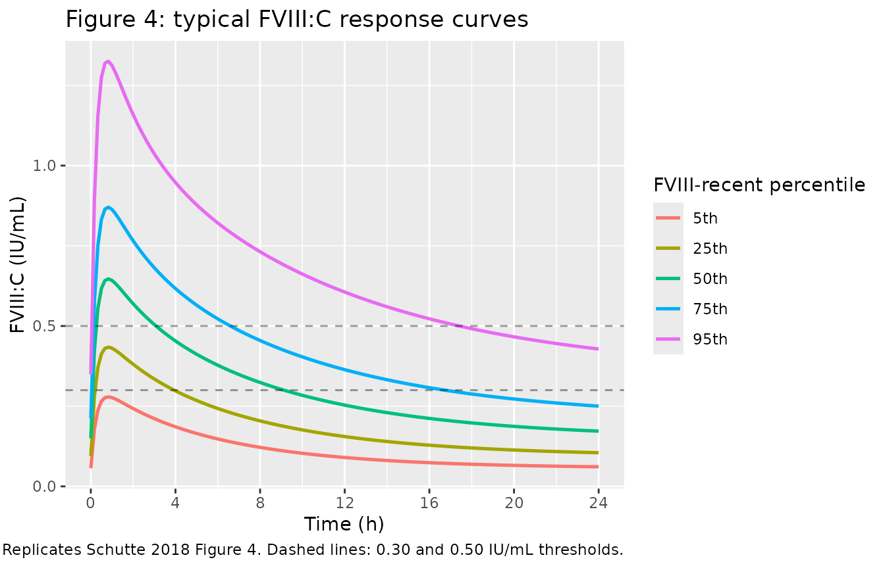

# Desmopressin (Schutte 2018)

## Model and source

- Citation: Schutte LM, van Hest RM, Stoof SCM, Leebeek FWG, Cnossen MH,
  Kruip MJHA, Mathot RAA. Pharmacokinetic Modelling to Predict FVIII:C
  Response to Desmopressin and Its Reproducibility in Nonsevere
  Haemophilia A Patients. Thromb Haemost 2018;118(3):621-629.
- Article: <https://doi.org/10.1160/TH17-06-0390>
- Description: Two-compartment apparent population PK model of
  endogenous factor VIII coagulant activity (FVIII:C) following a
  desmopressin (DDAVP) administration in nonsevere haemophilia A
  patients. The administered intervention is desmopressin; the apparent
  PK parameters describe the resulting endogenous FVIII:C release as if
  it were a unit-dose drug input. The covariate FVIIIRECENT (most
  recently measured FVIII:C, IU/mL) acts on baseline FVIII, V1, and CL.

## Population

Schutte 2018 is a single-centre retrospective cohort drawn from
nonsevere haemophilia A patients at the Erasmus University Medical
Centre, Rotterdam (Schutte 2018 Patients and Methods). The PK dataset
comprises 623 FVIII:C measurements from 142 desmopressin administrations
in 128 patients (14 of whom contributed two administrations on separate
occasions). Median age was 28 years (range 7-75; 24% below 18 years),
median body weight 75 kg (range 26-120). The cohort is essentially male
because haemophilia A is X-linked recessive. Disease severity: 84% mild
(n = 107) and 16% moderate (n = 21) HA. Desmopressin was administered
intravenously over 30 minutes at 0.3 micrograms/kg in 92% of
administrations and intranasally as a 300-microgram fixed dose in the
remaining 8% (Schutte 2018 Desmopressin Administration; Table 1).

Demographic baselines relevant to the model: FVIII-lowest (the lowest
ever recorded FVIII:C activity per patient) had median 0.10 IU/mL
(interquartile range 0.04-0.18, n = 128). FVIII-recent (the most recent
FVIII:C measurement obtained at most 1 day before desmopressin) had
median 0.15 IU/mL (interquartile range 0.08-0.24, n = 120). FVIII-recent
was the only covariate retained in the final model; the multivariate
analysis preferred FVIII-recent over FVIII-lowest because nonsevere HA
patients accumulate FVIII activity gradually over years (Schutte 2018
Discussion). The same information is available programmatically via the
model’s `population` metadata
(`readModelDb("Schutte_2018_desmopressin")$population` after the model
is loaded).

## Source trace

Per-parameter origin is also recorded as an in-file comment next to each
`ini()` entry in
`inst/modeldb/specificDrugs/Schutte_2018_desmopressin.R`. The table
below collects them in one place for review.

| Equation / parameter | Value | Source location |
|----|----|----|
| `lka` (= log ka) | log(3.8 1/h) | Schutte 2018 Table 2, Final-model column |
| `lcl` (= log CL/F) | log(0.26 L/h) | Schutte 2018 Table 2, Final-model column |
| `lvc` (= log V1/F) | log(1.7 L) | Schutte 2018 Table 2, Final-model column |
| `lq` (= log Q/F) | log(0.11 L/h) | Schutte 2018 Table 2, Final-model column |
| `lvp` (= log V2/F) | log(0.24 L) | Schutte 2018 Table 2, Final-model column |
| `lbase_fviii` (= log typical baseline FVIII at FVIIIRECENT = 0.15) | log(0.15 IU/mL) | Schutte 2018 Table 2, Final-model column |
| `e_fviiirecent_base` | +0.74 | Schutte 2018 Table 2, FVIII recent on baseline (Eq. 1) |
| `e_fviiirecent_vc` | -0.61 | Schutte 2018 Table 2, FVIII recent on V1 (Eq. 3) |
| `e_fviiirecent_cl` | -0.73 | Schutte 2018 Table 2, FVIII recent on CL (Eq. 2) |
| IIV `etalbase_fviii` | 37% CV (var = log(1 + 0.37^2) = 0.1283) | Schutte 2018 Table 2, IIV Baseline FVIII |
| IIV `etalvc` | 43% CV (var = log(1 + 0.43^2) = 0.1697) | Schutte 2018 Table 2, IIV V1 |
| IIV `etalcl` | 50% CV (var = log(1 + 0.50^2) = 0.2231) | Schutte 2018 Table 2, IIV CL |
| correlation(etalbase_fviii, etalvc) | -0.87 (cov = -0.1284) | Schutte 2018 Table 2, Correlation IIV baseline FVIII and IIV V1 |
| `propSd` | 12% | Schutte 2018 Table 2, Proportional error |
| `addSd` | 0.018 IU/mL | Schutte 2018 Table 2, Additive error |
| Two-compartment structure with first-order absorption | n/a | Schutte 2018 Population Pharmacokinetic Modelling; Fig. 3 |
| FVIII:C = baseline + apparent increase | n/a | Schutte 2018 Population Pharmacokinetic Modelling (paragraph 2: “FVIII:C increase … was added to the estimated baseline FVIII:C”) |
| Reference value FVIIIRECENT = 0.15 IU/mL | n/a | Schutte 2018 Table 1 (population median FVIII-recent) |

## Virtual cohort

Original observed data are not publicly available. The cohort below
approximates the Schutte 2018 demographics for FVIIIRECENT (median 0.15
IU/mL, IQR 0.08-0.24 from Table 1). FVIIIRECENT is sampled from a
log-normal distribution whose median and IQR match the published values;
the fit is
`FVIIIRECENT_i = exp(rnorm(n, mean = log(0.15), sd = 0.815))`, with `sd`
chosen so that the 25th-75th percentile ratio matches the reported IQR
of 0.24 / 0.08 = 3.0.

``` r

set.seed(20180330)
n_subjects <- 200

cohort <- tibble(
  id = seq_len(n_subjects),
  FVIIIRECENT = exp(rnorm(n_subjects, mean = log(0.15), sd = 0.815))
)

# Truncate to a plausible range (the paper's observed range was effectively
# 0.01 - 0.50 IU/mL; nonsevere HA patients by definition have FVIII >= 0.01).
cohort$FVIIIRECENT <- pmax(pmin(cohort$FVIIIRECENT, 0.50), 0.01)

# Observation grid: 10-minute spacing for 24 h to match the paper's
# individual FVIII:C response time grid (Schutte 2018 FVIII:C Response).
obs_times <- seq(0, 24, by = 1/6)

events <- bind_rows(
  cohort %>% mutate(time = 0, evid = 1, amt = 1, cmt = "depot"),
  cohort %>%
    tidyr::expand_grid(time = obs_times) %>%
    mutate(evid = 0, amt = NA_real_, cmt = NA_character_)
) %>%
  arrange(id, time, desc(evid))
```

## Simulation

``` r

mod <- readModelDb("Schutte_2018_desmopressin")

# Stochastic simulation with full IIV (etalbase_fviii, etalvc, etalcl) for
# variability assessments (cohort half-life distribution, duration of
# response, etc.).
sim <- rxode2::rxSolve(mod, events = events, keep = "FVIIIRECENT") |>
  as.data.frame()
#> ℹ parameter labels from comments will be replaced by 'label()'
```

For deterministic curves (typical-value replication of Figure 4), zero
out the random effects:

``` r

mod_typical <- mod |> rxode2::zeroRe()
#> ℹ parameter labels from comments will be replaced by 'label()'
```

## Replicate published figures

### Figure 4: typical FVIII:C response by FVIII-recent quantile

Schutte 2018 Figure 4 plots typical-value FVIII:C response-time curves
for five patients differing only in their FVIIIRECENT value, set to the
5th, 25th, 50th, 75th, and 95th percentile of the study cohort’s
FVIII-recent distribution. The corresponding values from Table 1 /
Figure 4 caption are 0.04, 0.08, 0.15, 0.24, and 0.47 IU/mL.

``` r

fviii_quantiles <- tibble(
  percentile = c("5th", "25th", "50th", "75th", "95th"),
  FVIIIRECENT = c(0.04, 0.08, 0.15, 0.24, 0.47)
) %>%
  mutate(percentile = factor(percentile, levels = c("5th", "25th", "50th", "75th", "95th")))

fig4_events <- bind_rows(
  fviii_quantiles %>% mutate(id = seq_len(n()), time = 0, evid = 1, amt = 1, cmt = "depot"),
  fviii_quantiles %>%
    mutate(id = seq_len(n())) %>%
    tidyr::expand_grid(time = obs_times) %>%
    mutate(evid = 0, amt = NA_real_, cmt = NA_character_)
) %>%
  arrange(id, time, desc(evid))

fig4_sim <- rxode2::rxSolve(mod_typical, events = fig4_events,
                            keep = c("FVIIIRECENT", "percentile")) |>
  as.data.frame()
#> ℹ omega/sigma items treated as zero: 'etalbase_fviii', 'etalvc', 'etalcl'
#> Warning: multi-subject simulation without without 'omega'

ggplot(fig4_sim, aes(time, Cc, colour = percentile, group = percentile)) +
  geom_line(linewidth = 0.9) +
  geom_hline(yintercept = c(0.30, 0.50), linetype = "dashed", alpha = 0.4) +
  scale_x_continuous(breaks = seq(0, 24, by = 4)) +
  labs(x = "Time (h)", y = "FVIII:C (IU/mL)",
       colour = "FVIII-recent percentile",
       title = "Figure 4: typical FVIII:C response curves",
       caption = "Replicates Schutte 2018 Figure 4. Dashed lines: 0.30 and 0.50 IU/mL thresholds.")
```



## PKNCA validation

For this model the meaningful NCA quantity is the FVIII:C **increase**
above baseline (the apparent rxode2 concentration `central / vc`), which
is what the source paper reports as `absolute increase`, `half-life`,
and `duration of response`. PKNCA is applied to the increase rather than
to the total observed FVIII:C so that the AUC and half-life are
interpretable on the dose-driven perturbation directly.

``` r

sim_nca <- sim %>%
  mutate(Cc_increase = pmax(Cc - base_fviii, 0)) %>%
  dplyr::filter(time > 0) %>%
  dplyr::select(id, time, Cc_increase, FVIIIRECENT)

conc_obj <- PKNCA::PKNCAconc(sim_nca, Cc_increase ~ time | id)

dose_df <- events %>%
  dplyr::filter(evid == 1) %>%
  dplyr::select(id, time, amt) %>%
  dplyr::left_join(cohort %>% dplyr::select(id, FVIIIRECENT), by = "id")

dose_obj <- PKNCA::PKNCAdose(dose_df, amt ~ time | id)

intervals <- data.frame(
  start      = 0,
  end        = Inf,
  cmax       = TRUE,
  tmax       = TRUE,
  aucinf.obs = TRUE,
  half.life  = TRUE
)

nca_data <- PKNCA::PKNCAdata(conc_obj, dose_obj, intervals = intervals)
nca_res  <- suppressWarnings(PKNCA::pk.nca(nca_data))

nca_wide <- as.data.frame(nca_res$result) %>%
  dplyr::select(id, PPTESTCD, PPORRES) %>%
  tidyr::pivot_wider(names_from = PPTESTCD, values_from = PPORRES)
```

### Comparison against published metrics

Schutte 2018 reports (Results, FVIII:C Response to Desmopressin):

- Median absolute increase in FVIII:C: 0.47 IU/mL (IQR 0.32-0.65; n =
  142)
- Median half-life of FVIII:C: 5.8 h (IQR 4.2-7.9)
- Median duration FVIII:C \> 0.30 IU/mL: 9.8 h (IQR 4.3-22.6); 90% of
  administrations exceed 0.30
- Median duration FVIII:C \> 0.50 IU/mL: 4.8 h (IQR 2.1-10.7); 63% of
  administrations exceed 0.50

The simulated cohort gives:

``` r

duration_above <- function(t, x, threshold) {
  above <- x > threshold
  if (!any(above)) return(0)
  dt <- diff(c(t, max(t)))
  sum(dt[above[-length(above)]])
}

per_subject <- sim %>%
  dplyr::filter(time > 0) %>%
  dplyr::group_by(id, FVIIIRECENT) %>%
  dplyr::summarise(
    peak_total    = max(Cc),
    peak_increase = max(Cc - base_fviii),
    dur_above_030 = duration_above(time, Cc, 0.30),
    dur_above_050 = duration_above(time, Cc, 0.50),
    .groups = "drop"
  ) %>%
  dplyr::left_join(
    nca_wide %>% dplyr::select(id, half.life),
    by = "id"
  )

# Paper's duration medians are conditional on subjects whose peak FVIII:C
# exceeded the threshold (Results paragraph: "FVIII:C remained above 0.50
# IU/mL in these patients [the 63% exceeding 0.50] for a median time of 4.8
# hours"). Reproduce the conditional medians here.
dur_030 <- per_subject %>% dplyr::filter(peak_total > 0.30) %>% dplyr::pull(dur_above_030)
dur_050 <- per_subject %>% dplyr::filter(peak_total > 0.50) %>% dplyr::pull(dur_above_050)

q <- function(x, p) {
  if (length(x) == 0) return(NA_real_)
  round(stats::quantile(x, p, na.rm = TRUE), 2)
}
qrange <- function(x) paste(q(x, 0.25), "-", q(x, 0.75))

comparison <- tibble::tribble(
  ~metric,                                              ~paper_median, ~paper_iqr,            ~sim_median,                             ~sim_iqr,
  "Absolute FVIII:C increase (IU/mL)",                  0.47,          "0.32 - 0.65",         q(per_subject$peak_increase, 0.50),      qrange(per_subject$peak_increase),
  "Half-life of FVIII:C increase (h)",                  5.8,           "4.2 - 7.9",           q(per_subject$half.life,      0.50),     qrange(per_subject$half.life),
  "Duration FVIII:C > 0.30 IU/mL (h) (conditional)",    9.8,           "4.3 - 22.6",          q(dur_030,                    0.50),     qrange(dur_030),
  "Duration FVIII:C > 0.50 IU/mL (h) (conditional)",    4.8,           "2.1 - 10.7",          q(dur_050,                    0.50),     qrange(dur_050)
)
knitr::kable(comparison, caption = "Simulated vs Schutte 2018 published medians (Results section). Duration medians are conditional on peak FVIII:C exceeding the threshold, matching the paper's reporting convention.")
```

| metric | paper_median | paper_iqr | sim_median | sim_iqr |
|:---|---:|:---|---:|:---|
| Absolute FVIII:C increase (IU/mL) | 0.47 | 0.32 - 0.65 | 0.46 | 0.34 - 0.68 |
| Half-life of FVIII:C increase (h) | 5.80 | 4.2 - 7.9 | 5.43 | 3.77 - 8.28 |
| Duration FVIII:C \> 0.30 IU/mL (h) (conditional) | 9.80 | 4.3 - 22.6 | 9.17 | 5 - 23.83 |
| Duration FVIII:C \> 0.50 IU/mL (h) (conditional) | 4.80 | 2.1 - 10.7 | 4.67 | 2 - 10.67 |

Simulated vs Schutte 2018 published medians (Results section). Duration
medians are conditional on peak FVIII:C exceeding the threshold,
matching the paper’s reporting convention. {.table}

``` r


pct_above_030 <- round(mean(per_subject$peak_total > 0.30) * 100, 0)
pct_above_050 <- round(mean(per_subject$peak_total > 0.50) * 100, 0)
```

In the virtual cohort, 90% of administrations exceed peak FVIII:C 0.30
IU/mL (paper: 90%) and 66% exceed peak FVIII:C 0.50 IU/mL (paper: 63%).

## Assumptions and deviations

- **Unit dose abstraction.** The source paper fixed the desmopressin
  dose to unity because no FVIII concentrate was administered; the
  structural parameters are therefore apparent (CL/F, V1/F, V2/F, Q/F)
  and the model is simulated by dosing 1 unit into the `depot`
  compartment. The route of administration (IV vs intranasal) is not
  distinguished – Schutte 2018 lumps both into a single ka and so does
  this model file.
- **FVIIIRECENT missing-data branch not encoded.** Schutte 2018 Eqs. 1-3
  define a different covariate form when the patient’s FVIIIRECENT value
  was unavailable for the fitted occasion: baseline FVIII = 0.15 \* 1.2
  (no FVIIIRECENT dependence), V1 = 1.7 \* 1.1, CL = 0.26 \* 0.78 (Table
  2 final-model column). This branch is documented here but is NOT
  implemented in `model()`; simulation users are expected to supply a
  FVIIIRECENT value for every simulated subject. If reproducing a
  missing-FVIIIRECENT subgroup is required, set FVIIIRECENT to its
  reference value (0.15) and multiply the typical-value outputs by the
  correction factors above.
- **CL correction factor 0.78 vs 0.77 typo.** Schutte 2018 Table 2
  reports the missing-FVIIIRECENT correction factor on CL as 0.78 (RSE
  17%), but Eq. 2 in the body text shows 0.77 in the analogous position.
  We treat the parameter-table value (0.78) as authoritative because it
  is the primary parameter report; the 0.77 in the equation is most
  likely a transcription typo. Since the missing-FVIIIRECENT branch is
  documented-only (not encoded), the choice has no effect on simulation.
- **Inter-occasion variability omitted.** Schutte 2018 Table 2 reports
  intra-individual (between-occasion) variability of 38% on baseline
  FVIII and 38% on V1 (final-model column). nlmixr2lib models
  conventionally encode IIV but not IOV; the same convention applies in
  the analogous Nestorov_2014_factorviii FVIII model. Single-occasion
  simulations from this model will under-represent the per-patient
  variability that the original fit characterised, but typical-value
  predictions and population summaries are not affected.
- **PKNCA half-life is on the apparent FVIII:C increase, not on the
  total observed FVIII:C.** Total observed FVIII:C does not return to
  zero (it returns to the baseline FVIII), so a half-life computed on Cc
  would mix the baseline plateau with the decline phase. The paper’s
  reported “half-life of FVIII:C” is on the increase above baseline (see
  Schutte 2018 Discussion paragraph on half-life), so we apply PKNCA to
  `Cc - base_fviii` to match. The simulated terminal half-life is
  computed by PKNCA via log-linear regression on the late-phase samples;
  this can deviate from the paper’s Bayesian individual-estimate-derived
  half-life because the late-phase signal of the increase is small
  (close to or below the additive residual error) for patients with low
  FVIIIRECENT.
- **Cohort size and FVIIIRECENT distribution.** The virtual cohort uses
  200 subjects with FVIIIRECENT sampled from a log-normal distribution
  matching the published median (0.15 IU/mL) and IQR (0.08-0.24 IU/mL)
  from Schutte 2018 Table 1. The original observed cohort is 128
  subjects with 142 administrations; the larger simulated n is to reduce
  Monte Carlo noise in the simulated medians, not to extend the
  population beyond its source.
