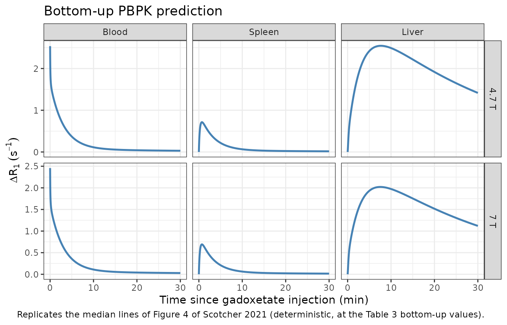
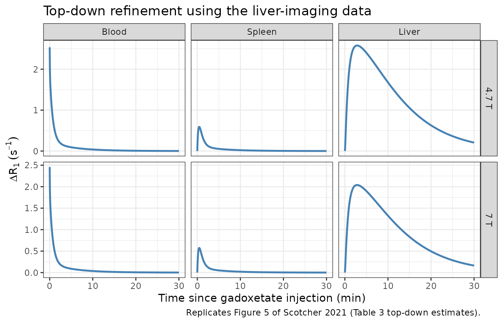
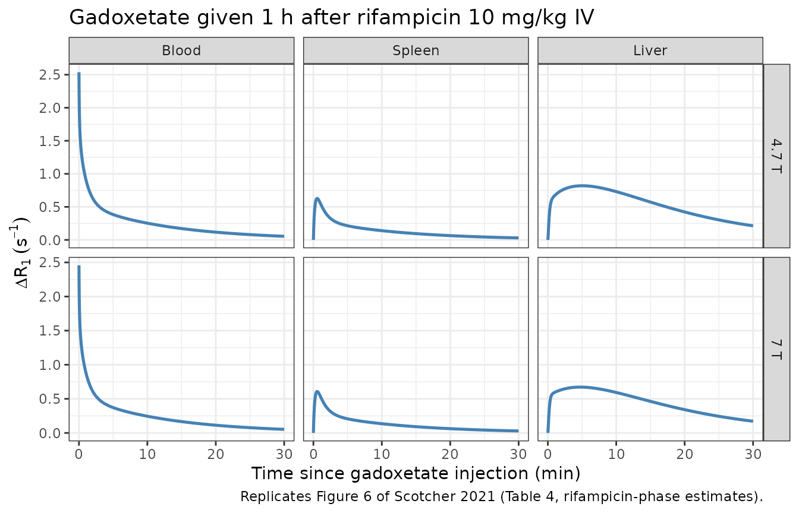
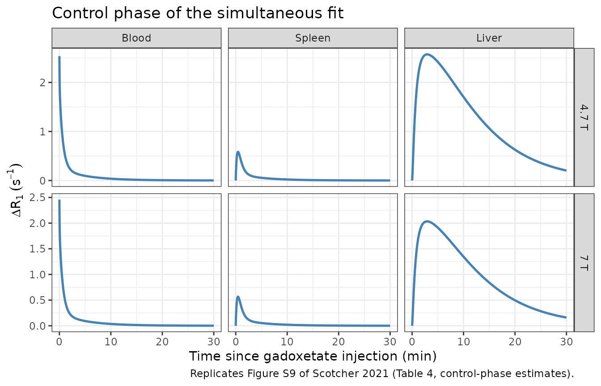

# Gadoxetate rat PBPK (Scotcher 2021)

## Model and source

- Citation: Scotcher D, Melillo N, Tadimalla S, Darwich AS, Ziemian S,
  Ogungbenro K, Schutz G, Sourbron S, Galetin A. Physiologically Based
  Pharmacokinetic Modeling of Transporter-Mediated Hepatic Disposition
  of Imaging Biomarker Gadoxetate in Rats. Mol Pharm.
  2021;18(8):2997-3009. <doi:10.1021/acs.molpharmaceut.1c00206>
  (PMC8397403). Model equations (S1-S3) and physiological parameters
  (Table S2) are in the paper’s Supporting Information
  (mp1c00206_si_001.pdf).
- Description: Preclinical (rat). Reduced PBPK model (seven
  compartments, permeability-limited liver) for the hepatobiliary MRI
  contrast agent gadoxetate in the 250 g male Wistar-Han rat after a 25
  umol/kg intravenous dose, given alone or 1 h after a single 10 mg/kg
  intravenous rifampicin dose. Blood, spleen and splanchnic
  extracellular spaces are perfusion-limited; the rest of the body is
  split into a vascular and an interstitial space linked by a
  permeability-surface product; the liver has an extracellular space and
  a hepatocyte space linked by saturable OATP-mediated active uptake
  (linearised, CLactive) and bidirectional passive diffusion, with
  biliary (Mrp2) excretion from the hepatocyte and renal clearance from
  blood. Active uptake, biliary clearance and PS were fitted (naive
  pooled) to dynamic contrast-enhanced MRI Delta R1 profiles of blood,
  spleen and liver at 4.7 T and 7 T; the defaults are the simultaneous
  control plus rifampicin fit (Table 4), in which rifampicin inhibits
  active uptake by 96 percent. Delta R1 outputs at both field strengths
  are derived with the ex vivo relaxivities of Table 1. Deterministic:
  no between-animal variability or residual error was estimated.
- Article: <https://doi.org/10.1021/acs.molpharmaceut.1c00206> (open
  access, PMC8397403)
- Supporting Information (model equations S1-S3, Table S2 physiology):
  <https://pubs.acs.org/doi/10.1021/acs.molpharmaceut.1c00206?goto=supporting-info>

Gadoxetate is a hepatobiliary MRI contrast agent taken up into
hepatocytes by OATP (rat Oatp1a1) and excreted into bile by MRP2 (rat
Mrp2). Scotcher et al. built a reduced PBPK model of gadoxetate in the
rat and used dynamic contrast-enhanced MRI (DCE-MRI) images of blood,
spleen and liver to refine the in vitro-in vivo extrapolation (IVIVE) of
its hepatic transporter kinetics, and then to quantify the interaction
with a single intravenous dose of the OATP inhibitor rifampicin.

The paper reports one model structure with several parameter sets. The
packaged model uses the final simultaneous fit of the control and
rifampicin phases (Table 4); the bottom-up IVIVE values and the
control-only top-down fit (both Table 3) are reproduced below by
overriding three `ini()` values.

## Population

The DCE-MRI data come from male Wistar-Han rats in a multicentre
preclinical study, scanned at two magnetic field strengths (4.7 T and 7
T) after a 25 umol/kg intravenous gadoxetate dose, given either alone
(control: 43 profiles at 4.7 T from 33 animals and 52 profiles at 7 T
from 43 animals, some animals scanned twice) or 1 h after 10 mg/kg
intravenous rifampicin (7 profiles at 4.7 T and 6 at 7 T). The PBPK
model describes an average 250 g rat. Separately, in vitro hepatocyte
uptake kinetics were measured in plated hepatocytes from four male
Sprague-Dawley rats (250-300 g, Table 2) and supply the passive
diffusion clearance and the intracellular unbound fraction. All fits
were naive pooled, so the model carries no between-animal variability.

The same information is available programmatically via
`readModelDb("Scotcher_2021_gadoxetate_rat_pbpk")()$population`.

## Model structure

Seven gadoxetate compartments (Figure 2; Supporting Information equation
system S1), all written in amounts:

- `blood` – systemic blood, receiving the intravenous dose and cleared
  renally (`CLr`).
- `vp_remainder` / `is_remainder` – the rest of the body (lungs, brain,
  heart, kidneys, bone, muscle, skin, fat): a vascular space perfused at
  `Qrob` and an interstitial space exchanging with it through the
  permeability-surface product `PS` (eq 5).
- `is_spleen`, `is_splanchnic` – perfusion-limited extracellular spaces
  (organ blood plus interstitium) of the spleen and of the stomach +
  gut + pancreas, draining into the liver through the portal vein.
- `is_liver` / `int_liver` – liver extracellular space and hepatocytes
  (eq 6). Uptake is by linearised active transport `CLactive` on the
  total extracellular concentration plus bidirectional passive diffusion
  `CLpassive` (efflux on the unbound intracellular concentration,
  `fu,liv,cell`); biliary excretion `CLbiliary` acts on the unbound
  intracellular concentration.

Two cumulative records (`urine`, `a_bile`) are added so the excreted
fractions can be read off a solve; they do not feed back.

The extracellular-to-blood partition coefficients follow equation S3,
which assumes that gadoxetate does not enter red cells and that plasma
and interstitial fluid equilibrate:
`K = (V_int + V_b (1 - Hct)) / ((V_int + V_b) (1 - Hct))`.

The observed quantity is Delta R1 (1/s), linear in concentration through
the ex vivo relaxivities of Table 1 (eq 7): blood and spleen use the
blood relaxivity; the liver signal is the volume-weighted sum of the
extracellular (blood relaxivity) and hepatocyte (hepatocyte relaxivity)
contributions. Relaxivities depend on field strength, so the model
returns Delta R1 at both 4.7 T and 7 T.

## Source trace

| Equation / parameter | Value | Source location |
|----|----|----|
| `lps_act_inf` (CLactive, control) | log(2.38) L/h | Table 4, control column |
| `lps_act_inf_inh` (CLactive, rifampicin) | log(0.095) L/h | Table 4, rifampicin column |
| `lcl_bile` (CLbiliary, control) | log(0.07) L/h | Table 4, control column |
| `lcl_bile_inh` (CLbiliary, rifampicin) | log(0.08) L/h | Table 4, rifampicin column |
| `lps_remainder` (PS, both phases) | log(0.71) L/h | Table 4 |
| `lps_dif` (CLpassive) | log(0.014) L/h, held constant | Table 3 footnote d; Table 2 mean 0.193 uL/min/10^6 cells scaled by eq 3 |
| `fu_liver_cell` | 0.648, held constant | Table 2 mean; Table 3 |
| `lcl_renal` (CLr) | log(0.17) L/h, held constant | Table 3 footnote e (36.7 mL/min/kg x fe 0.305 x 0.25 kg) |
| `qc` (cardiac output) | 6.62 L/h | Table S2, blood / lungs blood flow |
| `hct` | 0.4183 | Supporting Information Section 5 |
| Organ masses, densities, vascular and interstitial fractions, blood flows | constants in `model()` | Table S2 |
| Lumping of volumes, flows and partition coefficients | n/a | Equation S2 |
| Partition coefficients `kp_spleen`, `kp_splanchnic`, `kp_liver` | derived | Equation S3 (derivation in Supporting Information Section 3) |
| `d/dt(...)` for all seven compartments | n/a | Equation system S1; eqs 5 and 6 |
| Relaxivities (blood 6.4 / 6.2, hepatocytes 7.6 / 6 per s per mM at 4.7 / 7 T) | constants in `model()` | Table 1 and its footnote |
| Delta R1 of blood, spleen, liver | n/a | Equation 7 |
| Rifampicin phase indicator `CONMED_RIFAMPICIN_SD` | 0 / 1 | Table 4 (separate control and rifampicin estimates) |

## Simulation

A single typical rat (the model has no random effects) receives 25
umol/kg x 0.25 kg = 6.25 umol as an intravenous bolus into `blood`. The
figures in the paper place the injection about 4.6 minutes into the
image acquisition (after a baseline); the plots below use time since
injection.

``` r

mod <- readModelDb("Scotcher_2021_gadoxetate_rat_pbpk")

dose_umol <- 25 * 0.25 # 25 umol/kg x 0.25 kg reference rat

make_events <- function(rif, times) {
  ev <- rxode2::et(amt = dose_umol, cmt = "blood") |>
    rxode2::et(times) |>
    as.data.frame()
  ev$CONMED_RIFAMPICIN_SD <- rif
  ev
}

# 1-s grid over the 30-min imaging window (hours)
t_img <- seq(0, 0.5, by = 1 / 3600)

# Parameter sets. Table 4 is the packaged default; Table 3 gives the
# control-only top-down fit and the bottom-up IVIVE (Monte Carlo mean) values.
mod_topdown <- mod |>
  rxode2::ini(lps_act_inf = log(2.17), lcl_bile = log(0.07), lps_remainder = log(0.62))
#> ℹ change initial estimate of `lps_act_inf` to `0.774727167552368`
#> ℹ change initial estimate of `lcl_bile` to `-2.65926003693278`
#> ℹ change initial estimate of `lps_remainder` to `-0.478035800943`
mod_bottomup <- mod |>
  rxode2::ini(lps_act_inf = log(0.23), lcl_bile = log(0.014), lps_remainder = log(0.014))
#> ℹ change initial estimate of `lps_act_inf` to `-1.46967597005894`
#> ℹ change initial estimate of `lcl_bile` to `-4.26869794936688`
#> ℹ change initial estimate of `lps_remainder` to `-4.26869794936688`

solve_img <- function(m, rif, label) {
  rxode2::rxSolve(m, make_events(rif, t_img), rtol = 1e-10, atol = 1e-12, returnType = "data.frame") |>
    dplyr::mutate(scenario = label)
}

sim <- dplyr::bind_rows(
  solve_img(mod_bottomup, 0, "Bottom-up IVIVE (Table 3), control"),
  solve_img(mod_topdown, 0, "Top-down fit (Table 3), control"),
  solve_img(mod, 0, "Simultaneous fit (Table 4), control"),
  solve_img(mod, 1, "Simultaneous fit (Table 4), rifampicin")
)

dr1_long <- sim |>
  dplyr::select(scenario, time, dplyr::starts_with("dR1_")) |>
  tidyr::pivot_longer(dplyr::starts_with("dR1_"), names_to = "output", values_to = "dR1") |>
  dplyr::mutate(
    tissue = dplyr::case_when(
      grepl("blood", output) ~ "Blood",
      grepl("spleen", output) ~ "Spleen",
      TRUE ~ "Liver"
    ),
    tissue = factor(tissue, levels = c("Blood", "Spleen", "Liver")),
    field = ifelse(grepl("4p7t", output), "4.7 T", "7 T"),
    tmin = time * 60
  )

plot_dr1 <- function(which, title, caption) {
  dr1_long |>
    dplyr::filter(scenario == which) |>
    ggplot(aes(tmin, dR1)) +
    geom_line(colour = "steelblue", linewidth = 0.9) +
    facet_grid(field ~ tissue, scales = "free_y") +
    labs(
      x = "Time since gadoxetate injection (min)",
      y = expression(Delta * R[1] ~ (s^-1)),
      title = title,
      caption = caption
    ) +
    theme_bw()
}
```

## Replicate published figures

``` r

plot_dr1(
  "Bottom-up IVIVE (Table 3), control",
  "Bottom-up PBPK prediction",
  "Replicates the median lines of Figure 4 of Scotcher 2021 (deterministic, at the Table 3 bottom-up values)."
)
```



The bottom-up prediction captures the rapid disappearance from blood and
spleen, but the liver signal keeps rising over the 30-minute window
because the in vitro active uptake (0.23 L/h) and the assumed biliary
clearance (0.014 L/h, set equal to CLpassive) are far too low – the
misfit the paper reports in Figure 4. The paper’s curve is the median of
a 10,000-sample Monte Carlo over the uncertain in vitro parameters, so
the deterministic curve at the Monte Carlo mean values is a close but
not identical comparison.

``` r

plot_dr1(
  "Top-down fit (Table 3), control",
  "Top-down refinement using the liver-imaging data",
  "Replicates Figure 5 of Scotcher 2021 (Table 3 top-down estimates)."
)
```



``` r

plot_dr1(
  "Simultaneous fit (Table 4), rifampicin",
  "Gadoxetate given 1 h after rifampicin 10 mg/kg IV",
  "Replicates Figure 6 of Scotcher 2021 (Table 4, rifampicin-phase estimates)."
)
```



``` r

plot_dr1(
  "Simultaneous fit (Table 4), control",
  "Control phase of the simultaneous fit",
  "Replicates Figure S9 of Scotcher 2021 (Table 4, control-phase estimates)."
)
```



### Quantitative check against Figures 5 and 6

The maintainers read the liver Delta R1 of the model curves in Figures 5
and 6 off the published figure panels (peak value, and the value at the
end of the panel, 30 min on the figure axis = about 25.4 min after
injection). The liver signal is smooth, so its reading is precise to
about 0.05 1/s. A mis-transcribed clearance, volume or relaxivity moves
these values by far more than the 15% tolerance.

``` r

at_min <- function(d, tm) d$value[which.min(abs(d$tmin - tm))]

digitised <- tibble::tribble(
  ~figure, ~scenario, ~output, ~quantity, ~published,
  "Figure 5", "Top-down fit (Table 3), control", "dR1_liver_4p7t", "peak", 2.65,
  "Figure 5", "Top-down fit (Table 3), control", "dR1_liver_7t", "peak", 2.10,
  "Figure 5", "Top-down fit (Table 3), control", "dR1_liver_4p7t", "25.4 min", 0.33,
  "Figure 5", "Top-down fit (Table 3), control", "dR1_liver_7t", "25.4 min", 0.25,
  "Figure 6", "Simultaneous fit (Table 4), rifampicin", "dR1_liver_4p7t", "peak", 0.87,
  "Figure 6", "Simultaneous fit (Table 4), rifampicin", "dR1_liver_7t", "peak", 0.71,
  "Figure 6", "Simultaneous fit (Table 4), rifampicin", "dR1_liver_4p7t", "25.4 min", 0.28,
  "Figure 6", "Simultaneous fit (Table 4), rifampicin", "dR1_liver_7t", "25.4 min", 0.22
)

sim_value <- function(scn, out, qty) {
  d <- dr1_long |>
    dplyr::filter(scenario == scn, output == out) |>
    dplyr::rename(value = dR1)
  if (nrow(d) == 0) stop("no simulated rows for ", scn, " / ", out)
  if (qty == "peak") max(d$value) else at_min(d, 25.4)
}

digitised$simulated <- mapply(sim_value, digitised$scenario, digitised$output, digitised$quantity)
digitised$pct_diff <- 100 * (digitised$simulated / digitised$published - 1)

digitised |>
  dplyr::mutate(simulated = signif(simulated, 3), pct_diff = round(pct_diff, 1)) |>
  dplyr::select(-scenario) |>
  dplyr::rename(
    "Figure" = figure,
    "Output" = output,
    "Quantity" = quantity,
    "Published (digitised, 1/s)" = published,
    "Simulated (1/s)" = simulated,
    "Difference (%)" = pct_diff
  ) |>
  knitr::kable(caption = "Liver Delta R1: simulated vs. read from the published model curves.")
```

| Figure | Output | Quantity | Published (digitised, 1/s) | Simulated (1/s) | Difference (%) |
|:---|:---|:---|---:|---:|---:|
| Figure 5 | dR1_liver_4p7t | peak | 2.65 | 2.580 | -2.7 |
| Figure 5 | dR1_liver_7t | peak | 2.10 | 2.040 | -2.9 |
| Figure 5 | dR1_liver_4p7t | 25.4 min | 0.33 | 0.348 | 5.4 |
| Figure 5 | dR1_liver_7t | 25.4 min | 0.25 | 0.275 | 9.9 |
| Figure 6 | dR1_liver_4p7t | peak | 0.87 | 0.819 | -5.8 |
| Figure 6 | dR1_liver_7t | peak | 0.71 | 0.672 | -5.3 |
| Figure 6 | dR1_liver_4p7t | 25.4 min | 0.28 | 0.295 | 5.2 |
| Figure 6 | dR1_liver_7t | 25.4 min | 0.22 | 0.238 | 8.0 |

Liver Delta R1: simulated vs. read from the published model curves.
{.table}

``` r


stopifnot(nrow(digitised) == 8, all(abs(digitised$pct_diff) < 15))
```

All eight readings agree within about 10%. The blood and spleen
**peaks** are not compared: gadoxetate is injected as a bolus into a 16
mL blood pool, so the simulated blood Delta R1 falls from 2.5 1/s to
under 0.6 1/s within the first minute, and the peak height of a plotted
curve depends entirely on the time resolution at which it was drawn (the
paper computes residuals against the mean over each 57-s acquisition
frame, Supporting Information Section 4). Later blood values agree with
Figure 6 (about 0.2 1/s at 15 min after injection on the published
curve; simulated 0.17 1/s).

### Excretion and rifampicin inhibition

The paper states that, with the top-down estimates, the simulated
percentages of the dose excreted in urine and bile were 17% and 83%.

``` r

t_long <- c(seq(0, 1, by = 1 / 600), seq(1.1, 48, by = 0.1))
exc <- dplyr::bind_rows(
  rxode2::rxSolve(mod_topdown, make_events(0, t_long), rtol = 1e-10, atol = 1e-12, returnType = "data.frame") |>
    dplyr::mutate(scenario = "Top-down fit (Table 3), control"),
  rxode2::rxSolve(mod, make_events(0, t_long), rtol = 1e-10, atol = 1e-12, returnType = "data.frame") |>
    dplyr::mutate(scenario = "Simultaneous fit (Table 4), control"),
  rxode2::rxSolve(mod, make_events(1, t_long), rtol = 1e-10, atol = 1e-12, returnType = "data.frame") |>
    dplyr::mutate(scenario = "Simultaneous fit (Table 4), rifampicin")
) |>
  dplyr::group_by(scenario) |>
  dplyr::slice_max(time, n = 1) |>
  dplyr::ungroup() |>
  dplyr::mutate(
    urine_pct = 100 * urine / dose_umol,
    bile_pct = 100 * a_bile / dose_umol
  )

exc |>
  dplyr::select(scenario, urine_pct, bile_pct) |>
  dplyr::mutate(dplyr::across(c(urine_pct, bile_pct), ~ round(.x, 1))) |>
  dplyr::rename(
    "Scenario" = scenario,
    "Urine (% of dose, 48 h)" = urine_pct,
    "Bile (% of dose, 48 h)" = bile_pct
  ) |>
  knitr::kable()
```

| Scenario | Urine (% of dose, 48 h) | Bile (% of dose, 48 h) |
|:---|---:|---:|
| Simultaneous fit (Table 4), control | 17.2 | 82.8 |
| Simultaneous fit (Table 4), rifampicin | 59.0 | 41.0 |
| Top-down fit (Table 3), control | 17.6 | 82.4 |

``` r


td <- exc[exc$scenario == "Top-down fit (Table 3), control", ]
stopifnot(
  nrow(td) == 1,
  # Complete recovery: every route of loss is urine or bile.
  abs(td$urine_pct + td$bile_pct - 100) < 0.1,
  # Paper: 17% urine / 83% bile.
  abs(td$urine_pct - 17) < 1.5
)

inhibition_pct <- 100 * (1 - 0.095 / 2.38)
inhibition_pct
#> [1] 96.0084
stopifnot(round(inhibition_pct) == 96) # paper: 96% inhibition of CLactive
```

The simulated split is 17.6% / 82.4% (the paper rounds to 17 / 83).
Rifampicin shifts elimination towards the kidney (about 59% of the dose
in urine) because hepatic uptake falls to 4% of control.

### Mass balance

With renal and biliary clearance switched off, the total amount over all
states must stay equal to the dose.

``` r

mod_closed <- mod |> rxode2::ini(lcl_renal = log(1e-12), lcl_bile = log(1e-12), lcl_bile_inh = log(1e-12))
#> ℹ change initial estimate of `lcl_renal` to `-27.6310211159285`
#> ℹ change initial estimate of `lcl_bile` to `-27.6310211159285`
#> ℹ change initial estimate of `lcl_bile_inh` to `-27.6310211159285`
closed <- rxode2::rxSolve(mod_closed, make_events(0, t_long), rtol = 1e-10, atol = 1e-12, returnType = "data.frame")
states <- c(
  "blood", "vp_remainder", "is_remainder", "is_spleen", "is_splanchnic",
  "is_liver", "int_liver", "urine", "a_bile"
)
total <- rowSums(closed[, states])
max_dev <- max(abs(total / dose_umol - 1))
max_dev
#> [1] 3.974598e-14
stopifnot(max_dev < 1e-6)
```

## PKNCA validation

The paper reports no non-compartmental results, so PKNCA is used to
summarise the simulated blood exposure of the control and rifampicin
phases (Table 4 parameters) and to cross-check the urinary recovery:
`CLr x AUCinf / Dose` must reproduce the urine fraction read directly
from the cumulative `urine` state.

``` r

t_nca <- c(seq(0, 0.5, by = 1 / 3600), seq(0.51, 3, by = 0.01))
sim_nca_raw <- dplyr::bind_rows(
  rxode2::rxSolve(mod, make_events(0, t_nca), rtol = 1e-10, atol = 1e-14, returnType = "data.frame") |>
    dplyr::mutate(treatment = "control"),
  rxode2::rxSolve(mod, make_events(1, t_nca), rtol = 1e-10, atol = 1e-14, returnType = "data.frame") |>
    dplyr::mutate(treatment = "rifampicin")
) |>
  dplyr::mutate(id = 1L)

# Solver undershoot must be noise; then floor it.
stopifnot(all(sim_nca_raw$Cc >= -1e-6 * max(sim_nca_raw$Cc)))
sim_nca <- sim_nca_raw |>
  dplyr::filter(!is.na(Cc)) |>
  dplyr::mutate(Cc = pmax(Cc, 0)) |>
  dplyr::select(id, time, Cc, treatment)

conc_obj <- PKNCA::PKNCAconc(sim_nca, Cc ~ time | treatment + id)
dose_df <- data.frame(id = 1L, time = 0, amt = dose_umol, treatment = c("control", "rifampicin"))
dose_obj <- PKNCA::PKNCAdose(dose_df, amt ~ time | treatment + id, route = "intravascular")

intervals <- data.frame(
  start = 0,
  end = Inf,
  cmax = TRUE,
  aucinf.obs = TRUE,
  cl.obs = TRUE,
  half.life = TRUE
)
nca_res <- PKNCA::pk.nca(PKNCA::PKNCAdata(conc_obj, dose_obj, intervals = intervals))

nca_tab <- as.data.frame(nca_res) |>
  dplyr::filter(PPTESTCD %in% c("cmax", "aucinf.obs", "cl.obs", "half.life")) |>
  dplyr::select(treatment, PPTESTCD, PPORRES) |>
  tidyr::pivot_wider(names_from = PPTESTCD, values_from = PPORRES)

nca_tab |>
  dplyr::mutate(
    fe_urine_pct = 100 * 0.17 * aucinf.obs / dose_umol,
    half.life = half.life * 60,
    dplyr::across(where(is.numeric), ~ signif(.x, 3))
  ) |>
  dplyr::select(treatment, cmax, aucinf.obs, cl.obs, half.life, fe_urine_pct) |>
  dplyr::rename(
    "Phase" = treatment,
    "Cmax (umol/L)" = cmax,
    "AUC0-inf (umol*h/L)" = aucinf.obs,
    "CL blood (L/h)" = cl.obs,
    "Terminal t1/2 (min)" = half.life,
    "CLr x AUC / Dose (%)" = fe_urine_pct
  ) |>
  knitr::kable(caption = "PKNCA summary of simulated blood gadoxetate (Table 4 parameters).")
```

| Phase | Cmax (umol/L) | AUC0-inf (umol\*h/L) | CL blood (L/h) | Terminal t1/2 (min) | CLr x AUC / Dose (%) |
|:---|---:|---:|---:|---:|---:|
| control | 396 | 6.32 | 0.990 | 5.72 | 17.2 |
| rifampicin | 396 | 21.70 | 0.288 | 9.12 | 59.0 |

PKNCA summary of simulated blood gadoxetate (Table 4 parameters).
{.table}

``` r


fe_nca <- 100 * 0.17 * nca_tab$aucinf.obs / dose_umol
fe_state <- exc$urine_pct[match(
  c("Simultaneous fit (Table 4), control", "Simultaneous fit (Table 4), rifampicin"),
  exc$scenario
)]
stopifnot(length(fe_nca) == 2, all(abs(fe_nca / fe_state - 1) < 0.02))
```

Blood clearance of the control phase is about 1 L/h (66 mL/min/kg),
almost twice the literature total blood clearance of 36.7 mL/min/kg that
the paper used, with the literature urinary fraction of 0.305, to derive
`CLr`. The fitted model therefore implies a urinary recovery of about
17%, not 30.5%; this is a property of the published parameter set (the
paper notes that `CLr` and `CLactive` could not be estimated together
without urinary or biliary data), not of the implementation.

## Assumptions and deviations

- **Rest-of-body blood flow.** Table S2 lists a cardiac output of 6.62
  L/h (the blood / lungs row), and equation S2 lumps flows as sums, but
  the systemic organs of the rest of the body sum to 4.89 L/h while the
  hepatic inflow sums to 1.153 L/h – 0.58 L/h short of cardiac output
  (lungs are in series and cannot be summed). The maintainers set
  `Qrob = QCO - Qh` (5.47 L/h) so that blood leaving and returning to
  the blood pool balance. Taking the organ sum 4.89 L/h with cardiac
  output 4.89 + 1.153 = 6.04 L/h instead changes every Delta R1 output
  by less than 1.3% over the 30-min imaging window. Taking the organ sum
  with cardiac output 6.62 L/h would destroy 0.58 L/h x `c_blood` of
  drug and leave only about 63% of the dose recovered in urine plus
  bile, contradicting the paper’s statement that 17% and 83% of the dose
  are excreted.
- **Hepatic return term in S1.** The printed blood equation of system S1
  returns `Q_liv a_liv,int / (V_liv,int K_liv,int-b)` from the liver;
  the subscripts are read as the hepatic venous outflow of the liver
  extracellular space, `Qh a_liv,extr / (V_liv,extr K_liv,extr-b)`,
  which is the outflow term of the liver extracellular equation in the
  same system and eq 6.
- **Blood volume.** The blood compartment volume is the Table S2 total
  blood volume (15.77 mL); organ blood volumes are also counted inside
  the organ compartments, as in the paper.
- **Splanchnic partition coefficient.** Equation S2 averages organ
  partition coefficients weighted by volume. The maintainers used the
  organs’ extracellular volumes as the weights, which makes the lumped
  coefficient identical to equation S3 applied to the summed
  interstitial and blood volumes.
- **Relaxivities in `model()`.** The ex vivo relaxivities of Table 1 are
  constants of the measurement, not model parameters, so the model
  returns Delta R1 at both field strengths instead of switching on a
  field-strength covariate.
- **Rifampicin phase.** The paper estimated the rifampicin-phase active
  uptake and biliary clearance as separate values, not as a function of
  rifampicin concentration. `CONMED_RIFAMPICIN_SD = 1` therefore
  represents only the studied design (single 10 mg/kg intravenous
  rifampicin 1 h before gadoxetate).
- **Parameter sets not packaged.** The blood-only fits (Tables S3 and
  S5), the fit that also estimated `CLr` (Table S4, in which `CLactive`
  was unidentifiable) and the five-compartment liver variant (Table S6)
  are sensitivity analyses the authors did not adopt, and are not
  included.
- **No variability.** The fits were naive pooled with unweighted least
  squares on Delta R1; no between-animal variability or residual-error
  magnitude was reported, so the model is deterministic.
- **Correction search.** No erratum or correction notice for this
  article was linked to this article in Europe PMC as of 2026-09-28.
