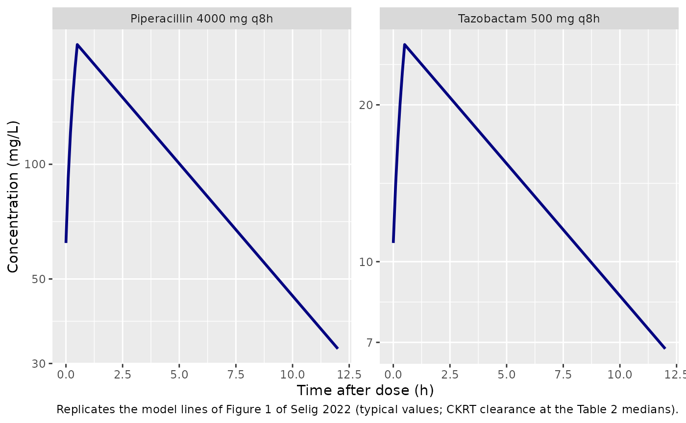
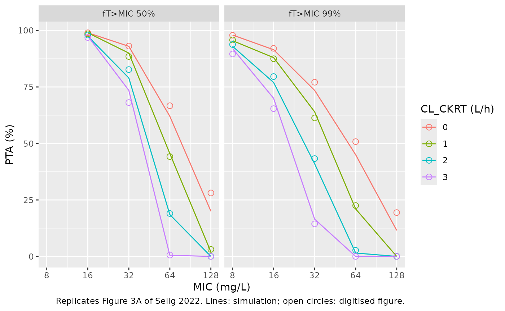

# Piperacillin and tazobactam on CKRT (Selig 2022)

## Model and source

- Citation: Selig DJ, DeLuca JP, Chung KK, Pruskowski KA, Livezey JR,
  Nadeau RJ, Por ED, Akers KS. Pharmacokinetics of piperacillin and
  tazobactam in critically ill patients treated with continuous kidney
  replacement therapy: a mini-review and population pharmacokinetic
  analysis. J Clin Pharm Ther. 2022;47(8):1091-1102.
  <doi:10.1111/jcpt.13657>. Parameter values: Table 4A. Structure:
  Methods 2.3-2.5 (Equations 1-4) and the supplementary aggregate
  dataset (JCPT-47-1091-s002.xlsx), whose CLCKRT column is the per-arm
  CKRT clearance.
- Piperacillin: MBMA. One-compartment IV population PK model for
  piperacillin in critically ill adults on continuous kidney replacement
  therapy (CKRT), fitted by FOCEI in Pumas to concentration-time curves
  digitised from 20 arms of 10 published CKRT studies together with 14
  individual concentrations from 4 Military Health System patients on
  CVVH (Selig 2022). Total clearance is the estimated body (non-CKRT)
  clearance times exp(eta) plus the CKRT clearance, which is a
  per-subject data column (QEFF) rather than a parameter. The random
  effects are BETWEEN-STUDY (between-arm) variability of the arm-mean
  parameters; the source uses them as between-patient variability in its
  probability-of-target- attainment simulations. The proportional
  residual SD is for a single patient; the source scaled it by 1/sqrt(N)
  for an arm mean of N patients. No covariate was retained. The
  companion tazobactam model from the same paper is
  modellib(‘Selig_2022_tazobactam_mbma’).
- Tazobactam: MBMA. One-compartment IV population PK model for
  tazobactam in critically ill adults on continuous kidney replacement
  therapy (CKRT), fitted by FOCEI in Pumas to concentration-time curves
  digitised from 8 published piperacillin-tazobactam and
  ceftolozane-tazobactam CKRT studies together with 10 individual
  concentrations from 3 Military Health System patients on CVVH (Selig
  2022). Total clearance is the estimated body (non-CKRT) clearance
  times exp(eta) plus the CKRT clearance, which is a per-subject data
  column (QEFF) rather than a parameter. The random effects are
  BETWEEN-STUDY (between-arm) variability of the arm-mean parameters.
  The proportional residual SD is for a single patient; the source
  scaled it by 1/sqrt(N) for an arm mean of N patients. No covariate was
  retained. The companion piperacillin model from the same paper is
  modellib(‘Selig_2022_piperacillin_mbma’).
- Article: <https://doi.org/10.1111/jcpt.13657> (open access,
  PMC9544041)

Selig et al. reviewed the piperacillin-tazobactam pharmacokinetic
literature in critically ill patients on continuous kidney replacement
therapy (CKRT). They digitised the mean or median concentration-time
curves of every study that reported complete dosing and CKRT
information, and fitted them in Pumas together with individual data from
four Military Health System (MHS) patients on CVVH. Each study arm was
treated as one “subject”, so the random effects describe the variability
of arm-mean parameters between studies. The residual error of an arm
mean of N patients was scaled by `1/sqrt(N)`. One-compartment models
were fitted for both drugs, with no covariates retained. The paper then
used the piperacillin model to simulate the probability of target
attainment (PTA) as a function of the CKRT clearance.

The paper fits two independent models (Table 4A and 4B), so they are
shipped as two model files that share this vignette.

## Population

The literature cohorts are summarised at the study level in Tables 1-3.
Study medians were age 63 years (range 54-74), weight 78 kg (60.3-95.1),
creatinine clearance 40.91 mL/min, albumin 2.5 g/dL (2.11-2.93), APACHE
II 23 (21-33.25) and mortality 44% (35-60%). Patients were on CVVH,
CVVHD or CVVHDF. Ten studies contributed piperacillin curves (20 arms in
the posted dataset) and eight contributed tazobactam curves, three of
them ceftolozane-tazobactam case reports. The four MHS patients (Table
S1) were two women and two men aged 65-85 years, two of them with burns.
They received 2250 or 3375 mg piperacillin-tazobactam every 6 h over 30
min and had measured CVVH clearances of 0-2.54 L/h. In total the models
were fitted to 152 piperacillin and 112 tazobactam observations.

``` r

str(rxode2::rxode(readModelDb("Selig_2022_piperacillin_mbma"))$population)
#> ℹ parameter labels from comments will be replaced by 'label()'
#> List of 12
#>  $ species         : chr "human"
#>  $ n_subjects      : int NA
#>  $ n_studies       : int 11
#>  $ age_range       : chr "arm means/medians 44-77.7 years in the posted dataset; study medians 54-74 years (Table 1)"
#>  $ weight_range    : chr "arm means/medians 52.5-90 kg in the posted dataset; study medians 60.3-95.1 kg (Table 1)"
#>  $ sex_female_pct  : num NA
#>  $ race_ethnicity  : NULL
#>  $ disease_state   : chr "Critically ill adults (sepsis, burns, trauma) treated with continuous kidney replacement therapy (CVVH, CVVHD o"| __truncated__
#>  $ dose_range      : chr "Piperacillin 2000-4000 mg every 6-12 h infused over 0.33-4 h, or 8000-10800 mg/day by continuous infusion (supp"| __truncated__
#>  $ regions         : chr "Multinational literature cohorts plus the United States Military Health System"
#>  $ n_concentrations: int 152
#>  $ notes           : chr "Aggregate-data model. 10 literature studies contributed 20 arms (each arm treated as its own trial; 145 patient"| __truncated__
str(rxode2::rxode(readModelDb("Selig_2022_tazobactam_mbma"))$population)
#> ℹ parameter labels from comments will be replaced by 'label()'
#> List of 12
#>  $ species         : chr "human"
#>  $ n_subjects      : int NA
#>  $ n_studies       : int 9
#>  $ age_range       : chr "arm means/medians 49.8-77.7 years in the posted dataset; Bremmer 47 years (Table 3)"
#>  $ weight_range    : chr "arm means/medians 52.5-90 kg (supplementary dataset)"
#>  $ sex_female_pct  : num NA
#>  $ race_ethnicity  : NULL
#>  $ disease_state   : chr "Critically ill adults (sepsis, burns, trauma) treated with continuous kidney replacement therapy (CVVH, CVVHD o"| __truncated__
#>  $ dose_range      : chr "Tazobactam 250-1000 mg every 6-12 h infused over 0.33-4 h (supplementary dataset; 1000 mg doses are from the 3 "| __truncated__
#>  $ regions         : chr "Multinational literature cohorts plus the United States Military Health System"
#>  $ n_concentrations: int 112
#>  $ notes           : chr "Aggregate-data model. 8 literature studies contributed arm-level curves (Figure 1 legend: Aguilar, Arzuaga, Bre"| __truncated__
```

## Source trace

| Equation / parameter | Piperacillin | Tazobactam | Source location |
|----|----|----|----|
| One-compartment IV model | – | – | Methods 2.5; Figure 2 |
| `lcl` (body, non-CKRT clearance) | 2.7 L/h | 2.49 L/h | Table 4A / 4B ‘CL (L/hr)’ |
| `lvc` (volume) | 25.83 L | 30.62 L | Table 4A / 4B ‘Vc (L)’ |
| `eta_study_lcl` (variance) | 0.38 | 0.61 | Table 4A / 4B ‘omega2 CL’; 62% / 78% CV in the Discussion |
| `eta_study_lvc` (variance) | 0.067 | 0.12 | Table 4A / 4B ‘omega2 Vc’ |
| `propSd` (one patient) | 0.42 | 0.3 | Table 4A / 4B ‘Proportional Error’; `1/sqrt(N)` scaling in Methods 2.5 |
| Exponential random effects | – | – | Equation 4 |
| `QEFF` = CL_CKRT = Qf x Sc x CF | per subject | per subject | Equations 1-3; dataset column `CLCKRT` |
| `cl <- exp(lcl + eta) + QEFF` | – | – | not printed; established below from the posted dataset and Figure 3 |
| Free fraction 0.7 (PTA only) | – | – | Methods 2.8 |

## How the CKRT clearance enters the model

The paper gives the equations for the CKRT clearance (Equations 1-3) but
not the equation that combines it with the estimated clearance. Three
pieces of evidence show that Table 4’s CL is the body (non-CKRT)
clearance and that the per-arm CKRT clearance is added to it:

1.  The paper compares its CL estimates (2.7 and 2.49 L/h) with the
    literature median *body* clearances (2.76 and 2.34 L/h, Table 2),
    not with total clearance.
2.  The maintainers refitted the posted supplementary dataset
    (`JCPT-47-1091-s002.xlsx`; it omits the MHS patients) by exact
    marginal likelihood (20-point Gauss-Hermite quadrature over both
    etas). They used the paper’s `1/sqrt(N)`-weighted proportional error
    and fitted both structures. Adding `CLCKRT` reproduces Table 4A and
    improves -2LL by 20 units for piperacillin. Without it, CL comes out
    as a total clearance near 3.4 L/h. The proportional error refits to
    0.44, which confirms that Table 4’s 0.42 is an SD and not a variance
    (a variance would mean an SD of 0.65).
3.  The steady-state continuous-infusion PTA of Figure 3B depends only
    on total clearance. It is reproduced in closed form below for each
    of the paper’s CKRT clearances of 0, 1, 2 and 3 L/h.

| Refit of the posted dataset | -2LL | CL (L/h) | V (L) | omega2 CL | omega2 V | prop. SD |
|----|----|----|----|----|----|----|
| Piperacillin, CL + CLCKRT | 1306.5 | 2.81 | 25.39 | 0.29 | 0.082 | 0.44 |
| Piperacillin, CL only | 1326.2 | 3.37 | 26.06 | 0.28 | 0.067 | 0.49 |
| Piperacillin, Table 4A | 1446.62 (with MHS) | 2.7 | 25.83 | 0.38 | 0.067 | 0.42 |
| Tazobactam, CL + CLCKRT | 522.0 | 2.99 | 31.81 | 0.44 | 0.160 | 0.32 |
| Tazobactam, CL only | 528.1 | 3.70 | 33.01 | 0.24 | 0.128 | 0.33 |
| Tazobactam, Table 4B | 638.37 (with MHS) | 2.49 | 30.62 | 0.61 | 0.12 | 0.30 |

The refitted tazobactam clearance is higher than Table 4B’s. The missing
MHS patients had the lowest tazobactam clearance of any study (0.72 L/h,
Table 2), and one literature study (Bremmer) is in the paper’s Figure 1
but not in the posted dataset.

## Typical steady-state profiles (Figure 1)

Figure 1 overlays a model-predicted mean profile on the digitised data
for 4000 mg piperacillin or 500 mg tazobactam every 8 h. The CKRT
clearance used for that line is not stated; the literature medians (1.43
L/h for piperacillin and 1.09 L/h for tazobactam, Table 2) are used
here. The paper’s line falls from about 200 mg/L near the end of the
infusion to about 33 mg/L at 12 h for piperacillin, and from about 25 to
about 6 mg/L for tazobactam. Both are read from the log-scale figure by
eye.

``` r

mod_pip <- readModelDb("Selig_2022_piperacillin_mbma")
mod_taz <- readModelDb("Selig_2022_tazobactam_mbma")

typ_events <- function(amt, qeff) {
  obs <- data.frame(
    id = 1L, time = seq(0, 12, by = 0.1), evid = 0L, amt = 0, rate = 0,
    ii = 0, ss = 0L, cmt = "central", QEFF = qeff
  )
  dose <- data.frame(
    id = 1L, time = 0, evid = 1L, amt = amt, rate = amt / 0.5,
    ii = 8, ss = 1L, cmt = "central", QEFF = qeff
  )
  dplyr::arrange(dplyr::bind_rows(dose, obs), time, dplyr::desc(evid))
}

typ <- dplyr::bind_rows(
  as.data.frame(rxode2::rxSolve(rxode2::zeroRe(mod_pip), typ_events(4000, 1.43))) |>
    dplyr::mutate(drug = "Piperacillin 4000 mg q8h"),
  as.data.frame(rxode2::rxSolve(rxode2::zeroRe(mod_taz), typ_events(500, 1.09))) |>
    dplyr::mutate(drug = "Tazobactam 500 mg q8h")
)
#> ℹ parameter labels from comments will be replaced by 'label()'
#> ℹ omega/sigma items treated as zero: 'eta_study_lcl', 'eta_study_lvc'
#> ℹ parameter labels from comments will be replaced by 'label()'
#> ℹ omega/sigma items treated as zero: 'eta_study_lcl', 'eta_study_lvc'

ggplot(typ, aes(time, Cc)) +
  geom_line(colour = "navy", linewidth = 1) +
  scale_y_log10() +
  facet_wrap(~drug, scales = "free_y") +
  labs(
    x = "Time after dose (h)", y = "Concentration (mg/L)",
    caption = "Replicates the model lines of Figure 1 of Selig 2022 (typical values; CKRT clearance at the Table 2 medians)."
  )
```



``` r


typ |>
  dplyr::filter(time %in% c(0.5, 12)) |>
  dplyr::select(drug, time, Cc) |>
  dplyr::rename("Profile" = drug, "Time (h)" = time, "Typical Cc (mg/L)" = Cc) |>
  knitr::kable(digits = 1)
```

| Profile                  | Time (h) | Typical Cc (mg/L) |
|:-------------------------|---------:|------------------:|
| Piperacillin 4000 mg q8h |      0.5 |             206.2 |
| Piperacillin 4000 mg q8h |     12.0 |              32.8 |
| Tazobactam 500 mg q8h    |      0.5 |              26.1 |
| Tazobactam 500 mg q8h    |     12.0 |               6.8 |

The typical piperacillin profile (about 206 mg/L at the end of the
infusion, 33 mg/L at 12 h) matches the paper’s line. The tazobactam
trough (about 7 mg/L) is a little above the line read from the figure,
within what the unstated CKRT clearance allows.

## Probability of target attainment (Figure 3)

Methods 2.8 simulates piperacillin with CKRT clearances of 0, 1, 2 and 3
L/h. The free concentration is taken as 70% of the total, and the
targets are fT \> MIC for 50% or 99% of the dosing interval and fT \> 4
x MIC for 99%. The values below were digitised by the maintainers from
the figure’s native-resolution image. In both columns of Figure 3 the 4
x MIC panel equals the 1 x MIC 99% panel shifted by a factor of four in
MIC, as it must.

``` r

fig3 <- tibble::tribble(
  ~panel, ~target, ~mic, ~q0, ~q1, ~q2, ~q3,
  "A", "fT>MIC 50%", 16, 99.0, 98.5, 98.0, 96.9,
  "A", "fT>MIC 50%", 32, 93.1, 88.5, 82.7, 68.1,
  "A", "fT>MIC 50%", 64, 66.7, 44.2, 19.0, 0.6,
  "A", "fT>MIC 50%", 128, 28.1, 3.1, 0.0, 0.0,
  "A", "fT>MIC 99%", 8, 97.9, 95.8, 93.8, 89.6,
  "A", "fT>MIC 99%", 16, 92.1, 87.5, 79.6, 65.4,
  "A", "fT>MIC 99%", 32, 77.1, 61.3, 43.3, 14.4,
  "A", "fT>MIC 99%", 64, 50.8, 22.5, 2.7, 0.0,
  "A", "fT>MIC 99%", 128, 19.4, 0.0, 0.0, 0.0,
  "B", "fT>4xMIC 99%", 16, 94.8, 93.1, 88.9, 78.7,
  "B", "fT>4xMIC 99%", 32, 68.0, 49.0, 22.8, 1.7,
  "B", "fT>4xMIC 99%", 64, 27.8, 2.3, 0.0, 0.0,
  "B", "fT>4xMIC 99%", 128, 4.2, 0.0, 0.0, 0.0
) |>
  tidyr::pivot_longer(q0:q3, names_to = "qeff", values_to = "pta_paper") |>
  dplyr::mutate(qeff = as.numeric(sub("q", "", qeff)))
```

### Continuous infusion (Figure 3B), closed form

At steady state a continuous infusion gives a constant concentration
`Rate / (CL_body + QEFF)`. The target is therefore met exactly when
`CL_body < 0.7 * Rate / threshold - QEFF`, and with a log-normal
`CL_body` the PTA is a normal probability. This check uses only the
model’s `lcl` and `eta_study_lcl`.

The caption of Figure 3 says the continuous infusion was 8000 mg per
day, but Methods 2.8 says “continuous infusions of 8000 mg q12 h”. Only
the Methods reading (16 g/day) reproduces the figure: at MIC 16 mg/L
with no CKRT, 16 g/day gives a PTA of 95%, as in the figure, against 69%
for 8 g/day. The figure is therefore replicated at 8000 mg every 12 h.

``` r

ini_pip <- rxode2::rxode(mod_pip)$iniDf
#> ℹ parameter labels from comments will be replaced by 'label()'
cl_typ <- exp(ini_pip$est[ini_pip$name == "lcl"])
omega_cl <- sqrt(ini_pip$est[ini_pip$name == "eta_study_lcl"])

pta_ci <- function(rate, threshold, qeff) {
  limit <- 0.7 * rate / threshold - qeff
  ifelse(limit <= 0, 0, 100 * stats::pnorm(log(pmax(limit, 1e-12) / cl_typ) / omega_cl))
}

fig3b <- fig3 |>
  dplyr::filter(panel == "B") |>
  dplyr::mutate(
    pta_model = pta_ci(rate = 8000 / 12, threshold = 4 * mic, qeff = qeff),
    pta_8g_per_day = pta_ci(rate = 8000 / 24, threshold = 4 * mic, qeff = qeff)
  )

fig3b |>
  dplyr::rename(
    "MIC (mg/L)" = mic, "CL_CKRT (L/h)" = qeff, "Figure 3B (%)" = pta_paper,
    "Model, 8000 mg q12h (%)" = pta_model, "Model, 8000 mg/day (%)" = pta_8g_per_day
  ) |>
  dplyr::select(-panel, -target) |>
  knitr::kable(digits = 1)
```

| MIC (mg/L) | CL_CKRT (L/h) | Figure 3B (%) | Model, 8000 mg q12h (%) | Model, 8000 mg/day (%) |
|---:|---:|---:|---:|---:|
| 16 | 0 | 94.8 | 94.6 | 68.7 |
| 16 | 1 | 93.1 | 91.5 | 48.7 |
| 16 | 2 | 88.9 | 86.2 | 21.1 |
| 16 | 3 | 78.7 | 77.4 | 1.0 |
| 32 | 0 | 68.0 | 68.7 | 26.2 |
| 32 | 1 | 49.0 | 48.7 | 2.7 |
| 32 | 2 | 22.8 | 21.1 | 0.0 |
| 32 | 3 | 1.7 | 1.0 | 0.0 |
| 64 | 0 | 27.8 | 26.2 | 3.9 |
| 64 | 1 | 2.3 | 2.7 | 0.0 |
| 64 | 2 | 0.0 | 0.0 | 0.0 |
| 64 | 3 | 0.0 | 0.0 | 0.0 |
| 128 | 0 | 4.2 | 3.9 | 0.2 |
| 128 | 1 | 0.0 | 0.0 | 0.0 |
| 128 | 2 | 0.0 | 0.0 | 0.0 |
| 128 | 3 | 0.0 | 0.0 | 0.0 |

``` r


# Deterministic comparison: the only error is the digitisation of the
# figure (about 2 percentage points).
stopifnot(max(abs(fig3b$pta_model - fig3b$pta_paper)) < 5)
```

### Intermittent infusion (Figure 3A), simulated

2000 mg every 6 h is simulated at steady state with a 30-minute infusion
(the most common infusion time in the included studies, Table 1
footnote). The cohort is 200 virtual patients per CKRT clearance. The
paper used 1000 per group; 200 keeps the Monte Carlo error near 3
percentage points at a PTA of 50%. Residual error is not included in the
concentrations that define fT \> MIC.

``` r

rxode2::rxSetSeed(2022)
n_per_arm <- 200
qeffs <- c(0, 1, 2, 3)
grid <- seq(0, 6, by = 0.05)

ev_a <- dplyr::bind_rows(lapply(seq_along(qeffs), function(i) {
  ids <- (i - 1) * n_per_arm + seq_len(n_per_arm)
  dose <- data.frame(
    id = ids, time = 0, evid = 1L, amt = 2000, rate = 4000, ii = 6, ss = 1L,
    cmt = "central", QEFF = qeffs[i]
  )
  obs <- expand.grid(id = ids, time = grid)
  obs <- data.frame(
    id = obs$id, time = obs$time, evid = 0L, amt = 0, rate = 0, ii = 0,
    ss = 0L, cmt = "central", QEFF = qeffs[i]
  )
  dplyr::bind_rows(dose, obs)
})) |>
  dplyr::arrange(id, time, dplyr::desc(evid))

sim_a <- as.data.frame(rxode2::rxSolve(mod_pip, ev_a, returnType = "data.frame"))
#> ℹ parameter labels from comments will be replaced by 'label()'
stopifnot(!anyNA(sim_a$Cc))

ft <- sim_a |>
  dplyr::mutate(qeff = (id - 1) %/% n_per_arm) |>
  tidyr::crossing(mic = c(8, 16, 32, 64, 128)) |>
  dplyr::group_by(qeff, id, mic) |>
  dplyr::summarise(ft = mean(0.7 * Cc > mic), .groups = "drop")

pta_a <- ft |>
  dplyr::group_by(qeff, mic) |>
  dplyr::summarise(
    `fT>MIC 50%` = 100 * mean(ft >= 0.5),
    `fT>MIC 99%` = 100 * mean(ft >= 0.99),
    .groups = "drop"
  ) |>
  tidyr::pivot_longer(c(`fT>MIC 50%`, `fT>MIC 99%`), names_to = "target", values_to = "pta_model")

fig3a <- fig3 |>
  dplyr::filter(panel == "A") |>
  dplyr::inner_join(pta_a, by = c("target", "mic", "qeff"))

ggplot(fig3a, aes(mic, pta_model, colour = factor(qeff))) +
  geom_line() +
  geom_point(aes(y = pta_paper), shape = 1, size = 2.5) +
  scale_x_continuous(trans = "log2", breaks = c(8, 16, 32, 64, 128)) +
  facet_wrap(~target) +
  labs(
    x = "MIC (mg/L)", y = "PTA (%)", colour = "CL_CKRT (L/h)",
    caption = "Replicates Figure 3A of Selig 2022. Lines: simulation; open circles: digitised figure."
  )
```



``` r


fig3a |>
  dplyr::rename(
    "Target" = target, "MIC (mg/L)" = mic, "CL_CKRT (L/h)" = qeff,
    "Figure 3A (%)" = pta_paper, "Simulated (%)" = pta_model
  ) |>
  dplyr::select(-panel) |>
  knitr::kable(digits = 1)
```

| Target      | MIC (mg/L) | CL_CKRT (L/h) | Figure 3A (%) | Simulated (%) |
|:------------|-----------:|--------------:|--------------:|--------------:|
| fT\>MIC 50% |         16 |             0 |          99.0 |          99.0 |
| fT\>MIC 50% |         16 |             1 |          98.5 |          99.0 |
| fT\>MIC 50% |         16 |             2 |          98.0 |          97.5 |
| fT\>MIC 50% |         16 |             3 |          96.9 |          97.5 |
| fT\>MIC 50% |         32 |             0 |          93.1 |          93.0 |
| fT\>MIC 50% |         32 |             1 |          88.5 |          90.0 |
| fT\>MIC 50% |         32 |             2 |          82.7 |          79.0 |
| fT\>MIC 50% |         32 |             3 |          68.1 |          73.5 |
| fT\>MIC 50% |         64 |             0 |          66.7 |          62.0 |
| fT\>MIC 50% |         64 |             1 |          44.2 |          45.5 |
| fT\>MIC 50% |         64 |             2 |          19.0 |          18.5 |
| fT\>MIC 50% |         64 |             3 |           0.6 |           0.5 |
| fT\>MIC 50% |        128 |             0 |          28.1 |          20.0 |
| fT\>MIC 50% |        128 |             1 |           3.1 |           2.0 |
| fT\>MIC 50% |        128 |             2 |           0.0 |           0.0 |
| fT\>MIC 50% |        128 |             3 |           0.0 |           0.0 |
| fT\>MIC 99% |          8 |             0 |          97.9 |          98.0 |
| fT\>MIC 99% |          8 |             1 |          95.8 |          95.5 |
| fT\>MIC 99% |          8 |             2 |          93.8 |          93.0 |
| fT\>MIC 99% |          8 |             3 |          89.6 |          92.0 |
| fT\>MIC 99% |         16 |             0 |          92.1 |          91.5 |
| fT\>MIC 99% |         16 |             1 |          87.5 |          88.0 |
| fT\>MIC 99% |         16 |             2 |          79.6 |          77.0 |
| fT\>MIC 99% |         16 |             3 |          65.4 |          70.0 |
| fT\>MIC 99% |         32 |             0 |          77.1 |          73.5 |
| fT\>MIC 99% |         32 |             1 |          61.3 |          64.0 |
| fT\>MIC 99% |         32 |             2 |          43.3 |          41.0 |
| fT\>MIC 99% |         32 |             3 |          14.4 |          16.5 |
| fT\>MIC 99% |         64 |             0 |          50.8 |          45.0 |
| fT\>MIC 99% |         64 |             1 |          22.5 |          21.0 |
| fT\>MIC 99% |         64 |             2 |           2.7 |           1.5 |
| fT\>MIC 99% |         64 |             3 |           0.0 |           0.0 |
| fT\>MIC 99% |        128 |             0 |          19.4 |          11.5 |
| fT\>MIC 99% |        128 |             1 |           0.0 |           0.0 |
| fT\>MIC 99% |        128 |             2 |           0.0 |           0.0 |
| fT\>MIC 99% |        128 |             3 |           0.0 |           0.0 |

``` r


pta_diff <- abs(fig3a$pta_model - fig3a$pta_paper)
stopifnot(
  # Structural: a wrong clearance, volume or CKRT placement shifts every
  # curve by a factor-of-two in MIC, i.e. tens of percentage points.
  stats::median(pta_diff) < 5,
  # Envelope, robust to which subjects land in the tails.
  stats::quantile(pta_diff, 0.9) < 12
)
```

## NCA of the steady-state interval (PKNCA)

The paper reports no NCA. The check below runs PKNCA on the steady-state
interval of the Figure 1 regimens and confirms the steady-state identity
`AUCtau = Dose / CL` subject by subject. This tests that the CKRT
clearance really enters total elimination.

``` r

rxode2::rxSetSeed(2023)
nca_events <- function(amt, qeff, id0) {
  ids <- id0 + seq_len(n_per_arm)
  dose <- data.frame(
    id = ids, time = 0, evid = 1L, amt = amt, rate = amt / 0.5, ii = 8, ss = 1L,
    cmt = "central", QEFF = qeff
  )
  obs <- expand.grid(id = ids, time = seq(0, 8, by = 0.1))
  obs <- data.frame(
    id = obs$id, time = obs$time, evid = 0L, amt = 0, rate = 0, ii = 0,
    ss = 0L, cmt = "central", QEFF = qeff
  )
  dplyr::arrange(dplyr::bind_rows(dose, obs), id, time, dplyr::desc(evid))
}

sim_nca <- dplyr::bind_rows(
  as.data.frame(rxode2::rxSolve(mod_pip, nca_events(4000, 1.43, 0))) |>
    dplyr::mutate(treatment = "Piperacillin 4000 mg q8h", dose = 4000),
  as.data.frame(rxode2::rxSolve(mod_taz, nca_events(500, 1.09, 0))) |>
    dplyr::mutate(treatment = "Tazobactam 500 mg q8h", dose = 500)
)
#> ℹ parameter labels from comments will be replaced by 'label()'

conc_nca <- sim_nca |>
  dplyr::filter(!is.na(Cc)) |>
  dplyr::select(treatment, id, time, Cc, cl, dose)
dose_nca <- conc_nca |>
  dplyr::distinct(treatment, id, dose) |>
  dplyr::mutate(time = 0)

conc_obj <- PKNCA::PKNCAconc(conc_nca, Cc ~ time | treatment + id)
dose_obj <- PKNCA::PKNCAdose(dose_nca, dose ~ time | treatment + id)
intervals <- data.frame(start = 0, end = 8, cmax = TRUE, cmin = TRUE, tmax = TRUE, auclast = TRUE)
nca <- PKNCA::pk.nca(PKNCA::PKNCAdata(conc_obj, dose_obj, intervals = intervals))
nca_df <- as.data.frame(nca)

nca_df |>
  dplyr::group_by(treatment, PPTESTCD) |>
  dplyr::summarise(median = stats::median(PPORRES), .groups = "drop") |>
  tidyr::pivot_wider(names_from = PPTESTCD, values_from = median) |>
  dplyr::rename(
    "Regimen" = treatment, "Cmax (mg/L)" = cmax, "Cmin (mg/L)" = cmin,
    "Tmax (h)" = tmax, "AUC0-8 (mg*h/L)" = auclast
  ) |>
  knitr::kable(digits = 2)
```

| Regimen                  | AUC0-8 (mg\*h/L) | Cmax (mg/L) | Cmin (mg/L) | Tmax (h) |
|:-------------------------|-----------------:|------------:|------------:|---------:|
| Piperacillin 4000 mg q8h |           939.48 |      207.04 |       59.80 |      0.5 |
| Tazobactam 500 mg q8h    |           147.20 |       27.93 |       11.31 |      0.5 |

``` r


ss_check <- nca_df |>
  dplyr::filter(PPTESTCD == "auclast") |>
  dplyr::inner_join(dplyr::distinct(conc_nca, treatment, id, cl, dose), by = c("treatment", "id")) |>
  dplyr::mutate(pct_diff = 100 * (dose / PPORRES / cl - 1))
# Both sides use the same drawn parameters; the difference is trapezoidal
# error on a 0.1 h grid.
stopifnot(max(abs(ss_check$pct_diff)) < 2)
```

## Assumptions and deviations

- **Total clearance.** `cl = exp(lcl + eta_study_lcl) + QEFF` is not
  printed in the paper; it is established above from the posted dataset
  and Figure 3. `QEFF` is the per-subject CKRT clearance (L/h), 0 for a
  patient off CKRT.
- **Between-study variability.** The etas are the paper’s between-arm
  variability of arm-mean parameters. They are named `eta_study_*` to
  keep that distinction visible. The paper itself uses them as
  between-patient variability in its PTA simulations, and the Figure 3
  replication above does the same.
- **No eta covariance.** Table 4 reports Pearson correlations of 0.6
  (piperacillin) and 0.58 (tazobactam) between the post hoc etas, but no
  covariance term. The etas are encoded as independent. Figure 3A is
  reproduced with independent etas. A 0.6 correlation would lower the 3
  L/h, MIC 32 mg/L, fT \> MIC 99% point from about 15% to about 8%,
  against 14% in the figure.
- **Residual error.** `propSd` is the error for one patient. A user
  simulating the mean of an arm of N patients must divide it by
  `sqrt(N)`, as the paper did when fitting. The residual SD was read as
  an SD, as confirmed by the dataset refit.
- **Figure 3B dose.** The continuous infusion is 8000 mg every 12 h (16
  g/day), following Methods 2.8 rather than the Figure 3 caption (“total
  daily dose of 8000 mg”); see the closed-form check above.
- **Infusion time for Figure 3A.** Not stated; 30 minutes is assumed.
  With 20 minutes the PTAs change by at most about 1 percentage point.
- **Figure 1 CKRT clearance.** Not stated; the Table 2 literature
  medians are used.
- **Screened covariates.** Weight and creatinine clearance on CL, and
  weight and albumin on V, were screened by forward addition and not
  retained. They are listed in each model’s `covariatesDataExcluded`.
  The paper’s albumin column header reads mg/dL, but the values (about
  2.5) are g/dL.
- **MHS data.** The four MHS patients are not in the posted dataset, so
  the refits above use the literature arms only.
- **Erratum search.** Europe PMC lists no correction linked to this
  article (PMID 35352374), and a title and author search for an erratum
  or correction found none (checked 2026-10-09).
