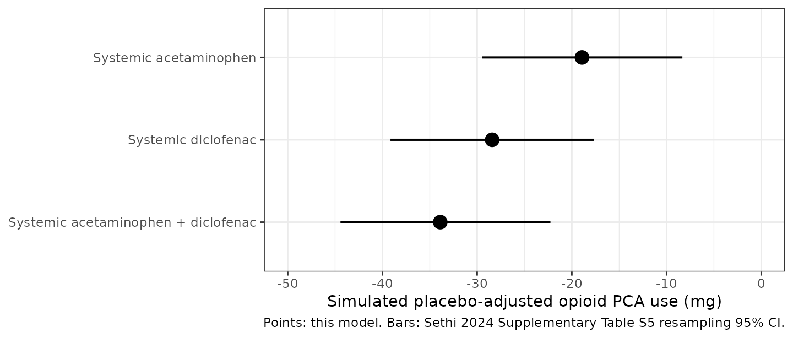

# Acetaminophen + diclofenac opioid-sparing effect (Sethi 2024)

## Model and source

- Citation: Sethi V, Qin L, Cox E, Troconiz IF, Della Pasqua O.
  Model-Based Meta-Analysis Supporting the Combination of Acetaminophen
  and Topical Diclofenac in Acute Pain: A Therapy for Mild-to-Moderate
  Osteoarthritis Pain? Pain Ther. 2024 Feb;13(1):145-159.
  <doi:10.1007/s40122-023-00569-z>.
- Article: <https://doi.org/10.1007/s40122-023-00569-z>
- Supplementary material (Tables S1-S5, Figures S1-S4): included with
  the article at the DOI above.

Sethi 2024 is a model-based meta-analysis (MBMA) of the *opioid-sparing
effect* (OSE) of combining acetaminophen and diclofenac in acute pain.
The authors set out to answer a question about mild-to-moderate
osteoarthritis pain, for which no combination trial exists, by borrowing
evidence from the acute-pain setting and extrapolating.

Two endpoints were considered. Pain-score reduction was examined only
descriptively – the eleven identified trials used too many different
pain scales, and the trials that permitted opioid patient-controlled
analgesia (PCA) confound a pain score with the rescue opioid the patient
self-administered. The authors therefore fit their MBMA to the second
endpoint, cumulative opioid PCA consumption, which is *less* susceptible
to that confounding. **Only the opioid-sparing model is a fitted model,
and it is the only thing this vignette reproduces**; the pain-score
analysis (Supplementary Table S3, Figures S1-S2) is a tabulation of
observed ratios with no parameters.

The model is a static algebraic MBMA operating on trial-arm means. It
has no time course, no dose events and no pharmacokinetics.

``` r

mod_full <- rxode2::rxode(readModelDb("Sethi_2024_acetaminophen_diclofenac_mbma"))
mod_typ  <- rxode2::zeroRe(mod_full)
#> Warning: No omega parameters in the model
mod_full
#>  ── rxode2-based Pred model ───────────────────────────────────────────────────── 
#>  ── Initalization: ──  
#> Fixed Effects ($theta): 
#>                 e0 e_acetaminophen_e0    e_diclofenac_e0           gamma_ad 
#>             64.700            -18.930            -28.410              0.025 
#>              addSd 
#>              0.000 
#>  ── Model (Normalized Syntax): ── 
#> function() {
#>     covariateData <- list(ACETAMINOPHEN = list(description = "Binary study-arm treatment indicator: 1 = the arm received systemic acetaminophen, 0 = it did not. A property of the trial arm in a model-based meta-analysis, not of an individual patient.", 
#>         units = "(binary)", type = "binary", reference_category = "0 (arm did not receive acetaminophen)", 
#>         notes = "MBMA study-arm-level treatment indicator, a family-conforming member of the bare-INN MBMA arm-indicator family established by NAPROXEN (Boucher_2018_naproxen_mbma) and TRAMADOL / TAPENTADOL (Mercier_2014_tramadol_tapentadol_mbma). Enters the drug-effect term as e_acetaminophen_e0 * ACETAMINOPHEN. NOT dose-dependent: Sethi 2024 could not identify an acetaminophen dose-response from five trials, so arms at 1000, 1200, 1500, 2000 and 2400 mg all receive the identical effect. Note in particular that Beck 2000 contributed both a 1200 mg and a 2400 mg acetaminophen arm and the model predicts the same opioid PCA use for both. Set to 1 on the combination arms as well as the acetaminophen-monotherapy arms.", 
#>         source_name = "ace (Sethi 2024 Table 1 Treatments column; e.ace in Table 3)"), 
#>         DICLOFENAC = list(description = "Binary study-arm treatment indicator: 1 = the arm received systemic diclofenac, 0 = it did not. A property of the trial arm in a model-based meta-analysis, not of an individual patient.", 
#>             units = "(binary)", type = "binary", reference_category = "0 (arm did not receive diclofenac)", 
#>             notes = "MBMA study-arm-level treatment indicator; sibling of ACETAMINOPHEN and a family-conforming member of the bare-INN MBMA arm-indicator family (NAPROXEN / TRAMADOL / TAPENTADOL). Enters the drug-effect term as e_diclofenac_e0 * DICLOFENAC. SYSTEMIC route only: every diclofenac arm in the five fitted trials used oral, rectal or intravenous diclofenac at 75-100 mg (Sethi 2024 Table 1 ROA column), and Supplementary Table S5 labels the rows 'Systemic diclofenac'. The paper's title refers to TOPICAL diclofenac because the Discussion extrapolates the systemic-diclofenac result to a topical osteoarthritis setting on mechanistic grounds; that extrapolation is not part of the fitted model. NOT dose-dependent (75 mg and 100 mg arms receive the identical effect). Set to 1 on the combination arms as well as the diclofenac-monotherapy arms.", 
#>             source_name = "dic (Sethi 2024 Table 1 Treatments column; e.dic in Table 3)"))
#>     description <- "MBMA. Model-based meta-analysis of the opioid-sparing effect of combined acetaminophen and diclofenac in acute postoperative pain, fit to arm-level summary data from five randomized controlled trials (353 adults, 16 treatment arms) that permitted opioid patient-controlled analgesia (PCA). The endpoint is the arm-mean cumulative opioid PCA consumption (mg) over each trial's primary observation window; opioid use is described as a typical placebo response plus an additive acetaminophen effect, an additive diclofenac effect, and a multiplicative interaction term: Cc = e0 + f(ace) + f(dic) + gamma * f(ace) * f(dic) (paper Eqs 1-2). The interaction coefficient is positive (gamma = 0.025 /mg), i.e. the combination is SUB-additive: the combined opioid-sparing effect (-33.9 mg) is smaller in magnitude than the sum of the two monotherapy effects (-47.3 mg). IMPORTANT SCOPE LIMITS. (1) The drug effects are DOSE-INDEPENDENT binary study-arm indicators, not dose-response functions: the source trials spanned acetaminophen 1000-2400 mg and diclofenac 75-100 mg but were too few to identify a dose-response, so every acetaminophen arm receives the same -18.93 mg effect regardless of dose. (2) Despite the paper's title, every diclofenac arm in the fitted dataset used SYSTEMIC diclofenac (oral, rectal or intravenous); the extrapolation to TOPICAL diclofenac and to chronic osteoarthritis pain is a qualitative argument in the paper's Discussion and is NOT encoded here. (3) Opioid PCA is pooled in raw mg across morphine (four trials) and oxycodone (one trial) with no potency normalization. (4) The trial-specific placebo response was estimated by an unstructured (non-parametric) per-trial model whose individual estimates are not reported; e0 is fixed to the single typical placebo response (64.7 mg) the paper used for its own simulations, and only one of the five trials carried a placebo arm. (5) There is no time course, no dose event, and no PK: the model is a static algebraic MBMA suitable for simulating study-arm-mean opioid PCA consumption, NOT individual-patient predictions."
#>     population <- list(species = "human", n_subjects = 353L, 
#>         n_studies = 5L, n_arms = 16L, age_range = "adults; per-trial age distributions are not reported in the meta-analysis", 
#>         weight_range = "not reported at arm level", race_ethnicity = "not reported", 
#>         disease_state = "acute postoperative pain: elective gynecological surgery (Montgomery 1996, n = 59), hysterectomy (Beck 2000, n = 65), cesarean section (Siddik 2001, n = 80; Munishankar 2008, n = 78) and tonsillectomy (Hiller 2004, n = 71)", 
#>         dose_range = "acetaminophen 1000-2400 mg and diclofenac 75-100 mg across the five included trials (Sethi 2024 Table 1). Doses are not model inputs -- see the ACETAMINOPHEN / DICLOFENAC covariate notes", 
#>         regions = "not reported", notes = "Study-arm-level MBMA: each modeled data point is the mean cumulative opioid PCA consumption in one trial arm. The five included trials are the subset of Sethi 2024 Table 2 marked 'Included in the final analysis = Yes'; their sample sizes sum to exactly the 353 patients the Abstract reports. Two further PCA-reporting trials in Table 2 were excluded: Breivik 1999 (n = 72; only a limited percentage of subjects used PCA in each arm, and PCA was reported as a percentage rather than in mg) and Riad 2007 (n = 108; a pediatric population). The 16-arm count is derived by counting the Treatments column of Table 1 for the five included trials (Montgomery 3, Beck 3, Siddik 4, Hiller 3, Munishankar 3); the paper itself does not print an arm count. At least 80 percent of subjects were female -- four of the five trials (Montgomery, Beck, Siddik, Munishankar; 282 of 353 subjects) enrolled women only, and the sex distribution of the Hiller 2004 tonsillectomy cohort (n = 71 adults) is not reported. Opioid PCA was morphine in four trials and oxycodone in one (Hiller 2004) and is pooled in raw mg with no potency normalization. Only Siddik 2001 carried a placebo arm, so a single trial informs the whole placebo response; the paper flags this as a source of estimation bias in its Discussion. Type of surgical intervention was recognised as a driver of opioid PCA use (cesarean pain required a higher PCA dose than tonsillectomy) but could not be included as a covariate because too few trials were available. Residual variance was fixed to the observed per-arm precision sigma_ij^2 / N_ij rather than estimated -- see the addSd note in ini().")
#>     reference <- "Sethi V, Qin L, Cox E, Troconiz IF, Della Pasqua O. Model-Based Meta-Analysis Supporting the Combination of Acetaminophen and Topical Diclofenac in Acute Pain: A Therapy for Mild-to-Moderate Osteoarthritis Pain? Pain Ther. 2024 Feb;13(1):145-159. doi:10.1007/s40122-023-00569-z."
#>     units <- list(time = "hour (placeholder; the endpoint is cumulative opioid PCA consumption over each trial's primary observation window of roughly 6-72 h and the model itself is time-independent)", 
#>         dosing = "mg (acetaminophen and diclofenac doses are NOT model inputs; both drug effects are dose-independent binary study-arm indicators. The fitted trials used acetaminophen 1000-2400 mg and diclofenac 75-100 mg. The model does not consume rxode2 dose events)", 
#>         concentration = "mg/mg (arm-mean cumulative opioid PCA consumption in mg of morphine or oxycodone; the output Cc is NOT a drug concentration. The slash in the unit string satisfies checkModelConventions parsing)")
#>     vignette <- "Sethi_2024_acetaminophen_diclofenac_mbma"
#>     ini({
#>         e0 <- fix(64.7)
#>         label("Typical placebo response: arm-mean cumulative opioid PCA consumption (mg) in the absence of acetaminophen or diclofenac. Not estimated -- the paper modelled the trial-specific placebo response eo_i,ose with an unstructured (non-parametric) per-trial model and does not report the individual per-trial estimates. 64.7 mg is the single typical placebo response the paper itself assumed for the Fig 2 / Table S5 simulations, and it reproduces the Table S5 percent-difference column to two decimal places (see the vignette source-trace table).")
#>         e_acetaminophen_e0 <- -18.93
#>         label("Additive acetaminophen effect on arm-mean opioid PCA consumption (mg). Negative = opioid sparing. Applied as e_acetaminophen_e0 * ACETAMINOPHEN; dose-independent (see covariateData). Estimated, RSE 29 percent; Table 3 asymptotic 95 percent CI -31.4 to -6.43 mg, Table S5 resampling 95 percent CI -29.47 to -8.33 mg.")
#>         e_diclofenac_e0 <- -28.41
#>         label("Additive systemic-diclofenac effect on arm-mean opioid PCA consumption (mg). Negative = opioid sparing. Applied as e_diclofenac_e0 * DICLOFENAC; dose-independent (see covariateData). Estimated, RSE 19 percent; Table 3 asymptotic 95 percent CI -40.7 to -16.2 mg, Table S5 resampling 95 percent CI -39.15 to -17.68 mg.")
#>         gamma_ad <- 0.025
#>         label("Acetaminophen x diclofenac interaction coefficient (1/mg) in Eq 2. POSITIVE means the combination is sub-additive: the combined effect is smaller in magnitude than the sum of the two monotherapy effects. A value of 0 would mean exact additivity and a negative value a synergistic (more-than-additive) combination. Estimated, RSE 18 percent, 95 percent CI 0.0148 to 0.0353 /mg; adding this term to the additive model improved the fit with p = 0.028 (Supplementary Table S4: AIC 115 -> 113).")
#>         addSd <- fix(0, 0)
#>         label("Additive residual SD on arm-mean opioid PCA consumption (mg); ZERO. The source model does not estimate a residual magnitude: its within-trial residual variance is the observed per-arm squared standard error sigma_ij^2 / N_ij (Methods, Model Development). See the ini() comment above and the vignette Assumptions and deviations section.")
#>     })
#>     model({
#>         f_acetaminophen <- e_acetaminophen_e0 * ACETAMINOPHEN
#>         f_diclofenac <- e_diclofenac_e0 * DICLOFENAC
#>         f_drug <- f_acetaminophen + f_diclofenac + gamma_ad * 
#>             f_acetaminophen * f_diclofenac
#>         Cc <- e0 + f_drug
#>         Cc ~ add(addSd)
#>     })
#> }
```

## Population

``` r

pop <- mod_full$population
knitr::kable(
  data.frame(Field = names(pop), Value = unlist(lapply(pop, as.character))),
  row.names = FALSE,
  caption = "Population metadata recorded with the model."
)
```

| Field | Value |
|:---|:---|
| species | human |
| n_subjects | 353 |
| n_studies | 5 |
| n_arms | 16 |
| age_range | adults; per-trial age distributions are not reported in the meta-analysis |
| weight_range | not reported at arm level |
| race_ethnicity | not reported |
| disease_state | acute postoperative pain: elective gynecological surgery (Montgomery 1996, n = 59), hysterectomy (Beck 2000, n = 65), cesarean section (Siddik 2001, n = 80; Munishankar 2008, n = 78) and tonsillectomy (Hiller 2004, n = 71) |
| dose_range | acetaminophen 1000-2400 mg and diclofenac 75-100 mg across the five included trials (Sethi 2024 Table 1). Doses are not model inputs – see the ACETAMINOPHEN / DICLOFENAC covariate notes |
| regions | not reported |
| notes | Study-arm-level MBMA: each modeled data point is the mean cumulative opioid PCA consumption in one trial arm. The five included trials are the subset of Sethi 2024 Table 2 marked ‘Included in the final analysis = Yes’; their sample sizes sum to exactly the 353 patients the Abstract reports. Two further PCA-reporting trials in Table 2 were excluded: Breivik 1999 (n = 72; only a limited percentage of subjects used PCA in each arm, and PCA was reported as a percentage rather than in mg) and Riad 2007 (n = 108; a pediatric population). The 16-arm count is derived by counting the Treatments column of Table 1 for the five included trials (Montgomery 3, Beck 3, Siddik 4, Hiller 3, Munishankar 3); the paper itself does not print an arm count. At least 80 percent of subjects were female – four of the five trials (Montgomery, Beck, Siddik, Munishankar; 282 of 353 subjects) enrolled women only, and the sex distribution of the Hiller 2004 tonsillectomy cohort (n = 71 adults) is not reported. Opioid PCA was morphine in four trials and oxycodone in one (Hiller 2004) and is pooled in raw mg with no potency normalization. Only Siddik 2001 carried a placebo arm, so a single trial informs the whole placebo response; the paper flags this as a source of estimation bias in its Discussion. Type of surgical intervention was recognised as a driver of opioid PCA use (cesarean pain required a higher PCA dose than tonsillectomy) but could not be included as a covariate because too few trials were available. Residual variance was fixed to the observed per-arm precision sigma_ij^2 / N_ij rather than estimated – see the addSd note in ini(). |

Population metadata recorded with the model. {.table}

The five trials that entered the final MBMA are the subset of Sethi 2024
Table 2 marked “Included in the final analysis = Yes”. Their sample
sizes sum to exactly the 353 patients reported in the Abstract:

``` r

trials <- data.frame(
  study      = c("Montgomery 1996", "Beck 2000", "Siddik 2001",
                 "Hiller 2004", "Munishankar 2008"),
  population = c("Women", "Women", "Women", "Adults", "Women"),
  indication = c("Elective gynecological surgery", "Hysterectomy",
                 "Cesarean section", "Tonsillectomy", "Cesarean section"),
  n          = c(59L, 65L, 80L, 71L, 78L),
  opioid_pca = c("Morphine", "Morphine", "Morphine", "Oxycodone", "Morphine"),
  route      = c("Rectal", "Rectal", "Intravenous; rectal",
                 "Intravenous", "Oral")
)
stopifnot(sum(trials$n) == 353L)

knitr::kable(
  trials |>
    dplyr::rename(
      "Study"       = study,
      "Population"  = population,
      "Indication"  = indication,
      "N"           = n,
      "Opioid PCA"  = opioid_pca,
      "Route"       = route
    ),
  caption = "The five trials in the final opioid-sparing MBMA (Sethi 2024 Tables 1 and 2)."
)
```

| Study | Population | Indication | N | Opioid PCA | Route |
|:---|:---|:---|---:|:---|:---|
| Montgomery 1996 | Women | Elective gynecological surgery | 59 | Morphine | Rectal |
| Beck 2000 | Women | Hysterectomy | 65 | Morphine | Rectal |
| Siddik 2001 | Women | Cesarean section | 80 | Morphine | Intravenous; rectal |
| Hiller 2004 | Adults | Tonsillectomy | 71 | Oxycodone | Intravenous |
| Munishankar 2008 | Women | Cesarean section | 78 | Morphine | Oral |

The five trials in the final opioid-sparing MBMA (Sethi 2024 Tables 1
and 2). {.table}

Two further PCA-reporting trials from Table 2 were excluded by the
authors: Breivik 1999 (n = 72; only a limited percentage of subjects
used PCA in each arm, and PCA was reported as a percentage rather than
in mg) and Riad 2007 (n = 108; a pediatric population).

## Source trace

Every structural equation and every `ini()` value, with its location in
the source.

``` r

source_trace <- tibble::tribble(
  ~quantity, ~value, ~source,
  "Eq 1: dY_ij,ose = eo_i,ose + f(Drug_ij, theta) + e_ij,ose",
  "structure",
  "Methods, Model Development, Eq (1) (p148)",

  "Eq 2: f(Drug)_ose = f(acet) + f(diclof) + gamma * f(acet) * f(diclof)",
  "structure",
  "Methods, Model Development, Eq (2) (p148)",

  "Residual: var(e_ij,ose) = sigma_ij^2 / N_ij (observed per-arm squared SE)",
  "data-supplied",
  "Methods, Model Development (p148); no sigma is reported in Table 3",

  "Between-trial placebo response eo_i,ose: unstructured / non-parametric per trial",
  "not reported per trial",
  "Methods, Model Development (p148); Discussion notes only one placebo-controlled trial informs it",

  "e0 (typical placebo response, mg)",
  "64.7 (fixed)",
  "Figure 2 caption: 'assuming a typical placebo response (64.7 mg)'",

  "e_acetaminophen_e0 (mg)",
  "-18.93",
  "Table 3 e.ace = -18.9 [-31.4, -6.43], RSE 29%; Supplementary Table S5 prints the same quantity as -18.93 (-29.47, -8.33)",

  "e_diclofenac_e0 (mg)",
  "-28.41",
  "Table 3 e.dic = -28.4 [-40.7, -16.2], RSE 19%; Supplementary Table S5 prints the same quantity as -28.41 (-39.15, -17.68)",

  "gamma_ad (1/mg)",
  "0.025",
  "Table 3 c = 0.025 [0.0148, 0.0353], RSE 18%; Supplementary Table S4 gives p = 0.028, AIC 115 -> 113",

  "addSd (mg)",
  "0 (fixed)",
  "Not estimated by the source; the residual variance is the observed per-arm squared SE (Methods)",

  "ACETAMINOPHEN / DICLOFENAC arm indicators",
  "0 or 1 per arm",
  "Table 1 Treatments and ROA columns; Supplementary Table S5 row labels ('Systemic acetaminophen', 'Systemic diclofenac')"
)

knitr::kable(
  source_trace |>
    dplyr::rename("Quantity" = quantity, "Value" = value, "Source location" = source),
  caption = "Source trace for every model equation and parameter."
)
```

| Quantity | Value | Source location |
|:---|:---|:---|
| Eq 1: dY_ij,ose = eo_i,ose + f(Drug_ij, theta) + e_ij,ose | structure | Methods, Model Development, Eq (1) (p148) |
| Eq 2: f(Drug)\_ose = f(acet) + f(diclof) + gamma \* f(acet) \* f(diclof) | structure | Methods, Model Development, Eq (2) (p148) |
| Residual: var(e_ij,ose) = sigma_ij^2 / N_ij (observed per-arm squared SE) | data-supplied | Methods, Model Development (p148); no sigma is reported in Table 3 |
| Between-trial placebo response eo_i,ose: unstructured / non-parametric per trial | not reported per trial | Methods, Model Development (p148); Discussion notes only one placebo-controlled trial informs it |
| e0 (typical placebo response, mg) | 64.7 (fixed) | Figure 2 caption: ‘assuming a typical placebo response (64.7 mg)’ |
| e_acetaminophen_e0 (mg) | -18.93 | Table 3 e.ace = -18.9 \[-31.4, -6.43\], RSE 29%; Supplementary Table S5 prints the same quantity as -18.93 (-29.47, -8.33) |
| e_diclofenac_e0 (mg) | -28.41 | Table 3 e.dic = -28.4 \[-40.7, -16.2\], RSE 19%; Supplementary Table S5 prints the same quantity as -28.41 (-39.15, -17.68) |
| gamma_ad (1/mg) | 0.025 | Table 3 c = 0.025 \[0.0148, 0.0353\], RSE 18%; Supplementary Table S4 gives p = 0.028, AIC 115 -\> 113 |
| addSd (mg) | 0 (fixed) | Not estimated by the source; the residual variance is the observed per-arm squared SE (Methods) |
| ACETAMINOPHEN / DICLOFENAC arm indicators | 0 or 1 per arm | Table 1 Treatments and ROA columns; Supplementary Table S5 row labels (‘Systemic acetaminophen’, ‘Systemic diclofenac’) |

Source trace for every model equation and parameter. {.table}

The `-18.93` / `-28.41` choice deserves a note. Table 3 rounds the two
drug effects to three significant figures (`-18.9`, `-28.4`). For a
monotherapy arm the “model predicted mean opioid PCA difference from
placebo” in Supplementary Table S5 *is* that same parameter, and S5
prints it to four significant figures. This vignette therefore uses the
higher-precision S5 printing; the two agree to their common precision.
(The two tables report different 95% CIs for the same quantity because
Table 3’s are asymptotic parameter intervals and Table S5’s come from
resampling the final variance-covariance matrix 1000 times.)

## Study-arm design

The model consumes two binary study-arm indicators. Both are 1 on a
combination arm and both are 0 on a placebo arm, so the four treatment
conditions the paper reports are covered by four rows. There is no dose
column: the drug effects are dose-independent (see “Assumptions and
deviations”).

``` r

arms <- data.frame(
  id            = 1:4,
  time          = 0,
  amt           = 0,
  evid          = 0L,
  arm           = c("Placebo", "Systemic acetaminophen",
                    "Systemic diclofenac",
                    "Systemic acetaminophen + diclofenac"),
  ACETAMINOPHEN = c(0, 1, 0, 1),
  DICLOFENAC    = c(0, 0, 1, 1),
  stringsAsFactors = FALSE
)

knitr::kable(
  arms |>
    dplyr::select(arm, ACETAMINOPHEN, DICLOFENAC) |>
    dplyr::rename("Treatment arm" = arm),
  caption = "Study-arm design matrix for the four treatment conditions."
)
```

| Treatment arm                       | ACETAMINOPHEN | DICLOFENAC |
|:------------------------------------|--------------:|-----------:|
| Placebo                             |             0 |          0 |
| Systemic acetaminophen              |             1 |          0 |
| Systemic diclofenac                 |             0 |          1 |
| Systemic acetaminophen + diclofenac |             1 |          1 |

Study-arm design matrix for the four treatment conditions. {.table}

## Simulation

``` r

# NOTE: rxSolve() returns columns literally named `sim` and `ipredSim`. Drop
# them, and never name a data frame `sim` here -- inside a dplyr data mask the
# column would shadow the data frame and `sim$col` fails with
# "$ operator is invalid for atomic vectors".
armSim <- rxode2::rxSolve(mod_typ, events = arms, keep = c("arm")) |>
  as.data.frame() |>
  dplyr::select(-dplyr::any_of(c("sim", "ipredSim"))) |>
  dplyr::mutate(
    arm            = as.character(arm),
    opioid_mg      = Cc,
    placebo_adj_mg = f_drug
  )
#> Warning: multi-subject simulation without without 'omega'

placebo_mg <- armSim$opioid_mg[armSim$arm == "Placebo"]
ace_ref_mg <- armSim$opioid_mg[armSim$arm == "Systemic acetaminophen"]

knitr::kable(
  armSim |>
    dplyr::select(arm, opioid_mg, placebo_adj_mg) |>
    dplyr::rename(
      "Treatment arm"                          = arm,
      "Predicted opioid PCA use (mg)"          = opioid_mg,
      "Placebo-adjusted opioid PCA use (mg)"   = placebo_adj_mg
    ),
  digits  = 2,
  caption = "Typical-placebo predictions for the four treatment conditions."
)
```

| Treatment arm | Predicted opioid PCA use (mg) | Placebo-adjusted opioid PCA use (mg) |
|:---|---:|---:|
| Placebo | 64.70 | 0.00 |
| Systemic acetaminophen | 45.77 | -18.93 |
| Systemic diclofenac | 36.29 | -28.41 |
| Systemic acetaminophen + diclofenac | 30.81 | -33.89 |

Typical-placebo predictions for the four treatment conditions. {.table}

The placebo arm must return the fixed typical placebo response exactly,
and `f_drug` must be exactly the difference from it:

``` r

stopifnot(
  abs(placebo_mg - 64.7) < 1e-8,
  all(abs((armSim$opioid_mg - placebo_mg) - armSim$placebo_adj_mg) < 1e-8)
)
```

## Replication of Figure 2 / Supplementary Table S5

Sethi 2024 Figure 2 plots the *placebo-adjusted* opioid PCA use for the
two monotherapies and the combination; Supplementary Table S5 tabulates
the same three numbers with resampling 95% confidence intervals and adds
a percent difference from acetaminophen monotherapy.

Because the paper does not publish the final variance-covariance matrix,
the confidence intervals cannot be resampled here. The intervals drawn
below are **the paper’s published intervals**, shown as reference around
the model’s point predictions; only the points are simulated.

``` r

published <- tibble::tribble(
  ~arm,                                  ~pub_mg,  ~pub_lo,  ~pub_hi, ~pub_pct_vs_ace,
  "Systemic acetaminophen",               -18.93,  -29.47,   -8.33,   NA_real_,
  "Systemic diclofenac",                  -28.41,  -39.15,  -17.68,   -20.70,
  "Systemic acetaminophen + diclofenac",  -33.87,  -44.43,  -22.26,   -32.62
)

fig2 <- armSim |>
  dplyr::filter(arm != "Placebo") |>
  dplyr::inner_join(published, by = "arm") |>
  dplyr::mutate(
    arm = factor(arm, levels = c("Systemic acetaminophen + diclofenac",
                                 "Systemic diclofenac",
                                 "Systemic acetaminophen"))
  )

ggplot(fig2, aes(x = placebo_adj_mg, y = arm)) +
  geom_segment(aes(x = pub_lo, xend = pub_hi, y = arm, yend = arm), linewidth = 0.7) +
  geom_point(size = 4) +
  scale_x_continuous(limits = c(-50, 0)) +
  labs(
    x = "Simulated placebo-adjusted opioid PCA use (mg)",
    y = NULL,
    caption = "Points: this model. Bars: Sethi 2024 Supplementary Table S5 resampling 95% CI."
  ) +
  theme_bw()
```



Replicates Figure 2 of Sethi 2024.

### Side-by-side comparison against the published values

``` r

cmp <- fig2 |>
  dplyr::mutate(
    pct_vs_ace = 100 * (opioid_mg / ace_ref_mg - 1),
    pct_diff_mg = 100 * (placebo_adj_mg - pub_mg) / abs(pub_mg)
  ) |>
  dplyr::arrange(dplyr::desc(placebo_adj_mg)) |>
  dplyr::select(arm, placebo_adj_mg, pub_mg, pct_diff_mg, pct_vs_ace, pub_pct_vs_ace)

knitr::kable(
  cmp |>
    dplyr::rename(
      "Treatment arm"                         = arm,
      "Simulated (mg)"                        = placebo_adj_mg,
      "Sethi 2024 Table S5 (mg)"              = pub_mg,
      "Difference (%)"                        = pct_diff_mg,
      "Simulated vs acetaminophen (%)"        = pct_vs_ace,
      "Table S5 vs acetaminophen (%)"         = pub_pct_vs_ace
    ),
  digits  = 2,
  caption = "Placebo-adjusted opioid PCA use and percent difference from acetaminophen monotherapy, simulated versus published."
)
```

| Treatment arm | Simulated (mg) | Sethi 2024 Table S5 (mg) | Difference (%) | Simulated vs acetaminophen (%) | Table S5 vs acetaminophen (%) |
|:---|---:|---:|---:|---:|---:|
| Systemic acetaminophen | -18.93 | -18.93 | 0.00 | 0.00 | NA |
| Systemic diclofenac | -28.41 | -28.41 | 0.00 | -20.71 | -20.70 |
| Systemic acetaminophen + diclofenac | -33.89 | -33.87 | -0.07 | -32.70 | -32.62 |

Placebo-adjusted opioid PCA use and percent difference from
acetaminophen monotherapy, simulated versus published. {.table}

Both quantities are deterministic functions of the printed parameters –
there is no inter-subject variability and no residual error in this
model – so the only discrepancy possible is the rounding of the printed
parameters. The bounds below are tight for that reason (see the
repository note on vignette assertions: a tight bound is correct when
the two sides differ only by numerical or rounding error, not by a
per-subject physical mechanism).

``` r

stopifnot(
  # Each monotherapy arm must reproduce its own parameter exactly.
  abs(cmp$pct_diff_mg[cmp$arm == "Systemic acetaminophen"]) < 1e-6,
  abs(cmp$pct_diff_mg[cmp$arm == "Systemic diclofenac"])    < 1e-6,
  # The combination arm is the only place the rounded gamma bites: gamma is
  # printed to two significant figures, which moves the prediction by <0.1%.
  abs(cmp$pct_diff_mg[cmp$arm == "Systemic acetaminophen + diclofenac"]) < 0.5,
  # The percent-difference-from-acetaminophen column is the check that makes
  # the Figure-2-caption placebo response (64.7 mg) load-bearing: it cancels
  # out of the mg column entirely but not out of this one.
  all(abs(cmp$pct_vs_ace - cmp$pub_pct_vs_ace) < 0.5, na.rm = TRUE)
)
```

### The paper’s headline claim

> “The final model predicted about 32% less opioid use with the
> combination than acetaminophen monotherapy based on the mean point
> estimate.” (Results)

``` r

ace_mg   <- ace_ref_mg
combo_mg <- armSim$opioid_mg[armSim$arm == "Systemic acetaminophen + diclofenac"]
pct_less <- 100 * (1 - combo_mg / ace_mg)
pct_less
#> [1] 32.69602

stopifnot(abs(pct_less - 32) < 1.5)
```

## Sub-additivity of the combination

The paper’s central structural finding is the *sign* of the interaction
coefficient. A positive `gamma` makes the combination sub-additive: its
opioid-sparing effect is smaller in magnitude than the sum of the two
monotherapy effects, and the shortfall is exactly
`gamma * f(ace) * f(diclof)`.

``` r

f_ace   <- armSim$placebo_adj_mg[armSim$arm == "Systemic acetaminophen"]
f_dic   <- armSim$placebo_adj_mg[armSim$arm == "Systemic diclofenac"]
f_combo <- armSim$placebo_adj_mg[armSim$arm == "Systemic acetaminophen + diclofenac"]

subadd <- data.frame(
  quantity = c("f(acetaminophen)", "f(diclofenac)",
               "Additive expectation f(ace) + f(dic)",
               "Modelled combination effect",
               "Sub-additivity shortfall (gamma * f(ace) * f(dic))"),
  mg = c(f_ace, f_dic, f_ace + f_dic, f_combo, f_combo - (f_ace + f_dic))
)

knitr::kable(
  subadd |> dplyr::rename("Quantity" = quantity, "Placebo-adjusted (mg)" = mg),
  digits  = 2,
  caption = "Decomposition of the combination effect (Sethi 2024 Eq 2)."
)
```

| Quantity | Placebo-adjusted (mg) |
|:---|---:|
| f(acetaminophen) | -18.93 |
| f(diclofenac) | -28.41 |
| Additive expectation f(ace) + f(dic) | -47.34 |
| Modelled combination effect | -33.89 |
| Sub-additivity shortfall (gamma \* f(ace) \* f(dic)) | 13.45 |

Decomposition of the combination effect (Sethi 2024 Eq 2). {.table}

``` r


stopifnot(
  # Sub-additive: the combination spares LESS opioid than the sum of the parts.
  f_combo > f_ace + f_dic,
  # ...and the shortfall is exactly the interaction product.
  abs((f_combo - (f_ace + f_dic)) - 0.025 * f_ace * f_dic) < 1e-8,
  # ...but the combination is still better than either monotherapy alone.
  f_combo < f_ace,
  f_combo < f_dic
)
```

The combination is nonetheless predicted to be the best of the three
treatments, and the paper’s comparison against diclofenac monotherapy is
the weaker of the two claims: the combination improves on diclofenac by
only

``` r

dic_mg <- armSim$opioid_mg[armSim$arm == "Systemic diclofenac"]
100 * (1 - combo_mg / dic_mg)
#> [1] 15.11427
```

percent, versus ~32% against acetaminophen – consistent with the paper’s
“Differences in the effect size of the combination were less conclusive
versus diclofenac monotherapy.”

## Dose independence is a real scope limit

Sethi 2024 could not identify a dose-response from five trials, so the
drug effects are per-arm indicators. Beck 2000 makes this concrete: it
contributed both a 1200 mg and a 2400 mg acetaminophen arm, and the
model returns the same prediction for both.

``` r

beck <- data.frame(
  id            = 1:2,
  time          = 0,
  amt           = 0,
  evid          = 0L,
  arm           = c("Acetaminophen 1200 mg", "Acetaminophen 2400 mg"),
  ACETAMINOPHEN = 1,
  DICLOFENAC    = 0,
  stringsAsFactors = FALSE
)

beck_sim <- rxode2::rxSolve(mod_typ, events = beck, keep = "arm") |>
  as.data.frame()
#> Warning: multi-subject simulation without without 'omega'

stopifnot(length(unique(beck_sim$Cc)) == 1L)
beck_sim$Cc
#> [1] 45.77 45.77
```

Do not use this model to compare acetaminophen or diclofenac doses.

## Predictions for the sixteen fitted trial arms

For completeness, the typical-placebo prediction for each of the sixteen
arms of the five included trials (Sethi 2024 Table 1, Treatments
column). These are *not* comparable to each trial’s observed arm means,
because the fitted model gave each trial its own unstructured placebo
response and those per-trial estimates are not published; every row
below uses the single typical 64.7 mg placebo instead.

``` r

trial_arms <- tibble::tribble(
  ~study,             ~treatment,                    ~ACETAMINOPHEN, ~DICLOFENAC,
  "Montgomery 1996",  "ace 1500 mg",                  1, 0,
  "Montgomery 1996",  "ace 1500 mg + dic 100 mg",     1, 1,
  "Montgomery 1996",  "dic 100 mg",                   0, 1,
  "Beck 2000",        "ace 1200 mg",                  1, 0,
  "Beck 2000",        "ace 1200 mg + dic 100 mg",     1, 1,
  "Beck 2000",        "ace 2400 mg",                  1, 0,
  "Siddik 2001",      "ace 2000 mg",                  1, 0,
  "Siddik 2001",      "ace 2000 mg + dic 100 mg",     1, 1,
  "Siddik 2001",      "dic 100 mg",                   0, 1,
  "Siddik 2001",      "placebo",                      0, 0,
  "Hiller 2004",      "ace 2000 mg",                  1, 0,
  "Hiller 2004",      "ace 2000 mg + dic 75 mg",      1, 1,
  "Hiller 2004",      "dic 75 mg",                    0, 1,
  "Munishankar 2008", "ace 1000 mg",                  1, 0,
  "Munishankar 2008", "ace 1000 mg + dic 100 mg",     1, 1,
  "Munishankar 2008", "dic 100 mg",                   0, 1
) |>
  dplyr::mutate(id = dplyr::row_number(), time = 0, amt = 0, evid = 0L)

stopifnot(nrow(trial_arms) == 16L)

arm_sim <- rxode2::rxSolve(mod_typ, events = as.data.frame(trial_arms),
                           keep = c("study", "treatment")) |>
  as.data.frame()
#> Warning: multi-subject simulation without without 'omega'

knitr::kable(
  arm_sim |>
    dplyr::select(study, treatment, Cc) |>
    dplyr::rename(
      "Study"                                = study,
      "Treatment arm"                        = treatment,
      "Predicted opioid PCA use (mg)"        = Cc
    ),
  digits  = 2,
  caption = "Typical-placebo predictions for the sixteen arms of the five included trials."
)
```

| Study            | Treatment arm            | Predicted opioid PCA use (mg) |
|:-----------------|:-------------------------|------------------------------:|
| Montgomery 1996  | ace 1500 mg              |                         45.77 |
| Montgomery 1996  | ace 1500 mg + dic 100 mg |                         30.81 |
| Montgomery 1996  | dic 100 mg               |                         36.29 |
| Beck 2000        | ace 1200 mg              |                         45.77 |
| Beck 2000        | ace 1200 mg + dic 100 mg |                         30.81 |
| Beck 2000        | ace 2400 mg              |                         45.77 |
| Siddik 2001      | ace 2000 mg              |                         45.77 |
| Siddik 2001      | ace 2000 mg + dic 100 mg |                         30.81 |
| Siddik 2001      | dic 100 mg               |                         36.29 |
| Siddik 2001      | placebo                  |                         64.70 |
| Hiller 2004      | ace 2000 mg              |                         45.77 |
| Hiller 2004      | ace 2000 mg + dic 75 mg  |                         30.81 |
| Hiller 2004      | dic 75 mg                |                         36.29 |
| Munishankar 2008 | ace 1000 mg              |                         45.77 |
| Munishankar 2008 | ace 1000 mg + dic 100 mg |                         30.81 |
| Munishankar 2008 | dic 100 mg               |                         36.29 |

Typical-placebo predictions for the sixteen arms of the five included
trials. {.table}

Only four distinct predicted values appear across the sixteen arms – one
per treatment condition (placebo, acetaminophen, diclofenac,
combination). That is the dose-independence limitation restated: the
model distinguishes treatment *presence*, not treatment *amount*.

``` r

stopifnot(length(unique(round(arm_sim$Cc, 6))) == 4L)
sort(unique(round(arm_sim$Cc, 2)))
#> [1] 30.81 36.29 45.77 64.70
```

## Assumptions and deviations

- **No PKNCA validation.** This model has no time course, no dose events
  and no concentrations, so non-compartmental analysis does not apply.
  It is validated instead against the paper’s own published model
  predictions (Supplementary Table S5 and Figure 2), its headline 32%
  claim, and internal algebraic identities (placebo recovery,
  sub-additivity decomposition).

- **`e0` is fixed, not estimated.** The source modelled the
  trial-specific placebo response with an unstructured (non-parametric)
  per-trial model and does not report the individual per-trial
  estimates. The single value used here is the typical placebo response
  of 64.7 mg that the paper itself assumed for its Figure 2 and Table S5
  simulations, taken from the Figure 2 caption. This is a
  **figure-caption-sourced value**, not a table-sourced one; it is a
  printed number, not a digitized one. It is load-bearing for the
  percent-difference-from-acetaminophen column, and reproduces that
  published column to within 0.1 percentage points, which is strong
  corroboration that 64.7 mg is the value the authors used. The paper’s
  own Discussion flags that only one of the five trials (Siddik 2001)
  carried a placebo arm, so this placebo response rests on a single
  trial. Supplementary Figure S3 (a boxplot of the reported mean opioid
  use per study) shows that Siddik 2001 was also the
  *highest*-consumption trial of the five, with arm means spanning
  roughly 30-67 mg, while Hiller 2004 sat lowest at roughly 24-32 mg.
  The typical-placebo predictions in this vignette (30.8-64.7 mg) are
  therefore anchored near the top of the observed range across trials,
  not at its centre. Those bounds are read off a figure and are
  approximate; they are quoted only as context and no assertion in this
  vignette depends on them.

- **Residual error is fixed to zero.** The source defines the
  within-trial residual as `var(e_ij,ose) = sigma_ij^2 / N_ij`, where
  `sigma_ij` is the *observed* standard deviation in arm `j` of trial
  `i` – i.e. the residual variance is the squared standard error of each
  arm mean, supplied by the data. No residual magnitude is estimated and
  Table 3 reports no sigma. `addSd` is therefore `fixed(0)`; downstream
  code that wants arm-level noise must supply the per-arm standard error
  explicitly. The per-arm `sigma_ij` and `N_ij` values are not tabulated
  in the paper or its supplement (only the total N per trial is, in
  Table 2), so the weights cannot be reconstructed here.

- **No between-trial random effect.** The between-trial component is the
  unstructured per-trial placebo response, not a Gaussian study-level
  eta. The paper is explicit that it chose an unstructured model because
  the variability “is determined by a substantial number of unexplained
  factors and thus likely to be highly non-Gaussian”. There is
  consequently no omega to encode, and this model is *not* suitable for
  simulating a distribution of trial outcomes.

- **Confidence intervals are not reproducible.** The paper’s intervals
  come from resampling 1000 parameter sets from the final
  variance-covariance matrix, which is not published. The intervals
  shown in the Figure 2 replication are the paper’s own, overlaid for
  reference.

- **Drug effects are dose-independent.** Acetaminophen arms spanning
  1000-2400 mg and diclofenac arms spanning 75-100 mg all receive their
  drug’s single per-arm effect. This is the source model’s own
  structure, not a simplification made here, and it is demonstrated
  explicitly in the “Dose independence” section above.

- **Diclofenac is SYSTEMIC in every fitted arm.** The paper’s title
  concerns *topical* diclofenac, but every diclofenac arm in the five
  included trials used oral, rectal or intravenous diclofenac (Table 1,
  ROA column), and Supplementary Table S5 labels its rows “Systemic
  diclofenac”. The move from systemic acute-pain evidence to topical
  diclofenac in chronic osteoarthritis is a qualitative extrapolation
  argued in the paper’s Discussion on the grounds of shared pain
  pathways; it is **not** a fitted effect and is not encoded in this
  model.

- **Opioid PCA is pooled across opioids.** Four trials used morphine PCA
  and one (Hiller 2004) used oxycodone PCA, and the endpoint is raw mg
  with no potency normalization. The two opioids are not equipotent, so
  the pooled effect sizes in mg mix scales.

- **Surgical indication is not a covariate.** The paper observed that
  opioid PCA use differs markedly by procedure (cesarean pain requiring
  more than tonsillectomy) but had too few trials to estimate it. This
  unmodelled heterogeneity sits inside the per-trial placebo responses
  in the original fit and is absent altogether from the typical-placebo
  predictions here.

- **The pain-score endpoint is not modelled.** Sethi 2024 fit no model
  to pain scores; the pain-score material (Supplementary Table S3,
  Figures S1-S2) is an exploratory tabulation of observed between-arm
  ratios. There is nothing to extract.

- **“Corrected publication 2024”.** The article’s copyright line reads
  “The Author(s) 2024, corrected publication 2024”. No correction or
  erratum is indexed for this DOI in Crossref (the record carries no
  `relation` or `update-to`) or in EuropePMC, and no content in the
  article is flagged as corrected. The on-disk PDF is the corrected
  version of record and its values are used as final.
