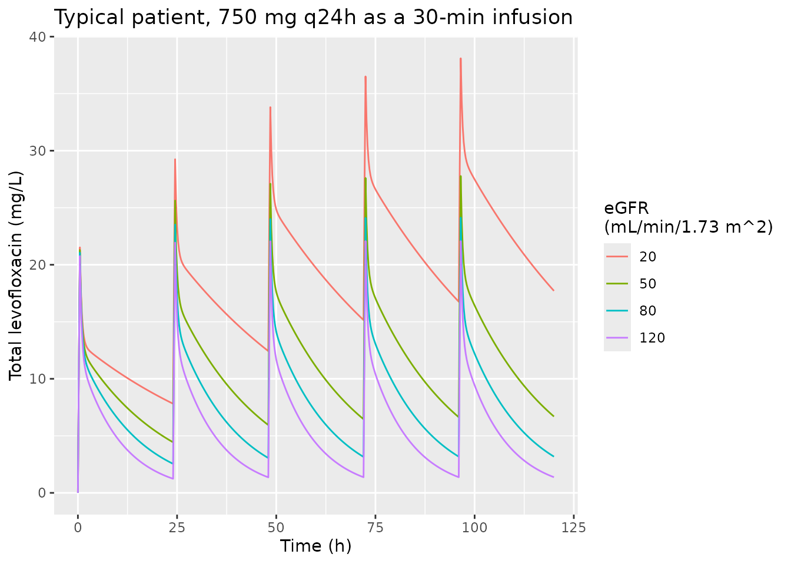
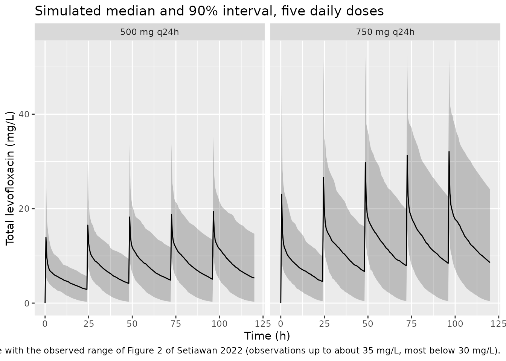
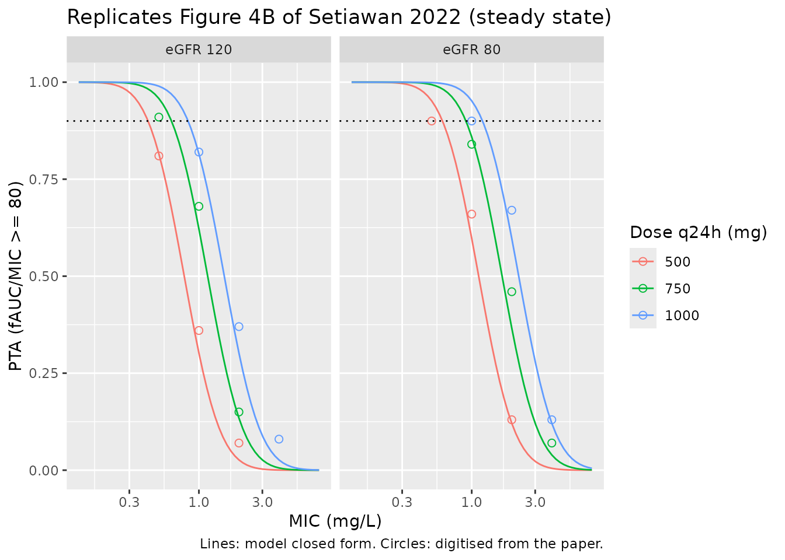

# Levofloxacin (Setiawan 2022)

## Model and source

``` r

mod <- readModelDb("Setiawan_2022_levofloxacin")
ui <- rxode2::rxode(mod)
#> ℹ parameter labels from comments will be replaced by 'label()'
```

- Citation: Setiawan E, Abdul-Aziz MH, Cotta MO, Susaniwati S, Cahjono
  H, Sari IY, Wibowo T, Marpaung FR, Roberts JA. Population
  pharmacokinetics and dose optimization of intravenous levofloxacin in
  hospitalized adult patients. Sci Rep. 2022;12:8930.
  <doi:10.1038/s41598-022-12627-1>. PMCID: PMC9142570.
- Article: <https://doi.org/10.1038/s41598-022-12627-1> (open access, CC
  BY 4.0)
- Model: `Setiawan_2022_levofloxacin`

Two-compartment intravenous population PK model for levofloxacin in
hospitalised adult patients (ICU and non-ICU wards) in Surabaya,
Indonesia, most of them treated for pneumonia. Fitted non-parametrically
with the NPAG algorithm in Pmetrics 1.9. Clearance is a linear function
of the CKD-EPI estimated glomerular filtration rate, CL = 0.044 \*
eGFR + 0.358 L/h (Results); central volume, intercompartmental clearance
and peripheral volume carry no covariates. Inter-individual variability
is a log-normal approximation to the published NPAG CV%. The unbound
concentration Cu = 0.7 \* Cc is exposed using the fixed 30% protein
binding the authors applied in their fAUC0-24/MIC Monte Carlo
simulations. Residual unexplained variability is carried as fixed(0)
because the Pmetrics assay-error polynomial and the selected
lambda/gamma term were never published.

## Population

Twenty-six hospitalised adults in two hospitals in Surabaya, Indonesia,
received intravenous levofloxacin 500 mg or 750 mg once daily as a
30-minute infusion, with the regimen left to the treating team (Table
1). Six were in the intensive care unit (four of them mechanically
ventilated) and twenty on general wards; 88.5% were treated for
pneumonia. Mean age was 58.8 +/- 16.4 years, 61.5% were male and mean
weight was 61.6 +/- 12.1 kg (weight was recorded in only 11 patients).
Renal function was markedly reduced: mean serum creatinine 1.99 +/- 1.48
mg/dL and mean CKD-EPI eGFR 52.7 +/- 33.7 mL/min/1.73 m^2. Patients
planned for renal replacement therapy or ECMO were excluded. Up to six
blood samples were drawn within one dosing interval, and 121
concentrations entered the analysis.

``` r

str(ui$population[c("n_subjects", "n_concentrations", "sex_female_pct",
                    "renal_function", "dose_range")])
#> List of 5
#>  $ n_subjects      : int 26
#>  $ n_concentrations: int 121
#>  $ sex_female_pct  : num 38.5
#>  $ renal_function  : chr "Serum creatinine mean 1.99 +/- 1.48 mg/dL; eGFR CKD-EPI mean 52.7 +/- 33.7 mL/min/1.73 m^2"
#>  $ dose_range      : chr "500 mg or 750 mg once daily as a 30-minute intravenous infusion (500 mg: 8 patients; 750 mg: 14; 500 then 750 m"| __truncated__
```

## Source trace

Every value is also carried as an in-file comment next to its `ini()`
entry in `inst/modeldb/specificDrugs/Setiawan_2022_levofloxacin.R`.

| Model element | Value | Source location |
|----|----|----|
| Structural model | 2-compartment, IV infusion, first-order elimination | Results “Population PK model”; Table 2 model-selection block (two-compartment with Q: -2LL 256 vs 393 for one compartment) |
| Covariate model | CL = 0.044 x eGFR + 0.358 | Results “Population PK model” (the printed equation); Table 2 final row (-2LL 250, AIC 261) |
| `lcl` (CL intercept) | 0.358 L/h | Results equation |
| `e_crcl_cl` (eGFR slope) | 0.044 L/h per mL/min/1.73 m^2 | Results equation |
| `lvc` | 27.6 L | Table 2, Vc mean (also Abstract) |
| `lq` | 30.9 L/h | Table 2, Q mean |
| `lvp` | 28.2 L | Table 2, Vp mean (also Abstract) |
| `etalcl` | log(0.52^2 + 1) = 0.2393 | Table 2, CL CV% 52 |
| `etalvc` | log(0.693^2 + 1) = 0.3922 | Table 2, Vc CV% 69.3 |
| `etalq` | log(0.532^2 + 1) = 0.2492 | Table 2, Q CV% 53.2 |
| `etalvp` | log(0.577^2 + 1) = 0.2874 | Table 2, Vp CV% 57.7 |
| `fu` | 0.70 (fixed) | Methods “Dosing simulations”: protein binding set at 30% |
| `propSd`, `addSd` | 0 (fixed) | Not reported; Methods says only that lambda and gamma error models were tested |
| Infusion duration | 30 min | Methods “Drug administration” |
| PK/PD target | fAUC0-24/MIC \>= 80 | Methods “Dosing simulations” |

## Typical-value profiles across renal function

The authors simulated four renal-function levels, eGFR 20, 50, 80 and
120 mL/min/1.73 m^2. The typical clearance at each is the printed
equation evaluated there.

``` r

th <- ui$theta
egfr_levels <- c(20, 50, 80, 120)
cl_typ <- exp(th[["lcl"]]) + th[["e_crcl_cl"]] * egfr_levels
knitr::kable(
  tibble::tibble(
    "eGFR (mL/min/1.73 m^2)" = egfr_levels,
    "Typical CL (L/h)" = cl_typ,
    "Typical terminal t1/2 (h)" = NA_real_
  ) |>
    dplyr::mutate(`Typical terminal t1/2 (h)` = vapply(cl_typ, function(cl) {
      vc <- exp(th[["lvc"]]); q <- exp(th[["lq"]]); vp <- exp(th[["lvp"]])
      a <- cl / vc + q / vc + q / vp
      b <- (cl / vc) * (q / vp)
      log(2) / ((a - sqrt(a^2 - 4 * b)) / 2)
    }, numeric(1))),
  digits = 2,
  caption = "Typical clearance and terminal half-life at the four simulated eGFR levels."
)
```

| eGFR (mL/min/1.73 m^2) | Typical CL (L/h) | Typical terminal t1/2 (h) |
|-----------------------:|-----------------:|--------------------------:|
|                     20 |             1.24 |                     31.56 |
|                     50 |             2.56 |                     15.45 |
|                     80 |             3.88 |                     10.30 |
|                    120 |             5.64 |                      7.19 |

Typical clearance and terminal half-life at the four simulated eGFR
levels. {.table}

``` r

mk_events <- function(dose, tau, n_dose, egfr, id, t_end, dt = 0.25) {
  doses <- data.frame(
    id = id, time = (seq_len(n_dose) - 1) * tau, amt = dose, rate = dose / 0.5,
    evid = 1L, cmt = "central", CRCL = egfr
  )
  obs <- data.frame(
    id = id, time = seq(0, t_end, by = dt), amt = NA_real_, rate = NA_real_,
    evid = 0L, cmt = "central", CRCL = egfr
  )
  dplyr::bind_rows(doses, obs) |> dplyr::arrange(id, time, dplyr::desc(evid))
}

ev_typ <- dplyr::bind_rows(lapply(seq_along(egfr_levels), function(i) {
  mk_events(750, 24, 5, egfr_levels[i], id = i, t_end = 120)
}))

sim_typ <- rxode2::rxSolve(rxode2::zeroRe(mod), events = ev_typ,
                           keep = "CRCL") |>
  as.data.frame()
#> ℹ parameter labels from comments will be replaced by 'label()'
#> ℹ omega/sigma items treated as zero: 'etalcl', 'etalvc', 'etalq', 'etalvp'
#> Warning: multi-subject simulation without without 'omega'
if (is.null(sim_typ$id)) sim_typ$id <- 1L

ggplot(sim_typ, aes(time, Cc, colour = factor(CRCL))) +
  geom_line() +
  labs(x = "Time (h)", y = "Total levofloxacin (mg/L)",
       colour = "eGFR\n(mL/min/1.73 m^2)",
       title = "Typical patient, 750 mg q24h as a 30-min infusion")
```



## Virtual cohort and stochastic simulation

The cohort below draws eGFR from a log-normal distribution matching the
Table 1 mean and SD (52.7 +/- 33.7 mL/min/1.73 m^2), truncated to the
5-150 range, and gives each arm five daily 30-minute infusions. 200
subjects per arm.

``` r

rxode2::rxSetSeed(20220527)
n_per_arm <- 200
sdlog <- sqrt(log(1 + (33.7 / 52.7)^2))
meanlog <- log(52.7) - sdlog^2 / 2
draw_egfr <- function(n) {
  x <- rlnorm(4 * n, meanlog, sdlog)
  x <- x[x >= 5 & x <= 150]
  x[seq_len(n)]
}
set.seed(20220527)
cohort <- tibble::tibble(
  id = seq_len(2 * n_per_arm),
  treatment = rep(c("500 mg q24h", "750 mg q24h"), each = n_per_arm),
  dose = rep(c(500, 750), each = n_per_arm),
  CRCL = draw_egfr(2 * n_per_arm)
)
summary(cohort$CRCL)
#>    Min. 1st Qu.  Median    Mean 3rd Qu.    Max. 
#>   9.158  31.112  43.969  51.018  66.100 146.579

ev_vpc <- dplyr::bind_rows(lapply(seq_len(nrow(cohort)), function(i) {
  mk_events(cohort$dose[i], 24, 5, cohort$CRCL[i], id = cohort$id[i],
            t_end = 120, dt = 0.5)
}))

sim_vpc <- rxode2::rxSolve(mod, events = ev_vpc, keep = "CRCL") |>
  as.data.frame() |>
  dplyr::left_join(cohort |> dplyr::select(id, treatment, dose), by = "id")
#> ℹ parameter labels from comments will be replaced by 'label()'

vpc_sum <- sim_vpc |>
  dplyr::group_by(treatment, time) |>
  dplyr::summarise(
    p05 = quantile(Cc, 0.05), p50 = median(Cc), p95 = quantile(Cc, 0.95),
    .groups = "drop"
  )

ggplot(vpc_sum, aes(time, p50)) +
  geom_ribbon(aes(ymin = p05, ymax = p95), alpha = 0.25) +
  geom_line() +
  facet_wrap(~treatment) +
  labs(x = "Time (h)", y = "Total levofloxacin (mg/L)",
       title = "Simulated median and 90% interval, five daily doses",
       caption = paste("Compare with the observed range of Figure 2 of Setiawan 2022",
                       "(observations up to about 35 mg/L, most below 30 mg/L)."))
```



Figure 2 of the paper is a VPC on the study’s own irregular dosing and
sampling history, so it cannot be overlaid directly. On the first day
the simulated 90% interval one hour after a 750 mg dose (about 8-28
mg/L) lies within the range of the observations, most of which are below
30 mg/L. By day 5, accumulation in patients with low eGFR lifts the 95th
percentile to about 50 mg/L, which is later than most of the paper’s
samples.

## PKNCA validation

The paper reports no NCA table. The NCA is therefore validated against
the exact steady-state identity `AUC(0-tau) = Dose / CL`, applied to the
typical-value patient at each eGFR level under a steady-state (`ss = 1`)
regimen. Both sides use the same parameters with no residual error, so
the difference is numerical error and a tight bound is correct. The
stochastic cohort is then summarised by treatment arm for day 1 and day
5.

``` r

ev_ss <- dplyr::bind_rows(lapply(seq_along(egfr_levels), function(i) {
  dplyr::bind_rows(
    data.frame(id = i, time = 0, amt = 750, rate = 1500, evid = 1L, ss = 1L,
               ii = 24, cmt = "central", CRCL = egfr_levels[i]),
    data.frame(id = i, time = c(seq(0, 1, by = 0.05), seq(1.25, 24, by = 0.25)),
               amt = NA_real_, rate = NA_real_, evid = 0L, ss = 0L, ii = 0,
               cmt = "central", CRCL = egfr_levels[i])
  )
}))
sim_ss <- rxode2::rxSolve(rxode2::zeroRe(mod), events = ev_ss, keep = "CRCL",
                          rtol = 1e-10, atol = 1e-12, ssRtol = 1e-10,
                          ssAtol = 1e-12, maxsteps = 1e6) |>
  as.data.frame()
#> ℹ parameter labels from comments will be replaced by 'label()'
#> ℹ omega/sigma items treated as zero: 'etalcl', 'etalvc', 'etalq', 'etalvp'
#> Warning: multi-subject simulation without without 'omega'
stopifnot(all(sim_ss$Cc >= -1e-6 * max(sim_ss$Cc)))

conc_ss <- sim_ss |>
  dplyr::filter(!is.na(Cc)) |>
  dplyr::mutate(Cc = pmax(Cc, 0), treatment = paste0("eGFR ", CRCL))
stopifnot(all(tapply(conc_ss$time == 0, conc_ss$id, any)))
dose_ss <- conc_ss |>
  dplyr::distinct(id, treatment) |>
  dplyr::mutate(time = 0, amt = 750)

nca_ss <- PKNCA::pk.nca(PKNCA::PKNCAdata(
  PKNCA::PKNCAconc(conc_ss, Cc ~ time | treatment + id),
  PKNCA::PKNCAdose(dose_ss, amt ~ time | treatment + id),
  intervals = data.frame(start = 0, end = 24, auclast = TRUE, cmax = TRUE,
                         cmin = TRUE)
))

ss_tab <- as.data.frame(nca_ss) |>
  dplyr::select(treatment, PPTESTCD, PPORRES) |>
  tidyr::pivot_wider(names_from = PPTESTCD, values_from = PPORRES) |>
  dplyr::mutate(
    identity = 750 / (exp(th[["lcl"]]) +
                        th[["e_crcl_cl"]] * as.numeric(sub("eGFR ", "", treatment))),
    err_pct = 100 * (auclast / identity - 1)
  )

knitr::kable(
  ss_tab |>
    dplyr::rename(
      "Typical patient" = treatment, "AUC0-24,ss (mg*h/L)" = auclast,
      "Cmax,ss (mg/L)" = cmax, "Cmin,ss (mg/L)" = cmin,
      "Dose/CL (mg*h/L)" = identity, "Error (%)" = err_pct
    ),
  digits = 3,
  caption = "PKNCA on the typical-value steady-state 750 mg q24h profile against Dose/CL."
)
```

| Typical patient | AUC0-24,ss (mg\*h/L) | Cmax,ss (mg/L) | Cmin,ss (mg/L) | Dose/CL (mg\*h/L) | Error (%) |
|:---|---:|---:|---:|---:|---:|
| eGFR 120 | 133.051 | 22.074 | 1.373 | 133.026 | 0.019 |
| eGFR 20 | 605.844 | 40.394 | 19.079 | 605.816 | 0.005 |
| eGFR 50 | 293.225 | 27.868 | 6.725 | 293.198 | 0.009 |
| eGFR 80 | 193.425 | 24.137 | 3.178 | 193.399 | 0.013 |

PKNCA on the typical-value steady-state 750 mg q24h profile against
Dose/CL. {.table style="width:100%;"}

``` r


stopifnot(
  nrow(ss_tab) == 4,
  # Linear-up / log-down trapezoids on a 0.05-0.25 h grid; the residual error is
  # the trapezoid rule on the infusion peak, well under 0.1%. A mis-typed slope
  # or intercept moves Dose/CL by tens of percent.
  max(abs(ss_tab$err_pct)) < 0.5
)
```

``` r

conc_vpc <- sim_vpc |>
  dplyr::filter(!is.na(Cc)) |>
  dplyr::mutate(Cc = pmax(Cc, 0))
dose_vpc <- ev_vpc |>
  dplyr::filter(evid == 1) |>
  dplyr::left_join(cohort |> dplyr::select(id, treatment), by = "id") |>
  dplyr::select(id, treatment, time, amt)

nca_vpc <- PKNCA::pk.nca(PKNCA::PKNCAdata(
  PKNCA::PKNCAconc(conc_vpc, Cc ~ time | treatment + id),
  PKNCA::PKNCAdose(dose_vpc, amt ~ time | treatment + id),
  intervals = data.frame(start = c(0, 96), end = c(24, 120), auclast = TRUE,
                         cmax = TRUE, cmin = TRUE)
))

summary(nca_vpc)
#>  start end   treatment   N    auclast        cmax       cmin
#>      0  24 500 mg q24h 200 116 [39.8] 13.4 [52.1]         NC
#>     96 120 500 mg q24h 200 197 [62.6] 19.4 [38.5] 3.71 [209]
#>      0  24 750 mg q24h 200 183 [45.1] 22.0 [54.3]         NC
#>     96 120 750 mg q24h 200 306 [67.7] 31.3 [41.2] 5.46 [245]
#> 
#> Caption: auclast, cmax, cmin: geometric mean and geometric coefficient of variation; N: number of subjects
```

## Replicating the published PTA (Figures 3 and 4)

The paper’s dosing simulations target fAUC0-24/MIC \>= 80 with 30%
protein binding. At steady state the AUC over a dosing interval is
exactly `Dose / CL`, so for a q24h regimen the steady-state PTA follows
in closed form from the model’s own clearance distribution,
`PTA(MIC) = P(CL <= fu x Dose / (80 x MIC))`, with CL log-normal around
the eGFR-predicted typical value. That makes the comparison
deterministic.

The published points were digitised by the maintainers from panel B
(steady state) of Figures 3 and 4; only points strictly inside the 0-1
range are used.

``` r

fu <- th[["fu"]]
om_cl <- sqrt(ui$omega["etalcl", "etalcl"])
pta_ss <- function(egfr, dose, mic) {
  tv <- exp(th[["lcl"]]) + th[["e_crcl_cl"]] * egfr
  stats::plnorm(fu * dose / (80 * mic), log(tv), om_cl)
}

pub_ss <- tibble::tribble(
  ~egfr, ~dose, ~mic, ~pta_pub,
  50, 750, 2, 0.73,
  50, 750, 4, 0.18,
  80, 500, 0.5, 0.90,
  80, 500, 1, 0.66,
  80, 500, 2, 0.13,
  80, 750, 1, 0.84,
  80, 750, 2, 0.46,
  80, 750, 4, 0.07,
  80, 1000, 1, 0.90,
  80, 1000, 2, 0.67,
  80, 1000, 4, 0.13,
  120, 500, 0.5, 0.81,
  120, 500, 1, 0.36,
  120, 500, 2, 0.07,
  120, 750, 0.5, 0.91,
  120, 750, 1, 0.68,
  120, 750, 2, 0.15,
  120, 1000, 1, 0.82,
  120, 1000, 2, 0.37,
  120, 1000, 4, 0.08
) |>
  dplyr::mutate(
    pta_model = pta_ss(egfr, dose, mic),
    diff = pta_model - pta_pub
  )

knitr::kable(
  pub_ss |>
    dplyr::rename(
      "eGFR" = egfr, "Dose q24h (mg)" = dose, "MIC (mg/L)" = mic,
      "PTA published (Fig. 3B/4B)" = pta_pub, "PTA model" = pta_model,
      "Difference" = diff
    ),
  digits = 2,
  caption = "Steady-state PTA: closed form from the model against the digitised published curves."
)
```

| eGFR | Dose q24h (mg) | MIC (mg/L) | PTA published (Fig. 3B/4B) | PTA model | Difference |
|---:|---:|---:|---:|---:|---:|
| 50 | 750 | 2.0 | 0.73 | 0.69 | -0.04 |
| 50 | 750 | 4.0 | 0.18 | 0.18 | 0.00 |
| 80 | 500 | 0.5 | 0.90 | 0.95 | 0.05 |
| 80 | 500 | 1.0 | 0.66 | 0.60 | -0.06 |
| 80 | 500 | 2.0 | 0.13 | 0.12 | -0.01 |
| 80 | 750 | 1.0 | 0.84 | 0.86 | 0.02 |
| 80 | 750 | 2.0 | 0.46 | 0.37 | -0.09 |
| 80 | 750 | 4.0 | 0.07 | 0.04 | -0.03 |
| 80 | 1000 | 1.0 | 0.90 | 0.95 | 0.05 |
| 80 | 1000 | 2.0 | 0.67 | 0.60 | -0.07 |
| 80 | 1000 | 4.0 | 0.13 | 0.12 | -0.01 |
| 120 | 500 | 0.5 | 0.81 | 0.82 | 0.01 |
| 120 | 500 | 1.0 | 0.36 | 0.30 | -0.06 |
| 120 | 500 | 2.0 | 0.07 | 0.03 | -0.04 |
| 120 | 750 | 0.5 | 0.91 | 0.96 | 0.05 |
| 120 | 750 | 1.0 | 0.68 | 0.62 | -0.06 |
| 120 | 750 | 2.0 | 0.15 | 0.13 | -0.02 |
| 120 | 1000 | 1.0 | 0.82 | 0.82 | 0.00 |
| 120 | 1000 | 2.0 | 0.37 | 0.30 | -0.07 |
| 120 | 1000 | 4.0 | 0.08 | 0.03 | -0.05 |

Steady-state PTA: closed form from the model against the digitised
published curves. {.table style="width:100%;"}

``` r


stopifnot(
  nrow(pub_ss) == 20,
  # Deterministic (no simulation). Realised median |diff| 0.046 and maximum
  # 0.094; digitising error is about +/-0.02. The scaling table below shows the
  # bound can go red: scaling clearance by the Table 2 CL mean (1.12) gives a
  # maximum |diff| of 0.18.
  median(abs(pub_ss$diff)) < 0.06,
  max(abs(pub_ss$diff)) < 0.12
)
```

Which reading of the Table 2 CL row is right (see Assumptions)? Scaling
the equation’s typical clearance shows what the paper’s own PTA curves
allow:

``` r

scale_fit <- tibble::tibble(scale = c(0.90, 1, 1.12)) |>
  dplyr::mutate(
    med = vapply(scale, function(s) {
      median(abs(pta_ss(pub_ss$egfr, pub_ss$dose / s, pub_ss$mic) - pub_ss$pta_pub))
    }, numeric(1)),
    mx = vapply(scale, function(s) {
      max(abs(pta_ss(pub_ss$egfr, pub_ss$dose / s, pub_ss$mic) - pub_ss$pta_pub))
    }, numeric(1)),
    reading = c("Table 2 CL median (0.90) x equation", "Equation as printed (encoded)",
                "Table 2 CL mean (1.12) x equation")
  )
knitr::kable(
  scale_fit |>
    dplyr::select(reading, scale, med, mx) |>
    dplyr::rename("Typical clearance" = reading, "Scale on equation" = scale,
                  "Median |diff|" = med, "Max |diff|" = mx),
  digits = 3,
  caption = "Steady-state PTA fit against the 20 digitised points for three readings of Table 2."
)
```

| Typical clearance | Scale on equation | Median \|diff\| | Max \|diff\| |
|:---|---:|---:|---:|
| Table 2 CL median (0.90) x equation | 0.90 | 0.037 | 0.070 |
| Equation as printed (encoded) | 1.00 | 0.046 | 0.094 |
| Table 2 CL mean (1.12) x equation | 1.12 | 0.061 | 0.177 |

Steady-state PTA fit against the 20 digitised points for three readings
of Table 2. {.table}

``` r

stopifnot(
  # The encoded reading must not be clearly worse than the 0.90 alternative and
  # must beat the 1.12 reading on the worst point.
  scale_fit$mx[2] < scale_fit$mx[3],
  scale_fit$med[2] < scale_fit$med[1] + 0.02
)
```

``` r

ss_curve <- tidyr::expand_grid(
  egfr = c(80, 120), dose = c(500, 750, 1000),
  mic = 2^seq(-3, 3, by = 0.1)
) |>
  dplyr::mutate(pta = pta_ss(egfr, dose, mic))

ggplot(ss_curve, aes(mic, pta, colour = factor(dose))) +
  geom_line() +
  geom_point(data = pub_ss |> dplyr::filter(egfr %in% c(80, 120)),
             aes(y = pta_pub), shape = 1, size = 2) +
  facet_wrap(~ paste("eGFR", egfr)) +
  scale_x_log10() +
  geom_hline(yintercept = 0.9, linetype = "dotted") +
  labs(x = "MIC (mg/L)", y = "PTA (fAUC/MIC >= 80)", colour = "Dose q24h (mg)",
       title = "Replicates Figure 4B of Setiawan 2022 (steady state)",
       caption = "Lines: model closed form. Circles: digitised from the paper.")
```



### First 24 hours

On day 1 the AUC over 0-24 h also depends on the distribution volumes,
so it is simulated: 200 subjects at each of eGFR 80 and 120, given a
single 1000 mg 30-minute infusion. Because the model is linear, the AUC
for 500 and 750 mg is the 1000 mg AUC scaled by dose, so one cohort per
eGFR level serves all three regimens (common random numbers).

``` r

rxode2::rxSetSeed(20220528)
ev_d1 <- dplyr::bind_rows(lapply(seq_len(2 * n_per_arm), function(i) {
  mk_events(1000, 24, 1, ifelse(i <= n_per_arm, 80, 120), id = i, t_end = 24,
            dt = 0.25)
}))
sim_d1 <- rxode2::rxSolve(mod, events = ev_d1, keep = "CRCL") |>
  as.data.frame() |>
  dplyr::filter(!is.na(Cc)) |>
  dplyr::mutate(Cc = pmax(Cc, 0), treatment = paste0("eGFR ", CRCL))

nca_d1 <- PKNCA::pk.nca(PKNCA::PKNCAdata(
  PKNCA::PKNCAconc(sim_d1, Cc ~ time | treatment + id),
  PKNCA::PKNCAdose(sim_d1 |> dplyr::distinct(treatment, id) |>
                     dplyr::mutate(time = 0, amt = 1000),
                   amt ~ time | treatment + id),
  intervals = data.frame(start = 0, end = 24, auclast = TRUE)
))
auc_d1 <- as.data.frame(nca_d1) |>
  dplyr::filter(PPTESTCD == "auclast") |>
  dplyr::mutate(egfr = as.numeric(sub("eGFR ", "", treatment))) |>
  dplyr::select(id, egfr, auc1000 = PPORRES)
stopifnot(nrow(auc_d1) == 2 * n_per_arm)

pub_d1 <- tibble::tribble(
  ~egfr, ~dose, ~mic, ~pta_pub, ~source, ~deviation,
  80, 500, 0.5, 0.89, "Fig. 4A", FALSE,
  80, 500, 1, 0.48, "Fig. 4A", TRUE,
  80, 750, 2, 0.08, "Fig. 4A", FALSE,
  80, 1000, 1, 0.88, "Fig. 4A", FALSE,
  80, 1000, 2, 0.49, "Fig. 4A", TRUE,
  120, 500, 0.5, 0.80, "Fig. 4A", FALSE,
  120, 500, 1, 0.16, "Fig. 4A", FALSE,
  120, 750, 0.5, 0.893, "Results text (89.3%)", FALSE,
  120, 1000, 1, 0.71, "Fig. 4A", FALSE,
  120, 1000, 2, 0.16, "Fig. 4A", FALSE
)
pub_d1$pta_model <- vapply(seq_len(nrow(pub_d1)), function(i) {
  a <- auc_d1$auc1000[auc_d1$egfr == pub_d1$egfr[i]] * pub_d1$dose[i] / 1000
  if (length(a) != n_per_arm) stop("no cohort for eGFR ", pub_d1$egfr[i])
  mean(fu * a / pub_d1$mic[i] >= 80)
}, numeric(1))
pub_d1$diff <- pub_d1$pta_model - pub_d1$pta_pub

knitr::kable(
  pub_d1 |>
    dplyr::rename(
      "eGFR" = egfr, "Dose (mg)" = dose, "MIC (mg/L)" = mic,
      "PTA published" = pta_pub, "Source" = source, "PTA model" = pta_model,
      "Difference" = diff, "Known deviation" = deviation
    ),
  digits = 2,
  caption = "First-24-h PTA: simulated cohort (200 per eGFR level) against the published values."
)
```

| eGFR | Dose (mg) | MIC (mg/L) | PTA published | Source | Known deviation | PTA model | Difference |
|---:|---:|---:|---:|:---|:---|---:|---:|
| 80 | 500 | 0.5 | 0.89 | Fig. 4A | FALSE | 0.92 | 0.03 |
| 80 | 500 | 1.0 | 0.48 | Fig. 4A | TRUE | 0.22 | -0.26 |
| 80 | 750 | 2.0 | 0.08 | Fig. 4A | FALSE | 0.04 | -0.04 |
| 80 | 1000 | 1.0 | 0.88 | Fig. 4A | FALSE | 0.92 | 0.04 |
| 80 | 1000 | 2.0 | 0.49 | Fig. 4A | TRUE | 0.22 | -0.27 |
| 120 | 500 | 0.5 | 0.80 | Fig. 4A | FALSE | 0.72 | -0.09 |
| 120 | 500 | 1.0 | 0.16 | Fig. 4A | FALSE | 0.12 | -0.04 |
| 120 | 750 | 0.5 | 0.89 | Results text (89.3%) | FALSE | 0.94 | 0.04 |
| 120 | 1000 | 1.0 | 0.71 | Fig. 4A | FALSE | 0.72 | 0.01 |
| 120 | 1000 | 2.0 | 0.16 | Fig. 4A | FALSE | 0.12 | -0.04 |

First-24-h PTA: simulated cohort (200 per eGFR level) against the
published values. {.table}

``` r


gated <- pub_d1[!pub_d1$deviation, ]
stopifnot(
  nrow(gated) == 8,
  # Simulated: each model PTA carries a binomial SE of up to 0.035 at n = 200,
  # and the cohort differs across rxode2 builds and thread counts, so gate on
  # the centre of the differences with headroom over that noise.
  abs(median(gated$diff)) < 0.08,
  max(abs(gated$diff)) < 0.20,
  # The two known deviations stay visibly low; if they ever reproduce, revisit
  # the explanation below.
  all(pub_d1$diff[pub_d1$deviation] < 0)
)
```

**Known deviation.** At eGFR 80 the model’s first-day PTA sits well
below the published curve in the middle of its fall (about 0.2-0.3 lower
at MIC 1 mg/L for 500 mg and MIC 2 mg/L for 1000 mg), while the end
points of the curve, the eGFR 120 panel and every steady-state point
agree. Steady-state PTA depends on clearance alone, whereas day-1 AUC
also depends on how fast a subject reaches its terminal phase. With
independent etas, the low-clearance subjects who pass the target are
often ones with large volumes and long half-lives, and these accumulate
least on day 1. NPAG estimates the joint density of all four parameters,
including covariances the paper does not report. A positive CL-V
correlation would remove that penalty. As a sensitivity check, the chunk
below removes the volume and Q variability altogether and re-simulates
the eGFR 80 cohort. That raises the two deviating PTAs toward the
published values, which supports the mechanism, but does not close the
gap. The rest cannot be reproduced from the published summary
statistics, and the parameters have not been tuned to it.

``` r

mod_cl_only <- mod |>
  rxode2::ini(etalvc ~ 1e-6, etalq ~ 1e-6, etalvp ~ 1e-6)
#> ℹ parameter labels from comments will be replaced by 'label()'
#> ℹ change initial estimate of `etalvc` to `1e-06`
#> ℹ change initial estimate of `etalq` to `1e-06`
#> ℹ change initial estimate of `etalvp` to `1e-06`
rxode2::rxSetSeed(20220529)
sim_s <- rxode2::rxSolve(mod_cl_only,
                         events = ev_d1[ev_d1$id <= n_per_arm, ],
                         keep = "CRCL") |>
  as.data.frame() |>
  dplyr::filter(!is.na(Cc)) |>
  dplyr::group_by(id) |>
  dplyr::summarise(auc1000 = sum(diff(time) * (head(Cc, -1) + tail(Cc, -1)) / 2))
sens <- pub_d1 |>
  dplyr::filter(deviation) |>
  dplyr::mutate(pta_cl_only = vapply(seq_len(dplyr::n()), function(i) {
    mean(fu * sim_s$auc1000 * dose[i] / 1000 / mic[i] >= 80)
  }, numeric(1)))
knitr::kable(
  sens |>
    dplyr::select(egfr, dose, mic, pta_pub, pta_model, pta_cl_only) |>
    dplyr::rename("eGFR" = egfr, "Dose (mg)" = dose, "MIC (mg/L)" = mic,
                  "PTA published" = pta_pub, "PTA model" = pta_model,
                  "PTA, IIV on CL only" = pta_cl_only),
  digits = 2,
  caption = "Day-1 PTA at the two deviating points with and without volume/Q IIV."
)
```

| eGFR | Dose (mg) | MIC (mg/L) | PTA published | PTA model | PTA, IIV on CL only |
|-----:|----------:|-----------:|--------------:|----------:|--------------------:|
|   80 |       500 |          1 |          0.48 |      0.22 |                0.38 |
|   80 |      1000 |          2 |          0.49 |      0.22 |                0.38 |

Day-1 PTA at the two deviating points with and without volume/Q IIV.
{.table style="width:100%;"}

## Assumptions and deviations

- **Typical clearance is the printed equation, not the Table 2 CL row.**
  The Results state that “the CL of levofloxacin was best described as
  CL = (0.044 x eGFR CKD-EPI) + 0.358”, and that is encoded verbatim.
  Table 2 separately lists CL with mean 1.12 L/h, median 0.90 L/h and CV
  52%, and the Abstract and Discussion quote 1.12 L/h as “the population
  estimate for clearance”. The two cannot both be the clearance of a
  typical patient: the equation reaches 1.12 L/h only at eGFR 17
  mL/min/1.73 m^2, against a cohort mean of 52.7. The most likely
  explanation is that the Pmetrics model multiplied a random scaling
  factor (median 0.90, close to 1) by the eGFR relationship, which the
  paper does not state. The paper’s own steady-state PTA curves settle
  what matters in practice (table in the PTA section). With the equation
  as the typical clearance and a 52% CV, the closed-form PTA reproduces
  the 20 digitised points with a median absolute difference of about
  0.05. Scaling by the median 0.90 fits about as well, within digitising
  error. Scaling by the mean 1.12 fits worse, with a worst point 0.18
  off. The printed equation is therefore kept unscaled, and the CV% is
  kept as the IIV on clearance.
- **Volumes and Q use the Table 2 MEANS**, the values quoted in the
  Abstract and the convention of the same group’s ampicillin-sulbactam
  model (`Setiawan_2023_sulbactam`). The medians differ by at most 7% (Q
  33.2 vs 30.9 L/h).
- **IIV is a log-normal approximation** to the non-parametric NPAG
  density, `omega^2 = log(CV^2 + 1)`, with independent etas because no
  covariances are reported. Whatever shape the joint density has,
  including any multimodality, cannot be recovered from the published
  tables.
- **Residual error is fixed to zero.** The selected lambda/gamma error
  model and the assay-error polynomial are not reported in the paper or
  its supplement. Simulated concentrations are therefore error-free
  individual predictions.
- **Covariate scope.** Only eGFR is used; it is the CKD-EPI creatinine
  equation in mL/min/1.73 m^2 and is passed as `CRCL`. Sex, serum
  creatinine, ICU admission and mechanical ventilation were screened and
  not retained, and are recorded under `covariatesDataExcluded`. The
  linear relationship has no floor, so the model should not be used
  outside the range observed or for patients on renal replacement
  therapy.
- **Virtual cohort.** The VPC cohort draws eGFR log-normally to match
  the Table 1 mean and SD, truncated to 5-150 mL/min/1.73 m^2. The paper
  does not report the eGFR range.
- **Steady state in the paper.** The authors evaluated “steady state” on
  the fifth treatment day. At eGFR 20 the typical terminal half-life
  exceeds a day (table above), so day 5 is not yet at steady state
  there. The closed-form comparison above therefore uses only q24h
  regimens at eGFR 50, 80 and 120.
- **Digitised values.** The published PTA points were read by the
  maintainers from Figures 3B, 4A and 4B to about +/-0.02. One first-day
  value (89.3%, 750 mg q24h, eGFR 120, MIC 0.5 mg/L) is printed in the
  Results.

## Errata

No erratum or correction to Setiawan 2022 was found in a Europe PMC
search (checked 2026-10-01). Two internal inconsistencies of the paper
are noted:

- The Table 2 CL row (mean 1.12 L/h) disagrees with the printed CL
  equation; see the first item above.
- Table 1 reports albumin as “2.80 +/- 0.50 g/l”, which is consistent
  with g/dL. Albumin is not a model covariate.
