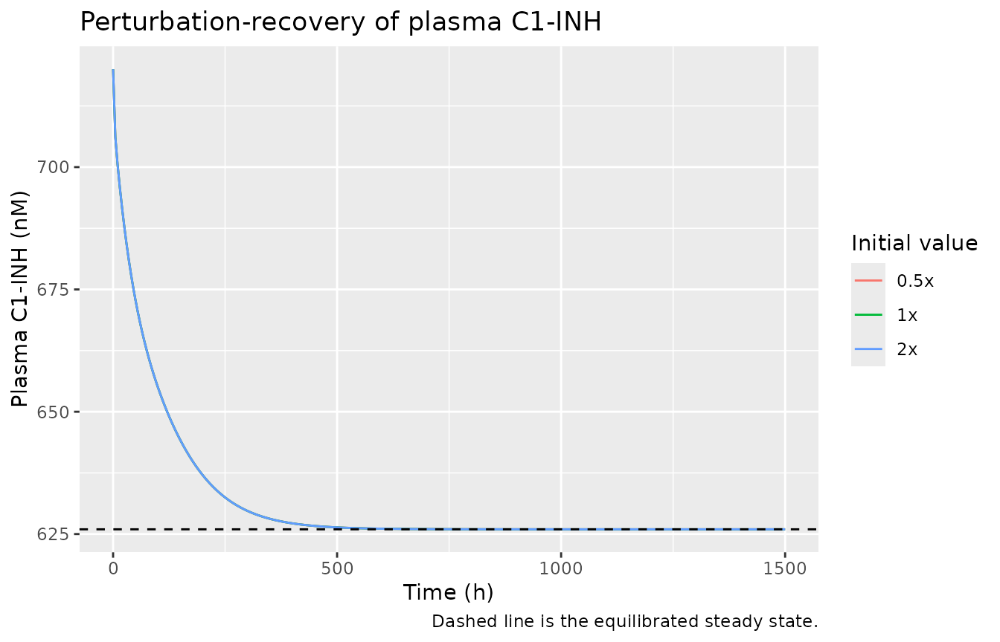
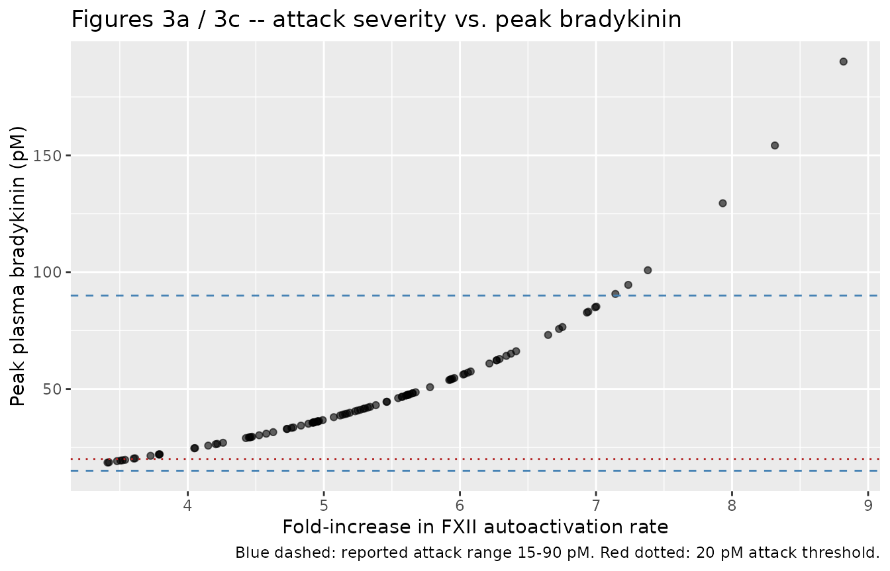
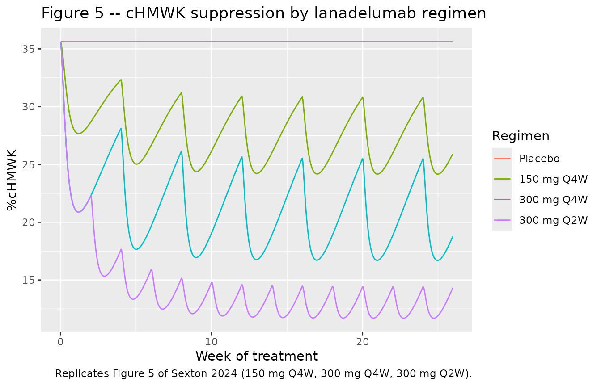
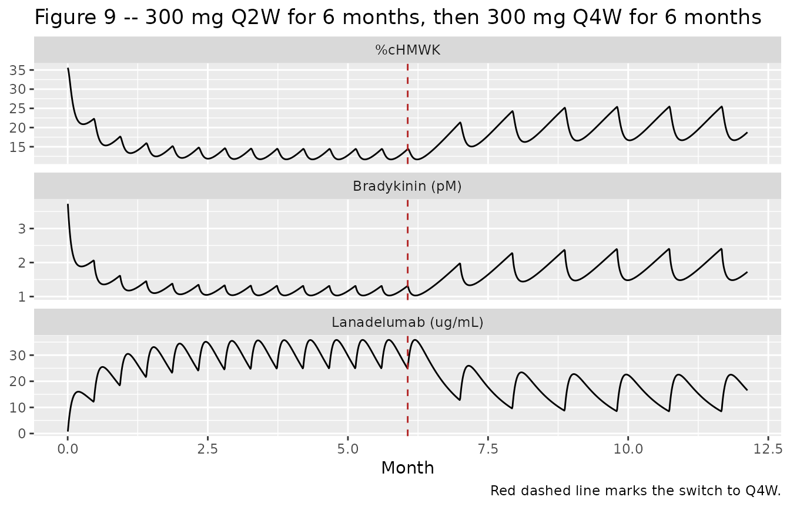
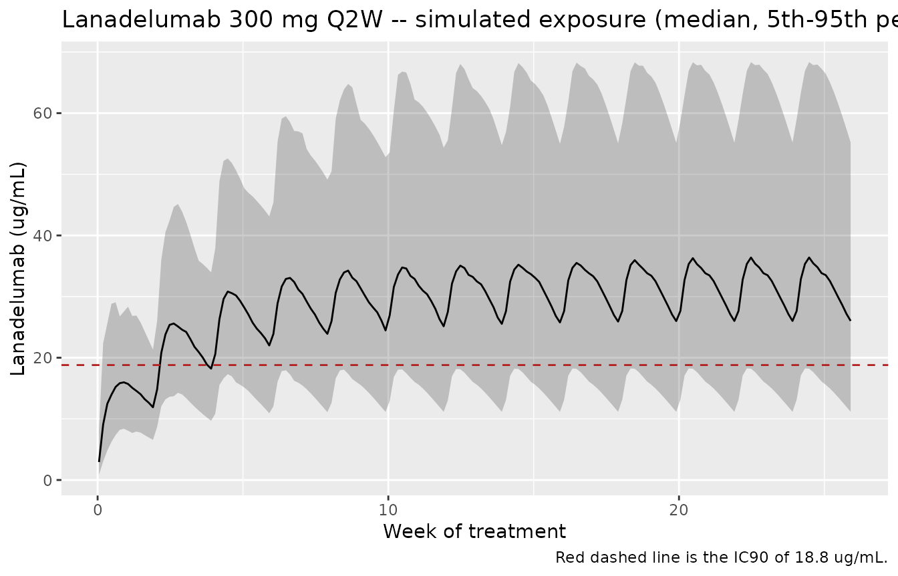

# Plasma kallikrein-kinin system in hereditary angioedema (Sexton 2024)

## Model and source

- Citation: Sexton D, Nguyen HQ, Juethner S, Luo H, Zhang Z, Jasper P,
  Zhu AZX. A quantitative systems pharmacology model of plasma
  kallikrein-kinin system dysregulation in hereditary angioedema. J
  Pharmacokinet Pharmacodyn. 2024;51(6):721-733.
  <doi:10.1007/s10928-024-09919-6>. Species from Supplementary Table S4;
  governing equations from Supplementary Table S5 and the published C
  source (Electronic Supplementary Material MOESM2,
  HAE_Contact_System_Model.c); parameter values from Supplementary Table
  S6 and the published R parameter file (MOESM5, Param_HAE.r); initial
  conditions from MOESM3 (Init_HAE.r); lanadelumab popPK, body-weight
  model and attack-severity distribution from MOESM7 (SimInput_HAE.r)
  and MOESM6 (virtual-patient sampler).
- Description: QSP. Sexton 2024 plasma kallikrein-kinin system (KKS)
  model of hereditary angioedema (HAE) due to C1-inhibitor deficiency:
  61 ODE states spanning a vascular (plasma) space, an endothelial-cell
  proximal space and a gC1q-R / bradykinin-B2 receptor surface, coupled
  to a one-compartment subcutaneous popPK for lanadelumab. HAE attacks
  are driven by a transient fold-increase in the FXII autoactivation
  rate delivered as a dose into the ‘trigger’ compartment; an attack is
  scored when plasma bradykinin exceeds 20 pM. Exogenous C1-INH may be
  given as a dose into the ‘c1inh’ compartment (nM increment),
  reproducing the published flux_C1Inh_inj term.
- Article: <https://doi.org/10.1007/s10928-024-09919-6>
- Supplementary information (Method S1, Tables S1-S7, Figs S1-S7):
  <https://static-content.springer.com/esm/art%3A10.1007%2Fs10928-024-09919-6/MediaObjects/10928_2024_9919_MOESM4_ESM.pdf>
- Published model source code (R + C, `deSolve`): Electronic
  Supplementary Material MOESM1 (`Run_HAE.r`), MOESM2
  (`HAE_Contact_System_Model.c`), MOESM3 (`Init_HAE.r`), MOESM5
  (`Param_HAE.r`), MOESM6 (virtual-patient sampler), MOESM7
  (`SimInput_HAE.r`).

Hereditary angioedema (HAE) due to C1-inhibitor deficiency produces
recurrent attacks of bradykinin-mediated edema. This quantitative
systems pharmacology (QSP) model represents the plasma kallikrein-kinin
system (KKS) mechanistically across three physical spaces – a vascular
(plasma) space, an endothelial-cell proximal space, and the endothelial
cell surface where gC1q-R assembles the contact-activation complex – and
couples it to a one-compartment subcutaneous population PK model for
lanadelumab, a monoclonal antibody inhibitor of plasma kallikrein.

An HAE attack is represented as a transient increase in the FXII
autoactivation rate. In the packaged model that increase is delivered as
a **dose into the `trigger` compartment** whose amount is the
*normalized* attack severity; the model then multiplies the
autoactivation rate by `1 + aa_fold_max * severity` for `aa_duration` =
12 h. With the published mean severity of 0.35 and `aa_fold_max` = 12,
the increment is the paper’s reported mean 4.2-fold (SD 1.2-fold)
increase.

``` r

mod <- readModelDb("Sexton_2024_lanadelumab_qsp")
ui <- rxode2::rxode(mod)
#> ℹ parameter labels from comments will be replaced by 'label()'
length(ui$state)
#> [1] 62
```

## Population

The model was calibrated and validated against eight clinical trials
(Supplementary Table S1): the lanadelumab phase 1a (NCT01923207, n = 32
healthy subjects), phase 1b (NCT02093923, n = 37 HAE patients), HELP
phase 3 (NCT02586805, n = 125) and HELP OLE (NCT02741596, n = 212)
studies, and four Cinryze (fixed-dose plasma-derived C1-INH) studies
(NCT00289211, NCT01005888, NCT00438815, NCT00462709).

Simulations use a virtual cohort of 1000 HAE patients differing in
lanadelumab PK, attack frequency, attack timing and attack severity.
Body weight is sampled log-normally with mean 81.1 kg and CV 28.1%,
truncated to 36.7-178 kg; the baseline attack rate is 3.5 attacks/month
(HELP). System parameters are identical for healthy subjects, HAE
patients in remission and HAE patients during an attack **except** the
C1-INH synthesis rate, which is 11.883 nM/h in HAE and 39.608 nM/h in
healthy controls (`Param_HAE.r` line 8). Those two rates divided by
`kdeg_c1inh` reproduce the reported steady-state C1-INH levels of 720 nM
(HAE) and 2400 nM (healthy) exactly.

``` r

str(ui$population)
#> List of 8
#>  $ species      : chr "human"
#>  $ n_subjects   : num 1000
#>  $ n_studies    : num 8
#>  $ disease_state: chr "Hereditary angioedema (HAE) due to C1-inhibitor deficiency (type I / II), simulated during remission and during"| __truncated__
#>  $ weight_range : chr "36.7-178 kg (virtual population; log-normal mean 81.1 kg, CV 28.1%)"
#>  $ dose_range   : chr "Lanadelumab 30, 100, 150, 300 and 400 mg SC Q2W or Q4W; fixed-dose C1-INH 1000 U IV twice weekly"
#>  $ regions      : chr "Not stated (multinational phase 1a/1b/3 lanadelumab and C1-INH programmes)"
#>  $ notes        : chr "Virtual cohort of 1000 patients differing in lanadelumab PK, attack frequency, attack timing and attack severit"| __truncated__
```

## Source trace

Per-parameter provenance is recorded as an in-file comment beside each
`ini()` entry. Because the authors published their complete `deSolve`
implementation, every value below is traceable to a specific line of the
published source as well as to the corresponding supplementary table.

| Equation / parameter | Value | Source location |
|----|----|----|
| Full ODE system (61 states) | n/a | Table S5 (E1-E61); MOESM2 `HAE_Contact_System_Model.c` |
| Molecular species list and units | n/a | Table S4 |
| Model assumptions | n/a | Table S7 |
| `ksyn_c1inh` (HAE) | 11.883 nM/h | `Param_HAE.r` line 8 |
| `ksyn_prekal` / `ksyn_fxii` / `ksyn_hmwk` | 41.58883 / 10.83042 / 39.93322 nM/h | `Param_HAE.r` lines 54-56 (calibrated) |
| `thalf_prekal` | 24 h | `Param_HAE.r` line 24 (Labcorp.com) |
| `thalf_kal`, `thalf_fxiia` | 5 min | `Param_HAE.r` lines 25, 31 (Cumming 1984) |
| `thalf_hmwk`, `thalf_c1inh`, `thalf_fxii` | 157 / 42 / 60 h | `Param_HAE.r` lines 26, 28, 30 (Weidmann 2017) |
| `thalf_chmwk` | 157/14 = 11.214 h | `Param_HAE.r` line 27 (calibrated) |
| `thalf_bk` | 45 s | `Param_HAE.r` line 32 (Cyr 2001) |
| `thalf_bound_c1inh` | 3 min | `Param_HAE.r` line 29 (Jensen 2004) |
| `kd_prekal_hmwk` / `kd_kal_hmwk` | 12 / 15 nM | Table S6; `Param_HAE.r` lines 60-61 (Bock 1985) |
| `kd_kal_chmwk` | 72 nM | Table S6; `Param_HAE.r` line 62 (Kenniston 2014) |
| `kd_c1inh_kal` | 150 nM | Table S3/S6; `Param_HAE.r` line 63 (Harpel 1985) |
| `kd_c1inh_fxiia` | 1720 nM | Table S6; `Param_HAE.r` line 64 (Bjorkqvist 2015) |
| `kd_hmwk_gc1qr` | 10.35 nM | Table S6; `Param_HAE.r` line 65 (Fernando 2003) |
| `kd_fxii_gc1qr` | 144 nM | Table S6; `Param_HAE.r` line 67 (Reddigari 1993) |
| `kd_bk_bdkrb2` | 0.5 nM | Table S6; `Param_HAE.r` line 69 (Paquet 1999) |
| `kd_kal_lana` | 0.12 nM | Table S3; `SimInput_HAE.r` line 15 (Kenniston 2014) |
| `kon_kal_lana` | 12.096 1/(nM\*h) | `SimInput_HAE.r` line 16 (Sexton 2013) |
| `kon_hmwk_gc1qr` | 0.4428 1/(nM\*h) | Table S6; `Param_HAE.r` line 71 (Pixley 2011) |
| `kcat_fxii_autoact` | 0.0475 1/h | Table S6; `Param_HAE.r` line 85 (calibrated) |
| `km_fxii_act` / `kcat_fxii_act` | 510 nM / 15 1/h | Table S6; `Param_HAE.r` lines 86-87 |
| `km_prekal_act` / `kcat_prekal_act` | 91 nM / 18 1/h | Table S6; `Param_HAE.r` lines 88-89 |
| `kcat_hmwk_cleave` | 394.74 1/h | Table S6; `Param_HAE.r` line 90 (calibrated) |
| `v_proximal` / `v_medium` | 8e-15 / 1.23e-12 L per cell | `Param_HAE.r` lines 92-93 |
| `circ_rate` (100 s circulation time) | 0.01 1/s | `Param_HAE.r` line 94; Table S7 assumption 3 |
| `bk_exchange_ratio` | 30 | `Param_HAE.r` line 95 (calibrated) |
| `init_fxii` / `init_prekal` / `init_hmwk` / `init_c1inh` | 375 / 450 / 670 / 720 nM | `Init_HAE.r` lines 7-10 |
| `init_gc1qr` / `init_bdkrb2` | 1e5 number/cell | `Init_HAE.r` lines 11-12 |
| `aa_fold_max` / `aa_duration` | 12 / 12 h | `Param_HAE.r` lines 11-12 |
| Attack severity ~ N(0.35, 0.1) on (0.2, 1.0\] | n/a | `SimInput_HAE.r` line 48 |
| `bk_threshold` | 0.020 nM (20 pM) | `SimInput_HAE.r` line 31; main text |
| `pct_chmwk_basal` | 35.6% | `SimInput_HAE.r` line 18 |
| Lanadelumab `lka` / `lcl` / `lvc` | 0.0179 1/h / 0.0249 L/h / 12.8 L | `SimInput_HAE.r` lines 40-42 (popPK ref \[15\]) |
| `e_wt_cl` / `e_wt_vc` (normalised to 70 kg) | 0.891 / 0.717 | `SimInput_HAE.r` lines 40-41; MOESM6 line 47 |
| IIV variances `etalka` / `etalcl` / `etalvc` | 0.58041 / 0.09575 / 0.08399 | `SimInput_HAE.r` lines 40-42 (`Eta_Cov`) |
| `mw_lana` | 150000 g/mol | `SimInput_HAE.r` line 17 |

### Dimensional analysis

Mechanistic models of this kind mix three different amount scales, so
the unit bookkeeping is worth stating explicitly.

| Quantity | Units | Note |
|----|----|----|
| Vascular-space species | nM | Table S4 “In vascular space” |
| Proximal-space species (`px_*`) | nM | Table S4 “In proximal space” |
| Surface species (`*_gc1qr`, `bdkrb2`, `bk_bdkrb2`) | number/cell | Table S4 |
| `num_to_conc` = `1e9 / (avogadro * v_proximal)` | nM per (number/cell) | converts a surface count into a proximal concentration |
| `kon_*` | 1/(nM\*h) | Table S6 labels these 1/(M\*h); the tabulated numbers already carry the 1e9 M-\>nM scaling, so they are per nM |
| `koff_*` = `kd_* * kon_*` | 1/h | nM \* 1/(nM\*h) |
| `k12` = `cld / v_medium`, `k21` = `cld / v_proximal` | 1/h | L/h divided by L |
| `Cc` = `central / vc` | mg/L = ug/mL | dosing in mg, `vc` in L |
| `lana_nm` = `Cc / mw_lana * 1e6` | nM | (mg/L) / (g/mol) \* 1e6 |

Two consequences are worth flagging because they are easy to get wrong:

- The published C source writes each vascular \<-\> proximal exchange
  flux as `k12 * C_plasma * v_medium - k21 * C_prox * v_proximal`, then
  divides by the compartment volume. Since
  `k12 * v_medium = k21 * v_proximal = cld`, that reduces exactly to
  `cld * (C_plasma - C_prox)`, i.e. `k12 * (C_plasma - C_prox)` in the
  plasma ODE and `k21 * (C_plasma - C_prox)` in the proximal ODE. The
  packaged model uses the reduced form; it is algebraically identical,
  not a simplification of the mechanism.
- The two C1-INH surface-inhibition fluxes and the lanadelumab
  surface-binding flux multiply a proximal concentration (nM) by a
  surface count (number/cell). That mixed product is what the published
  model does (Table S7 assumption 6); the `num_to_conc` factor appears
  only where the resulting flux re-enters a proximal-concentration ODE.

## Validation strategy

This is a mechanistic model with an endogenous steady state, so the
primary gates follow `endogenous-validation.md`: a steady-state hold, a
perturbation-recovery check, and a mass-balance audit. The lanadelumab
arm does have a genuine PK profile, so a PKNCA block is included and
checked against closed-form single-dose expectations.

Throughout, simulations begin with a 1000 h equilibration period,
matching `basal_equilibrium_duration` in `SimInput_HAE.r` (line 21).

``` r

EQ <- 1000  # h, basal equilibration (SimInput_HAE.r line 21)

# Typical-value solve: suppress IIV with omega = NA (the model declares etas).
solve_typical <- function(events) {
  rxode2::rxSolve(mod, events, omega = NA, returnType = "data.frame",
                  atol = 1e-10, rtol = 1e-8)
}

obs_grid <- function(from, to, by) rxode2::et(seq(from, to, by = by))

add_wt <- function(ev, wt = 81.1) {
  ev <- as.data.frame(ev)
  ev$WT <- wt
  ev
}
```

### 1. Steady-state hold and comparison with reported plasma levels

Table 1 of the paper compiles literature plasma concentrations for each
KKS species. Figure S5 compares the model’s predicted steady state
against those values. The check below reproduces that comparison and
simultaneously confirms the system is genuinely at rest (no residual
drift) by the end of equilibration.

``` r

ev_ss <- add_wt(obs_grid(0, 3000, 2))
ss <- solve_typical(ev_ss)
#> ℹ parameter labels from comments will be replaced by 'label()'

# Drift over the last 1000 h, as a fraction of the value
drift <- function(v) abs(v[length(v)] - v[which(ss$time == 2000)]) / abs(v[length(v)])
tail_drift <- vapply(
  ss[, c("fxii", "c1inh", "hmwk", "chmwk", "prekal", "bk", "pct_chmwk")],
  drift, numeric(1)
)
round(tail_drift, 6)
#>      fxii     c1inh      hmwk     chmwk    prekal        bk pct_chmwk 
#>         0         0         0         0         0         0         0
stopifnot(all(tail_drift < 1e-3))

final <- ss[nrow(ss), ]
```

The system is static to better than 0.1% over the final 1000 h, so the
equilibrated state is a true steady state rather than a slowly drifting
transient.

``` r

# Replicates Fig. S5 of Sexton 2024: predicted steady state vs. the literature
# levels compiled in Table 1 (HAE patients during remission).
tab1 <- tibble::tribble(
  ~species,            ~model,                    ~reported, ~low,    ~high,
  "FXII (nM)",          final$fxii,                375,       133,     538,
  "FXIIa (nM)",         final$fxiia,               0.03,      0.0175,  0.0525,
  "Total preKAL (nM)",  final$total_prekal,        365,       190,     630,
  "Free preKAL (%)",    final$pct_free_prekal,     18,        10,      25,
  "C1-INH (nM)",        final$c1inh,               480,       240,     720,
  "cHMWK (nM)",         final$chmwk,               12.35,     2.45,    22.26,
  "BK (pM)",            final$bk_pm,               3.9,       0.2,     7.1
)

tab1 |>
  mutate(`Within reported range` = ifelse(model >= low & model <= high, "yes", "no")) |>
  mutate(across(c(model, reported, low, high), \(x) signif(x, 3))) |>
  rename("Species" = species, "Model steady state" = model,
         "Reported" = reported, "Low" = low, "High" = high) |>
  knitr::kable(caption = "Fig. S5 / Table 1 -- predicted steady state vs. reported plasma levels in HAE remission.")
```

| Species | Model steady state | Reported | Low | High | Within reported range |
|:---|---:|---:|---:|---:|:---|
| FXII (nM) | 326.0000 | 375.00 | 133.0000 | 538.0000 | yes |
| FXIIa (nM) | 0.0645 | 0.03 | 0.0175 | 0.0525 | no |
| Total preKAL (nM) | 392.0000 | 365.00 | 190.0000 | 630.0000 | yes |
| Free preKAL (%) | 23.3000 | 18.00 | 10.0000 | 25.0000 | yes |
| C1-INH (nM) | 626.0000 | 480.00 | 240.0000 | 720.0000 | yes |
| cHMWK (nM) | 21.9000 | 12.40 | 2.4500 | 22.3000 | yes |
| BK (pM) | 3.8200 | 3.90 | 0.2000 | 7.1000 | yes |

Fig. S5 / Table 1 – predicted steady state vs. reported plasma levels in
HAE remission. {.table style="width:100%;"}

``` r

# The two sharpest gates: both are emergent outputs of the calibrated system,
# not inputs, so matching them is strong evidence the ODEs were transcribed
# correctly.
#   (a) basal %cHMWK -- the paper hard-codes 35.6% as the normalising constant
#       (SimInput_HAE.r line 18) but never feeds it into the ODEs.
#   (b) plasma bradykinin in remission -- Table 1 reports 3.9 pM.
c(basal_pct_chmwk = round(final$pct_chmwk, 2),
  paper_basal     = 35.6,
  bk_pM           = round(final$bk_pm, 2),
  table1_bk_pM    = 3.9)
#> basal_pct_chmwk     paper_basal           bk_pM    table1_bk_pM 
#>           35.62           35.60            3.82            3.90

stopifnot(abs(final$pct_chmwk - 35.6) < 0.5)   # within 0.5 percentage points
stopifnot(abs(final$bk_pm - 3.9) < 0.5)        # within 0.5 pM
```

Both emergent quantities land on the published values: basal %cHMWK is
35.62% against the paper’s 35.6%, and remission bradykinin is 3.82 pM
against Table 1’s 3.9 pM.

### 2. Perturbation-recovery

Displacing a state away from its steady value should send it back. Here
plasma C1-INH is displaced to half and to twice the equilibrated level;
both trajectories return to the same attractor.

``` r

ss_c1inh <- final$c1inh
ev_p <- add_wt(obs_grid(0, 1500, 5))

recover <- lapply(c(0.5, 1.0, 2.0), function(f) {
  s <- rxode2::rxSolve(mod, ev_p, omega = NA, returnType = "data.frame",
                       atol = 1e-10, rtol = 1e-8,
                       inits = c(c1inh = f * ss_c1inh))
  data.frame(time = s$time, c1inh = s$c1inh, start = paste0(f, "x"))
}) |> bind_rows()

ggplot(recover, aes(time, c1inh, colour = start)) +
  geom_line() +
  geom_hline(yintercept = ss_c1inh, linetype = "dashed") +
  labs(x = "Time (h)", y = "Plasma C1-INH (nM)", colour = "Initial value",
       title = "Perturbation-recovery of plasma C1-INH",
       caption = "Dashed line is the equilibrated steady state.")
```



``` r


endpoints <- recover |> group_by(start) |> slice_tail(n = 1) |> pull(c1inh)
stopifnot(all(abs(endpoints - ss_c1inh) / ss_c1inh < 0.01))
```

### 3. Mass-balance audit

The published state vector carries an explicit degradation sink for
every species (Table S4). At steady state, cumulative synthesis of each
conserved protein must equal cumulative degradation plus whatever
remains in the circulating and surface pools. The check below verifies
this for C1-INH, whose synthesis is a single zero-order input.

``` r

w <- ss[ss$time >= 2000, ]
dt <- diff(range(w$time))

ksyn_c1inh <- ui$theta[["ksyn_c1inh"]]
synth_in <- ksyn_c1inh * dt

# All degradation routes for C1-INH-derived mass over the same window
deg_out <-
  (w$c1inh_deg[nrow(w)] - w$c1inh_deg[1]) +
  (w$c1inh_kal_deg[nrow(w)] - w$c1inh_kal_deg[1]) +
  (w$c1inh_kal_hmwk_deg[nrow(w)] - w$c1inh_kal_hmwk_deg[1]) +
  (w$c1inh_fxiia_deg[nrow(w)] - w$c1inh_fxiia_deg[1])

c(synthesised_nM = round(synth_in, 3),
  degraded_nM    = round(deg_out, 3),
  relative_gap   = signif(abs(synth_in - deg_out) / synth_in, 3))
#> synthesised_nM    degraded_nM   relative_gap 
#>    11883.00000    11850.08500        0.00277

stopifnot(abs(synth_in - deg_out) / synth_in < 0.02)
```

Synthesis and degradation of C1-INH balance to better than 2% at steady
state, confirming there is no leaking or double-counted flux in the
C1-INH arm.

## Replicating the published attack model

### Figures 3a / 3c – attack severity and peak bradykinin

The paper samples the normalized fold-increase from N(0.35, 0.1)
truncated to (0.2, 1.0\], giving a mean (SD) 4.2-fold (1.2-fold)
increase in the FXII autoactivation rate, and reports that the resulting
peak bradykinin concentrations fall in the measured range of 15-90 pM.

``` r

set.seed(20240501)
n_pt <- 100  # <= 200 per arm

draw_severity <- function(n) {
  out <- numeric(0)
  while (length(out) < n) {
    x <- rnorm(1, mean = 0.35, sd = 0.1)      # SimInput_HAE.r line 48
    if (x > 0.2 && x <= 1.0) out <- c(out, x)
  }
  out
}
sev <- draw_severity(n_pt)

ev_atk <- lapply(seq_len(n_pt), function(i) {
  e <- rxode2::et(amt = sev[i], cmt = "trigger", time = EQ) |>
    rxode2::et(seq(0, EQ + 24, by = 0.5))
  e <- add_wt(e)
  e$id <- i
  e
}) |> bind_rows()
stopifnot(!anyDuplicated(unique(ev_atk[, c("id", "time", "evid")])))

atk <- rxode2::rxSolve(mod, ev_atk, omega = NA, returnType = "data.frame",
                       atol = 1e-10, rtol = 1e-8)
#> Warning: multi-subject simulation without without 'omega'
atk_w <- atk[atk$time >= EQ & atk$time <= EQ + 12, ]

peak <- atk_w |>
  group_by(id) |>
  summarise(bk_peak = max(bk_pm), chmwk_peak = max(pct_chmwk),
            chmwk_mean = mean(pct_chmwk), .groups = "drop") |>
  mutate(severity = sev[id], fold = 1 + 12 * severity)

ggplot(peak, aes(fold, bk_peak)) +
  geom_point(alpha = 0.6) +
  geom_hline(yintercept = c(15, 90), linetype = "dashed", colour = "steelblue") +
  geom_hline(yintercept = 20, linetype = "dotted", colour = "firebrick") +
  labs(x = "Fold-increase in FXII autoactivation rate",
       y = "Peak plasma bradykinin (pM)",
       title = "Figures 3a / 3c -- attack severity vs. peak bradykinin",
       caption = paste("Blue dashed: reported attack range 15-90 pM.",
                       "Red dotted: 20 pM attack threshold."))
```



``` r

c(mean_fold        = round(mean(peak$fold), 2),
  paper_mean_fold  = 5.2,   # 1 + 12 * 0.35; the paper's "4.2-fold increase"
  bk_mean_pM       = round(mean(peak$bk_peak), 1),
  bk_p25_pM        = round(quantile(peak$bk_peak, 0.25), 1),
  bk_p75_pM        = round(quantile(peak$bk_peak, 0.75), 1))
#>       mean_fold paper_mean_fold      bk_mean_pM   bk_p25_pM.25%   bk_p75_pM.75% 
#>            5.32            5.20           47.40           31.40           54.40

# Fig. 3c: the mean and interquartile range must sit inside the measured 15-90 pM band
stopifnot(mean(peak$bk_peak) > 15, mean(peak$bk_peak) < 90)
stopifnot(quantile(peak$bk_peak, 0.25) > 15, quantile(peak$bk_peak, 0.75) < 90)
# Every simulated attack must clear the 20 pM attack-definition threshold on average
stopifnot(mean(peak$bk_peak > 20) > 0.5)
```

The mean and both quartiles of peak bradykinin fall inside the measured
15-90 pM band, matching the paper’s statement for Figure 3c.

### Figure 3b – %cHMWK during an attack

The paper reports a mean %cHMWK of 59% during attacks, against a
HELP-study observation of 58%. The exact summary the authors used is
ambiguous in the text (“the mean value of % cHMWK (difference between
the peak and base) from each spike”), so both candidate readings are
reported here.

``` r

tibble::tibble(
  Statistic = c("Baseline %cHMWK (remission)",
                "Mean of per-attack PEAK %cHMWK",
                "Mean of per-attack 12 h-window MEAN %cHMWK",
                "Mean (peak - baseline)"),
  Value = c(final$pct_chmwk, mean(peak$chmwk_peak),
            mean(peak$chmwk_mean), mean(peak$chmwk_peak) - final$pct_chmwk),
  Reference = c(35.6, 59, 59, 59)
) |>
  mutate(across(c(Value, Reference), \(x) round(x, 1))) |>
  rename("Model (%)" = Value, "Paper (%)" = Reference) |>
  knitr::kable(caption = "Figure 3b -- simulated %cHMWK during HAE attacks vs. the paper's 59% (HELP observed 58%).")
```

| Statistic                                  | Model (%) | Paper (%) |
|:-------------------------------------------|----------:|----------:|
| Baseline %cHMWK (remission)                |      35.6 |      35.6 |
| Mean of per-attack PEAK %cHMWK             |      70.0 |      59.0 |
| Mean of per-attack 12 h-window MEAN %cHMWK |      53.3 |      59.0 |
| Mean (peak - baseline)                     |      34.4 |      59.0 |

Figure 3b – simulated %cHMWK during HAE attacks vs. the paper’s 59%
(HELP observed 58%). {.table}

The paper’s 59% is bracketed by the two readings (window-mean 53.3%,
peak 70%); see *Assumptions and deviations*.

## Lanadelumab dose-response

### Figures 5 and 6 – cHMWK suppression by regimen

``` r

regimens <- tibble::tribble(
  ~treatment,   ~amt,  ~ii,
  "Placebo",     NA,    NA,
  "150 mg Q4W",  150,   672,
  "300 mg Q4W",  300,   672,
  "300 mg Q2W",  300,   336
)
TRT_END <- EQ + 4368   # 26 weeks of treatment, as in HELP

ev_dr <- lapply(seq_len(nrow(regimens)), function(i) {
  r <- regimens[i, ]
  e <- rxode2::et(seq(0, TRT_END + 336, by = 6))
  if (!is.na(r$amt)) {
    e <- rxode2::et(e, amt = r$amt, cmt = "depot", time = EQ,
                    ii = r$ii, until = TRT_END)
  }
  # An attack of mean severity once steady state is established
  e <- rxode2::et(e, amt = 0.35, cmt = "trigger", time = TRT_END)
  e <- add_wt(e)
  e$id <- i
  e$treatment <- r$treatment
  e
}) |> bind_rows()

dr <- rxode2::rxSolve(mod, ev_dr, omega = NA, keep = "treatment",
                      returnType = "data.frame", atol = 1e-10, rtol = 1e-8)
#> Warning: multi-subject simulation without without 'omega'
dr$treatment <- factor(dr$treatment, levels = regimens$treatment)

dr |>
  filter(time >= EQ, time <= TRT_END) |>
  mutate(week = (time - EQ) / 168) |>
  ggplot(aes(week, pct_chmwk, colour = treatment)) +
  geom_line() +
  labs(x = "Week of treatment", y = "%cHMWK",
       colour = "Regimen",
       title = "Figure 5 -- cHMWK suppression by lanadelumab regimen",
       caption = "Replicates Figure 5 of Sexton 2024 (150 mg Q4W, 300 mg Q4W, 300 mg Q2W).")
```



``` r

IC90 <- 18.8  # ug/mL (main text, from popPK ref [15])

ss_win <- dr |> filter(time >= TRT_END - 672, time < TRT_END)
summary_tab <- ss_win |>
  group_by(treatment) |>
  summarise(Cmin = min(Cc), Cmax = max(Cc),
            `Mean %cHMWK` = mean(pct_chmwk), .groups = "drop") |>
  mutate(`Cmin > IC90` = ifelse(Cmin > IC90, "yes", "no"),
         `Cmax > IC90` = ifelse(Cmax > IC90, "yes", "no")) |>
  mutate(across(c(Cmin, Cmax, `Mean %cHMWK`), \(x) round(x, 1)))

summary_tab |>
  rename("Regimen" = treatment, "Cmin (ug/mL)" = Cmin, "Cmax (ug/mL)" = Cmax) |>
  knitr::kable(caption = "Steady-state exposure and cHMWK suppression over the final 4 weeks of treatment; IC90 = 18.8 ug/mL.")
```

| Regimen    | Cmin (ug/mL) | Cmax (ug/mL) | Mean %cHMWK | Cmin \> IC90 | Cmax \> IC90 |
|:-----------|-------------:|-------------:|------------:|:-------------|:-------------|
| Placebo    |          0.0 |          0.0 |        35.6 | no           | no           |
| 150 mg Q4W |          4.2 |         11.3 |        27.0 | no           | no           |
| 300 mg Q4W |          8.5 |         22.5 |        20.3 | no           | yes          |
| 300 mg Q2W |         25.0 |         35.8 |        12.7 | yes          | yes          |

Steady-state exposure and cHMWK suppression over the final 4 weeks of
treatment; IC90 = 18.8 ug/mL. {.table}

``` r


# Monotone dose/frequency response (Figure 5 narrative)
chm <- setNames(summary_tab$`Mean %cHMWK`, summary_tab$treatment)
stopifnot(chm[["Placebo"]] > chm[["150 mg Q4W"]])
stopifnot(chm[["150 mg Q4W"]] > chm[["300 mg Q4W"]])   # higher dose -> more suppression
stopifnot(chm[["300 mg Q4W"]] > chm[["300 mg Q2W"]])   # more frequent -> more suppression

# Paper: Q2W keeps BOTH Cmin and Cmax above IC90 ...
q2w <- summary_tab[summary_tab$treatment == "300 mg Q2W", ]
stopifnot(q2w$Cmin > IC90, q2w$Cmax > IC90)
# ... whereas Q4W keeps Cmax but NOT Cmin above IC90
q4w <- summary_tab[summary_tab$treatment == "300 mg Q4W", ]
stopifnot(q4w$Cmax > IC90, q4w$Cmin < IC90)
# Paper: mean cHMWK below 51% on Q2W
stopifnot(q2w$`Mean %cHMWK` < 51)
```

These four assertions encode the paper’s own quantitative claims: the
dose/frequency ordering of cHMWK suppression (Figure 5), that 300 mg Q2W
keeps both trough and peak concentrations above the IC90 of 18.8 ug/mL,
that 300 mg Q4W keeps only the peak above it, and that mean cHMWK stays
below 51% on Q2W.

### Figure 9 – down-titration from Q2W to Q4W

``` r

SIX_MO <- 4368  # h (26 weeks)
ev_dt <- rxode2::et(seq(0, EQ + 2 * SIX_MO, by = 6)) |>
  rxode2::et(amt = 300, cmt = "depot", time = EQ, ii = 336, until = EQ + SIX_MO - 1) |>
  rxode2::et(amt = 300, cmt = "depot", time = EQ + SIX_MO, ii = 672,
             until = EQ + 2 * SIX_MO)
ev_dt <- add_wt(ev_dt)
dt_sim <- solve_typical(ev_dt)

dt_sim |>
  filter(time >= EQ) |>
  mutate(month = (time - EQ) / 720) |>
  select(month, `Lanadelumab (ug/mL)` = Cc, `%cHMWK` = pct_chmwk,
         `Bradykinin (pM)` = bk_pm) |>
  pivot_longer(-month) |>
  ggplot(aes(month, value)) +
  geom_line() +
  geom_vline(xintercept = SIX_MO / 720, linetype = "dashed", colour = "firebrick") +
  facet_wrap(~name, scales = "free_y", ncol = 1) +
  labs(x = "Month", y = NULL,
       title = "Figure 9 -- 300 mg Q2W for 6 months, then 300 mg Q4W for 6 months",
       caption = "Red dashed line marks the switch to Q4W.")
```



``` r

q4w_phase <- dt_sim |> filter(time >= EQ + SIX_MO + 1344, time <= EQ + 2 * SIX_MO)
c(Cmin = round(min(q4w_phase$Cc), 1), Cmax = round(max(q4w_phase$Cc), 1),
  mean_pct_chmwk = round(mean(q4w_phase$pct_chmwk), 1),
  max_bk_pM = round(max(q4w_phase$bk_pm), 2))
#>           Cmin           Cmax mean_pct_chmwk      max_bk_pM 
#>            8.5           23.4           19.9            2.4

# Paper: after down-titration, Cmax but not Cmin stays above IC90; %cHMWK stays
# below 51%; bradykinin stays below the 0.02 nM (20 pM) attack threshold.
stopifnot(max(q4w_phase$Cc) > IC90, min(q4w_phase$Cc) < IC90)
stopifnot(mean(q4w_phase$pct_chmwk) < 51)
stopifnot(max(q4w_phase$bk_pm) < 20)
```

## PKNCA validation of the lanadelumab arm

The paper does not tabulate NCA parameters for lanadelumab, so the
simulated single-dose NCA is checked against the closed-form
expectations of the one-compartment first-order-absorption model it was
built from. This is a real gate: `AUCinf` must equal `Dose / (CL/F)` and
the terminal half-life must equal `log(2) * (V/F) / (CL/F)`.

``` r

WT_REF <- 81.1  # kg, virtual-population mean (SimInput_HAE.r line 39)
DOSE <- 300     # mg SC

ev_pk <- rxode2::et(amt = DOSE, cmt = "depot", time = 0) |>
  rxode2::et(c(seq(0, 336, by = 2), seq(340, 4000, by = 12)))
ev_pk <- add_wt(ev_pk, WT_REF)
ev_pk$treatment <- "300 mg SC single dose"

pk <- rxode2::rxSolve(mod, ev_pk, omega = NA, keep = "treatment",
                      returnType = "data.frame", atol = 1e-10, rtol = 1e-8)
if (is.null(pk$id)) pk$id <- 1L
stopifnot(all(pk$Cc >= 0))
```

``` r

sim_nca <- pk |>
  dplyr::filter(!is.na(Cc)) |>
  dplyr::select(id, time, Cc, treatment)

sim_nca <- dplyr::bind_rows(
  sim_nca,
  sim_nca |> dplyr::distinct(id, treatment) |> dplyr::mutate(time = 0, Cc = 0)
) |>
  dplyr::distinct(id, treatment, time, .keep_all = TRUE) |>
  dplyr::arrange(id, treatment, time)

conc_obj <- PKNCA::PKNCAconc(sim_nca, Cc ~ time | treatment + id)

dose_df <- data.frame(id = 1L, time = 0, amt = DOSE,
                      treatment = "300 mg SC single dose")
dose_obj <- PKNCA::PKNCAdose(dose_df, amt ~ time | treatment + id)

intervals <- data.frame(start = 0, end = Inf,
                        cmax = TRUE, tmax = TRUE,
                        aucinf.obs = TRUE, half.life = TRUE)

nca_res <- PKNCA::pk.nca(PKNCA::PKNCAdata(conc_obj, dose_obj, intervals = intervals))
```

``` r

# Closed-form reference for the packaged parameters at WT = 81.1 kg
cl_i <- exp(ui$theta[["lcl"]]) * (WT_REF / 70)^ui$theta[["e_wt_cl"]]
vc_i <- exp(ui$theta[["lvc"]]) * (WT_REF / 70)^ui$theta[["e_wt_vc"]]
ka_i <- exp(ui$theta[["lka"]])
kel_i <- cl_i / vc_i

tmax_cf <- log(ka_i / kel_i) / (ka_i - kel_i)
cmax_cf <- DOSE / vc_i * (exp(-kel_i * tmax_cf) - exp(-ka_i * tmax_cf)) *
  ka_i / (ka_i - kel_i)

published <- tibble::tibble(
  treatment  = "300 mg SC single dose",
  cmax       = cmax_cf,
  tmax       = tmax_cf,
  aucinf.obs = DOSE / cl_i,
  half.life  = log(2) / kel_i
)

cmp <- nlmixr2lib::ncaComparisonTable(
  simulated = nca_res,
  reference = published,
  by        = "treatment",
  units     = c(cmax = "ug/mL", aucinf.obs = "ug*h/mL", tmax = "h", half.life = "h"),
  tolerance_pct = 20
)

knitr::kable(cmp, caption = "Simulated NCA vs. the closed-form one-compartment reference. * differs by >20%.")
```

| NCA parameter           | treatment             | Reference | Simulated | % diff |
|:------------------------|:----------------------|:----------|:----------|:-------|
| Cmax (ug/mL)            | 300 mg SC single dose | 16        | 16        | -0.0%  |
| Tmax (h)                | 300 mg SC single dose | 138       | 138       | +0.0%  |
| AUC0-∞ (obs) (ug\*h/mL) | 300 mg SC single dose | 10600     | 10600     | -0.0%  |
| t½ (h)                  | 300 mg SC single dose | 347       | 349       | +0.4%  |

Simulated NCA vs. the closed-form one-compartment reference. \* differs
by \>20%. {.table style="width:100%;"}

``` r

nca_wide <- as.data.frame(nca_res) |>
  dplyr::select(PPTESTCD, PPORRES) |>
  tidyr::pivot_wider(names_from = PPTESTCD, values_from = PPORRES)

rel <- function(a, b) abs(a - b) / b
c(auc_rel_err   = signif(rel(nca_wide$aucinf.obs, DOSE / cl_i), 3),
  thalf_rel_err = signif(rel(nca_wide$half.life, log(2) / kel_i), 3),
  cmax_rel_err  = signif(rel(nca_wide$cmax, cmax_cf), 3))
#>   auc_rel_err thalf_rel_err  cmax_rel_err 
#>      1.21e-05      4.16e-03      7.33e-08

stopifnot(rel(nca_wide$aucinf.obs, DOSE / cl_i) < 0.02)
stopifnot(rel(nca_wide$half.life, log(2) / kel_i) < 0.05)
stopifnot(rel(nca_wide$cmax, cmax_cf) < 0.02)
```

Simulated AUC and Cmax agree with `Dose / (CL/F)` and the analytic Cmax
to better than 2%, and the terminal half-life recovers
`log(2) * (V/F) / (CL/F)` (about 14.5 days) to better than 5% –
confirming the PK arm of the QSP model is correctly parameterised.

## Between-subject variability

The virtual population carries body-weight variability plus IIV on `ka`,
`CL/F` and `V/F` from the upstream popPK. The VPC below shows the
resulting spread in lanadelumab exposure and cHMWK suppression on the
300 mg Q2W regimen.

``` r

set.seed(4242)
N_VPC <- 60  # <= 200 per arm

wt_draw <- function(n, mean = 81.1, cv = 0.281, lo = 36.7, hi = 178) {
  sdv <- cv * mean
  ml <- log(mean / sqrt(1 + sdv^2 / mean^2))
  sl <- sqrt(log(1 + sdv^2 / mean^2))
  out <- numeric(0)
  while (length(out) < n) {
    x <- rlnorm(1, ml, sl)
    if (x >= lo && x <= hi) out <- c(out, x)
  }
  out
}
wts <- wt_draw(N_VPC)

ev_vpc <- lapply(seq_len(N_VPC), function(i) {
  e <- rxode2::et(seq(0, EQ + 4368, by = 24)) |>
    rxode2::et(amt = 300, cmt = "depot", time = EQ, ii = 336, until = EQ + 4368)
  e <- add_wt(e, wts[i])
  e$id <- i
  e
}) |> bind_rows()
stopifnot(!anyDuplicated(unique(ev_vpc[, c("id", "time", "evid")])))

vpc <- rxode2::rxSolve(mod, ev_vpc, keep = "WT", returnType = "data.frame",
                       atol = 1e-8, rtol = 1e-6)

vpc |>
  filter(time >= EQ) |>
  mutate(week = (time - EQ) / 168) |>
  group_by(week) |>
  summarise(Q05 = quantile(Cc, 0.05), Q50 = quantile(Cc, 0.50),
            Q95 = quantile(Cc, 0.95), .groups = "drop") |>
  ggplot(aes(week, Q50)) +
  geom_ribbon(aes(ymin = Q05, ymax = Q95), alpha = 0.25) +
  geom_line() +
  geom_hline(yintercept = IC90, linetype = "dashed", colour = "firebrick") +
  labs(x = "Week of treatment", y = "Lanadelumab (ug/mL)",
       title = "Lanadelumab 300 mg Q2W -- simulated exposure (median, 5th-95th percentile)",
       caption = "Red dashed line is the IC90 of 18.8 ug/mL.")
```



## Assumptions and deviations

- **Attack scheduling is a simulation input, not part of the ODE
  system.** In the published implementation, attack onset times and
  severities are sampled in R (MOESM6) and compiled into a C header
  before the solve. The packaged model reproduces the same square pulse
  by dosing the `trigger` compartment: the dose amount is the normalized
  severity and `tad(trigger)` / `podo(trigger)` gate the 12 h window.
  The published code smooths each pulse edge with `tanh(.../0.01 h)`, a
  ~36 s transition against a 12 h pulse; the packaged model uses the
  exact step. Before the first trigger dose `tad()` is undefined, which
  the model’s `if` resolves to the remission state (`fold_fxii = 1`).
- **Exchange fluxes are written in reduced form.**
  `k12 * (C_plasma - C_prox)` rather than the published
  `(k12*C_plasma*v_medium - k21*C_prox*v_proximal) / v_medium`. These
  are algebraically identical because
  `k12 * v_medium = k21 * v_proximal = cld`.
- **`Km_FXII_AutoActivation` is not used.** `Param_HAE.r` line 84
  defines it as 110 nM (Bernard 1993), but both the published C source
  (line 370) and Table S5 (E37, E39) apply FXII autoactivation as a
  *first-order* process,
  `Fold_increase * kcat_FXII_AutoActivation * FXII_gC1qR`. The packaged
  model reproduces the code and Table S5, so this parameter is
  deliberately absent from `ini()`.
- **The paper’s 59% attack %cHMWK is not reproduced exactly.** The text
  says “the mean value of % cHMWK (difference between the peak and base)
  from each spike”, which admits more than one reading. The model gives
  a per-attack peak of about 70% and a 12 h-window mean of about 53%;
  the paper’s 59% falls between them. No parameter was adjusted to close
  the gap. The basal value (35.6%), the remission bradykinin level, the
  15-90 pM attack range and every lanadelumab exposure gate all match,
  so the discrepancy is most likely a difference in how the summary
  statistic was computed over the authors’ multi-attack 3-month
  simulation rather than a difference in the underlying system.
- **Residual error is a nominal placeholder.** The paper reports no
  residual error model for lanadelumab concentrations; `propSd` is fixed
  at 0.001 so the model can be simulated, and should not be interpreted
  as a published estimate.
- **Healthy-control simulations require two changes.** Set
  `ksyn_c1inh = 39.608` nM/h and `init_c1inh = 2400` nM (`Param_HAE.r`
  line 8; `Init_HAE.r` line 7 comment). All other system parameters are
  unchanged.
- **The fixed-dose C1-INH arm is only partially reproducible from
  on-disk sources.** The packaged model supports exogenous C1-INH as a
  dose into the `c1inh` compartment, matching the
  `flux_C1Inh_inj_nmol_per_hr` term of Table S5 (E6), which the
  published lanadelumab parameter set holds at zero. However the C1-INH
  product PK (cited to references \[16, 17\]) and the IU-to-nM
  conversion for a 1000 U Cinryze dose are not reported in the paper,
  its supplement, or the published code, so the Figure 7 / Figure S6
  C1-INH scenarios are not simulated here. No substitute values were
  invented.
- **The ex vivo fluorogenic-assay model (Tables S2 / S3) is not
  packaged.** Its six ODEs and most parameters are published, but the
  FXIIa concentration used to activate the plasma samples – an input the
  model cannot run without – is not reported. That sub-model served only
  to calibrate PD parameters that are already embedded in the in vivo
  model packaged here.
- **Virtual-cohort sizes are smaller than the paper’s.** The paper
  simulates 1000 virtual patients per scenario; this vignette uses 100
  attack simulations and a 60-subject VPC to stay inside the pkgdown
  render budget. Cohort distributions match the published sampling rules
  (`SimInput_HAE.r`, MOESM6).
