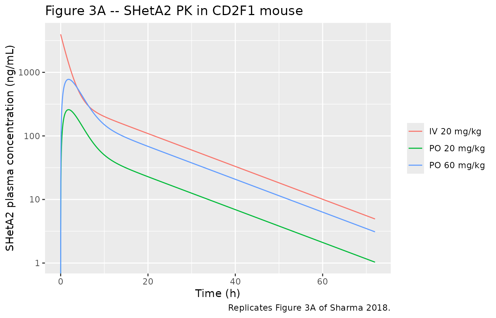
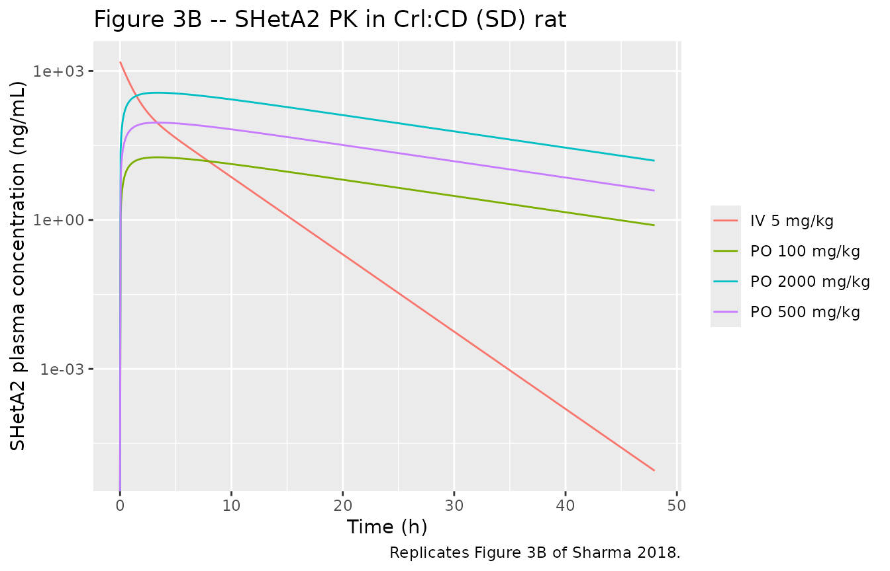
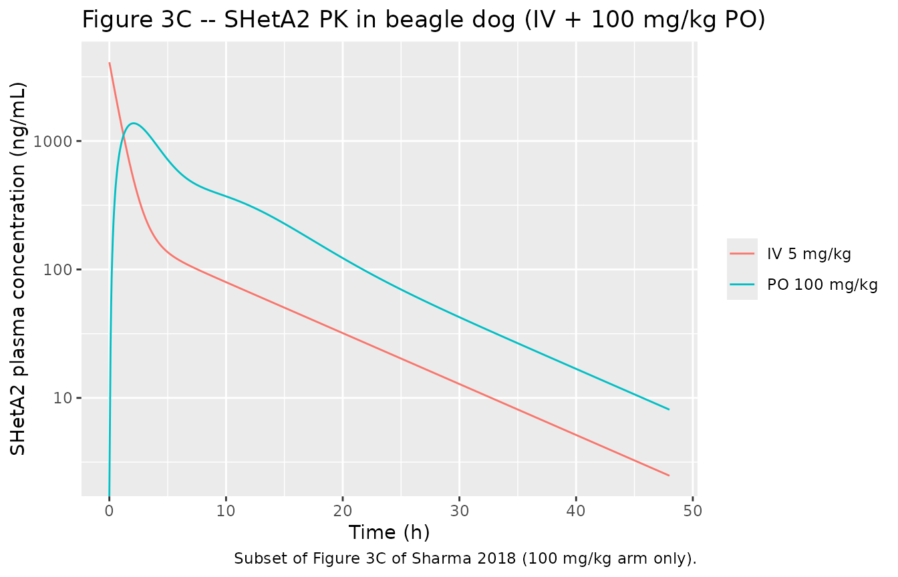
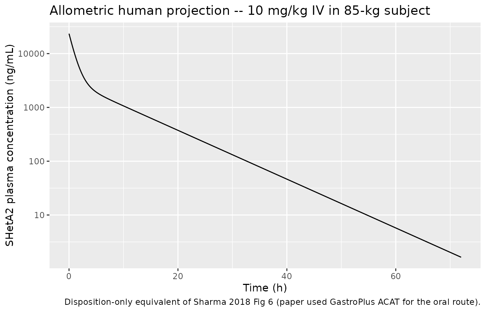

# SHetA2 interspecies scaling (Sharma 2018)

## Model and source

- Citation: Sharma A, Benbrook DM, Woo S. Pharmacokinetics and
  interspecies scaling of a novel, orally-bioavailable anti-cancer drug,
  SHetA2. *PLoS ONE* 2018;13(4):e0194046.
- Article (open access):
  [doi:10.1371/journal.pone.0194046](https://doi.org/10.1371/journal.pone.0194046)

The paper develops compartmental PK models for SHetA2 (a flexible
heteroarotinoid anti-cancer / chemoprevention drug) in mouse, rat, and
dog, then applies simple and maximum-life-span-potential (MLP)
allometric scaling to project a typical 70-kg human disposition for
first-in-human dose selection. Four
[`modellib()`](https://nlmixr2.github.io/nlmixr2lib/reference/modellib.md)
entries cover the four scenarios:

- `Sharma_2018_SHetA2_mouse` – mouse 2-cmt + first-order absorption.
- `Sharma_2018_SHetA2_rat` – rat 2-cmt + first-order absorption.
- `Sharma_2018_SHetA2_dog` – dog 2-cmt + 7-compartment GI transit with
  two absorption sites (G2 and G7).
- `Sharma_2018_SHetA2_human` – 70-kg human IV disposition (no parametric
  oral absorption – the source paper simulated the oral profile
  externally with the GastroPlus 9.5 ACAT model, which is not
  reproducible inside nlmixr2lib).

## Population and study design

The preclinical PK data were re-analysed from three published
preclinical studies (Sharma 2018 Table 1):

- **Mouse**: CD2F1 female mice, 20.0-27.8 g (n=3 per arm). IV 20 mg/kg
  in PEG400:Ethanol:Saline; PO 20 and 60 mg/kg in sesame oil by gavage.
  Cardiac-puncture blood sampling at 16 IV time points and 13 PO time
  points.
- **Rat**: Crl:CD Sprague-Dawley rats, 260-347 g (n=3 per arm). IV 5
  mg/kg single dose; PO 100, 500, or 2000 mg/kg/day in 1%
  methylcellulose / 0.2% Tween 80 for 28 days, with PK sampled on the IV
  day and on week 4 or 5 of the oral arm. Retro-orbital sampling at 8 IV
  time points and 8 PO time points. Rat PK data were digitized using
  GetData Graph Digitizer v2.26.
- **Beagle dog** (NCI N01-CN-43306 toxicology report, work assignment
  21): 6.4-11.2 kg (males 9.0-11.2 kg; females 6.9-8.4 kg in the oral
  arms; IV arm 6.4-7.0 kg). IV 5 mg/kg (n=2, mean only); PO 100, 400, or
  1500 mg/kg in 30% aqueous Solutol HS 15 by gavage (n=4 per dose).
  Jugular sampling at 9 IV time points and 8 PO time points.

All compartmental fits used Phoenix WinNonlin v6.4 with the Gauss-Newton
(Levenberg-Hartley) minimization algorithm and 1/y^2 weighting.
Per-species IV and PO data were fit simultaneously by **naive-pooled
least squares**; the authors did not report inter-individual variability
and the residual error magnitude is not reported. Population metadata is
available programmatically via, for example,
`readModelDb("Sharma_2018_SHetA2_mouse")$population`.

## Source trace

Per-parameter origin is recorded as in-file comments next to each
`ini()` entry in
`inst/modeldb/specificDrugs/Sharma_2018_SHetA2_{mouse,rat,dog,human}.R`.
The table below collects them in one place for review. The reported CV%
values are precisions of the parameter estimates (RSE-like SEs from the
Gauss-Newton fit), NOT inter-individual variability.

| Species | Parameter | Value (CV%) | Source location |
|----|----|----|----|
| Mouse | CL | 0.0421 L/h (8%) | Sharma 2018 Table 3 |
| Mouse | V1 | 0.121 L (16%) | Sharma 2018 Table 3 |
| Mouse | CLD | 0.0323 L/h (20%) | Sharma 2018 Table 3 |
| Mouse | V2 | 0.282 L (14%) | Sharma 2018 Table 3 |
| Mouse | kA | 0.539 1/h (19%) | Sharma 2018 Table 3 |
| Mouse | F (20 mg/kg) | 17.7% (12%) | Sharma 2018 Table 3 |
| Mouse | F (60 mg/kg) | 19.5% (12%) | Sharma 2018 Table 3 |
| Rat | CL | 0.916 L/h (10%) | Sharma 2018 Table 3 |
| Rat | V1 | 0.969 L (18%) | Sharma 2018 Table 3 |
| Rat | CLD | 0.286 L/h (70%) | Sharma 2018 Table 3 |
| Rat | V2 | 0.531 L (48%) | Sharma 2018 Table 3 |
| Rat | kA | 0.0755 1/h (17%) | Sharma 2018 Table 3 |
| Rat | F (100 mg/kg) | 1.03% (14%) | Sharma 2018 Table 3 |
| Rat | F (500 mg/kg) | 1.57% (19%) | Sharma 2018 Table 3 |
| Rat | F (2000 mg/kg) | 0.560% (16%) | Sharma 2018 Table 3 |
| Dog | CL | 6.39 L/h (10%) | Sharma 2018 Table 3 |
| Dog | V1 | 8.53 L (18%) | Sharma 2018 Table 3 |
| Dog | CLD | 3.24 L/h (29%) | Sharma 2018 Table 3 |
| Dog | V2 | 22.5 L (26%) | Sharma 2018 Table 3 |
| Dog | F / kA / kA2 / kAT (100 mg/kg) | 11.2% / 1.12 / 0.929 / 0.532 | Sharma 2018 Table 3 |
| Dog | F / kA / kA2 / kAT (400 mg/kg) | 3.45% / 1.12 / 0.105 / 1.11 | Sharma 2018 Table 3 |
| Dog | F / kA / kA2 / kAT (1500 mg/kg) | 1.11% / 0.411 / 0.0898 / 1.25 | Sharma 2018 Table 3 |
| Human (70 kg) | CL (MLP) | 17.3 L/h | Sharma 2018 Results, Allometric scaling |
| Human (70 kg) | V1 | 36.2 L | Sharma 2018 Results, Prediction of human PK |
| Human (70 kg) | V2 | 68.5 L | Sharma 2018 Results, Prediction of human PK |
| Human (70 kg) | CLD | 15.2 L/h | Sharma 2018 Results, Prediction of human PK |
| Mouse / Rat disposition + 1st-order absorption ODE | n/a | Sharma 2018 Eqs. 1-3 + Fig. 2A |  |
| Dog 7-compartment GI transit + dual absorption ODE | n/a | Sharma 2018 Eqs. 4-9 + Fig. 2B |  |
| Simple allometry P = a \* BW^b across mouse/rat/dog | n/a | Sharma 2018 Allometric scaling + Fig. 5 |  |

## Helpers

A single helper builds an IV-or-oral event table for any species, with
one subject per dose. All four species share the same time / dose /
concentration units (h, mg, ng/mL), so the helper is species-agnostic.

``` r

make_cohort <- function(model_name, dose_mg_kg, body_kg, route, tmax_h = 72,
                        dt_h = 0.05, id_offset = 0L) {
  amt_mg <- dose_mg_kg * body_kg
  cmt_in <- if (route == "IV") "central" else "depot"
  ev <- rxode2::et(amt = amt_mg, cmt = cmt_in) |>
    rxode2::et(seq(0, tmax_h, by = dt_h))
  as.data.frame(ev) |>
    dplyr::mutate(
      id        = id_offset + 1L,
      treatment = sprintf("%s %g mg/kg", route, dose_mg_kg),
      species   = sub("^Sharma_2018_SHetA2_", "", model_name)
    )
}
```

A second helper runs a typical-value (no residual-error) `rxSolve` and
tags the rows for cross-species comparison:

``` r

run_typical <- function(model_name, dose_mg_kg, body_kg, route, tmax_h = 72,
                        dt_h = 0.05, id_offset = 0L) {
  m  <- nlmixr2lib::readModelDb(model_name) |> rxode2::zeroRe()
  ev <- make_cohort(model_name, dose_mg_kg, body_kg, route,
                    tmax_h = tmax_h, dt_h = dt_h, id_offset = id_offset)
  sim <- rxode2::rxSolve(m, events = ev,
                         keep = c("treatment", "species")) |>
    as.data.frame()
  # rxSolve drops the id column for single-subject runs; restore it from the
  # event table so downstream PKNCA grouping has a valid subject key.
  sim$id         <- id_offset + 1L
  sim$dose_mg_kg <- dose_mg_kg
  sim$route      <- route
  sim
}
```

## Mouse PK – Figure 3A

CD2F1 mice received 20 mg/kg IV and 20 or 60 mg/kg PO; the paper’s
Figure 3A shows the three observed concentration-time profiles overlaid
with the compartmental fit. The simulation below assumes a typical 24-g
female mouse.

``` r

mouse_iv20 <- run_typical("Sharma_2018_SHetA2_mouse", 20, 0.024, "IV", id_offset = 0L)
#> Warning: No omega parameters in the model
mouse_po20 <- run_typical("Sharma_2018_SHetA2_mouse", 20, 0.024, "PO", id_offset = 1L)
#> Warning: No omega parameters in the model
mouse_po60 <- run_typical("Sharma_2018_SHetA2_mouse", 60, 0.024, "PO", id_offset = 2L)
#> Warning: No omega parameters in the model
mouse_sim  <- dplyr::bind_rows(mouse_iv20, mouse_po20, mouse_po60)
```

``` r

ggplot(mouse_sim, aes(time, Cc, colour = treatment)) +
  geom_line() +
  scale_y_log10() +
  labs(x = "Time (h)", y = "SHetA2 plasma concentration (ng/mL)",
       title = "Figure 3A -- SHetA2 PK in CD2F1 mouse",
       caption = "Replicates Figure 3A of Sharma 2018.",
       colour = NULL)
#> Warning in scale_y_log10(): log-10 transformation introduced infinite values.
```



## Rat PK – Figure 3B

Crl:CD (SD) rats received 5 mg/kg IV and 100, 500, or 2000 mg/kg PO. The
single fitted kA (0.0755 1/h) is dominated by the higher-dose flip-flop
kinetics; the lower-dose profile (100 mg/kg) is a coarser fit by design.

``` r

rat_iv5    <- run_typical("Sharma_2018_SHetA2_rat",   5,   0.30, "IV", id_offset = 10L, tmax_h = 48)
#> Warning: No omega parameters in the model
rat_po100  <- run_typical("Sharma_2018_SHetA2_rat",   100, 0.30, "PO", id_offset = 11L, tmax_h = 48)
#> Warning: No omega parameters in the model
rat_po500  <- run_typical("Sharma_2018_SHetA2_rat",   500, 0.30, "PO", id_offset = 12L, tmax_h = 48)
#> Warning: No omega parameters in the model
rat_po2000 <- run_typical("Sharma_2018_SHetA2_rat",   2000, 0.30, "PO", id_offset = 13L, tmax_h = 48)
#> Warning: No omega parameters in the model
rat_sim    <- dplyr::bind_rows(rat_iv5, rat_po100, rat_po500, rat_po2000)
```

``` r

ggplot(rat_sim, aes(time, Cc, colour = treatment)) +
  geom_line() +
  scale_y_log10() +
  labs(x = "Time (h)", y = "SHetA2 plasma concentration (ng/mL)",
       title = "Figure 3B -- SHetA2 PK in Crl:CD (SD) rat",
       caption = "Replicates Figure 3B of Sharma 2018.",
       colour = NULL)
#> Warning in scale_y_log10(): log-10 transformation introduced infinite values.
```



## Dog PK – Figure 3C (100 mg/kg subset)

The dog model uses the 100 mg/kg parameter set (F=11.2%, kA=1.12,
kA2=0.929, kAT=0.532). The single early peak observed at 100 mg/kg is
captured by the G2 absorption (kA); at higher doses (400 and 1500 mg/kg)
the model also needs the late G7 absorption (kA2) and a faster transit
(kAT) to capture the double-peak phenomenon, but those parameter sets
are not encoded in this `.R` file – see Assumptions and deviations.

``` r

dog_iv5    <- run_typical("Sharma_2018_SHetA2_dog", 5,   7, "IV", id_offset = 20L, tmax_h = 48)
#> Warning: No omega parameters in the model
dog_po100  <- run_typical("Sharma_2018_SHetA2_dog", 100, 7, "PO", id_offset = 21L, tmax_h = 48)
#> Warning: No omega parameters in the model
dog_sim    <- dplyr::bind_rows(dog_iv5, dog_po100)
```

``` r

ggplot(dog_sim, aes(time, Cc, colour = treatment)) +
  geom_line() +
  scale_y_log10() +
  labs(x = "Time (h)", y = "SHetA2 plasma concentration (ng/mL)",
       title = "Figure 3C -- SHetA2 PK in beagle dog (IV + 100 mg/kg PO)",
       caption = "Subset of Figure 3C of Sharma 2018 (100 mg/kg arm only).",
       colour = NULL)
#> Warning in scale_y_log10(): log-10 transformation introduced infinite values.
```



## PKNCA validation against Sharma 2018 Table 2

Per `pknca-recipes.md`, the formula carries a treatment grouping so the
comparison can be made per-dose against the paper’s NCA table.

``` r

all_sim <- dplyr::bind_rows(mouse_sim, rat_sim, dog_sim) |>
  dplyr::mutate(group = paste(species, treatment, sep = " | "))

# Build the dose data frame from the events
all_events <- dplyr::bind_rows(
  make_cohort("Sharma_2018_SHetA2_mouse", 20, 0.024, "IV", id_offset = 0L),
  make_cohort("Sharma_2018_SHetA2_mouse", 20, 0.024, "PO", id_offset = 1L),
  make_cohort("Sharma_2018_SHetA2_mouse", 60, 0.024, "PO", id_offset = 2L),
  make_cohort("Sharma_2018_SHetA2_rat",   5,   0.30, "IV", id_offset = 10L),
  make_cohort("Sharma_2018_SHetA2_rat",   100, 0.30, "PO", id_offset = 11L),
  make_cohort("Sharma_2018_SHetA2_rat",   500, 0.30, "PO", id_offset = 12L),
  make_cohort("Sharma_2018_SHetA2_rat",   2000, 0.30, "PO", id_offset = 13L),
  make_cohort("Sharma_2018_SHetA2_dog",   5,   7,    "IV", id_offset = 20L),
  make_cohort("Sharma_2018_SHetA2_dog",   100, 7,    "PO", id_offset = 21L)
) |>
  dplyr::mutate(group = paste(species, treatment, sep = " | "))

sim_nca <- all_sim |>
  dplyr::filter(!is.na(Cc)) |>
  dplyr::select(id, time, Cc, group)

# Defensive time-zero row (extravascular Cc=0 is the right pre-dose value;
# for the IV arm the row already exists from rxSolve).
sim_nca <- dplyr::bind_rows(
  sim_nca,
  sim_nca |> dplyr::distinct(id, group) |>
    dplyr::mutate(time = 0, Cc = 0)
) |>
  dplyr::distinct(id, group, time, .keep_all = TRUE) |>
  dplyr::arrange(id, group, time)

dose_df <- all_events |>
  dplyr::filter(evid == 1) |>
  dplyr::select(id, time, amt, group)

conc_obj <- PKNCA::PKNCAconc(sim_nca, Cc ~ time | group + id,
                             concu = "ng/mL", timeu = "h")
dose_obj <- PKNCA::PKNCAdose(dose_df, amt ~ time | group + id,
                             doseu = "mg")

intervals <- data.frame(
  start       = 0,
  end         = Inf,
  cmax        = TRUE,
  tmax        = TRUE,
  aucinf.obs  = TRUE,
  half.life   = TRUE
)

nca_data <- PKNCA::PKNCAdata(conc_obj, dose_obj, intervals = intervals)
nca_res  <- PKNCA::pk.nca(nca_data)
```

### Comparison against Sharma 2018 Table 2

``` r

published <- tibble::tribble(
  ~group,                ~cmax, ~tmax, ~aucinf.obs, ~half.life,
  "mouse | IV 20 mg/kg", 4370,  0.1,   10942,       11.5,
  "mouse | PO 20 mg/kg", 316,   2.0,   1801,        10.8,
  "mouse | PO 60 mg/kg", 944,   3.0,   6875,        7.02,
  "rat | IV 5 mg/kg",    1642,  0.1,   1583,        1.16,
  "rat | PO 100 mg/kg",  55,    2.0,   542,         10.4,
  "rat | PO 500 mg/kg",  195,   6.0,   1413,        NA_real_,
  "rat | PO 2000 mg/kg", 231,   6.0,   3586,        7.49,
  "dog | IV 5 mg/kg",    4034,  0.1,   4885,        6.93,
  "dog | PO 100 mg/kg",  2004,  3.0,   16813,       6.77
)

cmp <- nlmixr2lib::ncaComparisonTable(
  simulated     = nca_res,
  reference     = published,
  by            = "group",
  units         = c(cmax = "ng/mL", aucinf.obs = "ng*h/mL",
                    tmax = "h", half.life = "h"),
  tolerance_pct = 30
)

knitr::kable(
  cmp,
  caption = paste(
    "Simulated typical-value NCA vs. Sharma 2018 Table 2 published NCA.",
    "* differs from reference by >30%. Note: PO comparisons at higher rat",
    "and dog doses are expected to differ because (a) the rat compartmental",
    "fit used a single kA = 0.0755 1/h driven by the higher-dose flip-flop",
    "kinetics (Cmax/Tmax at 100 mg/kg is therefore dose-mismatched), and",
    "(b) the dog model is encoded at the 100 mg/kg parameter set only."
  )
)
```

| NCA parameter           | group                | Reference | Simulated | % diff    |
|:------------------------|:---------------------|:----------|:----------|:----------|
| Cmax (ng/mL)            | mouse \| IV 20 mg/kg | 4370      | 3970      | -9.2%     |
| Cmax (ng/mL)            | mouse \| PO 20 mg/kg | 316       | 259       | -18.1%    |
| Cmax (ng/mL)            | mouse \| PO 60 mg/kg | 944       | 776       | -17.8%    |
| Cmax (ng/mL)            | rat \| IV 5 mg/kg    | 1640      | 1550      | -5.7%     |
| Cmax (ng/mL)            | rat \| PO 100 mg/kg  | 55        | 18.3      | -66.8%\*  |
| Cmax (ng/mL)            | rat \| PO 500 mg/kg  | 195       | 91.4      | -53.1%\*  |
| Cmax (ng/mL)            | rat \| PO 2000 mg/kg | 231       | 366       | +58.3%\*  |
| Cmax (ng/mL)            | dog \| IV 5 mg/kg    | 4030      | 4100      | +1.7%     |
| Cmax (ng/mL)            | dog \| PO 100 mg/kg  | 2000      | 1370      | -31.5%\*  |
| Tmax (h)                | mouse \| IV 20 mg/kg | 0.1       | 0         | -100.0%\* |
| Tmax (h)                | mouse \| PO 20 mg/kg | 2         | 1.8       | -10.0%    |
| Tmax (h)                | mouse \| PO 60 mg/kg | 3         | 1.8       | -40.0%\*  |
| Tmax (h)                | rat \| IV 5 mg/kg    | 0.1       | 0         | -100.0%\* |
| Tmax (h)                | rat \| PO 100 mg/kg  | 2         | 3.4       | +70.0%\*  |
| Tmax (h)                | rat \| PO 500 mg/kg  | 6         | 3.4       | -43.3%\*  |
| Tmax (h)                | rat \| PO 2000 mg/kg | 6         | 3.4       | -43.3%\*  |
| Tmax (h)                | dog \| IV 5 mg/kg    | 0.1       | 0         | -100.0%\* |
| Tmax (h)                | dog \| PO 100 mg/kg  | 3         | 2.1       | -30.0%    |
| AUC0-∞ (obs) (ng\*h/mL) | mouse \| IV 20 mg/kg | 10900     | 11400     | +4.2%     |
| AUC0-∞ (obs) (ng\*h/mL) | mouse \| PO 20 mg/kg | 1800      | 2120      | +17.7%    |
| AUC0-∞ (obs) (ng\*h/mL) | mouse \| PO 60 mg/kg | 6880      | 6360      | -7.5%     |
| AUC0-∞ (obs) (ng\*h/mL) | rat \| IV 5 mg/kg    | 1580      | 1640      | +3.5%     |
| AUC0-∞ (obs) (ng\*h/mL) | rat \| PO 100 mg/kg  | 542       | 337       | -37.7%\*  |
| AUC0-∞ (obs) (ng\*h/mL) | rat \| PO 500 mg/kg  | 1410      | 1690      | +19.4%    |
| AUC0-∞ (obs) (ng\*h/mL) | rat \| PO 2000 mg/kg | 3590      | 6750      | +88.2%\*  |
| AUC0-∞ (obs) (ng\*h/mL) | dog \| IV 5 mg/kg    | 4880      | 5480      | +12.1%    |
| AUC0-∞ (obs) (ng\*h/mL) | dog \| PO 100 mg/kg  | 16800     | 10800     | -35.6%\*  |
| t½ (h)                  | mouse \| IV 20 mg/kg | 11.5      | 11.6      | +0.9%     |
| t½ (h)                  | mouse \| PO 20 mg/kg | 10.8      | 11.6      | +7.3%     |
| t½ (h)                  | mouse \| PO 60 mg/kg | 7.02      | 11.6      | +65.1%\*  |
| t½ (h)                  | rat \| IV 5 mg/kg    | 1.16      | 1.93      | +66.1%\*  |
| t½ (h)                  | rat \| PO 100 mg/kg  | 10.4      | 9.26      | -11.0%    |
| t½ (h)                  | rat \| PO 500 mg/kg  | —         | 9.26      | —         |
| t½ (h)                  | rat \| PO 2000 mg/kg | 7.49      | 9.26      | +23.6%    |
| t½ (h)                  | dog \| IV 5 mg/kg    | 6.93      | 7.57      | +9.2%     |
| t½ (h)                  | dog \| PO 100 mg/kg  | 6.77      | 7.49      | +10.6%    |

Simulated typical-value NCA vs. Sharma 2018 Table 2 published NCA. \*
differs from reference by \>30%. Note: PO comparisons at higher rat and
dog doses are expected to differ because (a) the rat compartmental fit
used a single kA = 0.0755 1/h driven by the higher-dose flip-flop
kinetics (Cmax/Tmax at 100 mg/kg is therefore dose-mismatched), and (b)
the dog model is encoded at the 100 mg/kg parameter set only. {.table}

Discrepancies in this table are expected for the lower-dose rat (the
compartmental kA is averaged over three doses and is dominated by the
higher-dose flip-flop kinetics) and for the dog 100 mg/kg PO Cmax (the
paper noted only that the model “captured the observed plasma
concentration-time profiles reasonably well” – there is no published
exact-NCA-match expectation).

## Allometric scaling – Figure 5 (text reproduction)

The paper applies simple allometry P = a \* BW^b on a log-log plot
across mouse / rat / dog disposition values to scale to a 70-kg human.
The fitted exponents and the resulting human-projected values come
straight from Results (Allometric scaling and Prediction of human
pharmacokinetics):

``` r

species_bw <- tibble::tribble(
  ~species,        ~BW_kg, ~CL,     ~V1,    ~CLD,    ~V2,
  "mouse (24 g)",  0.024,  0.0421,  0.121,  0.0323,  0.282,
  "rat (300 g)",   0.300,  0.916,   0.969,  0.286,   0.531,
  "dog (7 kg)",    7.000,  6.390,   8.530,  3.240,   22.500,
  "human (70 kg, simple allom.)", 70, 41.0, 36.2,    15.2,    68.5,
  "human (70 kg, MLP-corrected)", 70, 17.3, 36.2,    15.2,    68.5
)

knitr::kable(
  species_bw,
  caption = paste(
    "Per-species disposition values used as inputs to the allometric",
    "regressions (Sharma 2018 Fig. 5 and Allometric scaling section).",
    "The packaged Sharma_2018_SHetA2_human model encodes the MLP-corrected",
    "row (CL = 17.3 L/h) because simple allometry overpredicts human CL",
    "for hepatically-metabolised small molecules."
  )
)
```

| species                      |  BW_kg |      CL |     V1 |     CLD |     V2 |
|:-----------------------------|-------:|--------:|-------:|--------:|-------:|
| mouse (24 g)                 |  0.024 |  0.0421 |  0.121 |  0.0323 |  0.282 |
| rat (300 g)                  |  0.300 |  0.9160 |  0.969 |  0.2860 |  0.531 |
| dog (7 kg)                   |  7.000 |  6.3900 |  8.530 |  3.2400 | 22.500 |
| human (70 kg, simple allom.) | 70.000 | 41.0000 | 36.200 | 15.2000 | 68.500 |
| human (70 kg, MLP-corrected) | 70.000 | 17.3000 | 36.200 | 15.2000 | 68.500 |

Per-species disposition values used as inputs to the allometric
regressions (Sharma 2018 Fig. 5 and Allometric scaling section). The
packaged Sharma_2018_SHetA2_human model encodes the MLP-corrected row
(CL = 17.3 L/h) because simple allometry overpredicts human CL for
hepatically-metabolised small molecules. {.table}

## Human PK projection – Figure 6

The packaged `Sharma_2018_SHetA2_human` model has IV disposition only. A
10 mg/kg IV bolus in an 85-kg subject (Sharma 2018 Discussion’s
escalation target) gives the disposition-only PK profile below; the
paper’s Figure 6 used a GastroPlus 9.5 ACAT-coupled simulation of the PO
route, which is not reproducible here.

``` r

human_iv <- run_typical("Sharma_2018_SHetA2_human", 10, 85, "IV",
                        id_offset = 30L, tmax_h = 72, dt_h = 0.1)
#> Warning: No omega parameters in the model
```

``` r

ggplot(human_iv, aes(time, Cc)) +
  geom_line() +
  scale_y_log10() +
  labs(x = "Time (h)", y = "SHetA2 plasma concentration (ng/mL)",
       title = "Allometric human projection -- 10 mg/kg IV in 85-kg subject",
       caption = "Disposition-only equivalent of Sharma 2018 Fig 6 (paper used GastroPlus ACAT for the oral route).")
```



## Assumptions and deviations

- **Dose-dependent bioavailability F (mouse, rat, dog).** The paper
  estimated F separately at each oral dose level: mouse 17.7% / 19.5% at
  20 / 60 mg/kg, rat 1.03% / 1.57% / 0.560% at 100 / 500 / 2000 mg/kg,
  dog 11.2% / 3.45% / 1.11% at 100 / 400 / 1500 mg/kg. The packaged `.R`
  files encode a single “typical” F per species (mouse 18.6%, the Fig. 4
  caption summary; rat 1.03%, the 100 mg/kg value as closest to the
  unsaturated regime; dog 11.2%, the new NOAEL dose) for downstream
  simulation. Users who need an exact-dose simulation should edit
  `lfdepot` (and for dog, also `lka`, `lka2`, `lktr`) to match the
  desired dose row in Table 3.
- **Dog dose-dependent absorption parameters.** Beyond F, the paper
  estimated kA, kA2, and kAT separately for each oral dose. The packaged
  `Sharma_2018_SHetA2_dog` model encodes only the 100 mg/kg set. The 400
  mg/kg set is (F=3.45%, kA=1.12, kA2=0.105, kAT=1.11); the 1500 mg/kg
  set is (F=1.11%, kA=0.411, kA2=0.0898, kAT=1.25). The CV% on dog kA2
  at 100 mg/kg is reported as 281% (Sharma 2018 Table 3), which already
  signals poor identifiability of the late-absorption arm at this dose.
- **Rat compartmental fit at 100 mg/kg.** The paper used a single kA =
  0.0755 1/h across all three rat oral doses, which is dominated by the
  higher-dose flip-flop kinetics and underestimates the observed early
  Cmax at 100 mg/kg (paper Table 2: 55 ng/mL at Tmax 2 h vs. fitted ~18
  ng/mL at Tmax ~3.4 h). This is a property of the paper’s fit, not a
  translation defect.
- **No IIV or fitted residual error.** The paper used Phoenix WinNonlin
  with naive-pooled least squares and 1/y^2 weighting; neither IIV nor
  the residual-error magnitude is reported. The packaged models have no
  `eta` parameters and use a fixed placeholder `propSd = 0.10` (10% CV
  proportional) so that downstream `rxSolve` / PKNCA simulation works.
  Users who want a deterministic typical-value profile should call
  [`rxode2::zeroRe()`](https://nlmixr2.github.io/rxode2/reference/zeroRe.html)
  (the `run_typical()` helper above does this).
- **Human absorption is unmodelled.** The paper’s human oral simulation
  used GastroPlus 9.5 ACAT (a physiologically-based gut model not
  reproducible inside nlmixr2lib). The packaged
  `Sharma_2018_SHetA2_human` model contains the IV disposition only – CL
  = 17.3 L/h (MLP-corrected allometry), V1 = 36.2 L, V2 = 68.5 L, CLD =
  15.2 L/h. Users who want an oral profile should run GastroPlus
  externally or substitute a paper-anchored proxy kA (e.g. 0.539 1/h,
  the mouse value used by the GastroPlus-predicted bioavailability of
  18.8% in Figure 6).
- **Body weight is not a model covariate.** All species-specific
  disposition values are reported as absolute (L, L/h) at the typical
  body weight of the studied animals (mouse 0.024 kg, rat 0.30 kg, dog
  ~7 kg, human 70 kg). To use the model at a different body weight the
  user should apply allometric scaling externally; the paper’s fitted
  exponents come from Fig. 5 (R^2 = 0.91-0.99 across CL / V1 / V2 /
  CLD).
- **Errata.** A search of the PLOS ONE landing page and a PubMed search
  for “Sharma 2018 SHetA2 erratum” on the task-execution date returned
  no errata or corrections.
