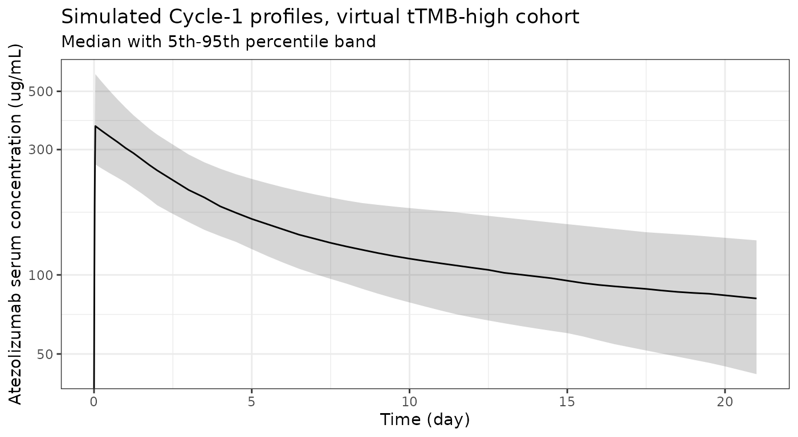
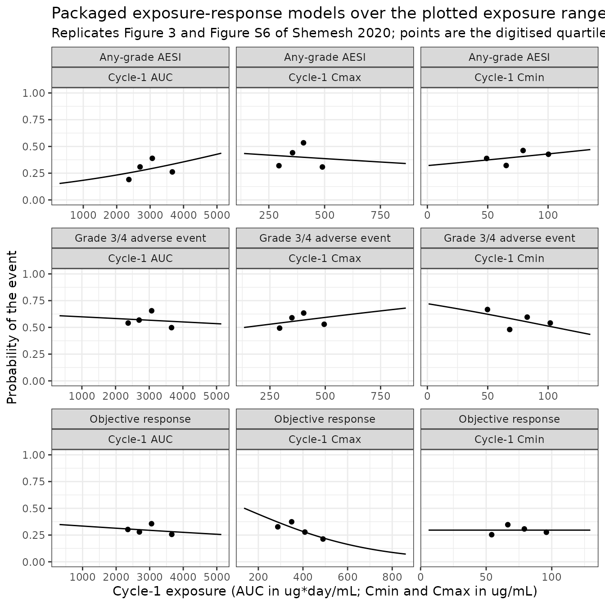

# Atezolizumab exposure-response in high tumour mutational burden (Shemesh 2020)

## Model and source

- Citation: Shemesh CS, Chan P, Legrand FA, Shames DS, Das Thakur M, Shi
  J, Bailey L, Vadhavkar S, He X, Zhang W, Bruno R. Pan-cancer
  population pharmacokinetics and exposure-safety and -efficacy analyses
  of atezolizumab in patients with high tumor mutational burden.
  Pharmacol Res Perspect. 2020;8(6):e00685. <doi:10.1002/prp2.685>.
- Article: <https://doi.org/10.1002/prp2.685> (open access; Supporting
  Information file s001 holds Tables S1-S3 and Figures S1-S7)

Shemesh 2020 pooled 986 patients with tissue tumour mutational burden
(tTMB) data from seven single-agent atezolizumab trials and asked
whether patients with high tTMB (\>= 16 mutations/Mb) have different
exposure, and whether exposure predicts efficacy or safety in that
group. PK was **not** re-estimated: the authors applied the phase I
population PK model of Stroh et al. (Clin Pharmacol Ther
2017;102:305-312) with Bayesian post hoc estimation (`MAXEVAL = 0`) and
derived Cycle-1 AUC, C_(max) and C_(min) for every patient. They then
fitted logistic regressions of three endpoints on each exposure metric
in the tTMB-high subgroup:

``` r

models <- tibble::tribble(
  ~Model,                                     ~Endpoint,                      ~Exposure,       ~Figure,
  "Shemesh_2020_atezolizumab_orr_auc",        "Objective response",           "Cycle-1 AUC",   "3A",
  "Shemesh_2020_atezolizumab_orr_ctrough",    "Objective response",           "Cycle-1 Cmin",  "3B",
  "Shemesh_2020_atezolizumab_orr_cmax",       "Objective response",           "Cycle-1 Cmax",  "S6A",
  "Shemesh_2020_atezolizumab_aeg34_auc",      "Grade 3/4 adverse event",      "Cycle-1 AUC",   "3C",
  "Shemesh_2020_atezolizumab_aeg34_ctrough",  "Grade 3/4 adverse event",      "Cycle-1 Cmin",  "S6B",
  "Shemesh_2020_atezolizumab_aeg34_cmax",     "Grade 3/4 adverse event",      "Cycle-1 Cmax",  "S6C",
  "Shemesh_2020_atezolizumab_aesi_auc",       "Any-grade AESI",               "Cycle-1 AUC",   "3D",
  "Shemesh_2020_atezolizumab_aesi_ctrough",   "Any-grade AESI",               "Cycle-1 Cmin",  "S6D",
  "Shemesh_2020_atezolizumab_aesi_cmax",      "Any-grade AESI",               "Cycle-1 Cmax",  "S6E"
)
knitr::kable(models, caption = "The nine packaged exposure-response models.")
```

| Model | Endpoint | Exposure | Figure |
|:---|:---|:---|:---|
| Shemesh_2020_atezolizumab_orr_auc | Objective response | Cycle-1 AUC | 3A |
| Shemesh_2020_atezolizumab_orr_ctrough | Objective response | Cycle-1 Cmin | 3B |
| Shemesh_2020_atezolizumab_orr_cmax | Objective response | Cycle-1 Cmax | S6A |
| Shemesh_2020_atezolizumab_aeg34_auc | Grade 3/4 adverse event | Cycle-1 AUC | 3C |
| Shemesh_2020_atezolizumab_aeg34_ctrough | Grade 3/4 adverse event | Cycle-1 Cmin | S6B |
| Shemesh_2020_atezolizumab_aeg34_cmax | Grade 3/4 adverse event | Cycle-1 Cmax | S6C |
| Shemesh_2020_atezolizumab_aesi_auc | Any-grade AESI | Cycle-1 AUC | 3D |
| Shemesh_2020_atezolizumab_aesi_ctrough | Any-grade AESI | Cycle-1 Cmin | S6D |
| Shemesh_2020_atezolizumab_aesi_cmax | Any-grade AESI | Cycle-1 Cmax | S6E |

The nine packaged exposure-response models. {.table}

Every one of the nine relationships is non-significant; that flat
exposure-response is the paper’s conclusion and what supports a single
1200 mg every-3-week regimen in a tumour-agnostic high-tTMB population.
The PK model itself is not packaged again here: the parameter set
Shemesh 2020 prints is the fixed intravenous disposition layer of
`Chan_2025_atezolizumab` (checked below), and that model is used to
generate the exposures this vignette feeds into the exposure-response
models.

The paper also plots exploratory tTMB-response curves (Figure S7). Those
are not packaged; see “Assumptions and deviations”.

## Population

The exposure-response analyses use the tTMB-high patients with exposure
data: 171 for objective response and any-grade adverse events of special
interest (AESIs), and 167 for grade 3/4 adverse events. They come from
OAK, POPLAR, BIRCH, FIR, IMvigor210, IMvigor211 and PCD4989g (Table S1).
About 94% received 1200 mg IV every 3 weeks; some PCD4989g patients
received 10, 15 or 20 mg/kg. The tTMB-high column of Table 1 (n = 175)
gives:

- median age 65 (37-89) years
- median body weight 75 (35.4-149) kg
- 27.4% female and 82.9% White
- median albumin 39 g/L and median baseline sum of longest diameters
  (SLD) 58 mm
- 29.3% ADA-positive

The largest tumour groups were NSCLC (83) and urothelial carcinoma (70),
followed by melanoma (12) and at least five other types (Table S2). The
same summary is stored in each model’s `population` metadata, for
example `readModelDb("Shemesh_2020_atezolizumab_orr_auc")()$population`.

## Source trace

Shemesh 2020 prints **no** logistic-regression coefficients anywhere in
the article or supplement, only exploratory P values and the fitted
curves. Every coefficient below was therefore recovered from the
drawing:

- **Figure 3 (main article)** is embedded in the PDF as vector graphics.
  The maintainers read the fitted curve’s end points exactly from the
  drawing coordinates, calibrated against the axis tick marks, and
  solved the two logistic coefficients from them.
- **Figure S6 (supplement)** is a raster image. The fitted curve was
  traced column by column (about 160-190 points per panel) and fitted in
  probability space. The residual SD was 0.001-0.003 on the probability
  scale, which is at or below one pixel.

The functional form was not assumed. On the logit scale, a line in the
untransformed exposure reproduces every panel’s curvature. A line in log
exposure does not: its logit RMSE was 5-35 times larger on the S6
traces, and it misses the two interior points of the Figure 3D Bezier
curve by about 0.09 in probability (checked below).

``` r

coefs <- tibble::tribble(
  ~Model,                                    ~Intercept, ~Slope,   ~`Slope unit`,        ~`Printed P`, ~Source,
  "Shemesh_2020_atezolizumab_orr_auc",       -0.5972,    -0.09243, "per 1000 ug*day/mL", ".751",       "Figure 3A (vector)",
  "Shemesh_2020_atezolizumab_orr_ctrough",   -0.8660,     0,       "per 10 ug/mL",       ".998",       "Figure 3B (vector; drawn exactly flat)",
  "Shemesh_2020_atezolizumab_orr_cmax",       0.4876,    -0.3537,  "per 100 ug/mL",      ".1072",      "Figure S6A (raster)",
  "Shemesh_2020_atezolizumab_aeg34_auc",      0.4644,    -0.06491, "per 1000 ug*day/mL", ".812",       "Figure 3C (vector)",
  "Shemesh_2020_atezolizumab_aeg34_ctrough",  0.9521,    -0.0902,  "per 10 ug/mL",       ".2217",      "Figure S6B (raster)",
  "Shemesh_2020_atezolizumab_aeg34_cmax",    -0.1414,     0.1038,  "per 100 ug/mL",      ".5714",      "Figure S6C (raster)",
  "Shemesh_2020_atezolizumab_aesi_auc",      -1.7908,     0.2994,  "per 1000 ug*day/mL", ".280",       "Figure 3D (vector)",
  "Shemesh_2020_atezolizumab_aesi_ctrough",  -0.7491,     0.0468,  "per 10 ug/mL",       ".5248",      "Figure S6D (raster)",
  "Shemesh_2020_atezolizumab_aesi_cmax",     -0.1891,    -0.0547,  "per 100 ug/mL",      ".7715",      "Figure S6E (raster)"
)
knitr::kable(coefs, caption = "Logistic coefficients: logit(p) = Intercept + Slope * exposure / scale. P values are printed in Results 3.4-3.5 (Figure 3) and on the Figure S6 panels.")
```

| Model | Intercept | Slope | Slope unit | Printed P | Source |
|:---|---:|---:|:---|:---|:---|
| Shemesh_2020_atezolizumab_orr_auc | -0.5972 | -0.09243 | per 1000 ug\*day/mL | .751 | Figure 3A (vector) |
| Shemesh_2020_atezolizumab_orr_ctrough | -0.8660 | 0.00000 | per 10 ug/mL | .998 | Figure 3B (vector; drawn exactly flat) |
| Shemesh_2020_atezolizumab_orr_cmax | 0.4876 | -0.35370 | per 100 ug/mL | .1072 | Figure S6A (raster) |
| Shemesh_2020_atezolizumab_aeg34_auc | 0.4644 | -0.06491 | per 1000 ug\*day/mL | .812 | Figure 3C (vector) |
| Shemesh_2020_atezolizumab_aeg34_ctrough | 0.9521 | -0.09020 | per 10 ug/mL | .2217 | Figure S6B (raster) |
| Shemesh_2020_atezolizumab_aeg34_cmax | -0.1414 | 0.10380 | per 100 ug/mL | .5714 | Figure S6C (raster) |
| Shemesh_2020_atezolizumab_aesi_auc | -1.7908 | 0.29940 | per 1000 ug\*day/mL | .280 | Figure 3D (vector) |
| Shemesh_2020_atezolizumab_aesi_ctrough | -0.7491 | 0.04680 | per 10 ug/mL | .5248 | Figure S6D (raster) |
| Shemesh_2020_atezolizumab_aesi_cmax | -0.1891 | -0.05470 | per 100 ug/mL | .7715 | Figure S6E (raster) |

Logistic coefficients: logit(p) = Intercept + Slope \* exposure / scale.
P values are printed in Results 3.4-3.5 (Figure 3) and on the Figure S6
panels. {.table}

``` r


# Confirm that every packaged file carries exactly these values.
iniOf <- function(m) {
  ui <- rxode2::rxode(readModelDb(m))
  th <- ui$theta
  th[!grepl("^addSd_", names(th))]
}
packaged <- lapply(coefs$Model, iniOf)
stopifnot(
  all(vapply(packaged, length, integer(1)) == 2L),
  isTRUE(all.equal(unname(vapply(packaged, function(x) x[["logit_ref"]], numeric(1))), coefs$Intercept)),
  isTRUE(all.equal(unname(vapply(packaged, function(x) x[[setdiff(names(x), "logit_ref")]], numeric(1))), coefs$Slope))
)
```

The exposure metrics are defined in Methods 2.4. C_(max) is the
end-of-infusion value on day 1 of cycle 1. C_(min) is the day-1 cycle-2
pre-dose value, which is the day-21 trough after one dose, so it is
carried by the `CTROUGH` canonical. AUC is the Cycle-1 AUC over the
21-day cycle (`AUC_ATEZO`). All three are model-predicted total serum
concentrations.

### The PK equations match the packaged intravenous layer

Methods 2.4 prints the typical-value equations of the Stroh 2017 model
used to derive the exposures:

- CL = 0.200 (ALB/40)^(-1.12) (BWT/77)^(0.808) (tumour
  burden/63)^(0.125), times 1.159 if ADA-positive
- V1 = 3.28 (BWT/77)^(0.559) (ALB/40)^(-0.350), times 0.871 if female
- V2 = 3.63, times 0.728 if female

`Chan_2025_atezolizumab` carries the same model as its fixed intravenous
layer. Its categorical effects are written as (1 + theta), so 1.159,
0.871 and 0.728 correspond to 0.159, -0.129 and -0.272.

``` r

pk <- rxode2::rxode(readModelDb("Chan_2025_atezolizumab"))$theta
#> ℹ parameter labels from comments will be replaced by 'label()'
shemeshPrinted <- c(
  lcl = log(0.200), e_alb_cl = -1.12, e_wt_cl = 0.808, e_tumsz_cl = 0.125,
  e_ada_cl = 1.159 - 1, lvc = log(3.28), e_wt_vc = 0.559, e_alb_vc = -0.350,
  e_sexf_vc = 0.871 - 1, lvp = log(3.63), e_sexf_vp = 0.728 - 1
)
# Same parameter set, so the agreement is exact to the printed digits.
stopifnot(isTRUE(all.equal(unname(pk[names(shemeshPrinted)]), unname(shemeshPrinted), tolerance = 1e-12)))
knitr::kable(
  data.frame(parameter = names(shemeshPrinted),
             `Shemesh 2020 Methods` = signif(unname(shemeshPrinted), 4),
             `Chan_2025_atezolizumab` = signif(unname(pk[names(shemeshPrinted)]), 4),
             check.names = FALSE),
  caption = "Every printed typical-value term matches the packaged intravenous layer. Q (0.546 L/day), the IIV block and the residual error are not printed by Shemesh 2020 and are taken from the packaged model."
)
```

| parameter  | Shemesh 2020 Methods | Chan_2025_atezolizumab |
|:-----------|---------------------:|-----------------------:|
| lcl        |               -1.609 |                 -1.609 |
| e_alb_cl   |               -1.120 |                 -1.120 |
| e_wt_cl    |                0.808 |                  0.808 |
| e_tumsz_cl |                0.125 |                  0.125 |
| e_ada_cl   |                0.159 |                  0.159 |
| lvc        |                1.188 |                  1.188 |
| e_wt_vc    |                0.559 |                  0.559 |
| e_alb_vc   |               -0.350 |                 -0.350 |
| e_sexf_vc  |               -0.129 |                 -0.129 |
| lvp        |                1.289 |                  1.289 |
| e_sexf_vp  |               -0.272 |                 -0.272 |

Every printed typical-value term matches the packaged intravenous layer.
Q (0.546 L/day), the IIV block and the residual error are not printed by
Shemesh 2020 and are taken from the packaged model. {.table}

## Virtual cohort

The tTMB-high cohort is rebuilt from the Table 1 medians and ranges. The
distributional shapes (log-normal weight and SLD, normal albumin, each
truncated to the printed range) are assumptions, because Table 1 reports
only medians and ranges. Hemoglobin affects only subcutaneous
bioavailability in `Chan_2025_atezolizumab` and is irrelevant to IV
dosing; it is set to that model’s reference value.

``` r

rxode2::rxSetSeed(20201124)
nSub <- 171

truncNorm <- function(n, mu, sd, lo, hi) {
  x <- numeric(0)
  while (length(x) < n) {
    y <- stats::rnorm(n, mu, sd)
    x <- c(x, y[y >= lo & y <= hi])
  }
  x[seq_len(n)]
}

cohort <- data.frame(
  id = seq_len(nSub),
  WT = exp(truncNorm(nSub, log(75), 0.22, log(35.4), log(149))),
  ALB = truncNorm(nSub, 39, 4.5, 20, 49),
  TUMSZ = exp(truncNorm(nSub, log(58), 0.75, log(11.1), log(309))),
  ADA_POS = stats::rbinom(nSub, 1, 0.293),
  SEXF = stats::rbinom(nSub, 1, 0.274),
  HGB = 123
)
summary(cohort[, c("WT", "ALB", "TUMSZ")])
#>        WT              ALB            TUMSZ       
#>  Min.   : 42.21   Min.   :27.99   Min.   : 11.31  
#>  1st Qu.: 66.56   1st Qu.:35.46   1st Qu.: 33.11  
#>  Median : 76.16   Median :39.34   Median : 52.34  
#>  Mean   : 77.41   Mean   :39.32   Mean   : 67.22  
#>  3rd Qu.: 85.85   3rd Qu.:42.89   3rd Qu.: 87.61  
#>  Max.   :137.51   Max.   :48.95   Max.   :294.66
```

## Simulation of Cycle-1 exposure

One 1200 mg dose is given by 60-minute IV infusion into `central`, with
dense sampling over the first cycle. The window closes at day 20.999 so
that the trough is not contaminated by a cycle-2 dose.

``` r

obsTimes <- sort(unique(c(seq(0, 0.25, by = 1 / 96), seq(0.25, 2, by = 0.25),
                          seq(2.5, 20.5, by = 0.5), 20.999)))
events <- bind_rows(
  data.frame(id = cohort$id, time = 0, amt = 1200, rate = 1200 * 24,
             evid = 1L, cmt = "central"),
  tidyr::expand_grid(id = cohort$id, time = obsTimes) |>
    mutate(amt = NA_real_, rate = NA_real_, evid = 0L, cmt = "central")
) |>
  arrange(id, time, desc(evid)) |>
  left_join(cohort, by = "id")

sim <- rxode2::rxSolve(rxode2::rxode(readModelDb("Chan_2025_atezolizumab")),
                       events, returnType = "data.frame") |>
  mutate(treatment = "1200 mg IV, tTMB-high")
#> ℹ parameter labels from comments will be replaced by 'label()'
```

``` r

sim |>
  group_by(time) |>
  summarise(median = median(Cc), lo = quantile(Cc, 0.05), hi = quantile(Cc, 0.95),
            .groups = "drop") |>
  ggplot(aes(time, median)) +
  geom_ribbon(aes(ymin = lo, ymax = hi), alpha = 0.2) +
  geom_line() +
  scale_y_log10() +
  labs(x = "Time (day)", y = "Atezolizumab serum concentration (ug/mL)",
       title = "Simulated Cycle-1 profiles, virtual tTMB-high cohort",
       subtitle = "Median with 5th-95th percentile band") +
  theme_bw()
#> Warning in scale_y_log10(): log-10 transformation introduced infinite values.
#> log-10 transformation introduced infinite values.
#> log-10 transformation introduced infinite values.
#> log-10 transformation introduced infinite values.
```



## PKNCA validation

``` r

# rxSolve returns only the observation grid, so the concentration frame needs
# no evid filter; the filter is !is.na(Cc) alone so the time-zero row survives.
concData <- sim |>
  filter(!is.na(Cc)) |>
  select(id, time, Cc, treatment)
doseData <- data.frame(id = cohort$id, time = 0, amt = 1200,
                       treatment = "1200 mg IV, tTMB-high")
stopifnot(all(tapply(concData$time, concData$id, min) == 0))

concObj <- PKNCA::PKNCAconc(concData, Cc ~ time | treatment + id,
                            concu = "ug/mL", timeu = "day")
doseObj <- PKNCA::PKNCAdose(doseData, amt ~ time | treatment + id, doseu = "mg")
intervals <- data.frame(start = 0, end = 20.999, cmax = TRUE, auclast = TRUE)
ncaRes <- PKNCA::pk.nca(PKNCA::PKNCAdata(concObj, doseObj, intervals = intervals))

ncaIndiv <- as.data.frame(ncaRes) |>
  filter(PPTESTCD %in% c("cmax", "auclast")) |>
  select(id, PPTESTCD, PPORRES) |>
  tidyr::pivot_wider(names_from = PPTESTCD, values_from = PPORRES)

# The day-21 trough is read off the solve rather than through PKNCA, whose
# ctrough needs an interval ending on a dose record.
exposure <- sim |>
  filter(abs(time - 20.999) < 1e-9) |>
  select(id, ctrough = Cc) |>
  inner_join(ncaIndiv, by = "id") |>
  mutate(treatment = "1200 mg IV, tTMB-high")
stopifnot(nrow(exposure) == nSub, !anyNA(exposure))

geoMean <- function(x) exp(mean(log(x)))
simulatedSummary <- exposure |>
  group_by(treatment) |>
  summarise(cmax = geoMean(cmax), ctrough = geoMean(ctrough),
            auclast = geoMean(auclast), .groups = "drop") |>
  tidyr::pivot_longer(-treatment, names_to = "PPTESTCD", values_to = "PPORRES")
```

## Comparison against the published exposure metrics

Table 2 of Shemesh 2020 reports geometric means of the post hoc Cycle-1
exposures in the 171 tTMB-high patients.

``` r

published <- tibble::tribble(
  ~treatment,              ~PPTESTCD, ~PPORRES,
  "1200 mg IV, tTMB-high", "cmax",    367,
  "1200 mg IV, tTMB-high", "ctrough", 63.2,
  "1200 mg IV, tTMB-high", "auclast", 2722
)
cmp <- nlmixr2lib::ncaComparisonTable(
  simulated = simulatedSummary,
  reference = published,
  by = "treatment",
  units = c(cmax = "ug/mL", ctrough = "ug/mL", auclast = "ug*day/mL"),
  tolerance_pct = 20
)
cmp |>
  dplyr::rename("Treatment" = treatment) |>
  knitr::kable(caption = paste(
    "Simulated Cycle-1 geometric means versus Shemesh 2020 Table 2 (tTMB-high).",
    "* differs from the published value by more than 20%."
  ))
```

| NCA parameter        | Treatment             | Reference | Simulated | % diff   |
|:---------------------|:----------------------|:----------|:----------|:---------|
| Cmax (ug/mL)         | 1200 mg IV, tTMB-high | 367       | 381       | +3.9%    |
| AUClast (ug\*day/mL) | 1200 mg IV, tTMB-high | 2720      | 2940      | +8.2%    |
| Ctrough (ug/mL)      | 1200 mg IV, tTMB-high | 63.2      | 78.1      | +23.5%\* |

Simulated Cycle-1 geometric means versus Shemesh 2020 Table 2
(tTMB-high). \* differs from the published value by more than 20%.
{.table}

``` r


pctDiff <- inner_join(
  dplyr::rename(published, reference = PPORRES),
  dplyr::rename(simulatedSummary, simulated = PPORRES),
  by = c("treatment", "PPTESTCD")
) |>
  mutate(pct = 100 * (simulated - reference) / reference)
stopifnot(
  nrow(pctDiff) == 3L,
  # Cmax is dose / Vc to first order and depends only on the tightly
  # distributed weight, albumin and sex covariates, so it is the sharpest
  # check on the transcribed volumes.
  abs(pctDiff$pct[pctDiff$PPTESTCD == "cmax"]) < 10,
  # Centre of the three metrics. A mis-transcribed clearance or dose moves
  # AUC and the trough by tens of percent.
  abs(median(pctDiff$pct)) < 15,
  # The trough runs about 17-24% high across cohort seeds (see below); the
  # bound leaves headroom for cross-build RNG differences.
  max(abs(pctDiff$pct)) < 35
)
```

C_(max) reproduces within about 5% and AUC within about 10%. The
simulated trough is starred: it sits about 20% above the published
geometric mean. It fell between +17% and +24% across repeated cohort
seeds, so the offset is systematic, not sampling noise. Table 2 reports
a 200% CV for C_(min) against 30% for C_(max), so the published
exposures have a long low-concentration tail from a few patients with
very high clearance. The paper notes that these “large %CV associated
with C_(min) are related to the low exposure levels observed in a small
number of patients”. A log-normal IIV model with a covariate cohort
rebuilt from medians does not produce that tail. The tail pulls the
observed geometric mean down, and it matters most for the trough, which
is the metric most sensitive to clearance. The PK parameters are the
paper’s own and were not adjusted.

## Exposure-response

### The digitised curves

The first check comes from the one panel whose fitted curve is drawn as
a Bezier curve rather than a straight segment, Figure 3D. Its two
interior junction points were **not** used to solve the coefficients
(only the end points were), so they are an out-of-sample check on both
the coefficients and the linear-in-AUC form.

``` r

# These models are purely algebraic: no ODE, no dose, no time dimension. A
# covariate grid is swept along a dummy time axis for a single subject.
solveStatic <- function(modelName, covs) {
  n <- max(vapply(covs, length, integer(1)))
  ev <- data.frame(id = 1L, time = seq_len(n), amt = 0, evid = 0L)
  for (nm in names(covs)) ev[[nm]] <- rep_len(covs[[nm]], n)
  s <- as.data.frame(rxode2::rxSolve(
    rxode2::zeroRe(rxode2::rxode(readModelDb(modelName))),
    events = ev, returnType = "data.frame"
  ))
  stopifnot(nrow(s) == n)
  s
}

interior <- data.frame(AUC_ATEZO = c(2081.9, 3871.6), digitised = c(0.2359, 0.3461))
interior$model <- solveStatic("Shemesh_2020_atezolizumab_aesi_auc",
                              list(AUC_ATEZO = interior$AUC_ATEZO))$prob_aesi
#> Warning: No omega parameters in the model
# The alternative log-AUC reading, fitted through the same two end points.
b1log <- (qlogis(0.4366) - qlogis(0.1539)) / log(5129.7 / 289.7)
interior$logAUC_form <- plogis(qlogis(0.1539) + b1log * log(interior$AUC_ATEZO / 289.7))
knitr::kable(interior, digits = 4,
             caption = "Figure 3D interior points versus the packaged model and the rejected log-AUC form.")
```

| AUC_ATEZO | digitised |  model | logAUC_form |
|----------:|----------:|-------:|------------:|
|    2081.9 |    0.2359 | 0.2373 |      0.3297 |
|    3871.6 |    0.3461 | 0.3471 |      0.4021 |

Figure 3D interior points versus the packaged model and the rejected
log-AUC form. {.table}

``` r

stopifnot(
  # Deterministic (no cohort, no RNG): the bound is the drawing resolution.
  all(abs(interior$model - interior$digitised) < 0.005),
  all(abs(interior$logAUC_form - interior$digitised) > 0.05)
)
```

### Agreement with the plotted quartile proportions

Each panel also plots the observed proportion with the event in each
exposure quartile, placed at the bin’s median exposure. These points
were digitised in the same way (Figure 3 exactly; Figure S6 by pixel
centroid). The quartile bins hold equal numbers of patients. So the mean
of the four proportions is the observed incidence, and for a fitted
logistic regression it must match the mean fitted probability. That is
the maximum-likelihood score identity, a property of the fit rather than
of the drawing.

``` r

bins <- tibble::tribble(
  ~Model,                                    ~exposure, ~observed,
  "Shemesh_2020_atezolizumab_orr_auc",        2349.1,   0.3022,
  "Shemesh_2020_atezolizumab_orr_auc",        2693.2,   0.2791,
  "Shemesh_2020_atezolizumab_orr_auc",        3055.0,   0.3561,
  "Shemesh_2020_atezolizumab_orr_auc",        3657.7,   0.2564,
  "Shemesh_2020_atezolizumab_orr_ctrough",      54.2,   0.2535,
  "Shemesh_2020_atezolizumab_orr_ctrough",      66.5,   0.3468,
  "Shemesh_2020_atezolizumab_orr_ctrough",      79.1,   0.3072,
  "Shemesh_2020_atezolizumab_orr_ctrough",      95.9,   0.2762,
  "Shemesh_2020_atezolizumab_orr_cmax",        287.2,   0.327,
  "Shemesh_2020_atezolizumab_orr_cmax",        349.3,   0.374,
  "Shemesh_2020_atezolizumab_orr_cmax",        408.7,   0.278,
  "Shemesh_2020_atezolizumab_orr_cmax",        489.9,   0.213,
  "Shemesh_2020_atezolizumab_aeg34_auc",      2374.0,   0.5405,
  "Shemesh_2020_atezolizumab_aeg34_auc",      2700.3,   0.5682,
  "Shemesh_2020_atezolizumab_aeg34_auc",      3072.2,   0.6554,
  "Shemesh_2020_atezolizumab_aeg34_auc",      3662.9,   0.4976,
  "Shemesh_2020_atezolizumab_aeg34_ctrough",    49.8,   0.667,
  "Shemesh_2020_atezolizumab_aeg34_ctrough",    68.2,   0.480,
  "Shemesh_2020_atezolizumab_aeg34_ctrough",    82.7,   0.596,
  "Shemesh_2020_atezolizumab_aeg34_ctrough",   101.8,   0.541,
  "Shemesh_2020_atezolizumab_aeg34_cmax",      293.7,   0.493,
  "Shemesh_2020_atezolizumab_aeg34_cmax",      349.3,   0.590,
  "Shemesh_2020_atezolizumab_aeg34_cmax",      402.5,   0.634,
  "Shemesh_2020_atezolizumab_aeg34_cmax",      495.1,   0.529,
  "Shemesh_2020_atezolizumab_aesi_auc",       2364.4,   0.1906,
  "Shemesh_2020_atezolizumab_aesi_auc",       2699.1,   0.3089,
  "Shemesh_2020_atezolizumab_aesi_auc",       3065.4,   0.3890,
  "Shemesh_2020_atezolizumab_aesi_auc",       3664.5,   0.2619,
  "Shemesh_2020_atezolizumab_aesi_ctrough",     49.1,   0.388,
  "Shemesh_2020_atezolizumab_aesi_ctrough",     65.3,   0.322,
  "Shemesh_2020_atezolizumab_aesi_ctrough",     79.3,   0.462,
  "Shemesh_2020_atezolizumab_aesi_ctrough",    100.3,   0.427,
  "Shemesh_2020_atezolizumab_aesi_cmax",       295.4,   0.320,
  "Shemesh_2020_atezolizumab_aesi_cmax",       356.3,   0.441,
  "Shemesh_2020_atezolizumab_aesi_cmax",       405.5,   0.534,
  "Shemesh_2020_atezolizumab_aesi_cmax",       490.1,   0.308
)

exposureColumn <- c(auc = "AUC_ATEZO", ctrough = "CTROUGH", cmax = "CMAX")
probColumn <- c(orr = "prob_orr_investigator", aeg34 = "prob_aeg34", aesi = "prob_aesi")
modelParts <- function(m) {
  parts <- strsplit(sub("^Shemesh_2020_atezolizumab_", "", m), "_")[[1]]
  list(prob = probColumn[[parts[1]]], cov = exposureColumn[[parts[2]]])
}
predictAt <- function(m, x) {
  p <- modelParts(m)
  solveStatic(m, stats::setNames(list(x), p$cov))[[p$prob]]
}

bins <- bins |>
  group_by(Model) |>
  mutate(predicted = predictAt(first(Model), exposure)) |>
  ungroup()
#> Warning: There were 9 warnings in `mutate()`.
#> The first warning was:
#> ℹ In argument: `predicted = predictAt(first(Model), exposure)`.
#> ℹ In group 1: `Model = "Shemesh_2020_atezolizumab_aeg34_auc"`.
#> Caused by warning:
#> ! No omega parameters in the model
#> ℹ Run `dplyr::last_dplyr_warnings()` to see the 8 remaining warnings.

binSummary <- bins |>
  group_by(Model) |>
  summarise(`Observed incidence (mean of quartiles)` = mean(observed),
            `Mean fitted probability at quartile medians` = mean(predicted),
            .groups = "drop") |>
  mutate(Difference = `Mean fitted probability at quartile medians` -
           `Observed incidence (mean of quartiles)`)
knitr::kable(binSummary, digits = 3,
             caption = "Observed quartile proportions versus the packaged model at the quartile median exposures.")
```

| Model | Observed incidence (mean of quartiles) | Mean fitted probability at quartile medians | Difference |
|:---|---:|---:|---:|
| Shemesh_2020_atezolizumab_aeg34_auc | 0.565 | 0.568 | 0.002 |
| Shemesh_2020_atezolizumab_aeg34_cmax | 0.561 | 0.564 | 0.003 |
| Shemesh_2020_atezolizumab_aeg34_ctrough | 0.571 | 0.567 | -0.004 |
| Shemesh_2020_atezolizumab_aesi_auc | 0.288 | 0.288 | 0.001 |
| Shemesh_2020_atezolizumab_aesi_cmax | 0.401 | 0.401 | 0.000 |
| Shemesh_2020_atezolizumab_aesi_ctrough | 0.400 | 0.400 | 0.001 |
| Shemesh_2020_atezolizumab_orr_auc | 0.298 | 0.296 | -0.003 |
| Shemesh_2020_atezolizumab_orr_cmax | 0.298 | 0.298 | 0.000 |
| Shemesh_2020_atezolizumab_orr_ctrough | 0.296 | 0.296 | 0.000 |

Observed quartile proportions versus the packaged model at the quartile
median exposures. {.table}

``` r

stopifnot(
  nrow(binSummary) == 9L,
  # Deterministic: every term is digitised or computed, with no RNG. 0.03 is
  # about a quarter of one quartile's binomial SE (n ~ 42, p ~ 0.3-0.6),
  # yet a sign or scale error in any slope or intercept moves the mean by
  # far more.
  all(abs(binSummary$Difference) < 0.03)
)
```

All nine models agree with their own plotted data. The same table also
shows the one inconsistency in the source. The Figure 3D (AESI versus
AUC) quartiles average about 29%, while Results 3.5 prints an AESI
incidence of 40.4% in the 171 patients. The two S6 AESI panels, which
plot C_(min) and C_(max) for the same endpoint and the same 171
patients, reproduce the 40.4%. The three ORR and three grade 3/4 panels
reproduce the printed 29.7% and 56.9%.

``` r

printed <- c(orr = 0.297, aeg34 = 0.569, aesi = 0.404)
incidence <- binSummary |>
  mutate(endpoint = vapply(strsplit(sub("^Shemesh_2020_atezolizumab_", "", Model), "_"),
                           `[`, character(1), 1),
         printed = printed[endpoint])
stopifnot(
  # Every panel except Figure 3D reproduces the incidence printed in Results.
  all(abs(incidence$`Observed incidence (mean of quartiles)` - incidence$printed)[
    incidence$Model != "Shemesh_2020_atezolizumab_aesi_auc"] < 0.02),
  # Figure 3D does not: this assertion documents the inconsistency so that a
  # future correction of the source is noticed.
  abs(incidence$`Observed incidence (mean of quartiles)`[
    incidence$Model == "Shemesh_2020_atezolizumab_aesi_auc"] - 0.404) > 0.08
)
```

Figure 3D is transcribed as drawn. Its exposure slope (0.30 per 1000
ug\*day/mL, non-significant) is the curve’s own. If the true AESI
incidence is 40.4%, its intercept is probably too low by about 0.5 logit
units. Use the S6 AESI models when the absolute AESI level matters.

### Replicating Figure 3 and Figure S6

``` r

ranges <- tibble::tribble(
  ~Model,                                    ~lo,   ~hi,
  "Shemesh_2020_atezolizumab_orr_auc",       313.5, 5133.7,
  "Shemesh_2020_atezolizumab_orr_ctrough",     6.1,  129.4,
  "Shemesh_2020_atezolizumab_orr_cmax",      136,    861,
  "Shemesh_2020_atezolizumab_aeg34_auc",     336.0, 5141.3,
  "Shemesh_2020_atezolizumab_aeg34_ctrough",   1,    135,
  "Shemesh_2020_atezolizumab_aeg34_cmax",    133,    864,
  "Shemesh_2020_atezolizumab_aesi_auc",      289.7, 5129.7,
  "Shemesh_2020_atezolizumab_aesi_ctrough",    1,    135,
  "Shemesh_2020_atezolizumab_aesi_cmax",     139,    864
)
curves <- ranges |>
  rowwise() |>
  reframe(Model = Model, exposure = seq(lo, hi, length.out = 50)) |>
  group_by(Model) |>
  mutate(probability = predictAt(first(Model), exposure)) |>
  ungroup() |>
  left_join(models, by = "Model")
#> Warning: There were 9 warnings in `mutate()`.
#> The first warning was:
#> ℹ In argument: `probability = predictAt(first(Model), exposure)`.
#> ℹ In group 1: `Model = "Shemesh_2020_atezolizumab_aeg34_auc"`.
#> Caused by warning:
#> ! No omega parameters in the model
#> ℹ Run `dplyr::last_dplyr_warnings()` to see the 8 remaining warnings.

ggplot(curves, aes(exposure, probability)) +
  geom_line() +
  geom_point(data = left_join(bins, models, by = "Model"), aes(y = observed)) +
  facet_wrap(~ Endpoint + Exposure, scales = "free_x", ncol = 3) +
  coord_cartesian(ylim = c(0, 1)) +
  labs(x = "Cycle-1 exposure (AUC in ug*day/mL; Cmin and Cmax in ug/mL)",
       y = "Probability of the event",
       title = "Packaged exposure-response models over the plotted exposure ranges",
       subtitle = "Replicates Figure 3 and Figure S6 of Shemesh 2020; points are the digitised quartile proportions") +
  theme_bw()
```



### Predicted event probabilities in the simulated cohort

The simulated Cycle-1 exposures from the PKNCA section are passed
through each model. The resulting cohort-level probabilities are close
to the observed incidences. Figure 3D is the exception, for the reason
above.

``` r

cohortProb <- lapply(models$Model, function(m) {
  p <- modelParts(m)
  x <- switch(p$cov, AUC_ATEZO = exposure$auclast, CTROUGH = exposure$ctrough,
              CMAX = exposure$cmax)
  data.frame(Model = m, meanProbability = mean(predictAt(m, x)))
}) |>
  bind_rows() |>
  left_join(models, by = "Model")
#> Warning: No omega parameters in the model
#> No omega parameters in the model
#> No omega parameters in the model
#> No omega parameters in the model
#> No omega parameters in the model
#> No omega parameters in the model
#> No omega parameters in the model
#> No omega parameters in the model
#> No omega parameters in the model
knitr::kable(cohortProb[, c("Model", "Endpoint", "Exposure", "meanProbability")], digits = 3,
             caption = "Mean predicted probability in the virtual tTMB-high cohort.")
```

| Model | Endpoint | Exposure | meanProbability |
|:---|:---|:---|---:|
| Shemesh_2020_atezolizumab_orr_auc | Objective response | Cycle-1 AUC | 0.294 |
| Shemesh_2020_atezolizumab_orr_ctrough | Objective response | Cycle-1 Cmin | 0.296 |
| Shemesh_2020_atezolizumab_orr_cmax | Objective response | Cycle-1 Cmax | 0.294 |
| Shemesh_2020_atezolizumab_aeg34_auc | Grade 3/4 adverse event | Cycle-1 AUC | 0.567 |
| Shemesh_2020_atezolizumab_aeg34_ctrough | Grade 3/4 adverse event | Cycle-1 Cmin | 0.551 |
| Shemesh_2020_atezolizumab_aeg34_cmax | Grade 3/4 adverse event | Cycle-1 Cmax | 0.566 |
| Shemesh_2020_atezolizumab_aesi_auc | Any-grade AESI | Cycle-1 AUC | 0.293 |
| Shemesh_2020_atezolizumab_aesi_ctrough | Any-grade AESI | Cycle-1 Cmin | 0.411 |
| Shemesh_2020_atezolizumab_aesi_cmax | Any-grade AESI | Cycle-1 Cmax | 0.401 |

Mean predicted probability in the virtual tTMB-high cohort. {.table}

## Assumptions and deviations

- **No printed coefficients.** Shemesh 2020 reports only exploratory P
  values and the fitted curves. All eighteen coefficients were recovered
  from the figures, as described in “Source trace”. Figure 3 is vector
  graphics, so its four models are exact to the drawing’s precision. The
  Figure S6 raster traces have a residual of about one pixel. As an
  independent check, the maintainers digitised the individual outcomes
  plotted in Figure 3 (about 90% of the circles are separable) and
  refitted each logistic regression. The refits gave slopes within about
  15% of the curve-derived values and reproduced the printed P values:
  0.707 vs .751 (3A), 0.888 vs .998 (3B), 0.787 vs .812 (3C) and 0.257
  vs .280 (3D).
- **Flat ORR-C_(min) curve.** Figure 3B is drawn exactly horizontal, so
  its slope is encoded as 0. A P value of .998 implies a true estimate
  below the drawing’s resolution.
- **Linear, uncentred exposure.** The logit is linear in the
  untransformed exposure; the curvature of the drawn curves supports
  this and rules out the log-exposure form. The rescaling (per 1000
  ug\*day/mL for AUC, per 100 ug/mL for C_(max), per 10 ug/mL for
  C_(min)) is only a presentation choice, matching the sibling
  `Chan_2025_atezolizumab_*` models. The intercepts are the logit at
  zero exposure, outside the observed range.
- **Figure 3D incidence inconsistency.** Documented and asserted above.
  The curve is transcribed as drawn.
- **Placeholder residual.** Each model declares
  `addSd_<output> <- fixed(0.001)` only so that rxode2 accepts an
  observation statement. The source likelihood is Bernoulli, with no
  residual and no IIV.
- **PK layer not re-packaged.** Shemesh 2020 re-estimates no PK
  parameter, and every printed PK term is identical to the fixed
  intravenous layer of `Chan_2025_atezolizumab`, which supplies Q, the
  IIV block and the residual error for the exposure simulation. The
  primary PK source is Stroh et al.
  2017. 
- **Virtual cohort.** The covariate shapes are assumed (see “Virtual
  cohort”). All patients receive 1200 mg; the few PCD4989g patients
  dosed by weight are not represented.
- **tTMB-response curves (Figure S7) not packaged.** Figure S7 plots
  response, grade 3/4 AE and AESI probability against tTMB. The caption
  calls the line a “mean model-fitted curve for each TMB record”. Its
  shape (flat, then a steep rise on a log-tTMB axis for response; flat,
  then a fall for grade 3/4 AEs) cannot be reproduced by a two-parameter
  logistic in tTMB, log(tTMB), log(1 + tTMB) or the square root of tTMB
  (best logit RMSE 0.25, against 0.02 or less for every exposure panel).
  The x-axis is labelled only at the three quartile boundaries. The
  underlying model and predictor transform are not stated, so the curves
  cannot be turned into a model without inventing structure.
