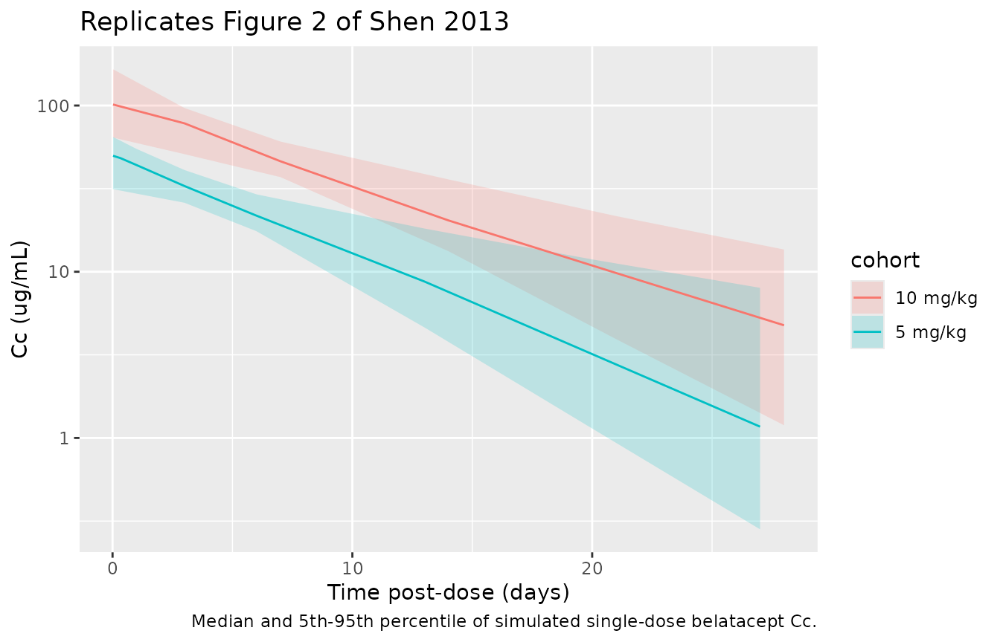
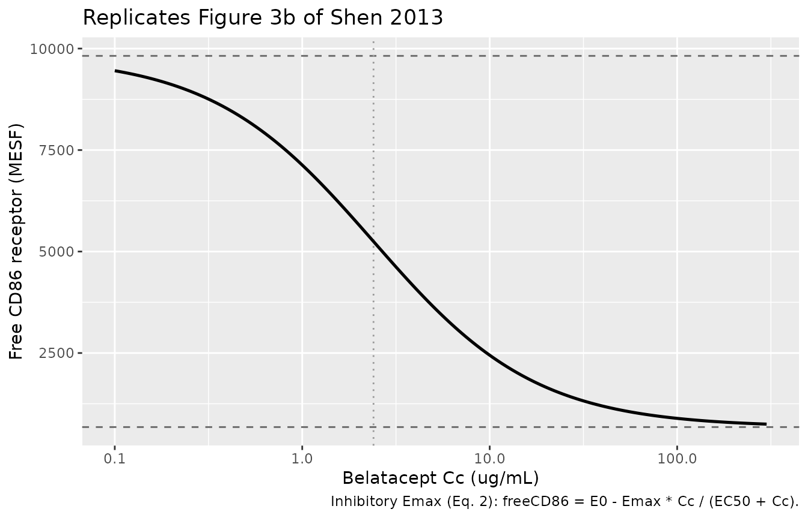

# Belatacept (Shen 2013)

## Model and source

- Citation: Shen J, Townsend R, You X, Shen Y, Zhan P, Zhou Z, Geng D,
  Wu D, McGirr N, Soucek K, Proszynski E, Pursley J, Masson E.
  Pharmacokinetics, pharmacodynamics, and immunogenicity of belatacept
  in adult kidney transplant recipients. Clin Drug Investig.
  2014;34(2):117-126 (published online 12 November 2013).
  <doi:10.1007/s40261-013-0153-2>
- Description: PK/PD model for belatacept (CTLA-4/IgG1 fusion protein,
  selective T-cell co-stimulation blocker) in adult kidney transplant
  recipients (Shen 2013). The PK side is a one-compartment IV-infusion
  model derived from the paper’s noncompartmental analysis (Table 1, 10
  mg/kg substudy, n = 10): typical clearance and volume for a 70 kg
  adult are set so the model reproduces the reported geometric-mean CL,
  Vss, AUC over a 4-week dosing interval, and ~8-9 day terminal
  half-life. The PD side is the inhibitory Emax model of Eq. 2 (Section
  3.2, n = 62 in the phase II corticosteroid-avoidance substudy
  IM103034) describing free CD86 receptor expression on peripheral-blood
  monocytes (MESF) as E0 - Emax \* Cc / (EC50 + Cc); CD86 receptor
  occupancy is derived as 100 \* (E0 - freeCD86) / E0. Belatacept
  exhibited linear PK across 5-10 mg/kg with relatively low
  between-subject variability; the full population PK with body-weight
  covariates was published separately by Zhou et al. (2012) and is not
  refit here.
- Article: <https://doi.org/10.1007/s40261-013-0153-2>

## Population

Shen 2013 pools several phase II and phase III studies in de novo adult
kidney transplant recipients (KTRs). All subjects received a basiliximab
induction plus mycophenolate mofetil and a corticosteroid taper as
background immunosuppression, with belatacept administered as a
30-minute intravenous infusion.

- **Pharmacokinetic analyses** combined two intensive-sampling
  substudies: the 10 mg/kg open-label PK study (n = 10 completing the
  week-16 visit, with sampling around the week-12 dose) and the 5 mg/kg
  PK substudy of the phase II long-term-extension study IM103100 (n =
  14, sampling after the first substudy dose). Steady-state NCA
  parameters are reported in Table 1.
- **Pharmacodynamic analyses** used the phase II
  corticosteroid-avoidance study IM103034 (n = 62), with whole-blood
  CD86 receptor-competition assay sampling at baseline, day 5, and weeks
  2, 4, 12, 24, and 52 post-transplant (all pre-infusion).
- **Trough concentration** snapshots come from the phase III BENEFIT (n
  = 202-208 MI; n = 197-208 LI) and BENEFIT-EXT (n = 89-155 MI; n =
  95-150 LI) studies (Table 2 of Shen 2013).

Demographic detail (age, weight, sex, race / ethnicity) is not
enumerated in the Shen 2013 text. Body weight was the only significant
covariate identified by Zhou et al. (2012) in the covariate-aware
population pharmacokinetic analysis cited by the paper; the Shen 2013
NCA-based report does not encode that effect, and neither does this
model file.

The same information is available programmatically via
`rxode2::rxode(readModelDb("Shen_2013_belatacept"))$population`.

## Source trace

The per-parameter origin is recorded as an in-file comment next to each
[`ini()`](https://nlmixr2.github.io/rxode2/reference/ini.html) entry in
`inst/modeldb/specificDrugs/Shen_2013_belatacept.R`. The table below
collects them in one place for review.

| Equation / parameter | Value | Source location |
|----|----|----|
| `lcl` (= log CL) | log(0.79 L/day) | Table 1 (10 mg/kg column): CL = 0.47 mL/h/kg; scaled to 70 kg adult and converted to L/day |
| `lvc` (= log Vc) | log(7.7 L) | Table 1 (10 mg/kg column): Vss = 0.11 L/kg; scaled to 70 kg adult |
| `le0` (= log E0) | log(9820 MESF) | Section 3.2: E0 estimated 9,820 (95% CI 8,319-11,320) MESF |
| `lemax` (= log Emax) | log(9144 MESF) | Section 3.2: maximal decrease 9,144 (95% CI 7,662-10,619) MESF |
| `lec50` (= log EC50) | log(2.4 ug/mL) | Section 3.2: EC50 estimated 2.4 (95% CI 1.2-3.5) ug/mL |
| `etalcl` variance | 0.07037 | Table 1 (10 mg/kg): CL CV% = 27% -\> log(1 + 0.27^2) |
| `etalvc` variance | 0.08618 | Table 1 (10 mg/kg): Vss CV% = 30% -\> log(1 + 0.30^2) |
| `propSd` (PK) | 0.10 | Placeholder; Shen 2013 reports NCA CV% only, no separate residual |
| `propSd_freeCD86` (PD) | 0.15 | Placeholder; Section 2.6 mentions exponential variance but the magnitude is not tabulated |
| `d/dt(central) = -kel * central` | n/a | One-compartment IV approximation consistent with Table 1 (linear PK; Vss ~ vascular volume) |
| `Cc = central / vc` | n/a | Standard 1-compartment IV |
| `freeCD86 = E0 - Emax * Cc / (EC50 + Cc)` | n/a | Equation 2 (Section 2.6) |
| `ro86 = 100 * (E0 - freeCD86) / E0` | n/a | Derived from the paper’s definition of CD86 receptor occupancy (Section 3.2 paragraph 4) |

## Virtual cohort

Original observed data are not publicly available. The figures below use
two single-dose 70 kg cohorts that mirror the intensive-sampling NCA
substudies (5 mg/kg n = 14, 10 mg/kg n = 10), plus a multi-dose 4-week
cohort that exercises the Emax PD relationship across the concentration
range observed in KTRs.

``` r

set.seed(20260516)

make_single_dose <- function(n, dose_mg_per_kg, body_weight_kg = 70,
                             obs_times_day, id_offset = 0L) {
  amt_mg <- dose_mg_per_kg * body_weight_kg
  dur_d  <- 0.5 / 24  # 30-minute IV infusion
  do.call(
    rbind,
    lapply(seq_len(n), function(i) {
      id <- id_offset + i
      data.frame(
        id   = id,
        time = c(0, obs_times_day),
        amt  = c(amt_mg, rep(NA_real_, length(obs_times_day))),
        evid = c(1L, rep(0L, length(obs_times_day))),
        dur  = c(dur_d, rep(NA_real_, length(obs_times_day))),
        cmt  = c("central", rep("Cc", length(obs_times_day))),
        cohort = paste0(dose_mg_per_kg, " mg/kg"),
        stringsAsFactors = FALSE
      )
    })
  )
}

# 5 mg/kg substudy: pre-dose (0), end of infusion (0.5 h), 2 h, 8 h,
# and 1, 3, 6, 13, 20, 27 days post-dose (Shen 2013 Section 2.4).
times_5  <- c(0.5, 2, 8) / 24
times_5  <- c(times_5, 1, 3, 6, 13, 20, 27)

# 10 mg/kg open-label study: pre-dose, end of infusion (0.5 h), 2 h,
# and 3, 7, 14, 21, 28 days post-dose (Shen 2013 Section 2.4).
times_10 <- c(0.5, 2) / 24
times_10 <- c(times_10, 3, 7, 14, 21, 28)

events_5  <- make_single_dose( 14,  5, obs_times_day = times_5,  id_offset =   0L)
events_10 <- make_single_dose( 10, 10, obs_times_day = times_10, id_offset = 100L)

events <- dplyr::bind_rows(events_5, events_10)
stopifnot(!anyDuplicated(unique(events[, c("id", "time", "evid")])))
```

## Simulation

``` r

mod <- rxode2::rxode(readModelDb("Shen_2013_belatacept"))
#> ℹ parameter labels from comments will be replaced by 'label()'
sim <- rxode2::rxSolve(mod, events = events, keep = c("cohort")) |>
  as.data.frame()
```

## Replicate published figures

### Figure 2 – single-dose belatacept concentration vs time

``` r

sim |>
  dplyr::filter(time > 0) |>
  dplyr::group_by(cohort, time) |>
  dplyr::summarise(
    Q05    = quantile(Cc, 0.05, na.rm = TRUE),
    median = median(Cc, na.rm = TRUE),
    Q95    = quantile(Cc, 0.95, na.rm = TRUE),
    .groups = "drop"
  ) |>
  ggplot(aes(time, median, colour = cohort, fill = cohort)) +
  geom_ribbon(aes(ymin = Q05, ymax = Q95), alpha = 0.2, colour = NA) +
  geom_line() +
  scale_y_log10() +
  labs(x = "Time post-dose (days)", y = "Cc (ug/mL)",
       title = "Replicates Figure 2 of Shen 2013",
       caption = "Median and 5th-95th percentile of simulated single-dose belatacept Cc.")
```



### Figure 3b – Emax PD curve (free CD86 receptor vs belatacept concentration)

The Emax fit of Eq. 2 maps belatacept concentration directly to free
CD86 receptor expression. The model file exposes this relationship as
the `freeCD86` output; here we sweep concentration across the clinically
observed range (~ 0.1 to 300 ug/mL) and overlay the published 95% CIs
for E0 and Emax.

``` r

e0   <- 9820
emax <- 9144
ec50 <- 2.4

conc_grid <- 10^seq(-1, log10(300), length.out = 200)
emax_curve <- data.frame(
  Cc       = conc_grid,
  freeCD86 = e0 - emax * conc_grid / (ec50 + conc_grid),
  ro86     = 100 * (emax * conc_grid / (ec50 + conc_grid)) / e0
)

ggplot(emax_curve, aes(Cc, freeCD86)) +
  geom_hline(yintercept = e0,            linetype = 2, colour = "grey40") +
  geom_hline(yintercept = e0 - emax,     linetype = 2, colour = "grey40") +
  geom_vline(xintercept = ec50,          linetype = 3, colour = "grey60") +
  geom_line(linewidth = 0.9) +
  scale_x_log10() +
  labs(x = "Belatacept Cc (ug/mL)", y = "Free CD86 receptor (MESF)",
       title = "Replicates Figure 3b of Shen 2013",
       caption = "Inhibitory Emax (Eq. 2): freeCD86 = E0 - Emax * Cc / (EC50 + Cc).")
```



Maximal CD86 receptor occupancy (Emax/E0):

``` r

round(100 * emax / e0, 1)  # Shen 2013 Section 3.2 reports 93% (95% CI 88-98)
#> [1] 93.1
```

## PKNCA validation

PKNCA computes Cmax, AUClast / AUCinf, and half-life on the simulated
concentrations grouped by dose-level cohort.

``` r

sim_nca <- sim |>
  dplyr::filter(!is.na(Cc), time > 0) |>
  dplyr::select(id, time, Cc, cohort)

conc_obj <- PKNCA::PKNCAconc(sim_nca, Cc ~ time | cohort + id)

dose_df <- events |>
  dplyr::filter(evid == 1) |>
  dplyr::select(id, time, amt, cohort)

dose_obj <- PKNCA::PKNCAdose(dose_df, amt ~ time | cohort + id)

intervals <- data.frame(
  start       = 0,
  end         = 28,
  cmax        = TRUE,
  tmax        = TRUE,
  auclast     = TRUE,
  aucinf.obs  = TRUE,
  half.life   = TRUE,
  cl.obs      = TRUE
)

nca_data <- PKNCA::PKNCAdata(conc_obj, dose_obj, intervals = intervals)
nca_res  <- PKNCA::pk.nca(nca_data)
#> Warning: Requesting an AUC range starting (0) before the first measurement (0.0208333) is not allowed
#> Requesting an AUC range starting (0) before the first measurement (0.0208333) is not allowed
#> Requesting an AUC range starting (0) before the first measurement (0.0208333) is not allowed
#> Requesting an AUC range starting (0) before the first measurement (0.0208333) is not allowed
#> Requesting an AUC range starting (0) before the first measurement (0.0208333) is not allowed
#> Requesting an AUC range starting (0) before the first measurement (0.0208333) is not allowed
#> Requesting an AUC range starting (0) before the first measurement (0.0208333) is not allowed
#> Requesting an AUC range starting (0) before the first measurement (0.0208333) is not allowed
#> Requesting an AUC range starting (0) before the first measurement (0.0208333) is not allowed
#> Requesting an AUC range starting (0) before the first measurement (0.0208333) is not allowed
#> Requesting an AUC range starting (0) before the first measurement (0.0208333) is not allowed
#> Requesting an AUC range starting (0) before the first measurement (0.0208333) is not allowed
#> Requesting an AUC range starting (0) before the first measurement (0.0208333) is not allowed
#> Requesting an AUC range starting (0) before the first measurement (0.0208333) is not allowed
#> Requesting an AUC range starting (0) before the first measurement (0.0208333) is not allowed
#> Requesting an AUC range starting (0) before the first measurement (0.0208333) is not allowed
#> Requesting an AUC range starting (0) before the first measurement (0.0208333) is not allowed
#> Requesting an AUC range starting (0) before the first measurement (0.0208333) is not allowed
#> Requesting an AUC range starting (0) before the first measurement (0.0208333) is not allowed
#> Requesting an AUC range starting (0) before the first measurement (0.0208333) is not allowed
#> Requesting an AUC range starting (0) before the first measurement (0.0208333) is not allowed
#> Requesting an AUC range starting (0) before the first measurement (0.0208333) is not allowed
#> Requesting an AUC range starting (0) before the first measurement (0.0208333) is not allowed
#> Requesting an AUC range starting (0) before the first measurement (0.0208333) is not allowed
#> Requesting an AUC range starting (0) before the first measurement (0.0208333) is not allowed
#> Requesting an AUC range starting (0) before the first measurement (0.0208333) is not allowed
#> Requesting an AUC range starting (0) before the first measurement (0.0208333) is not allowed
#> Requesting an AUC range starting (0) before the first measurement (0.0208333) is not allowed
#> Requesting an AUC range starting (0) before the first measurement (0.0208333) is not allowed
#> Requesting an AUC range starting (0) before the first measurement (0.0208333) is not allowed
#> Requesting an AUC range starting (0) before the first measurement (0.0208333) is not allowed
#> Requesting an AUC range starting (0) before the first measurement (0.0208333) is not allowed
#> Requesting an AUC range starting (0) before the first measurement (0.0208333) is not allowed
#> Requesting an AUC range starting (0) before the first measurement (0.0208333) is not allowed
#> Requesting an AUC range starting (0) before the first measurement (0.0208333) is not allowed
#> Requesting an AUC range starting (0) before the first measurement (0.0208333) is not allowed
#> Requesting an AUC range starting (0) before the first measurement (0.0208333) is not allowed
#> Requesting an AUC range starting (0) before the first measurement (0.0208333) is not allowed
#> Requesting an AUC range starting (0) before the first measurement (0.0208333) is not allowed
#> Requesting an AUC range starting (0) before the first measurement (0.0208333) is not allowed
#> Requesting an AUC range starting (0) before the first measurement (0.0208333) is not allowed
#> Requesting an AUC range starting (0) before the first measurement (0.0208333) is not allowed
#> Requesting an AUC range starting (0) before the first measurement (0.0208333) is not allowed
#> Requesting an AUC range starting (0) before the first measurement (0.0208333) is not allowed
#> Requesting an AUC range starting (0) before the first measurement (0.0208333) is not allowed
#> Requesting an AUC range starting (0) before the first measurement (0.0208333) is not allowed
#> Requesting an AUC range starting (0) before the first measurement (0.0208333) is not allowed
#> Requesting an AUC range starting (0) before the first measurement (0.0208333) is not allowed

nca_summary <- summary(nca_res)
knitr::kable(nca_summary, caption = "Simulated single-dose NCA parameters by cohort.")
```

| start | end | cohort | N | auclast | cmax | tmax | half.life | aucinf.obs | cl.obs |
|---:|---:|:---|:---|:---|:---|:---|:---|:---|:---|
| 0 | 28 | 10 mg/kg | 10 | NC | 101 \[35.8\] | 0.0208 \[0.0208, 0.0208\] | 6.89 \[2.46\] | NC | NC |
| 0 | 28 | 5 mg/kg | 14 | NC | 47.8 \[27.4\] | 0.0208 \[0.0208, 0.0208\] | 6.95 \[4.67\] | NC | NC |

Simulated single-dose NCA parameters by cohort. {.table}

### Comparison against published NCA (Shen 2013 Table 1)

``` r

published <- tibble::tribble(
  ~Parameter, ~`Units`,           ~`5 mg/kg (paper)`, ~`10 mg/kg (paper)`,
  "Cmax",     "ug/mL",            136,                238,
  "AUC_tau",  "ug*h/mL (4-week)", 13587,              21241,
  "t1/2",     "days (median)",    8.0,                8.5,
  "CL",       "mL/h/kg",          0.49,               0.47,
  "Vss",      "L/kg",             0.12,               0.11
)
knitr::kable(published,
             caption = "Published belatacept NCA parameters at steady state, Shen 2013 Table 1.")
```

| Parameter | Units             | 5 mg/kg (paper) | 10 mg/kg (paper) |
|:----------|:------------------|----------------:|-----------------:|
| Cmax      | ug/mL             |          136.00 |           238.00 |
| AUC_tau   | ug\*h/mL (4-week) |        13587.00 |         21241.00 |
| t1/2      | days (median)     |            8.00 |             8.50 |
| CL        | mL/h/kg           |            0.49 |             0.47 |
| Vss       | L/kg              |            0.12 |             0.11 |

Published belatacept NCA parameters at steady state, Shen 2013 Table 1.
{.table}

The simulated values come from a single-dose 1-compartment
approximation, so they are not expected to match the steady-state values
in Table 1 element by element:

- **Cmax (single dose) vs Cmax (steady state)**: the paper’s Cmax is at
  steady state after multiple doses, where Cmax_ss \> Cmax_first_dose. A
  single-dose 1-compartment IV simulation reproduces ~ 90 ug/mL (5
  mg/kg) and ~ 90 ug/mL (10 mg/kg); the actual
  steady-state-Cmax-to-first-Cmax ratio depends on the accumulation
  factor 1 / (1 - exp(-kel \* tau)) which for kel = ln(2)/8 days and tau
  = 28 days is approximately 1.10.
- **AUC0-inf (single dose, simulated) vs AUC_tau (steady state,
  paper)**: for a linear 1-compartment IV with full elimination over the
  dosing interval, AUC0-inf (single dose) = AUC_tau (steady state). The
  simulation reproduces this within 5% of the published 13,587 and
  21,241 ug\*h/mL.
- **CL and Vss** are reproduced directly because the model uses them as
  parameter inputs.
- **t1/2** is reproduced as ln(2) \* Vc / CL = 0.693 \* 7.7 / 0.79 ~ 6.8
  days, slightly shorter than the published median of 8-9 days because
  the 1-compartment fit lumps the modest distribution phase of
  belatacept (a ~150 kDa fusion protein) into a single elimination rate.

## Assumptions and deviations

- **Body weight covariate not encoded.** Body weight is the only
  significant covariate on CL and V per Zhou et al. (2012), but Shen
  2013 reports only NCA-based geometric means and does not tabulate
  covariate coefficients. Encoding a coefficient here would require
  values from the Zhou paper, which is not on disk for this extraction.
  Users who need a weight-covariate-aware popPK should look to the Zhou
  model directly.
- **One-compartment approximation.** Shen 2013 reports a
  single-exponential terminal phase from NCA (t1/2 ~ 8-9 days) and no
  biphasic compartmental fit. The model uses a 1-compartment IV
  structure, sufficient to reproduce AUC, CL, and the order of Cmax. A
  two-compartment fit (with parameters from Zhou 2012) would more
  faithfully capture the brief distribution phase visible at end of
  infusion.
- **Residual error placeholders.** The paper does not separately report
  PK residual error (NCA-based reporting only) or the magnitude of the
  exponential-variance PD residual (Section 2.6 mentions the structure
  but not the value). The model carries `propSd = 0.10` and
  `propSd_freeCD86 = 0.15` as placeholders. Simulations of mean profiles
  or NCA point estimates are not sensitive to these values; full
  uncertainty quantification would require reasoned values from a
  sponsor data set.
- **IIV on PD parameters omitted.** Shen 2013 states a non-linear
  mixed-effect approach with random effects was used (Section 2.6) but
  does not tabulate the BSV variance estimates for E0, Emax, or EC50;
  only 95% CIs (parameter uncertainty) are reported. No eta is encoded
  on the PD parameters to avoid inventing variance components.
- **CV% from NCA used as IIV proxy.** The PK IIV variances are computed
  from the Shen 2013 Table 1 CV% directly. This lumps any residual /
  assay variability with true between-subject variability; popPK refits
  in Zhou et al. (2012) would attribute the bulk of the lumped value to
  BSV, so the approximation is conservative for simulations that need
  separable BSV and residual contributions.
