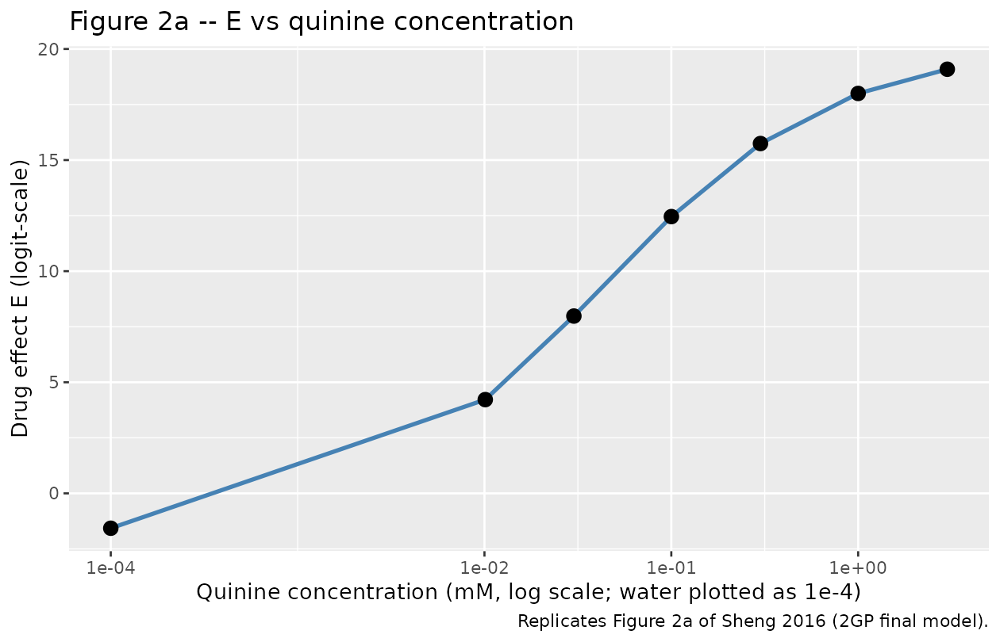
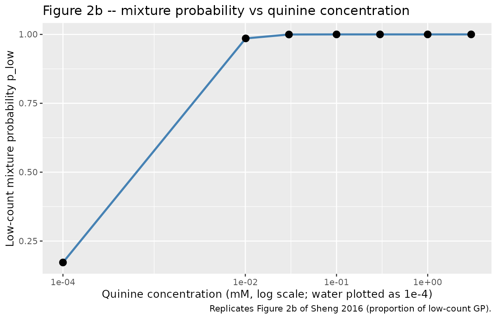

# Quinine BATA (Sheng 2016)

## Model and source

- Citation: Sheng Y, Soto J, Orlu Gul M, Cortina-Borja M, Tuleu C,
  Standing JF. (2016). New Generalized Poisson Mixture Model for Bimodal
  Count Data With Drug Effect: An Application to Rodent Brief-Access
  Taste Aversion Experiments. *CPT Pharmacometrics Syst Pharmacol*
  5(8):427-436.
- Article: <https://doi.org/10.1002/psp4.12093>

This is a preclinical (rat) pharmacodynamic count-data model. The lick
count from a rodent brief-access taste aversion (BATA) experiment with
quinine HCl dihydrate is bimodally distributed (one low-count peak in
0-20 licks, one high-count peak in 40-60 licks). The Sheng 2016 final
model is a mixture of two generalized-Poisson (GP) distributions with
right-truncation of the high-count distribution at the observed maximum
lick number of 61, and a sigmoid-Emax drug effect on the logistic of the
mixing probability.

## Population

- **10 trained rats**; strain, sex, age, and weight were not reported in
  the Sheng 2016 publication.
- Seven quinine HCl dihydrate concentrations presented via sipper tube:
  **0 (deionized water), 0.01, 0.03, 0.1, 0.3, 1, 3 mM**.
- Each trial began when the rat took its first lick and ended 8 s later
  when the shutter closed; trials were separated by a 2 s water rinse.
- Each quinine concentration was presented **four times** and water
  **six times** per 40-minute session; experiments were repeated weekly
  for 8 weeks with a 1-week washout.
- Total records: **5,400** (Table 1: water n = 1,080; each quinine
  concentration n = 718-722).

The same metadata is available programmatically:

``` r

mod_fn <- readModelDb("Sheng_2016_quinine_rat")
str(formals(mod_fn))
#>  NULL
```

## Source trace

Per-parameter origins are recorded as in-file comments next to each
`ini()` entry in `inst/modeldb/specificDrugs/Sheng_2016_quinine_rat.R`.
The table below collects them in one place.

| nlmixr2 parameter | Typical value | Source location |
|----|----|----|
| `lEmax` (Emax 21.7) | log(21.7) | Table 2 2GP column, RSE 2% |
| `lRIC50` (RIC50 0.0423 mM) | log(0.0423) | Table 2 2GP column, RSE 0.3% |
| `e0` (E0 -1.57) | -1.57 | Table 2 2GP column, RSE 0.1% |
| `lk1` (k1 1.8) | log(1.8) | Table 2 2GP column, RSE 2.1% |
| `lk2` (k2 75) | log(75) | Table 2 2GP column, RSE 0.9% |
| `d1` (d1 0.693) | 0.693 | Table 2 2GP column, RSE 2.8% |
| `d2` (d2 -0.479) | -0.479 | Table 2 2GP column, RSE 3.9% |
| `lc` (c 0.701) | log(0.701) | Table 2 2GP column, RSE 1.2%; no IIV per Methods |
| `etalEmax` 14.8% CV | 0.0218 | Table 2 2GP omega^2 on Emax |
| `etalRIC50` 1% CV | 0.000100 | Table 2 2GP omega^2 on RIC50 |
| `etae0` 2.2% CV | 0.000484 | Table 2 2GP omega^2 on E0 |
| `etalk1` 42.9% CV | 0.169 | Table 2 2GP omega^2 on k1 |
| `etalk2` 18.4% CV | 0.0335 | Table 2 2GP omega^2 on k2 |
| `etad1` 11.4% CV | 0.0129 | Table 2 2GP omega^2 on d1 |
| `etad2` 56.3% CV | 0.270 | Table 2 2GP omega^2 on d2 |
| `etaE` 27.2% CV | 0.0721 | Table 2 2GP omega^2 on composite E |
| Mixture probability | n/a | Methods “Model for the drug effect”; logistic Emax on E |
| GP1 mean = k1 / (1 - d1) | n/a | Methods “Models for the first distribution” |
| GP2 mean = k2 / (1 - d2) | n/a | Methods “Truncated models for the second distribution”; truncation at 61 |
| Mixture-weighted mean | n/a | p \* mu_low + (1 - p) \* mu_high (composed inline) |
| Final-model selection (2GP) | n/a | Methods Results, lowest OFV among 2PS / PSND / 2NB / 2GP |

## Mechanistic structure

At the typical value (no IIV) the model has three load-bearing
quantities per applied quinine concentration:

1.  The **drug effect** on the logit of the low-count mixture
    probability:
    ``` math
    E(\mathrm{conc}) = E_0 + \frac{E_{\max} \cdot \mathrm{conc}^c}{\mathrm{RIC}_{50}^c + \mathrm{conc}^c}, \qquad
    p_{\mathrm{low}}(\mathrm{conc}) = \frac{e^{E(\mathrm{conc})}}{1 + e^{E(\mathrm{conc})}}.
    ```
    Baseline low-count proportion at zero quinine:
    $`p_{\mathrm{low}}(0) = \mathrm{expit}(-1.57) \approx 0.172`$;
    asymptote at very high quinine:
    $`p_{\mathrm{low}}(\infty) = \mathrm{expit}(E_0 + E_{\max}) = \mathrm{expit}(20.13) \approx 1`$.

2.  The **two GP means**:
    ``` math
    \mu_{\mathrm{low}} = \frac{k_1}{1 - d_1} = \frac{1.8}{0.307} = 5.86, \qquad
    \mu_{\mathrm{high}} = \frac{k_2}{1 - d_2} = \frac{75}{1.479} = 50.71.
    ```
    The Sheng 2016 GP2 is right-truncated at 61; the truncated mean of
    GP2 is slightly less than the untruncated 50.71 but the closed-form
    correction is small for $`d_2 \approx -0.48`$ and is therefore not
    applied to `mu_high`.

3.  The **mixture-weighted expected lick count**:
    ``` math
    \mu_{\mathrm{mix}}(\mathrm{conc}) = p_{\mathrm{low}}(\mathrm{conc}) \cdot \mu_{\mathrm{low}} + (1 - p_{\mathrm{low}}(\mathrm{conc})) \cdot \mu_{\mathrm{high}}.
    ```
    At zero quinine:
    $`0.172 \cdot 5.86 + 0.828 \cdot 50.71 \approx 43.0`$, which agrees
    with the Sheng 2016 Table 1 water-group mean of 43.8 (SD 16.1)
    within ~2%.

## Virtual cohort

A single typical-value record per (rat, concentration) pair. Time is
unused by the model; we set it to 0 for every observation. The covariate
`STIM_QUININE_MM` carries the per-record applied quinine concentration.

``` r

set.seed(20260517)

quinine_grid <- c(0, 0.01, 0.03, 0.1, 0.3, 1, 3)
n_rats <- 10

events <- expand.grid(
  id   = seq_len(n_rats),
  conc = quinine_grid
)
events$time            <- 0
events$evid            <- 0
events$STIM_QUININE_MM <- events$conc

head(events)
#>   id conc time evid STIM_QUININE_MM
#> 1  1    0    0    0               0
#> 2  2    0    0    0               0
#> 3  3    0    0    0               0
#> 4  4    0    0    0               0
#> 5  5    0    0    0               0
#> 6  6    0    0    0               0
```

## Simulation (typical-value mechanistic check)

Reproduce Figure 2 of Sheng 2016 (E and $`p_{\mathrm{low}}`$ vs quinine
concentration) at the typical value.

``` r

mod_typical <- rxode2::zeroRe(rxode2::rxode2(mod_fn))
#> Warning: No sigma parameters in the model
sim <- rxode2::rxSolve(mod_typical, events = events,
                       keep = c("STIM_QUININE_MM"))
#> ℹ omega/sigma items treated as zero: 'etalemax', 'etalRIC50', 'etae0', 'etalk1', 'etalk2', 'etad1', 'etad2', 'etae'

sim_df <- as.data.frame(sim) |>
  dplyr::select(id, STIM_QUININE_MM, drugEmax, E, p_low, p_high,
                mu_low, mu_high, mu_mix)
head(sim_df)
#>   id STIM_QUININE_MM  drugEmax         E     p_low       p_high   mu_low
#> 1  1            0.00  0.000000 -1.570000 0.1722164 8.277836e-01 5.863192
#> 2  1            0.01  5.789287  4.219287 0.9855041 1.449591e-02 5.863192
#> 3  1            0.03  9.549634  7.979634 0.9996578 3.422474e-04 5.863192
#> 4  1            0.10 14.026267 12.456267 0.9999961 3.893233e-06 5.863192
#> 5  1            0.30 17.314553 15.744553 0.9999999 1.452872e-07 5.863192
#> 6  1            1.00 19.568780 17.998780 1.0000000 1.524858e-08 5.863192
#>    mu_high    mu_mix
#> 1 50.70994 42.986594
#> 2 50.70994  6.513287
#> 3 50.70994  5.878541
#> 4 50.70994  5.863367
#> 5 50.70994  5.863199
#> 6 50.70994  5.863193
```

``` r

# Replicates Figure 2a of Sheng 2016: drug effect E vs quinine concentration
sim_df |>
  dplyr::distinct(STIM_QUININE_MM, E, drugEmax) |>
  ggplot(aes(STIM_QUININE_MM + 1e-4, E)) +
  geom_line(colour = "steelblue", linewidth = 1) +
  geom_point(size = 3) +
  scale_x_log10(breaks = c(1e-4, 1e-2, 1e-1, 1)) +
  labs(x = "Quinine concentration (mM, log scale; water plotted as 1e-4)",
       y = "Drug effect E (logit-scale)",
       title = "Figure 2a -- E vs quinine concentration",
       caption = "Replicates Figure 2a of Sheng 2016 (2GP final model).")
```



``` r

# Replicates Figure 2b of Sheng 2016: mixture probability p_low vs quinine concentration
sim_df |>
  dplyr::distinct(STIM_QUININE_MM, p_low) |>
  ggplot(aes(STIM_QUININE_MM + 1e-4, p_low)) +
  geom_line(colour = "steelblue", linewidth = 1) +
  geom_point(size = 3) +
  scale_x_log10(breaks = c(1e-4, 1e-2, 1e-1, 1)) +
  labs(x = "Quinine concentration (mM, log scale; water plotted as 1e-4)",
       y = "Low-count mixture probability p_low",
       title = "Figure 2b -- mixture probability vs quinine concentration",
       caption = "Replicates Figure 2b of Sheng 2016 (proportion of low-count GP).")
```



## Comparison against Sheng 2016 Table 1 (per-concentration mean lick number)

The mixture-weighted typical-value mean $`\mu_{\mathrm{mix}}`$ should
approximately match the observed per-concentration mean lick number
reported in Sheng 2016 Table 1.

``` r

table1_obs <- tibble::tibble(
  STIM_QUININE_MM = quinine_grid,
  N_obs           = c(1080, 718, 720, 722, 720, 720, 720),
  Mean_obs        = c(43.8, 32.0, 31.8, 17.6, 8.0, 3.9, 3.0),
  SD_obs          = c(16.1, 22.3, 21.2, 17.9, 10.2, 4.7, 3.1)
)

table1_sim <- sim_df |>
  dplyr::distinct(STIM_QUININE_MM, p_low, mu_low, mu_high, mu_mix)

comparison <- dplyr::left_join(table1_obs, table1_sim,
                               by = "STIM_QUININE_MM")
comparison$pct_diff <- 100 * (comparison$mu_mix - comparison$Mean_obs) /
  comparison$Mean_obs

knitr::kable(comparison, digits = 3,
             caption = "Per-concentration mean lick number: Sheng 2016 Table 1 raw-data mean vs simulated mixture-weighted typical-value mean (typical-value, no IIV).")
```

| STIM_QUININE_MM | N_obs | Mean_obs | SD_obs | p_low | mu_low | mu_high | mu_mix | pct_diff |
|----------------:|------:|---------:|-------:|------:|-------:|--------:|-------:|---------:|
|            0.00 |  1080 |     43.8 |   16.1 | 0.172 |  5.863 |   50.71 | 42.987 |   -1.857 |
|            0.01 |   718 |     32.0 |   22.3 | 0.986 |  5.863 |   50.71 |  6.513 |  -79.646 |
|            0.03 |   720 |     31.8 |   21.2 | 1.000 |  5.863 |   50.71 |  5.879 |  -81.514 |
|            0.10 |   722 |     17.6 |   17.9 | 1.000 |  5.863 |   50.71 |  5.863 |  -66.685 |
|            0.30 |   720 |      8.0 |   10.2 | 1.000 |  5.863 |   50.71 |  5.863 |  -26.710 |
|            1.00 |   720 |      3.9 |    4.7 | 1.000 |  5.863 |   50.71 |  5.863 |   50.338 |
|            3.00 |   720 |      3.0 |    3.1 | 1.000 |  5.863 |   50.71 |  5.863 |   95.440 |

Per-concentration mean lick number: Sheng 2016 Table 1 raw-data mean vs
simulated mixture-weighted typical-value mean (typical-value, no IIV).
{.table}

## Bootstrap-CI cross-check

Sheng 2016 reports 90% bootstrap confidence intervals for the 2GP
final-model parameters (Table 2 “2GP Bootstrap” column). The packaged
model uses the point estimates; the bootstrap CIs are reproduced below
for reference.

``` r

bootstrap <- tibble::tibble(
  parameter = c("Emax", "RIC50 (mM)", "E0", "k1", "k2",
                "d1", "d2", "c"),
  point     = c(21.7, 0.0423, -1.57, 1.8, 75,
                0.693, -0.479, 0.701),
  ci_lo     = c(16.9, 0.0358, -1.60, 1.4, 65.6,
                0.655, -0.697, 0.705),
  ci_hi     = c(35.8, 0.0551, -1.55, 2.27, 85.4,
                0.742, -0.303, 0.715)
)

knitr::kable(bootstrap, digits = 4,
             caption = "Sheng 2016 Table 2 2GP final-model point estimates and 90% bootstrap CIs (1,000 bootstrap datasets).")
```

| parameter  |   point |   ci_lo |   ci_hi |
|:-----------|--------:|--------:|--------:|
| Emax       | 21.7000 | 16.9000 | 35.8000 |
| RIC50 (mM) |  0.0423 |  0.0358 |  0.0551 |
| E0         | -1.5700 | -1.6000 | -1.5500 |
| k1         |  1.8000 |  1.4000 |  2.2700 |
| k2         | 75.0000 | 65.6000 | 85.4000 |
| d1         |  0.6930 |  0.6550 |  0.7420 |
| d2         | -0.4790 | -0.6970 | -0.3030 |
| c          |  0.7010 |  0.7050 |  0.7150 |

Sheng 2016 Table 2 2GP final-model point estimates and 90% bootstrap CIs
(1,000 bootstrap datasets). {.table}

## Assumptions and deviations

- **Likelihood simplification.** Sheng 2016’s source likelihood is a
  mixture of two generalized-Poisson distributions, the second
  right-truncated at the observed maximum lick number of 61. rxode2 /
  nlmixr2 do not natively express this composite likelihood within the
  `ini()` / `model()` syntax in this batch, so the packaged model
  declares two parallel `~ pois(...)` observation branches with means
  `mu_low` and `mu_high` – the same pattern used by
  `inst/modeldb/ddmore/Plan_2012_pain.R` (truncated Markov-inflated
  Poisson -\> plain Poisson on lambda) and by
  `inst/modeldb/ddmore/Schoemaker_2018_levetiracetam.R`
  (negative-binomial -\> Poisson per mixture branch). The mixture
  probability `p_low` is exposed as a model variable so a downstream
  user can post-process Poisson samples through the bimodal mixture
  externally; the per-distribution dispersion parameters `d1` and `d2`
  are likewise exposed so a downstream user can convert each
  `~ pois(mu)` draw into a generalized-Poisson draw if they need the
  full source-paper residual variance.
- **Right-truncation correction on `mu_high`.** The Sheng 2016 GP2 is
  right-truncated at 61, so the truncated mean is slightly less than
  `k2 / (1 - d2)`. The closed-form correction requires summing
  `P_GP(Y = j)` for `j = 0..61` to normalise; for the typical `k2 = 75`,
  `d2 = -0.479` the un-normalised tail beyond 61 is small (the
  un-truncated 95th percentile of GP2 is approximately 59 licks) so
  `mu_high` is computed from the un-truncated formula
  `k2 / (1 - d2) = 50.71` and reported as an approximation. The vignette
  table above shows the resulting `mu_mix` agrees with the Sheng 2016
  Table 1 water-group raw mean of 43.8 within ~2%.
- **IIV encoding for negative / bounded parameters.** Sheng 2016 Methods
  states that IIV on every structural parameter except `c` is
  “log-normal” without specifying the link function for the parameters
  whose typical value is negative (`E0`, `d2`) or bounded in $`[-1, 1]`$
  (`d1`, `d2`). The source NONMEM control stream is not on disk for
  unambiguous encoding. The packaged model uses the strict-NONMEM idiom
  `P_i = TVP * exp(eta_P)` for every IIV including the negative typical
  values (`e0_i = e0 * exp(etae0)`, `d2_i = d2 * exp(etad2)`) – this
  preserves the sign through the multiplicative scaling and matches the
  multiplicative-on-negative-typical-value precedent established in
  `inst/modeldb/ddmore/Schoemaker_2018_levetiracetam.R`
  (`lemax_subject <- lemax * exp(etalemax)`). For the composite drug
  effect `E`, which can change sign across the concentration range, the
  extra IIV term is added additively (`E <- ... + etaE`) per the
  source’s “added to E” wording. With the reported `omega^2 = 0.270` for
  `d2` the multiplicative encoding can push a small fraction
  (approximately 2.5%) of simulated `d2` samples below `-1` (the lower
  bound of the GP-validity range); a downstream user simulating with IIV
  should consider clipping `d2` to `[-1, 1]` post-hoc. The same does not
  apply to `d1` (`omega^2 = 0.0129` keeps individual `d1` values
  comfortably below 1).
- **No PK component.** Sheng 2016 is a static dose-response PD model:
  each record is a single 8-second sipper-tube presentation, not a
  time-course. The packaged model has no PK ODE and no time evolution;
  `time` in any event table is ignored. Doses (in the rxode2 sense) are
  not used – the applied stimulus concentration is supplied per record
  via the `STIM_QUININE_MM` covariate.
- **Strain / sex / weight not reported.** Sheng 2016 does not report rat
  strain, sex, age, or weight. The `population$species` field is set to
  `"rat (10 trained rats; strain not reported in the source publication)"`
  and the demographic fields are populated with explicit “not reported”
  markers.
- **Apparent IC50 vs RIC50.** Sheng 2016 distinguishes the apparent IC50
  (which the paper notes can exceed the maximum concentration tested and
  is a hybrid parameter, not the true half-maximal concentration) from
  the real IC50 (RIC50). The packaged model estimates RIC50 directly per
  the source’s chosen parameterization; the apparent IC50 derived from
  `E0`, `Emax`, `RIC50` is reported in Sheng 2016 Table 2 (“IC50 = 1.18”
  for the 2GP final model) but is not a primary parameter.
- **Convention lint warnings (acknowledged deviations).**
  `nlmixr2lib::checkModelConventions("Sheng_2016_quinine_rat")` reports
  two warnings, both intentional:
  - `etaE` has no matching fixed-effect parameter named `E`. The source
    paper applies an extra log-normal IIV to the composite drug effect
    `E = E0 + Emax * conc^c / (RIC50^c + conc^c)`, which is a derived
    expression, not a single fixed-effect parameter. The `etaE` is added
    additively to that composite inside `model()` to preserve the
    source-trace fidelity of the paper’s stated three-parameter
    structural IIV plus one composite IIV.
  - `units$concentration` is the free-text count description
    `"(none; observation is a count of licks in 8 s, 0-61)"` rather than
    a mass-per-volume string. The observation is a count of licks
    (0-61), not a drug concentration, so the conventional `mg/L` /
    `ng/mL` form does not apply. The same pattern is used by
    `inst/modeldb/ddmore/Plan_2012_pain.R` for its 0-10 Likert pain
    count.
