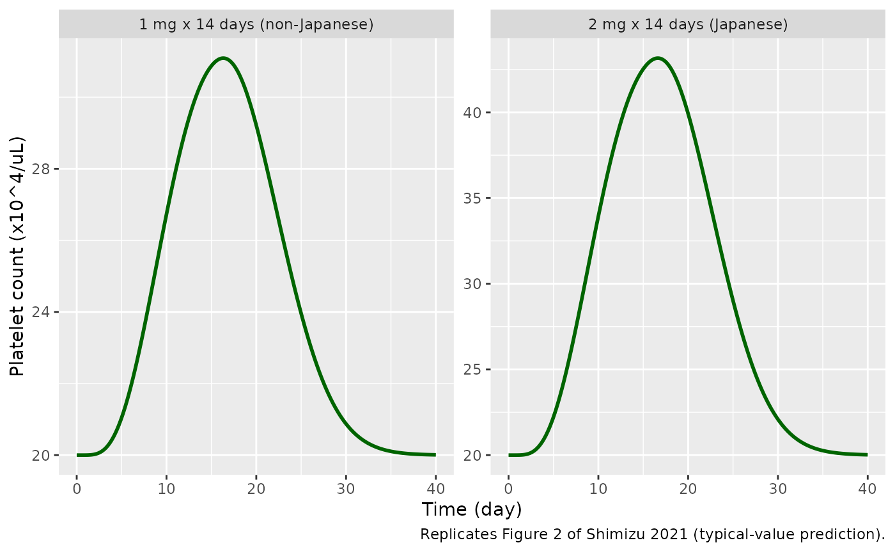
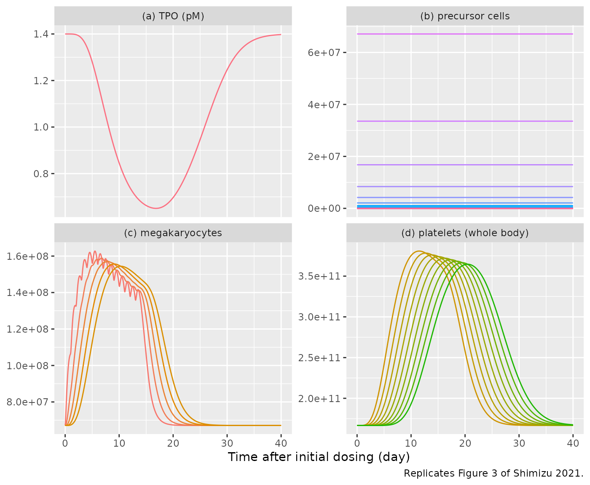
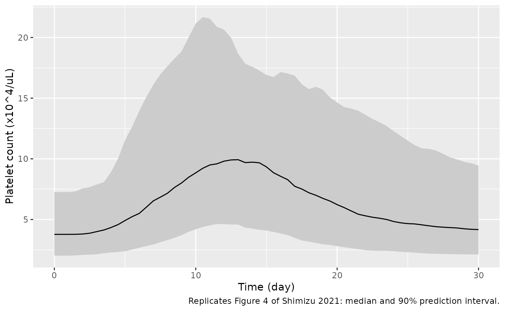

# Lusutrombopag thrombopoiesis QSP (Shimizu 2021)

## Model and source

- Citation: Shimizu R, Katsube T, Wajima T. Quantitative systems
  pharmacology model of thrombopoiesis and platelet life-cycle, and its
  application to thrombocytopenia based on chronic liver disease. CPT
  Pharmacometrics Syst Pharmacol. 2021;10(5):489-499.
  <doi:10.1002/psp4.12623>. Model equations from Supplementary Text
  S1/S2 and the deposited MATLAB model code (Supplementary Model Code).
  Lusutrombopag PK from Katsube T et al. Clin Pharmacokinet.
  2016;55:1423-1433; TPO binding kinetics from Jin F, Krzyzanski W. AAPS
  PharmSci. 2004;6:E9.
- Description: QSP. Thrombopoiesis and platelet life-cycle model with
  thrombopoietin (TPO) target-mediated disposition, driven by the oral
  TPO-receptor agonist lusutrombopag, in healthy adults and in
  thrombocytopenic patients with chronic liver disease (CLD). 27
  dividing megakaryocyte progenitor compartments (26 doublings), 5
  megakaryocyte maturation compartments, 9 platelet aging compartments,
  a 3-state TPO binding model and a 3-compartment first-order-absorption
  lusutrombopag PK model. TPO and unbound lusutrombopag add on one
  shared Emax term that scales the progenitor division rate; splenic
  sequestration sets the plasma fraction of the total platelet pool.
- Article: <https://doi.org/10.1002/psp4.12623> (open access)
- Supplement: Supplementary Text S1 (ODEs), Text S2 (initial values),
  Table S1 (clinical studies) and the MATLAB model code, available from
  the article page.

Shimizu, Katsube and Wajima built a quantitative systems pharmacology
(QSP) model of thrombopoiesis. One megakaryocyte progenitor divides 26
times (one division per day, 27 compartments). The resulting 2^26
megakaryocytes mature through five one-day compartments and each
releases PP platelets. Platelets age through nine one-day compartments.
Endogenous thrombopoietin (TPO) follows the Jin & Krzyzanski (2004)
target-mediated disposition model, in which TPO binds the c-Mpl receptor
on platelets, so a rise in platelets lowers TPO. TPO and the
TPO-receptor agonist lusutrombopag share one Emax term that scales the
progenitor division rate `kout1`. Only part of the whole-body platelet
pool circulates. The rest is sequestered in the spleen (%SPS). This
split is what separates patients with chronic liver disease (CLD) from
healthy subjects. The model was not fitted to data. All values were
fixed from physiology and the literature, and the model’s predictions
were then compared with the observed lusutrombopag data.

## Population

The model was applied to two populations (Methods; Supplementary Table
S1):

- **Healthy adults.** Japanese subjects given single doses of 1, 2, 4,
  10, 25 or 50 mg, non-Japanese subjects given 1 mg once daily for 14
  days, and Japanese subjects given 2 mg once daily for 14 days. The
  baselines are TPO0 = 1.4 pM and PLT0 = 20 x 10^4/uL, with %SPS fixed
  at 1/3.
- **Japanese patients with CLD and thrombocytopenia.** These are the
  phase II patients, dosed at 3 mg once daily for 7 days. The baselines
  are TPO0 = 0.78 pM and PLT0 = 4 x 10^4/uL, with PP = 2500 platelets
  per megakaryocyte. %SPS follows from the steady state (78.6%).

The `DIS_HEALTHY` covariate selects between the two parameter sets (1 =
healthy, 0 = CLD with thrombocytopenia). The same information is
available programmatically via
`readModelDb("Shimizu_2021_lusutrombopag")()$population`.

## Source trace

Table 1 of the paper prints two-significant-figure roundings. The values
in the model are the ones in the deposited MATLAB scripts
(`initial_values_constants_*.m`, `platelet_function*.m`), which are what
the authors simulated.

| Equation / parameter | Value | Source location |
|----|----|----|
| `lka`, `lkel`, `lk12`, `lk21`, `lk13`, `lk31` | 7.176, 1.358, 1.2816, 2.088, 0.03408, 0.14088 /day | Table 1 (7.2, 1.4, 1.3, 2.1, 0.034, 0.14); deposited `initial_values_constants_lusu.m` |
| `lvc` | 13.7 L | Table 1; deposited code |
| `lemax` | 4.52 | Table 1 (from Katsube 2019 PK/PD) |
| `lec50` | 183 ng/mL | Table 1 (in vitro CD34+ cells) |
| `lec50_tpo` | 4.928 pM | Table 1 footnote b and Equation 11: (4.52 - 1) x 1.4; deposited code |
| `kon`, `koff`, `knf`, `kfn` | 1.32 /pM/day, 60, 1.152, 3.12 /day | Table 1 (1.3, 60, 1.2, 3.1); deposited code |
| `kint` | 2.4 /day | Text S1 (symbol only); deposited `initial_values_constants_for_platelet.m` |
| `rp0` | 164 pM | Table 1 Rp,0; deposited code `mpl` |
| `lrbase_tpo_healthy`, `lrbase_tpo_cld` | 1.4, 0.78 pM | Table 1 TPO0 |
| `lrbase_plt_healthy`, `lrbase_plt_cld` | 20, 4 x 10^4/uL | Table 1 PLT0 |
| `lkout` | 1 /day | Table 1 |
| `lpp` (CLD) | 2500 | Table 1 PP; deposited CLD code |
| `sps_healthy` | 1/3 | Text S1 (‘fixed as 1/3 in healthy subjects’); Discussion 33.3% |
| `eta*` (4 etas) | omega^2 = 0.1484 | Methods: ‘IIV … set at 40%’ |
| `d/dt(precursor1..27)` | n/a | Equations 1-2; Text S1 X1-X27 |
| `d/dt(mk1..5)` | n/a | Text S1 X28-X32 |
| `d/dt(plt1..9)` | n/a | Equations 7-8; Text S1 X33-X41 |
| `d/dt(tpo)`, `tpo_ns`, `tpo_complex` | n/a | Text S1 X42-X44; deposited `platelet_function*.m` rows 5-7 |
| `PLT` | n/a | Equation 9; Text S1 ‘Platelet count in blood’ |
| `kout1` | n/a | Equation 12; Text S1; floor at baseline from Methods |
| PP (healthy), %SPS (CLD) | n/a | Text S1 PP definition; Equation 10; deposited scripts |
| Initial conditions | n/a | Text S2 |
| `depot`, `central`, `peripheral1/2` | n/a | Text S1 X45-X48 |

## Simulation helpers

The deposited MATLAB scripts do not give the nominal dose. They give the
nominal dose times a scenario-specific relative bioavailability factor.
The healthy 2 mg Japanese run uses `W_dose = 2000*0.857` ug. A
commented-out line holds `1000*0.820*0.906*0.905` ug, which appears to
be the 1 mg non-Japanese scenario. The CLD 3 mg run uses
`W_dose = 3000*0.813` ug. The factors are not explained in the paper and
presumably come from the formulation, food and population covariates of
the Katsube 2016 and 2019 lusutrombopag PK models. This vignette applies
them to `amt`. The model itself has no bioavailability term.

``` r

mod <- readModelDb("Shimizu_2021_lusutrombopag")
mod_typical <- rxode2::zeroRe(mod)
#> ℹ parameter labels from comments will be replaced by 'label()'
#> Warning: No sigma parameters in the model

# One subject, once-daily oral dosing, dense observation grid on the ODE
# state `central` (algebraic outputs such as PLT, Cc and tpo come back as
# columns).
make_events <- function(amt, n_dose, healthy, t_end = 40, by = 0.05, id = 1L) {
  obs <- data.frame(
    id = id, time = seq(0, t_end, by = by), amt = 0, evid = 0L,
    cmt = "central"
  )
  dose <- data.frame(
    id = id, time = seq_len(n_dose) - 1, amt = amt, evid = 1L,
    cmt = "depot"
  )
  dplyr::bind_rows(dose, obs) |>
    dplyr::arrange(id, time, dplyr::desc(evid)) |>
    dplyr::mutate(DIS_HEALTHY = healthy)
}

peak_summary <- function(sim) {
  sim <- as.data.frame(sim)
  data.frame(
    baseline = sim$PLT[1],
    peak_increase = max(sim$PLT) - sim$PLT[1],
    tpeak = sim$time[which.max(sim$PLT)]
  )
}
```

## Steady state without drug

The initial conditions of Text S2 put both populations at steady state.
With no drug, every state must stay at its baseline. Both sides of this
check use the same parameters, so the tolerance is numerical.

``` r

ss <- lapply(c(healthy = 1, cld = 0), function(h) {
  as.data.frame(rxode2::rxSolve(mod_typical, make_events(0, 1, h, t_end = 60, by = 1)))
})
#> ℹ omega/sigma items treated as zero: 'etalrbase_plt', 'etalrbase_tpo', 'etalpp', 'etalkout'
#> ℹ omega/sigma items treated as zero: 'etalrbase_plt', 'etalrbase_tpo', 'etalpp', 'etalkout'
ss_tab <- data.frame(
  population = c("Healthy", "CLD"),
  PLT_range = sapply(ss, function(s) diff(range(s$PLT))),
  TPO_range = sapply(ss, function(s) diff(range(s$tpo))),
  PLT0 = sapply(ss, function(s) s$PLT[1]),
  TPO0 = sapply(ss, function(s) s$tpo[1]),
  SPS_pct = sapply(ss, function(s) 100 * s$sps[1]),
  PP = sapply(ss, function(s) s$pp[1])
)
knitr::kable(ss_tab, digits = c(0, 10, 10, 3, 3, 2, 1), row.names = FALSE)
```

| population | PLT_range | TPO_range | PLT0 | TPO0 | SPS_pct |     PP |
|:-----------|----------:|----------:|-----:|-----:|--------:|-------:|
| Healthy    |     0e+00 |  0.00e+00 |   20 | 1.40 |   33.33 | 2483.5 |
| CLD        |     7e-10 |  1.06e-08 |    4 | 0.78 |   78.56 | 2500.0 |

``` r

stopifnot(
  # Relative drift at solver-tolerance level (measured ~1e-8 for CLD TPO).
  all(ss_tab$PLT_range / ss_tab$PLT0 < 1e-6),
  all(ss_tab$TPO_range / ss_tab$TPO0 < 1e-6),
  # Discussion: %SPS 33.3% in healthy subjects and 78.6% in CLD patients.
  abs(ss_tab$SPS_pct[1] - 33.3) < 0.1,
  abs(ss_tab$SPS_pct[2] - 78.6) < 0.1
)
```

The derived healthy PP is 2484 platelets per megakaryocyte, consistent
with the 2,500 in Table 1. The derived CLD %SPS is 78.55%, which matches
the 78.6% in the Discussion.

## Replicate Figure 2: healthy subjects, 14 days of once-daily dosing

``` r

fig2 <- dplyr::bind_rows(
  as.data.frame(rxode2::rxSolve(mod_typical, make_events(1 * 0.820 * 0.906 * 0.905, 14, 1))) |>
    dplyr::mutate(panel = "1 mg x 14 days (non-Japanese)"),
  as.data.frame(rxode2::rxSolve(mod_typical, make_events(2 * 0.857, 14, 1))) |>
    dplyr::mutate(panel = "2 mg x 14 days (Japanese)")
)
#> ℹ omega/sigma items treated as zero: 'etalrbase_plt', 'etalrbase_tpo', 'etalpp', 'etalkout'
#> ℹ omega/sigma items treated as zero: 'etalrbase_plt', 'etalrbase_tpo', 'etalpp', 'etalkout'
ggplot(fig2, aes(time, PLT)) +
  geom_line(colour = "darkgreen", linewidth = 1) +
  facet_wrap(~panel, scales = "free_y") +
  labs(
    x = "Time (day)", y = "Platelet count (x10^4/uL)",
    caption = "Replicates Figure 2 of Shimizu 2021 (typical-value prediction)."
  )
```



``` r


fig2_tab <- fig2 |>
  dplyr::group_by(panel) |>
  dplyr::group_modify(~ peak_summary(.x)) |>
  dplyr::ungroup() |>
  dplyr::mutate(
    published_increase = c(10.5, 23.2),
    published_tpeak = c(14.9, 16.6)
  )
fig2_tab |>
  dplyr::rename(
    Scenario = panel, "Baseline" = baseline,
    "Simulated max increase" = peak_increase, "Simulated time to peak (day)" = tpeak,
    "Published max increase" = published_increase, "Published time to peak (day)" = published_tpeak
  ) |>
  knitr::kable(digits = 2)
```

| Scenario | Baseline | Simulated max increase | Simulated time to peak (day) | Published max increase | Published time to peak (day) |
|:---|---:|---:|---:|---:|---:|
| 1 mg x 14 days (non-Japanese) | 20 | 11.09 | 16.30 | 10.5 | 14.9 |
| 2 mg x 14 days (Japanese) | 20 | 23.16 | 16.65 | 23.2 | 16.6 |

``` r


h2 <- fig2_tab[fig2_tab$panel == "2 mg x 14 days (Japanese)", ]
h1 <- fig2_tab[fig2_tab$panel == "1 mg x 14 days (non-Japanese)", ]
stopifnot(
  # 2 mg Japanese: the deposited script's own scenario. Reproduces the
  # Results text (23.2 x 10^4/uL at 16.6 days).
  abs(h2$peak_increase / 23.2 - 1) < 0.02,
  abs(h2$tpeak - 16.6) < 0.3,
  # 1 mg non-Japanese: the dose factor is commented out in the deposited
  # script and the non-Japanese PK is not given, so only an envelope is
  # asserted (see Assumptions and deviations).
  abs(h1$peak_increase / 10.5 - 1) < 0.10,
  abs(h1$tpeak - 14.9) < 2
)
```

The 2 mg Japanese scenario is the one the deposited script runs. It
reproduces the reported maximum increase and time to peak. The 1 mg
non-Japanese scenario gives +11.1 x 10^4/uL at day 16.3, against the
published +10.5 at day 14.9. See Assumptions and deviations.

## Replicate Figure 3: model components, healthy subjects, 2 mg x 14 days

``` r

fig3 <- as.data.frame(rxode2::rxSolve(mod_typical, make_events(2 * 0.857, 14, 1)))
#> ℹ omega/sigma items treated as zero: 'etalrbase_plt', 'etalrbase_tpo', 'etalpp', 'etalkout'
fig3_long <- dplyr::bind_rows(
  fig3 |> dplyr::select(time, value = tpo) |> dplyr::mutate(state = "tpo", panel = "(a) TPO (pM)"),
  fig3 |> dplyr::select(time, dplyr::all_of(paste0("precursor", 1:27))) |>
    tidyr::pivot_longer(-time, names_to = "state") |> dplyr::mutate(panel = "(b) precursor cells"),
  fig3 |> dplyr::select(time, dplyr::all_of(paste0("mk", 1:5))) |>
    tidyr::pivot_longer(-time, names_to = "state") |> dplyr::mutate(panel = "(c) megakaryocytes"),
  fig3 |> dplyr::select(time, dplyr::all_of(paste0("plt", 1:9))) |>
    tidyr::pivot_longer(-time, names_to = "state") |> dplyr::mutate(panel = "(d) platelets (whole body)")
)
ggplot(fig3_long, aes(time, value, group = state, colour = state)) +
  geom_line(show.legend = FALSE) +
  facet_wrap(~panel, scales = "free_y") +
  labs(
    x = "Time after initial dosing (day)", y = NULL,
    caption = "Replicates Figure 3 of Shimizu 2021."
  )
```



``` r


fig3_tab <- data.frame(
  quantity = c("TPO nadir (pM)", "TPO nadir time (day)", "MK1 peak (cells)", "PLT1 peak (platelets)", "PLT1 peak time (day)"),
  simulated = c(
    min(fig3$tpo), fig3$time[which.min(fig3$tpo)], max(fig3$mk1),
    max(fig3$plt1), fig3$time[which.max(fig3$plt1)]
  ),
  figure_3 = c(0.65, 17, 1.62e8, 3.8e11, 11.5)
)
fig3_tab |>
  dplyr::mutate(dplyr::across(c(simulated, figure_3), ~ signif(.x, 3))) |>
  dplyr::rename(Quantity = quantity, Simulated = simulated, "Read off Figure 3" = figure_3) |>
  knitr::kable()
```

| Quantity              | Simulated | Read off Figure 3 |
|:----------------------|----------:|------------------:|
| TPO nadir (pM)        |  6.50e-01 |          6.50e-01 |
| TPO nadir time (day)  |  1.68e+01 |          1.70e+01 |
| MK1 peak (cells)      |  1.63e+08 |          1.62e+08 |
| PLT1 peak (platelets) |  3.81e+11 |          3.80e+11 |
| PLT1 peak time (day)  |  1.15e+01 |          1.15e+01 |

``` r

stopifnot(
  # Values read off Figure 3 by the maintainers (+/- one gridline fraction).
  abs(fig3_tab$simulated[1] / 0.65 - 1) < 0.05,
  abs(fig3_tab$simulated[2] - 17) < 1,
  abs(fig3_tab$simulated[3] / 1.62e8 - 1) < 0.05,
  abs(fig3_tab$simulated[4] / 3.8e11 - 1) < 0.05,
  # Precursor counts are unaffected by the drug (Results).
  diff(range(fig3$precursor27)) < 1e-3 * 2^26
)
```

The simulation reproduces what the paper describes. TPO falls as
platelets rise, because more receptors bind it. The precursor
compartments do not change. Megakaryocytes and platelets rise in turn
along the chain.

## Replicate Figure 4: CLD patients, 3 mg x 7 days (virtual cohort)

The authors simulated 200 virtual patients in NONMEM. They resampled
patient demographics, drew PK variability from Katsube 2019, and set 40%
IIV on PLT0, TPO0, PP and kout. Neither the patient data nor the NONMEM
code is public. The cohort below keeps the 40% IIV on the four PD
parameters and uses typical-value PK.

``` r

rxode2::rxSetSeed(2021)
n_sub <- 200
ev_cld <- dplyr::bind_rows(lapply(seq_len(n_sub), function(i) {
  make_events(3 * 0.813, 7, 0, t_end = 30, by = 0.5, id = i)
}))
sim_cld <- as.data.frame(rxode2::rxSolve(mod, ev_cld))
#> ℹ parameter labels from comments will be replaced by 'label()'

vpc <- sim_cld |>
  dplyr::group_by(time) |>
  dplyr::summarise(
    Q05 = quantile(PLT, 0.05), Q50 = median(PLT), Q95 = quantile(PLT, 0.95),
    .groups = "drop"
  )
ggplot(vpc, aes(time, Q50)) +
  geom_ribbon(aes(ymin = Q05, ymax = Q95), fill = "grey80") +
  geom_line() +
  labs(
    x = "Time (day)", y = "Platelet count (x10^4/uL)",
    caption = "Replicates Figure 4 of Shimizu 2021: median and 90% prediction interval."
  )
```



``` r


per_sub <- sim_cld |>
  dplyr::group_by(id) |>
  dplyr::summarise(
    baseline = PLT[time == 0][1], peak = max(PLT), tpeak = time[which.max(PLT)],
    fplasma = 1 - sps[1], .groups = "drop"
  )
typ_cld <- peak_summary(rxode2::rxSolve(mod_typical, make_events(3 * 0.813, 7, 0)))
#> ℹ omega/sigma items treated as zero: 'etalrbase_plt', 'etalrbase_tpo', 'etalpp', 'etalkout'
cld_tab <- data.frame(
  quantity = c(
    "Typical-value max increase", "Typical-value time to peak (day)",
    "Cohort median baseline", "Cohort median of peak / baseline",
    "Cohort median time to peak (day)"
  ),
  simulated = c(
    typ_cld$peak_increase, typ_cld$tpeak, median(per_sub$baseline),
    median(per_sub$peak / per_sub$baseline), median(per_sub$tpeak)
  ),
  published = c(3.39, 12.9, 3.4, 2.4, 12.9)
)
knitr::kable(cld_tab, digits = 2)
```

| quantity                         | simulated | published |
|:---------------------------------|----------:|----------:|
| Typical-value max increase       |      7.21 |      3.39 |
| Typical-value time to peak (day) |     13.10 |     12.90 |
| Cohort median baseline           |      3.78 |      3.40 |
| Cohort median of peak / baseline |      2.80 |      2.40 |
| Cohort median time to peak (day) |     13.00 |     12.90 |

``` r

stopifnot(
  # Typical-value CLD run: same parameters as the deposited CLD script, so
  # this is deterministic.
  abs(typ_cld$tpeak - 12.9) < 0.5,
  # Cohort statistics: assert on the centre with room for the draw.
  abs(median(per_sub$baseline) / 4 - 1) < 0.15,
  abs(median(per_sub$tpeak) - 12.9) < 1.5,
  median(per_sub$peak / per_sub$baseline) > 2,
  median(per_sub$peak / per_sub$baseline) < 3.5
)
```

The time to peak agrees with the paper (13.1 days typical, against 12.9
days reported). The magnitude does not agree with the text. The Results
report a “maximum increase” of 3.39 x 10^4/uL. The typical-value run of
the deposited CLD script gives +7.2 x 10^4/uL, and so does this model,
which is identical to that script. The published 3.39 matches the day-0
median of Figure 4 (about 3.4). The Figure 4 median line then rises to
about 8.3 x 10^4/uL, an increase of about 4.9 and a peak-to-baseline
ratio of about 2.4. The ratio here is about 2.8. The remaining gap is
consistent with the NONMEM simulation’s resampled patient baselines and
Katsube 2019 PK variability, neither of which is available. The
published column of the table gives the text value for the typical-value
rows and values read off Figure 4 for the cohort rows.

Because PP and PLT0 both carry IIV, about 1% of virtual CLD patients
draw a plasma fraction `1 - %SPS` above 1 (a negative splenic pool).
This cohort has 2 such patients. The paper does not say how its NONMEM
simulation handled this case. The model does not constrain it.

## PKNCA validation of the lusutrombopag PK

The paper reports no NCA. The check below confirms the PK layer by
identity: for single doses of 1, 2 and 4 mg, AUC0-inf x kel x Vc must
equal the dose. The PK has no variability and does not depend on the
platelet model.

``` r

pk_events <- dplyr::bind_rows(lapply(seq_along(c(1, 2, 4)), function(i) {
  dose <- c(1, 2, 4)[i]
  obs_t <- sort(unique(c(seq(0, 2, by = 0.02), seq(2, 30, by = 0.25), seq(30, 400, by = 2))))
  dplyr::bind_rows(
    data.frame(id = i, time = 0, amt = dose, evid = 1L, cmt = "depot"),
    data.frame(id = i, time = obs_t, amt = 0, evid = 0L, cmt = "central")
  ) |>
    dplyr::mutate(DIS_HEALTHY = 1, treatment = paste(dose, "mg"))
}))
sim_pk <- as.data.frame(rxode2::rxSolve(mod_typical, pk_events, keep = "treatment"))
#> ℹ omega/sigma items treated as zero: 'etalrbase_plt', 'etalrbase_tpo', 'etalpp', 'etalkout'

sim_nca <- sim_pk |>
  dplyr::filter(!is.na(Cc)) |>
  dplyr::select(id, time, Cc, treatment)
sim_nca <- dplyr::bind_rows(
  sim_nca,
  sim_nca |> dplyr::distinct(id, treatment) |> dplyr::mutate(time = 0, Cc = 0)
) |>
  dplyr::distinct(id, treatment, time, .keep_all = TRUE) |>
  dplyr::arrange(id, treatment, time)

dose_df <- pk_events |>
  dplyr::filter(evid == 1) |>
  dplyr::select(id, time, amt, treatment)

conc_obj <- PKNCA::PKNCAconc(sim_nca, Cc ~ time | treatment + id)
dose_obj <- PKNCA::PKNCAdose(dose_df, amt ~ time | treatment + id)
intervals <- data.frame(start = 0, end = Inf, cmax = TRUE, tmax = TRUE, aucinf.obs = TRUE)
nca_res <- PKNCA::pk.nca(PKNCA::PKNCAdata(conc_obj, dose_obj, intervals = intervals))

nca_wide <- as.data.frame(nca_res$result) |>
  dplyr::filter(PPTESTCD %in% c("cmax", "tmax", "aucinf.obs")) |>
  dplyr::select(treatment, PPTESTCD, PPORRES) |>
  tidyr::pivot_wider(names_from = PPTESTCD, values_from = PPORRES) |>
  dplyr::mutate(
    dose = as.numeric(sub(" mg", "", treatment)),
    # Units: dose in mg, AUC in ng*day/mL, kel in 1/day, Vc in L.
    expected_auc = 1000 * dose / (1.358 * 13.7),
    pct_diff = 100 * (aucinf.obs / expected_auc - 1)
  )
nca_wide |>
  dplyr::select(treatment, cmax, tmax, aucinf.obs, expected_auc, pct_diff) |>
  dplyr::rename(
    Treatment = treatment, "Cmax (ng/mL)" = cmax, "Tmax (day)" = tmax,
    "AUC0-inf (ng*day/mL)" = aucinf.obs, "Dose/(kel*Vc) (ng*day/mL)" = expected_auc,
    "Difference (%)" = pct_diff
  ) |>
  knitr::kable(digits = 3)
```

| Treatment | Cmax (ng/mL) | Tmax (day) | AUC0-inf (ng\*day/mL) | Dose/(kel*Vc) (ng*day/mL) | Difference (%) |
|:---|---:|---:|---:|---:|---:|
| 1 mg | 41.845 | 0.24 | 53.733 | 53.750 | -0.032 |
| 2 mg | 83.690 | 0.24 | 107.466 | 107.500 | -0.032 |
| 4 mg | 167.380 | 0.24 | 214.933 | 215.001 | -0.032 |

``` r

stopifnot(all(abs(nca_wide$pct_diff) < 1))
```

## Assumptions and deviations

- **Deposited code over Table 1 roundings.** Table 1 rounds the rate
  constants to two significant figures (for example kon 1.3, knf 1.2, ka
  7.2). The model uses the values in the deposited MATLAB scripts (kon
  1.32, knf 1.152, ka 7.176 and so on), because those produced the
  published figures.
- **`kint` is not in the paper.** Text S1 names the internalization rate
  of the TPO-receptor complex but does not give its value. It is taken
  from the deposited scripts: 2.4 /day for healthy subjects, and 2.4 x
  0.78/1.4 for CLD patients.
- **Population scaling of `kint` and Rp,0.** The Methods say every CLD
  parameter other than TPO0, PLT0 and PP equals the healthy value. The
  deposited CLD script, however, scales kint by TPO0/1.4 and Rp,0 by
  PLT0/20. The model follows the script and applies both scalings to the
  individual baselines, which is the identity for a typical healthy
  subject. This matters only when TPO0 or PLT0 varies between subjects.
- **Text S1 vs the code for receptor binding.** Text S1 writes the
  binding term as `kon * TPO * Rp,0 * PLT`. The deposited code, which is
  what was run, normalises by the baseline:
  `kon * TPO * Rp,0 * PLT/PLT0`. The model follows the code.
- **Unbound fraction.** Equation 12 multiplies both the lusutrombopag
  concentration and EC50Lusu by fuLusu (0.1%), so it cancels. The
  deposited code omits it, and so does the model.
- **Floor on `kout1`.** The Methods restrict kout1 to its initial value
  or higher (1 /day for healthy subjects, 0.62 /day for CLD). The model
  writes this as `kout * Emax * TPO0/(EC50TPO + TPO0)`, which gives
  exactly those values for both populations at typical parameters.
- **Healthy PP derivation.** For healthy subjects the splenic fraction
  is fixed at 1/3 and PP is derived. The model includes the baseline TPO
  effect (which equals 1 at the healthy TPO0) in that derivation, so the
  steady state also holds when TPO0 varies.
- **Dose-scaling factors.** The deposited scripts multiply the nominal
  dose by 0.857 (2 mg healthy Japanese), 0.820 x 0.906 x 0.905
  (commented out, apparently 1 mg non-Japanese) and 0.813 (3 mg CLD).
  This vignette applies them to `amt`. They appear to be relative
  bioavailability factors from the Katsube 2016 and 2019 PK models,
  which the paper does not print.
- **1 mg non-Japanese scenario.** The model gives +11.1 x 10^4/uL at day
  16.3, against +10.5 at day 14.9 in the paper. The non-Japanese PK
  covariates behind that simulation are not in the paper.
- **CLD Figure 4.** Neither the NONMEM simulation (resampled
  demographics, Katsube 2019 PK variability) nor the patient data are
  available. The cohort here uses typical-value PK and the stated 40%
  IIV on PLT0, TPO0, PP and kout. The text’s “maximum increase 3.39 x
  10^4/uL” does not match the deposited CLD script (+7.2) and appears to
  be the day-0 median of Figure 4. See the Figure 4 section.
- **IIV encoding.** The paper’s “40%” IIV is encoded as a log-normal
  variance of log(1 + 0.4^2) = 0.1484. The etas are used only for the
  CLD simulation. The healthy-subject simulations in the paper are
  typical-value runs, so use
  [`rxode2::zeroRe()`](https://nlmixr2.github.io/rxode2/reference/zeroRe.html)
  for them. `etalpp` has no effect when `DIS_HEALTHY = 1`, because PP is
  then derived.
- **No residual error.** The paper simulates only, with no fitted
  residual error, so the model has none.
- **Global sensitivity analysis.** Figure 5 (Sobol indices) comes from
  MATLAB’s GSAT toolbox. It is not reproduced here.
