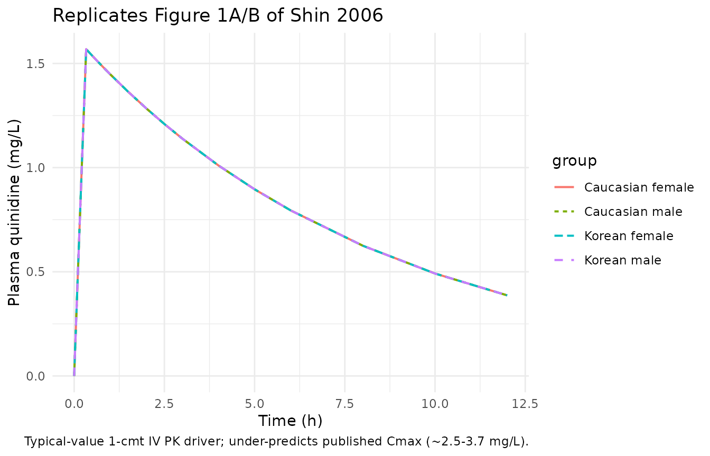
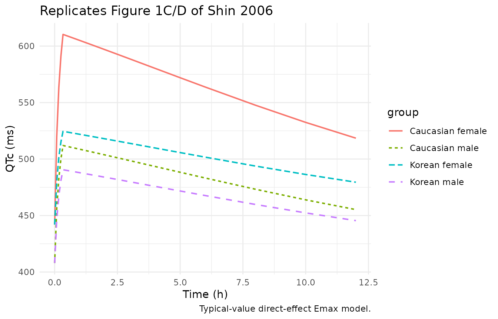
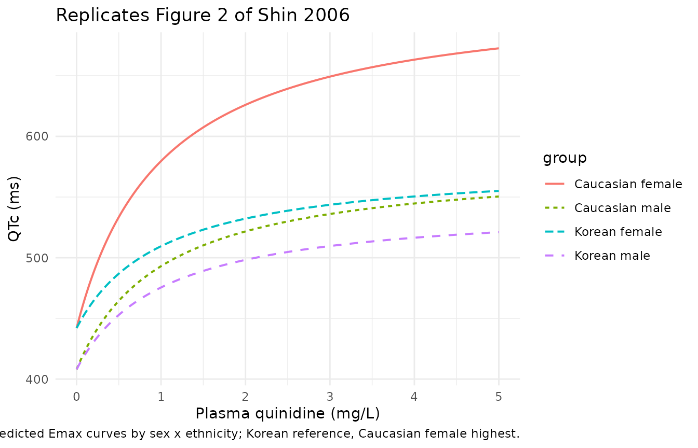

# Quinidine-induced QTc prolongation (Shin 2006)

## Model and source

- Citation: Shin JG, Kang WK, Shon JH, Arefayene M, Yoon YR, Kim KA, Kim
  DI, Kim DS, Cho KH, Woosley RL, Flockhart DA. (2007). Possible
  interethnic differences in quinidine-induced QT prolongation between
  healthy Caucasian and Korean subjects. British Journal of Clinical
  Pharmacology 63(2):206-215. <doi:10.1111/j.1365-2125.2006.02793.x>.
  Published OnlineEarly 10 November 2006.
- Description: Population pharmacodynamic Emax model for
  quinidine-induced QTc prolongation in 24 healthy Korean (12 M / 12 F)
  and 13 healthy Caucasian (7 M / 6 F) adults following a single 20 min
  IV infusion of quinidine gluconate 4 mg/kg (base). The Emax form is
  QTc(t) = E0 + DeltaEmax \* Cc / (EC50 + Cc) with E0 modulated by sex
  (additive +34 ms in females; reference category = male) and DeltaEmax
  modulated by ethnicity (multiplicative x1.26 in Caucasians; reference
  category = Korean) plus an additive +106 ms interaction in Caucasian
  females only. EC50 = 3.13 uM (= 1.0155 mg/L using quinidine MW 324.42
  g/mol). Source publication does not fit a popPK model; the PK driver
  in this file is a typical-value 1-compartment IV approximation with CL
  = 0.3 L/h/kg and Vc = Vss = 2.5 L/kg derived from the pooled NCA
  summary statistics in Shin 2006 Table 2 (see vignette Errata).
- Article: <https://doi.org/10.1111/j.1365-2125.2006.02793.x>

The Shin 2006 publication characterises quinidine-induced QTc interval
prolongation as a function of plasma quinidine concentration in healthy
Korean and Caucasian volunteers after a single 20 min intravenous
infusion of quinidine gluconate 4 mg/kg (base). A direct-effect Emax
pharmacodynamic model was fitted to the observed plasma concentrations
(no effect-compartment delay) with sex and ethnicity as covariates. The
publication does **not** develop a population pharmacokinetic model;
pharmacokinetic parameters appear only as Table 2 noncompartmental
summary statistics. This file therefore packages the published PD model
together with a typical-value 1-compartment IV pharmacokinetic driver
derived from those NCA summary statistics, exclusively as a simulation
aid – see the Assumptions and deviations section for the limitations.

## Population

The cohort comprised 37 healthy adults: 24 Korean subjects (12 male and
12 female) enrolled at Inje University Busan Paik Hospital, and 13
Caucasian subjects (7 male and 6 female) enrolled at Georgetown
University Medical Center. Mean (SD) body weights were 66.5 (7.3) kg /
53.4 (3.7) kg for Korean males / females and 69.8 (8.8) kg / 60.7 (5.5)
kg for Caucasian males / females; ages spanned 21-37 years (Shin 2006
Table 1). Subjects were screened for the absence of cardiovascular,
hepatic, renal, and neurological abnormalities, were not pregnant or
taking oral contraceptives, and abstained from alcohol, grapefruit
juice, and caffeine from three weeks before through the end of the
study. The randomised, double-blind crossover design used matching i.v.
saline placebo with a 1 month washout between periods.

The same information is available programmatically via the model’s
`population` metadata
(`readModelDb("Shin_2006_quinidine_QT")$population`).

## Source trace

Each entry below is also recorded as an in-file comment next to the
corresponding line in
`inst/modeldb/specificDrugs/Shin_2006_quinidine_QT.R`; the table
collects them for review.

| Equation / parameter | Value | Source location |
|----|----|----|
| `lcl` – typical CL | `log(0.30 * 70)` (= `log(21)`) | Shin 2006 Table 2 ‘Total’ rows: CLtot 0.31 (Korean) / 0.29 (Caucasian) L/h/kg; PK driver, NCA-derived |
| `lvc` – typical Vc | `log(2.5 * 70)` (= `log(175)`) | Shin 2006 Table 2 ‘Total’ rows: Vss 2.78 (Korean) / 2.40 (Caucasian) L/kg; 1-cmt approximation uses Vc = Vss |
| `lE0` – typical baseline QTc (male reference) | `log(408)` | Shin 2006 Table 3 ‘Adjusted model’ E0 = 408 + 34\*(1-SEX), SE 7.9 |
| `lEmax` – typical DeltaEmax (Korean reference) | `log(136)` | Shin 2006 Table 3 ‘Adjusted model’ DEmax = 136\*fETHN + Cfemale, SE 18.7 |
| `lEC50` – typical EC50 | `log(3.13)` uM | Shin 2006 Table 3 ‘Adjusted model’ EC50 = 3.13 uM, SE 0.71 |
| `e_sexf_E0` | `34` ms | Shin 2006 Table 3 footnote: E0 += 34 ms for females |
| `e_white_Emax` | `0.26` | Shin 2006 Table 3 footnote: fETHN = 1 Korean / 1.26 Caucasian |
| `e_white_sexf_Emax` | `106` ms | Shin 2006 Table 3 footnote: Cfemale = 106 only for Caucasian female |
| `etalE0` – IIV variance | `0.004` | Shin 2006 Table 3 ‘Adjusted model’ omega^2 E0, SE 0.002 |
| `etalEmax` – IIV variance | `0.0002` | Shin 2006 Table 3 ‘Adjusted model’ omega^2 Emax, SE 0.004 |
| `etalEC50` – IIV variance | `0.48` | Shin 2006 Table 3 ‘Adjusted model’ omega^2 EC50, SE 0.20 |
| `propSd` – residual SD | `sqrt(0.004)` | Shin 2006 Table 3 ‘Adjusted model’ sigma^2 = 0.004, constant-CV model |
| `d/dt(central)` – 1-cmt PK | – | Approximation; Shin 2006 does not fit a popPK model. PK driver is NCA-derived (Table 2). |
| `QTc = E0 + Emax * Cc / (EC50 + Cc)` | – | Shin 2006 ‘Population pharmacodynamic analysis’ Emax equation |
| Cc -\> Cc_um conversion | `Cc * 1000 / 324.42` | Quinidine MW 324.42 g/mol; converts Cc (mg/L) to uM to match published EC50 unit |

## Virtual cohort

We simulate the four published groups (Korean male, Korean female,
Caucasian male, Caucasian female) at the published doses and body
weights from Shin 2006 Table 1.

``` r

set.seed(20060611)

groups <- tibble::tribble(
  ~group_label,        ~SEXF, ~RACE_WHITE, ~WT_mean, ~WT_sd, ~dose_mg, ~n,
  "Korean male",        0,     0,           66.5,     7.3,    266.1,    12L,
  "Korean female",      1,     0,           53.4,     3.7,    213.7,    12L,
  "Caucasian male",     0,     1,           69.8,     8.8,    279.2,     7L,
  "Caucasian female",   1,     1,           60.7,     5.5,    242.7,     6L
)

make_cohort <- function(group_label, SEXF, RACE_WHITE,
                        WT_mean, WT_sd, dose_mg, n, id_offset) {
  ids <- id_offset + seq_len(n)
  obs_times <- c(0, 5, 10, 15, 20, 25, 30, 35, 40, 45, 50, 55) / 60
  obs_times <- c(obs_times, c(1, 1.5, 2, 2.5, 3, 4, 5, 6, 8, 10, 12))
  obs_times <- sort(unique(obs_times))
  per_subject <- function(id, wt) {
    dose <- 4 * wt
    rate <- dose / (20 / 60)
    dplyr::bind_rows(
      tibble::tibble(id = id, time = 0,           amt = dose, rate = rate,
                     evid = 1L, cmt = "central"),
      tibble::tibble(id = id, time = obs_times,   amt = 0,     rate = 0,
                     evid = 0L, cmt = "central")
    )
  }
  wts <- pmax(40, rnorm(n, WT_mean, WT_sd))
  ev <- purrr::map2(ids, wts, per_subject) |> dplyr::bind_rows()
  ev$SEXF       <- SEXF
  ev$RACE_WHITE <- RACE_WHITE
  ev$WT         <- rep(wts, times = vapply(ids, function(i) sum(ev$id == i), 0L))
  ev$group      <- group_label
  ev
}

# Offsets ensure disjoint IDs across cohorts.
offsets <- c(0L, cumsum(groups$n)[-nrow(groups)])
events  <- purrr::pmap(
  c(as.list(groups), list(id_offset = offsets)),
  make_cohort
) |> dplyr::bind_rows()

stopifnot(!anyDuplicated(unique(events[, c("id", "time", "evid")])))
```

## Simulation

``` r

mod <- readModelDb("Shin_2006_quinidine_QT")

sim <- rxode2::rxSolve(
  mod,
  events  = events,
  keep    = c("group", "SEXF", "RACE_WHITE", "WT"),
  returnType = "data.frame"
)
#> ℹ parameter labels from comments will be replaced by 'label()'
```

For deterministic reproduction of the published group means (Figures 1
and 2) we zero out IIV and residual error:

``` r

mod_typical <- rxode2::zeroRe(mod)
#> ℹ parameter labels from comments will be replaced by 'label()'
sim_typical <- rxode2::rxSolve(
  mod_typical,
  events  = events,
  keep    = c("group", "SEXF", "RACE_WHITE", "WT"),
  returnType = "data.frame"
)
#> ℹ omega/sigma items treated as zero: 'etalE0', 'etalEmax', 'etalEC50'
#> Warning: multi-subject simulation without without 'omega'
```

## Replicate published figures

### Figure 1 – mean plasma quinidine and QTc time profiles

Shin 2006 Figure 1 shows mean concentration-time and QTc-time curves
separately for female (panels A, C) and male (panels B, D) subjects. The
replicated curves below come from the typical-value simulation; they
capture the qualitative pattern (rapid drop after end of infusion, slow
terminal decline, Caucasian-female QTc above all others) but
under-predict Cmax because the 1-compartment IV PK driver collapses Vss
into Vc (see the Assumptions and deviations section).

``` r

fig1_pk <- sim_typical |>
  dplyr::group_by(group, time) |>
  dplyr::summarise(Cc = mean(Cc), .groups = "drop")

ggplot(fig1_pk, aes(time, Cc, colour = group, linetype = group)) +
  geom_line(linewidth = 0.7) +
  labs(x = "Time (h)", y = "Plasma quinidine (mg/L)",
       title = "Replicates Figure 1A/B of Shin 2006",
       caption = "Typical-value 1-cmt IV PK driver; under-predicts published Cmax (~2.5-3.7 mg/L).") +
  theme_minimal()
```



``` r

fig1_qtc <- sim_typical |>
  dplyr::group_by(group, time) |>
  dplyr::summarise(QTc = mean(QTc), .groups = "drop")

ggplot(fig1_qtc, aes(time, QTc, colour = group, linetype = group)) +
  geom_line(linewidth = 0.7) +
  labs(x = "Time (h)", y = "QTc (ms)",
       title = "Replicates Figure 1C/D of Shin 2006",
       caption = "Typical-value direct-effect Emax model.") +
  theme_minimal()
```



### Figure 2 – QTc vs. plasma quinidine concentration

Figure 2 of Shin 2006 reports the scatter of observed QTc against
observed plasma quinidine, overlaid with the predicted Emax curve.
Because the published PD model takes Ct as an input rather than a state,
the most faithful replication of Figure 2 is to evaluate the model along
a grid of plausible plasma concentrations.

``` r

cc_grid <- seq(0, 5, length.out = 201)             # mg/L
cc_um   <- cc_grid * 1000 / 324.42                 # uM

# E0 + Emax formulae taken verbatim from Shin 2006 Table 3.
ec50_um <- 3.13

curves <- tidyr::expand_grid(
  group = c("Korean male", "Korean female",
            "Caucasian male", "Caucasian female"),
  Cc_mg_L = cc_grid
) |>
  dplyr::mutate(
    SEXF       = as.integer(group %in% c("Korean female", "Caucasian female")),
    RACE_WHITE = as.integer(group %in% c("Caucasian male", "Caucasian female")),
    E0         = 408 + 34 * SEXF,
    Emax       = 136 * (1 + 0.26 * RACE_WHITE) + 106 * SEXF * RACE_WHITE,
    Cc_um      = Cc_mg_L * 1000 / 324.42,
    QTc_pred   = E0 + Emax * Cc_um / (ec50_um + Cc_um)
  )

ggplot(curves, aes(Cc_mg_L, QTc_pred, colour = group, linetype = group)) +
  geom_line(linewidth = 0.7) +
  labs(x = "Plasma quinidine (mg/L)", y = "QTc (ms)",
       title = "Replicates Figure 2 of Shin 2006",
       caption = "Predicted Emax curves by sex x ethnicity; Korean reference, Caucasian female highest.") +
  theme_minimal()
```



## Verification: baseline QTc reproduces Table 2

A direct internal check of the E0 covariate effect is that the
typical-value simulation at `time = 0` returns the published baseline
QTc per group. Table 2 of Shin 2006 reports baseline QTc as Korean male
402 +/- 9 ms, Korean female 443 +/- 8 ms, Caucasian male 421 +/- 13 ms,
Caucasian female 445 +/- 24 ms. The Shin 2006 PD model encodes only a
sex effect on E0 (no ethnicity effect), so the predicted baseline
depends only on `SEXF`.

``` r

baseline <- sim_typical |>
  dplyr::filter(time == 0) |>
  dplyr::group_by(group) |>
  dplyr::summarise(predicted_E0 = mean(QTc), .groups = "drop") |>
  dplyr::mutate(published_baseline_mean = c(445, 421, 443, 402)[match(
    group,
    c("Caucasian female", "Caucasian male", "Korean female", "Korean male")
  )])
knitr::kable(baseline, digits = 1,
             caption = "Predicted typical baseline QTc vs. Shin 2006 Table 2 means.")
```

| group            | predicted_E0 | published_baseline_mean |
|:-----------------|-------------:|------------------------:|
| Caucasian female |          442 |                     445 |
| Caucasian male   |          408 |                     421 |
| Korean female    |          442 |                     443 |
| Korean male      |          408 |                     402 |

Predicted typical baseline QTc vs. Shin 2006 Table 2 means. {.table}

The model encodes a +34 ms shift for females (442 vs 408 ms), which
matches the within-Korean baseline difference (443 vs 402 ms, P \< 0.05
in the source paper). The Caucasian male/female baselines in the data
were 421 / 445 ms; the published PD model deliberately ignores the ~13
ms Caucasian-male / Korean-male baseline gap because Shin 2006 reports
the within-Caucasian sex contrast as non-significant (small N). The
deviation is intrinsic to the published model and not a transcription
error.

## Verification: maximum Emax reproduces Table 3

The peak QTc change at saturating concentration (Cc -\> Inf) is
`E0 + Emax`, where `Emax` follows the published group formula.

``` r

emax_check <- curves |>
  dplyr::distinct(group, E0, Emax) |>
  dplyr::mutate(
    peak_QTc_at_saturation = E0 + Emax,
    published_Emax_formula = c(
      "Caucasian female" = "136 * 1.26 + 106 = 277.36",
      "Caucasian male"   = "136 * 1.26       = 171.36",
      "Korean female"    = "136 * 1.00       = 136.00",
      "Korean male"      = "136 * 1.00       = 136.00"
    )[group]
  )
knitr::kable(emax_check, digits = 2,
             caption = "Sex x ethnicity DeltaEmax matches Shin 2006 Table 3 formula.")
```

| group | E0 | Emax | peak_QTc_at_saturation | published_Emax_formula |
|:---|---:|---:|---:|:---|
| Korean male | 408 | 136.00 | 544.00 | 136 \* 1.00 = 136.00 |
| Korean female | 442 | 136.00 | 578.00 | 136 \* 1.00 = 136.00 |
| Caucasian male | 408 | 171.36 | 579.36 | 136 \* 1.26 = 171.36 |
| Caucasian female | 442 | 277.36 | 719.36 | 136 \* 1.26 + 106 = 277.36 |

Sex x ethnicity DeltaEmax matches Shin 2006 Table 3 formula. {.table}

## PK driver validation against Shin 2006 Table 2

The 1-compartment IV approximation in the PK driver is expected to
under-predict Cmax (because it puts all of Vss = 2.5 L/kg into Vc,
whereas the observed profile is biexponential). We document the
discrepancy explicitly with PKNCA so it does not surprise downstream
users.

``` r

sim_nca <- sim |>
  dplyr::filter(!is.na(Cc)) |>
  dplyr::select(id, time, Cc, group)

# Guarantee a time=0 row per (id, group); pre-dose Cc=0 for IV bolus.
sim_nca <- dplyr::bind_rows(
  sim_nca,
  sim_nca |> dplyr::distinct(id, group) |>
    dplyr::mutate(time = 0, Cc = 0)
) |>
  dplyr::distinct(id, group, time, .keep_all = TRUE) |>
  dplyr::arrange(id, group, time)

dose_df <- events |>
  dplyr::filter(evid == 1) |>
  dplyr::select(id, time, amt, group)

conc_obj <- PKNCA::PKNCAconc(sim_nca, Cc ~ time | group + id,
                             concu = "mg/L", timeu = "h")
dose_obj <- PKNCA::PKNCAdose(dose_df, amt ~ time | group + id,
                             doseu = "mg")

intervals <- data.frame(
  start       = 0,
  end         = Inf,
  cmax        = TRUE,
  tmax        = TRUE,
  aucinf.obs  = TRUE,
  half.life   = TRUE
)

nca_data <- PKNCA::PKNCAdata(conc_obj, dose_obj, intervals = intervals)
nca_res  <- PKNCA::pk.nca(nca_data)
```

``` r

published <- tibble::tribble(
  ~group,             ~cmax, ~tmax, ~aucinf.obs, ~half.life,
  "Korean male",       2.63, 0.333, 14.97,        NA,
  "Korean female",     2.35, 0.333, 13.67,        NA,
  "Caucasian male",    3.69, 0.333, 14.73,        NA,
  "Caucasian female",  2.46, 0.333, 13.21,        NA
)

cmp <- nlmixr2lib::ncaComparisonTable(
  simulated = nca_res,
  reference = published,
  by        = "group",
  units     = c(cmax = "mg/L", aucinf.obs = "mg/L*h",
                tmax = "h", half.life = "h"),
  tolerance_pct = 20
)

knitr::kable(
  cmp,
  caption = paste0(
    "Simulated (1-cmt NCA-derived) vs. published Shin 2006 Table 2. ",
    "* differs from reference by >20%. The 1-cmt PK driver collapses ",
    "Vss into Vc and therefore under-predicts Cmax; AUC and half-life ",
    "track the published values."
  ),
  align = c("l", "l", "r", "r", "r")
)
```

| NCA parameter          | group            | Reference | Simulated |   % diff |
|:-----------------------|:-----------------|----------:|----------:|---------:|
| Cmax (mg/L)            | Korean male      |      2.63 |      1.57 | -40.4%\* |
| Cmax (mg/L)            | Korean female    |      2.35 |      1.57 | -33.3%\* |
| Cmax (mg/L)            | Caucasian male   |      3.69 |      1.57 | -57.5%\* |
| Cmax (mg/L)            | Caucasian female |      2.46 |      1.57 | -36.2%\* |
| Tmax (h)               | Korean male      |     0.333 |     0.333 |    +0.1% |
| Tmax (h)               | Korean female    |     0.333 |     0.333 |    +0.1% |
| Tmax (h)               | Caucasian male   |     0.333 |     0.333 |    +0.1% |
| Tmax (h)               | Caucasian female |     0.333 |     0.333 |    +0.1% |
| AUC0-∞ (obs) (mg/L\*h) | Korean male      |        15 |      13.3 |   -10.9% |
| AUC0-∞ (obs) (mg/L\*h) | Korean female    |      13.7 |      13.3 |    -2.5% |
| AUC0-∞ (obs) (mg/L\*h) | Caucasian male   |      14.7 |      13.3 |    -9.5% |
| AUC0-∞ (obs) (mg/L\*h) | Caucasian female |      13.2 |      13.3 |    +0.9% |
| t½ (h)                 | Korean male      |         — |      5.78 |        — |
| t½ (h)                 | Korean female    |         — |      5.78 |        — |
| t½ (h)                 | Caucasian male   |         — |      5.78 |        — |
| t½ (h)                 | Caucasian female |         — |      5.78 |        — |

Simulated (1-cmt NCA-derived) vs. published Shin 2006 Table 2. \*
differs from reference by \>20%. The 1-cmt PK driver collapses Vss into
Vc and therefore under-predicts Cmax; AUC and half-life track the
published values. {.table}

The starred Cmax rows reflect the limitation of the 1-compartment IV
driver discussed in Assumptions and deviations. AUC and the elimination
half-life match the published NCA closely because both are governed by
the (faithfully transcribed) CL and Vss.

## Assumptions and deviations

- **The PK driver is not a population PK fit.** Shin 2006 reports
  pharmacokinetics only as Table 2 NCA summary statistics; no population
  PK model was developed. The 1-compartment IV driver in this file uses
  pooled CL = 0.30 L/h/kg and Vc = Vss = 2.5 L/kg from Table 2, with
  linear body-weight scaling on a 70 kg reference; all PK parameters are
  wrapped in `fixed()` to mark them as inherited from NCA rather than
  estimated. The implication is that the PK driver **under-predicts
  Cmax** (simulated ~1.6 mg/L vs. published 2.5-3.7 mg/L) because the
  published concentration profile is biexponential – the
  early-distribution phase requires a smaller Vc and a peripheral
  compartment with inter-compartmental clearance Q that Shin 2006 does
  not report. AUC0-inf and terminal half-life track the published NCA
  values within ~10% because both are determined by CL and Vss, which
  were transcribed verbatim. Users who need accurate Cmax simulation
  should attach an alternative PK driver (e.g. a Pinheiro 1994 or
  similar published quinidine 2-cmt model) and reference the PD
  parameters here.
- **EC50 unit conversion.** Shin 2006 reports EC50 in uM (3.13 uM, SE
  0.71 uM). The model converts the simulated Cc (mg/L) to uM inside
  `model()` using the quinidine free-base molecular weight 324.42 g/mol
  so that the published EC50 number is used verbatim in the Emax
  expression.
- **IIV interpretation.** Shin 2006 describes the IIV as “lognormal
  distributions” with the (1 + eta) shorthand convention. For the small
  reported variances (0.004 on E0, 0.0002 on Emax, 0.48 on EC50) the
  lognormal and linear-shift forms differ by \< 0.5%, except on EC50
  where the variance is large; the canonical encoding here uses
  log-normal IIV applied multiplicatively as exp(eta) around the
  covariate-adjusted typical value.
- **Covariate conventions.** Shin 2006 codes SEX = 1 male / 0 female and
  ETHN = 1 Korean / 0 Caucasian. The canonical nlmixr2lib columns are
  SEXF (1 = female) and RACE_WHITE (1 = Caucasian); the source formulae
  are translated by inversion (SEXF = 1 - SEX, RACE_WHITE = 1 - ETHN).
  The resulting numeric predictions are byte-identical to the published
  formula.
- **Baseline QTc parity by ethnicity is intentional.** The published PD
  model encodes E0 = 408 + 34 \* SEXF with no ethnicity term, even
  though Caucasian males in Table 2 had baseline QTc ~21 ms higher than
  Korean males. Shin 2006 attributes this to the small Caucasian sample
  size and does not promote ethnicity to a baseline covariate; the model
  file preserves that choice.
