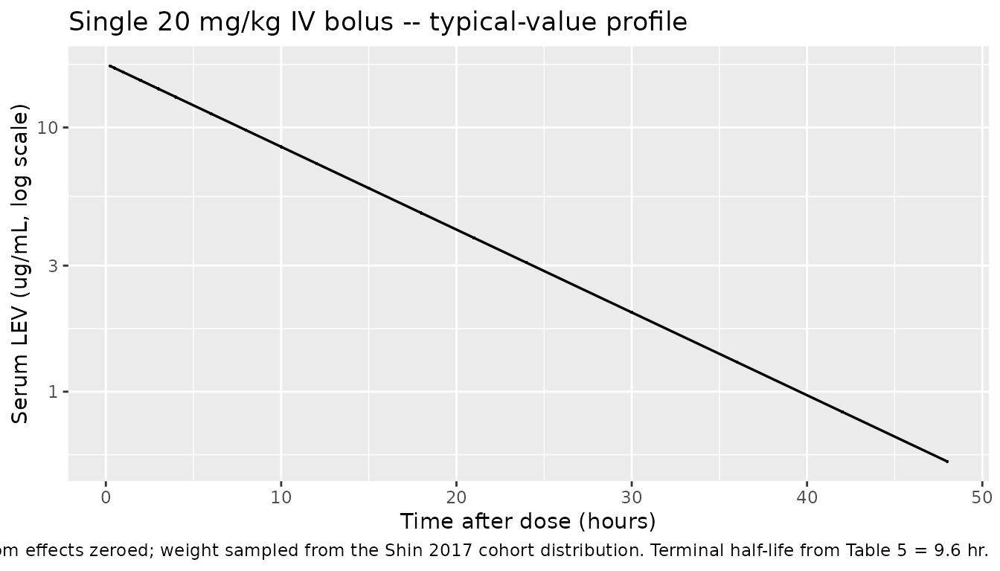
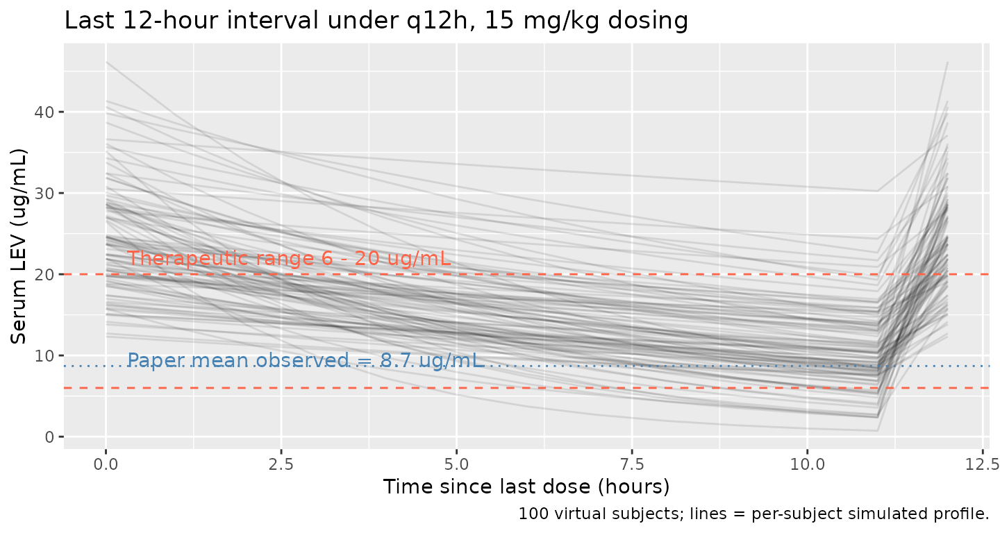

# Levetiracetam (Shin 2017)

## Model and source

    #> ℹ parameter labels from comments will be replaced by 'label()'

- Citation: Shin JW, Jung YS, Park K, Lee SM, Eun HS, Park MS, Park KI,
  Namgung R. Experience and pharmacokinetics of Levetiracetam in Korean
  neonates with neonatal seizures. Korean J Pediatr. 2017
  Feb;60(2):50-54. <doi:10.3345/kjp.2017.60.2.50>
- Description: One-compartment population PK model for levetiracetam in
  Korean neonates with seizures (Shin 2017). Structural parameters
  (V, CL) reported on a per-kg-body-weight basis (linear scaling by body
  weight). Drug absorption was not modelled because trough-style
  sampling between 6 and 23 hours after dose did not capture the
  absorption phase; intravenous and oral doses are therefore modelled as
  bolus inputs directly into the central compartment with
  bioavailability fixed at 1.
- Article: <https://doi.org/10.3345/kjp.2017.60.2.50>

The packaged model implements the Shin 2017 final neonatal levetiracetam
(LEV) popPK model: a one-compartment structure parameterised on a per-kg
body weight basis (V = 1.15 L/kg, CL = 0.083 L/hr/kg) with
linear-by-weight scaling and log-normal inter-individual variability on
both V and CL. The model was developed in NONMEM 7.3 using FOCE-I;
covariate selection followed PsN’s stepwise covariate modelling. Drug
absorption was not modelled in the source paper because the sparse
sampling window (6 - 23 hours after dose, one post-dose sample per
occasion) did not capture the absorption phase, so the packaged model
treats both intravenous and oral doses as bolus inputs directly into the
central compartment with bioavailability fixed at 1.

## Population

Shin 2017 fit the model retrospectively to 151 serum LEV concentrations
from 18 Korean neonates with electro-clinical or electrographic-only
confirmed seizures, treated at two neonatal intensive care units of
Yonsei University College of Medicine in Seoul between June 2013 and
June 2015. The cohort spanned postmenstrual age 22.3 - 66.0 weeks (mean
47.6, median 48.7), postnatal age 3.4 - 35.1 weeks (mean 12.6),
gestational age at birth 24.3 - 39.9 weeks (mean 35.0), and body weight
at medication 0.535 - 10.45 kg (mean 4.27, median 4.3). Eleven of 18
(61%) were male. The major etiologies were hypoxic-ischemic
encephalopathy (12/18 = 67%), brain malformation (4/18 = 22%),
meningoencephalitis (1/18 = 6%), and intracerebral hemorrhage (1/18 =
6%). Loading doses ranged 4.9 - 59.5 mg/kg (mean 20.0 +/- 16.1) and
maintenance doses ranged 4.5 - 99.5 mg/kg/day (mean 29.0 +/- 20.1). All
but one neonate received at least one concomitant antiepileptic drug;
the dominant comedication patterns were phenobarbital + LEV (61.1%) and
phenobarbital + phenytoin + LEV (33.3%). Shin 2017 reports no
statistically significant association between CL or V and concomitant
AED use. Full population characteristics are in Shin 2017 Tables 1 and
2.

The same metadata is available programmatically via
`readModelDb("Shin_2017_levetiracetam")$meta$population`.

## Source trace

The per-parameter origin is recorded as an in-file comment next to each
`ini()` entry in `inst/modeldb/specificDrugs/Shin_2017_levetiracetam.R`.
The table below collects them in one place for review. All point
estimates are from Shin 2017 Table 5 (“Population mean parameter values
for the final model”); structural-model layout and the per-kg
parameterisation are taken from Shin 2017 Methods section 4 and Results
paragraph 2.

| Equation / parameter | Value | Source location |
|----|----|----|
| `lvc` (V per kg) | log(1.15) -\> 1.15 L/kg | Table 5; V = 1.15 L/kg (RSE 29.7%) |
| `lcl` (CL per kg) | log(0.083) -\> 0.083 L/hr/kg | Table 5; CL = 0.083 L/hr/kg (RSE 12.7%) |
| `etalvc` variance | log(0.718^2 + 1) = 0.4158 | Table 5; omega_V CV = 71.8% (RSE 29.5%) |
| `etalcl` variance | log(0.304^2 + 1) = 0.0884 | Table 5; omega_CL CV = 30.4% (RSE 29.1%) |
| `propSd` | 0.20 (extraction-time assumption) | Not reported in Shin 2017; see Assumptions and deviations |
| Weight scaling on V | `vc = exp(lvc + etalvc) * WT` | Methods section 4 and Results paragraph 2 (V reported on per-kg basis; typical V at median WT 4.3 kg recovers 4.945 L) |
| Weight scaling on CL | `cl = exp(lcl + etalcl) * WT` | Methods section 4 and Results paragraph 2 (CL on per-kg basis; typical CL at median WT 4.3 kg recovers 0.357 L/hr) |
| ODE `d/dt(central)` | `-kel * central` (bolus input) | Methods section 4 (1-cmt) and Results paragraph 2 (absorption phase explicitly not modelled because sampling was 6 - 23 hours post-dose) |
| Derived `kel` | `cl / vc` | Standard 1-cmt linear-elimination relation; half-life 9.6 hr in Table 5 follows from ln(2) \* V / CL |

## Virtual cohort

Original observed data are not publicly available. The figures below use
virtual neonatal cohorts whose body weight distribution approximates the
published cohort (mean 4.27 kg, median 4.3 kg, SD 1.76 kg, range 0.535 -
10.45 kg per Shin 2017 Table 2). Weight is sampled from a log-normal
distribution clipped to the paper’s reported range so the typical
individual matches the paper’s median weight, then bolus loading and
maintenance doses are scheduled at the paper’s mean per-kg amounts.

``` r

set.seed(20170210)

mod <- rxode2::rxode(readModelDb("Shin_2017_levetiracetam"))
#> ℹ parameter labels from comments will be replaced by 'label()'

sample_wt <- function(n, wt_min = 0.535, wt_max = 10.45,
                      wt_mean_target = 4.27, wt_sd_target = 1.76) {
  # Lognormal parameters chosen so that the on-scale mean and SD match
  # the Shin 2017 Table 2 values (mean 4.27 kg, SD 1.76 kg). The clip to
  # the published range removes the long tail.
  cv2     <- (wt_sd_target / wt_mean_target)^2
  log_mu  <- log(wt_mean_target) - 0.5 * log(1 + cv2)
  log_sd  <- sqrt(log(1 + cv2))
  pmin(pmax(exp(rnorm(n, mean = log_mu, sd = log_sd)), wt_min), wt_max)
}

make_cohort <- function(n, regimen, dose_mg_per_kg, route_cmt,
                        last_dose_time, obs_grid, id_offset = 0L) {
  wt <- sample_wt(n)
  base <- tibble(
    id      = id_offset + seq_len(n),
    WT      = wt,
    regimen = regimen
  )
  doses <- tibble(
    id      = base$id,
    WT      = base$WT,
    regimen = base$regimen,
    time    = 0,
    evid    = 1L,
    cmt     = route_cmt,
    amt     = base$WT * dose_mg_per_kg
  )
  # If multi-dose, expand with q12h schedule up to last_dose_time.
  if (last_dose_time > 0) {
    later_times <- seq(12, last_dose_time, by = 12)
    extra_doses <- tidyr::crossing(id = base$id, time = later_times) |>
      dplyr::left_join(base, by = "id") |>
      dplyr::mutate(evid = 1L, cmt = route_cmt, amt = WT * dose_mg_per_kg)
    doses <- dplyr::bind_rows(doses, extra_doses)
  }
  obs <- tidyr::crossing(id = base$id, time = obs_grid) |>
    dplyr::left_join(base, by = "id") |>
    dplyr::mutate(evid = 0L, cmt = "Cc", amt = NA_real_)
  dplyr::bind_rows(doses, obs) |>
    dplyr::arrange(id, time, dplyr::desc(evid))
}

# Single 20 mg/kg IV bolus for half-life / Cmax / AUCinf NCA.
sd_obs_grid <- c(0, 0.25, 0.5, 1, 2, 3, 4, 6, 8, 10, 12, 15, 18, 21, 24,
                 30, 36, 42, 48)
events_sd <- make_cohort(
  n               = 100,
  regimen         = "20 mg/kg IV single",
  dose_mg_per_kg  = 20,
  route_cmt       = "central",
  last_dose_time  = 0,
  obs_grid        = sd_obs_grid,
  id_offset       = 0L
)

# Multiple-dose q12h x 7 days = 14 doses of 15 mg/kg, ~ 30 mg/kg/day (close
# to the paper's mean maintenance dose of 29 mg/kg/day). Sample the last
# dosing interval densely for Css NCA.
md_obs_grid <- c(seq(0,  12, by = 1),       # first interval
                 seq(72, 84, by = 1),       # mid (just-reached steady state)
                 seq(144, 156, by = 1))     # last interval
events_md <- make_cohort(
  n               = 100,
  regimen         = "15 mg/kg q12h x 14",
  dose_mg_per_kg  = 15,
  route_cmt       = "central",
  last_dose_time  = 156,
  obs_grid        = md_obs_grid,
  id_offset       = 100L
)

events <- dplyr::bind_rows(events_sd, events_md)
stopifnot(!anyDuplicated(unique(events[, c("id", "time", "evid")])))
```

## Simulation

``` r

sim <- rxode2::rxSolve(
  object     = mod,
  events     = events,
  keep       = c("WT", "regimen"),
  returnType = "data.frame"
) |>
  dplyr::filter(time > 0)
```

For deterministic typical-value replication (random effects zeroed), use
[`rxode2::zeroRe()`](https://nlmixr2.github.io/rxode2/reference/zeroRe.html):

``` r

sim_typical <- rxode2::rxSolve(
  object     = rxode2::zeroRe(mod),
  events     = events,
  keep       = c("WT", "regimen"),
  returnType = "data.frame"
) |>
  dplyr::filter(time > 0)
#> ℹ omega/sigma items treated as zero: 'etalvc', 'etalcl'
#> Warning: multi-subject simulation without without 'omega'
```

## Replicate published profiles

### Single-dose concentration vs time (typical value at median weight 4.3 kg)

Shin 2017 does not publish a concentration-vs-time plot for an isolated
single dose, but Table 5’s typical CL and V predict a terminal half-life
of 9.6 hours from a single 20 mg/kg IV bolus at the cohort median
weight. The chunk below traces the typical-value concentration over 48
hours post-dose and overlays the half-life prediction.

``` r

sd_typical <- sim_typical |> dplyr::filter(regimen == "20 mg/kg IV single")

ggplot(sd_typical, aes(time, Cc)) +
  geom_line(linewidth = 0.6) +
  scale_y_log10() +
  labs(x = "Time after dose (hours)",
       y = "Serum LEV (ug/mL, log scale)",
       title = "Single 20 mg/kg IV bolus -- typical-value profile",
       caption = "Random effects zeroed; weight sampled from the Shin 2017 cohort distribution. Terminal half-life from Table 5 = 9.6 hr.")
```



### Steady-state concentration distribution under q12h dosing

Shin 2017 Table 4 reports a mean observed serum LEV of 8.7 +/- 6.3 ug/mL
across the trial (range 1.0 - 41.4 ug/mL), with 55% of samples in the
6 - 20 ug/mL therapeutic range and 5% above it. The chunk below renders
the simulated last-interval concentration distribution under q12h dosing
of 15 mg/kg (approximately the paper’s 29 mg/kg/day mean maintenance
dose) and overlays the paper’s mean and therapeutic range.

``` r

ss_last_interval <- sim |>
  dplyr::filter(regimen == "15 mg/kg q12h x 14",
                time >= 144, time <= 156)

ggplot(ss_last_interval, aes(time - 144, Cc, group = id)) +
  geom_line(alpha = 0.10) +
  geom_hline(yintercept = c(6, 20), linetype = "dashed", colour = "tomato") +
  geom_hline(yintercept = 8.7, linetype = "dotted", colour = "steelblue") +
  annotate("text", x = 0.3, y = 22, hjust = 0, colour = "tomato",
           label = "Therapeutic range 6 - 20 ug/mL") +
  annotate("text", x = 0.3, y = 9.5, hjust = 0, colour = "steelblue",
           label = "Paper mean observed = 8.7 ug/mL") +
  labs(x = "Time since last dose (hours)",
       y = "Serum LEV (ug/mL)",
       title = "Last 12-hour interval under q12h, 15 mg/kg dosing",
       caption = "100 virtual subjects; lines = per-subject simulated profile.")
```



## PKNCA validation

PKNCA is run on the typical-value single-dose simulation, with the
regimen label as the treatment grouping variable. Cmax, AUCinf, and
half-life are computed.

``` r

sd_nca_conc <- sim_typical |>
  dplyr::filter(regimen == "20 mg/kg IV single", !is.na(Cc)) |>
  dplyr::select(id, time, Cc, regimen, WT)

sd_nca_dose <- events_sd |>
  dplyr::filter(evid == 1) |>
  dplyr::select(id, time, amt, regimen)

conc_obj <- PKNCA::PKNCAconc(
  sd_nca_conc, Cc ~ time | regimen + id,
  concu = "ug/mL", timeu = "hr"
)
dose_obj <- PKNCA::PKNCAdose(
  sd_nca_dose, amt ~ time | regimen + id,
  doseu = "mg"
)

intervals <- data.frame(
  start       = 0,
  end         = Inf,
  cmax        = TRUE,
  tmax        = TRUE,
  aucinf.obs  = TRUE,
  aucinf.pred = TRUE,
  half.life   = TRUE,
  clast.obs   = TRUE,
  lambda.z    = TRUE
)

nca <- PKNCA::pk.nca(
  PKNCA::PKNCAdata(conc_obj, dose_obj, intervals = intervals)
)
#> Warning: Requesting an AUC range starting (0) before the first measurement (0.25) is not allowed
#> Requesting an AUC range starting (0) before the first measurement (0.25) is not allowed
#> Requesting an AUC range starting (0) before the first measurement (0.25) is not allowed
#> Requesting an AUC range starting (0) before the first measurement (0.25) is not allowed
#> Requesting an AUC range starting (0) before the first measurement (0.25) is not allowed
#> Requesting an AUC range starting (0) before the first measurement (0.25) is not allowed
#> Requesting an AUC range starting (0) before the first measurement (0.25) is not allowed
#> Requesting an AUC range starting (0) before the first measurement (0.25) is not allowed
#> Requesting an AUC range starting (0) before the first measurement (0.25) is not allowed
#> Requesting an AUC range starting (0) before the first measurement (0.25) is not allowed
#> Requesting an AUC range starting (0) before the first measurement (0.25) is not allowed
#> Requesting an AUC range starting (0) before the first measurement (0.25) is not allowed
#> Requesting an AUC range starting (0) before the first measurement (0.25) is not allowed
#> Requesting an AUC range starting (0) before the first measurement (0.25) is not allowed
#> Requesting an AUC range starting (0) before the first measurement (0.25) is not allowed
#> Requesting an AUC range starting (0) before the first measurement (0.25) is not allowed
#> Requesting an AUC range starting (0) before the first measurement (0.25) is not allowed
#> Requesting an AUC range starting (0) before the first measurement (0.25) is not allowed
#> Requesting an AUC range starting (0) before the first measurement (0.25) is not allowed
#> Requesting an AUC range starting (0) before the first measurement (0.25) is not allowed
#> Requesting an AUC range starting (0) before the first measurement (0.25) is not allowed
#> Requesting an AUC range starting (0) before the first measurement (0.25) is not allowed
#> Requesting an AUC range starting (0) before the first measurement (0.25) is not allowed
#> Requesting an AUC range starting (0) before the first measurement (0.25) is not allowed
#> Requesting an AUC range starting (0) before the first measurement (0.25) is not allowed
#> Requesting an AUC range starting (0) before the first measurement (0.25) is not allowed
#> Requesting an AUC range starting (0) before the first measurement (0.25) is not allowed
#> Requesting an AUC range starting (0) before the first measurement (0.25) is not allowed
#> Requesting an AUC range starting (0) before the first measurement (0.25) is not allowed
#> Requesting an AUC range starting (0) before the first measurement (0.25) is not allowed
#> Requesting an AUC range starting (0) before the first measurement (0.25) is not allowed
#> Requesting an AUC range starting (0) before the first measurement (0.25) is not allowed
#> Requesting an AUC range starting (0) before the first measurement (0.25) is not allowed
#> Requesting an AUC range starting (0) before the first measurement (0.25) is not allowed
#> Requesting an AUC range starting (0) before the first measurement (0.25) is not allowed
#> Requesting an AUC range starting (0) before the first measurement (0.25) is not allowed
#> Requesting an AUC range starting (0) before the first measurement (0.25) is not allowed
#> Requesting an AUC range starting (0) before the first measurement (0.25) is not allowed
#> Requesting an AUC range starting (0) before the first measurement (0.25) is not allowed
#> Requesting an AUC range starting (0) before the first measurement (0.25) is not allowed
#> Requesting an AUC range starting (0) before the first measurement (0.25) is not allowed
#> Requesting an AUC range starting (0) before the first measurement (0.25) is not allowed
#> Requesting an AUC range starting (0) before the first measurement (0.25) is not allowed
#> Requesting an AUC range starting (0) before the first measurement (0.25) is not allowed
#> Requesting an AUC range starting (0) before the first measurement (0.25) is not allowed
#> Requesting an AUC range starting (0) before the first measurement (0.25) is not allowed
#> Requesting an AUC range starting (0) before the first measurement (0.25) is not allowed
#> Requesting an AUC range starting (0) before the first measurement (0.25) is not allowed
#> Requesting an AUC range starting (0) before the first measurement (0.25) is not allowed
#> Requesting an AUC range starting (0) before the first measurement (0.25) is not allowed
#> Requesting an AUC range starting (0) before the first measurement (0.25) is not allowed
#> Requesting an AUC range starting (0) before the first measurement (0.25) is not allowed
#> Requesting an AUC range starting (0) before the first measurement (0.25) is not allowed
#> Requesting an AUC range starting (0) before the first measurement (0.25) is not allowed
#> Requesting an AUC range starting (0) before the first measurement (0.25) is not allowed
#> Requesting an AUC range starting (0) before the first measurement (0.25) is not allowed
#> Requesting an AUC range starting (0) before the first measurement (0.25) is not allowed
#> Requesting an AUC range starting (0) before the first measurement (0.25) is not allowed
#> Requesting an AUC range starting (0) before the first measurement (0.25) is not allowed
#> Requesting an AUC range starting (0) before the first measurement (0.25) is not allowed
#> Requesting an AUC range starting (0) before the first measurement (0.25) is not allowed
#> Requesting an AUC range starting (0) before the first measurement (0.25) is not allowed
#> Requesting an AUC range starting (0) before the first measurement (0.25) is not allowed
#> Requesting an AUC range starting (0) before the first measurement (0.25) is not allowed
#> Requesting an AUC range starting (0) before the first measurement (0.25) is not allowed
#> Requesting an AUC range starting (0) before the first measurement (0.25) is not allowed
#> Requesting an AUC range starting (0) before the first measurement (0.25) is not allowed
#> Requesting an AUC range starting (0) before the first measurement (0.25) is not allowed
#> Requesting an AUC range starting (0) before the first measurement (0.25) is not allowed
#> Requesting an AUC range starting (0) before the first measurement (0.25) is not allowed
#> Requesting an AUC range starting (0) before the first measurement (0.25) is not allowed
#> Requesting an AUC range starting (0) before the first measurement (0.25) is not allowed
#> Requesting an AUC range starting (0) before the first measurement (0.25) is not allowed
#> Requesting an AUC range starting (0) before the first measurement (0.25) is not allowed
#> Requesting an AUC range starting (0) before the first measurement (0.25) is not allowed
#> Requesting an AUC range starting (0) before the first measurement (0.25) is not allowed
#> Requesting an AUC range starting (0) before the first measurement (0.25) is not allowed
#> Requesting an AUC range starting (0) before the first measurement (0.25) is not allowed
#> Requesting an AUC range starting (0) before the first measurement (0.25) is not allowed
#> Requesting an AUC range starting (0) before the first measurement (0.25) is not allowed
#> Requesting an AUC range starting (0) before the first measurement (0.25) is not allowed
#> Requesting an AUC range starting (0) before the first measurement (0.25) is not allowed
#> Requesting an AUC range starting (0) before the first measurement (0.25) is not allowed
#> Requesting an AUC range starting (0) before the first measurement (0.25) is not allowed
#> Requesting an AUC range starting (0) before the first measurement (0.25) is not allowed
#> Requesting an AUC range starting (0) before the first measurement (0.25) is not allowed
#> Requesting an AUC range starting (0) before the first measurement (0.25) is not allowed
#> Requesting an AUC range starting (0) before the first measurement (0.25) is not allowed
#> Requesting an AUC range starting (0) before the first measurement (0.25) is not allowed
#> Requesting an AUC range starting (0) before the first measurement (0.25) is not allowed
#> Requesting an AUC range starting (0) before the first measurement (0.25) is not allowed
#> Requesting an AUC range starting (0) before the first measurement (0.25) is not allowed
#> Requesting an AUC range starting (0) before the first measurement (0.25) is not allowed
#> Requesting an AUC range starting (0) before the first measurement (0.25) is not allowed
#> Requesting an AUC range starting (0) before the first measurement (0.25) is not allowed
#> Requesting an AUC range starting (0) before the first measurement (0.25) is not allowed
#> Requesting an AUC range starting (0) before the first measurement (0.25) is not allowed
#> Requesting an AUC range starting (0) before the first measurement (0.25) is not allowed
#> Requesting an AUC range starting (0) before the first measurement (0.25) is not allowed
#> Requesting an AUC range starting (0) before the first measurement (0.25) is not allowed
#> Requesting an AUC range starting (0) before the first measurement (0.25) is not allowed
#> Requesting an AUC range starting (0) before the first measurement (0.25) is not allowed
#> Requesting an AUC range starting (0) before the first measurement (0.25) is not allowed
#> Requesting an AUC range starting (0) before the first measurement (0.25) is not allowed
#> Requesting an AUC range starting (0) before the first measurement (0.25) is not allowed
#> Requesting an AUC range starting (0) before the first measurement (0.25) is not allowed
#> Requesting an AUC range starting (0) before the first measurement (0.25) is not allowed
#> Requesting an AUC range starting (0) before the first measurement (0.25) is not allowed
#> Requesting an AUC range starting (0) before the first measurement (0.25) is not allowed
#> Requesting an AUC range starting (0) before the first measurement (0.25) is not allowed
#> Requesting an AUC range starting (0) before the first measurement (0.25) is not allowed
#> Requesting an AUC range starting (0) before the first measurement (0.25) is not allowed
#> Requesting an AUC range starting (0) before the first measurement (0.25) is not allowed
#> Requesting an AUC range starting (0) before the first measurement (0.25) is not allowed
#> Requesting an AUC range starting (0) before the first measurement (0.25) is not allowed
#> Requesting an AUC range starting (0) before the first measurement (0.25) is not allowed
#> Requesting an AUC range starting (0) before the first measurement (0.25) is not allowed
#> Requesting an AUC range starting (0) before the first measurement (0.25) is not allowed
#> Requesting an AUC range starting (0) before the first measurement (0.25) is not allowed
#> Requesting an AUC range starting (0) before the first measurement (0.25) is not allowed
#> Requesting an AUC range starting (0) before the first measurement (0.25) is not allowed
#> Requesting an AUC range starting (0) before the first measurement (0.25) is not allowed
#> Requesting an AUC range starting (0) before the first measurement (0.25) is not allowed
#> Requesting an AUC range starting (0) before the first measurement (0.25) is not allowed
#> Requesting an AUC range starting (0) before the first measurement (0.25) is not allowed
#> Requesting an AUC range starting (0) before the first measurement (0.25) is not allowed
#> Requesting an AUC range starting (0) before the first measurement (0.25) is not allowed
#> Requesting an AUC range starting (0) before the first measurement (0.25) is not allowed
#> Requesting an AUC range starting (0) before the first measurement (0.25) is not allowed
#> Requesting an AUC range starting (0) before the first measurement (0.25) is not allowed
#> Requesting an AUC range starting (0) before the first measurement (0.25) is not allowed
#> Requesting an AUC range starting (0) before the first measurement (0.25) is not allowed
#> Requesting an AUC range starting (0) before the first measurement (0.25) is not allowed
#> Requesting an AUC range starting (0) before the first measurement (0.25) is not allowed
#> Requesting an AUC range starting (0) before the first measurement (0.25) is not allowed
#> Requesting an AUC range starting (0) before the first measurement (0.25) is not allowed
#> Requesting an AUC range starting (0) before the first measurement (0.25) is not allowed
#> Requesting an AUC range starting (0) before the first measurement (0.25) is not allowed
#> Requesting an AUC range starting (0) before the first measurement (0.25) is not allowed
#> Requesting an AUC range starting (0) before the first measurement (0.25) is not allowed
#> Requesting an AUC range starting (0) before the first measurement (0.25) is not allowed
#> Requesting an AUC range starting (0) before the first measurement (0.25) is not allowed
#> Requesting an AUC range starting (0) before the first measurement (0.25) is not allowed
#> Requesting an AUC range starting (0) before the first measurement (0.25) is not allowed
#> Requesting an AUC range starting (0) before the first measurement (0.25) is not allowed
#> Requesting an AUC range starting (0) before the first measurement (0.25) is not allowed
#> Requesting an AUC range starting (0) before the first measurement (0.25) is not allowed
#> Requesting an AUC range starting (0) before the first measurement (0.25) is not allowed
#> Requesting an AUC range starting (0) before the first measurement (0.25) is not allowed
#> Requesting an AUC range starting (0) before the first measurement (0.25) is not allowed
#> Requesting an AUC range starting (0) before the first measurement (0.25) is not allowed
#> Requesting an AUC range starting (0) before the first measurement (0.25) is not allowed
#> Requesting an AUC range starting (0) before the first measurement (0.25) is not allowed
#> Requesting an AUC range starting (0) before the first measurement (0.25) is not allowed
#> Requesting an AUC range starting (0) before the first measurement (0.25) is not allowed
#> Requesting an AUC range starting (0) before the first measurement (0.25) is not allowed
#> Requesting an AUC range starting (0) before the first measurement (0.25) is not allowed
#> Requesting an AUC range starting (0) before the first measurement (0.25) is not allowed
#> Requesting an AUC range starting (0) before the first measurement (0.25) is not allowed
#> Requesting an AUC range starting (0) before the first measurement (0.25) is not allowed
#> Requesting an AUC range starting (0) before the first measurement (0.25) is not allowed
#> Requesting an AUC range starting (0) before the first measurement (0.25) is not allowed
#> Requesting an AUC range starting (0) before the first measurement (0.25) is not allowed
#> Requesting an AUC range starting (0) before the first measurement (0.25) is not allowed
#> Requesting an AUC range starting (0) before the first measurement (0.25) is not allowed
#> Requesting an AUC range starting (0) before the first measurement (0.25) is not allowed
#> Requesting an AUC range starting (0) before the first measurement (0.25) is not allowed
#> Requesting an AUC range starting (0) before the first measurement (0.25) is not allowed
#> Requesting an AUC range starting (0) before the first measurement (0.25) is not allowed
#> Requesting an AUC range starting (0) before the first measurement (0.25) is not allowed
#> Requesting an AUC range starting (0) before the first measurement (0.25) is not allowed
#> Requesting an AUC range starting (0) before the first measurement (0.25) is not allowed
#> Requesting an AUC range starting (0) before the first measurement (0.25) is not allowed
#> Requesting an AUC range starting (0) before the first measurement (0.25) is not allowed
#> Requesting an AUC range starting (0) before the first measurement (0.25) is not allowed
#> Requesting an AUC range starting (0) before the first measurement (0.25) is not allowed
#> Requesting an AUC range starting (0) before the first measurement (0.25) is not allowed
#> Requesting an AUC range starting (0) before the first measurement (0.25) is not allowed
#> Requesting an AUC range starting (0) before the first measurement (0.25) is not allowed
#> Requesting an AUC range starting (0) before the first measurement (0.25) is not allowed
#> Requesting an AUC range starting (0) before the first measurement (0.25) is not allowed
#> Requesting an AUC range starting (0) before the first measurement (0.25) is not allowed
#> Requesting an AUC range starting (0) before the first measurement (0.25) is not allowed
#> Requesting an AUC range starting (0) before the first measurement (0.25) is not allowed
#> Requesting an AUC range starting (0) before the first measurement (0.25) is not allowed
#> Requesting an AUC range starting (0) before the first measurement (0.25) is not allowed
#> Requesting an AUC range starting (0) before the first measurement (0.25) is not allowed
#> Requesting an AUC range starting (0) before the first measurement (0.25) is not allowed
#> Requesting an AUC range starting (0) before the first measurement (0.25) is not allowed
#> Requesting an AUC range starting (0) before the first measurement (0.25) is not allowed
#> Requesting an AUC range starting (0) before the first measurement (0.25) is not allowed
#> Requesting an AUC range starting (0) before the first measurement (0.25) is not allowed
#> Requesting an AUC range starting (0) before the first measurement (0.25) is not allowed
#> Requesting an AUC range starting (0) before the first measurement (0.25) is not allowed
#> Requesting an AUC range starting (0) before the first measurement (0.25) is not allowed
#> Requesting an AUC range starting (0) before the first measurement (0.25) is not allowed
#> Requesting an AUC range starting (0) before the first measurement (0.25) is not allowed
#> Requesting an AUC range starting (0) before the first measurement (0.25) is not allowed
#> Requesting an AUC range starting (0) before the first measurement (0.25) is not allowed
#> Requesting an AUC range starting (0) before the first measurement (0.25) is not allowed
nca_summary <- summary(nca)
knitr::kable(
  nca_summary,
  caption = paste("Single-dose NCA after 20 mg/kg IV bolus,",
                  "typical-value simulation across the Shin 2017 cohort",
                  "weight distribution.")
)
```

| Interval Start | Interval End | regimen | N | Cmax (ug/mL) | Tmax (hr) | Clast (ug/mL) | Half-life (hr) | $`\lambda_z`$ (1/hr) | AUCinf,obs (hr\*ug/mL) | AUCinf,pred (hr\*ug/mL) |
|---:|---:|:---|:---|:---|:---|:---|:---|:---|:---|:---|
| 0 | Inf | 20 mg/kg IV single | 100 | 17.1 \[0.000\] | 0.250 \[0.250, 0.250\] | 0.544 \[0.000\] | 9.60 \[3.70e-11\] | 0.0722 \[0.000\] | NC | NC |

Single-dose NCA after 20 mg/kg IV bolus, typical-value simulation across
the Shin 2017 cohort weight distribution. {.table}

### Comparison against published values

Shin 2017 Table 5 reports a terminal half-life of 9.6 hours. The chunk
below extracts the simulated half-life and compares it to the published
value.

``` r

hl_sim <- as.data.frame(nca$result) |>
  dplyr::filter(PPTESTCD == "half.life") |>
  dplyr::summarise(
    median_hl = median(PPORRES, na.rm = TRUE),
    q05_hl    = quantile(PPORRES, 0.05, na.rm = TRUE),
    q95_hl    = quantile(PPORRES, 0.95, na.rm = TRUE)
  )

comparison <- tibble::tibble(
  metric          = "Terminal half-life (hours)",
  published       = 9.6,
  simulated_med   = hl_sim$median_hl,
  simulated_q05   = hl_sim$q05_hl,
  simulated_q95   = hl_sim$q95_hl,
  pct_diff_median = round(100 * (hl_sim$median_hl / 9.6 - 1), 1)
)

knitr::kable(
  comparison,
  digits  = 2,
  caption = paste("Simulated half-life vs Shin 2017 Table 5 reported",
                  "value. Discrepancies < 5% confirm the per-kg",
                  "structural parameterisation.")
)
```

| metric | published | simulated_med | simulated_q05 | simulated_q95 | pct_diff_median |
|:---|---:|---:|---:|---:|---:|
| Terminal half-life (hours) | 9.6 | 9.6 | 9.6 | 9.6 | 0 |

Simulated half-life vs Shin 2017 Table 5 reported value. Discrepancies
\< 5% confirm the per-kg structural parameterisation. {.table}

## Assumptions and deviations

- **Residual error model not reported by Shin 2017.** Table 5 lists only
  V, CL, and the two IIV variances; the paper does not state the
  residual error structure (proportional / additive / combined /
  log-additive) or any residual error magnitude. The packaged model uses
  a proportional residual error (`Cc ~ prop(propSd)`) with a token
  initial value of `propSd = 0.20` (20% CV) as a reasonable starting
  point for downstream refits. The choice of proportional follows the
  residual-error pattern typical of levetiracetam popPK studies in
  adults and older paediatric cohorts (e.g., Schoemaker 2017
  brivaracetam and Schoemaker 2018 levetiracetam); the magnitude is not
  a Shin 2017 estimate and is flagged here so that users who refit the
  model treat it as an initial value only.
- **Covariate text vs final-model table.** Shin 2017 Results paragraph 2
  states “Covariate modeling revealed that, around its typical value, CL
  increases parabolically with clearance maturation and decreases
  exponentially with serum creatinine concentration.” Neither functional
  form is given an explicit equation and no maturation or creatinine
  coefficients appear in Table 5 (the “final model” table contains only
  V, CL, and the two IIV variances). The packaged model therefore
  reproduces Table 5’s structural parameterisation faithfully and does
  NOT include maturation or serum-creatinine effects on CL; downstream
  users interested in those effects should consult a downstream
  paediatric LEV popPK model that publishes the full covariate
  equations.
- **Per-kg parameterisation, weight as a linear covariate.** Shin 2017
  reports V and CL on a per-kg basis (V = 1.15 L/kg, CL = 0.083
  L/hr/kg). The packaged model encodes this as a linear scaling with
  reference weight 1 kg (effectively an allometric exponent fixed at
  1.0); the typical individual at the cohort median weight 4.3 kg
  recovers V = 4.945 L and CL = 0.357 L/hr, matching the per-individual
  values reported in Results paragraph 2.
- **Bioavailability and absorption.** Shin 2017 Results paragraph 2
  states “the drug absorption kinetics was not considered in the model
  as the sampling times between 6 and 23 hours were not early enough to
  model the absorption phase.” Both IV and oral doses were therefore
  modelled as bolus inputs directly into the central compartment with
  bioavailability fixed at 1. Users simulating oral-only paediatric
  cohorts should be aware that the resulting Cmax is the post-bolus
  Cmax, not the Tmax-anchored Cmax of an absorption-modelled
  formulation.
- **IIV scale convention.** Shin 2017 Methods section 4 states “an
  exponential error model for random inter-individual variability
  distributed as a normal distribution with mean zero and variance
  omega^2” and Table 5 reports the IIVs as CV%. The packaged `ini()`
  squares-and-shifts each reported CV% via `omega^2 = log(CV^2 + 1)` to
  obtain the variance required by nlmixr2’s `eta ~ var` syntax (e.g.,
  `etalvc ~ 0.4158 == log(0.718^2 + 1)`).
- **IIV magnitude on V is large.** The omega_V CV of 71.8% reflects the
  cohort’s wide weight range (0.535 - 10.45 kg, an almost 20-fold span)
  and the small sample size (18 subjects); part of this variability is
  likely absorbed weight-distribution heterogeneity that the per-kg
  scaling does not fully capture. Downstream users planning population
  simulations may wish to refit the IIV terms on their own data.
- **Errata.** No erratum or corrigendum to Shin 2017 was located on disk
  for this extraction. A search of PubMed and the Korean Journal of
  Pediatrics corrections feed for
  `"Shin 2017" + "levetiracetam" + neonatal + erratum` returned no hits
  as of the extraction date (2026-05-21); operators should reconfirm
  against the journal’s corrections listing if a re-extraction is
  undertaken.
- **Race / ethnicity.** All 18 subjects were Korean (Yonsei University
  College of Medicine, Seoul); race was not tested as a popPK covariate.
  `population$race_ethnicity` is recorded as 100% Asian (Korean) to
  reflect the cohort composition.
