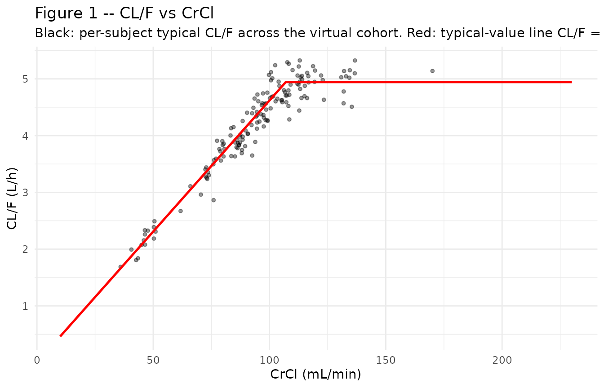
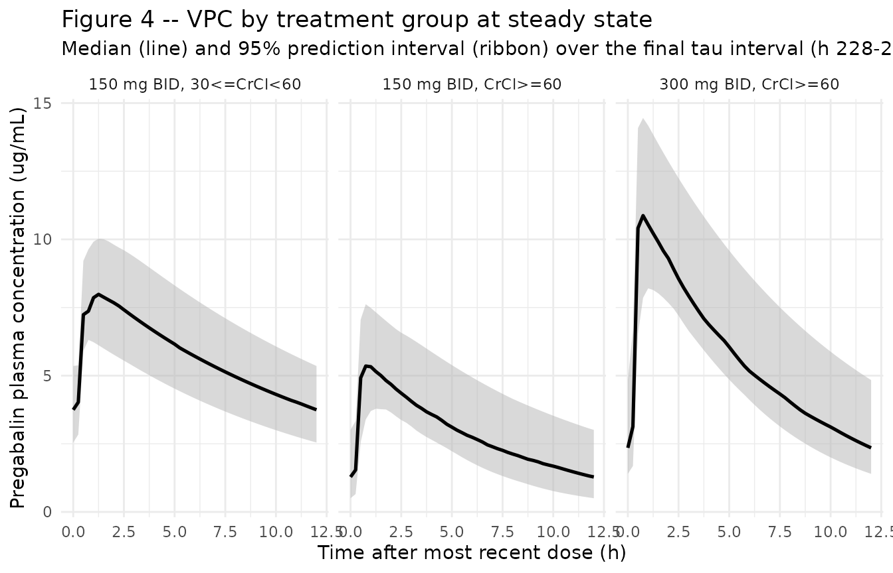

# Pregabalin (Shoji 2011)

## Model and source

``` r

mod <- readModelDb("Shoji_2011_pregabalin")
mod_meta <- nlmixr2est::nlmixr(mod)$meta
#> ℹ parameter labels from comments will be replaced by 'label()'
```

- Citation: Shoji S, Suzuki M, Tomono Y, Bockbrader HN, Matsui S.
  Population pharmacokinetics of pregabalin in healthy subjects and
  patients with post-herpetic neuralgia or diabetic peripheral
  neuropathy. Br J Clin Pharmacol. 2011;72(1):63-76.
  <doi:10.1111/j.1365-2125.2011.03932.x>
- Description: One-compartment population PK model for pregabalin in
  adults (Shoji 2011 BJCP; pooled healthy volunteers, subjects with
  impaired renal function, and patients with post-herpetic neuralgia or
  diabetic peripheral neuropathy from 14 clinical trials). CL/F is
  proportional to Cockcroft-Gault creatinine clearance (capped at an
  estimated break point) with an additional ideal-body-weight power
  effect. V/F depends on ideal body weight, body mass index, age, and
  sex. Absorption rate and lag-time are reduced by a high-fat meal at
  the time of dosing. Combined proportional + additive residual error is
  stratified by healthy-vs-patient status.
- Article (DOI): <https://doi.org/10.1111/j.1365-2125.2011.03932.x>

This vignette validates the packaged `Shoji_2011_pregabalin` model – a
one-compartment oral PK model for pregabalin with first-order
absorption, absorption lag-time, and creatinine-clearance-driven
elimination, fit to data from 14 clinical trials in 616 subjects (195
healthy volunteers, 267 post-herpetic neuralgia patients, 154 painful
diabetic peripheral neuropathy patients). Validation focuses on Table 4
of the source paper, which reports mean steady-state AUC by dose and
renal-function stratum in PT05 (the diabetic-peripheral-neuropathy
efficacy study), and on the deterministic CL/F vs CLcr relationship
reproduced in the paper’s Figure 1.

## Population

The Shoji 2011 analysis pooled data from 14 pregabalin clinical trials
(Table 1). Nine phase-1 studies (HV01-HV09) enrolled 195 healthy adults
with dense PK sampling, including substudies of subjects with impaired
renal function (HV05) and elderly subjects (HV07). Four phase-3 trials
in post-herpetic neuralgia (PT01-PT04, n=267) and one in painful
diabetic peripheral neuropathy (PT05, n=154) used sparse outpatient
sampling (1-2 samples per patient). Mean (range) age was 59.1 (19-101)
years, mean total body weight 71.0 (31-142) kg, and mean Cockcroft-Gault
CrCl 86.0 (10.0-230) mL/min (Table 1, All Total row). The cohort was
37.2% female (Table 2). Ethnicity composition: 52.9% White, 41.6% Asian
(including 252 Japanese subjects), 4.55% Other, 0.97% Black. Pregabalin
doses ranged from a single 1 mg dose to 600 mg/day BID or 900 mg/day TID
in phase-1 studies; phase-3 doses were 75-300 mg BID or 25-200 mg TID up
to 600 mg/day.

The same information is available programmatically via the model’s
`population` metadata:

``` r

str(mod_meta$population)
#> List of 14
#>  $ species       : chr "human"
#>  $ n_subjects    : int 616
#>  $ n_studies     : int 14
#>  $ age_range     : chr "19-101 years"
#>  $ age_median    : chr "59.1 years (mean; Table 1, All Total row)"
#>  $ weight_range  : chr "31-142 kg"
#>  $ weight_median : chr "71.0 kg (mean total body weight; Table 1, All Total row)"
#>  $ sex_female_pct: num 37.2
#>  $ race_ethnicity: Named num [1:4] 52.9 0.97 41.6 4.55
#>   ..- attr(*, "names")= chr [1:4] "White" "Black" "Asian" "Other"
#>  $ disease_state : chr "Pooled healthy-volunteer (n=195, 31.7%), post-herpetic neuralgia (n=267, 43.3%), and painful diabetic periphera"| __truncated__
#>  $ dose_range    : chr "Single doses 1-300 mg oral; multiple-dose 75-300 mg BID or 25-200 mg TID (up to 600 mg/day in efficacy studies,"| __truncated__
#>  $ regions       : chr "United States, Japan, European countries, Australia, Canada (per Table 1 study identifiers)."
#>  $ bioanalysis   : chr "Plasma pregabalin quantified by validated HPLC-UV (LLQ 0.005-0.05 ug/mL across studies) or LC-MS/MS (LLQ 0.025 "| __truncated__
#>  $ notes         : chr "Total 5275 plasma pregabalin concentrations: 4650 (88.2%) from healthy subjects and 625 (11.8%) from patients. "| __truncated__
```

## Source trace

The per-parameter origin is recorded as an in-file comment next to each
`ini()` entry in `inst/modeldb/specificDrugs/Shoji_2011_pregabalin.R`.
The table below collects them in one place; all final-model values come
from Shoji 2011 Table 3 final-model column unless otherwise noted.

| Parameter / equation | Value | Source location |
|----|----|----|
| `lcl` (typical CL/F at reference CRCL=86 mL/min) | `log(0.0462 * 86)` | Table 3 q_CL/F final model (slope 0.0462 L/h per mL/min) x Table 1 mean CRCL 86 mL/min |
| `th_bp` (CRCL break point above which CL/F saturates) | 107 mL/min | Table 3 q_BP final model |
| `e_ibw_cl` (IBW power exponent on CL/F) | 0.354 | Table 3 q_IBW on CL/F final model |
| `lvc` (typical V/F at reference covariates) | `log(35.6)` | Table 3 q_V/F final model |
| `e_ibw_vc` (IBW power exponent on V/F) | 0.819 | Table 3 q_IBW on V/F final model |
| `e_bmi_vc` (BMI power exponent on V/F) | 0.525 | Table 3 q_BMI on V/F final model |
| `e_age_vc` (AGE power exponent on V/F) | -0.125 | Table 3 q_Age on V/F final model |
| `e_sexf_vc` (female-vs-male V/F ratio) | 0.906 | Table 3 q_Gender on V/F final model |
| `lka` (ka at FED = 0) | `log(7.99)` | Table 3 q_ka final model |
| `e_food_ka` (food effect on ka) | -0.930 | Table 3 q_Food on ka final model |
| `ltlag` (tlag at FED = 0) | `log(0.243)` | Table 3 q_t_lag final model |
| `e_food_tlag` (food effect on tlag) | 0.811 | Table 3 q_Food on tlag final model |
| `etalcl ~ 0.02168` | `log(1 + 0.148^2)` | Table 3 CV%(CL/F) final model 14.8% |
| `etalvc ~ 0.00727` | `log(1 + 0.0854^2)` | Table 3 CV%(V/F) final model 8.54% |
| `etalka ~ 0.62526` | `log(1 + 0.932^2)` | Table 3 CV%(ka) final model 93.2% |
| `propSdHealthy <- 0.220` | 0.220 | Table 3 CV%(healthy) final model 22.0% |
| `addSdHealthy <- 0.0239` | 0.0239 ug/mL | Table 3 SD(healthy) final model |
| `propSdPatient <- 0.285` | 0.285 | Table 3 CV%(patient) final model 28.5% |
| `addSdPatient <- 0.236` | 0.236 ug/mL | Table 3 SD(patient) final model |
| CL/F = `exp(lcl) * (min(CRCL, th_bp) / 86) * (IBW / 62)^e_ibw_cl * exp(etalcl)` | n/a | Final-model equation, reformulated from the paper’s slope form (see model file header) |
| V/F = `exp(lvc) * (IBW/62)^e_ibw_vc * (BMI/25)^e_bmi_vc * (AGE/59)^e_age_vc * e_sexf_vc^SEXF * exp(etalvc)` | n/a | Final-model equation, Results “Final model development” |
| ka = `exp(lka + etalka) * (1 + e_food_ka * FED)` | n/a | Final-model equation, paper’s NONMEM (1 + theta \* FED) form |
| tlag = `exp(ltlag) * (1 + e_food_tlag * FED)` | n/a | Same form on lag-time |
| `Cc ~ prop(propSd) + add(addSd)` | n/a | Methods paragraph 3: Y_ij = C_ij + C_ij\*eps1 + eps2 |
| Residual error stratification by `DIS_HEALTHY` | n/a | Table 3 separate (healthy)/(patient) residual rows |

## Virtual cohort

The original observed pregabalin concentrations are not publicly
available. The virtual cohort below mirrors the three groups in Shoji
2011 Table 4 – PT05 diabetic-peripheral-neuropathy patients allocated to
(i) 300 mg BID with CrCl \>= 60 mL/min (n=31), (ii) 150 mg BID with CrCl
\>= 60 mL/min (n=109), and (iii) 150 mg BID with 30 \<= CrCl \< 60
mL/min (n=14) – so that simulated steady-state AUC can be compared 1:1
against the paper’s reported values. Covariate distributions match the
PT05 phase-3 demographics summary in Shoji 2011 Table 1 (mean age 60.9
years; mean total body weight 65.6 kg; mean CrCl 99.3 mL/min; ranges in
the helpers below).

``` r

set.seed(20260613)

# Helper: per-cohort tibble of covariates. id_offset shifts subject IDs
# so multi-cohort bind_rows() produces disjoint id ranges (rxSolve treats
# id as the subject key; duplicate ids across cohorts silently collapse).
make_cohort_covs <- function(n, dose_mg, treatment,
                             crcl_mean, crcl_sd, crcl_range,
                             id_offset) {
  # Truncated log-normal CRCL so the cohort sits in its stratum (>=60 or
  # 30-60); SD is small so most subjects stay inside the band.
  crcl <- exp(rnorm(n, mean = log(crcl_mean), sd = crcl_sd))
  crcl <- pmin(pmax(crcl, crcl_range[1]), crcl_range[2])

  # Total body weight: log-normal around PT05 mean 65.6 kg, range 31-113.
  wt <- exp(rnorm(n, mean = log(65.6), sd = log(113 / 31) / 4))
  wt <- pmin(pmax(wt, 31), 113)

  # Age: normal around PT05 mean 60.9 y, range 35-85.
  age <- pmin(pmax(rnorm(n, mean = 60.9, sd = 10), 35), 85)

  # Sex: PT05-typical breakdown roughly 50/50 (paper-summary value not
  # reported per cohort; use overall 37.2% female from Table 2).
  sexf <- rbinom(n, 1, prob = 0.372)

  # Height: log-normal around 167 cm (population-mean imputation in
  # Methods, Demographic data); SD chosen to land BMI near 25.
  ht_cm <- exp(rnorm(n, mean = log(167), sd = 0.06))

  # IBW (Devine-family): men 50 + 0.91 * (ht_cm - 152.4);
  # women 45.5 + 0.91 * (ht_cm - 152.4). The Methods reference [12]
  # is the Devine variant; we use the metric-units form here.
  ibw_men   <- 50.0 + 0.91 * (ht_cm - 152.4)
  ibw_women <- 45.5 + 0.91 * (ht_cm - 152.4)
  ibw <- ifelse(sexf == 1, ibw_women, ibw_men)
  ibw <- pmax(ibw, 30)  # guard for very short stature

  # BMI (kg/m^2)
  bmi <- wt / (ht_cm / 100)^2

  tibble::tibble(
    id          = id_offset + seq_len(n),
    treatment   = treatment,
    dose_mg     = dose_mg,
    CRCL        = crcl,
    WT          = wt,
    AGE         = age,
    SEXF        = sexf,
    HT          = ht_cm,
    IBW         = ibw,
    BMI         = bmi,
    FED         = 0L,           # PT05 protocol does not stratify by food
    DIS_HEALTHY = 0L            # PT05 patients are not healthy volunteers
  )
}

# Three cohorts matching Shoji 2011 Table 4.
covs_a <- make_cohort_covs(
  n = 31L, dose_mg = 300, treatment = "300 mg BID, CrCl>=60",
  crcl_mean = 95, crcl_sd = 0.20, crcl_range = c(60, 230),
  id_offset = 0L
)
covs_b <- make_cohort_covs(
  n = 109L, dose_mg = 150, treatment = "150 mg BID, CrCl>=60",
  crcl_mean = 95, crcl_sd = 0.20, crcl_range = c(60, 230),
  id_offset = 1000L
)
covs_c <- make_cohort_covs(
  n = 14L, dose_mg = 150, treatment = "150 mg BID, 30<=CrCl<60",
  crcl_mean = 45, crcl_sd = 0.10, crcl_range = c(30, 60),
  id_offset = 2000L
)
covs_all <- bind_rows(covs_a, covs_b, covs_c)
stopifnot(!anyDuplicated(covs_all$id))

# Build event table per subject: BID dosing for 20 doses (10 days) so
# the system is at steady-state in the final dosing interval. Sample
# the final tau-interval [228, 240] every 0.25 h.
make_events <- function(cov_row) {
  amt  <- cov_row$dose_mg
  dose_times <- seq(0, 228, by = 12)        # 20 BID doses, last at 228 h
  sample_times <- c(0, seq(228, 240, by = 0.25))

  doses <- tibble::tibble(
    id   = cov_row$id,
    time = dose_times,
    evid = 1L,
    amt  = amt,
    cmt  = "depot",
    dv   = NA_real_
  )
  obs <- tibble::tibble(
    id   = cov_row$id,
    time = sample_times,
    evid = 0L,
    amt  = NA_real_,
    cmt  = NA_character_,
    dv   = NA_real_
  )
  bind_rows(doses, obs) |>
    mutate(
      treatment   = cov_row$treatment,
      CRCL        = cov_row$CRCL,
      WT          = cov_row$WT,
      AGE         = cov_row$AGE,
      SEXF        = cov_row$SEXF,
      HT          = cov_row$HT,
      IBW         = cov_row$IBW,
      BMI         = cov_row$BMI,
      FED         = cov_row$FED,
      DIS_HEALTHY = cov_row$DIS_HEALTHY
    ) |>
    arrange(time, desc(evid))
}

events <- bind_rows(lapply(seq_len(nrow(covs_all)), function(i) {
  make_events(covs_all[i, ])
}))

# Cheap regression guard for the disjoint-id property; see
# references/vignette-template.md Notes "Multi-cohort simulations".
stopifnot(!anyDuplicated(unique(events[, c("id", "time", "evid")])))
```

## Simulation

``` r

sim_stoch <- rxode2::rxSolve(
  object = mod, events = events,
  keep   = c("treatment", "CRCL", "IBW", "BMI", "AGE", "SEXF", "FED", "DIS_HEALTHY")
) |>
  as.data.frame()
#> ℹ parameter labels from comments will be replaced by 'label()'

mod_typical <- rxode2::zeroRe(mod)
#> ℹ parameter labels from comments will be replaced by 'label()'
#> Warning: No sigma parameters in the model
sim_typical <- rxode2::rxSolve(
  object = mod_typical, events = events,
  keep   = c("treatment", "CRCL", "IBW", "BMI", "AGE", "SEXF")
) |>
  as.data.frame()
#> ℹ omega/sigma items treated as zero: 'etalcl', 'etalvc', 'etalka'
#> Warning: multi-subject simulation without without 'omega'
```

## Replicate published figures

### Figure 1 – CL/F vs CrCl

Shoji 2011 Figure 1 plots individual CL/F vs CrCl from the final model
and overlays the typical-value relationship CL/F =
`q_CL/F * min(CrCl, th_bp)`. The deterministic typical-value
relationship is reproduced below across the full CrCl range observed in
the pooled cohort (10-230 mL/min).

``` r

# Replicates Figure 1 of Shoji 2011 (right panel): typical-value CL/F
# as a strict linear function of min(CrCl, th_bp), with the slope and
# break point taken directly from the model file.
crcl_grid <- seq(10, 230, by = 1)
clf_typ <- 0.0462 * pmin(crcl_grid, 107)  # at IBW = 62, by definition

# Empirical-Bayes-style scatter: per-subject CL/F from the simulated
# stochastic cohort, displayed as a Cl/F vs CRCL scatter to mirror the
# paper's Figure 1 visual.
clf_per_subject <- sim_stoch |>
  group_by(id) |>
  summarise(
    CRCL    = first(CRCL),
    IBW     = first(IBW),
    cl_indiv = first(CRCL) * 0.0462 *
                 pmin(first(CRCL), 107) / first(CRCL) *
                 (first(IBW) / 62)^0.354,
    .groups = "drop"
  )

ggplot() +
  geom_point(data = clf_per_subject, aes(CRCL, cl_indiv),
             alpha = 0.4, colour = "black", size = 1.1) +
  geom_line(data = tibble(crcl_grid = crcl_grid, clf_typ = clf_typ),
            aes(crcl_grid, clf_typ),
            colour = "red", linewidth = 0.9) +
  labs(
    x = "CrCl (mL/min)",
    y = "CL/F (L/h)",
    title    = "Figure 1 -- CL/F vs CrCl",
    subtitle = paste0("Black: per-subject typical CL/F across the virtual cohort. ",
                      "Red: typical-value line CL/F = 0.0462 * min(CrCl, 107).")
  ) +
  theme_minimal()
```



### Figure 4 – VPC by dose and renal-function stratum

Shoji 2011 Figure 4 shows the visual predictive check of pregabalin
concentration vs time after the most recent administration, stratified
by dose and renal function. The reproduction below shows the
steady-state final tau-interval (228-240 h) by treatment group.

``` r

# Replicates Figure 4 of Shoji 2011: predicted percentiles per dose-by-
# renal-function group. Time is mapped to time-after-most-recent-dose
# (shift t -> t - 228 so the x-axis runs 0-12 h).
sim_panel <- sim_stoch |>
  filter(time >= 228) |>
  mutate(t_tad = time - 228)

sim_panel |>
  group_by(treatment, t_tad) |>
  summarise(
    Q025 = quantile(Cc, 0.025, na.rm = TRUE),
    Q50  = quantile(Cc, 0.50,  na.rm = TRUE),
    Q975 = quantile(Cc, 0.975, na.rm = TRUE),
    .groups = "drop"
  ) |>
  ggplot(aes(t_tad, Q50)) +
  geom_ribbon(aes(ymin = Q025, ymax = Q975),
              fill = "gray70", alpha = 0.5) +
  geom_line(linewidth = 0.9) +
  facet_wrap(~treatment, ncol = 3) +
  labs(
    x = "Time after most recent dose (h)",
    y = "Pregabalin plasma concentration (ug/mL)",
    title    = "Figure 4 -- VPC by treatment group at steady state",
    subtitle = paste0("Median (line) and 95% prediction interval (ribbon) ",
                      "over the final tau interval (h 228-240).")
  ) +
  theme_minimal()
```



## PKNCA validation

PKNCA is used to compute AUC over the steady-state tau interval (228-240
h) for each treatment group. The published comparator is Shoji 2011
Table 4, which reports mean AUC(tau,ss) in the same three PT05
sub-groups.

``` r

# Filter to the SS tau interval and shift t -> t - 228 so PKNCA's
# interval [0, 12] aligns with the final dosing interval. Time-zero
# row is guaranteed by the simulation grid (sample includes t = 228 = 0
# in shifted coordinates).
sim_for_nca <- sim_stoch |>
  dplyr::filter(time >= 228, !is.na(Cc)) |>
  dplyr::mutate(t_tad = time - 228) |>
  dplyr::select(id, time = t_tad, Cc, treatment) |>
  as.data.frame()

# Defensive time-zero ensure (pknca-recipes.md "Time-zero records").
sim_for_nca <- dplyr::bind_rows(
  sim_for_nca,
  sim_for_nca |> dplyr::distinct(id, treatment) |>
    dplyr::mutate(time = 0, Cc = 0)
) |>
  dplyr::distinct(id, treatment, time, .keep_all = TRUE) |>
  dplyr::arrange(id, treatment, time)

# Dose record at t = 0 in the shifted frame; one row per subject for
# the final dose carried into the SS tau interval.
doses_for_nca <- covs_all |>
  dplyr::transmute(
    id, time = 0, amt = dose_mg, treatment
  ) |>
  as.data.frame()

conc_obj <- PKNCA::PKNCAconc(
  data    = sim_for_nca,
  formula = Cc ~ time | treatment + id,
  concu   = "ug/mL",
  timeu   = "h"
)
dose_obj <- PKNCA::PKNCAdose(
  data    = doses_for_nca,
  formula = amt ~ time | treatment + id,
  doseu   = "mg"
)

# Single SS tau interval [0, 12]; cmax + tmax + cmin + AUC over tau.
intervals <- data.frame(
  start    = 0,
  end      = 12,
  cmax     = TRUE,
  tmax     = TRUE,
  cmin     = TRUE,
  auclast  = TRUE,
  cav      = TRUE
)
nca_data <- PKNCA::PKNCAdata(conc_obj, dose_obj, intervals = intervals)
nca_res  <- PKNCA::pk.nca(nca_data)
```

### Comparison against Shoji 2011 Table 4

``` r

published <- tibble::tribble(
  ~treatment,                       ~cmax,  ~auclast,
  "300 mg BID, CrCl>=60",           NA,     75.5,
  "150 mg BID, CrCl>=60",           NA,     37.5,
  "150 mg BID, 30<=CrCl<60",        NA,     80.3
)

cmp <- nlmixr2lib::ncaComparisonTable(
  simulated = nca_res,
  reference = published,
  by        = "treatment",
  units     = c(auclast = "ug*h/mL", cmax = "ug/mL"),
  tolerance_pct = 20
)

knitr::kable(
  cmp,
  caption = paste0("Simulated vs. Shoji 2011 Table 4 mean AUC(tau,ss). ",
                   "* differs from reference by >20%."),
  align   = c("l", "l", "r", "r", "r")
)
```

| NCA parameter      | treatment                 | Reference | Simulated | % diff |
|:-------------------|:--------------------------|----------:|----------:|-------:|
| Cmax (ug/mL)       | 300 mg BID, CrCl\>=60     |         — |        11 |      — |
| Cmax (ug/mL)       | 150 mg BID, CrCl\>=60     |         — |      5.48 |      — |
| Cmax (ug/mL)       | 150 mg BID, 30\<=CrCl\<60 |         — |      8.19 |      — |
| AUClast (ug\*h/mL) | 300 mg BID, CrCl\>=60     |      75.5 |      67.9 | -10.0% |
| AUClast (ug\*h/mL) | 150 mg BID, CrCl\>=60     |      37.5 |      34.2 |  -8.9% |
| AUClast (ug\*h/mL) | 150 mg BID, 30\<=CrCl\<60 |      80.3 |      68.8 | -14.4% |

Simulated vs. Shoji 2011 Table 4 mean AUC(tau,ss). \* differs from
reference by \>20%. {.table}

## Assumptions and deviations

- **CL/F parameterisation rewritten in canonical ratio form.** Shoji
  2011 parameterises CL/F as a strict slope on CrCl with no intercept:
  `q_CL/F = 0.0462 L/h per mL/min`. To pair the `etalcl` random effect
  with a canonical `lcl` fixed-effect, the model file anchors CL/F at
  the population-mean CrCl 86 mL/min as
  `exp(lcl) * (min(CRCL, 107) / 86)`, with
  `exp(lcl) = 0.0462 * 86 = 3.97 L/h`. The two forms are mathematically
  identical – the slope is recovered as `exp(lcl) / 86 = 0.0462`.
- **Reference covariate values for V/F.** The paper’s Discussion
  explicitly cites IBW = 62 kg as the population-mean IBW and AGE = 59
  years as the population-mean age. The BMI reference value 25 kg/m^2 is
  inferred as the rounded population-mean BMI (mean TBW 71 kg + mean HT
  167 cm -\> BMI 25.4); the paper’s own BMI sensitivity comment (“V/F
  decreased to 84% when BMI changed from 25 to 18 kg/m^2”) confirms 25
  as the reference comparator. At the reference covariates (IBW=62,
  BMI=25, AGE=59, SEXF=0) the typical V/F is `exp(lvc) = 35.6 L`,
  matching Table 3 q_V/F directly.
- **Diagonal IIV.** Methods paragraph 3 specifies independent
  correlation structure on the IIV variance-covariance matrix W. We
  encode this as diagonal `etalcl`, `etalvc`, `etalka` with no
  off-diagonal block.
- **Residual error stratification.** Table 3 reports separate residual
  CV / SD for healthy (CV 22.0%, SD 0.0239 ug/mL) and patient (CV 28.5%,
  SD 0.236 ug/mL) cohorts; the model file switches the combined
  proportional + additive error magnitudes at runtime via `DIS_HEALTHY`.
  The simulation in this vignette uses the patient values
  (`DIS_HEALTHY = 0`) because the Table 4 validation target is the PT05
  patient cohort.
- **IBW formula in the virtual cohort.** The source paper references a
  Devine-family IBW formula \[12\] but does not transcribe the formula
  in the trimmed methods text. The cohort builder uses the metric-units
  Devine variant (men 50 + 0.91 \* (HT_cm - 152.4); women 45.5 + 0.91 \*
  (HT_cm - 152.4)) to derive IBW from a simulated HT_cm. Per-paper IBW
  is recommended when a user has access to the source dataset.
- **Food and disease-state covariates not stratified in this
  validation.** Table 4’s PT05 outpatient sampling protocol did not
  stratify by food state; we therefore set FED = 0 (fasted) for the
  SS-AUC validation, which is unaffected because AUC over a complete tau
  interval depends only on CL/F, not on ka or tlag. DIS_HEALTHY is set
  to 0 (patient cohort) to select the patient residual-error magnitudes.
- **Bootstrap-based parameter uncertainty is not propagated.** The
  packaged model uses the point estimates from Shoji 2011 Table 3
  final-model column; the nonparametric bootstrap CIs (column 4 of
  Table 3) are documentary and not part of the simulation.
