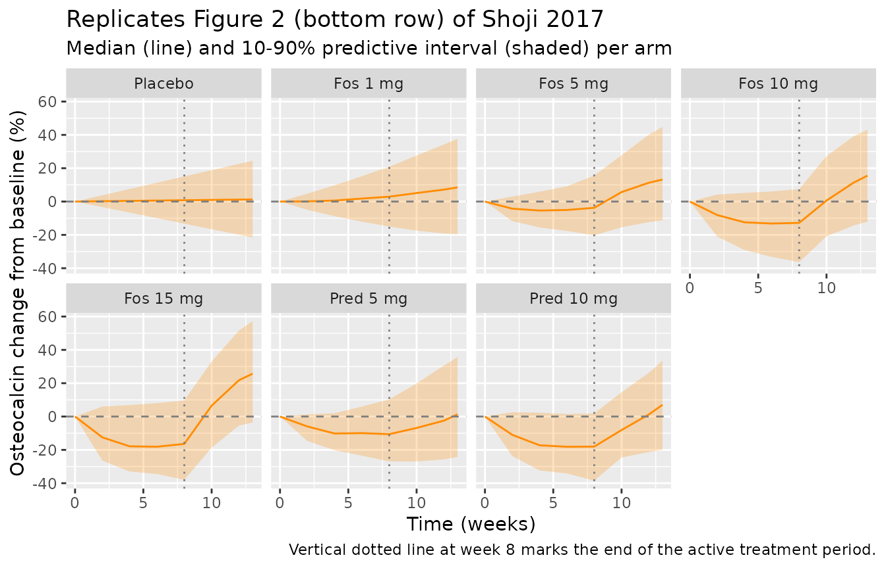

# Fosdagrocorat osteocalcin K-PD (Shoji 2017)

## Model and source

- Citation: Shoji S, Suzuki A, Conrado DJ, Peterson MC, Hey-Hadavi J,
  McCabe D, Rojo R, Tammara BK. Dissociated Agonist of Glucocorticoid
  Receptor or Prednisone for Active Rheumatoid Arthritis: Effects on
  P1NP and Osteocalcin Pharmacodynamics. CPT Pharmacometrics Syst
  Pharmacol. 2017;6(7):439-448. <doi:10.1002/psp4.12201>
- Description: Kinetic-pharmacodynamic (K-PD) model for serum
  osteocalcin (OC) bone-formation biomarker following once-daily oral
  fosdagrocorat (PF-04171327, a dissociated agonist of the
  glucocorticoid receptor) or oral prednisone comparator in adults with
  rheumatoid arthritis on background methotrexate (Shoji 2017). Sister
  model to Shoji_2017_fosdagrocorat_p1np: identical K-PD structure
  (virtual K-PD depot with zero-order Input mg/week and first-order KDE;
  sigmoid Emax inhibition of biomarker synthesis with Hill coefficient
  fixed to 1; empirical dose-and-time-dependent rebound multiplier;
  additive placebo-period slope). For the OC fit Shoji 2017 fixed KDE to
  the P1NP-derived estimates and fixed Imax to 1 for both drugs, and
  used independent (not block) IIV on KDE, EDK50, and BL.
- Article: <https://doi.org/10.1002/psp4.12201>

## Population

The osteocalcin (OC) K-PD fit used the same 321-patient phase II cohort
as the sister P1NP analysis (NCT01393639); see
[`Shoji_2017_fosdagrocorat_p1np`](https://nlmixr2.github.io/nlmixr2lib/articles/Shoji_2017_fosdagrocorat_p1np.md)
for the full demographic summary. For the OC fit Shoji 2017 fixed KDE to
the P1NP-derived estimates (KDE-only re-estimation was unstable for OC
data) and fixed `Imax` to 1 for both drugs (the unconstrained OC
estimate was close to 1).

## Source trace

| Equation / parameter | Value | Source location |
|----|----|----|
| `lkde` (KDE fosdagrocorat) | `fixed(log(0.597))` /week | Table 2 OC: “KDE Fosdagrocorat FIX” (from P1NP fit) |
| `dlkde_pred` | `fixed(log(0.535/0.597))` | Table 2 OC: “KDE Prednisone FIX” (from P1NP fit) |
| `lkd` | `log(0.939)` /week | Table 2 OC, “Kd” |
| `lbl` | `log(22.2)` ng/mL | Table 2 OC, “BL” |
| `imax` | `fixed(1)` | Table 2 OC, “Imax FIX” (both drugs) |
| `ledk50` (EDK50 fos) | `log(148)` mg/week | Table 2 OC, “EDK50 Fosdagrocorat” |
| `dledk50_pred` | `log(122/148)` | Table 2 OC, “EDK50 Prednisone” |
| `hill` | `fixed(1)` | Table 2 OC, “c FIX” |
| `lrbmax` | `log(0.0276)` /mg | Table 2 OC, “RBmax” |
| `lt50` | `log(2.24)` weeks | Table 2 OC, “T50” |
| `slp` | `0.0675` ng/mL/week | Table 2 OC, “SLP” |
| `etalkde` | `omega^2 = 1.5129` (123% CV) | Table 2 OC, “IIV %CV \[g_KDE\]” |
| `etaledk50` | `omega^2 = 0.0650` (25.5% CV) | Table 2 OC, “IIV %CV \[g_EDK50\]” |
| `etalbl` | `omega^2 = 0.1901` (43.6% CV) | Table 2 OC, “IIV %CV \[g_BL\]” |
| `etaslp` | `omega^2 = 0.338^2 = 0.1142` | Table 2 OC, “IIV SD \[g_SLP\] = 0.338” |
| `propSd` | `0.141` | Table 2 OC, “Residual variability %CV \[e\] = 14.1” |
| `d/dt(depot)` | -kde \* depot | Methods, K-PD model equations |
| `d/dt(effect)` | ks \* rebound \* inhibition - kd \* effect | Methods, K-PD model + Results rebound equation |
| `OC = effect + slp_i * t` | Observation = response + linear placebo trend | Methods, F(ij) equation |

## Virtual cohort

The cohort and dosing scheme mirror the P1NP vignette: 200 virtual
subjects per trial arm, 8 weeks active treatment followed by a tapered
4-week period.

``` r

set.seed(20170527L)

n_per_arm <- 200L

make_arm <- function(arm_label, dose_qd_mg, drug_pred, n,
                     dose_reduced_mg, id_offset) {
  active_rate  <- 7 * dose_qd_mg
  taper_a_rate <- 3.5  * dose_reduced_mg
  taper_b_rate <- 2.33 * dose_reduced_mg

  ids <- id_offset + seq_len(n)
  dose_ev <- if (dose_qd_mg > 0) {
    bind_rows(
      tibble(id = ids, time = 0,  amt = active_rate * 8,
             rate = active_rate, evid = 1L, cmt = "depot"),
      tibble(id = ids, time = 8,  amt = taper_a_rate * 2,
             rate = taper_a_rate, evid = 1L, cmt = "depot"),
      tibble(id = ids, time = 10, amt = taper_b_rate * 2,
             rate = taper_b_rate, evid = 1L, cmt = "depot")
    )
  } else {
    tibble(id = integer(), time = numeric(), amt = numeric(),
           rate = numeric(), evid = integer(), cmt = character())
  }

  obs_ev <- expand.grid(id = ids,
                        time = c(0, 2, 4, 6, 8, 10, 12, 13)) |>
    as_tibble() |>
    mutate(amt = NA_real_, rate = NA_real_, evid = 0L, cmt = NA_character_)

  bind_rows(dose_ev, obs_ev) |>
    arrange(id, time, desc(evid)) |>
    mutate(arm = arm_label, DOSE = dose_qd_mg, DRUG_PRED = drug_pred)
}

events <- bind_rows(
  make_arm("Placebo",        0,  0, n_per_arm,  0, id_offset =   0L),
  make_arm("Fos 1 mg",       1,  0, n_per_arm,  1, id_offset = 200L),
  make_arm("Fos 5 mg",       5,  0, n_per_arm,  1, id_offset = 400L),
  make_arm("Fos 10 mg",     10,  0, n_per_arm,  1, id_offset = 600L),
  make_arm("Fos 15 mg",     15,  0, n_per_arm,  1, id_offset = 800L),
  make_arm("Pred 5 mg",      5,  1, n_per_arm,  5, id_offset = 1000L),
  make_arm("Pred 10 mg",    10,  1, n_per_arm,  5, id_offset = 1200L)
)

stopifnot(!anyDuplicated(unique(events[, c("id", "time", "evid")])))
```

## Simulation

``` r

mod <- readModelDb("Shoji_2017_fosdagrocorat_oc")

sim <- rxode2::rxSolve(
  mod, events = events,
  keep = c("arm", "DOSE", "DRUG_PRED")
) |> as.data.frame()

sim_typ <- rxode2::rxSolve(
  rxode2::zeroRe(mod), events = events,
  keep = c("arm", "DOSE", "DRUG_PRED")
) |> as.data.frame()
#> ℹ omega/sigma items treated as zero: 'etalkde', 'etaledk50', 'etalbl', 'etaslp'
#> Warning: multi-subject simulation without without 'omega'
```

## Replicate Figure 2 (lower row): VPC of OC percent change from baseline

``` r

arm_order <- c("Placebo",
               "Fos 1 mg", "Fos 5 mg", "Fos 10 mg", "Fos 15 mg",
               "Pred 5 mg", "Pred 10 mg")

vpc_summary <- sim |>
  filter(time %in% c(0, 2, 4, 6, 8, 10, 12, 13)) |>
  group_by(arm, id) |>
  mutate(oc_baseline = first(OC[time == 0])) |>
  ungroup() |>
  mutate(cfb_pct = 100 * (OC - oc_baseline) / oc_baseline) |>
  group_by(arm, time) |>
  summarise(
    p10 = quantile(cfb_pct, 0.10, na.rm = TRUE),
    p50 = quantile(cfb_pct, 0.50, na.rm = TRUE),
    p90 = quantile(cfb_pct, 0.90, na.rm = TRUE),
    .groups = "drop"
  ) |>
  mutate(arm = factor(arm, levels = arm_order))

ggplot(vpc_summary, aes(time, p50)) +
  geom_ribbon(aes(ymin = p10, ymax = p90), alpha = 0.25, fill = "darkorange") +
  geom_line(color = "darkorange") +
  geom_hline(yintercept = 0, linetype = "dashed", colour = "grey50") +
  geom_vline(xintercept = 8, linetype = "dotted", colour = "grey50") +
  facet_wrap(~ arm, ncol = 4) +
  labs(x = "Time (weeks)",
       y = "Osteocalcin change from baseline (%)",
       title = "Replicates Figure 2 (bottom row) of Shoji 2017",
       subtitle = "Median (line) and 10-90% predictive interval (shaded) per arm",
       caption = "Vertical dotted line at week 8 marks the end of the active treatment period.")
```



## Replicate Table 3: simulated median OC %CFB at week 8

``` r

published_table3 <- tibble::tribble(
  ~arm,         ~published_median_pct,
  "Placebo",                       1.8,
  "Fos 1 mg",                      0.1,
  "Fos 5 mg",                     -6.7,
  "Fos 10 mg",                   -12.6,
  "Fos 15 mg",                   -16.8,
  "Pred 5 mg",                    -9.7,
  "Pred 10 mg",                  -16.9
)

simulated_table3 <- sim |>
  group_by(id, arm) |>
  summarise(
    oc_baseline = first(OC[time == 0]),
    oc_week8    = first(OC[time == 8]),
    cfb_pct     = 100 * (oc_week8 - oc_baseline) / oc_baseline,
    .groups = "drop"
  ) |>
  group_by(arm) |>
  summarise(simulated_median_pct = median(cfb_pct, na.rm = TRUE),
            .groups = "drop")

comparison <- published_table3 |>
  left_join(simulated_table3, by = "arm") |>
  mutate(arm = factor(arm, levels = arm_order)) |>
  arrange(arm) |>
  mutate(delta = simulated_median_pct - published_median_pct)

knitr::kable(comparison, digits = 1,
             col.names = c("Arm",
                           "Published median %CFB (Table 3)",
                           "Simulated median %CFB",
                           "Difference (pp)"),
             caption = "Osteocalcin percent change from baseline at week 8 -- published vs simulated.")
```

| Arm | Published median %CFB (Table 3) | Simulated median %CFB | Difference (pp) |
|:---|---:|---:|---:|
| Placebo | 1.8 | 0.8 | -1.0 |
| Fos 1 mg | 0.1 | 2.9 | 2.8 |
| Fos 5 mg | -6.7 | -3.8 | 2.9 |
| Fos 10 mg | -12.6 | -12.8 | -0.2 |
| Fos 15 mg | -16.8 | -16.4 | 0.4 |
| Pred 5 mg | -9.7 | -10.6 | -0.9 |
| Pred 10 mg | -16.9 | -18.0 | -1.1 |

Osteocalcin percent change from baseline at week 8 – published vs
simulated. {.table style="width:100%;"}

## Typical-value parameter-recovery checks

``` r

sim_typ_summary <- sim_typ |>
  filter(time %in% c(0, 8)) |>
  group_by(arm, time) |>
  summarise(OC_typ = first(OC), .groups = "drop") |>
  pivot_wider(names_from = time, values_from = OC_typ, names_prefix = "wk") |>
  mutate(cfb_pct_typ = 100 * (wk8 - wk0) / wk0,
         arm = factor(arm, levels = arm_order)) |>
  arrange(arm)

knitr::kable(sim_typ_summary, digits = 2,
             col.names = c("Arm", "OC wk 0 (typical)",
                           "OC wk 8 (typical)", "%CFB typical"),
             caption = "Typical-value (zero-RE) osteocalcin at week 8 per arm.")
```

| Arm        | OC wk 0 (typical) | OC wk 8 (typical) | %CFB typical |
|:-----------|------------------:|------------------:|-------------:|
| Placebo    |              22.2 |             22.74 |         2.43 |
| Fos 1 mg   |              22.2 |             22.20 |        -0.01 |
| Fos 5 mg   |              22.2 |             20.44 |        -7.93 |
| Fos 10 mg  |              22.2 |             18.87 |       -15.01 |
| Fos 15 mg  |              22.2 |             17.72 |       -20.16 |
| Pred 5 mg  |              22.2 |             19.71 |       -11.20 |
| Pred 10 mg |              22.2 |             17.77 |       -19.95 |

Typical-value (zero-RE) osteocalcin at week 8 per arm. {.table}

Expected typical responses:

- Placebo: OC = BL + SLP \* 8 = 22.2 + 0.0675 \* 8 = 22.74 ng/mL.
- Fosdagrocorat 10 mg q.d.: ~ -13% CFB at week 8 (paper Discussion /
  Table 3).

## Assumptions and deviations

- **Observation variable naming.** The single-output observation is
  named `OC` (the paper’s name) rather than the canonical `Cc`. Same
  accepted deviation as the P1NP sister model and the wider codebase
  pattern for paper-named biomarker outputs.
- **Drug arm switching via reparameterization.** Same convention as the
  P1NP sister model (base = fosdagrocorat; `dlkde_pred` and
  `dledk50_pred` log-ratio offsets recover the published prednisone
  values when `DRUG_PRED = 1`). For OC the typical-value KDE is fixed to
  the P1NP estimates – both `lkde` and `dlkde_pred` are wrapped in
  `fixed()`.
- **Imax fixed to 1 for both drugs.** The OC fit set `Imax = 1` for both
  fosdagrocorat and prednisone because the unconstrained estimate was
  close to 1 (paper Discussion). The inhibition term
  `1 - imax * ir^c / (edk50^c + ir^c)` therefore approaches 0 (full
  inhibition) at very high IR; the typical OC %CFB at week 8 for the 15
  mg fosdagrocorat arm (-16.8% published; ~ -17% simulated) reflects
  this nearly-complete inhibition combined with the slow OC turnover (Kd
  = 0.939 /week, longer half-life than the 8-week treatment window).
- **Independent (non-block) IIV.** Shoji 2017 used independent IIVs on
  KDE, EDK50, BL for the OC fit (paper Methods: “To reduce estimation
  instability, individual random effect parameters for KDE, EDK50, and
  BL were assumed to be independent.”). The model encodes this with
  three diagonal `etal*` declarations (no block). The IIV CV%s for KDE
  in OC (123%) are larger than for KDE in P1NP (95%) because the OC fit
  fits g_KDE to OC residuals alone; this is the paper’s published value
  and is preserved here.
- **Taper-period dosing approximation.** Same approximation as the P1NP
  vignette (zero-order rates of 3.5 and 2.33 doses/week of the reduced
  dose for weeks 8-10 and 10-12).
