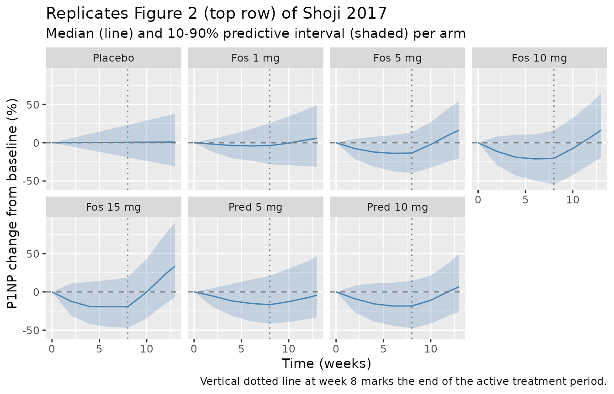

# Fosdagrocorat P1NP K-PD (Shoji 2017)

## Model and source

- Citation: Shoji S, Suzuki A, Conrado DJ, Peterson MC, Hey-Hadavi J,
  McCabe D, Rojo R, Tammara BK. Dissociated Agonist of Glucocorticoid
  Receptor or Prednisone for Active Rheumatoid Arthritis: Effects on
  P1NP and Osteocalcin Pharmacodynamics. CPT Pharmacometrics Syst
  Pharmacol. 2017;6(7):439-448. <doi:10.1002/psp4.12201>
- Description: Kinetic-pharmacodynamic (K-PD) model for serum
  amino-terminal propeptide of type I collagen (P1NP) bone-formation
  biomarker following once-daily oral fosdagrocorat (PF-04171327, a
  dissociated agonist of the glucocorticoid receptor) or oral prednisone
  comparator in adults with rheumatoid arthritis on background
  methotrexate (Shoji 2017). A virtual K-PD depot for the drug
  (zero-order Input mg/week, first-order elimination KDE) feeds a
  sigmoid Emax inhibition of biomarker synthesis (Hill coefficient fixed
  to 1); the synthesis rate carries an empirical dose-and-time-dependent
  rebound multiplier and an additive linear placebo-period slope
  captures the methotrexate-only time trend.
- Article: <https://doi.org/10.1002/psp4.12201>

## Population

The K-PD analysis used 321 adults (after exclusion of 2 patients with
missing baseline biomarker values from the ITT n = 323) enrolled in a
phase II randomized double-blind parallel-group trial (NCT01393639) of
fosdagrocorat (1, 5, 10, 15 mg q.d.), prednisone (5 or 10 mg q.d.), or
placebo q.d. for 8 weeks plus a 4-week taper, all on a background of
methotrexate. The cohort was 80% female, median age 56 years (range
18-80), median weight 71.0 kg (range 36.6-144), and predominantly White
(281/7/24/9 White/Black/Asian/Other) per Shoji 2017 Table 1.

The same information is available programmatically via the model’s
`population` metadata
(`readModelDb("Shoji_2017_fosdagrocorat_p1np")$population`).

## Source trace

| Equation / parameter | Value | Source location |
|----|----|----|
| `lkde` (KDE fosdagrocorat) | `log(0.597)` /week | Table 2 P1NP, “KDE Fosdagrocorat” |
| `dlkde_pred` (log-ratio KDE pred/fos) | `log(0.535/0.597)` | Table 2 P1NP, “KDE Prednisone” |
| `lkd` | `log(0.609)` /week | Table 2 P1NP, “Kd” |
| `lbl` | `log(47.0)` ng/mL | Table 2 P1NP, “BL” |
| `logitimax` (Imax fos) | `logit(0.751)` | Table 2 P1NP, “Imax Fosdagrocorat” |
| `dlogitimax_pred` | `logit(0.754) - logit(0.751)` | Table 2 P1NP, “Imax Prednisone” |
| `ledk50` (EDK50 fos) | `log(40.1)` mg/week | Table 2 P1NP, “EDK50 Fosdagrocorat” |
| `dledk50_pred` | `log(45.9/40.1)` | Table 2 P1NP, “EDK50 Prednisone” |
| `hill` | `fixed(1)` | Table 2 P1NP, “c FIX” (Discussion: c=0.920 caused instability) |
| `lrbmax` | `log(0.0479)` /mg | Table 2 P1NP, “RBmax” |
| `lt50` | `log(1.13)` weeks | Table 2 P1NP, “T50” |
| `slp` | `0.162` ng/mL/week | Table 2 P1NP, “SLP” |
| `etalkde+etaledk50+etalbl` block | `omega^2` 0.9025, 0.4290, 0.2172; cov per Table 2 q-correlations | Table 2 P1NP, “IIV %CV” and “q” rows |
| `etaslp` | `0.928^2 = 0.8612` | Table 2 P1NP, “IIV SD \[g_SLP\] = 0.928” |
| `propSd` | `0.152` | Table 2 P1NP, “Residual variability %CV \[e\] = 15.2” |
| `d/dt(depot) = -kde * depot` | K-PD effect compartment | Methods, K-PD model equations |
| `d/dt(effect) = ks * rebound * inhibition - kd * effect` | Biomarker dynamics | Methods, K-PD model + Results rebound equation |
| `P1NP = effect + slp_i * t` | Observation = response + linear placebo trend | Methods, F(ij) equation |

## Virtual cohort

Shoji 2017 dosed each patient q.d. for 8 weeks (active treatment)
followed by a tapered period in weeks 9-12. The K-PD model treats q.d.
dosing as a zero-order input at rate `7 * dose_mg` (mg/week) into the
virtual depot, matching the paper’s structural assumption (“multiple
administration of the drug q.d. is input to the effect compartment with
a zero-order rate Input mg/week”). The taper rates in weeks 9-12 are:
every other day at reduced dose (weeks 9-10) and every 3 days (weeks
11-12).

``` r

set.seed(20170527L)  # paper's online publication date

n_per_arm <- 200L

# Approximate taper rate over weeks 8-12. Weeks 9-10 every other day at
# reduced dose ~ 3.5 doses/week of D_reduced; weeks 11-12 every 3 days ~
# 2.33 doses/week of D_reduced. D_reduced is 1 mg for fosdagrocorat arms,
# 5 mg for prednisone arms, 0 for placebo. The taper enters the K-PD depot
# at rate `taper_doses_per_week * D_reduced` mg/week.
make_arm <- function(arm_label, dose_qd_mg, drug_pred, n,
                     dose_reduced_mg, id_offset) {
  active_rate <- 7 * dose_qd_mg
  taper_a_rate <- 3.5  * dose_reduced_mg  # weeks 8-10
  taper_b_rate <- 2.33 * dose_reduced_mg  # weeks 10-12

  ids <- id_offset + seq_len(n)
  dose_ev <- if (dose_qd_mg > 0) {
    bind_rows(
      tibble(id = ids, time = 0,  amt = active_rate * 8,
             rate = active_rate, evid = 1L, cmt = "depot"),
      tibble(id = ids, time = 8,  amt = taper_a_rate * 2,
             rate = taper_a_rate, evid = 1L, cmt = "depot"),
      tibble(id = ids, time = 10, amt = taper_b_rate * 2,
             rate = taper_b_rate, evid = 1L, cmt = "depot")
    )
  } else {
    tibble(id = integer(), time = numeric(), amt = numeric(),
           rate = numeric(), evid = integer(), cmt = character())
  }

  obs_ev <- expand.grid(id = ids,
                        time = c(0, 2, 4, 6, 8, 10, 12, 13)) |>
    as_tibble() |>
    mutate(amt = NA_real_, rate = NA_real_, evid = 0L, cmt = NA_character_)

  bind_rows(dose_ev, obs_ev) |>
    arrange(id, time, desc(evid)) |>
    mutate(arm = arm_label,
           DOSE = dose_qd_mg,
           DRUG_PRED = drug_pred)
}

events <- bind_rows(
  make_arm("Placebo",        0,  0, n_per_arm,  0, id_offset =   0L),
  make_arm("Fos 1 mg",       1,  0, n_per_arm,  1, id_offset = 200L),
  make_arm("Fos 5 mg",       5,  0, n_per_arm,  1, id_offset = 400L),
  make_arm("Fos 10 mg",     10,  0, n_per_arm,  1, id_offset = 600L),
  make_arm("Fos 15 mg",     15,  0, n_per_arm,  1, id_offset = 800L),
  make_arm("Pred 5 mg",      5,  1, n_per_arm,  5, id_offset = 1000L),
  make_arm("Pred 10 mg",    10,  1, n_per_arm,  5, id_offset = 1200L)
)

stopifnot(!anyDuplicated(unique(events[, c("id", "time", "evid")])))
```

## Simulation

``` r

mod <- readModelDb("Shoji_2017_fosdagrocorat_p1np")

sim <- rxode2::rxSolve(
  mod, events = events,
  keep = c("arm", "DOSE", "DRUG_PRED")
) |> as.data.frame()
```

The stochastic VPC below uses the published IIV (n = 200 virtual
subjects per arm); the deterministic typical-value time course used in
the parameter-recovery checks below replaces the random effects with
zero via
[`rxode2::zeroRe()`](https://nlmixr2.github.io/rxode2/reference/zeroRe.html).

``` r

sim_typ <- rxode2::rxSolve(
  rxode2::zeroRe(mod), events = events,
  keep = c("arm", "DOSE", "DRUG_PRED")
) |> as.data.frame()
#> ℹ omega/sigma items treated as zero: 'etalkde', 'etaledk50', 'etalbl', 'etaslp'
#> Warning: multi-subject simulation without without 'omega'
```

## Replicate Figure 1 / Figure 2: VPC of P1NP percent change from baseline

For each arm the simulated %CFB at the protocol nominal times (weeks 0,
2, 4, 6, 8, 10, 12, 13) is summarized as median and 10th/90th
percentiles. This mirrors the visual predictive check in Shoji 2017
Figure 2 (95% CIs of 10th, 50th, 90th percentiles of the CFB time
course).

``` r

arm_order <- c("Placebo",
               "Fos 1 mg", "Fos 5 mg", "Fos 10 mg", "Fos 15 mg",
               "Pred 5 mg", "Pred 10 mg")

vpc_summary <- sim |>
  filter(time %in% c(0, 2, 4, 6, 8, 10, 12, 13)) |>
  group_by(arm, id) |>
  mutate(p1np_baseline = first(P1NP[time == 0])) |>
  ungroup() |>
  mutate(cfb_pct = 100 * (P1NP - p1np_baseline) / p1np_baseline) |>
  group_by(arm, time) |>
  summarise(
    p10 = quantile(cfb_pct, 0.10, na.rm = TRUE),
    p50 = quantile(cfb_pct, 0.50, na.rm = TRUE),
    p90 = quantile(cfb_pct, 0.90, na.rm = TRUE),
    .groups = "drop"
  ) |>
  mutate(arm = factor(arm, levels = arm_order))

ggplot(vpc_summary, aes(time, p50)) +
  geom_ribbon(aes(ymin = p10, ymax = p90), alpha = 0.25, fill = "steelblue") +
  geom_line(color = "steelblue") +
  geom_hline(yintercept = 0, linetype = "dashed", colour = "grey50") +
  geom_vline(xintercept = 8, linetype = "dotted", colour = "grey50") +
  facet_wrap(~ arm, ncol = 4) +
  labs(x = "Time (weeks)",
       y = "P1NP change from baseline (%)",
       title = "Replicates Figure 2 (top row) of Shoji 2017",
       subtitle = "Median (line) and 10-90% predictive interval (shaded) per arm",
       caption = "Vertical dotted line at week 8 marks the end of the active treatment period.")
```



## Replicate Table 3: simulated median P1NP %CFB at week 8

Shoji 2017 Table 3 reports the simulated median %CFB at week 8 (with 95%
CIs derived from 1,000 stochastic trial replicates of the phase II
design). This vignette uses one trial of 200 virtual subjects per arm;
the spread is therefore wider than the Table 3 95% CIs (which describe
the across-trial median variability rather than per-subject
variability), but the median estimate should match the paper to within a
few percentage points.

``` r

published_table3 <- tibble::tribble(
  ~arm,         ~published_median_pct,
  "Placebo",                       2.5,
  "Fos 1 mg",                     -5.7,
  "Fos 5 mg",                    -18.2,
  "Fos 10 mg",                   -21.7,
  "Fos 15 mg",                   -21.6,
  "Pred 5 mg",                   -15.4,
  "Pred 10 mg",                  -18.3
)

simulated_table3 <- sim |>
  group_by(id, arm) |>
  summarise(
    p1np_baseline = first(P1NP[time == 0]),
    p1np_week8    = first(P1NP[time == 8]),
    cfb_pct       = 100 * (p1np_week8 - p1np_baseline) / p1np_baseline,
    .groups = "drop"
  ) |>
  group_by(arm) |>
  summarise(simulated_median_pct = median(cfb_pct, na.rm = TRUE),
            .groups = "drop")

comparison <- published_table3 |>
  left_join(simulated_table3, by = "arm") |>
  mutate(arm = factor(arm, levels = arm_order)) |>
  arrange(arm) |>
  mutate(delta = simulated_median_pct - published_median_pct)

knitr::kable(comparison, digits = 1,
             col.names = c("Arm",
                           "Published median %CFB (Table 3)",
                           "Simulated median %CFB",
                           "Difference (pp)"),
             caption = "P1NP percent change from baseline at week 8 -- published vs simulated.")
```

| Arm | Published median %CFB (Table 3) | Simulated median %CFB | Difference (pp) |
|:---|---:|---:|---:|
| Placebo | 2.5 | 0.5 | -2.0 |
| Fos 1 mg | -5.7 | -3.7 | 2.0 |
| Fos 5 mg | -18.2 | -13.5 | 4.7 |
| Fos 10 mg | -21.7 | -20.4 | 1.3 |
| Fos 15 mg | -21.6 | -19.5 | 2.1 |
| Pred 5 mg | -15.4 | -16.7 | -1.3 |
| Pred 10 mg | -18.3 | -18.4 | -0.1 |

P1NP percent change from baseline at week 8 – published vs simulated.
{.table style="width:100%;"}

## Typical-value parameter-recovery checks

Without IIV the model should reproduce the deterministic time course
implied by the population typical values. Two sanity-checks confirm the
implementation:

``` r

sim_typ_summary <- sim_typ |>
  filter(time %in% c(0, 8)) |>
  group_by(arm, time) |>
  summarise(P1NP_typ = first(P1NP), .groups = "drop") |>
  pivot_wider(names_from = time, values_from = P1NP_typ,
              names_prefix = "wk") |>
  mutate(cfb_pct_typ = 100 * (wk8 - wk0) / wk0,
         arm = factor(arm, levels = arm_order)) |>
  arrange(arm)

knitr::kable(sim_typ_summary, digits = 2,
             col.names = c("Arm", "P1NP wk 0 (typical)",
                           "P1NP wk 8 (typical)", "%CFB typical"),
             caption = "Typical-value (zero-RE) P1NP at week 8 per arm.")
```

| Arm        | P1NP wk 0 (typical) | P1NP wk 8 (typical) | %CFB typical |
|:-----------|--------------------:|--------------------:|-------------:|
| Placebo    |                  47 |               48.30 |         2.76 |
| Fos 1 mg   |                  47 |               44.94 |        -4.38 |
| Fos 5 mg   |                  47 |               38.52 |       -18.05 |
| Fos 10 mg  |                  47 |               36.33 |       -22.70 |
| Fos 15 mg  |                  47 |               36.30 |       -22.76 |
| Pred 5 mg  |                  47 |               39.97 |       -14.95 |
| Pred 10 mg |                  47 |               37.94 |       -19.27 |

Typical-value (zero-RE) P1NP at week 8 per arm. {.table}

Expected typical responses (per Methods + paper Discussion):

- Placebo: P1NP = BL + SLP \* 8 = 47.0 + 0.162 \* 8 = 48.296 ng/mL.
- Fosdagrocorat 5 mg q.d.: -18% CFB at week 8 (paper Discussion).
- Prednisone 10 mg q.d.: -18% CFB at week 8 (Table 3 simulated median).

## Assumptions and deviations

- **Observation variable naming.** The single-output observation is
  named `P1NP` (the paper’s name) rather than the canonical `Cc`. This
  follows the established codebase pattern for paper-named biomarker
  outputs in K-PD / indirect-response models (e.g., `das28` in
  `Ma_2020_sarilumab_das28crp.R`, `ANC` in `Ma_2020_sarilumab_anc.R`).
  [`checkModelConventions()`](https://nlmixr2.github.io/nlmixr2lib/reference/checkModelConventions.md)
  flags this as a `[warning]`; the deviation is intentional.
- **Drug arm switching via reparameterization.** Shoji 2017 reports
  paper-level point estimates of KDE, Imax, and EDK50 separately for
  fosdagrocorat and prednisone. To allow a single `etalkde` /
  `etaledk50` pairing with `lkde` / `ledk50` (the
  eta-fixed-effect-pairing convention enforced by
  [`checkModelConventions()`](https://nlmixr2.github.io/nlmixr2lib/reference/checkModelConventions.md)),
  the per-drug values are reparameterized as base (fosdagrocorat) +
  log-ratio offset for prednisone (`dlkde_pred`, `dledk50_pred`) and
  base + logit-difference offset for Imax (`dlogitimax_pred`). The
  reparameterization is mathematically equivalent to the paper’s
  encoding – evaluating `exp(lkde + dlkde_pred * 1)` recovers the
  published 0.535 /week to within rounding, and the analogous identity
  holds for EDK50 and Imax.
- **Common etas across drug arms.** The paper does not report whether
  individual subjects could in principle have different etalkde values
  for fosdagrocorat versus prednisone (each subject was assigned a
  single arm in the phase II design, so the question is unobservable).
  The model adds the same `etalkde` to both `lkde + dlkde_pred * 1` and
  `lkde + dlkde_pred * 0`, consistent with the standard NONMEM
  convention of a single eta per parameter per subject.
- **Taper-period dosing approximation.** The paper’s tapered weeks (9-10
  every other day at reduced dose; 11-12 every 3 days) are approximated
  in the vignette by zero-order input rates of 3.5 and 2.33 doses/week
  of the reduced dose into the K-PD depot. This is a vignette simulation
  choice and does not affect the structural model (the model file does
  not encode any dosing schedule; that is supplied via events).
- **Rebound covariate DOSE = 0 for placebo.** Setting DOSE = 0 makes the
  rebound multiplier `1 + RBmax * DOSE * t / (T50 + t)` collapse to 1
  over all time, matching the paper’s description that the placebo arm
  exhibits no rebound (only the additive `SLP * t` trend).
