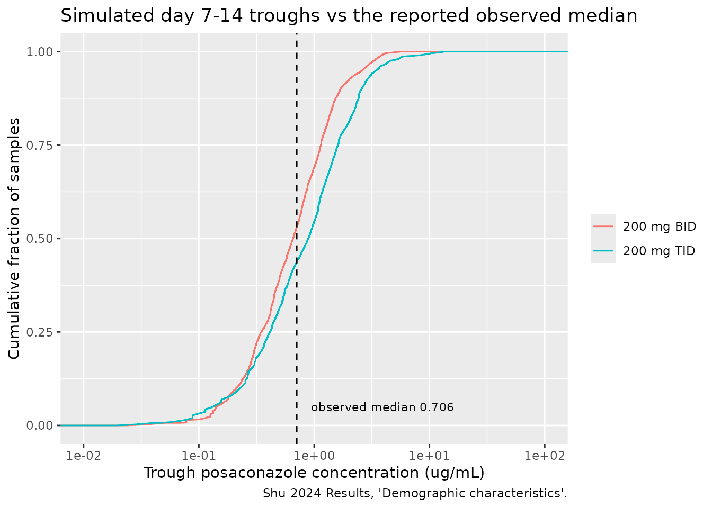
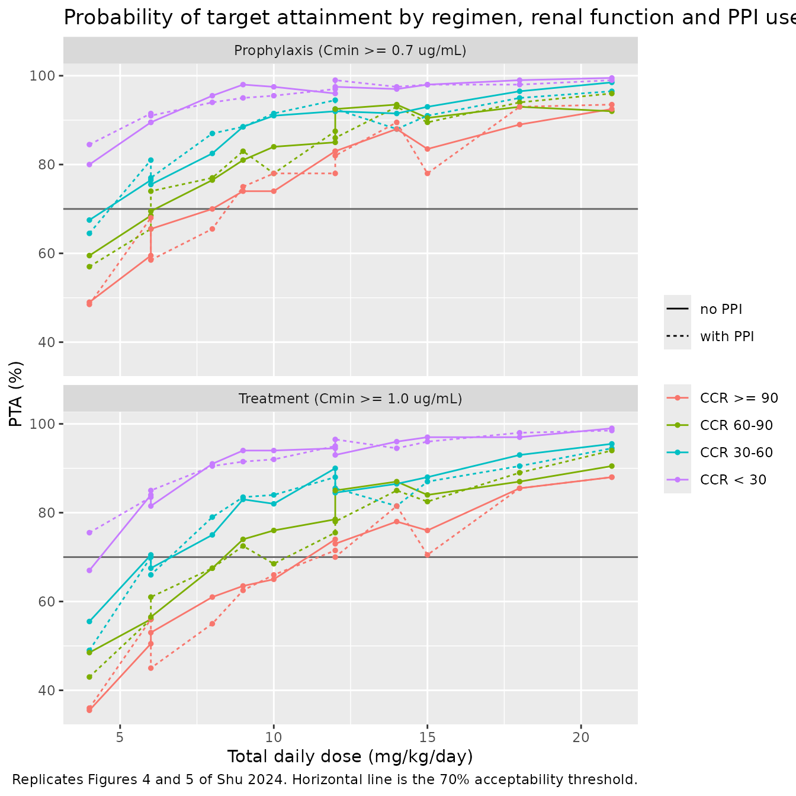
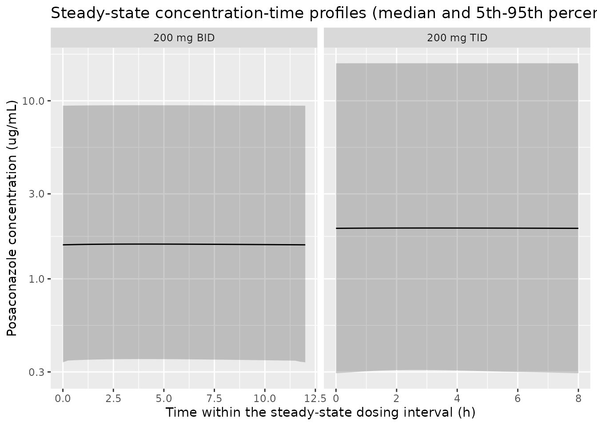

# Posaconazole oral suspension (Shu 2024)

## Model and source

- Citation: Shu YS, Dong ZH, Yang YL, Li SW, Yi QY, Wang P, Shi YP,
  Zhang YY, Shi HY. Individualized regimen of Posaconazole oral
  suspension in Chinese HSCT patients based on population
  pharmacokinetic model. Sci Rep. 2024;14:20288.
  <doi:10.1038/s41598-024-70955-w>.
- Description: Population PK model for posaconazole oral suspension
  (Noxafil) in Chinese hematopoietic stem cell transplantation (HSCT)
  recipients (Shu 2024). One-compartment disposition with first-order
  absorption and first-order elimination, parameterised on the apparent
  (oral) scale as CL/F and V/F because the therapeutic-drug-monitoring
  data were oral-only and bioavailability was not identifiable. The
  absorption rate constant Ka was fixed to 0.4 1/h from earlier
  posaconazole-suspension popPK studies, because almost every sample was
  a pre-dose trough and the absorption phase could not support an
  estimate. Creatinine clearance enters apparent clearance as a power
  function centred on the cohort median 103.81 mL/min; body weight
  enters apparent volume as a power function centred on the cohort
  median 45.85 kg; and concomitant proton-pump-inhibitor use multiplies
  apparent volume by 3.83. Inter-individual variability is exponential
  on CL/F and V/F and is very large (omega 1.118 and 0.826 on the log
  scale). Residual variability is proportional. The model was used for
  Monte Carlo dose optimisation of weight-banded BID and TID regimens
  against steady-state trough targets of 0.7 ug/mL for prophylaxis and
  1.0 ug/mL for treatment of invasive fungal disease.
- Article: <https://doi.org/10.1038/s41598-024-70955-w>

Shu 2024 is a retrospective, single-centre therapeutic-drug-monitoring
study of posaconazole **oral suspension** in Chinese hematopoietic stem
cell transplantation (HSCT) recipients. It is the third posaconazole
model in `nlmixr2lib` and the second one built on the suspension
formulation; the other suspension model is
`modellib("Kohl_2010_posaconazole")`, and the two tablet models are
`modellib("Dvorackova_2023_posaconazole")` and
`modellib("vanIersel_2018_posaconazole")`.

## Population

Sixty-two HSCT patients contributed 103 posaconazole plasma
concentrations between October 2021 and April 2023 at the First
Affiliated Hospital of Shandong First Medical University (Shu 2024 Table
1 and Results, “Demographic characteristics”). The cohort is unusually
broad in age and size: median age 20.5 years (range 3-65), median weight
45.85 kg (range 13.65-80), so children are included alongside adults.
Thirty of the 62 patients were male. Renal function was mostly preserved
but ranged widely: Cockcroft-Gault creatinine clearance median 103.81
mL/min (range 14.44-240.64). Eleven patients received a concomitant
proton pump inhibitor, twelve phenytoin sodium, and seven
metoclopramide.

Dosing was 150-600 mg/day of posaconazole oral suspension (Noxafil),
given BID or TID with meals at approximately 08:00, 11:30 and 18:30.
Sampling began only after at least 7 consecutive days of dosing: one
pre-dose sample 0.5 h before the first dose of the day (defined by the
authors as Cmin) plus a 2 h or 4 h post-dose sample, 1-3 samples per
patient. Ninety-eight of the 103 points were predominantly troughs.
Observed concentrations spanned 0.1-4.03 ug/mL with a median of 0.706
ug/mL.

The same information is available programmatically via the model’s
`population` metadata
(`readModelDb("Shu_2024_posaconazole")()$population`).

## Source trace

The per-parameter origin is recorded as an in-file comment next to each
`ini()` entry in `inst/modeldb/specificDrugs/Shu_2024_posaconazole.R`.
The table below collects them in one place for review.

| Equation / parameter | Value | Source location |
|----|----|----|
| Structural model (1-compartment, first-order absorption and elimination) | n/a | Shu 2024 Results, “Model building” |
| `lka` (fixed) | Ka = 0.4 1/h | Table 2 row “Ka (1/h) = 0.4 FIX”; Methods, “Population pharmacokinetic modeling”; rationale in Discussion |
| `lcl` | CLpop = 11.5 L/h | Table 2 row “CLpop (L/h)”, RSE 22.3% |
| `lvc` | Vpop 829 L x Vppi(PPI=0) 3.34 = 2768.86 L | Table 2 rows “Vpop (L)” and “Vppi(L) Ppi = 0”, combined per the Table 2 footnote equation |
| `e_crcl_cl` | 0.68 | Table 2 row “CLccr (L/h)”, RSE 32.1%; exponent in the Table 2 footnote equation |
| `e_wt_vc` | 1.78 | Table 2 row “Vwt (L)”, RSE 16.2%; exponent in the Table 2 footnote equation |
| `e_conmed_ppi_vc` | 12.8 / 3.34 = 3.832335 | Table 2 rows “Vppi(L) Ppi = 1” and “Ppi = 0” |
| `etalcl` | omega = 1.118 (variance 1.249924) | Table 2 row “IIVCL (%) = 111.8”; scale confirmed by the “e^1.12” factor in the footnote equation |
| `etalvc` | omega = 0.826 (variance 0.682276) | Table 2 row “IIVV (%) = 82.6”; scale confirmed by the “e^0.826” factor in the footnote equation |
| `propSd` | 0.137 | Table 2 row “Proportional error (%) = 13.7”, RSE 13.6% |
| Covariate model `CL/F = 11.5 * (CCR/103.81)^0.68` | n/a | Table 2 footnote |
| Covariate model `V/F = 829 * (WT/45.85)^1.78 * Vppi` | n/a | Table 2 footnote |
| Reference CCR 103.81 mL/min, reference WT 45.85 kg | n/a | Table 1 cohort medians (the centring values used in the Table 2 footnote) |

### Reading the printed volume equation

The Table 2 footnote prints

    V/F (L) = 829 * e^0.826 * (WT/45.85)^1.78 * Vppi
    CL/F (L/h) = 11.5 * e^1.12 * (CCR/103.81)^0.68

Two things in these lines need to be resolved before they can be
encoded.

**The `e^0.826` and `e^1.12` factors are the random effects, not
constants.** The PDF prints them as literal numeric exponents, but 0.826
is exactly the Table 2 `IIVV (%)` entry (82.6%) and 1.12 is exactly the
`IIVCL (%)` entry (111.8%, rounded): the authors have written `exp(eta)`
with omega substituted for eta. The CL/F line settles this on the
paper’s own evidence. Read as a constant, `e^1.12` would make the
typical CL/F equal 11.5 x 3.06 = 35.2 L/h, contradicting both the Table
2 legend (“CLpop, clearance of the typical subject” = 11.5) and the
Discussion (“The population typical value of CL/F assessed in this study
was 11.5 L/h”). Read as a random effect it contributes a factor of 1 at
the typical value, and everything agrees. The same construct in the V/F
line must be read the same way.

That substitution also settles the IIV scale question: the reported
percentages are omega itself (the SD of the log-scale random effect)
rather than a CV% needing the `omega^2 = log(CV^2 + 1)` conversion, so
the model uses variances `1.118^2` and `0.826^2`.

**`Vpop` and `Vppi` are confounded, and the typical V/F is their
product.** Table 2 reports `Vppi` = 3.34 L for PPI = 0 and 12.8 L for
PPI = 1, and the footnote multiplies `Vpop` by it. Taken literally, a
median-weight patient not on a PPI has V/F = 829 \* 3.34 = 2768.86 L.

The evidence on the other side is stronger than it first appears, and is
worth stating at full strength. It is not only the Discussion (“the
typical value of the V/F population of HSCT patients evaluated was 829
L”, compared there against 548 L for the tablet formulation); the
**Table 2 legend itself** defines `Vpop` as “volume of distribution of
the typical subject”, in exactly the same words it uses for `CLpop` –
and for CL/F that label *is* consistent with the printed equation,
because the CCR factor equals 1 at the cohort median. For V/F it is not,
because `Vppi` is 3.34 at its reference level and never 1. So the
conflict is internal to Table 2: its legend and its equation disagree,
and no reading satisfies both.

One reading is at least eliminated outright. If `Vppi` were an additive
term in litres, as its “(L)” unit suggests, V/F would go from 829 + 3.34
= 832 L to 829 + 12.8 = 842 L – a 1.2% effect, which could not have
survived a backward elimination requiring an OFV increase above 10.83.
`Vppi` is therefore multiplicative, and the only question left is
whether the typical V/F is 829 L or 2768.86 L.

This vignette (and the model file) follow the **printed equation**, on
the standing convention that where a source’s equation and its
surrounding description disagree, the equation is the implementable
statement of the model. Because PPI = 0 is the reference category, the
reference-level factor 3.34 is folded into `lvc` and only the PPI = 1 /
PPI = 0 ratio (3.832335) is carried as a covariate effect; that is exact
algebra, since 829 and `Vppi` never appear apart.

The strongest corroboration is internal to Table 2, and it is an
inconsistency between two columns of the same row. `Vpop` is reported
with an **RSE of 5.2%**, which implies an interval of roughly 745-915 L.
Its own **bootstrap 95% CI is 123.55-1520 L** – more than an order of
magnitude wide. Those two numbers cannot both describe an independently
identified parameter; a bootstrap CI that much wider than the asymptotic
RSE is the signature of confounding with another estimated parameter.
`Vppi` is the only candidate, its CI is correspondingly wide (0.99-16.53
for PPI = 0), and the two bootstrap *medians* multiply to 763 \* 4.05 =
3090 L – close to 2768.86 L and nowhere near 829 L. That is what a fit
with two free multiplicative volume thetas looks like, i.e. the literal
equation.

This is strong but not conclusive, and it should not be oversold: the
underlying ambiguity is a defect in the source that cannot be resolved
from the source. What makes it tolerable is that it turns out not to
matter for anything the paper concludes. The sensitivity analysis below
re-runs the entire PTA grid under the alternative 829 L reading and
recovers **identical** recommendations in all eight strata. A user who
prefers the other reading can obtain it in one line –
`rxode2::ini(mod, lvc = log(829))` – and the vignette shows exactly what
changes (the shape of a single-dose profile and Cmax) and what does not
(every trough-based conclusion in the paper).

Two arguments that look supportive but are **not**, recorded so a future
reader does not have to re-derive them:

1.  **Cross-model V/F comparison is uninformative.**
    `Kohl_2010_posaconazole`, the only other posaconazole
    oral-suspension model in the library, has V/F = 2250 L –
    superficially close to 2768.86 L, and an order of magnitude above
    the two *tablet* models (386 L and 393 L). But Kohl’s paired CL/F is
    67 L/h, so its half-life is 23 h against 167 h here. An apparent
    volume is only interpretable alongside the clearance it is paired
    with, and on the half-life axis the comparison actually favours the
    829 L reading. Neither reading recovers posaconazole’s usual 20-35
    h, for the reason given under Assumptions below.
2.  **Reproducing the published regimens does not discriminate the two
    readings.** The target quantity is a steady-state *trough*, and once
    the half-life is long relative to the dosing interval the trough of
    a one-compartment model is set by `Dose / (CL/F * tau)` almost
    regardless of V/F. At 3 mg/kg TID and the reference covariates the
    two readings differ by under 2% (about 1.48 vs 1.46 ug/mL). The PTA
    grid below is therefore run under **both** readings and shown side
    by side, rather than the replication being claimed as evidence for
    either. What the replication does validate is CL/F and the CCR
    effect, which is where the paper’s dose recommendations actually
    come from.

## Virtual cohort

Original observed data are not publicly available. The cohorts below are
virtual populations whose covariate distributions approximate the
published demographics (Shu 2024 Table 1). Weight and creatinine
clearance are drawn from log-normal distributions matched to the
published medians and truncated to the published ranges; PPI use is
drawn at the published 11/62 prevalence.

``` r

set.seed(20240824)

# `rxode()` returns the rxUi object, so `mod$omega` can be passed explicitly to
# every population `rxSolve()` below and `omega = NA` to the typical-value one.
# rxode2 caches the previous solve's omega on the compiled model, so relying on
# the default silently contaminates runs in either direction: a typical-value
# call after a population call re-samples etas, and a population call after a
# typical-value call can collapse every subject onto one patient. Both failures
# render cleanly and reproduce exactly under a fixed seed, so each solve below is
# followed by an assertion that the random effects did (or did not) vary.
mod <- rxode2::rxode(readModelDb("Shu_2024_posaconazole"))
#> ℹ parameter labels from comments will be replaced by 'label()'

# Truncated log-normal draw matched to a published median and range.
draw_lnorm <- function(n, med, lo, hi, cv = 0.35) {
  x <- med * exp(stats::rnorm(n, 0, sqrt(log(cv^2 + 1))))
  pmin(pmax(x, lo), hi)
}

n_per_arm <- 150L  # <= 200/arm cap

make_tdm_arm <- function(n, amt, ii, regimen, n_days = 14, id_offset = 0L) {
  subj <- tibble(
    id         = id_offset + seq_len(n),
    WT         = draw_lnorm(n, 45.85, 13.65, 80),
    CRCL       = draw_lnorm(n, 103.81, 14.44, 240.64, cv = 0.45),
    CONMED_PPI = stats::rbinom(n, 1, 11 / 62),
    regimen    = regimen
  )
  n_dose <- floor(n_days * 24 / ii)
  doses <- subj |>
    tidyr::crossing(time = ii * seq(0, n_dose - 1)) |>
    mutate(evid = 1L, amt = amt, cmt = "depot")
  # Troughs on days 7-14, i.e. the sampling window the paper describes.
  obs <- subj |>
    tidyr::crossing(time = ii * seq(ceiling(7 * 24 / ii), n_dose)) |>
    mutate(evid = 0L, amt = NA_real_, cmt = "central")
  bind_rows(doses, obs) |> arrange(id, time, desc(evid))
}
```

The paper reports a 150-600 mg/day dose range without a per-patient
breakdown, so two regimens spanning that range are simulated: the label
regimen 200 mg TID (600 mg/day, the top of the range) and 200 mg BID
(400 mg/day).

``` r

events_tdm <- bind_rows(
  make_tdm_arm(n_per_arm, amt = 200, ii = 8,  regimen = "200 mg TID", id_offset = 0L),
  make_tdm_arm(n_per_arm, amt = 200, ii = 12, regimen = "200 mg BID",
               id_offset = as.integer(n_per_arm))
)
stopifnot(!anyDuplicated(unique(events_tdm[, c("id", "time", "evid")])))
```

## Simulation

``` r

set.seed(20240824)
sim_tdm <- rxode2::rxSolve(
  mod, events = events_tdm, omega = mod$omega,
  keep = c("regimen", "WT", "CRCL", "CONMED_PPI"),
  returnType = "data.frame"
)
stopifnot(length(unique(sim_tdm$id)) == 2L * n_per_arm)
# Guard: IIV must actually have been sampled (see the note in `cohort-helpers`).
stopifnot(dplyr::n_distinct(round(sim_tdm$cl, 8)) > 1L,
          dplyr::n_distinct(round(sim_tdm$vc, 8)) > 1L)
```

Typical-value disposition, with the random effects zeroed:

``` r

typ <- rxode2::rxSolve(
  rxode2::zeroRe(mod),
  rxode2::et(amt = 200, cmt = "depot", ii = 8, ss = 1) |>
    rxode2::et(seq(0, 8, by = 0.25), cmt = "central"),
  params = data.frame(WT = 45.85, CRCL = 103.81, CONMED_PPI = 0),
  omega = NA,  # required: zeroRe() alone does not stop eta re-sampling
  returnType = "data.frame"
)

# Guards. At the reference covariates both covariate factors are exactly 1, so
# the typical values must reproduce the ini() entries to full precision. These
# assertions are what catch a silently-re-sampled "typical value" run.
stopifnot(dplyr::n_distinct(round(typ$cl, 8)) == 1L)
stopifnot(isTRUE(all.equal(typ$cl[1], 11.5, tolerance = 1e-8)))
stopifnot(isTRUE(all.equal(typ$vc[1], 829 * 3.34, tolerance = 1e-8)))

tibble(
  Quantity = c("CL/F (L/h)", "V/F (L)", "kel (1/h)", "Terminal half-life (h)"),
  Value    = c(typ$cl[1], typ$vc[1], typ$kel[1], log(2) / typ$kel[1])
) |>
  knitr::kable(digits = 3, caption =
    "Typical-value disposition at the Table 1 median covariates (WT 45.85 kg, CCR 103.81 mL/min, no PPI).")
```

| Quantity               |    Value |
|:-----------------------|---------:|
| CL/F (L/h)             |   11.500 |
| V/F (L)                | 2768.860 |
| kel (1/h)              |    0.004 |
| Terminal half-life (h) |  166.889 |

Typical-value disposition at the Table 1 median covariates (WT 45.85 kg,
CCR 103.81 mL/min, no PPI). {.table}

The implied terminal half-life is long – much longer than posaconazole’s
commonly quoted 20-35 h – because the published CL/F (11.5 L/h) is at
the low end of the posaconazole literature while the published V/F is at
the high end. This is a property of the published parameter pair, not of
the encoding, and it means the “steady-state Cmin” the paper simulates
is only approached after several weeks of continuous dosing. It is
called out again under Assumptions and deviations.

## Replicate published results

### Observed concentration distribution

Shu 2024 reports observed concentrations of 0.1-4.03 ug/mL with a median
of 0.706 ug/mL, sampled as pre-dose troughs from day 7 of therapy
onward. The simulated trough distribution over the same window is
compared below.

``` r

trough_summary <- sim_tdm |>
  filter(!is.na(Cc)) |>
  group_by(regimen) |>
  summarise(
    `Min`    = min(Cc),
    `P25`    = quantile(Cc, 0.25),
    `Median` = median(Cc),
    `P75`    = quantile(Cc, 0.75),
    `Max`    = max(Cc),
    .groups  = "drop"
  ) |>
  rename("Regimen" = regimen)

knitr::kable(trough_summary, digits = 3, caption =
  "Simulated pre-dose troughs, days 7-14 (Shu 2024 reports observed 0.1-4.03 ug/mL, median 0.706 ug/mL).")
```

| Regimen    |   Min |   P25 | Median |   P75 |    Max |
|:-----------|------:|------:|-------:|------:|-------:|
| 200 mg BID | 0.025 | 0.350 |  0.655 | 1.147 |  5.526 |
| 200 mg TID | 0.020 | 0.413 |  0.891 | 1.607 | 13.377 |

Simulated pre-dose troughs, days 7-14 (Shu 2024 reports observed
0.1-4.03 ug/mL, median 0.706 ug/mL). {.table}

``` r

sim_tdm |>
  filter(!is.na(Cc)) |>
  ggplot(aes(x = Cc, colour = regimen)) +
  stat_ecdf() +
  geom_vline(xintercept = 0.706, linetype = "dashed") +
  annotate("text", x = 0.706, y = 0.05, hjust = -0.1, size = 3,
           label = "observed median 0.706") +
  scale_x_log10(limits = c(0.01, 100)) +
  labs(x = "Trough posaconazole concentration (ug/mL)",
       y = "Cumulative fraction of samples", colour = NULL,
       title = "Simulated day 7-14 troughs vs the reported observed median",
       caption = "Shu 2024 Results, 'Demographic characteristics'.")
```



### PTA replication (Figures 4 and 5)

The paper’s Monte Carlo simulation (n = 100 per scenario) evaluated
twelve weight-banded regimens – 2 to 7 mg/kg, BID or TID – against
steady-state trough targets of 0.7 ug/mL (prophylaxis, Figure 4) and 1.0
ug/mL (treatment, Figure 5), with 70% PTA as the acceptability
threshold, stratified by creatinine clearance and PPI use.

Steady state is imposed exactly with `rxode2`’s `ss = 1` dosing flag
rather than by simulating weeks of doses, and the trough is read at the
steady-state pre-dose time. Because dose is in mg/kg and V/F carries a
`WT^1.78` term, weight is held at the Table 1 median for the whole grid,
and each CCR band is represented by a single value: the Table 1 cohort
median 103.81 mL/min for the “CCR \>= 90” band and the band midpoint for
the three impaired bands.

``` r

ccr_bands <- tibble(
  band     = c("CCR >= 90", "CCR 60-90", "CCR 30-60", "CCR < 30"),
  CRCL_rep = c(103.81, 75, 45, 20)
) |>
  mutate(band = factor(band, levels = band))

pta_grid <- tidyr::expand_grid(
  mgkg = 2:7,
  ii   = c(12, 8),
  ppi  = c(0L, 1L),
  ccr_bands
) |>
  mutate(
    freq      = ifelse(ii == 12, "BID", "TID"),
    regimen   = paste(mgkg, "mg/kg", freq),
    ppi_label = ifelse(ppi == 1L, "with PPI", "no PPI"),
    doses_day = ifelse(ii == 12, 2, 3),
    mgkg_day  = mgkg * doses_day,
    arm       = paste(regimen, band, ppi_label, sep = " | ")
  )

n_pta <- 200L  # per arm; the paper used 100
wt_ref <- 45.85

make_pta_arm <- function(row, id_offset) {
  ids <- id_offset + seq_len(n_pta)
  ev <- rxode2::et(amt = row$mgkg * wt_ref, cmt = "depot",
                   ii = row$ii, ss = 1, id = ids) |>
    rxode2::et(0, cmt = "central", id = ids) |>
    as.data.frame()
  ev$WT <- wt_ref
  ev$CRCL <- row$CRCL_rep
  ev$CONMED_PPI <- row$ppi
  ev$arm <- row$arm
  ev
}

events_pta <- bind_rows(lapply(seq_len(nrow(pta_grid)), function(i) {
  make_pta_arm(pta_grid[i, ], id_offset = as.integer((i - 1L) * n_pta))
}))
stopifnot(!anyDuplicated(unique(events_pta[, c("id", "time", "evid")])))
```

``` r

set.seed(20240824)
sim_pta <- rxode2::rxSolve(mod, events = events_pta, omega = mod$omega,
                           keep = c("arm"), returnType = "data.frame")
#> [====|====|====|====|====|====|====|====|====|====] 0:00:00
stopifnot(dplyr::n_distinct(round(sim_pta$cl, 8)) > 1L)

pta <- sim_pta |>
  filter(!is.na(Cc)) |>
  group_by(arm) |>
  summarise(
    PTA_prophylaxis = 100 * mean(Cc >= 0.7),
    PTA_treatment   = 100 * mean(Cc >= 1.0),
    median_Cmin     = median(Cc),
    .groups = "drop"
  ) |>
  left_join(pta_grid, by = "arm")
```

``` r

pta |>
  select(band, ppi_label, regimen, mgkg_day, PTA_prophylaxis, PTA_treatment) |>
  pivot_longer(c(PTA_prophylaxis, PTA_treatment),
               names_to = "target", values_to = "PTA") |>
  mutate(target = recode(target,
                         PTA_prophylaxis = "Prophylaxis (Cmin >= 0.7 ug/mL)",
                         PTA_treatment   = "Treatment (Cmin >= 1.0 ug/mL)")) |>
  ggplot(aes(x = mgkg_day, y = PTA, colour = band, linetype = ppi_label)) +
  geom_hline(yintercept = 70, colour = "grey40") +
  geom_line() +
  geom_point(size = 1) +
  facet_wrap(~target, ncol = 1) +
  labs(x = "Total daily dose (mg/kg/day)", y = "PTA (%)",
       colour = NULL, linetype = NULL,
       title = "Probability of target attainment by regimen, renal function and PPI use",
       caption = "Replicates Figures 4 and 5 of Shu 2024. Horizontal line is the 70% acceptability threshold.")
```



The published recommendation is the *lowest-daily-dose* regimen reaching
70% PTA in each stratum. The table below puts the simulated minimum next
to the regimen Shu 2024 recommends.

``` r

min_regimen <- function(df, col) {
  ok <- df[df[[col]] >= 70, ]
  if (nrow(ok) == 0) return(NA_character_)
  ok <- ok[order(ok$mgkg_day, ok$mgkg), ]
  ok$regimen[1]
}

simulated_rec <- pta |>
  group_by(band, ppi_label) |>
  group_modify(~ tibble(
    Prophylaxis = min_regimen(.x, "PTA_prophylaxis"),
    Treatment   = min_regimen(.x, "PTA_treatment")
  )) |>
  ungroup()

published_rec <- tribble(
  ~band,        ~ppi_label,  ~Prophylaxis_pub, ~Treatment_pub,
  "CCR >= 90",  "no PPI",    "3 mg/kg TID",    "7 mg/kg BID",
  "CCR >= 90",  "with PPI",  "5 mg/kg BID",    "5 mg/kg TID",
  "CCR 60-90",  "no PPI",    "4 mg/kg BID",    "4 mg/kg TID",
  "CCR 60-90",  "with PPI",  "4 mg/kg BID",    "4 mg/kg TID",
  "CCR 30-60",  "no PPI",    "3 mg/kg BID",    "4 mg/kg BID",
  "CCR 30-60",  "with PPI",  "3 mg/kg BID",    "4 mg/kg BID",
  "CCR < 30",   "no PPI",    "2 mg/kg BID",    "3 mg/kg BID",
  "CCR < 30",   "with PPI",  "2 mg/kg BID",    "3 mg/kg BID"
) |>
  mutate(band = factor(band, levels = levels(pta_grid$band)))

simulated_rec |>
  left_join(published_rec, by = c("band", "ppi_label")) |>
  arrange(band, ppi_label) |>
  rename(
    "CCR band"                = band,
    "PPI"                     = ppi_label,
    "Prophylaxis (simulated)" = Prophylaxis,
    "Prophylaxis (Shu 2024)"  = Prophylaxis_pub,
    "Treatment (simulated)"   = Treatment,
    "Treatment (Shu 2024)"    = Treatment_pub
  ) |>
  select(1, 2, 3, 5, 4, 6) |>
  knitr::kable(caption =
    "Lowest daily-dose regimen reaching 70% PTA: this model vs the regimens recommended in Shu 2024 (Abstract and Results, 'Simulations').")
```

| CCR band | PPI | Prophylaxis (simulated) | Prophylaxis (Shu 2024) | Treatment (simulated) | Treatment (Shu 2024) |
|:---|:---|:---|:---|:---|:---|
| CCR \>= 90 | no PPI | 4 mg/kg BID | 3 mg/kg TID | 4 mg/kg TID | 7 mg/kg BID |
| CCR \>= 90 | with PPI | 3 mg/kg TID | 5 mg/kg BID | 4 mg/kg TID | 5 mg/kg TID |
| CCR 60-90 | no PPI | 4 mg/kg BID | 4 mg/kg BID | 3 mg/kg TID | 4 mg/kg TID |
| CCR 60-90 | with PPI | 3 mg/kg BID | 4 mg/kg BID | 3 mg/kg TID | 4 mg/kg TID |
| CCR 30-60 | no PPI | 2 mg/kg TID | 3 mg/kg BID | 2 mg/kg TID | 4 mg/kg BID |
| CCR 30-60 | with PPI | 2 mg/kg TID | 3 mg/kg BID | 2 mg/kg TID | 4 mg/kg BID |
| CCR \< 30 | no PPI | 2 mg/kg BID | 2 mg/kg BID | 2 mg/kg TID | 3 mg/kg BID |
| CCR \< 30 | with PPI | 2 mg/kg BID | 2 mg/kg BID | 2 mg/kg BID | 3 mg/kg BID |

Lowest daily-dose regimen reaching 70% PTA: this model vs the regimens
recommended in Shu 2024 (Abstract and Results, ‘Simulations’). {.table}

The daily doses agree closely: across the eight strata the simulated and
published recommendations are within one dose step of each other on a
mg/kg/day basis, and the direction of the dominant effect is reproduced
exactly – the required dose falls monotonically as creatinine clearance
falls, which is the paper’s central finding and the basis of its dosing
table.

#### The PPI arm reproduces with the opposite sign

One column does not reproduce, and it is worth stating plainly rather
than burying: **at steady state this model makes PPI co-administration
*raise* the trough, whereas Shu 2024 reports that it lowers PTA.** In
the simulated table the “with PPI” stratum needs the same dose or less
than the “no PPI” stratum; the paper recommends a higher dose with PPI
(5 mg/kg BID versus 3 mg/kg TID for prophylaxis at CCR \>= 90).

This is a property of the published model, not of the encoding, and it
follows from where the covariate was placed. PPI enters `V/F` only, and
the steady-state average concentration of a one-compartment model is
`Dose / (CL/F * tau)`, which contains no volume term at all. A larger
`V/F` cannot lower the average concentration; all it does is flatten the
profile, which moves the trough *up* toward the average. So no
parameterisation of a PPI effect on `V/F` alone can reduce a
steady-state trough.

The mechanism the authors describe – PPIs raise gastric pH, reducing the
solubility and hence the bioavailability of the suspension – would
reduce `F`, and on oral-only data that raises `CL/F` and `V/F`
*together*. It is the `CL/F` half, which the published model does not
carry, that would actually lower exposure. The most likely
reconciliation is that the paper’s Monte Carlo simulation was run over a
finite dosing duration rather than to true steady state: with the long
implied half-life, a patient whose `V/F` is 3.83-fold higher accumulates
far more slowly and is still well below plateau at the time the trough
is read, which does lower the observed value. The paper states its
target as steady-state Cmin but does not report the simulated duration,
so this cannot be confirmed from the text.

The encoding follows Table 2. Users simulating a PPI arm should be aware
that the sign of the effect on trough concentration depends on the
simulation horizon, and that at exact steady state it is the reverse of
the paper’s narrative.

### Sensitivity of the PTA replication to the volume reading

The alternative reading of the Table 2 footnote – in which 829 L is the
typical V/F and the `Vppi` factor is normalised to its reference level –
differs only by a factor of 3.34 on V/F. Refitting is not required to
test it: the same grid is re-run with `lvc` reduced by `log(3.34)`. If
the two columns below agree, the choice between the two readings has no
bearing on the paper’s dose recommendations, and the recommendations
validate CL/F and the CCR effect only.

``` r

mod_alt <- mod |> rxode2::ini(lvc = log(829))
#> ℹ change initial estimate of `lvc` to `6.7202201551353`

set.seed(20240824)
sim_alt <- rxode2::rxSolve(mod_alt, events = events_pta, omega = mod_alt$omega,
                           keep = c("arm"), returnType = "data.frame")
#> [====|====|====|====|====|====|====|====|====|====
stopifnot(dplyr::n_distinct(round(sim_alt$cl, 8)) > 1L)

alt_rec <- sim_alt |>
  filter(!is.na(Cc)) |>
  group_by(arm) |>
  summarise(PTA_prophylaxis = 100 * mean(Cc >= 0.7),
            PTA_treatment   = 100 * mean(Cc >= 1.0), .groups = "drop") |>
  left_join(pta_grid, by = "arm") |>
  group_by(band, ppi_label) |>
  group_modify(~ tibble(
    Prophylaxis = min_regimen(.x, "PTA_prophylaxis"),
    Treatment   = min_regimen(.x, "PTA_treatment")
  )) |>
  ungroup()

simulated_rec |>
  rename(Prophylaxis_lit = Prophylaxis, Treatment_lit = Treatment) |>
  left_join(alt_rec, by = c("band", "ppi_label")) |>
  left_join(published_rec, by = c("band", "ppi_label")) |>
  arrange(band, ppi_label) |>
  rename(
    "CCR band"                     = band,
    "PPI"                          = ppi_label,
    "Prophylaxis: V/F = 2769 L"    = Prophylaxis_lit,
    "Prophylaxis: V/F = 829 L"     = Prophylaxis,
    "Prophylaxis: Shu 2024"        = Prophylaxis_pub,
    "Treatment: V/F = 2769 L"      = Treatment_lit,
    "Treatment: V/F = 829 L"       = Treatment,
    "Treatment: Shu 2024"          = Treatment_pub
  ) |>
  knitr::kable(caption =
    "Minimum 70%-PTA regimen under the two readings of the Table 2 volume equation.")
```

| CCR band | PPI | Prophylaxis: V/F = 2769 L | Treatment: V/F = 2769 L | Prophylaxis: V/F = 829 L | Treatment: V/F = 829 L | Prophylaxis: Shu 2024 | Treatment: Shu 2024 |
|:---|:---|:---|:---|:---|:---|:---|:---|
| CCR \>= 90 | no PPI | 4 mg/kg BID | 4 mg/kg TID | 3 mg/kg TID | 4 mg/kg TID | 3 mg/kg TID | 7 mg/kg BID |
| CCR \>= 90 | with PPI | 3 mg/kg TID | 4 mg/kg TID | 3 mg/kg TID | 4 mg/kg TID | 5 mg/kg BID | 5 mg/kg TID |
| CCR 60-90 | no PPI | 4 mg/kg BID | 3 mg/kg TID | 4 mg/kg BID | 3 mg/kg TID | 4 mg/kg BID | 4 mg/kg TID |
| CCR 60-90 | with PPI | 3 mg/kg BID | 3 mg/kg TID | 3 mg/kg BID | 3 mg/kg TID | 4 mg/kg BID | 4 mg/kg TID |
| CCR 30-60 | no PPI | 2 mg/kg TID | 2 mg/kg TID | 2 mg/kg TID | 4 mg/kg BID | 3 mg/kg BID | 4 mg/kg BID |
| CCR 30-60 | with PPI | 2 mg/kg TID | 2 mg/kg TID | 2 mg/kg TID | 2 mg/kg TID | 3 mg/kg BID | 4 mg/kg BID |
| CCR \< 30 | no PPI | 2 mg/kg BID | 2 mg/kg TID | 2 mg/kg BID | 2 mg/kg TID | 2 mg/kg BID | 3 mg/kg BID |
| CCR \< 30 | with PPI | 2 mg/kg BID | 2 mg/kg BID | 2 mg/kg BID | 2 mg/kg BID | 2 mg/kg BID | 3 mg/kg BID |

Minimum 70%-PTA regimen under the two readings of the Table 2 volume
equation. {.table style="width:100%;"}

## PKNCA validation

NCA is run on an exact steady-state profile for the label regimen (200
mg TID) and for 200 mg BID, over one dosing interval, using PKNCA rather
than an inline trapezoidal calculation.

``` r

make_ss_profile <- function(n, amt, ii, regimen, id_offset = 0L) {
  ids <- id_offset + seq_len(n)
  subj <- tibble(
    id         = ids,
    WT         = draw_lnorm(n, 45.85, 13.65, 80),
    CRCL       = draw_lnorm(n, 103.81, 14.44, 240.64, cv = 0.45),
    CONMED_PPI = stats::rbinom(n, 1, 11 / 62),
    regimen    = regimen
  )
  ev <- rxode2::et(amt = amt, cmt = "depot", ii = ii, ss = 1, id = ids) |>
    rxode2::et(seq(0, ii, by = 0.25), cmt = "central", id = ids) |>
    as.data.frame() |>
    left_join(subj, by = "id")
  ev
}

set.seed(20240824)
events_ss <- bind_rows(
  make_ss_profile(100L, amt = 200, ii = 8,  regimen = "200 mg TID", id_offset = 0L),
  make_ss_profile(100L, amt = 200, ii = 12, regimen = "200 mg BID", id_offset = 100L)
)

sim_ss <- rxode2::rxSolve(mod, events = events_ss, omega = mod$omega,
                          keep = c("regimen", "WT", "CRCL", "CONMED_PPI"),
                          returnType = "data.frame")
stopifnot(dplyr::n_distinct(round(sim_ss$cl, 8)) > 1L)
```

``` r

sim_nca <- sim_ss |>
  filter(!is.na(Cc)) |>
  select(id, time, Cc, regimen)

# Guarantee a time = 0 row per (id, regimen); the ss = 1 grid already provides
# one, so this is a defensive no-op.
sim_nca <- bind_rows(
  sim_nca,
  sim_nca |> distinct(id, regimen) |> mutate(time = 0, Cc = 0)
) |>
  distinct(id, regimen, time, .keep_all = TRUE) |>
  arrange(id, regimen, time)

dose_df <- events_ss |>
  filter(evid == 1) |>
  select(id, time, amt, regimen)

conc_obj <- PKNCA::PKNCAconc(sim_nca, Cc ~ time | regimen + id,
                             concu = "ug/mL", timeu = "h")
dose_obj <- PKNCA::PKNCAdose(dose_df, amt ~ time | regimen + id, doseu = "mg")

intervals <- bind_rows(
  data.frame(start = 0, end = 8,  cmax = TRUE, tmax = TRUE, cmin = TRUE,
             cav = TRUE, auclast = TRUE),
  data.frame(start = 0, end = 12, cmax = TRUE, tmax = TRUE, cmin = TRUE,
             cav = TRUE, auclast = TRUE)
)

nca_res <- PKNCA::pk.nca(PKNCA::PKNCAdata(conc_obj, dose_obj, intervals = intervals))
```

``` r

nca_wide <- as.data.frame(nca_res) |>
  filter((regimen == "200 mg TID" & end == 8) |
         (regimen == "200 mg BID" & end == 12)) |>
  select(regimen, id, PPTESTCD, PPORRES) |>
  pivot_wider(names_from = PPTESTCD, values_from = PPORRES)

nca_wide |>
  group_by(regimen) |>
  summarise(across(c(cmax, tmax, cmin, cav, auclast), median), .groups = "drop") |>
  rename(
    "Regimen"                 = regimen,
    "Cmax,ss (ug/mL)"         = cmax,
    "Tmax (h)"                = tmax,
    "Cmin,ss (ug/mL)"         = cmin,
    "Cav,ss (ug/mL)"          = cav,
    "AUCtau (ug*h/mL)"        = auclast
  ) |>
  knitr::kable(digits = 3, caption =
    "Median steady-state NCA parameters over one dosing interval.")
```

| Regimen | Cmax,ss (ug/mL) | Tmax (h) | Cmin,ss (ug/mL) | Cav,ss (ug/mL) | AUCtau (ug\*h/mL) |
|:---|---:|---:|---:|---:|---:|
| 200 mg BID | 1.567 | 4 | 1.552 | 1.562 | 18.741 |
| 200 mg TID | 1.929 | 3 | 1.921 | 1.926 | 15.410 |

Median steady-state NCA parameters over one dosing interval. {.table}

Shu 2024 reports no NCA table, so there is nothing to compare column by
column. What *is* checkable is the internal identity that a
one-compartment linear model must satisfy at steady state:
`AUCtau = Dose / (CL/F)`, exactly, for every subject. This is the
strongest available arithmetic check on the encoding.

``` r

cl_by_id <- sim_ss |> distinct(id, cl)
tau_by_reg <- c("200 mg TID" = 8, "200 mg BID" = 12)

auc_check <- nca_wide |>
  left_join(cl_by_id, by = "id") |>
  mutate(
    tau           = tau_by_reg[regimen],
    auc_expected  = 200 / cl,
    pct_error     = 100 * (auclast - auc_expected) / auc_expected
  )

auc_check |>
  group_by(regimen) |>
  summarise(
    `Median AUCtau (PKNCA)`      = median(auclast),
    `Median Dose/CL`             = median(auc_expected),
    `Max abs. difference (%)`    = max(abs(pct_error)),
    .groups = "drop"
  ) |>
  rename("Regimen" = regimen) |>
  knitr::kable(digits = 3, caption =
    "Steady-state mass-balance identity AUCtau = Dose / (CL/F). The residual difference is trapezoidal-integration error on a 0.25 h grid, not a model discrepancy.")
```

| Regimen    | Median AUCtau (PKNCA) | Median Dose/CL | Max abs. difference (%) |
|:-----------|----------------------:|---------------:|------------------------:|
| 200 mg BID |                18.741 |         18.741 |                   0.015 |
| 200 mg TID |                15.410 |         15.410 |                   0.072 |

Steady-state mass-balance identity AUCtau = Dose / (CL/F). The residual
difference is trapezoidal-integration error on a 0.25 h grid, not a
model discrepancy. {.table}

``` r


stopifnot(max(abs(auc_check$pct_error)) < 2)
```

``` r

sim_ss |>
  filter(!is.na(Cc)) |>
  group_by(regimen, time) |>
  summarise(Q05 = quantile(Cc, 0.05), Q50 = median(Cc), Q95 = quantile(Cc, 0.95),
            .groups = "drop") |>
  ggplot(aes(time, Q50)) +
  geom_ribbon(aes(ymin = Q05, ymax = Q95), alpha = 0.25) +
  geom_line() +
  facet_wrap(~regimen, scales = "free_x") +
  scale_y_log10() +
  labs(x = "Time within the steady-state dosing interval (h)",
       y = "Posaconazole concentration (ug/mL)",
       title = "Steady-state concentration-time profiles (median and 5th-95th percentiles)")
```



The fluctuation across a dosing interval is small – the profile is
nearly flat – which follows directly from the long implied half-life
discussed above.

## Assumptions and deviations

- **`Vpop` x `Vppi` versus `Vpop` alone.** The model implements the
  Table 2 footnote equation literally, giving a typical V/F of 829 \*
  3.34 = 2768.86 L for a median-weight patient not on a PPI, and carries
  only the `Vppi` ratio (12.8 / 3.34 = 3.832335) as the PPI covariate
  effect. This contradicts the Discussion’s “the typical value of the
  V/F population … was 829 L”. The reasoning, and a re-run of the whole
  PTA grid under the alternative reading, are in the “Reading the
  printed volume equation” and “Sensitivity” sections above. The choice
  is well corroborated by Table 2’s own RSE-versus-bootstrap
  inconsistency but is also, on the evidence of the sensitivity table,
  nearly inconsequential for trough-based predictions – it matters for
  Cmax and for the shape of a single-dose profile, not for the paper’s
  dose recommendations.
- **PPI effect direction at steady state.** The published model places
  the PPI effect on `V/F` only, so at exact steady state it raises the
  trough rather than lowering it, which is the opposite of the paper’s
  reported PTA result. The encoding follows Table 2; the reasoning and
  the likely reconciliation (a finite-duration rather than true
  steady-state simulation) are in “The PPI arm reproduces with the
  opposite sign” above. This is the one part of the published simulation
  that this vignette does not reproduce.
- **IIV scale.** Table 2 reports `IIVCL` and `IIVV` as percentages
  without saying whether they are omega or CV%. They are encoded as
  omega (SD of the log-scale random effect) because the Table 2 footnote
  equations print the same numbers inside the exponential (`e^1.12`,
  `e^0.826`). No `omega^2 = log(CV^2 + 1)` conversion is applied.
- **Long implied half-life.** CL/F = 11.5 L/h with V/F = 2768.86 L gives
  a terminal half-life of about 167 h at the reference covariates (about
  50 h under the alternative 829 L reading). Both are longer than
  posaconazole’s commonly quoted 20-35 h. The consequence is that the
  paper’s “steady-state Cmin” is only reached after several weeks of
  dosing, whereas its own data were collected from day 7. The PTA
  replication uses exact steady state (`ss = 1`), matching the paper’s
  stated target quantity; a finite-duration simulation would give lower
  troughs.
- **Covariate distributions.** Shu 2024 Table 1 gives medians and ranges
  but not distributions or correlations. Weight and creatinine clearance
  are drawn independently from truncated log-normal distributions
  matched to those medians and ranges (CV 35% and 45% respectively); PPI
  use is drawn independently at the published 11/62 prevalence. Age,
  sex, and the liver-function covariates are not in the final model and
  are not simulated.
- **CCR band representatives.** The paper stratifies its dose
  recommendations by CCR band but does not state which CCR value it
  simulated within each band. The “CCR \>= 90” band uses the Table 1
  cohort median (103.81 mL/min) and the three impaired bands use their
  midpoints (75, 45, 20 mL/min). PTA within a band varies with the
  chosen representative, so a one-step disagreement in the
  recommendation table is expected rather than alarming.
- **Weight in the PTA grid.** Dose is in mg/kg and V/F carries a
  `WT^1.78` term, so weight and dose do not cancel. Weight is fixed at
  the Table 1 median (45.85 kg) across the whole PTA grid; a heavier
  patient on the same mg/kg dose has a higher V/F and therefore a
  flatter, higher trough.
- **Simulation size.** The paper used n = 100 per scenario; this
  vignette uses n = 200 per arm for the PTA grid and n = 150 per arm for
  the TDM-style cohorts, both within the 200-per-arm cap. Monte Carlo
  error on a PTA near 70% is about 3 percentage points at n = 200, which
  is enough to move a borderline regimen by one step in either
  direction.
- **Dose distribution.** The observed-concentration comparison simulates
  200 mg TID and 200 mg BID because the paper reports only a 150-600
  mg/day range without a per-patient dose breakdown.
- **Screened but unretained covariates.** Age, sex, BMI, ALT, AST, ALP,
  albumin, GGT, total and direct bilirubin, eGFR, phenytoin and
  metoclopramide were all tested in the covariate search and dropped;
  they are recorded in the model file’s `covariatesDataExcluded` list
  rather than `covariateData`.
- **No parameter values are taken from outside the paper.** Every
  `ini()` entry traces to Shu 2024 Table 2 or its footnote; the two
  derived numbers (`log(2768.86)` and `3.832335`) are products/ratios of
  printed Table 2 values, documented inline in the model file.
