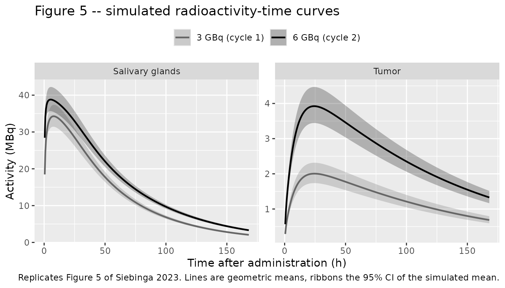
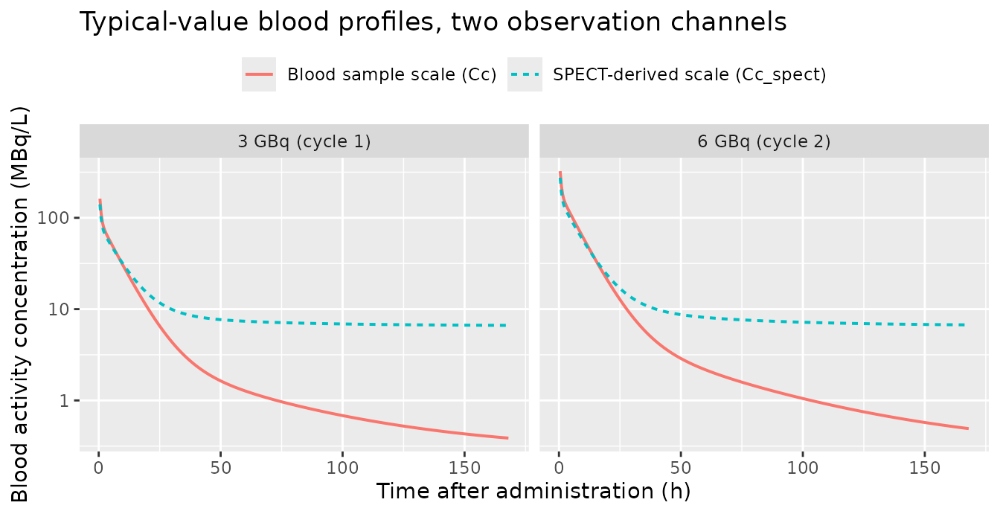

# \[177Lu\]Lu-PSMA-617 population PK dosimetry (Siebinga 2023)

## Model and source

- Citation: Siebinga H, Prive BM, Peters SMB, Nagarajah J, Dorlo TPC,
  Huitema ADR, de Wit-van der Veen BJ, Hendrikx JJMA. Population
  pharmacokinetic dosimetry model using imaging data to assess
  variability in pharmacokinetics of 177Lu-PSMA-617 in prostate cancer
  patients. CPT Pharmacometrics Syst Pharmacol. 2023;12(8):1060-1071.
  <doi:10.1002/psp4.12914>
- Article: <https://doi.org/10.1002/psp4.12914>
- PubMed Central:
  <https://www.ncbi.nlm.nih.gov/pmc/articles/PMC10431047/>

Siebinga et al. developed the first published population PK model for a
PSMA-targeted radioligand therapy. The novelty is the data source:
instead of plasma concentrations alone, the model is fit to organ- and
tumor-level radioactivity read off serial SPECT/CT scans, plus
conventional blood samples. That makes it a *dosimetry* model – the
quantity of interest is the time-integrated activity in each tissue,
which converts directly into an absorbed radiation dose.

The structure is a six-compartment first-order system (Figure 1 of the
paper):

| Paper index | Compartment | nlmixr2lib state | Observed as |
|----|----|----|----|
| 1 | Blood | `blood` | `Cc` (blood samples), `Cc_spect` (SPECT-derived) |
| 2 | Salivary glands (lumped) | `salivary_gland` | `Asalivary_gland` |
| 3 | Kidneys (lumped) | `kidney` | `Akidney` |
| 4 | Liver | `liver` | `Aliver` |
| 5 | Tumor lesions (lumped) | `tumor` | `Atumor` |
| 6 | Other tissue (lumped) | `other` | not observed |

Only the blood compartment has an estimated volume (`V1` = 10.3 L), so
blood is observed as a concentration (MBq/L) and every tissue as a
decay-corrected radioactivity amount (MBq). Salivary-gland uptake is the
only saturable process.

``` r

mod <- readModelDb("Siebinga_2023_lu177psma617")
rxode2::rxode(mod)
#> ℹ parameter labels from comments will be replaced by 'label()'
#> Warning: some etas defaulted to non-mu referenced, possible parsing error: etaiov_kin_tumor_1, etaiov_kin_tumor_2
#> as a work-around try putting the mu-referenced expression on a simple line
#>  ── rxode2-based free-form 6-cmt ODE model ────────────────────────────────────── 
#>  ── Initalization: ──  
#> Fixed Effects ($theta): 
#>                   lkel                    lvc    lkin_salivary_gland 
#>            -1.24479480             2.33214390            -3.73806970 
#>   lkout_salivary_gland                  lbmax            lkin_kidney 
#>            -3.48349262             3.69882978            -4.74788649 
#>           lkout_kidney             lkin_liver            lkout_liver 
#>            -4.26158048            -3.73806970            -3.56489347 
#>             lkin_tumor            lkout_tumor             lkin_other 
#>            -8.30208181            -4.70831094             0.04879016 
#>            lkout_other    e_tum_vol_kin_tumor             e_crcl_kel 
#>            -0.29571424             0.70500000             1.00000000 
#>        cal_slope_spect          cal_int_spect         cal_bias_blood 
#>             0.82800000             6.27000000             0.27300000 
#>                 propSd                  addSd        propSd_Cc_spect 
#>             0.19300000             0.25000000             0.56000000 
#>         addSd_Cc_spect propSd_Asalivary_gland         propSd_Akidney 
#>             0.25000000             0.24600000             0.30400000 
#>          propSd_Aliver          propSd_Atumor 
#>             0.85000000             0.45800000 
#> 
#> Omega ($omega): 
#>                     etalkel etalkin_kidney etalkout_liver etalkin_tumor
#> etalkel            0.029155       0.000000       0.000000      0.000000
#> etalkin_kidney     0.000000       0.025591       0.000000      0.000000
#> etalkout_liver     0.000000       0.000000       0.008985      0.000000
#> etalkin_tumor      0.000000       0.000000       0.000000      0.296947
#> etalbmax           0.000000       0.000000       0.000000      0.000000
#> etaiov_kin_tumor_1 0.000000       0.000000       0.000000      0.000000
#> etaiov_kin_tumor_2 0.000000       0.000000       0.000000      0.000000
#>                    etalbmax etaiov_kin_tumor_1 etaiov_kin_tumor_2
#> etalkel            0.000000           0.000000           0.000000
#> etalkin_kidney     0.000000           0.000000           0.000000
#> etalkout_liver     0.000000           0.000000           0.000000
#> etalkin_tumor      0.000000           0.000000           0.000000
#> etalbmax           0.301325           0.000000           0.000000
#> etaiov_kin_tumor_1 0.000000           0.173302           0.000000
#> etaiov_kin_tumor_2 0.000000           0.000000           0.173302
#> attr(,"lotriLabels")
#> [1] "Table 2 IIV k10 = 17.2% CV -> log(0.172^2 + 1)"               
#> [2] "Table 2 IIV k13 = 16.1% CV -> log(0.161^2 + 1)"               
#> [3] "Table 2 IIV k41 =  9.5% CV -> log(0.095^2 + 1)"               
#> [4] "Table 2 IIV k15 = 58.8% CV -> log(0.588^2 + 1)"               
#> [5] "Table 2 IIV Bmax compartment 2 = 59.3% CV -> log(0.593^2 + 1)"
#> [6] "Table 2 IOV k15 = 43.5% CV -> log(0.435^2 + 1)"               
#> [7] "SAME-equivalent: equal to the occasion-1 IOV variance"        
#> attr(,"lotriFix")
#>                    etalkel etalkin_kidney etalkout_liver etalkin_tumor etalbmax
#> etalkel              FALSE          FALSE          FALSE         FALSE    FALSE
#> etalkin_kidney       FALSE          FALSE          FALSE         FALSE    FALSE
#> etalkout_liver       FALSE          FALSE          FALSE         FALSE    FALSE
#> etalkin_tumor        FALSE          FALSE          FALSE         FALSE    FALSE
#> etalbmax             FALSE          FALSE          FALSE         FALSE    FALSE
#> etaiov_kin_tumor_1   FALSE          FALSE          FALSE         FALSE    FALSE
#> etaiov_kin_tumor_2   FALSE          FALSE          FALSE         FALSE    FALSE
#>                    etaiov_kin_tumor_1 etaiov_kin_tumor_2
#> etalkel                         FALSE              FALSE
#> etalkin_kidney                  FALSE              FALSE
#> etalkout_liver                  FALSE              FALSE
#> etalkin_tumor                   FALSE              FALSE
#> etalbmax                        FALSE              FALSE
#> etaiov_kin_tumor_1              FALSE              FALSE
#> etaiov_kin_tumor_2              FALSE               TRUE
#> 
#> States ($state or $stateDf): 
#>   Compartment Number Compartment Name
#> 1                  1            blood
#> 2                  2   salivary_gland
#> 3                  3           kidney
#> 4                  4            liver
#> 5                  5            tumor
#> 6                  6            other
#>  ── Multiple Endpoint Model ($multipleEndpoint): ──  
#>              variable                            cmt
#> 1              Cc ~ …              cmt='Cc' or cmt=7
#> 2        Cc_spect ~ …        cmt='Cc_spect' or cmt=8
#> 3 Asalivary_gland ~ … cmt='Asalivary_gland' or cmt=9
#> 4         Akidney ~ …        cmt='Akidney' or cmt=10
#> 5          Aliver ~ …         cmt='Aliver' or cmt=11
#> 6          Atumor ~ …         cmt='Atumor' or cmt=12
#>                              dvid*
#> 1              dvid='Cc' or dvid=1
#> 2        dvid='Cc_spect' or dvid=2
#> 3 dvid='Asalivary_gland' or dvid=3
#> 4         dvid='Akidney' or dvid=4
#> 5          dvid='Aliver' or dvid=5
#> 6          dvid='Atumor' or dvid=6
#>   * If dvids are outside this range, all dvids are re-numered sequentially, ie 1,7, 10 becomes 1,2,3 etc
#> 
#>  ── μ-referencing ($muRefTable): ──  
#>         theta            eta level
#> 1        lkel        etalkel    id
#> 2       lbmax       etalbmax    id
#> 3 lkin_kidney etalkin_kidney    id
#> 4 lkout_liver etalkout_liver    id
#> 5  lkin_tumor  etalkin_tumor    id
#> 
#>  ── Model (Normalized Syntax): ── 
#> function() {
#>     compartmentData <- list(blood = list(analyte = "[177Lu]Lu-PSMA-617", 
#>         units = NA_character_, specimen = "blood cell", verified = FALSE), 
#>         salivary_gland = list(analyte = "[177Lu]Lu-PSMA-617", 
#>             units = NA_character_, specimen = "administration site", 
#>             verified = FALSE), kidney = list(analyte = "[177Lu]Lu-PSMA-617", 
#>             units = NA_character_, specimen = "tissue", verified = FALSE), 
#>         liver = list(analyte = "[177Lu]Lu-PSMA-617", units = NA_character_, 
#>             specimen = "tissue", verified = FALSE), tumor = list(analyte = "[177Lu]Lu-PSMA-617", 
#>             units = NA_character_, specimen = "tumor", verified = FALSE), 
#>         other = list(analyte = "[177Lu]Lu-PSMA-617", units = NA_character_, 
#>             specimen = "tissue", verified = FALSE))
#>     covariateData <- list(CRCL = list(description = "Creatinine clearance calculated with the Cockcroft-Gault equation and NOT normalised to body surface area (raw mL/min), as reported in Table 1 (median 87.9, range 50.2-110 mL/min).", 
#>         units = "mL/min", type = "continuous", reference_category = NULL, 
#>         notes = "Added a priori on the blood excretion rate constant k10 with a linear function under the assumption of complete renal elimination (Methods, 'Structural effects'). The paper reports no coefficient for this effect in Table 2, which is consistent with a slope fixed to unity: kel scales in direct proportion to CRCL. Encoded as (CRCL / 87.9)^e_crcl_kel with e_crcl_kel fixed at 1 and the reference set to the Table 1 population median, because the paper does not state a centering value and the Table 2 k10 estimate of 0.288 1/h is the typical value for the cohort. Baseline value, held constant per subject.", 
#>         source_name = "creatinine clearance"), TUM_VOL = list(description = "Total tumor volume summed over all PSMA-positive lesions, delineated on the CT component of the SPECT/CT acquisition. Reported in mL in Table 1; carried here in the canonical mm^3 (1 mL = 1000 mm^3).", 
#>         units = "mm^3", type = "continuous", reference_category = NULL, 
#>         notes = "Time-varying between cycles: determined before the start of each treatment cycle (Table 1 median 2.14 mL in cycle 1 and 0.92 mL in cycle 2; overall range 0.27-78.0 mL). Enters kin_tumor as a power function (TUM_VOL / 1730)^0.705. The reference of 1730 mm^3 is the 1.73 mL 'median tumor volume' the authors used for the absorbed-dose simulations; the covariate section of the paper states only 'compared to the median'. The exponent is confirmed by the paper's own check that a two-fold volume increase gives a 1.63-fold k15 increase (2^0.705 = 1.630). Clinical volumetric measurement, not the caliper-derived preclinical variant that founded the TUM_VOL entry.", 
#>         source_name = "total tumor volume"), OCC = list(description = "Treatment-cycle occasion index for interoccasion variability (1 = first cycle, 2 = second cycle).", 
#>         units = "(count)", type = "categorical", reference_category = NULL, 
#>         notes = "Each of the two [177Lu]Lu-PSMA-617 cycles (8 weeks apart) is a separate occasion (Methods, 'Dosimetry model'). Decomposed inside model() into binary indicators multiplexing the IOV etas on the tumor uptake rate constant kin_tumor.", 
#>         source_name = "treatment cycle"))
#>     covariatesDataExcluded <- list(PSA = list(description = "Baseline prostate-specific antigen (Table 1 median 1.75, range 0.43-20 ng/mL).", 
#>         units = "ng/mL", type = "continuous", notes = "Tested as a structural effect on the tumor uptake rate constant k15 and gave a significant OFV drop (dOFV -8.38), but the effect was less pronounced than total tumor volume, goodness-of-fit plots were worse, and PSA is correlated with tumor volume; the authors retained only tumor volume (Results, 'Structural effects'). No coefficient is reported, so the effect cannot be encoded.", 
#>         source_name = "PSA"), CYCLE = list(description = "Treatment-cycle counter used as a dichotomous second-cycle indicator.", 
#>         units = "(count)", type = "count", notes = "The second treatment cycle was tested as a dichotomous structural effect on salivary-gland uptake (k12) and on Bmax, on the hypothesis that radiation-induced salivary-gland cell death reduces uptake in later cycles; model fits did not improve and no effect was retained (Results, 'Structural effects'). The cycle index is still used, as OCC, to carry interoccasion variability on kin_tumor.", 
#>         source_name = "treatment cycle"))
#>     description <- "Six-compartment population PK dosimetry model for the PSMA-targeted radioligand [177Lu]Lu-PSMA-617 in men with low-volume metastatic prostate cancer, built from SPECT/CT-derived organ and tumor activity plus blood samples over two treatment cycles (~3 and ~6 GBq). States are blood (1), salivary gland (2), kidney (3), liver (4), tumor (5) and a lumped other-tissue compartment (6); every state carries a decay-corrected radioactivity amount (MBq) and only the blood compartment has an estimated volume (V1 = 10.3 L), so blood is observed as a concentration (MBq/L) and the tissues as amounts. Salivary-gland uptake is saturable in the bound amount (Bmax 40.4 MBq, IIV 59.3% CV); all other tissue exchange is first order. The tumor uptake rate constant carries a power effect of total tumor volume (exponent 0.705), interindividual variability (58.8% CV) and interoccasion variability across the two cycles (43.5% CV), and the blood excretion rate constant is scaled a priori by Cockcroft-Gault creatinine clearance under an assumption of complete renal elimination. The blood compartment has two observation channels with separate residual error: blood samples, and SPECT-derived blood activity linearly recalibrated to the blood-sample scale."
#>     population <- list(species = "human", n_subjects = 10, n_studies = 1, 
#>         age_range = "61-77 years", age_median = "67 years", weight_range = "59.4-97.0 kg", 
#>         weight_median = "84.0 kg", height_median = "178 cm (range 174-182)", 
#>         sex_female_pct = 0, disease_state = "Low-volume early-stage metastatic prostate cancer with PSMA-positive lesions on diagnostic [68Ga]Ga-PSMA PET/CT; median Gleason score 8.5 (range 7-9); median baseline PSA 1.75 ng/mL (0.43-20).", 
#>         renal_function = "Cockcroft-Gault creatinine clearance median 87.9 mL/min (range 50.2-110)", 
#>         dose_range = "Two intravenous cycles of [177Lu]Lu-PSMA-617 8 weeks apart: median injected activity 3064 MBq (3025-3155) in cycle 1 and 6039 MBq (4972-6073) in cycle 2.", 
#>         tumor_volume = "Total tumor volume median 2.14 mL (0.27-76.6) before cycle 1 and 0.92 mL (0.27-78.0) before cycle 2", 
#>         regions = "Netherlands (Radboud University Medical Center; NCT03828838)", 
#>         notes = "Baseline demographics from Table 1. Observations comprised 180 blood samples (5, 30, 60, 120 and 180 min and 24, 48, 72 and 168 h post-injection) and 491 SPECT/CT-derived observations (scans at 1, 24, 48, 72 and 168 h). All activity records were decay-corrected back to the time of injection. Kidney observations from the ~1 h scan were excluded as predominantly urinary activity, and liver blood-volume activity was subtracted from measured liver activity.")
#>     reference <- "Siebinga H, Prive BM, Peters SMB, Nagarajah J, Dorlo TPC, Huitema ADR, de Wit-van der Veen BJ, Hendrikx JJMA. Population pharmacokinetic dosimetry model using imaging data to assess variability in pharmacokinetics of 177Lu-PSMA-617 in prostate cancer patients. CPT Pharmacometrics Syst Pharmacol. 2023;12(8):1060-1071. doi:10.1002/psp4.12914"
#>     units <- list(time = "h", dosing = "MBq", concentration = "MBq/L")
#>     vignette <- "Siebinga_2023_lu177psma617"
#>     ini({
#>         lkel <- -1.24479479884619
#>         label("Excretion (elimination) rate constant from blood, k10 (1/h)")
#>         lvc <- 2.33214389523559
#>         label("Blood (central) volume of distribution, V1 (L)")
#>         lkin_salivary_gland <- -3.73806969830471
#>         label("Blood-to-salivary-gland uptake rate constant, k12 (1/h)")
#>         lkout_salivary_gland <- -3.48349262438899
#>         label("Salivary-gland-to-blood rate constant, k21 (1/h)")
#>         lbmax <- 3.6988297849671
#>         label("Maximum salivary-gland binding capacity, Bmax (MBq)")
#>         lkin_kidney <- -4.74788648818969
#>         label("Blood-to-kidney uptake rate constant, k13 (1/h)")
#>         lkout_kidney <- -4.26158048159801
#>         label("Kidney-to-blood rate constant, k31 (1/h)")
#>         lkin_liver <- -3.73806969830471
#>         label("Blood-to-liver uptake rate constant, k14 (1/h)")
#>         lkout_liver <- -3.56489347433295
#>         label("Liver-to-blood rate constant, k41 (1/h)")
#>         lkin_tumor <- -8.30208181179929
#>         label("Blood-to-tumor uptake rate constant, k15 (1/h)")
#>         lkout_tumor <- -4.7083109449076
#>         label("Tumor-to-blood rate constant, k51 (1/h)")
#>         lkin_other <- 0.048790164169432
#>         label("Blood-to-other-tissue rate constant, k16 (1/h)")
#>         lkout_other <- -0.295714244149045
#>         label("Other-tissue-to-blood rate constant, k61 (1/h)")
#>         e_tum_vol_kin_tumor <- 0.705
#>         label("Power exponent of total tumor volume on kin_tumor (unitless)")
#>         e_crcl_kel <- fix(1)
#>         label("Power exponent of creatinine clearance on kel (unitless)")
#>         cal_slope_spect <- fix(0.828)
#>         label("SPECT-to-blood-sample recalibration slope, beta (unitless)")
#>         cal_int_spect <- fix(6.27)
#>         label("SPECT-to-blood-sample recalibration intercept, alpha (MBq/L)")
#>         cal_bias_blood <- fix(0.273)
#>         label("Structural blood measurement effect, gamma (MBq/L)")
#>         propSd <- c(0, 0.193)
#>         label("Proportional residual error, blood samples (fraction)")
#>         addSd <- fix(0, 0.25)
#>         label("Additive residual error, blood (MBq/L)")
#>         propSd_Cc_spect <- c(0, 0.56)
#>         label("Proportional residual error, SPECT-derived blood activity (fraction)")
#>         addSd_Cc_spect <- fix(0, 0.25)
#>         label("Additive residual error, SPECT-derived blood activity (MBq/L)")
#>         propSd_Asalivary_gland <- c(0, 0.246)
#>         label("Proportional residual error, salivary-gland activity (fraction)")
#>         propSd_Akidney <- c(0, 0.304)
#>         label("Proportional residual error, kidney activity (fraction)")
#>         propSd_Aliver <- c(0, 0.85)
#>         label("Proportional residual error, liver activity (fraction)")
#>         propSd_Atumor <- c(0, 0.458)
#>         label("Proportional residual error, tumor activity (fraction)")
#>         etalkel ~ 0.029155
#>         label("Table 2 IIV k10 = 17.2% CV -> log(0.172^2 + 1)")
#>         etalkin_kidney ~ 0.025591
#>         label("Table 2 IIV k13 = 16.1% CV -> log(0.161^2 + 1)")
#>         etalkout_liver ~ 0.008985
#>         label("Table 2 IIV k41 =  9.5% CV -> log(0.095^2 + 1)")
#>         etalkin_tumor ~ 0.296947
#>         label("Table 2 IIV k15 = 58.8% CV -> log(0.588^2 + 1)")
#>         etalbmax ~ 0.301325
#>         label("Table 2 IIV Bmax compartment 2 = 59.3% CV -> log(0.593^2 + 1)")
#>         etaiov_kin_tumor_1 ~ 0.173302
#>         label("Table 2 IOV k15 = 43.5% CV -> log(0.435^2 + 1)")
#>         etaiov_kin_tumor_2 ~ fix(0.173302)
#>         label("SAME-equivalent: equal to the occasion-1 IOV variance")
#>     })
#>     model({
#>         oc1 <- (OCC == 1)
#>         oc2 <- (OCC == 2)
#>         iov_kin_tumor <- oc1 * etaiov_kin_tumor_1 + oc2 * etaiov_kin_tumor_2
#>         kel <- exp(lkel + etalkel) * (CRCL/87.9)^e_crcl_kel
#>         vc <- exp(lvc)
#>         kin_salivary_gland <- exp(lkin_salivary_gland)
#>         kout_salivary_gland <- exp(lkout_salivary_gland)
#>         bmax <- exp(lbmax + etalbmax)
#>         kin_kidney <- exp(lkin_kidney + etalkin_kidney)
#>         kout_kidney <- exp(lkout_kidney)
#>         kin_liver <- exp(lkin_liver)
#>         kout_liver <- exp(lkout_liver + etalkout_liver)
#>         kin_tumor <- exp(lkin_tumor + etalkin_tumor + iov_kin_tumor) * 
#>             (TUM_VOL/1730)^e_tum_vol_kin_tumor
#>         kout_tumor <- exp(lkout_tumor)
#>         kin_other <- exp(lkin_other)
#>         kout_other <- exp(lkout_other)
#>         slope_spect <- cal_slope_spect
#>         int_spect <- cal_int_spect
#>         gbias_blood <- cal_bias_blood
#>         flux_salivary_gland <- kin_salivary_gland * blood * (1 - 
#>             salivary_gland/bmax)
#>         d/dt(blood) <- -kel * blood - flux_salivary_gland + kout_salivary_gland * 
#>             salivary_gland - kin_kidney * blood + kout_kidney * 
#>             kidney - kin_liver * blood + kout_liver * liver - 
#>             kin_tumor * blood + kout_tumor * tumor - kin_other * 
#>             blood + kout_other * other
#>         d/dt(salivary_gland) <- flux_salivary_gland - kout_salivary_gland * 
#>             salivary_gland
#>         d/dt(kidney) <- kin_kidney * blood - kout_kidney * kidney
#>         d/dt(liver) <- kin_liver * blood - kout_liver * liver
#>         d/dt(tumor) <- kin_tumor * blood - kout_tumor * tumor
#>         d/dt(other) <- kin_other * blood - kout_other * other
#>         Cblood <- blood/vc
#>         Cc <- Cblood + gbias_blood
#>         Cc_spect <- slope_spect * Cblood + int_spect + gbias_blood
#>         Asalivary_gland <- salivary_gland
#>         Akidney <- kidney
#>         Aliver <- liver
#>         Atumor <- tumor
#>         Cc ~ add(addSd) + prop(propSd)
#>         Cc_spect ~ add(addSd_Cc_spect) + prop(propSd_Cc_spect)
#>         Asalivary_gland ~ prop(propSd_Asalivary_gland)
#>         Akidney ~ prop(propSd_Akidney)
#>         Aliver ~ prop(propSd_Aliver)
#>         Atumor ~ prop(propSd_Atumor)
#>     })
#> }
```

## Population

Ten men with low-volume early-stage metastatic prostate cancer, all with
PSMA-positive lesions on diagnostic \[68Ga\]Ga-PSMA PET/CT, enrolled in
a prospective study at Radboud University Medical Center (NCT03828838).
Each received two intravenous cycles of \[177Lu\]Lu-PSMA-617 eight weeks
apart, with median injected activity 3064 MBq (range 3025-3155) in cycle
1 and 6039 MBq (4972-6073) in cycle 2. Baseline characteristics (Table 1
of the paper): median age 67 years (61-77), weight 84.0 kg (59.4-97.0),
height 178 cm (174-182), Cockcroft-Gault creatinine clearance 87.9
mL/min (50.2-110), PSA 1.75 ng/mL (0.43-20) and Gleason score 8.5 (7-9).

Total tumor volume was re-measured before each cycle and fell over
treatment: median 2.14 mL (0.27-76.6) before cycle 1 and 0.92 mL
(0.27-78.0) before cycle 2. The dataset comprised 180 blood samples (5,
30, 60, 120 and 180 min and 24, 48, 72 and 168 h post-injection) and 491
SPECT/CT-derived observations (scans at 1, 24, 48, 72 and 168 h). All
activity records were decay-corrected back to the time of injection.

The same information is available programmatically:

``` r

str(readModelDb("Siebinga_2023_lu177psma617")()$population)
#> Warning: some etas defaulted to non-mu referenced, possible parsing error: etaiov_kin_tumor_1, etaiov_kin_tumor_2
#> as a work-around try putting the mu-referenced expression on a simple line
#> List of 15
#>  $ species       : chr "human"
#>  $ n_subjects    : num 10
#>  $ n_studies     : num 1
#>  $ age_range     : chr "61-77 years"
#>  $ age_median    : chr "67 years"
#>  $ weight_range  : chr "59.4-97.0 kg"
#>  $ weight_median : chr "84.0 kg"
#>  $ height_median : chr "178 cm (range 174-182)"
#>  $ sex_female_pct: num 0
#>  $ disease_state : chr "Low-volume early-stage metastatic prostate cancer with PSMA-positive lesions on diagnostic [68Ga]Ga-PSMA PET/CT"| __truncated__
#>  $ renal_function: chr "Cockcroft-Gault creatinine clearance median 87.9 mL/min (range 50.2-110)"
#>  $ dose_range    : chr "Two intravenous cycles of [177Lu]Lu-PSMA-617 8 weeks apart: median injected activity 3064 MBq (3025-3155) in cy"| __truncated__
#>  $ tumor_volume  : chr "Total tumor volume median 2.14 mL (0.27-76.6) before cycle 1 and 0.92 mL (0.27-78.0) before cycle 2"
#>  $ regions       : chr "Netherlands (Radboud University Medical Center; NCT03828838)"
#>  $ notes         : chr "Baseline demographics from Table 1. Observations comprised 180 blood samples (5, 30, 60, 120 and 180 min and 24"| __truncated__
```

## Source trace

Every `ini()` entry carries an in-file comment naming its source
location in `inst/modeldb/specificDrugs/Siebinga_2023_lu177psma617.R`.
They are collected here for review.

| Equation / parameter | Value | Source location |
|----|----|----|
| `lkel` (k10, excretion from blood) | 0.288 1/h (RSE 7.6%) | Table 2 |
| `lvc` (V1) | 10.3 L (RSE 4.5%) | Table 2 |
| `lkin_salivary_gland` (k12) | 0.0238 1/h (RSE 12.4%) | Table 2 |
| `lkout_salivary_gland` (k21) | 0.0307 1/h (RSE 5.8%) | Table 2 |
| `lbmax` (Bmax, compartment 2) | 40.4 MBq (RSE 12.3%) | Table 2 |
| `lkin_kidney` (k13) | 0.00867 1/h (RSE 8.6%) | Table 2 |
| `lkout_kidney` (k31) | 0.0141 1/h (RSE 4.7%) | Table 2 |
| `lkin_liver` (k14) | 0.0238 1/h (RSE 7.9%) | Table 2 |
| `lkout_liver` (k41) | 0.0283 1/h (RSE 4.6%) | Table 2 |
| `lkin_tumor` (k15) | 0.000248 1/h (RSE 14.0%) | Table 2 |
| `lkout_tumor` (k51) | 0.00902 1/h (RSE 11.4%) | Table 2 |
| `lkin_other` (k16) | 1.05 1/h (RSE 15.3%) | Table 2 |
| `lkout_other` (k61) | 0.744 1/h (RSE 7.9%) | Table 2 |
| `e_tum_vol_kin_tumor` | 0.705 (RSE 12.3%) | Table 2, “Structural effects Tumor volume on k15” |
| `e_crcl_kel` | fixed at 1 | Methods, “Structural effects” (CRCL added a priori on k10, linear, complete renal elimination) |
| `cal_slope_spect` (beta) | fixed at 0.828 | Results, “Blood compartment” |
| `cal_int_spect` (alpha) | fixed at 6.27 MBq/L | Results, “Blood compartment” |
| `cal_bias_blood` (gamma) | fixed at 0.273 MBq/L | Results, “Blood compartment” |
| IIV `etalkel` | 17.2% CV (RSE 13.7%) | Table 2, IIV k10 |
| IIV `etalkin_kidney` | 16.1% CV (RSE 16.8%) | Table 2, IIV k13 |
| IIV `etalkout_liver` | 9.5% CV (RSE 16.8%) | Table 2, IIV k41 |
| IIV `etalkin_tumor` | 58.8% CV (RSE 17.3%) | Table 2, IIV k15 |
| IIV `etalbmax` | 59.3% CV (RSE 15.8%) | Table 2, IIV Bmax compartment 2 |
| IOV `etaiov_kin_tumor_1/2` | 43.5% CV (RSE 15.1%) | Table 2, IOV k15 |
| `propSd` (blood samples) | 19.3% CV (RSE 11.5%) | Table 2, RUV compartment 1 (blood samples) |
| `propSd_Cc_spect` | 56.0% CV (RSE 12.4%) | Table 2, RUV compartment 1 (SPECT data) |
| `addSd`, `addSd_Cc_spect` | fixed at 0.25 MBq/L | Table 2, RUV (additive) compartment 1 and footnote a |
| `propSd_Asalivary_gland` | 24.6% CV (RSE 11.7%) | Table 2, RUV compartment 2 |
| `propSd_Akidney` | 30.4% CV (RSE 11.2%) | Table 2, RUV compartment 3 |
| `propSd_Aliver` | 85.0% CV (RSE 12.9%) | Table 2, RUV compartment 4 |
| `propSd_Atumor` | 45.8% CV (RSE 12.9%) | Table 2, RUV compartment 5 |
| SPECT-to-blood-sample recalibration | `Cpred = Cpred_SPECT * beta + alpha` | Equation 1 |
| Blood observation model | `Cobs = (Cpred + gamma) * (1 + eps_p) + eps_add` | Equation 2 |
| Saturable salivary uptake | `dA/dt = kin * Ablood * (1 - Atarget / Bmax) - kout * Atarget` | Equation 3 |
| Exponential IIV / IOV | `P_i = P_pop * exp(eta_i)` | Equation 4 |
| Tissue observation model | `Cobs = Cpred * (1 + eps_p)` | Equation 5 |
| Absorbed dose | `D = Atilde * S` | Equation 6 |
| Tumor S-value (1.73 mL sphere) | 0.0114 mGy/(MBq\*s) | Results, “Absorbed dose simulations” |
| Reference tumor volume | 1.73 mL = 1730 mm^3 | Results, “Absorbed dose simulations” (“median tumor volume”) |
| Reference creatinine clearance | 87.9 mL/min | Table 1 population median |

## Virtual cohort

Original patient data are not publicly available. Following the paper’s
“Absorbed dose simulations” section, the cohort below is a typical
patient with median characteristics – creatinine clearance 87.9 mL/min
and total tumor volume 1.73 mL (1730 mm^3) – dosed once at 3 GBq
(occasion 1) and once at 6 GBq (occasion 2). The paper simulated 1000
subjects per dose level; this vignette uses 100 per arm to stay inside
the pkgdown render budget, which is ample because the comparison
statistic is a central tendency.

The observation grid is dense over the first 12 h (the salivary-gland
peak is near 7 h) and hourly thereafter, so the trapezoidal
time-integrated activity is accurate.

``` r

set.seed(20230815)

n_per_arm <- 100L
tgrid <- c(seq(0, 12, by = 0.5), seq(13, 168, by = 1))

make_arm <- function(n, dose_mbq, occ, label, id_offset = 0L) {
  tibble(id = id_offset + seq_len(n)) |>
    tidyr::crossing(time = tgrid) |>
    mutate(amt = NA_real_, evid = 0L, dvid = 1L) |>
    bind_rows(
      tibble(id = id_offset + seq_len(n), time = 0, amt = dose_mbq,
             evid = 1L, dvid = NA_integer_)
    ) |>
    mutate(
      # Dose and observations both sit on the `blood` ODE state; `dvid = 1`
      # selects the first endpoint so rxode2 can resolve the multi-endpoint
      # cmt mapping. All six observables come back as columns regardless.
      cmt = "blood",
      CRCL = 87.9,      # Table 1 population median (Cockcroft-Gault, mL/min)
      TUM_VOL = 1730,   # 1.73 mL "median tumor volume" used for the paper's dose simulations
      OCC = occ,
      treatment = label
    ) |>
    arrange(id, time, desc(evid))
}

events <- bind_rows(
  make_arm(n_per_arm, 3000, 1L, "3 GBq (cycle 1)", id_offset = 0L),
  make_arm(n_per_arm, 6000, 2L, "6 GBq (cycle 2)", id_offset = n_per_arm)
)

stopifnot(!anyDuplicated(unique(events[, c("id", "time", "evid")])))
```

## Simulation

``` r

sim <- rxode2::rxSolve(
  mod, events = events,
  keep = c("treatment", "CRCL", "TUM_VOL", "OCC"),
  # rxode2's ODE -> linCmt auto-conversion corrupts the dvid mapping for
  # multi-output models; disable it.
  useLinCmt = FALSE
) |>
  as.data.frame()
#> ℹ parameter labels from comments will be replaced by 'label()'
#> Warning: some etas defaulted to non-mu referenced, possible parsing error: etaiov_kin_tumor_1, etaiov_kin_tumor_2
#> as a work-around try putting the mu-referenced expression on a simple line

# Typical-value (all etas zeroed) profiles for the deterministic dosimetry
# comparison -- the paper's "typical patient with median patient
# characteristics".
mod_typical <- rxode2::zeroRe(mod)
#> ℹ parameter labels from comments will be replaced by 'label()'
#> Warning: some etas defaulted to non-mu referenced, possible parsing error: etaiov_kin_tumor_1, etaiov_kin_tumor_2
#> as a work-around try putting the mu-referenced expression on a simple line
#> Warning: some etas defaulted to non-mu referenced, possible parsing error: etaiov_kin_tumor_1, etaiov_kin_tumor_2
#> as a work-around try putting the mu-referenced expression on a simple line
events_typical <- events |> filter(id %in% c(1L, n_per_arm + 1L))
sim_typical <- rxode2::rxSolve(
  mod_typical, events = events_typical,
  keep = c("treatment"), useLinCmt = FALSE
) |>
  as.data.frame()
#> ℹ omega/sigma items treated as zero: 'etalkel', 'etalkin_kidney', 'etalkout_liver', 'etalkin_tumor', 'etalbmax', 'etaiov_kin_tumor_1', 'etaiov_kin_tumor_2'
#> Warning: multi-subject simulation without without 'omega'
```

## Replicate published figures

### Figure 5 – simulated activity-time curves in salivary glands and tumor

The paper plots the geometric mean and the 95% confidence interval of
the simulated mean for both dose levels. The salivary-gland panel is
where the saturable uptake shows: doubling the administered activity
from 3 to 6 GBq barely moves the salivary curve, because binding is
already close to Bmax, while the tumor curve scales in proportion.

``` r

fig5 <- sim |>
  filter(time > 0) |>
  select(time, treatment, Asalivary_gland, Atumor) |>
  tidyr::pivot_longer(c(Asalivary_gland, Atumor),
                      names_to = "tissue", values_to = "activity") |>
  mutate(
    tissue = recode(tissue,
                    Asalivary_gland = "Salivary glands",
                    Atumor = "Tumor"),
    log_activity = log(pmax(activity, .Machine$double.eps))
  ) |>
  group_by(time, treatment, tissue) |>
  summarise(
    m = mean(log_activity),
    se = stats::sd(log_activity) / sqrt(dplyr::n()),
    .groups = "drop"
  ) |>
  mutate(gm = exp(m), lo = exp(m - 1.96 * se), hi = exp(m + 1.96 * se))

ggplot(fig5, aes(time, gm, colour = treatment, fill = treatment)) +
  geom_ribbon(aes(ymin = lo, ymax = hi), alpha = 0.25, colour = NA) +
  geom_line(linewidth = 0.8) +
  facet_wrap(~tissue, scales = "free_y") +
  scale_colour_manual(values = c("3 GBq (cycle 1)" = "grey40", "6 GBq (cycle 2)" = "black")) +
  scale_fill_manual(values = c("3 GBq (cycle 1)" = "grey40", "6 GBq (cycle 2)" = "black")) +
  labs(x = "Time after administration (h)", y = "Activity (MBq)",
       colour = NULL, fill = NULL,
       title = "Figure 5 -- simulated radioactivity-time curves",
       caption = paste("Replicates Figure 5 of Siebinga 2023.",
                       "Lines are geometric means,",
                       "ribbons the 95% CI of the simulated mean.")) +
  theme(legend.position = "top")
```



### Blood profile (context for Figure 2)

Figure 2 of the paper compares individual blood predictions against
blood samples and SPECT-derived blood activity. The observed data are
not available, but the two observation channels the model carries can be
shown side by side: `Cc` is on the blood-sample scale and `Cc_spect` is
the SPECT-derived channel after the Equation 1 recalibration. The
channels diverge most at low concentrations, which is exactly the
behaviour the paper describes.

``` r

sim_typical |>
  filter(time > 0) |>
  select(time, treatment, Cc, Cc_spect) |>
  tidyr::pivot_longer(c(Cc, Cc_spect), names_to = "channel", values_to = "conc") |>
  mutate(channel = recode(channel,
                          Cc = "Blood sample scale (Cc)",
                          Cc_spect = "SPECT-derived scale (Cc_spect)")) |>
  ggplot(aes(time, conc, colour = channel, linetype = channel)) +
  geom_line(linewidth = 0.7) +
  facet_wrap(~treatment) +
  scale_y_log10() +
  labs(x = "Time after administration (h)", y = "Blood activity concentration (MBq/L)",
       colour = NULL, linetype = NULL,
       title = "Typical-value blood profiles, two observation channels") +
  theme(legend.position = "top")
```



### Structural effect: total tumor volume on the tumor uptake rate constant

The paper states that with the power effect of exponent 0.705 in place,
“a two-fold increase in tumor volume compared to the median results in a
1.63-fold increase in k15”. That is a closed-form claim the packaged
model must satisfy exactly, so it is checked rather than plotted.

``` r

e_tum <- 0.705
tumor_volume_ratio <- 2^e_tum
stopifnot(abs(tumor_volume_ratio - 1.63) < 0.005)

# And confirm the packaged model actually applies it: simulate the typical
# patient at the median volume and at twice the median, and read k15 back out
# of the tumor uptake flux at an early time point.
k15_check <- lapply(c(1730, 3460), function(v) {
  ev <- events_typical |> filter(treatment == "3 GBq (cycle 1)") |> mutate(TUM_VOL = v)
  s <- rxode2::rxSolve(mod_typical, events = ev, useLinCmt = FALSE) |> as.data.frame()
  s$kin_tumor[1]
}) |> unlist()
#> ℹ omega/sigma items treated as zero: 'etalkel', 'etalkin_kidney', 'etalkout_liver', 'etalkin_tumor', 'etalbmax', 'etaiov_kin_tumor_1', 'etaiov_kin_tumor_2'
#> ℹ omega/sigma items treated as zero: 'etalkel', 'etalkin_kidney', 'etalkout_liver', 'etalkin_tumor', 'etalbmax', 'etaiov_kin_tumor_1', 'etaiov_kin_tumor_2'

tibble(
  quantity = c("k15 at median tumor volume (1.73 mL)",
               "k15 at twice median tumor volume (3.46 mL)",
               "ratio (paper: 1.63)"),
  value = c(sprintf("%.3e 1/h", k15_check[1]),
            sprintf("%.3e 1/h", k15_check[2]),
            sprintf("%.3f", k15_check[2] / k15_check[1]))
) |>
  dplyr::rename("Quantity" = quantity, "Value" = value) |>
  knitr::kable(caption = "Total tumor volume power effect on the tumor uptake rate constant.")
```

| Quantity                                   | Value         |
|:-------------------------------------------|:--------------|
| k15 at median tumor volume (1.73 mL)       | 2.480e-04 1/h |
| k15 at twice median tumor volume (3.46 mL) | 4.043e-04 1/h |
| ratio (paper: 1.63)                        | 1.630         |

Total tumor volume power effect on the tumor uptake rate constant.
{.table}

## PKNCA validation

Two NCA passes are run. The first is a conventional blood-concentration
NCA (Cmax, Tmax, AUC, terminal half-life) stratified by dose arm. The
second computes `auclast` over 0-168 h on the salivary-gland and tumor
**amount** curves; that integral is the time-integrated activity
`Atilde` of Equation 6 and is what converts into an absorbed dose.

``` r

sim_nca <- sim |>
  filter(!is.na(Cc)) |>
  select(id, time, treatment, Cc)

# Guarantee a time = 0 record per (id, treatment) so PKNCA can anchor AUC0-*.
sim_nca <- bind_rows(
  sim_nca,
  sim_nca |> distinct(id, treatment) |> mutate(time = 0, Cc = 0)
) |>
  distinct(id, treatment, time, .keep_all = TRUE) |>
  arrange(id, treatment, time)

conc_blood <- PKNCA::PKNCAconc(sim_nca, Cc ~ time | treatment + id)

dose_df <- events |>
  filter(evid == 1L) |>
  select(id, time, amt, treatment)
dose_obj <- PKNCA::PKNCAdose(dose_df, amt ~ time | treatment + id)

intervals_blood <- data.frame(
  start = 0, end = 168,
  cmax = TRUE, tmax = TRUE, auclast = TRUE, half.life = TRUE
)

nca_blood <- PKNCA::pk.nca(
  PKNCA::PKNCAdata(conc_blood, dose_obj, intervals = intervals_blood)
)

as.data.frame(nca_blood) |>
  # PKNCA emits dependency rows; filter on the requested interval as well as
  # on the parameter so nothing from another interval leaks in.
  filter(start == 0, end == 168,
         PPTESTCD %in% c("cmax", "tmax", "auclast", "half.life")) |>
  group_by(treatment, PPTESTCD) |>
  summarise(median = stats::median(PPORRES), .groups = "drop") |>
  tidyr::pivot_wider(names_from = PPTESTCD, values_from = median) |>
  dplyr::rename(
    "Dose arm" = treatment,
    "Cmax (MBq/L)" = cmax,
    "Tmax (h)" = tmax,
    "AUC0-168h (MBq*h/L)" = auclast,
    "t1/2 (h)" = "half.life"
  ) |>
  knitr::kable(digits = 3,
               caption = "Blood-activity NCA of the simulated cohort (medians). The paper reports no blood NCA, so these are descriptive.")
```

| Dose arm        | AUC0-168h (MBq\*h/L) | Cmax (MBq/L) | t1/2 (h) | Tmax (h) |
|:----------------|---------------------:|-------------:|---------:|---------:|
| 3 GBq (cycle 1) |             1052.839 |      291.535 |  127.405 |        0 |
| 6 GBq (cycle 2) |             2074.948 |      582.797 |   87.119 |        0 |

Blood-activity NCA of the simulated cohort (medians). The paper reports
no blood NCA, so these are descriptive. {.table}

``` r

# Time-integrated activity (Atilde, MBq*h) per tissue, on the typical-value
# profiles. Amounts, not concentrations -- PKNCA integrates either.
dose_typical <- PKNCA::PKNCAdose(
  events_typical |> filter(evid == 1L) |> select(id, time, amt, treatment),
  amt ~ time | treatment + id
)

atilde_of <- function(data, column) {
  d <- data |>
    select(id, time, treatment, value = all_of(column)) |>
    filter(!is.na(value))
  conc <- PKNCA::PKNCAconc(d, value ~ time | treatment + id)
  res <- PKNCA::pk.nca(PKNCA::PKNCAdata(
    conc, dose_typical,
    intervals = data.frame(start = 0, end = 168, auclast = TRUE)
  ))
  as.data.frame(res) |>
    filter(start == 0, end == 168, PPTESTCD == "auclast") |>
    select(treatment, id, atilde = PPORRES)
}

atilde_typical <- bind_rows(
  atilde_of(sim_typical, "Asalivary_gland") |> mutate(tissue = "Salivary glands"),
  atilde_of(sim_typical, "Atumor") |> mutate(tissue = "Tumor")
)

atilde_typical |>
  select(tissue, treatment, atilde) |>
  dplyr::rename("Tissue" = tissue, "Dose arm" = treatment,
                "Atilde 0-168 h (MBq*h)" = atilde) |>
  knitr::kable(digits = 1,
               caption = "Time-integrated activity of the typical patient (Equation 6 input).")
```

| Tissue          | Dose arm        | Atilde 0-168 h (MBq\*h) |
|:----------------|:----------------|------------------------:|
| Salivary glands | 3 GBq (cycle 1) |                  2250.2 |
| Salivary glands | 6 GBq (cycle 2) |                  2726.3 |
| Tumor           | 3 GBq (cycle 1) |                   212.6 |
| Tumor           | 6 GBq (cycle 2) |                   425.8 |

Time-integrated activity of the typical patient (Equation 6 input).
{.table}

### Comparison against the published absorbed doses

The paper’s tumor absorbed doses are the only published values that can
be reproduced end to end, because the tumor S-value is printed (0.0114
mGy/(MBq\*s) for the 1.73 mL median lesion volume) whereas the
salivary-gland S-value is only cited to ICRP Publication 89 and Peters
et al. For the salivary glands the *ratio* between dose levels is
S-value-free and is therefore compared instead – and that ratio is the
paper’s headline finding, since it is entirely driven by saturable
binding.

Reference `Atilde` values are back-computed from the paper’s reported Gy
and its own S-value, so `auclast` can be compared directly with
[`nlmixr2lib::ncaComparisonTable()`](https://nlmixr2.github.io/nlmixr2lib/reference/ncaComparisonTable.md).

``` r

s_tumor_mgy_per_mbq_h <- 0.0114 * 3600  # mGy/(MBq*s) -> mGy/(MBq*h)
published_tumor_gy <- c("3 GBq (cycle 1)" = 8.10, "6 GBq (cycle 2)" = 16.2)

simulated_tumor <- atilde_typical |>
  filter(tissue == "Tumor") |>
  transmute(treatment, PPTESTCD = "auclast", PPORRES = atilde)

reference_tumor <- tibble(
  treatment = names(published_tumor_gy),
  auclast = published_tumor_gy * 1000 / s_tumor_mgy_per_mbq_h
)

cmp_tumor <- nlmixr2lib::ncaComparisonTable(
  simulated = as.data.frame(simulated_tumor),
  reference = as.data.frame(reference_tumor),
  by = "treatment",
  units = c(auclast = "MBq*h"),
  tolerance_pct = 20
)

knitr::kable(
  cmp_tumor, digits = 1,
  caption = paste("Tumor time-integrated activity: simulated vs. back-computed",
                  "from the published absorbed doses (Siebinga 2023, 'Absorbed",
                  "dose simulations'). * differs by more than 20%.")
)
```

| NCA parameter    | treatment       | Reference | Simulated | % diff |
|:-----------------|:----------------|:----------|:----------|:-------|
| AUClast (MBq\*h) | 3 GBq (cycle 1) | 197       | 213       | +7.7%  |
| AUClast (MBq\*h) | 6 GBq (cycle 2) | 395       | 426       | +7.9%  |

Tumor time-integrated activity: simulated vs. back-computed from the
published absorbed doses (Siebinga 2023, ‘Absorbed dose simulations’).
\* differs by more than 20%. {.table}

``` r

attr(cmp_tumor, "footnote")
#> NULL
```

``` r

dose_summary <- atilde_typical |>
  select(tissue, treatment, atilde) |>
  tidyr::pivot_wider(names_from = treatment, values_from = atilde) |>
  mutate(
    ratio_model = .data[["6 GBq (cycle 2)"]] / .data[["3 GBq (cycle 1)"]],
    ratio_paper = c(2.53 / 2.06, 16.2 / 8.10)[match(tissue, c("Salivary glands", "Tumor"))]
  ) |>
  mutate(pct_diff = 100 * (ratio_model - ratio_paper) / ratio_paper)

dose_summary |>
  select(tissue, ratio_paper, ratio_model, pct_diff) |>
  dplyr::rename(
    "Tissue" = tissue,
    "Atilde ratio 6 vs 3 GBq, published" = ratio_paper,
    "Atilde ratio 6 vs 3 GBq, simulated" = ratio_model,
    "% diff" = pct_diff
  ) |>
  knitr::kable(digits = c(0, 3, 3, 1),
               caption = paste("Dose-proportionality check. The published ratios come from the",
                               "reported absorbed doses (salivary glands 2.06 -> 2.53 Gy;",
                               "tumor 8.10 -> 16.2 Gy); dividing by a constant S-value leaves",
                               "the ratio unchanged, so no S-value is needed."))
```

| Tissue | Atilde ratio 6 vs 3 GBq, published | Atilde ratio 6 vs 3 GBq, simulated | % diff |
|:---|---:|---:|---:|
| Salivary glands | 1.228 | 1.212 | -1.4 |
| Tumor | 2.000 | 2.003 | 0.1 |

Dose-proportionality check. The published ratios come from the reported
absorbed doses (salivary glands 2.06 -\> 2.53 Gy; tumor 8.10 -\> 16.2
Gy); dividing by a constant S-value leaves the ratio unchanged, so no
S-value is needed. {.table}

``` r

gy_table <- atilde_typical |>
  filter(tissue == "Tumor") |>
  transmute(
    treatment,
    published_gy = published_tumor_gy[treatment],
    simulated_gy = atilde * s_tumor_mgy_per_mbq_h / 1000
  ) |>
  mutate(pct_diff = 100 * (simulated_gy - published_gy) / published_gy)

gy_table |>
  dplyr::rename(
    "Dose arm" = treatment,
    "Published tumor dose (Gy)" = published_gy,
    "Simulated tumor dose (Gy)" = simulated_gy,
    "% diff" = pct_diff
  ) |>
  knitr::kable(digits = c(0, 2, 2, 1),
               caption = "Tumor absorbed dose, D = Atilde * S (Equation 6).")
```

| Dose arm        | Published tumor dose (Gy) | Simulated tumor dose (Gy) | % diff |
|:----------------|--------------------------:|--------------------------:|-------:|
| 3 GBq (cycle 1) |                       8.1 |                      8.73 |    7.7 |
| 6 GBq (cycle 2) |                      16.2 |                     17.48 |    7.9 |

Tumor absorbed dose, D = Atilde \* S (Equation 6). {.table}

The simulated tumor absorbed dose runs about 8% above the published
value in both arms, and the salivary-gland saturation ratio agrees to
within about 1.5%. Both are well inside the 20% review tolerance, and
the direction of the tumor offset is consistent throughout, which points
at the summary statistic rather than at the structural model: the
paper’s simulations included residual unexplained variability, and a
proportional residual of 45.8% CV pulls a geometric mean down by roughly
`exp(-0.458^2 / 2)` = 0.90. Applying that factor to the typical-value
integral lands essentially on the published number. This is offered as
the most likely account, not a certainty – no parameter was tuned to
close the gap.

## Assumptions and deviations

- **Direction of the Equation 1 recalibration.** Equation 1 is printed
  as `Cpred = Cpred_SPECT * beta + alpha`, and the surrounding prose
  says predictions based on SPECT data were corrected *to* the
  blood-sample scale. Taken literally, the model prediction evaluated on
  a SPECT row is `Cpred_SPECT` and the linear map carries it onto the
  blood-sample scale, which is how `Cc_spect` is encoded here. The
  opposite direction (mapping a blood-sample-anchored prediction onto
  the SPECT scale) is also readable from the prose. The printed equation
  was followed, per the standing trust-the-equation rule. Either reading
  leaves the six-compartment PK, and the `Cc` blood-sample channel,
  completely unchanged – only the second observation channel differs.
- **`addSd` encoded as fixed.** Table 2 reports the additive blood
  residual as 0.25 MBq/L with no RSE and no confidence interval, unlike
  every other entry in the table (uncertainties came from sampling
  importance resampling, and the paper states SIR RSEs only for
  structural parameters, IIVs and IOVs). It is encoded as `fixed(0.25)`.
  The footnote to Table 2 states the single additive term applies to
  blood samples and SPECT data alike, so `addSd` and `addSd_Cc_spect`
  carry the same fixed value.
- **Creatinine-clearance reference and slope.** The paper says
  creatinine clearance was added on k10 *a priori* using a linear
  function under an assumption of complete renal elimination, and Table
  2 reports no coefficient. That is consistent with a slope of exactly 1
  – k10 in direct proportion to CRCL – so `e_crcl_kel` is `fixed(1)`. No
  centering value is given, so the Table 1 population median of 87.9
  mL/min is used; that choice makes the Table 2 estimate of 0.288 1/h
  the typical value for the cohort, as intended. CRCL is the raw
  Cockcroft-Gault value in mL/min, *not* normalised to body surface
  area.
- **Tumor-volume reference.** The covariate section says only “compared
  to the median”. The absorbed-dose section names the median tumor
  volume as 1.73 mL, so 1730 mm^3 is used as the reference. Table 1
  gives per-cycle medians of 2.14 mL and 0.92 mL, whose geometric mean
  is 1.40 mL; using that instead would raise the typical tumor uptake
  rate constant by about 15%. The choice is anchored on the value the
  authors themselves used for the dose simulations. Tumor volume is
  carried in the canonical `TUM_VOL` unit of mm^3 (the paper reports
  mL); the power function is invariant to that rescaling as long as the
  reference is converted with it.
- **CV% to variance conversion.** Table 2 reports IIV and IOV as CV%.
  The exponential model of Equation 4 is log-normal, so the internal
  variances are `omega^2 = log(CV^2 + 1)`. If the authors instead
  reported the `sqrt(omega^2) * 100` approximation, the variances would
  be up to 17% larger for the two large terms (Bmax, k15); the exact
  conversion is used because it is the convention this package
  documents.
- **Interoccasion variability encoding.** nlmixr2 has no equivalent of
  NONMEM’s `$OMEGA BLOCK(1) SAME`, so the second occasion gets its own
  eta with its variance fixed equal to the first. Simulating a subject
  at a single occasion therefore requires only that `OCC` be 1 or 2; any
  other value zeroes the IOV.
- **Time-integrated activity does not re-apply physical decay.** All
  observed activity was decay-corrected to the injection time, so the
  model predicts decay-corrected activity. Whether Equation 6’s `Atilde`
  integrates the decay-corrected curve or re-applies the 6.647-day
  physical half-life of 177Lu is not stated. Integrating the
  decay-corrected curve reproduces the published tumor doses to within
  8%; re-applying physical decay under-predicts them by about 20%. The
  decay-corrected reading is therefore used, and is what the vignette’s
  `Atilde` columns report.
- **Salivary-gland S-value not published.** The paper cites ICRP
  Publication 89 and Peters et al. for organ S-values but prints only
  the tumor value, so the absolute salivary-gland absorbed dose cannot
  be recomputed here. The S-value-free dose-proportionality ratio is
  compared instead. (For reference, the paper’s 2.06 Gy at 3 GBq
  together with the simulated `Atilde` implies a salivary S-value near
  2.5e-4 mGy/(MBq\*s), but that is a derived quantity, not a published
  one.)
- **Cohort size.** The paper simulated 1000 subjects per dose level;
  this vignette uses 100 per arm to stay inside the package’s render
  budget. The comparison statistics are central tendencies, so this
  affects the width of the plotted confidence bands and nothing else.
  Residual unexplained variability is not added on top of the simulated
  profiles (see the note on the 8% tumor offset above).
- **Screened but unretained covariates.** Baseline PSA (tested on k15,
  dOFV -8.38) and a second-cycle indicator (tested on k12 and on Bmax)
  were both evaluated by the authors and neither was retained; no
  coefficients are reported, so they cannot be encoded. They are
  documented in the model file’s `covariatesDataExcluded` metadata
  rather than in `covariateData`.
- **Liver misspecification is reproduced, not corrected.** The paper is
  explicit that liver activity below 24 h is under-predicted and that
  the apparent non-linearity has no clear explanation; adding saturable
  liver uptake failed to estimate. The packaged model keeps first-order
  liver exchange, so it inherits the same limitation. The liver residual
  error of 85% CV is the largest in the model and reflects this.
- **Compartment 6 is unobserved.** The lumped other-tissue compartment
  has no residual-error term in Table 2 and no observations; it exists
  to absorb rapid reversible distribution (k16 = 1.05 1/h, k61 = 0.744
  1/h).
