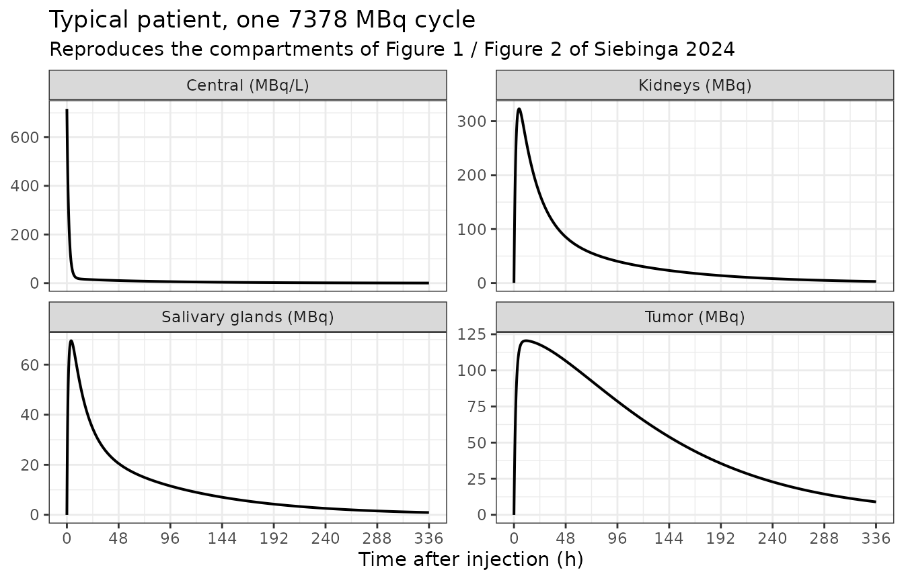
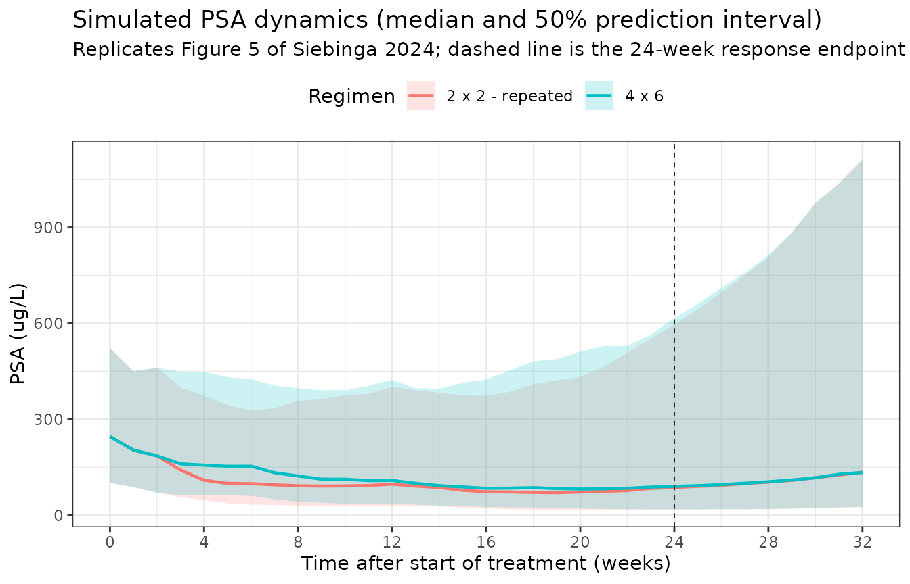

# \[177Lu\]Lu-PSMA-I&T PSA dynamics (Siebinga 2024)

## Model and source

- Citation: Siebinga H, de Wit-van der Veen BJ, de Vries-Huizing DMV,
  Vogel WV, Hendrikx JJMA, Huitema ADR. Quantification of biochemical
  PSA dynamics after radioligand therapy with \[177Lu\]Lu-PSMA-I&T using
  a population pharmacokinetic/pharmacodynamic model. EJNMMI Phys.
  2024;11(1):39. <doi:10.1186/s40658-024-00642-2>
- Article: <https://doi.org/10.1186/s40658-024-00642-2>
- PubMed Central:
  <https://www.ncbi.nlm.nih.gov/pmc/articles/PMC11043318/>

This is the sequel to `Siebinga_2023_lu177psma617` and the first
published PK/PD model that ties radioligand tumor exposure to a
biochemical response measure. The PK layer is a five-compartment
first-order system fitted to 409 quantitative SPECT/CT scans; the PD
layer is a single prostate-specific antigen (PSA) state fitted
sequentially to 566 PSA observations.

The structure (Figure 1 of the paper):

| Paper index | Compartment | nlmixr2lib state | Observed as |
|----|----|----|----|
| 1 | Central | `central` | `Cc` (MBq/L) |
| 2 | Salivary glands (lumped) | `salivary_gland` | `Asalivary_gland` (MBq) |
| 3 | Kidneys (lumped) | `kidney` | `Akidney` (MBq) |
| 4 | Tumor lesions (lumped) | `tumor` | `Atumor` (MBq) |
| 5 | Remaining tissues (lumped) | `other` | not observed |
| – | Effect compartment | `effect` | not observed |
| – | PSA | `PSA` | `PSA` (ug/L) |

Only the central compartment has a volume (`V1` = 10.3 L, fixed), so it
is observed as a concentration and every tissue as a decay-corrected
radioactivity amount. Salivary-gland uptake is the only saturable
process. The PD layer is Equation 12,

    d(PSA)/dt = kG * PSA - (Edrug + Edelayed) * PSA

with a direct effect linear in the tumor activity concentration
(`Edrug = kD,direct * Ctumor`, Equation 9) and a delayed effect linear
in an effect-compartment concentration equilibrating at `ke0`.

``` r

mod <- readModelDb("Siebinga_2024_lu177psmaIT")
ui <- rxode2::rxode(mod)
#> ℹ parameter labels from comments will be replaced by 'label()'
#> Warning: some etas defaulted to non-mu referenced, possible parsing error: etaiov_kin_tumor_1, etaiov_kin_tumor_2, etaiov_kin_tumor_3, etaiov_kin_tumor_4, etaiov_kin_tumor_5, etaiov_kin_tumor_6, etaiov_kin_tumor_7, etaiov_kin_tumor_8
#> as a work-around try putting the mu-referenced expression on a simple line
ui
#>  ── rxode2-based free-form 7-cmt ODE model ────────────────────────────────────── 
#>  ── Initalization: ──  
#> Fixed Effects ($theta): 
#>                         lkel                          lvc 
#>                    -1.374366                     2.332144 
#>          lkin_salivary_gland         lkout_salivary_gland 
#>                    -4.556380                    -2.766209 
#>                        lbmax                  lkin_kidney 
#>                     4.897840                    -3.438899 
#>                 lkout_kidney                   lkin_tumor 
#>                    -2.772589                    -4.638727 
#>                  lkout_tumor                   lkin_other 
#>                    -4.199705                    -1.290984 
#>                  lkout_other          e_tum_vol_kin_tumor 
#>                    -3.700952                     1.080000 
#> e_tum_vol_kin_salivary_gland           e_cycle2_kin_tumor 
#>                     0.091000                     0.731000 
#>           e_cycle3_kin_tumor          e_cycle47_kin_tumor 
#>                     0.498000                     0.436000 
#>                      e_wt_vc                       e_wt_k 
#>                     1.000000                    -0.250000 
#>                        rbase              e_tum_vol_rbase 
#>                   140.000000                    57.500000 
#>                       lkgrow                   lkd_direct 
#>                    -7.804243                    -5.698795 
#>                         lke0                    lkd_delay 
#>                    -6.660895                   -10.325082 
#>                boxcox_lkgrow                       propSd 
#>                    -0.822000                     0.555000 
#>                        addSd       propSd_Asalivary_gland 
#>                     9.570000                     0.397000 
#>               propSd_Akidney                propSd_Atumor 
#>                     0.319000                     0.327000 
#>                   propSd_PSA 
#>                     0.293000 
#> 
#> Omega ($omega): 
#>                      etalkel etalkin_kidney etalkin_tumor etalkin_other
#> etalkel            0.1039644      0.0000000     0.0000000     0.0000000
#> etalkin_kidney     0.0000000      0.1057608     0.0000000     0.0000000
#> etalkin_tumor      0.0000000      0.0000000     0.3378684     0.0000000
#> etalkin_other      0.0000000      0.0000000     0.0000000     0.0812859
#> etalbmax           0.0000000      0.0000000     0.0000000     0.0000000
#> etarbase           0.0000000      0.0000000     0.0000000     0.0000000
#> etalkgrow          0.0000000      0.0000000     0.0000000     0.0000000
#> etalkd_direct      0.0000000      0.0000000     0.0000000     0.0000000
#> etalkd_delay       0.0000000      0.0000000     0.0000000     0.0000000
#> etaiov_kin_tumor_1 0.0000000      0.0000000     0.0000000     0.0000000
#> etaiov_kin_tumor_2 0.0000000      0.0000000     0.0000000     0.0000000
#> etaiov_kin_tumor_3 0.0000000      0.0000000     0.0000000     0.0000000
#> etaiov_kin_tumor_4 0.0000000      0.0000000     0.0000000     0.0000000
#> etaiov_kin_tumor_5 0.0000000      0.0000000     0.0000000     0.0000000
#> etaiov_kin_tumor_6 0.0000000      0.0000000     0.0000000     0.0000000
#> etaiov_kin_tumor_7 0.0000000      0.0000000     0.0000000     0.0000000
#> etaiov_kin_tumor_8 0.0000000      0.0000000     0.0000000     0.0000000
#>                     etalbmax etarbase etalkgrow etalkd_direct etalkd_delay
#> etalkel            0.0000000  0.00000 0.0000000      0.000000    0.0000000
#> etalkin_kidney     0.0000000  0.00000 0.0000000      0.000000    0.0000000
#> etalkin_tumor      0.0000000  0.00000 0.0000000      0.000000    0.0000000
#> etalkin_other      0.0000000  0.00000 0.0000000      0.000000    0.0000000
#> etalbmax           0.3708046  0.00000 0.0000000      0.000000    0.0000000
#> etarbase           0.0000000  1.43606 0.0000000      0.000000    0.0000000
#> etalkgrow          0.0000000  0.00000 0.6022817      0.000000    0.0000000
#> etalkd_direct      0.0000000  0.00000 0.0000000      1.085189    0.0000000
#> etalkd_delay       0.0000000  0.00000 0.0000000      0.000000    0.5685047
#> etaiov_kin_tumor_1 0.0000000  0.00000 0.0000000      0.000000    0.0000000
#> etaiov_kin_tumor_2 0.0000000  0.00000 0.0000000      0.000000    0.0000000
#> etaiov_kin_tumor_3 0.0000000  0.00000 0.0000000      0.000000    0.0000000
#> etaiov_kin_tumor_4 0.0000000  0.00000 0.0000000      0.000000    0.0000000
#> etaiov_kin_tumor_5 0.0000000  0.00000 0.0000000      0.000000    0.0000000
#> etaiov_kin_tumor_6 0.0000000  0.00000 0.0000000      0.000000    0.0000000
#> etaiov_kin_tumor_7 0.0000000  0.00000 0.0000000      0.000000    0.0000000
#> etaiov_kin_tumor_8 0.0000000  0.00000 0.0000000      0.000000    0.0000000
#>                    etaiov_kin_tumor_1 etaiov_kin_tumor_2 etaiov_kin_tumor_3
#> etalkel                     0.0000000          0.0000000          0.0000000
#> etalkin_kidney              0.0000000          0.0000000          0.0000000
#> etalkin_tumor               0.0000000          0.0000000          0.0000000
#> etalkin_other               0.0000000          0.0000000          0.0000000
#> etalbmax                    0.0000000          0.0000000          0.0000000
#> etarbase                    0.0000000          0.0000000          0.0000000
#> etalkgrow                   0.0000000          0.0000000          0.0000000
#> etalkd_direct               0.0000000          0.0000000          0.0000000
#> etalkd_delay                0.0000000          0.0000000          0.0000000
#> etaiov_kin_tumor_1          0.1335549          0.0000000          0.0000000
#> etaiov_kin_tumor_2          0.0000000          0.1335549          0.0000000
#> etaiov_kin_tumor_3          0.0000000          0.0000000          0.1335549
#> etaiov_kin_tumor_4          0.0000000          0.0000000          0.0000000
#> etaiov_kin_tumor_5          0.0000000          0.0000000          0.0000000
#> etaiov_kin_tumor_6          0.0000000          0.0000000          0.0000000
#> etaiov_kin_tumor_7          0.0000000          0.0000000          0.0000000
#> etaiov_kin_tumor_8          0.0000000          0.0000000          0.0000000
#>                    etaiov_kin_tumor_4 etaiov_kin_tumor_5 etaiov_kin_tumor_6
#> etalkel                     0.0000000          0.0000000          0.0000000
#> etalkin_kidney              0.0000000          0.0000000          0.0000000
#> etalkin_tumor               0.0000000          0.0000000          0.0000000
#> etalkin_other               0.0000000          0.0000000          0.0000000
#> etalbmax                    0.0000000          0.0000000          0.0000000
#> etarbase                    0.0000000          0.0000000          0.0000000
#> etalkgrow                   0.0000000          0.0000000          0.0000000
#> etalkd_direct               0.0000000          0.0000000          0.0000000
#> etalkd_delay                0.0000000          0.0000000          0.0000000
#> etaiov_kin_tumor_1          0.0000000          0.0000000          0.0000000
#> etaiov_kin_tumor_2          0.0000000          0.0000000          0.0000000
#> etaiov_kin_tumor_3          0.0000000          0.0000000          0.0000000
#> etaiov_kin_tumor_4          0.1335549          0.0000000          0.0000000
#> etaiov_kin_tumor_5          0.0000000          0.1335549          0.0000000
#> etaiov_kin_tumor_6          0.0000000          0.0000000          0.1335549
#> etaiov_kin_tumor_7          0.0000000          0.0000000          0.0000000
#> etaiov_kin_tumor_8          0.0000000          0.0000000          0.0000000
#>                    etaiov_kin_tumor_7 etaiov_kin_tumor_8
#> etalkel                     0.0000000          0.0000000
#> etalkin_kidney              0.0000000          0.0000000
#> etalkin_tumor               0.0000000          0.0000000
#> etalkin_other               0.0000000          0.0000000
#> etalbmax                    0.0000000          0.0000000
#> etarbase                    0.0000000          0.0000000
#> etalkgrow                   0.0000000          0.0000000
#> etalkd_direct               0.0000000          0.0000000
#> etalkd_delay                0.0000000          0.0000000
#> etaiov_kin_tumor_1          0.0000000          0.0000000
#> etaiov_kin_tumor_2          0.0000000          0.0000000
#> etaiov_kin_tumor_3          0.0000000          0.0000000
#> etaiov_kin_tumor_4          0.0000000          0.0000000
#> etaiov_kin_tumor_5          0.0000000          0.0000000
#> etaiov_kin_tumor_6          0.0000000          0.0000000
#> etaiov_kin_tumor_7          0.1335549          0.0000000
#> etaiov_kin_tumor_8          0.0000000          0.1335549
#> attr(,"lotriLabels")
#>  [1] "Table 2 IIV k10  = 33.1% CV -> log(0.331^2 + 1)"                                          
#>  [2] "Table 2 IIV k13  = 33.4% CV -> log(0.334^2 + 1)"                                          
#>  [3] "Table 2 IIV k14  = 63.4% CV -> log(0.634^2 + 1)"                                          
#>  [4] "Table 2 IIV k15  = 29.1% CV -> log(0.291^2 + 1)"                                          
#>  [5] "Table 2 IIV Bmax compartment 2 = 67.0% CV -> log(0.670^2 + 1)"                            
#>  [6] "Table 3 IIV baseline PSA = 179% CV -> log(1.79^2 + 1)"                                    
#>  [7] "Table 3 IIV kG = 90.9% CV -> log(0.909^2 + 1); this eta is Box-Cox transformed in model()"
#>  [8] "Table 3 IIV kD,direct = 140% CV -> log(1.40^2 + 1)"                                       
#>  [9] "Table 3 IIV kD,delay = 87.5% CV -> log(0.875^2 + 1)"                                      
#> [10] NA                                                                                         
#> [11] NA                                                                                         
#> [12] NA                                                                                         
#> [13] NA                                                                                         
#> [14] NA                                                                                         
#> [15] NA                                                                                         
#> [16] NA                                                                                         
#> [17] NA                                                                                         
#> attr(,"lotriFix")
#>                    etalkel etalkin_kidney etalkin_tumor etalkin_other etalbmax
#> etalkel              FALSE          FALSE         FALSE         FALSE    FALSE
#> etalkin_kidney       FALSE          FALSE         FALSE         FALSE    FALSE
#> etalkin_tumor        FALSE          FALSE         FALSE         FALSE    FALSE
#> etalkin_other        FALSE          FALSE         FALSE         FALSE    FALSE
#> etalbmax             FALSE          FALSE         FALSE         FALSE    FALSE
#> etarbase             FALSE          FALSE         FALSE         FALSE    FALSE
#> etalkgrow            FALSE          FALSE         FALSE         FALSE    FALSE
#> etalkd_direct        FALSE          FALSE         FALSE         FALSE    FALSE
#> etalkd_delay         FALSE          FALSE         FALSE         FALSE    FALSE
#> etaiov_kin_tumor_1   FALSE          FALSE         FALSE         FALSE    FALSE
#> etaiov_kin_tumor_2   FALSE          FALSE         FALSE         FALSE    FALSE
#> etaiov_kin_tumor_3   FALSE          FALSE         FALSE         FALSE    FALSE
#> etaiov_kin_tumor_4   FALSE          FALSE         FALSE         FALSE    FALSE
#> etaiov_kin_tumor_5   FALSE          FALSE         FALSE         FALSE    FALSE
#> etaiov_kin_tumor_6   FALSE          FALSE         FALSE         FALSE    FALSE
#> etaiov_kin_tumor_7   FALSE          FALSE         FALSE         FALSE    FALSE
#> etaiov_kin_tumor_8   FALSE          FALSE         FALSE         FALSE    FALSE
#>                    etarbase etalkgrow etalkd_direct etalkd_delay
#> etalkel               FALSE     FALSE         FALSE        FALSE
#> etalkin_kidney        FALSE     FALSE         FALSE        FALSE
#> etalkin_tumor         FALSE     FALSE         FALSE        FALSE
#> etalkin_other         FALSE     FALSE         FALSE        FALSE
#> etalbmax              FALSE     FALSE         FALSE        FALSE
#> etarbase              FALSE     FALSE         FALSE        FALSE
#> etalkgrow             FALSE     FALSE         FALSE        FALSE
#> etalkd_direct         FALSE     FALSE         FALSE        FALSE
#> etalkd_delay          FALSE     FALSE         FALSE        FALSE
#> etaiov_kin_tumor_1    FALSE     FALSE         FALSE        FALSE
#> etaiov_kin_tumor_2    FALSE     FALSE         FALSE        FALSE
#> etaiov_kin_tumor_3    FALSE     FALSE         FALSE        FALSE
#> etaiov_kin_tumor_4    FALSE     FALSE         FALSE        FALSE
#> etaiov_kin_tumor_5    FALSE     FALSE         FALSE        FALSE
#> etaiov_kin_tumor_6    FALSE     FALSE         FALSE        FALSE
#> etaiov_kin_tumor_7    FALSE     FALSE         FALSE        FALSE
#> etaiov_kin_tumor_8    FALSE     FALSE         FALSE        FALSE
#>                    etaiov_kin_tumor_1 etaiov_kin_tumor_2 etaiov_kin_tumor_3
#> etalkel                         FALSE              FALSE              FALSE
#> etalkin_kidney                  FALSE              FALSE              FALSE
#> etalkin_tumor                   FALSE              FALSE              FALSE
#> etalkin_other                   FALSE              FALSE              FALSE
#> etalbmax                        FALSE              FALSE              FALSE
#> etarbase                        FALSE              FALSE              FALSE
#> etalkgrow                       FALSE              FALSE              FALSE
#> etalkd_direct                   FALSE              FALSE              FALSE
#> etalkd_delay                    FALSE              FALSE              FALSE
#> etaiov_kin_tumor_1              FALSE              FALSE              FALSE
#> etaiov_kin_tumor_2              FALSE               TRUE              FALSE
#> etaiov_kin_tumor_3              FALSE              FALSE               TRUE
#> etaiov_kin_tumor_4              FALSE              FALSE              FALSE
#> etaiov_kin_tumor_5              FALSE              FALSE              FALSE
#> etaiov_kin_tumor_6              FALSE              FALSE              FALSE
#> etaiov_kin_tumor_7              FALSE              FALSE              FALSE
#> etaiov_kin_tumor_8              FALSE              FALSE              FALSE
#>                    etaiov_kin_tumor_4 etaiov_kin_tumor_5 etaiov_kin_tumor_6
#> etalkel                         FALSE              FALSE              FALSE
#> etalkin_kidney                  FALSE              FALSE              FALSE
#> etalkin_tumor                   FALSE              FALSE              FALSE
#> etalkin_other                   FALSE              FALSE              FALSE
#> etalbmax                        FALSE              FALSE              FALSE
#> etarbase                        FALSE              FALSE              FALSE
#> etalkgrow                       FALSE              FALSE              FALSE
#> etalkd_direct                   FALSE              FALSE              FALSE
#> etalkd_delay                    FALSE              FALSE              FALSE
#> etaiov_kin_tumor_1              FALSE              FALSE              FALSE
#> etaiov_kin_tumor_2              FALSE              FALSE              FALSE
#> etaiov_kin_tumor_3              FALSE              FALSE              FALSE
#> etaiov_kin_tumor_4               TRUE              FALSE              FALSE
#> etaiov_kin_tumor_5              FALSE               TRUE              FALSE
#> etaiov_kin_tumor_6              FALSE              FALSE               TRUE
#> etaiov_kin_tumor_7              FALSE              FALSE              FALSE
#> etaiov_kin_tumor_8              FALSE              FALSE              FALSE
#>                    etaiov_kin_tumor_7 etaiov_kin_tumor_8
#> etalkel                         FALSE              FALSE
#> etalkin_kidney                  FALSE              FALSE
#> etalkin_tumor                   FALSE              FALSE
#> etalkin_other                   FALSE              FALSE
#> etalbmax                        FALSE              FALSE
#> etarbase                        FALSE              FALSE
#> etalkgrow                       FALSE              FALSE
#> etalkd_direct                   FALSE              FALSE
#> etalkd_delay                    FALSE              FALSE
#> etaiov_kin_tumor_1              FALSE              FALSE
#> etaiov_kin_tumor_2              FALSE              FALSE
#> etaiov_kin_tumor_3              FALSE              FALSE
#> etaiov_kin_tumor_4              FALSE              FALSE
#> etaiov_kin_tumor_5              FALSE              FALSE
#> etaiov_kin_tumor_6              FALSE              FALSE
#> etaiov_kin_tumor_7               TRUE              FALSE
#> etaiov_kin_tumor_8              FALSE               TRUE
#> 
#> States ($state or $stateDf): 
#>   Compartment Number Compartment Name
#> 1                  1          central
#> 2                  2   salivary_gland
#> 3                  3           kidney
#> 4                  4            tumor
#> 5                  5            other
#> 6                  6           effect
#> 7                  7              PSA
#>  ── Multiple Endpoint Model ($multipleEndpoint): ──  
#>              variable                            cmt
#> 1              Cc ~ …              cmt='Cc' or cmt=8
#> 2 Asalivary_gland ~ … cmt='Asalivary_gland' or cmt=9
#> 3         Akidney ~ …        cmt='Akidney' or cmt=10
#> 4          Atumor ~ …         cmt='Atumor' or cmt=11
#> 5             PSA ~ …             cmt='PSA' or cmt=7
#>                              dvid*
#> 1              dvid='Cc' or dvid=1
#> 2 dvid='Asalivary_gland' or dvid=2
#> 3         dvid='Akidney' or dvid=3
#> 4          dvid='Atumor' or dvid=4
#> 5             dvid='PSA' or dvid=5
#>   * If dvids are outside this range, all dvids are re-numered sequentially, ie 1,7, 10 becomes 1,2,3 etc
#> 
#>  ── μ-referencing ($muRefTable): ──  
#>         theta            eta level
#> 1        lkel        etalkel    id
#> 2       lbmax       etalbmax    id
#> 3 lkin_kidney etalkin_kidney    id
#> 4  lkin_tumor  etalkin_tumor    id
#> 5  lkin_other  etalkin_other    id
#> 6  lkd_direct  etalkd_direct    id
#> 7   lkd_delay   etalkd_delay    id
#> 
#>  ── Model (Normalized Syntax): ── 
#> function() {
#>     compartmentData <- list(central = list(analyte = "[177Lu]Lu-PSMA-I&T radioactivity", 
#>         units = "MBq", specimen = "whole blood", verified = TRUE), 
#>         salivary_gland = list(analyte = "[177Lu]Lu-PSMA-I&T radioactivity", 
#>             units = "MBq", specimen = "tissue", verified = TRUE), 
#>         kidney = list(analyte = "[177Lu]Lu-PSMA-I&T radioactivity", 
#>             units = "MBq", specimen = "tissue", verified = TRUE), 
#>         tumor = list(analyte = "[177Lu]Lu-PSMA-I&T radioactivity", 
#>             units = "MBq", specimen = "tumor", verified = TRUE), 
#>         other = list(analyte = "[177Lu]Lu-PSMA-I&T radioactivity", 
#>             units = "MBq", specimen = "tissue", verified = FALSE), 
#>         effect = list(analyte = "[177Lu]Lu-PSMA-I&T effect-compartment activity concentration", 
#>             units = "MBq/L", specimen = "not applicable", verified = FALSE), 
#>         PSA = list(analyte = "prostate-specific antigen", units = "ug/L", 
#>             specimen = "serum", verified = TRUE))
#>     covariateData <- list(WT = list(description = "Total body weight at baseline (Table 1 median 79 kg, range 61-116).", 
#>         units = "kg", type = "continuous", reference_category = NULL, 
#>         notes = "Allometric scaling was added to all PK parameters (Results, 'Population pharmacokinetic model'; dOFV -11.3). Methods state that body weight was scaled 'in relation to the median body weight, where exponents for volume of distribution (V) and rate constants (k) were set to 1 and -0.25 respectively', so both exponents are fixed a priori rather than estimated and the reference is the Table 1 median of 79 kg. Bmax is neither a volume nor a rate constant and the paper names only V and k, so Bmax is left unscaled. Baseline value, held constant per subject.", 
#>         source_name = "Weight"), TUM_VOL = list(description = "Tumor volume of the segmented (target) lesions, determined on pre-treatment diagnostic PSMA-PET/CT with a 45% SULmax threshold. Reported in L in Table 1 (median 0.0443 L, range 0.000122-0.546); carried here in the canonical mm^3 (1 L = 1e6 mm^3), so the reference is 44300 mm^3.", 
#>         units = "mm^3", type = "continuous", reference_category = NULL, 
#>         notes = "Enters three places. (1) Tumor uptake rate as a power function (Table 2 'Tumor volume on k14' = 1.08); the paper's own check is that a two-fold volume gives a 2.11-fold uptake rate, and 2^1.08 = 2.114. (2) Salivary-gland uptake rate as a power function (Table 2 'Tumor volume on k12' = 0.0910). (3) Baseline PSA as a linear function (Table 3, 57.5 ug/L). The same volume also converts the tumor radioactivity amount to the concentration that drives the PD layer. Only target-lesion volume was available, not total tumor volume (Methods, 'Pharmacokinetic model development'). Baseline value, held constant per subject.", 
#>         source_name = "Tumor volume of segmented tumors"), CYCLE = list(description = "Treatment-cycle number (1 = first ~7.4 GBq administration). Patients received up to eight cycles (Table 1).", 
#>         units = "(count)", type = "count", reference_category = NULL, 
#>         notes = "Carries two distinct effects on the tumor uptake rate constant and is decomposed inside model() into binary indicators rather than entering as an integer. (1) The structural cycle effect of Equation 8: uptake in each cycle is a fraction of the cycle-1 uptake, with cycles 4 and later lumped into a single level because few patients received more than four cycles (Table 2: 0.731, 0.498, 0.436 for cycles 2, 3 and 4-7). (2) The occasion index for interoccasion variability, which the paper added only to the tumor uptake rate (Table 2 IOV k14 = 37.8% CV). Occasions 1-8 are provided to cover the observed range of cycles.", 
#>         source_name = "Number of cycles received"))
#>     covariatesDataExcluded <- list(CRCL = list(description = "Glomerular filtration rate estimated with the Cockcroft-Gault equation (Table 1 median 80.9 mL/min, range 25.9-181).", 
#>         units = "mL/min", type = "continuous", notes = "Tested as a linear covariate on the renal excretion rate constant k10, which the paper considered pharmacologically the most suitable form because glomerular filtration is the only elimination route. It was not retained: 'Serum creatinine clearance was not identified as a covariate on k10, since the OFV and model fit did not improve (dOFV -0.207)' (Results). No coefficient is reported, so the effect cannot be encoded. Note that the predecessor [177Lu]Lu-PSMA-617 model (Siebinga_2023_lu177psma617.R) did scale k10 by CRCL a priori.", 
#>         source_name = "GFR (calculated using Cockcroft Gault)"), 
#>         AGE = list(description = "Age at baseline (Table 1 median 73 years, range 48-91).", 
#>             units = "years", type = "continuous", notes = "Tested as a power and a linear covariate on baseline PSA on the hypothesis that age tracks disease severity; not retained ('Age did not explain IIV on the baseline PSA (dOFV -1.01)', Results). No coefficient is reported.", 
#>             source_name = "Age"), HCT = list(description = "Hematocrit at baseline (Table 1 median 0.35, range 0.22-0.44).", 
#>             units = "(fraction)", type = "continuous", notes = "Reported among the baseline characteristics in Table 1 but never tested as a covariate and not part of any model.", 
#>             source_name = "Hematocrit"))
#>     description <- "Five-compartment population PK model with a sequentially fitted PSA pharmacodynamic layer for the PSMA-targeted radioligand [177Lu]Lu-PSMA-I&T in men with metastatic castration-resistant prostate cancer treated with ~7.4 GBq per cycle. PK states are central (1), salivary glands (2), kidneys (3), tumor lesions (4) and a lumped remaining-tissue compartment (5); the tissue states carry radioactivity amounts (MBq) and the central state is observed as a concentration (MBq/L) through a fixed volume V1 = 10.3 L. Renal excretion leaves the central compartment (k10 = 0.253 1/h, i.e. 2.61 L/h). Salivary-gland uptake is saturable (Bmax 134 MBq); all other exchange is first order. Tumor uptake carries a power effect of segmented tumor volume (exponent 1.08), a structural decline over treatment cycles (73%, 50% and 44% of the cycle-1 rate in cycles 2, 3 and 4-7), interindividual variability (63.4% CV) and interoccasion variability across cycles (37.8% CV), and salivary-gland uptake carries a weak tumor-volume power effect. All PK parameters are allometrically scaled to the 79 kg median body weight. The PD layer is a single PSA state growing exponentially (kG 0.000408 1/h) and eliminated by a direct effect linear in the physical tumor activity concentration plus a delayed effect linear in an effect-compartment concentration (ke0 0.00128 1/h). Baseline PSA is fixed at 140 ug/L with a linear tumor-volume effect. Every state carries a decay-corrected radioactivity amount, matching the source SPECT/CT data and the predecessor [177Lu]Lu-PSMA-617 model."
#>     population <- list(species = "human", n_subjects = 76, n_studies = 1, 
#>         age_range = "48-91 years", age_median = "73 years", weight_range = "61-116 kg", 
#>         weight_median = "79 kg", sex_female_pct = 0, disease_state = "Metastatic castration-resistant prostate cancer with PSMA-positive lesions on pre-treatment diagnostic [68Ga]Ga-PSMA PET/CT and no PSMA-negative lesions on contrast-enhanced CT (VISION criteria). Baseline PSA median 260 ug/L (0.12-4896); segmented target-tumor volume median 0.0443 L (0.000122-0.546); hematocrit median 0.35.", 
#>         renal_function = "Cockcroft-Gault GFR median 80.9 mL/min (range 25.9-181)", 
#>         dose_range = "Intravenous [177Lu]Lu-PSMA-I&T, median injected activity 7378 MBq (5605-7763) per cycle, up to eight cycles. Two schedules were used: four cycles six weeks apart ('4 x 6', n = 10) and two cycles two weeks apart repeated after twelve weeks ('2 x 2 - repeated after twelve weeks', n = 66).", 
#>         regions = "Netherlands (Netherlands Cancer Institute / Antoni van Leeuwenhoek; IRBd21288)", 
#>         notes = "Retrospective cohort treated September 2019 to January 2023. The PK model was built on 409 quantitative SPECT/CT scans from 76 patients (3 of 79 screened patients had only lesions < 20 mm and were excluded); scans were acquired at 4.6 +/- 0.95 h, 23.8 +/- 4.5 h and 6.8 +/- 0.46 days post injection. Kidney, salivary-gland and tumor readings were lumped into one state each; whole-body data were not available. All radioactivity data were corrected for decay back to the time of injection, and SPECT-derived blood concentrations were recalibrated with the [177Lu]Lu-PSMA-617 regression (intercept 6.27 MBq/L, slope 0.828) taken from the predecessor model. The PD layer was fitted sequentially to 566 PSA observations.")
#>     reference <- "Siebinga H, de Wit-van der Veen BJ, de Vries-Huizing DMV, Vogel WV, Hendrikx JJMA, Huitema ADR. Quantification of biochemical PSA dynamics after radioligand therapy with [177Lu]Lu-PSMA-I&T using a population pharmacokinetic/pharmacodynamic model. EJNMMI Phys. 2024;11(1):39. doi:10.1186/s40658-024-00642-2"
#>     units <- list(time = "h", dosing = "MBq", concentration = "MBq/L")
#>     vignette <- "Siebinga_2024_lu177psmaIT"
#>     ini({
#>         lkel <- -1.37436579025462
#>         label("Renal excretion rate constant from central, k10 (1/h)")
#>         lvc <- fix(2.33214389523559)
#>         label("Central volume of distribution, V1 (L)")
#>         lkin_salivary_gland <- -4.55638002181866
#>         label("Central-to-salivary-gland uptake rate constant, k12 (1/h)")
#>         lkout_salivary_gland <- -2.76620911527574
#>         label("Salivary-gland-to-central rate constant, k21 (1/h)")
#>         lbmax <- 4.89783979995091
#>         label("Maximum salivary-gland binding capacity, Bmax (MBq)")
#>         lkin_kidney <- -3.43889924884617
#>         label("Central-to-kidney uptake rate constant, k13 (1/h)")
#>         lkout_kidney <- -2.77258872223978
#>         label("Kidney-to-central rate constant, k31 (1/h)")
#>         lkin_tumor <- -4.63872696951693
#>         label("Central-to-tumor uptake rate constant, k14 (1/h)")
#>         lkout_tumor <- -4.19970507787993
#>         label("Tumor-to-central rate constant, k41 (1/h)")
#>         lkin_other <- -1.29098418131557
#>         label("Central-to-remaining-tissue rate constant, k15 (1/h)")
#>         lkout_other <- -3.70095203534821
#>         label("Remaining-tissue-to-central rate constant, k51 (1/h)")
#>         e_tum_vol_kin_tumor <- 1.08
#>         label("Power exponent of segmented tumor volume on kin_tumor (unitless)")
#>         e_tum_vol_kin_salivary_gland <- 0.091
#>         label("Power exponent of segmented tumor volume on kin_salivary_gland (unitless)")
#>         e_cycle2_kin_tumor <- 0.731
#>         label("Fraction of cycle-1 tumor uptake rate retained in cycle 2 (unitless)")
#>         e_cycle3_kin_tumor <- 0.498
#>         label("Fraction of cycle-1 tumor uptake rate retained in cycle 3 (unitless)")
#>         e_cycle47_kin_tumor <- 0.436
#>         label("Fraction of cycle-1 tumor uptake rate retained in cycles 4-7 (unitless)")
#>         e_wt_vc <- fix(1)
#>         label("Allometric exponent of body weight on the central volume (unitless)")
#>         e_wt_k <- fix(-0.25)
#>         label("Allometric exponent of body weight on every rate constant (unitless)")
#>         rbase <- fix(140)
#>         label("Baseline PSA concentration (ug/L)")
#>         e_tum_vol_rbase <- 57.5
#>         label("Linear effect of segmented tumor volume on baseline PSA (ug/L)")
#>         lkgrow <- -7.80424338356011
#>         label("First-order exponential PSA growth rate, kG (1/h)")
#>         lkd_direct <- -5.69879493314516
#>         label("Direct drug-induced PSA elimination coefficient, kD,direct (L/day/GBq)")
#>         lke0 <- -6.66089520105061
#>         label("Effect-compartment equilibration rate constant, ke0 (1/h)")
#>         lkd_delay <- -10.3250820425742
#>         label("Delayed drug-induced PSA elimination coefficient, kD,delay (L/day/MBq)")
#>         boxcox_lkgrow <- -0.822
#>         label("Box-Cox shape parameter for the interindividual distribution of kG (unitless)")
#>         propSd <- c(0, 0.555)
#>         label("Proportional residual error, central concentration (fraction)")
#>         addSd <- c(0, 9.57)
#>         label("Additive residual error, central concentration (MBq/L)")
#>         propSd_Asalivary_gland <- c(0, 0.397)
#>         label("Proportional residual error, salivary-gland activity (fraction)")
#>         propSd_Akidney <- c(0, 0.319)
#>         label("Proportional residual error, kidney activity (fraction)")
#>         propSd_Atumor <- c(0, 0.327)
#>         label("Proportional residual error, tumor activity (fraction)")
#>         propSd_PSA <- c(0, 0.293)
#>         label("Proportional residual error, PSA (fraction)")
#>         etalkel ~ 0.1039644
#>         label("Table 2 IIV k10  = 33.1% CV -> log(0.331^2 + 1)")
#>         etalkin_kidney ~ 0.1057608
#>         label("Table 2 IIV k13  = 33.4% CV -> log(0.334^2 + 1)")
#>         etalkin_tumor ~ 0.3378684
#>         label("Table 2 IIV k14  = 63.4% CV -> log(0.634^2 + 1)")
#>         etalkin_other ~ 0.0812859
#>         label("Table 2 IIV k15  = 29.1% CV -> log(0.291^2 + 1)")
#>         etalbmax ~ 0.3708046
#>         label("Table 2 IIV Bmax compartment 2 = 67.0% CV -> log(0.670^2 + 1)")
#>         etarbase ~ 1.4360602
#>         label("Table 3 IIV baseline PSA = 179% CV -> log(1.79^2 + 1)")
#>         etalkgrow ~ 0.6022817
#>         label("Table 3 IIV kG = 90.9% CV -> log(0.909^2 + 1); this eta is Box-Cox transformed in model()")
#>         etalkd_direct ~ 1.0851893
#>         label("Table 3 IIV kD,direct = 140% CV -> log(1.40^2 + 1)")
#>         etalkd_delay ~ 0.5685047
#>         label("Table 3 IIV kD,delay = 87.5% CV -> log(0.875^2 + 1)")
#>         etaiov_kin_tumor_1 ~ 0.1335549
#>         etaiov_kin_tumor_2 ~ fix(0.1335549)
#>         etaiov_kin_tumor_3 ~ fix(0.1335549)
#>         etaiov_kin_tumor_4 ~ fix(0.1335549)
#>         etaiov_kin_tumor_5 ~ fix(0.1335549)
#>         etaiov_kin_tumor_6 ~ fix(0.1335549)
#>         etaiov_kin_tumor_7 ~ fix(0.1335549)
#>         etaiov_kin_tumor_8 ~ fix(0.1335549)
#>     })
#>     model({
#>         aloV <- e_wt_vc
#>         aloK <- e_wt_k
#>         rbasePop <- rbase
#>         eTumVolRbase <- e_tum_vol_rbase
#>         bcLambda <- boxcox_lkgrow
#>         cyc2 <- (CYCLE == 2)
#>         cyc3 <- (CYCLE == 3)
#>         cyc47 <- (CYCLE >= 4)
#>         fcyc2 <- e_cycle2_kin_tumor
#>         fcyc3 <- e_cycle3_kin_tumor
#>         fcyc47 <- e_cycle47_kin_tumor
#>         cycleFactor <- fcyc2^cyc2 * fcyc3^cyc3 * fcyc47^cyc47
#>         iov_kin_tumor <- (CYCLE == 1) * etaiov_kin_tumor_1 + 
#>             (CYCLE == 2) * etaiov_kin_tumor_2 + (CYCLE == 3) * 
#>             etaiov_kin_tumor_3 + (CYCLE == 4) * etaiov_kin_tumor_4 + 
#>             (CYCLE == 5) * etaiov_kin_tumor_5 + (CYCLE == 6) * 
#>             etaiov_kin_tumor_6 + (CYCLE == 7) * etaiov_kin_tumor_7 + 
#>             (CYCLE >= 8) * etaiov_kin_tumor_8
#>         alloV <- (WT/79)^aloV
#>         alloK <- (WT/79)^aloK
#>         kel <- exp(lkel + etalkel) * alloK
#>         vc <- exp(lvc) * alloV
#>         kin_salivary_gland <- exp(lkin_salivary_gland) * alloK * 
#>             (TUM_VOL/44300)^e_tum_vol_kin_salivary_gland
#>         kout_salivary_gland <- exp(lkout_salivary_gland) * alloK
#>         bmax <- exp(lbmax + etalbmax)
#>         kin_kidney <- exp(lkin_kidney + etalkin_kidney) * alloK
#>         kout_kidney <- exp(lkout_kidney) * alloK
#>         kin_tumor <- exp(lkin_tumor + etalkin_tumor + iov_kin_tumor) * 
#>             alloK * (TUM_VOL/44300)^e_tum_vol_kin_tumor * cycleFactor
#>         kout_tumor <- exp(lkout_tumor) * alloK
#>         kin_other <- exp(lkin_other + etalkin_other) * alloK
#>         kout_other <- exp(lkout_other) * alloK
#>         basePop <- rbasePop + eTumVolRbase * (TUM_VOL/44300)
#>         psa0 <- basePop * exp(etarbase)
#>         phi_lkgrow <- (exp(etalkgrow)^bcLambda - 1)/bcLambda
#>         kgrow <- exp(lkgrow + phi_lkgrow)
#>         ke0 <- exp(lke0)
#>         kd_direct <- exp(lkd_direct + etalkd_direct)
#>         kd_delay <- exp(lkd_delay + etalkd_delay)
#>         fluxSalivaryGland <- kin_salivary_gland * central * (1 - 
#>             salivary_gland/bmax)
#>         d/dt(central) <- -kel * central - fluxSalivaryGland + 
#>             kout_salivary_gland * salivary_gland - kin_kidney * 
#>             central + kout_kidney * kidney - kin_tumor * central + 
#>             kout_tumor * tumor - kin_other * central + kout_other * 
#>             other
#>         d/dt(salivary_gland) <- fluxSalivaryGland - kout_salivary_gland * 
#>             salivary_gland
#>         d/dt(kidney) <- kin_kidney * central - kout_kidney * 
#>             kidney
#>         d/dt(tumor) <- kin_tumor * central - kout_tumor * tumor
#>         d/dt(other) <- kin_other * central - kout_other * other
#>         vtumor <- TUM_VOL/1e+06
#>         Ctumor <- tumor/vtumor
#>         d/dt(effect) <- ke0 * (Ctumor - effect)
#>         edrug <- kd_direct * Ctumor/1000/24
#>         edelayed <- kd_delay * effect/24
#>         d/dt(PSA) <- kgrow * PSA - (edrug + edelayed) * PSA
#>         PSA(0) <- psa0
#>         Cc <- central/vc
#>         Asalivary_gland <- salivary_gland
#>         Akidney <- kidney
#>         Atumor <- tumor
#>         Cc ~ add(addSd) + prop(propSd)
#>         Asalivary_gland ~ prop(propSd_Asalivary_gland)
#>         Akidney ~ prop(propSd_Akidney)
#>         Atumor ~ prop(propSd_Atumor)
#>         PSA ~ prop(propSd_PSA)
#>     })
#> }
```

## Population

Seventy-six men with metastatic castration-resistant prostate cancer
(mCRPC) treated at the Netherlands Cancer Institute between September
2019 and January 2023 (IRBd21288). All had PSMA-positive lesions on
diagnostic \[68Ga\]Ga-PSMA PET/CT and no PSMA-negative lesions on
contrast-enhanced CT, per the VISION criteria. Median age 73 years
(48-91), weight 79 kg (61-116), Cockcroft-Gault GFR 80.9 mL/min
(25.9-181), baseline PSA 260 ug/L (0.12-4896), and segmented
target-tumor volume 0.0443 L (0.000122-0.546) (Table 1).

Two schedules were used clinically: four cycles six weeks apart (“4 x
6”, n = 10, patients 1-10) and two cycles two weeks apart repeated after
twelve weeks (“2 x 2 - repeated after twelve weeks”, n = 66). Median
injected activity was 7378 MBq (5605-7763) per cycle and patients
received up to eight cycles.

``` r

str(ui$meta$population)
#> List of 13
#>  $ species       : chr "human"
#>  $ n_subjects    : num 76
#>  $ n_studies     : num 1
#>  $ age_range     : chr "48-91 years"
#>  $ age_median    : chr "73 years"
#>  $ weight_range  : chr "61-116 kg"
#>  $ weight_median : chr "79 kg"
#>  $ sex_female_pct: num 0
#>  $ disease_state : chr "Metastatic castration-resistant prostate cancer with PSMA-positive lesions on pre-treatment diagnostic [68Ga]Ga"| __truncated__
#>  $ renal_function: chr "Cockcroft-Gault GFR median 80.9 mL/min (range 25.9-181)"
#>  $ dose_range    : chr "Intravenous [177Lu]Lu-PSMA-I&T, median injected activity 7378 MBq (5605-7763) per cycle, up to eight cycles. Tw"| __truncated__
#>  $ regions       : chr "Netherlands (Netherlands Cancer Institute / Antoni van Leeuwenhoek; IRBd21288)"
#>  $ notes         : chr "Retrospective cohort treated September 2019 to January 2023. The PK model was built on 409 quantitative SPECT/C"| __truncated__
```

## Source trace

Every value in `ini()` and every equation in `model()`, with its
location in Siebinga 2024.

| Quantity | Model name | Value | Source |
|----|----|----|----|
| Renal excretion rate | `lkel` | 0.253 1/h | Table 2, k10 |
| Central volume (fixed) | `lvc` | 10.3 L | Table 2, V1, footnote c |
| Central -\> salivary gland | `lkin_salivary_gland` | 0.0105 1/h | Table 2, k12 |
| Salivary gland -\> central | `lkout_salivary_gland` | 0.0629 1/h | Table 2, k21 |
| Central -\> kidney | `lkin_kidney` | 0.0321 1/h | Table 2, k13 |
| Kidney -\> central | `lkout_kidney` | 0.0625 1/h | Table 2, k31 |
| Central -\> tumor | `lkin_tumor` | 0.00967 1/h | Table 2, k14 |
| Tumor -\> central | `lkout_tumor` | 0.0150 1/h | Table 2, k41 |
| Central -\> remaining tissue | `lkin_other` | 0.275 1/h | Table 2, k15 |
| Remaining tissue -\> central | `lkout_other` | 0.0247 1/h | Table 2, k51 |
| Salivary-gland Bmax | `lbmax` | 134 MBq | Table 2 |
| Tumor volume on tumor uptake | `e_tum_vol_kin_tumor` | 1.08 | Table 2, footnote a (Eq. 5) |
| Tumor volume on salivary uptake | `e_tum_vol_kin_salivary_gland` | 0.0910 | Table 2, footnote a (Eq. 5) |
| Cycle-2 uptake fraction | `e_cycle2_kin_tumor` | 0.731 | Table 2, footnote b (Eq. 8) |
| Cycle-3 uptake fraction | `e_cycle3_kin_tumor` | 0.498 | Table 2, footnote b (Eq. 8) |
| Cycle-4-7 uptake fraction | `e_cycle47_kin_tumor` | 0.436 | Table 2, footnote b (Eq. 8) |
| Allometric exponent, volume | `e_wt_vc` | 1 (fixed) | Methods, “Pharmacokinetic model development” |
| Allometric exponent, rates | `e_wt_k` | -0.25 (fixed) | Methods, as above |
| Baseline PSA (fixed) | `rbase` | 140 ug/L | Table 3, footnote a |
| Tumor volume on baseline PSA | `e_tum_vol_rbase` | 57.5 ug/L | Table 3, footnote b (Eq. 6) |
| PSA growth rate | `lkgrow` | 0.000408 1/h | Table 3, kG |
| Direct drug effect | `lkd_direct` | 0.00335 L/day/GBq | Table 3, kD,direct (see Errata) |
| Effect-compartment rate | `lke0` | 0.00128 1/h | Table 3, ke0 |
| Delayed drug effect | `lkd_delay` | 0.0000328 L/day/MBq | Table 3, kD,delay |
| Box-Cox shape on the kG eta | `boxcox_lkgrow` | -0.822 | Table 3 |
| IIV k10 / k13 / k14 / k15 / Bmax | `etalkel` etc. | 33.1 / 33.4 / 63.4 / 29.1 / 67.0 % CV | Table 2 |
| IOV on tumor uptake | `etaiov_kin_tumor_*` | 37.8 % CV | Table 2 |
| IIV baseline PSA / kG / kD,direct / kD,delay | `etarbase` etc. | 179 / 90.9 / 140 / 87.5 % CV | Table 3 |
| Residual error, central | `propSd`, `addSd` | 55.5 % CV, 9.57 MBq/L | Table 2 (Eq. 3) |
| Residual error, tissues | `propSd_A*` | 39.7 / 31.9 / 32.7 % CV | Table 2 (Eq. 4) |
| Residual error, PSA | `propSd_PSA` | 29.3 % CV | Table 3 (Eq. 4) |
| Saturable uptake | `fluxSalivaryGland` | – | Equation 1 |
| Exponential IIV / IOV | – | – | Equation 2 |
| Power covariate model | – | – | Equation 5 |
| Fractional cycle effect | `cycleFactor` | – | Equation 8 |
| Linear direct drug effect | `edrug` | – | Equation 9 |
| PSA turnover | `d/dt(PSA)` | – | Equation 12 |

IIV percentages are converted to log-normal variances as
`omega^2 = log(CV^2 + 1)`, which is the variance implied by the
exponential model of Equation 2.

## Virtual cohort

Original patient data are not publicly available. Two cohorts are built.

The **PK cohort** is a single typical patient (median weight 79 kg,
median segmented tumor volume 0.0443 L = 44300 mm^3) receiving one 7378
MBq cycle, with a dense observation grid so that trapezoidal integration
is accurate. It is used for the deterministic structural checks.

The **PD cohort** is 200 subjects per dosing regimen (the paper
simulated 2000; 200 per arm is the nlmixr2lib cap and is ample, because
the reported endpoints are cohort proportions). Weight is drawn normally
and truncated to the Table 1 range; segmented tumor volume is drawn
log-normally with the Table 1 median and truncated to the Table 1 range,
because the paper reports only median and range. The **same** covariate
draws and the **same** random seed are used for both regimens, so the
two arms share common random numbers and the between-regimen difference
is not swamped by Monte-Carlo noise.

``` r

set.seed(20240426)

n_per_arm <- 200L
week <- 7 * 24

# --- PK cohort: one typical patient, one cycle, dense grid -----------------
tgrid_pk <- sort(unique(c(seq(0, 4, by = 0.05), seq(4, 48, by = 0.5),
                          seq(48, 1008, by = 4))))

pk_endpoints <- tibble::tribble(
  ~cmt,             ~dvid,
  "central",        1L,
  "salivary_gland", 2L,
  "kidney",         3L,
  "tumor",          4L
)

events_pk <- pk_endpoints |>
  tidyr::crossing(time = tgrid_pk) |>
  mutate(id = 1L, amt = NA_real_, evid = 0L) |>
  bind_rows(tibble(id = 1L, time = 0, amt = 7378, evid = 1L,
                   cmt = "central", dvid = NA_integer_)) |>
  mutate(WT = 79, TUM_VOL = 44300, CYCLE = 1L) |>
  arrange(id, time, desc(evid))

# --- PD cohort: 200 subjects per regimen, shared covariates ----------------
subj <- tibble(
  id = seq_len(n_per_arm),
  WT = pmin(pmax(rnorm(n_per_arm, 79, 12), 61), 116),
  TUM_VOL = pmin(pmax(exp(rnorm(n_per_arm, log(44300), 1.6)), 122), 546000)
)

regimens <- list(
  "4 x 6"  = seq(0, by = 6 * week, length.out = 4),
  "2 x 2 - repeated" = c(0, 2 * week, 12 * week, 12 * week + 2 * week)
)

# Observe PSA weekly out to 32 weeks, and force a record exactly at baseline
# and at the 24-week response endpoint.
tgrid_pd <- sort(unique(c(seq(0, 32 * week, by = week), 24 * week)))

make_pd_events <- function(dose_times) {
  doses <- subj |>
    select(id, WT, TUM_VOL) |>
    tidyr::crossing(time = dose_times) |>
    mutate(amt = 7378, evid = 1L, cmt = "central", dvid = NA_integer_)
  obs <- subj |>
    select(id, WT, TUM_VOL) |>
    tidyr::crossing(time = tgrid_pd) |>
    mutate(amt = NA_real_, evid = 0L, cmt = "PSA", dvid = 5L)
  bind_rows(doses, obs) |>
    # CYCLE is time-varying: it counts how many administrations have occurred.
    mutate(CYCLE = pmax(1L, findInterval(time, dose_times - 1e-6))) |>
    arrange(id, time, desc(evid))
}

events_pd <- lapply(regimens, make_pd_events)

stopifnot(
  nrow(events_pk) > 0,
  vapply(events_pd, function(d) length(unique(d$id)) == n_per_arm, logical(1))
)
```

## Simulation

`useLinCmt = FALSE` is required: rxode2’s automatic ODE-to-`linCmt`
conversion corrupts the `dvid` -\> `cmt` mapping for multi-endpoint
models like this one.

``` r

# Typical-value PK profile (all etas zeroed) for the structural checks.
mod_typical <- rxode2::zeroRe(mod)
#> ℹ parameter labels from comments will be replaced by 'label()'
#> Warning: some etas defaulted to non-mu referenced, possible parsing error: etaiov_kin_tumor_1, etaiov_kin_tumor_2, etaiov_kin_tumor_3, etaiov_kin_tumor_4, etaiov_kin_tumor_5, etaiov_kin_tumor_6, etaiov_kin_tumor_7, etaiov_kin_tumor_8
#> as a work-around try putting the mu-referenced expression on a simple line
#> Warning: some etas defaulted to non-mu referenced, possible parsing error: etaiov_kin_tumor_1, etaiov_kin_tumor_2, etaiov_kin_tumor_3, etaiov_kin_tumor_4, etaiov_kin_tumor_5, etaiov_kin_tumor_6, etaiov_kin_tumor_7, etaiov_kin_tumor_8
#> as a work-around try putting the mu-referenced expression on a simple line
sim_pk <- rxode2::rxSolve(
  mod_typical, events = events_pk,
  keep = c("WT", "TUM_VOL", "CYCLE"), useLinCmt = FALSE
) |>
  as.data.frame() |>
  distinct(time, .keep_all = TRUE) |>
  # A single-subject solve returns no `id` column; PKNCA needs one.
  mutate(id = 1L)
#> ℹ omega/sigma items treated as zero: 'etalkel', 'etalkin_kidney', 'etalkin_tumor', 'etalkin_other', 'etalbmax', 'etarbase', 'etalkgrow', 'etalkd_direct', 'etalkd_delay', 'etaiov_kin_tumor_1', 'etaiov_kin_tumor_2', 'etaiov_kin_tumor_3', 'etaiov_kin_tumor_4', 'etaiov_kin_tumor_5', 'etaiov_kin_tumor_6', 'etaiov_kin_tumor_7', 'etaiov_kin_tumor_8'

# Population PD simulation. Reseeding immediately before each solve gives the
# two regimens common random numbers over identical covariates.
solve_pd <- function(ev, label, seed = 20240426) {
  set.seed(seed)
  out <- rxode2::rxSolve(
    mod, events = ev, keep = c("WT", "TUM_VOL", "CYCLE"),
    useLinCmt = FALSE
  ) |>
    as.data.frame()
  stopifnot(length(unique(out$id)) == n_per_arm)   # rxSolve can silently drop subjects
  out$regimen <- label
  out
}

sim_pd <- bind_rows(Map(solve_pd, events_pd, names(events_pd)))
#> ℹ parameter labels from comments will be replaced by 'label()'
#> Warning: some etas defaulted to non-mu referenced, possible parsing error: etaiov_kin_tumor_1, etaiov_kin_tumor_2, etaiov_kin_tumor_3, etaiov_kin_tumor_4, etaiov_kin_tumor_5, etaiov_kin_tumor_6, etaiov_kin_tumor_7, etaiov_kin_tumor_8
#> as a work-around try putting the mu-referenced expression on a simple line
```

## Replicate published figures

### Figure 1 – radioligand disposition in the four observed compartments

``` r

sim_pk |>
  select(time, Cc, Asalivary_gland, Akidney, Atumor) |>
  tidyr::pivot_longer(-time, names_to = "channel", values_to = "value") |>
  filter(time <= 336) |>
  mutate(channel = recode(channel,
    Cc = "Central (MBq/L)", Asalivary_gland = "Salivary glands (MBq)",
    Akidney = "Kidneys (MBq)", Atumor = "Tumor (MBq)")) |>
  ggplot(aes(time, value)) +
  geom_line(linewidth = 0.7) +
  facet_wrap(~channel, scales = "free_y") +
  scale_x_continuous(breaks = seq(0, 336, by = 48)) +
  labs(x = "Time after injection (h)", y = NULL,
       title = "Typical patient, one 7378 MBq cycle",
       subtitle = "Reproduces the compartments of Figure 1 / Figure 2 of Siebinga 2024") +
  theme_bw()
```



### The cycle effect on tumor uptake

The paper’s headline PK finding is that tumor uptake declines over
cycles, to 73%, 50% and 44% of the cycle-1 rate in cycles 2, 3 and 4-7
(Table 2, Equation 8). Reading the tumor uptake rate constant back out
of the packaged model confirms the encoding.

``` r

cycle_check <- lapply(1:4, function(cy) {
  ev <- events_pk |> mutate(CYCLE = cy)
  rxode2::rxSolve(mod_typical, events = ev, useLinCmt = FALSE) |>
    as.data.frame() |>
    summarise(cycle = cy, kin_tumor = first(kin_tumor))
}) |>
  bind_rows() |>
  mutate(
    fraction_of_cycle1 = kin_tumor / kin_tumor[cycle == 1],
    published = c(1, 0.731, 0.498, 0.436)
  )
#> ℹ omega/sigma items treated as zero: 'etalkel', 'etalkin_kidney', 'etalkin_tumor', 'etalkin_other', 'etalbmax', 'etarbase', 'etalkgrow', 'etalkd_direct', 'etalkd_delay', 'etaiov_kin_tumor_1', 'etaiov_kin_tumor_2', 'etaiov_kin_tumor_3', 'etaiov_kin_tumor_4', 'etaiov_kin_tumor_5', 'etaiov_kin_tumor_6', 'etaiov_kin_tumor_7', 'etaiov_kin_tumor_8'
#> ℹ omega/sigma items treated as zero: 'etalkel', 'etalkin_kidney', 'etalkin_tumor', 'etalkin_other', 'etalbmax', 'etarbase', 'etalkgrow', 'etalkd_direct', 'etalkd_delay', 'etaiov_kin_tumor_1', 'etaiov_kin_tumor_2', 'etaiov_kin_tumor_3', 'etaiov_kin_tumor_4', 'etaiov_kin_tumor_5', 'etaiov_kin_tumor_6', 'etaiov_kin_tumor_7', 'etaiov_kin_tumor_8'
#> ℹ omega/sigma items treated as zero: 'etalkel', 'etalkin_kidney', 'etalkin_tumor', 'etalkin_other', 'etalbmax', 'etarbase', 'etalkgrow', 'etalkd_direct', 'etalkd_delay', 'etaiov_kin_tumor_1', 'etaiov_kin_tumor_2', 'etaiov_kin_tumor_3', 'etaiov_kin_tumor_4', 'etaiov_kin_tumor_5', 'etaiov_kin_tumor_6', 'etaiov_kin_tumor_7', 'etaiov_kin_tumor_8'
#> ℹ omega/sigma items treated as zero: 'etalkel', 'etalkin_kidney', 'etalkin_tumor', 'etalkin_other', 'etalbmax', 'etarbase', 'etalkgrow', 'etalkd_direct', 'etalkd_delay', 'etaiov_kin_tumor_1', 'etaiov_kin_tumor_2', 'etaiov_kin_tumor_3', 'etaiov_kin_tumor_4', 'etaiov_kin_tumor_5', 'etaiov_kin_tumor_6', 'etaiov_kin_tumor_7', 'etaiov_kin_tumor_8'

cycle_check |>
  dplyr::rename("Cycle" = cycle, "kin_tumor (1/h)" = kin_tumor,
                "Fraction of cycle 1" = fraction_of_cycle1,
                "Published fraction (Table 2)" = published) |>
  knitr::kable(digits = 5,
               caption = "Structural cycle effect on the tumor uptake rate constant.")
```

| Cycle | kin_tumor (1/h) | Fraction of cycle 1 | Published fraction (Table 2) |
|------:|----------------:|--------------------:|-----------------------------:|
|     1 |         0.00967 |               1.000 |                        1.000 |
|     2 |         0.00707 |               0.731 |                        0.731 |
|     3 |         0.00482 |               0.498 |                        0.498 |
|     4 |         0.00422 |               0.436 |                        0.436 |

Structural cycle effect on the tumor uptake rate constant. {.table}

``` r


stopifnot(all(abs(cycle_check$fraction_of_cycle1 - cycle_check$published) < 1e-6))
```

### Structural effect of tumor volume on tumor uptake

The paper states that “a two-times higher volume resulted in a 2.11-fold
increased tumor uptake rate” (Results), which is the power exponent
1.08.

``` r

two_fold <- vapply(c(44300, 88600), function(tv) {
  ev <- events_pk |> mutate(TUM_VOL = tv)
  rxode2::rxSolve(mod_typical, events = ev, useLinCmt = FALSE) |>
    as.data.frame() |>
    (\(d) d$kin_tumor[1])()
}, numeric(1))
#> ℹ omega/sigma items treated as zero: 'etalkel', 'etalkin_kidney', 'etalkin_tumor', 'etalkin_other', 'etalbmax', 'etarbase', 'etalkgrow', 'etalkd_direct', 'etalkd_delay', 'etaiov_kin_tumor_1', 'etaiov_kin_tumor_2', 'etaiov_kin_tumor_3', 'etaiov_kin_tumor_4', 'etaiov_kin_tumor_5', 'etaiov_kin_tumor_6', 'etaiov_kin_tumor_7', 'etaiov_kin_tumor_8'
#> ℹ omega/sigma items treated as zero: 'etalkel', 'etalkin_kidney', 'etalkin_tumor', 'etalkin_other', 'etalbmax', 'etarbase', 'etalkgrow', 'etalkd_direct', 'etalkd_delay', 'etaiov_kin_tumor_1', 'etaiov_kin_tumor_2', 'etaiov_kin_tumor_3', 'etaiov_kin_tumor_4', 'etaiov_kin_tumor_5', 'etaiov_kin_tumor_6', 'etaiov_kin_tumor_7', 'etaiov_kin_tumor_8'

cat(sprintf("Doubling tumor volume multiplies kin_tumor by %.3f (paper: 2.11)\n",
            two_fold[2] / two_fold[1]))
#> Doubling tumor volume multiplies kin_tumor by 2.114 (paper: 2.11)
stopifnot(abs(two_fold[2] / two_fold[1] - 2^1.08) < 1e-6)
```

### Figure 5 – simulated PSA dynamics for the two dosing regimens

The paper plots the median simulated PSA with a 50% prediction interval
for both schedules and observes “only slight differences”, with the “2 x
2 - repeated” arm showing a more prominent decrease just after the
second cycle.

``` r

psa_summary <- sim_pd |>
  group_by(regimen, time) |>
  summarise(
    median = stats::median(PSA),
    lo = stats::quantile(PSA, 0.25),
    hi = stats::quantile(PSA, 0.75),
    .groups = "drop"
  )

ggplot(psa_summary, aes(time / week, median, fill = regimen, colour = regimen)) +
  geom_ribbon(aes(ymin = lo, ymax = hi), alpha = 0.2, colour = NA) +
  geom_line(linewidth = 0.8) +
  geom_vline(xintercept = 24, linetype = "dashed", linewidth = 0.3) +
  scale_x_continuous(breaks = seq(0, 32, by = 4)) +
  labs(x = "Time after start of treatment (weeks)", y = "PSA (ug/L)",
       colour = "Regimen", fill = "Regimen",
       title = "Simulated PSA dynamics (median and 50% prediction interval)",
       subtitle = "Replicates Figure 5 of Siebinga 2024; dashed line is the 24-week response endpoint") +
  theme_bw() + theme(legend.position = "top")
```



### Simulated response rates

The paper’s quantitative simulation endpoints (Results, “Simulations”):
response is a \>= 50% decrease in PSA at 24 weeks and stable disease is
no increase in PSA at 24 weeks.

``` r

response <- sim_pd |>
  filter(time %in% c(0, 24 * week)) |>
  select(regimen, id, time, PSA) |>
  tidyr::pivot_wider(names_from = time, values_from = PSA,
                     names_prefix = "t") |>
  mutate(change = (.data[[paste0("t", 24 * week)]] - t0) / t0) |>
  group_by(regimen) |>
  summarise(
    response = 100 * mean(change <= -0.5),
    stable = 100 * mean(change <= 0),
    .groups = "drop"
  ) |>
  mutate(
    published_response = c(42.4, 44.7)[match(regimen, c("4 x 6", "2 x 2 - repeated"))],
    published_stable = c(54.8, 56.4)[match(regimen, c("4 x 6", "2 x 2 - repeated"))]
  )

response |>
  dplyr::rename(
    "Regimen" = regimen,
    "Response, simulated (%)" = response,
    "Stable disease, simulated (%)" = stable,
    "Response, published (%)" = published_response,
    "Stable disease, published (%)" = published_stable
  ) |>
  knitr::kable(digits = 1,
               caption = "Treatment response at 24 weeks vs. the published simulation (n = 2000 in the paper, 200 per arm here).")
```

| Regimen | Response, simulated (%) | Stable disease, simulated (%) | Response, published (%) | Stable disease, published (%) |
|:---|---:|---:|---:|---:|
| 2 x 2 - repeated | 46.5 | 61.0 | 44.7 | 56.4 |
| 4 x 6 | 46.0 | 60.5 | 42.4 | 54.8 |

Treatment response at 24 weeks vs. the published simulation (n = 2000 in
the paper, 200 per arm here). {.table}

Both proportions land within a few percentage points of the published
values, and the ordering (the “2 x 2 - repeated” arm slightly ahead) is
reproduced. The residual gap is consistent with the smaller cohort and
with the covariate distributions being reconstructed from medians and
ranges rather than from the original patient-level data.

## PKNCA validation

Two NCA passes. The first is a conventional NCA of the
central-compartment activity concentration, whose clearance is directly
comparable to the renal clearance the paper quotes. The second
integrates the tumor activity concentration to the cumulative tumor
exposure that the paper’s threshold analysis uses.

``` r

conc_central <- sim_pk |>
  filter(!is.na(Cc)) |>
  select(id, time, Cc) |>
  mutate(treatment = "7378 MBq single cycle")

conc_central <- bind_rows(
  conc_central,
  conc_central |> distinct(id, treatment) |> mutate(time = 0, Cc = 0)
) |>
  distinct(id, treatment, time, .keep_all = TRUE) |>
  arrange(id, treatment, time)

dose_obj <- PKNCA::PKNCAdose(
  events_pk |> filter(evid == 1L) |>
    transmute(id, time, amt, treatment = "7378 MBq single cycle"),
  amt ~ time | treatment + id
)

nca_central <- PKNCA::pk.nca(PKNCA::PKNCAdata(
  PKNCA::PKNCAconc(conc_central, Cc ~ time | treatment + id),
  dose_obj,
  intervals = data.frame(start = 0, end = Inf, cmax = TRUE, tmax = TRUE,
                         aucinf.obs = TRUE, cl.obs = TRUE, half.life = TRUE)
))

nca_central_df <- as.data.frame(nca_central) |>
  filter(PPTESTCD %in% c("cmax", "tmax", "aucinf.obs", "cl.obs", "half.life"))

nca_central_df |>
  select(PPTESTCD, PPORRES) |>
  dplyr::rename("NCA parameter" = PPTESTCD, "Simulated" = PPORRES) |>
  knitr::kable(digits = 3,
               caption = "NCA of the simulated central-compartment activity concentration (typical patient).")
```

| NCA parameter | Simulated |
|:--------------|----------:|
| cmax          |   716.311 |
| tmax          |     0.000 |
| half.life     |    64.066 |
| aucinf.obs    |  2831.614 |
| cl.obs        |     2.606 |

NCA of the simulated central-compartment activity concentration (typical
patient). {.table}

``` r

conc_tumor <- sim_pk |>
  filter(!is.na(Ctumor)) |>
  select(id, time, Ctumor) |>
  mutate(treatment = "7378 MBq single cycle")

conc_tumor <- bind_rows(
  conc_tumor,
  conc_tumor |> distinct(id, treatment) |> mutate(time = 0, Ctumor = 0)
) |>
  distinct(id, treatment, time, .keep_all = TRUE) |>
  arrange(id, treatment, time)

nca_tumor <- PKNCA::pk.nca(PKNCA::PKNCAdata(
  PKNCA::PKNCAconc(conc_tumor, Ctumor ~ time | treatment + id),
  dose_obj,
  intervals = data.frame(start = 0, end = 1008, auclast = TRUE, cmax = TRUE)
))

tumor_auc_cycle1 <- as.data.frame(nca_tumor) |>
  filter(PPTESTCD == "auclast") |>
  pull(PPORRES)

# The paper's threshold is the cumulative tumor AUC of the FIRST TWO cycles;
# cycle 2 carries the 0.731 uptake fraction of Table 2.
two_cycle_auc_mbq_h_per_ml <- tumor_auc_cycle1 * (1 + 0.731) / 1000

cat(sprintf(
  "Typical-patient tumor AUC, cycles 1+2: %.0f MBq*h/mL\nPublished response thresholds: 709.5 (nadir PSA) and 1188 (last PSA)\n",
  two_cycle_auc_mbq_h_per_ml))
#> Typical-patient tumor AUC, cycles 1+2: 735 MBq*h/mL
#> Published response thresholds: 709.5 (nadir PSA) and 1188 (last PSA)
```

The typical (median-tumor-volume, median-weight, no-random-effects)
patient lands **between the paper’s two published thresholds**: just
above the 709.5 MBq*h/mL required for a \>= 50% decrease at the PSA*
nadir*, and well below the 1188 MBq*h/mL required for a \>= 50% decrease
at the *last* measurement after two cycles. That is the expected
placement. The published response rate at the later, stricter endpoint
is 42-45%, so the median patient should fall short of it, while a
majority transiently reach a 50% decrease at nadir. Whether an
individual clears either threshold is driven by the tumor-uptake random
effects (IIV 63.4% CV plus IOV 37.8% CV on `kin_tumor`).

``` r

stopifnot(
  two_cycle_auc_mbq_h_per_ml > 709.5,
  two_cycle_auc_mbq_h_per_ml < 1188
)
```

## Comparison against published values

The paper reports no plasma NCA table, but the Discussion gives three
derived quantities that the NCA above reproduces directly, plus the
tumor half-life.

The clearance of the central compartment is the one NCA parameter the
paper states outright: “Renal clearance was estimated 2.61 L/h”
(Discussion). Because renal excretion via `k10` is the model’s only
route of elimination, the NCA-derived clearance must equal `k10 * V1`
exactly, which makes this a sharp check on the encoded `lkel` and `lvc`.

``` r

cmp <- nlmixr2lib::ncaComparisonTable(
  simulated = data.frame(
    PPTESTCD = "cl.obs",
    PPORRES = nca_central_df$PPORRES[nca_central_df$PPTESTCD == "cl.obs"]
  ),
  reference = data.frame(cl.obs = 2.61),
  units = c(cl.obs = "L/h"),
  tolerance_pct = 20
)

knitr::kable(cmp, digits = 3,
             caption = paste("Simulated central-compartment clearance vs. the",
                             "renal clearance quoted in the Discussion of",
                             "Siebinga 2024."))
```

| NCA parameter | Reference | Simulated | % diff |
|:--------------|:----------|:----------|:-------|
| CL/F (L/h)    | 2.61      | 2.61      | -0.2%  |

Simulated central-compartment clearance vs. the renal clearance quoted
in the Discussion of Siebinga 2024. {.table}

The terminal half-life returned by the NCA above is *not*
`log(2) / k10`: the slowest eigenvalue of the five-compartment system is
the tumor efflux (`k41` = 0.0150 1/h), so the central-compartment
profile decays with the tumor compartment in its terminal phase. The
compartment-specific half-lives the paper quotes are the individual
efflux rate constants, tabulated next.

``` r

tibble::tibble(
  Quantity = c("Organs at risk (salivary gland, k21)",
               "Organs at risk (kidney, k31)",
               "Tumor (k41)",
               "PSA growth rate kG (1/h)"),
  Model = c(log(2) / 0.0629, log(2) / 0.0625, log(2) / 0.0150, 0.000408),
  Published = c(11, 11, 46, 0.000408),
  `Published comparator` = c("~11 h (Discussion)", "~11 h (Discussion)",
                             "~46 h (Discussion)",
                             "0.000366 1/h in castration-resistant PCa (van Hasselt 2015)")
) |>
  knitr::kable(digits = 4,
               caption = "Structural half-lives and the PSA growth rate against the values quoted in the Discussion.")
```

| Quantity | Model | Published | Published comparator |
|:---|---:|---:|:---|
| Organs at risk (salivary gland, k21) | 11.0198 | 11.0000 | ~11 h (Discussion) |
| Organs at risk (kidney, k31) | 11.0904 | 11.0000 | ~11 h (Discussion) |
| Tumor (k41) | 46.2098 | 46.0000 | ~46 h (Discussion) |
| PSA growth rate kG (1/h) | 0.0004 | 0.0004 | 0.000366 1/h in castration-resistant PCa (van Hasselt 2015) |

Structural half-lives and the PSA growth rate against the values quoted
in the Discussion. {.table}

## Assumptions and deviations

### Errata and value conflicts in the source

- **`kD,direct` is printed two ways.** The Results text states “K D,
  direct was estimated 0.000335 L*day-1*GBq-1 (40.1% RSE)” while Table 3
  gives 0.00335 (40.1% RSE, 95% CI 0.000961-0.006147) – a factor of ten
  apart. **Table 3 is used.** Its three numbers are mutually consistent:
  an RSE of 40.1% on 0.00335 implies a 95% CI of roughly 0.00072-0.0060,
  which is the interval printed; the same RSE on 0.000335 would imply an
  interval ten times narrower than the one printed. The text value is
  inconsistent with the interval printed beside it. The choice is also
  low-impact: because the delayed effect integrates to roughly ten times
  the direct effect, the simulated 24-week response rate moves by only
  about five percentage points between the two readings, and both remain
  compatible with the published 42-45%.
- **The sign of the tumor-volume effect on salivary-gland uptake.** The
  Results narrative says “an increased tumor volume resulted in a lower
  salivary gland uptake rate (k12)”, describing a tumor sink effect, but
  Table 2 prints the power exponent as +0.0910 with a 95% CI of
  0.0350-0.544 that is entirely positive. **Table 2 is used** (a
  positive exponent), because the estimate, its RSE and the lower
  confidence bound all agree on the sign while the narrative is a single
  qualitative clause. The effect is weak either way: a ten-fold increase
  in tumor volume changes k12 by only 23%. Note also that the printed
  upper bound of 0.544 is not consistent with an RSE of 30.0%, which
  suggests a typographical error somewhere in that table row; the point
  estimate is unaffected.
- **Radioactive decay.** Methods say the PD driver is “the estimated
  concentration in the tumor compartment (taking into account
  radioactive decay)”, while all radioactivity data were “corrected for
  decay to the time of injection”. The model here takes the states to be
  decay-corrected (as in the predecessor `Siebinga_2023_lu177psma617`)
  and drives the PD directly from them, reading the parenthetical as a
  statement that decay was handled in the data correction. Encoding an
  *additional* explicit Lu-177 physical-decay term on every state was
  tested and rejected: it drops the simulated 24-week response rate to
  about 29% against the published 42-45%, far outside Monte-Carlo error,
  whereas the decay-corrected reading reproduces the published rates.
  This also keeps the model free of any constant not printed in the
  paper.
- **Supplement.** Additional file 1 (individual model fit results,
  Figures S1-S4) is not on disk. It contains individual
  prediction-vs-observation plots only; every parameter used here comes
  from Table 2, Table 3 or the Methods text, so nothing is missing from
  the extraction.

### Modelling assumptions

- **Allometric scaling.** Methods state that body weight was scaled “in
  relation to the median body weight, where exponents for volume of
  distribution (V) and rate constants (k) were set to 1 and -0.25”. Both
  exponents are therefore encoded as `fixed()`, and the reference is the
  Table 1 median of 79 kg (the paper does not restate the centering
  value). `Bmax` is neither a volume nor a rate constant and the
  sentence names only V and k, so `Bmax` is left unscaled.
- **Covariate reference values.** The paper’s covariate equations are
  all normalised to “the median value of the tested covariate” without
  restating it, so the Table 1 medians are used throughout: 79 kg for
  weight and 0.0443 L (44300 mm^3) for segmented tumor volume.
- **Interoccasion variability.** nlmixr2 has no equivalent of NONMEM’s
  `$OMEGA BLOCK(1) SAME`, so occasions 2-8 each carry their own eta with
  the variance fixed equal to the estimated occasion-1 variance. Eight
  occasions cover the maximum number of cycles in Table 1.
- **Box-Cox transformed eta.** The IIV on `kG` was Box-Cox transformed
  by the authors (Table 3 shape parameter -0.822). It is implemented in
  `model()` in the standard Petersson form,
  `phi = (exp(eta)^lambda - 1) / lambda` followed by
  `kG = kG_pop * exp(phi)`, because rxode2’s `boxCox()` applies to
  residual error rather than to etas. The reported 90.9% CV is taken to
  be the variance of the untransformed eta, which is what NONMEM reports
  in `$OMEGA`.
- **Cycle counting.** `CYCLE` is a time-varying covariate that counts
  administrations. It carries both the structural Equation 8 cycle
  effect and the interoccasion-variability occasion index, and is
  decomposed into binary indicators inside `model()` rather than
  entering any equation as an integer.
- **Covariate distributions for the simulation.** The paper simulated
  2000 patients from “patient characteristic distributions of all
  included covariates” but does not publish those distributions. Weight
  is drawn normally and tumor volume log-normally, both matched to the
  Table 1 median and truncated to the Table 1 range. The simulated
  response rates are therefore expected to differ from the published
  ones by a few percentage points.
- **Screened but unused covariates.** Creatinine clearance (on `k10`)
  and age (on baseline PSA) were tested and not retained, and no
  coefficients are published for them; hematocrit is reported in Table 1
  but never tested. All three are recorded in `covariatesDataExcluded`
  rather than `covariateData`.
- **Cycle effects on the salivary gland.** The Discussion mentions a
  cycle effect on salivary-gland uptake (84.6% in cycle 2, 98.1% in
  cycle 3), but Table 2 lists cycle effects only on `k14`, so the final
  model carries none on `k12` and neither does this encoding.
