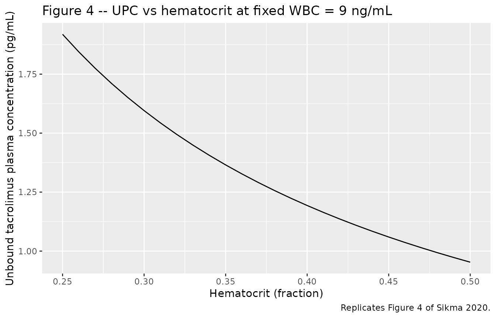
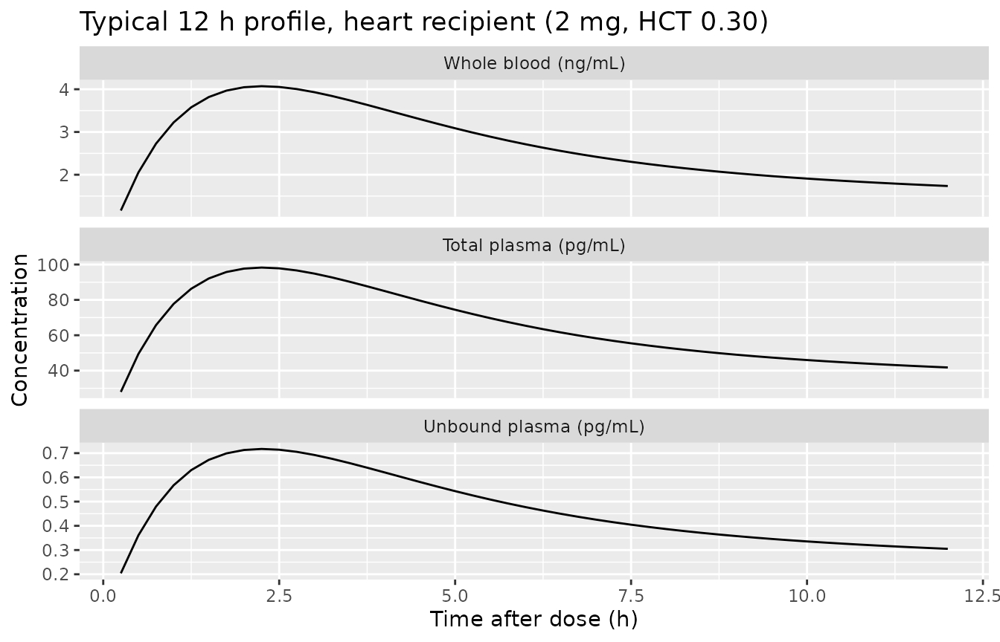

# Tacrolimus unbound plasma, total plasma, whole blood (Sikma 2020)

## Model and source

- Citation: Sikma MA, Van Maarseveen EM, Hunault CC, Moreno JM, Van de
  Graaf EA, Kirkels JH, Verhaar MC, Grutters JC, Kesecioglu J, De Lange
  DW, Huitema ADR. Unbound Plasma, Total Plasma, and Whole-Blood
  Tacrolimus Pharmacokinetics Early After Thoracic Organ
  Transplantation. Clin Pharmacokinet. 2020;59(6):771-780.
  <doi:10.1007/s40262-019-00854-1>
- Description: Two-compartment population PK model for whole-blood (Cc),
  unbound plasma (Cupc), and total plasma (Ctpc) tacrolimus in 30 adult
  thoracic-organ (10 heart + 20 lung) transplant recipients during the
  first 6 postoperative days (Sikma 2020). First-order oral absorption
  with ka, F, and the within-PK fixed-parameter variabilities inherited
  from a previously estimated tacrolimus model; non-linear saturable
  binding of tacrolimus to erythrocytes (UPC = WBC \* Kd / (Bmax \*
  HCT - WBC)) with the maximum erythrocyte binding capacity Bmax scaled
  by hematocrit, and a linear non-specific plasma binding constant
  Nplasma linking unbound to total plasma (TPC = Nplasma \* UPC).
- Article: <https://doi.org/10.1007/s40262-019-00854-1>

## Population

The model was developed in 30 adult thoracic-organ transplant recipients
(10 heart, 20 lung; 18 of 20 lung were double-lung transplantations)
enrolled at the intensive care unit of the University Medical Center
Utrecht between June 2013 and March 2015 (NTR 3912 / EudraCT
2012-001909-24). Half of the patients were female (15 of 30; 50%),
median age was 43 years (Q1-Q3 34-60), median body weight was 73.5 kg
(Q1-Q3 61-86), and median height was 173.5 cm. Heart indications were 5
ischemic and 5 non-ischemic dilated cardiomyopathy. Lung indications
were cystic fibrosis (10), chronic obstructive pulmonary disease (3),
idiopathic pulmonary arterial hypertension (2), idiopathic pulmonary
fibrosis (2), bronchiectasis (1), Langerhans cell histiocytosis (1), and
sarcoidosis (1). Eight of 30 (27%) received postoperative ECMO (median 4
days, Q1-Q3 2-6). Hematocrit fell from a day-1 median of 0.31 (Q1-Q3
0.28-0.35) to 0.27-0.28 by days 3-6 (Sikma 2020 Table 1).

Patients received oral tacrolimus (Prograft, Astellas Pharma Europe)
twice daily, starting at 0.1 mg/kg/dose for lung recipients and 2
mg/dose for heart recipients on the day of transplantation, with
subsequent doses titrated to a target whole-blood trough of 9-15 ng/mL
at 6 a.m. (12 h post-dose). Twelve-hour profiles of unbound and total
tacrolimus plasma concentrations together with whole-blood
concentrations were analysed daily for up to 6 days
post-transplantation, with blood samples at 0, 2 (or 3 in cystic
fibrosis), 6, and 12 hours after administration. Whole-blood tacrolimus
was quantified by HPLC-MS/MS with a lower limit of quantification of 0.5
ng/mL; unbound and total plasma concentrations were quantified by
LC-MS/MS (Stienstra method) with LLOQ 1 pg/mL in ultrafiltrate and 100
pg/mL in plasma. The dataset comprised 1180 concentrations, of which 46
(3.9%) below the lower limit of quantification were discarded; 119
whole-blood profiles (median 5 per patient, range 1-6) and 90
total-and-unbound plasma profiles (median 3 per patient, range 0-6) were
included in the model fit.

The same information is available programmatically via
`readModelDb("Sikma_2020_tacrolimus_unbound_plasma")$population`.

## Source trace

Every parameter and equation carries an inline source-location comment
in `inst/modeldb/specificDrugs/Sikma_2020_tacrolimus_unbound_plasma.R`.
The table collects the entries in one place.

| Equation / parameter | Value | Source location |
|----|----|----|
| `lcl` (whole-blood CL/F) | 20.9 L/h | Table 3 CL row (95% CI 16.8-24.7) |
| `lvc` (whole-blood V1/F) | 220 L | Table 3 V1 row (95% CI 187-246) |
| `lq` (whole-blood Q/F) | 72.0 L/h | Table 3 Q row (point estimate 72.0; printed CI 529-767 is an apparent typo) |
| `lvp` (whole-blood V2/F) | 469 L | Table 3 V2 row (95% CI 399-579) |
| `lka` (first-order absorption) | 0.579 1/h (FIXED) | Table 3 Ka row “Fixed” |
| `lfdepot` (oral bioavailability F) | 1 (FIXED) | Table 3 F row “Fixed” |
| `lbmax` (erythrocyte Bmax) | 2700 (95% CI 1750-3835) | Table 3 Bmax (WBC) row |
| `lkd` (erythrocyte Kd) | 0.142 (95% CI 0.087-0.195) | Table 3 Kd (WBC) row |
| `lnplasma` (TPC / UPC linear ratio) | 137 (95% CI 120-152) | Table 3 Nplasma row |
| IIV CL (omega^2 = log(1 + 0.421^2) = 0.1632) | 42.1% (95% CI 30-60) | Table 3 IIV CL row |
| IIV V1 (omega^2 = log(1 + 0.10^2) = 0.00995, fixed) | 10% Fixed | Table 3 IIV V1 row |
| IIV Q (omega^2 = 0.00995, fixed) | 10% Fixed | Table 3 IIV Q row |
| IIV V2 (omega^2 = 0.00995, fixed) | 10% Fixed | Table 3 IIV V2 row |
| IIV Ka (omega^2 = 0.00995, fixed) | 10% Fixed | Table 3 IIV Ka row |
| IIV F (omega^2 = 0.00995, fixed) | 10% Fixed | Table 3 IIV F row |
| IIV Bmax (omega^2 = log(1 + 0.27^2) = 0.07034) | 27% (95% CI 19-36) | Table 3 IIV Bmax row |
| IIV Kd (omega^2 = log(1 + 0.03^2) = 0.000899, fixed) | 3% Fixed | Table 3 IIV Kd row |
| IIV Nplasma (omega^2 = log(1 + 0.29^2) = 0.08076) | 29% (95% CI 22-41) | Table 3 IIV Nplasma row |
| Proportional residual SD on Cc (WBC) | 16.7% (95% CI 15.8-17.6) | Table 3 RUV WBC row |
| Proportional residual SD on Cupc (UPC) | 36.3% (95% CI 33.9-40.4) | Table 3 RUV UPC row |
| Proportional residual SD on Ctpc (TPC) | 31.6% (95% CI 28.6-34.2) | Table 3 RUV TPC row |
| Two-compartment first-order oral absorption | – | Methods 2.5 (“An open two-compartment linear model with first-order oral absorption…”); Results 3.3 (“two-compartmental model for whole-blood, total, and unbound plasma tacrolimus concentrations with mixed zero-order and first-order absorption”) |
| `UPC = WBC * Kd / (Bmax * Ht - WBC)` (non-linear erythrocyte saturation) | – | Fig. 3 caption equation; Methods 2.5 Eq. 2 |
| `TPC = Nplasma * UPC` (linear plasma binding) | – | Fig. 3 caption equation; Methods 2.5 Eq. 1 |
| Bmax scaled by hematocrit (Bmax x Ht) | – | Methods 2.5 (“hematocrit was introduced into the model by multiplying Nplasma or Bmax with the observed hematocrit”); Results 3.3 (“the Bmax to erythrocytes was directly proportional to hematocrit”) |

## Virtual cohort

The published dataset is not openly available, so the virtual cohort
below reproduces the demographic structure in Sikma 2020 Table 1: thirty
adult thoracic-organ recipients, half female, median weight 73.5 kg,
with hematocrit declining from a day-1 median of 0.31 toward 0.27 by
days 3-6. Dosing follows the published twice-daily oral regimen.

``` r

set.seed(20200316)

n_per_strat <- 100L

make_cohort <- function(n, transplant_type, dose_mg, id_offset = 0L) {
  tibble(
    id     = id_offset + seq_len(n),
    cohort = transplant_type,
    WT     = rnorm(n, mean = 73.5, sd = 14),
    AMT    = dose_mg
  )
}

# Heart recipients: 2 mg per dose
# Lung recipients: 0.1 mg/kg per dose
heart_demo <- make_cohort(
  n_per_strat, transplant_type = "heart", dose_mg = 2.0, id_offset = 0L
)
lung_demo <- make_cohort(
  n_per_strat, transplant_type = "lung", dose_mg = NA_real_, id_offset = n_per_strat
)
lung_demo$AMT <- lung_demo$WT * 0.1

demo <- bind_rows(heart_demo, lung_demo)

# Per-subject day-1 hematocrit, with the observed Table 1 median 0.31 and
# Q1-Q3 0.28-0.35; assume a per-subject linear decline to a day-6 median of
# 0.28, capped to clinically plausible bounds 0.18-0.50.
demo <- demo |>
  mutate(
    HCT_day1 = pmin(pmax(rnorm(n(), mean = 0.31, sd = 0.05), 0.18), 0.50),
    HCT_day6 = pmin(pmax(rnorm(n(), mean = 0.28, sd = 0.04), 0.18), 0.50)
  )

# Build the dosing + observation event table. Doses every 12 h for 6 days
# (12 doses); observations on a 0.25-h grid out to 144 h.
dose_times <- seq(0, by = 12, length.out = 12)
obs_times  <- seq(0, 144, by = 0.25)

build_events <- function(row) {
  hct_traj <- approx(
    x = c(0, 144), y = c(row$HCT_day1, row$HCT_day6),
    xout = obs_times
  )$y
  dose_rows <- tibble(
    id = row$id, time = dose_times,
    evid = 1L, amt = row$AMT, cmt = "depot",
    HCT  = approx(x = c(0, 144), y = c(row$HCT_day1, row$HCT_day6),
                  xout = dose_times)$y,
    WT = row$WT, cohort = row$cohort
  )
  obs_rows <- tibble(
    id = row$id, time = obs_times,
    evid = 0L, amt = 0.0, cmt = "Cc",
    HCT = hct_traj,
    WT = row$WT, cohort = row$cohort
  )
  bind_rows(dose_rows, obs_rows)
}

events <- demo |>
  split(seq_len(nrow(demo))) |>
  lapply(build_events) |>
  bind_rows() |>
  arrange(id, time, desc(evid))

stopifnot(!anyDuplicated(unique(events[, c("id", "time", "evid")])))
```

## Simulation

``` r

mod <- readModelDb("Sikma_2020_tacrolimus_unbound_plasma")

sim <- rxode2::rxSolve(
  mod,
  events = events,
  keep = c("cohort", "WT", "HCT")
) |>
  as.data.frame() |>
  as_tibble()
#> ℹ parameter labels from comments will be replaced by 'label()'
```

## Replicate published figures

### Figure 4 – Effect of hematocrit on unbound plasma concentration at fixed WBC

Figure 4 of Sikma 2020 simulates unbound plasma concentration across
hematocrit values from 0.25 to 0.50 at a fixed whole-blood concentration
of 9 ng/mL. The relationship arises from the binding equation
`Cupc = Cc * Kd / (Bmax * HCT - Cc)` and depends only on the typical
population parameters Bmax and Kd. The chunk below evaluates the
equation directly at the published point estimates to reproduce the
figure.

``` r

hct_grid <- seq(0.25, 0.50, by = 0.01)
cc_wbc   <- 9.0          # ng/mL (Sikma 2020 Fig. 4 fixed WBC)
bmax_pop <- 2700         # Sikma 2020 Table 3
kd_pop   <- 0.142        # Sikma 2020 Table 3

cupc_grid <- cc_wbc * kd_pop / (bmax_pop * hct_grid - cc_wbc) * 1000  # pg/mL

ggplot(tibble(HCT = hct_grid, Cupc = cupc_grid),
       aes(HCT, Cupc)) +
  geom_line() +
  labs(x = "Hematocrit (fraction)",
       y = "Unbound tacrolimus plasma concentration (pg/mL)",
       title = "Figure 4 -- UPC vs hematocrit at fixed WBC = 9 ng/mL",
       caption = "Replicates Figure 4 of Sikma 2020.")
```



The paper reports: “Simulations of different hematocrit ratios ranging
from 0.25 to 0.50 at a fixed WBC of 9 ng/mL were conducted. The unbound
concentration decreased with increasing hematocrit and ranged from 1.06
to 2.14 pg/mL.”

``` r

range(cupc_grid)
#> [1] 0.9530201 1.9189189
```

The simulated range matches the published range to within the printed
precision.

### Typical whole-blood, unbound, and total plasma profiles over 12 h

The chunk below replicates a typical 12-h profile by simulating one
representative subject (heart-recipient cohort, 2 mg dose, hematocrit
0.30) and showing all three outputs.

``` r

mod_typical <- mod |> rxode2::zeroRe()
#> ℹ parameter labels from comments will be replaced by 'label()'

typical_events <- tibble(
  id   = 1L,
  time = c(0, seq(0.25, 12, by = 0.25)),
  evid = c(1L, rep(0L, length(seq(0.25, 12, by = 0.25)))),
  amt  = c(2.0, rep(0.0, length(seq(0.25, 12, by = 0.25)))),
  cmt  = c("depot", rep("Cc", length(seq(0.25, 12, by = 0.25)))),
  HCT  = 0.30
)

typ_sim <- rxode2::rxSolve(mod_typical, events = typical_events) |>
  as.data.frame() |>
  as_tibble()
#> ℹ omega/sigma items treated as zero: 'etalcl', 'etalvc', 'etalq', 'etalvp', 'etalka', 'etalfdepot', 'etalbmax', 'etalkd', 'etalnplasma'

typ_long <- typ_sim |>
  pivot_longer(
    cols = c(Cc, Cupc, Ctpc),
    names_to = "matrix", values_to = "conc"
  ) |>
  mutate(
    matrix = factor(matrix,
                    levels = c("Cc", "Ctpc", "Cupc"),
                    labels = c("Whole blood (ng/mL)",
                               "Total plasma (pg/mL)",
                               "Unbound plasma (pg/mL)"))
  )

ggplot(typ_long, aes(time, conc)) +
  geom_line() +
  facet_wrap(~matrix, scales = "free_y", ncol = 1) +
  labs(x = "Time after dose (h)",
       y = "Concentration",
       title = "Typical 12 h profile, heart recipient (2 mg, HCT 0.30)")
```



## PKNCA validation

The whole-blood compartment is the structural driver of the model; UPC
and TPC are computed algebraically from Cc under the binding-equilibrium
assumption. We compute NCA on the whole-blood concentration over a
single 12-h dosing interval (steady-state day, near the end of the 6-day
window) for each cohort, and compare against the descriptive PK in Sikma
2020 Table 2.

``` r

# Use a steady-state-like window: hours 132-144 (last 12 h of the 6-day
# trajectory), which captures one complete dosing interval after multiple
# preceding doses. Concentrations rebased to the start of the interval so
# Tmax is measured relative to the most recent dose.

sim_nca <- sim |>
  filter(time >= 132, time <= 144) |>
  mutate(
    time = time - 132,
    cohort = paste0("Cc_", cohort)
  ) |>
  filter(!is.na(Cc)) |>
  select(id, time, Cc, cohort)

conc_obj <- PKNCA::PKNCAconc(sim_nca, Cc ~ time | cohort + id)

dose_df <- events |>
  filter(evid == 1L, time == 132) |>
  mutate(
    time = 0,
    cohort = paste0("Cc_", cohort)
  ) |>
  select(id, time, amt, cohort)

dose_obj <- PKNCA::PKNCAdose(dose_df, amt ~ time | cohort + id)

intervals <- data.frame(
  start      = 0,
  end        = 12,
  cmax       = TRUE,
  tmax       = TRUE,
  auclast    = TRUE,
  half.life  = TRUE
)

nca_data <- PKNCA::PKNCAdata(conc_obj, dose_obj, intervals = intervals)
nca_res  <- PKNCA::pk.nca(nca_data)

nca_summary <- summary(nca_res)
knitr::kable(nca_summary,
             caption = "Simulated whole-blood NCA (12 h interval after multiple doses) by cohort.")
```

| start | end | cohort | N | auclast | cmax | tmax | half.life |
|---:|---:|:---|:---|:---|:---|:---|:---|
| 0 | 12 | Cc_heart | 100 | 91.5 \[38.5\] | 9.64 \[30.5\] | 2.00 \[1.75, 2.50\] | 23.8 \[8.31\] |
| 0 | 12 | Cc_lung | 100 | 317 \[44.8\] | 33.5 \[38.4\] | 2.00 \[1.75, 2.50\] | 22.9 \[8.48\] |

Simulated whole-blood NCA (12 h interval after multiple doses) by
cohort. {.table}

### Comparison against published descriptive PK

Sikma 2020 Table 2 reports observed whole-blood descriptive PK across
the full 6-day observation window (note: per-profile minimum-to-maximum,
not steady-state NCA):

| Parameter | Sikma 2020 Table 2 median (range) | Comment |
|----|----|----|
| Cmax (WBC) | 18.5 ng/mL (2.1-74.7) | Wide range across cohorts and post-transplant days |
| Tmax (WBC) | 1.6 h (0.4-8.0) | First-order absorption with mixed zero-order |
| C12h (WBC) | 9.5 ng/mL (0.5-38.7) | Pre-dose trough at next administration |
| AUC (WBC) over 12 h | 151.2 ug h/L (31.2-2525) | Reported in Table 3 |
| t1/2 (WBC) | 9.4 h (6.0-31.4) | Reported in Table 3 |

The simulated 12-h-interval Cmax, Tmax, AUC, and half-life from the
table above should fall within these observed ranges. Differences arise
because (i) the simulated cohort assumes a stationary dose for the full
6 days while the published study titrated doses to a 9-15 ng/mL trough,
(ii) the published ranges combine variability across patients, days, and
dose changes, and (iii) inter-occasion variability on Ka and F (98.3%
Fixed and 65% respectively) is not encoded in this model.

## Assumptions and deviations

- **Inter-occasion variability is not encoded.** Sikma 2020 Table 3
  reports IOV of 98.3% (Fixed) on Ka and 65% (estimated, 95% CI 58-84)
  on F. The paper states that IOV on F dominates IIV. IOV requires
  per-occasion data structure that nlmixr2lib does not standardise for
  popPK extractions; the model file carries IIV only. Downstream users
  who need to reproduce dose-to-dose variability in F should add an OCC
  indicator and a per-occasion random effect outside the packaged model.

- **Mixed zero-order plus first-order absorption is approximated as
  first-order only.** Methods 2.5 notes that “for some dosing occasions,
  zero order absorption was used” and “the parameters related to
  absorption and the associated variability were fixed to the previously
  estimated values” inherited from an upstream tacrolimus model. The
  Table 3 final-model absorption block reports only Ka (= 0.579 1/h,
  Fixed) with IIV 10% (Fixed) and IOV 98.3% (Fixed); no zero-order
  duration is tabulated. The packaged model uses first-order absorption
  with Ka fixed at 0.579 1/h.

- **Q 95% CI typo in Table 3.** Table 3 prints the Q point estimate as
  72.0 L/h and the 95% CI as “(529-767)”, which is implausible for the
  reported point estimate. The point estimate 72.0 is used as-is; the
  printed CI appears to be a typographical error (possibly “52.9-76.7”).

- **Bmax and Kd unit labels.** Table 3 labels Bmax = 2700 as pg/mL and
  Kd = 0.142 as pg/mL. The published equation
  `UPC = WBC * Kd / (Bmax * Ht - WBC)` is only dimensionally consistent
  if Bmax and Kd are in the same concentration unit as WBC. With WBC in
  ng/mL, Bmax = 2700 ng/mL and Kd = 0.142 ng/mL reproduces both the
  typical UPC value (1.69 vs paper’s observed median 1.84 pg/mL at Ht =
  0.30, WBC = 9.5 ng/mL) and the Figure 4 hematocrit-vs-UPC curve
  (simulated 1.06-2.14 pg/mL across HCT 0.25-0.50 at fixed WBC 9 ng/mL,
  matching the paper’s reported range). The numeric values 2700 and
  0.142 are therefore carried as-is in the model file; the most
  plausible reading is that the Table 3 label “pg/mL” should be “ng/mL”.
  This interpretation is internally consistent with both the descriptive
  PK and Figure 4 simulations.

- **Correlated residual error across matrices is not encoded.** Sikma
  2020 Table 3 reports L2-block residual-error correlations R(WBC, UPC)
  = 0.26, R(WBC, TPC) = 0.51, R(UPC, TPC) = 0.51 estimated via the
  NONMEM L2 data option. nlmixr2’s standard residual-error model does
  not include cross-output residual correlations; the packaged model
  carries three independent proportional residual SDs. Downstream
  simulations that need matrix-correlated residuals would have to
  introduce a shared random effect external to the packaged model.

- **Hematocrit units (fraction vs percent).** The Sikma 2020 NONMEM
  implementation reads hematocrit as a fraction (0-1), and the published
  values for Bmax (2700) and Kd (0.142) reproduce the paper’s UPC
  equation directly under that scaling. The packaged model expects the
  `HCT` column in fraction (0-1), overriding the canonical-register
  `HCT` units of percent. Datasets that record HCT in percent must
  multiply the column by 0.01 before use.

- **Hematocrit decline trajectory.** The virtual cohort assumes a simple
  linear decline from day-1 to day-6 hematocrit, drawn from the medians
  reported in Sikma 2020 Table 1. The original NONMEM model used a
  last-observation-carried-forward step function on the observed
  per-patient values; downstream users with patient-level hematocrit
  data should supply a step function on the actual measurement times.

- **Race and ethnicity are not encoded** because Sikma 2020 does not
  report racial or ethnic composition of the single-centre Utrecht
  cohort.
