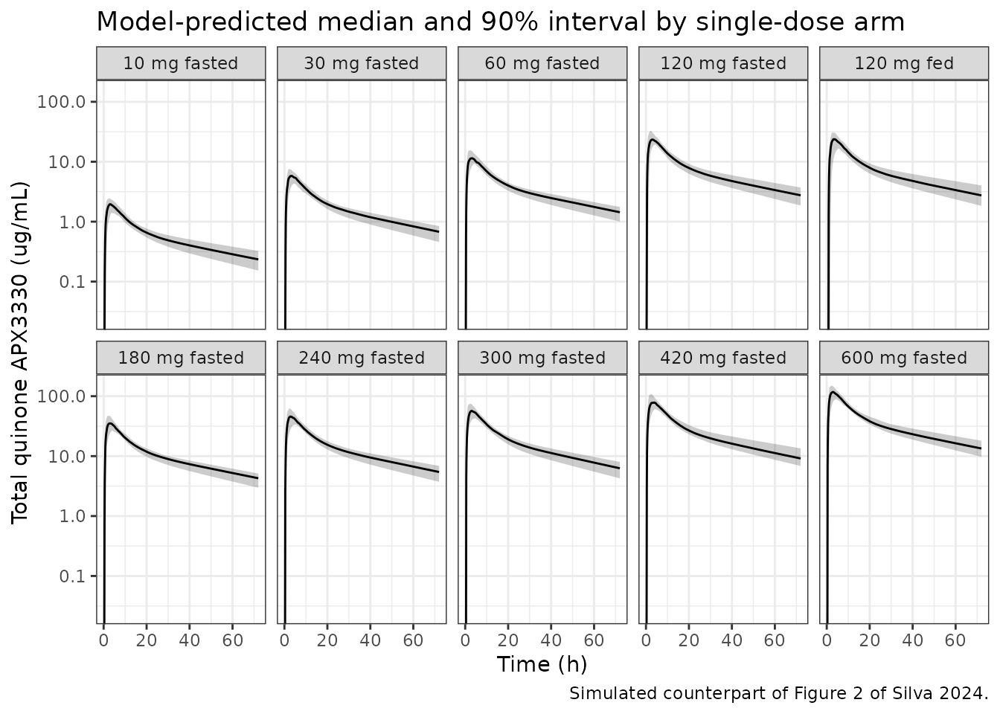
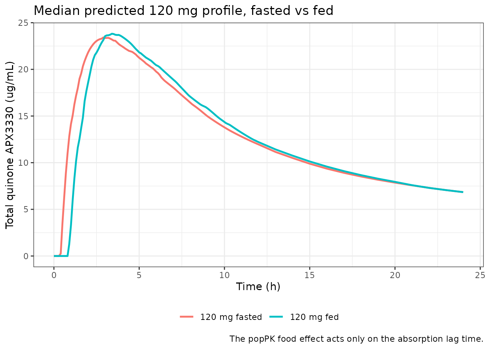

# APX3330 (Silva 2024)

## Model and source

- Citation: Silva LL, Stratford RE, Messmann R, Kelley MR, Quinney SK.
  Bridging population pharmacokinetic and semimechanistic absorption
  modeling of APX3330. CPT Pharmacometrics Syst Pharmacol.
  2024;13(1):106-117. <doi:10.1002/psp4.13061>.
- Description: Population pharmacokinetic model for APX3330 (E3330), a
  selective APE1/Ref-1 redox inhibitor, measured as total quinone in
  plasma after oral dosing. Two-compartment disposition with first-order
  absorption and an absorption lag time, fitted to 1460 plasma
  concentrations pooled from four Eisai studies in 49 healthy Japanese
  male volunteers (single dose-escalation 10-600 mg, multiple-dose 120
  mg once or twice daily, and a fasted-vs-fed crossover) and one Apexian
  phase I study in 19 patients with advanced solid tumors dosed 120-360
  mg twice daily. All disposition parameters are apparent (oral) values
  because absolute bioavailability was never measured. Body weight is a
  power-model covariate on CL/F (exponent 0.659) and V1/F (exponent
  0.839) referenced to 70 kg; the oncology cohort carries a log-additive
  shift on CL/F, and dosing in the fed state carries a log-additive
  shift on the absorption lag time. Inter-individual variability is
  estimated on CL/F, V1/F and ka with a CL/F-V1/F correlation of 0.349,
  and residual error is proportional (16%). The paper’s companion
  GastroPlus ACAT semi-mechanistic absorption model is a
  commercial-platform model and is not reproduced here; see the
  validation vignette.
- Article: <https://doi.org/10.1002/psp4.13061>

APX3330 (also called E3330) is a selective inhibitor of APE1/Ref-1 that
has been investigated in hepatitis, cancer, diabetic retinopathy and
diabetic macular edema. It is given orally as a quinone but converts
rapidly to a hydroquinone in the gastrointestinal tract. Neither
bioanalytical method used in the source studies could separate the two
forms – samples were oxidised before analysis – so every concentration
the model was fitted to is **total quinone**, and every disposition
parameter is an **apparent** (oral) quantity.

The paper pairs two modelling approaches. Only the first is packaged
here:

1.  A **population PK model** (Monolix 2019 R2), two-compartment with
    first-order absorption and a lag time. This is `Silva_2024_apx3330`.
2.  A **semi-mechanistic absorption model** built on the advanced
    compartmental absorption and transit (ACAT) framework in GastroPlus
    9.8, used to explain *why* food delays absorption. This is a
    commercial-platform model whose gastrointestinal physiology, transit
    structure and dissolution model live inside GastroPlus; the paper
    reports only its tuned absorption scale factors and its fasted/fed
    physiology set (Table S5, not in the open-access deposit). It is
    therefore not reproducible in rxode2 and is not packaged. See
    “Assumptions and deviations” below.

### Which of the paper’s two parameter columns is packaged

Table 2 of Silva 2024 has two columns, “Healthy volunteers” and
“Combined data”. These are the two stages of a single staged
model-development strategy, not two independent models: the Methods
state that “Using the final estimates from the model for healthy
volunteers as initial estimates, a final model was developed to describe
data from both studies.” The packaged model uses the **Combined data**
column, the paper’s final model. Setting `DIS_CANCER = 0` recovers the
healthy-Japanese-volunteer reference population, whose parameters differ
from the earlier stage by less than 2% (CL/F 193 vs 196 mL/h; lag time
0.401 vs 0.413 h), so nothing is lost by not carrying the intermediate
stage as a separate file.

## Population

The combined model was built on 1460 total-quinone plasma concentrations
from 68 participants across five studies; 211 concentrations (14.45%)
came from the oncology study.

The healthy-volunteer component pools four Eisai studies in **49 healthy
Japanese male volunteers** (mean age 25.4 years, weight 52-77 kg, mean
62.4 kg, all within +/- 20% of ideal body weight): a single-dose
escalation at 10, 30, 60, 120, 180 and 240 mg; a multiple-dose study at
120 mg once or twice daily; a 120 mg fasted-versus-fed single-dose
crossover; and a high single-dose study at 300, 420 and 600 mg.
Individual-level data for these studies were digitised from Eisai
clinical trial reports with Engauge Digitizer.

The oncology component is a single Apexian phase I study in **19
patients with advanced solid tumors** dosed 120-360 mg twice daily for
22 days: 13 (68.42%) men, 84.21% White and 10.53% Hispanic, mean weight
88.3 kg. Serum albumin averaged 3.9 +/- 0.28 g/dL in patients with
cancer versus 4.8 +/- 0.16 g/dL in the healthy volunteers. Baseline
demographics are tabulated in the paper’s Table S3. Neither dose level
nor study period was a significant covariate, indicating linear PK
across the 10-600 mg range.

The same information is available programmatically via
`readModelDb("Silva_2024_apx3330")()$population`.

## Source trace

Every `ini()` entry in `inst/modeldb/specificDrugs/Silva_2024_apx3330.R`
carries an in-file comment naming its source. They are collected here
for review. All parameter values come from the **“Combined data”**
column of Silva 2024 Table 2.

| Equation / parameter | Value | Source location |
|----|----|----|
| `ltlag` | `log(0.401)` h | Table 2, row `t lag (h)` = 0.401 (RSE 6.92%) |
| `lka` | `log(0.894)` 1/h | Table 2, row `k a (1/h)` = 0.894 (RSE 9.47%) |
| `lcl` | `log(0.193)` L/h | Table 2, row `CL/F (mL/h)` = 193 mL/h (RSE 2.48%) |
| `lvc` | `log(4.05)` L | Table 2, row `V 1/F (mL)` = 4050 mL (RSE 2.51%) |
| `lq` | `log(0.276)` L/h | Table 2, row `Q/F (mL/h)` = 276 mL/h (RSE 4.02%) |
| `lvp` | `log(4.78)` L | Table 2, row `V 2/F (mL)` = 4780 mL (RSE 2.00%) |
| `e_wt_cl` | `0.659` | Table 2, row `beta WT,CL` (RSE 17.6%); applied via Eq. 1 |
| `e_wt_vc` | `0.839` | Table 2, row `beta WT,V1` (RSE 12.8%); applied via Eq. 1 |
| `e_cancer_cl` | `0.409` | Table 2, row `beta SubjectSource,CL` (RSE 13.0%); applied via Eq. 2 |
| `e_fed_tlag` | `0.815` | Table 2, row `beta Food,tlag` (RSE 13.5%); applied via Eq. 2 |
| `etalcl` | `0.142^2 = 0.020164` | Table 2, `omega CL/F` = 0.142 (RSE 9.67%), an SD |
| `etalvc` | `0.141^2 = 0.019881` | Table 2, `omega V 1/F` = 0.141 (RSE 12.2%), an SD |
| `cov(etalcl, etalvc)` | `0.349 * 0.142 * 0.141 = 0.0069877` | Table 2, `Correlations`, `CL/F ~ V 1/F` = 0.349 (RSE 37.0%) |
| `etalka` | `0.517^2 = 0.267289` | Table 2, `omega ka` = 0.517 (RSE 20.1%), an SD |
| `etaltlag` | `0.515^2 = 0.265225` | Table 2, `gamma t lag` = 0.515 (RSE 9.44%); IOV folded in as a BSV-equivalent |
| `propSd` | `0.16` | Table 2, `Residual variability`, row `Proportional` (RSE 2.14%) |
| Reference weight 70 kg | n/a | Methods, “body weight (WT; normalized to 70 kg)” |
| Continuous covariate form | n/a | Equation 1, `p_j = p_pop x (cov_j / cov_ref)^beta x exp(eta_j + eta_OCC)` |
| Categorical covariate form | n/a | Equation 2, `p_j = p_pop x exp(beta x cov_j) x exp(eta_j + eta_OCC)` |
| Two-compartment, first-order absorption with lag | n/a | Results, “A two-compartment model with first-order absorption and t lag best described the observed concentration-time course”; BIC 5998.53 with lag vs 7115.17 without |
| Proportional residual error | n/a | Results, “The preferred error model was proportional” |

### Reading the Monolix variance parameters

Monolix reports `omega` and `gamma` as **standard deviations** on the
log scale, while `ini()` in nlmixr2 takes **variances**, so each
random-effect entry above is the square of the tabulated number. The
paper’s own prose confirms the SD reading twice, and the two checks
point in opposite directions so neither is vacuous:

- “Despite the small IIV for CL/F and V1/F estimates” –
  `omega_CL/F = 0.142` read as an SD is a 14.3% CV, which is small; read
  as a variance it would be a 39% CV, which is not.
- “variability in absorption parameters, k_(a) and t_(lag), was over
  50%” – `omega_ka = 0.517` gives a 55.4% CV, `gamma_tlag = 0.515` gives
  55.2% and `gamma_ka = 0.564` gives 61.0%, all just over 50% as stated.

## Virtual cohort

The original individual-level data are not publicly available. The
cohort below approximates the Japanese healthy-volunteer population:
body weights are placed on a deterministic quantile grid of a normal
distribution with the reported mean (62.4 kg), clipped to the reported
52-77 kg range. A deterministic grid rather than a random draw keeps the
arm-to-arm comparisons exactly reproducible and prevents a lucky or
unlucky draw from moving a validation conclusion.

Ten single-dose arms are simulated, matching the ten single-dose rows of
the paper’s Table 3: nine fasted dose levels from 10 to 600 mg plus the
120 mg fed arm of the food-effect crossover.

``` r

set.seed(20240113)

N_PER_ARM <- 50L # well under the 200/arm cap; arms are deterministic

arms <- tibble::tribble(
  ~treatment,       ~dose, ~FED,
  "10 mg fasted",      10,    0,
  "30 mg fasted",      30,    0,
  "60 mg fasted",      60,    0,
  "120 mg fasted",    120,    0,
  "120 mg fed",       120,    1,
  "180 mg fasted",    180,    0,
  "240 mg fasted",    240,    0,
  "300 mg fasted",    300,    0,
  "420 mg fasted",    420,    0,
  "600 mg fasted",    600,    0
)

# Deterministic quantile weights for the healthy Japanese male cohort.
# Reported: mean 62.4 kg, range 52-77 kg (Silva 2024 Results).
wt_grid <- pmin(pmax(stats::qnorm(stats::ppoints(N_PER_ARM), 62.4, 5.6), 52), 77)

# Sampling grid: dense through absorption, then out to 336 h (about eight
# terminal half-lives) so that AUC(0-inf) needs only a small extrapolation.
obs_times <- unique(c(
  seq(0, 12, by = 0.1),
  seq(13, 48, by = 1),
  seq(52, 336, by = 4)
))

make_arm <- function(treatment, dose, FED, id_offset) {
  subj <- tibble::tibble(
    id = id_offset + seq_len(N_PER_ARM),
    WT = wt_grid,
    FED = FED,
    DIS_CANCER = 0,
    treatment = treatment,
    # NB: not named `dose` -- rxode2 reserves that name and silently refuses to
    # carry it through `keep =`.
    dose_mg = dose
  )
  doses <- subj |>
    dplyr::mutate(time = 0, amt = dose, evid = 1L, cmt = "depot")
  obs <- subj |>
    tidyr::crossing(time = obs_times) |>
    dplyr::mutate(amt = NA_real_, evid = 0L, cmt = "central")
  dplyr::bind_rows(doses, obs) |>
    dplyr::arrange(id, time, dplyr::desc(evid))
}

events <- dplyr::bind_rows(
  lapply(seq_len(nrow(arms)), function(i) {
    make_arm(
      treatment = arms$treatment[i],
      dose = arms$dose[i],
      FED = arms$FED[i],
      id_offset = (i - 1L) * N_PER_ARM
    )
  })
)

# Disjoint IDs across arms are mandatory: rxSolve keys on `id` alone, so a
# repeated id would silently merge two arms into one over-dosed subject.
stopifnot(!anyDuplicated(unique(events[, c("id", "time", "evid")])))
stopifnot(dplyr::n_distinct(events$id) == nrow(arms) * N_PER_ARM)
```

## Simulation

``` r

mod <- readModelDb("Silva_2024_apx3330")

sim <- rxode2::rxSolve(
  mod,
  events = events,
  keep = c("treatment", "dose_mg", "WT", "FED")
) |>
  as.data.frame()
#> ℹ parameter labels from comments will be replaced by 'label()'

# `Cc` is the individual prediction (IPRED); `sim` carries the 16%
# proportional residual error on top of it.
str(sim[, c("id", "time", "Cc", "sim")], max.level = 1)
#> 'data.frame':    114500 obs. of  4 variables:
#>  $ id  : int  1 1 1 1 1 1 1 1 1 1 ...
#>  $ time: num  0 0.1 0.2 0.3 0.4 0.5 0.6 0.7 0.8 0.9 ...
#>  $ Cc  : num  0 0 0 0.101 0.297 ...
#>  $ sim : num  0 0 0 0.119 0.301 ...
```

## Replicate published figures

### Figure 2 – concentration-time profiles by dose arm

Silva 2024 Figure 2 is a prediction-corrected visual predictive check of
the combined data stratified by single/multiple dose, fasted/fed state
and subject source. The observed data are not available, so the panel
below shows the model-predicted median and 5th-95th percentile band for
each single-dose arm – the simulated half of that VPC.

``` r

vpc <- sim |>
  dplyr::filter(time > 0, time <= 72) |>
  dplyr::group_by(treatment, dose_mg, time) |>
  dplyr::summarise(
    Q05 = stats::quantile(Cc, 0.05),
    Q50 = stats::quantile(Cc, 0.50),
    Q95 = stats::quantile(Cc, 0.95),
    .groups = "drop"
  ) |>
  dplyr::mutate(treatment = factor(treatment, levels = arms$treatment))

ggplot(vpc, aes(time, Q50)) +
  geom_ribbon(aes(ymin = Q05, ymax = Q95), alpha = 0.25) +
  geom_line() +
  facet_wrap(~treatment, ncol = 5) +
  scale_y_log10() +
  labs(
    x = "Time (h)", y = "Total quinone APX3330 (ug/mL)",
    title = "Model-predicted median and 90% interval by single-dose arm",
    caption = "Simulated counterpart of Figure 2 of Silva 2024."
  ) +
  theme_bw()
#> Warning in scale_y_log10(): log-10 transformation introduced infinite values.
#> log-10 transformation introduced infinite values.
#> log-10 transformation introduced infinite values.
#> log-10 transformation introduced infinite values.
```



### Figure 3 – the food effect on absorption

Silva 2024 Figure 3 plots GastroPlus-predicted dissolution and
absorption profiles, which this model cannot produce. What the popPK
model *does* encode is the food effect on the absorption lag time, shown
below at 120 mg.

``` r

sim |>
  dplyr::filter(dose_mg == 120, time <= 24) |>
  dplyr::group_by(treatment, time) |>
  dplyr::summarise(Q50 = stats::quantile(Cc, 0.50), .groups = "drop") |>
  ggplot(aes(time, Q50, colour = treatment)) +
  geom_line(linewidth = 0.9) +
  labs(
    x = "Time (h)", y = "Total quinone APX3330 (ug/mL)",
    colour = NULL,
    title = "Median predicted 120 mg profile, fasted vs fed",
    caption = "The popPK food effect acts only on the absorption lag time."
  ) +
  theme_bw() +
  theme(legend.position = "bottom")
```



## Deterministic structural checks

These use typical-value simulations (`omega = NA`, `sigma = NA`) so each
result is an exact consequence of the packaged parameters rather than a
Monte Carlo estimate. Each is asserted, so the vignette fails to render
if the packaged model drifts.

``` r

typical_profile <- function(dose, WT, FED, DIS_CANCER, times = obs_times) {
  ev <- rxode2::et(amt = dose, cmt = "depot") |>
    rxode2::et(times, cmt = "central")
  rxode2::rxSolve(
    mod, ev,
    omega = NA, sigma = NA,
    params = c(WT = WT, FED = FED, DIS_CANCER = DIS_CANCER)
  ) |>
    as.data.frame()
}

# Closed-form apparent clearance implied by the packaged parameters.
clf <- function(WT, DIS_CANCER) 0.193 * exp(0.409 * DIS_CANCER) * (WT / 70)^0.659
```

### 1. AUC(0-inf) identity

For a linear model, AUC(0-inf) after a single oral dose is exactly
`dose / (CL/F)` regardless of the absorption parameters. This is a free,
exact check that CL/F and the weight model are wired correctly.

``` r

p120 <- typical_profile(120, WT = 62.4, FED = 0, DIS_CANCER = 0)

# Trapezoidal AUC to 336 h plus the terminal-slope extrapolation.
auc_obs <- sum(diff(p120$time) * (utils::head(p120$Cc, -1) + utils::tail(p120$Cc, -1)) / 2)
tail_fit <- stats::lm(log(Cc) ~ time, data = subset(p120, time >= 168))
lambda_z <- -stats::coef(tail_fit)[["time"]]
auc_inf <- auc_obs + utils::tail(p120$Cc, 1) / lambda_z

auc_expected <- 120 / clf(62.4, 0)
c(simulated = auc_inf, expected = auc_expected,
  ratio = auc_inf / auc_expected)
#>  simulated   expected      ratio 
#> 670.816982 670.682386   1.000201

stopifnot(abs(auc_inf / auc_expected - 1) < 0.001)
```

### 2. Dose linearity across 10-600 mg

The paper found neither dose nor period to be a significant covariate,
“indicating linear PKs over the range of 10-600 mg oral dosing”. The
packaged model must therefore give a dose-normalised exposure that is
identical at every dose level.

``` r

dose_levels <- c(10, 30, 60, 120, 180, 240, 300, 420, 600)

lin <- vapply(dose_levels, function(d) {
  p <- typical_profile(d, WT = 62.4, FED = 0, DIS_CANCER = 0, times = seq(0, 72, by = 0.1))
  max(p$Cc) / d
}, numeric(1))

data.frame(dose_mg = dose_levels, cmax_per_mg = lin)
#>   dose_mg cmax_per_mg
#> 1      10   0.1994285
#> 2      30   0.1994285
#> 3      60   0.1994285
#> 4     120   0.1994285
#> 5     180   0.1994285
#> 6     240   0.1994285
#> 7     300   0.1994285
#> 8     420   0.1994285
#> 9     600   0.1994285

# Exactly linear: dose-normalised Cmax is identical to numerical precision.
stopifnot(max(abs(lin / lin[1] - 1)) < 1e-8)
```

### 3. Oncology-cohort clearance contrast

``` r

# The DIS_CANCER effect is a pure log-additive shift on CL/F, so the exposure
# ratio at equal body weight is exactly exp(-0.409).
ratio_at_equal_wt <- clf(70, 0) / clf(70, 1)
c(exposure_ratio_cancer_vs_hv = ratio_at_equal_wt,
  clf_increase_pct = 100 * (exp(0.409) - 1))
#> exposure_ratio_cancer_vs_hv            clf_increase_pct 
#>                   0.6643142                  50.5311720

stopifnot(abs(ratio_at_equal_wt - exp(-0.409)) < 1e-12)

# At the cohorts' actual mean weights the weight effect adds to the disease
# effect: 88.3 kg patients vs 62.4 kg volunteers.
c(clf_hv_62.4kg_mL_per_h = 1000 * clf(62.4, 0),
  clf_cancer_88.3kg_mL_per_h = 1000 * clf(88.3, 1))
#>     clf_hv_62.4kg_mL_per_h clf_cancer_88.3kg_mL_per_h 
#>                   178.9222                   338.5729
```

### 4. Food effect: a pure time shift

Because food acts only on `t_lag`, the packaged model predicts that food
shifts the whole profile later by exactly `0.401 * (exp(0.815) - 1)`
hours and leaves Cmax and AUC untouched.

``` r

shift_expected <- 0.401 * (exp(0.815) - 1)
tt <- seq(0, 72, by = 0.01)

fasted <- typical_profile(120, 62.4, FED = 0, DIS_CANCER = 0, times = tt)
fed <- typical_profile(120, 62.4, FED = 1, DIS_CANCER = 0, times = tt)
# The same fed profile, sampled on a grid translated forward by the expected
# shift. If food is a pure time shift, this must lie on top of the fasted
# profile point for point.
fed_shifted <- typical_profile(120, 62.4, FED = 1, DIS_CANCER = 0,
                               times = tt + shift_expected)

tmax_fasted <- fasted$time[which.max(fasted$Cc)]
tmax_fed <- fed$time[which.max(fed$Cc)]

c(tmax_fasted = tmax_fasted, tmax_fed = tmax_fed,
  shift_observed = tmax_fed - tmax_fasted, shift_expected = shift_expected)
#>    tmax_fasted       tmax_fed shift_observed shift_expected 
#>      3.0300000      3.5400000      0.5100000      0.5049294

stopifnot(abs((tmax_fed - tmax_fasted) - shift_expected) < 0.02)

# Pure translation: after removing the shift, the two profiles agree to solver
# tolerance everywhere past the absorption lag. This also establishes that the
# extent of absorption is unchanged, matching "the extent of absorption remains
# the same with or without food co-administration" (Discussion).
post_lag <- fasted$time > 1
rel_diff <- abs(fed_shifted$Cc[post_lag] - fasted$Cc[post_lag]) / fasted$Cc[post_lag]
c(max_relative_difference = max(rel_diff),
  cmax_ratio = max(fed_shifted$Cc) / max(fasted$Cc))
#> max_relative_difference              cmax_ratio 
#>            1.433488e-14            1.000000e+00

stopifnot(max(rel_diff) < 1e-4)
stopifnot(abs(max(fed_shifted$Cc) / max(fasted$Cc) - 1) < 1e-6)
```

## PKNCA validation

``` r

sim_nca <- sim |>
  dplyr::filter(!is.na(Cc)) |>
  dplyr::select(id, time, Cc, treatment)

# Guarantee a time-zero record per subject; pre-dose concentration after an
# extravascular dose is 0.
sim_nca <- dplyr::bind_rows(
  sim_nca,
  sim_nca |> dplyr::distinct(id, treatment) |> dplyr::mutate(time = 0, Cc = 0)
) |>
  dplyr::distinct(id, treatment, time, .keep_all = TRUE) |>
  dplyr::arrange(id, treatment, time)

conc_obj <- PKNCA::PKNCAconc(sim_nca, Cc ~ time | treatment + id)

dose_df <- events |>
  dplyr::filter(evid == 1) |>
  dplyr::select(id, time, amt, treatment)

dose_obj <- PKNCA::PKNCAdose(dose_df, amt ~ time | treatment + id)

intervals <- data.frame(
  start = 0, end = Inf,
  cmax = TRUE, tmax = TRUE, aucinf.obs = TRUE, half.life = TRUE
)

nca_res <- PKNCA::pk.nca(PKNCA::PKNCAdata(conc_obj, dose_obj, intervals = intervals))
```

### Comparison against the published NCA

Silva 2024 Table 3 reports observed AUC(0-inf), Cmax and Tmax for each
dose arm. Those observed values were the reference against which the
*GastroPlus* model was scored, but they are summaries of the same
underlying clinical data the popPK model was fitted to, so they are a
legitimate external check on the packaged model.

``` r

published <- tibble::tribble(
  ~treatment,       ~cmax, ~tmax, ~aucinf.obs,
  "10 mg fasted",    2.08,   2.0,        52.2,
  "30 mg fasted",    6.41,   3.0,       166.0,
  "60 mg fasted",   13.10,   2.0,       333.0,
  "120 mg fasted",  28.00,   2.0,       690.0,
  "120 mg fed",     24.50,   6.0,       753.0,
  "180 mg fasted",  34.70,   3.0,       987.0,
  "240 mg fasted",  46.90,   3.0,      1281.0,
  "300 mg fasted",  60.20,   3.0,      1839.0,
  "420 mg fasted",  90.80,   3.0,      2728.0,
  "600 mg fasted", 124.00,   2.0,      3588.0
)

cmp <- nlmixr2lib::ncaComparisonTable(
  simulated = nca_res,
  reference = published,
  by = "treatment",
  params = c("cmax", "tmax", "aucinf.obs"),
  units = c(cmax = "ug/mL", tmax = "h", aucinf.obs = "ug*h/mL"),
  tolerance_pct = 20
)

knitr::kable(
  cmp,
  digits = 2,
  caption = paste(
    "Simulated (median of the virtual healthy-volunteer cohort, individual",
    "predictions) vs observed values in Silva 2024 Table 3.",
    "* marks a difference greater than 20%."
  )
)
```

| NCA parameter           | treatment     | Reference | Simulated | % diff   |
|:------------------------|:--------------|:----------|:----------|:---------|
| Cmax (ug/mL)            | 10 mg fasted  | 2.08      | 1.96      | -5.9%    |
| Cmax (ug/mL)            | 30 mg fasted  | 6.41      | 5.97      | -6.9%    |
| Cmax (ug/mL)            | 60 mg fasted  | 13.1      | 11.6      | -11.1%   |
| Cmax (ug/mL)            | 120 mg fasted | 28        | 24        | -14.2%   |
| Cmax (ug/mL)            | 120 mg fed    | 24.5      | 24        | -2.2%    |
| Cmax (ug/mL)            | 180 mg fasted | 34.7      | 35.6      | +2.7%    |
| Cmax (ug/mL)            | 240 mg fasted | 46.9      | 46.7      | -0.5%    |
| Cmax (ug/mL)            | 300 mg fasted | 60.2      | 57.3      | -4.8%    |
| Cmax (ug/mL)            | 420 mg fasted | 90.8      | 79.7      | -12.3%   |
| Cmax (ug/mL)            | 600 mg fasted | 124       | 119       | -4.1%    |
| Tmax (h)                | 10 mg fasted  | 2         | 3.2       | +60.0%\* |
| Tmax (h)                | 30 mg fasted  | 3         | 3.3       | +10.0%   |
| Tmax (h)                | 60 mg fasted  | 2         | 2.95      | +47.5%\* |
| Tmax (h)                | 120 mg fasted | 2         | 2.8       | +40.0%\* |
| Tmax (h)                | 120 mg fed    | 6         | 3.4       | -43.3%\* |
| Tmax (h)                | 180 mg fasted | 3         | 2.9       | -3.3%    |
| Tmax (h)                | 240 mg fasted | 3         | 2.95      | -1.7%    |
| Tmax (h)                | 300 mg fasted | 3         | 3.05      | +1.7%    |
| Tmax (h)                | 420 mg fasted | 3         | 3.35      | +11.7%   |
| Tmax (h)                | 600 mg fasted | 2         | 2.9       | +45.0%\* |
| AUC0-∞ (obs) (ug\*h/mL) | 10 mg fasted  | 52.2      | 56.9      | +9.1%    |
| AUC0-∞ (obs) (ug\*h/mL) | 30 mg fasted  | 166       | 169       | +1.7%    |
| AUC0-∞ (obs) (ug\*h/mL) | 60 mg fasted  | 333       | 351       | +5.3%    |
| AUC0-∞ (obs) (ug\*h/mL) | 120 mg fasted | 690       | 680       | -1.5%    |
| AUC0-∞ (obs) (ug\*h/mL) | 120 mg fed    | 753       | 676       | -10.2%   |
| AUC0-∞ (obs) (ug\*h/mL) | 180 mg fasted | 987       | 1020      | +3.3%    |
| AUC0-∞ (obs) (ug\*h/mL) | 240 mg fasted | 1280      | 1360      | +5.8%    |
| AUC0-∞ (obs) (ug\*h/mL) | 300 mg fasted | 1840      | 1600      | -12.8%   |
| AUC0-∞ (obs) (ug\*h/mL) | 420 mg fasted | 2730      | 2290      | -16.0%   |
| AUC0-∞ (obs) (ug\*h/mL) | 600 mg fasted | 3590      | 3260      | -9.1%    |

Simulated (median of the virtual healthy-volunteer cohort, individual
predictions) vs observed values in Silva 2024 Table 3. \* marks a
difference greater than 20%. {.table}

#### Reading the comparison

**AUC(0-inf) and Cmax reproduce the published values across the whole
10-600 mg range: every one of the twenty rows is within the 20%
tolerance.** Cmax spans -14.2% to +2.7% and AUC(0-inf) spans -16.0% to
+9.1%, with no systematic trend in dose. This is the substantive result
– a single set of parameters recovers both the magnitude and the
dose-proportionality of the observed exposure over a 60-fold dose range.
Note that the packaged model was fitted to the pooled concentration
data, whereas the Table 3 observed values are arm-level NCA summaries,
so exact agreement is not expected.

**Every starred row is a Tmax row, and they have two distinct causes.**

*The fed arm (-43.3%) is the model’s known structural weak point.* The
observed Tmax moves from 2 h fasted to 6 h fed, a 4 h shift, but the
popPK food effect acts only on `t_lag` and can therefore shift the
profile by only `0.401 * (exp(0.815) - 1) = 0.50 h`. This shortfall is
not an extraction error; it is precisely the gap that motivated the
paper’s second model. Food also affected `ka` during forward inclusion
but “did not meet the inclusion criteria on backward elimination, and
hence is not included as a covariate effect in the final model”, so the
final popPK model has no mechanism for a larger delay. The authors
turned to the GastroPlus ACAT model to explain the observed shift, and
that model predicted Tmax moving from 2 h to 5.5 h. Do not tune
`e_fed_tlag` to close this gap – the gap is a faithful property of the
published popPK model.

*The four starred fasted arms (10, 60, 120 and 600 mg) are an artefact
of comparing a continuous prediction against a nominal sampling grid.*
Every one of the nine published fasted Tmax values is exactly 2.0 or 3.0
h, which is the signature of a Tmax read off the highest nominal
sampling time rather than estimated. The model’s fasted Tmax is 2.8-3.35
h in every arm, i.e. it sits between those two grid points and rounds to
3 h. Where the published value happens to be 3.0 h the agreement looks
excellent (-3.3% to +11.7%); where it happens to be 2.0 h the same
prediction is flagged at +40% to +60%. The underlying prediction is
identical across all nine arms – the model has no dose dependence in
absorption – so the star pattern reflects the reference’s quantisation,
not model error. A percentage tolerance is also unusually harsh on a 2 h
quantity: the largest starred discrepancy, 10 mg fasted, is 1.2 h in
absolute terms.

### Residual-error scale

The comparison above uses `Cc` (the individual prediction). The observed
values in Table 3 are NCA summaries of assayed concentrations, which
carry the 16% proportional residual error. Cmax is the one metric biased
upward by that noise, because it is an extremum: the more samples a
profile has, the more chances the noise gets to produce a high one.

``` r

scale_cmp <- sim |>
  dplyr::filter(!is.na(Cc)) |>
  dplyr::group_by(treatment, id) |>
  dplyr::summarise(
    cmax_ipred = max(Cc),
    cmax_obs_scale = max(sim),
    .groups = "drop"
  ) |>
  dplyr::group_by(treatment) |>
  dplyr::summarise(
    `Cmax, IPRED (ug/mL)` = stats::median(cmax_ipred),
    `Cmax, with residual error (ug/mL)` = stats::median(cmax_obs_scale),
    `Inflation (%)` = 100 * (stats::median(cmax_obs_scale) / stats::median(cmax_ipred) - 1),
    .groups = "drop"
  ) |>
  dplyr::mutate(treatment = factor(treatment, levels = arms$treatment)) |>
  dplyr::arrange(treatment) |>
  dplyr::rename("Arm" = treatment)

knitr::kable(scale_cmp, digits = 2,
             caption = "Effect of the 16% proportional residual error on median Cmax.")
```

| Arm | Cmax, IPRED (ug/mL) | Cmax, with residual error (ug/mL) | Inflation (%) |
|:---|---:|---:|---:|
| 10 mg fasted | 1.96 | 2.55 | 30.18 |
| 30 mg fasted | 5.97 | 7.52 | 25.92 |
| 60 mg fasted | 11.64 | 15.72 | 35.03 |
| 120 mg fasted | 24.02 | 31.16 | 29.70 |
| 120 mg fed | 23.95 | 30.69 | 28.10 |
| 180 mg fasted | 35.63 | 47.37 | 32.95 |
| 240 mg fasted | 46.67 | 58.59 | 25.53 |
| 300 mg fasted | 57.31 | 73.29 | 27.89 |
| 420 mg fasted | 79.67 | 103.20 | 29.54 |
| 600 mg fasted | 118.89 | 153.91 | 29.46 |

Effect of the 16% proportional residual error on median Cmax. {.table}

The inflation is about 30% here, which is **not** a usable estimate of
the bias in the published numbers – it is an artefact of this vignette’s
sampling grid. Each simulated profile carries 253 observations, so the
observed-scale Cmax is the maximum of 253 noisy draws and is pushed far
into the upper tail. The real studies sampled on the order of ten to
fifteen times per profile, where the same 16% residual error produces a
much smaller upward bias. This is exactly why the comparison table above
is built on `Cc` rather than on `sim`: the IPRED scale is free of a bias
that depends on a design choice made in this vignette rather than on the
model. It is, however, the right direction to explain why the observed
Cmax values sit modestly above the IPRED predictions in eight of the ten
arms.

## Assumptions and deviations

- **Only the population PK model is packaged.** The paper’s companion
  semi-mechanistic absorption model is a GastroPlus 9.8 ACAT model. Its
  gastrointestinal compartment structure, transit times, volumes and pH
  profile are platform-internal, its fasted/fed physiology set is in
  Table S5 (not in the open-access deposit), and its dissolution model
  has no rxode2 analogue. The paper does report the tuned absorption
  scale factors and the C1-C4 coefficients (Table 1), but those are
  inputs to a structure that is not published, so the model cannot be
  reconstructed. Note also that the two-compartment disposition block
  used *inside* GastroPlus (Table 1: CL 0.183 L/h, central volume 3 L,
  k12 0.11158/h, k21 0.0669/h) is a separate parameterisation from the
  popPK model’s apparent values and is not the same model.

- **The `omega` and `gamma` entries in Table 2 are read as standard
  deviations**, per Monolix convention, and squared to give the `ini()`
  variances. Two independent statements in the paper’s own text confirm
  the reading (see “Reading the Monolix variance parameters” above).

- **Inter-occasion variability is not carried as occasion-indexed
  etas.** Table 2 reports IOV on `t_lag` (gamma 0.515) and `ka` (gamma
  0.564) alongside IIV on `ka`, CL/F and V1/F. This file applies the
  established nlmixr2lib convention for between-occasion variability
  (`Svensson_2012_nevirapine.R`, `Bienczak_2016_nevirapine.R`,
  `Bukkems_2021_raltegravir.R`): drop the occasion term when a
  between-subject term is reported on the same parameter, and fold it in
  as a between-subject-equivalent when only the occasion term is
  reported. So `ka` keeps `omega = 0.517` and drops `gamma = 0.564`,
  while `t_lag` – which has no IIV row at all – takes
  `etaltlag ~ 0.515^2`. The occasion-indicator encoding used in
  `Chen_2023_nemonoxacin.R` is not available here because Silva 2024
  never states how many occasions the IOV spans: the dose-escalation arm
  gave three single-dose occasions per subject and the food-effect
  crossover gave two. Encoding IOV explicitly would require inventing
  that occasion count. Consequence for simulation: total `ka`
  variability within a subject is understated relative to the published
  model (an SD of 0.517 rather than `sqrt(0.517^2 + 0.564^2) = 0.765`).

- **The `t_lag ~ ka` correlation of -0.476 is not encoded.** Table 2
  groups it under “Correlations” with the CL/F-V1/F correlation, but
  `t_lag` has no `omega` row, so this correlation is necessarily between
  the two *IOV* terms (`gamma_tlag` and `gamma_ka`), not between IIV
  terms. Because `gamma_ka` is dropped and `etaltlag` is a folded
  `gamma_tlag`, pairing -0.476 with the IIV `etalka` would mix
  variability levels. The two etas are left independent. The CL/F-V1/F
  correlation of 0.349, which *is* an IIV-level correlation, is encoded
  as a block.

- **The categorical covariate effects follow the paper’s printed
  Equation 2, not its percentage claims.** Equation 2 is
  `p_j = p_pop x exp(beta_cov x cov_j)`, which is also Monolix’s
  standard parameterisation for a categorical covariate on a
  log-normally distributed parameter. Under that equation
  `beta_SubjectSource,CL = 0.409` means CL/F is `exp(0.409) - 1 = 50.5%`
  higher in patients with cancer, and `beta_Food,tlag = 0.815` means the
  lag time is `exp(0.815) - 1 = 126%` higher when dosed fed. The paper’s
  text instead reports “41%” and “80-81%”, which are `beta` read
  directly as a fraction (`0.409 -> 40.9%`, `0.815 -> 81.5%`) – the same
  slip made consistently for both coefficients, in the abstract, Results
  and Discussion. Since the printed equation and the estimation software
  agree with each other, and nothing in the data discriminates (the
  fed-state Tmax shift is 0.50 h under the exponential reading and 0.33
  h under the linear one, against a 4 h observed shift, so both readings
  miss it), the equation is used. A user who wants the
  literal-percentage reading can set `e_cancer_cl <- log(1.409)` and
  `e_fed_tlag <- log(1.815)`.

- **Body weight is treated as time-fixed.** Weights were measured on
  three to eight occasions in the oncology cohort, but the paper states
  there was “no trend in weight over the course of the study”.

- **Serum albumin is documented but not modelled.** It is recorded in
  the model file’s `covariatesDataExcluded` list. The paper screened it,
  found it significant on its own (delta -2LL = -25.1), and deliberately
  replaced it with the `DIS_CANCER` subject-source indicator, which gave
  a larger drop (delta -2LL = -39.52) and absorbs the other
  between-cohort differences. No usable albumin coefficient is reported.

- **The virtual cohort’s weight distribution is constructed, not
  published.** Weights are a deterministic quantile grid of a normal
  distribution with the reported mean (62.4 kg) and an SD of 5.6 kg
  chosen so that the reported 52-77 kg range spans roughly the full
  grid; values are clipped to that range. The paper reports only the
  mean and range (Table S3 holds the full demographics and is not in the
  open-access deposit).

- **The oncology cohort is exercised only through typical-value
  calculations.** The paper reports a mean weight of 88.3 kg for those
  19 patients but no spread, so a virtual oncology cohort would require
  inventing a weight distribution. The clearance contrast is instead
  verified in closed form.

- **The two multiple-dose rows of Table 3 are not reproduced.** The “120
  mg q.d., fed” and “120 mg b.i.d., fed” rows report AUC over a
  steady-state dosing interval (168-180 h for b.i.d. or 192 h for q.d.
  per the table footnote), not AUC(0-inf), so they are not comparable to
  the single-dose interval used above.

- **Unit conversion.** The paper reports clearances in mL/h and volumes
  in mL. The packaged model uses L and L/h so that a dose in mg over a
  volume in L yields mg/L, which equals the ug/mL used in the paper’s
  Table 3. Every conversion is a factor of 1000 and is noted on the
  relevant parameter line in the model file.
