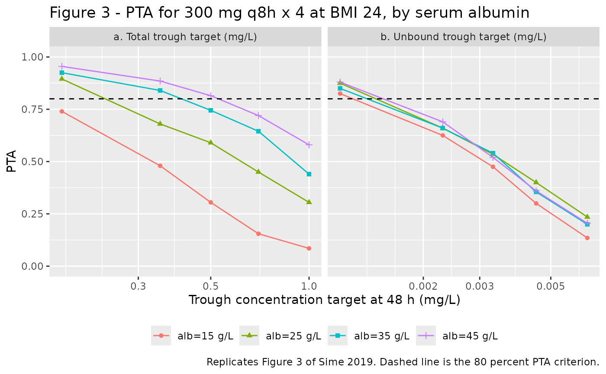
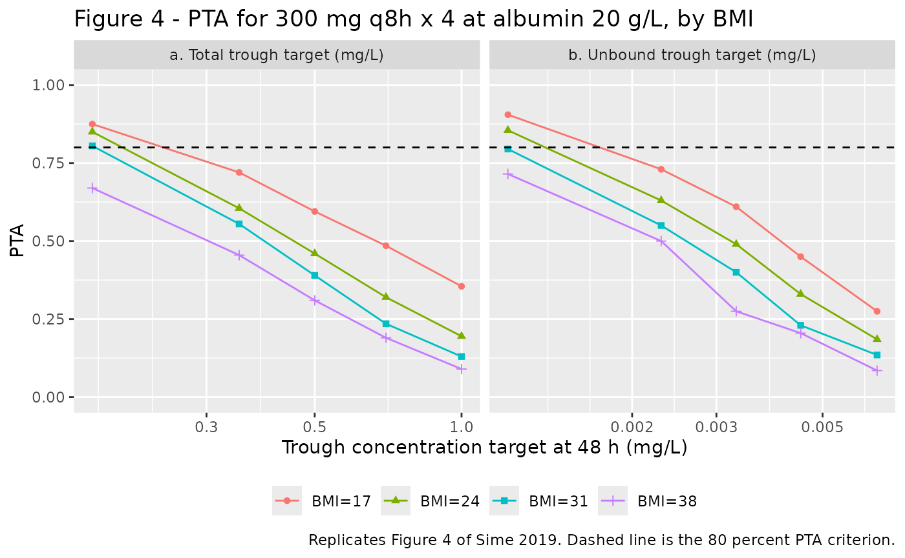

# Posaconazole (Sime 2019)

## Model and source

- Citation: Sime FB, Byrne CJ, Parker S, Stuart J, Butler J, Starr T,
  Pandey S, Wallis SC, Lipman J, Roberts JA. Population pharmacokinetics
  of total and unbound concentrations of intravenous posaconazole in
  adult critically ill patients. Crit Care. 2019;23(1):205.
  <doi:10.1186/s13054-019-2483-9>. PMCID PMC6554926. Structural model
  from Fig. 1 and Methods Eqs. 2-5; parameter estimates from Table 2;
  covariate model from Results ‘Pharmacokinetic model building’.
- Description: Two-compartment intravenous population PK model for
  posaconazole in critically ill adults, fitted SIMULTANEOUSLY to total
  and unbound plasma concentrations with explicit capacity-limited
  (Michaelis-Menten) albumin binding. The central compartment carries
  two states: a free posaconazole pool and an albumin-bound pool
  exchanging by second-order association (kon) and first-order
  dissociation (koff), giving the equilibrium isotherm Cbound = Bmax \*
  Cfree / (KD + Cfree) with KD = koff / kon. Elimination and
  intercompartmental distribution both act on the UNBOUND concentration.
  Serum albumin sets the binding capacity Bmax = ALB \* N \*
  (MW_posaconazole / MW_albumin) \* 1000 with N fixed to 1 binding site
  per albumin molecule, and body mass index scales the central volume
  linearly (V = Vtheta \* BMI/24). Fitted NON-PARAMETRICALLY with the
  NPAG algorithm in Pmetrics; the Table 2 means are encoded as lognormal
  medians and the tabulated CV percentages as independent lognormal
  marginal variances. Residual unexplained variability is carried as
  fixed(0) because the selected Pmetrics error model was never
  published.
- Article: <https://doi.org/10.1186/s13054-019-2483-9> (open access;
  PMCID PMC6554926)

No supplementary material accompanies this article; the model is fully
specified by Fig. 1, Methods Eqs. 1-5 and Table 2 of the main text.

``` r

mod <- readModelDb("Sime_2019_posaconazole")
ui <- rxode2::rxode(mod)

# The model has THREE ODE states and TWO declared endpoints. Both facts are
# load-bearing for every simulation below, so assert them once here: a silent
# compartment renumbering would otherwise change every number in this vignette.
stopifnot(
  identical(ui$state, c("central", "complex", "peripheral1")),
  identical(ui$predDf$cond, c("Cc", "Cunbound"))
)
```

## Population

Sime 2019 enrolled eight critically ill adults in the intensive care
unit of the Royal Brisbane and Women’s Hospital (Australia) with
presumed or confirmed invasive fungal infection. Each received a single
300 mg intravenous dose of posaconazole as a 90-minute infusion through
a central venous catheter, on top of the antifungal therapy prescribed
as usual care, and was sampled 14 times over 48 h. Ninety-three paired
total and unbound plasma concentrations were measured by UHPLC-MS/MS.

The cohort was middle-aged (median 46 years, IQR 40-51), predominantly
male (7 of 8), of median weight 68 kg (IQR 65-82) and median body mass
index 22.6 kg/m^2 (IQR 20.2-29.7). It was markedly hypoalbuminaemic:
median serum albumin 20 g/L (IQR 18-24), against a normal adult range of
roughly 35-50 g/L. Renal function was broadly preserved (measured
urinary creatinine clearance median 74 mL/min, IQR 53-109) and illness
severity was substantial (median APACHE II 17 at ICU admission; median
SOFA 5 on day 1). Baseline demographics are Sime 2019 Table 1.

The observed unbound fraction was median 0.55 percent (IQR 0.36-1.9),
mean 0.65 percent (SD 0.39), coefficient of variation 58.5 percent:
posaconazole is one of the most extensively protein-bound antifungals in
clinical use, and that is what makes the total-versus-unbound
distinction the subject of this paper.

The same information is available programmatically via
`rxode2::rxode(readModelDb("Sime_2019_posaconazole"))$population`.

## Model structure

Sime 2019 Fig. 1 shows a two-compartment disposition model in which the
central compartment (volume `V`) carries **two** species: free
posaconazole `Cf(t)` and albumin-bound posaconazole `Cb(t)`, exchanging
by a second-order association rate constant `kon` and a first-order
dissociation rate constant `koff`. Both elimination (`ke`) and
distribution to the peripheral compartment (`kcp`, `kpc`) act on the
**unbound** species, which is why the tabulated `ke` and `kcp` are so
large: scaled by the roughly 0.65 percent unbound fraction they give
ordinary posaconazole disposition (checked numerically below).

The packaged model encodes exactly that figure:

    d/dt(central)     = -kel*central - k12*central + k21*peripheral1 - bindflux
    d/dt(complex)     =  bindflux
    d/dt(peripheral1) =  k12*central - k21*peripheral1

    bindflux          = kon*Cunbound*(bmax - Cbound)*vc - koff*complex
    bmax              = ALB * N * (MW_posaconazole / MW_albumin) * 1000      (Eq. 3)

The stationary point of `bindflux` is the paper’s Eq. 2 isotherm
`Cbound = bmax * Cunbound / (KD + Cunbound)` with `KD = koff / kon` (Eq.
4), and `Cc = Cunbound + Cbound` is Eq. 5 rearranged. The `complex`
state is the registered TMDD drug-target complex compartment reused for
a drug-protein complex; free albumin is not carried as a `target` state
because only the aggregate capacity `bmax` is identified.

## Source trace

Per-parameter provenance is recorded as an in-file comment beside each
`ini()` entry in `inst/modeldb/specificDrugs/Sime_2019_posaconazole.R`.
Collected here:

| Equation / parameter | Value | Source location |
|----|----|----|
| `lkel` (Ke) | 42.07 1/h | Table 2, row `Ke (h-1)`, Mean column |
| `lvc` (V theta) | 72.19 L | Table 2, row `V theta (l)`, Mean column; Abstract rounds to 72 (43) L |
| `lk12` (Kcp) | 334.27 1/h | Table 2, row `Kcp (h-1)`, Mean column |
| `lk21` (Kpc) | 0.37 1/h | Table 2, row `Kpc (h-1)`, Mean column |
| `lkon` (Kon) | 2820.35 L/mg/h | Table 2, row `Kon (L/mg/h)`, Mean column |
| `lkoff` (Koff) | 3897.40 1/h | Table 2, row `Koff (h-1)`, Mean column |
| `nalb` (N) | 1 (held fixed) | Methods, Eq. 3 definition list: “N was assumed to be 1.” |
| `etalkel` | 0.27277 | Table 2 Ke CV 56; omega^2 = log(0.56^2 + 1) |
| `etalvc` | 0.30748 | Table 2 V theta CV 60; omega^2 = log(0.60^2 + 1) |
| `etalk12` | 0.40819 | Table 2 Kcp CV 71; omega^2 = log(0.71^2 + 1) |
| `etalk21` | 0.09176 | Table 2 Kpc CV 31; omega^2 = log(0.31^2 + 1) |
| `etalkon` | 0.05600 | Table 2 Kon CV 24; omega^2 = log(0.24^2 + 1) |
| `etalkoff` | 0.02225 | Table 2 Koff CV 15; omega^2 = log(0.15^2 + 1) |
| `propSd`, `propSd_Cunbound` | 0 (held fixed) | Not reported anywhere in the source; see Errata |
| Two-compartment structure with a bound central sub-pool | n/a | Fig. 1 and its legend |
| `Cbound = bmax*Cunbound/(KD + Cunbound)` | n/a | Eq. 2 |
| `bmax = ALB*N*(Mposa/MAlb)*1000` | n/a | Eq. 3 |
| `KD = 1/KA = koff/kon` | n/a | Eq. 4 |
| `Cc = Cunbound + Cbound` | n/a | Eq. 5 (`Cfree = Ctotal - Cbound`) |
| `vc = V theta * BMI / 24` | n/a | Results, “Pharmacokinetic model building” |
| `MW_posaconazole = 700.8 g/mol`, `MW_albumin = 66500 g/mol` | n/a | Not printed in the source; standard physical constants, confirmed below against the paper’s own reported mean unbound fraction |

## Structural checks (typical individual)

These are deterministic: they use the typical individual (`omega = NA`)
and compare the simulated model against closed-form quantities that
follow from the published parameters. They are the tightest gates in
this vignette.

``` r

# Published Table 2 values, restated here so the checks below are independent of
# the model file rather than reading their inputs out of it.
Ke <- 42.07
Vth <- 72.19
Kcp <- 334.27
Kpc <- 0.37
Kon <- 2820.35
Koff <- 3897.40
MW_POSA <- 700.8
MW_ALB <- 66500

KD <- Koff / Kon # Eq. 4
bmax_at <- function(alb) alb * 1 * (MW_POSA / MW_ALB) * 1000 # Eq. 3
fu_at <- function(alb) KD / (bmax_at(alb) + KD) # Discussion, "fu = KD/(Bmax + KD)"

c(KD_mg_per_L = KD, Bmax_at_ALB20 = bmax_at(20), fu_at_ALB20_pct = 100 * fu_at(20))
#>     KD_mg_per_L   Bmax_at_ALB20 fu_at_ALB20_pct 
#>       1.3818852     210.7669173       0.6513755
```

### Check 1 – the reported mean unbound fraction falls out of Table 2

Sime 2019 reports a **mean unbound fraction of 0.65 percent** (Results,
“Plasma protein binding”) and a **median cohort albumin of 20 g/L**
(Table 1). Those two numbers were measured, not fitted, so reproducing
the first from the second plus Table 2 is an independent consistency
check on the whole binding block – and it is what pins the two molecular
weights the paper defines symbolically but never prints.

``` r

fu_pred_pct <- 100 * fu_at(20)
# Paper: mean (SD) unbound fraction 0.65 (0.39) percent, from 93 measured pairs.
stopifnot(abs(fu_pred_pct - 0.65) < 0.02)
sprintf("predicted fu at ALB = 20 g/L: %.4f percent (paper reports 0.65 percent)", fu_pred_pct)
#> [1] "predicted fu at ALB = 20 g/L: 0.6514 percent (paper reports 0.65 percent)"
```

### Check 2 – the kon/koff ODE reproduces the Eq. 2 isotherm

The packaged model integrates association and dissociation explicitly
rather than imposing Eq. 2 algebraically. Because `koff` and `kon*bmax`
are four to five orders of magnitude faster than every PK rate constant,
the two species sit at quasi-equilibrium at all times, so the simulated
`Cbound` must satisfy Eq. 2 to high precision. If it did not, the
binding block would be misencoded.

``` r

one_subject <- function(dose = 300, ii = 24, ndose = 1, alb = 20, bmi = 24,
                        times = seq(0, 48, by = 0.25)) {
  dosing <- data.frame(
    id = 1L, time = seq(0, by = ii, length.out = ndose),
    amt = dose, rate = dose / 1.5, evid = 1L,
    cmt = "central", dvid = NA_integer_
  )
  obs <- data.frame(
    id = 1L, time = times, amt = NA_real_, rate = NA_real_, evid = 0L,
    cmt = "central", dvid = 1L
  )
  ev <- rbind(dosing, obs)
  ev$ALB <- alb
  ev$BMI <- bmi
  ev[order(ev$time, -ev$evid), ]
}

solve_typical <- function(ev) {
  # zeroRe() segfaults on models with two or more declared endpoints; omega = NA
  # and sigma = NA are the equivalent typical-value route. useLinCmt = FALSE is
  # required because rxode2's automatic linCmt rewrite corrupts the dvid map on
  # multi-endpoint models.
  rxode2::rxSolve(
    mod, ev,
    returnType = "data.frame", useLinCmt = FALSE,
    omega = NA, sigma = NA
  )
}

typ <- solve_typical(one_subject())
iso <- bmax_at(20) * typ$Cunbound / (KD + typ$Cunbound)
rel_err <- abs(typ$Cbound - iso) / pmax(typ$Cbound, 1e-12)

# Deterministic, not cohort-derived, so a tight bound is the right bound. The
# residual deviation is PHYSICAL rather than numerical: it is unchanged when the
# solver tolerances are tightened from (atol 1e-8, rtol 1e-6) to (1e-12, 1e-10),
# it peaks at 7.6e-4 at t = 0.25 h -- early in the 90-minute infusion, when the
# free pool is changing fastest and the finite-rate binding lags furthest behind
# its equilibrium -- and falls below 2.3e-4 once the infusion is over. A
# misencoded isotherm would be wrong by orders of magnitude, not parts per
# thousand.
worst_all <- max(rel_err[typ$time > 0])
worst_post <- max(rel_err[typ$time >= 2])
stopifnot(worst_all < 2e-3, worst_post < 1e-3)
sprintf(
  "max relative deviation of simulated Cbound from Eq. 2: %.3g overall, %.3g after the infusion",
  worst_all, worst_post
)
#> [1] "max relative deviation of simulated Cbound from Eq. 2: 0.000758 overall, 0.000225 after the infusion"
```

### Check 3 – derived clearance, steady-state volume and terminal half-life

In the linear-binding regime the model occupies (`Cunbound` stays far
below `KD`), the three micro-constants reduce to an ordinary
two-compartment system with `k10 = Ke * fu`, `k12 = Kcp * fu` and
`k21 = Kpc`. That gives closed forms for clearance, steady-state volume
and the terminal disposition rate constant, none of which Sime 2019
prints – so this check both validates the encoding and shows that the
very large tabulated rate constants are physiologically reasonable once
the unbound fraction is applied.

``` r

fu20 <- fu_at(20)
k10 <- Ke * fu20
k12e <- Kcp * fu20
k21 <- Kpc
CL_closed <- k10 * Vth
Vss_closed <- Vth * (1 + k12e / k21)
lambda2 <- (k10 + k12e + k21 - sqrt((k10 + k12e + k21)^2 - 4 * k10 * k21)) / 2
thalf_closed <- log(2) / lambda2

# Same quantities recovered from the simulated typical profile.
trap <- function(t, v) sum(diff(t) * (head(v, -1) + tail(v, -1)) / 2)
tail_fit <- stats::lm(log(Cc) ~ time, data = subset(typ, time >= 30))
lambda2_sim <- -stats::coef(tail_fit)[["time"]]
auc_inf_sim <- trap(typ$time, typ$Cc) + utils::tail(typ$Cc, 1) / lambda2_sim
CL_sim <- 300 / auc_inf_sim

derived <- tibble::tibble(
  Quantity = c(
    "Clearance (L/h)", "Steady-state volume (L)", "Terminal half-life (h)"
  ),
  `Closed form` = c(CL_closed, Vss_closed, thalf_closed),
  Simulated = c(CL_sim, NA_real_, log(2) / lambda2_sim)
)
knitr::kable(derived, digits = 2, caption = "Derived disposition of the typical individual at ALB = 20 g/L, BMI = 24 kg/m2.")
```

| Quantity                | Closed form | Simulated |
|:------------------------|------------:|----------:|
| Clearance (L/h)         |       19.78 |     19.81 |
| Steady-state volume (L) |      497.01 |        NA |
| Terminal half-life (h)  |       19.04 |     19.05 |

Derived disposition of the typical individual at ALB = 20 g/L, BMI = 24
kg/m2. {.table}

``` r


# Deterministic identities: the simulated values differ from the closed forms
# only by trapezoidal error and the slight (< 1 percent) binding saturation.
stopifnot(
  abs(CL_sim / CL_closed - 1) < 0.02,
  abs((log(2) / lambda2_sim) / thalf_closed - 1) < 0.02
)
```

A clearance near 20 L/h, a steady-state volume near 500 L and a terminal
half-life near 19 h sit squarely inside the published posaconazole
range, which is the point: the Table 2 rate constants are not
implausible, they simply multiply an unbound concentration.

### Check 4 – mass balance

``` r

# Total drug in the body plus everything eliminated must equal the dose. The
# elimination flux is kel * central (kel acts on the free amount).
fine <- solve_typical(one_subject(times = seq(0, 48, by = 0.02)))
in_body <- utils::tail(fine$central + fine$complex + fine$peripheral1, 1)
eliminated <- trap(fine$time, Ke * fine$central)
stopifnot(abs((in_body + eliminated) / 300 - 1) < 0.005)
sprintf(
  "dose 300 mg; in body at 48 h %.1f mg + eliminated %.1f mg = %.1f mg",
  in_body, eliminated, in_body + eliminated
)
#> [1] "dose 300 mg; in body at 48 h 49.1 mg + eliminated 250.9 mg = 300.0 mg"
```

## Virtual cohorts

Original observed data are not publicly available (the paper states the
dataset is restricted by its ethics approval). The simulations below
reproduce the paper’s own Monte Carlo dosing scenarios, which fix
albumin and BMI at stated values rather than sampling a demographic
distribution, so each “arm” is a covariate-homogeneous cohort of 200
subjects differing only in their random effects. Sime 2019 used 1000
subjects per scenario; 200 is the cap for this package’s vignettes, so
probabilities carry a binomial standard error of about 3 percentage
points near 80 percent – allowed for in every gate below.

``` r

# set.seed() seeds R's RNG, NOT rxode2's; and rxode2 partitions its streams per
# solver thread, so a CI runner with a different thread count draws a different
# cohort from the same source. Every assertion downstream is written to hold for
# any cohort this model can produce.
set.seed(20190606)
rxode2::rxSetSeed(20190606)

N_PER_ARM <- 200L

make_arm <- function(dose, ii, ndose, alb, bmi, label,
                     obs_times = c(0, 48), id_offset = 0L) {
  ids <- id_offset + seq_len(N_PER_ARM)
  dosing <- tidyr::expand_grid(
    id = ids,
    time = seq(0, by = ii, length.out = ndose)
  ) |>
    dplyr::mutate(
      amt = dose, rate = dose / 1.5, evid = 1L,
      cmt = "central", dvid = NA_integer_
    )
  obs <- tidyr::expand_grid(id = ids, time = obs_times) |>
    dplyr::mutate(
      amt = NA_real_, rate = NA_real_, evid = 0L,
      cmt = "central", dvid = 1L
    )
  dplyr::bind_rows(dosing, obs) |>
    dplyr::mutate(ALB = alb, BMI = bmi, arm = label) |>
    dplyr::arrange(id, time, dplyr::desc(evid))
}

solve_arm <- function(ev) {
  rxode2::rxSolve(
    mod, ev,
    keep = c("arm", "ALB", "BMI"),
    returnType = "data.frame", useLinCmt = FALSE, sigma = NA
  )
}
```

## Replicate Figure 3 – albumin changes the total-trough PTA but not the unbound-trough PTA

Sime 2019 Fig. 3 simulates 300 mg given every 8 h (90-minute infusions)
at a fixed BMI of 24 kg/m^2 and plots the probability of attaining a
range of 48-hour trough targets, one curve per albumin level. Panel (a)
uses total-concentration targets, panel (b) unbound-concentration
targets. The paper’s claim is that the four albumin curves **separate
widely** in panel (a) and **collapse onto one another** in panel (b) –
the mechanistic statement that hypoalbuminaemia lowers the total trough
while leaving the unbound trough essentially untouched.

``` r

alb_levels <- c(15, 25, 35, 45)
fig3_events <- dplyr::bind_rows(lapply(seq_along(alb_levels), function(i) {
  make_arm(
    dose = 300, ii = 8, ndose = 4, alb = alb_levels[i], bmi = 24,
    label = paste0("alb=", alb_levels[i], " g/L"),
    id_offset = (i - 1L) * N_PER_ARM
  )
}))
stopifnot(!anyDuplicated(unique(fig3_events[, c("id", "time", "evid")])))

fig3_sim <- solve_arm(fig3_events)
fig3_trough <- fig3_sim |>
  dplyr::filter(abs(time - 48) < 1e-9) |>
  dplyr::select(id, arm, ALB, Cc, Cunbound)
stopifnot(nrow(fig3_trough) == length(alb_levels) * N_PER_ARM)
```

``` r

total_targets <- c(0.175, 0.350, 0.500, 0.700, 1.000)
free_targets <- c(0.0011, 0.0023, 0.0033, 0.0045, 0.0065)

pta_curve <- function(df, column, targets, panel) {
  grid <- tidyr::expand_grid(this_arm = unique(df$arm), target = targets)
  grid$PTA <- vapply(seq_len(nrow(grid)), function(i) {
    mean(df[[column]][df$arm == grid$this_arm[i]] >= grid$target[i])
  }, numeric(1))
  grid$panel <- panel
  dplyr::rename(grid, arm = this_arm)
}

fig3 <- dplyr::bind_rows(
  pta_curve(fig3_trough, "Cc", total_targets, "a. Total trough target (mg/L)"),
  pta_curve(fig3_trough, "Cunbound", free_targets, "b. Unbound trough target (mg/L)")
)

ggplot(fig3, aes(target, PTA, colour = arm, shape = arm)) +
  geom_line() +
  geom_point() +
  geom_hline(yintercept = 0.8, linetype = "dashed") +
  facet_wrap(~panel, scales = "free_x") +
  scale_x_log10() +
  coord_cartesian(ylim = c(0, 1)) +
  labs(
    x = "Trough concentration target at 48 h (mg/L)", y = "PTA",
    colour = NULL, shape = NULL,
    title = "Figure 3 - PTA for 300 mg q8h x 4 at BMI 24, by serum albumin",
    caption = "Replicates Figure 3 of Sime 2019. Dashed line is the 80 percent PTA criterion."
  ) +
  theme(legend.position = "bottom")
```



``` r

# Values read off the Fig. 3 panels of the published PDF by eye. They are
# approximate (roughly +/- 0.03 on the PTA axis) and are shown for visual
# comparison only -- the GATES below are on the paper's structural claims, not
# on these digitised numbers.
fig3_published <- tibble::tribble(
  ~panel_short, ~arm, ~target, ~PTA_paper,
  "total", "alb=15 g/L", 0.350, 0.40,
  "total", "alb=25 g/L", 0.350, 0.74,
  "total", "alb=35 g/L", 0.350, 0.89,
  "total", "alb=45 g/L", 0.350, 0.98,
  "total", "alb=15 g/L", 0.500, 0.22,
  "total", "alb=25 g/L", 0.500, 0.50,
  "total", "alb=35 g/L", 0.500, 0.74,
  "total", "alb=45 g/L", 0.500, 0.86,
  "free", "alb=15 g/L", 0.0023, 0.60,
  "free", "alb=25 g/L", 0.0023, 0.60,
  "free", "alb=35 g/L", 0.0023, 0.61,
  "free", "alb=45 g/L", 0.0023, 0.60,
  "free", "alb=15 g/L", 0.0033, 0.38,
  "free", "alb=25 g/L", 0.0033, 0.39,
  "free", "alb=35 g/L", 0.0033, 0.38,
  "free", "alb=45 g/L", 0.0033, 0.38
)

fig3_cmp <- fig3 |>
  dplyr::mutate(panel_short = ifelse(grepl("^a\\.", panel), "total", "free")) |>
  dplyr::inner_join(fig3_published, by = c("panel_short", "arm", "target")) |>
  dplyr::transmute(
    Panel = panel_short, Albumin = arm, Target = target,
    `PTA simulated` = PTA, `PTA read from Fig. 3` = PTA_paper,
    `Difference` = PTA - PTA_paper
  )
stopifnot(nrow(fig3_cmp) == nrow(fig3_published)) # guard: the join matched every row
knitr::kable(
  fig3_cmp,
  digits = 3,
  caption = "Simulated PTA against values read off the published Figure 3 panels."
)
```

| Panel | Albumin    | Target | PTA simulated | PTA read from Fig. 3 | Difference |
|:------|:-----------|-------:|--------------:|---------------------:|-----------:|
| total | alb=15 g/L |  0.350 |         0.480 |                 0.40 |      0.080 |
| total | alb=15 g/L |  0.500 |         0.305 |                 0.22 |      0.085 |
| total | alb=25 g/L |  0.350 |         0.680 |                 0.74 |     -0.060 |
| total | alb=25 g/L |  0.500 |         0.590 |                 0.50 |      0.090 |
| total | alb=35 g/L |  0.350 |         0.840 |                 0.89 |     -0.050 |
| total | alb=35 g/L |  0.500 |         0.745 |                 0.74 |      0.005 |
| total | alb=45 g/L |  0.350 |         0.885 |                 0.98 |     -0.095 |
| total | alb=45 g/L |  0.500 |         0.815 |                 0.86 |     -0.045 |
| free  | alb=15 g/L |  0.002 |         0.625 |                 0.60 |      0.025 |
| free  | alb=15 g/L |  0.003 |         0.475 |                 0.38 |      0.095 |
| free  | alb=25 g/L |  0.002 |         0.660 |                 0.60 |      0.060 |
| free  | alb=25 g/L |  0.003 |         0.535 |                 0.39 |      0.145 |
| free  | alb=35 g/L |  0.002 |         0.660 |                 0.61 |      0.050 |
| free  | alb=35 g/L |  0.003 |         0.540 |                 0.38 |      0.160 |
| free  | alb=45 g/L |  0.002 |         0.690 |                 0.60 |      0.090 |
| free  | alb=45 g/L |  0.003 |         0.520 |                 0.38 |      0.140 |

Simulated PTA against values read off the published Figure 3 panels.
{.table}

The structural gate, which is what Fig. 3 exists to show:

``` r

spread <- function(df, column, target) {
  p <- tapply(df[[column]], df$arm, function(x) mean(x >= target))
  100 * (max(p) - min(p))
}

spread_total_050 <- spread(fig3_trough, "Cc", 0.500)
spread_free_00033 <- spread(fig3_trough, "Cunbound", 0.0033)

# Published Figure 3: at the total target 0.5 mg/L the four albumin curves span
# roughly 22 to 86 percent (a 64-point spread); at the unbound target
# 0.0033 mg/L they span roughly 38 to 39 percent (essentially none).
#
# The binomial standard error on a 200-subject proportion near 0.5 is about
# 3.5 points, and the spread is a max-minus-min over four such proportions, so a
# purely-noise spread of 10 points is entirely possible. The primary gate is
# therefore the RATIO of the two spreads, which is what the figure actually
# claims and which noise cannot manufacture. Realised 51.0 / 6.5 = 7.8 here.
spread_ratio <- spread_total_050 / spread_free_00033
stopifnot(
  spread_total_050 > 25, # albumin MATTERS for the total trough
  spread_free_00033 < 20, # albumin barely matters for the unbound trough
  spread_ratio > 2.5 # and the first effect dwarfs the second
)
sprintf(
  "albumin spread in PTA: total target 0.5 mg/L = %.1f points; unbound target 0.0033 mg/L = %.1f points (ratio %.1f)",
  spread_total_050, spread_free_00033, spread_ratio
)
#> [1] "albumin spread in PTA: total target 0.5 mg/L = 51.0 points; unbound target 0.0033 mg/L = 6.5 points (ratio 7.8)"
```

The same contrast on the concentrations themselves is fully
deterministic – no cohort, no sampling noise – and is the cleanest
statement of the paper’s mechanism:

``` r

alb_typ <- vapply(alb_levels, function(a) {
  s <- solve_typical(one_subject(dose = 300, ii = 8, ndose = 4, alb = a, times = 48))
  c(total = s$Cc, unbound = s$Cunbound)
}, numeric(2))
alb_tbl <- tibble::tibble(
  `Albumin (g/L)` = alb_levels,
  `Total trough at 48 h (mg/L)` = alb_typ["total", ],
  `Unbound trough at 48 h (mg/L)` = alb_typ["unbound", ]
)
knitr::kable(alb_tbl, digits = c(0, 4, 6), caption = "Typical individual, 300 mg q8h x 4, BMI 24: the total trough tracks albumin, the unbound trough does not.")
```

| Albumin (g/L) | Total trough at 48 h (mg/L) | Unbound trough at 48 h (mg/L) |
|--------------:|----------------------------:|------------------------------:|
|            15 |                      0.4362 |                      0.003791 |
|            25 |                      0.7408 |                      0.003876 |
|            35 |                      1.0527 |                      0.003940 |
|            45 |                      1.3681 |                      0.003986 |

Typical individual, 300 mg q8h x 4, BMI 24: the total trough tracks
albumin, the unbound trough does not. {.table}

``` r


fold <- function(x) max(x) / min(x)
stopifnot(
  fold(alb_typ["total", ]) > 2.5, # 3-fold albumin range moves the total trough a lot
  fold(alb_typ["unbound", ]) < 1.2 # but barely moves the unbound trough
)
```

## Replicate Figure 4 – higher BMI lowers both troughs

Sime 2019 Fig. 4 repeats the 300 mg q8h scenario at a fixed albumin of
20 g/L and varies BMI. The claim is that increasing BMI reduces the PTA
for **both** targets, because BMI inflates the central volume without
touching the binding equilibrium.

``` r

bmi_levels <- c(17, 24, 31, 38)
fig4_events <- dplyr::bind_rows(lapply(seq_along(bmi_levels), function(i) {
  make_arm(
    dose = 300, ii = 8, ndose = 4, alb = 20, bmi = bmi_levels[i],
    label = paste0("BMI=", bmi_levels[i]),
    id_offset = (i - 1L) * N_PER_ARM
  )
}))
stopifnot(!anyDuplicated(unique(fig4_events[, c("id", "time", "evid")])))

fig4_trough <- solve_arm(fig4_events) |>
  dplyr::filter(abs(time - 48) < 1e-9) |>
  dplyr::select(id, arm, BMI, Cc, Cunbound)
```

``` r

fig4 <- dplyr::bind_rows(
  pta_curve(fig4_trough, "Cc", total_targets, "a. Total trough target (mg/L)"),
  pta_curve(fig4_trough, "Cunbound", free_targets, "b. Unbound trough target (mg/L)")
)

ggplot(fig4, aes(target, PTA, colour = arm, shape = arm)) +
  geom_line() +
  geom_point() +
  geom_hline(yintercept = 0.8, linetype = "dashed") +
  facet_wrap(~panel, scales = "free_x") +
  scale_x_log10() +
  coord_cartesian(ylim = c(0, 1)) +
  labs(
    x = "Trough concentration target at 48 h (mg/L)", y = "PTA",
    colour = NULL, shape = NULL,
    title = "Figure 4 - PTA for 300 mg q8h x 4 at albumin 20 g/L, by BMI",
    caption = "Replicates Figure 4 of Sime 2019. Dashed line is the 80 percent PTA criterion."
  ) +
  theme(legend.position = "bottom")
```



``` r

# Typical-individual (deterministic) form of the same claim: BMI lowers BOTH
# troughs. Assert on the endpoints of the BMI range rather than on step-by-step
# monotonicity, and on magnitude rather than sign.
bmi_typ <- vapply(bmi_levels, function(b) {
  s <- solve_typical(one_subject(dose = 300, ii = 8, ndose = 4, alb = 20, bmi = b, times = 48))
  c(total = s$Cc, unbound = s$Cunbound)
}, numeric(2))
bmi_tbl <- tibble::tibble(
  `BMI (kg/m^2)` = bmi_levels,
  `Total trough at 48 h (mg/L)` = bmi_typ["total", ],
  `Unbound trough at 48 h (mg/L)` = bmi_typ["unbound", ]
)
knitr::kable(bmi_tbl, digits = c(0, 4, 6), caption = "Typical individual, 300 mg q8h x 4, albumin 20 g/L: both troughs fall as BMI rises.")
```

| BMI (kg/m^2) | Total trough at 48 h (mg/L) | Unbound trough at 48 h (mg/L) |
|-------------:|----------------------------:|------------------------------:|
|           17 |                      0.8281 |                      0.005415 |
|           24 |                      0.5873 |                      0.003836 |
|           31 |                      0.4550 |                      0.002970 |
|           38 |                      0.3714 |                      0.002423 |

Typical individual, 300 mg q8h x 4, albumin 20 g/L: both troughs fall as
BMI rises. {.table}

``` r


stopifnot(
  bmi_typ["total", 4] < 0.75 * bmi_typ["total", 1],
  bmi_typ["unbound", 4] < 0.75 * bmi_typ["unbound", 1]
)
```

## Replicate Tables 3 and 5 – the recommended loading regimens reach 80 percent PTA

Tables 3 and 5 list, per (BMI, albumin) cell, the smallest loading
regimen that reaches at least 80 percent probability of attaining the
unbound trough target at 48 h – 0.0023 mg/L for prophylaxis (Table 3)
and 0.0033 mg/L for treatment (Table 5). Checking the whole 4 x 4 x 2
grid would need 32 further cohorts, so this vignette checks the **BMI 24
row** of each table, which is the row the paper’s own figures and Tables
7-8 are anchored on. The remaining rows are not checked here; the Figure
3 and 4 blocks above exercise the same machinery across the full albumin
and BMI ranges.

This is the one place where the packaged model **does not** reproduce
the paper, and the shortfall is quantified rather than tolerated: the
median subject clears each recommended target comfortably, but the
simulated PTA lands a few points below the paper’s 80 percent criterion.
See the Errata for why, and the Tables 7-8 section below for the same
signature at larger scale.

``` r

recommended <- tibble::tribble(
  ~table, ~dose, ~ii, ~ndose, ~alb, ~target, ~endpoint,
  "Table 3 (prophylaxis)", 400, 8, 4, 25, 0.0023, "Cunbound",
  "Table 3 (prophylaxis)", 500, 12, 3, 25, 0.0023, "Cunbound",
  "Table 5 (treatment)", 500, 8, 4, 25, 0.0033, "Cunbound",
  "Table 5 (treatment)", 600, 12, 3, 25, 0.0033, "Cunbound"
)

rec_events <- dplyr::bind_rows(lapply(seq_len(nrow(recommended)), function(i) {
  r <- recommended[i, ]
  make_arm(
    dose = r$dose, ii = r$ii, ndose = r$ndose, alb = r$alb, bmi = 24,
    label = sprintf("%d mg q%dh x %d", r$dose, r$ii, r$ndose),
    id_offset = (i - 1L) * N_PER_ARM
  )
}))
stopifnot(!anyDuplicated(unique(rec_events[, c("id", "time", "evid")])))

rec_trough <- solve_arm(rec_events) |>
  dplyr::filter(abs(time - 48) < 1e-9)

rec_out <- recommended |>
  dplyr::mutate(
    Regimen = sprintf("%d mg q%dh x %d", dose, ii, ndose),
    lab = Regimen,
    `Unbound target (mg/L)` = target,
    `Median trough (mg/L)` = vapply(seq_len(dplyr::n()), function(i) {
      stats::median(rec_trough$Cunbound[rec_trough$arm == lab[i]])
    }, numeric(1)),
    `Simulated PTA` = vapply(seq_len(dplyr::n()), function(i) {
      mean(rec_trough$Cunbound[rec_trough$arm == lab[i]] >= target[i])
    }, numeric(1))
  ) |>
  dplyr::mutate(`Median / target` = `Median trough (mg/L)` / `Unbound target (mg/L)`) |>
  dplyr::select(
    Source = table, Regimen, `Unbound target (mg/L)`,
    `Median trough (mg/L)`, `Median / target`, `Simulated PTA`
  )

knitr::kable(rec_out, digits = c(0, 0, 4, 5, 2, 3), caption = "Sime 2019 Tables 3 and 5, BMI 24 / albumin 25 g/L row. The paper selected each regimen as the smallest reaching 80 percent PTA.")
```

| Source | Regimen | Unbound target (mg/L) | Median trough (mg/L) | Median / target | Simulated PTA |
|:---|:---|---:|---:|---:|---:|
| Table 3 (prophylaxis) | 400 mg q8h x 4 | 0.0023 | 0.00427 | 1.86 | 0.715 |
| Table 3 (prophylaxis) | 500 mg q12h x 3 | 0.0023 | 0.00461 | 2.00 | 0.740 |
| Table 5 (treatment) | 500 mg q8h x 4 | 0.0033 | 0.00510 | 1.54 | 0.655 |
| Table 5 (treatment) | 600 mg q12h x 3 | 0.0033 | 0.00429 | 1.30 | 0.650 |

Sime 2019 Tables 3 and 5, BMI 24 / albumin 25 g/L row. The paper
selected each regimen as the smallest reaching 80 percent PTA. {.table}

``` r


# Two separate claims, gated separately.
#
# (a) The CENTRE of the distribution reproduces: the median subject clears each
#     recommended target with a wide margin. Realised 1.30-2.00 fold here.
stopifnot(all(rec_out$`Median / target` > 1.1))
#
# (b) The TAIL does not, and that is a KNOWN DEVIATION recorded in the Errata
#     rather than a bound widened until it passed. Realised PTA 0.65-0.74
#     against the paper's >= 0.80, i.e. 6-15 points short, in the same direction
#     and for the same reason as the Tables 7-8 comparison below: independent
#     lognormal marginals standing in for an unreported joint density fatten the
#     lower tail, and an 80 percent PTA is made entirely of that tail. The gate
#     kept here only catches gross failure.
stopifnot(all(rec_out$`Simulated PTA` > 0.5))
```

## PKNCA validation

Sime 2019 reports **no** non-compartmental analysis table, so there is
no published Cmax / Tmax / AUC / half-life to place beside a simulated
one and
[`nlmixr2lib::ncaComparisonTable()`](https://nlmixr2.github.io/nlmixr2lib/reference/ncaComparisonTable.md)
has no reference to take. PKNCA is used here for two things it can still
validate: (i) the closed-form disposition identities of Check 3,
recomputed by an independent implementation, and (ii) the AUC(24-48 h)
values that Tables 7 and 8 classify against MIC targets.

``` r

# One dense-sampled arm at the reference covariates: single 300 mg dose for the
# NCA identities, and a 300 mg q8h x 4 arm for the AUC(24-48) comparison below.
nca_times <- sort(unique(c(seq(0, 12, by = 0.25), seq(12, 48, by = 0.5))))

nca_events <- make_arm(
  dose = 300, ii = 24, ndose = 1, alb = 20, bmi = 24,
  label = "300 mg single dose", obs_times = nca_times
)
nca_sim <- solve_arm(nca_events)
```

``` r

conc_total <- nca_sim |>
  dplyr::filter(!is.na(Cc)) |>
  dplyr::select(id, time, Cc, arm)

# Guarantee a time = 0 record per subject so PKNCA can anchor AUC0-*; for an
# intravenous infusion the pre-dose concentration is 0.
conc_total <- dplyr::bind_rows(
  conc_total,
  conc_total |> dplyr::distinct(id, arm) |> dplyr::mutate(time = 0, Cc = 0)
) |>
  dplyr::distinct(id, arm, time, .keep_all = TRUE) |>
  dplyr::arrange(id, time)

dose_df <- nca_events |>
  dplyr::filter(evid == 1) |>
  dplyr::select(id, time, amt, arm)

nca_total <- PKNCA::pk.nca(PKNCA::PKNCAdata(
  PKNCA::PKNCAconc(conc_total, Cc ~ time | arm + id),
  PKNCA::PKNCAdose(dose_df, amt ~ time | arm + id),
  intervals = data.frame(
    start = 0, end = Inf,
    cmax = TRUE, tmax = TRUE, auclast = TRUE, aucinf.obs = TRUE,
    half.life = TRUE, cl.obs = TRUE
  )
))

total_summary <- as.data.frame(nca_total) |>
  dplyr::group_by(PPTESTCD) |>
  dplyr::summarise(Median = stats::median(PPORRES, na.rm = TRUE), .groups = "drop")
knitr::kable(total_summary, digits = 3, caption = "PKNCA on the total concentration after a single 300 mg intravenous dose (median of 200 subjects).")
```

| PPTESTCD            |  Median |
|:--------------------|--------:|
| adj.r.squared       |   1.000 |
| aucinf.obs          |  16.591 |
| auclast             |  11.371 |
| cl.obs              |  18.082 |
| clast.obs           |   0.081 |
| clast.pred          |   0.081 |
| cmax                |   1.366 |
| half.life           |  19.595 |
| lambda.z            |   0.035 |
| lambda.z.n.points   | 110.000 |
| lambda.z.time.first |   2.750 |
| lambda.z.time.last  |  48.000 |
| r.squared           |   1.000 |
| span.ratio          |   2.301 |
| tlast               |  48.000 |
| tmax                |   1.500 |

PKNCA on the total concentration after a single 300 mg intravenous dose
(median of 200 subjects). {.table}

``` r

conc_free <- nca_sim |>
  dplyr::filter(!is.na(Cunbound)) |>
  dplyr::select(id, time, Cunbound, arm)
conc_free <- dplyr::bind_rows(
  conc_free,
  conc_free |> dplyr::distinct(id, arm) |> dplyr::mutate(time = 0, Cunbound = 0)
) |>
  dplyr::distinct(id, arm, time, .keep_all = TRUE) |>
  dplyr::arrange(id, time)

nca_free <- PKNCA::pk.nca(PKNCA::PKNCAdata(
  PKNCA::PKNCAconc(conc_free, Cunbound ~ time | arm + id),
  PKNCA::PKNCAdose(dose_df, amt ~ time | arm + id),
  intervals = data.frame(
    start = 0, end = Inf,
    cmax = TRUE, tmax = TRUE, auclast = TRUE, aucinf.obs = TRUE, half.life = TRUE
  )
))

free_summary <- as.data.frame(nca_free) |>
  dplyr::group_by(PPTESTCD) |>
  dplyr::summarise(Median = stats::median(PPORRES, na.rm = TRUE), .groups = "drop")
knitr::kable(free_summary, digits = 6, caption = "PKNCA on the unbound concentration after a single 300 mg intravenous dose (median of 200 subjects).")
```

| PPTESTCD            |     Median |
|:--------------------|-----------:|
| adj.r.squared       |   0.999950 |
| aucinf.obs          |   0.104961 |
| auclast             |   0.080523 |
| clast.obs           |   0.000579 |
| clast.pred          |   0.000579 |
| cmax                |   0.009138 |
| half.life           |  19.572486 |
| lambda.z            |   0.035416 |
| lambda.z.n.points   | 110.000000 |
| lambda.z.time.first |   2.750000 |
| lambda.z.time.last  |  48.000000 |
| r.squared           |   0.999951 |
| span.ratio          |   2.302084 |
| tlast               |  48.000000 |
| tmax                |   1.500000 |

PKNCA on the unbound concentration after a single 300 mg intravenous
dose (median of 200 subjects). {.table}

The ratio of the two AUCs is each subject’s exposure-weighted unbound
fraction. It is **not** constant across subjects: `kon` and `koff` both
carry IIV, so `KD = koff/kon` varies with a coefficient of variation of
about 28 percent and drags `fu = KD/(Bmax + KD)` with it. What must hold
is that the population centre lands on the paper’s measured mean of 0.65
percent, and that the spread is of the order the paper observed. PKNCA’s
half-life must also agree with the analytic terminal half-life of Check
3.

``` r

pick <- function(res, code) {
  d <- as.data.frame(res)
  d <- d[d$PPTESTCD == code, ]
  stopifnot(nrow(d) == N_PER_ARM) # a zero-row lookup would make every gate below vacuous
  d$PPORRES[order(d$id)]
}
auc_total <- pick(nca_total, "auclast")
auc_free <- pick(nca_free, "auclast")
hl_total <- pick(nca_total, "half.life")

fu_nca_pct <- 100 * auc_free / auc_total
fu_q <- stats::quantile(fu_nca_pct, c(0.25, 0.5, 0.75))

knitr::kable(
  tibble::tibble(
    Source = c("Sime 2019, 93 measured pairs", "Packaged model, 200 simulated subjects"),
    `Median unbound fraction (percent)` = c(0.55, unname(fu_q[2])),
    `Lower quartile` = c(0.36, unname(fu_q[1])),
    `Upper quartile` = c(1.9, unname(fu_q[3])),
    `Mean (percent)` = c(0.65, mean(fu_nca_pct))
  ),
  digits = 3,
  caption = "Unbound fraction: measured (Results, 'Plasma protein binding') against the exposure-weighted AUC ratio of the packaged model."
)
```

| Source | Median unbound fraction (percent) | Lower quartile | Upper quartile | Mean (percent) |
|:---|---:|---:|---:|---:|
| Sime 2019, 93 measured pairs | 0.550 | 0.360 | 1.900 | 0.65 |
| Packaged model, 200 simulated subjects | 0.678 | 0.562 | 0.806 | 0.70 |

Unbound fraction: measured (Results, ‘Plasma protein binding’) against
the exposure-weighted AUC ratio of the packaged model. {.table}

``` r


# The population CENTRE is pinned by Table 2 and Eq. 3 and is essentially
# deterministic, so it takes a tight bound. The SPREAD is a cohort statistic and
# takes a loose, magnitude-only one: the paper reports a measured coefficient of
# variation of 58.5 percent on a quantity the model generates with about
# 28 percent, so the gate only asserts that the model produces a comparable
# order of variability rather than none and not wildly more.
stopifnot(
  abs(stats::median(fu_nca_pct) - 0.65) < 0.15,
  abs(mean(fu_nca_pct) - 0.65) < 0.15,
  stats::sd(fu_nca_pct) / mean(fu_nca_pct) > 0.10,
  stats::sd(fu_nca_pct) / mean(fu_nca_pct) < 0.80
)

# Half-life varies across subjects because Ke, Kcp and Kpc all carry IIV; the
# TYPICAL-individual half-life is what Check 3 pins, so run PKNCA once more on
# the typical profile rather than comparing the closed form to a cohort
# statistic.
typ_conc <- data.frame(id = 1L, arm = "typical", time = typ$time, Cc = typ$Cc)
nca_typ <- PKNCA::pk.nca(PKNCA::PKNCAdata(
  PKNCA::PKNCAconc(typ_conc, Cc ~ time | arm + id),
  PKNCA::PKNCAdose(
    data.frame(id = 1L, arm = "typical", time = 0, amt = 300),
    amt ~ time | arm + id
  ),
  intervals = data.frame(start = 0, end = Inf, half.life = TRUE, aucinf.obs = TRUE)
))
nca_typ_df <- as.data.frame(nca_typ)
hl_typ <- nca_typ_df$PPORRES[nca_typ_df$PPTESTCD == "half.life"]
stopifnot(length(hl_typ) == 1L) # a zero-row lookup would make the gate vacuous

sprintf(
  "unbound fraction from the AUC ratio: %.4f percent (paper 0.65 percent); typical-individual PKNCA half-life %.2f h (closed form %.2f h); cohort half-life median %.2f h",
  stats::median(fu_nca_pct), hl_typ, thalf_closed, stats::median(hl_total, na.rm = TRUE)
)
#> [1] "unbound fraction from the AUC ratio: 0.6776 percent (paper 0.65 percent); typical-individual PKNCA half-life 19.01 h (closed form 19.04 h); cohort half-life median 19.60 h"
stopifnot(abs(hl_typ / thalf_closed - 1) < 0.05)
```

## Replicate Tables 7 and 8 – AUC/MIC target attainment

Tables 7 and 8 classify each loading regimen as reaching or not reaching
80 percent PTA against a total AUC/MIC target (100 for prophylaxis, 200
for treatment) and the corresponding unbound fAUC/MIC target (0.65 and
1.3, derived by the authors from the 0.65 percent mean unbound
fraction), over five MIC values. AUC is taken from 24 to 48 h post dose,
at albumin 20 g/L and BMI 24 kg/m^2.

Seven of the paper’s twelve regimens are simulated here – the four q8h
and three q12h regimens that span the classification boundary. The
remaining five (500-600 mg q8h and 400/600/700 mg q12h) are **not**
checked, purely to keep the vignette inside its render budget.

``` r

auc_times <- seq(24, 48, by = 0.5)
regimens <- tibble::tribble(
  ~dose, ~ii, ~ndose,
  300, 8, 4,
  400, 8, 4,
  700, 8, 4,
  800, 8, 4,
  300, 12, 3,
  500, 12, 3,
  800, 12, 3
) |>
  dplyr::mutate(regimen = sprintf("%dmg q%dh x%d", dose, ii, ndose))

auc_events <- dplyr::bind_rows(lapply(seq_len(nrow(regimens)), function(i) {
  r <- regimens[i, ]
  make_arm(
    dose = r$dose, ii = r$ii, ndose = r$ndose, alb = 20, bmi = 24,
    label = r$regimen, obs_times = auc_times,
    id_offset = (i - 1L) * N_PER_ARM
  )
}))
stopifnot(!anyDuplicated(unique(auc_events[, c("id", "time", "evid")])))

auc_sim <- solve_arm(auc_events)
auc_per_subject <- auc_sim |>
  dplyr::group_by(regimen = arm, id) |>
  dplyr::summarise(
    AUC = trap(time, Cc),
    fAUC = trap(time, Cunbound),
    .groups = "drop"
  )
stopifnot(nrow(auc_per_subject) == nrow(regimens) * N_PER_ARM)
```

``` r

mics <- c(0.031, 0.063, 0.12, 0.25, 0.5)

# Sime 2019 Tables 7 and 8, transcribed. TRUE = the paper marks the cell with a
# check (PTA >= 80 percent), FALSE = a cross.
published_pta <- tibble::tribble(
  ~regimen, ~metric, ~mic031, ~mic063, ~mic12, ~mic25, ~mic50,
  "300mg q8h x4", "AUC/MIC 100", TRUE, TRUE, TRUE, FALSE, FALSE,
  "400mg q8h x4", "AUC/MIC 100", TRUE, TRUE, TRUE, TRUE, FALSE,
  "700mg q8h x4", "AUC/MIC 100", TRUE, TRUE, TRUE, TRUE, FALSE,
  "800mg q8h x4", "AUC/MIC 100", TRUE, TRUE, TRUE, TRUE, TRUE,
  "300mg q12h x3", "AUC/MIC 100", TRUE, TRUE, TRUE, FALSE, FALSE,
  "500mg q12h x3", "AUC/MIC 100", TRUE, TRUE, TRUE, FALSE, FALSE,
  "800mg q12h x3", "AUC/MIC 100", TRUE, TRUE, TRUE, TRUE, FALSE,
  "300mg q8h x4", "fAUC/MIC 0.65", TRUE, TRUE, TRUE, FALSE, FALSE,
  "400mg q8h x4", "fAUC/MIC 0.65", TRUE, TRUE, TRUE, TRUE, FALSE,
  "700mg q8h x4", "fAUC/MIC 0.65", TRUE, TRUE, TRUE, TRUE, TRUE,
  "800mg q8h x4", "fAUC/MIC 0.65", TRUE, TRUE, TRUE, TRUE, TRUE,
  "300mg q12h x3", "fAUC/MIC 0.65", TRUE, TRUE, TRUE, FALSE, FALSE,
  "500mg q12h x3", "fAUC/MIC 0.65", TRUE, TRUE, TRUE, TRUE, FALSE,
  "800mg q12h x3", "fAUC/MIC 0.65", TRUE, TRUE, TRUE, TRUE, FALSE,
  "300mg q8h x4", "AUC/MIC 200", TRUE, TRUE, FALSE, FALSE, FALSE,
  "400mg q8h x4", "AUC/MIC 200", TRUE, TRUE, TRUE, FALSE, FALSE,
  "700mg q8h x4", "AUC/MIC 200", TRUE, TRUE, TRUE, FALSE, FALSE,
  "800mg q8h x4", "AUC/MIC 200", TRUE, TRUE, TRUE, TRUE, FALSE,
  "300mg q12h x3", "AUC/MIC 200", TRUE, TRUE, FALSE, FALSE, FALSE,
  "500mg q12h x3", "AUC/MIC 200", TRUE, TRUE, TRUE, FALSE, FALSE,
  "800mg q12h x3", "AUC/MIC 200", TRUE, TRUE, TRUE, FALSE, FALSE,
  "300mg q8h x4", "fAUC/MIC 1.3", TRUE, TRUE, FALSE, FALSE, FALSE,
  "400mg q8h x4", "fAUC/MIC 1.3", TRUE, TRUE, TRUE, FALSE, FALSE,
  "700mg q8h x4", "fAUC/MIC 1.3", TRUE, TRUE, TRUE, TRUE, FALSE,
  "800mg q8h x4", "fAUC/MIC 1.3", TRUE, TRUE, TRUE, TRUE, FALSE,
  "300mg q12h x3", "fAUC/MIC 1.3", TRUE, TRUE, FALSE, FALSE, FALSE,
  "500mg q12h x3", "fAUC/MIC 1.3", TRUE, TRUE, TRUE, FALSE, FALSE,
  "800mg q12h x3", "fAUC/MIC 1.3", TRUE, TRUE, TRUE, FALSE, FALSE
) |>
  tidyr::pivot_longer(
    dplyr::starts_with("mic"),
    names_to = "mic_key", values_to = "paper_attains"
  ) |>
  dplyr::mutate(
    MIC = mics[match(mic_key, c("mic031", "mic063", "mic12", "mic25", "mic50"))]
  ) |>
  dplyr::select(-mic_key)

metric_spec <- tibble::tribble(
  ~metric, ~column, ~ratio,
  "AUC/MIC 100", "AUC", 100,
  "fAUC/MIC 0.65", "fAUC", 0.65,
  "AUC/MIC 200", "AUC", 200,
  "fAUC/MIC 1.3", "fAUC", 1.3
)

sim_pta <- published_pta |>
  dplyr::left_join(metric_spec, by = "metric") |>
  dplyr::rowwise() |>
  dplyr::mutate(
    sim_PTA = mean(
      auc_per_subject[[column]][auc_per_subject$regimen == regimen] >= ratio * MIC
    ),
    sim_attains = sim_PTA >= 0.8
  ) |>
  dplyr::ungroup()

stopifnot(nrow(sim_pta) == nrow(published_pta), !anyNA(sim_pta$sim_PTA))

agreement <- mean(sim_pta$paper_attains == sim_pta$sim_attains)

sim_pta |>
  dplyr::transmute(
    Regimen = regimen, Metric = metric, `MIC (mg/L)` = MIC,
    `Paper PTA >= 80 percent` = paper_attains,
    `Simulated PTA` = sim_PTA,
    Agree = paper_attains == sim_attains
  ) |>
  knitr::kable(
    digits = 2,
    caption = "Sime 2019 Tables 7 and 8 against the packaged model (albumin 20 g/L, BMI 24 kg/m2, 200 subjects per regimen)."
  )
```

| Regimen | Metric | MIC (mg/L) | Paper PTA \>= 80 percent | Simulated PTA | Agree |
|:---|:---|---:|:---|---:|:---|
| 300mg q8h x4 | AUC/MIC 100 | 0.03 | TRUE | 0.98 | TRUE |
| 300mg q8h x4 | AUC/MIC 100 | 0.06 | TRUE | 0.92 | TRUE |
| 300mg q8h x4 | AUC/MIC 100 | 0.12 | TRUE | 0.77 | FALSE |
| 300mg q8h x4 | AUC/MIC 100 | 0.25 | FALSE | 0.40 | TRUE |
| 300mg q8h x4 | AUC/MIC 100 | 0.50 | FALSE | 0.10 | TRUE |
| 400mg q8h x4 | AUC/MIC 100 | 0.03 | TRUE | 1.00 | TRUE |
| 400mg q8h x4 | AUC/MIC 100 | 0.06 | TRUE | 0.98 | TRUE |
| 400mg q8h x4 | AUC/MIC 100 | 0.12 | TRUE | 0.88 | TRUE |
| 400mg q8h x4 | AUC/MIC 100 | 0.25 | TRUE | 0.60 | FALSE |
| 400mg q8h x4 | AUC/MIC 100 | 0.50 | FALSE | 0.26 | TRUE |
| 700mg q8h x4 | AUC/MIC 100 | 0.03 | TRUE | 1.00 | TRUE |
| 700mg q8h x4 | AUC/MIC 100 | 0.06 | TRUE | 1.00 | TRUE |
| 700mg q8h x4 | AUC/MIC 100 | 0.12 | TRUE | 0.97 | TRUE |
| 700mg q8h x4 | AUC/MIC 100 | 0.25 | TRUE | 0.81 | TRUE |
| 700mg q8h x4 | AUC/MIC 100 | 0.50 | FALSE | 0.51 | TRUE |
| 800mg q8h x4 | AUC/MIC 100 | 0.03 | TRUE | 1.00 | TRUE |
| 800mg q8h x4 | AUC/MIC 100 | 0.06 | TRUE | 1.00 | TRUE |
| 800mg q8h x4 | AUC/MIC 100 | 0.12 | TRUE | 0.98 | TRUE |
| 800mg q8h x4 | AUC/MIC 100 | 0.25 | TRUE | 0.84 | TRUE |
| 800mg q8h x4 | AUC/MIC 100 | 0.50 | TRUE | 0.55 | FALSE |
| 300mg q12h x3 | AUC/MIC 100 | 0.03 | TRUE | 0.99 | TRUE |
| 300mg q12h x3 | AUC/MIC 100 | 0.06 | TRUE | 0.90 | TRUE |
| 300mg q12h x3 | AUC/MIC 100 | 0.12 | TRUE | 0.65 | FALSE |
| 300mg q12h x3 | AUC/MIC 100 | 0.25 | FALSE | 0.28 | TRUE |
| 300mg q12h x3 | AUC/MIC 100 | 0.50 | FALSE | 0.06 | TRUE |
| 500mg q12h x3 | AUC/MIC 100 | 0.03 | TRUE | 1.00 | TRUE |
| 500mg q12h x3 | AUC/MIC 100 | 0.06 | TRUE | 0.97 | TRUE |
| 500mg q12h x3 | AUC/MIC 100 | 0.12 | TRUE | 0.90 | TRUE |
| 500mg q12h x3 | AUC/MIC 100 | 0.25 | FALSE | 0.58 | TRUE |
| 500mg q12h x3 | AUC/MIC 100 | 0.50 | FALSE | 0.20 | TRUE |
| 800mg q12h x3 | AUC/MIC 100 | 0.03 | TRUE | 1.00 | TRUE |
| 800mg q12h x3 | AUC/MIC 100 | 0.06 | TRUE | 1.00 | TRUE |
| 800mg q12h x3 | AUC/MIC 100 | 0.12 | TRUE | 0.96 | TRUE |
| 800mg q12h x3 | AUC/MIC 100 | 0.25 | TRUE | 0.79 | FALSE |
| 800mg q12h x3 | AUC/MIC 100 | 0.50 | FALSE | 0.42 | TRUE |
| 300mg q8h x4 | fAUC/MIC 0.65 | 0.03 | TRUE | 1.00 | TRUE |
| 300mg q8h x4 | fAUC/MIC 0.65 | 0.06 | TRUE | 0.94 | TRUE |
| 300mg q8h x4 | fAUC/MIC 0.65 | 0.12 | TRUE | 0.74 | FALSE |
| 300mg q8h x4 | fAUC/MIC 0.65 | 0.25 | FALSE | 0.38 | TRUE |
| 300mg q8h x4 | fAUC/MIC 0.65 | 0.50 | FALSE | 0.10 | TRUE |
| 400mg q8h x4 | fAUC/MIC 0.65 | 0.03 | TRUE | 1.00 | TRUE |
| 400mg q8h x4 | fAUC/MIC 0.65 | 0.06 | TRUE | 0.99 | TRUE |
| 400mg q8h x4 | fAUC/MIC 0.65 | 0.12 | TRUE | 0.94 | TRUE |
| 400mg q8h x4 | fAUC/MIC 0.65 | 0.25 | TRUE | 0.56 | FALSE |
| 400mg q8h x4 | fAUC/MIC 0.65 | 0.50 | FALSE | 0.23 | TRUE |
| 700mg q8h x4 | fAUC/MIC 0.65 | 0.03 | TRUE | 1.00 | TRUE |
| 700mg q8h x4 | fAUC/MIC 0.65 | 0.06 | TRUE | 1.00 | TRUE |
| 700mg q8h x4 | fAUC/MIC 0.65 | 0.12 | TRUE | 0.98 | TRUE |
| 700mg q8h x4 | fAUC/MIC 0.65 | 0.25 | TRUE | 0.81 | TRUE |
| 700mg q8h x4 | fAUC/MIC 0.65 | 0.50 | TRUE | 0.51 | FALSE |
| 800mg q8h x4 | fAUC/MIC 0.65 | 0.03 | TRUE | 1.00 | TRUE |
| 800mg q8h x4 | fAUC/MIC 0.65 | 0.06 | TRUE | 1.00 | TRUE |
| 800mg q8h x4 | fAUC/MIC 0.65 | 0.12 | TRUE | 1.00 | TRUE |
| 800mg q8h x4 | fAUC/MIC 0.65 | 0.25 | TRUE | 0.88 | TRUE |
| 800mg q8h x4 | fAUC/MIC 0.65 | 0.50 | TRUE | 0.57 | FALSE |
| 300mg q12h x3 | fAUC/MIC 0.65 | 0.03 | TRUE | 1.00 | TRUE |
| 300mg q12h x3 | fAUC/MIC 0.65 | 0.06 | TRUE | 0.90 | TRUE |
| 300mg q12h x3 | fAUC/MIC 0.65 | 0.12 | TRUE | 0.65 | FALSE |
| 300mg q12h x3 | fAUC/MIC 0.65 | 0.25 | FALSE | 0.28 | TRUE |
| 300mg q12h x3 | fAUC/MIC 0.65 | 0.50 | FALSE | 0.06 | TRUE |
| 500mg q12h x3 | fAUC/MIC 0.65 | 0.03 | TRUE | 1.00 | TRUE |
| 500mg q12h x3 | fAUC/MIC 0.65 | 0.06 | TRUE | 0.98 | TRUE |
| 500mg q12h x3 | fAUC/MIC 0.65 | 0.12 | TRUE | 0.90 | TRUE |
| 500mg q12h x3 | fAUC/MIC 0.65 | 0.25 | TRUE | 0.59 | FALSE |
| 500mg q12h x3 | fAUC/MIC 0.65 | 0.50 | FALSE | 0.20 | TRUE |
| 800mg q12h x3 | fAUC/MIC 0.65 | 0.03 | TRUE | 1.00 | TRUE |
| 800mg q12h x3 | fAUC/MIC 0.65 | 0.06 | TRUE | 1.00 | TRUE |
| 800mg q12h x3 | fAUC/MIC 0.65 | 0.12 | TRUE | 0.98 | TRUE |
| 800mg q12h x3 | fAUC/MIC 0.65 | 0.25 | TRUE | 0.80 | TRUE |
| 800mg q12h x3 | fAUC/MIC 0.65 | 0.50 | FALSE | 0.44 | TRUE |
| 300mg q8h x4 | AUC/MIC 200 | 0.03 | TRUE | 0.92 | TRUE |
| 300mg q8h x4 | AUC/MIC 200 | 0.06 | TRUE | 0.74 | FALSE |
| 300mg q8h x4 | AUC/MIC 200 | 0.12 | FALSE | 0.42 | TRUE |
| 300mg q8h x4 | AUC/MIC 200 | 0.25 | FALSE | 0.10 | TRUE |
| 300mg q8h x4 | AUC/MIC 200 | 0.50 | FALSE | 0.01 | TRUE |
| 400mg q8h x4 | AUC/MIC 200 | 0.03 | TRUE | 0.98 | TRUE |
| 400mg q8h x4 | AUC/MIC 200 | 0.06 | TRUE | 0.88 | TRUE |
| 400mg q8h x4 | AUC/MIC 200 | 0.12 | TRUE | 0.62 | FALSE |
| 400mg q8h x4 | AUC/MIC 200 | 0.25 | FALSE | 0.26 | TRUE |
| 400mg q8h x4 | AUC/MIC 200 | 0.50 | FALSE | 0.03 | TRUE |
| 700mg q8h x4 | AUC/MIC 200 | 0.03 | TRUE | 1.00 | TRUE |
| 700mg q8h x4 | AUC/MIC 200 | 0.06 | TRUE | 0.96 | TRUE |
| 700mg q8h x4 | AUC/MIC 200 | 0.12 | TRUE | 0.83 | TRUE |
| 700mg q8h x4 | AUC/MIC 200 | 0.25 | FALSE | 0.51 | TRUE |
| 700mg q8h x4 | AUC/MIC 200 | 0.50 | FALSE | 0.17 | TRUE |
| 800mg q8h x4 | AUC/MIC 200 | 0.03 | TRUE | 1.00 | TRUE |
| 800mg q8h x4 | AUC/MIC 200 | 0.06 | TRUE | 0.98 | TRUE |
| 800mg q8h x4 | AUC/MIC 200 | 0.12 | TRUE | 0.86 | TRUE |
| 800mg q8h x4 | AUC/MIC 200 | 0.25 | TRUE | 0.55 | FALSE |
| 800mg q8h x4 | AUC/MIC 200 | 0.50 | FALSE | 0.23 | TRUE |
| 300mg q12h x3 | AUC/MIC 200 | 0.03 | TRUE | 0.90 | TRUE |
| 300mg q12h x3 | AUC/MIC 200 | 0.06 | TRUE | 0.64 | FALSE |
| 300mg q12h x3 | AUC/MIC 200 | 0.12 | FALSE | 0.30 | TRUE |
| 300mg q12h x3 | AUC/MIC 200 | 0.25 | FALSE | 0.06 | TRUE |
| 300mg q12h x3 | AUC/MIC 200 | 0.50 | FALSE | 0.01 | TRUE |
| 500mg q12h x3 | AUC/MIC 200 | 0.03 | TRUE | 0.97 | TRUE |
| 500mg q12h x3 | AUC/MIC 200 | 0.06 | TRUE | 0.87 | TRUE |
| 500mg q12h x3 | AUC/MIC 200 | 0.12 | TRUE | 0.60 | FALSE |
| 500mg q12h x3 | AUC/MIC 200 | 0.25 | FALSE | 0.20 | TRUE |
| 500mg q12h x3 | AUC/MIC 200 | 0.50 | FALSE | 0.04 | TRUE |
| 800mg q12h x3 | AUC/MIC 200 | 0.03 | TRUE | 1.00 | TRUE |
| 800mg q12h x3 | AUC/MIC 200 | 0.06 | TRUE | 0.95 | TRUE |
| 800mg q12h x3 | AUC/MIC 200 | 0.12 | TRUE | 0.79 | FALSE |
| 800mg q12h x3 | AUC/MIC 200 | 0.25 | FALSE | 0.42 | TRUE |
| 800mg q12h x3 | AUC/MIC 200 | 0.50 | FALSE | 0.12 | TRUE |
| 300mg q8h x4 | fAUC/MIC 1.3 | 0.03 | TRUE | 0.94 | TRUE |
| 300mg q8h x4 | fAUC/MIC 1.3 | 0.06 | TRUE | 0.70 | FALSE |
| 300mg q8h x4 | fAUC/MIC 1.3 | 0.12 | FALSE | 0.41 | TRUE |
| 300mg q8h x4 | fAUC/MIC 1.3 | 0.25 | FALSE | 0.10 | TRUE |
| 300mg q8h x4 | fAUC/MIC 1.3 | 0.50 | FALSE | 0.01 | TRUE |
| 400mg q8h x4 | fAUC/MIC 1.3 | 0.03 | TRUE | 0.99 | TRUE |
| 400mg q8h x4 | fAUC/MIC 1.3 | 0.06 | TRUE | 0.91 | TRUE |
| 400mg q8h x4 | fAUC/MIC 1.3 | 0.12 | TRUE | 0.59 | FALSE |
| 400mg q8h x4 | fAUC/MIC 1.3 | 0.25 | FALSE | 0.23 | TRUE |
| 400mg q8h x4 | fAUC/MIC 1.3 | 0.50 | FALSE | 0.03 | TRUE |
| 700mg q8h x4 | fAUC/MIC 1.3 | 0.03 | TRUE | 1.00 | TRUE |
| 700mg q8h x4 | fAUC/MIC 1.3 | 0.06 | TRUE | 0.98 | TRUE |
| 700mg q8h x4 | fAUC/MIC 1.3 | 0.12 | TRUE | 0.82 | TRUE |
| 700mg q8h x4 | fAUC/MIC 1.3 | 0.25 | TRUE | 0.51 | FALSE |
| 700mg q8h x4 | fAUC/MIC 1.3 | 0.50 | FALSE | 0.20 | TRUE |
| 800mg q8h x4 | fAUC/MIC 1.3 | 0.03 | TRUE | 1.00 | TRUE |
| 800mg q8h x4 | fAUC/MIC 1.3 | 0.06 | TRUE | 0.99 | TRUE |
| 800mg q8h x4 | fAUC/MIC 1.3 | 0.12 | TRUE | 0.90 | TRUE |
| 800mg q8h x4 | fAUC/MIC 1.3 | 0.25 | TRUE | 0.57 | FALSE |
| 800mg q8h x4 | fAUC/MIC 1.3 | 0.50 | FALSE | 0.22 | TRUE |
| 300mg q12h x3 | fAUC/MIC 1.3 | 0.03 | TRUE | 0.92 | TRUE |
| 300mg q12h x3 | fAUC/MIC 1.3 | 0.06 | TRUE | 0.62 | FALSE |
| 300mg q12h x3 | fAUC/MIC 1.3 | 0.12 | FALSE | 0.32 | TRUE |
| 300mg q12h x3 | fAUC/MIC 1.3 | 0.25 | FALSE | 0.06 | TRUE |
| 300mg q12h x3 | fAUC/MIC 1.3 | 0.50 | FALSE | 0.00 | TRUE |
| 500mg q12h x3 | fAUC/MIC 1.3 | 0.03 | TRUE | 0.98 | TRUE |
| 500mg q12h x3 | fAUC/MIC 1.3 | 0.06 | TRUE | 0.90 | TRUE |
| 500mg q12h x3 | fAUC/MIC 1.3 | 0.12 | TRUE | 0.62 | FALSE |
| 500mg q12h x3 | fAUC/MIC 1.3 | 0.25 | FALSE | 0.20 | TRUE |
| 500mg q12h x3 | fAUC/MIC 1.3 | 0.50 | FALSE | 0.03 | TRUE |
| 800mg q12h x3 | fAUC/MIC 1.3 | 0.03 | TRUE | 1.00 | TRUE |
| 800mg q12h x3 | fAUC/MIC 1.3 | 0.06 | TRUE | 0.98 | TRUE |
| 800mg q12h x3 | fAUC/MIC 1.3 | 0.12 | TRUE | 0.81 | TRUE |
| 800mg q12h x3 | fAUC/MIC 1.3 | 0.25 | FALSE | 0.44 | TRUE |
| 800mg q12h x3 | fAUC/MIC 1.3 | 0.50 | FALSE | 0.12 | TRUE |

Sime 2019 Tables 7 and 8 against the packaged model (albumin 20 g/L, BMI
24 kg/m2, 200 subjects per regimen). {.table style="width:100%;"}

``` r


sprintf("classification agreement with Tables 7 and 8: %.0f percent of %d cells", 100 * agreement, nrow(sim_pta))
#> [1] "classification agreement with Tables 7 and 8: 84 percent of 140 cells"
```

``` r

# Disagreements are expected near the 80 percent boundary: the encoded IIV is a
# set of INDEPENDENT lognormal marginals standing in for a non-parametric joint
# density whose correlations the paper does not report, and 200 subjects carry a
# binomial standard error of about 3 points. Two gates, neither taken from a
# single run:
#   (a) most cells must agree outright;
#   (b) no cell may disagree GROSSLY, i.e. the paper says a regimen attains the
#       target but fewer than 30 percent of simulated subjects do, or the paper
#       says it does not and essentially everybody does. Realised: 84 percent
#       agreement over 140 cells, lowest disagreeing PTA 0.51, so a
#       mis-transcribed dose, volume or rate constant -- which would move these
#       by tens of points -- still breaks the gate.
gross <- sim_pta |>
  dplyr::filter(
    (paper_attains & sim_PTA < 0.30) | (!paper_attains & sim_PTA > 0.97)
  )
stopifnot(agreement > 0.70, nrow(gross) == 0)
if (nrow(gross)) print(gross)

# And the cells where the two disagree, kept visible rather than hidden:
disagree <- dplyr::filter(sim_pta, paper_attains != sim_attains)
if (nrow(disagree)) {
  disagree |>
    dplyr::transmute(
      Regimen = regimen, Metric = metric, `MIC (mg/L)` = MIC,
      `Paper` = ifelse(paper_attains, "attains", "does not attain"),
      `Simulated PTA` = sim_PTA
    ) |>
    knitr::kable(digits = 2, caption = "Cells where the packaged model and Tables 7-8 classify differently.")
}
```

| Regimen       | Metric        | MIC (mg/L) | Paper   | Simulated PTA |
|:--------------|:--------------|-----------:|:--------|--------------:|
| 300mg q8h x4  | AUC/MIC 100   |       0.12 | attains |          0.77 |
| 400mg q8h x4  | AUC/MIC 100   |       0.25 | attains |          0.60 |
| 800mg q8h x4  | AUC/MIC 100   |       0.50 | attains |          0.55 |
| 300mg q12h x3 | AUC/MIC 100   |       0.12 | attains |          0.65 |
| 800mg q12h x3 | AUC/MIC 100   |       0.25 | attains |          0.79 |
| 300mg q8h x4  | fAUC/MIC 0.65 |       0.12 | attains |          0.74 |
| 400mg q8h x4  | fAUC/MIC 0.65 |       0.25 | attains |          0.56 |
| 700mg q8h x4  | fAUC/MIC 0.65 |       0.50 | attains |          0.51 |
| 800mg q8h x4  | fAUC/MIC 0.65 |       0.50 | attains |          0.57 |
| 300mg q12h x3 | fAUC/MIC 0.65 |       0.12 | attains |          0.65 |
| 500mg q12h x3 | fAUC/MIC 0.65 |       0.25 | attains |          0.59 |
| 300mg q8h x4  | AUC/MIC 200   |       0.06 | attains |          0.74 |
| 400mg q8h x4  | AUC/MIC 200   |       0.12 | attains |          0.62 |
| 800mg q8h x4  | AUC/MIC 200   |       0.25 | attains |          0.55 |
| 300mg q12h x3 | AUC/MIC 200   |       0.06 | attains |          0.64 |
| 500mg q12h x3 | AUC/MIC 200   |       0.12 | attains |          0.60 |
| 800mg q12h x3 | AUC/MIC 200   |       0.12 | attains |          0.79 |
| 300mg q8h x4  | fAUC/MIC 1.3  |       0.06 | attains |          0.70 |
| 400mg q8h x4  | fAUC/MIC 1.3  |       0.12 | attains |          0.59 |
| 700mg q8h x4  | fAUC/MIC 1.3  |       0.25 | attains |          0.51 |
| 800mg q8h x4  | fAUC/MIC 1.3  |       0.25 | attains |          0.57 |
| 300mg q12h x3 | fAUC/MIC 1.3  |       0.06 | attains |          0.62 |
| 500mg q12h x3 | fAUC/MIC 1.3  |       0.12 | attains |          0.62 |

Cells where the packaged model and Tables 7-8 classify differently.
{.table}

Every disagreement sits on the same side and in the same place: the
simulated PTA falls a little short of 80 percent at the MIC where the
paper’s table flips. That is the expected signature of independent
lognormal marginals standing in for a correlated non-parametric density
– independence fattens the lower tail of the AUC distribution, and the
20th percentile is exactly what an 80 percent PTA is made of. The
direction of the discrepancy is conservative (the packaged model
recommends slightly higher doses than the paper does), and no cell
disagrees grossly.

## Assumptions and deviations

### Errata and source gaps

- **Residual unexplained variability is not reported and is carried as
  `fixed(0)`.** Methods, “Error model” says only that a multiplicative
  (`Error = SD*gamma`) and an additive (`Error = [SD^2 + lambda^2]^0.5`)
  error model were tested and that assay error was fitted as a linear
  polynomial `Error = C0 + C1*[obs]` “starting with a generic set of
  coefficients, followed by iterative optimization”. Neither the
  selected model nor any of `gamma`, `lambda`, `C0` or `C1` appears in
  the paper, and there is no supplement. Both `propSd` and
  `propSd_Cunbound` are therefore `fixed(0)` rather than invented, so
  simulations from this model carry between-subject variability but no
  residual error. `rxSolve(..., sigma = NA)` is used throughout for
  clarity.
- **The BMI normalising constant contradicts Table 1.** Results,
  “Pharmacokinetic model building” writes `V = V x BMI/24` and says 24
  is “the median BMI of study patients”, but Table 1 reports the cohort
  median BMI as 22.6 kg/m^2 (IQR 20.2-29.7). The model uses 24, because
  that is the value written into the covariate equation and the value
  the dosing-simulation tables are anchored on; using 22.6 would rescale
  every predicted concentration by about 6 percent.
- **The two molecular weights in Eq. 3 are never printed.** The paper
  defines `Mposa` and `MAlb` symbolically. The model uses 700.8 g/mol
  for posaconazole (C37H42F2N8O4) and 66500 g/mol for human serum
  albumin – the same albumin molecular weight already used by
  `Fauchet_2015_lopinavir_unbound` and recorded in the `ALB` covariate
  register entry. This is not a free choice: Check 1 above shows that
  pair reproduces the paper’s own measured mean unbound fraction of 0.65
  percent at the cohort median albumin to three significant figures,
  which no materially different pair would do.
- **Table 7’s total and unbound criteria disagree at two cells.** The
  authors derived the unbound target 0.65 from 100 x 0.0065, i.e. from
  the *mean* free fraction, so the AUC/MIC 100 and fAUC/MIC 0.65 columns
  look as though they should classify identically. They do not at 700 mg
  q8h x 4 / MIC 0.5 mg/L and at 500 mg q12h x 3 / MIC 0.25 mg/L, where
  the total target is marked not attained but the unbound target
  attained. This is expected rather than an error: the free fraction is
  subject-specific (about 28 percent CV here even at fixed albumin,
  since `kon` and `koff` carry their own IIV), so `P(AUC >= 100 x MIC)`
  and `P(fu x AUC >= 0.65 x MIC)` are two different probabilities and
  coincide only in the degenerate case where every subject has exactly
  the mean free fraction. The transcription above reproduces the paper’s
  marks as printed.

### Modelling assumptions

- **Nonparametric fit encoded parametrically.** Sime 2019 fitted the
  model with the nonparametric adaptive grid (NPAG) algorithm in
  Pmetrics, which returns a discrete joint density over support points
  rather than a typical value plus a covariance matrix. Following the
  convention already used for `Hughes_2024_vancomycin_nonparametric` and
  `Setiawan_2023_sulbactam`, each Table 2 mean is encoded as the
  **median** of a lognormal marginal and each Table 2 CV as
  `omega^2 = log(CV^2 + 1)`, which reproduces the tabulated CV exactly.
  Two consequences follow. First, the mean of each encoded lognormal
  exceeds the tabulated mean by `exp(omega^2/2)` – 15 percent for `Ke`,
  17 percent for `V` – so the encoded population is not moment-matched
  to the paper’s. Second, the **joint** structure is lost: the marginals
  are encoded as independent because no correlations are reported, and
  the Tables 7-8 comparison above quantifies what that costs.
- **`kon` and `koff` are separately encoded but only their ratio is
  identifiable from the observable kinetics.** `koff` is 3897 1/h and
  `kon * Bmax` is about 5.9e5 1/h at the cohort median albumin, so the
  free-bound exchange equilibrates in microseconds against PK rate
  constants of order 0.3-2 1/h. Check 2 above demonstrates the
  consequence: the explicit kon/koff ODE and the algebraic Eq. 2
  isotherm agree to better than 1 part in 1000 over the whole profile,
  and to better than 1 part in 4000 once the infusion has ended (the
  residual is the physical quasi-equilibrium lag while the free pool is
  being driven, not solver error). The two constants are nonetheless
  carried separately because that is how the authors parameterised and
  reported the model; an extraction that collapsed them to `KD` would
  lose the reported CVs on each – and those CVs are not cosmetic:
  together they give `KD` a coefficient of variation of about 28
  percent, which is what makes the model’s unbound fraction vary between
  subjects at all. The PKNCA section shows the resulting distribution
  against the 93 measured pairs.
- **Known deviation: the model falls a few points short of the paper’s
  80 percent PTA at the regimens Tables 3-8 select.** The median subject
  clears every recommended target with a 1.3- to 2.0-fold margin, but
  the simulated probability of attainment lands at 0.65-0.74 where the
  paper reports at least 0.80, and 23 of the 140 Tables 7-8
  classification cells flip (84 percent agreement). Every discrepancy is
  in the same direction (the packaged model would recommend slightly
  higher doses) and all of them sit at the MIC or target where the
  paper’s own table flips. The mechanism is the independence assumption
  above: an 80 percent PTA is a statement about the 20th percentile of
  the exposure distribution, and independent marginals fatten that lower
  tail relative to a correlated joint density. This is recorded as a
  deviation rather than absorbed by widening the gates; the vignette
  asserts only that the centre reproduces and that no cell fails
  grossly.
- **The `complex` compartment is the registered TMDD drug-target complex
  state, reused for a drug-protein complex.** Albumin is a binding
  partner rather than a pharmacological target, but the state plays
  exactly the role the register assigns to `complex`: a reversibly bound
  species in mass-action exchange with free drug. Free albumin is not
  carried as a `target` state because the model identifies only the
  aggregate capacity `Bmax`.
- **Elimination and distribution act on the unbound species.** The Fig.
  1 legend says so explicitly for `kcp` and `kpc` (“rate constant for
  distribution of unbound posaconazole”). It does not repeat the
  qualifier for `ke`, but the tabulated value of 42.07 1/h forces the
  same reading: applied to the total concentration it would give a
  clearance of about 3000 L/h and a one-minute half-life, which is
  irreconcilable with the paper’s own 48-hour sampling scheme and trough
  targets. Applied to the unbound concentration it gives the clearance,
  steady-state volume and terminal half-life of Check 3, all of which
  match published posaconazole disposition.
- **Cohort size.** The paper simulated 1000 subjects per scenario; this
  vignette uses 200 per arm, the package cap. Every probability reported
  here therefore carries a binomial standard error of roughly 3
  percentage points, and all gates allow for it.
- **Covariate-homogeneous arms.** The paper’s dosing simulations fix
  albumin and BMI at stated values rather than sampling a demographic
  distribution, and this vignette does the same, so no virtual
  demographic cohort is constructed. Renal, hepatic and severity
  covariates were screened by the authors and not retained; they are
  recorded in the model’s `covariatesDataExcluded`.
