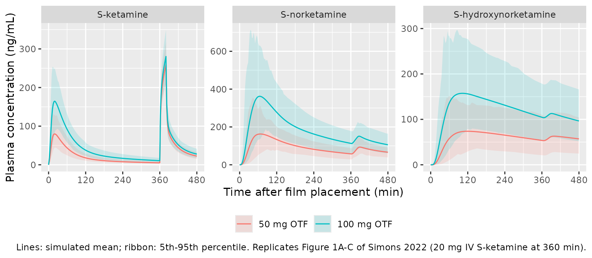
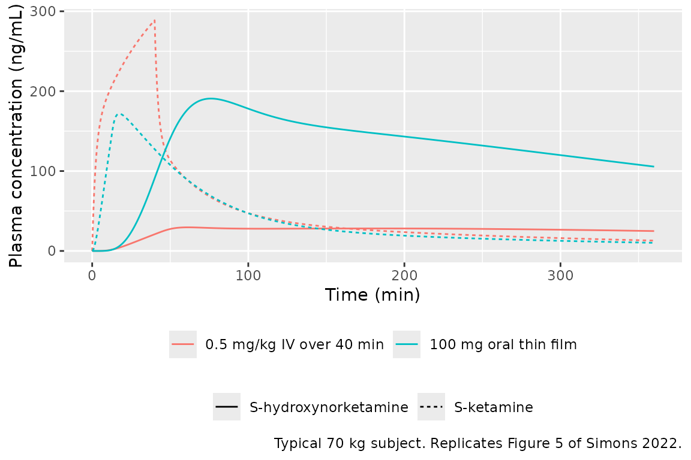

# S-ketamine oral thin film (Simons 2022)

## Model and source

- Citation: Simons P, Olofsen E, van Velzen M, van Lemmen M, Mooren R,
  van Dasselaar T, Mohr P, Hammes F, van der Schrier R, Niesters M,
  Dahan A. S-Ketamine Oral Thin Film-Part 1: Population Pharmacokinetics
  of S-Ketamine, S-Norketamine and S-Hydroxynorketamine. Front Pain Res.
  2022;3:946486. <doi:10.3389/fpain.2022.946486>
- Description: Joint population PK model of S-ketamine
  (three-compartment), S-norketamine (two-compartment) and
  S-hydroxynorketamine (two-compartment) after a sublingual or buccal
  S-ketamine oral thin film (50 or 100 mg) followed by a 20 mg
  intravenous S-ketamine infusion in healthy adult volunteers (Simons
  2022). The film dose is absorbed by two parallel routes: an
  oral-mucosal route (bioavailability F1 = 26.3%, zero-order input over
  D1 = 13.1 min into a depot drained first order by KA1 into the
  S-ketamine central compartment) and a swallowed route (F2 = 116% of
  the film dose, zero-order input over D2 = 29.9 min into a gut depot
  drained by KA2, then a gut-to-liver delay compartment with mean
  transit time MTTG) that delivers S-ketamine directly into hepatic
  metabolism without reaching the systemic S-ketamine pool. Both the
  swallowed S-ketamine and systemic S-ketamine cleared by CLK1 pass
  through a two-compartment metabolism delay chain (mean transit time
  20.1 min) of which a fixed 80% forms S-norketamine; S-norketamine
  cleared by CLN1 passes through a second two-compartment chain (1.12
  min) of which a fixed 70% forms S-hydroxynorketamine. The
  S-norketamine central volume equals the S-ketamine central volume.
  Clearances and volumes are referenced to 70 kg. Every OTF dose needs
  TWO dose records of the full film dose with rate = -2, one into
  `depot` and one into `depot2`; concentrations are in nmol/mL.
- Article: <https://doi.org/10.3389/fpain.2022.946486> (open access; the
  supplementary Data Sheet 1 holds the individual data fits only)

The companion paper (Simons 2022 Part 2,
<https://doi.org/10.3389/fpain.2022.946487>) analyses the
pharmacodynamics using the empirical Bayes estimates of this PK model
and does not restate it.

## Population

Twenty healthy volunteers (10 men, 10 women; age 24 +/- 3 years, range
19-32; weight 73 +/- 12 kg, range 53-93; BMI 23 +/- 2 kg/m^2; Simons
2022 Table 1) took part in an open-label randomised crossover study at
Leiden University Medical Center. On one visit they received one
S-ketamine oral thin film (50 mg S-ketamine free base) and on the other
two films (100 mg), at least 7 days apart. The films were placed
sublingually (n = 15) or buccally (n = 5) and the subjects were not
allowed to swallow for 10 min. Six hours after film placement every
subject received 20 mg S-ketamine intravenously over 20 min, which
anchors the absolute bioavailability. Arterial S-ketamine, S-norketamine
and S-hydroxynorketamine were measured for 8 h per visit. 19 subjects
completed both visits. Sublingual and buccal placement were pooled
because no pharmacokinetic difference was seen.

The same information is available programmatically via
`readModelDb("Simons_2022_s_ketamine")()$population`.

## Model structure

Simons 2022 Figure 2 shows the final model. The film dose is absorbed by
two parallel routes:

- **Oral mucosa:** a fraction F1 enters a depot by zero-order input over
  D1 and is absorbed first order (KA1) into the S-ketamine central
  compartment.
- **Swallowed:** a fraction F2 enters a gut depot by zero-order input
  over D2. It passes first order (KA2) into a gut-to-liver delay
  compartment (mean transit time MTTG) and then directly into hepatic
  S-ketamine metabolism. It never reaches the systemic S-ketamine pool.

S-ketamine has three compartments. Clearance CLK1, together with the
swallowed route, feeds a two-compartment metabolism delay chain (MTT
K-\>NK). A fixed 80% of the chain’s output forms S-norketamine and the
rest is lost. S-norketamine has two compartments and shares the
S-ketamine central volume (Figure 2, “VN1 = VK1”). Its clearance CLN1
feeds a second two-compartment chain (MTT NK-\>HNK), of which a fixed
70% forms S-hydroxynorketamine. S-hydroxynorketamine has two
compartments and a terminal clearance CLH1.

**Dosing.** Each film dose needs two dose records of the **full** film
dose, both with `rate = -2` so that the modelled durations D1 and D2
apply. One goes into `depot` (bioavailability F1) and one into `depot2`
(bioavailability F2). An intravenous dose goes into `central`.
Concentrations are in nmol/mL. Multiply by 237.73, 223.70 or 239.70
g/mol for ng/mL of S-ketamine, S-norketamine or S-hydroxynorketamine.

## Source trace

Every `ini()` value carries an in-file comment pointing to its source in
`inst/modeldb/specificDrugs/Simons_2022_s_ketamine.R`. All values are
from Simons 2022 Table 4 unless stated otherwise.

| Equation / parameter | Value | Source location |
|----|----|----|
| `lfdepot` (F1) | 26.3% | Table 4 |
| `ld1` (D1) | 13.1 min | Table 4 |
| `lka` (KA1) | 0.04 1/min | Table 4 |
| `lfdepot2` (F2) | 116% | Table 4 |
| `ld2` (D2) | 29.9 min | Table 4 |
| `lka2` (KA2) | 0.049 1/min | Table 4 |
| `lmtt` (MTTG) | 10.7 min | Table 4 |
| `lvc`, `lvp`, `lvp2` (VK1, VK2, VK3) | 11.6, 39.0, 174 L | Table 4 |
| `lcl`, `lq`, `lq2` (CLK1, CLK2, CLK3) | 1.48, 2.43, 1.21 L/min | Table 4 |
| `lmtt_snk` (MTT K-\>NK) | 20.1 min | Table 4 |
| `fm_snk` | 0.8 (fixed) | Methods “Population Pharmacokinetic Analysis”; Figure 2 “20% loss” |
| `vc_snk` = `vc` (VN1 = VK1) | 11.6 L | Table 4; Figure 2 |
| `lvp_snk`, `lcl_snk`, `lq_snk` (VN2, CLN1, CLN2) | 221 L, 1.00, 2.63 L/min | Table 4 |
| `lmtt_shnk` (MTT NK-\>HNK) | 1.12 min | Table 4 |
| `fm_shnk` | 0.7 (fixed) | Methods “Population Pharmacokinetic Analysis”; Figure 2 “30% loss” |
| `lvc_shnk`, `lvp_shnk` (VH1, VH2) | 4.4, 87.5 L | Table 4 |
| `lcl_shnk`, `lq_shnk` (CLH1, CLH2) | 0.933, 1.70 L/min | Table 4 |
| `e_wt_cl_q`, `e_wt_vc_vp` | 0.75, 1 (fixed) | Not printed; Table 4 reports values “@ 70 kg” (see Assumptions) |
| IIV (omega^2) on VK1/VN1, CLK1, CLK3, CLN1, MTT K-\>NK, VH1, CLH1, CLH2 | 0.057, 0.029, 0.026, 0.050, 0.021, 1.22, 0.103, 0.287 | Table 4 |
| IOV (nu^2) on F1, D1, KA1, F2, D2, KA2, MTTG | 0.060, 0.154, 0.062, 0.057, 0.611, 0.376, 0.937 | Table 4 |
| IOV (nu^2) on MTT K-\>NK | 0.751 | Table 4, printed on the S-norketamine additive-error row (see Assumptions) |
| IOV (nu^2) on VH2, CLH1 | 0.152, 0.008 | Table 4 |
| `propSd` (S-ketamine) | 0.1095 | Table 4 sigma 0.012 read as a variance (see Assumptions) |
| `propSd_snk`, `addSd_snk` | 0.102, 0.058 nmol/mL | Table 4 |
| `propSd_shnk`, `addSd_shnk` | 0.079, 0.020 nmol/mL | Table 4 |
| Exponential random effects, `theta_i = theta * exp(eta_i + eta_iov)` | n/a | Methods “Population Pharmacokinetic Analysis” |
| Two absorption routes, metabolism chains, `VN1 = VK1` | n/a | Figure 2; Results “Population Pharmacokinetic Analysis” |
| Two-compartment chains with rate `2 / MTT` | n/a | Results text; see “Structural readings” below |

## Virtual cohort

Observed data are not public. The cohort below approximates Table 1:
body weight is normal with mean 73 kg and SD 12 kg, truncated to the
observed 53-93 kg. Each arm has 100 virtual subjects. The 50 mg visit is
occasion 1 and the 100 mg visit is occasion 2; each simulated subject
contributes a single visit. The inter-occasion variances are the same on
both occasions, so this is equivalent to the crossover.

``` r

set.seed(2022)
rxode2::rxSetSeed(2022)

mw <- c(ketamine = 237.73, norketamine = 223.70, hnk = 239.70)

# Sampling times of the study (Simons 2022 Methods): film phase and the
# intravenous phase (minutes after the start of the 360-min infusion).
t_film <- c(0, 5, 10, 20, 40, 60, 90, 120, 180, 240, 300, 360)
t_iv <- 360 + c(2, 4, 10, 15, 20, 30, 40, 60, 75, 90, 120)
t_obs <- sort(unique(c(t_film, t_iv, seq(0, 480, by = 2.5))))

make_cohort <- function(n, film_mg, occ, treatment, id_offset = 0L) {
  subj <- tibble(
    id = id_offset + seq_len(n),
    WT = pmin(pmax(rnorm(n, 73, 12), 53), 93)
  )
  doses <- bind_rows(
    subj |> mutate(time = 0, amt = film_mg, rate = -2, cmt = "depot"),
    subj |> mutate(time = 0, amt = film_mg, rate = -2, cmt = "depot2"),
    subj |> mutate(time = 360, amt = 20, rate = 1, cmt = "central")
  ) |>
    mutate(evid = 1L, dvid = NA_integer_)
  obs <- tidyr::crossing(subj, time = t_obs) |>
    mutate(amt = 0, rate = 0, cmt = NA_character_, evid = 0L, dvid = 1L)
  bind_rows(doses, obs) |>
    mutate(OCC = occ, treatment = treatment) |>
    arrange(id, time, desc(evid))
}

events <- bind_rows(
  make_cohort(100, 50, occ = 1L, treatment = "50 mg OTF", id_offset = 0L),
  make_cohort(100, 100, occ = 2L, treatment = "100 mg OTF", id_offset = 100L)
)
stopifnot(!anyDuplicated(unique(events[, c("id", "time", "evid", "cmt")])))
```

## Simulation

``` r

mod <- readModelDb("Simons_2022_s_ketamine")
sim <- rxode2::rxSolve(mod, events = events, keep = c("treatment", "WT")) |>
  as.data.frame() |>
  mutate(
    ketamine = Cc * mw[["ketamine"]],
    norketamine = Cc_snk * mw[["norketamine"]],
    hnk = Cc_shnk * mw[["hnk"]],
    treatment = factor(treatment, levels = c("50 mg OTF", "100 mg OTF"))
  )
#> ℹ parameter labels from comments will be replaced by 'label()'
#> Warning: some etas defaulted to non-mu referenced, possible parsing error: etaiov_fdepot_1, etaiov_fdepot_2, etaiov_d1_1, etaiov_d1_2, etaiov_ka_1, etaiov_ka_2, etaiov_fdepot2_1, etaiov_fdepot2_2, etaiov_d2_1, etaiov_d2_2, etaiov_ka2_1, etaiov_ka2_2, etaiov_mtt_1, etaiov_mtt_2, etaiov_mtt_snk_1, etaiov_mtt_snk_2, etaiov_vp_shnk_1, etaiov_vp_shnk_2, etaiov_cl_shnk_1, etaiov_cl_shnk_2
#> as a work-around try putting the mu-referenced expression on a simple line
stopifnot(!anyNA(sim$Cc), !anyNA(sim$Cc_snk), !anyNA(sim$Cc_shnk))
```

## Replicate Figure 1: mean concentrations

``` r

analyte_labels <- c(
  ketamine = "S-ketamine",
  norketamine = "S-norketamine",
  hnk = "S-hydroxynorketamine"
)
sim |>
  select(id, time, treatment, all_of(names(analyte_labels))) |>
  pivot_longer(all_of(names(analyte_labels)), names_to = "analyte", values_to = "conc") |>
  mutate(analyte = factor(analyte_labels[analyte], levels = analyte_labels)) |>
  group_by(time, treatment, analyte) |>
  summarise(
    mean = mean(conc),
    Q05 = quantile(conc, 0.05),
    Q95 = quantile(conc, 0.95),
    .groups = "drop"
  ) |>
  ggplot(aes(time, mean, colour = treatment, fill = treatment)) +
  geom_ribbon(aes(ymin = Q05, ymax = Q95), alpha = 0.15, colour = NA) +
  geom_line() +
  facet_wrap(~analyte, scales = "free_y") +
  scale_x_continuous(breaks = seq(0, 480, by = 120)) +
  labs(
    x = "Time after film placement (min)",
    y = "Plasma concentration (ng/mL)",
    colour = NULL, fill = NULL,
    caption = paste(
      "Lines: simulated mean; ribbon: 5th-95th percentile.",
      "Replicates Figure 1A-C of Simons 2022 (20 mg IV S-ketamine at 360 min)."
    )
  ) +
  theme(legend.position = "bottom")
```



The shape matches Figure 1. The S-ketamine peak is near 20 min, the
S-norketamine peak near 60 min and the S-hydroxynorketamine peak later
and flatter. The intravenous infusion produces a sharp S-ketamine peak
at 380 min and only a small rise in the metabolites.

## PKNCA validation against Table 2

Table 2 reports the mean Cmax, Tmax and AUC over 0-6 h of each analyte
after each film dose, computed from the study’s sampling times. The
simulation is therefore subset to the same sampling times over 0-360
min, before the intravenous dose. Simulated values are summarised as
means to match the table. Each analyte gets its own PKNCA block.

``` r

dose_df <- events |>
  filter(evid == 1, cmt == "depot") |>
  select(id, time, amt, treatment)

nca_one_analyte <- function(analyte) {
  conc_df <- sim |>
    filter(time %in% t_film) |>
    transmute(id, time, treatment = as.character(treatment), Cc = .data[[analyte]]) |>
    filter(!is.na(Cc))
  conc_obj <- PKNCA::PKNCAconc(conc_df, Cc ~ time | treatment + id)
  dose_obj <- PKNCA::PKNCAdose(dose_df, amt ~ time | treatment + id)
  intervals <- data.frame(start = 0, end = 360, cmax = TRUE, tmax = TRUE, auclast = TRUE)
  res <- PKNCA::pk.nca(PKNCA::PKNCAdata(conc_obj, dose_obj, intervals = intervals))
  as.data.frame(res) |>
    group_by(treatment, PPTESTCD) |>
    summarise(PPORRES = mean(PPORRES), .groups = "drop")
}

# Simons 2022 Table 2 (mean; ng/mL, min, ng*min/mL)
published <- tribble(
  ~analyte, ~treatment, ~cmax, ~tmax, ~auclast,
  "ketamine", "50 mg OTF", 96, 18.8, 8363,
  "ketamine", "100 mg OTF", 144, 19.1, 13347,
  "norketamine", "50 mg OTF", 276, 61, 38497,
  "norketamine", "100 mg OTF", 426, 78, 67959,
  "hnk", "50 mg OTF", 101, 81, 24087,
  "hnk", "100 mg OTF", 189, 109, 44972
)

cmp <- bind_rows(lapply(names(analyte_labels), function(a) {
  tbl <- nlmixr2lib::ncaComparisonTable(
    simulated = nca_one_analyte(a),
    reference = published |> filter(analyte == a) |> select(-analyte),
    by = "treatment",
    units = c(cmax = "ng/mL", tmax = "min", auclast = "ng*min/mL"),
    tolerance_pct = 20
  )
  tibble(Analyte = analyte_labels[[a]], tbl)
}))

knitr::kable(
  cmp,
  caption = "Simulated (mean of 100 virtual subjects per arm) vs. Simons 2022 Table 2. * differs from the reference by more than 20%."
)
```

| Analyte | NCA parameter | treatment | Reference | Simulated | % diff |
|:---|:---|:---|:---|:---|:---|
| S-ketamine | Cmax (ng/mL) | 50 mg OTF | 96 | 81.8 | -14.8% |
| S-ketamine | Cmax (ng/mL) | 100 mg OTF | 144 | 169 | +17.2% |
| S-ketamine | Tmax (min) | 50 mg OTF | 18.8 | 19.7 | +4.8% |
| S-ketamine | Tmax (min) | 100 mg OTF | 19.1 | 20.6 | +7.9% |
| S-ketamine | AUClast (ng\*min/mL) | 50 mg OTF | 8360 | 7250 | -13.3% |
| S-ketamine | AUClast (ng\*min/mL) | 100 mg OTF | 13300 | 15200 | +13.8% |
| S-norketamine | Cmax (ng/mL) | 50 mg OTF | 276 | 201 | -27.0%\* |
| S-norketamine | Cmax (ng/mL) | 100 mg OTF | 426 | 430 | +0.9% |
| S-norketamine | Tmax (min) | 50 mg OTF | 61 | 87.5 | +43.4%\* |
| S-norketamine | Tmax (min) | 100 mg OTF | 78 | 78.3 | +0.4% |
| S-norketamine | AUClast (ng\*min/mL) | 50 mg OTF | 38500 | 34600 | -10.2% |
| S-norketamine | AUClast (ng\*min/mL) | 100 mg OTF | 68000 | 71900 | +5.9% |
| S-hydroxynorketamine | Cmax (ng/mL) | 50 mg OTF | 101 | 85.7 | -15.1% |
| S-hydroxynorketamine | Cmax (ng/mL) | 100 mg OTF | 189 | 182 | -4.0% |
| S-hydroxynorketamine | Tmax (min) | 50 mg OTF | 81 | 132 | +62.6%\* |
| S-hydroxynorketamine | Tmax (min) | 100 mg OTF | 109 | 114 | +4.6% |
| S-hydroxynorketamine | AUClast (ng\*min/mL) | 50 mg OTF | 24100 | 21000 | -12.7% |
| S-hydroxynorketamine | AUClast (ng\*min/mL) | 100 mg OTF | 45000 | 43900 | -2.4% |

Simulated (mean of 100 virtual subjects per arm) vs. Simons 2022 Table
2. \* differs from the reference by more than 20%. {.table
style="width:100%;"}

``` r

pct <- cmp[["% diff"]]
pct <- as.numeric(gsub("[%*+]", "", pct))
stopifnot(!anyNA(pct))
auc_rows <- grepl("AUC", cmp[["NCA parameter"]])
stopifnot(
  # A mis-transcribed clearance, fraction or unit moves the exposures by tens
  # of percent; the centre of the AUC comparison guards against that.
  abs(median(pct[auc_rows])) < 15,
  # Envelope over all six AUC rows, robust to which subjects land in the tails.
  max(abs(pct[auc_rows])) < 35
)
```

All six AUC0-6h values agree with Table 2 to within about 15%. The model
is linear, so its exposures double with the dose. The observed means in
Table 2 rise less than proportionally, which leaves the model lower than
observed at 50 mg and higher at 100 mg:

- S-ketamine Cmax rises 1.5-fold and AUC 1.6-fold from 50 to 100 mg. The
  paper attributes this to a lower film bioavailability at 100 mg (F1
  29% vs 23%), which did not reach significance, so the final model
  pools F1 at 26.3%.
- S-norketamine Cmax rises only 1.5-fold (276 to 426 ng/mL), against
  1.8-fold for its AUC. The 50 mg S-norketamine Cmax is therefore the
  largest Cmax difference.

The Tmax rows compare the mean of per-subject Tmax values read off the
sampling times. The S-norketamine and S-hydroxynorketamine profiles are
broad and flat near their peaks (Figure 1B-C), so a small change in
shape moves an individual’s Tmax by a whole sampling interval (30 or 60
min). Those rows are noisy and are not used in the assertion. The
typical-value Tmax values below, on a 0.5-min grid, are 61.5 min for
S-norketamine (Table 2: 61 and 78 min) and 76 min for
S-hydroxynorketamine (Table 2: 81 and 109 min).

## Typical-value checks

The typical subject (70 kg, no random effects) gives a deterministic
check that does not depend on the simulated cohort.

``` r

mod_typical <- rxode2::zeroRe(mod)
#> ℹ parameter labels from comments will be replaced by 'label()'
#> Warning: some etas defaulted to non-mu referenced, possible parsing error: etaiov_fdepot_1, etaiov_fdepot_2, etaiov_d1_1, etaiov_d1_2, etaiov_ka_1, etaiov_ka_2, etaiov_fdepot2_1, etaiov_fdepot2_2, etaiov_d2_1, etaiov_d2_2, etaiov_ka2_1, etaiov_ka2_2, etaiov_mtt_1, etaiov_mtt_2, etaiov_mtt_snk_1, etaiov_mtt_snk_2, etaiov_vp_shnk_1, etaiov_vp_shnk_2, etaiov_cl_shnk_1, etaiov_cl_shnk_2
#> as a work-around try putting the mu-referenced expression on a simple line
#> Warning: some etas defaulted to non-mu referenced, possible parsing error: etaiov_fdepot_1, etaiov_fdepot_2, etaiov_d1_1, etaiov_d1_2, etaiov_ka_1, etaiov_ka_2, etaiov_fdepot2_1, etaiov_fdepot2_2, etaiov_d2_1, etaiov_d2_2, etaiov_ka2_1, etaiov_ka2_2, etaiov_mtt_1, etaiov_mtt_2, etaiov_mtt_snk_1, etaiov_mtt_snk_2, etaiov_vp_shnk_1, etaiov_vp_shnk_2, etaiov_cl_shnk_1, etaiov_cl_shnk_2
#> as a work-around try putting the mu-referenced expression on a simple line

typical_events <- function(film_mg, iv_mg = 20, iv_dur = 20, iv_time = 360) {
  doses <- tibble(
    id = 1L, time = c(0, 0, iv_time), amt = c(film_mg, film_mg, iv_mg),
    rate = c(-2, -2, iv_mg / iv_dur), cmt = c("depot", "depot2", "central"),
    evid = 1L, dvid = NA_integer_
  ) |>
    filter(amt > 0)
  obs <- tibble(
    id = 1L, time = seq(0, 480, by = 0.5), amt = 0, rate = 0,
    cmt = NA_character_, evid = 0L, dvid = 1L
  )
  bind_rows(doses, obs) |>
    mutate(WT = 70, OCC = 1L) |>
    arrange(time, desc(evid))
}

typical_summary <- function(model, film_mg, params = NULL) {
  s <- rxode2::rxSolve(model, events = typical_events(film_mg), params = params) |>
    as.data.frame()
  film <- s[s$time <= 360, ]
  auc <- function(x) sum(diff(film$time) * (head(x, -1) + tail(x, -1)) / 2)
  tibble(
    film_mg = film_mg,
    ketamine_cmax = max(film$Cc) * mw[["ketamine"]],
    norketamine_tmax = film$time[which.max(film$Cc_snk)],
    norketamine_auc = auc(film$Cc_snk) * mw[["norketamine"]],
    hnk_tmax = film$time[which.max(film$Cc_shnk)],
    hnk_auc = auc(film$Cc_shnk) * mw[["hnk"]],
    iv_peak_ketamine = max(s$Cc[s$time > 360]) * mw[["ketamine"]]
  )
}

tv <- bind_rows(typical_summary(mod_typical, 50), typical_summary(mod_typical, 100))
#> ℹ omega/sigma items treated as zero: 'etalvc', 'etalcl', 'etalq2', 'etalcl_snk', 'etalmtt_snk', 'etalvc_shnk', 'etalcl_shnk', 'etalq_shnk', 'etaiov_fdepot_1', 'etaiov_fdepot_2', 'etaiov_d1_1', 'etaiov_d1_2', 'etaiov_ka_1', 'etaiov_ka_2', 'etaiov_fdepot2_1', 'etaiov_fdepot2_2', 'etaiov_d2_1', 'etaiov_d2_2', 'etaiov_ka2_1', 'etaiov_ka2_2', 'etaiov_mtt_1', 'etaiov_mtt_2', 'etaiov_mtt_snk_1', 'etaiov_mtt_snk_2', 'etaiov_vp_shnk_1', 'etaiov_vp_shnk_2', 'etaiov_cl_shnk_1', 'etaiov_cl_shnk_2'
#> ℹ omega/sigma items treated as zero: 'etalvc', 'etalcl', 'etalq2', 'etalcl_snk', 'etalmtt_snk', 'etalvc_shnk', 'etalcl_shnk', 'etalq_shnk', 'etaiov_fdepot_1', 'etaiov_fdepot_2', 'etaiov_d1_1', 'etaiov_d1_2', 'etaiov_ka_1', 'etaiov_ka_2', 'etaiov_fdepot2_1', 'etaiov_fdepot2_2', 'etaiov_d2_1', 'etaiov_d2_2', 'etaiov_ka2_1', 'etaiov_ka2_2', 'etaiov_mtt_1', 'etaiov_mtt_2', 'etaiov_mtt_snk_1', 'etaiov_mtt_snk_2', 'etaiov_vp_shnk_1', 'etaiov_vp_shnk_2', 'etaiov_cl_shnk_1', 'etaiov_cl_shnk_2'
knitr::kable(tv, digits = 1, caption = "Typical-value (70 kg) summary.")
```

| film_mg | ketamine_cmax | norketamine_tmax | norketamine_auc | hnk_tmax | hnk_auc | iv_peak_ketamine |
|---:|---:|---:|---:|---:|---:|---:|
| 50 | 85.9 | 61.5 | 36287.4 | 76 | 23367.4 | 272.7 |
| 100 | 171.8 | 61.5 | 72574.8 | 76 | 46734.9 | 277.4 |

Typical-value (70 kg) summary. {.table}

``` r


stopifnot(
  # Results text: mean S-ketamine peak after the IV dose 273 ng/mL (50 mg
  # visit) and 260 ng/mL (100 mg visit).
  abs(tv$iv_peak_ketamine / c(273, 260) - 1) < 0.15,
  # Table 2 AUC0-6h of the metabolites
  abs(tv$norketamine_auc / c(38497, 67959) - 1) < 0.15,
  abs(tv$hnk_auc / c(24087, 44972) - 1) < 0.15
)
```

### Structural readings

The paper does not print its equations. Three readings were settled
against its own Table 2 rather than assumed. The two alternatives can be
expressed as parameter overrides of the packaged model and are simulated
below:

- **What F2 is a fraction of.** In the packaged model the swallowed
  route receives F2 times the full film dose. This is the usual NONMEM
  coding, with one dose record per absorption compartment and a
  bioavailability on each. The alternative is that F2 applies to the
  swallowed remainder (1 - F1) of the dose. That is equivalent to F2 =
  (1 - 0.263) x 1.16 = 0.855.
- **Rate in the metabolism chains.** The paper’s mean transit time is
  read as the total delay of each two-compartment chain, so each
  compartment drains at 2 / MTT. The alternative, 1 / MTT per
  compartment, is equivalent to doubling the MTT.

``` r

readings <- bind_rows(
  typical_summary(mod_typical, 50) |> mutate(reading = "Packaged model"),
  typical_summary(mod_typical, 50, params = c(lfdepot2 = log((1 - 0.263) * 1.16))) |>
    mutate(reading = "F2 applied to (1 - F1) of the dose"),
  typical_summary(mod_typical, 50, params = c(lmtt_snk = log(2 * 20.1), lmtt_shnk = log(2 * 1.12))) |>
    mutate(reading = "Metabolism chains at 1 / MTT per compartment")
) |>
  select(reading, norketamine_tmax, norketamine_auc, hnk_auc)
#> ℹ omega/sigma items treated as zero: 'etalvc', 'etalcl', 'etalq2', 'etalcl_snk', 'etalmtt_snk', 'etalvc_shnk', 'etalcl_shnk', 'etalq_shnk', 'etaiov_fdepot_1', 'etaiov_fdepot_2', 'etaiov_d1_1', 'etaiov_d1_2', 'etaiov_ka_1', 'etaiov_ka_2', 'etaiov_fdepot2_1', 'etaiov_fdepot2_2', 'etaiov_d2_1', 'etaiov_d2_2', 'etaiov_ka2_1', 'etaiov_ka2_2', 'etaiov_mtt_1', 'etaiov_mtt_2', 'etaiov_mtt_snk_1', 'etaiov_mtt_snk_2', 'etaiov_vp_shnk_1', 'etaiov_vp_shnk_2', 'etaiov_cl_shnk_1', 'etaiov_cl_shnk_2'
#> ℹ omega/sigma items treated as zero: 'etalvc', 'etalcl', 'etalq2', 'etalcl_snk', 'etalmtt_snk', 'etalvc_shnk', 'etalcl_shnk', 'etalq_shnk', 'etaiov_fdepot_1', 'etaiov_fdepot_2', 'etaiov_d1_1', 'etaiov_d1_2', 'etaiov_ka_1', 'etaiov_ka_2', 'etaiov_fdepot2_1', 'etaiov_fdepot2_2', 'etaiov_d2_1', 'etaiov_d2_2', 'etaiov_ka2_1', 'etaiov_ka2_2', 'etaiov_mtt_1', 'etaiov_mtt_2', 'etaiov_mtt_snk_1', 'etaiov_mtt_snk_2', 'etaiov_vp_shnk_1', 'etaiov_vp_shnk_2', 'etaiov_cl_shnk_1', 'etaiov_cl_shnk_2'
#> ℹ omega/sigma items treated as zero: 'etalvc', 'etalcl', 'etalq2', 'etalcl_snk', 'etalmtt_snk', 'etalvc_shnk', 'etalcl_shnk', 'etalq_shnk', 'etaiov_fdepot_1', 'etaiov_fdepot_2', 'etaiov_d1_1', 'etaiov_d1_2', 'etaiov_ka_1', 'etaiov_ka_2', 'etaiov_fdepot2_1', 'etaiov_fdepot2_2', 'etaiov_d2_1', 'etaiov_d2_2', 'etaiov_ka2_1', 'etaiov_ka2_2', 'etaiov_mtt_1', 'etaiov_mtt_2', 'etaiov_mtt_snk_1', 'etaiov_mtt_snk_2', 'etaiov_vp_shnk_1', 'etaiov_vp_shnk_2', 'etaiov_cl_shnk_1', 'etaiov_cl_shnk_2'

readings |>
  rename(
    "Reading" = reading,
    "S-norketamine Tmax (min)" = norketamine_tmax,
    "S-norketamine AUC0-6h (ng*min/mL)" = norketamine_auc,
    "S-HNK AUC0-6h (ng*min/mL)" = hnk_auc
  ) |>
  knitr::kable(
    digits = 0,
    caption = "Typical 50 mg film under each reading. Table 2 means: S-norketamine Tmax 61 min, AUC 38497; S-HNK AUC 24087."
  )
```

| Reading | S-norketamine Tmax (min) | S-norketamine AUC0-6h (ng\*min/mL) | S-HNK AUC0-6h (ng\*min/mL) |
|:---|---:|---:|---:|
| Packaged model | 62 | 36287 | 23367 |
| F2 applied to (1 - F1) of the dose | 62 | 28144 | 18089 |
| Metabolism chains at 1 / MTT per compartment | 82 | 35176 | 22184 |

Typical 50 mg film under each reading. Table 2 means: S-norketamine Tmax
61 min, AUC 38497; S-HNK AUC 24087. {.table}

``` r


stopifnot(
  # The packaged reading is the one that reproduces Table 2 ...
  abs(readings$norketamine_auc[1] / 38497 - 1) < 0.15,
  abs(readings$norketamine_tmax[1] - 61) < 10,
  # ... and each alternative moves away from it.
  readings$norketamine_auc[2] / 38497 < 0.8,
  readings$norketamine_tmax[3] - 61 > 15
)
```

## Replicate Figure 5: intravenous infusion vs. 100 mg film

Figure 5 compares S-ketamine and S-hydroxynorketamine after 0.5 mg/kg
S-ketamine given intravenously over 40 min to a 70 kg individual (35 mg)
with the profiles after the 100 mg film.

``` r

iv_events <- typical_events(film_mg = 0, iv_mg = 35, iv_dur = 40, iv_time = 0)
fig5 <- bind_rows(
  rxode2::rxSolve(mod_typical, events = iv_events) |> as.data.frame() |>
    mutate(regimen = "0.5 mg/kg IV over 40 min"),
  rxode2::rxSolve(mod_typical, events = typical_events(100, iv_mg = 0)) |> as.data.frame() |>
    mutate(regimen = "100 mg oral thin film")
) |>
  filter(time <= 360) |>
  transmute(
    time, regimen,
    `S-ketamine` = Cc * mw[["ketamine"]],
    `S-hydroxynorketamine` = Cc_shnk * mw[["hnk"]]
  ) |>
  pivot_longer(c(`S-ketamine`, `S-hydroxynorketamine`), names_to = "analyte", values_to = "conc")
#> ℹ omega/sigma items treated as zero: 'etalvc', 'etalcl', 'etalq2', 'etalcl_snk', 'etalmtt_snk', 'etalvc_shnk', 'etalcl_shnk', 'etalq_shnk', 'etaiov_fdepot_1', 'etaiov_fdepot_2', 'etaiov_d1_1', 'etaiov_d1_2', 'etaiov_ka_1', 'etaiov_ka_2', 'etaiov_fdepot2_1', 'etaiov_fdepot2_2', 'etaiov_d2_1', 'etaiov_d2_2', 'etaiov_ka2_1', 'etaiov_ka2_2', 'etaiov_mtt_1', 'etaiov_mtt_2', 'etaiov_mtt_snk_1', 'etaiov_mtt_snk_2', 'etaiov_vp_shnk_1', 'etaiov_vp_shnk_2', 'etaiov_cl_shnk_1', 'etaiov_cl_shnk_2'
#> ℹ omega/sigma items treated as zero: 'etalvc', 'etalcl', 'etalq2', 'etalcl_snk', 'etalmtt_snk', 'etalvc_shnk', 'etalcl_shnk', 'etalq_shnk', 'etaiov_fdepot_1', 'etaiov_fdepot_2', 'etaiov_d1_1', 'etaiov_d1_2', 'etaiov_ka_1', 'etaiov_ka_2', 'etaiov_fdepot2_1', 'etaiov_fdepot2_2', 'etaiov_d2_1', 'etaiov_d2_2', 'etaiov_ka2_1', 'etaiov_ka2_2', 'etaiov_mtt_1', 'etaiov_mtt_2', 'etaiov_mtt_snk_1', 'etaiov_mtt_snk_2', 'etaiov_vp_shnk_1', 'etaiov_vp_shnk_2', 'etaiov_cl_shnk_1', 'etaiov_cl_shnk_2'

ggplot(fig5, aes(time, conc, colour = regimen, linetype = analyte)) +
  geom_line() +
  labs(
    x = "Time (min)", y = "Plasma concentration (ng/mL)", colour = NULL, linetype = NULL,
    caption = "Typical 70 kg subject. Replicates Figure 5 of Simons 2022."
  ) +
  theme(legend.position = "bottom", legend.box = "vertical")
```



``` r


peaks <- fig5 |>
  group_by(regimen, analyte) |>
  summarise(cmax = max(conc), .groups = "drop") |>
  pivot_wider(names_from = regimen, values_from = cmax)
knitr::kable(peaks, digits = 0, caption = "Typical-value peak concentrations (ng/mL).")
```

| analyte              | 0.5 mg/kg IV over 40 min | 100 mg oral thin film |
|:---------------------|-------------------------:|----------------------:|
| S-hydroxynorketamine |                       30 |                   191 |
| S-ketamine           |                      289 |                   172 |

Typical-value peak concentrations (ng/mL). {.table}

``` r


# Discussion: greater S-ketamine but lower S-hydroxynorketamine after the
# infusion than after the 100 mg film.
iv_k <- peaks$`0.5 mg/kg IV over 40 min`[peaks$analyte == "S-ketamine"]
otf_k <- peaks$`100 mg oral thin film`[peaks$analyte == "S-ketamine"]
iv_h <- peaks$`0.5 mg/kg IV over 40 min`[peaks$analyte == "S-hydroxynorketamine"]
otf_h <- peaks$`100 mg oral thin film`[peaks$analyte == "S-hydroxynorketamine"]
stopifnot(iv_k > 1.2 * otf_k, iv_h < 0.8 * otf_h)
```

Figure 4 of the paper is not replicated. It varies D1 together with F1,
F2 and D2 according to rules that are described only in words (F1
“converges to 1 exponentially with D1”), with no rate constant printed.

## Assumptions and deviations

- **S-ketamine residual error.** Table 4 prints the S-ketamine relative
  residual error as 0.012 with an SEE of 0.0004. Both numbers are
  identical to the row two lines above it (the subject-4 KA1 outlier,
  0.012 and 0.0004), so the entry is probably a transcription error. The
  paper’s Figure 3 rules out 0.012 as a standard deviation. The
  S-ketamine individual weighted residuals (Figure 3B) lie mostly within
  +/-2. The scatter of measured against individual-predicted S-ketamine
  (Figure 3A) is as wide as that for S-norketamine, whose relative error
  is 0.102. Both observations require a residual SD near 0.1; with a
  true SD of 0.012 the weighted residuals would spread about ten times
  wider. Read as a variance, 0.012 gives SD = sqrt(0.012) = 0.1095,
  which is consistent with the figure, and this is the value used. All
  other residual terms are standard deviations. The maintainers checked
  this against the S-norketamine and S-hydroxynorketamine panels: the
  printed 0.102 and 0.079 relative SDs fit their scatter, and the
  squared readings (0.32 and 0.28) would not.
- **Inter-occasion variability on MTT K-\>NK.** The S-norketamine block
  of Table 4 prints an inter-occasion variance of 0.751 (SEE 0.349) on
  the additive residual-error row, where it has no meaning. The Methods
  state that inter-occasion variability was estimated “for the
  S-ketamine and S-norketamine absorption parameters”, and the only
  S-norketamine input-side parameter is the formation delay MTT K-\>NK.
  The value is therefore applied to MTT K-\>NK. The same block prints
  “11.6” in the inter-occasion column of the VN1 row, which repeats the
  VN1 estimate and is ignored.
- **Inter-occasion variability on S-hydroxynorketamine.** The Methods
  say it was estimated for all S-hydroxynorketamine parameters, but
  Table 4 prints values only for VH2 and CLH1. Only those two are
  encoded; nothing is invented for the others.
- **Allometric exponents.** Table 4 gives every clearance and volume “@
  70 kg” but prints no exponent. The standard values, 0.75 for
  clearances and 1 for volumes (fixed), are used. Over the 53-93 kg
  study population the clearance multiplier (WT/70)^0.75 spans
  0.81-1.24. Use `WT = 70` to reproduce the printed typical values
  exactly.
- **Absorption routing.** Figure 2 sends the swallowed S-ketamine from
  the portal vein into hepatic S-ketamine metabolism with no arrow into
  the systemic S-ketamine compartment. The model follows the figure, so
  the swallowed route contributes only to the metabolites. Within the
  swallowed route, “two delay compartments defined by an absorption rate
  constant KA2 and a mean transit time (MTTG)” is encoded as a gut depot
  drained at KA2 followed by one compartment drained at 1 / MTTG. The
  two first-order steps act in series, so their order does not change
  the delivered profile.
- **F2 above 100%.** F2 = 116% of the film dose, together with F1, puts
  1.42 times the dose into the system. F2 is not a physical
  bioavailability. It absorbs the scale of the metabolite volumes, which
  are identifiable only because the 80% and 70% conversion fractions are
  fixed. The model reproduces the paper’s metabolite exposures only with
  F2 applied to the full dose (see “Structural readings”).
- **Individual outliers.** Table 4 reports subject-specific estimates
  for subject 4 (KA1 0.012 1/min on occasion 2; MTT K-\>NK 8.72 min) and
  subject 9 (CLH2 0.36 L/min on occasion 2). These belong to individual
  subjects rather than the population and are not part of the packaged
  model.
- **Table 2 unit rows.** The nmol/mL rows of Table 2 for
  S-hydroxynorketamine imply a molecular weight of about 300 g/mol (101
  ng/mL = 340 nM), not the 239.70 g/mol of hydroxynorketamine. The
  comparison above therefore uses the ng/mL rows, which are the units
  the assay reports.
- **Virtual cohort.** Body weight is drawn from a truncated normal
  distribution fitted to the Table 1 mean, SD and range. Sex, age and
  placement site are not covariates of the model.
- **Errata.** No correction notice for Simons 2022 was found in Europe
  PMC (no comment/correction link on the record, and no correction
  matching the title; checked 2026-10-03).
