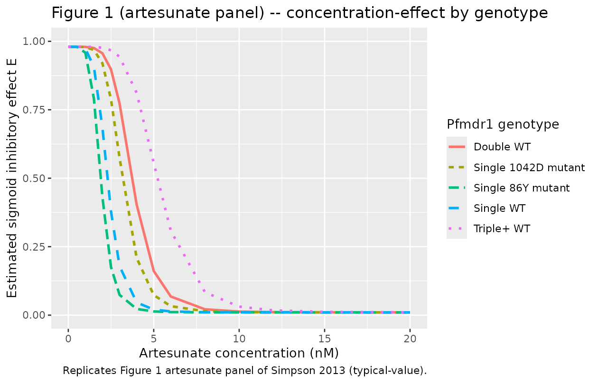

# Artesunate in vitro P. falciparum susceptibility (Simpson 2013)

## Model and source

- Citation: Simpson JA, Jamsen KM, Anderson TJC, Zaloumis S, Nair S,
  Woodrow C, White NJ, Nosten F, Price RN. (2013). Nonlinear
  Mixed-Effects Modelling of In Vitro Drug Susceptibility and Molecular
  Correlates of Multidrug Resistant Plasmodium falciparum. *PLoS ONE*
  8(7):e69505.
- Article (open access): <https://doi.org/10.1371/journal.pone.0069505>

This is an in vitro pharmacodynamic model of artesunate effect on
Plasmodium falciparum parasite growth, fit to data from a
hypoxanthine-uptake-inhibition susceptibility assay on 474 P. falciparum
clinical isolates collected at the Shoklo Malaria Research Unit (SMRU),
western Thai-Myanmar border, between 1993 and 2005. The “subject” in the
NLME framework is the parasite isolate. The per-record drug-well
concentration `STIM_ARTESUNATE_NM` drives a sigmoid Emax inhibition of
normalised hypoxanthine uptake; the model has no PK and no time
evolution. Artesunate has the steepest concentration-effect curve in the
study (slope gamma = 5.86 vs 2.7-4.1 for the other three drugs) and the
largest between-isolate variability in slope (Table 1 SD 0.63 log_e
units vs 0.41 for the other three).

## Population

- **474 P. falciparum clinical isolates** with artesunate
  concentration-effect data (Results paragraph 1; Table 3).
- Pfmdr1 genotype distribution (Table 3 artesunate row): Genotype 1
  (single-copy WT) 234 isolates (49.4%), Genotype 2 (single-copy 86Y) 24
  (5.1%), Genotype 3 (single-copy 1042D) 24 (5.1%), Genotype 4
  (double-copy WT) 123 (25.9%), Genotype 5 (triple+ copy WT) 69 (14.6%).
- Assay: hypoxanthine-uptake inhibition (Methods, In vitro Drug Assay).
  Doubling-dilution series 0.044-87.0 nM artesunate plus drug-free
  controls.

## Source trace

| nlmixr2 parameter | Value (typical) | Source location |
|----|----|----|
| `e0` (fixed) | 0.01 | Table 3 footnote `#E0 fixed to 0.01` |
| `emax` (fixed) | 0.98 | Table 3 footnote `#Emax fixed to 0.98` |
| `lec50` (EC50 2.3 nM) | log(2.3) | Table 3, Artesunate Genotype 1 (WT reference) row, Estimated value (nM): 2.3 (95% CI 2.1, 2.6) |
| `lgamma` (gamma 5.86) | log(5.86) | Table 1, NLME row artesunate, slope estimate 5.86 (95% reference range 1.70-20.10) |
| `e_pfmdr1_86y_ec50` | -0.17 | Table 3, Artesunate Genotype 2 percent change -17 (95% CI -39, 6) |
| `e_pfmdr1_1042d_ec50` | 0.38 | Table 3, Artesunate Genotype 3 percent change 38 (95% CI -27, 102) |
| `e_pfmdr1_cn2_ec50` | 0.63 | Table 3, Artesunate Genotype 4 percent change 63 (95% CI 35, 92) |
| `e_pfmdr1_cn3plus_ec50` | 1.27 | Table 3, Artesunate Genotype 5 percent change 127 (95% CI 74, 169) |
| `etalec50` variance | 0.67 | Table 3 footnote: between-isolate variance for EC50 = 0.67 (SE 0.048) artesunate |
| `etalgamma` variance | 0.63^2 = 0.3969 | Table 1 NLME artesunate slope SD (log_e units) = 0.63 |
| `propSd` (proportional) | sqrt(0.025) | Table 3 footnote: proportional variance 0.025 (SE 0.0037) artesunate |
| `addSd` (additive) | sqrt(0.0007) | Table 3 footnote: additive variance 0.0007 (SE 0.0002) artesunate |
| Structural eq. 1 | n/a | Methods Eq. 1: E = Emax - (Emax - E0) \* C^gamma / (C^gamma + EC50^gamma) |
| Random-effects eq. 2 | n/a | Methods Eq. 2 modified with theta_1..theta_4 for pfmdr1 genotypes |
| Residual eq. 3 | n/a | Methods Eq. 3 (combined additive + proportional) |

## Mechanistic structure

The sigmoid Emax inhibition equation and the genotype covariate
parameterisation are common across the four Simpson 2013 drugs; see the
chloroquine vignette’s “Mechanistic structure” section for the
equations.

Artesunate is distinct from the other three drugs in two ways: (i) the
slope of the concentration-effect curve is much steeper (`gamma = 5.86`
vs 2.7-4.1 elsewhere) so the dynamic range between full-effect and
no-effect is narrow (Figure 1 artesunate panel spans only 0-20 nM); (ii)
the higher copy-number group (CN3+) has the largest relative EC50 shift
in the study (127% increase over WT, the largest copy-number effect
across the four drugs).

## Virtual cohort

``` r

set.seed(20260528)

genotype_grid <- tibble::tribble(
  ~ genotype,         ~ PFMDR1_86Y, ~ PFMDR1_1042D, ~ PFMDR1_CN2, ~ PFMDR1_CN3PLUS,
  "Single WT",                  0L,             0L,           0L,               0L,
  "Single 86Y mutant",          1L,             0L,           0L,               0L,
  "Single 1042D mutant",        0L,             1L,           0L,               0L,
  "Double WT",                  0L,             0L,           1L,               0L,
  "Triple+ WT",                 0L,             0L,           0L,               1L
)

# Concentration grid: 0-20 nM (matches Figure 1 artesunate x-axis).
conc_grid <- c(0, 0.1, 0.5, 1, 1.5, 2, 2.5, 3, 4, 5, 6, 8, 10, 12, 15, 20)

events <- tidyr::expand_grid(genotype_grid, STIM_ARTESUNATE_NM = conc_grid)
events$id   <- seq_len(nrow(events))
events$time <- 0
events$evid <- 0
head(events, 10)
#> # A tibble: 10 × 9
#>    genotype PFMDR1_86Y PFMDR1_1042D PFMDR1_CN2 PFMDR1_CN3PLUS STIM_ARTESUNATE_NM
#>    <chr>         <int>        <int>      <int>          <int>              <dbl>
#>  1 Single …          0            0          0              0                0  
#>  2 Single …          0            0          0              0                0.1
#>  3 Single …          0            0          0              0                0.5
#>  4 Single …          0            0          0              0                1  
#>  5 Single …          0            0          0              0                1.5
#>  6 Single …          0            0          0              0                2  
#>  7 Single …          0            0          0              0                2.5
#>  8 Single …          0            0          0              0                3  
#>  9 Single …          0            0          0              0                4  
#> 10 Single …          0            0          0              0                5  
#> # ℹ 3 more variables: id <int>, time <dbl>, evid <dbl>
```

## Simulation (typical-value)

``` r

mod_fn <- readModelDb("Simpson_2013_artesunate")
mod_typical <- rxode2::zeroRe(rxode2::rxode2(mod_fn))
#> ℹ parameter labels from comments will be replaced by 'label()'

sim <- rxode2::rxSolve(
  mod_typical, events = events,
  keep = c("genotype", "STIM_ARTESUNATE_NM",
           "PFMDR1_86Y", "PFMDR1_1042D", "PFMDR1_CN2", "PFMDR1_CN3PLUS")
)
#> ℹ omega/sigma items treated as zero: 'etalec50', 'etalgamma'
#> Warning: multi-subject simulation without without 'omega'
sim_df <- as.data.frame(sim) |>
  dplyr::select(id, time, genotype, STIM_ARTESUNATE_NM, ec50, gamma, effect)
head(sim_df)
#>   id time  genotype STIM_ARTESUNATE_NM ec50 gamma    effect
#> 1  1    0 Single WT                0.0  2.3  5.86 0.9800000
#> 2  2    0 Single WT                0.1  2.3  5.86 0.9800000
#> 3  3    0 Single WT                0.5  2.3  5.86 0.9798732
#> 4  4    0 Single WT                1.0  2.3  5.86 0.9726926
#> 5  5    0 Single WT                1.5  2.3  5.86 0.9067448
#> 6  6    0 Single WT                2.0  2.3  5.86 0.6832043
```

``` r

sim_df |>
  ggplot(aes(STIM_ARTESUNATE_NM, effect,
             colour = genotype, linetype = genotype)) +
  geom_line(linewidth = 1) +
  coord_cartesian(xlim = c(0, 20), ylim = c(0, 1)) +
  labs(x = "Artesunate concentration (nM)",
       y = "Estimated sigmoid inhibitory effect E",
       colour = "Pfmdr1 genotype",
       linetype = "Pfmdr1 genotype",
       title = "Figure 1 (artesunate panel) -- concentration-effect by genotype",
       caption = "Replicates Figure 1 artesunate panel of Simpson 2013 (typical-value).")
```



## Comparison against published EC50 values (Table 3)

``` r

table3_obs <- tibble::tibble(
  genotype  = c("Single WT", "Single 86Y mutant", "Single 1042D mutant",
                "Double WT", "Triple+ WT"),
  ec50_obs  = c(2.3, 1.8, 3.1, 3.6, 4.9)
)

table3_sim <- sim_df |>
  dplyr::distinct(genotype, ec50) |>
  dplyr::rename(ec50_sim = ec50)

cmp <- dplyr::left_join(table3_obs, table3_sim, by = "genotype")
cmp$pct_diff <- 100 * (cmp$ec50_sim - cmp$ec50_obs) / cmp$ec50_obs

knitr::kable(cmp, digits = 3,
             caption = "Per-genotype EC50 (nM): Simpson 2013 Table 3 artesunate row vs simulated typical-value.")
```

| genotype            | ec50_obs | ec50_sim | pct_diff |
|:--------------------|---------:|---------:|---------:|
| Single WT           |      2.3 |    2.300 |    0.000 |
| Single 86Y mutant   |      1.8 |    1.909 |    6.056 |
| Single 1042D mutant |      3.1 |    3.174 |    2.387 |
| Double WT           |      3.6 |    3.749 |    4.139 |
| Triple+ WT          |      4.9 |    5.221 |    6.551 |

Per-genotype EC50 (nM): Simpson 2013 Table 3 artesunate row vs simulated
typical-value. {.table}

## Genotype effect on the EC50 shift

``` r

ratio_obs <- tibble::tibble(
  genotype     = c("Single 86Y mutant", "Single 1042D mutant",
                   "Double WT", "Triple+ WT"),
  pct_obs      = c(-17, 38, 63, 127),
  pct_ci       = c("(-39, 6)", "(-27, 102)", "(35, 92)", "(74, 169)")
)

ratio_sim <- sim_df |>
  dplyr::filter(genotype != "Single WT") |>
  dplyr::distinct(genotype, ec50)

ref_ec50 <- sim_df |>
  dplyr::filter(genotype == "Single WT") |>
  dplyr::pull(ec50) |>
  unique()
ratio_sim$pct_sim <- 100 * (ratio_sim$ec50 - ref_ec50) / ref_ec50

cmp_pct <- dplyr::left_join(ratio_obs, ratio_sim, by = "genotype") |>
  dplyr::select(genotype, pct_obs, pct_ci, pct_sim)

knitr::kable(cmp_pct, digits = 2,
             caption = "Per-genotype EC50 percent change vs single WT: Simpson 2013 Table 3 artesunate row (with 95% CI) vs simulated.")
```

| genotype            | pct_obs | pct_ci     | pct_sim |
|:--------------------|--------:|:-----------|--------:|
| Single 86Y mutant   |     -17 | (-39, 6)   |     -17 |
| Single 1042D mutant |      38 | (-27, 102) |      38 |
| Double WT           |      63 | (35, 92)   |      63 |
| Triple+ WT          |     127 | (74, 169)  |     127 |

Per-genotype EC50 percent change vs single WT: Simpson 2013 Table 3
artesunate row (with 95% CI) vs simulated. {.table}

## Assumptions and deviations

See the chloroquine vignette’s “Assumptions and deviations” section for
the common deviations across the four Simpson 2013 drug-specific
extractions. Artesunate-specific notes:

- **Steepest slope in the four-drug study.** `gamma = 5.86` (Table 1),
  more than double the slopes of the other three drugs (2.7-4.1). The
  concentration-effect curve transitions from full effect to no effect
  within roughly a 4-fold concentration range, which is reflected in the
  narrower x-axis (0-20 nM) used in Figure 1’s artesunate panel.
- **Largest between-isolate variability in slope.** Table 1 SD on log_e
  gamma = 0.63 (vs 0.41 for the other three drugs), and the resulting
  variance in the packaged model is `0.3969` vs `0.1681` for the other
  three. Inter-isolate heterogeneity in steepness of the artesunate
  concentration-effect curve is substantially higher than for the other
  antimalarials.
- **Largest pfmdr1 copy-number effect on EC50 (triple+ WT).** The
  triple-or-more-copy WT amplification group has 127% higher EC50 than
  single-copy WT (Table 3), the largest copy-number effect in the
  four-drug study (mefloquine has 188% but distributes across the
  broader CN2 -\> CN3+ transition; for artesunate the CN3+ shift
  specifically is 64% over CN2 alone).
- **86Y SNP and 1042D mutant CIs span zero.** The 86Y effect (-17%) and
  the 1042D effect (38%) both have 95% CIs that include 0, so neither
  SNP-level pfmdr1 mutation is statistically distinguishable from no
  effect for artesunate. The packaged model uses the point estimates as
  typical-values; downstream simulations stratifying by these genotypes
  should be interpreted accordingly.
- **Table 1 vs Table 3 EC50 reference values differ slightly.** Table 1
  NLME row artesunate EC50 = 2.58 nM (no-covariate base model). Table 3
  Genotype 1 reference EC50 = 2.3 nM (covariate model WT reference). The
  packaged model uses Table 3’s 2.3 nM because this extraction follows
  the genotype-covariate parameterisation. The 0.28 nM difference (~12%
  relative) reflects parameterisation choice, not estimation noise.
