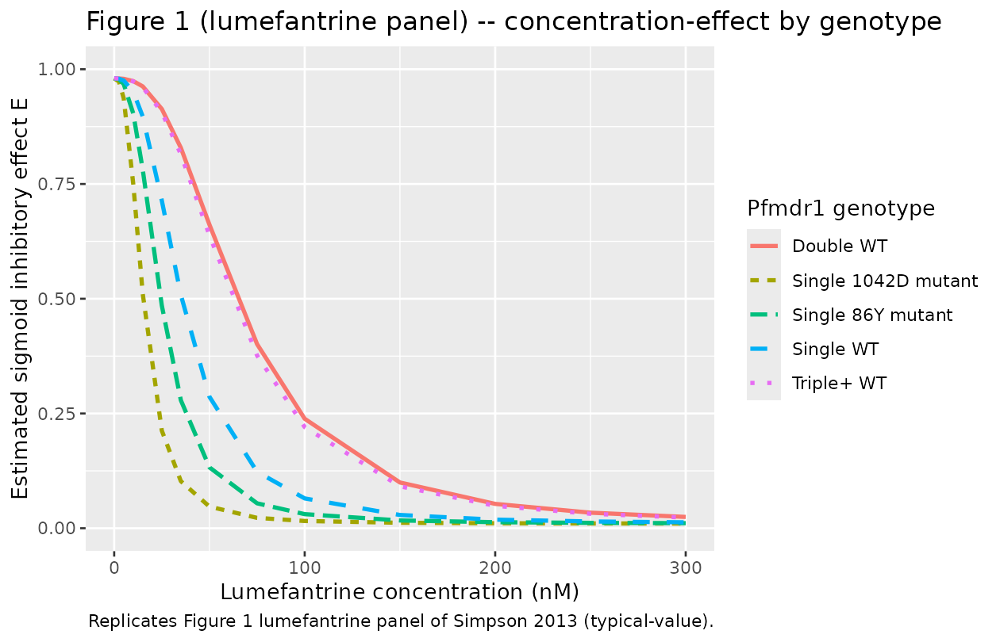

# Lumefantrine in vitro P. falciparum susceptibility (Simpson 2013)

## Model and source

- Citation: Simpson JA, Jamsen KM, Anderson TJC, Zaloumis S, Nair S,
  Woodrow C, White NJ, Nosten F, Price RN. (2013). Nonlinear
  Mixed-Effects Modelling of In Vitro Drug Susceptibility and Molecular
  Correlates of Multidrug Resistant Plasmodium falciparum. *PLoS ONE*
  8(7):e69505.
- Article (open access): <https://doi.org/10.1371/journal.pone.0069505>

This is an in vitro pharmacodynamic model of lumefantrine effect on
Plasmodium falciparum parasite growth, fit to data from a
hypoxanthine-uptake-inhibition susceptibility assay on 324 P. falciparum
clinical isolates collected at the Shoklo Malaria Research Unit (SMRU),
western Thai-Myanmar border, between 1993 and 2005. The “subject” in the
NLME framework is the parasite isolate. The per-record drug-well
concentration `STIM_LUMEFANTRINE_NM` drives a sigmoid Emax inhibition of
normalised hypoxanthine uptake; the model has no PK and no time
evolution. Lumefantrine had the highest STS-method exclusion rate among
the four drugs (24.4% of isolates had CV \> 15%, Table 2), reflecting
its relatively narrow dynamic range across the doubling-dilution series.

## Population

- **324 P. falciparum clinical isolates** with lumefantrine
  concentration-effect data (Results paragraph 1; Table 3).
- Pfmdr1 genotype distribution (Table 3 lumefantrine row): Genotype 1
  (single-copy WT) 183 isolates (56.5%), Genotype 2 (single-copy 86Y) 16
  (4.9%), Genotype 3 (single-copy 1042D) 17 (5.2%), Genotype 4
  (double-copy WT) 83 (25.6%), Genotype 5 (triple+ copy WT) 25 (7.7%).
- Assay: hypoxanthine-uptake inhibition (Methods, In vitro Drug Assay).
  Doubling-dilution series 2.40-235.8 nM lumefantrine plus drug-free
  controls.

## Source trace

| nlmixr2 parameter | Value (typical) | Source location |
|----|----|----|
| `e0` (fixed) | 0.01 | Table 3 footnote `#E0 fixed to 0.01` |
| `emax` (fixed) | 0.98 | Table 3 footnote `#Emax fixed to 0.98` |
| `lec50` (EC50 35.7 nM) | log(35.7) | Table 3, Lumefantrine Genotype 1 (WT reference) row, Estimated value (nM): 35.7 (95% CI 31.4, 39.9) |
| `lgamma` (gamma 2.73) | log(2.73) | Table 1, NLME row lumefantrine, slope estimate 2.73 (95% reference range 1.22-6.10) |
| `e_pfmdr1_86y_ec50` | -0.31 | Table 3, Lumefantrine Genotype 2 percent change -31 (95% CI -62, 0) |
| `e_pfmdr1_1042d_ec50` | -0.57 | Table 3, Lumefantrine Genotype 3 percent change -57 (95% CI -76, -37) |
| `e_pfmdr1_cn2_ec50` | 0.82 | Table 3, Lumefantrine Genotype 4 percent change 82 (95% CI 46, 119) |
| `e_pfmdr1_cn3plus_ec50` | 0.75 | Table 3, Lumefantrine Genotype 5 percent change 75 (95% CI 28, 122) |
| `etalec50` variance | 0.63 | Table 3 footnote: between-isolate variance for EC50 = 0.63 (SE 0.050) lumefantrine |
| `etalgamma` variance | 0.41^2 = 0.1681 | Table 1 NLME lumefantrine slope SD (log_e units) = 0.41 |
| `propSd` (proportional) | sqrt(0.019) | Table 3 footnote: proportional variance 0.019 (SE 0.0020) lumefantrine |
| `addSd` (additive) | sqrt(0.0009) | Table 3 footnote: additive variance 0.0009 (SE 0.0002) lumefantrine |
| Structural eq. 1 | n/a | Methods Eq. 1: E = Emax - (Emax - E0) \* C^gamma / (C^gamma + EC50^gamma) |
| Random-effects eq. 2 | n/a | Methods Eq. 2 modified with theta_1..theta_4 for pfmdr1 genotypes |
| Residual eq. 3 | n/a | Methods Eq. 3 (combined additive + proportional) |

## Mechanistic structure

The sigmoid Emax inhibition equation and the genotype covariate
parameterisation are common across the four Simpson 2013 drugs; see the
chloroquine vignette’s “Mechanistic structure” section for the
equations. Lumefantrine shows a similar pattern to mefloquine: the 86Y
and 1042D SNPs lower EC50, while gene amplification raises EC50. The CN2
-\> CN3+ transition for lumefantrine is non-monotone in the EC50
estimate (82% -\> 75% relative shift, Table 3), unlike mefloquine and
artesunate where each additional copy further increases EC50.

## Virtual cohort

``` r

set.seed(20260528)

genotype_grid <- tibble::tribble(
  ~ genotype,         ~ PFMDR1_86Y, ~ PFMDR1_1042D, ~ PFMDR1_CN2, ~ PFMDR1_CN3PLUS,
  "Single WT",                  0L,             0L,           0L,               0L,
  "Single 86Y mutant",          1L,             0L,           0L,               0L,
  "Single 1042D mutant",        0L,             1L,           0L,               0L,
  "Double WT",                  0L,             0L,           1L,               0L,
  "Triple+ WT",                 0L,             0L,           0L,               1L
)

# Concentration grid: linear 0-300 nM (matches Figure 1 lumefantrine x-axis).
conc_grid <- c(0, 2.5, 5, 10, 15, 25, 35, 50, 75, 100, 150, 200, 250, 300)

events <- tidyr::expand_grid(genotype_grid, STIM_LUMEFANTRINE_NM = conc_grid)
events$id   <- seq_len(nrow(events))
events$time <- 0
events$evid <- 0
head(events, 10)
#> # A tibble: 10 × 9
#>    genotype  PFMDR1_86Y PFMDR1_1042D PFMDR1_CN2 PFMDR1_CN3PLUS
#>    <chr>          <int>        <int>      <int>          <int>
#>  1 Single WT          0            0          0              0
#>  2 Single WT          0            0          0              0
#>  3 Single WT          0            0          0              0
#>  4 Single WT          0            0          0              0
#>  5 Single WT          0            0          0              0
#>  6 Single WT          0            0          0              0
#>  7 Single WT          0            0          0              0
#>  8 Single WT          0            0          0              0
#>  9 Single WT          0            0          0              0
#> 10 Single WT          0            0          0              0
#> # ℹ 4 more variables: STIM_LUMEFANTRINE_NM <dbl>, id <int>, time <dbl>,
#> #   evid <dbl>
```

## Simulation (typical-value)

``` r

mod_fn <- readModelDb("Simpson_2013_lumefantrine")
mod_typical <- rxode2::zeroRe(rxode2::rxode2(mod_fn))
#> ℹ parameter labels from comments will be replaced by 'label()'

sim <- rxode2::rxSolve(
  mod_typical, events = events,
  keep = c("genotype", "STIM_LUMEFANTRINE_NM",
           "PFMDR1_86Y", "PFMDR1_1042D", "PFMDR1_CN2", "PFMDR1_CN3PLUS")
)
#> ℹ omega/sigma items treated as zero: 'etalec50', 'etalgamma'
#> Warning: multi-subject simulation without without 'omega'
sim_df <- as.data.frame(sim) |>
  dplyr::select(id, time, genotype, STIM_LUMEFANTRINE_NM, ec50, gamma, effect)
head(sim_df)
#>   id time  genotype STIM_LUMEFANTRINE_NM ec50 gamma    effect
#> 1  1    0 Single WT                  0.0 35.7  2.73 0.9800000
#> 2  2    0 Single WT                  2.5 35.7  2.73 0.9793176
#> 3  3    0 Single WT                  5.0 35.7  2.73 0.9754903
#> 4  4    0 Single WT                 10.0 35.7  2.73 0.9508436
#> 5  5    0 Single WT                 15.0 35.7  2.73 0.8968618
#> 6  6    0 Single WT                 25.0 35.7  2.73 0.7138742
```

``` r

sim_df |>
  ggplot(aes(STIM_LUMEFANTRINE_NM, effect,
             colour = genotype, linetype = genotype)) +
  geom_line(linewidth = 1) +
  coord_cartesian(xlim = c(0, 300), ylim = c(0, 1)) +
  labs(x = "Lumefantrine concentration (nM)",
       y = "Estimated sigmoid inhibitory effect E",
       colour = "Pfmdr1 genotype",
       linetype = "Pfmdr1 genotype",
       title = "Figure 1 (lumefantrine panel) -- concentration-effect by genotype",
       caption = "Replicates Figure 1 lumefantrine panel of Simpson 2013 (typical-value).")
```



## Comparison against published EC50 values (Table 3)

``` r

table3_obs <- tibble::tibble(
  genotype  = c("Single WT", "Single 86Y mutant", "Single 1042D mutant",
                "Double WT", "Triple+ WT"),
  ec50_obs  = c(35.7, 24.6, 15.5, 65.0, 62.4)
)

table3_sim <- sim_df |>
  dplyr::distinct(genotype, ec50) |>
  dplyr::rename(ec50_sim = ec50)

cmp <- dplyr::left_join(table3_obs, table3_sim, by = "genotype")
cmp$pct_diff <- 100 * (cmp$ec50_sim - cmp$ec50_obs) / cmp$ec50_obs

knitr::kable(cmp, digits = 2,
             caption = "Per-genotype EC50 (nM): Simpson 2013 Table 3 lumefantrine row vs simulated typical-value.")
```

| genotype            | ec50_obs | ec50_sim | pct_diff |
|:--------------------|---------:|---------:|---------:|
| Single WT           |     35.7 |    35.70 |     0.00 |
| Single 86Y mutant   |     24.6 |    24.63 |     0.13 |
| Single 1042D mutant |     15.5 |    15.35 |    -0.96 |
| Double WT           |     65.0 |    64.97 |    -0.04 |
| Triple+ WT          |     62.4 |    62.47 |     0.12 |

Per-genotype EC50 (nM): Simpson 2013 Table 3 lumefantrine row vs
simulated typical-value. {.table}

## Genotype effect on the EC50 shift

``` r

ratio_obs <- tibble::tibble(
  genotype     = c("Single 86Y mutant", "Single 1042D mutant",
                   "Double WT", "Triple+ WT"),
  pct_obs      = c(-31, -57, 82, 75),
  pct_ci       = c("(-62, 0)", "(-76, -37)", "(46, 119)", "(28, 122)")
)

ratio_sim <- sim_df |>
  dplyr::filter(genotype != "Single WT") |>
  dplyr::distinct(genotype, ec50)

ref_ec50 <- sim_df |>
  dplyr::filter(genotype == "Single WT") |>
  dplyr::pull(ec50) |>
  unique()
ratio_sim$pct_sim <- 100 * (ratio_sim$ec50 - ref_ec50) / ref_ec50

cmp_pct <- dplyr::left_join(ratio_obs, ratio_sim, by = "genotype") |>
  dplyr::select(genotype, pct_obs, pct_ci, pct_sim)

knitr::kable(cmp_pct, digits = 2,
             caption = "Per-genotype EC50 percent change vs single WT: Simpson 2013 Table 3 lumefantrine row (with 95% CI) vs simulated.")
```

| genotype            | pct_obs | pct_ci     | pct_sim |
|:--------------------|--------:|:-----------|--------:|
| Single 86Y mutant   |     -31 | (-62, 0)   |     -31 |
| Single 1042D mutant |     -57 | (-76, -37) |     -57 |
| Double WT           |      82 | (46, 119)  |      82 |
| Triple+ WT          |      75 | (28, 122)  |      75 |

Per-genotype EC50 percent change vs single WT: Simpson 2013 Table 3
lumefantrine row (with 95% CI) vs simulated. {.table}

## Assumptions and deviations

See the chloroquine vignette’s “Assumptions and deviations” section for
the common deviations across the four Simpson 2013 drug-specific
extractions. Lumefantrine-specific notes:

- **Highest STS-method exclusion rate.** 24.4% of lumefantrine isolates
  had STS-method EC50 with CV \> 15% (Table 2), the highest of the four
  drugs. The NLME analysis includes these less-precise isolates without
  exclusion (Methods, Statistical Analysis paragraph 3), and the
  between-isolate variance for EC50 (0.63) is correspondingly the
  second-highest of the four drugs (after artesunate at 0.67).
- **Non-monotone copy-number effect.** Lumefantrine is the only drug in
  the study where the CN3+ EC50 estimate (62.4 nM, +75% vs WT) is
  slightly *lower* than the CN2 estimate (65.0 nM, +82% vs WT) (Table
  3). The 95% CIs overlap (28-122% for CN3+ vs 46-119% for CN2), so the
  apparent non-monotonicity is within statistical uncertainty.
- **86Y SNP CI includes zero.** The 86Y EC50 effect (-31%) has a 95% CI
  of (-62, 0), so the lower-bound of the effect just reaches the
  no-effect null. The packaged model uses the point estimate as the
  typical-value.
