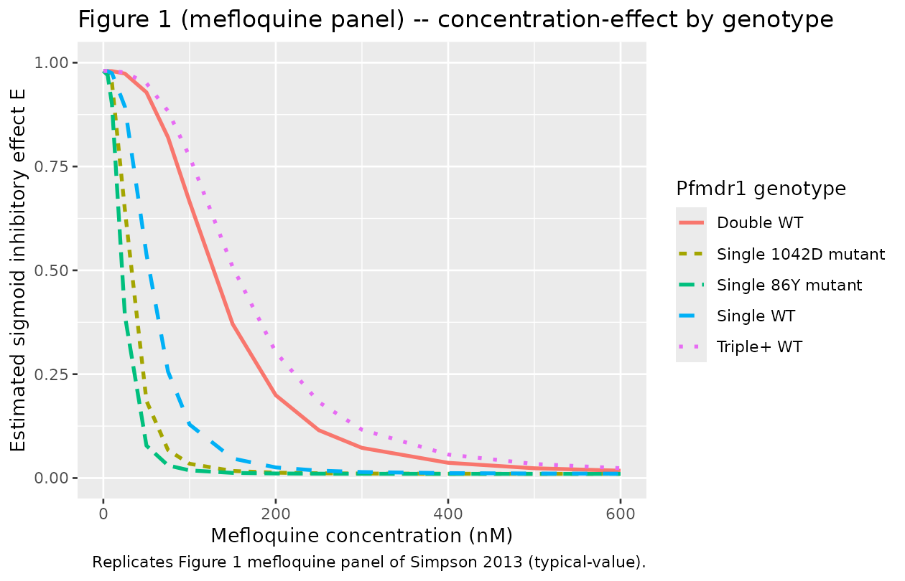

# Mefloquine in vitro P. falciparum susceptibility (Simpson 2013)

## Model and source

- Citation: Simpson JA, Jamsen KM, Anderson TJC, Zaloumis S, Nair S,
  Woodrow C, White NJ, Nosten F, Price RN. (2013). Nonlinear
  Mixed-Effects Modelling of In Vitro Drug Susceptibility and Molecular
  Correlates of Multidrug Resistant Plasmodium falciparum. *PLoS ONE*
  8(7):e69505.
- Article (open access): <https://doi.org/10.1371/journal.pone.0069505>

This is an in vitro pharmacodynamic model of mefloquine effect on
Plasmodium falciparum parasite growth, fit to data from a
hypoxanthine-uptake-inhibition susceptibility assay on 460 P. falciparum
clinical isolates collected at the Shoklo Malaria Research Unit (SMRU),
western Thai-Myanmar border, between 1993 and 2005. The “subject” in the
NLME framework is the parasite isolate. The per-record drug-well
concentration `STIM_MEFLOQUINE_NM` drives a sigmoid Emax inhibition of
normalised hypoxanthine uptake; the model has no PK and no time
evolution. Pfmdr1 genotype is the principal scientific covariate –
mefloquine is the drug with the largest pfmdr1 amplification effect in
the study (double-copy parasites have 139% higher EC50, triple+ 188%
higher; Table 3).

## Population

- **460 P. falciparum clinical isolates** with mefloquine
  concentration-effect data (Results paragraph 1; Table 3).
- Total cohort: 490 isolates across the four-drug study.
- Pfmdr1 genotype distribution (Table 3 mefloquine row): Genotype 1
  (single-copy WT 86N/1042N) 230 isolates (50.0%), Genotype 2
  (single-copy 86Y) 25 (5.4%), Genotype 3 (single-copy 1042D) 24 (5.2%),
  Genotype 4 (double-copy WT) 118 (25.7%), Genotype 5 (triple+ copy WT)
  63 (13.7%).
- Assay: hypoxanthine-uptake inhibition (Methods, In vitro Drug Assay).
  Doubling-dilution series 1.62-1646.6 nM mefloquine plus drug-free
  controls.

## Source trace

| nlmixr2 parameter | Value (typical) | Source location |
|----|----|----|
| `e0` (fixed) | 0.01 | Table 3 footnote `#E0 fixed to 0.01` |
| `emax` (fixed) | 0.98 | Table 3 footnote `#Emax fixed to 0.98` |
| `lec50` (EC50 53.0 nM) | log(53.0) | Table 3, Mefloquine Genotype 1 (WT reference) row, Estimated value (nM): 53.0 (95% CI 48.0, 58.1) |
| `lgamma` (gamma 3.10) | log(3.10) | Table 1, NLME row mefloquine, slope estimate 3.10 (95% reference range 1.39-6.92) |
| `e_pfmdr1_86y_ec50` | -0.59 | Table 3, Mefloquine Genotype 2 percent change -59 (95% CI -72, -46) |
| `e_pfmdr1_1042d_ec50` | -0.42 | Table 3, Mefloquine Genotype 3 percent change -42 (95% CI -67, -17) |
| `e_pfmdr1_cn2_ec50` | 1.39 | Table 3, Mefloquine Genotype 4 percent change 139 (95% CI 102, 175) |
| `e_pfmdr1_cn3plus_ec50` | 1.88 | Table 3, Mefloquine Genotype 5 percent change 188 (95% CI 126, 250) |
| `etalec50` variance | 0.56 | Table 3 footnote: between-isolate variance for EC50 = 0.56 (SE 0.043) mefloquine |
| `etalgamma` variance | 0.41^2 = 0.1681 | Table 1 NLME mefloquine slope SD (log_e units) = 0.41 |
| `propSd` (proportional) | sqrt(0.010) | Table 3 footnote: proportional variance 0.010 (SE 0.0011) mefloquine |
| `addSd` (additive) | sqrt(0.001) | Table 3 footnote: additive variance 0.001 (SE 0.0001) mefloquine |
| Structural eq. 1 | n/a | Methods Eq. 1: E = Emax - (Emax - E0) \* C^gamma / (C^gamma + EC50^gamma) |
| Random-effects eq. 2 | n/a | Methods Eq. 2 modified with theta_1..theta_4 for pfmdr1 genotypes |
| Residual eq. 3 | n/a | Methods Eq. 3 (combined additive + proportional) |

## Mechanistic structure

The sigmoid Emax inhibition equation and the genotype covariate
parameterisation are common across the four Simpson 2013 drugs; see the
chloroquine vignette’s “Mechanistic structure” section for the
equations.

For mefloquine the pfmdr1 effects are dominated by gene amplification:
the 86Y SNP mutant actually has 59% *lower* EC50 (higher susceptibility)
than WT, but every additional pfmdr1 copy roughly doubles the EC50
(double-copy +139%, triple+ +188%). This is the principal evidence
motivating the well-established clinical link between Southeast-Asian
pfmdr1 amplification and reduced mefloquine susceptibility.

## Virtual cohort

``` r

set.seed(20260528)

genotype_grid <- tibble::tribble(
  ~ genotype,         ~ PFMDR1_86Y, ~ PFMDR1_1042D, ~ PFMDR1_CN2, ~ PFMDR1_CN3PLUS,
  "Single WT",                  0L,             0L,           0L,               0L,
  "Single 86Y mutant",          1L,             0L,           0L,               0L,
  "Single 1042D mutant",        0L,             1L,           0L,               0L,
  "Double WT",                  0L,             0L,           1L,               0L,
  "Triple+ WT",                 0L,             0L,           0L,               1L
)

# Concentration grid: linear 0-600 nM (matches Figure 1 mefloquine x-axis).
conc_grid <- c(0, 5, 10, 25, 50, 75, 100, 150, 200, 250, 300, 400, 500, 600)

events <- tidyr::expand_grid(genotype_grid, STIM_MEFLOQUINE_NM = conc_grid)
events$id   <- seq_len(nrow(events))
events$time <- 0
events$evid <- 0
head(events, 10)
#> # A tibble: 10 × 9
#>    genotype PFMDR1_86Y PFMDR1_1042D PFMDR1_CN2 PFMDR1_CN3PLUS STIM_MEFLOQUINE_NM
#>    <chr>         <int>        <int>      <int>          <int>              <dbl>
#>  1 Single …          0            0          0              0                  0
#>  2 Single …          0            0          0              0                  5
#>  3 Single …          0            0          0              0                 10
#>  4 Single …          0            0          0              0                 25
#>  5 Single …          0            0          0              0                 50
#>  6 Single …          0            0          0              0                 75
#>  7 Single …          0            0          0              0                100
#>  8 Single …          0            0          0              0                150
#>  9 Single …          0            0          0              0                200
#> 10 Single …          0            0          0              0                250
#> # ℹ 3 more variables: id <int>, time <dbl>, evid <dbl>
```

## Simulation (typical-value)

``` r

mod_fn <- readModelDb("Simpson_2013_mefloquine")
mod_typical <- rxode2::zeroRe(rxode2::rxode2(mod_fn))
#> ℹ parameter labels from comments will be replaced by 'label()'

sim <- rxode2::rxSolve(
  mod_typical, events = events,
  keep = c("genotype", "STIM_MEFLOQUINE_NM",
           "PFMDR1_86Y", "PFMDR1_1042D", "PFMDR1_CN2", "PFMDR1_CN3PLUS")
)
#> ℹ omega/sigma items treated as zero: 'etalec50', 'etalgamma'
#> Warning: multi-subject simulation without without 'omega'
sim_df <- as.data.frame(sim) |>
  dplyr::select(id, time, genotype, STIM_MEFLOQUINE_NM, ec50, gamma, effect)
head(sim_df)
#>   id time  genotype STIM_MEFLOQUINE_NM ec50 gamma    effect
#> 1  1    0 Single WT                  0   53   3.1 0.9800000
#> 2  2    0 Single WT                  5   53   3.1 0.9793573
#> 3  3    0 Single WT                 10   53   3.1 0.9745165
#> 4  4    0 Single WT                 25   53   3.1 0.8939436
#> 5  5    0 Single WT                 50   53   3.1 0.5386849
#> 6  6    0 Single WT                 75   53   3.1 0.2565791
```

``` r

sim_df |>
  ggplot(aes(STIM_MEFLOQUINE_NM, effect,
             colour = genotype, linetype = genotype)) +
  geom_line(linewidth = 1) +
  coord_cartesian(xlim = c(0, 600), ylim = c(0, 1)) +
  labs(x = "Mefloquine concentration (nM)",
       y = "Estimated sigmoid inhibitory effect E",
       colour = "Pfmdr1 genotype",
       linetype = "Pfmdr1 genotype",
       title = "Figure 1 (mefloquine panel) -- concentration-effect by genotype",
       caption = "Replicates Figure 1 mefloquine panel of Simpson 2013 (typical-value).")
```



## Comparison against published EC50 values (Table 3)

``` r

table3_obs <- tibble::tibble(
  genotype  = c("Single WT", "Single 86Y mutant", "Single 1042D mutant",
                "Double WT", "Triple+ WT"),
  ec50_obs  = c(53.0, 21.7, 30.9, 126.3, 152.6)
)

table3_sim <- sim_df |>
  dplyr::distinct(genotype, ec50) |>
  dplyr::rename(ec50_sim = ec50)

cmp <- dplyr::left_join(table3_obs, table3_sim, by = "genotype")
cmp$pct_diff <- 100 * (cmp$ec50_sim - cmp$ec50_obs) / cmp$ec50_obs

knitr::kable(cmp, digits = 2,
             caption = "Per-genotype EC50 (nM): Simpson 2013 Table 3 mefloquine row vs simulated typical-value.")
```

| genotype            | ec50_obs | ec50_sim | pct_diff |
|:--------------------|---------:|---------:|---------:|
| Single WT           |     53.0 |    53.00 |     0.00 |
| Single 86Y mutant   |     21.7 |    21.73 |     0.14 |
| Single 1042D mutant |     30.9 |    30.74 |    -0.52 |
| Double WT           |    126.3 |   126.67 |     0.29 |
| Triple+ WT          |    152.6 |   152.64 |     0.03 |

Per-genotype EC50 (nM): Simpson 2013 Table 3 mefloquine row vs simulated
typical-value. {.table}

## Genotype effect on the EC50 shift

``` r

ratio_obs <- tibble::tibble(
  genotype     = c("Single 86Y mutant", "Single 1042D mutant",
                   "Double WT", "Triple+ WT"),
  pct_obs      = c(-59, -42, 139, 188),
  pct_ci       = c("(-72, -46)", "(-67, -17)", "(102, 175)", "(126, 250)")
)

ratio_sim <- sim_df |>
  dplyr::filter(genotype != "Single WT") |>
  dplyr::distinct(genotype, ec50)

ref_ec50 <- sim_df |>
  dplyr::filter(genotype == "Single WT") |>
  dplyr::pull(ec50) |>
  unique()
ratio_sim$pct_sim <- 100 * (ratio_sim$ec50 - ref_ec50) / ref_ec50

cmp_pct <- dplyr::left_join(ratio_obs, ratio_sim, by = "genotype") |>
  dplyr::select(genotype, pct_obs, pct_ci, pct_sim)

knitr::kable(cmp_pct, digits = 2,
             caption = "Per-genotype EC50 percent change vs single WT: Simpson 2013 Table 3 mefloquine row (with 95% CI) vs simulated.")
```

| genotype            | pct_obs | pct_ci     | pct_sim |
|:--------------------|--------:|:-----------|--------:|
| Single 86Y mutant   |     -59 | (-72, -46) |     -59 |
| Single 1042D mutant |     -42 | (-67, -17) |     -42 |
| Double WT           |     139 | (102, 175) |     139 |
| Triple+ WT          |     188 | (126, 250) |     188 |

Per-genotype EC50 percent change vs single WT: Simpson 2013 Table 3
mefloquine row (with 95% CI) vs simulated. {.table}

## Assumptions and deviations

The deviations are common across the four Simpson 2013 drug-specific
extractions; see the chloroquine vignette’s “Assumptions and deviations”
section for the full list. Mefloquine-specific notes:

- **Mefloquine is the only one of the four drugs where the 86Y SNP
  increases susceptibility** (negative coefficient on EC50). This is
  consistent with the well-known clinical observation that 86Y carriers
  are more sensitive to mefloquine than WT parasites – the same SNP that
  reduces chloroquine susceptibility.
- **The CN2 -\> CN3+ EC50 shift is monotone for mefloquine** (139% -\>
  188%), unlike lumefantrine where the higher copy-number group has
  approximately the same EC50 as the double-copy group (82% -\> 75%).
