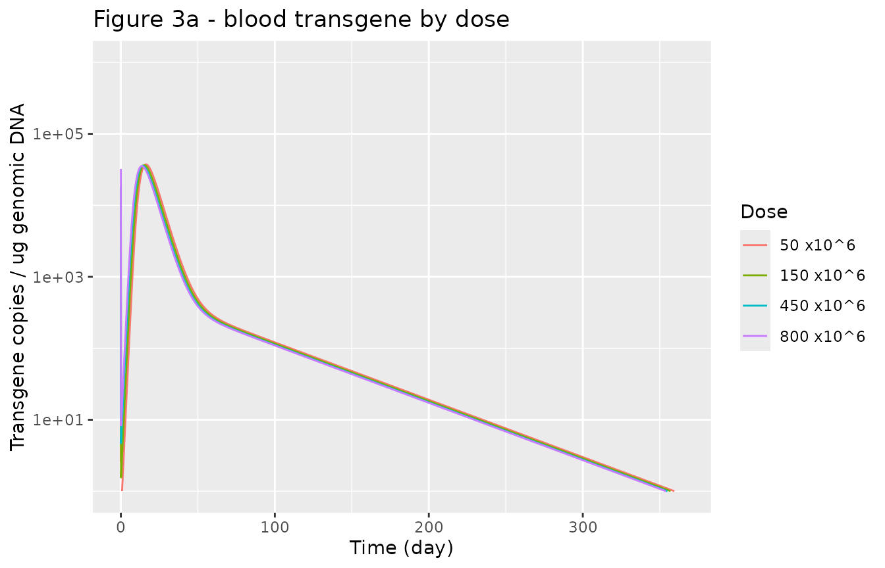
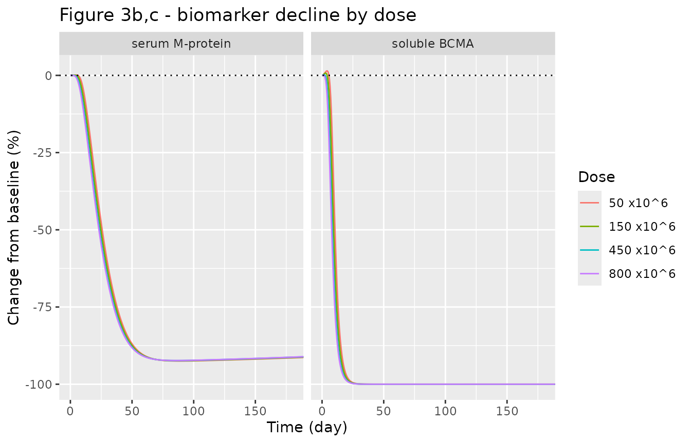
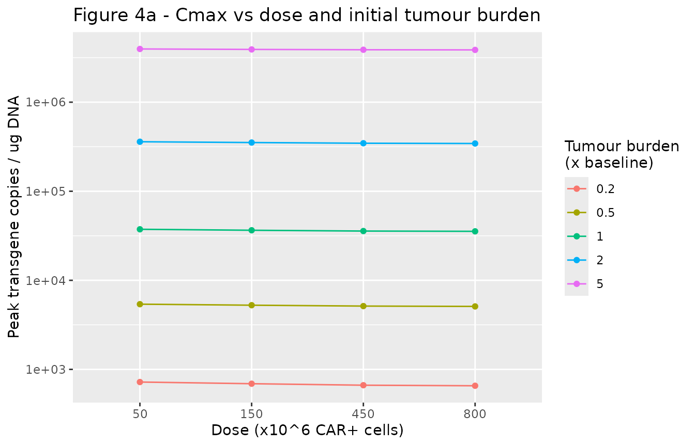
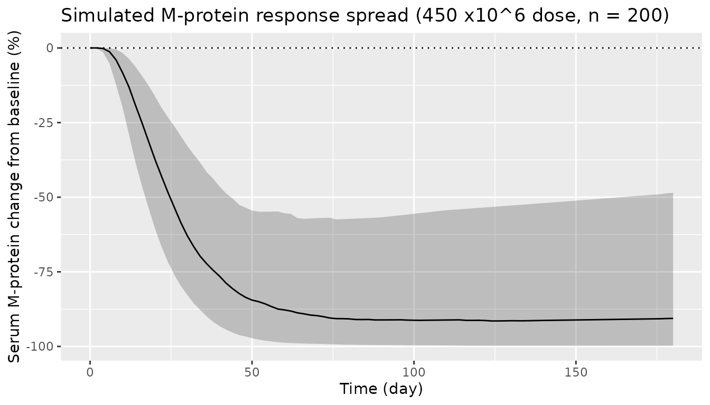

# Anti-BCMA CAR-T (idecabtagene vicleucel / bb2121) multiscale PK-PD (Singh 2021)

## Model and source

- Citation: Singh AP, Chen W, Zheng X, Mody H, Carpenter TJ, Zong A,
  Heald DL (2021). Bench-to-bedside translation of chimeric antigen
  receptor (CAR) T cells using a multiscale systems
  pharmacokinetic-pharmacodynamic model: A case study with anti-BCMA
  CAR-T. CPT Pharmacometrics Syst Pharmacol 10(4):362-376.
  <doi:10.1002/psp4.12598>. Equations in the Supporting Information
  (PSP4-10-362-s001.pdf) and Monolix model code in PSP4-10-362-s002.docx
  (PMC8099446 open-access package). Fit to the phase 1 CRB-401 data of
  Raje et al. 2019 (N Engl J Med 380:1726-1737;
  <doi:10.1056/NEJMoa1817226>).
- Description: QSP (multiscale mechanistic cellular-kinetic /
  pharmacodynamic model). Anti-BCMA CAR T-cell therapy bb2121
  (idecabtagene vicleucel) in adults with relapsed/refractory multiple
  myeloma, clinical model. Effector and memory CAR T cells distribute
  between blood and bone marrow (first-order K12 / K21) and are
  eliminated from blood at phenotype-specific rates; in bone marrow the
  CARs bind BCMA on myeloma cells (second-order kon / first-order koff)
  to form CAR-target complexes, whose number per CAR T cell drives Emax
  expansion of the effector pool and whose number per tumour cell drives
  Emax killing of an exponentially growing tumour. Effector cells
  convert to memory at a net first-order rate. Serum M-protein and
  soluble BCMA are turnover biomarkers whose production scales with
  (tumour / baseline tumour)^gamma. Outputs: blood transgene copies per
  ug genomic DNA and percent change from baseline of soluble BCMA and
  serum M-protein. Mean parameters were fit to the mean phase 1 data;
  between-subject variability on expansion, killing and the biomarker
  exponents was fit to the individual M-protein response categories, and
  50% variability on the four disposition rate constants is the authors’
  assumption.
- Article: <https://doi.org/10.1002/psp4.12598>
- Supporting information (equations, Monolix model code):
  <https://doi.org/10.1002/psp4.12598> (PMC8099446 open-access package)

Singh et al. developed a multiscale, mechanistic
pharmacokinetic-pharmacodynamic model for anti-B-cell-maturation-antigen
(BCMA) chimeric antigen receptor (CAR) T-cell therapy, using bb2121
(idecabtagene vicleucel) as a case study. The paper builds three
sequential sub-models: (i) a cell-level *in vitro* cytotoxicity model
across six BCMA+ tumour cell lines, (ii) a preclinical RPMI-8226
xenograft-mouse model of tumour growth inhibition and CAR-T expansion,
and (iii) the clinical model fit to the phase 1 CRB-401 study in
relapsed/refractory multiple myeloma. **This article packages and
validates the clinical model**, which is the paper’s translational
endpoint and the only sub-model for which the authors deposited
executable model code (`Model Code in Monolix v2`). The maintainers were
able to reproduce that deposited code to within numerical tolerance; see
*Assumptions and deviations* for why the preclinical and *in vitro*
sub-models are documented here but not shipped as separate model files.

## Population

The clinical model was fit to the mean pharmacokinetic and
pharmacodynamic data of the phase 1 CRB-401 dose-escalation study (Raje
et al. 2019, N Engl J Med 380:1726-1737), in which 33 patients with
relapsed or refractory multiple myeloma received a single intravenous
infusion of anti-BCMA CAR T cells at flat doses of 50, 150, 450 or 800 x
10^6 CAR+ cells. Pharmacokinetics were measured as median vector
transgene copies per microgram of genomic DNA; soluble BCMA and serum
M-protein were followed as pharmacodynamic biomarkers of anti-tumour
activity. Between-subject variability on the expansion, killing and
biomarker parameters was estimated from the individual IMWG response
categories of all 33 patients; the paper additionally assumed 50%
variability on the four disposition rate constants (K12, K21, Kel_e,
Kel_m).

The same information is available programmatically via the model’s
`population` metadata
(`readModelDb("Singh_2021_idecabtageneVicleucel_human")()$population`).

``` r

readModelDb("Singh_2021_idecabtageneVicleucel_human")()$population[c(
  "species", "n_subjects", "disease_state", "dose_range"
)]
#> $species
#> [1] "human"
#> 
#> $n_subjects
#> [1] 33
#> 
#> $disease_state
#> [1] "Relapsed or refractory multiple myeloma (phase 1 CRB-401 dose-escalation study of bb2121)"
#> 
#> $dose_range
#> [1] "Single intravenous infusion of 50, 150, 450 or 800 x 10^6 CAR+ T cells (flat dose)"
```

## Source trace

Per-parameter origins are recorded as in-file comments next to each
`ini()` entry in
`inst/modeldb/specificDrugs/Singh_2021_idecabtageneVicleucel_human.R`.
The equations are Supporting Information Eqs. 6-20; the parameter values
are the main-text Table 1 “clinical PK-PD model” column, and three
details (the tumour kill term, the baseline tumour burden, and the tiny
non-zero initial tissue effector pool) follow the deposited Monolix
code.

| Equation / parameter | Value | Source |
|----|----|----|
| Kexp_max (max expansion rate) | 1.73 /day | Table 1, clinical |
| EC50_Exp (complexes/CAR-T for half-max expansion) | 10 | Table 1, clinical |
| Rm (net effector-\>memory conversion) | 2e-5 /day | Table 1, clinical |
| Kel_e (effector elimination) | 113 /day | Table 1, clinical |
| Kel_m (memory elimination) | 0.219 /day | Table 1, clinical |
| K12 (blood-\>marrow) | 1.71 /day | Table 1, clinical |
| K21 (marrow-\>blood) | 0.176 /day | Table 1, clinical |
| Kkill_max (max tumour kill) | 0.343 /day | Table 1, clinical |
| KC50_CAR-T (complexes/tumour for half-max kill) | 2.24 | Table 1, clinical (fixed, in vitro) |
| gamma_m (M-protein burden exponent) | 0.215 | Table 1, clinical |
| gamma_b (sBCMA burden exponent) | 1 | Table 1, clinical (fixed) |
| Kg_Tumor (tumour growth) | 0.008 /day | Table 1, clinical (fixed) |
| Kon / Koff (CAR-BCMA binding) | 7.1e4 /M/s, 2.39e-3 /s | Table 1, clinical (fixed) |
| Ag_CAR / Ag_Tumor (receptor densities) | 15000, 12590 /cell | Table 1, clinical (fixed) |
| TransC (cells -\> transgene copies/ug DNA) | 0.002 | Table 1, clinical (fixed) |
| Vb / Vbm (blood, marrow volumes) | 5 L, 3.65 L | Table 1, clinical (fixed) |
| Km / Pm (M-protein turnover) | 0.117 /day, 12.1 pg/cell/day | Table 1, clinical (fixed) |
| Kb / Pb (sBCMA turnover) | 0.7 /day, 0.175 pg/cell/day | Table 1, clinical (fixed) |
| Tumor0 (baseline burden) | 2.5e9 cells/L | Monolix code `Tumor_T_0` |
| ODEs (CAR-T disposition, binding, tumour, biomarkers) | n/a | SI Eqs. 6-20 |

## Reproduce Figure 3 (typical-value profiles by dose)

The clinical model characterises the multiphasic CAR-T blood profile and
the downstream biomarker declines. Figure 3 of Singh 2021 overlays the
model fit on the mean data for blood transgene, soluble BCMA and serum
M-protein at the four dose levels. Here we solve the typical-value model
(`zeroRe`) at each dose.

``` r

mod <- readModelDb("Singh_2021_idecabtageneVicleucel_human")
mod_tv <- rxode2::zeroRe(mod)
#> ℹ parameter labels from comments will be replaced by 'label()'
#> Warning: No sigma parameters in the model

doses <- c(50, 150, 450, 800) * 1e6
tt <- sort(unique(c(seq(0, 2, by = 0.02), seq(2, 365, by = 0.5))))

sim_tv <- dplyr::bind_rows(lapply(doses, function(d) {
  ev <- rxode2::et(amt = d, cmt = "carte_pb")
  ev <- rxode2::et(ev, tt)
  s <- as.data.frame(rxode2::rxSolve(mod_tv, ev))
  s$dose_lbl <- paste0(d / 1e6, " x10^6")
  s
}))
#> ℹ omega/sigma items treated as zero: 'etalkexp_max', 'etalrm', 'etalkkill_max', 'etalgam_mprotein', 'etalgam_sbcma', 'etalk12', 'etalk21', 'etalkel_e', 'etalkel_m'
#> ℹ omega/sigma items treated as zero: 'etalkexp_max', 'etalrm', 'etalkkill_max', 'etalgam_mprotein', 'etalgam_sbcma', 'etalk12', 'etalk21', 'etalkel_e', 'etalkel_m'
#> ℹ omega/sigma items treated as zero: 'etalkexp_max', 'etalrm', 'etalkkill_max', 'etalgam_mprotein', 'etalgam_sbcma', 'etalk12', 'etalk21', 'etalkel_e', 'etalkel_m'
#> ℹ omega/sigma items treated as zero: 'etalkexp_max', 'etalrm', 'etalkkill_max', 'etalgam_mprotein', 'etalgam_sbcma', 'etalk12', 'etalk21', 'etalkel_e', 'etalkel_m'
sim_tv$dose_lbl <- factor(sim_tv$dose_lbl,
  levels = paste0(doses / 1e6, " x10^6"))
```

``` r

# Replicates Figure 3a of Singh 2021: blood transgene copies / ug genomic DNA.
sim_tv |>
  dplyr::filter(time > 0) |>
  ggplot(aes(time, transgene, colour = dose_lbl)) +
  geom_line() +
  scale_y_log10(limits = c(1, 1e6)) +
  labs(
    x = "Time (day)", y = "Transgene copies / ug genomic DNA",
    colour = "Dose", title = "Figure 3a - blood transgene by dose"
  )
#> Warning: Removed 69 rows containing missing values or values outside the scale range
#> (`geom_line()`).
```



``` r

# Replicates Figure 3b,c of Singh 2021: % change from baseline of soluble BCMA
# and serum M-protein.
sim_tv |>
  dplyr::select(time, dose_lbl, sbcma_pctchg, mprotein_pctchg) |>
  tidyr::pivot_longer(c(sbcma_pctchg, mprotein_pctchg),
    names_to = "biomarker", values_to = "pctchg"
  ) |>
  dplyr::mutate(biomarker = dplyr::recode(biomarker,
    sbcma_pctchg = "soluble BCMA", mprotein_pctchg = "serum M-protein"
  )) |>
  ggplot(aes(time, pctchg, colour = dose_lbl)) +
  geom_line() +
  geom_hline(yintercept = 0, linetype = "dotted") +
  facet_wrap(~biomarker) +
  coord_cartesian(xlim = c(0, 180)) +
  labs(
    x = "Time (day)", y = "Change from baseline (%)",
    colour = "Dose", title = "Figure 3b,c - biomarker decline by dose"
  )
```



The peak transgene level rises sub-proportionally with dose, and the
biomarker decline deepens with dose but saturates between the 450 and
800 x10^6 cohorts, matching the observations in Figure 3.

``` r

peak_by_dose <- sim_tv |>
  dplyr::filter(time > 1) |>
  dplyr::group_by(dose_lbl) |>
  dplyr::summarise(cmax = max(transgene), .groups = "drop")

mnadir_by_dose <- sim_tv |>
  dplyr::group_by(dose_lbl) |>
  dplyr::summarise(m_nadir = min(mprotein_pctchg), .groups = "drop")

# Structural checks (robust to solver build):
# 1. Peak transgene is nearly flat across the 16-fold dose range (50 -> 800):
#    the paper's central "flat dose-exposure" finding. The ratio stays close to
#    1 (here it is even slightly < 1 - Cmax does not track dose).
dose_ratio <- peak_by_dose$cmax[peak_by_dose$dose_lbl == "800 x10^6"] /
  peak_by_dose$cmax[peak_by_dose$dose_lbl == "50 x10^6"]
stopifnot(dose_ratio > 0.5, dose_ratio < 2)

# 2. Every dose drives a deep M-protein response (nadir below -50%).
stopifnot(all(mnadir_by_dose$m_nadir < -50))
peak_by_dose
#> # A tibble: 4 × 2
#>   dose_lbl    cmax
#>   <fct>      <dbl>
#> 1 50 x10^6  37411.
#> 2 150 x10^6 36479.
#> 3 450 x10^6 35743.
#> 4 800 x10^6 35484.
mnadir_by_dose
#> # A tibble: 4 × 2
#>   dose_lbl  m_nadir
#>   <fct>       <dbl>
#> 1 50 x10^6    -92.5
#> 2 150 x10^6   -92.4
#> 3 450 x10^6   -92.3
#> 4 800 x10^6   -92.3
```

## Reproduce Figure 4 (dose x tumour-burden sensitivity)

Figure 4 of Singh 2021 uses the clinical model to show that peak CAR-T
exposure (Cmax) is more sensitive to the patient’s initial tumour burden
than to the administered dose. We sweep dose and baseline tumour burden
and confirm that Cmax varies far more across tumour burden than across
dose.

``` r

burden_mult <- c(0.2, 0.5, 1, 2, 5) # relative to the 2.5e9 cells/L baseline
grid <- expand.grid(dose = doses, burden = burden_mult)

cmax_grid <- do.call(rbind, Map(function(d, b) {
  ev <- rxode2::et(amt = d, cmt = "carte_pb")
  ev <- rxode2::et(ev, tt)
  s <- as.data.frame(rxode2::rxSolve(mod_tv, ev,
    params = c(tumor0 = 2.5e9 * b)
  ))
  s <- s[s$time > 1, ]
  data.frame(dose = d, burden = b, cmax = max(s$transgene))
}, grid$dose, grid$burden))
#> ℹ omega/sigma items treated as zero: 'etalkexp_max', 'etalrm', 'etalkkill_max', 'etalgam_mprotein', 'etalgam_sbcma', 'etalk12', 'etalk21', 'etalkel_e', 'etalkel_m'
#> ℹ omega/sigma items treated as zero: 'etalkexp_max', 'etalrm', 'etalkkill_max', 'etalgam_mprotein', 'etalgam_sbcma', 'etalk12', 'etalk21', 'etalkel_e', 'etalkel_m'
#> ℹ omega/sigma items treated as zero: 'etalkexp_max', 'etalrm', 'etalkkill_max', 'etalgam_mprotein', 'etalgam_sbcma', 'etalk12', 'etalk21', 'etalkel_e', 'etalkel_m'
#> ℹ omega/sigma items treated as zero: 'etalkexp_max', 'etalrm', 'etalkkill_max', 'etalgam_mprotein', 'etalgam_sbcma', 'etalk12', 'etalk21', 'etalkel_e', 'etalkel_m'
#> ℹ omega/sigma items treated as zero: 'etalkexp_max', 'etalrm', 'etalkkill_max', 'etalgam_mprotein', 'etalgam_sbcma', 'etalk12', 'etalk21', 'etalkel_e', 'etalkel_m'
#> ℹ omega/sigma items treated as zero: 'etalkexp_max', 'etalrm', 'etalkkill_max', 'etalgam_mprotein', 'etalgam_sbcma', 'etalk12', 'etalk21', 'etalkel_e', 'etalkel_m'
#> ℹ omega/sigma items treated as zero: 'etalkexp_max', 'etalrm', 'etalkkill_max', 'etalgam_mprotein', 'etalgam_sbcma', 'etalk12', 'etalk21', 'etalkel_e', 'etalkel_m'
#> ℹ omega/sigma items treated as zero: 'etalkexp_max', 'etalrm', 'etalkkill_max', 'etalgam_mprotein', 'etalgam_sbcma', 'etalk12', 'etalk21', 'etalkel_e', 'etalkel_m'
#> ℹ omega/sigma items treated as zero: 'etalkexp_max', 'etalrm', 'etalkkill_max', 'etalgam_mprotein', 'etalgam_sbcma', 'etalk12', 'etalk21', 'etalkel_e', 'etalkel_m'
#> ℹ omega/sigma items treated as zero: 'etalkexp_max', 'etalrm', 'etalkkill_max', 'etalgam_mprotein', 'etalgam_sbcma', 'etalk12', 'etalk21', 'etalkel_e', 'etalkel_m'
#> ℹ omega/sigma items treated as zero: 'etalkexp_max', 'etalrm', 'etalkkill_max', 'etalgam_mprotein', 'etalgam_sbcma', 'etalk12', 'etalk21', 'etalkel_e', 'etalkel_m'
#> ℹ omega/sigma items treated as zero: 'etalkexp_max', 'etalrm', 'etalkkill_max', 'etalgam_mprotein', 'etalgam_sbcma', 'etalk12', 'etalk21', 'etalkel_e', 'etalkel_m'
#> ℹ omega/sigma items treated as zero: 'etalkexp_max', 'etalrm', 'etalkkill_max', 'etalgam_mprotein', 'etalgam_sbcma', 'etalk12', 'etalk21', 'etalkel_e', 'etalkel_m'
#> ℹ omega/sigma items treated as zero: 'etalkexp_max', 'etalrm', 'etalkkill_max', 'etalgam_mprotein', 'etalgam_sbcma', 'etalk12', 'etalk21', 'etalkel_e', 'etalkel_m'
#> ℹ omega/sigma items treated as zero: 'etalkexp_max', 'etalrm', 'etalkkill_max', 'etalgam_mprotein', 'etalgam_sbcma', 'etalk12', 'etalk21', 'etalkel_e', 'etalkel_m'
#> ℹ omega/sigma items treated as zero: 'etalkexp_max', 'etalrm', 'etalkkill_max', 'etalgam_mprotein', 'etalgam_sbcma', 'etalk12', 'etalk21', 'etalkel_e', 'etalkel_m'
#> ℹ omega/sigma items treated as zero: 'etalkexp_max', 'etalrm', 'etalkkill_max', 'etalgam_mprotein', 'etalgam_sbcma', 'etalk12', 'etalk21', 'etalkel_e', 'etalkel_m'
#> ℹ omega/sigma items treated as zero: 'etalkexp_max', 'etalrm', 'etalkkill_max', 'etalgam_mprotein', 'etalgam_sbcma', 'etalk12', 'etalk21', 'etalkel_e', 'etalkel_m'
#> ℹ omega/sigma items treated as zero: 'etalkexp_max', 'etalrm', 'etalkkill_max', 'etalgam_mprotein', 'etalgam_sbcma', 'etalk12', 'etalk21', 'etalkel_e', 'etalkel_m'
#> ℹ omega/sigma items treated as zero: 'etalkexp_max', 'etalrm', 'etalkkill_max', 'etalgam_mprotein', 'etalgam_sbcma', 'etalk12', 'etalk21', 'etalkel_e', 'etalkel_m'

# Fold-range of Cmax attributable to tumour burden (at fixed dose) vs to dose
# (at fixed burden).
fold_burden <- cmax_grid |>
  dplyr::group_by(dose) |>
  dplyr::summarise(fold = max(cmax) / min(cmax), .groups = "drop")
fold_dose <- cmax_grid |>
  dplyr::group_by(burden) |>
  dplyr::summarise(fold = max(cmax) / min(cmax), .groups = "drop")

cat(sprintf("Cmax fold-range across tumour burden (median over doses): %.0f\n",
  median(fold_burden$fold)))
#> Cmax fold-range across tumour burden (median over doses): 5750
cat(sprintf("Cmax fold-range across dose (median over burdens): %.1f\n",
  median(fold_dose$fold)))
#> Cmax fold-range across dose (median over burdens): 1.1

# The paper's central finding: tumour burden moves Cmax much more than dose does.
stopifnot(median(fold_burden$fold) > median(fold_dose$fold))
```

``` r

cmax_grid |>
  ggplot(aes(factor(dose / 1e6), cmax, colour = factor(burden))) +
  geom_line(aes(group = factor(burden))) +
  geom_point() +
  scale_y_log10() +
  labs(
    x = "Dose (x10^6 CAR+ cells)", y = "Peak transgene copies / ug DNA",
    colour = "Tumour burden\n(x baseline)",
    title = "Figure 4a - Cmax vs dose and initial tumour burden"
  )
```



## Steady-state (no-treatment) check

With no CAR-T infusion the tumour grows at Kg_Tumor and the biomarkers
track it; at exactly time zero, before any tumour change, the biomarkers
must sit at their turnover baselines (production / degradation), i.e. 0%
change from baseline. This confirms the biomarker initial conditions are
internally consistent.

``` r

ev0 <- rxode2::et(amt = 0, cmt = "carte_pb")
ev0 <- rxode2::et(ev0, c(0, 1e-4))
s0 <- as.data.frame(rxode2::rxSolve(mod_tv, ev0))
#> ℹ omega/sigma items treated as zero: 'etalkexp_max', 'etalrm', 'etalkkill_max', 'etalgam_mprotein', 'etalgam_sbcma', 'etalk12', 'etalk21', 'etalkel_e', 'etalkel_m'
stopifnot(abs(s0$sbcma_pctchg[1]) < 1e-6, abs(s0$mprotein_pctchg[1]) < 1e-6)
s0[1, c("time", "sbcma_pctchg", "mprotein_pctchg")]
#>   time sbcma_pctchg mprotein_pctchg
#> 1    0            0               0
```

## Stochastic response variability

The paper estimated between-subject variability on the expansion,
killing and biomarker-exponent parameters (and assumed 50% variability
on the disposition constants) to describe the spread of individual
M-protein responses (Figure 6a). Here we simulate a modest virtual
cohort at the 450 x10^6 dose and show the resulting spread of serum
M-protein trajectories.

``` r

# set.seed() seeds R's RNG only; rxode2's per-thread streams are not fixed
# across machines, so assertions below are written to hold for any cohort.
set.seed(20260928)
n_sub <- 200L
ev_vpc <- rxode2::et(amt = 450e6, cmt = "carte_pb")
ev_vpc <- rxode2::et(ev_vpc, seq(0, 180, by = 2))
ev_vpc <- rxode2::et(ev_vpc, id = seq_len(n_sub))
sim_vpc <- as.data.frame(rxode2::rxSolve(mod, ev_vpc))
#> ℹ parameter labels from comments will be replaced by 'label()'

sim_vpc |>
  dplyr::group_by(time) |>
  dplyr::summarise(
    q05 = quantile(mprotein_pctchg, 0.05, na.rm = TRUE),
    q50 = quantile(mprotein_pctchg, 0.50, na.rm = TRUE),
    q95 = quantile(mprotein_pctchg, 0.95, na.rm = TRUE),
    .groups = "drop"
  ) |>
  ggplot(aes(time, q50)) +
  geom_ribbon(aes(ymin = q05, ymax = q95), alpha = 0.25) +
  geom_line() +
  geom_hline(yintercept = 0, linetype = "dotted") +
  labs(
    x = "Time (day)", y = "Serum M-protein change from baseline (%)",
    title = "Simulated M-protein response spread (450 x10^6 dose, n = 200)"
  )
```



``` r


# The median response is a deep decline; the cohort spans responders and
# non-responders (the 95th percentile stays near or above baseline).
med_nadir <- min(
  tapply(sim_vpc$mprotein_pctchg, sim_vpc$time, median, na.rm = TRUE)
)
stopifnot(med_nadir < -40)
```

## Assumptions and deviations

- **Cell states carried as numbers, not concentrations.** The deposited
  Monolix code carries the CAR-T pools as concentrations (cells/L) and
  doses “cells/L”. The packaged model carries them as cell numbers
  (concentration x compartment volume) so that a dose record is simply
  the number of CAR+ cells infused. The transformation is exact because
  every CAR-T flux in the code is a rate constant times a concentration
  times a fixed volume; the maintainers verified the two forms agree to
  within ~1e-5 relative error across all four dose levels for transgene,
  soluble BCMA and M-protein.
- **Tumour kill term.** Supporting Information Eq. 18 prints the
  tumour-killing term as acting on the tissue effector pool, but the
  deposited Monolix code (`ddt_Tumor_T`) multiplies the Emax kill rate
  by the tumour state itself. The maintainers used the as-run code form,
  which is the one that produced the published fits.
- **Baseline tumour burden and initial tissue effector pool.**
  `Tumor0 = 2.5e9 cells/L` and the tiny non-zero initial tissue effector
  pool (`CARTe_T_0 = 1e-6 cells/L`, which keeps the complexes-per-CAR-T
  ratio finite before any cell has distributed) are taken from the
  deposited Monolix code; they are not printed in the main-text table.
- **Between-subject variances.** Table 1 reports the Monolix omega
  standard deviations; the model encodes their squares as variances. The
  paper describes omega = 0.62 as “~60% IIV”, so the Supporting
  Information’s “50% IIV” on the four disposition constants is encoded
  as omega = 0.5 (variance 0.25), fixed.
- **No residual-error model** is reported; the model is intended for
  typical-value and IIV simulation. Use
  [`rxode2::zeroRe()`](https://nlmixr2.github.io/rxode2/reference/zeroRe.html)
  for deterministic typical-value trajectories, as done above.
- **Preclinical and in vitro sub-models not shipped.** The paper also
  reports a preclinical RPMI-8226 xenograft-mouse model (Figure 2b) and
  a cell-level in vitro cytotoxicity model across six cell lines (Figure
  2a). The authors deposited executable model code for the clinical
  model only. A faithful reconstruction of the preclinical model from
  Table 1 and the shared Figure-1b equation structure does not reproduce
  Figure 2b: with the reported preclinical disposition constants (K12 =
  20304 /day, K21 = 0.3288 /day, Kel_e = 113 /day fixed) and no memory
  pool, the CAR-T cells become effectively trapped at the tumour site
  (blood/tissue exchange near-cancels), giving a total-CAR-T half-life
  of ~380 days and no contraction phase, whereas the published mouse fit
  contracts by ~day 24. The preclinical fit therefore relies on a CAR-T
  contraction mechanism that is not written out in any open-access
  source (main text, Supporting Information, or deposited code). Rather
  than ship a model that does not reproduce its own published figure,
  the maintainers document these two sub-models here and packaged only
  the clinical model, whose code was deposited and reproduces exactly.
  Literature check for a correction notice: none as of 2026-09-28.
- **Upstream framework.** The in vitro cell-level equations and the
  tumour-cell packing density used in the preclinical reconstruction
  come from the cited companion paper Singh et al. 2020 (MAbs
  12:1688616), which is also open access (PMC6927769).
