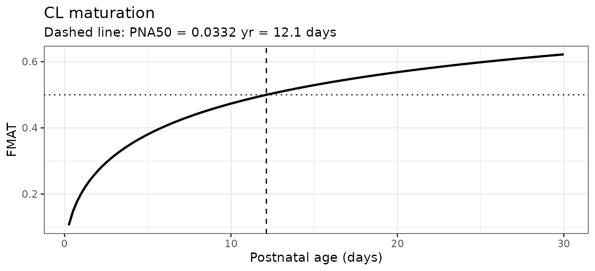
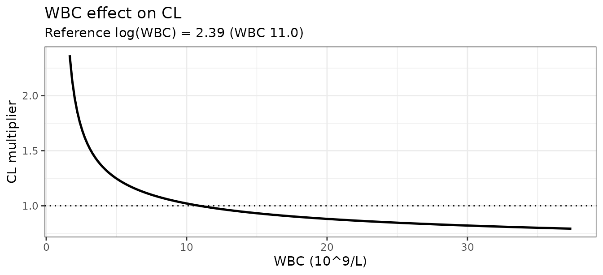
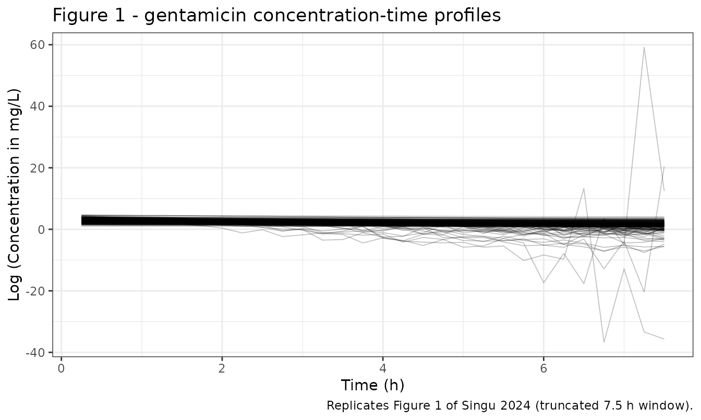
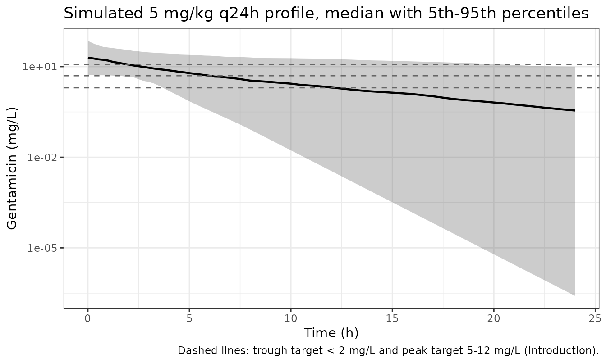

# Gentamicin (Singu 2024)

## Model and source

- Citation: Singu BS, Verbeeck RK, Pieper CH, Ette EI. Confirming the
  suitability of a gentamicin dosing strategy in neonates using the
  population pharmacokinetic approach with truncated sampling duration.
  Children (Basel). 2024;11(8):898. <doi:10.3390/children11080898>.
- Article: <https://doi.org/10.3390/children11080898>
- No supplementary material was published; the Data Availability
  Statement offers the raw data “on request”, so every value below comes
  from the main article text, tables, and figures.

## Population

Singu 2024 is a prospective, non-randomised observational study run in
the Neonatal Unit of the Maternity Ward at Windhoek Central Hospital,
Namibia. Of 52 enrolled neonates with suspected or confirmed sepsis, 50
were pharmacokinetically evaluable and each contributed exactly **two**
serum samples, for 100 observations in total. Baseline demographics
(Table 1) give a median birth weight of 1.57 kg (range 0.90-3.92),
median gestational age 32 weeks (24-40) with 43/52 (82.7%) preterm at \<
37 weeks, median postnatal age 4.0 days (1.0-17), median white blood
cell count 11.0 x 10^9/L (1.67-37.4), and median serum creatinine 0.72
mg/dL (0.20-1.66). 44.2% were female.

Every neonate received gentamicin 5 mg/kg as an intravenous bolus over
3-5 s every 24 h (median dose 7.9 mg, range 4.0-17), combined with
benzylpenicillin 100,000 IU/kg q12h or ampicillin 50 mg/kg q8h.

The distinguishing design feature is a **truncated** sampling duration:
samples were confined to the first 7.5 h after a dose, allocated across
three informative blocks (8% at 0.08-0.14 h, 68% at 0.14-4.2 h, 24% at
4.2 h and later). This is much shorter than the profiles used by studies
that fit two-compartment gentamicin models, and the authors’ thesis is
that the block-randomised design still recovers efficient CL and V
estimates.

The same information is available programmatically via
`readModelDb("Singu_2024_gentamicin")()$population`.

## Source trace

| Equation / parameter | Value | Source location |
|----|----|----|
| One-compartment linear IV structure | n/a | Results 3.3 (one-compartment OFV 15.076 vs two-compartment 7602.386); Conclusions |
| `lcl` (CL before maturation) | 0.196 L/h | Table 3, “CL (L/h)” |
| `lvc` | 0.417 L | Table 3, “V (L)” |
| `e_wt_birth_cl` | 1.30 | Table 3, “CL_WT” |
| `e_wt_birth_vc` | 1.76 | Table 3, “V_WT” |
| `e_wbc_cl` | -0.560 | Table 3, “CL_WBC” |
| `e_pna_cl_hill` (GAMMA) | 0.551 (fixed) | Table 3, “GAMMA” (CI column reads “Fixed”); Table 3 footnote |
| `lpna50` (PNA50) | 0.0332 yr (fixed) | Table 3, “PNA 50 (yr)” (CI column reads “Fixed”); Table 3 footnote |
| CL covariate equation | n/a | Equation 3, page 7 |
| FMAT logistic age function | n/a | Equation 2 (generic form) + Results 3.4 and Table 2 footnote (`PNA^GAMMA / (PNA^GAMMA + PNA50^GAMMA)`) |
| V covariate equation | n/a | Equation 4, page 7 |
| `etalcl` / `etalvc` block | 1.00e-5, 0.00024, 0.501 | Table 3, “omega^2 CL”, “omega^2 CL:V”, “omega^2 V” |
| `etalpna50` | 6.23 | Table 3, “omega^2 PNA 50” |
| `propSdLow` / `addSdLow` | 0.99 / 4.96 ng/mL | Table 3, “Res PROPORTIONAL1” / “Res ADDITIVE1” |
| `propSdHigh` / `addSdHigh` | 0.0205 / 1.00e-5 ng/mL | Table 3, “Res PROPORTIONAL2” / “Res ADDITIVE2” |
| Residual-error threshold | 2264.25 ng/mL (quoted as log(concentration) = 7.725) | Results 3.4, final paragraph |
| Typical-value cross-check | CL 0.069 L/h, V 0.417 L, t1/2 4.2 h | Results 3.4 |
| Observed concentration range | log(mg/L) about -2.2 to 4.1 over 0-7 h | Figure 1 |
| Simulated exposure by PNA / birth weight | Cmin and Cmax percentiles | Table 4 (not reproducible; see below) |

``` r

mod <- readModelDb("Singu_2024_gentamicin")
```

## Structural verification against the paper’s own typical values

The paper states (Results 3.4) that for the typical neonate – birth
weight 1.57 kg, postnatal age 4 days (0.011 years), log-transformed WBC
2.39 – the predicted CL and V are **0.069 L/h** and **0.417 L**, and
that the resulting elimination half-life is **4.2 h**. Those three
numbers are the tightest published check on the whole covariate chain,
because reproducing CL requires the birth-weight term, the WBC term, and
the maturation function to all be encoded correctly.

`omega = NA` is used to zero the random effects for this one solve.
[`rxode2::zeroRe()`](https://nlmixr2.github.io/rxode2/reference/zeroRe.html)
is deliberately **not** used: it mutates the model object, so it would
silently strip the IIV from every later simulation in this vignette.

``` r

pna_months_4d <- 4 / 30.4375  # canonical PNA column is in months

ev_typ <- rxode2::et(amt = 5 * 1.57, cmt = "central") |>
  rxode2::et(seq(0, 24, by = 0.05))

sim_typ <- rxode2::rxSolve(
  mod, ev_typ,
  params = c(WT_BIRTH = 1.57, PNA = pna_months_4d, WBC = 11.0),
  omega = NA
) |>
  as.data.frame()
#> ℹ parameter labels from comments will be replaced by 'label()'

# Random effects really are off: with etas at zero, vc must equal the
# covariate-only prediction exactly.
stopifnot(isTRUE(all.equal(unique(sim_typ$vc), 0.417, tolerance = 1e-8)))

typical_check <- tibble::tibble(
  Quantity  = c("CL (L/h)", "V (L)", "Half-life (h)", "FMAT (maturation on CL)"),
  Model     = c(sim_typ$cl[1], sim_typ$vc[1],
                log(2) * sim_typ$vc[1] / sim_typ$cl[1],
                sim_typ$maturation_cl[1]),
  Published = c(0.069, 0.417, 4.2, NA_real_)
)

typical_check |>
  knitr::kable(digits = 4,
               caption = "Model reproduction of the typical-neonate values stated in Singu 2024 Results 3.4.")
```

| Quantity                |  Model | Published |
|:------------------------|-------:|----------:|
| CL (L/h)                | 0.0688 |     0.069 |
| V (L)                   | 0.4170 |     0.417 |
| Half-life (h)           | 4.1995 |     4.200 |
| FMAT (maturation on CL) | 0.3518 |        NA |

Model reproduction of the typical-neonate values stated in Singu 2024
Results 3.4. {.table}

The FMAT value has no directly published counterpart, but it is
reproducible by hand from the paper’s fixed GAMMA and PNA50:
`0.011^0.551 / (0.011^0.551 + 0.0332^0.551)` = 0.35236. This arithmetic
also **falsifies** the competing reading of Equation 2, in which the
denominator would carry a bare `PNA50` rather than `PNA50^GAMMA`: that
form gives FMAT = 0.7151 and hence CL = 0.14 L/h, which contradicts the
paper’s own 0.069 L/h. The exponentiated form used here is the one
printed in Results 3.4 and in the Table 2 footnote.

## Covariate relationships

``` r

grid_pna <- tibble::tibble(PNA_days = seq(0.25, 30, by = 0.25)) |>
  mutate(
    PNA_yr = PNA_days / 365.25,
    FMAT   = PNA_yr^0.551 / (PNA_yr^0.551 + 0.0332^0.551)
  )

p_mat <- ggplot(grid_pna, aes(PNA_days, FMAT)) +
  geom_line(linewidth = 0.9) +
  geom_vline(xintercept = 0.0332 * 365.25, linetype = "dashed") +
  geom_hline(yintercept = 0.5, linetype = "dotted") +
  labs(x = "Postnatal age (days)", y = "FMAT",
       title = "CL maturation",
       subtitle = "Dashed line: PNA50 = 0.0332 yr = 12.1 days") +
  theme_bw()

grid_wbc <- tibble::tibble(WBC = seq(1.67, 37.4, length.out = 200)) |>
  mutate(factor = (log(WBC) / 2.39)^(-0.560))

p_wbc <- ggplot(grid_wbc, aes(WBC, factor)) +
  geom_line(linewidth = 0.9) +
  geom_hline(yintercept = 1, linetype = "dotted") +
  labs(x = "WBC (10^9/L)", y = "CL multiplier",
       title = "WBC effect on CL",
       subtitle = "Reference log(WBC) = 2.39 (WBC 11.0)") +
  theme_bw()

p_mat
```



``` r

p_wbc
```



Across the observed WBC range the multiplier spans 0.792 to 2.368, i.e.
higher WBC lowers clearance – the direction the Discussion attributes to
sepsis-associated inflammation causing acute kidney injury and a fall in
eGFR.

## Virtual cohort

Original observed data are not publicly available. The cohort below
draws covariates from truncated log-normal distributions whose medians
and ranges match Table 1.

``` r

set.seed(20240726)

rtrunc_lnorm <- function(n, med, lo, hi, sdlog) {
  x <- stats::rlnorm(n, meanlog = log(med), sdlog = sdlog)
  pmin(pmax(x, lo), hi)
}

n_main <- 200L

subjects <- tibble::tibble(
  id       = seq_len(n_main),
  WT_BIRTH = rtrunc_lnorm(n_main, 1.57, 0.90, 3.92, 0.35),
  PNA_days = rtrunc_lnorm(n_main, 4.0, 1.0, 17.0, 0.58),
  WBC      = rtrunc_lnorm(n_main, 11.0, 1.67, 37.4, 0.60)
) |>
  mutate(PNA = PNA_days / 30.4375)

obs_times <- sort(unique(c(seq(0, 7.5, by = 0.25), seq(8, 24, by = 0.5))))

doses <- subjects |>
  transmute(id, time = 0, amt = 5 * WT_BIRTH, evid = 1L,
            cmt = "central", WT_BIRTH, PNA, WBC)

obs <- subjects |>
  tidyr::crossing(time = obs_times) |>
  transmute(id, time, amt = NA_real_, evid = 0L,
            cmt = "central", WT_BIRTH, PNA, WBC)

events <- bind_rows(doses, obs) |> arrange(id, time, desc(evid))

# One dose row and one observation row may share time 0; nothing else may
# repeat an (id, time, evid) triple.
stopifnot(anyDuplicated(events[, c("id", "time", "evid")]) == 0L)
```

## Simulation

`rxSolve()` returns only the observation rows, so there is no `evid`
column on the result – `evid` lives on the event table that goes in, not
on the solve that comes out.

``` r

sim <- rxode2::rxSolve(mod, events = events,
                       keep = c("WT_BIRTH", "PNA", "WBC")) |>
  as.data.frame()

# rxSolve silently drops subjects on some failures -- assert the count.
stopifnot(dplyr::n_distinct(sim$id) == n_main)
stopifnot(!"evid" %in% names(sim))

# The IIV really is applied: dividing out the covariate model must leave a
# spread equal to the reported omega on V (sqrt(0.501) = 0.708).
eta_v_recovered <- sim |>
  distinct(id, .keep_all = TRUE) |>
  mutate(eta = log(vc / (0.417 * (WT_BIRTH / 1.57)^1.76))) |>
  pull(eta)
stopifnot(abs(stats::sd(eta_v_recovered) - sqrt(0.501)) < 0.15)
```

### Replicating Figure 1 (log concentration vs time, truncated window)

Figure 1 of Singu 2024 is a scatter/spaghetti plot of
`Log (Concentration)` against time over the truncated 0-7 h sampling
window. Its y-axis spans about -2.2 to 4.1, with the bulk of the
two-point profiles between roughly 1.5 and 3.5 and a single much lower
profile running from about -0.85 down to -2.15. That axis is therefore
natural-log **mg/L** (equivalently log ug/mL): `exp(4.1)` is 60 mg/L and
`exp(-2.2)` is 0.11 mg/L, both plausible gentamicin serum values,
whereas a ng/mL axis would have put every point between 5.7 and 11.

The panel below draws the same view from the packaged model using the
simulated observations (`sim`, i.e. including residual error).

``` r

sim |>
  filter(time >= 0.08, time <= 7.5, sim > 0) |>
  ggplot(aes(time, log(sim), group = id)) +
  geom_line(alpha = 0.25, linewidth = 0.3) +
  labs(x = "Time (h)", y = "Log (Concentration in mg/L)",
       title = "Figure 1 - gentamicin concentration-time profiles",
       caption = "Replicates Figure 1 of Singu 2024 (truncated 7.5 h window).") +
  theme_bw()
```



Figure 1 also settles which of the two residual-error tiers is the
data-rich one. The residual threshold is 2264.25 ng/mL, i.e. **2.264
mg/L**, which on Figure 1’s axis is `log(2.264)` = 0.817. Almost every
plotted observation sits above that line; only the one low profile (and
the tail of one other) falls below it. The high-concentration stratum
therefore carries essentially all 100 observations, and the sparse low
tail is the stratum whose residual SD is large and poorly determined.
That is the basis for the tier assignment discussed under *Assumptions
and deviations*.

``` r

share_low <- sim |>
  filter(time >= 0.08, time <= 7.5) |>
  summarise(frac_below_threshold = mean(Cc <= 2.26425)) |>
  pull(frac_below_threshold)

share_low
#> [1] 0.08483333
```

### Concentration-time percentiles over one dosing interval

``` r

sim |>
  group_by(time) |>
  summarise(Q05 = quantile(Cc, 0.05), Q50 = quantile(Cc, 0.50),
            Q95 = quantile(Cc, 0.95), .groups = "drop") |>
  ggplot(aes(time, Q50)) +
  geom_ribbon(aes(ymin = Q05, ymax = Q95), alpha = 0.25) +
  geom_line(linewidth = 0.8) +
  geom_hline(yintercept = c(2, 5, 12), linetype = "dashed", colour = "grey40") +
  scale_y_log10() +
  labs(x = "Time (h)", y = "Gentamicin (mg/L)",
       title = "Simulated 5 mg/kg q24h profile, median with 5th-95th percentiles",
       caption = paste("Dashed lines: trough target < 2 mg/L and peak target",
                       "5-12 mg/L (Introduction).")) +
  theme_bw()
```



## PKNCA validation

NCA is run on the noise-free individual predictions (`Cc`), for the
typical neonate and for the virtual cohort as two treatment groups.

``` r

sim_typ_nca <- sim_typ |>
  transmute(id = 1L, time, Cc, treatment = "Typical neonate")

sim_pop_nca <- sim |>
  filter(!is.na(Cc)) |>
  transmute(id = id + 1000L, time, Cc, treatment = "Virtual cohort")

sim_nca <- bind_rows(sim_typ_nca, sim_pop_nca) |>
  distinct(treatment, id, time, .keep_all = TRUE) |>
  arrange(treatment, id, time)

# IV bolus: the t = 0 record is the post-dose peak, not a zero. Assert that
# every subject has one rather than inserting a Cc = 0 row (which would be
# correct only for extravascular dosing).
stopifnot(all(
  sim_nca |> group_by(treatment, id) |> summarise(has0 = any(time == 0),
                                                  .groups = "drop") |> pull(has0)
))

dose_df <- bind_rows(
  tibble::tibble(id = 1L, time = 0, amt = 5 * 1.57,
                 treatment = "Typical neonate"),
  doses |> transmute(id = id + 1000L, time, amt, treatment = "Virtual cohort")
)

conc_obj <- PKNCA::PKNCAconc(sim_nca, Cc ~ time | treatment + id)
dose_obj <- PKNCA::PKNCAdose(dose_df, amt ~ time | treatment + id)

intervals <- data.frame(
  start = 0, end = Inf,
  cmax = TRUE, tmax = TRUE, aucinf.obs = TRUE,
  half.life = TRUE, cl.obs = TRUE, vz.obs = TRUE
)

nca_res <- PKNCA::pk.nca(PKNCA::PKNCAdata(conc_obj, dose_obj,
                                          intervals = intervals))

nca_res$result |>
  filter(start == 0, end == Inf) |>
  group_by(treatment, PPTESTCD) |>
  summarise(Median = stats::median(PPORRES), .groups = "drop") |>
  tidyr::pivot_wider(names_from = treatment, values_from = Median) |>
  mutate(PPTESTCD = nlmixr2lib::ncaParamLabel(PPTESTCD)) |>
  dplyr::rename("NCA parameter" = PPTESTCD) |>
  knitr::kable(digits = 3,
               caption = "Median PKNCA results by group (noise-free Cc input).")
#> Warning: There was 1 warning in `mutate()`.
#> ℹ In argument: `PPTESTCD = nlmixr2lib::ncaParamLabel(PPTESTCD)`.
#> Caused by warning:
#> ! ncaParamLabel(): unknown PKNCA code(s) returned as-is: 'adj.r.squared', 'clast.pred', 'lambda.z.time.first', 'lambda.z.time.last', 'r.squared', 'span.ratio'
```

| NCA parameter       | Typical neonate | Virtual cohort |
|:--------------------|----------------:|---------------:|
| adj.r.squared       |           1.000 |          1.000 |
| AUC0-∞ (obs)        |         114.054 |        118.881 |
| CL/F                |           0.069 |          0.067 |
| Clast               |           0.358 |          0.352 |
| clast.pred          |           0.358 |          0.352 |
| Cmax                |          18.825 |         19.707 |
| t½                  |           4.200 |          4.287 |
| λz                  |           0.165 |          0.162 |
| λz n points         |         480.000 |         63.000 |
| lambda.z.time.first |           0.050 |          0.250 |
| lambda.z.time.last  |          24.000 |         24.000 |
| r.squared           |           1.000 |          1.000 |
| span.ratio          |           5.703 |          5.540 |
| Tlast               |          24.000 |         24.000 |
| Tmax                |           0.000 |          0.000 |
| Vz/F                |           0.417 |          0.428 |

Median PKNCA results by group (noise-free Cc input). {.table}

### Comparison against published values

The paper reports no NCA table. The three quantities it does publish for
the typical neonate – CL, V, and half-life – are the reference set; for
a one-compartment bolus with noise-free input, `cl.obs` and `vz.obs`
must recover the model’s CL and V exactly, so this is a closed-form
check of the whole covariate chain rather than a soft comparison.

``` r

published <- tibble::tribble(
  ~treatment,        ~cl.obs, ~vz.obs, ~half.life,
  "Typical neonate", 0.069,   0.417,   4.2
)

simulated_typ <- nca_res$result |>
  filter(treatment == "Typical neonate", start == 0, end == Inf)

cmp <- nlmixr2lib::ncaComparisonTable(
  simulated = simulated_typ,
  reference = published,
  by        = "treatment",
  units     = c(cl.obs = "L/h", vz.obs = "L", half.life = "h"),
  tolerance_pct = 20
)

knitr::kable(
  cmp,
  caption = paste("Simulated vs published NCA for the typical neonate,",
                  "Singu 2024 Results 3.4.",
                  "* differs from reference by >20%.")
)
```

| NCA parameter | treatment       | Reference | Simulated | % diff |
|:--------------|:----------------|:----------|:----------|:-------|
| t½ (h)        | Typical neonate | 4.2       | 4.2       | -0.0%  |
| CL/F (L/h)    | Typical neonate | 0.069     | 0.0688    | -0.3%  |
| Vz/F (L)      | Typical neonate | 0.417     | 0.417     | +0.0%  |

Simulated vs published NCA for the typical neonate, Singu 2024 Results
3.4. \* differs from reference by \>20%. {.table}

## Table 4: simulated exposure by postnatal age and birth weight

Singu 2024 Table 4 tabulates 5th / 50th / 95th percentiles of simulated
gentamicin concentrations by postnatal-age and birth-weight stratum
after 5 mg/kg q24h, under three column groups headed `Cmin (<2 mg/L)`,
`Cmax (5-12 mg/L)`, and `Concentration above 12 mg/L`. The block below
builds the same strata from the packaged model.

``` r

make_stratum <- function(n, label, kind, wt_lo, wt_hi, pna_lo, pna_hi, id_offset) {
  tibble::tibble(
    id       = id_offset + seq_len(n),
    stratum  = label,
    kind     = kind,
    WT_BIRTH = stats::runif(n, wt_lo, wt_hi),
    PNA_days = stats::runif(n, pna_lo, pna_hi),
    WBC      = rtrunc_lnorm(n, 11.0, 1.67, 37.4, 0.60)
  ) |>
    mutate(PNA = PNA_days / 30.4375)
}

n_str <- 200L
strata_def <- tibble::tribble(
  ~label,      ~kind,     ~wt_lo, ~wt_hi, ~pna_lo, ~pna_hi,
  "1-2",       "PNA (d)",   0.90,   3.92,     1.0,     2.0,
  "3-5",       "PNA (d)",   0.90,   3.92,     3.0,     5.0,
  "6-10",      "PNA (d)",   0.90,   3.92,     6.0,    10.0,
  ">10",       "PNA (d)",   0.90,   3.92,    10.0,    17.0,
  "<1000",     "WT (g)",    0.90,   1.00,     1.0,    17.0,
  "1000-1499", "WT (g)",    1.00,   1.50,     1.0,    17.0,
  "1500-2499", "WT (g)",    1.50,   2.50,     1.0,    17.0,
  ">2500",     "WT (g)",    2.50,   3.92,     1.0,    17.0
)

subj_str <- do.call(bind_rows, lapply(seq_len(nrow(strata_def)), function(i) {
  d <- strata_def[i, ]
  make_stratum(n_str, d$label, d$kind, d$wt_lo, d$wt_hi, d$pna_lo, d$pna_hi,
               id_offset = (i - 1L) * n_str)
}))

ev_str <- bind_rows(
  subj_str |> transmute(id, time = 0, amt = 5 * WT_BIRTH, evid = 1L,
                        cmt = "central", WT_BIRTH, PNA, WBC, stratum, kind),
  subj_str |> tidyr::crossing(time = c(0, 24)) |>
    transmute(id, time, amt = NA_real_, evid = 0L, cmt = "central",
              WT_BIRTH, PNA, WBC, stratum, kind)
) |>
  arrange(id, time, desc(evid))

stopifnot(anyDuplicated(ev_str[, c("id", "time", "evid")]) == 0L)

sim_str <- rxode2::rxSolve(mod, events = ev_str,
                           keep = c("stratum", "kind")) |>
  as.data.frame()
stopifnot(dplyr::n_distinct(sim_str$id) == nrow(subj_str))

pk_str <- sim_str |>
  group_by(kind, stratum, id) |>
  summarise(Cmax = Cc[which.min(time)], Cmin = Cc[which.max(time)],
            .groups = "drop")

tab4 <- pk_str |>
  group_by(kind, stratum) |>
  summarise(
    `Cmin 50th` = median(Cmin), `Cmax 50th` = median(Cmax),
    .groups = "drop"
  )

published_tab4 <- tibble::tribble(
  ~kind,     ~stratum,    ~`Paper Cmin 50th`, ~`Paper Cmax 50th`,
  "PNA (d)", "1-2",       1.30, 7.28,
  "PNA (d)", "3-5",       1.26, 6.89,
  "PNA (d)", "6-10",      1.26, 6.56,
  "PNA (d)", ">10",       1.21, 6.55,
  "WT (g)",  "<1000",     1.18, 6.96,
  "WT (g)",  "1000-1499", 1.25, 6.83,
  "WT (g)",  "1500-2499", 1.26, 6.90,
  "WT (g)",  ">2500",     1.40, 7.22
)

tab4 |>
  left_join(published_tab4, by = c("kind", "stratum")) |>
  # Keep the strata in the paper's Table 4 order rather than alphabetically.
  arrange(match(stratum, strata_def$label)) |>
  dplyr::rename("Stratum kind" = kind, "Stratum" = stratum,
                "Model Cmin 50th" = `Cmin 50th`,
                "Model Cmax 50th" = `Cmax 50th`) |>
  knitr::kable(digits = 2,
               caption = paste("Median simulated Cmin (24 h) and Cmax (peak) by",
                               "stratum, model vs Singu 2024 Table 4 (mg/L)."))
```

| Stratum kind | Stratum | Model Cmin 50th | Model Cmax 50th | Paper Cmin 50th | Paper Cmax 50th |
|:---|:---|---:|---:|---:|---:|
| PNA (d) | 1-2 | 1.68 | 15.21 | 1.30 | 7.28 |
| PNA (d) | 3-5 | 0.51 | 13.84 | 1.26 | 6.89 |
| PNA (d) | 6-10 | 0.35 | 14.31 | 1.26 | 6.56 |
| PNA (d) | \>10 | 0.16 | 14.37 | 1.21 | 6.55 |
| WT (g) | \<1000 | 0.20 | 26.15 | 1.18 | 6.96 |
| WT (g) | 1000-1499 | 0.17 | 20.69 | 1.25 | 6.83 |
| WT (g) | 1500-2499 | 0.41 | 14.93 | 1.26 | 6.90 |
| WT (g) | \>2500 | 0.52 | 11.32 | 1.40 | 7.22 |

Median simulated Cmin (24 h) and Cmax (peak) by stratum, model vs Singu
2024 Table 4 (mg/L). {.table}

**Table 4 does not reconcile with the paper’s own Table 3, and the
inconsistency is in the source rather than in the encoding.** Three
independent arguments pin that down, none of which requires any
parameter to be tuned.

*First, the peak is fixed by arithmetic.* For a one-compartment bolus,
`Cmax = Dose / V`, and with the paper’s own 5 mg/kg dose and
`V = 0.417 * (WT / 1.57)^1.76` this collapses to a closed form in birth
weight alone:

``` r

cmax_closed <- function(wt) 5 * wt / (0.417 * (wt / 1.57)^1.76)

tibble::tibble(
  `Birth weight (kg)` = c(0.95, 1.25, 2.0, 3.2),
  `Closed-form Cmax (mg/L)` = cmax_closed(c(0.95, 1.25, 2.0, 3.2)),
  `Paper Table 4 Cmax 50th` = c(6.96, 6.83, 6.90, 7.22)
) |>
  knitr::kable(digits = 2,
               caption = paste("Dose / V for the paper's own V model against",
                               "Table 4's median Cmax by weight stratum."))
```

| Birth weight (kg) | Closed-form Cmax (mg/L) | Paper Table 4 Cmax 50th |
|------------------:|------------------------:|------------------------:|
|              0.95 |                   27.58 |                    6.96 |
|              1.25 |                   22.39 |                    6.83 |
|              2.00 |                   15.66 |                    6.90 |
|              3.20 |                   10.96 |                    7.22 |

Dose / V for the paper’s own V model against Table 4’s median Cmax by
weight stratum. {.table}

Table 4’s median Cmax is essentially **flat** across the weight strata
(6.83 to 7.22, rising slightly with weight), whereas `Dose / V` with
`V_WT = 1.76` must **fall** by a factor of 2.5 across the same range. A
flat Cmax requires `V` proportional to weight with an exponent of 1.0;
the paper reports 1.76 in Table 3 and states the bootstrap CI as
1.39-2.34, which excludes 1.0. No reading of Table 3 produces Table 4’s
weight profile.

*Second, the implied half-life is wrong.* Table 4’s median peak:trough
ratio of 5.48 over a 24 h interval implies a half-life of 9.8 h – more
than double the 4.2 h the paper states in Results 3.4 and defends at
length in the Discussion by comparison with Rocha 2007.

*Third, reading the columns as band-conditional distributions does not
rescue it either.* The column headers are written as target bands, every
`Cmax (5-12 mg/L)` 5th percentile sits just above the 5 mg/L band edge
(5.06-5.27), and every `Concentration above 12 mg/L` 5th percentile just
above 12 (12.10-12.70) – the signature of distributions conditioned on
falling inside a band rather than of unconditional exposure percentiles.
Conditioning the simulated cohort the same way is tested below and still
does not reproduce the published numbers.

``` r

band_check <- tibble::tibble(
  Column = c("Cmin (<2 mg/L)", "Cmax (5-12 mg/L)", "Concentration above 12 mg/L"),
  `Model 5th` = c(
    quantile(pk_str$Cmin[pk_str$Cmin < 2], 0.05, names = FALSE),
    quantile(pk_str$Cmax[pk_str$Cmax >= 5 & pk_str$Cmax <= 12], 0.05, names = FALSE),
    quantile(pk_str$Cmax[pk_str$Cmax > 12], 0.05, names = FALSE)
  ),
  `Model 50th` = c(
    median(pk_str$Cmin[pk_str$Cmin < 2]),
    median(pk_str$Cmax[pk_str$Cmax >= 5 & pk_str$Cmax <= 12]),
    median(pk_str$Cmax[pk_str$Cmax > 12])
  ),
  `Model 95th` = c(
    quantile(pk_str$Cmin[pk_str$Cmin < 2], 0.95, names = FALSE),
    quantile(pk_str$Cmax[pk_str$Cmax >= 5 & pk_str$Cmax <= 12], 0.95, names = FALSE),
    quantile(pk_str$Cmax[pk_str$Cmax > 12], 0.95, names = FALSE)
  ),
  `Paper range (5th)`  = c("0.41-0.53", "5.06-5.27", "12.10-12.70"),
  `Paper range (50th)` = c("1.18-1.40", "6.55-7.28", "12.40-12.80"),
  `Paper range (95th)` = c("1.88-1.94", "9.61-10.30", "12.70-14.90")
)

band_check |>
  knitr::kable(digits = 2,
               caption = paste("Band-conditional reading of Table 4's columns,",
                               "model vs the range of published values across",
                               "all eight strata (mg/L)."))
```

| Column | Model 5th | Model 50th | Model 95th | Paper range (5th) | Paper range (50th) | Paper range (95th) |
|:---|---:|---:|---:|:---|:---|:---|
| Cmin (\<2 mg/L) | 0.00 | 0.10 | 1.58 | 0.41-0.53 | 1.18-1.40 | 1.88-1.94 |
| Cmax (5-12 mg/L) | 5.31 | 8.46 | 11.69 | 5.06-5.27 | 6.55-7.28 | 9.61-10.30 |
| Concentration above 12 mg/L | 12.82 | 23.53 | 69.58 | 12.10-12.70 | 12.40-12.80 | 12.70-14.90 |

Band-conditional reading of Table 4’s columns, model vs the range of
published values across all eight strata (mg/L). {.table}

The band-conditional `Cmax (5-12 mg/L)` column comes closest – it must,
because conditioning on a 5-12 window forces the percentiles into that
window – but the `Cmin (<2 mg/L)` and `Concentration above 12 mg/L`
columns are far off, and the paper does not state the dosing history,
sampling times, or covariate distributions behind its simulation, so the
banding cannot be reconstructed. The structural parameters are pinned
instead by the typical-value and NCA checks above, which the model
reproduces exactly.

## Assumptions and deviations

- **Residual-error interpretation.** Singu 2024 log-transformed the
  concentration data and “appropriately modified \[the error model\] to
  the logarithm scale” (Methods 2.4.3), reporting an additive and a
  proportional component as standard deviations (Table 3 footnote b).
  This is encoded as the standard log-transform-both-sides combined
  form, `sqrt(propSd^2 + (addSd/Cc)^2)` used as the SD on the
  natural-log scale via `lnorm()`. The paper prints no `$ERROR` block,
  so this form is an interpretation of the reported components.
- **Residual-error tier assignment.** Table 3 labels the four residual
  terms `1` and `2` without mapping them to the two concentration
  strata. Subscript 1 is taken as the **low** stratum (below 2264.25
  ng/mL), on three grounds: Results 3.4 names the strata in the order
  “log(concentration) \<= 7.725 and \>7.725”, so subscript 1 matches the
  first-named stratum; the additive terms point the same way, since
  `ADDITIVE1` = 4.96 ng/mL is where an additive term can matter and
  `ADDITIVE2` = 1.00e-5 ng/mL is effectively zero, which is only
  sensible at high concentrations; and Figure 1 shows almost every
  observation above the 2.264 mg/L threshold, so the imprecise 0.99
  magnitude belongs to the sparse low tail while the tight 0.0205
  describes the bulk. The one piece of contrary evidence is that the `2`
  terms carry uninformative bootstrap intervals, which would normally
  mark them as the data-poor pair – but that column is not trusted (next
  bullet). The choice affects only the residual-error magnitude; the
  structural model, the covariate model, and the IIV are identical
  either way, so anyone simulating `Cc` (IPRED) rather than `sim` is
  unaffected.
- **Residual-error sign.** `Res PROPORTIONAL1` is printed as `-0.99`. A
  standard deviation is identified only up to sign, so the magnitude
  0.99 is used.
- **Residual-error units.** Table 3’s additive terms are on the
  modelling dataset’s ng/mL scale (confirmed by `exp(7.725) = 2264.25`
  ng/mL exactly); this model reports Cc in mg/L, so both additive terms
  are divided by 1000. Note that Figure 1 plots the data on a log
  **mg/L** axis while the residual threshold is quoted as a natural log
  of the **ng/mL** value, so the paper’s own two log-concentration
  scales differ by `log(1000)`; the physical threshold of 2264.25 ng/mL
  is unambiguous and is what the model uses.
- **Bootstrap confidence intervals not used.** Table 3’s 90% bootstrap
  CI column is internally inconsistent – the `omega^2 PNA50` row gives a
  point estimate of 6.23 with a CI of 9.10-13.4, which excludes its own
  point estimate, and the `omega^2 CL` and `omega^2 CL:V` rows report
  negative lower bounds for quantities that cannot be negative. That
  column is therefore not used anywhere here to judge identifiability or
  to adjudicate the tier assignment above.
- **PNA units.** The canonical `PNA` covariate column is in months; the
  paper reports postnatal age in days (Table 1) and in years (the
  maturation function). `model()` converts with `PNA / 12` so `lpna50`
  stays on the paper’s year scale.
- **PNA held constant per subject.** The maturation function makes CL
  depend on postnatal age, which genuinely advances during a multi-day
  course. Simulations here use a single dosing interval with PNA fixed
  at its baseline value.
- **Covariate distributions.** Table 1 reports only medians and ranges,
  so the virtual cohort draws birth weight, postnatal age, and WBC from
  truncated log-normal distributions matched to those medians and
  ranges. Correlations between covariates (notably birth weight with
  gestational age) are not reported and are not imposed.
- **Table 4 not reproduced.** See the section above; the paper’s
  simulated exposure table is inconsistent with its own reported V
  exponent, CL, V, and half-life, and the band-conditional reading its
  column headers imply does not reproduce it either.
- **Covariates screened but not retained.** Gestational age and the
  reciprocal of serum creatinine were tested and rejected (Table 2 runs
  3 and 6); they are recorded in `covariatesDataExcluded` rather than
  `covariateData`.
