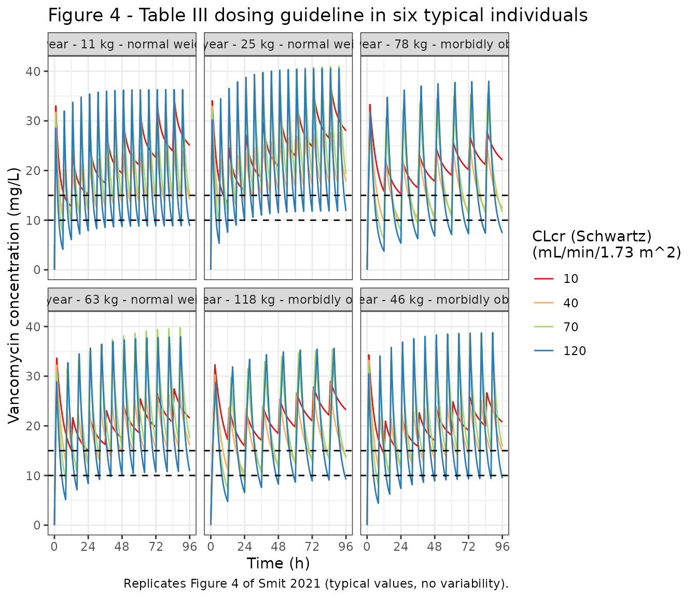
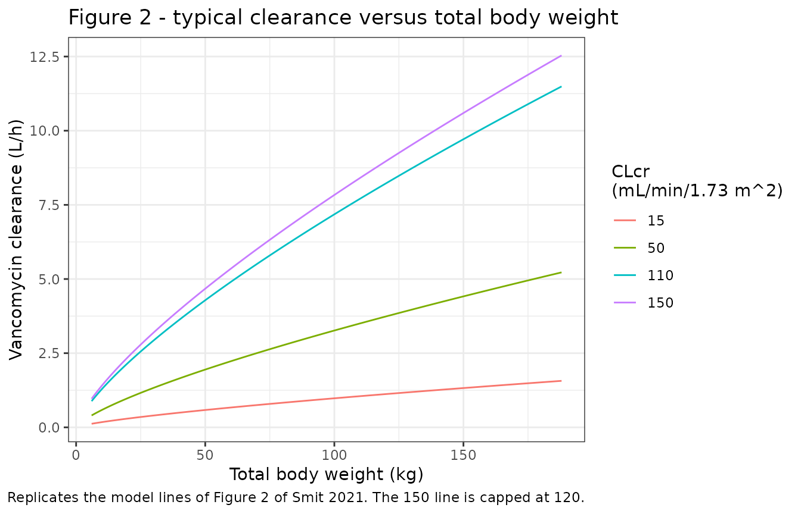

# Vancomycin (Smit 2021)

## Model and source

- Citation: Smit C, Goulooze SC, Bruggemann RJM, Sherwin CM, Knibbe CAJ.
  Dosing Recommendations for Vancomycin in Children and Adolescents with
  Varying Levels of Obesity and Renal Dysfunction: a Population
  Pharmacokinetic Study in 1892 Children Aged 1-18 Years. AAPS J.
  2021;23(3):53. <doi:10.1208/s12248-021-00577-x>
- Description: Two-compartment IV population PK model for vancomycin in
  normal-weight, overweight and obese children and adolescents aged 1-18
  years with a wide range of renal function (Smit 2021). Clearance
  scales as a power function of total body weight (estimated exponent
  0.745, reference 22.1 kg) and linearly with bedside-Schwartz
  creatinine clearance capped at 120 mL/min/1.73 m^2 (reference 100
  mL/min/1.73 m^2); central and peripheral volumes scale linearly with
  total body weight and intercompartmental clearance as a power function
  of total body weight (exponent 0.599). Residual variability is
  additive on log-transformed concentrations.
- Article: <https://doi.org/10.1208/s12248-021-00577-x>
- Supplement (methods, results, NONMEM control stream of the final
  model): Online Resource 1 at the article landing page.

Smit 2021 is a retrospective multicenter population PK analysis of
intravenous vancomycin in 1892 children and adolescents aged 1-18 years,
548 of whom were overweight or obese, with renal function spanning a
bedside Schwartz creatinine clearance of 8.6 to over 900 mL/min/1.73
m^2. The final two-compartment model (Table II) drives clearance by
total body weight (power function, estimated exponent 0.745) and by
bedside Schwartz CLcr (linear, capped at 120 mL/min/1.73 m^2). The paper
then uses the typical-value model to derive a weight- and
renal-function-based dosing guideline (Table III) and demonstrates it on
six typical individuals (Figure 4). This vignette reproduces Figure 4
numerically from the packaged model.

## Population

The analysis used routine therapeutic-drug-monitoring data from 21
Intermountain Healthcare hospitals in Utah, USA, collected between 2006
and 2012 (Smit 2021 Methods; Table I). Of 1924 eligible patients, 26 on
renal replacement therapy or ECMO and 6 without a recorded body weight
were excluded, leaving 1892 patients and 5524 serum concentrations: 1344
normal weight, 247 overweight and 301 obese (BMI-for-age above the 85th
and 95th percentile of the WHO (1-2 years) or CDC (2-18 years) charts).
Median age was about 7 years in each weight group (range 1-18); median
total body weight was 20.6, 25.0 and 30.0 kg in the three groups
(overall range 5.8-188 kg). About 56% were male and 88% Caucasian; 35%
were admitted to intensive care and about 17% were neutropenic. Median
bedside Schwartz CLcr was 111.7-121.2 mL/min/1.73 m^2 across weight
groups; only 12 patients were below 30 mL/min/1.73 m^2. Vancomycin was
generally dosed at 15-20 mg/kg two to four times daily as 60-min
infusions.

The same information is available programmatically via the model’s
`population` metadata
(`readModelDb("Smit_2021_vancomycin")()$population`).

## Source trace

Per-parameter origin is recorded as an in-file comment next to each
`ini()` entry in `inst/modeldb/specificDrugs/Smit_2021_vancomycin.R`.
The table below collects them in one place.

| Equation / parameter | Value | Source location |
|----|----|----|
| `lcl` (CL at 22.1 kg, CLcr 100) | 2.12 L/h (RSE 1%) | Table II, TVCL |
| `lvc` (V1 at 22.1 kg) | 8.90 L (RSE 3%) | Table II, TVV1 |
| `lq` (Q at 22.1 kg) | 1.55 L/h (RSE 5%) | Table II, TVQ (the table prints the unit as “L”; Q is a clearance, L/h) |
| `lvp` (V2 at 22.1 kg) | 12.3 L (RSE 6%) | Table II, TVV2 |
| `e_wt_cl` | 0.745 (RSE 2%) | Table II, theta1 |
| `e_wt_q` | 0.599 (RSE 9%) | Table II, theta2 |
| `e_wt_vc_vp` | 1, fixed | Table II equations `TVV1 x (TBW/22.1)`, `TVV2 x (TBW/22.1)`; supplement control stream `THETA(7)` = `(1) FIX` |
| `e_crcl_cl` | 1, fixed | Table II equation `TVCL x (TBW/22.1)^theta1 x (SCHW/100)`; supplement control stream `THETA(5)` = `(1) FIX` |
| CLcr cap | 120 mL/min/1.73 m^2 | Table II footnote a; control stream `IF(SCHW.GT.120) SCHW_MAX=120` |
| `etalcl` | log(1 + 0.287^2) = 0.0792 | Table II, IIV CL 28.7%; footnote c defines CV = sqrt(exp(omega^2) - 1) |
| `etalvp` | log(1 + 1.10^2) = 0.793 | Table II, IIV V2 110% |
| cov(`etalcl`, `etalvp`) | -0.085 | Table II, covariance IIV CL-V2 |
| `expSd` | sqrt(0.0789) = 0.281 | Table II, proportional error 0.0789 (read as the log-domain variance; see Assumptions) |
| Two-compartment ODE | n/a | Supplement control stream `$SUBROUTINE ADVAN3 TRANS4` |
| Residual model | n/a | Supplement control stream `$ERROR`: `Y = LOG(F) + ERR(1)` on log-transformed DV |

## Replicate Figure 4: the proposed dosing guideline in six typical individuals

Figure 4 of Smit 2021 simulates the Table III dosing guideline in six
typical individuals from the dataset (1 year / 11 kg, 9 years / 46 kg,
12 years / 25 kg, 13 years / 78 kg, 16 years / 63 kg and 17 years / 118
kg), each at four bedside Schwartz CLcr values (10, 40, 70 and 120
mL/min/1.73 m^2), without between-subject or residual variability. Each
panel prints AUCday3 (AUC from 48 to 72 h), Cmin at day 3 and AUCday1
(AUC from 0 to 24 h). Age does not enter the model; only weight and CLcr
do.

Table III maps weight and CLcr to a regimen:

| CLcr (mL/min/1.73 m^2) | TBW \< 30 kg     | TBW 30-70 kg     | TBW \> 70 kg      |
|------------------------|------------------|------------------|-------------------|
| \> 90                  | 15 mg/kg q6h     | 15 mg/kg q8h     | 18 mg/kg q12h     |
| 50-90                  | 11 mg/kg q6h (a) | 11 mg/kg q8h (a) | 12 mg/kg q12h (a) |
| 30-50                  | 5 mg/kg q6h (a)  | 5 mg/kg q8h (a)  | 6 mg/kg q12h (a)  |
| 10-30                  | 5 mg/kg q12h (a) | 3 mg/kg q12h (a) | 3 mg/kg q12h (a)  |

1.  First dose is 15 mg/kg.

``` r

fig4_individuals <- tibble::tribble(
  ~individual,                          ~WT,
  "1 year - 11 kg - normal weight",      11,
  "9 year - 46 kg - morbidly obese",     46,
  "12 year - 25 kg - normal weight",     25,
  "13 year - 78 kg - morbidly obese",    78,
  "16 year - 63 kg - normal weight",     63,
  "17 year - 118 kg - morbidly obese",  118
)

# Table III: maintenance dose (mg/kg) and interval (h) by CLcr row and weight column.
table3 <- tibble::tribble(
  ~CRCL, ~wt_band, ~dose_mgkg, ~tau, ~footnote_a,
  120,   "<30",    15,         6,    FALSE,
  120,   "30-70",  15,         8,    FALSE,
  120,   ">70",    18,         12,   FALSE,
  70,    "<30",    11,         6,    TRUE,
  70,    "30-70",  11,         8,    TRUE,
  70,    ">70",    12,         12,   TRUE,
  40,    "<30",    5,          6,    TRUE,
  40,    "30-70",  5,          8,    TRUE,
  40,    ">70",    6,          12,   TRUE,
  10,    "<30",    5,          12,   TRUE,
  10,    "30-70",  3,          12,   TRUE,
  10,    ">70",    3,          12,   TRUE
)

fig4_scenarios <- tidyr::crossing(fig4_individuals, CRCL = c(10, 40, 70, 120)) |>
  dplyr::mutate(wt_band = dplyr::case_when(WT < 30 ~ "<30", WT <= 70 ~ "30-70", TRUE ~ ">70")) |>
  dplyr::left_join(table3, by = c("CRCL", "wt_band")) |>
  dplyr::mutate(
    id = dplyr::row_number(),
    scenario = paste0(individual, " | CLcr ", CRCL),
    # Footnote (a) rows start with 15 mg/kg; the > 90 row has no footnote, so
    # its first dose is the maintenance dose.
    first_mgkg = ifelse(footnote_a, 15, dose_mgkg)
  )
knitr::kable(
  fig4_scenarios |>
    dplyr::select(individual, WT, CRCL, first_mgkg, dose_mgkg, tau) |>
    dplyr::rename(
      "Individual" = individual, "TBW (kg)" = WT, "CLcr" = CRCL,
      "First dose (mg/kg)" = first_mgkg, "Maintenance (mg/kg)" = dose_mgkg,
      "Interval (h)" = tau
    ),
  caption = "The 24 Figure 4 scenarios and their Table III regimens."
)
```

| Individual | TBW (kg) | CLcr | First dose (mg/kg) | Maintenance (mg/kg) | Interval (h) |
|:---|---:|---:|---:|---:|---:|
| 1 year - 11 kg - normal weight | 11 | 10 | 15 | 5 | 12 |
| 1 year - 11 kg - normal weight | 11 | 40 | 15 | 5 | 6 |
| 1 year - 11 kg - normal weight | 11 | 70 | 15 | 11 | 6 |
| 1 year - 11 kg - normal weight | 11 | 120 | 15 | 15 | 6 |
| 12 year - 25 kg - normal weight | 25 | 10 | 15 | 5 | 12 |
| 12 year - 25 kg - normal weight | 25 | 40 | 15 | 5 | 6 |
| 12 year - 25 kg - normal weight | 25 | 70 | 15 | 11 | 6 |
| 12 year - 25 kg - normal weight | 25 | 120 | 15 | 15 | 6 |
| 13 year - 78 kg - morbidly obese | 78 | 10 | 15 | 3 | 12 |
| 13 year - 78 kg - morbidly obese | 78 | 40 | 15 | 6 | 12 |
| 13 year - 78 kg - morbidly obese | 78 | 70 | 15 | 12 | 12 |
| 13 year - 78 kg - morbidly obese | 78 | 120 | 18 | 18 | 12 |
| 16 year - 63 kg - normal weight | 63 | 10 | 15 | 3 | 12 |
| 16 year - 63 kg - normal weight | 63 | 40 | 15 | 5 | 8 |
| 16 year - 63 kg - normal weight | 63 | 70 | 15 | 11 | 8 |
| 16 year - 63 kg - normal weight | 63 | 120 | 15 | 15 | 8 |
| 17 year - 118 kg - morbidly obese | 118 | 10 | 15 | 3 | 12 |
| 17 year - 118 kg - morbidly obese | 118 | 40 | 15 | 6 | 12 |
| 17 year - 118 kg - morbidly obese | 118 | 70 | 15 | 12 | 12 |
| 17 year - 118 kg - morbidly obese | 118 | 120 | 18 | 18 | 12 |
| 9 year - 46 kg - morbidly obese | 46 | 10 | 15 | 3 | 12 |
| 9 year - 46 kg - morbidly obese | 46 | 40 | 15 | 5 | 8 |
| 9 year - 46 kg - morbidly obese | 46 | 70 | 15 | 11 | 8 |
| 9 year - 46 kg - morbidly obese | 46 | 120 | 15 | 15 | 8 |

The 24 Figure 4 scenarios and their Table III regimens. {.table}

Doses are infused at 10 mg/min (600 mg/h) with a minimum duration of 1
h: a dose up to 600 mg runs over 60 min, a larger dose over `amt / 600`
hours (see Assumptions for why).

``` r

obs_times <- round(seq(0, 96, by = 0.05), 2)
build_fig4_events <- function(sc) {
  dose_times <- seq(0, 95.99, by = sc$tau)
  amts <- c(sc$first_mgkg, rep(sc$dose_mgkg, length(dose_times) - 1)) * sc$WT
  doses <- tibble::tibble(
    id = sc$id, time = dose_times, amt = amts, rate = pmin(amts, 600),
    evid = 1L, cmt = "central"
  )
  obs <- tibble::tibble(
    id = sc$id, time = obs_times, amt = 0, rate = 0, evid = 0L, cmt = "central"
  )
  dplyr::bind_rows(doses, obs) |>
    dplyr::mutate(WT = sc$WT, CRCL = sc$CRCL, scenario = sc$scenario)
}
fig4_events <- lapply(split(fig4_scenarios, fig4_scenarios$id), build_fig4_events) |>
  dplyr::bind_rows() |>
  dplyr::arrange(id, time, dplyr::desc(evid))
stopifnot(!anyDuplicated(fig4_events[, c("id", "time", "evid")]))
```

``` r

mod <- readModelDb("Smit_2021_vancomycin")
mod_typical <- mod |> rxode2::zeroRe()
#> ℹ parameter labels from comments will be replaced by 'label()'
sim_fig4 <- rxode2::rxSolve(
  mod_typical,
  events = fig4_events,
  keep = c("scenario", "WT", "CRCL")
) |>
  as.data.frame() |>
  dplyr::left_join(
    fig4_scenarios |> dplyr::select(id, individual, tau),
    by = "id"
  )
#> ℹ omega/sigma items treated as zero: 'etalcl', 'etalvp'
#> Warning: multi-subject simulation without without 'omega'
```

(The `left_join` above attaches one row of per-scenario metadata per
`id`; the `id` values are unique per scenario, so it cannot fan out
rows.)

``` r

ggplot(sim_fig4, aes(time, Cc, colour = factor(CRCL))) +
  geom_line() +
  geom_hline(yintercept = c(10, 15), linetype = "dashed") +
  facet_wrap(~individual, ncol = 3) +
  scale_x_continuous(breaks = seq(0, 96, 24)) +
  scale_colour_manual(
    values = c(`10` = "#D7191C", `40` = "#FDAE61", `70` = "#A6D96A", `120` = "#2C7BB6")
  ) +
  labs(
    x = "Time (h)", y = "Vancomycin concentration (mg/L)",
    colour = "CLcr (Schwartz)\n(mL/min/1.73 m^2)",
    title = "Figure 4 - Table III dosing guideline in six typical individuals",
    caption = "Replicates Figure 4 of Smit 2021 (typical values, no variability)."
  ) +
  theme_bw()
```



## PKNCA validation against the Figure 4 labels

PKNCA computes AUCday1 (0-24 h) and AUCday3 (48-72 h) on each
typical-value profile. The Figure 4 Cmin at day 3 matches the first
trough after the 48 h dose (the minimum over the day-3 window once the
trough at 48 h itself is excluded), so it is computed as the PKNCA
`cmin` over 49-72 h: every dose infuses for at least 1 h and troughs
rise through day 3, so that minimum is the trough at 48 h + tau.

``` r

nca_conc <- sim_fig4 |>
  dplyr::filter(!is.na(Cc)) |>
  dplyr::select(id, scenario, time, Cc)
nca_dose <- fig4_events |>
  dplyr::filter(evid == 1) |>
  dplyr::select(id, scenario, time, amt)

conc_obj <- PKNCA::PKNCAconc(nca_conc, Cc ~ time | scenario + id)
dose_obj <- PKNCA::PKNCAdose(nca_dose, amt ~ time | scenario + id)
intervals <- data.frame(
  start = c(0, 48, 49),
  end = c(24, 72, 72),
  auclast = c(TRUE, TRUE, FALSE),
  cmin = c(FALSE, FALSE, TRUE)
)
nca_res <- PKNCA::pk.nca(PKNCA::PKNCAdata(conc_obj, dose_obj, intervals = intervals))

nca_wide <- as.data.frame(nca_res) |>
  dplyr::mutate(param = dplyr::case_when(
    PPTESTCD == "auclast" & start == 0 ~ "auc_day1",
    PPTESTCD == "auclast" & start == 48 ~ "auc_day3",
    PPTESTCD == "cmin" ~ "cmin_day3"
  )) |>
  dplyr::select(scenario, param, PPORRES) |>
  tidyr::pivot_wider(names_from = param, values_from = PPORRES)
```

The published values below were transcribed by the maintainers from the
text labels printed inside each Figure 4 panel (red = CLcr 10, orange =
40, green = 70, blue = 120 mL/min/1.73 m^2).

``` r

published_fig4 <- tibble::tribble(
  ~individual,                          ~CRCL, ~auc_day3, ~cmin_day3, ~auc_day1,
  "1 year - 11 kg - normal weight",     10,    593.45,    21.2,       420.88,
  "1 year - 11 kg - normal weight",     40,    422.52,    13.7,       373.65,
  "1 year - 11 kg - normal weight",     70,    541.09,    14.7,       415.70,
  "1 year - 11 kg - normal weight",     120,   435.02,    8.9,        355.16,
  "9 year - 46 kg - morbidly obese",    10,    496.28,    18.1,       448.20,
  "9 year - 46 kg - morbidly obese",    40,    435.67,    13.8,       398.87,
  "9 year - 46 kg - morbidly obese",    70,    565.90,    14.9,       425.38,
  "9 year - 46 kg - morbidly obese",    120,   463.76,    9.2,        363.41,
  "12 year - 25 kg - normal weight",    10,    646.89,    23.0,       453.24,
  "12 year - 25 kg - normal weight",    40,    503.07,    16.6,       420.30,
  "12 year - 25 kg - normal weight",    70,    655.77,    18.6,       478.97,
  "12 year - 25 kg - normal weight",    120,   533.20,    11.8,       418.58,
  "13 year - 78 kg - morbidly obese",   10,    521.67,    19.1,       469.74,
  "13 year - 78 kg - morbidly obese",   40,    393.37,    11.6,       377.29,
  "13 year - 78 kg - morbidly obese",   70,    463.61,    10.9,       356.34,
  "13 year - 78 kg - morbidly obese",   120,   420.97,    7.2,        334.17,
  "16 year - 63 kg - normal weight",    10,    511.40,    18.7,       460.97,
  "16 year - 63 kg - normal weight",    40,    463.01,    14.8,       417.03,
  "16 year - 63 kg - normal weight",    70,    605.87,    16.4,       448.31,
  "16 year - 63 kg - normal weight",    120,   499.53,    10.5,       385.51,
  "17 year - 118 kg - morbidly obese",  10,    541.76,    19.8,       486.35,
  "17 year - 118 kg - morbidly obese",  40,    424.72,    12.7,       399.07,
  "17 year - 118 kg - morbidly obese",  70,    505.23,    12.5,       380.20,
  "17 year - 118 kg - morbidly obese",  120,   462.88,    8.8,        360.13
) |>
  dplyr::mutate(scenario = paste0(individual, " | CLcr ", CRCL)) |>
  dplyr::select(scenario, auc_day3, cmin_day3, auc_day1)
stopifnot(nrow(published_fig4) == 24, setequal(published_fig4$scenario, nca_wide$scenario))
```

``` r

cmp <- nlmixr2lib::ncaComparisonTable(
  simulated = nca_wide,
  reference = published_fig4,
  by = "scenario",
  params = c("auc_day3", "cmin_day3", "auc_day1"),
  units = c(auc_day3 = "mg*h/L", cmin_day3 = "mg/L", auc_day1 = "mg*h/L"),
  tolerance_pct = 20
)
#> Warning: ncaParamLabel(): unknown PKNCA code(s) returned as-is: 'auc_day3',
#> 'cmin_day3', 'auc_day1'
knitr::kable(
  cmp,
  caption = "Simulated (PKNCA) vs. published Figure 4 values. * differs from the reference by >20%."
)
```

| NCA parameter | scenario | Reference | Simulated | % diff |
|:---|:---|:---|:---|:---|
| auc_day1 (mg\*h/L) | 1 year - 11 kg - normal weight \| CLcr 10 | 421 | 421 | +0.0% |
| auc_day1 (mg\*h/L) | 1 year - 11 kg - normal weight \| CLcr 40 | 374 | 374 | +0.0% |
| auc_day1 (mg\*h/L) | 1 year - 11 kg - normal weight \| CLcr 70 | 416 | 416 | +0.0% |
| auc_day1 (mg\*h/L) | 1 year - 11 kg - normal weight \| CLcr 120 | 355 | 355 | +0.0% |
| auc_day1 (mg\*h/L) | 9 year - 46 kg - morbidly obese \| CLcr 10 | 448 | 448 | +0.0% |
| auc_day1 (mg\*h/L) | 9 year - 46 kg - morbidly obese \| CLcr 40 | 399 | 399 | +0.0% |
| auc_day1 (mg\*h/L) | 9 year - 46 kg - morbidly obese \| CLcr 70 | 425 | 425 | +0.0% |
| auc_day1 (mg\*h/L) | 9 year - 46 kg - morbidly obese \| CLcr 120 | 363 | 363 | +0.0% |
| auc_day1 (mg\*h/L) | 12 year - 25 kg - normal weight \| CLcr 10 | 453 | 453 | +0.0% |
| auc_day1 (mg\*h/L) | 12 year - 25 kg - normal weight \| CLcr 40 | 420 | 420 | +0.0% |
| auc_day1 (mg\*h/L) | 12 year - 25 kg - normal weight \| CLcr 70 | 479 | 479 | +0.0% |
| auc_day1 (mg\*h/L) | 12 year - 25 kg - normal weight \| CLcr 120 | 419 | 419 | +0.0% |
| auc_day1 (mg\*h/L) | 13 year - 78 kg - morbidly obese \| CLcr 10 | 470 | 470 | +0.0% |
| auc_day1 (mg\*h/L) | 13 year - 78 kg - morbidly obese \| CLcr 40 | 377 | 377 | +0.0% |
| auc_day1 (mg\*h/L) | 13 year - 78 kg - morbidly obese \| CLcr 70 | 356 | 356 | +0.0% |
| auc_day1 (mg\*h/L) | 13 year - 78 kg - morbidly obese \| CLcr 120 | 334 | 334 | +0.0% |
| auc_day1 (mg\*h/L) | 16 year - 63 kg - normal weight \| CLcr 10 | 461 | 461 | +0.0% |
| auc_day1 (mg\*h/L) | 16 year - 63 kg - normal weight \| CLcr 40 | 417 | 417 | +0.0% |
| auc_day1 (mg\*h/L) | 16 year - 63 kg - normal weight \| CLcr 70 | 448 | 448 | +0.0% |
| auc_day1 (mg\*h/L) | 16 year - 63 kg - normal weight \| CLcr 120 | 386 | 386 | +0.0% |
| auc_day1 (mg\*h/L) | 17 year - 118 kg - morbidly obese \| CLcr 10 | 486 | 486 | +0.0% |
| auc_day1 (mg\*h/L) | 17 year - 118 kg - morbidly obese \| CLcr 40 | 399 | 399 | +0.0% |
| auc_day1 (mg\*h/L) | 17 year - 118 kg - morbidly obese \| CLcr 70 | 380 | 380 | +0.0% |
| auc_day1 (mg\*h/L) | 17 year - 118 kg - morbidly obese \| CLcr 120 | 360 | 360 | +0.0% |
| auc_day3 (mg\*h/L) | 1 year - 11 kg - normal weight \| CLcr 10 | 593 | 594 | +0.0% |
| auc_day3 (mg\*h/L) | 1 year - 11 kg - normal weight \| CLcr 40 | 423 | 423 | +0.0% |
| auc_day3 (mg\*h/L) | 1 year - 11 kg - normal weight \| CLcr 70 | 541 | 541 | +0.0% |
| auc_day3 (mg\*h/L) | 1 year - 11 kg - normal weight \| CLcr 120 | 435 | 435 | +0.0% |
| auc_day3 (mg\*h/L) | 9 year - 46 kg - morbidly obese \| CLcr 10 | 496 | 496 | +0.0% |
| auc_day3 (mg\*h/L) | 9 year - 46 kg - morbidly obese \| CLcr 40 | 436 | 436 | +0.0% |
| auc_day3 (mg\*h/L) | 9 year - 46 kg - morbidly obese \| CLcr 70 | 566 | 566 | +0.0% |
| auc_day3 (mg\*h/L) | 9 year - 46 kg - morbidly obese \| CLcr 120 | 464 | 464 | +0.0% |
| auc_day3 (mg\*h/L) | 12 year - 25 kg - normal weight \| CLcr 10 | 647 | 647 | +0.0% |
| auc_day3 (mg\*h/L) | 12 year - 25 kg - normal weight \| CLcr 40 | 503 | 503 | +0.0% |
| auc_day3 (mg\*h/L) | 12 year - 25 kg - normal weight \| CLcr 70 | 656 | 656 | +0.0% |
| auc_day3 (mg\*h/L) | 12 year - 25 kg - normal weight \| CLcr 120 | 533 | 533 | +0.0% |
| auc_day3 (mg\*h/L) | 13 year - 78 kg - morbidly obese \| CLcr 10 | 522 | 522 | +0.0% |
| auc_day3 (mg\*h/L) | 13 year - 78 kg - morbidly obese \| CLcr 40 | 393 | 393 | +0.0% |
| auc_day3 (mg\*h/L) | 13 year - 78 kg - morbidly obese \| CLcr 70 | 464 | 464 | +0.0% |
| auc_day3 (mg\*h/L) | 13 year - 78 kg - morbidly obese \| CLcr 120 | 421 | 421 | +0.0% |
| auc_day3 (mg\*h/L) | 16 year - 63 kg - normal weight \| CLcr 10 | 511 | 512 | +0.0% |
| auc_day3 (mg\*h/L) | 16 year - 63 kg - normal weight \| CLcr 40 | 463 | 463 | +0.0% |
| auc_day3 (mg\*h/L) | 16 year - 63 kg - normal weight \| CLcr 70 | 606 | 606 | +0.0% |
| auc_day3 (mg\*h/L) | 16 year - 63 kg - normal weight \| CLcr 120 | 500 | 500 | +0.0% |
| auc_day3 (mg\*h/L) | 17 year - 118 kg - morbidly obese \| CLcr 10 | 542 | 542 | +0.0% |
| auc_day3 (mg\*h/L) | 17 year - 118 kg - morbidly obese \| CLcr 40 | 425 | 425 | +0.0% |
| auc_day3 (mg\*h/L) | 17 year - 118 kg - morbidly obese \| CLcr 70 | 505 | 505 | +0.0% |
| auc_day3 (mg\*h/L) | 17 year - 118 kg - morbidly obese \| CLcr 120 | 463 | 463 | +0.0% |
| cmin_day3 (mg/L) | 1 year - 11 kg - normal weight \| CLcr 10 | 21.2 | 21.1 | -0.2% |
| cmin_day3 (mg/L) | 1 year - 11 kg - normal weight \| CLcr 40 | 13.7 | 13.6 | -0.7% |
| cmin_day3 (mg/L) | 1 year - 11 kg - normal weight \| CLcr 70 | 14.7 | 14.6 | -0.7% |
| cmin_day3 (mg/L) | 1 year - 11 kg - normal weight \| CLcr 120 | 8.9 | 8.79 | -1.2% |
| cmin_day3 (mg/L) | 9 year - 46 kg - morbidly obese \| CLcr 10 | 18.1 | 18.1 | +0.1% |
| cmin_day3 (mg/L) | 9 year - 46 kg - morbidly obese \| CLcr 40 | 13.8 | 13.8 | -0.2% |
| cmin_day3 (mg/L) | 9 year - 46 kg - morbidly obese \| CLcr 70 | 14.9 | 14.8 | -0.5% |
| cmin_day3 (mg/L) | 9 year - 46 kg - morbidly obese \| CLcr 120 | 9.2 | 9.11 | -1.0% |
| cmin_day3 (mg/L) | 12 year - 25 kg - normal weight \| CLcr 10 | 23 | 23 | -0.1% |
| cmin_day3 (mg/L) | 12 year - 25 kg - normal weight \| CLcr 40 | 16.6 | 16.5 | -0.5% |
| cmin_day3 (mg/L) | 12 year - 25 kg - normal weight \| CLcr 70 | 18.6 | 18.5 | -0.8% |
| cmin_day3 (mg/L) | 12 year - 25 kg - normal weight \| CLcr 120 | 11.8 | 11.6 | -1.5% |
| cmin_day3 (mg/L) | 13 year - 78 kg - morbidly obese \| CLcr 10 | 19.1 | 19 | -0.3% |
| cmin_day3 (mg/L) | 13 year - 78 kg - morbidly obese \| CLcr 40 | 11.6 | 11.5 | -0.6% |
| cmin_day3 (mg/L) | 13 year - 78 kg - morbidly obese \| CLcr 70 | 10.9 | 10.8 | -0.8% |
| cmin_day3 (mg/L) | 13 year - 78 kg - morbidly obese \| CLcr 120 | 7.2 | 7.1 | -1.4% |
| cmin_day3 (mg/L) | 16 year - 63 kg - normal weight \| CLcr 10 | 18.7 | 18.7 | -0.2% |
| cmin_day3 (mg/L) | 16 year - 63 kg - normal weight \| CLcr 40 | 14.8 | 14.8 | -0.2% |
| cmin_day3 (mg/L) | 16 year - 63 kg - normal weight \| CLcr 70 | 16.4 | 16.3 | -0.9% |
| cmin_day3 (mg/L) | 16 year - 63 kg - normal weight \| CLcr 120 | 10.5 | 10.4 | -0.8% |
| cmin_day3 (mg/L) | 17 year - 118 kg - morbidly obese \| CLcr 10 | 19.8 | 19.8 | -0.1% |
| cmin_day3 (mg/L) | 17 year - 118 kg - morbidly obese \| CLcr 40 | 12.7 | 12.7 | -0.3% |
| cmin_day3 (mg/L) | 17 year - 118 kg - morbidly obese \| CLcr 70 | 12.5 | 12.4 | -0.6% |
| cmin_day3 (mg/L) | 17 year - 118 kg - morbidly obese \| CLcr 120 | 8.8 | 8.66 | -1.5% |

Simulated (PKNCA) vs. published Figure 4 values. \* differs from the
reference by \>20%. {.table}

``` r

chk <- dplyr::inner_join(nca_wide, published_fig4, by = "scenario", suffix = c("_sim", "_pub")) |>
  dplyr::mutate(
    d_auc_day3 = 100 * (auc_day3_sim / auc_day3_pub - 1),
    d_auc_day1 = 100 * (auc_day1_sim / auc_day1_pub - 1),
    d_cmin_day3 = 100 * (cmin_day3_sim / cmin_day3_pub - 1)
  )
summary(chk[, c("d_auc_day3", "d_auc_day1", "d_cmin_day3")])
#>    d_auc_day3         d_auc_day1        d_cmin_day3      
#>  Min.   :0.009066   Min.   :0.008505   Min.   :-1.54676  
#>  1st Qu.:0.015452   1st Qu.:0.014761   1st Qu.:-0.83777  
#>  Median :0.019324   Median :0.019198   Median :-0.61125  
#>  Mean   :0.019514   Mean   :0.018163   Mean   :-0.63213  
#>  3rd Qu.:0.024072   3rd Qu.:0.022356   3rd Qu.:-0.24545  
#>  Max.   :0.027814   Max.   :0.024565   Max.   : 0.08824
# A deterministic typical-value solve compared against the paper's own
# deterministic typical-value simulation, so tight all() bounds are correct.
# Measured on the final files: every AUC within 0.1%, every Cmin within about
# -1.5% to +0.1% (the published Cmin sits consistently a little above the exact
# trough, as expected if it was read off a discrete output grid).
stopifnot(
  nrow(chk) == 24,
  all(abs(chk$d_auc_day3) < 1),
  all(abs(chk$d_auc_day1) < 1),
  all(abs(chk$d_cmin_day3) < 3),
  # The paper's summary: all AUCday3 within the 400-700 mg*h/L target, and
  # day-3 troughs spanning 7.2-23 mg/L.
  all(chk$auc_day3_sim > 390 & chk$auc_day3_sim < 700),
  abs(min(chk$cmin_day3_sim) - 7.2) < 0.3,
  abs(max(chk$cmin_day3_sim) - 23) < 0.5
)
```

All 72 Figure 4 labels are reproduced: both AUC columns to within 0.1%
and Cmin to within about 2%. One published AUCday3 (13 years / 78 kg /
CLcr 40: 393.37 mg*h/L) is just below the 400 mg*h/L lower target
despite the paper’s statement that every individual is within target;
the simulation agrees with the printed 393.

### Why the regimen details matter

The Figure 4 AUCday1 values discriminate two details of the regimen that
the paper states only in the table footnotes and not in the Methods. A
60-min infusion for every dose and a 15 mg/kg first dose for every row
gives the AUCday3 values unchanged but misses AUCday1 by up to 8% in the
heavier individuals:

``` r

naive_events <- fig4_events |>
  dplyr::left_join(fig4_scenarios |> dplyr::select(id, dose_mgkg, tau), by = "id") |>
  dplyr::mutate(
    amt = dplyr::case_when(
      evid == 1 & time == 0 ~ 15 * WT,
      TRUE ~ amt
    ),
    rate = ifelse(evid == 1, amt, 0)
  ) |>
  dplyr::select(-dose_mgkg, -tau)
sim_naive <- rxode2::rxSolve(mod_typical, events = naive_events, keep = "scenario") |>
  as.data.frame()
#> ℹ omega/sigma items treated as zero: 'etalcl', 'etalvp'
#> Warning: multi-subject simulation without without 'omega'
auc_window <- function(d, lo, hi) {
  d <- d[d$time >= lo & d$time <= hi, ]
  sum(diff(d$time) * (utils::head(d$Cc, -1) + utils::tail(d$Cc, -1)) / 2)
}
naive_auc1 <- sim_naive |>
  dplyr::group_by(scenario) |>
  dplyr::summarise(auc_day1_naive = auc_window(dplyr::pick(time, Cc), 0, 24), .groups = "drop") |>
  dplyr::inner_join(published_fig4 |> dplyr::select(scenario, auc_day1), by = "scenario") |>
  dplyr::mutate(d_naive = 100 * (auc_day1_naive / auc_day1 - 1))
knitr::kable(
  naive_auc1 |>
    dplyr::filter(abs(d_naive) > 1) |>
    dplyr::rename(
      "Scenario" = scenario, "AUCday1, 60-min infusions and 15 mg/kg first dose" = auc_day1_naive,
      "Published AUCday1" = auc_day1, "Difference (%)" = d_naive
    ),
  digits = 1,
  caption = "Scenarios whose AUCday1 misses the published value by more than 1% under the simplified regimen."
)
```

| Scenario | AUCday1, 60-min infusions and 15 mg/kg first dose | Published AUCday1 | Difference (%) |
|:---|---:|---:|---:|
| 13 year - 78 kg - morbidly obese \| CLcr 10 | 475.6 | 469.7 | 1.3 |
| 13 year - 78 kg - morbidly obese \| CLcr 120 | 307.4 | 334.2 | -8.0 |
| 17 year - 118 kg - morbidly obese \| CLcr 10 | 498.8 | 486.4 | 2.6 |
| 17 year - 118 kg - morbidly obese \| CLcr 120 | 335.0 | 360.1 | -7.0 |
| 17 year - 118 kg - morbidly obese \| CLcr 40 | 405.6 | 399.1 | 1.6 |
| 17 year - 118 kg - morbidly obese \| CLcr 70 | 387.4 | 380.2 | 1.9 |

Scenarios whose AUCday1 misses the published value by more than 1% under
the simplified regimen. {.table}

``` r

# The simplified regimen is measurably wrong; the regimen used above is not.
stopifnot(max(abs(naive_auc1$d_naive)) > 5)
```

## Replicate Figure 2: clearance versus body weight

``` r

fig2 <- tidyr::crossing(WT = seq(6, 188, by = 1), CRCL = c(15, 50, 110, 150)) |>
  dplyr::mutate(CL = 2.12 * (WT / 22.1)^0.745 * pmin(CRCL, 120) / 100)
ggplot(fig2, aes(WT, CL, colour = factor(CRCL))) +
  geom_line() +
  labs(
    x = "Total body weight (kg)", y = "Vancomycin clearance (L/h)",
    colour = "CLcr\n(mL/min/1.73 m^2)",
    title = "Figure 2 - typical clearance versus total body weight",
    caption = "Replicates the model lines of Figure 2 of Smit 2021. The 150 line is capped at 120."
  ) +
  theme_bw()
```



The paper plots the 150 mL/min/1.73 m^2 line even though the model caps
CLcr at 120, so that line is the CLcr = 120 line: 1.2 times the typical
clearance at CLcr 100.

## Between-subject variability around the guideline

The paper’s Figure 4 deliberately omits between-subject variability. The
stochastic simulation below shows how much it matters, for 200 virtual
normal-weight 25 kg children with CLcr 120 mL/min/1.73 m^2 dosed 15
mg/kg every 6 hours.

``` r

rxode2::rxSetSeed(20210411)
n_sub <- 200
stoch_events <- lapply(seq_len(n_sub), function(i) {
  sc <- tibble::tibble(id = i, WT = 25, CRCL = 120, tau = 6, first_mgkg = 15, dose_mgkg = 15, scenario = "25 kg, CLcr 120")
  build_fig4_events(sc)
}) |>
  dplyr::bind_rows() |>
  dplyr::arrange(id, time, dplyr::desc(evid))
sim_stoch <- rxode2::rxSolve(mod, events = stoch_events, keep = "WT") |>
  as.data.frame()
#> ℹ parameter labels from comments will be replaced by 'label()'
auc3_stoch <- sim_stoch |>
  dplyr::group_by(id) |>
  dplyr::summarise(auc_day3 = auc_window(dplyr::pick(time, Cc), 48, 72), .groups = "drop")
typical_auc3 <- chk$auc_day3_sim[chk$scenario == "12 year - 25 kg - normal weight | CLcr 120"]
knitr::kable(
  tibble::tibble(
    Statistic = c("Typical-value AUCday3", "Median AUCday3", "5th percentile", "95th percentile", "Fraction within 400-700"),
    Value = c(
      typical_auc3, stats::median(auc3_stoch$auc_day3),
      stats::quantile(auc3_stoch$auc_day3, c(0.05, 0.95)),
      mean(auc3_stoch$auc_day3 >= 400 & auc3_stoch$auc_day3 <= 700)
    )
  ),
  digits = 2,
  caption = "AUCday3 (mg*h/L) with between-subject variability, 200 virtual subjects."
)
```

| Statistic               |  Value |
|:------------------------|-------:|
| Typical-value AUCday3   | 533.28 |
| Median AUCday3          | 523.44 |
| 5th percentile          | 330.27 |
| 95th percentile         | 770.58 |
| Fraction within 400-700 |   0.74 |

AUCday3 (mg\*h/L) with between-subject variability, 200 virtual
subjects. {.table}

``` r

# Centre, not extremes: with log-normal IIV on CL, the median AUC tracks the
# typical-value AUC.
stopifnot(abs(stats::median(auc3_stoch$auc_day3) / typical_auc3 - 1) < 0.1)
```

With a 28.7% CV on clearance, a substantial fraction of individuals
falls outside the 400-700 mg\*h/L window even when the typical
individual sits in the middle of it, which is why the paper recommends
Bayesian forecasting on therapeutic drug monitoring samples to
individualise exposure.

## Assumptions and deviations

- **Residual error scale.** Table II prints the final proportional error
  as 0.0789 with the footnote “Proportional error is shown as sigma”.
  The maintainers read it as the NONMEM `$SIGMA` *variance* of the
  additive error on log-transformed concentrations, giving a log-scale
  SD of sqrt(0.0789) = 0.281. Three lines of evidence support this: the
  supplement control stream’s `$SIGMA 0.0788 ; PROP ERR IN LOGDOMAIN` is
  a variance by NONMEM definition and is essentially the published
  value; the reported 24% eta shrinkage on CL with a median of 4 samples
  per patient implies a residual variance near 0.08, whereas an SD of
  0.0789 (variance 0.0062) would imply almost no CL shrinkage; and the
  reported 16% epsilon shrinkage is consistent with the same variance.
  The residual error does not affect the typical-value Figure 4
  reproduction.
- **Covariance of the CL and V2 random effects.** Table II prints the
  covariance directly (-0.085, correlation about -0.34 with the
  variances above); it is used as printed.
- **V2 variability.** Table II gives 110% CV; the supplement Results
  give 109.5%. The table value is used (variance 0.793 vs 0.788).
- **Random effects on V1 and Q** are fixed to zero in the supplement
  control stream and are omitted from the model.
- **Bedside Schwartz constant.** Main-text Eq. 1 prints 0.41 while the
  supplement Results give 0.413. The model takes CLcr as an input, so
  the choice only matters when a user derives CRCL from height and
  creatinine.
- **CLcr cap.** The model applies the 120 mL/min/1.73 m^2 cap
  internally, so users supply the uncapped bedside Schwartz value.
- **Figure 4 regimen details.** Two details are not stated in the
  Methods but are needed to reproduce the Figure 4 AUCday1 labels; both
  are consistent with the paper and together make every one of the 72
  labels reproduce. First, in Table III only the rows marked with
  footnote (a) (CLcr at or below 90) start with a 15 mg/kg first dose;
  the CLcr above 90 row has no footnote, so its first dose is the
  maintenance dose (18 mg/kg for patients over 70 kg). Second, doses are
  infused at 10 mg/min with a 60-min minimum, the usual vancomycin
  infusion-rate limit, so large doses run longer than 60 min. The
  regimen-sensitivity section above shows the simplified alternative
  misses the published AUCday1 by up to 8%.
- **Cmin at day 3** is taken as the first trough after the 48 h dose.
  The published Cmin values run up to about 1.5% above the exact trough.
- No correction notice for the article was found as of 2026-09-28.
