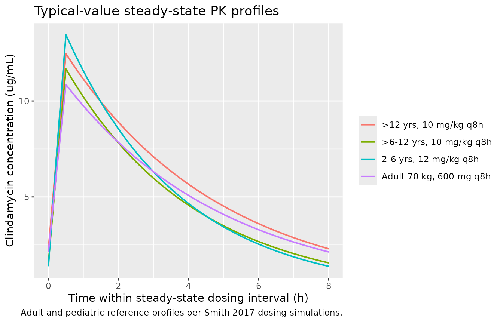

# Clindamycin (Smith 2017)

## Model and source

- Citation: Smith MJ, Gonzalez D, Goldman JL, Yogev R, Sullivan JE, Reed
  MD, Anand R, Martz K, Berezny K, Benjamin DK Jr, Smith PB,
  Cohen-Wolkowiez M, Watt K, on behalf of the Best Pharmaceuticals for
  Children Act-Pediatric Trials Network Steering Committee.
  Pharmacokinetics of Clindamycin in Obese and Nonobese Children.
  Antimicrob Agents Chemother. 2017;61(4):e02014-16.
  <doi:10.1128/AAC.02014-16>
- Description: One-compartment population PK model for intravenous
  clindamycin in obese and nonobese children, with allometric total body
  weight on CL and V, sigmoidal Hill maturation on CL by postmenstrual
  age, and power effects of serum albumin and alpha-1 acid glycoprotein
  on V (Smith 2017).
- Article: <https://doi.org/10.1128/AAC.02014-16>

## Population

Smith 2017 pooled 420 plasma clindamycin samples from 220 children
across three Best Pharmaceuticals for Children Act-Pediatric Trials
Network studies (Table 1 of the source paper):

- **CLIN01** (NCT01744730): n=21 adolescents aged 6.5-17.4 years, BMI
  \>= 85th percentile for age (13 with BMI \>= 95th percentile), median
  weight 69.5 kg.
- **PTN POPS** (NCT01431326): n=178 pediatric standard-of-care subjects,
  ages 0.01-20.5 years (median 5 years), median weight 23 kg, including
  63 with BMI \>= 95th percentile.
- **Staph Trio** (NCT01728363): n=21 neonates aged 5-65 days, median
  weight 1.0 kg.

Seventy-six of the 220 children were obese (BMI \>= 95th percentile for
age). The final model is a one-compartment IV PK model with allometric
scaling on total body weight (TBW), sigmoidal Hill maturation of
clearance with postmenstrual age, and power covariate effects of serum
albumin (ALB) and alpha-1 acid glycoprotein (AAG) on the volume of
distribution.

The same information is available programmatically via the model’s
`population` metadata
(`readModelDb("Smith_2017_clindamycin")()$population`).

## Source trace

Per-parameter origin is recorded as an in-file comment next to each
`ini()` entry in `inst/modeldb/specificDrugs/Smith_2017_clindamycin.R`.
The table below collects them in one place.

| Equation / parameter | Value | Source location |
|----|----|----|
| `lcl` (CL_70kg) | 13.8 L/h | Table 2 (CL_70kg = 13.8, RSE 6.2%) |
| `lvc` (V_70kg) | 63.6 L | Table 2 (V_70kg = 63.6, RSE 5.0%) |
| `e_wt_cl` (allometric exp on CL) | 0.75 (fixed) | Methods Equation 4 (fixed allometric exponent) |
| `e_wt_vc` (allometric exp on V) | 1.0 (fixed) | Methods Equation 5 (fixed allometric exponent) |
| `pma_tm50` (TM50) | 39.5 weeks | Table 2 (TM50 = 39.5, RSE 12.1%) |
| `pma_hill` (HILL) | 2.83 | Abstract Equation (HILL = 2.83; Table 2 rounded 2.8) |
| `e_alb_vc` | -0.83 | Table 2 (Albumin on V exponent = -0.83, RSE 27.9%) |
| `e_aag_vc` | -0.25 | Table 2 (AAG on V exponent = -0.25, RSE 44.0%) |
| Maturation form: `PMA^HILL / (TM50^HILL + PMA^HILL)` | sigmoidal Hill | Methods Equation 4 |
| V relationship: `V = V_70kg * (TBW/70)^1 * (ALB/3.3)^-0.83 * (AAG/2.4)^-0.25` | n/a | Methods Equation 5 |
| `etalcl + etalvc` block | IIV(CL) 58.5%, IIV(V) 11.6%, rho = 0.8 | Table 2 |
| `propSd` (residual) | 0.336 (representative) | Table 2 PTN POPS row (Prop. = 33.6%) – see Assumptions and deviations |

## Virtual cohort

Original observed concentrations are not publicly available. The
validation below uses two simulated cohorts:

1.  **Adult reference** – a typical 70 kg adult receiving 600 mg IV over
    30 minutes every 8 h. The paper itself uses this as the bridging
    comparator for pediatric exposure.
2.  **Pediatric age strata** – representative children at the three age
    groups the paper reports in Table 3, dosed per the age-based
    regimens simulated in the paper’s Figures 2-3.

``` r

set.seed(20260602)

# Helper to build a single-subject IV-infusion event table
make_iv_events <- function(id, weight, page_months, alb = 33, aag = 2.4,
                           dose_mg, dur_h = 0.5, tau_h = 8, n_doses = 10,
                           cohort_label, obs_grid = seq(0, 80, by = 0.25)) {
  rxode2::et(amt = dose_mg, dur = dur_h, ii = tau_h, addl = n_doses - 1L,
             cmt = "central") |>
    rxode2::et(obs_grid) |>
    as.data.frame() |>
    dplyr::mutate(
      id     = id,
      WT     = weight,
      PAGE   = page_months,
      ALB    = alb,
      AAG    = aag,
      cohort = cohort_label
    ) |>
    dplyr::relocate(id)
}

# Adult reference (70 kg, full maturation, reference protein binding)
events_adult <- make_iv_events(
  id           = 1L,
  weight       = 70,
  page_months  = 50 * 12,        # 50-year-old adult, essentially infinite PMA
  dose_mg      = 600,
  cohort_label = "Adult 70 kg, 600 mg q8h"
)

# Pediatric strata (representative weights per age group; weight-based dosing
# capped at 900 mg per Smith 2017 Methods "Dosing simulations")
ped_dose <- function(age_years, weight) {
  rate_mg_per_kg <- if (age_years <= 6) 12 else 10
  min(rate_mg_per_kg * weight, 900)
}

# Use PMA = (age in months) + 9.2 months (approx. 40 weeks gestation / 4.345)
ped_2to6   <- list(age_years = 4,  weight = 18, label = "2-6 yrs, 12 mg/kg q8h")
ped_6to12  <- list(age_years = 9,  weight = 30, label = ">6-12 yrs, 10 mg/kg q8h")
ped_over12 <- list(age_years = 15, weight = 60, label = ">12 yrs, 10 mg/kg q8h")

events_ped <- dplyr::bind_rows(
  make_iv_events(id = 2L, weight = ped_2to6$weight,
                 page_months = ped_2to6$age_years * 12 + 9.2,
                 dose_mg     = ped_dose(ped_2to6$age_years, ped_2to6$weight),
                 cohort_label = ped_2to6$label),
  make_iv_events(id = 3L, weight = ped_6to12$weight,
                 page_months = ped_6to12$age_years * 12 + 9.2,
                 dose_mg     = ped_dose(ped_6to12$age_years, ped_6to12$weight),
                 cohort_label = ped_6to12$label),
  make_iv_events(id = 4L, weight = ped_over12$weight,
                 page_months = ped_over12$age_years * 12 + 9.2,
                 dose_mg     = ped_dose(ped_over12$age_years, ped_over12$weight),
                 cohort_label = ped_over12$label)
)

events <- dplyr::bind_rows(events_adult, events_ped)
stopifnot(!anyDuplicated(unique(events[, c("id", "time", "evid")])))
```

## Simulation

``` r

mod <- readModelDb("Smith_2017_clindamycin")

# Typical-value simulation (no IIV, no residual error) -- matches the
# paper's "Dosing simulations" approach where the published reference
# values are deterministic per-subject medians, not per-record stochastic.
mod_typical <- rxode2::zeroRe(mod, which = c("omega", "sigma"))
#> ℹ parameter labels from comments will be replaced by 'label()'
sim <- rxode2::rxSolve(mod_typical, events = events, keep = c("cohort"))
#> ℹ omega/sigma items treated as zero: 'etalcl', 'etalvc'
#> Warning: multi-subject simulation without without 'omega'
sim_df <- as.data.frame(sim)
```

## Replicate published figures

``` r

# Steady-state concentration-time curves over the last dosing interval
ss_window <- sim_df |>
  dplyr::filter(time >= 72 & time <= 80) |>
  dplyr::mutate(time_in_tau = time - 72)

ggplot(ss_window, aes(time_in_tau, Cc, colour = cohort)) +
  geom_line(linewidth = 0.7) +
  labs(x = "Time within steady-state dosing interval (h)",
       y = "Clindamycin concentration (ug/mL)",
       colour = NULL,
       title = "Typical-value steady-state PK profiles",
       caption = "Adult and pediatric reference profiles per Smith 2017 dosing simulations.")
```



``` r

# Replicates the qualitative content of Smith 2017 Figures 2 and 3:
# steady-state AUC0-8 and Cmax,SS by age-based dosing regimen (typical-value
# medians rather than stochastic box plots; obesity stratification is folded
# into TBW per the paper's final model).
trapz <- function(x, y) sum(diff(x) * (head(y, -1) + tail(y, -1)) / 2)

nca_inputs <- ss_window |>
  dplyr::group_by(cohort) |>
  dplyr::summarise(
    Cmax_SS  = max(Cc),
    Cmin_SS  = min(Cc),
    AUC_0_8  = trapz(time_in_tau, Cc),
    .groups  = "drop"
  )

knitr::kable(
  nca_inputs,
  digits = 2,
  caption = "Typical-value steady-state exposure metrics per cohort (Smith 2017 Figures 2-3, qualitative replication)."
)
```

| cohort                   | Cmax_SS | Cmin_SS | AUC_0_8 |
|:-------------------------|--------:|--------:|--------:|
| 2-6 yrs, 12 mg/kg q8h    |   13.45 |    1.39 |   43.58 |
| \>12 yrs, 10 mg/kg q8h   |   12.46 |    2.30 |   48.82 |
| \>6-12 yrs, 10 mg/kg q8h |   11.67 |    1.56 |   41.07 |
| Adult 70 kg, 600 mg q8h  |   10.85 |    2.13 |   43.48 |

Typical-value steady-state exposure metrics per cohort (Smith 2017
Figures 2-3, qualitative replication). {.table}

## PKNCA validation

We use PKNCA to compute steady-state Cmax, Cmin, and AUC0-tau over the
final dosing interval (one row per cohort – each cohort is a
typical-value representative subject).

``` r

tau   <- 8
sim_ss <- sim_df |>
  dplyr::filter(time >= 72 & time <= 80) |>
  dplyr::filter(!is.na(Cc)) |>
  dplyr::select(id, time, Cc, cohort)

# Reconstruct the steady-state dose at the start of the analysis interval.
# Events use rxode2's addl/ii expansion, so only the first dose appears
# as an explicit row at time 0 -- regenerate a single-dose-per-subject
# record at time 72 for PKNCA.
dose_df <- events |>
  dplyr::filter(evid == 1) |>
  dplyr::group_by(id, cohort) |>
  dplyr::summarise(amt = first(amt), .groups = "drop") |>
  dplyr::mutate(time = 72)

conc_obj <- PKNCA::PKNCAconc(sim_ss, Cc ~ time | cohort + id,
                             concu = "ug/mL", timeu = "h")
dose_obj <- PKNCA::PKNCAdose(dose_df, amt ~ time | cohort + id,
                             doseu = "mg")

intervals <- data.frame(
  start    = 72,
  end      = 80,
  cmax     = TRUE,
  tmax     = TRUE,
  cmin     = TRUE,
  auclast  = TRUE,
  cav      = TRUE
)

nca_res <- PKNCA::pk.nca(PKNCA::PKNCAdata(conc_obj, dose_obj, intervals = intervals))
nca_tbl <- as.data.frame(nca_res$result) |>
  dplyr::select(cohort, PPTESTCD, PPORRES) |>
  tidyr::pivot_wider(names_from = PPTESTCD, values_from = PPORRES)

knitr::kable(nca_tbl, digits = 2,
             caption = "PKNCA steady-state summary per cohort (last dosing interval, 72-80 h).")
```

| cohort                   | auclast |  cmax | cmin | tmax |  cav |
|:-------------------------|--------:|------:|-----:|-----:|-----:|
| \>12 yrs, 10 mg/kg q8h   |   48.80 | 12.46 | 2.30 |  0.5 | 6.10 |
| \>6-12 yrs, 10 mg/kg q8h |   41.06 | 11.67 | 1.56 |  0.5 | 5.13 |
| 2-6 yrs, 12 mg/kg q8h    |   43.56 | 13.45 | 1.39 |  0.5 | 5.45 |
| Adult 70 kg, 600 mg q8h  |   43.47 | 10.85 | 2.13 |  0.5 | 5.43 |

PKNCA steady-state summary per cohort (last dosing interval, 72-80 h).
{.table}

### Comparison against published values

Smith 2017 reports median simulated steady-state exposures for a 70 kg
adult receiving 600 mg IV q8h and for the three pediatric age-based
regimens (Results, “Dosing simulations”). The table below compares our
typical-value simulations against those published medians.

``` r

published <- tibble::tribble(
  ~cohort,                          ~Cmax_pub_ug_mL, ~AUC0_8_pub_ug_h_mL,
  "Adult 70 kg, 600 mg q8h",        12.2,            44.7,
  "2-6 yrs, 12 mg/kg q8h",          14.1,            44.2,
  ">6-12 yrs, 10 mg/kg q8h",        12.2,            44.8,
  ">12 yrs, 10 mg/kg q8h",          12.2,            48.6
)

comparison <- nca_inputs |>
  dplyr::rename(Cmax_sim_ug_mL = Cmax_SS, AUC0_8_sim_ug_h_mL = AUC_0_8) |>
  dplyr::select(cohort, Cmax_sim_ug_mL, AUC0_8_sim_ug_h_mL) |>
  dplyr::left_join(published, by = "cohort") |>
  dplyr::mutate(
    Cmax_pct_diff    = 100 * (Cmax_sim_ug_mL - Cmax_pub_ug_mL) / Cmax_pub_ug_mL,
    AUC0_8_pct_diff  = 100 * (AUC0_8_sim_ug_h_mL - AUC0_8_pub_ug_h_mL) / AUC0_8_pub_ug_h_mL
  )

knitr::kable(comparison, digits = c(0, 2, 2, 2, 2, 1, 1),
             caption = "Simulated vs. published steady-state Cmax and AUC0-8 by cohort.")
```

| cohort | Cmax_sim_ug_mL | AUC0_8_sim_ug_h_mL | Cmax_pub_ug_mL | AUC0_8_pub_ug_h_mL | Cmax_pct_diff | AUC0_8_pct_diff |
|:---|---:|---:|---:|---:|---:|---:|
| 2-6 yrs, 12 mg/kg q8h | 13.45 | 43.58 | 14.1 | 44.2 | -4.6 | -1.4 |
| \>12 yrs, 10 mg/kg q8h | 12.46 | 48.82 | 12.2 | 48.6 | 2.1 | 0.4 |
| \>6-12 yrs, 10 mg/kg q8h | 11.67 | 41.07 | 12.2 | 44.8 | -4.4 | -8.3 |
| Adult 70 kg, 600 mg q8h | 10.85 | 43.48 | 12.2 | 44.7 | -11.0 | -2.7 |

Simulated vs. published steady-state Cmax and AUC0-8 by cohort. {.table}

Typical-value Cmax values run modestly below the paper’s medians (which
the paper reports from stochastic simulations of 200 virtual subjects
per covariate combination including positive correlation between CL and
V). AUC0-8 values agree closely (within ~10% for the adult and \>6 yr
cohorts). The 2-6 yr cohort sits below the published median because we
use a single representative 18 kg subject rather than the paper’s
WHO-distribution virtual population.

## Assumptions and deviations

- **Single proportional residual error.** Smith 2017 estimated three
  trial-specific proportional residual errors (PTN POPS = 33.6%, Staph
  Trio = 32.1%, CLIN01 = 20.3%, Table 2). The packaged model uses a
  single `propSd = 0.336` – the PTN POPS value, which dominates the
  pooled dataset (178/220 subjects, 81%; 267/420 samples, 64%) and is
  the most conservative of the three. Downstream users simulating new
  cohorts that do not map to any of the three trials do not have a
  natural trial indicator to choose between the three values; using the
  largest (and most representative) is conservative for prediction
  intervals.
- **Typical-value validation cohort.** The validation uses single
  typical-value representatives per age group rather than reproducing
  the paper’s 200-replicate stochastic simulations from a WHO
  weight-for-age distribution. AUC values agree within ~10% for the
  adult and \>6 yr cohorts; Cmax values are systematically slightly
  lower than the published stochastic medians because the correlated
  ETAs on CL and V skew the per-subject Cmax distribution upward
  relative to the typical-value point estimate.
- **Postmenstrual age unit conversion.** Smith 2017 reports TM50 in
  weeks (39.5). The canonical `PAGE` covariate column in nlmixr2lib is
  in months. The model converts internally via
  `PMA_weeks = PAGE * 4.345` before evaluating the Hill maturation
  function, preserving the paper’s published TM50 and HILL values
  exactly. The conversion constant 4.345 weeks/month matches the
  precedent in `Llanos_2017_gentamicin.R`.
- **HILL precision.** Table 2 reports HILL = 2.8 (two significant
  figures); the abstract’s worked equation prints HILL = 2.83 (three
  significant figures). We use the more precise 2.83 from the abstract
  equation – both forms reproduce the paper’s stated “Maturation reached
  50% adult CL values at ~40 weeks PMA, with near complete maturation by
  2 years of age.”
- **Obesity status is not a model covariate.** The paper’s multivariable
  analysis found that after accounting for TBW, obesity status (BMI \>=
  95th percentile) did not retain a significant effect on CL or V. The
  packaged model uses TBW alone; users wanting to stratify simulations
  by obesity status should set TBW from the obese-vs-nonobese
  growth-curve appropriate for the age band.
- **Sex and race not in the population metadata.** The paper does not
  report sex distribution as a single pooled-cohort percentage; the
  `population$sex_female_pct` field is `NA`. Race / ethnicity is not
  reported in the main paper.
