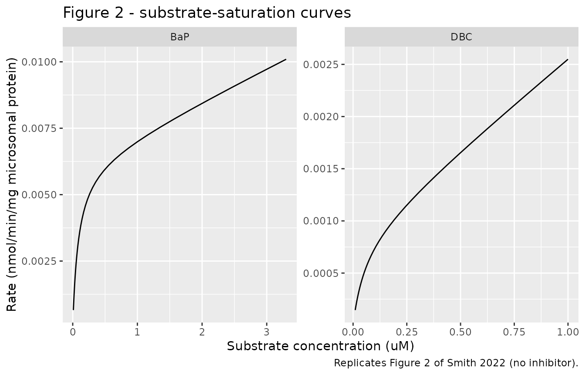
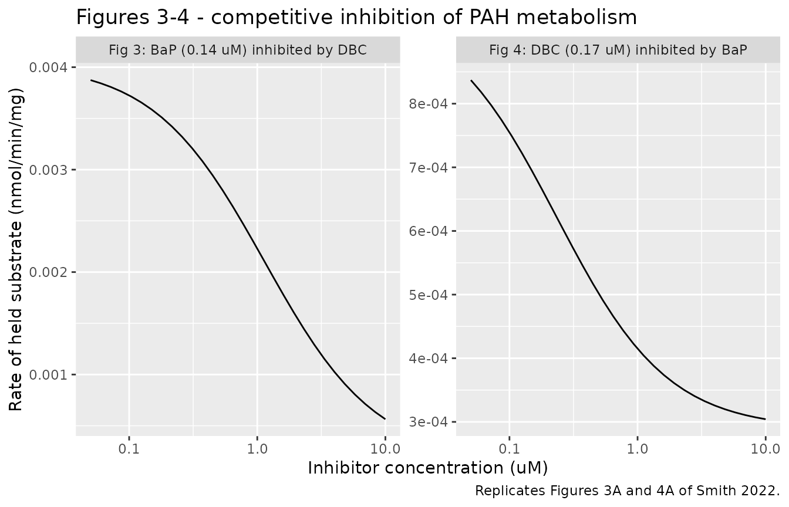
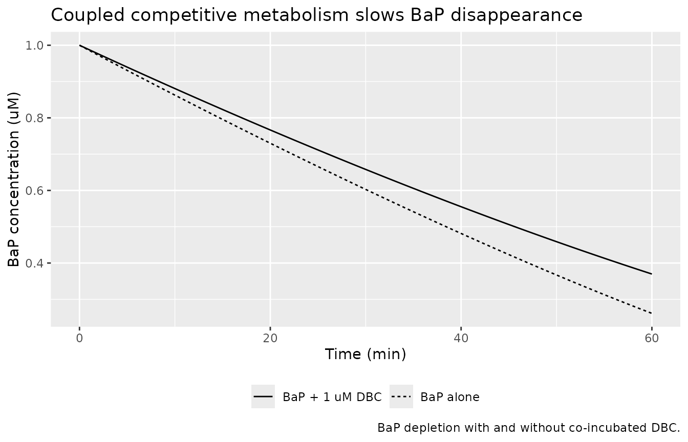

# Competitive in vitro metabolism of benzo\[a\]pyrene and dibenzo\[def,p\]chrysene (Smith 2022)

## Model and source

- Citation: Smith JN, Gaither KA, Pande P. Competitive Metabolism of
  Polycyclic Aromatic Hydrocarbons (PAHs): An Assessment Using In Vitro
  Metabolism and Physiologically Based Pharmacokinetic (PBPK) Modeling.
  Int J Environ Res Public Health. 2022;19(14):8266.
  <doi:10.3390/ijerph19148266>. PMCID: PMC9323266. In vitro
  Michaelis-Menten-clearance parameters: Table 3; competitive-inhibition
  constants (Ki): Table 4; metabolism-rate equations: Eq. 2 (baseline,
  no inhibitor) and Eq. 4 (competitive inhibition raising the apparent
  Km1 of the saturable arm).
- Article: <https://doi.org/10.3390/ijerph19148266>

Smith and colleagues measured how two polycyclic aromatic hydrocarbons
(PAHs) – benzo\[a\]pyrene (BaP) and dibenzo\[def,p\]chrysene (DBC) –
compete for the cytochrome-P450 enzymes that metabolise them in pooled
human liver microsomes. Each parent disappears with saturable kinetics
characteristic of two dominant enzymes: a high-affinity/low-capacity
enzyme (a Michaelis-Menten `Vmax1`/`Km1` arm) and a
high-capacity/low-affinity enzyme that did not saturate over the tested
concentration range (a linear intrinsic-clearance `Clint2` arm). This
“Michaelis-Menten clearance” form (Eq. 2) was the best-fit baseline
model for both substrates by the Bayesian information criterion (Table
2).

When the two PAHs are co-incubated, each raises the apparent `Km1` of
the other’s saturable arm – classical competitive inhibition (Eq. 4),
again the BIC-best of the competitive forms tested. The packaged model
is the two coupled substrate-disappearance ODEs with the
per-mg-microsomal-protein kinetic constants of Tables 3-4.

This vignette validates the **in vitro metabolism layer** of the paper.
The paper’s downstream whole-body PBPK interaction model inherits its
physiology (compartment volumes, blood flows, partition coefficients,
absorption rates) wholesale from the published DBC PBPK model (Pande
2022) and the BaP/DBC rodent PBPK models (Crowell 2011); those
physiological parameters are not reported in this paper, so the PBPK
layer is not reproduced here (see “Assumptions and deviations”).

## Experimental system

| Field | Value |
|:---|:---|
| species | in vitro (pooled human liver microsomes) |
| n_subjects | 200 |
| n_studies | 1 |
| age_range | 19-78 years (3 donors 10-18 years) |
| sex_female_pct | 50 |
| disease_state | not applicable (pooled human liver microsomes) |
| notes | Pooled human liver microsomes (Sekisui Xenotech) contributed by 200 donors with an equal male:female ratio, predominantly 19-78 years (3 donors 10-18 years). Incubations (Methods 2.2): 2.0 mg/mL microsomal protein, 0.1 M phosphate buffer pH 7.4, 3 mM MgCl2, excess (1.5 mM) NADPH, 37 C. BaP 0.05-2.5 uM incubated 0-30 min; DBC 0.025-1 uM incubated 0-60 min. Competitive-inhibition assays held one PAH at a fixed substrate concentration (BaP 0.14-0.18 uM; DBC 0.17 uM) and co-incubated the other PAH across 0.1-10 uM. All kinetic parameters are per mg microsomal protein. Supermix-10 (a 10-PAH environmental mixture) was measured as an additional inhibitor (Ki 0.75 uM on BaP, 0.63 uM on DBC; Table 4) but the authors built no dynamical Supermix-10 model, so it is not encoded here. |

Experimental system, from the model’s `population` metadata. {.table}

Pooled human liver microsomes (200 donors, equal male:female ratio) were
incubated at 2.0 mg/mL microsomal protein in pH 7.4 phosphate buffer
with excess NADPH at 37 C. Substrate disappearance was followed over
0-30 min (BaP) or 0-60 min (DBC), and initial rates were taken as the
first-order slope of the concentration-time data. The model carries no
between-donor random effects and no residual error: the publication
reports parameter uncertainty as bootstrap confidence intervals on the
point estimates, not as a hierarchical variance, so the packaged model
is deterministic.

## Source trace

Every `ini()` entry carries an in-file comment naming its source
location; the table below collects them for review.

| Quantity | Value | Source |
|:---|:---|:---|
| d/dt(bap), d/dt(dbc) | n/a | Eq. 4 (competitive); Eq. 2 at zero inhibitor |
| rate = Vmax1*S/(Km1*(1+I/Ki)+S)+Clint2\*S | n/a | Eq. 4 |
| Clint1 = Vmax1/Km1 | n/a | Methods 2.5 |
| BaP Vmax1 | 0.0063 nmol/min/mg | Table 3 (95% CI 0.0044-0.0083) |
| BaP Km1 | 0.088 uM | Table 3 (0.044-0.15) |
| BaP Clint2 | 0.0012 mL/min/mg | Table 3 (1.7e-7 to 0.0028) |
| DBC Vmax1 | 0.00090 nmol/min/mg | Table 3 (0.00044-0.0023) |
| DBC Km1 | 0.060 uM | Table 3 (0.014-0.22) |
| DBC Clint2 | 0.0017 mL/min/mg | Table 3 (6.5e-7 to 0.0028) |
| Ki, DBC inhibiting BaP | 0.44 uM | Table 4 (0.36-0.54) |
| Ki, BaP inhibiting DBC | 0.061 uM | Table 4 (0.041-0.12) |
| Microsomal protein | 2.0 mg/mL | Methods 2.2 |
| Clint1 (reported) | BaP 0.072, DBC 0.015 | Table 3 |

Source trace for every equation and parameter in the model file.
{.table}

### Units and dimensional analysis

The per-mg metabolism rate is in nmol/min/mg microsomal protein, the
concentrations in uM (= nmol/mL), and time in minutes. Multiplying the
per-mg rate by the microsomal protein concentration `cmic` (mg/mL) turns
it into a concentration rate:

| Symbol | Units | Note |
|:---|:---|:---|
| bap, dbc | uM = nmol/mL | ODE states: substrate concentration |
| vmax_bap, vmax_dbc | nmol/min/mg | Michaelis-Menten Vmax1 per mg protein |
| km_bap, km_dbc | uM | Michaelis-Menten Km1 |
| clint2_bap, clint2_dbc | mL/min/mg | linear intrinsic clearance of the non-saturable arm |
| ki_dbc_bap, ki_bap_dbc | uM | competitive inhibition constants |
| rate_bap, rate_dbc | nmol/min/mg | per-mg disappearance rate (Eq. 4) |
| cmic | mg/mL | microsomal protein concentration |
| d/dt(bap) | uM/min | cmic \* rate = (mg/mL)(nmol/min/mg) = nmol/mL/min |

Units of every symbol in the ODE system. {.table}

Checking one term: `clint2_bap * bap` has units (mL/min/mg)(nmol/mL) =
nmol/min/mg, which matches the Vmax arm, and the inhibition factor
`1 + dbc/ki` is a dimensionless ratio of two uM quantities, so
`rate_bap` is nmol/min/mg and `cmic * rate_bap` is uM/min throughout.

## Building a microsomal incubation

``` r

mod <- readModelDb("Smith_2022_pah_competitive_metabolism")

# One microsomal incubation as an rxode2 event table. The two substrates are
# "dosed" into their own ODE states at time 0 (a bolus into a concentration
# state sets that concentration, uM). Observation rows point at the ODE state
# `bap` (never at an algebraic observable such as rate_bap); rxSolve returns
# every state and derived column -- bap, dbc, rate_bap, rate_dbc -- at each
# observation time regardless of the row's compartment, so one obs row per time
# is enough and avoids duplicate output rows.
incubation <- function(times, id = 1L, bap0 = 0, dbc0 = 0) {
  tt <- sort(unique(c(0, times)))
  doses <- dplyr::bind_rows(
    if (bap0 > 0) tibble::tibble(id = id, time = 0, amt = bap0, evid = 1L, cmt = "bap"),
    if (dbc0 > 0) tibble::tibble(id = id, time = 0, amt = dbc0, evid = 1L, cmt = "dbc")
  )
  obs <- tibble::tibble(id = id, time = tt, amt = NA_real_, evid = 0L, cmt = "bap")
  dplyr::bind_rows(doses, obs) |>
    dplyr::arrange(id, time, dplyr::desc(evid))
}

# Initial per-mg disappearance rate at a given pair of starting concentrations,
# read from the model at time 0 (before measurable depletion). This is the
# quantity Figures 2-4 plot.
initial_rate <- function(bap0 = 0, dbc0 = 0) {
  s <- rxode2::rxSolve(mod, events = incubation(0, bap0 = bap0, dbc0 = dbc0),
                       returnType = "data.frame")
  s0 <- s[s$time == 0, ][1, ]
  c(rate_bap = s0$rate_bap, rate_dbc = s0$rate_dbc,
    clint1_bap = s0$clint1_bap, clint1_dbc = s0$clint1_dbc)
}
```

## Structural checks

Two properties follow from the equations rather than from any fitted
value, so they are exact and catch a sign error, a dropped term or a
mis-typed constant immediately. The model carries no random effects, so
every check below is deterministic.

``` r

r <- initial_rate(bap0 = 0.2, dbc0 = 0.2)

# 1. Clint1 = Vmax1/Km1, the first-order intrinsic clearance the paper reports
#    in Table 3 (BaP 0.072, DBC 0.015 mL/min/mg).
stopifnot(
  abs(r[["clint1_bap"]] - 0.0063 / 0.088) < 1e-9,
  abs(r[["clint1_dbc"]] - 0.00090 / 0.060) < 1e-9,
  abs(r[["clint1_bap"]] - 0.072) < 0.001,   # rounds to the Table 3 value
  abs(r[["clint1_dbc"]] - 0.015) < 1e-6     # exact to the Table 3 value
)

# 2. The model's initial-rate observable equals the Eq. 4 closed form. This pins
#    the observable/ODE wiring to the published equation.
eq4 <- function(S, I, vmax, km, clint2, ki) vmax * S / (km * (1 + I / ki) + S) + clint2 * S
stopifnot(
  abs(initial_rate(bap0 = 0.2, dbc0 = 0.5)[["rate_bap"]] -
        eq4(0.2, 0.5, 0.0063, 0.088, 0.0012, 0.44)) < 1e-9,
  abs(initial_rate(bap0 = 0.5, dbc0 = 0.17)[["rate_dbc"]] -
        eq4(0.17, 0.5, 0.00090, 0.060, 0.0017, 0.061)) < 1e-9
)

# 3. At low concentration and no inhibitor the saturable arm is first order, so
#    the total rate approaches (Clint1 + Clint2) * S (the approximation error is
#    O(S/Km1), so a very low S makes it exact to well under 0.1%).
low <- initial_rate(bap0 = 1e-6)[["rate_bap"]]
stopifnot(abs(low - (0.0063 / 0.088 + 0.0012) * 1e-6) / low < 1e-3)

tibble::tibble(
  Check = c("Clint1 BaP (mL/min/mg)", "Clint1 DBC (mL/min/mg)"),
  Model = round(c(r[["clint1_bap"]], r[["clint1_dbc"]]), 4),
  Published = c(0.072, 0.015)
) |>
  knitr::kable(caption = "Structural check: Clint1 = Vmax1/Km1 against Table 3.")
```

| Check                  |  Model | Published |
|:-----------------------|-------:|----------:|
| Clint1 BaP (mL/min/mg) | 0.0716 |     0.072 |
| Clint1 DBC (mL/min/mg) | 0.0150 |     0.015 |

Structural check: Clint1 = Vmax1/Km1 against Table 3. {.table}

## Figure 2: substrate-saturation curves (no inhibitor)

Figure 2 of the paper plots the initial rate of disappearance against
substrate concentration for each PAH incubated alone. The model
reproduces it by reading `rate_bap` (or `rate_dbc`) across a
concentration grid with the other PAH set to zero. The two-phase shape
the paper describes – a rapid first-order phase at low concentration
giving way to a slower phase as the high-affinity enzyme saturates – is
the sum of the saturating `Vmax1` arm and the linear `Clint2` arm.

``` r

bap_grid <- exp(seq(log(0.01), log(3.3), length.out = 40))
dbc_grid <- exp(seq(log(0.01), log(1.0), length.out = 40))

fig2 <- dplyr::bind_rows(
  tibble::tibble(PAH = "BaP", conc = bap_grid,
                 rate = vapply(bap_grid, function(s) initial_rate(bap0 = s)[["rate_bap"]], numeric(1))),
  tibble::tibble(PAH = "DBC", conc = dbc_grid,
                 rate = vapply(dbc_grid, function(s) initial_rate(dbc0 = s)[["rate_dbc"]], numeric(1)))
)

ggplot(fig2, aes(conc, rate)) +
  geom_line() +
  facet_wrap(~PAH, scales = "free") +
  labs(x = "Substrate concentration (uM)", y = "Rate (nmol/min/mg microsomal protein)",
       title = "Figure 2 - substrate-saturation curves",
       caption = "Replicates Figure 2 of Smith 2022 (no inhibitor).") +
  theme(legend.position = "none")
```



``` r

# BaP metabolism is 3-5x faster than DBC (Results 3.1). Compare the two at a
# shared 0.17 uM substrate concentration, where the paper quotes rates.
rate_bap_017 <- initial_rate(bap0 = 0.17)[["rate_bap"]]
rate_dbc_017 <- initial_rate(dbc0 = 0.17)[["rate_dbc"]]
fold <- rate_bap_017 / rate_dbc_017
stopifnot(fold > 3, fold < 5)   # paper: "DBC metabolism 3-5 times slower than BaP"

tibble::tibble(
  Quantity = c("BaP rate at 0.17 uM (nmol/min/mg)",
               "DBC rate at 0.17 uM (nmol/min/mg)",
               "BaP/DBC rate ratio"),
  Model = signif(c(rate_bap_017, rate_dbc_017, fold), 3),
  Published = c("-", "-", "3-5x (Results 3.1)")
) |>
  knitr::kable(caption = "BaP metabolism is 3-5 times faster than DBC.")
```

| Quantity                          |    Model | Published          |
|:----------------------------------|---------:|:-------------------|
| BaP rate at 0.17 uM (nmol/min/mg) | 0.004360 | \-                 |
| DBC rate at 0.17 uM (nmol/min/mg) | 0.000954 | \-                 |
| BaP/DBC rate ratio                | 4.560000 | 3-5x (Results 3.1) |

BaP metabolism is 3-5 times faster than DBC. {.table}

## Figures 3 and 4: competitive inhibition

Figure 3 holds BaP at a fixed low substrate concentration (0.14-0.18 uM)
and co-incubates increasing DBC; Figure 4 holds DBC at 0.17 uM and
co-incubates increasing BaP. In each case the initial rate of the held
substrate falls as the competitor raises its apparent `Km1`.

``` r

inh_grid <- exp(seq(log(0.05), log(10), length.out = 30))

fig34 <- dplyr::bind_rows(
  tibble::tibble(panel = "Fig 3: BaP (0.14 uM) inhibited by DBC",
                 inhibitor = inh_grid,
                 rate = vapply(inh_grid, function(i) initial_rate(bap0 = 0.14, dbc0 = i)[["rate_bap"]], numeric(1))),
  tibble::tibble(panel = "Fig 4: DBC (0.17 uM) inhibited by BaP",
                 inhibitor = inh_grid,
                 rate = vapply(inh_grid, function(i) initial_rate(bap0 = i, dbc0 = 0.17)[["rate_dbc"]], numeric(1)))
)

ggplot(fig34, aes(inhibitor, rate)) +
  geom_line() +
  facet_wrap(~panel, scales = "free") +
  scale_x_log10() +
  labs(x = "Inhibitor concentration (uM)", y = "Rate of held substrate (nmol/min/mg)",
       title = "Figures 3-4 - competitive inhibition of PAH metabolism",
       caption = "Replicates Figures 3A and 4A of Smith 2022.")
```



``` r

# The paper quotes specific observed inhibition percentages; the fitted Eq. 4
# model reproduces the direction and rough magnitude. These are observed values
# the model was fit to (not identities), so the bounds are set from the claims.
pct_inhib <- function(rate0, rate_inh) 100 * (1 - rate_inh / rate0)

# DBC (1 uM) inhibiting BaP metabolism at 0.14 uM BaP (Results: ">=48%").
bap_inh <- pct_inhib(initial_rate(bap0 = 0.14)[["rate_bap"]],
                     initial_rate(bap0 = 0.14, dbc0 = 1)[["rate_bap"]])
# BaP (1 uM) inhibiting DBC metabolism at 0.17 uM DBC (Results: "62%").
dbc_inh <- pct_inhib(initial_rate(dbc0 = 0.17)[["rate_dbc"]],
                     initial_rate(bap0 = 1, dbc0 = 0.17)[["rate_dbc"]])

# Monotonicity: more inhibitor always slows the held substrate.
fig3_rate <- fig34$rate[fig34$panel == "Fig 3: BaP (0.14 uM) inhibited by DBC"]
fig4_rate <- fig34$rate[fig34$panel == "Fig 4: DBC (0.17 uM) inhibited by BaP"]
stopifnot(
  all(diff(fig3_rate) < 0),
  all(diff(fig4_rate) < 0),
  bap_inh > 40,   # paper observed >=48% at 1 uM DBC
  dbc_inh > 50    # paper observed 62% at 1 uM BaP
)

tibble::tibble(
  Scenario = c("DBC 1 uM inhibiting BaP (0.14 uM)",
               "BaP 1 uM inhibiting DBC (0.17 uM)"),
  `Model % inhibition` = round(c(bap_inh, dbc_inh), 0),
  `Observed (paper)` = c(">=48%", "62%")
) |>
  knitr::kable(caption = "Competitive-inhibition percentages quoted in the paper versus the fitted model.")
```

| Scenario                          | Model % inhibition | Observed (paper) |
|:----------------------------------|-------------------:|:-----------------|
| DBC 1 uM inhibiting BaP (0.14 uM) |                 45 | \>=48%           |
| BaP 1 uM inhibiting DBC (0.17 uM) |                 57 | 62%              |

Competitive-inhibition percentages quoted in the paper versus the fitted
model. {.table}

BaP is the more potent inhibitor of the two: its `Ki` against DBC
metabolism (0.061 uM) is about sevenfold lower than DBC’s `Ki` against
BaP metabolism (0.44 uM).

``` r

ki_dbc_bap <- 0.44
ki_bap_dbc <- 0.061
stopifnot(ki_bap_dbc < ki_dbc_bap)             # BaP the more potent inhibitor
stopifnot(abs(ki_dbc_bap / ki_bap_dbc - 7.2) < 0.5)  # ~7-fold (paper: 0.061 vs 0.44)
```

## Substrate depletion over the incubation (coupled ODEs)

The figures above read the initial rate; this check integrates the
coupled ODEs over the full incubation window to confirm the dynamical
system behaves. BaP and DBC are co-incubated, and the presence of each
competitor slows the other’s disappearance relative to a
single-substrate incubation.

``` r

grid <- seq(0, 60, by = 0.5)
# BaP alone vs BaP with DBC co-incubated.
bap_alone <- rxode2::rxSolve(mod, events = incubation(grid, id = 1L, bap0 = 1.0),
                             returnType = "data.frame")
bap_both  <- rxode2::rxSolve(mod, events = incubation(grid, id = 2L, bap0 = 1.0, dbc0 = 1.0),
                             returnType = "data.frame")

dep <- dplyr::bind_rows(
  tibble::tibble(time = bap_alone$time, bap = bap_alone$bap, series = "BaP alone"),
  tibble::tibble(time = bap_both$time,  bap = bap_both$bap,  series = "BaP + 1 uM DBC")
)

ggplot(dep, aes(time, bap, linetype = series)) +
  geom_line() +
  labs(x = "Time (min)", y = "BaP concentration (uM)", linetype = NULL,
       title = "Coupled competitive metabolism slows BaP disappearance",
       caption = "BaP depletion with and without co-incubated DBC.") +
  theme(legend.position = "bottom")
```



``` r

final_alone <- bap_alone$bap[bap_alone$time == 60]
final_both  <- bap_both$bap[bap_both$time == 60]
stopifnot(
  all(diff(bap_alone$bap) <= 1e-9),   # monotone non-increasing (substrate only disappears)
  all(bap_alone$bap >= -1e-9),        # concentrations stay non-negative
  final_both > final_alone            # co-incubated DBC slows BaP metabolism
)

tibble::tibble(
  Quantity = c("BaP remaining at 60 min, alone (uM)",
               "BaP remaining at 60 min, + 1 uM DBC (uM)"),
  Value = round(c(final_alone, final_both), 4)
) |>
  knitr::kable(caption = "Competitive inhibition leaves more BaP at the end of the incubation.")
```

| Quantity                                 |  Value |
|:-----------------------------------------|-------:|
| BaP remaining at 60 min, alone (uM)      | 0.2613 |
| BaP remaining at 60 min, + 1 uM DBC (uM) | 0.3697 |

Competitive inhibition leaves more BaP at the end of the incubation.
{.table}

## Assumptions and deviations

- **Only the in vitro metabolism layer is packaged.** The paper’s
  headline result is a whole-body PBPK interaction model that embeds
  these competitive metabolism equations. That model’s physiology –
  compartment volumes, blood flows, tissue/blood partition coefficients,
  absorption rates, and the liver volume used for the 30
  mg-microsomal-protein-per-gram in vitro-to-in vivo scaling – is
  inherited wholesale from the published DBC human PBPK model
  (Pande 2022) and the BaP/DBC rodent PBPK models (Crowell 2011),
  neither of which reports those values in this paper. Reconstructing
  the PBPK layer requires those upstream sources and is left for a
  follow-up once they are obtained; substituting physiological constants
  from general knowledge would make the model unauditable.
- **Supermix-10 is not encoded.** The paper also measured inhibition
  constants for Supermix-10, a 10-PAH environmental mixture, on BaP (Ki
  0.75 uM) and DBC (Ki 0.63 uM) metabolism (Table 4). The authors built
  no dynamical model for Supermix-10 – they note that doing so properly
  would require ten additional PBPK models – so it is carried only as a
  measured comparison in the population notes, not as a model state or
  parameter.
- **Deterministic, no residual error.** Parameter uncertainty is
  reported as bootstrap 95% confidence intervals on the point estimates
  (Tables 3-4), not as a hierarchical between-donor variance or a
  residual-error model, so the packaged model carries no `eta` terms and
  no residual error.
- **The quoted inhibition percentages are observed, not identities.**
  The paper’s “\>=48%” (DBC on BaP) and “62%” (BaP on DBC) are measured
  inhibition at 1 uM competitor; the fitted Eq. 4 model reproduces the
  direction and rough magnitude (about 45% and 57% respectively) but is
  a fit to these data, not an exact reproduction of them.
- **Microsomal protein concentration is an incubation condition.**
  `cmic` is fixed at the 2.0 mg/mL used in the assays (Methods 2.2); the
  per-mg kinetic constants are independent of it, so a user studying a
  different microsomal density can override `cmic` without changing the
  fitted parameters. \`\`\`
