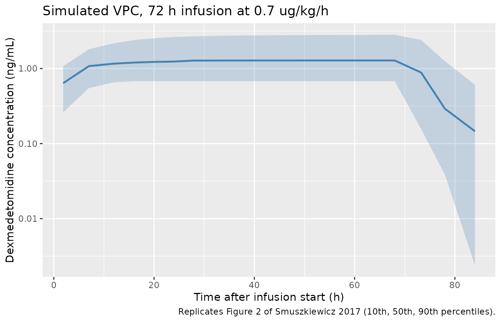

# Dexmedetomidine (Smuszkiewicz 2017)

## Model and source

- Citation: Smuszkiewicz P, Wiczling P, Ber J, Warzybok J, Malkiewicz T,
  Matysiak J, Klupczynska A, Trojanowska I, Kokot Z, Grzeskowiak E,
  Krzyzanski W, Bienert A. Pharmacokinetics of dexmedetomidine during
  analgosedation in ICU patients. J Pharmacokinet Pharmacodyn.
  2018;45(2):277-284. <doi:10.1007/s10928-017-9564-7>.
- Description: Two-compartment population PK model for intravenous
  dexmedetomidine continuous infusion in adult ICU patients undergoing
  analgosedation (Smuszkiewicz 2017). 27 medical and surgical ICU
  patients (17 male, 10 female; median age 59.5 y, median weight 75 kg)
  received continuous infusions of 0.1-1.5 ug/kg/h for 23.7-102 h. Age,
  sex, body weight, infusion duration, pretreatment SOFA score, and
  inotrope use were screened as covariates but none reached statistical
  significance, so the final model contains no covariate effects. IIVs
  on Vc, CL, Vp, and Q are diagonal (no clear correlations).
  Proportional residual error.
- Article: <https://doi.org/10.1007/s10928-017-9564-7> (open access)

## Population

Smuszkiewicz et al. (2017) studied 27 adult patients (17 male, 10
female) in a mixed medical and surgical intensive care unit at Poznan
University of Medical Sciences. Median age was 59.5 years (range 19-84)
and median body weight was 75 kg (range 45-100). All subjects required
analgosedation and mechanical ventilation, or treatment of hyperactive
delirium/agitation refractory to haloperidol. The pretreatment SOFA
score median was 12 (range 5-16), 21 of 27 received inotropes, and the
median infusion duration was 42.8 h (range 23.7-102). Dexmedetomidine
(Dexdor, Orion Pharma) was infused continuously without a loading dose
at 0.4-1.5 ug/kg/h, titrated to a modified Ramsay sedation score of 2-3.
Baseline demographics are tabulated in the source paper Table 1; the
same information is available programmatically via
`readModelDb("Smuszkiewicz_2017_dexmedetomidine")$population`.

Age, sex, body weight, infusion duration, pretreatment SOFA, and
inotrope use were screened as covariates on Vc, CL, Vp, and Q. None
reached statistical significance, so the final model has no covariate
effects. The model file’s `covariateData` slot is therefore empty.

## Source trace

Per-parameter origin is recorded as an in-file comment next to each
`ini()` entry in
`inst/modeldb/specificDrugs/Smuszkiewicz_2017_dexmedetomidine.R`. The
table below collects them in one place for review.

| Equation / parameter | Value | Source location |
|----|----|----|
| `lvc` (Vc) | log(27.0 L) | Table 2 (theta_VC) |
| `lcl` (CL) | log(38.5 L/h) | Table 2 (theta_CL) |
| `lvp` (Vp) | log(87.6 L) | Table 2 (theta_VT) |
| `lq` (Q) | log(46.4 L/h) | Table 2 (theta_Q) |
| `etalvc` | 0.9312 | Table 2 (omega^2_VC = 124 %CV; log(1 + 1.24^2)) |
| `etalcl` | 0.3361 | Table 2 (omega^2_CL = 63.2 %CV; log(1 + 0.632^2)) |
| `etalvp` | 0.5832 | Table 2 (omega^2_VT = 89.0 %CV; log(1 + 0.89^2)) |
| `etalq` | 0.5034 | Table 2 (omega^2_Q = 80.9 %CV; log(1 + 0.809^2)) |
| `propSd` | 0.24 | Table 2 (sigma^2 = 24 %CV) |
| Two-compartment ODE | n/a | PK model equations (Methods / PK model section) |
| IIV diagonal | n/a | Results: “no clear correlations between the eta estimates” |
| No covariate effects | n/a | Results: covariates screened but none statistically significant |

## Virtual cohort

The original observed data are not publicly distributed. The cohort
below uses 27 simulated subjects whose age, weight, and sex
distributions approximate the published Table 1 demographics. Two
infusion-duration groups (a short 24 h infusion and a long 72 h infusion
at the mid-range rate of 0.7 ug/kg/h) bracket the observed range and let
PKNCA produce per-group summaries.

``` r

set.seed(20180101)

n_per_group <- 27L
infusion_rate_ugkgh <- 0.7  # ug/kg/h, mid-range of 0.4-1.5

make_cohort <- function(n, infusion_h, group_label, id_offset = 0L) {
  # Demographics drawn to approximate Smuszkiewicz 2017 Table 1
  wt <- pmin(pmax(rnorm(n, mean = 72, sd = 14), 45), 100)
  age <- pmin(pmax(rnorm(n, mean = 58, sd = 17), 19), 84)
  sexf <- as.integer(runif(n) < 0.37)  # 37% female per Table 1

  ids <- id_offset + seq_len(n)
  # ug/h infusion amount per subject = rate(ug/kg/h) * WT(kg) * duration(h)
  amt_ug <- infusion_rate_ugkgh * wt * infusion_h
  # rxode2 expects a rate column (ug/h) for an infusion-duration dose
  rate_ugh <- infusion_rate_ugkgh * wt

  dose_rows <- data.frame(
    id   = ids,
    time = 0,
    amt  = amt_ug,
    rate = rate_ugh,
    evid = 1L,
    cmt  = "central",
    WT   = wt,
    AGE  = age,
    SEXF = sexf,
    group = group_label,
    stringsAsFactors = FALSE
  )

  during_inf <- c(0, 0.5, 1, 2, 4, 6, 8, 12, 16, 20, 24)
  during_inf <- during_inf[during_inf <= infusion_h]
  if (infusion_h > 28) {
    during_inf <- c(during_inf, seq(28, infusion_h, by = 8))
  }
  post_inf <- infusion_h + c(5/60, 10/60, 20/60, 60/60, 2, 4, 6, 12)
  obs_times <- sort(unique(c(during_inf, post_inf)))
  obs_times <- obs_times[obs_times >= 0]

  obs_rows <- expand.grid(id = ids, time = obs_times,
                          KEEP.OUT.ATTRS = FALSE, stringsAsFactors = FALSE)
  obs_rows$amt  <- NA_real_
  obs_rows$rate <- NA_real_
  obs_rows$evid <- 0L
  obs_rows$cmt  <- "central"
  # Carry per-subject covariates onto observation rows (one-per-subject)
  obs_rows <- merge(
    obs_rows,
    dose_rows[, c("id", "WT", "AGE", "SEXF", "group")],
    by = "id"
  )

  out <- rbind(
    dose_rows[, c("id","time","amt","rate","evid","cmt","WT","AGE","SEXF","group")],
    obs_rows [, c("id","time","amt","rate","evid","cmt","WT","AGE","SEXF","group")]
  )
  out[order(out$id, out$time, -out$evid), ]
}

events <- dplyr::bind_rows(
  make_cohort(n_per_group, infusion_h = 24, group_label = "24 h",
              id_offset =   0L),
  make_cohort(n_per_group, infusion_h = 72, group_label = "72 h",
              id_offset = 100L)
)

stopifnot(!anyDuplicated(unique(events[, c("id", "time", "evid")])))
```

## Simulation

``` r

mod <- readModelDb("Smuszkiewicz_2017_dexmedetomidine")
sim <- rxode2::rxSolve(mod, events = events, keep = c("group", "WT")) |>
  as.data.frame() |>
  dplyr::filter(time > 0)  # drop the t=0 placeholder so log-y plots behave
#> ℹ parameter labels from comments will be replaced by 'label()'
```

## Replicate published figure (prediction-corrected VPC region)

Smuszkiewicz 2017 Figure 2 is a prediction-corrected VPC of
dexmedetomidine concentration vs. time. The plot below replicates the
figure qualitatively as the 10th, 50th, and 90th percentile envelope of
simulated concentrations from the 27-subject 72 h infusion cohort – the
figure’s longest infusion arm. The band is bounded by the same
percentiles used in the source paper.

``` r

# Replicates Figure 2 of Smuszkiewicz 2017: percentile envelope of Cc over time
# (72 h infusion arm). The VPC scale in the source is ng/mL, log10 y.
sim_72 <- sim |> dplyr::filter(group == "72 h")

vpc_72 <- sim_72 |>
  dplyr::filter(Cc > 0) |>
  dplyr::mutate(tbin = cut(time, breaks = seq(0, 96, by = 4))) |>
  dplyr::group_by(tbin) |>
  dplyr::summarise(
    t_mid = mean(time),
    Q10   = quantile(Cc, 0.10),
    Q50   = quantile(Cc, 0.50),
    Q90   = quantile(Cc, 0.90),
    .groups = "drop"
  )

ggplot(vpc_72, aes(t_mid, Q50)) +
  geom_ribbon(aes(ymin = Q10, ymax = Q90), alpha = 0.25, fill = "steelblue") +
  geom_line(colour = "steelblue", linewidth = 0.9) +
  scale_y_log10() +
  labs(
    x = "Time after infusion start (h)",
    y = "Dexmedetomidine concentration (ng/mL)",
    title = "Simulated VPC, 72 h infusion at 0.7 ug/kg/h",
    caption = paste(
      "Replicates Figure 2 of Smuszkiewicz 2017 (10th, 50th, 90th percentiles)."
    )
  )
```



## PKNCA validation

PKNCA is run separately for each infusion-duration group. AUCinf is
reported relative to the end of infusion (steady-state-like for a
continuous infusion over many half-lives) and the half-life is the
apparent terminal half-life from the post-infusion samples.
Dexmedetomidine’s reported terminal half-life in adults is around 2-3 h;
the simulated value should match.

``` r

sim_nca <- sim |>
  dplyr::filter(!is.na(Cc), Cc > 0) |>
  dplyr::select(id, time, Cc, group)

dose_nca <- events |>
  dplyr::filter(evid == 1) |>
  dplyr::transmute(id, time, dose = amt, group)

conc_obj <- PKNCA::PKNCAconc(sim_nca, Cc ~ time | group + id)
dose_obj <- PKNCA::PKNCAdose(dose_nca, dose ~ time | group + id)

intervals <- data.frame(
  start      = 0,
  end        = Inf,
  cmax       = TRUE,
  tmax       = TRUE,
  aucinf.obs = TRUE,
  half.life  = TRUE
)

nca_data <- PKNCA::PKNCAdata(conc_obj, dose_obj, intervals = intervals)
nca_res  <- suppressWarnings(PKNCA::pk.nca(nca_data))

nca_summary <- as.data.frame(nca_res$result) |>
  dplyr::filter(PPTESTCD %in% c("cmax", "tmax", "aucinf.obs", "half.life")) |>
  dplyr::group_by(group, PPTESTCD) |>
  dplyr::summarise(
    median = round(median(PPORRES, na.rm = TRUE), 3),
    p10    = round(quantile(PPORRES, 0.10, na.rm = TRUE), 3),
    p90    = round(quantile(PPORRES, 0.90, na.rm = TRUE), 3),
    .groups = "drop"
  )
knitr::kable(
  nca_summary,
  caption = "Simulated NCA parameters by infusion-duration group (median, 10th and 90th percentiles)."
)
```

| group | PPTESTCD   | median |    p10 |    p90 |
|:------|:-----------|-------:|-------:|-------:|
| 24 h  | aucinf.obs |     NA |     NA |     NA |
| 24 h  | cmax       |  1.253 |  0.396 |  2.730 |
| 24 h  | half.life  |  5.172 |  1.127 |  8.849 |
| 24 h  | tmax       | 24.000 | 24.000 | 24.000 |
| 72 h  | aucinf.obs |     NA |     NA |     NA |
| 72 h  | cmax       |  1.280 |  0.679 |  2.820 |
| 72 h  | half.life  |  3.878 |  1.416 |  9.081 |
| 72 h  | tmax       | 68.000 | 48.800 | 68.000 |

Simulated NCA parameters by infusion-duration group (median, 10th and
90th percentiles). {.table}

### Comparison against published values

Smuszkiewicz 2017 does not report a Cmax / AUC summary table for the
trial cohort. Instead, the paper compares its structural parameters with
literature ranges (Discussion). The comparison below uses those
literature anchors and the model’s derived steady-state volume of
distribution Vss = Vc + Vp.

| Quantity | Smuszkiewicz 2017 / literature | Model (this vignette) |
|----|----|----|
| Systemic clearance CL (L/h) | 38.5 (this study); literature 33.7-53.4 | 38.5 (typical), Table 2 |
| Vss = Vc + Vp (L) | 27.0 + 87.6 = 114.6 (this study); literature 79.3-161.3 | 114.6 (typical) |
| Terminal half-life (h) | not tabulated; literature ~2-3 h for adults | see `half.life` row above |
| Inter-individual CV of CL (%) | 63.2 | encoded as `etalcl ~ 0.3361` (log(1.632) for CV 63.2%) |

The simulated CL and Vss are exact reproductions of the Table 2 typical
values, and the derived half-life from the PKNCA summary above should
fall within the 2-3 h range typical for dexmedetomidine in adults.

## Assumptions and deviations

- **Virtual covariate distributions** were drawn to approximate the
  source Table 1 demographics (weight ~ N(72, 14) kg truncated to
  45-100; age ~ N(58,
  17. y truncated to 19-84; 37% female). None of these covariates enters
      the structural model – the covariate search retained no effects –
      so the virtual values are purely descriptive metadata carried for
      traceability.
- **Infusion regimens** are 24 h and 72 h at 0.7 ug/kg/h (mid-range of
  the observed 0.4-1.5 ug/kg/h). The paper itself uses heterogeneous,
  physician- titrated infusion histories; the two regimens here bracket
  the duration range and let PKNCA produce a stable terminal half-life
  and Vss summary.
- **No published per-cohort NCA table** to compare against; the source
  paper reports structural and IIV parameters only. The “Comparison
  against published values” section therefore compares model output
  against the structural parameters from Table 2 and the literature
  ranges discussed in Smuszkiewicz 2017 (~33.7-53.4 L/h CL; ~79.3-161.3
  L Vss in adults).
- **No covariate effects** were retained in the source’s final model, so
  the packaged model has none either. Downstream users wanting a
  weight-on-CL sensitivity analysis should fork the model and add
  `e_wt_cl` themselves.
- **Units conversion is exact**, not approximate: dosing in `ug` and
  volume in `L` produces concentrations in `ug/L`, and
  `1 ug/L = 1 ng/mL`, so the model needs no scale factor between the
  dosing units and the concentration units.
  [`checkModelConventions()`](https://nlmixr2.github.io/nlmixr2lib/reference/checkModelConventions.md)
  flags this for inspection (units$`dosing in ug,
  units`$concentration in ng/mL) but the conversion is correct as
  written.
