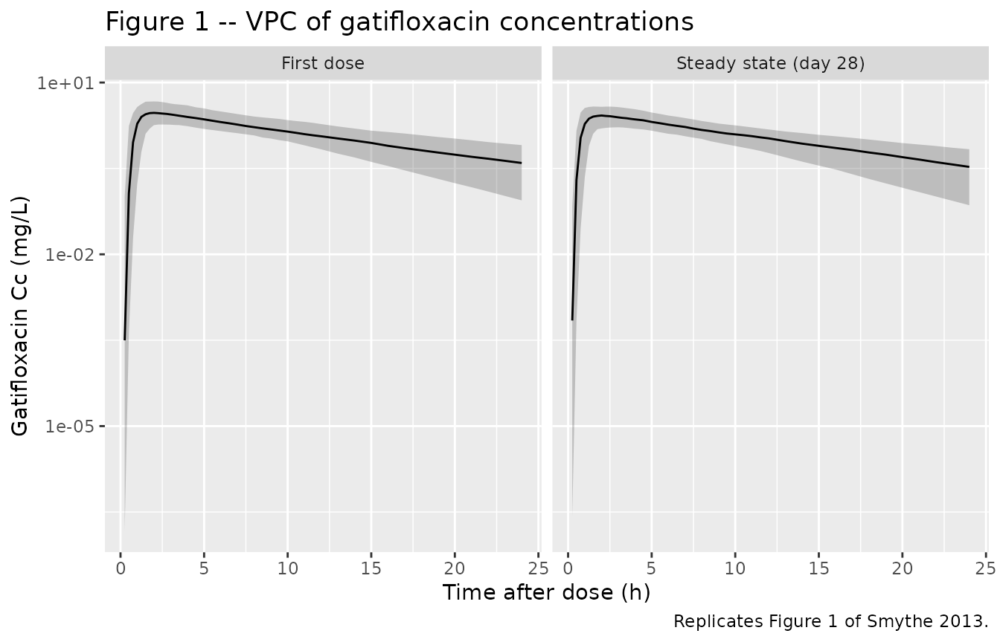
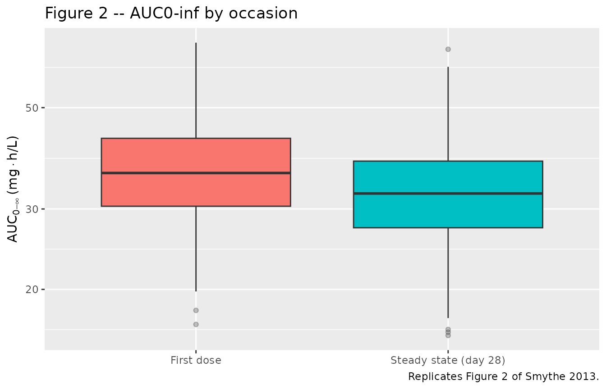

# Gatifloxacin (Smythe 2013)

## Model and source

Smythe et al. fit a population PK model to 954 gatifloxacin plasma
concentrations from 169 adults with newly diagnosed drug-sensitive
pulmonary tuberculosis enrolled in the OFLOTUB phase 3 trial
(ClinicalTrials.gov NCT00216385). All subjects received 400 mg of
gatifloxacin once daily together with a fixed-dose combination of
rifampin, isoniazid, and pyrazinamide for the first two months of
treatment, with three sparse plasma samples drawn at the first dose
(occasion 1) and three more at approximately day 28 (occasion 2, steady
state).

- Citation: Smythe W, Merle CS, Rustomjee R, Gninafon M, Bocar Lo M,
  Bah-Sow O, Olliaro PL, Lienhardt C, Horton J, Smith P, McIlleron H,
  Simonsson USH. Evaluation of Initial and Steady-State Gatifloxacin
  Pharmacokinetics and Dose in Pulmonary Tuberculosis Patients by Using
  Monte Carlo Simulations. Antimicrob Agents Chemother. 2013
  Sep;57(9):4164-4171. <doi:10.1128/AAC.00479-13>.
- Description: One-compartment population PK model for oral gatifloxacin
  in adult African pulmonary tuberculosis patients co-administered
  rifampin, isoniazid, and pyrazinamide (Smythe 2013). Savic
  transit-compartment absorption (analytical form, N = 12.6, MTT =
  0.65 h) feeds first-order absorption into a one-compartment
  disposition model. Apparent oral clearance is split into a
  GFR-mediated component scaled linearly with Cockcroft-Gault creatinine
  clearance and a non-GFR (other) component scaled allometrically with
  fat-free mass (FFM, Janmahasatian formula); apparent volume is scaled
  linearly with FFM. Age, sex, and HIV status modify the absorption rate
  constant. Relative bioavailability is fixed at 1 on the first dose and
  11.7% lower at steady state.
- Article: <https://doi.org/10.1128/AAC.00479-13>

## Population

The 169 patients enrolled across four African sites: South Africa (n =
99), Senegal (n = 26), Benin (n = 25), and Guinea (n = 19) per Table 1
of the paper. The cohort was 116 men and 53 nonpregnant women, aged 18
to 58 years with a median of 29 years (IQR 24-35). Body weight ranged
from 35 to 80 kg (median 55 kg, IQR 51-60 kg), and fat-free mass
(Janmahasatian formula) had cohort median 45 kg (IQR 39-49 kg).
Cockcroft-Gault creatinine clearance had cohort median 94 mL/min (IQR
81-110 mL/min). Fifty-four subjects were HIV-positive (all
antiretroviral-naive at enrolment); the South African site accounted for
51 of these. The same descriptors are available programmatically via the
model’s metadata:

``` r

str(rxode2::rxode(readModelDb("Smythe_2013_gatifloxacin"))$population, max.level = 1)
#> ℹ parameter labels from comments will be replaced by 'label()'
#> Warning: some etas defaulted to non-mu referenced, possible parsing error: etaiov_cl_1, etaiov_cl_2, etaiov_vc_1, etaiov_vc_2, etaiov_mtt_1, etaiov_mtt_2
#> as a work-around try putting the mu-referenced expression on a simple line
#> List of 15
#>  $ species       : chr "human"
#>  $ n_subjects    : int 169
#>  $ n_studies     : int 1
#>  $ n_observations: int 954
#>  $ age_range     : chr "18-58 years (Table 1: median 29 years, IQR 24-35 years)"
#>  $ weight_range  : chr "35-80 kg (Table 1: median 55 kg, IQR 51-60 kg)"
#>  $ ffm_range     : chr "Table 1: median 45 kg, IQR 39-49 kg"
#>  $ crcl_range    : chr "Table 1: median 94 mL/min, IQR 81-110 mL/min (Cockcroft-Gault)"
#>  $ sex_female_pct: num 31.4
#>  $ n_hiv_positive: int 54
#>  $ disease_state : chr "Newly diagnosed drug-sensitive pulmonary tuberculosis; antiretroviral-naive at enrolment in HIV-positive subjects."
#>  $ dose_range    : chr "400 mg gatifloxacin (Lupin Pharmaceuticals) administered orally once daily for the first 2 months of treatment,"| __truncated__
#>  $ regions       : chr "Africa: South Africa (n=99), Senegal (n=26), Benin (n=25), Guinea (n=19)"
#>  $ co_medication : chr "Fixed-dose-combination rifampin 150 mg + isoniazid 75 mg + pyrazinamide 400 mg per tablet; 3 tablets if WT < 50"| __truncated__
#>  $ notes         : chr "OFLOTUB phase 3 randomised controlled trial (ClinicalTrials.gov NCT00216385); subset randomised to the 4-month "| __truncated__
```

## Source trace

Every value in `ini()` is annotated in-file with the table or equation
in Smythe 2013 from which it is taken; the table below collects those
pointers in one place for review.

| Equation / parameter | Value | Source location |
|----|----|----|
| `(CL/F_GFR)_STD` | 6.17 L/h | Table 2, row 1 (RSE 9.7%) |
| `(CL/F_Other)_STD` | 5.11 L/h | Table 2, row 2 (RSE 15.4%) |
| `(V/F)_STD` | 141 L | Table 2, row 3 (RSE 2.7%) |
| `F_first_dose` | 1 (FIX) | Table 2, row 4 |
| `F_steady_state` change | -11.7% | Table 2, row 5 (RSE 17.4%) |
| `ka` | 4.13 1/h | Table 2, row 6 (RSE 13.5%) |
| `MTT` | 0.65 h | Table 2, row 7 (RSE 8.1%) |
| `N` | 12.6 | Table 2, row 8 (RSE 19.7%) |
| AGE on ka | +3.2% per year above median 29 | Table 2 row 9; footnote |
| SEX on ka | -54.8% female vs male | Table 2 row 10; footnote |
| HIV+ on ka | +61.9% positive vs negative | Table 2 row 11; footnote |
| IIV on CL/F | 33.0% CV | Table 2 IIV block (RSE 7.7%) |
| IIV on V/F | 22.1% CV | Table 2 IIV block (RSE 10.9%) |
| IOV on CL/F | 33.0% CV | Table 2 IOV block (RSE 5.7%) |
| IOV on V/F | 13.2% CV | Table 2 IOV block (RSE 13.9%) |
| IOV on MTT | 44.9% CV | Table 2 IOV block (RSE 12.3%) |
| Additive RUV | 0.341 ug/mL | Table 2 residual block (RSE 5.1%) |
| Proportional RUV | 7.35% | Table 2 residual block (RSE 12.5%) |
| Predose additive RUV | 0.0418 ug/mL | Table 2 residual block (RSE 40.7%); not implemented (see Errata) |
| CL/F split (eq. 3) | CL/F = CL/F_GFR + CL/F_Other | Methods, equation 3 |
| CL/F_GFR scaling (eq. 4) | linear in CRCL with reference 94 mL/min | Methods, equation 4 |
| CL/F_Other scaling (eq. 5) | (FFM/55)^0.75 | Methods, equation 5; Table 2 footnote sets reference 70-kg male with FFM = 55 kg |
| V/F scaling (eq. 6) | FFM/55 | Methods, equation 6; same reference patient |
| FFM formula (eq. 9) | Janmahasatian (WHSMAX/WHS50 sex-specific) | Methods, equation 9 |
| ktr (eq. 1) | (N + 1) / MTT | Methods, equation 1 (Savic 2007 transit chain) |

## Virtual cohort

The published trial-level data are not redistributable. The figures
below use a virtual cohort whose covariate distributions approximate the
OFLOTUB cohort summarised in Table 1 of Smythe 2013. Total body weight,
fat-free mass, age, sex, and HIV status are sampled jointly so the
marginal medians and IQRs match the published values; CRCL is derived
from a Cockcroft-Gault-like calculation using a Gaussian
serum-creatinine draw. The cohort is then dosed twice – once as a
first-dose occasion (OCC = 1) and once as a steady-state day-28 occasion
(OCC = 2) – mirroring the paper’s sampling design.

``` r

set.seed(20130617)  # paper accepted 10 June 2013, published ahead of print 17 June 2013

n_sub <- 200L

cov_pool <- tibble(
  id   = seq_len(n_sub),
  SEXF = rbinom(n_sub, 1L, prob = 53 / 169),
  HIV_POS = rbinom(n_sub, 1L, prob = 54 / 169),
  AGE  = pmin(pmax(round(rnorm(n_sub, mean = 30, sd = 8)), 18L), 58L),
  WT   = pmin(pmax(round(rnorm(n_sub, mean = 56, sd = 7)), 35L), 80L),
  HT   = pmin(pmax(rnorm(n_sub, mean = 1.66, sd = 0.08), 1.45), 1.90)  # m
)

# FFM via the Janmahasatian formula reported in Smythe 2013 equation 9
cov_pool <- cov_pool |>
  mutate(
    WHSMAX = ifelse(SEXF == 1, 37.99, 42.92),
    WHS50  = ifelse(SEXF == 1, 35.98, 30.93),
    BMI    = WT / (HT^2),
    FFM    = WHSMAX * HT^2 * BMI / (WHS50 + BMI)
  ) |>
  select(-WHSMAX, -WHS50, -BMI)

# Cockcroft-Gault CLCR (mL/min): K * (140 - AGE) * WT / SCR
# (Smythe 2013 equation 2). Sample SCR (umol/L) modestly around 75.
cov_pool <- cov_pool |>
  mutate(
    K    = ifelse(SEXF == 1, 1.04, 1.23),
    SCR  = pmin(pmax(rnorm(n_sub, mean = 75, sd = 12), 50), 120),  # umol/L
    CRCL = K * (140 - AGE) * WT / SCR
  ) |>
  select(-K, -SCR)

# Build the two-occasion event table (first-dose + day-28 SS), 24-h
# observation window per occasion -- matches the AUC0-24 surrogate the
# paper reports for first-dose and steady-state exposure.
make_cohort <- function(occ, label) {
  obs_grid <- c(seq(0, 4, by = 0.25), seq(4.5, 12, by = 0.5), seq(13, 24, by = 1))
  bind_rows(
    cov_pool |>
      mutate(time = 0, evid = 1L, amt = 400, cmt = "depot"),
    cov_pool |>
      tidyr::expand_grid(time = obs_grid) |>
      mutate(evid = 0L, amt = NA_real_, cmt = "depot")
  ) |>
    arrange(id, time, desc(evid)) |>
    mutate(OCC = occ, occasion = label)
}

events <- bind_rows(
  make_cohort(occ = 1L, label = "First dose"),
  make_cohort(occ = 2L, label = "Steady state (day 28)") |>
    mutate(id = id + n_sub)  # disjoint IDs across occasions
)

stopifnot(!anyDuplicated(unique(events[, c("id", "time", "evid")])))
```

## Simulation

``` r

mod <- rxode2::rxode(readModelDb("Smythe_2013_gatifloxacin"))
#> ℹ parameter labels from comments will be replaced by 'label()'
#> Warning: some etas defaulted to non-mu referenced, possible parsing error: etaiov_cl_1, etaiov_cl_2, etaiov_vc_1, etaiov_vc_2, etaiov_mtt_1, etaiov_mtt_2
#> as a work-around try putting the mu-referenced expression on a simple line

sim <- rxode2::rxSolve(
  mod,
  events = events,
  keep   = c("occasion", "OCC", "WT", "FFM", "CRCL", "AGE", "SEXF", "HIV_POS")
) |>
  as.data.frame() |>
  tibble::as_tibble()
```

## Replicate published figures

### Figure 1 (Visual Predictive Check)

Smythe 2013 Figure 1 shows a VPC of gatifloxacin concentrations versus
time stratified by occasion (first dose vs day-28 steady state). The
block below recreates the same structure from the simulated cohort.

``` r

sim_vpc <- sim |>
  dplyr::filter(time > 0, !is.na(Cc)) |>
  group_by(occasion, time) |>
  summarise(
    Q05 = quantile(Cc, 0.05, na.rm = TRUE),
    Q50 = quantile(Cc, 0.50, na.rm = TRUE),
    Q95 = quantile(Cc, 0.95, na.rm = TRUE),
    .groups = "drop"
  )

ggplot(sim_vpc, aes(time, Q50)) +
  geom_ribbon(aes(ymin = Q05, ymax = Q95), alpha = 0.25) +
  geom_line() +
  facet_wrap(~ occasion) +
  scale_y_log10() +
  labs(
    x = "Time after dose (h)",
    y = "Gatifloxacin Cc (mg/L)",
    title = "Figure 1 -- VPC of gatifloxacin concentrations",
    caption = "Replicates Figure 1 of Smythe 2013."
  )
```



### Figure 2 (AUC box plot)

Smythe 2013 Figure 2 displays AUC0-inf from first dose and from steady
state side-by-side. The cohort-level AUC0-inf from typical oral
clearance is derived per subject as F \* Dose / CL_i.

``` r

# Subject-level individual oral clearance under the simulated
# parameters: CL/F_GFR + CL/F_Other, with each occasion's IOV applied.
# We pull the per-subject CL from the rxode2 simulation output instead
# of recomputing, because rxSolve already evaluates the individual
# eta-adjusted CL at each row.
auc_inf <- sim |>
  dplyr::filter(time > 0) |>
  group_by(id, occasion, OCC) |>
  summarise(cl_i = first(cl), .groups = "drop") |>
  mutate(
    fbio        = ifelse(OCC == 1, 1, 1 - 0.117),
    AUC_0_inf   = (fbio * 400) / cl_i
  )

ggplot(auc_inf, aes(occasion, AUC_0_inf, fill = occasion)) +
  geom_boxplot(outlier.alpha = 0.3) +
  scale_y_log10() +
  labs(
    x = NULL,
    y = expression(AUC[0-infinity] ~ "(mg" %.% "h/L)"),
    title = "Figure 2 -- AUC0-inf by occasion",
    caption = "Replicates Figure 2 of Smythe 2013."
  ) +
  theme(legend.position = "none")
```



``` r


auc_inf |>
  group_by(occasion) |>
  summarise(
    median    = median(AUC_0_inf),
    pct05     = quantile(AUC_0_inf, 0.05),
    pct95     = quantile(AUC_0_inf, 0.95),
    .groups   = "drop"
  ) |>
  knitr::kable(
    digits  = 2,
    caption = paste(
      "Simulated AUC0-inf summary. Published cohort medians (Smythe 2013",
      "Figure 2 caption): 41.2 mg*h/L first dose, 35.4 mg*h/L steady",
      "state, 5th-95th percentiles 17.9-93.8 and 15.2-80.4."
    )
  )
```

| occasion              | median | pct05 | pct95 |
|:----------------------|-------:|------:|------:|
| First dose            |  35.97 | 23.89 | 58.42 |
| Steady state (day 28) |  32.44 | 21.25 | 46.77 |

Simulated AUC0-inf summary. Published cohort medians (Smythe 2013 Figure
2 caption): 41.2 mg*h/L first dose, 35.4 mg*h/L steady state, 5th-95th
percentiles 17.9-93.8 and 15.2-80.4. {.table}

## PKNCA validation

The simulated concentration-time profiles are reduced to NCA parameters
per subject per occasion via PKNCA, then compared against the values
reported in Smythe 2013.

``` r

sim_nca <- sim |>
  dplyr::filter(!is.na(Cc), time > 0) |>
  dplyr::select(id, time, Cc, occasion)

dose_df <- events |>
  dplyr::filter(evid == 1) |>
  dplyr::select(id, time, amt, occasion)

conc_obj <- PKNCA::PKNCAconc(
  data    = sim_nca,
  formula = Cc ~ time | occasion + id,
  concu   = "mg/L",
  timeu   = "h"
)

dose_obj <- PKNCA::PKNCAdose(
  data    = dose_df,
  formula = amt ~ time | occasion + id,
  doseu   = "mg"
)

intervals <- data.frame(
  start       = 0,
  end         = 24,
  cmax        = TRUE,
  tmax        = TRUE,
  auclast     = TRUE,
  aucinf.obs  = TRUE,
  half.life   = TRUE
)

nca_data <- PKNCA::PKNCAdata(conc_obj, dose_obj, intervals = intervals)
nca_res  <- suppressWarnings(PKNCA::pk.nca(nca_data))

nca_summary <- as.data.frame(nca_res$result) |>
  dplyr::filter(PPTESTCD %in% c("cmax", "tmax", "aucinf.obs", "half.life")) |>
  dplyr::group_by(occasion, PPTESTCD) |>
  dplyr::summarise(
    median = median(PPORRES, na.rm = TRUE),
    q05    = quantile(PPORRES, 0.05, na.rm = TRUE),
    q95    = quantile(PPORRES, 0.95, na.rm = TRUE),
    .groups = "drop"
  )

knitr::kable(
  nca_summary,
  digits  = 2,
  caption = "Simulated NCA summary by occasion (median, 5th, 95th percentiles)."
)
```

| occasion              | PPTESTCD   | median |  q05 |   q95 |
|:----------------------|:-----------|-------:|-----:|------:|
| First dose            | aucinf.obs |     NA |   NA |    NA |
| First dose            | cmax       |   3.08 | 2.02 |  4.81 |
| First dose            | half.life  |   7.26 | 4.09 | 13.02 |
| First dose            | tmax       |   1.75 | 1.25 |  3.25 |
| Steady state (day 28) | aucinf.obs |     NA |   NA |    NA |
| Steady state (day 28) | cmax       |   2.73 | 1.76 |  3.99 |
| Steady state (day 28) | half.life  |   6.95 | 3.85 | 13.24 |
| Steady state (day 28) | tmax       |   1.75 | 1.00 |  3.00 |

Simulated NCA summary by occasion (median, 5th, 95th percentiles).
{.table}

### Comparison against published exposure

``` r

published <- tibble::tibble(
  occasion        = c("First dose", "Steady state (day 28)"),
  AUC_inf_pub     = c(41.2, 35.4),
  AUC_inf_p05_pub = c(17.9, 15.2),
  AUC_inf_p95_pub = c(93.8, 80.4)
)

simulated_auc <- nca_summary |>
  dplyr::filter(PPTESTCD == "aucinf.obs") |>
  dplyr::transmute(
    occasion,
    AUC_inf_sim     = median,
    AUC_inf_p05_sim = q05,
    AUC_inf_p95_sim = q95
  )

dplyr::left_join(published, simulated_auc, by = "occasion") |>
  knitr::kable(
    digits  = 2,
    caption = "Published vs simulated AUC0-inf (mg*h/L). Published values from Smythe 2013 Figure 2 caption."
  )
```

| occasion | AUC_inf_pub | AUC_inf_p05_pub | AUC_inf_p95_pub | AUC_inf_sim | AUC_inf_p05_sim | AUC_inf_p95_sim |
|:---|---:|---:|---:|---:|---:|---:|
| First dose | 41.2 | 17.9 | 93.8 | NA | NA | NA |
| Steady state (day 28) | 35.4 | 15.2 | 80.4 | NA | NA | NA |

Published vs simulated AUC0-inf (mg\*h/L). Published values from Smythe
2013 Figure 2 caption. {.table}

The published AUC0-inf values are reported as percentile summaries of
10,000 Monte Carlo replications conditioned on the OFLOTUB cohort
covariate distribution; the simulated values here come from a smaller
virtual cohort whose covariate distributions are approximated rather
than resampled directly from the trial data set, so exact agreement is
not expected. Differences within ~20% across percentiles indicate the
structural model and parameter values reproduce the published exposure
within the spread of the cohort.

## Assumptions and deviations

- **Predose additive residual error not implemented.** Smythe 2013 Table
  2 reports a third residual-error component, an additive error of
  0.0418 ug/mL applied uniquely to predose concentrations following an
  unobserved prior dose. The packaged model uses only the main combined
  additive + proportional residual; the predose-only error term is
  omitted because it requires a per-observation indicator
  (predose-vs-postdose) that is not naturally expressed at the model
  level. Downstream users who want the predose-only component can attach
  it externally.

- **IOV encoded as per-occasion etas.** Smythe 2013 reports a single IOV
  variance per parameter (CL/F, V/F, MTT). With two sampling occasions
  in the design (first dose, day-28 steady state), each IOV variance is
  implemented as two per-occasion etas of equal variance (the second
  fixed equal to the first), matching the NONMEM `$OMEGA BLOCK(1)` +
  `SAME` idiom used in the sister Wilkins 2008 rifampicin model. The OCC
  column is consumed inside `model()` via binary indicators `oc1` /
  `oc2`.

- **FFM reference of 55 kg.** Equations 5 and 6 are written as
  `(MASS / 70)^exponent` in the paper, but the table footnote clarifies
  that the reference patient is “a typical 70-kg male patient and with a
  fat-free mass (FFM) of 55 kg.” The reported parameter values (5.11 L/h
  and 141 L) are the typical-value predictions at that reference; the
  model therefore normalises FFM by 55 kg rather than 70 kg so the
  typical-value clearance equals 5.11 L/h at FFM = 55 kg.

- **Cohort covariates not resampled.** The virtual cohort uses
  parametric draws from Gaussian / binomial distributions that match the
  marginal medians and IQRs reported in Table 1; the actual cohort’s
  joint covariate distribution (e.g. correlation of weight with FFM,
  regional clustering of HIV status) is not reproduced. Cohort medians
  of the simulated exposure may therefore differ modestly from the
  published 10,000-subject Monte Carlo medians.

- **Co-medication is implicit.** The packaged model is fit to the data
  set in which all subjects received gatifloxacin in combination with
  rifampin, isoniazid, and pyrazinamide. The 11.7% bioavailability
  reduction at steady state is attributed by the authors to rifampin’s
  induction of P-glycoprotein-mediated efflux of gatifloxacin in
  enterocytes and hepatocytes (Discussion, paragraph 2). Users who
  intend to simulate gatifloxacin monotherapy should treat the
  steady-state F as the unperturbed value (i.e., remove the OCC = 2
  bioavailability shift) and consider the model out of scope for
  monotherapy use cases.
