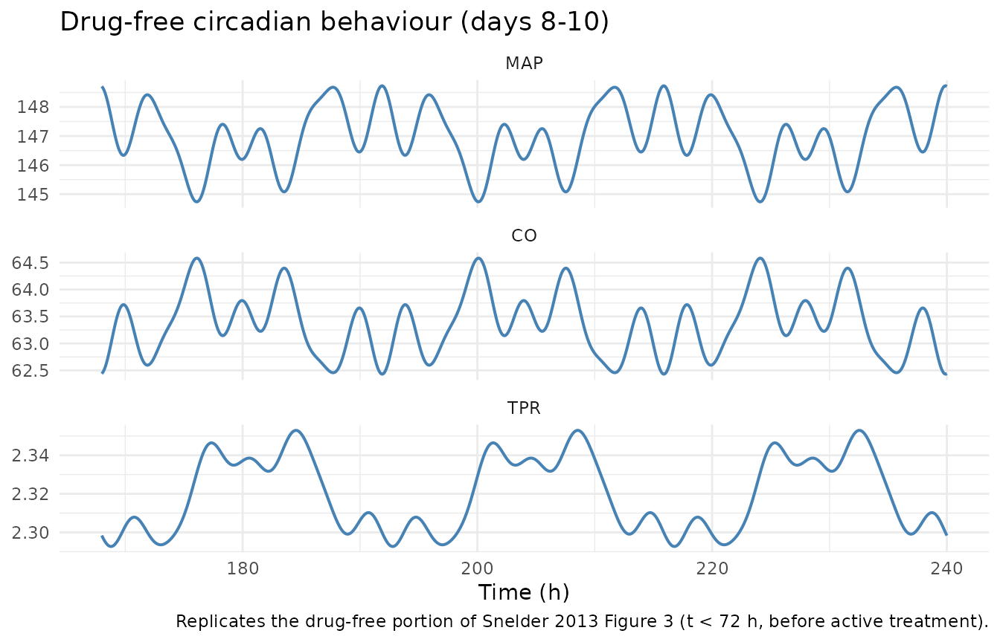
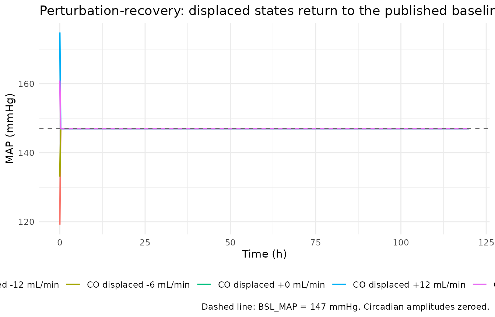
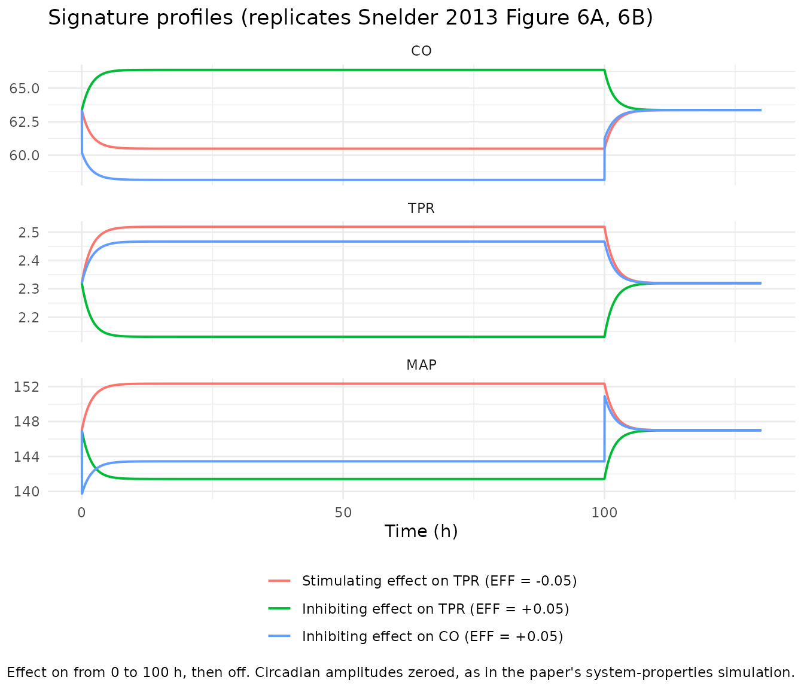
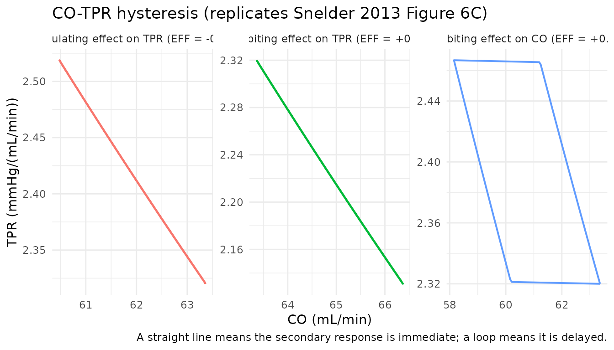
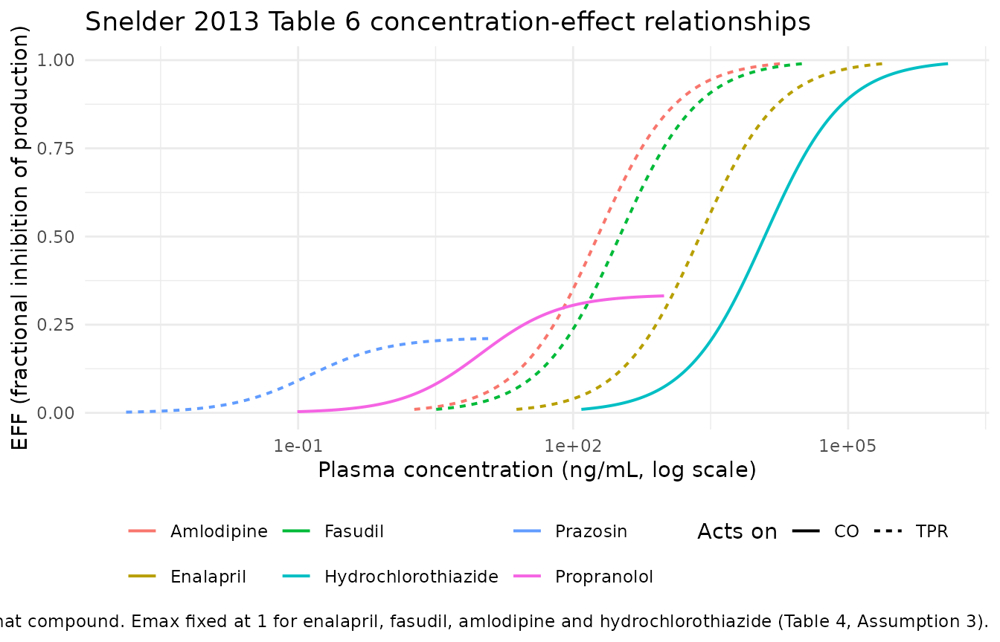

# Cardiovascular systems (CVS) model, rat (Snelder 2013)

## Model and source

- Citation: Snelder N, Ploeger BA, Luttringer O, Rigel DF, Webb RL,
  Feldman D, Fu F, Beil M, Jin L, Stanski DR, Danhof M. PKPD modelling
  of the interrelationship between mean arterial BP, cardiac output and
  total peripheral resistance in conscious rats. Br J Pharmacol. 2013
  Aug;169(7):1510-1524. <doi:10.1111/bph.12190>. PMCID:PMC3724108. A
  later re-use of the Snelder CVS framework (with the heart-rate /
  stroke-volume split of Snelder 2014 and its own parameter set) is
  packaged as modellib(‘Fu_2023_cardiovascular_qsp’).
- Article (open access): [Br J Pharmacol
  2013;169(7):1510-1524](https://doi.org/10.1111/bph.12190) (PMCID
  PMC3724108)

Snelder 2013 challenged the cardiovascular system of conscious male
spontaneously hypertensive rats (SHR) with six antihypertensive
compounds of deliberately diverse mechanism – enalapril, fasudil,
amlodipine and prazosin (primary effect on total peripheral resistance)
and propranolol and hydrochlorothiazide (primary effect on cardiac
output) – and analysed all of them **simultaneously** in one NONMEM run.
The point of that design was to separate *system*-specific parameters,
which must be shared by every compound, from *drug*-specific parameters.
The paper then verified the separation directly: dropping any one
compound from the fit left every system parameter unchanged except FB1,
which depends on the amlodipine data.

The structure is two coupled indirect-response (turnover) states:

- **CO**, cardiac output (mL/min)
- **TPR**, total peripheral resistance (mmHg/(mL/min))

whose production rates are each suppressed by a linear negative feedback
of mean arterial pressure, with `MAP = CO * TPR` plus a five-harmonic
cosine circadian rhythm. The production rate constants are not
estimated: they are *derived* from the baselines, the dissipation rate
constants and the feedback constants so that the system sits at the
reported baseline (Equation 3). A drug inhibits the production rate of
its primary state through an Emax function of plasma concentration
(Equations 4 and 6).

### Relationship to `Fu_2023_cardiovascular_qsp`

nlmixr2lib already ships `modellib("Fu_2023_cardiovascular_qsp")`, which
is a **later and structurally different** member of the same Snelder CVS
family: it splits CO into heart rate and stroke volume (the Snelder 2014
extension), uses one shared feedback constant rather than two, applies
the circadian rhythm multiplicatively to the production rates of HR and
TPR rather than additively to MAP, and carries its own parameter set
(BSL_MAP 155 mmHg, BSL_CO 69 mL/min, FB 0.0029 1/mmHg). The Fu 2023
vignette notes that “the Snelder 2013, 2014 papers that supply the rat
baseline values are not on disk”. This extraction closes that gap for
the 2013 paper: the values below are transcribed from the primary
source, not from a downstream re-use.

Do not mix the two parameter sets. They describe different model
structures fitted to different data.

## Population

``` r

pop <- nlmixr2lib::readModelDb("Snelder_2013_cardiovascular_rat")()$population
tibble::tibble(Field = names(pop),
               Value = vapply(pop, function(x) paste(as.character(x), collapse = "; "),
                              character(1))) |>
  knitr::kable(caption = "Study population (Snelder 2013 Methods and Table 2)")
```

| Field | Value |
|:---|:---|
| species | rat (male spontaneously hypertensive rat, SHR; Taconic Farms) |
| n_subjects | 12 |
| n_studies | 2 |
| study_names | Study 1 (multiple-dose telemetry; MAP only; enalapril, fasudil, amlodipine or propranolol once daily for 6 days, n = 5 SHR per drug drawn from 10 animals); Study 2 (single ascending doses on separate days; MAP and CO, with TPR derived; amlodipine, prazosin or hydrochlorothiazide, n = 2 SHR) |
| age_range | 21-45 weeks at time of study. |
| weight_range | 269 to 490 g. |
| sex_female_pct | 0 |
| sex_notes | All animals were male (Methods, ‘Animals’). |
| disease_state | Spontaneous (genetic) hypertension; the SHR strain is hypertensive at baseline (BSL_MAP = 147 mmHg) with no induced disease model. Snelder 2013 states explicitly (Discussion) that the identified system-parameter set is specific to the SHR strain and that applications using these values are limited to that strain. |
| dose_range | Study 1: enalapril 30 mg/kg p.o. QD x 6, fasudil 30 mg/kg p.o. QD x 6, amlodipine 10 mg/kg p.o. QD x 6, propranolol 1 mg/mL in drinking water. Study 2: amlodipine 0.3, 1, 3, 10 mg/kg p.o.; prazosin 0.04, 0.2, 1, 5 mg/kg p.o.; hydrochlorothiazide 0.1, 0.3, 1, 3 mg/kg p.o., one dose per day on separate days after a vehicle day. |
| regions | Preclinical; Novartis Institutes for BioMedical Research, East Hanover, NJ, USA (in-life) with modelling at Leiden Academic Centre for Drug Research / LAP&P Consultants BV, The Netherlands. |
| instrumentation | Study 1: femoral-artery catheter / radiotransmitter (DSI PA-C40), BP recorded 15 s every 10 min. Study 2: ascending-aortic transit-time flow probe (Transonic 2.5PS or 3PS) plus femoral catheter / radiotransmitter; MAP, heart rate, stroke volume, CO and TPR derived for all beats and averaged over consecutive 2 min intervals. Study 2 animals were reused for up to 6 months with washout between experiments. |
| n_ode_states | 2 |
| notes | The total number of animals was 12 (10 in Study 1, 2 in Study 2); the per-drug n = 5 of Table 2 therefore reflects reuse of the Study 1 animals across compounds. TPR was never measured directly: in the experiments it was derived from measured MAP and CO, and in the modelling BSL_MAP and BSL_TPR were the estimated parameters with BSL_CO derived from them ‘for reasons of model stability’ (Data analysis). CO was measured only in Study 2, and among the two CO-acting compounds only hydrochlorothiazide had CO measured – which is why kout_TPR and FB2 remain strongly correlated (-0.984) in the final fit. |

Study population (Snelder 2013 Methods and Table 2) {.table}

Twelve male SHR in total (10 in Study 1, 2 in Study 2), 21-45 weeks old
and 269-490 g. Study 1 recorded MAP only, by radiotelemetry, during 6
days of once-daily oral dosing preceded by baseline and vehicle days and
followed by 6 washout days. Study 2 added an ascending-aortic
transit-time flow probe so that CO could be measured, and gave four
ascending single doses on separate days. TPR was never measured:
experimentally it was computed from MAP and CO, and in the model BSL_MAP
and BSL_TPR were the estimated parameters with BSL_CO derived as their
quotient “for reasons of model stability”.

## Source trace

Every value in
`inst/modeldb/therapeuticArea/Snelder_2013_cardiovascular_rat.R` comes
from the locations below; the same references appear as `#` comments on
each `ini()` line.

### System-specific parameters (Snelder 2013 Table 5)

| Model parameter | Paper symbol | Value | Fixed? | SE | CV% | 95% CI | Source |
|----|----|---:|:--:|---:|---:|----|----|
| `lrbase_MAP` | BSL_MAP | 147 mmHg |  | 1.38 | 0.939 | 144 - 150 | Table 5 |
| `lrbase_TPR` | BSL_TPR | 2.32 mmHg/(mL/min) |  | 0.132 | 5.69 | 2.06 - 2.58 | Table 5 |
| `lkout_CO` | kout_CO | 99 1/h | FIX |  |  |  | Table 5; Results (“could not be estimated accurately … fixed to a high value”) |
| `lkout_TPR` | kout_TPR | 0.260 1/h |  | 0.129 | 49.6 | 0.00716 - 0.513 | Table 5 |
| `lfb_CO` | FB1 | 0.00378 1/mmHg |  | 0.000148 | 3.92 | 0.00349 - 0.00407 | Table 5 |
| `lfb_TPR` | FB2 | 0.00492 1/mmHg |  | 0.00101 | 20.5 | 0.00294 - 0.00690 | Table 5 |

BSL_CO is **derived**, not estimated: `BSL_CO = BSL_MAP / BSL_TPR` = 147
/ 2.32 = 63.36 mL/min.

### Circadian rhythm (Equation 2; Results, “Model development”)

| Model parameter | Harmonic | Period |                             Value | Fixed? |
|-----------------|---------:|-------:|----------------------------------:|:------:|
| `amp_MAP1`      |        1 |   24 h |                         3.17 mmHg |        |
| `amp_MAP2`      |        2 |   12 h |                                 0 |  FIX   |
| `amp_MAP3`      |        3 |    8 h |                        -2.03 mmHg |        |
| `amp_MAP4`      |        4 |    6 h |                         1.15 mmHg |        |
| `amp_MAP5`      |        5 |  4.8 h |                         1.63 mmHg |        |
| `amp_MAP6`      |        6 |    4 h |                                 0 |  FIX   |
| `amp_MAP7`      |        7 | 24/7 h |                         1.28 mmHg |        |
| `amp_MAP8`      |        8 |    3 h |                                 0 |  FIX   |
| `amp_MAP9`      |        9 | 24/9 h |                                 0 |  FIX   |
| `amp_MAP10`     |       10 |  2.4 h |                                 0 |  FIX   |
| `hor_MAP`       |        – |      – | **not reported**, anchored at 0 h |  FIX   |

### Drug-specific parameters (Snelder 2013 Table 6, with the site of action from Table 1)

| Compound            | Acts on | `emax_*` | Fixed? | `lic50_*` (ng/mL) | CV% of IC50 |
|---------------------|---------|---------:|:------:|------------------:|------------:|
| Enalapril           | TPR     |        1 |  FIX   |              2410 |        15.5 |
| Fasudil             | TPR     |        1 |  FIX   |               321 |        18.8 |
| Amlodipine          | TPR     |        1 |  FIX   |               185 |        14.2 |
| Prazosin            | TPR     |    0.213 |        |             0.133 |       109.8 |
| Propranolol         | CO      |    0.335 |        |              9.82 |        38.7 |
| Hydrochlorothiazide | CO      |        1 |  FIX   |             12300 |        6.34 |

Emax was fixed at 1 for the four compounds whose maximum effect was
never reached (Table 4, Assumption 3), so that IC50 stayed identifiable.
Table 5’s last column shows the whole system-parameter set re-estimated
with amlodipine’s Emax fixed at 0.8 instead of 1: nothing moves
materially.

### Equations

| Model code | Source |
|----|----|
| `bsl_CO <- bsl_MAP / bsl_TPR` | Data analysis (“BSL_CO was derived from these parameters”) |
| `kin_CO <- -kout_CO * bsl_CO / (-1 + fb1 * bsl_CO * bsl_TPR)` | Equation 3 (verbatim) |
| `kin_TPR <- kout_TPR * (kin_CO*fb1*bsl_TPR + kout_CO) * bsl_TPR / (kin_CO*fb1*bsl_TPR + kout_CO - fb2*kin_CO*bsl_TPR)` | Equation 3 (verbatim) |
| `circ_MAP <- sum_n amp_MAP<n> * cos(n * 2*pi * (t + hor_MAP) / 24)` | Equation 2 |
| `map <- co * tpr + circ_MAP` | Equations 1 and 2 |
| `eff_TPR`, `eff_CO` (Emax in concentration) | Equation 6, routed by Table 1 “Primary effect” |
| `d/dt(co) <- kin_CO * (1 - fb1*map - eff_CO) - kout_CO * co` | Equation 4 |
| `d/dt(tpr) <- kin_TPR * (1 - fb2*map - eff_TPR) - kout_TPR * tpr` | Equation 4 |
| `co(0) <- bsl_CO`, `tpr(0) <- bsl_TPR` | Data analysis (baseline is a steady state) |

### Dimensional analysis

Mechanistic models fail silently on units, so every term is checked
explicitly.

| Symbol | Units |
|----|----|
| `co` | mL/min |
| `tpr` | mmHg/(mL/min) |
| `map` = `co * tpr` | (mL/min) x mmHg/(mL/min) = **mmHg** |
| `circ_MAP` | mmHg (amplitudes are in mmHg; the cosine is unitless) |
| `fb1`, `fb2` | 1/mmHg, so `fb * map` is **unitless** |
| `eff_CO`, `eff_TPR` | unitless (`emax` unitless; concentration / IC50 both ng/mL) |
| `kin_CO` | (mL/min)/h |
| `kin_TPR` | (mmHg/(mL/min))/h |
| `kout_CO`, `kout_TPR` | 1/h |
| `d/dt(co)` = `kin_CO * (unitless) - kout_CO * co` | (mL/min)/h - (1/h)(mL/min) = **(mL/min)/h** OK |
| `d/dt(tpr)` = `kin_TPR * (unitless) - kout_TPR * tpr` | matches `[tpr]/h` OK |

The one thing to watch is that `t` is in **hours** (matching `kout` in
1/h and the 24 h circadian period), while CO is in mL/**min** and TPR in
mmHg/(mL/**min**). That mixed time base is the paper’s own convention:
CO and TPR are instantaneous hemodynamic rates whose *dynamics* evolve
on an hourly scale, so the minute in their units never enters the ODE
time derivative.

## Load the model

``` r

mod <- nlmixr2lib::readModelDb("Snelder_2013_cardiovascular_rat")()

# Published values, restated here so every check below compares against the
# paper rather than against the model file it is testing.
BSL_MAP <- 147
BSL_TPR <- 2.32
BSL_CO  <- BSL_MAP / BSL_TPR
KOUT_CO <- 99
KOUT_TPR <- 0.260
FB1 <- 0.00378
FB2 <- 0.00492

AMPS <- c(amp_MAP1 = 3.17, amp_MAP2 = 0, amp_MAP3 = -2.03, amp_MAP4 = 1.15,
          amp_MAP5 = 1.63, amp_MAP6 = 0, amp_MAP7 = 1.28, amp_MAP8 = 0,
          amp_MAP9 = 0, amp_MAP10 = 0)
AMPS_OFF <- setNames(rep(0, length(AMPS)), names(AMPS))

CP_COLS <- c("CP_ENALAPRIL_NGML", "CP_FASUDIL_NGML", "CP_AMLODIPINE_NGML",
             "CP_PRAZOSIN_NGML", "CP_PROPRANOLOL_NGML", "CP_HCTZ_NGML")
```

`cvs_events()` builds the event table. This model has **no dosing
compartment**: exposure enters only through the six `CP_<drug>_NGML`
time-varying covariate columns, so every solve supplies all six (zero
unless that compound is the one being studied). Observation records use
`cmt = "MAP"`; the model declares three endpoints (`MAP`, `CO`, `TPR`),
so rxode2 requires an observation `cmt` naming one of them and returns
all three plus the ODE states as output columns.

``` r

cvs_events <- function(times, conc = NULL, drug = NULL, off_after = Inf) {
  ev <- data.frame(id = 1L, time = times, amt = 0, evid = 0L, cmt = "MAP")
  for (nm in CP_COLS) ev[[nm]] <- 0
  if (!is.null(drug)) ev[[drug]] <- ifelse(ev$time < off_after, conc, 0)
  ev
}

# Concentration that makes the Emax function of Equation 6 return exactly `eff`.
conc_for_eff <- function(eff, emax, ic50) {
  r <- eff / emax
  ic50 * r / (1 - r)
}

solve_cvs <- function(events, params = NULL) {
  rxode2::rxSolve(mod, events = events, params = params,
                  covsInterpolation = "locf", returnType = "data.frame")
}
```

## 1. Baseline steady-state hold

With no drug and the circadian amplitudes set to zero, the system must
sit at the published baseline forever. This is the single check that
catches a mistyped Table 5 value, a sign error in the feedback, or a
mis-transcribed Equation 3.

``` r

ev_ss  <- cvs_events(seq(0, 240, by = 0.5))
sim_ss <- solve_cvs(ev_ss, params = AMPS_OFF)

ss_tab <- tibble::tibble(
  Readout   = c("MAP (mmHg)", "CO (mL/min)", "TPR (mmHg/(mL/min))"),
  Minimum   = c(min(sim_ss$MAP), min(sim_ss$CO), min(sim_ss$TPR)),
  Maximum   = c(max(sim_ss$MAP), max(sim_ss$CO), max(sim_ss$TPR)),
  Published = c(BSL_MAP, BSL_CO, BSL_TPR)
) |>
  dplyr::mutate(`Max abs. deviation` = pmax(abs(Maximum - Published),
                                            abs(Minimum - Published)))
knitr::kable(ss_tab, digits = 10,
             caption = "Steady-state hold over 240 h (circadian amplitudes zeroed)")
```

| Readout             |   Minimum |   Maximum | Published | Max abs. deviation |
|:--------------------|----------:|----------:|----------:|-------------------:|
| MAP (mmHg)          | 147.00000 | 147.00000 | 147.00000 |                  0 |
| CO (mL/min)         |  63.36207 |  63.36207 |  63.36207 |                  0 |
| TPR (mmHg/(mL/min)) |   2.32000 |   2.32000 |   2.32000 |                  0 |

Steady-state hold over 240 h (circadian amplitudes zeroed) {.table}

``` r


stopifnot(
  max(abs(sim_ss$MAP - BSL_MAP)) < 1e-6,
  max(abs(sim_ss$CO  - BSL_CO )) < 1e-6,
  max(abs(sim_ss$TPR - BSL_TPR)) < 1e-6
)
```

The system holds to better than 1e-6 in every readout across 240 h.
These are deterministic typical-value solves with no random effects, so
the residual is pure integrator error and a tight bound is the right
assertion.

## 2. Equation 3 is the steady-state solution

Snelder 2013 writes the production rate constants in an expanded
algebraic form (Equation 3). The model file transcribes that form
verbatim. It should reduce to the familiar turnover identity
`Kin_X = kout_X * BSL_X / (1 - FB_X * BSL_MAP)`; if it does not, the
transcription is wrong.

``` r

kin_CO_paper <- -KOUT_CO * BSL_CO / (-1 + FB1 * BSL_CO * BSL_TPR)
kin_TPR_paper <- KOUT_TPR * (kin_CO_paper * FB1 * BSL_TPR + KOUT_CO) * BSL_TPR /
  (kin_CO_paper * FB1 * BSL_TPR + KOUT_CO - FB2 * kin_CO_paper * BSL_TPR)

kin_CO_simple  <- KOUT_CO  * BSL_CO  / (1 - FB1 * BSL_MAP)
kin_TPR_simple <- KOUT_TPR * BSL_TPR / (1 - FB2 * BSL_MAP)

tibble::tibble(
  Quantity            = c("Kin_CO ((mL/min)/h)", "Kin_TPR ((mmHg/(mL/min))/h)"),
  `Equation 3 form`   = c(kin_CO_paper, kin_TPR_paper),
  `Turnover identity` = c(kin_CO_simple, kin_TPR_simple),
  `Relative difference` = c(abs(kin_CO_paper / kin_CO_simple - 1),
                            abs(kin_TPR_paper / kin_TPR_simple - 1))
) |>
  knitr::kable(digits = 12,
               caption = "Snelder 2013 Equation 3 vs. the standard turnover steady-state identity")
```

| Quantity | Equation 3 form | Turnover identity | Relative difference |
|:---|---:|---:|---:|
| Kin_CO ((mL/min)/h) | 14117.218408 | 14117.218408 | 0 |
| Kin_TPR ((mmHg/(mL/min))/h) | 2.179506 | 2.179506 | 0 |

Snelder 2013 Equation 3 vs. the standard turnover steady-state identity
{.table}

``` r


stopifnot(
  abs(kin_CO_paper  / kin_CO_simple  - 1) < 1e-12,
  abs(kin_TPR_paper / kin_TPR_simple - 1) < 1e-12
)
```

## 3. Circadian rhythm on MAP

Equation 2 adds five cosine harmonics of a 24 h fundamental to
`CO * TPR`. Because that sum is part of MAP, it also enters the
feedback, so CO and TPR oscillate too – which is exactly what the paper
says happens: “at baseline, MAP oscillates around its baseline value,
which equals the product of the baseline values of CO and TPR.”

``` r

ev_circ  <- cvs_events(seq(0, 240, by = 0.1))
sim_circ <- solve_cvs(ev_circ)
day8 <- dplyr::filter(sim_circ, time >= 168, time <= 192)

circ_tab <- tibble::tibble(
  Readout   = c("MAP (mmHg)", "CO (mL/min)", "TPR (mmHg/(mL/min))"),
  `24-h mean` = c(mean(day8$MAP), mean(day8$CO), mean(day8$TPR)),
  Minimum     = c(min(day8$MAP),  min(day8$CO),  min(day8$TPR)),
  Maximum     = c(max(day8$MAP),  max(day8$CO),  max(day8$TPR)),
  Published   = c(BSL_MAP, BSL_CO, BSL_TPR)
)
knitr::kable(circ_tab, digits = 4,
             caption = "Day-8 circadian behaviour vs. the published baselines")
```

| Readout             | 24-h mean |  Minimum |  Maximum | Published |
|:--------------------|----------:|---------:|---------:|----------:|
| MAP (mmHg)          |  147.0081 | 144.7343 | 148.7302 |  147.0000 |
| CO (mL/min)         |   63.3577 |  62.4293 |  64.5833 |   63.3621 |
| TPR (mmHg/(mL/min)) |    2.3199 |   2.2927 |   2.3529 |    2.3200 |

Day-8 circadian behaviour vs. the published baselines {.table}

``` r


sim_circ |>
  dplyr::filter(time >= 168, time <= 240) |>
  dplyr::select(time, MAP, CO, TPR) |>
  tidyr::pivot_longer(c(MAP, CO, TPR), names_to = "readout", values_to = "value") |>
  dplyr::mutate(readout = factor(readout, levels = c("MAP", "CO", "TPR"))) |>
  ggplot(aes(time, value)) +
  geom_line(colour = "steelblue", linewidth = 0.7) +
  facet_wrap(~ readout, scales = "free_y", ncol = 1) +
  labs(x = "Time (h)", y = NULL,
       title = "Drug-free circadian behaviour (days 8-10)",
       caption = "Replicates the drug-free portion of Snelder 2013 Figure 3 (t < 72 h, before active treatment).") +
  theme_minimal()
```



``` r


stopifnot(
  # The 24-h mean must sit on the published baseline. It is not exactly on it
  # because the feedback is nonlinear in a quantity that now oscillates, but
  # the bias is small.
  abs(mean(day8$MAP) - BSL_MAP) < 0.2,
  abs(mean(day8$CO)  - BSL_CO ) < 0.2,
  abs(mean(day8$TPR) - BSL_TPR) < 0.01,
  # Peak-to-trough MAP swing is set by the five published amplitudes.
  diff(range(day8$MAP)) > 3, diff(range(day8$MAP)) < 6
)
```

The MAP swing of about 4 mmHg peak-to-trough matches the ripple visible
on the predicted median of Snelder 2013 Figure 3 during the
pre-treatment days. The 24-h mean sits 0.04 mmHg above BSL_MAP: the
negative feedback is nonlinear in a now-oscillating MAP, so the mean of
the solution is not exactly the solution at the mean.

## 4. Equation 5: closed-form steady state under drug effect

Snelder 2013 Equation 5 gives the analytic steady state reached when a
drug inhibits TPR production, as the positive root of a quadratic. This
is the strongest available check on the ODE transcription, because the
quadratic and the ODE are independent routes to the same number: if
either the ODE or Equation 3 were mis-transcribed they would disagree.

``` r

eq5_tpr_route <- function(eff) {
  a <- KOUT_TPR * kin_CO_paper * FB1
  b <- kin_TPR_paper * kin_CO_paper * FB2 + KOUT_TPR * KOUT_CO +
    kin_TPR_paper * kin_CO_paper * FB1 * (eff - 1)
  cc <- kin_TPR_paper * KOUT_CO * (eff - 1)
  tpr_ss <- (-b + sqrt(b * b - 4 * a * cc)) / (2 * a)
  co_ss  <- kin_CO_paper / (kin_CO_paper * FB1 * tpr_ss + KOUT_CO)
  c(CO = co_ss, TPR = tpr_ss, MAP = co_ss * tpr_ss)
}

# Drive the TPR arm with amlodipine (Emax fixed at 1, IC50 185 ng/mL), so a
# concentration of x ng/mL gives EFF_TPR = x / (185 + x) directly.
eq5_rows <- lapply(c(0, 0.05, 0.25, 0.5, 0.75), function(eff) {
  conc <- conc_for_eff(eff, emax = 1, ic50 = 185)
  ev   <- cvs_events(seq(0, 400, by = 1), conc = conc, drug = "CP_AMLODIPINE_NGML")
  fin  <- utils::tail(solve_cvs(ev, params = AMPS_OFF), 1)
  cf   <- eq5_tpr_route(eff)
  tibble::tibble(
    EFF = eff, `Amlodipine (ng/mL)` = conc,
    `ODE CO` = fin$CO,  `Eq 5 CO` = unname(cf["CO"]),
    `ODE TPR` = fin$TPR, `Eq 5 TPR` = unname(cf["TPR"]),
    `ODE MAP` = fin$MAP, `Eq 5 MAP` = unname(cf["MAP"])
  )
})
eq5_tab <- dplyr::bind_rows(eq5_rows)
knitr::kable(eq5_tab, digits = 6,
             caption = "ODE steady state vs. the Snelder 2013 Equation 5 closed form (drug acting on TPR)")
```

| EFF | Amlodipine (ng/mL) | ODE CO | Eq 5 CO | ODE TPR | Eq 5 TPR | ODE MAP | Eq 5 MAP |
|---:|---:|---:|---:|---:|---:|---:|---:|
| 0.00 | 0.000000 | 63.36207 | 63.36207 | 2.320000 | 2.320000 | 147.00000 | 147.00000 |
| 0.05 | 9.736842 | 66.36826 | 66.36826 | 2.130881 | 2.130881 | 141.42288 | 141.42288 |
| 0.25 | 61.666667 | 79.61286 | 79.61286 | 1.467744 | 1.467744 | 116.85128 | 116.85128 |
| 0.50 | 185.000000 | 98.62886 | 98.62886 | 0.827065 | 0.827065 | 81.57252 | 81.57252 |
| 0.75 | 555.000000 | 119.81858 | 119.81858 | 0.352709 | 0.352709 | 42.26104 | 42.26104 |

ODE steady state vs. the Snelder 2013 Equation 5 closed form (drug
acting on TPR) {.table}

``` r


stopifnot(
  max(abs(eq5_tab$`ODE CO`  / eq5_tab$`Eq 5 CO`  - 1)) < 1e-8,
  max(abs(eq5_tab$`ODE TPR` / eq5_tab$`Eq 5 TPR` - 1)) < 1e-8,
  max(abs(eq5_tab$`ODE MAP` / eq5_tab$`Eq 5 MAP` - 1)) < 1e-8,
  # At EFF = 0 the closed form must return the published baseline.
  abs(eq5_tab$`Eq 5 TPR`[1] - BSL_TPR) < 1e-9,
  abs(eq5_tab$`Eq 5 CO`[1]  - BSL_CO ) < 1e-9
)
```

The ODE and the published quadratic agree to better than 1 part in 1e8
at every effect size, and the quadratic returns the published baseline
at zero effect.

## 5. Flux balance (Equation 4 at steady state)

Equation 5 covers only the TPR route. The general check that works for
both routes is to evaluate Equation 4 itself at the converged solution
and confirm that production and dissipation cancel.

``` r

flux_residual <- function(fin, eff_co = 0, eff_tpr = 0) {
  map <- fin$CO * fin$TPR
  c(dCO  = kin_CO_paper  * (1 - FB1 * map - eff_co)  - KOUT_CO  * fin$CO,
    dTPR = kin_TPR_paper * (1 - FB2 * map - eff_tpr) - KOUT_TPR * fin$TPR)
}

# TPR route: prazosin (Emax 0.213, IC50 0.133 ng/mL).
eff_t <- 0.05
ev_t  <- cvs_events(seq(0, 400, by = 1),
                    conc = conc_for_eff(eff_t, 0.213, 0.133),
                    drug = "CP_PRAZOSIN_NGML")
fin_t <- utils::tail(solve_cvs(ev_t, params = AMPS_OFF), 1)

# CO route: propranolol (Emax 0.335, IC50 9.82 ng/mL).
eff_c <- 0.05
ev_c  <- cvs_events(seq(0, 400, by = 1),
                    conc = conc_for_eff(eff_c, 0.335, 9.82),
                    drug = "CP_PROPRANOLOL_NGML")
fin_c <- utils::tail(solve_cvs(ev_c, params = AMPS_OFF), 1)

res_t <- flux_residual(fin_t, eff_tpr = eff_t)
res_c <- flux_residual(fin_c, eff_co  = eff_c)

tibble::tibble(
  Arm = c("Prazosin, EFF on TPR = 0.05", "Propranolol, EFF on CO = 0.05"),
  `d(CO)/dt residual`  = c(res_t[["dCO"]],  res_c[["dCO"]]),
  `d(TPR)/dt residual` = c(res_t[["dTPR"]], res_c[["dTPR"]])
) |>
  knitr::kable(digits = 12,
               caption = "Equation 4 evaluated at the converged solution; both fluxes must cancel")
```

| Arm                           | d(CO)/dt residual | d(TPR)/dt residual |
|:------------------------------|------------------:|-------------------:|
| Prazosin, EFF on TPR = 0.05   |             5e-12 |                  0 |
| Propranolol, EFF on CO = 0.05 |             2e-12 |                  0 |

Equation 4 evaluated at the converged solution; both fluxes must cancel
{.table}

``` r


stopifnot(max(abs(c(res_t, res_c))) < 1e-6)
```

## 6. Perturbation-recovery

Displacing either state away from baseline must bring the system back.
This distinguishes a genuine stable attractor from a model that merely
happens to start at the right numbers.

The model sets its own initial conditions inside `model()`
(`co(0) <- bsl_CO`, `tpr(0) <- bsl_TPR`), and a `model()`-block initial
condition overrides `rxSolve(inits = )`. The displacement is therefore
applied as a bolus record on the state itself at t = 0, which adds to
the initial condition: `amt = +10` on `co` starts the system at 63.36 +
10 mL/min.

``` r

perturb <- lapply(c(-12, -6, 0, 6, 12), function(d) {
  ev <- cvs_events(seq(0, 120, by = 0.25))
  bolus <- ev[1, , drop = FALSE]
  bolus$amt  <- d
  bolus$evid <- 1L
  bolus$cmt  <- "co"
  s <- solve_cvs(rbind(bolus, ev), params = AMPS_OFF)
  s$start <- sprintf("CO displaced %+d mL/min", d)
  s
})
perturb <- dplyr::bind_rows(perturb)

ggplot(perturb, aes(time, MAP, colour = start)) +
  geom_line(linewidth = 0.7) +
  geom_hline(yintercept = BSL_MAP, linetype = "dashed", colour = "grey40") +
  labs(x = "Time (h)", y = "MAP (mmHg)", colour = NULL,
       title = "Perturbation-recovery: displaced states return to the published baseline",
       caption = "Dashed line: BSL_MAP = 147 mmHg. Circadian amplitudes zeroed.") +
  theme_minimal() + theme(legend.position = "bottom")
```



``` r


final <- perturb |> dplyr::group_by(start) |> dplyr::slice_tail(n = 1) |> dplyr::ungroup()
knitr::kable(
  final |> dplyr::select(start, MAP, CO, TPR) |>
    dplyr::rename("Initial displacement" = start, "MAP (mmHg)" = MAP,
                  "CO (mL/min)" = CO, "TPR (mmHg/(mL/min))" = TPR),
  digits = 6, caption = "State at 120 h after each displacement")
```

| Initial displacement    | MAP (mmHg) | CO (mL/min) | TPR (mmHg/(mL/min)) |
|:------------------------|-----------:|------------:|--------------------:|
| CO displaced +0 mL/min  |        147 |    63.36207 |                2.32 |
| CO displaced +12 mL/min |        147 |    63.36207 |                2.32 |
| CO displaced +6 mL/min  |        147 |    63.36207 |                2.32 |
| CO displaced -12 mL/min |        147 |    63.36207 |                2.32 |
| CO displaced -6 mL/min  |        147 |    63.36207 |                2.32 |

State at 120 h after each displacement {.table}

``` r


stopifnot(
  max(abs(final$MAP - BSL_MAP)) < 1e-4,
  max(abs(final$CO  - BSL_CO )) < 1e-4,
  max(abs(final$TPR - BSL_TPR)) < 1e-4
)
```

## 7. Replicating Figure 6 – system signature profiles

Snelder 2013 Figure 6 simulates “a hypothetical constant rate infusion
for 100 h to ensure that the drug effect is in steady state”, once
stimulating TPR and once inhibiting CO, and reads off three properties
of the system:

1.  Inhibiting CO or TPR **always** lowers MAP – the feedback can never
    overshoot the primary effect.
2.  Stimulating TPR **raises** MAP while lowering CO, so the direction
    of the MAP response identifies the site of action.
3.  An effect on TPR produces an *immediate* CO response (a straight
    line in the CO-TPR plane), whereas an effect on CO produces a
    *delayed* TPR response (a hysteresis loop).

The paper does not state the effect magnitude it used. Inverting the
published Equation 5 against the axis ranges printed on Figure 6 (CO
60.5 and TPR 2.52 in the upper panel; CO 58.2, TPR 2.47 and MAP 143.5 in
the lower panel) recovers **EFF = 0.05** in both panels – a 5%
perturbation of the production rate. The three arms below use that
magnitude.

The two inhibition arms use published drug parameters only: prazosin at
0.0408 ng/mL gives exactly EFF = 0.05 on TPR, and propranolol at 1.723
ng/mL gives exactly EFF = 0.05 on CO. None of the six compounds
*stimulates*, so the paper’s hypothetical stimulating compound is
represented by flipping the sign of the prazosin Emax hook
(`emax_prazosin = -0.213`) at the same concentration, which yields EFF =
-0.05 on TPR.

``` r

TIMES6 <- sort(unique(c(seq(0, 130, by = 0.25), seq(99.5, 101, by = 0.02),
                        seq(0, 1.5, by = 0.02))))

arms <- list(
  list(label = "Stimulating effect on TPR (EFF = -0.05)",
       drug  = "CP_PRAZOSIN_NGML", conc = conc_for_eff(0.05, 0.213, 0.133),
       pars  = c(AMPS_OFF, emax_prazosin = -0.213)),
  list(label = "Inhibiting effect on TPR (EFF = +0.05)",
       drug  = "CP_PRAZOSIN_NGML", conc = conc_for_eff(0.05, 0.213, 0.133),
       pars  = AMPS_OFF),
  list(label = "Inhibiting effect on CO (EFF = +0.05)",
       drug  = "CP_PROPRANOLOL_NGML", conc = conc_for_eff(0.05, 0.335, 9.82),
       pars  = AMPS_OFF)
)

sim6 <- dplyr::bind_rows(lapply(arms, function(a) {
  s <- solve_cvs(cvs_events(TIMES6, conc = a$conc, drug = a$drug, off_after = 100),
                 params = a$pars)
  s$arm <- a$label
  s
}))
sim6$arm <- factor(sim6$arm, levels = vapply(arms, `[[`, character(1), "label"))
```

``` r

sim6 |>
  dplyr::select(time, arm, MAP, CO, TPR) |>
  tidyr::pivot_longer(c(MAP, CO, TPR), names_to = "readout", values_to = "value") |>
  dplyr::mutate(readout = factor(readout, levels = c("CO", "TPR", "MAP"))) |>
  ggplot(aes(time, value, colour = arm)) +
  geom_line(linewidth = 0.7) +
  facet_wrap(~ readout, scales = "free_y", ncol = 1) +
  labs(x = "Time (h)", y = NULL, colour = NULL,
       title = "Signature profiles (replicates Snelder 2013 Figure 6A, 6B)",
       caption = "Effect on from 0 to 100 h, then off. Circadian amplitudes zeroed, as in the paper's system-properties simulation.") +
  theme_minimal() + theme(legend.position = "bottom", legend.direction = "vertical")
```



``` r

ggplot(sim6, aes(CO, TPR, colour = arm)) +
  geom_path(linewidth = 0.7) +
  facet_wrap(~ arm, scales = "free", nrow = 1) +
  labs(x = "CO (mL/min)", y = "TPR (mmHg/(mL/min))",
       title = "CO-TPR hysteresis (replicates Snelder 2013 Figure 6C)",
       caption = "A straight line means the secondary response is immediate; a loop means it is delayed.") +
  theme_minimal() + theme(legend.position = "none")
```



### Quantitative comparison against the Figure 6 axes

``` r

plateau <- sim6 |>
  dplyr::filter(time >= 90, time <= 99) |>
  dplyr::group_by(arm) |>
  dplyr::summarise(CO = mean(CO), TPR = mean(TPR), MAP = mean(MAP), .groups = "drop")

fig6_ref <- tibble::tibble(
  arm = factor(vapply(arms, `[[`, character(1), "label"),
               levels = vapply(arms, `[[`, character(1), "label")),
  `Figure 6 CO`  = c(60.5, NA, 58.2),
  `Figure 6 TPR` = c(2.52, NA, 2.47),
  `Figure 6 MAP` = c(152.4, NA, 143.5)
)

plateau |>
  dplyr::left_join(fig6_ref, by = "arm") |>
  dplyr::rename("Arm" = arm, "Simulated CO" = CO, "Simulated TPR" = TPR,
                "Simulated MAP" = MAP) |>
  knitr::kable(digits = 3,
               caption = "Plateau values (90-99 h) vs. values read off the Snelder 2013 Figure 6 axes. The inhibit-TPR arm is not figured in the paper; it tests the paper's claim that inhibition always lowers MAP.")
```

| Arm | Simulated CO | Simulated TPR | Simulated MAP | Figure 6 CO | Figure 6 TPR | Figure 6 MAP |
|:---|---:|---:|---:|---:|---:|---:|
| Stimulating effect on TPR (EFF = -0.05) | 60.482 | 2.519 | 152.343 | 60.5 | 2.52 | 152.4 |
| Inhibiting effect on TPR (EFF = +0.05) | 66.368 | 2.131 | 141.423 | NA | NA | NA |
| Inhibiting effect on CO (EFF = +0.05) | 58.150 | 2.467 | 143.442 | 58.2 | 2.47 | 143.5 |

Plateau values (90-99 h) vs. values read off the Snelder 2013 Figure 6
axes. The inhibit-TPR arm is not figured in the paper; it tests the
paper’s claim that inhibition always lowers MAP. {.table}

``` r

stopifnot(
  # Claim 1: inhibiting either state lowers MAP, at every time point during
  # the exposure, with no feedback overshoot above baseline.
  max(dplyr::filter(sim6, arm == "Inhibiting effect on CO (EFF = +0.05)",
                    time > 0, time <= 100)$MAP) < BSL_MAP,
  max(dplyr::filter(sim6, arm == "Inhibiting effect on TPR (EFF = +0.05)",
                    time > 0, time <= 100)$MAP) < BSL_MAP,
  # Claim 2: stimulating TPR raises MAP and lowers CO.
  min(dplyr::filter(sim6, arm == "Stimulating effect on TPR (EFF = -0.05)",
                    time > 1, time <= 100)$MAP) > BSL_MAP,
  plateau$CO[plateau$arm == "Stimulating effect on TPR (EFF = -0.05)"] < BSL_CO,
  # Both inhibition arms lower CO's partner state in opposite directions:
  # inhibiting CO raises TPR, inhibiting TPR raises CO.
  plateau$TPR[plateau$arm == "Inhibiting effect on CO (EFF = +0.05)"]  > BSL_TPR,
  plateau$CO[ plateau$arm == "Inhibiting effect on TPR (EFF = +0.05)"] > BSL_CO
)

# Agreement with the values read off the Figure 6 axes.
fig6_cmp <- plateau |> dplyr::left_join(fig6_ref, by = "arm") |>
  dplyr::filter(!is.na(`Figure 6 CO`))
stopifnot(
  max(abs(fig6_cmp$CO  / fig6_cmp$`Figure 6 CO`  - 1)) < 0.01,
  max(abs(fig6_cmp$TPR / fig6_cmp$`Figure 6 TPR` - 1)) < 0.01,
  max(abs(fig6_cmp$MAP / fig6_cmp$`Figure 6 MAP` - 1)) < 0.01
)
```

Every plateau lands within 1% of the value read off the printed Figure 6
axes, which is why EFF = 0.05 is identified as the magnitude the paper
simulated.

### Claim 3: the delay is longer when the effect is on CO

The time for each state to cover half its total excursion quantifies the
“immediate versus delayed” contrast the paper draws from Figure 6C.

``` r

t_half <- function(dat, col) {
  v  <- dat[[col]]
  v0 <- v[1]
  vf <- mean(v[dat$time >= 90 & dat$time <= 99])
  if (abs(vf - v0) < 1e-9) return(NA_real_)
  hit <- which(abs(v - v0) >= 0.5 * abs(vf - v0) & dat$time <= 100)
  if (!length(hit)) return(NA_real_)
  dat$time[hit[1]]
}

delay_tab <- sim6 |>
  dplyr::group_by(arm) |>
  dplyr::group_modify(~ tibble::tibble(
    `t50 CO (h)`  = t_half(.x, "CO"),
    `t50 TPR (h)` = t_half(.x, "TPR")
  )) |>
  dplyr::ungroup() |>
  dplyr::rename("Arm" = arm)
knitr::kable(delay_tab, digits = 3,
             caption = "Time to half of the total excursion in each state")
```

| Arm                                     | t50 CO (h) | t50 TPR (h) |
|:----------------------------------------|-----------:|------------:|
| Stimulating effect on TPR (EFF = -0.05) |       1.24 |        1.28 |
| Inhibiting effect on TPR (EFF = +0.05)  |       1.25 |        1.20 |
| Inhibiting effect on CO (EFF = +0.05)   |       0.02 |        1.32 |

Time to half of the total excursion in each state {.table}

``` r


stopifnot(
  # Effect on CO: the primary (CO) response is essentially instantaneous
  # (kout_CO = 99 1/h) while the secondary (TPR) response follows the slow
  # kout_TPR = 0.260 1/h time constant.
  delay_tab$`t50 CO (h)`[delay_tab$Arm == "Inhibiting effect on CO (EFF = +0.05)"] <
    delay_tab$`t50 TPR (h)`[delay_tab$Arm == "Inhibiting effect on CO (EFF = +0.05)"] / 10,
  # Effect on TPR: CO tracks TPR essentially in lock-step, so the two t50s
  # coincide -- the straight line of Figure 6C, upper panel.
  abs(delay_tab$`t50 CO (h)`[delay_tab$Arm == "Stimulating effect on TPR (EFF = -0.05)"] -
      delay_tab$`t50 TPR (h)`[delay_tab$Arm == "Stimulating effect on TPR (EFF = -0.05)"]) < 0.5
)
```

`kout_TPR = 0.260 1/h` gives a TPR half-time of 2.67 h, while the fixed
`kout_CO = 99 1/h` gives a CO half-time of 0.007 h (about 25 s). The
measured t50 values reproduce that ratio, and it is why the CO-TPR trace
is a straight line when TPR is perturbed and a loop when CO is
perturbed.

## 8. Drug-specific potency (Table 6)

The Emax curves below are Equation 6 evaluated with each compound’s
published Emax and IC50 – no simulation involved, so this is a direct
read-out of Table 6 as the model file encodes it.

``` r

tab6 <- tibble::tribble(
  ~compound,             ~acts_on, ~emax,  ~ic50,
  "Enalapril",           "TPR",    1,      2410,
  "Fasudil",             "TPR",    1,      321,
  "Amlodipine",          "TPR",    1,      185,
  "Prazosin",            "TPR",    0.213,  0.133,
  "Propranolol",         "CO",     0.335,  9.82,
  "Hydrochlorothiazide", "CO",     1,      12300
)

curves <- tab6 |>
  dplyr::rowwise() |>
  dplyr::mutate(pts = list(tibble::tibble(
    conc = ic50 * 10^seq(-2, 2, length.out = 120),
    eff  = emax * conc / (ic50 + conc)
  ))) |>
  dplyr::ungroup() |>
  tidyr::unnest(pts)

ggplot(curves, aes(conc, eff, colour = compound, linetype = acts_on)) +
  geom_line(linewidth = 0.7) +
  scale_x_log10() +
  labs(x = "Plasma concentration (ng/mL, log scale)",
       y = "EFF (fractional inhibition of production)",
       colour = NULL, linetype = "Acts on",
       title = "Snelder 2013 Table 6 concentration-effect relationships",
       caption = "Each curve spans 0.01 x IC50 to 100 x IC50 for that compound. Emax fixed at 1 for enalapril, fasudil, amlodipine and hydrochlorothiazide (Table 4, Assumption 3).") +
  theme_minimal() + theme(legend.position = "bottom")
```



``` r


# Every curve must pass through EFF = Emax/2 at its own IC50 -- the defining
# property of the parameterisation, and a check that the file's log-scale
# lic50_* entries were exponentiated correctly.
at_ic50 <- tab6 |> dplyr::mutate(eff_at_ic50 = emax * ic50 / (ic50 + ic50))
stopifnot(max(abs(at_ic50$eff_at_ic50 - at_ic50$emax / 2)) < 1e-12)
```

The model file stores potencies as
`lic50_<compound> = log(<Table 6 value>)`. The check below confirms each
one round-trips to the published number.

``` r

ini_tab <- as.data.frame(mod$iniDf)
lic50 <- ini_tab[grepl("^lic50_", ini_tab$name), c("name", "est")]
lic50$`Back-transformed (ng/mL)` <- exp(lic50$est)
lic50$`Table 6 (ng/mL)` <- c(2410, 321, 185, 0.133, 9.82, 12300)[
  match(lic50$name, c("lic50_enalapril", "lic50_fasudil", "lic50_amlodipine",
                      "lic50_prazosin", "lic50_propranolol", "lic50_hctz"))]
knitr::kable(
  lic50 |> dplyr::rename("Parameter" = name, "ini() estimate (log)" = est),
  digits = 6, caption = "Log-scale ini() entries back-transformed to Table 6 values")
```

|  | Parameter | ini() estimate (log) | Back-transformed (ng/mL) | Table 6 (ng/mL) |
|:---|:---|---:|---:|---:|
| 19 | lic50_enalapril | 7.787382 | 2.41e+03 | 2.41e+03 |
| 21 | lic50_fasudil | 5.771441 | 3.21e+02 | 3.21e+02 |
| 23 | lic50_amlodipine | 5.220356 | 1.85e+02 | 1.85e+02 |
| 25 | lic50_prazosin | -2.017406 | 1.33e-01 | 1.33e-01 |
| 27 | lic50_propranolol | 2.284421 | 9.82e+00 | 9.82e+00 |
| 29 | lic50_hctz | 9.417355 | 1.23e+04 | 1.23e+04 |

Log-scale ini() entries back-transformed to Table 6 values {.table}

``` r


stopifnot(max(abs(lic50$`Back-transformed (ng/mL)` / lic50$`Table 6 (ng/mL)` - 1)) < 1e-10)
```

## 9. No PKNCA validation

This is a mechanistic systems model with **no exogenous drug compartment
and no concentration-time profile of its own**: the six plasma
concentrations are inputs, taken by the authors from six separate
literature PK models whose parameter values the paper never publishes.
There is nothing to integrate an AUC over. Validation therefore follows
`references/endogenous-validation.md`: steady-state hold, the two
published closed-form identities (Equations 3 and 5), flux balance,
perturbation-recovery, and reproduction of the paper’s own Figure 6
simulation.

## Assumptions and deviations

- **The circadian phase HOR is not published, and is anchored at 0 h.**
  Equation 2 defines a horizontal displacement `HOR` shared by all
  harmonics and the Abbreviations list defines the symbol, but no
  estimate appears anywhere in the paper: not in Table 5 (which carries
  the other five system parameters), not in the Results narrative that
  lists the five amplitudes, and not in any figure panel (Figures 3, 4,
  5, 6 and A1 were inspected at 200-600 dpi as part of this extraction).
  `hor_MAP` is therefore `fixed(0)`, so the harmonic sum peaks at t = 0
  of the model’s own time axis. The circadian **shape and amplitudes are
  the paper’s**; only the **phase** relative to study clock time is
  arbitrary. Set `hor_MAP` to align the rhythm with your own light/dark
  cycle – the SHR in the source studies were on a 12 h cycle with lights
  on 06:00-18:00 and were dosed at 11:00 (Study 1) or 10:00 (Study 2).
  Every check in this vignette either zeroes the amplitudes or is
  insensitive to the phase, so none of them depends on this choice.

- **The circadian term is inside the feedback, not only on the
  observation.** Equation 1 writes `MAP = CO * TPR`; Equation 2 then
  redefines MAP as `CO * TPR + sum(amp_n * cos(...))`. The model has one
  MAP, and the feedback is described throughout as “the negative
  feedback of MAP”, so the rhythm propagates into both production terms.
  The paper’s own statement that “at baseline, MAP oscillates around its
  baseline value, which equals the product of the baseline values of CO
  and TPR” fixes this reading: MAP oscillates (so the rhythm is part of
  MAP) about the mean BSL_MAP that Equation 3 uses to set Kin. Section 3
  above confirms the 24-h mean lands on BSL_MAP.

- **No PK model is included, because none is published.** Snelder 2013
  Table 3 names the literature source and structural form of each
  compound’s PK model (Lin 1988 enalapril, Ikegaki 2001 fasudil, Stopher
  1988 amlodipine, Hamilton 1985 prazosin, van Steeg 2010 propranolol,
  Asdaq & Inamdar 2009 hydrochlorothiazide) but reports **no parameter
  values for any of them** – no CL, V, ka, F or lag time appears in the
  paper. Rather than substitute values the paper does not contain, the
  model takes plasma concentration as six time-varying `CP_<drug>_NGML`
  covariate columns in ng/mL, matching the IC50 units of Table 6. Users
  must supply the concentration trajectory from their own PK source. The
  paper itself flags this as a limitation: “the PK models were
  descriptive and the PK and drug-specific PD parameters may not
  represent ‘true’ values … these estimates should only be interpreted
  in the context of this model.” Note also Table 4 Assumption 4 – the PK
  was assumed not to differ between rat strains, and prazosin’s was
  allometrically scaled from rabbit.

- **IIV structure is reported, magnitudes are not.** The paper states
  that BSL_MAP carried IIV in Study 1 and that Study 2 supported IIV on
  both BSL_MAP and BSL_TPR, with random effects “included as exponential
  terms reflecting log normal distributions”. No omega estimate is
  published in either table. The etas are **omitted** rather than
  written as `~ fixed(0)`, because a zero-variance diagonal makes OMEGA
  singular and breaks the Cholesky sampler `rxSolve()` uses (the
  `Thoueille_2026_salmeterol.R` precedent). As packaged the model is a
  typical-value mechanism; add `etalrbase_MAP ~ <var>` /
  `etalrbase_TPR ~ <var>` plus the matching `+ etalrbase_*` terms in
  `model()` if you obtain magnitudes.

- **Residual-error structure is reported, magnitudes are not.** MAP and
  TPR were best described by additive residual error and CO by
  proportional error, but no sigma appears in Table 5 or Table 6.
  `addSd_MAP`, `propSd_CO` and `addSd_TPR` are therefore `fixed(0)`: the
  reported *structure* is preserved so the model can be re-fitted, with
  the magnitudes left explicitly at zero. The Discussion reports derived
  detection limits instead (“the model is qualified to distinguish
  changes in MAP, CO and TPR larger than 7.6 mmHg, 4.3 mL/min and 0.5
  mmHg/(mL/min) … from noise”). Those are **not** the sigma estimates
  and cannot be back-converted: the 4.3 mL/min figure is in additive
  units while the CO error model is proportional.

- **FB1 is quoted twice with different roundings.** Table 5 gives FB1 =
  0.00378 1/mmHg; the Results narrative gives 0.00379 for the same
  final-model estimate when contrasting it against the
  amlodipine-omitted value of 0.00454. The file uses the Table 5 value.

- **Table 6 labels the potency IC50 while Equation 6 writes EC50.** The
  file follows Table 6, since the effect enters Equation 4 as a
  subtraction and is therefore an inhibition. Only the name differs; the
  parameterisation is identical.

- **The drug-effect terms are summed across compounds.** Table 4
  Assumption 1 is that each compound acts on exactly one of CO or TPR,
  and the paper’s own dataset never had two compounds on board at once.
  Summing the six Emax terms reproduces that behaviour exactly when only
  one `CP_` column is non-zero, and makes the file usable directly on a
  multi-compound dataset of the shape the authors actually fitted. It is
  not a claim that the paper tested combinations.

- **The stimulation arm of Figure 6 uses a sign-flipped Emax.** None of
  the six compounds stimulates production, so the paper’s hypothetical
  stimulating compound is represented by overriding `emax_prazosin` to
  -0.213 at a concentration that yields EFF = -0.05. The two inhibition
  arms use published parameters unchanged.

- **The system parameters are specific to the SHR strain.** Snelder 2013
  states this explicitly in the Discussion: drug effects on MAP, CO and
  TPR vary considerably in normotensive strains, so “applications of the
  present model, using the identified set of system parameters, are
  limited to this rat strain.”

- **kout_TPR and FB2 are strongly correlated (-0.984).** The paper
  reports this and attributes it to CO having been measured for only one
  of the two CO-acting compounds (hydrochlorothiazide, not propranolol).
  The two parameters are not independently identified; treat any
  simulation that depends on their separation with corresponding
  caution.
