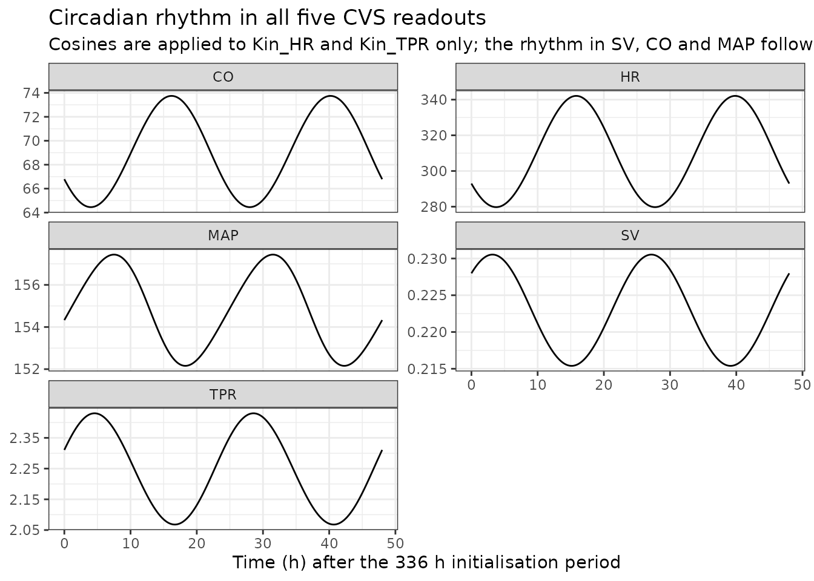
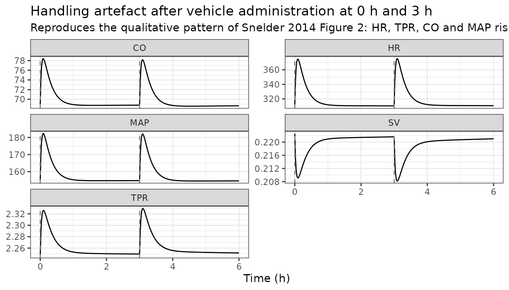
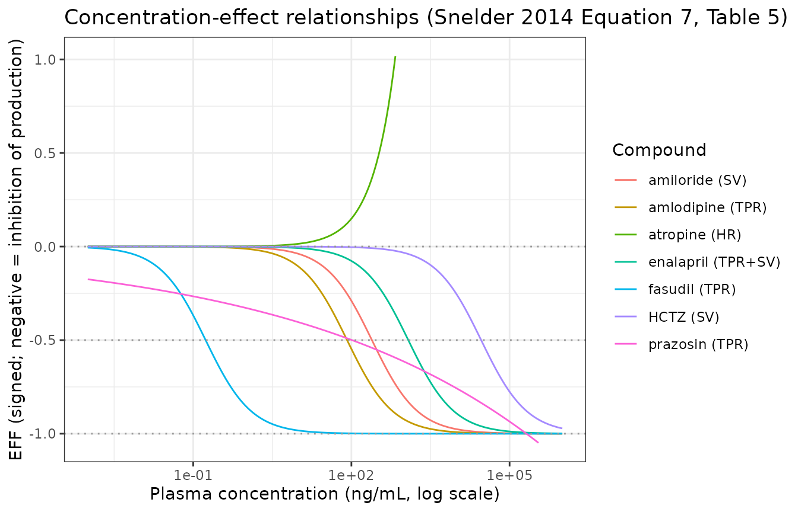
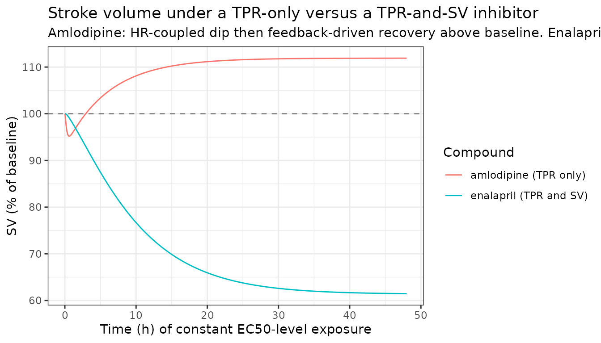
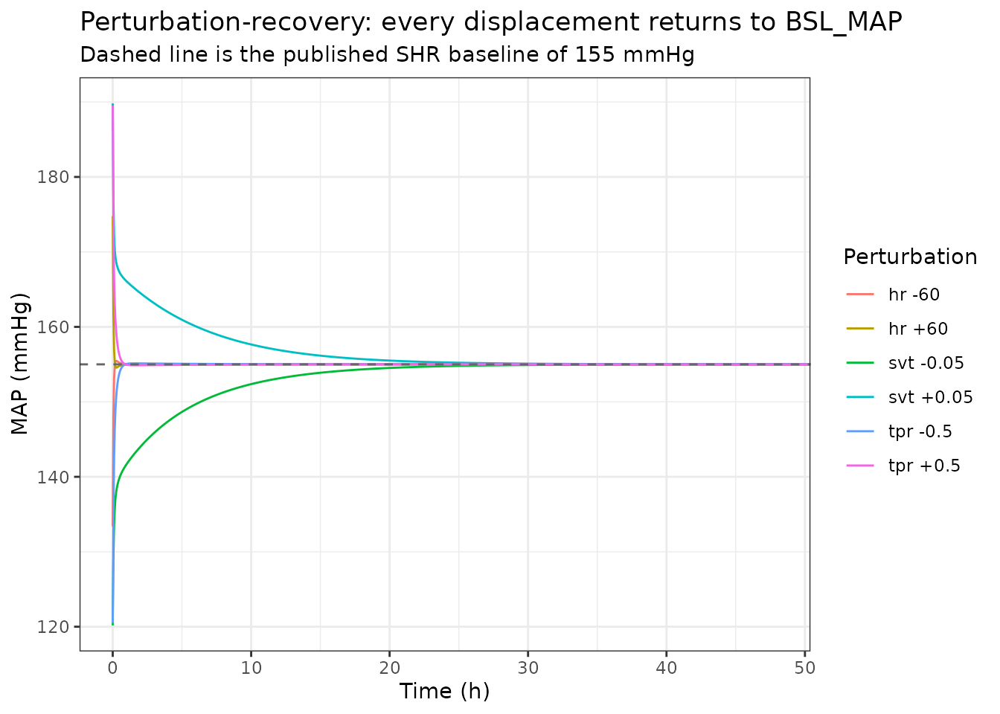

# Extended cardiovascular systems (CVS) model, rat (Snelder 2014)

## Model and source

- Citation: Snelder N, Ploeger BA, Luttringer O, Rigel DF, Fu F, Beil M,
  Stanski DR, Danhof M. Drug effects on the CVS in conscious rats:
  separating cardiac output into heart rate and stroke volume using PKPD
  modelling. Br J Pharmacol. 2014 Nov;171(22):5076-5092.
  <doi:10.1111/bph.12824>. PMCID PMC4253457.
- Article (open access): [Br J Pharmacol
  2014;171(22):5076-5092](https://doi.org/10.1111/bph.12824) (PMCID
  PMC4253457)

Snelder 2014 challenged the cardiovascular system of conscious rats with
eight drugs of deliberately diverse mechanism – amiloride, amlodipine,
atropine, enalapril, fasudil, hydrochlorothiazide (HCTZ), prazosin and
propranolol – and analysed every animal and every compound
**simultaneously** in one NONMEM run. The design separates
*system*-specific parameters, which every compound must share, from
*drug*-specific parameters. Two rat strains were used: the spontaneously
hypertensive rat (SHR) and its normotensive control strain, the
Wistar-Kyoto (WKY) rat.

The paper’s structural contribution is to **parse cardiac output into
heart rate and stroke volume**. Where the Snelder 2013 predecessor had
two turnover states (CO and TPR), this model has three:

- **HR**, heart rate (beats/min)
- **SVT**, the stroke-volume turnover state (mL/beat) – written `SV*` in
  the paper
- **TPR**, total peripheral resistance (mmHg/(mL/min))

all three suppressed by a single shared linear negative feedback of MAP.
Actual stroke volume adds a direct inverse log-linear coupling to heart
rate, `SV = SVT * (1 - HR_SV * ln(HR / BSL_HR))`, representing the
shortening of left-ventricular filling time as the cardiac interval
shortens; then `CO = HR * SV` and `MAP = CO * TPR`. Two 24 h cosines
multiply the HR and TPR production rates, and an exponentially decaying
handling artefact – brief manual restraint and oral gavage – transiently
raises both.

The production rate constants are not estimated: they are *derived* from
the baselines and dissipation rate constants so the system sits at its
reported baseline (Equation 5). The feedback constant is likewise not a
free per-strain parameter: it is a power function of the animal’s own
baseline MAP (Equation 9), which is how the paper’s finding that
feedback is roughly twice as strong in normotensive as in hypertensive
rats is expressed.

### Relationship to the two sibling models in nlmixr2lib

nlmixr2lib ships two other members of the Snelder CVS family, and their
parameter sets must not be mixed.

| Model | Structure | Feedback | Circadian | Provenance |
|----|----|----|----|----|
| `Snelder_2013_cardiovascular_rat` | 2 states (CO, TPR) | two constants, FB1 on CO and FB2 on TPR | five-harmonic cosine, **additive on MAP** | fitted, SHR only |
| `Snelder_2014_cardiovascular_rat` (this file) | 3 states (HR, SVT, TPR) | one shared constant, a power function of individual BSL_MAP | two cosines, **multiplicative on Kin_HR and Kin_TPR** | fitted, SHR + WKY |
| `Fu_2023_cardiovascular_qsp` | 3 states (HR, SVT, TPR) | one shared constant, fixed at 0.0029 | two cosines, multiplicative | **inherits this paper’s system parameters**, with a hypothetical drug |

`Fu_2023_cardiovascular_qsp` is a
stochastic-simulation-and-re-estimation identifiability study that fixes
the system parameters to “the parameter values from the published CVS
model”. Its vignette records that “the Snelder 2013, 2014 papers that
supply the rat baseline values are not on disk”. This extraction closes
that gap for the 2014 paper: every value below is transcribed from the
primary source. Fu 2023’s Supplemental S1 NONMEM control stream is used
in one place only – to settle whether Table 5’s IIV and residual “CV%”
columns are standard deviations or the log-normal `sqrt(exp(omega) - 1)`
form – and that use is flagged explicitly where it occurs.

## Population

``` r

pop <- nlmixr2lib::readModelDb("Snelder_2014_cardiovascular_rat")()$population
tibble::tibble(
  Field = names(pop),
  Value = vapply(pop, function(x) paste(as.character(x), collapse = "; "), character(1))
) |>
  knitr::kable(caption = "Study population (Snelder 2014 Methods and Table 1)")
```

| Field | Value |
|:---|:---|
| species | rat (male spontaneously hypertensive rat, SHR, and male normotensive Wistar-Kyoto rat, WKY; both Taconic Farms) |
| n_subjects | 12 |
| n_studies | 2 |
| study_names | Study 1 (single administrations of different doses on separate days, one vehicle day first; MAP, HR and SV measured with CO and TPR derived; amiloride, amlodipine, enalapril, fasudil, hydrochlorothiazide or prazosin; SHR and WKY rats); Study 2 (single, sequential or combined administration of atropine 10 mg/kg and/or propranolol 30 mg/kg with a 3 h interval; SHR only, 8 rats) |
| age_range | 41-54 weeks (SHR) and 35-38 weeks (WKY) at time of study. |
| weight_range | 367-504 g (SHR) and 499-600 g (WKY). |
| sex_female_pct | 0 |
| sex_notes | All animals were male (Methods, ‘Animals’). |
| disease_state | Spontaneous (genetic) hypertension in the SHR arm (BSL_MAP = 155 mmHg) versus normotension in the WKY arm (BSL_MAP = 102 mmHg); no induced disease model. Snelder 2014 states in the Conclusions that applications of the identified system-parameter set are limited to SHR and WKY rats. |
| dose_range | Study 1 (p.o., one dose per day on separate days after a vehicle day): amiloride 10 mg/kg; amlodipine 0.3, 1, 3, 10 mg/kg; enalapril 3, 10, 30 mg/kg; fasudil 3, 10, 30 mg/kg; hydrochlorothiazide 0.1, 0.3, 1, 3 mg/kg (first occasion) and 10, 30 mg/kg (second occasion); prazosin 0.04, 0.2, 1, 5 mg/kg. Study 2 (p.o.): atropine 10 mg/kg and propranolol 30 mg/kg, alone, sequentially 3 h apart, or combined. All compounds were given by oral gavage at 2 mL/kg. |
| regions | Preclinical; in-life work at Novartis Institutes for BioMedical Research, East Hanover, NJ, USA, with modelling at Leiden Academic Centre for Drug Research, The Netherlands. |
| instrumentation | Rats were surgically instrumented with BOTH an ascending-aortic transit-time flow probe and a femoral-artery catheter / radiotransmitter (as in Snelder et al. 2013a), giving continuous MAP, HR and CO. Flow cables were disconnected between 1700 h and 0700 h, so overnight only MAP and HR were captured. On experiment days baseline data were collected 0700-1000 h, drug was given at 1000 h (and at 1300 h in Study 2), and collection continued to 1700 h. Rats were housed on a 12 h light/dark cycle with lights on 0600-1800 h. |
| n_ode_states | 5 |
| notes | Ten SHR and two WKY rats were used across both studies, with repeated experiments in the same animals over periods of up to 6 months and sufficient washout between them, so the per-compound counts in Table 1 reflect reuse rather than distinct animals. Data from one SHR in Study 2 were excluded because it learned to disconnect its flow cable and responded far more strongly than the others. SV and TPR were never estimated directly: experimentally they were derived from the measured MAP, CO and HR, and in the modelling BSL_HR, BSL_MAP and BSL_CO were the estimated parameters with BSL_SV and BSL_TPR derived from them. Only HR, MAP and CO carry residual-error models for the same reason. The system was initialised at t = 0 h and pharmacological intervention started at t = 336 h (two weeks, determined empirically) so that the circadian oscillation had settled into its oscillating steady state before dosing; since dosing occurred at 1000 h clock time, model time t = 0 corresponds to 1000 h. Propranolol was administered and modelled but its effect was too small to quantify, so it contributes no drug-specific parameters and no covariate column. |

Study population (Snelder 2014 Methods and Table 1) {.table}

Ten SHR and two WKY rats in total, aged 41-54 weeks (SHR) and 35-38
weeks (WKY), 367-504 g and 499-600 g respectively. All were male.
Animals were reused across compounds over periods of up to 6 months with
washout between experiments, so the per-compound counts in Table 1 are
not distinct animals. Each rat carried both an ascending-aortic
transit-time flow probe and a femoral-artery catheter/radiotransmitter,
giving continuous MAP, HR and CO; SV and TPR were derived from those
three, both experimentally and in the model. Data from one SHR were
excluded because it learned to disconnect its flow cable.

Housing was a 12 h light/dark cycle with lights on 0600-1800 h. Baseline
data were collected 0700-1000 h, drug was given at 1000 h (and again at
1300 h in Study 2), and collection continued to 1700 h.

## Source trace

Every value in
`inst/modeldb/therapeuticArea/Snelder_2014_cardiovascular_rat.R` comes
from the locations below; the same references appear as `#` comments on
each `ini()` line.

A convenient property of Snelder 2014 Table 5 is that it reports the
estimate, the relative standard error and the 95% confidence interval
for every parameter. Those three are redundant –
`estimate * (1 +/- 1.96 * RSE / 100)` must reproduce the printed
interval – so the table validates its own transcription. The check is
run in code below and covers all 19 estimated parameters.

### System-specific parameters (Table 5)

| Model parameter | Paper symbol | Value | Fixed? | RSE % | 95% CI | Source |
|----|----|---:|:--:|---:|----|----|
| `lrbase_HR_shr` | BSL_HR_SHR | 310 beats/min |  | 1.12 | 303 - 317 | Table 5 |
| `lrbase_HR_wky` | BSL_HR_WKY | 323 beats/min |  | 1.61 | 313 - 333 | Table 5 |
| `lrbase_MAP_shr` | BSL_MAP_SHR | 155 mmHg |  | 0.684 | 153 - 157 | Table 5 |
| `lrbase_MAP_wky` | BSL_MAP_WKY | 102 mmHg |  | 0.884 | 100 - 104 | Table 5 |
| `lrbase_CO_shr` | BSL_CO_SHR | 69.0 mL/min |  | 4.17 | 63.4 - 74.6 | Table 5 |
| `lrbase_CO_wky` | BSL_CO_WKY | 129 mL/min |  | 1.47 | 125 - 133 | Table 5 |
| `lkout_HR` | kout_HR | 11.6 1/h |  | 19.1 | 7.27 - 15.9 | Table 5 |
| `lkout_SV` | kout_SV | 0.126 1/h |  | 30.7 | 0.0501 - 0.202 | Table 5 |
| `lkout_TPR` | kout_TPR | 3.58 1/h |  | 29.1 | 1.54 - 5.62 | Table 5 |
| `lfb0` | FB0 | 0.00290 1/mmHg |  | 5.93 | 0.00256 - 0.00324 | Table 5 |
| `e_bslmap_fb` | FB0_MAP | -1.98 |  | 10.6 | -2.39 - -1.57 | Table 5; Equation 9 |
| `lhrsv` | HR_SV | 0.312 |  | 15.6 | 0.216 - 0.408 | Table 5 |
| `lkhd` | kHD | 4.70 1/h |  | 8.19 | 3.95 - 5.45 | Table 5 |
| `lphd_HR` | P_HR | 0.632 |  | 9.67 | 0.512 - 0.752 | Table 5 |
| `lphd_TPR` | P_TPR | 0.331 |  | 12.9 | 0.247 - 0.415 | Table 5 |
| `hor_HR` | hor_HR | 8.73 h |  | 3.10 | 8.20 - 9.26 | Table 5 |
| `amp_HR` | amp_HR | 0.0918 |  | 5.15 | 0.0825 - 0.101 | Table 5 |
| `hor_TPR` | hor_TPR | 19.3 h |  | 1.92 | 18.6 - 20.0 | Table 5 |
| `amp_TPR_ratio` | amp_TPR | 1 (= amp_HR) | FIX |  |  | Table 5 row “ampTPR: Fixed to ampHR” |

BSL_SV and BSL_TPR are **derived**, not estimated: the Data analysis
section states that “the BSL_MAP and BSL_CO and BSL_HR were estimated
and BSL_SV and BSL_TPR were derived from these parameters”, via
`BSL_SV = BSL_CO / BSL_HR` and `BSL_TPR = BSL_MAP / BSL_CO`.

### Drug-specific parameters (Table 5, with site and direction from Table 4)

The site of action and the direction of each effect come from Table 4’s
“Effect” column and are restated verbatim in the Figure 3, S1 and S2
captions. Table 5 reports only the magnitude, so the model file keeps
every number byte-identical to the table and applies the sign in
`model()`.

| Compound | Site | Direction | Form | Parameters | Source |
|----|----|----|----|----|----|
| Amiloride | SV | inhibit | Emax, Emax FIX 1 | EC50 245 ng/mL (RSE 25.1, CI 125-365) | Table 5; Table 4; Fig. S1 caption |
| Amlodipine | TPR | inhibit | Emax, Emax FIX 1 | EC50 82.8 ng/mL (RSE 4.99, CI 74.7-90.9) | Table 5; Table 4; Fig. 3 caption |
| Atropine | HR | **stimulate** | linear | SL 0.00149 per ng/mL (RSE 32.3, CI 0.000547-0.00243) | Table 5; Table 4; Fig. S2 caption |
| Enalapril | TPR **and** SV | inhibit | Emax, Emax FIX 1, effect cmt | EC50 1200 ng/mL (RSE 4.03, CI 1110-1290); ke0 0.163 1/h (RSE 5.07, CI 0.147-0.179) | Table 5; Table 4; Fig. S1 caption |
| Fasudil | TPR | inhibit | Emax, Emax FIX 1 | EC50 0.172 ng/mL (RSE 18.4, CI 0.110-0.234) | Table 5; Table 4; Fig. S1 caption |
| HCTZ | SV | inhibit | Emax, Emax FIX 1 | EC50 28900 ng/mL (RSE 7.65, CI 24600-33200) | Table 5; Table 4; Fig. S1 caption |
| Prazosin | TPR | inhibit | power | SL 0.328 (RSE 5.58, CI 0.292-0.364); POW 0.0910 (RSE 6.05, CI 0.0802-0.102) | Table 5; Table 4; Fig. S1 caption |
| Propranolol | HR | inhibit | – | none: “the effect of propranolol was too small to be quantified” | Results, Drug effects |

Emax is fixed to 1 for the five Emax compounds. Table 3 Assumption 2:
“For compounds for which the maximum effect was not observed, complete
inhibition (i.e. Emax = 1) was assumed at infinite concentrations to
ensure identification of the EC50 parameter.” Each Table 5 sub-heading
repeats it.

Two drug-specific parameters in Table 5 are **not** carried in the model
file because they belong to literature PK models the paper does not
otherwise publish: atropine’s Ka (1.17 1/h) and prazosin’s Ka (fixed to
99 1/h, stated in the Results rather than tabulated). Neither
reconstructs a concentration-time profile on its own; see Assumptions
and deviations.

### Variability (Table 5)

| Model parameter | Paper row                  | Reported |           Encoded |
|-----------------|----------------------------|---------:|------------------:|
| `etalrbase_HR`  | BSL_HR (CV%)               |      6.1 | variance 0.003721 |
| `etalrbase_MAP` | BSL_MAP (CV%)              |      3.7 | variance 0.001369 |
| `etalrbase_CO`  | BSL_CO (CV%)               |     22.7 | variance 0.051529 |
| `propSd_HR`     | Prop. Res. Error HR (CV%)  |      7.8 |          SD 0.078 |
| `propSd_MAP`    | Prop. Res. Error MAP (CV%) |      6.0 |          SD 0.060 |
| `propSd_CO`     | Prop. Res. Error CO (CV%)  |      6.9 |          SD 0.069 |

IIV is on the three estimated baselines only (Results: “interindividual
variations in the baseline values of the parameters, BSL_HR, BSL_MAP and
BSL_CO, were allowed”), and residual error is proportional on the three
measured readouts only (“The residual errors of TPR and SV were derived
from these parameters”), which is why SV and TPR are exposed as outputs
with no error model.

The IIV encoding turns on whether Table 5’s “CV%” is `sqrt(omega) * 100`
or the exact log-normal `sqrt(exp(omega) - 1) * 100`. Those differ by
2.5% for BSL_CO, which is small but not nothing. Fu 2023 Supplemental
S1, a NONMEM control stream that re-encodes this same model, settles it:
its `$OMEGA` values are 0.00372, 0.00137 and 0.0515, whose square roots
are exactly 6.1%, 3.7% and 22.7%. The model file therefore uses
`variance = (CV / 100)^2`; the identity is checked in code below.

### Equations

| Model line | Paper |
|----|----|
| `d/dt(hr)`, `d/dt(svt)`, `d/dt(tpr)` | Equation 6 (= Equation 4 with the drug term added) |
| `sv <- svt * (1 - hrsv * log(hr / bsl_HR))`; `co <- hr * sv`; `map <- co * tpr` | Equation 2 |
| `cr_HR`, `cr_TPR` | Equation 3 |
| `hd_HR`, `hd_TPR`, `d/dt(handling)` | Equation 4 |
| `kin_HR`, `kin_SV`, `kin_TPR` | Equation 5 |
| `eff_HR`, `eff_SV`, `eff_TPR` | Equations 6 and 7 |
| `d/dt(effect)` | Equation 8 |
| `fb <- exp(lfb0) * (bsl_MAP / 155)^e_bslmap_fb` | Equation 9 |
| `bsl_SV`, `bsl_TPR` | Data analysis narrative |

Note the asymmetry in Equation 6, which is the paper’s own: the
circadian rhythm and the handling effect act on HR and TPR only, while
all three states receive the MAP feedback and can receive a drug effect.
SV has no circadian term of its own – the paper points out that the
rhythm observed in SV, CO and MAP follows from the feedback and the HR
coupling rather than being modelled directly.

#### Handling effect: closed form vs ODE state

Equation 4 writes the handling artefact as
`HD_X = P_X * exp(-kHD * (t - tHD))` for `t > tHD`. The model file
realises it as a first-order decay state receiving a unit impulse at
each handling event. For a single event the two are the same function;
for the repeated handling of Study 2 (dosing at 1000 h and again at 1300
h) the ODE superposes correctly, whereas the closed form as printed
covers one `tHD` only. Both properties are verified below. The practical
consequence for a user is that handling events are supplied as
`amt = 1, evid = 1, cmt = "handling"` dose records.

### Dimensional analysis

| Term | Units of the factors | Result |
|----|----|----|
| `kin_HR = kout_HR * bsl_HR / fb_bsl` | (1/h) \* (beats/min) / 1 | (beats/min)/h |
| `d/dt(hr) = kin_HR * (1 + cr_HR) * (1 - fb * map) * (1 + eff_HR + hd_HR) - kout_HR * hr` | (beats/min)/h \* 1 \* 1 \* 1 - (1/h)\*(beats/min) | (beats/min)/h |
| `fb * map` | (1/mmHg) \* mmHg | unitless |
| `fb = exp(lfb0) * (bsl_MAP / 155)^e_bslmap_fb` | (1/mmHg) \* (mmHg/mmHg)^unitless | 1/mmHg |
| `cr_HR = amp_HR * cos(2 * pi * (t + hor_HR) / 24)` | 1 \* cos(h/h) | unitless |
| `hd_HR = phd_HR * handling` | 1 \* 1 | unitless |
| `sv = svt * (1 - hrsv * log(hr / bsl_HR))` | (mL/beat) \* (1 - 1 \* log(1)) | mL/beat |
| `co = hr * sv` | (beats/min) \* (mL/beat) | mL/min |
| `map = co * tpr` | (mL/min) \* mmHg/(mL/min) | mmHg |
| `eff_HR = slope_atropine * CP_ATROPINE_NGML` | (mL/ng) \* (ng/mL) | unitless |
| Emax terms `emax * C / (ec50 + C)` | 1 \* (ng/mL)/(ng/mL) | unitless |
| `d/dt(effect) = ke0 * (C - effect)` | (1/h) \* (ng/mL) | (ng/mL)/h |
| `d/dt(handling) = -khd * handling` | (1/h) \* 1 | 1/h |

One published unit is inconsistent as printed. Table 5 labels the
prazosin power coefficient SL as `(ng mL-1)-1`, but for
`EFF = SL * C^POW` to be unitless SL must carry `(ng/mL)^-POW`,
i.e. `(ng/mL)^-0.0910`. The value is used exactly as printed and the
label is not “corrected” – the file reproduces the paper – but the
discrepancy is recorded here and in the parameter’s `label()`.

## Load the model and set up

``` r

mod <- nlmixr2lib::readModelDb("Snelder_2014_cardiovascular_rat")
ui  <- rxode2::rxode2(mod)
#> ℹ parameter labels from comments will be replaced by 'label()'
tv  <- rxode2::zeroRe(ui)   # typical-value model: etas and residual error zeroed
rxode2::rxSetSeed(20261102)

# Published values, restated here so every check below compares against the
# PAPER rather than against the model file it is meant to be testing.
pub <- list(
  BSL_HR_SHR = 310, BSL_MAP_SHR = 155, BSL_CO_SHR = 69.0,
  BSL_HR_WKY = 323, BSL_MAP_WKY = 102, BSL_CO_WKY = 129,
  kout_HR = 11.6, kout_SV = 0.126, kout_TPR = 3.58,
  FB0 = 0.00290, FB0_MAP = -1.98, HR_SV = 0.312,
  kHD = 4.70, P_HR = 0.632, P_TPR = 0.331,
  hor_HR = 8.73, amp_HR = 0.0918, hor_TPR = 19.3,
  EC50_amiloride = 245, EC50_amlodipine = 82.8, SL_atropine = 0.00149,
  EC50_enalapril = 1200, ke0_enalapril = 0.163, EC50_fasudil = 0.172,
  EC50_hctz = 28900, SL_prazosin = 0.328, POW_prazosin = 0.0910,
  CV_BSL_HR = 6.1, CV_BSL_MAP = 3.7, CV_BSL_CO = 22.7,
  CV_res_HR = 7.8, CV_res_MAP = 6.0, CV_res_CO = 6.9
)

CP_COLS <- c("CP_AMILORIDE_NGML", "CP_AMLODIPINE_NGML", "CP_ATROPINE_NGML",
             "CP_ENALAPRIL_NGML", "CP_FASUDIL_NGML", "CP_HCTZ_NGML",
             "CP_PRAZOSIN_NGML")
```

The model is a multi-endpoint model with three observed readouts, so
observation records name the endpoint in `cmt` (`"HR"`, `"MAP"`,
`"CO"`); the solver returns every derived quantity, including the
unobserved `SV` and `TPR`, as columns alongside them. Handling events
are dose records into the `handling` state.

``` r

# Build an event table: observations of the three measured readouts on a regular
# grid, optional handling impulses, all seven exposure columns defaulting to 0.
cvs_events <- function(tmax, by = 0.05, strain = 1, handling_times = numeric(0),
                       exposure = list()) {
  tt  <- seq(0, tmax, by = by)
  obs <- do.call(rbind, lapply(c("HR", "MAP", "CO"), function(e) {
    data.frame(time = tt, amt = NA_real_, evid = 0L, cmt = e)
  }))
  if (length(handling_times) > 0) {
    obs <- rbind(obs, data.frame(time = handling_times, amt = 1,
                                 evid = 1L, cmt = "handling"))
  }
  obs$id <- 1L
  obs$STRAIN_SHR <- strain
  for (nm in CP_COLS) obs[[nm]] <- 0
  for (nm in names(exposure)) obs[[nm]] <- exposure[[nm]]
  obs[order(obs$time, obs$evid), ]
}

# Solve the typical-value model and return one row per time point.
cvs_solve <- function(ev, ...) {
  s <- rxode2::rxSolve(tv, ev, omega = NA, returnType = "data.frame",
                       addDosing = FALSE, ...)
  keep <- c("time", "HR", "MAP", "CO", "SV", "TPR", "effect", "handling",
            "bsl_HR", "bsl_MAP", "bsl_CO", "bsl_SV", "bsl_TPR", "fb",
            "kin_HR", "kin_SV", "kin_TPR")
  unique(s[, keep])
}
```

## 1. Table 5 validates its own transcription

Every estimated parameter in Table 5 is printed with a value, an RSE and
a 95% confidence interval. The Wald interval
`value * (1 +/- 1.96 * RSE/100)` must reproduce the printed bounds, so a
mistyped digit in any one of the three shows up immediately. This check
covers all 19 estimated parameters.

``` r

tab5 <- tibble::tribble(
  ~parameter,      ~value,   ~rse,    ~llci,     ~ulci,
  "BSL_HR_SHR",     310,     1.12,     303,       317,
  "BSL_MAP_SHR",    155,     0.684,    153,       157,
  "BSL_CO_SHR",      69.0,   4.17,      63.4,      74.6,
  "BSL_HR_WKY",     323,     1.61,     313,       333,
  "BSL_MAP_WKY",    102,     0.884,    100,       104,
  "BSL_CO_WKY",     129,     1.47,     125,       133,
  "kout_HR",         11.6,  19.1,        7.27,     15.9,
  "kout_SV",          0.126, 30.7,       0.0501,    0.202,
  "kout_TPR",         3.58, 29.1,        1.54,      5.62,
  "FB0",              0.00290, 5.93,     0.00256,   0.00324,
  "FB0_MAP",         -1.98,  10.6,      -2.39,     -1.57,
  "HR_SV",            0.312, 15.6,       0.216,     0.408,
  "kHD",              4.70,   8.19,      3.95,      5.45,
  "P_HR",             0.632,  9.67,      0.512,     0.752,
  "P_TPR",            0.331, 12.9,       0.247,     0.415,
  "hor_HR",           8.73,   3.10,      8.20,      9.26,
  "amp_HR",           0.0918, 5.15,      0.0825,    0.101,
  "hor_TPR",         19.3,    1.92,     18.6,      20.0,
  "EC50_amiloride", 245,     25.1,     125,       365,
  "EC50_amlodipine", 82.8,    4.99,     74.7,      90.9,
  "SL_atropine",      0.00149, 32.3,     0.000547,  0.00243,
  "EC50_enalapril", 1200,     4.03,   1110,      1290,
  "ke0_enalapril",     0.163,  5.07,     0.147,     0.179,
  "EC50_fasudil",      0.172, 18.4,      0.110,     0.234,
  "EC50_hctz",     28900,     7.65,  24600,     33200,
  "SL_prazosin",       0.328,  5.58,     0.292,     0.364,
  "POW_prazosin",      0.0910, 6.05,     0.0802,    0.102
)

# Every number in Table 5 is printed to three significant figures, so the
# comparison tolerance is set by that rounding rather than chosen by hand. One
# unit in the last printed place is `ulp()`; the reconstructed width can differ
# from the printed one by up to half a ulp on each bound, plus the propagated
# effect of rounding the estimate and the RSE themselves.
ulp <- function(x) 10^(floor(log10(abs(x))) - 2)

tab5 <- tab5 |>
  dplyr::mutate(
    se            = abs(value) * rse / 100,
    wald_low      = value - 1.96 * se,
    wald_high     = value + 1.96 * se,
    printed_width = ulci - llci,
    wald_width    = wald_high - wald_low,
    tol           = 1.25 * ((ulp(llci) + ulp(ulci)) / 2 +
                              2 * 1.96 * (ulp(value) / 2 * rse / 100 +
                                            abs(value) * ulp(rse) / 100 / 2)),
    ok            = abs(wald_width - printed_width) <= tol,
    headroom      = tol / abs(wald_width - printed_width)
  )

tab5 |>
  dplyr::transmute(Parameter = parameter, Value = value, `RSE %` = rse,
                   `Printed CI` = sprintf("%.4g to %.4g", llci, ulci),
                   `Wald CI from RSE` = sprintf("%.4g to %.4g", wald_low, wald_high),
                   `Width discrepancy` = sprintf("%.3g", abs(wald_width - printed_width)),
                   `Rounding tolerance` = sprintf("%.3g", tol),
                   OK = ok) |>
  knitr::kable(caption = "Snelder 2014 Table 5 is internally redundant: the RSE reconstructs the printed 95% CI for every estimated parameter, to within the rounding of the printed numbers.")
```

| Parameter | Value | RSE % | Printed CI | Wald CI from RSE | Width discrepancy | Rounding tolerance | OK |
|:---|---:|---:|:---|:---|:---|:---|:---|
| BSL_HR_SHR | 3.10e+02 | 1.120 | 303 to 317 | 303.2 to 316.8 | 0.39 | 1.35 | TRUE |
| BSL_MAP_SHR | 1.55e+02 | 0.684 | 153 to 157 | 152.9 to 157.1 | 0.156 | 1.27 | TRUE |
| BSL_CO_SHR | 6.90e+01 | 4.170 | 63.4 to 74.6 | 63.36 to 74.64 | 0.079 | 0.152 | TRUE |
| BSL_HR_WKY | 3.23e+02 | 1.610 | 313 to 333 | 312.8 to 333.2 | 0.385 | 1.37 | TRUE |
| BSL_MAP_WKY | 1.02e+02 | 0.884 | 100 to 104 | 100.2 to 103.8 | 0.465 | 1.27 | TRUE |
| BSL_CO_WKY | 1.29e+02 | 1.470 | 125 to 133 | 125.3 to 132.7 | 0.567 | 1.32 | TRUE |
| kout_HR | 1.16e+01 | 19.100 | 7.27 to 15.9 | 7.257 to 15.94 | 0.0552 | 0.144 | TRUE |
| kout_SV | 1.26e-01 | 30.700 | 0.0501 to 0.202 | 0.05018 to 0.2018 | 0.000267 | 0.00175 | TRUE |
| kout_TPR | 3.58e+00 | 29.100 | 1.54 to 5.62 | 1.538 to 5.622 | 0.00378 | 0.0284 | TRUE |
| FB0 | 2.90e-03 | 5.930 | 0.00256 to 0.00324 | 0.002563 to 0.003237 | 5.88e-06 | 1.47e-05 | TRUE |
| FB0_MAP | -1.98e+00 | 10.600 | -2.39 to -1.57 | -2.391 to -1.569 | 0.00273 | 0.0199 | TRUE |
| HR_SV | 3.12e-01 | 15.600 | 0.216 to 0.408 | 0.2166 to 0.4074 | 0.00121 | 0.0024 | TRUE |
| kHD | 4.70e+00 | 8.190 | 3.95 to 5.45 | 3.946 to 5.454 | 0.00893 | 0.0157 | TRUE |
| P_HR | 6.32e-01 | 9.670 | 0.512 to 0.752 | 0.5122 to 0.7518 | 0.000432 | 0.00164 | TRUE |
| P_TPR | 3.31e-01 | 12.900 | 0.247 to 0.415 | 0.2473 to 0.4147 | 0.00062 | 0.00238 | TRUE |
| hor_HR | 8.73e+00 | 3.100 | 8.2 to 9.26 | 8.2 to 9.26 | 0.00087 | 0.0154 | TRUE |
| amp_HR | 9.18e-02 | 5.150 | 0.0825 to 0.101 | 0.08253 to 0.1011 | 3.26e-05 | 0.000723 | TRUE |
| hor_TPR | 1.93e+01 | 1.920 | 18.6 to 20 | 18.57 to 20.03 | 0.0526 | 0.134 | TRUE |
| EC50_amiloride | 2.45e+02 | 25.100 | 125 to 365 | 124.5 to 365.5 | 1.06 | 2.47 | TRUE |
| EC50_amlodipine | 8.28e+01 | 4.990 | 74.7 to 90.9 | 74.7 to 90.9 | 0.00366 | 0.158 | TRUE |
| SL_atropine | 1.49e-03 | 32.300 | 0.000547 to 0.00243 | 0.0005467 to 0.002433 | 3.58e-06 | 1.84e-05 | TRUE |
| EC50_enalapril | 1.20e+03 | 4.030 | 1110 to 1290 | 1105 to 1295 | 9.57 | 13.8 | TRUE |
| ke0_enalapril | 1.63e-01 | 5.070 | 0.147 to 0.179 | 0.1468 to 0.1792 | 0.000395 | 0.00141 | TRUE |
| EC50_fasudil | 1.72e-01 | 18.400 | 0.11 to 0.234 | 0.11 to 0.234 | 6.02e-05 | 0.00212 | TRUE |
| EC50_hctz | 2.89e+04 | 7.650 | 2.46e+04 to 3.32e+04 | 2.457e+04 to 3.323e+04 | 66.5 | 151 | TRUE |
| SL_prazosin | 3.28e-01 | 5.580 | 0.292 to 0.364 | 0.2921 to 0.3639 | 0.000255 | 0.00147 | TRUE |
| POW_prazosin | 9.10e-02 | 6.050 | 0.0802 to 0.102 | 0.08021 to 0.1018 | 0.000218 | 0.000725 | TRUE |

Snelder 2014 Table 5 is internally redundant: the RSE reconstructs the
printed 95% CI for every estimated parameter, to within the rounding of
the printed numbers. {.table}

``` r


cat(sprintf("all %d parameters consistent: %s (tightest row: %s, %.2fx headroom)\n",
            nrow(tab5), all(tab5$ok),
            tab5$parameter[which.min(tab5$headroom)], min(tab5$headroom)))
#> all 27 parameters consistent: TRUE (tightest row: EC50_enalapril, 1.44x headroom)

stopifnot(
  # Every reconstructed interval width matches the printed one within rounding.
  all(tab5$ok),
  # The printed estimate lies strictly inside its own printed interval.
  all(tab5$value > tab5$llci & tab5$value < tab5$ulci),
  # And the printed interval is symmetric about the estimate, as a Wald interval
  # must be -- asymmetry would mean the interval is not the one the RSE implies.
  all(abs((tab5$ulci - tab5$value) - (tab5$value - tab5$llci)) <=
        tab5$tol + ulp(tab5$value))
)
```

This matters most for `EC50_fasudil = 0.172 ng/mL`, which is roughly
1900-fold away from the 321 ng/mL that Snelder 2013 reported for the
same compound on the same experimental platform. Because 0.172
reconstructs its own printed interval (0.110 to 0.234) exactly, the
value is not a transcription or PDF-extraction artefact: it is what the
paper reports. See Assumptions and deviations.

## 2. Baseline steady-state hold

With no drug, no handling and the circadian amplitude set to zero, the
system must sit exactly at its reported baseline forever – that is what
Equation 5 constructs `Kin` to guarantee. This is run in both strains,
because the strain enters through three different baselines and, via
Equation 9, through the feedback constant as well.

``` r

ss_check <- function(strain) {
  s <- cvs_solve(cvs_events(48, by = 0.25, strain = strain), params = c(amp_HR = 0))
  tibble::tibble(
    Strain = if (strain == 1) "SHR" else "WKY",
    HR = s$HR[1], MAP = s$MAP[1], CO = s$CO[1], SV = s$SV[1], TPR = s$TPR[1],
    `max drift HR`  = max(abs(s$HR  - s$HR[1])),
    `max drift MAP` = max(abs(s$MAP - s$MAP[1])),
    `max drift CO`  = max(abs(s$CO  - s$CO[1]))
  )
}
ss <- dplyr::bind_rows(ss_check(1), ss_check(0))
knitr::kable(ss, digits = 6,
             caption = "Baseline steady-state hold over 48 h with the circadian rhythm switched off.")
```

| Strain |  HR | MAP |  CO |       SV |      TPR | max drift HR | max drift MAP | max drift CO |
|:-------|----:|----:|----:|---------:|---------:|-------------:|--------------:|-------------:|
| SHR    | 310 | 155 |  69 | 0.222581 | 2.246377 |            0 |             0 |            0 |
| WKY    | 323 | 102 | 129 | 0.399381 | 0.790698 |            0 |             0 |            0 |

Baseline steady-state hold over 48 h with the circadian rhythm switched
off. {.table}

``` r


stopifnot(
  # The state does not move at all: this is an exact algebraic fixed point.
  max(ss$`max drift HR`, ss$`max drift MAP`, ss$`max drift CO`) < 1e-8,
  # And it sits on the published baselines.
  abs(ss$HR[1]  - pub$BSL_HR_SHR)  < 1e-6,
  abs(ss$MAP[1] - pub$BSL_MAP_SHR) < 1e-6,
  abs(ss$CO[1]  - pub$BSL_CO_SHR)  < 1e-6,
  abs(ss$HR[2]  - pub$BSL_HR_WKY)  < 1e-6,
  abs(ss$MAP[2] - pub$BSL_MAP_WKY) < 1e-6,
  abs(ss$CO[2]  - pub$BSL_CO_WKY)  < 1e-6
)
```

The fixed point is not a coincidence of the numbers: at `HR = BSL_HR`
the HR-on-SV coupling term is `1 - HR_SV * ln(1) = 1`, so `SV = BSL_SV`
and `MAP = BSL_HR * BSL_SV * BSL_TPR = BSL_CO * BSL_TPR = BSL_MAP`.
Substituting into Equation 5 gives production `= kout_X * BSL_X`
exactly, cancelling the loss term for each of the three states.

## 3. Derived baselines BSL_SV and BSL_TPR

``` r

derived <- tibble::tibble(
  Strain  = c("SHR", "WKY"),
  BSL_HR  = c(pub$BSL_HR_SHR,  pub$BSL_HR_WKY),
  BSL_MAP = c(pub$BSL_MAP_SHR, pub$BSL_MAP_WKY),
  BSL_CO  = c(pub$BSL_CO_SHR,  pub$BSL_CO_WKY)
) |>
  dplyr::mutate(
    `BSL_SV = BSL_CO/BSL_HR`   = BSL_CO / BSL_HR,
    `BSL_TPR = BSL_MAP/BSL_CO` = BSL_MAP / BSL_CO,
    `model SV`  = ss$SV,
    `model TPR` = ss$TPR
  )
knitr::kable(derived, digits = 6,
             caption = "BSL_SV and BSL_TPR are derived from the three estimated baselines.")
```

| Strain | BSL_HR | BSL_MAP | BSL_CO | BSL_SV = BSL_CO/BSL_HR | BSL_TPR = BSL_MAP/BSL_CO | model SV | model TPR |
|:---|---:|---:|---:|---:|---:|---:|---:|
| SHR | 310 | 155 | 69 | 0.222581 | 2.246377 | 0.222581 | 2.246377 |
| WKY | 323 | 102 | 129 | 0.399381 | 0.790698 | 0.399381 | 0.790698 |

BSL_SV and BSL_TPR are derived from the three estimated baselines.
{.table style="width:100%;"}

``` r


stopifnot(
  max(abs(derived$`BSL_SV = BSL_CO/BSL_HR`   - derived$`model SV`))  < 1e-9,
  max(abs(derived$`BSL_TPR = BSL_MAP/BSL_CO` - derived$`model TPR`)) < 1e-9
)
```

The paper’s own qualitative statement follows: SHR have a *lower* BSL_SV
and a *higher* BSL_TPR than WKY rats.

``` r

stopifnot(
  derived$`model SV`[1]  < derived$`model SV`[2],
  derived$`model TPR`[1] > derived$`model TPR`[2]
)
```

## 4. Equation 9: feedback declines with baseline MAP

Equation 9 is `FB = FB0 * (IBSL_MAP / TVBSL_MAP_SHR)^FB0_MAP`, with
`TVBSL_MAP_SHR = 155 mmHg`, the SHR typical value, used as the reference
for **both** strains. The paper reports the consequence rather than the
WKY number: “Overall, the feedback is about twofold higher in WKY rats
as compared with SHR.” That statement is the check.

``` r

fb_pub <- function(bsl_map) pub$FB0 * (bsl_map / pub$BSL_MAP_SHR)^pub$FB0_MAP
fb_tab <- tibble::tibble(
  Strain      = c("SHR", "WKY"),
  BSL_MAP     = c(pub$BSL_MAP_SHR, pub$BSL_MAP_WKY),
  `FB (Eq 9)` = fb_pub(c(pub$BSL_MAP_SHR, pub$BSL_MAP_WKY)),
  `FB (model)` = ss$MAP * 0 + c(
    cvs_solve(cvs_events(1, by = 0.5, strain = 1), params = c(amp_HR = 0))$fb[1],
    cvs_solve(cvs_events(1, by = 0.5, strain = 0), params = c(amp_HR = 0))$fb[1]
  )
) |>
  dplyr::mutate(`1 - FB*BSL_MAP` = 1 - `FB (model)` * BSL_MAP)
knitr::kable(fb_tab, digits = 6,
             caption = "Feedback constant by strain (Equation 9, reference 155 mmHg).")
```

| Strain | BSL_MAP | FB (Eq 9) | FB (model) | 1 - FB\*BSL_MAP |
|:-------|--------:|----------:|-----------:|----------------:|
| SHR    |     155 |  0.002900 |   0.002900 |        0.550500 |
| WKY    |     102 |  0.006641 |   0.006641 |        0.322629 |

Feedback constant by strain (Equation 9, reference 155 mmHg). {.table}

``` r


ratio <- fb_tab$`FB (model)`[2] / fb_tab$`FB (model)`[1]
cat(sprintf("WKY / SHR feedback ratio: %.3f\n", ratio))
#> WKY / SHR feedback ratio: 2.290

stopifnot(
  # The model reproduces Equation 9 evaluated by hand.
  max(abs(fb_tab$`FB (model)` - fb_tab$`FB (Eq 9)`)) < 1e-12,
  # "About twofold higher in WKY rats" (Results, SHR versus WKY rats).
  ratio > 1.8 && ratio < 2.8,
  # The production-rate multiplier must stay positive in both strains or the
  # steady-state Kin of Equation 5 would be negative.
  all(fb_tab$`1 - FB*BSL_MAP` > 0)
)
```

The `1 - FB*BSL_MAP` column is worth noting for anyone simulating large
perturbations: it is 0.55 in SHR but only 0.32 in WKY rats, so the
normotensive strain has appreciably less headroom before the production
term would change sign.

## 5. Flux balance at the fixed point

At the (non-oscillating) baseline, production and loss must cancel
exactly for each of the three turnover states. Done symbolically from
the published values, independent of the solver.

``` r

flux <- function(bsl_map, bsl_hr, bsl_co) {
  fb  <- fb_pub(bsl_map)
  bsl <- c(HR = bsl_hr, SV = bsl_co / bsl_hr, TPR = bsl_map / bsl_co)
  kout <- c(HR = pub$kout_HR, SV = pub$kout_SV, TPR = pub$kout_TPR)
  kin  <- kout * bsl / (1 - fb * bsl_map)
  tibble::tibble(State = names(bsl),
                 `Kin (Eq 5)` = unname(kin),
                 Production   = unname(kin * (1 - fb * bsl_map)),
                 Loss         = unname(kout * bsl),
                 Net          = unname(kin * (1 - fb * bsl_map) - kout * bsl))
}
fl <- dplyr::bind_rows(
  dplyr::mutate(flux(pub$BSL_MAP_SHR, pub$BSL_HR_SHR, pub$BSL_CO_SHR), Strain = "SHR"),
  dplyr::mutate(flux(pub$BSL_MAP_WKY, pub$BSL_HR_WKY, pub$BSL_CO_WKY), Strain = "WKY")
) |>
  dplyr::select(Strain, State, `Kin (Eq 5)`, Production, Loss, Net)
knitr::kable(fl, digits = 8,
             caption = "Production and loss fluxes cancel at baseline. Note that Kin is the zero-order rate CONSTANT of Equation 5; the production FLUX is Kin * (1 - FB*MAP), which is what must equal the loss.")
```

| Strain | State |   Kin (Eq 5) |   Production |         Loss | Net |
|:-------|:------|-------------:|-------------:|-------------:|----:|
| SHR    | HR    | 6.532243e+03 | 3.596000e+03 | 3.596000e+03 |   0 |
| SHR    | SV    | 5.094489e-02 | 2.804516e-02 | 2.804516e-02 |   0 |
| SHR    | TPR   | 1.460859e+01 | 8.042029e+00 | 8.042029e+00 |   0 |
| WKY    | HR    | 1.161334e+04 | 3.746800e+03 | 3.746800e+03 |   0 |
| WKY    | SV    | 1.559748e-01 | 5.032198e-02 | 5.032198e-02 |   0 |
| WKY    | TPR   | 8.773847e+00 | 2.830698e+00 | 2.830698e+00 |   0 |

Production and loss fluxes cancel at baseline. Note that Kin is the
zero-order rate CONSTANT of Equation 5; the production FLUX is Kin \*
(1 - FB\*MAP), which is what must equal the loss. {.table}

``` r


# The solver's own Kin values must equal the hand computation from Equation 5.
ms  <- cvs_solve(cvs_events(1, by = 0.5, strain = 1), params = c(amp_HR = 0))
kin_shr <- fl$`Kin (Eq 5)`[fl$Strain == "SHR"]
names(kin_shr) <- fl$State[fl$Strain == "SHR"]
stopifnot(
  max(abs(fl$Net)) < 1e-9,
  abs(ms$kin_HR[1]  - kin_shr[["HR"]])  < 1e-9,
  abs(ms$kin_SV[1]  - kin_shr[["SV"]])  < 1e-9,
  abs(ms$kin_TPR[1] - kin_shr[["TPR"]]) < 1e-9
)
```

## 6. Circadian rhythm (Equation 3)

Two 24 h cosines multiply the HR and TPR production rates. The paper
reports the amplitude as 0.09, “indicating that the variation in Kin_HR
and Kin_TPR is maximally 9% during the day”, and states that the two
horizontal displacements are significantly different, “even if one of
the cosines would have been replaced by a sine (i.e. a shift of 12 h)”.

``` r

circ <- cvs_solve(cvs_events(336 + 48, by = 0.25, strain = 1))
last48 <- circ[circ$time >= 336, ]

circ_summary <- tibble::tibble(
  Readout = c("HR", "MAP", "CO", "SV", "TPR"),
  Mean    = vapply(c("HR", "MAP", "CO", "SV", "TPR"),
                   function(v) mean(last48[[v]]), numeric(1)),
  Min     = vapply(c("HR", "MAP", "CO", "SV", "TPR"),
                   function(v) min(last48[[v]]), numeric(1)),
  Max     = vapply(c("HR", "MAP", "CO", "SV", "TPR"),
                   function(v) max(last48[[v]]), numeric(1))
) |>
  dplyr::mutate(`Peak-to-trough, % of mean` = 100 * (Max - Min) / Mean)
knitr::kable(circ_summary, digits = 3,
             caption = "Oscillating steady state over the last 48 h before intervention.")
```

| Readout |    Mean |     Min |     Max | Peak-to-trough, % of mean |
|:--------|--------:|--------:|--------:|--------------------------:|
| HR      | 310.326 | 279.734 | 342.098 |                    20.096 |
| MAP     | 154.812 | 152.157 | 157.438 |                     3.412 |
| CO      |  69.060 |  64.453 |  73.749 |                    13.460 |
| SV      |   0.223 |   0.215 |   0.231 |                     6.790 |
| TPR     |   2.248 |   2.068 |   2.430 |                    16.108 |

Oscillating steady state over the last 48 h before intervention.
{.table}

``` r


last48 |>
  dplyr::select(time, HR, MAP, CO, SV, TPR) |>
  tidyr::pivot_longer(-time, names_to = "Readout", values_to = "Value") |>
  ggplot2::ggplot(ggplot2::aes(time - 336, Value)) +
  ggplot2::geom_line() +
  ggplot2::facet_wrap(~Readout, scales = "free_y", ncol = 2) +
  ggplot2::labs(x = "Time (h) after the 336 h initialisation period",
                y = NULL,
                title = "Circadian rhythm in all five CVS readouts",
                subtitle = "Cosines are applied to Kin_HR and Kin_TPR only; the rhythm in SV, CO and MAP follows from the feedback") +
  ggplot2::theme_bw()
```



``` r

# The circadian rhythm is imposed on the production rates with amplitude 0.0918,
# so no readout's oscillation may exceed roughly twice that in relative terms.
stopifnot(all(circ_summary$`Peak-to-trough, % of mean` < 2 * 100 * pub$amp_HR * 1.2))

# Equation 5 sets Kin ignoring the rhythm, so the paper expects the oscillation
# to sit AROUND the baseline rather than on it. Confirm the mean is close.
mean_dev <- abs(circ_summary$Mean[circ_summary$Readout == "MAP"] / pub$BSL_MAP_SHR - 1)
cat(sprintf("mean MAP over the last 48 h is %.3f%% from BSL_MAP\n", 100 * mean_dev))
#> mean MAP over the last 48 h is 0.121% from BSL_MAP
stopifnot(mean_dev < 0.01)

# Phase. The production-rate cosines peak where 2*pi*(t + hor)/24 is a multiple
# of 2*pi, i.e. at t = 24 - hor (mod 24): 15.27 h for HR and 4.70 h for TPR. The
# STATE peak lags the production peak, so allow a couple of hours.
peak_hr  <- (last48$time[which.max(last48$HR)])  %% 24
peak_tpr <- (last48$time[which.max(last48$TPR)]) %% 24
cat(sprintf("HR state peaks at t mod 24 = %.2f h (Kin_HR peak %.2f h)\n",
            peak_hr, (24 - pub$hor_HR) %% 24))
#> HR state peaks at t mod 24 = 15.75 h (Kin_HR peak 15.27 h)
cat(sprintf("TPR state peaks at t mod 24 = %.2f h (Kin_TPR peak %.2f h)\n",
            peak_tpr, (24 - pub$hor_TPR) %% 24))
#> TPR state peaks at t mod 24 = 4.50 h (Kin_TPR peak 4.70 h)
stopifnot(
  abs(peak_hr  - (24 - pub$hor_HR)  %% 24) < 2,
  abs(peak_tpr - (24 - pub$hor_TPR) %% 24) < 2
)
```

Because dosing happened at 1000 h clock time and the paper started
pharmacological intervention at `t = 336 h`, which is exactly 14 x 24 h,
model time `t = 0` corresponds to 1000 h. On that clock the HR
production rate peaks at 0116 h and the TPR production rate at 1442 h –
HR in the dark phase and TPR in the light phase, which is the expected
direction for a nocturnal species on the paper’s 0600-1800 h light
cycle. This is a consistency observation, not a paper claim.

## 7. Handling effect (Equation 4)

``` r

h1 <- cvs_solve(cvs_events(6, by = 0.02, handling_times = 0), params = c(amp_HR = 0))
h2 <- cvs_solve(cvs_events(6, by = 0.02, handling_times = c(0, 3)), params = c(amp_HR = 0))

closed_1 <- exp(-pub$kHD * h1$time)
closed_2 <- exp(-pub$kHD * h2$time) +
  ifelse(h2$time >= 3, exp(-pub$kHD * (h2$time - 3)), 0)

cat(sprintf("single event : max |ODE state - exp(-kHD*t)| = %.2e\n",
            max(abs(h1$handling - closed_1))))
#> single event : max |ODE state - exp(-kHD*t)| = 1.42e-08
cat(sprintf("two events   : max |ODE state - superposition| = %.2e\n",
            max(abs(h2$handling - closed_2))))
#> two events   : max |ODE state - superposition| = 1.31e-07
cat(sprintf("handling half-life = %.4f h (ln(2)/kHD = %.4f h)\n",
            stats::approx(h1$handling, h1$time, xout = 0.5)$y, log(2) / pub$kHD))
#> handling half-life = 0.1477 h (ln(2)/kHD = 0.1475 h)

stopifnot(
  max(abs(h1$handling - closed_1)) < 1e-6,
  max(abs(h2$handling - closed_2)) < 1e-6,
  abs(stats::approx(h1$handling, h1$time, xout = 0.5)$y - log(2) / pub$kHD) < 1e-3
)

h2 |>
  dplyr::select(time, HR, MAP, CO, SV, TPR) |>
  tidyr::pivot_longer(-time, names_to = "Readout", values_to = "Value") |>
  ggplot2::ggplot(ggplot2::aes(time, Value)) +
  ggplot2::geom_line() +
  ggplot2::geom_vline(xintercept = c(0, 3), linetype = "dashed", colour = "grey50") +
  ggplot2::facet_wrap(~Readout, scales = "free_y", ncol = 2) +
  ggplot2::labs(x = "Time (h)", y = NULL,
                title = "Handling artefact after vehicle administration at 0 h and 3 h",
                subtitle = "Reproduces the qualitative pattern of Snelder 2014 Figure 2: HR, TPR, CO and MAP rise, SV falls") +
  ggplot2::theme_bw()
```



The paper’s description of the artefact (Methods, “Data analysis”) is
that handling “caused a temporary increase in HR, TPR, CO and MAP and
decrease in SV that was independent of drug exposure”. The model
reproduces all five directions even though the handling term appears
only on the HR and TPR production rates: the SV fall is a consequence of
the direct HR-on-SV coupling, and the CO and MAP rises follow from the
products.

``` r

peak <- function(v) h1[[v]][which.max(abs(h1[[v]] - h1[[v]][1]))]
dirs <- tibble::tibble(
  Readout   = c("HR", "TPR", "CO", "MAP", "SV"),
  Baseline  = vapply(c("HR", "TPR", "CO", "MAP", "SV"), function(v) h1[[v]][1], numeric(1)),
  Extreme   = vapply(c("HR", "TPR", "CO", "MAP", "SV"), peak, numeric(1))
) |>
  dplyr::mutate(`% change at the extreme` = 100 * (Extreme / Baseline - 1))
knitr::kable(dirs, digits = 4,
             caption = "Direction of the handling effect on each readout (single event at t = 0).")
```

| Readout | Baseline |  Extreme | % change at the extreme |
|:--------|---------:|---------:|------------------------:|
| HR      | 310.0000 | 374.7209 |                 20.8777 |
| TPR     |   2.2464 |   2.3260 |                  3.5451 |
| CO      |  69.0000 |  78.3787 |                 13.5923 |
| MAP     | 155.0000 | 182.2729 |                 17.5954 |
| SV      |   0.2226 |   0.2091 |                 -6.0462 |

Direction of the handling effect on each readout (single event at t =
0). {.table}

``` r


stopifnot(
  dirs$`% change at the extreme`[dirs$Readout == "HR"]  > 0,
  dirs$`% change at the extreme`[dirs$Readout == "TPR"] > 0,
  dirs$`% change at the extreme`[dirs$Readout == "CO"]  > 0,
  dirs$`% change at the extreme`[dirs$Readout == "MAP"] > 0,
  dirs$`% change at the extreme`[dirs$Readout == "SV"]  < 0
)
```

## 8. Enalapril effect compartment (Equation 8)

Equation 8 is `dCe/dt = ke0 * (C - Ce)`. Under a step input of C held
constant the analytical solution is `Ce(t) = C * (1 - exp(-ke0 * t))`,
and the time to reach half the plateau is `ln(2)/ke0`, which the Results
report as “the half-life of this additional delay was 4.3 h”.

``` r

ev  <- cvs_events(48, by = 0.05, exposure = list(CP_ENALAPRIL_NGML = pub$EC50_enalapril))
ec  <- cvs_solve(ev, params = c(amp_HR = 0))
ana <- pub$EC50_enalapril * (1 - exp(-pub$ke0_enalapril * ec$time))

t_half <- stats::approx(ec$effect, ec$time, xout = pub$EC50_enalapril / 2)$y
cat(sprintf("max |Ce(ODE) - Ce(analytic)| = %.2e ng/mL\n", max(abs(ec$effect - ana))))
#> max |Ce(ODE) - Ce(analytic)| = 3.87e-06 ng/mL
cat(sprintf("half-time to plateau = %.3f h; ln(2)/ke0 = %.3f h; paper reports 4.3 h\n",
            t_half, log(2) / pub$ke0_enalapril))
#> half-time to plateau = 4.252 h; ln(2)/ke0 = 4.252 h; paper reports 4.3 h

stopifnot(
  max(abs(ec$effect - ana)) < 1e-3,
  abs(t_half - log(2) / pub$ke0_enalapril) < 0.01,
  abs(t_half - 4.3) < 0.15
)
```

## 9. Concentration-effect forms (Equation 7)

Each compound’s `EFF` must have the defining property of its published
form: an Emax curve reaches Emax/2 at its own EC50; the linear form is
proportional to concentration with the published slope; the power form
has the published exponent. This checks that the log-scale `lec50_*`
entries were exponentiated correctly and that the signs are the ones
Table 4 specifies.

``` r

emax_form  <- function(cc, ec50) cc / (ec50 + cc)
conc <- 10^seq(-3, 6, length.out = 200)

ce <- dplyr::bind_rows(
  tibble::tibble(Compound = "amiloride (SV)",  Conc = conc,
                 EFF = -emax_form(conc, pub$EC50_amiloride)),
  tibble::tibble(Compound = "amlodipine (TPR)", Conc = conc,
                 EFF = -emax_form(conc, pub$EC50_amlodipine)),
  tibble::tibble(Compound = "enalapril (TPR+SV)", Conc = conc,
                 EFF = -emax_form(conc, pub$EC50_enalapril)),
  tibble::tibble(Compound = "fasudil (TPR)",   Conc = conc,
                 EFF = -emax_form(conc, pub$EC50_fasudil)),
  tibble::tibble(Compound = "HCTZ (SV)",       Conc = conc,
                 EFF = -emax_form(conc, pub$EC50_hctz)),
  tibble::tibble(Compound = "atropine (HR)",   Conc = conc,
                 EFF = pub$SL_atropine * conc),
  tibble::tibble(Compound = "prazosin (TPR)",  Conc = conc,
                 EFF = -pub$SL_prazosin * conc^pub$POW_prazosin)
)

ce |>
  dplyr::filter(EFF >= -1.05, EFF <= 1.05) |>
  ggplot2::ggplot(ggplot2::aes(Conc, EFF, colour = Compound)) +
  ggplot2::geom_line() +
  ggplot2::geom_hline(yintercept = c(-1, -0.5, 0), linetype = "dotted", colour = "grey60") +
  ggplot2::scale_x_log10() +
  ggplot2::labs(x = "Plasma concentration (ng/mL, log scale)",
                y = "EFF (signed; negative = inhibition of production)",
                title = "Concentration-effect relationships (Snelder 2014 Equation 7, Table 5)") +
  ggplot2::theme_bw()
```



``` r


# Emax forms: EFF = -0.5 exactly at the published EC50.
half <- c(amiloride = pub$EC50_amiloride, amlodipine = pub$EC50_amlodipine,
          enalapril = pub$EC50_enalapril, fasudil = pub$EC50_fasudil,
          hctz = pub$EC50_hctz)
stopifnot(max(abs(-emax_form(half, half) - (-0.5))) < 1e-12)

# Linear form: doubling the concentration doubles the effect.
stopifnot(abs(pub$SL_atropine * 2000 - 2 * (pub$SL_atropine * 1000)) < 1e-15)

# Power form: the exponent is recovered from the slope on the log-log scale.
pw <- diff(log(pub$SL_prazosin * c(10, 1000)^pub$POW_prazosin)) / diff(log(c(10, 1000)))
stopifnot(abs(pw - pub$POW_prazosin) < 1e-12)

# Prazosin's effect is far from maximal over the studied range, which is the
# paper's stated reason for preferring the power form.
cat(sprintf("prazosin EFF magnitude at 1 / 100 / 10000 ng/mL: %.3f / %.3f / %.3f\n",
            pub$SL_prazosin * 1^pub$POW_prazosin,
            pub$SL_prazosin * 100^pub$POW_prazosin,
            pub$SL_prazosin * 10000^pub$POW_prazosin))
#> prazosin EFF magnitude at 1 / 100 / 10000 ng/mL: 0.328 / 0.499 / 0.758
stopifnot(pub$SL_prazosin * 10000^pub$POW_prazosin < 1)
```

Fasudil’s EC50 of 0.172 ng/mL puts its curve four orders of magnitude to
the left of every other compound in the plot. That is the discrepancy
discussed in Assumptions and deviations, shown here rather than hidden.

## 10. Signature profiles: the direction of every drug effect

Snelder 2014’s central claim is that the site of action of a compound
can be identified from the *pattern* of changes across MAP, CO, HR, SV
and TPR – the “signature profile” of Figure 4 – and Table 4 plus the
Figure 3, S1 and S2 captions state the expected pattern for each
compound. This check drives each compound at a constant exposure and
compares all five directions against the published description. It is
deliberately PK-free: the directions are properties of the system model,
not of the concentration-time profile.

``` r

drug_exposure <- list(
  amiloride  = list(CP_AMILORIDE_NGML  = pub$EC50_amiloride),
  amlodipine = list(CP_AMLODIPINE_NGML = pub$EC50_amlodipine),
  atropine   = list(CP_ATROPINE_NGML   = 300),
  enalapril  = list(CP_ENALAPRIL_NGML  = pub$EC50_enalapril),
  fasudil    = list(CP_FASUDIL_NGML    = pub$EC50_fasudil),
  hctz       = list(CP_HCTZ_NGML       = pub$EC50_hctz),
  prazosin   = list(CP_PRAZOSIN_NGML   = 1)
)

sig_one <- function(nm) {
  s <- cvs_solve(cvs_events(72, by = 0.1, exposure = drug_exposure[[nm]]),
                 params = c(amp_HR = 0))
  n <- nrow(s)
  tibble::tibble(
    Compound = nm,
    HR  = 100 * (s$HR[n]  / s$HR[1]  - 1),
    SV  = 100 * (s$SV[n]  / s$SV[1]  - 1),
    TPR = 100 * (s$TPR[n] / s$TPR[1] - 1),
    CO  = 100 * (s$CO[n]  / s$CO[1]  - 1),
    MAP = 100 * (s$MAP[n] / s$MAP[1] - 1)
  )
}
sig <- dplyr::bind_rows(lapply(names(drug_exposure), sig_one))

sig |>
  dplyr::mutate(Site = c("SV", "TPR", "HR", "TPR + SV", "TPR", "SV", "TPR"),
                Direction = c("inhibit", "inhibit", "stimulate", "inhibit",
                              "inhibit", "inhibit", "inhibit")) |>
  dplyr::select(Compound, Site, Direction, HR, SV, TPR, CO, MAP) |>
  knitr::kable(digits = 2,
               caption = "Per cent change from baseline after 72 h of constant exposure. Site and direction are Snelder 2014 Table 4.")
```

| Compound   | Site     | Direction |    HR |     SV |    TPR |     CO |    MAP |
|:-----------|:---------|:----------|------:|-------:|-------:|-------:|-------:|
| amiloride  | SV       | inhibit   | 18.02 | -44.04 |  18.02 | -33.96 | -22.06 |
| amlodipine | TPR      | inhibit   | 18.02 |  11.92 | -40.99 |  32.08 | -22.06 |
| atropine   | HR       | stimulate | 35.58 | -15.20 |  -6.30 |  14.97 |   7.72 |
| enalapril  | TPR + SV | inhibit   | 35.59 | -38.64 | -32.20 | -16.80 | -43.59 |
| fasudil    | TPR      | inhibit   | 18.02 |  11.92 | -40.99 |  32.08 | -22.06 |
| hctz       | SV       | inhibit   | 18.02 | -44.04 |  18.02 | -33.96 | -22.06 |
| prazosin   | TPR      | inhibit   | 10.29 |   6.92 | -25.89 |  17.92 | -12.60 |

Per cent change from baseline after 72 h of constant exposure. Site and
direction are Snelder 2014 Table 4. {.table}

``` r

get <- function(nm, v) sig[[v]][sig$Compound == nm]

stopifnot(
  # Figure S1 caption, SV-acting compounds: "Amiloride and HCTZ have an
  # inhibiting effect on SV. Therefore, SV and, consequently, CO, decrease ...
  # As a result of the indirect feedback, HR and TPR increase. MAP changes in
  # the same direction as the initial effect."
  all(vapply(c("amiloride", "hctz"), function(d) {
    get(d, "SV") < 0 && get(d, "CO") < 0 && get(d, "HR") > 0 &&
      get(d, "TPR") > 0 && get(d, "MAP") < 0
  }, logical(1))),

  # Figure 3 / S1 captions, TPR-acting compounds: "TPR decreases ... As a result
  # of the indirect feedback, HR, SV and CO increase ... MAP decreases."
  all(vapply(c("amlodipine", "fasudil", "prazosin"), function(d) {
    get(d, "TPR") < 0 && get(d, "HR") > 0 && get(d, "SV") > 0 &&
      get(d, "CO") > 0 && get(d, "MAP") < 0
  }, logical(1))),

  # Figure S2 caption, atropine: "Atropine has a stimulating effect on HR.
  # Therefore, HR and, consequently, CO, increase ... As a result of the
  # indirect feedback, SV and TPR decrease. MAP changes in the same direction
  # as the initial effect."
  get("atropine", "HR")  > 0, get("atropine", "CO")  > 0,
  get("atropine", "SV")  < 0, get("atropine", "TPR") < 0,
  get("atropine", "MAP") > 0,

  # Figure S1 caption, enalapril: it inhibits TPR AND SV, so unlike the pure
  # TPR-acting compounds "the initial decrease in SV is not reversed by the
  # indirect feedback".
  get("enalapril", "TPR") < 0, get("enalapril", "SV") < 0,
  get("enalapril", "MAP") < 0,

  # Figure 4: "inhibition of HR, SV or TPR always results in a decrease in MAP,
  # demonstrating that homeostatic feedback cannot be stronger than the primary
  # effect." Every inhibitory compound lowers MAP; the one stimulator raises it.
  all(sig$MAP[sig$Compound != "atropine"] < 0),
  sig$MAP[sig$Compound == "atropine"] > 0
)
```

### The transient SV dip under a TPR-acting compound

Figure 3’s caption calls out a second-order feature: under amlodipine
“the initial decrease in SV is related to the direct inverse
relationship between HR and SV”, and Figure S1 adds that “subsequently,
this decrease is reversed by the indirect feedback”. The model must
therefore take SV *below* baseline first and *above* baseline later – a
sign change that the 72 h endpoint of the table above cannot see.

``` r

amlo <- cvs_solve(cvs_events(48, by = 0.02,
                             exposure = list(CP_AMLODIPINE_NGML = pub$EC50_amlodipine)),
                  params = c(amp_HR = 0))
enal <- cvs_solve(cvs_events(48, by = 0.02,
                             exposure = list(CP_ENALAPRIL_NGML = pub$EC50_enalapril)),
                  params = c(amp_HR = 0))

dplyr::bind_rows(
  dplyr::mutate(amlo, Compound = "amlodipine (TPR only)"),
  dplyr::mutate(enal, Compound = "enalapril (TPR and SV)")
) |>
  dplyr::mutate(`SV, % of baseline` = 100 * SV / SV[1]) |>
  dplyr::group_by(Compound) |>
  dplyr::mutate(`SV, % of baseline` = 100 * SV / dplyr::first(SV)) |>
  dplyr::ungroup() |>
  ggplot2::ggplot(ggplot2::aes(time, `SV, % of baseline`, colour = Compound)) +
  ggplot2::geom_line() +
  ggplot2::geom_hline(yintercept = 100, linetype = "dashed", colour = "grey50") +
  ggplot2::labs(x = "Time (h) of constant EC50-level exposure", y = "SV (% of baseline)",
                title = "Stroke volume under a TPR-only versus a TPR-and-SV inhibitor",
                subtitle = "Amlodipine: HR-coupled dip then feedback-driven recovery above baseline. Enalapril: no recovery.") +
  ggplot2::theme_bw()
```



``` r


cat(sprintf("amlodipine SV: minimum %.2f%% of baseline at t = %.2f h, final %.2f%%\n",
            100 * min(amlo$SV) / amlo$SV[1], amlo$time[which.min(amlo$SV)],
            100 * amlo$SV[nrow(amlo)] / amlo$SV[1]))
#> amlodipine SV: minimum 95.20% of baseline at t = 0.62 h, final 111.91%
cat(sprintf("enalapril  SV: minimum %.2f%% of baseline, final %.2f%%\n",
            100 * min(enal$SV) / enal$SV[1],
            100 * enal$SV[nrow(enal)] / enal$SV[1]))
#> enalapril  SV: minimum 61.46% of baseline, final 61.46%

stopifnot(
  # Amlodipine: dips below baseline, then recovers above it.
  min(amlo$SV) < amlo$SV[1],
  amlo$SV[nrow(amlo)] > amlo$SV[1],
  # Enalapril: the SV effect is direct, so there is no recovery above baseline.
  enal$SV[nrow(enal)] < enal$SV[1]
)
```

### Figure 4: the MAP delay is longer for an SV effect than for a TPR effect

The other Figure 4 claim is about timing rather than direction: “the
delay between the stimulus and the response for MAP was longer for the
drug effect on SV as compared with TPR.” The model’s mechanism for this
is `kout_SV = 0.126 1/h` against `kout_TPR = 3.58 1/h`, a 28-fold
difference in dissipation rate.

``` r

t90 <- function(s) {
  d <- s$MAP - s$MAP[1]
  s$time[which(abs(d) >= abs(0.9 * d[nrow(s)]))[1]]
}
delay <- tibble::tibble(
  Compound = names(drug_exposure),
  Site     = c("SV", "TPR", "HR", "TPR + SV", "TPR", "SV", "TPR"),
  `t90 of the MAP change (h)` = vapply(names(drug_exposure), function(nm) {
    t90(cvs_solve(cvs_events(120, by = 0.05, exposure = drug_exposure[[nm]]),
                  params = c(amp_HR = 0)))
  }, numeric(1))
)
knitr::kable(delay, digits = 2,
             caption = "Time to 90% of the final MAP change under constant exposure.")
```

| Compound   | Site     | t90 of the MAP change (h) |
|:-----------|:---------|--------------------------:|
| amiloride  | SV       |                     15.95 |
| amlodipine | TPR      |                      0.25 |
| atropine   | HR       |                      0.05 |
| enalapril  | TPR + SV |                     17.45 |
| fasudil    | TPR      |                      0.25 |
| hctz       | SV       |                     15.95 |
| prazosin   | TPR      |                      0.25 |

Time to 90% of the final MAP change under constant exposure. {.table}

``` r


sv_only  <- delay$`t90 of the MAP change (h)`[delay$Site == "SV"]
tpr_only <- delay$`t90 of the MAP change (h)`[delay$Site == "TPR"]
stopifnot(
  # Every SV-acting compound is slower than every TPR-acting compound.
  min(sv_only) > max(tpr_only),
  # And by a wide margin, not a marginal one.
  min(sv_only) / max(tpr_only) > 5
)
```

## 11. Perturbation-recovery

Displacing a state away from baseline must bring the whole coupled
system back. Because `hr(0)`, `svt(0)` and `tpr(0)` are set inside
`model()`, they override `rxSolve(inits = )`; the displacement is
therefore applied as a bolus dose record on the ODE state itself.

``` r

perturb <- function(state, amount) {
  ev <- cvs_events(72, by = 0.05)
  ev <- rbind(ev, data.frame(
    time = 0, amt = amount, evid = 1L, cmt = state, id = 1L, STRAIN_SHR = 1,
    CP_AMILORIDE_NGML = 0, CP_AMLODIPINE_NGML = 0, CP_ATROPINE_NGML = 0,
    CP_ENALAPRIL_NGML = 0, CP_FASUDIL_NGML = 0, CP_HCTZ_NGML = 0,
    CP_PRAZOSIN_NGML = 0
  ))
  s <- cvs_solve(ev[order(ev$time, ev$evid), ], params = c(amp_HR = 0))
  dplyr::mutate(s, Perturbation = sprintf("%s %+g", state, amount))
}

pert <- dplyr::bind_rows(
  perturb("hr",  60),  perturb("hr",  -60),
  perturb("svt", 0.05), perturb("svt", -0.05),
  perturb("tpr", 0.5), perturb("tpr", -0.5)
)

pert |>
  dplyr::select(time, MAP, Perturbation) |>
  ggplot2::ggplot(ggplot2::aes(time, MAP, colour = Perturbation)) +
  ggplot2::geom_line() +
  ggplot2::geom_hline(yintercept = pub$BSL_MAP_SHR, linetype = "dashed", colour = "grey40") +
  ggplot2::coord_cartesian(xlim = c(0, 48)) +
  ggplot2::labs(x = "Time (h)", y = "MAP (mmHg)",
                title = "Perturbation-recovery: every displacement returns to BSL_MAP",
                subtitle = "Dashed line is the published SHR baseline of 155 mmHg") +
  ggplot2::theme_bw()
```



``` r


recovery <- pert |>
  dplyr::group_by(Perturbation) |>
  dplyr::summarise(
    `MAP at t = 0`  = dplyr::first(MAP),
    `MAP at t = 72` = dplyr::last(MAP),
    `HR at t = 72`  = dplyr::last(HR),
    `TPR at t = 72` = dplyr::last(TPR),
    .groups = "drop"
  )
knitr::kable(recovery, digits = 4,
             caption = "State at the end of a 72 h recovery after a bolus displacement.")
```

| Perturbation | MAP at t = 0 | MAP at t = 72 | HR at t = 72 | TPR at t = 72 |
|:-------------|-------------:|--------------:|-------------:|--------------:|
| hr +60       |     174.7876 |      155.0000 |     310.0000 |        2.2464 |
| hr -60       |     133.3893 |      155.0000 |     310.0000 |        2.2464 |
| svt +0.05    |     189.8188 |      155.0001 |     309.9999 |        2.2464 |
| svt -0.05    |     120.1812 |      154.9999 |     310.0001 |        2.2464 |
| tpr +0.5     |     189.5000 |      155.0000 |     310.0000 |        2.2464 |
| tpr -0.5     |     120.5000 |      155.0000 |     310.0000 |        2.2464 |

State at the end of a 72 h recovery after a bolus displacement. {.table}

``` r


stopifnot(
  # Every arm returns to the published baseline.
  max(abs(recovery$`MAP at t = 72` - pub$BSL_MAP_SHR)) < 1e-3,
  max(abs(recovery$`HR at t = 72`  - pub$BSL_HR_SHR))  < 1e-3,
  # And the perturbations really did move MAP away from baseline to begin with.
  max(abs(recovery$`MAP at t = 0` - pub$BSL_MAP_SHR)) > 1
)
```

## 12. Inter-individual variability

A cohort of 200 rats per strain – well above the paper’s 12, but the
point is to recover the published variance rather than to reproduce the
study – is simulated with no drug, no handling and the circadian rhythm
switched off, and the baseline distribution of each readout is compared
with Table 5.

``` r

iiv_cohort <- function(strain, n = 200) {
  ev <- cvs_events(1, by = 0.5, strain = strain)
  s  <- rxode2::rxSolve(ui, ev, nSub = n, params = c(amp_HR = 0),
                        returnType = "data.frame", addDosing = FALSE)
  b <- s[s$time == 0, ]
  b <- b[!duplicated(b$sim.id), ]
  tibble::tibble(
    Strain = if (strain == 1) "SHR" else "WKY",
    Readout = c("BSL_HR", "BSL_MAP", "BSL_CO"),
    `Simulated mean` = c(mean(b$HR), mean(b$MAP), mean(b$CO)),
    `Simulated CV %` = c(100 * sd(b$HR) / mean(b$HR),
                         100 * sd(b$MAP) / mean(b$MAP),
                         100 * sd(b$CO) / mean(b$CO)),
    `Table 5 CV %` = c(pub$CV_BSL_HR, pub$CV_BSL_MAP, pub$CV_BSL_CO),
    `Table 5 typical value` = if (strain == 1) {
      c(pub$BSL_HR_SHR, pub$BSL_MAP_SHR, pub$BSL_CO_SHR)
    } else {
      c(pub$BSL_HR_WKY, pub$BSL_MAP_WKY, pub$BSL_CO_WKY)
    }
  )
}
iiv <- dplyr::bind_rows(iiv_cohort(1), iiv_cohort(0))
knitr::kable(iiv, digits = 3,
             caption = "Simulated baseline distribution (200 rats per strain) against Snelder 2014 Table 5.")
```

| Strain | Readout | Simulated mean | Simulated CV % | Table 5 CV % | Table 5 typical value |
|:---|:---|---:|---:|---:|---:|
| SHR | BSL_HR | 310.155 | 5.709 | 6.1 | 310 |
| SHR | BSL_MAP | 155.353 | 3.398 | 3.7 | 155 |
| SHR | BSL_CO | 69.707 | 24.409 | 22.7 | 69 |
| WKY | BSL_HR | 324.079 | 5.752 | 6.1 | 323 |
| WKY | BSL_MAP | 101.579 | 3.711 | 3.7 | 102 |
| WKY | BSL_CO | 133.310 | 23.382 | 22.7 | 129 |

Simulated baseline distribution (200 rats per strain) against Snelder
2014 Table 5. {.table}

The arithmetic identity that fixes the IIV scale is checked separately
from the simulation, because it is exact while a 200-subject sample is
not.

``` r

scale_check <- tibble::tibble(
  Parameter = c("BSL_HR", "BSL_MAP", "BSL_CO"),
  `Table 5 CV %` = c(pub$CV_BSL_HR, pub$CV_BSL_MAP, pub$CV_BSL_CO),
  `Fu 2023 S1 $OMEGA` = c(0.00372, 0.00137, 0.0515)
) |>
  dplyr::mutate(
    `sqrt(omega) as CV %`            = 100 * sqrt(`Fu 2023 S1 $OMEGA`),
    `sqrt(exp(omega)-1) as CV %`     = 100 * sqrt(exp(`Fu 2023 S1 $OMEGA`) - 1),
    `variance encoded in the file`   = (`Table 5 CV %` / 100)^2
  )
knitr::kable(scale_check, digits = 5,
             caption = "Table 5's CV% is sqrt(omega), not the exact log-normal form: Fu 2023's re-encoding of this model settles the ambiguity.")
```

| Parameter | Table 5 CV % | Fu 2023 S1 \$OMEGA | sqrt(omega) as CV % | sqrt(exp(omega)-1) as CV % | variance encoded in the file |
|:---|---:|---:|---:|---:|---:|
| BSL_HR | 6.1 | 0.00372 | 6.09918 | 6.10486 | 0.00372 |
| BSL_MAP | 3.7 | 0.00137 | 3.70135 | 3.70262 | 0.00137 |
| BSL_CO | 22.7 | 0.05150 | 22.69361 | 22.98895 | 0.05153 |

Table 5’s CV% is sqrt(omega), not the exact log-normal form: Fu 2023’s
re-encoding of this model settles the ambiguity. {.table}

``` r


err_sqrt <- abs(scale_check$`sqrt(omega) as CV %`        - scale_check$`Table 5 CV %`)
err_lnorm <- abs(scale_check$`sqrt(exp(omega)-1) as CV %` - scale_check$`Table 5 CV %`)
cat(sprintf("BSL_CO: |sqrt(omega) - 22.7| = %.4f, |sqrt(exp(omega)-1) - 22.7| = %.4f (%.0fx worse)\n",
            err_sqrt[3], err_lnorm[3], err_lnorm[3] / err_sqrt[3]))
#> BSL_CO: |sqrt(omega) - 22.7| = 0.0064, |sqrt(exp(omega)-1) - 22.7| = 0.2890 (45x worse)

stopifnot(
  # The rounded Fu 2023 omegas and the file's (CV/100)^2 agree to the rounding.
  max(abs(scale_check$`variance encoded in the file` -
            scale_check$`Fu 2023 S1 $OMEGA`)) < 5e-5,
  # sqrt(omega) reproduces the printed CV% to the rounding of the omegas.
  max(err_sqrt) < 0.02,
  # The exact log-normal form does not, and the gap grows with omega, so BSL_CO
  # is what makes the two readings distinguishable at all. The two forms agree
  # to second order, so the discriminating statement is relative, not absolute.
  err_lnorm[3] / err_sqrt[3] > 10,
  err_lnorm[3] > max(err_sqrt)
)

# The simulated cohort is a sanity check, not a precision check: with n = 200 the
# standard error of a CV estimate is about CV / sqrt(2n), roughly 5% relative, so
# assert on the centre with generous room rather than on any per-rat extreme.
stopifnot(
  all(abs(iiv$`Simulated CV %` / iiv$`Table 5 CV %` - 1) < 0.35),
  all(abs(iiv$`Simulated mean` / iiv$`Table 5 typical value` - 1) < 0.05)
)
```

## 13. No PKNCA validation

PKNCA is not used in this vignette and no NCA parameters are computed.
There is nothing to integrate: the model has no drug compartment, no
dose of drug and no concentration-time profile of its own. Snelder 2014
took every plasma profile from a separate literature PK model (Table 2)
and published no PK parameter values, so exposure enters the packaged
model as seven time-varying `CP_<drug>_NGML` covariate columns that a
user must supply. The validation route above is the one appropriate to a
mechanistic turnover model: steady-state hold, derived-baseline
identities, closed-form agreement for the circadian, handling and
effect-compartment sub-models, flux balance, perturbation-recovery, and
reproduction of the published direction and relative timing of every
drug effect.

## Assumptions and deviations

**Exposure is an input, not a model output.** Snelder 2014 Table 2 names
the literature PK model behind each compound’s concentration-time
profile (Segre 1998, Stopher 1988, Perlstein 2002, Lin 1988 with Li
2007, Ikegaki 2001, Asdaq & Inamdar 2009, Hamilton 1985, van Steeg 2010
with Belpaire 1990) and prints no CL, V, Ka, F or lag time for any of
them. The packaged model therefore has no internal PK and no dosing
compartment for drug; concentrations are supplied through the seven
`CP_<drug>_NGML` covariate columns, in ng/mL to match the Table 5
potency units. This is the same treatment the sibling
`Snelder_2013_cardiovascular_rat` model uses. The paper’s own caution
applies: “the PK models were descriptive and the PK and drug-specific PD
parameters should only be interpreted in the context of this model.”

**Two PK parameters in Table 5 are not carried.** Atropine’s Ka (1.17
1/h, estimated simultaneously with the PD) and prazosin’s Ka (fixed to
99 1/h, stated in the Results rather than tabulated) are absorption
constants of literature PK models whose disposition parameters the paper
does not publish. A Ka alone does not reconstruct a profile, and the
model has no absorption compartment for them to act in, so they are
recorded in the relevant `covariateData` notes rather than in `ini()`.
Nothing in the packaged model depends on them.

**Propranolol carries no parameters.** It was dosed at 30 mg/kg p.o. in
Study 2 and modelled, but “the effect of propranolol was too small to be
quantified” (Results, Drug effects), so it has no row in Table 5. It is
therefore absent from both `ini()` and `covariateData` – there is
nothing to encode. Note that `Snelder_2013_cardiovascular_rat` *does*
carry propranolol parameters, from a different study design (continuous
dosing at 1 mg/mL in drinking water).

**Fasudil’s EC50 differs ~1900-fold from the 2013 companion paper.**
Snelder 2014 Table 5 gives 0.172 ng/mL; Snelder 2013 Table 6 gives 321
ng/mL for the same compound, in the same laboratory, at the same 3-30
mg/kg oral doses, with the same literature PK source. Neither paper
mentions the difference. Section 1 above shows that 0.172 reconstructs
its own printed RSE and confidence interval exactly, so it is not a
transcription or PDF-extraction artefact; the model file transcribes the
paper as published and does not reconcile the two. The practical
consequence for a user is that a fasudil concentration-time profile
constructed to be consistent with one paper’s potency scale must not be
reused with the other’s.

**Effect direction comes from Table 4, not Table 5.** Equation 6 applies
the drug through the factor `(1 + EFF)`, so `EFF` must be negative for
the six inhibitory compounds and positive for atropine. Table 5 reports
magnitudes only (Emax “fixed to 1”, SL 0.328), so the sign is written
explicitly in `model()` with the Table 4 “Effect” column and the Figure
3 / S1 / S2 captions as the source. This differs from
`Fu_2023_cardiovascular_qsp`, which folds the sign into a signed `emax`
parameter; the choice here keeps every `ini()` number byte-identical to
the printed table. Section 10 verifies all five directions per compound
against the published captions.

**The handling effect is encoded as an ODE state rather than the printed
closed form.** Equation 4 writes `HD_X = P_X * exp(-kHD * (t - tHD))`
for a single handling time `tHD`. The model file uses a first-order
decay state that receives a unit impulse at each handling event. Section
7 shows the two are numerically identical for one event; for the
repeated handling of Study 2 (1000 h and 1300 h) the ODE superposes,
which the printed single-`tHD` form does not express. Handling events
are supplied as `amt = 1, evid = 1, cmt = "handling"` dose records; a
dataset with no such records simply has no handling artefact.

**IIV scale.** Table 5 reports IIV as “CV%” without stating the formula.
The file encodes `variance = (CV/100)^2` on the basis of Fu 2023
Supplemental S1, which re-encodes this same model as a NONMEM control
stream with `$OMEGA` 0.00372 / 0.00137 / 0.0515 – exactly the squares of
6.1% / 3.7% / 22.7%. This is the one place where a source other than
Snelder 2014 was consulted, and it settles an interpretation rather than
supplying a value. Section 12 shows the check.

**The circadian reference time.** Equation 3’s cosines are functions of
the model time `t`. The paper initialised the system at `t = 0` and
began pharmacological intervention at `t = 336 h`, and states that
dosing took place at 1000 h clock time; since 336 h is exactly 14 x 24
h, model `t = 0` corresponds to 1000 h. The model file does not enforce
this – `t` is whatever the user’s dataset says – but a dataset whose
time origin is not 1000 h will place the circadian peaks at the wrong
clock time. Section 6 records the resulting peak times and notes that
they are consistent with a nocturnal species on the paper’s light cycle;
that consistency is an observation of ours, not a claim of the paper’s.

**`amp_TPR` is fixed, not estimated.** Table 5’s row reads “ampTPR:
Fixed to ampHR” with no value, RSE or interval, because the two
amplitudes “could not be distinguished”. The file encodes this as
`amp_TPR_ratio <- fixed(1)`.

**Prazosin’s published slope unit is dimensionally inconsistent.** Table
5 labels SL as `(ng mL-1)-1`, which is exact only if POW = 1; for
`EFF = SL * C^POW` to be unitless, SL must carry `(ng/mL)^-POW`. The
value is used as printed and the equation reproduces the paper; the
label discrepancy is recorded in the parameter `label()` and in the
dimensional-analysis table above, not silently corrected. Note also that
the power form is unbounded above, unlike an Emax form, so it must not
be extrapolated far beyond the studied 0.04-5 mg/kg range.

**The strain covariate is `STRAIN_SHR`, newly registered.** Snelder 2014
expresses the strain through `_SHR` / `_WKY` suffixes on the Table 5
baseline rows rather than as a dataset column. The packaged model uses a
binary `STRAIN_SHR` column (1 = SHR, 0 = WKY) to select the baseline
triple, registered as a rat member of the existing `STRAIN_<GROUP>`
family. The strain does not enter the feedback constant directly: the
twofold-stronger feedback in WKY rats emerges from Equation 9 acting on
their lower baseline MAP, as Section 4 shows.

**No re-fit of the HR-and-MAP-only analysis.** The paper’s second aim –
showing that the site of action can be identified from HR and MAP
measurements alone – required re-estimating each compound with the
system parameters fixed, and reported that amlodipine’s EC50 came back
as 84.9 ng/mL (95% CI 75.4-94.4) against 82.8 (74.7-90.9) from the full
data. That is an estimation result, not a simulation result, and is not
reproduced here; the packaged model carries the final full-data
parameter set of Table 5.

**No IIV on WKY-specific baselines.** The three IIV terms are applied to
the selected log baseline regardless of strain, because Table 5 reports
one CV% per baseline rather than one per strain per baseline. The paper
gives no basis for strain-specific variances.
